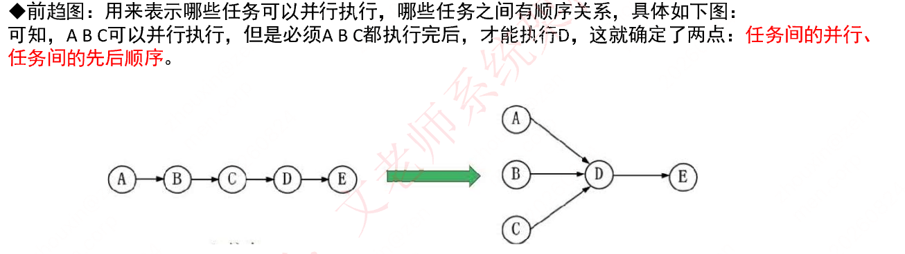
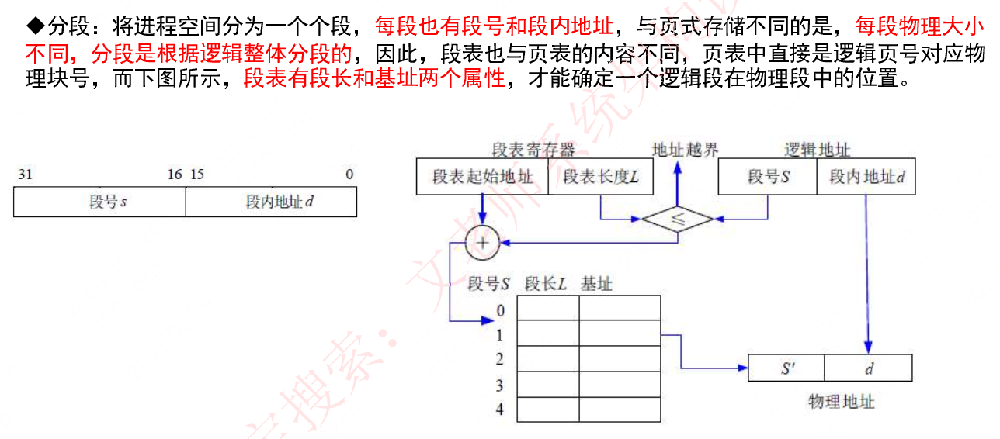
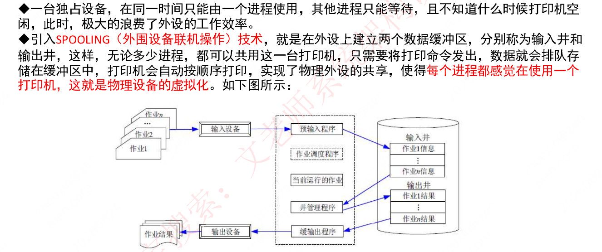

# 第二章 操作系统知识

## 知识点目录

1. 操作系统概述
2. 进程管理
   - 2.1 进程的组成和状态
   - 2.2 进程资源图
   - 2.3 进程间的同步与互斥
   - 2.4 进程调度
   - 2.5 死锁问题
   - 2.6 线程
   - 2.7 中断
3. 存储管理
   - 3.1 分区存储管理
   - 3.2 分页存储管理
   - 3.3 段式存储管理
   - 3.4 段页式存储管理
4. 设备管理
   - 4.1 概述
   - 4.2 I/O 软件
   - 4.3 虚设备和 SPOOLING 技术
   - 4.4 I/O 工作方式
5. 文件管理
   - 5.1 索引文件结构
   - 5.2 文件存储空间管理

> `章节分析`：本章每次考 3-5 分，对应第二版教材 2.3.2；改版教材删除了大量内容，但考试仍会考已删除的老版内容，`除教材内容，还需补充学习`。

## 1 操作系统概述

**定义与组成**

- OS = `计算机系统的资源管理者`：通过`CPU管理、存储管理、设备管理、文件管理`对各种资源合理分配。
- 组成 = `操作系统内核（Kernel）+ 其他附加配套软件`（GUI 程序、应用程序、实用程序、软件构件）。
- 内核 = `提供进程/存储/文件/设备四大管理功能的最基本部分`，为应用访问硬件提供服务。

**三个重要作用**

`管理计算机中运行的程序和分配各种软硬件资源`；`为用户提供友善的人机界面`；`为应用程序的开发和运行提供高效率平台`（另有辅导用户操作、处理软硬件错误、监控系统性能、保护系统安全）。

**4 个特征**

- `并发性`：宏观上多程序同时运行，单 CPU 环境下微观上每一时刻只有一个程序在执行。
- `共享性`：硬件和信息资源可被多个并发执行的进程（线程）共同使用。
- `虚拟性`：1 个物理实体 ↔ 多个逻辑对应物，或多个物理实体 ↔ 1 个逻辑对应物。
- `不确定性`：进程执行“走走停停”，不是一贯到底。

**5 大功能**

（1）`进程管理`（管理处理机“时间”：进程控制、同步、通信、调度）（2）`文件管理`（存储空间管理、目录管理、读/写管理、存取控制）（3）`存储管理`（管理主存“空间”：分配与回收、保护、地址映射（变换）、主存扩充）（4）`设备管理`（I/O 设备的分配、启动、完成、回收）（5）`作业管理`（任务、界面管理、人机交互、图形界面、语音控制、虚拟现实）。

**分类**

- `批处理`：单道/多道（主机与外设可并行）。
- `分时`：CPU 按`时间片`轮流为多终端服务。
- `实时`：快速反应、可靠性有保障、交互要求不高。
- `网络 OS`：共享网络资源；3 种模式：`集中模式、客户端/服务器模式、对等模式`。
- `分布式 OS`：多个分散计算机互联、`无主次之分`，是网络 OS 的更高级形式。
- `微机 OS`：Windows、Mac OS、Linux。

**嵌入式 OS**

- 特点：`微型化、可定制、实时性、可靠性（容错和防故障）、易移植性`（采用 HAL 硬件抽象层 + BSP 板级支撑包）。
- 初始化次序（自底向上、硬件到软件）：`片级初始化→板级初始化→系统初始化`。

## 2 进程管理

### 2.1 进程的组成和状态

- 组成 = `PCB（进程控制块，唯一标志）+ 程序（做什么）+ 数据（执行所需数据）`。
- 三态转换（需熟练掌握）：`运行→就绪`（时间片到）、`就绪→运行`（被调度）、`运行→阻塞`（等待某事件）、`阻塞→就绪`（等待的事件发生）。

### 2.2 进程资源图

- 表示`进程和资源之间的分配和请求关系`：p=进程、R=资源（方框内圆球数=资源个数）。
- 资源→进程箭头：该资源已`分配`给该进程；进程→资源箭头：该进程还需`请求`该资源。
- `阻塞节点`：所请求资源已全部分配完毕、无法继续（P2）；`非阻塞节点`：所请求资源还有剩余（P1、P3）。
- `所有进程都是阻塞节点 → 死锁状态`。

### 2.3 进程间的同步与互斥

- `临界资源`：各进程需以互斥方式访问的资源；`临界区`：对临界资源实施操作的那段程序代码。
- `互斥`：某资源同一时间只能由一个任务单独使用，需加锁（如打印机）；`同步`：多个任务并发执行、速度有差异而相互等待（如自行车和汽车）。
- `互斥信号量初值=1`；`同步信号量初值=共享资源的数量`。
- `P操作`（申请资源）：S=S-1；S>=0 继续执行；S<0 置阻塞并插入阻塞队列。
- `V操作`（释放资源）：S=S+1；S>0 继续执行；S<=0 唤醒一个阻塞进程插入就绪队列，V 进程继续。

**生产者-消费者问题（经典，默写概率高）**

三个信号量：`互斥 S0（仓库独立使用权）`、`同步 S1（仓库空闲个数）`、`同步 S2（仓库商品个数）`。

- 生产者：生产一个商品S → `P(S0) → P(S1) → 将商品放入仓库中 → V(S2) → V(S0)`
- 消费者：`P(S0) → P(S2) → 取出一个商品 → V(S1) → V(S0)`

### 2.4 进程调度

- `前趋图`：表示哪些任务可并行执行、哪些任务有顺序关系（例：A、B、C 并行，A B C 都执行完才能执行 D → 确定`任务间的并行、任务间的先后顺序`）。

- 调度方式：指`当有更高优先级的进程到来时如何分配CPU`，分`可剥夺`（强行把运行中进程的 CPU 分给高优先级进程）和`不可剥夺`（高优先级进程等待当前进程自动释放 CPU）。
- 三级调度（作业从提交到完成经历高、中、低三级）：
  - 高级 = 长调度 = 作业调度 = 接纳调度：决定`输入池中哪个后备作业可调入主系统`成为就绪进程，一个作业只经过一次。
  - 中级 = 中程调度 = 对换调度：决定`交换区中哪个就绪进程可调入内存`参与 CPU 竞争。
  - 低级 = 短程调度 = 进程调度：决定`内存中哪个就绪进程可占用CPU`，最活跃、最重要。
- 调度算法：`先来先服务 FCFS`（先到先分配，用于宏观调度）；`时间片轮转`（时间片大小相同、轮流使用，很公平，用于微观调度）；`优先级调度`（优先级大的先分配 CPU）；`多级反馈调度`（时间片轮转+优先级：多个就绪队列各有不同优先级和时间片长度，新进程进队列 1 末尾，执行不完转入队列 2 末尾，如此重复）。

### 2.5 死锁问题

- 死锁：进程等待永远不可能发生的事件；多个进程死锁 → 系统死锁。
- `死锁四个必要条件`：`资源互斥`、`占有并等待`（每个进程占有资源并等待其他资源）、`不可剥夺`（系统不能剥夺进程资源）、`环路`（进程资源图是一个环路）。
- `解决措施是打破四大条件`：
  - `死锁预防`：限制并发进程的资源请求，破坏四条件之一，使系统任何时刻都不满足死锁条件。
  - `死锁避免`：`银行家算法`（提前算出不致死锁的分配方案才分配，否则不分配）。
  - `死锁检测`：允许死锁产生，定时运行检测程序，检测到则设法解除。
  - `死锁解除`：死锁发生后的处理，如强制剥夺资源、撤销进程。
- `死锁资源计算`（公式常考）：n 个进程、每个进程需 R 个资源 → `发生死锁的最大资源数 = n*(R-1)`；`不发生死锁的最小资源数 = n*(R-1)+1`。

### 2.6 线程

- 传统进程两属性：`可拥有资源的独立单位` + `可独立调度和分配的基本单位`。
- 引入线程原因：进程创建/撤销/切换时空开销大、`进程数目不宜过多`，限制并发程度；于是两属性分离——`线程 = 调度和分配的基本单位`，`进程 = 独立分配资源的单位`。
- 线程是进程中的实体：`基本不拥有资源`（只有程序计数器、一组寄存器和栈）；`可与同进程的其他线程共享进程全部资源`（公共数据、全局变量、代码、文件等）；`不能共享线程独有资源`（如栈指针等标识数据）。

### 2.7 中断

- 四个概念：`中断`（事件出现 → 中止现行进程 → OS 处理事件 → 适当时候让被中止进程继续运行）；`中断源`（引起中断的事件）；`中断处理程序`（处理事件的程序）；`中断响应`（硬件中断装置暂停现行进程，中断处理程序占用处理器）。
- 5 类中断：`程序性中断`（浮点溢出、用户态用特权指令、内存越界、跟踪等）；`外中断`（时钟、操作员控制台、多处理机 CPU 间通信等）；`输入输出中断`（外部设备/通道操作正常结束或出错：打印完成、缺纸、无磁盘等）；`硬件故障中断`（电源故障、内存奇偶校验错等）；`访管中断`（系统调用：创建进程、I/O 传输、打开/关闭文件、读/写文件等）。
- 关联概念预告：OS `用户态、内核态`；`单体内核、微内核`。

## 3 存储管理

### 3.1 分区存储管理

- 分区存储组织 = `整存`：将某进程运行所需的内存整体一起分配给它，然后再执行。三种分区方式：
  - `固定分区`（静态）：主存划分为固定分区，分区大小与作业需求不同 → 产生`内部碎片`。
  - `可变分区`（动态）：作业转入时按需求大小划分，无内部碎片，但整片主存被切割成许多块 → 产生`外部碎片`。
  - `可重定位分区`：移动已分配区域使其连续，把细小碎片合并为大的分区；只在外部作业请求空间得不到满足时进行（解决碎片问题）。

### 3.2 分页存储管理

- `逻辑页分为页号和页内地址`（页内地址 = 物理偏移地址）；页号与物理块号并非按序对应，需查`页表`得物理块号，物理地址 = 物理块号 + 偏移地址。
- 优点：利用率高、碎片小、分配及管理简单；缺点：增加系统开销，可能产生`抖动现象`。

- 地址变换：逻辑地址 = 页号（31–12 位）+ 页内地址（11–0 位）；`页表地址寄存器 B`、`页表长度寄存器 L`；L≤页号 → 地址越界；否则页号查页表 → 物理块号 + 页内地址 → 物理地址（示例：(4, 256) → 页表[4]=15 → (15, 256)）。
- 页面置换算法：`OPT 最优算法`（理论上、无法实现，选未来最长时间内不被访问的页面置换，用来让其他算法比较差距）；`FIFO 先进先出`（先调入的先淘汰，产生抖动：分配的页数越多，缺页率可能越多）；`LRU 最近最少使用`（按局部性原理淘汰过去最少使用的页面，效率高且无抖动，使用大量计数器，但没有 LFU 多）。
- `淘汰原则`：优先淘汰最近未访问的，而后淘汰最近未被修改的页面。
- `快表` = 页表`存于 Cache`（`小容量相联存储器`，按内容访问、速度快，存放当前访问最频繁的少数活动页面的页号）；`慢表` = 页表存于内存。慢表需访问两次内存取出页，快表只需一次 Cache + 一次内存，更快。

### 3.3 段式存储管理

- `分段`：将进程空间分为一个个段，`每段也有段号和段内地址`；与页式不同：`每段物理大小不同`，`分段是根据逻辑整体分段的`。
- 段表与页表内容不同：页表直接是逻辑页号对应物理块号；`段表有段长和基址两个属性`，才能确定逻辑段在物理段中的位置。
- 地址变换：逻辑地址 = 段号 s（31–16 位）+ 段内地址 d（15–0 位）；先与段表长度 L 比较（越界则地址越界），段号查段表 → 段长和基址，物理地址 = 基址 S′ + 段内地址 d。

### 3.4 段页式存储管理

- `段页式`：对进程空间`先分段，后分页`。
- 优点：空间浪费小、存储共享容易、存储保护容易、能动态链接。
- 缺点：管理软件增加 → 复杂性和开销增加，所需硬件和占用内容增加，执行速度大大下降。
- 地址变换：逻辑地址 = 段号 S + 页号 P + 页内地址 W；先与段表长度 TL 比较（越界则地址越界），段号查段表 → 该段页表起始地址，页号查页表 → 物理块 b，物理地址 = b + W。

## 4 设备管理

### 4.1 概述

待补充。

### 4.2 I/O 软件

待补充。

### 4.3 虚设备和 SPOOLING 技术

- 独占设备同一时间只能由一个进程使用，其他进程只能等待，外设效率极低。
- `SPOOLING（外围设备联机操作）技术`：在外设上建立两个数据缓冲区，称为`输入井`和`输出井`；无论多少进程都可共用一台打印机，打印命令发出后数据排队存于缓冲区，打印机自动按顺序打印 → 实现物理设备共享，`每个进程都感觉在使用一个打印机，这就是物理设备的虚拟化`。

- 结构：作业 → 输入设备 → `预输入程序` → 输入井（作业1~n信息）；`作业调度程序`/`当前运行的作业`/`井管理程序`负责管理；输出井（作业1~n结果）→ `缓输出程序` → 输出设备 → 作业结果。

### 4.4 I/O 工作方式

I/O系统的5种工作方式：

- `程序控制方式`：`由CPU执行一段I/O程序来实现主机与外设之间的数据传输`，分两种：`无条件传送`（I/O端口总是准备好，`CPU无须查询外设的工作状态，而默认外设始终处于准备就绪状态`，随时用I/O指令访问端口）和`程序查询方式`（`要求CPU在程序中查询外设的工作状态`，`如果外设尚未准备就绪，CPU就循环等待`，就绪后才执行I/O指令）。
- `程序中断方式`：中断过程分5阶段：中断请求、中断判优、中断响应、中断处理、中断返回；`CPU无须等待也不必去查询I/O的状态`，中断响应时保存现场，转入I/O中断服务程序完成数据交换，再返回原主程序；比程序控制方式高效。
- `DMA工作方式`：为`主存与外设之间实现高速、批量数据交换`而设置，使用`DMA控制器（DMAC）`控制和管理数据传输；DMAC与CPU共享系统总线，具有独立访问存储器的能力。
- `通道方式`：通道是`高级的I/O控制部件`，用软件手段实现I/O控制和传送，免去CPU介入，`使主机和外设的并行工作程度更高`。分3种：`字节多路通道`（`简单的共享通道`，连接管理多台低速设备）；`选择通道`（高速通道，`在一段时间内通道只能选择一台设备进行数据传输`，该设备独占整个通道）；`数组多路通道`（`把字节多路通道和选择通道的特点结合起来`，多个子通道，可分时共享总通道或成组传送数据）。
- `I/O处理机`（外围处理机）：具有`丰富的指令系统和完善的中断系统`，专用于大型高效计算机系统的I/O，利用共享存储器与主机交换信息，结构接近一般处理机，可有自己的局部存储器。

## 5 文件管理

### 5.1 索引文件结构

- 13个索引结点（0~12）：0-9为`直接索引`（`每个索引节点存放的是内容`），每个物理盘4KB → 共存`4KB*10=40KB`。
- 10号 = `一级间接索引结点`（大小4KB）：存放`并非直接数据，而是链接到直接物理盘块的地址`；每个地址4B → 1024个地址 → 对应1024个物理盘 → 可存`1024*4KB=4096KB`。
- 11号 = 二级间接索引结点：直接盘存放一级地址，一级地址再存放物理盘块地址，再链接数据块；容量再扩大一个数量级 → `1024*1024*4KB`。
- 12号 = 三次间接索引结点。

### 5.2 文件存储空间管理

- 文件存取方法 = `指读/写文件存储器上的一个物理块的方法`：`顺序存取`（按顺序依次读/写）/`随机存取`（按任意次序随机读/写）。
- 外存空闲空间管理 4 种方法：
  - `空闲区表`：连续未分配区域=空闲区，每个空闲区一个表项，适用于连续文件结构。
  - `位示图（Bitmap）`：`每一位对应一个物理块，0=空闲、1=占用`。
  - `空闲块链`：每个空闲块含指向下一空闲块的指针构成链表，头指针放在存储器特定位置（如管理块），不需要磁盘分配表，节省空间。
  - `成组链接法`：空闲块分组（如每100块一组），每组第一个空闲块登记下一组的物理盘块号和空闲块总数；第一个空闲块号=0 表示该组是最后一组。
