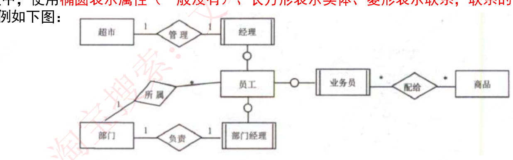
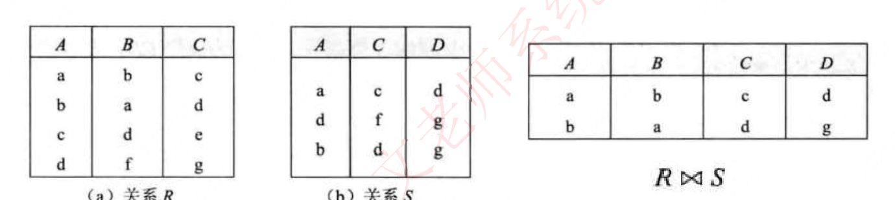
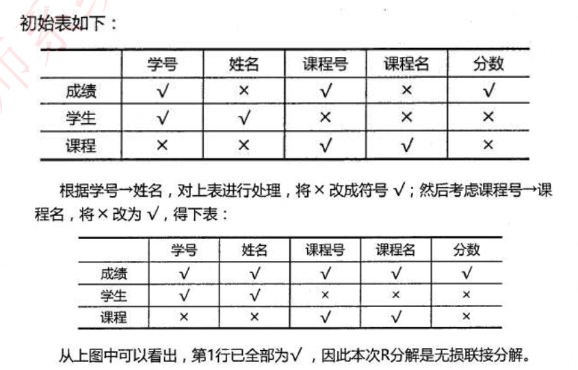
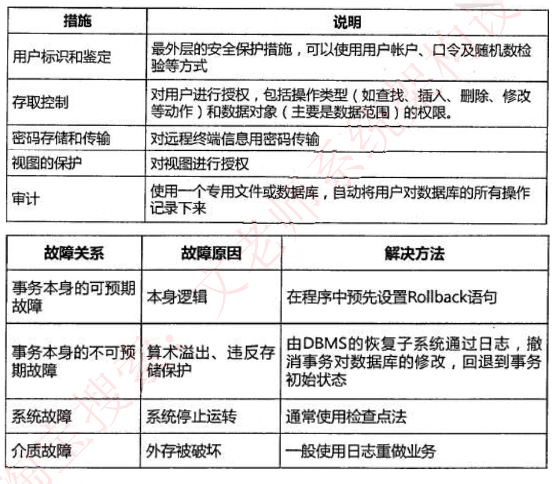
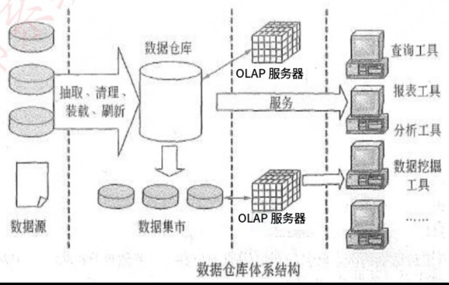

# 第三章 数据库

> 比前两章重要。考选择题，案例基本都会考一题，不过是选做。本章每年考 3-5 分左右，案例一道选做题；第二版教材对应 2.3.3 及第 6 章，主要考点在第 6 章（已合并进本章视频），主要改动在数据设计和新增的 NoSQL。

## 知识点目录

1. 三级模式—两级映像
2. 数据库的设计
3. E-R 模型
4. 关系代数运算
5. 关系数据库的规范化
   - 5.1 函数依赖
   - 5.2 键和约束
   - 5.3 范式
   - 5.4 模式分解
   - 5.5 并发控制基本概念
   - 5.6 事务管理
   - 5.7 封锁协议
6. 数据故障与备份
   - 6.1 安全措施
   - 6.2 数据故障
   - 6.3 数据备份
7. 分布式数据库
8. 数据仓库与数据挖掘
9. 反规范化技术
10. NoSQL 数据库
11. SQL 语言

## 1 三级模式—两级映像

- **三级模式**（图中自上而下）：
  - `外模式`：视图级，表经处理后提供给用户使用。
  - `模式`（概念模式）：概念层，通常使用的基本表。
  - `内模式`：物理层，对应具体物理存储文件。
- **两级映像**（考点：只需改映射，不必改应用程序）：
  - `外模式—模式映像`：表与视图之间的映射，存在于概念级和外部级之间；表数据修改时只改此映射。
  - `模式—内模式映像`：表与物理存储之间的映射，存在于概念级和内部级之间；存储方式改变时只改此映射。


## 2 数据库的设计

- **设计六阶段**（记住各阶段产出物）：
  1. `需求分析`：产出数据流图、数据字典、需求说明书；三个要求：信息、处理、系统。
  2. `概念结构设计`：设计 E-R 图。步骤：选择局部应用 → 逐一设计分 E-R 图 → 合并。
  3. `逻辑结构设计`：E-R 图 → 关系模式。步骤：确定数据模型、转换、确定完整性约束和用户视图。
  4. `物理设计`：确定数据分布、存储结构和访问方式。
  5. `数据库实施`：建库、编制调试程序、数据入库、试运行。
  6. `运行和维护`：不断评价、调整与修改。
- **分 E-R 图合并的 3 类冲突**（高频考点）：
  - `属性冲突`：同一属性出现在不同分 E-R 图中。
  - `命名冲突`：同义不同名，或同名不同义。
  - `结构冲突`：同一对象在一图中被抽象为实体、另一图中被抽象为属性。


## 3 E-R 模型

- **数据模型分类**：
  - `关系模型`：二维表形式表示的实体-联系模型（由 E-R 模型转换而来，开发人员设计）。
  - `概念模型`：用户角度建模，现实世界到信息世界的第一抽象，真正的实体-联系模型。
  - 网状模型：事物之间相互联系，形成一张网。
  - 面向对象模型：以对象为单位，含属性和方法，有类和继承。
- **数据模型三要素**：`数据结构`、`数据操作`、`数据的约束条件`（完整性规则）。
- **E-R 图符号**（要能认图）：
  - `椭圆` = 属性（一般没有）
  - `长方形` = 实体
  - `菱形` = 联系，`联系两端填写联系类型`



- **基本概念**：
  - 实体 = `客观存在并可相互区别的事物`（具体或抽象）；弱实体依赖强实体存在。
  - 实体集 = 同类型、共享相同属性的实体集合（学生、课程）。
  - 属性 = `实体所具有的特性`；分类：简单/复合、单值/多值、NULL、派生。
  - 域 = 属性的取值范围；`码（key）` = 唯一标识实体的属性集。
  - 联系 = `事物内部以及事物之间的联系`；联系类型：`1:1、1:N、M:N`；可有 `两个以上实体型的联系`（如课程-讲授-教师-参考书）。


- **E-R 图 → 关系模型**（高频考点）：
  - `每个实体对应一个关系模式`；逻辑结构是 `二维表`，表格表达实体集，`外键` 标识实体间联系。
  - 1:1 → 可 `放到任意一端实体中作为一个属性`（保证两端关联），或单独关系模式。
  - 1:N → 可单独关系模式，或 `在 N 端加入 1 端实体的主键`。
  - M:N → `必须单独关系模式，主键为 M 端和 N 端主键的联合`。


## 4 关系代数运算（必考）

| 运算 | 符号 | 说明 |
| ---- | ---- | ---- |
| 并 | ∪ | 两表记录合并，相同记录只显示一次 |
| 交 | ∩ | 两表相同的记录 |
| 差 | − | S1−S2：S1 中有而 S2 没有的记录 |
| 笛卡尔积 | × | 两个关系所有元组的组合，结果列为 S1+S2 列，记录数 = S1×S2 |
| 投影 | π | 选取指定列（列可用数字表示） |
| 选择 | σ | 选取满足条件的行（某条记录） |
| 自然连接 | ⋈ | 在公共属性上等值连接并去重列 |

- `自然连接的结果显示全部的属性列，但是相同属性列只显示一次，显示两个关系模式中属性相同且值相同的记录`。




## 5 关系数据库的规范化

### 5.1 函数依赖

- **函数依赖**：给定 X 能唯一确定 Y，记作 X→Y（Y 依赖于 X），如 Y=X*X。
- **部分函数依赖**：`(A,B) 中的一部分（即 A）可以确定 C`，称为部分函数依赖。
- **传递函数依赖**：A、B 不等价时，`A 可确定 B，B 可确定 C，则 A 可确定 C`；若 A、B 等价，则不算传递依赖。
- **Armstrong 公理系统**（R<U,F>）：
  - 自反律：Y⊆X⊆U ⇒ X→Y。
  - 增广律：X→Y 且 Z⊆U ⇒ XZ→YZ。
  - 传递律：X→Y 且 Y→Z ⇒ X→Z。
  - 合并规则：X→Y 且 X→Z ⇒ X→YZ。
  - 伪传递率：X→Y 且 WY→Z ⇒ XW→Z。
  - 分解规则：X→Y 且 Z⊆Y ⇒ X→Z。


### 5.2 键和约束

- **超键**：能 `唯一标识` 表的属性组合。
- **候选键**：超键 `去掉冗余的属性` 后的最小属性组合。
- **主键**：`任选一个候选键` 作为主键。
- **外键**：`其他表中的主键`。
- **主属性**：`候选键内的属性为主属性`，其余为非主属性。
- **实体完整性**：`主键约束，主键值不能为空，也不能重复`。
- **参照完整性**：`外键必须是其他表中已经存在的主键的值，或者为空`。
- **用户自定义完整性**：`自定义表达式约束`，如年龄必须在 0～150 之间。

### 5.3 范式

- **1NF**：`关系中的每一个分量必须是一个不可分的数据项`。
- **2NF**：在 1NF 基础上，`每一个非主属性完全函数依赖于任何一个候选码`，即非主属性不能只依赖复合主键的一部分。
  - 学生表中，学号不能完全确定课程号和成绩，因此不满足 2NF。
  - 分解为：学生（学号，学生姓名，系名，系主任）+ 选课（学号，课程号，成绩）。
- **3NF**：在 1NF 基础上，`表中不存在非主属性对码的传递依赖`。
  - 学号→系名→系主任，存在传递依赖，不满足 3NF。
  - 分解为：学生（学号，学生姓名，系名）+ 系（系名，系主任）+ 选课（学号，课程号，成绩）。
- **BCNF**：在 3NF 基础上进一步消除主属性对码的部分函数依赖和传递依赖；核心判断：`每一个依赖的左边决定因素都必然包含候选键`。
  - 例：S→T、S→J、T→J；当（S，J）为候选键时，T→J 的左部不含候选键，因此不满足 BCNF。
  - 修正：将 T→J 改为 TS→J。


- **4NF**：处理多值依赖 X→→Y。若 R∈1NF，且每个非平凡多值依赖的左部都包含候选键，则 R∈4NF。
- 仅考虑函数依赖时，最高规范化程度是 `BCNF`；考虑多值依赖时，最高规范化程度是 `4NF`。
- **4NF 示例**：TELEPHONE（CUSTOMERID，PHONE，CELL）中，PHONE 和 CELL 相互独立且都可能有多个值，会违反 4NF；拆分为 NEW_PHONE（CUSTOMERID，NUMBER，TYPE）。实际应用中通常不要求达到 4NF。

| CUSTOMERID | PHONE | CELL |
| --- | --- | --- |
| 1000 | 8828-1234 | 149088888888 |
| 1000 | 8838-1234 | 149099999999 |

### 5.4 模式分解

- **目的**：拆分具有部分函数依赖、传递依赖的属性，逐步优化关系模式。
- **保持函数依赖**：分解后的关系模式仍能保持原依赖集。例：`R(A,B,C)`，`F={A→B, B→C, A→C}` 分解为 `R1(A,B)`、`R2(B,C)`；A→C 是传递产生的冗余依赖，不必单独保留。
- **判断**：充分条件是每个依赖的左右属性都出现在同一个分解模式中；若不能直接判断，再用闭包迭代算法验证。
- **无损分解**：分解后可以还原原关系。二元分解的条件为：`R1∩R2→(R1-R2)` 或 `R1∩R2→(R2-R1)`；两个以上关系模式使用表格法。

表格法示例：成绩（学号，姓名，课程号，课程名，分数）分解为成绩（学号，课程号，分数）、学生（学号，姓名）、课程（课程号，课程名），依次应用学号→姓名、课程号→课程名，若第一行最终全为 √，则为无损连接分解。



- 例题：`F={A→B, B→C}`，分解为 `R1(A,B)`、`R2(A,C)`，幻灯片答案为 D：无损连接但不保持函数依赖。
- 另一例题幻灯片答案依次为 `D`、`A`。

### 5.5 并发控制基本概念

- **事务四特性 ACID**：原子性（全做或全不做）、一致性（事务前后数据保持一致）、隔离性（事务过程对其他事务不可见）、持续性（提交结果持续保存）。
- **并发控制**：控制不同事务并发执行以提高效率，重点解决三类异常：丢失更新、不可重复读、读脏数据。


### 5.6 事务管理

- 通过封锁等机制协调并发事务，保证事务的 ACID 特性。

### 5.7 封锁协议

- **X 锁（排它锁/写锁）**：事务持有时可读写，其他事务不能再加任何锁。
- **S 锁（共享锁/读锁）**：事务只能读，其他事务可继续加 S 锁但不能修改。
- **一级封锁协议**：修改前加 X 锁，事务结束才释放；解决丢失更新。
- **二级封锁协议**：一级基础上，读前加 S 锁，读完释放；解决丢失更新、读脏数据。
- **三级封锁协议**：读前加 S 锁，事务结束才释放；解决丢失更新、读脏数据、不可重复读。


## 6 数据故障与备份

### 6.1 安全措施

- 安全措施：用户标识和鉴定、存取控制、密码存储和传输、视图保护、审计。

### 6.2 数据故障

- 事务可预期故障：程序中设置 Rollback。
- 事务不可预期故障：通过日志撤销修改，恢复到事务初始状态。
- 系统故障：通常使用检查点法。
- 介质故障：一般使用日志重做业务。



### 6.3 数据备份

- **静态转储/冷备份**：转储期间不允许访问或修改数据库，速度快但只能恢复到某一时间点。
- **动态转储/热备份**：转储期间允许访问和修改，可并发执行，但对操作正确性要求高。
- **完全备份**：备份所有数据。
- **差量备份**：备份上一次完全备份后的变化数据。
- **增量备份**：备份上一次备份后的变化数据。
- **日志文件**：记录事务开始、结束及每次插入、删除、修改；故障时用于撤销事务修改。

## 7 分布式数据库

- **定义**：局部数据库位于不同物理位置，用**一个全局 DBMS** 联网统一管理，即分布式数据库。
- **分片模式**（考点：区分"记录"还是"列"）：
  - `水平分片`：把表中**水平的记录**分别存放不同地方。
  - `垂直分片`：把表中**垂直的列值**分别存放不同地方。
- **分布透明性**（用户/应用对存储细节无感知，4 种）：
  - `分片透明性`：不需知道表如何分块存储。
  - `位置透明性`：不关心数据存储物理位置的改变。
  - `逻辑透明性`：无需知道局部用哪种数据模型。
  - `复制透明性`：不关心复制的数据从何而来。


## 8 数据仓库与数据挖掘

- **数据仓库定义**（记 4 个定语）：`面向主题、集成、非易失、随时间变化`的数据集合，用于**支持管理决策**。
- **结构四层次**：
  1. `数据源`——基础，整个系统的数据源泉。
  2. `数据的存储与管理`——核心。
  3. `OLAP 服务器`——集成分析数据，按多维模型组织，支持多角度、多层次分析并发现趋势。
  4. `前端工具`——报表、查询、数据分析、数据挖掘及基于仓库/集市的应用开发工具。
- **BI 系统四阶段**：`数据预处理` → `建立数据仓库` → `数据分析` → `数据展现`。
  - 数据预处理 = `ETL`：抽取 Extraction、转换 Transformation、加载 Load。
  - 数据分析 = OLAP + 数据挖掘：OLAP 提供`切片、切块、下钻、上卷、旋转`等分析；数据挖掘用关联分析、聚类、分类建立模型，预测趋势和问题。
  - 数据展现：保障分析结果的`可视化`。



## 9 反规范化技术

- **目的**：规范化后`牺牲部分规范化来提高性能`（与规范化目标相反）。
- **益处**：降低连接操作需求、减少外码和索引数目、可能减少表数目，提高查询效率。
- **代价**：数据`重复存储`浪费磁盘；`完整性问题`使维护变复杂、`降低修改速度`。
- **五种具体方法**（记"增增重组两分割"）：
  1. 增加冗余列：多表保留相同列，减少/避免连接。
  2. 增加派生列：加可由本表或他表数据计算的列，避免连接和集合函数。
  3. 重新组表：常连接的两表合并成一张表。
  4. 水平分割表：按一列/多列值把数据拆到多个独立表（大表、数据独立、多介质）。
  5. 垂直分割表：主键+部分列一张表、主键+其余列另一张表，减少 I/O。

## 10 NoSQL 数据库

### 10.1 第三代数据库系统

传统层次、网状和关系数据库主要面向商业事务处理，面对新型应用和复杂数据类型时逐渐暴露出局限。数据管理因此出现了面向对象、语义、`XML`、半结构化等数据模型。

`NoSQL（Not Only SQL）` 是典型的新型数据库运动：

- 1998 年，`NoSQL` 最早用于 Carlo Strozzi 开发的轻量、开源关系数据库，该数据库不提供 `SQL` 功能。
- 2009 年，`NoSQL` 进一步指向非关系型、分布式、不提供 `ACID` 保证的数据库设计模式。
- `NoSQL` 通常强调非关系型数据库在 `Key-Value Stores`、文档数据库等场景中的优势，并非单纯反对 `RDBMS`。
- 随着 `Web 2.0`、超大规模、高并发 `SNS` 网站的发展，传统关系数据库在扩展性和并发处理方面面临挑战，`NoSQL` 因而得到快速发展。

**核心定位**：`NoSQL` 面向大规模数据集合和多种数据类型，重点解决大数据应用中的存储与处理问题。

### 10.2 NoSQL 分类（按存储方式，4 类）

| 分类 | 典型产品 | 场景 | 优点 | 缺点 |
| ---- | ---- | ---- | ---- | ---- |
| 文档存储 | MongoDB、CouchDB | Web 应用、面向文档/半结构化数据 | 结构灵活，按 value 建索引 | 无统一查询语法、无事务 |
| 键值存储 | Memcached、Redis | 内容缓存（会话、配置、参数） | 扩展性好、灵活、大量操作性能高 | 无结构化，按键查值（字符串/二进制） |
| 列存储 | BigTable、HBase、Cassandra | 分布式数据存储和管理 | 可扩展性强、查找快、复杂性低 | 不支持事务强一致性 |
| 图存储 | Neo4j、OrientDB | 社交网络、推荐系统、系统图谱 | 支持复杂图形算法 | 复杂性高、只支持一定数据规模 |

### 10.3 NoSQL 数据结构类型（4 种）

- **列式存储**：行式 = 传统关系型（一条记录所有属性存一行）；`列式按列组织存储`，每个表由一组页链组成，每条页链对应一个存储列。
- **键值对存储**：典型数据结构是`数组链表`——先 Hash 求 Hashcode 定位数组位置，再插入链表。
- **文档型**：`同键值对存储类似`，数据模型是版本化文档，半结构化文档以 JSON 等特定格式存储。
- **图数据库**：`使用灵活的图形模型，可扩展到多服务器`；NoSQL 没有标准 SQL，查询需指定数据模型。
- **共同特征**（4 点）：`易扩展`（无关系）、`大数据量高性能`（结构简单）、`灵活数据模型`（无需预建字段）、`高可用`（复制模型）。

### 10.4 NoSQL 分层架构（自下而上 4 层）

1. `数据持久层`：定义数据存储形式——基于内存/硬盘/内存和硬盘接口/订制可插拔。
2. `数据分布层`：定义数据如何分布——CAP 支持（水平扩展）、多数据中心支持、动态部署支持（运行中集群动态增删结点）。
3. `数据逻辑模型层`：数据的逻辑表现形式。
4. `接口层`：为上层应用提供数据调用接口，选择多于关系型数据库。

- 分层 ≠ 每层只有一种选择，每种数据库在不同层面可支持多种特性（灵活性和兼容性）。
- **适用场景**：数据模型简单、需要更强灵活性、性能要求高、不需要高度数据一致性、给定 key 易映射复杂值。

### 10.5 CAP 理论与 BASE（高频考点）

- **CAP**：一致性 Consistency、可用性 Availability、分区容忍性 Partition tolerance，`最多三选二`。
  - 一致性：操作后系统仍保持一致，所有结点同一时刻数据相同。
  - 可用性：所有操作都有成功返回，任何请求都有响应。
  - 分区容忍性：网络故障把网络切成分区时，`若允许系统继续工作`即可容忍。
- **BASE**：ACID 的变种，弱一致性，只要求`最终一致性`：
  - Basic Availability `基本可用`；Soft State 软状态（"无连接"）；Eventual Consistency `最终一致性`。
- **选择关系**：选 `CP` → 考虑 ACID；选 `AP` → 考虑 BASE；选 `CA` → 网络分区时不能进行完整操作。

## 11 SQL 语言

- **关键字不区分大小写**。
- **DDL 四件套 + 两个对象**：
  - 建表 `create table`（`primary key()` 指定主键、`foreign key()` 指定外键）
  - 改表 `alter table`（如 `ALTER TABLE S ADD Zap CHAR(6)`）
  - 删表 `drop table`
  - 索引 `index`（如 `CREATE UNIQUE INDEX S-SNO ON S(Sno)`）、视图 `view`（`CREATE VIEW CS-STUDENT`）
- **DML 三操作**：
  - 插入 `insert into...values()`
  - 删除 `delete from...where`
  - 修改 `update...set...where`
- **SELECT 语句**（执行顺序记：FROM → WHERE → GROUP BY → HAVING → SELECT → ORDER BY）：

```text
SELECT [ALL|DISTINCT]<目标列表达式>… FROM <表名>[,<表名>]
  [WHERE <条件表达式>] [GROUP BY <列名1>[HAVING<条件表达式>]]
  [ORDER BY <列名2>[ASC|DESC]…]
```

  - `distinct`：去重，只保留一条。
  - `group by` 分组时 select 后的列名要适应分组；`having` 给分组结果附加条件（如 `having avg(score)>60`）。
  - 列改名 `as`：`select sno as "学号" from t1`。
  - 模糊匹配 `like`：`%` 匹配多个字符，`_` 匹配任意一个字符（`sname like 'a_'`）。
  - `order by` 默认升序，降序加 `desc`。
- **集合运算**：`UNION` = 或（任一结果集存在即选出）；`INTERSECT` = 与（同时存在才选出）。
- **聚合函数**：`MIN、AVG、MAX`（分组查询时使用）。


