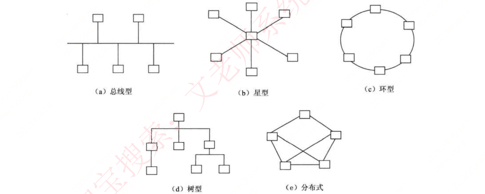

# 第五章 计算机网络

> 本章每年考 3-5 分左右。

## 知识点目录

1. 网络概述和模型（第二版教材 2.5 内容）
   - 1.1 网络功能和分类
   - 1.2 通信技术与信道
   - 1.3 信号处理与复用多址
   - 1.4 网络分类
   - 1.5 局域网和广域网
   - 1.6 OSI 七层模型
   - 1.7 TCP/IP 协议
   - 1.8 协议端口号
   - 1.9 交换技术
   - 1.10 路由技术
   - 1.11 网络工程
   - 1.12 通信方式和交换方式
2. 补充：IP 地址
   - 2.1 分类地址格式
   - 2.2 子网划分
   - 2.3 无分类编址
3. 补充：IPv6
4. 补充：网络存储技术
   - 4.1 磁盘冗余阵列
   - 4.2 网络存储

## 1 网络概述和模型

### 1.1 网络功能和分类

- **定义**：`利用通信线路将地理上分散、具有独立功能的计算机系统和通信设备`连接起来，`依靠网络软件及通信协议实现资源共享和信息传递`的系统。
- 网络技术涵盖 4 方面：通信技术、网络技术、组网技术、网络工程。
- **5 大功能**：数据通信、资源共享、管理集中化、分布式处理、负载均衡。
- **6 个性能指标**（高频考点，注意单位）：
  - `速率`：数字信道上传送数据的速率，单位 `b/s（比特每秒）`。
  - `带宽`：① 信号频带宽度（单位 `赫兹`）；② 网络线路的"最高数据率"（单位 `b/s`）。
  - `吞吐量`：单位时间内通过网络/信道/接口的数据量。
  - `时延`（延迟）：数据（报文/分组/比特）从链路一端传到另一端所需时间。
  - `往返时间`：发送方发出数据 → 收到接收方确认 的总时间。
  - `利用率`：信道利用率（信道被利用的概率，百分数，空闲为 0）；网络利用率（全网络信道利用率的加权平均）。
- **非性能指标**：费用、质量、标准化、可靠性、可扩展性、可升级性、易管理性、可维护性。

### 1.2 通信技术与信道

- 通信技术 = 计算机网络`基础`：将数据从一个结点到另一结点传送；数据 = `模拟信号和数字信号`，经信道传输。
- **信道**：`物理信道`（传输介质+设备；无线/有线）vs `逻辑信道`（收发端间的虚拟线路，可有/无连接，以物理信道为载体）。
- **信息传输链路**：信源 → 发信机（编码+调制）→ 信道 → 收信机（解调+译码）→ 信宿。
- **奈奎斯特定理**（极限速率）：最大码元速率 `B = 2W`（Baud）；一个码元携带 `n = log₂N` 位（N=2ⁿ）；`仅当码元取两个离散值时，数据速率 = 波特率`。
- **香农定理**（有噪声极限速率）：`C = Wlog₂(1+S/N)`；信噪比分贝 `dB = 10log₁₀(S/N)`。
- 相同信道容量下可权衡：用"较大带宽+较低信噪比"或"较小带宽+较高信噪比"。

### 1.3 信号处理与复用多址

- **发信机处理链**：信源编码（模拟→数字）→ 信道编码（加冗余检错纠错）→ 交织（连续误码→零星误码）→ 脉冲成形（合适波形）→ 调制（加载到高频载波）。
- **收信机处理**：与发信机相反——解调、采样判决、去交织、信道译码、信源译码。
- **复用**（一条信道传多路数据）：TDM 时分、FDM 频分、CDM 码分。
- **多址**（一条线传多用户数据，接收端分离）：TDMA、FDMA、CDMA。
- **5G 的 8 个特征**：OFDM 优化的波形和多址接入、可扩展 OFDM 间隔参数、OFDM 加窗、灵活框架、`大规模 MIMO（最多 256 根天线）`、`毫米波（>24GHz）`、频谱共享、先进信道编码（LDPC、Polar 码）。

### 1.4 网络分类（按分布范围）

| 分类 | 缩写 | 距离 | 范围 | 传输速率 |
| ---- | ---- | ---- | ---- | ---- |
| 局域网 | LAN | 10m/100m/1000m | 房间/楼宇/校园 | 4Mbps～1Gbps |
| 城域网 | MAN | 10km | 城市 | 50Kbps～100Mbps |
| 广域网 | WAN | 100km 以上 | 国家或全球 | 9.6Kbps～45Mbps |

### 1.5 局域网和广域网

- **局域网 5 种拓扑**（记特征）：
  - 总线型：利用率低、干扰大、价格低
  - 星型：交换机形成、中央单元负荷大
  - 环型：流动方向固定、效率低扩充难
  - 树型：总线型的扩充、分级结构
  - 分布式：任意节点连接、管理难成本高

- **以太网（IEEE 802.3）**：802.3 标准 10Mb/s 细同轴电缆；`802.3u` 快速 100Mb/s 双绞线；`802.3z` 千兆 1000Mb/s 光纤或双绞线；`802.3ae` 万兆 10Gb/s 光纤。
- **以太帧**：目的 MAC、源 MAC、长度/类型、数据填充、校验（FCS）；`最小帧长 64 字节`。
- **WLAN = IEEE 802.11**；3 种拓扑：点对点型（节点对等）、HUB 型（中心+外围）、完全分布型（理论阶段）。
- **广域网 4 项技术**：SONET 同步光网络（光纤数字化通信）、DDN 数字数据网（半永久连接电路）、FR 帧中继（数据包交换）、ATM 异步传输（以信元为基础的面向连接分组交换和复用）。
- **广域网 3 特点**：面向数据通信的服务；覆盖广、距离远、无固定拓扑；电信部门/公司组建管理维护、有偿服务。
- **广域网 3 类**：公共传输网络（政府电信组建；电路交换/分组交换）、专用传输网络（组织自建，主要是 DDN，租用期独占带宽）、无线传输网络（移动无线网：GSM、TD-SCDMA/WCDMA/CDMA2000、LTE、5G）。
- **城域网**：单个城市范围；标准 `DQDB（IEEE 802.6）`；光缆、速率 100Mb/s 以上、时延小。
- **城域网 3 层**：核心层（高带宽承载、互联互通、高速调度）→ 汇聚层（业务数据汇聚/分发、服务等级分类）→ 接入层（多种接入技术、带宽和业务分配、用户接入）。
- **5G 基本特征**：高速率（峰值 >20Gb/s，4G 的 20 倍）、低时延（50ms→1ms）、海量设备连接（1000 亿量级）、低功耗（基站节能、终端省电）。
- **5G 主要特征**：`服务化架构`、`网络切片`（单个物理网络切分多个逻辑网络）。

### 1.6 OSI 七层模型（必背表）

| 层 | 功能要点 | 单位 | 典型协议 | 设备 |
| ---- | ---- | ---- | ---- | ---- |
| 物理层 | `链路上透明地传输位`（机械/电气/功能/规程特性） | 比特 | RS-232、RS-449、V.35、RJ-45、FDDI | 中继器、集线器 |
| 数据链路层 | 不可靠信道→可靠信道；帧传输、差错/流量控制 | 帧 | HDLC、PPP、IEEE802、ATM | 交换机、网桥 |
| 网络层 | 路由选择、拥塞控制、传送包（通信子网层） | IP 分组 | IP、ICMP、IGMP、ARP、RARP | 路由器 |
| 传输层 | 端—端可靠透明传输 | 报文段 | TCP、UDP | 网关 |
| 会话层 | 进程间建立/管理/终止会话、同步与恢复 | — | RPC、SQL、NFS | 网关 |
| 表示层 | 数据转换（格式转换、压缩、加密） | — | JPEG、ASCII、GIF、MPEG、DES | 网关 |
| 应用层 | 向用户提供各种服务（E-mail 等） | 数据 | Telnet、FTP、HTTP、SMTP、POP3、DNS、DHCP | 网关 |

- **设备记忆**：1 层中继器/集线器、2 层交换机/网桥、3 层路由器、4 层及以上网关。

### 1.7 TCP/IP 协议

- **协议三要素**：`语法`（规定传输数据的格式）、`语义`（规定要完成的功能）、`时序`（规定操作的条件与顺序关系）。
- **TCP/IP 四层**（记每层协议）：
  - 应用层：POP3、FTP、HTTP、Telnet、SMTP、Samba、CIFS、NFS、DHCP、TFTP、SNMP、DNS
  - 传输层：TCP、UDP
  - Internet 层：IP、ICMP、IGMP、ARP、RARP
  - 网络接口层：以太网、令牌环、帧中继、ATM
- 与 OSI 对应：TCP/IP 应用层 = OSI 应用+表示+会话；Internet 层 = OSI 网络层；网络接口层 = OSI 数据链路+物理。
- **网络层协议**：
  - IP：核心协议；`无连接、不可靠` 地传送数据报。
  - ICMP：传递网络本身的控制消息（通不通、主机可达、路由可用）。
  - `ARP：IP 地址→物理地址；RARP：物理地址→IP 地址`（方向别记反）。
  - IGMP：组管理协议，支持组播（向相邻多目路由器报告多目组成员）。
- **传输层协议**（对比记忆，高频）：
  - TCP：重发技术；`可靠、面向连接、全双工`；数据量少、可靠性要求高。
  - UDP：`不可靠、无连接`、速率高；数据量大、可靠性要求不高、要求速度快。
- **应用层协议**：基于 TCP = 可靠传输（FTP/HTTP/SMTP/POP3/Telnet/Samba/CIFS/NFS）；基于 UDP = 不可靠传输（DHCP/DNS/TFTP/SNMP）。
  - FTP：可靠的文件传输，控制文件双向传输。
  - HTTP：WWW 超文本传输；SSL 加密后 = `HTTPS`。
  - SMTP 和 POP3：邮件发送/接收规则，报文为 ASCII 格式。
  - Telnet：远程登录的标准协议。
  - TFTP：不可靠、开销小的文件传输。
  - SNMP：网络管理（应用层协议 + 数据库模型 + 资源对象），监测网络上的设备。
  - DHCP：基于 UDP、C/S 模型，动态分配 IP：`固定分配、动态分配、自动分配`。
  - DNS：域名 → IP 解析。

### 1.8 协议端口号（必背）

| 端口 | 服务 | 端口 | 服务 |
| ---- | ---- | ---- | ---- |
| 20 | FTP（数据） | 80 | HTTP |
| 21 | FTP（控制） | 110 | POP3 |
| 23 | Telnet | 69 | TFTP |
| 67 | DHCP（服务端） | 68 | DHCP（客户端） |
| 25 | SMTP | 161 | SNMP（轮询） |
| 53 | DNS | 162 | SNMP（陷阱） |

- 记忆串：FTP 20/21、Telnet 23、SMTP 25、DNS 53、TFTP 69、DHCP 67/68、HTTP 80、POP3 110、SNMP 161/162。

### 1.9 交换技术（交换机）

- **交换机 4 大功能**：集线（大量端口、部署星型拓扑）、中继（转发帧时重新产生不失真电信号）、桥接（相同转发和过滤逻辑）、`隔离冲突域`（每个冲突域独立带宽，提高利用率）。
- **交换机工作 4 件事**：
  1. 转发路径学习：源 MAC → 端口映射，写入 MAC 地址表
  2. 数据转发：目的 MAC 查表命中 → 向对应端口转发
  3. 数据泛洪：目的 MAC 未命中 → 向所有端口转发；广播/组播帧向所有端口转发（不含源端口）
  4. 链路地址更新：MAC 地址表定时更新（如 300s）

### 1.10 路由技术（路由器）

- **路由器 7 项功能**：异种网络互连、子网协议转换、数据路由、速率适配（缓存+流控）、隔离网络（防广播风暴、防火墙）、报文分片和重组（超 MTU 分片、到达后重组）、备份/流量控制（主备切换）。
- 路由器工作在 `网络层（第 3 层）`：接收数据包 → 查 `路由表` → 转发到下一跳；路由表可 `静态配置` 或动态路由协议自动生成。
- **路由协议分两类**：
  - IGP 内部网关协议（AS 内部）：距离矢量（小型网络）/ 链路状态（大型网络，`IS-IS`、`OSPF`）
  - EGP 外部网关协议（AS 之间）：早期 EGP → `BGP`（IETF 制定的标准边界网关协议）

### 1.11 网络工程

- 三环节：`网络规划 → 网络设计 → 网络实施`。
- 规划：以需求为导向，兼顾技术和工程可行性；含需求分析、可行性分析、现有网络分析（优化升级时）。
- 设计：总体目标、总体设计原则、通信子网设计、设备选型、网络安全设计。
- 实施：设备采购、安装、调试、系统切换；含实施计划、设备验收、安装调试、试运行和切换、用户培训。

### 1.12 通信方式和交换方式

- **通信方向**：单工（只能 A→B，单向流动）；半双工（可互传，但同一时刻只能单向）；全双工（任意时刻双向互传）。
- **同步方式**：
  - 异步传输：以字符为单位，加起始位/停止位，效率低
  - 同步传输：以数据块为单位，`先发送同步帧` + `结束帧确认`，效率高
- **串行传输**：一根数据线、1bit 排队传送，适合低速/远距离，多用于广域网；**并行传输**：多根数据线、同时传多个 bit，适合高速，用于计算机内部硬件模块间。
- **交换方式**（高频对比）：
  - 电路交换：建立专用电路；面向连接、实时性高、链路利用率低；语音/视频
  - 报文交换：`以报文为单位`、存储转发，先校验后转发（错则丢弃）；有延时、可靠性高、面向无连接
  - 分组交换：`以分组为单位`、存储转发，时延 < 报文交换；三种方式：
    - 数据报（主流）：各分组携带地址、自由选择路由、到达后重组；面向无连接、不可靠
    - 虚电路：先建立虚拟通信线路再传输；面向连接、可靠；空闲时可传其他数据
    - 信元交换：ATM 采用，本质同虚电路；`信元固定长度 53B = 5B 头 + 48B 数据域`；面向连接、可靠

### 协议

| 协议缩写 | 协议全称 | TCP/IP 层级 | OSI 层级 | 简要功能 |
| ---- | ---- | ---- | ---- | ---- |
| POP3 | Post Office Protocol version 3（邮局协议版本3） | 应用层 | 应用层 | 用于从邮件服务器下载邮件到本地客户端 |
| FTP | File Transfer Protocol（文件传输协议） | 应用层 | 应用层 | 用于在客户端和服务器之间上传/下载文件 |
| HTTP | HyperText Transfer Protocol（超文本传输协议） | 应用层 | 应用层 | 用于浏览器与网站服务器之间的网页数据传输 |
| Telnet | Teletype Network（远程登录协议） | 应用层 | 应用层 | 允许用户通过网络远程控制另一台计算机 |
| SMTP | Simple Mail Transfer Protocol（简单邮件传输协议） | 应用层 | 应用层 | 用于发送电子邮件 |
| Samba | （软件套件，实现 SMB/CIFS 协议） | 应用层 | 应用层 | 用于 Linux 与 Windows 之间的文件和打印机共享 |
| CIFS | Common Internet File System（通用互联网文件系统） | 应用层 | 应用层 | SMB 协议的公开版本，主要用于 Windows 文件共享 |
| DHCP | Dynamic Host Configuration Protocol（动态主机配置协议） | 应用层 | 应用层 | 自动为网络设备分配 IP 地址、子网掩码等参数 |
| NFS | Network File System（网络文件系统） | 应用层 | 应用层 | 用于 Unix/Linux 系统间共享文件 |
| SNMP | Simple Network Management Protocol（简单网络管理协议） | 应用层 | 应用层 | 用于监控和管理网络设备 |
| TFTP | Trivial File Transfer Protocol（简单文件传输协议） | 应用层 | 应用层 | FTP 的简化版，常用于无盘工作站或路由器启动加载配置 |
| TCP | Transmission Control Protocol（传输控制协议） | 传输层 | 传输层 | 提供可靠、面向连接的数据流传输 |
| UDP | User Datagram Protocol（用户数据报协议） | 传输层 | 传输层 | 提供不可靠、无连接的快速数据传输 |
| IP | Internet Protocol（网际协议） | Internet 层 | 网络层 | 负责将数据包从源地址路由到目标地址 |
| ICMP | Internet Control Message Protocol（因特网控制报文协议） | Internet 层 | 网络层 | 用于传递网络错误和控制信息（如 ping 命令） |
| IGMP | Internet Group Management Protocol（因特网组管理协议） | Internet 层 | 网络层 | 用于管理 IP 多播组成员关系 |
| ARP | Address Resolution Protocol（地址解析协议） | Internet 层 | 网络层 | 将 IP 地址解析为物理 MAC 地址 |
| RARP | Reverse Address Resolution Protocol（逆地址解析协议） | Internet 层 | 网络层 | 将 MAC 地址解析为 IP 地址（已被 DHCP 取代） |
| 以太网 | Ethernet | 网络接口层 | 数据链路层/物理层 | 最常见的局域网技术，定义物理层和数据链路层标准 |
| 令牌环 | Token Ring | 网络接口层 | 数据链路层/物理层 | 早期局域网技术，使用"令牌"控制访问权限 |
| 帧中继 | Frame Relay | 网络接口层 | 数据链路层 | 广域网技术，用于高效传输数据帧 |
| ATM | Asynchronous Transfer Mode（异步传输模式） | 网络接口层 | 数据链路层/物理层 | 采用固定长度信元，支持语音、视频、数据综合传输 |

## 2 补充：IP 地址

### 2.1 分类地址格式

各类 IP 地址可表示的主机数量，核心计算公式是 **2ⁿ - 2**（n 为主机号位数）。减 2 是因为主机号全 0 代表网络地址、全 1 代表广播地址，这两个地址不能分配给具体设备。

| IP 类别 | 二进制分割示意 | 网络号位数 | 主机号位数 | 分割线位置 |
| ---- | ---- | ---- | ---- | ---- |
| A 类 | 00000000 \| 00000000 00000000 00000000 | 8 位 | 24 位 | 第 1 个字节后 |
| B 类 | 00000000 00000000 \| 00000000 00000000 | 16 位 | 16 位 | 第 2 个字节后 |
| C 类 | 00000000 00000000 00000000 \| 00000000 | 24 位 | 8 位 | 第 3 个字节后 |
| D 类 | 224 ~ 239 | 1110 | 无 | 组播（一对多通信） |
| E 类 | 240 ~ 254 | 11110 | 无 | 保留/实验（不用于通信） |

- **IP 地址本质**：32 位二进制 = 4 段点分十进制（每段 8 位，取值 `0-255`）；逻辑上 = `网络号 + 主机号`。
- **分类判定看首段前几位**：A 类 `0xxxxxxx`（1~127）、B 类 `10xxxxxx`（128~191）、C 类 `110xxxxx`（192~223）、D 类 `1110xxxx`（224~239）、E 类 `1111xxxx`（240~255）。
- **特殊 IP 地址**（高频）：
  - 公有地址：可直接访问因特网，全网唯一
  - `私有地址`（非注册地址，组织内部用，不能直接访问因特网）：A 类 `10.0.0.0~10.255.255.255`（1 个）、B 类 `172.16.0.0~172.31.255.255`（16 个）、C 类 `192.168.0.0~192.168.255.255`（256 个）
  - 网络号 0 + 主机号 0：本网络上的本主机（源地址可用）
  - 网络号全 1 + 主机号全 1：本网络广播（目的地址）
  - 网络号 Net-ID + 主机号全 1：对该网络所有主机广播
  - `127.x`（主机号非全 0/全 1）：本地环回测试
  - `169.254.x`：Windows 主机 DHCP 服务器故障时的自动分配

### 2.2 子网划分

- 目的：B 类等大网络主机数太多不便于分配 → 自定义网络号位数，按主机个数划出最合适的方案，避免浪费。
- 子网：在 A/B/C 类基础上再划分，`将主机号拿出几位作为子网号`，此时 IP = `网络号 + 子网号 + 主机号`。
- 子网掩码：`网络号和子网号全为 1，主机号全为 0`。
- **子网号可以全 0 全 1（子网数不用 -2）；主机号不能全 0 全 1（可用主机数 = 2ⁿ-2）**。
- 超网：划分子网的逆过程，把网络号取几位作主机号，合并成更大的网络。

### 2.3 无分类编址

- 不按 A/B/C 类规则，自动规定网络号；格式：`IP 地址/网络号位数`。
- 例：`128.168.0.11/20` → 网络号 20 位，主机号 32-20=12 位，也可继续划分子网。

## 3 补充：IPv6

- 目的：解决 IPv4 地址数不够用；`IPv6 地址 128 位`，地址空间增大 `2^96 倍`。
- 特性：
  - 灵活的报文头部：固定格式的扩展头取代 IPv4 可变长度选项字段，路由器可跳过选项不做处理，加快报文处理
  - 简化报文头部，加快转发、提高吞吐量
  - `身份认证和隐私权`（安全性）
  - 支持更多服务类型；允许协议继续演变
- **过渡三技术**（对比记忆）：
  - 双协议栈：主机同时跑 IPv4/IPv6 两套栈（IPv6 低 32 位可直接转 IPv4 地址）
  - 隧道技术：IPv6 报文封装进 IPv4 数据报（加 IPv4 首部）在 IPv4 网络中传输
  - 翻译技术：转换网关在纯 IPv4/纯 IPv6 网络间转换报头地址 + 语义翻译，透明通信

## 4 补充：网络存储技术

### 4.1 磁盘冗余阵列

- RAID = 磁盘冗余阵列：数据分散存于不同磁盘，可并行读取、可冗余存储，提高访问速度、保障数据安全。

| 级别 | 原理 | 利用率 | 特点 |
| ---- | ---- | ---- | ---- |
| RAID 0 | 数据条块化分散存储（交替分布） | 100% | 速度最快，`无冗余、无纠错` |
| RAID 1 | 成对磁盘互为备份（镜像） | 50% | 可靠性高、可纠错 |
| RAID 2 | 条块化 + `海明码校验` | 低 | 少用 |
| RAID 3 | 奇偶校验，`单块磁盘`存校验信息 | 较高 | 可靠性低于 RAID 5 |
| RAID 5 | 数据+奇偶校验`交叉`分布（校验总量 = 1 块盘，分散存放） | (n-1)/n | 读写指针可同时操作，可容忍 1 块盘故障 |
| RAID 0+1 | 两个 RAID 0 再镜像 | 50% | 一盘损坏 → 对应 RAID 0 组全挂（一半盘无法工作） |
| RAID 1+0 | 两个 RAID 1 再条带化 | 50% | 不允许同组两盘同时损坏，`安全性比 RAID 0+1 更高` |

- 记忆：RAID 0 快不安全、RAID 1 安全利用率 50%、RAID 5 兼顾（校验分散，区别于 RAID 3 的集中校验）。
- **RAID 0+1 vs 1+0**：都是 2 组 4 盘、利用率 50%；1+0 先镜像后条带，容错更强（坏盘只损失本镜像组）。

### 4.2 网络存储

- 三种：`DAS`、`NAS`、`SAN`（对比高频）。
- **DAS 直接附加存储**：存储设备经 `SCSI 接口`直连一台服务器；纯硬件堆叠，存储操作依赖服务器、`不带存储操作系统`。
  - 问题：传递距离/连接数量/传输速率受限，容量难扩展；服务器异常波及存储器。
- **NAS 网络附加存储**：经网络接口直连网络、用户通过网络访问，有独立存储系统；类似`专用文件服务器`（去掉通用计算功能，仅提供文件系统功能）。
  - 特点：`小文件级共享存取`、即插即用、经济解决容量不足，但性能难满意。
- **SAN 存储区域网**：`专用交换机`连接磁盘阵列与服务器的高速专用子网；不采用文件共享存取，采用`块（block）级存储`；存储设备从以太网中分离。
  - 按协议分三种：`FC SAN（光纤通道）`、`IP SAN（IP 网络）`、`IB SAN（无线带宽）`。
- 速记：DAS=直连单服务器（SCSI）→ NAS=文件级+走网络 → SAN=块级+专用高速网（FC/IP/IB）。
