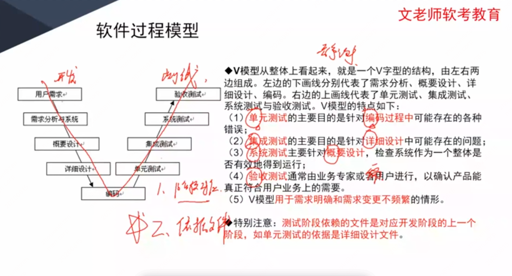

# 第十章 软件工程基础知识

> 很重要，选择题、案例题分值都高，选择题有十几分。

> 课件原文（无精简）见 [课件原文 · 第十章](/source/chapter-10/)。

## 知识点目录

1. **软件工程**
   - 1.1 软件过程模型
   - 1.2 软件能力成熟度模型
   - 1.3 逆向工程
2. **需求工程**
   - 2.1 软件需求
   - 2.2 需求获取
   - 2.3 需求变更和需求追踪
3. **系统分析与设计**
   - 3.1 结构化分析
   - 3.2 结构化设计
   - 3.3 人机界面设计
4. **软件测试**
   - 4.1 测试方法
   - 4.2 ★ 测试阶段（系统测试重点）
   - 4.3 测试用例设计
   - 4.4 McCabe 度量法
5. **★ 补充：系统运行与维护**
6. **净室软件工程**
7. **基于构件的软件工程**

## 1 软件工程

### 1.1 软件过程模型

#### 补充模型

#### 统一过程模型（RUP）

非常重要，考过默写。待补充。

### 1.2 软件能力成熟度模型

待补充。

### 1.3 逆向工程

待补充。

## 2 需求工程

**需求工程的定义**

需求工程是指应用已证实有效的原理、方法，通过合适的工具和记号，`系统地描述待开发系统及其行为特征和相关约束`。需求工程覆盖了`体系结构设计之前的各项开发活动`，主要包括`分析客户要求、对未来系统的各项功能性及非功能性需求进行规格说明`。需求工程的目标简单明了：`确定客户需求，定义设想中系统的所有外部特征`。

**需求工程的活动**

`需求获取、需求分析、形成需求规格（需求文档化）、需求确认与验证、需求管理`。

**需求基线与需求约定**

软件需求开发的最终文档经过评审批准后，则`定义了开发工作的需求基线`。这个基线在客户和开发者之间构筑了计划产品功能需求和非功能需求的一个约定。`需求约定是需求开发和需求管理之间的桥梁`。

### 2.1 软件需求

待补充。

### 2.2 需求获取

常见获取方法（6 种）：

1. `用户面谈`：`1对1-3、有代表性的用户`，分`结构化和非结构化`；事先计划准备，面谈后复查笔记并转化为模型/文档。
2. `需求专题讨论会`：`相关涉众集中讨论，在应用需求上达成共识`；参会：主持人、用户、技术人员、项目组。
3. `问卷调查`：适用于`用户多、无法一一访谈`；用于`确认假设、收集统计倾向数据`。
4. `现场观察`：`观察用户实际执行业务的过程，直观了解业务执行`，掌握需求细节（手工操作或原有系统上执行）。
5. `原型化方法`：需求早期不确定性大时，`开发系统原型、与用户多次迭代反馈`以澄清需求（尤其人机界面等不确定部分）。
6. `头脑风暴法`：适用于`业务流程高度不确定`的新业务（互联网新业务、App 等），`一群人围绕业务发散思维、不断产生新观点`，思想碰撞中确定具体需求。

### 2.3 需求变更和需求追踪

**需求管理**

需求管理是一个`对系统需求变更、了解和控制的过程`。需求管理过程与需求开发过程相互关联，当初始需求导出的同时就启动了需求管理规划，`一旦形成了需求文档的初稿，需求管理活动就开始了`。`需求管理的主要活动如图所示`。

*注："主要活动"原课件配图未包含在截图中，后续补上。*

**需求变更（变更控制）**

`严格控制软件项目`要确保：仔细`评估已建议的变更`；挑选合适人选`对变更做出判定`；及时`通知所有相关人员`；`按一定程序采纳需求变更`并控制变更过程和状态。

**变更控制过程**：

识别出问题 → 问题分析和变更描述 → 变更分析和成本计算 → 变更实现 → 修改后的需求

1. `问题分析和变更描述`：分析变更提议、检查有效性，形成更明确的变更提议。
2. `变更分析和成本计算`：做影响分析，评估所有改动成本（需求文档、设计、实现），确认后决策是否执行。
3. `变更实现`：确定执行后，按影响范围、依据开发过程模型执行变更。

## 3 系统分析与设计

### 3.1 结构化分析

结构化分析常用**数据流图（DFD，Data Flow Diagram）**描述系统的功能和数据流向。数据流图只表示“数据经过哪些处理、在什么位置存储、由谁提供或使用”，不表示具体的程序流程和控制时序。

#### 数据流图的基本元素

| 元素 | 含义 | 图形/识别方式 |
| --- | --- | --- |
| 数据流 | 描述数据的流向，箭头上的文字标注数据项或信息说明 | 带箭头的线 |
| 处理 | 对数据进行加工和转换；有输入数据流，也应产生输出数据流 | 圆角矩形或处理框 |
| 数据存储 | 以数据库形式（或文件形式）存储的数据 | 两条平行线/数据存储符号 |
| 外部项 | 系统数据的提供者或数据使用者，也称数据源或数据终点，如教师、学生、采购员、组织或其他系统 | 矩形 |

#### 数据流图的常见错误

- **黑洞**：处理有输入但没有输出，例如 `3.1.2 创建新的合同服务` 只有输入没有产生输出。
- **奇迹**：处理有输出但没有输入，例如 `3.1.3 存储空白的合同号` 没有输入却产生了输出。
- **灰洞**：处理的输入不足以产生其输出，或输入、输出之间缺少完整的数据关系，例如 `3.1.1 生成订单信息` 的输入不足以支撑其输出。

其中，灰洞是最常见、也最难排查的错误。常见原因包括处理命名错误、输入或输出标注不完整，以及需求实现不完整。交给程序员的数据流图中，处理的输入必须足以产生相应的输出。

#### DFD 建模步骤

1. 明确目标，确定系统范围。
2. 建立顶层 DFD：描述系统主要功能，确定系统边界及内外关系。
3. 构建第一层 DFD 分解图。
4. 开发 DFD 层次结构图：保持模型深度均匀，优先分解困难处理；处理难以命名时继续分解。
5. 检查 DFD：父图数据流要在子图中出现；处理至少有一个输入和一个输出；数据存储要有流入和流出；数据流至少一端连接处理；模型应全面、完整、正确、一致。

#### 数据字典（DD）

数据字典是用户可访问的记录数据库和应用程序元数据的目录，用于定义和描述数据流图中的所有数据元素，是对数据信息的集合。

| 数据字典条目 | 说明 |
| --- | --- |
| 数据项 | 不可再分的数据单位 |
| 数据结构 | 说明数据项的组合关系 |
| 数据流 | 说明数据流图中的流线 |
| 数据存储 | 说明数据块的存储特性 |
| 处理逻辑 | 说明数据流图中的功能块 |

### 3.2 结构化设计

#### 定义与过程

结构化设计（SD）是面向数据流的设计方法，以 SRS、SA 阶段的数据流图和数据字典为基础，采用自顶向下、逐步求精、模块化的方法，将软件划分为相对独立、单一功能的模块。

- 概要设计：确定系统结构，划分模块，明确模块功能、接口和调用关系，输出模块结构图。
- 详细设计：设计模块实现细节，包括算法、数据结构、数据库物理设计、代码、输入输出格式和用户界面。

#### 设计原则

1. 信息隐藏与抽象：封装实现细节，对外只暴露接口。
2. 模块化：模块是功能实现的基本单位，具有功能、逻辑、状态等属性。
3. 高内聚、低耦合：模块内部关联紧密，模块之间依赖尽量少。

**怎么理解：**

- 高内聚：一个模块内部的各个功能都围绕同一个目标，彼此关系紧密。例如，订单模块只负责创建订单、修改订单、查询订单等订单相关功能。
- 低耦合：不同模块之间的依赖关系尽量少，模块之间通过清晰、简单的接口通信。例如，支付模块只调用订单模块提供的“查询订单金额”接口，不需要了解订单模块内部如何存储和处理数据。

这样做的好处是：一个模块修改时，不容易影响其他模块，系统更容易维护、复用和扩展。

注意：偶然内聚是内聚程度最低的一种，表示一个模块里的功能之间没有直接关系。例如把“打印报表、计算工资、发送邮件”硬塞进同一个模块。

#### 内聚：从低到高

| 类型 | 核心判断 | 记忆关键词 |
| --- | --- | --- |
| 偶然内聚 | 元素之间没有联系 | 无直接关系 |
| 逻辑内聚 | 逻辑相似，通过参数选择功能 | 逻辑相似、参数决定 |
| 时间内聚 | 需要同时执行的动作组合 | 同时执行 |
| 过程内聚 | 多个任务按指定过程执行 | 指定过程顺序 |
| 通信内聚 | 操作同一数据结构，或使用相同输入/产生相同输出 | 相同数据结构、输入输出 |
| 顺序内聚 | 前一处理输出是后一处理输入，必须顺序执行 | 顺序执行、输出接输入 |
| 功能内聚 | 所有元素共同完成一个功能，缺一不可 | 共同作用、缺一不可 |

> 记忆：内聚越高越好，考试中重点掌握“偶然最低、功能最高”，以及顺序内聚和功能内聚的区别。

#### 耦合：从低到高

耦合表示模块之间的依赖和关联程度。设计时应尽量做到低耦合，也就是模块之间依赖少、接口简单。耦合越低，修改一个模块时越不容易影响其他模块。

| 类型 | 核心判断 | 记忆关键词 |
| --- | --- | --- |
| 非直接耦合 | 模块之间没有直接关系，不传递信息 | 无直接关系 |
| 数据耦合 | 通过调用传递简单数据值 | 传递数据值调用 |
| 标记耦合 | 模块之间传递数据结构 | 传递数据结构 |
| 控制耦合 | 传递控制变量，由被调用模块选择执行某一功能 | 控制变量、选择执行 |
| 通信耦合 | 共享输入信息，或共享、整合输出信息 | 共用通信信息 |
| 公共耦合 | 多个模块共同使用公共数据环境 | 公共数据结构 |
| 内容耦合 | 直接使用其他模块内部数据，或通过非正常入口进入其内部 | 模块内部关联 |

> 记忆：耦合越低越好，考试中重点掌握“非直接最低、内容最高”，以及数据耦合、标记耦合、控制耦合的区别。

#### 系统结构图与详细设计

- **系统结构图（SC）**：又称模块结构图，用于概要设计，表示模块之间的层次结构、联系和通信，反映系统总体结构。
- **详细设计五步**：
  1. 确定输入／输出数据的逻辑结构。
  2. 找出输入、输出结构中对应的数据单元。
  3. 由输入、输出数据结构导出程序结构。
  4. 将基本操作和条件分配到程序结构图的适当位置。
  5. 用伪码写出程序。

#### 详细设计表示工具

三类工具：图形工具、表格工具、语言工具。

| 工具 | 要点 |
| --- | --- |
| 程序流程图（程序框图） | 方框表示处理，菱形表示条件，箭头表示控制流；结构清晰、易理解、易修改，但只能描述执行过程，不能描述相关数据。 |
| NS 流程图（盒图、方框图） | 强制使用结构化构造；功能域明确，不能任意转移控制，便于确定局部/全局数据作用域，便于表示嵌套和模块层次。 |
| PAD 图 | 改进的图形描述方式，比程序流程图更直观、结构更清晰；能反映自顶向下的历史和过程，提供 5 种基本控制结构并允许递归使用。 |

> 记忆：程序流程图重在“执行过程”；NS 图重在“结构化、作用域、嵌套”；PAD 图重在“自顶向下、结构清晰”。

### 3.3 人机界面设计

#### 三大原则

人机界面设计的核心原则：用户控制、降低记忆负担、界面一致性。

| 原则 | 主要要求 | 记忆关键词 |
| --- | --- | --- |
| 置于用户控制之下 | 交互方式不强迫用户；交互灵活；支持中断和取消；允许流水化和定制；隔离内部技术细节；支持用户直接操作屏幕对象 | 灵活、中断、取消、定制、直接交互 |
| 减少用户的记忆负担 | 减少短期记忆要求；设置有意义的缺省值；提供直觉性快捷方式；使用真实世界隐喻；逐步揭示信息 | 少记忆、缺省、快捷、隐喻、渐进揭示 |
| 保持界面的一致性 | 将当前任务放入有意义的语境；在应用系列内保持一致；不要无理由改变已经建立用户期望的交互模型 | 语境、一致、保持用户期望 |

> 记忆：界面设计既要让用户“能控制”，又要让用户“少记忆”，还要让相同操作“保持一致”。

## 4 软件测试

### 4.1 测试方法

#### 软件测试定义与目的

软件测试是通过人工或自动方式运行/测定软件系统，检查软件是否满足规定需求，并找出预期结果与实际结果的差异。

核心目的：保证软件质量，确认软件正确完成用户期望，发现软件错误。

#### 测试分类

| 分类角度 | 类型 |
| --- | --- |
| 程序是否运行 | 静态测试、动态测试 |
| 是否关注内部结构 | 黑盒测试、白盒测试、灰盒测试 |
| 执行方式 | 人工测试、自动化测试 |

#### 静态测试与动态测试

| 方法 | 核心含义 | 关键内容 |
| --- | --- | --- |
| 静态测试 | 程序不运行，只分析/检查源程序、结构和过程 | 桌前检查、代码审查、代码走查 |
| 动态测试 | 运行程序，将实际结果与预期结果比较，并分析效率、健壮性 | 构造测试实例 → 执行程序 → 分析结果 |

**静态测试三种方法：**

- **桌前检查**：程序员检查自己写的程序，时间在编译后、单元测试前。
- **代码审查**：程序员和测试人员组成评审小组，召开程序评审会审查。
- **代码走查**：测试人员提供测试用例，程序员扮演计算机，手动运行用例并检查代码逻辑。

> 记忆：静态测试“不运行程序”，动态测试“运行程序”；代码走查的特点是“测试人员给用例，程序员扮演计算机”。

#### 黑盒、白盒、灰盒与自动化测试

| 方法 | 核心定义 | 主要关注点/特点 |
| --- | --- | --- |
| 黑盒测试 | 不考虑程序内部结构，根据需求规格设计测试实例 | 主要测试软件界面和功能；重点是“输入正确时输出是否正确” |
| 白盒测试 | 借助程序内部逻辑和相关信息，检查内部动作与设计是否一致 | 检查逻辑结构、模块独立路径和内部结构；常用控制流、数据流、路径、程序变异分析 |
| 灰盒测试 | 介于黑盒和白盒之间，既关注输出正确性，也关注部分内部逻辑 | 不能像白盒一样详细完整，但比黑盒更了解内部运行情况，适用范围较广 |
| 自动化测试 | 在预先设定条件下自动运行被测程序并分析结果 | 将人工驱动的测试行为转化为机器执行，通常通过自动化测试脚本完成 |

**白盒测试覆盖标准：**语句覆盖、判定覆盖、分支覆盖、路径覆盖。

#### ★ 额外补充：白盒测试用例覆盖标准

| 标准 | 含义 | 覆盖强度 |
| --- | --- | --- |
| 语句覆盖 SC | 逻辑代码中的所有语句至少执行一次 | 最低；执行所有语句不代表覆盖所有条件判断 |
| 判定覆盖 DC | 所有判断语句的真假分支都至少执行一次 | 高于语句覆盖 |
| 条件覆盖 CC | 每个判断条件中的每一个独立条件，都至少执行一次真和假 | 关注单个条件的真假 |
| 条件判定组合覆盖 CDC | 同时满足判定覆盖和条件覆盖 | 同时关注判断结果和独立条件 |
| 路径覆盖 | 逻辑代码中的所有可能路径都覆盖 | 最高，实际复杂程序中可能难以完全实现 |

> 记忆：黑盒看“功能和界面”；白盒看“内部逻辑和路径”；灰盒“介于两者之间”；自动化测试“机器执行”。

### 4.2 ★ 测试阶段（系统测试重点）

| 阶段 | 核心内容 | 主要依据/特点 |
| --- | --- | --- |
| 单元测试（模块测试） | 测试可独立编译/汇编的模块、构件或类，发现功能问题和编码错误 | 依据详细设计说明书；静态测试为主，也可黑盒结合白盒 |
| 集成测试 | 检查模块之间、模块与已集成软件之间的接口关系，验证组装正确性 | 依据概要设计文档；白盒与黑盒结合 |
| ★ 系统测试 | 通常采用黑盒测试，检查整个系统是否符合软件需求 | 功能、性能、健壮性、安装/反安装、界面、压力、可靠性、安全性；必须多轮回归测试 |
| 性能测试 | 模拟正常、峰值、异常负载，测试系统性能指标 | 负载测试确定各种负载下性能；压力测试寻找瓶颈和最大服务级别 |
| 验收测试 | 用户在正式交付前验证软件是否满足需求或合同要求 | Alpha：开发环境下用户测试；Beta：实际环境中多个用户测试 |
| 回归测试 | 验证软件变更后变更部分正确，且原有功能、性能不受损害 | 修改后必须重新检查原有正确功能 |

**★ 系统测试重点：**

- 测试方法：通常采用黑盒测试。
- 测试内容：功能、性能、健壮性、安装/反安装、用户界面、压力、可靠性、安全性。
- 测试要求：必须进行多轮回归测试。
- 结束标志：达到目标规定的需求覆盖率，且发现的缺陷全部归零。

> 阶段顺序：单元 → 集成 → ★ 系统 → 验收；性能测试和回归测试可贯穿多个阶段。

### 4.3 ★ 额外补充：测试用例设计（论文可写）

> 这是测试阶段之外的补充内容，论文题中可能用到。作答时可按“测试目标 → 测试方法 → 测试数据 → 预期结果”展开。

#### 黑盒测试用例设计

| 方法 | 核心思路 | 设计要点/例子 |
| --- | --- | --- |
| 等价类划分 | 将输入数据划分为若干等价类，并从每类中选取代表性数据设计测试用例 | 有效等价类：符合需求、能够被系统正常处理的输入，用于验证系统的正常功能；无效等价类：不符合需求、系统应拒绝或进行异常处理的输入，用于验证系统的容错能力；一个用例尽量覆盖多个未覆盖的有效类；不同的无效等价类通常代表不同类型的错误输入，因此分别设计测试用例，逐一验证系统能否正确拒绝或给出提示 |
| 边界值分析 | 测试输入/输出范围的边界，边界附近最容易出错 | 选取范围端点和刚超出范围的值；年龄 0～150 岁，可测 `0、150、-1、151` |
| 错误推测法 | 依据测试经验推测可能出错的位置 | 可重点测试空输入、非法字符、极端数据、重复提交、异常操作 |
| 因果图法 | 分析输入条件（原因）与输出结果（结果）的关系，推导测试用例 | 适合条件组合、约束和相互影响复杂的需求；结合具体需求分析，没有固定方法 |

#### 其他测试类型

- **A/B 测试**：将相似用户随机分配到不同 Web/App 界面或流程版本，收集用户体验和业务数据，选择更优版本。
- **Web 测试**：针对 Web 应用，重点验证功能和性能。
- **链接测试**：验证链接能到达预期页面、目标页面存在，且没有孤立页面。
- **表单测试**：验证提交按钮、成功提示、数据处理和用户反馈是否正确。

#### ★ 真题练习：测试用例设计

##### 题目一：有效等价类与无效等价类

招聘系统要求：求职者年龄在 20～60 岁之间（含 20 岁和 60 岁），学历为本科、硕士或博士，专业为计算机科学与技术、通信工程或电子工程。以下哪一个不是好的测试用例？

- A. （20，本科，电子工程）
- B. （18，本科，通信工程）
- C. （18，大专，电子工程）
- D. （25，硕士，生物学）

**答案：C。**

**解析：**好的无效等价类测试用例通常只设置一个不符合要求的条件，这样才能明确验证系统对某一种错误输入的处理结果。

- A 的年龄、学历和专业均符合要求，是有效测试用例。
- B 只有年龄不符合要求，可以单独验证“年龄小于 20 岁”这一无效等价类。
- C 同时存在年龄小于 20 岁和学历为大专两个错误，无法判断系统拒绝是由哪个条件导致的，因此不是好的测试用例。
- D 只有专业不符合要求，可以单独验证“专业不在规定范围内”这一无效等价类。

因此，选择 **C**。本题考查的是：设计无效等价类测试用例时，通常一次只设置一个无效条件。

## 5 ★ 补充：系统运行与维护

> 以下内容不是官网教材的正式内容，但曾经在考试中出现过，作为第十章补充知识记录。

### 5.1 系统转换与数据转换

**系统转换**：新系统开发完毕、投入运行并取代现有系统的过程。

| 转换方式 | 做法 | 特点 |
| --- | --- | --- |
| 直接转换 | 新系统直接取代老系统 | 风险大；适合新系统不复杂或老系统已不能使用；节省成本 |
| 并行转换 | 新、老系统并行运行一段时间，试运行后再取代 | 风险极小，适合大型系统；耗费人力和时间，数据转换难控制 |
| 分段转换 | 将大型系统拆成多个子系统，逐个转换 | 是直接转换和并行转换的集合；更耗时，需协调接口 |

数据转换与迁移：将数据从旧数据库迁移到新数据库，方法有系统切换前工具迁移、系统切换前手工录入、系统切换后由新系统生成。

### 5.2 软件可维护性与软件维护

**可维护性**：维护人员理解、改正、改动和改进软件的难易程度。

| 评价指标 | 记忆含义 |
| --- | --- |
| 易分析性 | 找到缺陷/失效原因和待修改部分 |
| 易改变性 | 实现指定修改，包括编码、设计和文档 |
| 稳定性 | 避免修改造成意外结果 |
| 易测试性 | 确认修改后的软件 |
| 维护性的依从性 | 遵循维护性标准或约定 |

系统维护包括硬件维护、软件维护和数据维护。软件维护：正确性维护（修 bug）、适应性维护（外部环境变化）、完善性维护（用户新需求、增加功能）、预防性维护（预防未来 bug）。

## 6 净室软件工程

**定义：**应用数学与统计学理论，以经济方式生产高质量软件，通过严格的工程化软件过程达到零缺陷或接近零缺陷。

**核心：**在规约和设计阶段消除错误，强调第 1 次正确编写代码增量，并在测试前验证正确性；理论基础是函数理论和抽样理论。

- 应用技术：统计过程控制下的增量式开发、基于函数的规约与设计、正确性验证、统计测试和软件验证。
- 缺点：理论化、需要较多数学知识；正确性验证困难且耗时；不进行传统模块测试不够现实；仍有传统软件工程弊端。

## 7 基于构件的软件工程

> **选择题高频考点**：以下知识点曾经考过选择题。

**核心定义：**CBSE 基于分布对象技术，通过可复用构件设计与构造软件系统；核心思想是“购买而不是重新构造”，把重点从程序编写转向已有构件的组装。

**构件的 5 个特征：**可组装型、可部署性、文档化、独立性、标准化。重点记忆：构件通过公开接口交互；构件自包含、为二进制形式且部署前无需编译；必须有完整文档；有依赖时应明确声明；必须符合标准化构件模型。

**构件模型的要素：**接口、使用信息、部署。构件模型提供被构件使用的通用服务：平台服务（允许构件在分布式环境下通信和互操作）与支持服务（很多构件需要的共性服务，如身份认证）；中间件实现共性构件服务并提供这些服务的接口。

**CBSE 过程的 6 个主要活动：**CBSE 过程是支持基于构件组装的软件开发过程：系统需求概览 → 识别候选构件 → 根据发现的构件修改需求 → 体系结构设计 → 构件定制与适配 → 组装构件创建系统。

**与传统软件开发的不同点：**
1. 早期需要完整的需求，以便尽可能多地识别出可复用的构件。
2. 早期根据可利用的构件来细化和修改需求；可利用构件不满足用户需求时，考虑由复用构件支持的相关需求。
3. 体系结构设计完成后，进一步搜索构件并精化设计：为某些构件寻找备用构件，或修改构件以适合功能和架构的要求。
4. 开发就是将已经找到的构件集成在一起的组装过程。

> 易错点：CBSE 是复用、购买和组装，不是从零编写；构件部署前无需编译；平台服务负责分布式通信与互操作，支持服务提供身份认证等公共服务。

### 4.4 McCabe 度量法

待补充。
