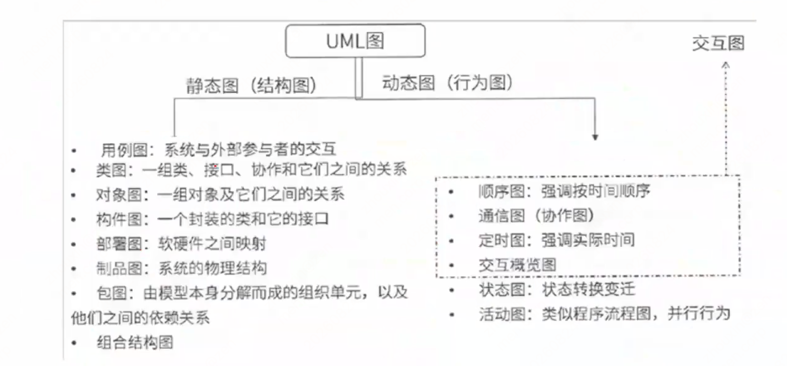
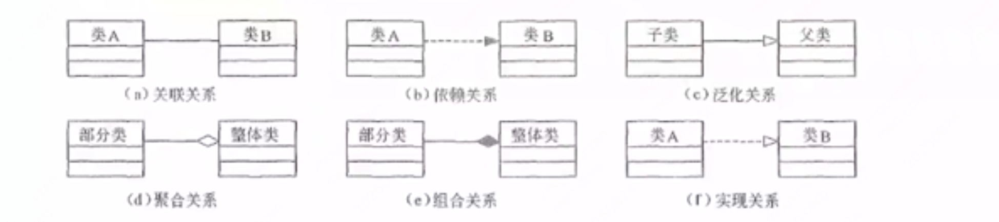
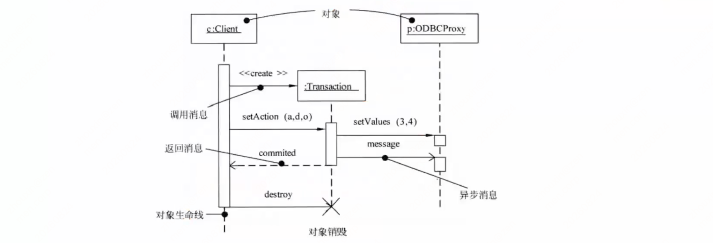
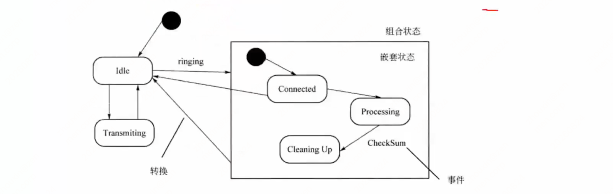
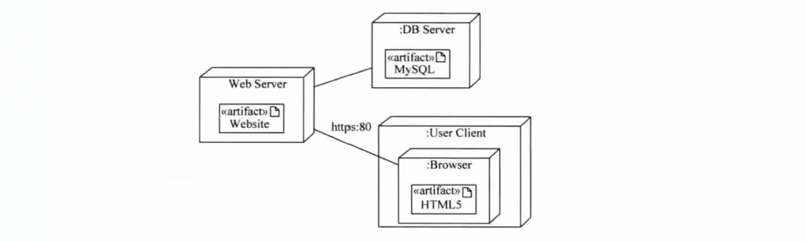
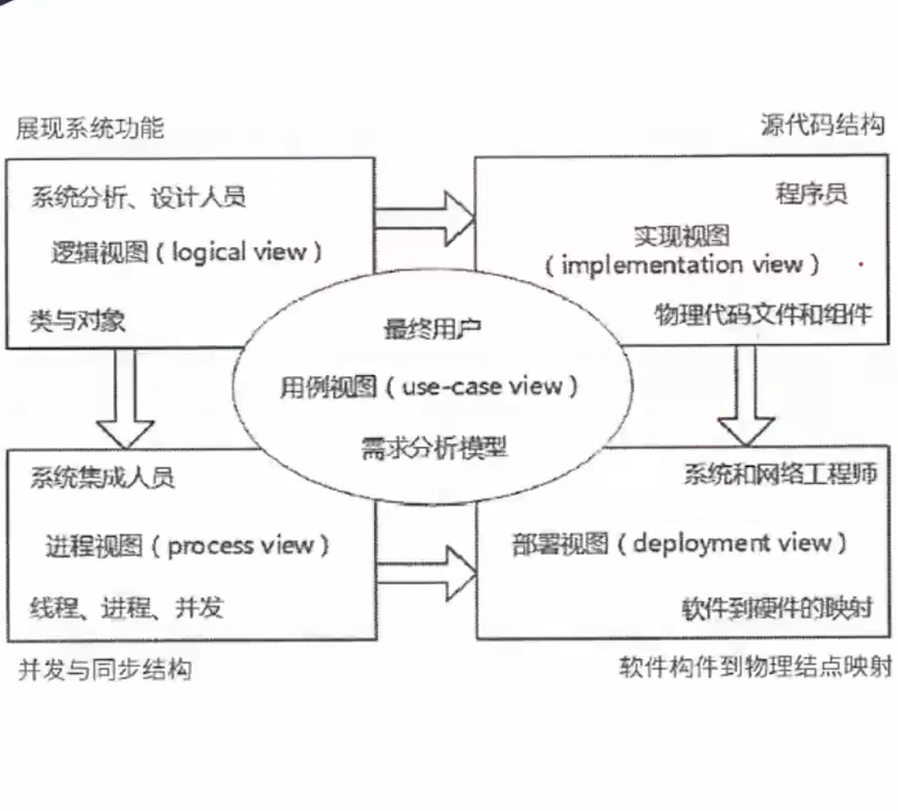
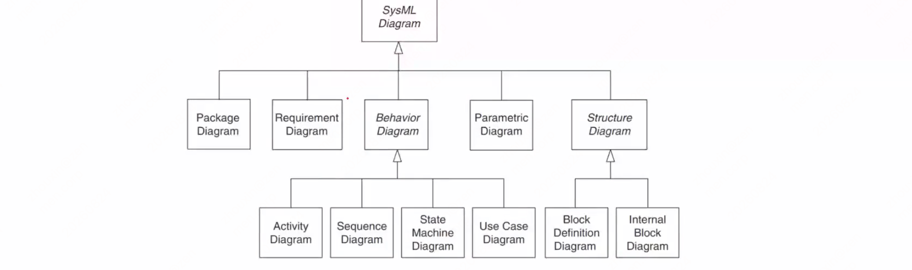
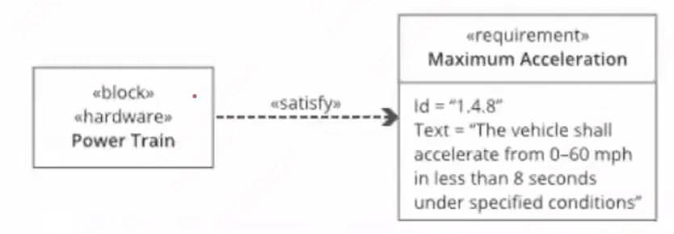
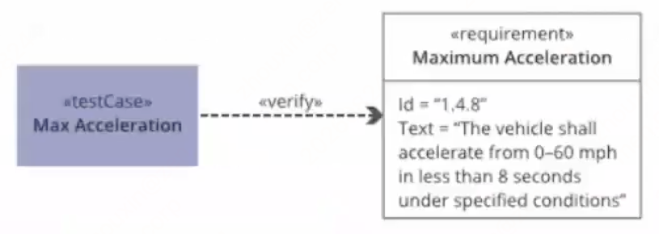
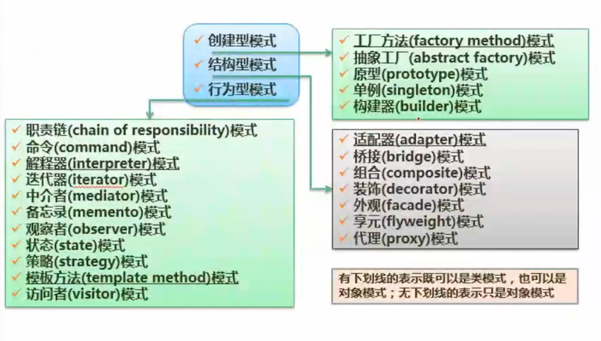

# 第十一章 面向对象技术

## 知识点目录

1. 面向对象基础
2. UML
3. SysML（补充内容）
4. 设计模式
5. 历年真题

## 1 面向对象基础

**基本思想**

`客观世界由对象组成`，`对象 = 属性 + 操作`，对象可按属性分类；对象之间通过`传递消息`实现联系。对象三大特性：`封装、继承、多态`。

**开发方法**

`用例驱动、以体系结构为中心、迭代、渐增`的开发过程；主要 4 个阶段：`需求分析、系统分析、系统设计、系统实现`。注意：阶段划分不像结构化方法那样清晰，而是`在各阶段之间迭代进行`。

**面向对象分析（OOA，Object-Oriented Analysis）**

系统业务调查后，按面向对象思想分析问题。OOA 模型 = `5 个层次`（主题层、对象类层、结构层、属性层、服务层）+ `5 个活动`（标识对象类、标识结构、定义主题、定义属性、定义服务）。

对象类之间的两种结构：

- `分类结构`：`一般与特殊的关系`（即继承关系）
- `组装结构`：对象之间的`整体与部分的关系`

**OOA 原则（9 条）**

1. `抽象`：舍弃个别的、非本质的特征，抽取共同的、本质性的特征。含 `过程抽象`（完成确定功能的操作序列，使用者可看作`一个单一实体`）与 `数据抽象`（`根据施加于数据之上的操作定义数据类型`，值只能由这些操作修改和观察；是 OOA 的`核心原则`——把`数据（属性）+ 操作（服务）`结合为对象，外部只需知道"做什么"，不必知道"如何做"）。
2. `封装`：把`对象的属性和服务`结合为`一个不可分的系统单位`，尽可能隐藏内部细节。
3. `继承`：特殊类的对象拥有其对应一般类的全部属性与服务，即`特殊类对一般类的继承`；使系统模型简练、清晰。
4. `分类`：把`具有相同属性和服务的对象划分为一类`，用类作为对象的抽象描述——抽象原则在对象描述上的表现形式。
5. `聚合`（组装）：`把复杂事物看成若干较简单事物的组装体`，简化复杂事物的描述。
6. `关联`：`通过一个事物联想到另外的事物`，前提是事物间确实存在某些联系。
7. `消息通信`：`对象之间只能通过消息通信`，不允许在对象之外直接存取其内部属性——由封装原则引起。
8. `粒度控制`：看全局时只注意大的组成部分、暂不考虑细节；看某部分细节时则暂时撇开其余部分。
9. `行为分析`：现实世界事物行为复杂，问题域中各种行为往往`相互依赖、相互交织`。

**面向对象需求建模**

- `用例模型`（4 个活动）：`识别参与者、合并需求获得用例、细化用例描述、调整用例模型`。
  - 用例描述 8 要素：`用例名称、简要说明、事件流、非功能需求、前置条件、后置条件、扩展点、优先级`。
  - 用例间 3 种关系：`包含、扩展、泛化`。
- `分析模型`（4 个活动）：`定义概念类、识别类之间的关系、为类添加职责、建立交互图`。
  - 类间 6 种关系：`依赖、关联、聚合、组合、泛化、实现`。

**面向对象设计（OOD，Object-Oriented Design）**

基本思想：`抽象、封装、可扩展性`；`可扩展性主要通过继承和多态来实现`。类封装信息和行为，是`具有相同属性、方法和关系的对象集合的总称`。

OOD 中类的 3 种类型：

- `实体类`：`映射需求中的每个实体`，`保存需要存储在永久存储体中的信息`，通常是`永久性的`（如学员类、课程类）。
- `控制类`：用于`控制用例工作的类`，由`动宾结构的短语`转化来的名词（如用例"身份验证"→控制类"身份验证器"）；建模用例特有的控制行为，行为具`协调性`。
- `边界类`：课件仅点名未展开，了解即可（处理系统与外部参与者之间交互的类）。

**面向对象设计原则（6 条）**

1. `开放—封闭原则`：对扩展开放，对修改封闭。
2. `里氏替换原则`：`子类型必须能替换基类型`——父类能出现的地方，子类实例可赋值给父类引用。
3. `依赖倒置原则`：`抽象不依赖细节，细节依赖抽象`——针对接口编程，而非针对实现编程。
4. `组合/聚合复用原则`（合成复用原则）：`多用组合/聚合，少用继承`；`Has-A → 组合/聚合`，`Is-A → 继承`。
5. `接口隔离原则`：`多个专门接口优于单一总接口`；每个接口角色相对独立，不多不少。
6. `迪米特法则`（最少知识原则）：软件实体应`尽可能少地与其他实体交互`。狭义：两个类不必直接通信就不应直接交互，调用可`通过第三者转发`；广义：控制对象间信息流量、流向和影响（主要是信息隐藏）。

**OOP 与数据持久化**（低重要度：软考不考具体代码/框架细节，了解即可）

- `OOP = 对象+类+继承+多态+消息`，核心是`类和对象`；目标：`重用性、灵活性、扩展性`。
- `对象持久化`：对象只存于内存，需保存到`数据库/永久存储设备`；`持久层`解耦业务逻辑与数据逻辑；`ORM` 做对象-关系映射（框架如 Hibernate、iBatis、JDO 了解即可）。

## 2 UML

**UML 概述**

- UML（统一建模语言）是`可视化的建模语言，而非程序设计语言`，支持从需求分析开始的软件开发全过程。
- UML 结构 = `构造块 + 规则 + 公共机制`：
  - `构造块`：三种基本构造块 `事物、关系、图`——事物是核心，关系把事物联系起来，图是多个相关事物的集合。
    - 事物分 4 类：`结构事物`（静态，如类/接口/用例/构件）、`行为事物`（动态，如交互/活动/状态机）、`分组事物`（组织，如包）、`注释事物`（解释，依附于元素作约束或解释）。
  - `公共机制`：达到特定目标的公共 UML 方法。
  - `规则`：构造块如何放在一起的规定。
- **UML 2.0 图总分类**（结构图 8 种 + 行为图 6 种，其中 4 种是交互图）：
  - `静态图（结构图）`：用例图（系统与外部参与者的交互）、类图（类/接口/协作及它们之间的关系）、对象图（一组对象及其关系）、构件图（封装的类及其接口）、部署图（软硬件映射）、制品图（系统物理结构）、包图（组织单元及依赖关系）、组合结构图。
  - `动态图（行为图）`：顺序图（`强调按时间顺序`）、通信图（协作图）、定时图（`强调实际时间`）、交互概览图、状态图（状态转换变迁）、活动图（类似程序流程图，并行行为）。
  - `交互图`（图中虚线框出的 4 种，均属行为图）：顺序图、通信图（协作图）、定时图、交互概览图。
  - 速记：顺序图记"时间顺序"、定时图记"实际时间"、活动图记"流程+并行"、状态图记"状态转换"。

- **类间关系 6 种**（要能认图，高频考点）：
  - `关联`：结构关系，对象之间的连接（链）；`组合、聚合都是部分与整体的关系，组合关系更强`；两个类之间可有多个不同角色标识的关联。
  - `依赖`：一个事物的语义随另一个事物语义变化而变化（弱联系，虚线箭头）。
  - `泛化`：`一般/特殊`关系，即子类与父类（实线 + 空心三角）。
  - `实现`：一个类元指定另一个类元保证执行的契约（虚线 + 空心三角）。
  - 图中符号速记：(a) 关联=实线；(b) 依赖=虚线箭头；(c) 泛化=实线空心三角；(d) 聚合=空心菱形；(e) 组合=实心菱形；(f) 实现=虚线空心三角。

- **四种高频图种详解**（对应上图分类，要会认图）：
  - `类图`（静态设计视图）：类框三层 `类名/属性/操作`（如 Person：name:Name；getPersonalRecords()）；示例图含全部符号——关联、聚合（实心菱形）+ 多重度（1、1..*）、角色（member/manager）、泛化（空心三角）、依赖（虚线箭头）、接口（棒棒糖）。
  - `用例图`（静态）：`参与者` = 人/硬件/其他系统扮演的角色；用例 = 参与者完成的一系列操作；用例关系：`<<include>>` 包含、`<<extend>>` 扩展、泛化。
  - `序列图`（动态，按时间顺序）：三种消息——`同步消息`（阻塞调用，`实心三角箭头`，需等返回）、`异步消息`（不阻塞，`空心箭头`）、`返回消息`（从右到左虚线箭头）；关键元素是对象生命线 + 对象销毁（✕）。
  - `通信图`（即`协作图`）：强调`参加交互的对象的组织`，消息按`序号`排序（1、2、2.1、2.2…），对象之间用`链`连接。
  - 辨析：序列图记`时间顺序`（生命线），通信图记`对象组织`（序号）。

- **另四种图种（续）**：
  - `状态图`（动态）：展现状态机，描述`单个对象在多个用例中的行为`；图中方框=状态、箭头=转换（箭头上为触发事件）、实心圆点=起点/终点；含简单状态和`组合状态`（嵌套状态）；事件触发后检查`监护条件`。
  - `活动图`（动态，`特殊的状态图`）：展现系统内从一个活动到另一个活动的流程；分岔/汇合线=水平粗线；关键名词：`并发分岔`、`并发汇合`、`监护表达式`、`分支`、`流`；分岔分支数=可同时运行的线程数（能并行的=同一分岔粗线下分支上的活动）。
  - `构件图`（组件图）：静态图，系统`静态实现视图`，展现构件之间的组织和依赖。
  - `部署图`：静态图，系统`静态部署视图`，物理模块的节点分布；一个结点包含一个或多个构件；依赖单向（类似包含关系）。
  - 速记：状态图=单对象状态变迁（事件触发+监护条件）；活动图=活动流程+并发（粗线=分岔/汇合）；构件图=实现视图；部署图=物理部署。

- **UML 4+1 视图**（高频考点：5 个视图 + 面向角色）：
  - `逻辑视图`（又称`设计视图`）：设计模型中架构上重要的部分 = `类、子系统、包和用例实现的子集`；面向系统分析/设计人员。
  - `进程视图`：`可执行线程和进程作为活动类的建模`，是`逻辑视图的一次执行实例`，描述`并发与同步结构`；面向系统集成人员。
  - `实现视图`：对`物理代码的文件和构件进行建模`（源代码结构）；面向程序员。
  - `部署视图`：把`构件部署到一组物理节点上`，软件到硬件的映射与分布结构；面向系统/网络工程师。
  - `用例视图`：`最基本的需求分析模型`；面向最终用户。
  - 图中关系：用例视图居中，逻辑→实现、用例→进程/部署、进程→部署。

## 3 SysML（补充内容）

- SysML（系统建模语言）是`通用图形建模语言`，用于指定、分析、设计和验证可能包括硬件/软件/信息/人员/程序/设施的复杂系统；提供建模系统`需求、行为、结构、参数`的语义基础，可与其它工程分析模型集成。
- SysML 是`基于模型的系统工程（MBSE）`应用的事实标准系统架构建模语言，是`UML 2 的一种方言`（扩展 UML 标准用于系统工程）。
- SysML 提供`9 种图`：包图（Package）、需求图（Requirement）、行为图（Behavior，细分为活动图/序列图/状态机图/用例图）、参数图（Parametric）、结构图（Structure，细分为块定义图/内部块图）。
- 速记：5 大类（包/需求/行为/参数/结构）+ 2 处细分（行为 4 种、结构 2 种）= 9 种。

- **9 种 SysML 图对照 UML 图与用途**（会认缩写 + 用途）：
  - `活动图（ACT）` ≈ UML 活动图：控制流程、输入→输出；[行为图] 功能分析（对应 FBD/EFFBD）。
  - `模块定义图（BDD）` ≈ 类图：系统层次、组件分类；[结构图] 系统分析与设计。
  - `内部模块图（IBD）` ≈ 复合结构图：部件（Parts）/端口/连接器的内部结构；[结构图] 系统分析与设计。
  - `包图（PKG）` ≈ 包图：模型层级组织、包间依赖；[结构图] 模型管理。
  - `参数图（PAR）`：`SysML 特有`（无 UML 对应）：系统约束；[结构图] 性能与定量分析。
  - `需求图（REQ）`：文字化需求 + 满足/验证关系；含`分配关系`（功能→组件、软件→硬件、逻辑→物理）；[需求图] 需求工程（V&V）。
  - `序列图（SD）` ≈ 序列图：模块间交互（对象时间轴）；[行为图] 系统分析与设计。
  - `状态机图（STM）` ≈ 状态机图：模块状态序列 + 事件触发转换（运行时生命周期）；[行为图] 系统设计与模拟/代码生成。
  - `用例图（UC）` ≈ 用例图：黑盒高层描述（用例 + 参与者）；[行为图] 指定功能要求（注意与需求图功能需求语义重叠）。
- 速记（按上表目的列口径）：行为 4（ACT/SD/STM/UC）+ 结构 4（BDD/IBD/PKG/PAR）+ 需求 1（REQ）；其中`参数图`与`需求图`是两个无对应 UML 图的图。

- **需求图**：标准需求含两个属性——`标识符（Id）`和`需求文本（Text）`；验证状态、优先级等属性可由用户指定。
- **七个需求关系**（记关系名 + 构造型）：
  1. `复合`：复合需求包含`子需求`（需求层次分解，A 和 B → 5.1/5.2）。
  2. `派生`（«deriveReqt»）：派生需求对应`系统层次下一级`的需求（车辆加速 → 发动机动力）。
  3. `细化`（«refine»）：用模型元素/元素集`细化`需求（用例/活动图细化文本功能需求）。
  4. `满足`（«satisfy»）：`设计/实现模型`满足需求（Power Train 块满足加速需求）。
  5. `验证`（«verify»）：`测试用例`验证需求（分析/演示/测试的通用机制）。
  6. `复制`（«COPY»）：`跨产品系列/项目重用`需求（法定法规、合同要求）。
  7. `追溯`（«trace»）：需求与`任何其他模型元素`的通用关系（关联源文档/规范）。

- **BDD 与 IBD**：IBD 指定单个模块的`内部结构`，和 BDD 一样是`静态（结构化）视图`；IBD 不显示模块本身，显示`对模块的使用`（IBD 头部命名的模块的组成部分属性 + 引用属性）。
- **IBD 比 BDD 多表达**：组成部分属性与引用属性之间的`连接`；连接间流动的`事件/能量/数据`类型；连接上`提供和请求的服务`；以及如何组合组成成分创建有效实例、实例如何与外部实体（引用属性）连接。
- **参数图**：一种特殊的`内部块图`，关注点是`值属性与约束参数之间的绑定关系`；与块定义图构成模块的`互补视图`。

## 4 设计模式

- **定义**：设计模式描述`不断重复发生的问题`及其`解决方案的核心`，可反复使用而不重复劳动。四个基本要素：`模式名称`、`问题`（何时使用）、`解决方案`（设计内容）、`效果`（应用效果）。
- **按目的和用途分三类（23 种，高频考点）**：
  - `创建型`（创建对象，5 种）：工厂方法 factory method、抽象工厂 abstract factory、原型 prototype、单例 singleton、建造者 builder
  - `结构型`（类或对象的组合，7 种）：适配器 adapter、桥接 bridge、组合 composite、装饰 decorator、外观 facade、享元 flyweight、代理 proxy
  - `行为型`（交互与职责分配，11 种）：职责链 chain of responsibility、命令 command、解释器 interpreter、迭代器 iterator、中介者 mediator、备忘录 memento、观察者 observer、状态 state、策略 strategy、模板方法 template method、访问者 visitor
- **按处理范围分**：`类模式`（类与子类间关系，继承建立，编译期确定，`静态`）vs `对象模式`（对象间关系，运行期变化，`动态`）。
- 图例：有下划线的模式既可以是类模式也可以是对象模式；无下划线的只是对象模式。

**23 种设计模式 · 记忆关键字速查**（完整定义见 [课件原文](/source/chapter-11/)）

| 设计模式 | 记忆关键字 |
| --- | --- |
| Abstract Factory 抽象工厂（创建） | 抽象接口 |
| Builder 建造者（创建） | 类和构造分离 |
| Factory Method 工厂方法（创建） | 子类决定实例化 |
| Prototype 原型（创建） | 原型实例，拷贝 |
| Singleton 单例（创建） | 唯一实例 |
| Adapter 适配器（结构） | 转换，兼容接口 |
| Bridge 桥接（结构） | 抽象和实现分离 |
| Composite 组合（结构） | 整体-部分，树形结构 |
| Decorator 装饰（结构） | 附加职责 |
| Façade 外观（结构） | 对外统一接口 |
| Flyweight 享元（结构） | 细粒度，共享 |
| Proxy 代理（结构） | 代理控制 |
| Chain of Responsibility 职责链（行为） | 传递请求、职责、链接 |
| Command 命令（行为） | 日志记录、可撤销 |
| Interpreter 解释器（行为） | 解释器，虚拟机 |
| Iterator 迭代器（行为） | 顺序访问，不暴露内部 |
| Mediator 中介者（行为） | 不直接引用 |
| Memento 备忘录（行为） | 保存，恢复 |
| Observer 观察者（行为） | 通知、自动更新 |
| State 状态（行为） | 状态变成类 |
| Strategy 策略（行为） | 算法替换 |
| Template Method 模板方法（行为） | 算法骨架，步骤延迟到子类 |
| Visitor 访问者（行为） | 数据和操作分离 |

## 5 历年真题

- SysML 比 UML 减少软件偏差，新增两种图（需求管理/性能分析）：`需求图` + `参数图`。答案 **D D**。
- 设计模式：选 **A**——`隐藏具体类的实例创建和结合方式`是创建型模式的重要目标。错项陷阱：三分类（创建/结构/行为）按`目的和用途`而非处理范围；基本要素是`4 个`（名称/问题/解决方案/效果）非 3 个；描述交互与职责分配是`行为型`的职责。
- 选 **B**——`原型属于创建型`。错项陷阱：装饰是`结构型`；解释器（行为）与代理（结构）不同类；观察者是`行为型`。
