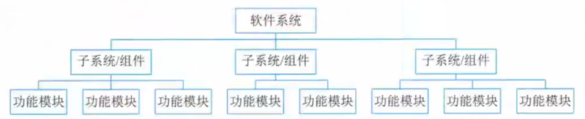

# 第十二章 项目管理

## 知识点目录

1. 进度管理
2. 软件配置管理
3. 质量管理
4. 风险管理

> 注：本章重要度不高，考 2 分左右，了解考点即可，不必深挖。
> 注：目录截图在"4 风险管理"处截断，后续如有小节继续补充。

## 1 进度管理

- **概念**：进度 = `对执行活动和里程碑所制定的工作计划`；进度管理 = `确保项目按期完成`的管理过程，含 6 项活动：`活动定义、活动排序、活动资源估计、活动历时估计、制定进度计划、进度控制`。
- **工作分解结构（WBS）**：把项目按一定原则分解成任务 → 一项项工作 → 分配到每个人的日常活动，`直到分解不下去为止`。
  - 树形结构`最底层 = 工作包`：最低层次的可交付成果，由`唯一主体`负责完成。
  - 常见分解方式 6 种：`按物理结构、按功能、按实施过程、按实施单位、按项目目标、按部分或职能`分解。
  - 分解基本要求 5 条：① 工作包`可控可管理`；② 一般原则`树形结构不超过 6 层`；③ `每个工作包有一个交付成果`；④ `每个任务有明确定义的完成标准`；⑤ `有利于责任分配`。

- **进度安排的常用图形描述方法**：`Gantt 图（甘特图）` 与 `项目计划评审技术（PERT）图`。
  - 甘特图（见下图）：行=任务、列=时间，条形表示起止区间；`绿色=已完成、灰色=未完成`，带"今天"标记。
  - PERT 图（见下图）：有向图，圆=活动、箭头=依赖方向、边上数字=历时。

- **关键路径法**：`关键路径` = 项目的`最短工期`，却是`从开始到结束时间最长的路径`（可能多条，随活动变化）；`关键活动` = 关键路径上的活动，`ES=LS`。
- **节点活动 4 个时间**：`ES 最早开始`、`EF 最早结束`（`EF=ES+工期`）、`LF 最迟结束`、`LS 最迟开始`（`LS=LF-工期`）。
- `总浮动时间` = `LS-ES`（= `LF-EF`，= `关键路径-非关键路径时长`）：不延误项目完工、不违反进度制约下可推迟的时间量；**关键活动总浮动时间为零**。
- `自由浮动时间` = `紧后活动最早开始时间的最小值 - 本活动的最早完成时间`：不延误任何紧后活动最早开始时间的前提下可推迟的时间量。
- 辨析：总浮动看`项目完工`（LS-ES），自由浮动看`紧后活动`；一般`总浮动 ≥ 自由浮动`。
- **节点六格时间盒**：图中每个节点（活动）的框分 6 格——`ES | 工期 | EF / 活动名称 / LS | 总浮动 | LF`（布局见下图）。
  - `顺推`：`ES=所有前置活动 EF 的最大值`，`EF=ES+持续时间`。
  - `逆推`：`LF=所有后续活动 LS 的最小值`，`LS=LF-持续时间`。
  - 示例读图（见上图）：关键路径 `A→B→F→G→H`（这 5 个节点总浮动均为 0），项目总工期 `235`；C 总浮动 5、D/E 总浮动 157。

- **真题 1（项目工期）**：A~H 八作业（所需时间 1/3/3/5/7/6/5/1，紧前见原文表）求工期 = 关键路径长度 → 关键路径 `A→D→F→H` = 1+5+6+1，**答案 B（13 周）**。
- **真题 2（最低成本赶工）**：间接费用 5 万/天。正常工期 15 天（关键路径 `B→G→H`）；赶 G 一天 3 万 < 5 万，值得 → 14 天；再赶需 6 万/天 > 5 万，停 → **14 天（B，待下页确认）**。

## 2 软件配置管理

- **软件配置管理（SCM）** = `标识、组织和控制修改的技术`，应用于`整个软件工程过程`。
- **SCM 活动目标**：`标识变更、控制变更、确保变更正确实现并报告变更`；最终目的`错误降为最小并最有效地提高生产效率`。
- **核心内容**：`版本控制` + `变更控制`。
- **引起变更的因素（2 个）**：① `外部的变更要求`；② `开发过程内部的变更要求`。

## 3 质量管理

- **软件质量** = `软件与明确地和隐含地定义的需求相一致的程度`（= 明确叙述的功能/性能需求 + 文档中的开发标准 + 专业软件应有的隐含特征）。
- **质量影响因素 3 组**（三角图，见配图）：`产品修改`（可理解/可维修/灵活/可测试）、`产品转移`（可移植/可再用/互运行）、`产品运行`（正确性/健壮性/效率/完整性/可用性/风险）。

- **软件质量保证（SQA）** = `建立一套有计划、有系统的方法，向管理层保证标准/步骤/实践/方法被所有项目正确采用`；通过`评审和审计`验证软件合乎标准。关注点：`一开始就避免缺陷的产生`。
- **SQA 4 主要目标**：① `事前预防工作`（预防而非检查）；② `刚刚引入缺陷时即将其捕获`；③ `作用于过程而不是最终产品`；④ `贯穿于所有的活动之中`。
- **SQA 主要任务**：`SQA 审计与评审、SQA 报告、处理不符合问题`。
- **质量认证**：检验`整个企业的质量水平`/整体资质/质量体系；国内主要采用`ISO 9000` 和 `CMM（能力成熟度模型）`。

## 4 风险管理

- **软件项目风险**：开发过程中遇到的预算/进度等问题 + `这些问题对软件项目的影响`；若风险成真 → 影响进度、增加成本、甚至项目不能实现。
- **风险管理主要目标**：`预防风险`；流程 = `辨识风险 → 评估出现概率及影响 → 建立规划来管理风险`。
- **两大体系（均偏重理论）**：
  - `Boehm`：`风险估计`（辨识/分析/排序）+ `风险控制`（计划/处理/监督）。
  - `Charrette`：`分析`（辨识/估计/评价）+ `管理`（计划/控制/监督），与 Boehm 接近。
