# 第十三章 系统架构设计

## 知识点目录

1. 软件架构的概念
   - 1.1 软件架构设计与生命周期
2. 基于架构的软件开发方法
3. 软件架构风格
   - 3.1 基本架构风格
   - 3.2 层次结构风格
   - 3.3 面向服务的架构 SOA
4. 软件架构复用
5. 特定领域软件架构 DSSA
6. 系统质量属性与架构评估
   - 6.1 软件系统质量属性
   - 6.2 系统架构评估
   - 6.3 基于场景的评估方法

> 注：目录截图在"6.3 基于场景的评估方法"处截断，后续如有小节继续补充。

## 1 软件架构的概念

- **定义**：软件体系结构 = `系统的一个或者多个结构`，内容包括`软件的构件、构件的外部可见属性以及它们之间的相互关系`。
- **本质**：体系结构**不是可运行软件**，而是`一种表达`，使工程师能够：
  1. `分析设计在满足所规定的需求方面的有效性`；
  2. 在`设计变更相对容易的阶段`考虑体系结构`可能的选择方案`；
  3. `降低与软件构造相关联的风险`。
- **构件**：可简单到`程序模块或面向对象的类`，也可`扩充到包含数据库和能够完成客户与服务器网络配置的“中间件”`。
- **设计两个层次**：`数据设计`（传统系统的数据构件、OO 系统的类定义，封装属性和操作）+ `体系结构设计`（关注`构件的结构、属性和交互作用`）。
- 体系结构设计是`构建软件的初始蓝图`，目标是提供`导出体系结构设计的系统化方法`。

### 1.1 软件架构设计与生命周期

- **需求分析阶段**：需求分析与 SA 设计面向不同对象——`一个是问题空间，另一个是解空间`。模型转换关注两点：`如何根据需求模型构建 SA 模型`、`如何保证转换的可追踪性`。
  - Use Case 方法：Use Case 图 → SA 模型（类图等）经`词法分析 + 经验规则`完成；可追踪性用`表格 / Use Case Map`维护。
  - 软件复用角度：`已有系统的 SA 模型`可对新系统需求工程起借鉴作用；需求阶段研究 SA 可使 SA 概念`贯穿整个软件生命周期`，保证概念完整性与各阶段可追踪性。
- **设计阶段**（SA 研究`最早和最多`关注的阶段）：研究 SA 模型的描述、设计与分析方法、设计经验的总结与复用。SA 模型描述研究分 3 个层次：
  1. `SA 基本概念`：模型由哪些元素组成、按何种原则组织——`构件和连接子`。
  2. `体系结构描述语言 ADL`：描述构件、连接子及其配置的语言；`ADL 对连接子的重视`是区分 ADL 与其他建模语言的重要特征之一。典型 ADL：UniCon、Rapide、Darwin、Wright、C2 SADL、Acme、xADL、XYZ/ADL、ABC/ADL。
  3. `SA 模型的多视图表示`：多视图组织描述整体模型。典型：`4+1 模型`（逻辑/进程/开发/物理视图 + 统一场景）、Hofmesiter 4 视图（概念/模块/执行/代码）、CMU-SEI Views and Beyond（模块/构件和连接子/分配视图）。

- **实现阶段**（SA 设计 → 实现的转换）：
  - 研究三方面：`基于 SA 的开发过程支持`（项目组织结构、配置管理）、`从 SA 向实现过渡的途径`（引入程序设计语言元素、模型映射、构件组装、复用中间件平台）、`基于 SA 的测试技术`。
  - SA 可扩充配置管理能力（引入版本、可选项信息，记录不同版本构件/连接子的演化）；缩小高层模型与底层实现鸿沟的 3 种手段：`SA 模型引入实现阶段概念`、`模型转换逐步精化`、`封装底层细节成大粒度构件再组装`（需中间件平台支持）。

- **构件组装阶段**：SA 设计模型起`系统蓝图`作用，可复用构件组装在较高层次实现系统。
  - 研究：如何支持`可复用构件的互联`（对规约的连接子实现提供支持）；组装中如何`检测并消除体系结构失配`。
  - 中间件：遵循构件标准，支持互联、提供公共服务（安全、命名等）；优势：`跨平台交互、遵循工业标准、产品化公共服务保证质量属性`。
  - 失配问题 3 类：`构件引起`、`连接子引起`、`对全局体系结构的假设冲突引起`。
- **部署阶段**：
  - （1）提供`高层体系结构视图`描述部署阶段的软硬件模型。
  - （2）`基于 SA 模型分析部署方案的质量属性`，选择合理方案。
  - 现阶段研究集中在组织和展示部署阶段 SA、评估分析部署方案；分析往往停留在`定性层面`，需部署人员参与。

- **后开发阶段**（软件部署安装之后）：SA 研究围绕`维护、演化、复用`。
  - `动态软件体系结构`：软件具有动态性，`体系结构会在运行时改变`。两类变化：`内部执行导致的改变`（运行中创建新构件响应请求）、`外部请求的重配置`（高安全性系统不能停机）。
    - 研究两部分：`设计阶段的支持`（变化描述、生成修改策略、推理修改影响）、`运行时刻基础设施的支持`（维护体系结构、修改在约束内、构造元素变化映射到实现模块、保证子系统连续执行等）。
  - `体系结构恢复与重建`：现有系统开发时未考虑 SA，从系统中恢复或重构体系结构。4 类方法：`手工重建、工具支持的手工重建、查询语言自动建立聚集、其他技术（如数据挖掘）`。
- **软件架构的重要性**（8 点）：满足`系统品质`、`受益人达成一致的目标`、支持`计划编制过程`、对系统开发有`指导性`、有效`管理复杂性`、为`复用奠定基础`、`降低维护费用`、支持`冲突分析`。

## 2 基于架构的软件开发方法

> 备注：ABSD = Architecture-Based Software Development（基于架构的软件开发）。

- **体系结构驱动**：由`构成体系结构的商业、质量、功能需求`的组合驱动；用`视角和视图`描述架构，用`用例`（功能需求）+ `质量属性场景`（质量需求/非功能需求）描述需求。
- **设计可提前**：`项目总体功能框架明确`即可开始设计——需求获取和分析还没完成就进入软件设计。
- **三个基础**：`功能分解`（基于模块的内聚/耦合技术）、`选择架构风格`实现质量和业务需求、`软件模板的使用`（利用已有软件系统的结构）。
- **自顶向下、递归细化**：顶层系统 → `若干概念子系统 + 一个或若干软件模板`；第 2 层：概念子系统 → `概念构件 + 一个或若干附加软件模板`。
- **ABSD 过程**（6 阶段）：`体系结构需求 → 设计 → 文档化 → 复审 → 实现 → 演化`；两条反馈回路：`0:M`（需求→演化）、`0:N`（设计↔复审）。

- **架构需求**（标识构件三步，见左图）：
  - 需求获取：体系结构需求来自三方面——`系统的质量目标、系统的商业目标、系统开发人员的商业目标`。
  - 标识构件：`为系统生成初始逻辑结构`，三步 = `生成类图 → 对类进行分组 → 把类打包成构件`，`0:N` 循环、需求评审把关。
- **架构设计**（见右图）：`将需求阶段的标识构件映射成构件`，五步 = `提出体系结构模型 → 映射构件 → 分析构件间的相互作用 → 产生体系结构 → 设计评审`，`0:N` 循环。
- **架构文档化**：产出两种文档——`架构（体系结构）规格说明`、`测试架构（体系结构）需求的质量设计说明书`；文档是所有人员通信的手段，`关系开发成败`。

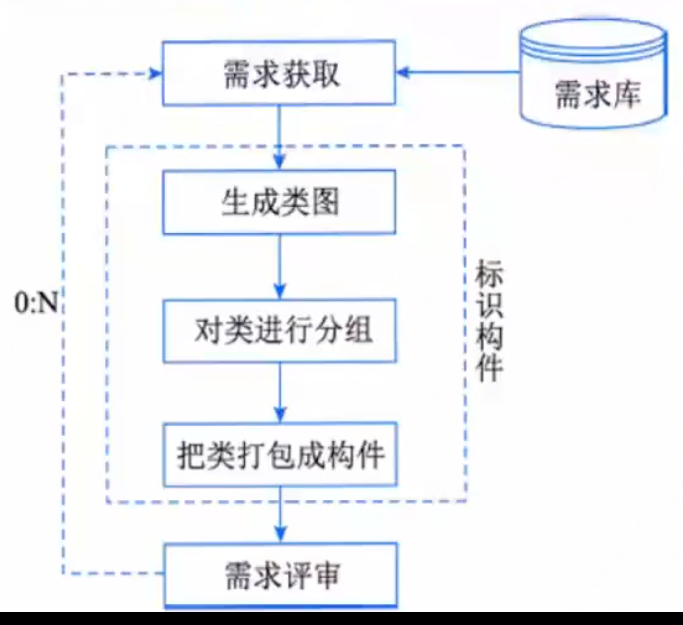

- **架构复审**：`安排一次由外部人员（用户代表和领域专家）参加的复审`；`搭建可运行的最小化系统`评估架构是否满足需要、有无技术和协作风险；目的 = `标识潜在风险、及早发现设计与错误`（检查：能否满足需求、质量需求是否体现、层次是否清晰、构件划分是否合理、文档表达是否明确）。
- **架构实现**（见左图）：`用实体显示出架构`——`分析与设计 → 构件实现 → 构件组装 → 系统测试`，`构件库`支撑，产出体系结构演化。
- **架构演化**（见右图）：`按需求增删构件、使架构可复用`——`需求变化归类 → 体系结构演化计划 → 构件变动 → 更新构件相互作用 → 构件组装与测试 → 技术评审`，`0:N` 回路、`构件库`支撑。

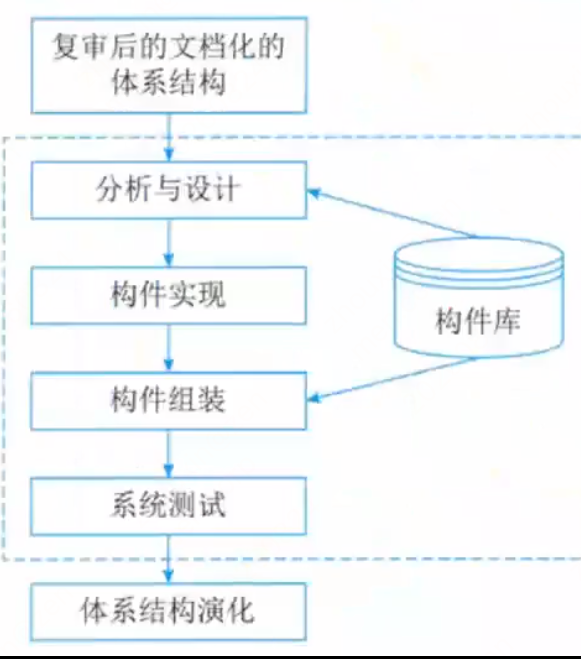

## 3 软件架构风格

### 3.1 基本架构风格

- **定义**：架构风格 = `描述特定应用领域中系统组织方式的惯用模式`，定义一个`系统家族` = `词汇表（构件+连接件类型）+ 一组约束（如何组合）`；核心目标 = `重复的体系结构模式`（架构级重用）。
#### 五大架构风格分类（超级重点）

以下是五个大分类，具体架构风格必须归入对应的大分类记忆：

##### 1. 数据流风格

`面向数据流，按照一定的顺序从前向后执行程序`，代表的具体风格有 `批处理序列、管道-过滤器`。

###### 批处理风格

`每步是单独程序、序贯执行、数据完整整体传递`；构件 = 独立应用程序，连接件 = 媒介。

  

###### 管道-过滤器

`一步输出 = 下一步输入`；构件 = `过滤器（Filter）`，连接件 = `管道（Pipe）`。

  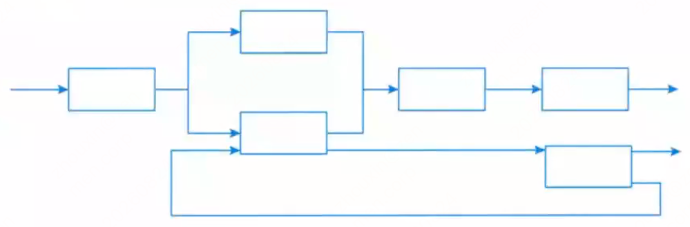

##### 2. 调用/返回风格

构件之间`存在互相调用的关系，一般是显式的调用`，代表的具体风格有 `主程序/子程序、面向对象、层次结构、客户端/服务器架构风格`。

###### 主程序/子程序

`单线程控制`，`过程调用`充当连接件。

###### 面向对象

`构件是对象`（抽象数据类型的实例），通过调用交互。

  

###### 层次结构

`每层为上层服务、用下层服务、只见邻接层`；修改一层`最多影响相邻两层`。

  

###### 客户端/服务器架构风格

属于`调用/返回风格`。两层 C/S = `数据库服务器 + 客户应用程序 + 网络`（“`胖客户机，瘦服务器`”）；三层 C/S `增加一个应用服务器`（逻辑驻留服务器）=“`瘦客户机`”，分`表示层、功能层、数据层`三层。

##### 3. 以数据为中心的架构风格

`所有的操作都是围绕建立的数据中心进行的`，代表的具体风格有 `仓库风格、黑板风格`。

###### 仓库架构风格

属于`以数据为中心的架构风格`。仓库 = `存储和维护数据的中心场所`；两种构件：`中央数据结构`（描述当前数据状态）+ `一组对中央数据进行操作的独立构件`；仓库与独立构件相互作用在系统中变化大；连接件 = `仓库与独立构件之间的交互`。

  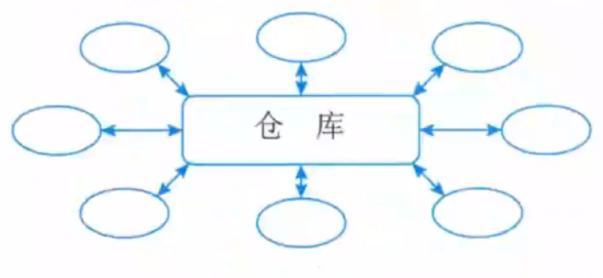

###### 黑板架构风格

属于`以数据为中心的架构风格`。适用于`复杂的非结构化问题`，求解时`综合运用多种不同知识源`；黑板系统 = `问题求解模型`，`将问题解空间组织成一个或多个应用相关的分级结构`，由知识表达、推理框架、控制机制组合实现；三部分：`知识源、黑板（共享数据）、控制`。
- **黑板系统传统应用**：`信号处理领域`（语音识别、模式识别）；另一应用 = `松耦合代理数据共享存取`。

  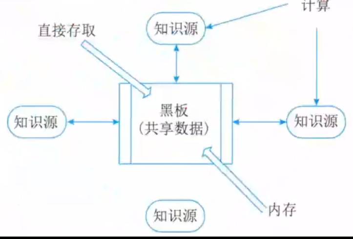

##### 4. 虚拟机风格

`人为构建一个运行环境`，在这个环境之上解析和运行自定义语言，代表的具体风格有 `解释器、基于规则的系统`。

###### 解释器

通常由 4 部分组成：`解释引擎 + 被解释代码的存储区 + 解释引擎当前工作状态数据结构 + 源代码解释执行进度数据结构`；通过虚拟机`仿真硬件执行过程和一些关键应用`；缺点 = `执行效率低`；典型例子 = `专家系统`。

  

###### 基于规则的系统

组成 = `规则集、规则解释器、规则/数据选择器、工作内存`；一般用于`人工智能领域和 DSS`。

  

##### 5. 独立构件风格

`构件之间是互相独立的，不存在显式的调用关系`，通过事件触发、异步方式执行，代表的具体风格有 `进程通信、事件驱动系统（隐式调用）`。

###### 进程通信

`构件是独立进程，连接件是消息传递`；构件通常是`命名进程`；消息传递方式包括`点到点、异步/同步、远程过程调用`等。

###### 事件驱动系统（隐式调用）

构件`不直接调用过程，而是触发或广播事件`；其他过程`向事件注册`，事件触发后系统自动调用所有已注册过程。构件 = `模块`（过程或事件集合）。
  - 优点 = `支持软件复用，便于构件维护和演化`；缺点 = `构件放弃对系统计算的控制`。

  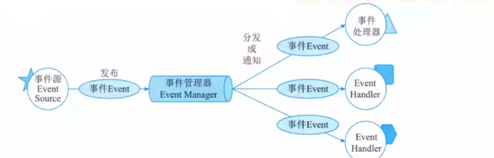

### 超级重点：架构风格对比表（课件原文，必须背）

| 架构风格 | 必背关键词/实例 | 一句话特征 |
| --- | --- | --- |
| 数据流-批处理 | 传统编译器，每个阶段产生的结果作为下一个阶段的输入，区别在于整体。 | 一个接一个，以整体为单位。 |
| 数据流-管道-过滤器 | 传统编译器，每个阶段产生的结果作为下一个阶段的输入，区别在于整体。 | 一个接一个，前一个输出完后一个输入。 |
| 调用/返回-主程序/子程序 |  | 显式调用，主程序直接调用子程序。 |
| 调用/返回-面向对象 |  | 对象是构件，通过对象调用封装的方法和属性。 |
| 调用/返回-层次结构 |  | 分层，每层最多影响其上下两层，有调用关系。 |
| 调用/返回-客户端/服务器 |  | 两层 CS：客户端、服务器；三层 CS：表示层、功能层、数据层。 |
| 独立构件-进程通信 |  | 进程间独立的消息传递，同步异步。 |
| 独立构件-事件驱动（隐式调用） | 事件触发推动动作，如程序语言的语法高亮、语法错误提示。 | 不直接调用，通过事件驱动。 |
| 虚拟机-解释器 | 自定义流程，按流程执行，规则随时改变，灵活定义，业务组合灵活。 | 解释自定义的规则，解释引擎、存储区、数据结构。 |
| 虚拟机-规则系统 | 自定义流程，按流程执行，规则随时改变，灵活定义，业务组合灵活。机器人。 | 规则集、规则解释器、选择器和工作内存，用于DSS 和人工智能、专家系统。 |
| 数据中心-仓库 | 现代编译器的集成开发环境 IDE，以数据为中心。又称为数据共享风格。 | 中央共享数据源，独立处理单元。 |
| 数据中心-黑板 | 现代编译器的集成开发环境 IDE，以数据为中心。又称为数据共享风格。 | 语音识别、知识推理等问题复杂、解空间很大、求解过程不确定的这一类软件系统，黑板、知识源、控制。 |
| 闭环-过程控制 | 汽车巡航定速、空调温度调节，设定参数，并不断调整。 | 发出控制命令并接受反馈，循环往复达到平衡。 |

### 3.2 层次结构风格

> 归类提醒：`主程序/子程序、面向对象、层次结构、客户端/服务器架构、三层 C/S`均属于**调用/返回风格**。本节是在该大分类下继续展开具体架构。

#### C/S 与 B/S（必背）

| 架构 | 结构与关键词 | 优点 / 缺点 |
| --- | --- | --- |
| 两层 C/S | `数据库服务器 + 客户应用程序 + 网络`；客户端和服务器都有处理功能；“胖客户机，瘦服务器” | 客户端复杂、开发/维护/升级/移植困难，安全性差，服务器压力大且难复用，现在已经不常用 |
| 三层 C/S | 把处理功能独立出来；`表示层（客户机）+ 功能层（应用服务器）+ 数据层（数据库服务器）`；“瘦客户机” | 逻辑独立、平台选择灵活、可并行开发、管理与安全更好；重点考虑各层之间的通信效率 |
| 三层 B/S | 三层 C/S 的变形：客户机 → 浏览器，应用服务器 → Web 服务器；又称0 客户端架构 | 动态页面和数据库处理能力不足、安全难控制、响应慢、交互弱，不适合 OLTP |

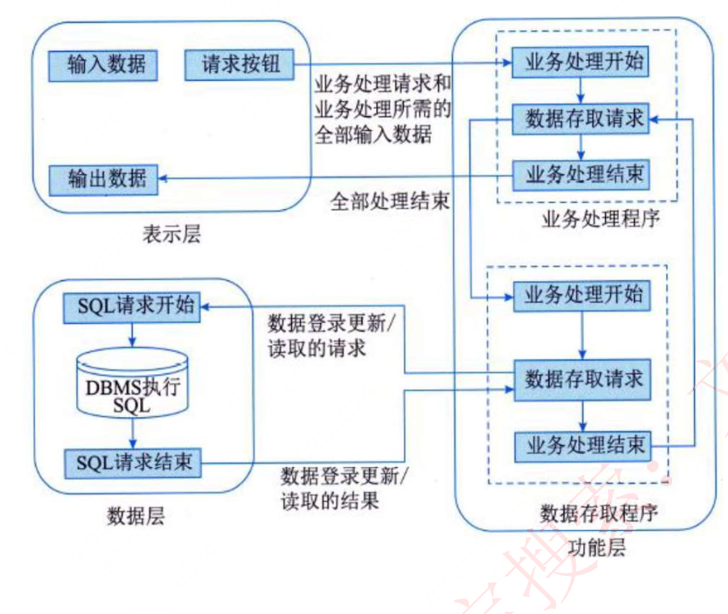

**三层 C/S 的四个优势**：

1. 各层逻辑相对独立，可维护、可扩展。
2. 可灵活选用各层平台和硬件，开放、易升级。
3. 各层可并行开发，可采用不同语言。
4. 功能层隔离表示层与数据层，安全管理更好，管理层次更合理、可控。

#### 混合架构与 RIA

- **混合架构**：`内外有别` = 内部 C/S、外部 B/S；`查改有别` = 查询用 B/S、修改用 C/S。
- **RIA**：结合 C/S 响应快、交互强和 B/S 传播广、易传播；客户端缓存数据，减少服务器往返；简化并改进 B/S 用户交互。本质仍是0 客户端，通过高速网络缓存必要插件，典型实例是`小程序`。

#### MVC、MVP、MVVM（对比必背）

| 模式 | 核心关系 | 关键点 |
| --- | --- | --- |
| MVC | Model + View + Controller | Controller = 处理用户交互；Model = 处理应用程序数据逻辑；View = 处理数据显示，不做业务处理 |
| MVP | Model + View + Presenter | Presenter 替代 Controller；View 与 Model 不直接通信，全部通过 Presenter；View 被动且薄，Presenter 承担逻辑并通过接口复用 |
| MVVM | Model + View + ViewModel | ViewModel 通过数据绑定连接 View/Model；优势：`低耦合、可重用、独立开发、可测试` |

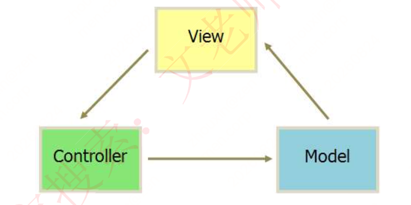

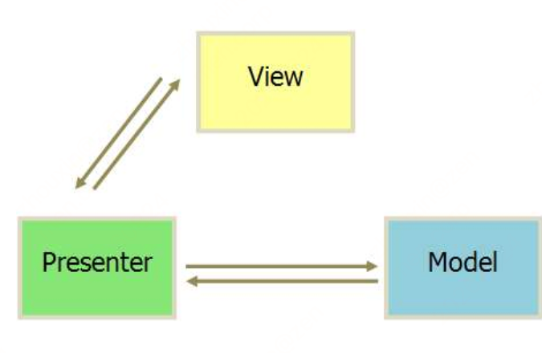

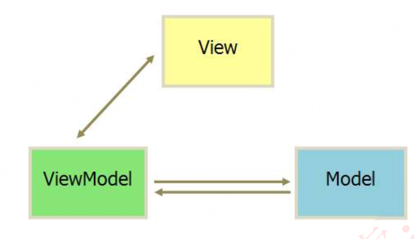

### 3.3 面向服务的架构 SOA

#### SOA 核心概念

- **定义**：SOA = 粗粒度、松耦合服务架构；服务是为满足业务需求而形成的`操作和规则的逻辑组合`。
- **通信与价值**：服务通过`企业服务总线 ESB`请求，目标是最大限度复用企业 IT 资产。
- **演进规律**：`对象 → 构件 → 服务` = `耦合更松、粒度更粗、接口更标准`。

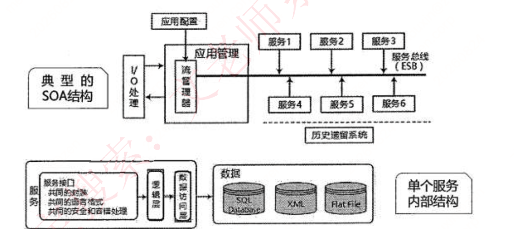

#### SOA 实施特征（必背）

企业外部可访问、随时可用、粗粒度接口、服务分级、松散耦合、服务可重用、接口设计管理、接口标准化、支持多种消息模式、接口精确定义。

其中接口标准化以`WSDL、SOAP、XML`为核心。

#### 服务构件 vs 传统构件

| 对比项 | 服务构件 | 传统构件 |
| --- | --- | --- |
| 粒度 | `粗粒度` | 多为细粒度 |
| 接口 | 标准接口，主要用 `WSDL` | 具体 API |
| 实现语言 | 与语言无关 | 通常与特定语言绑定 |
| QoS | 可由构件容器提供 | 通常由代码直接控制 |

#### Web Service 三大基础协议（必背）

Web Service 最基本的协议包括UDDI、WSDL 和 SOAP：

- `UDDI = Universal Description, Discovery and Integration`，统一描述、发现和集成。
- `WSDL = Web Services Description Language`，Web 服务描述语言。
- `SOAP = Simple Object Access Protocol`，简单对象访问协议。

| 协议 | 一句话记忆 | 核心内容 |
| --- | --- | --- |
| UDDI | 统一描述、发现和集成，负责注册、发布和查找 | 提供者发布，请求者查找 |
| WSDL | 用 XML 描述服务 | 做什么（操作）、怎么访问（格式/协议）、在哪里（URL） |
| SOAP | 基于 XML 的分布式信息交换协议 | 封装、编码规则、RPC、绑定；目标是简单性、可扩展性 |

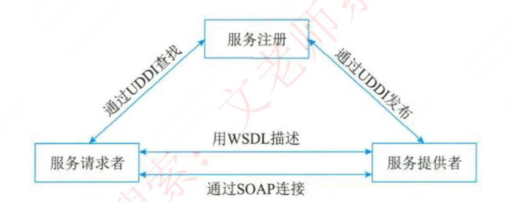

**UDDI 交互关系**：提供者通过 UDDI `发布`，请求者通过 UDDI `查找`；WSDL 负责`描述`，SOAP 负责`绑定和消息交换`。

**WSDL 必背**：Web Service 被描述为`端口集合`，包含操作/消息的抽象定义、具体协议绑定和网络端点；两类文档为`服务接口文档、服务实现文档`。

**SOAP 四部分**：`SOAP 封装、SOAP 编码规则、SOAP RPC、SOAP 绑定`。

#### Web Service 架构与六层结构

- **三种角色**：服务提供者、服务注册中心（可选中介）、服务请求者。
- **三种操作**：提供者向注册中心`发布`，请求者从注册中心`查找`，请求者与提供者`绑定`。

| 层次 | 作用 / 协议 |
| --- | --- |
| 底层传输层 | 传输消息：`HTTP、JMS、SMTP` |
| 服务通信协议层 | 服务间通信：`SOAP、REST` |
| 服务描述层 | 描述服务：`WSDL` |
| 服务层 | 包装企业应用，按 WSDL 标准调用 |
| 业务流程层 | 服务发现、调用和点到点调用：`WSDPEL` |
| 服务注册层 | 注册服务：`UDDI` |

**服务注册三步**：服务注册 → 服务位置 → 服务绑定，对应`公布功能 → 查询服务 → 按接口编码、绑定并调用`。

#### 企业服务总线 ESB（必背）

- **定义**：ESB = `Enterprise Service Bus`，是连接各服务节点的一根管道。
- **核心作用**：集成不同协议的服务，完成消息转换、解释和路由，使服务互联互通。
- **组成**：`客户端（请求者）+ 基础架构服务（中间件）+ 核心集成服务（提供者）`。

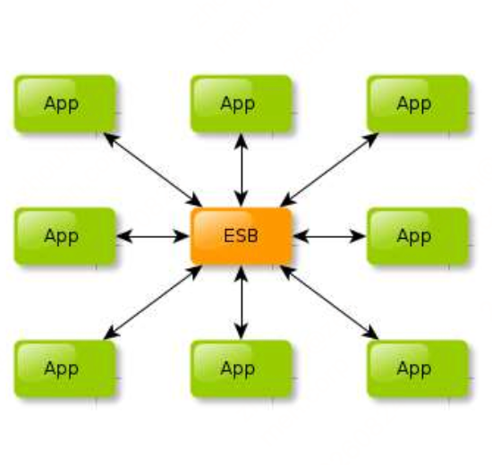

**六项功能**：位置透明的消息路由和寻址、服务注册和命名、支持多种消息传递范型、支持多种传输协议、支持多种数据格式及转换、日志和监控。

## 4 软件架构复用

- **软件产品线**：一组`软件密集型系统`，共享`公共、可管理的特性集`，围绕`核心资产库`管理、复用并集成新系统。
- **核心资产库**：架构及可剪裁元素，还包括设计与文档、用户手册、项目历史记录、测试计划和用例。
- **软件复用**：识别、开发、分类、获取和修改软件实体，使其能在不同开发过程中重复使用。

### 复用类型（必背）

| 类型 | 判断关键词 |
| --- | --- |
| 机会复用 | 开发中发现可复用资产，就进行复用 |
| 系统复用 | 开发前进行规划，预先决定复用哪些资产 |

可复用资产包括：`需求、架构设计、元素、建模与分析、测试、项目规划、过程、方法和工具、人员、样本系统、缺陷消除`。

### 复用基本过程（必背）

1. 构造／获取可复用资产。
2. 管理可复用资产：核心是`构件库`，关键问题是构件分类、构件检索。
3. 使用可复用资产：获取需求 → 检索资产库 → 获取资产 → 修改/扩展/配置 → 组装集成 → 最终系统。

## 5 特定领域软件架构 DSSA

- **全名**：DSSA = `Domain Specific Software Architecture`，特定领域软件架构。
- **定义**：专用于一类特定任务（领域）、在整个领域中有效使用、规定标准组合结构的软件构件集合。
- **组成与目标**：由`领域模型、参考需求、参考架构`等组成，目标是支持特定领域中多个应用的生成。

### DSSA 必备特征（必背）

`严格定义的问题域和问题解域、普遍性、对构件组织模型的恰当抽象、固定且典型的可重用元素`。

### 垂直域与水平域

| 类型 | 含义 |
| --- | --- |
| 垂直域 | 一个特定领域中通用的软件架构，是完整架构 |
| 水平域 | 多个不同领域之间相同部分的小工具，如购物和教育领域共有的收费系统 |

## 6 系统质量属性与架构评估

### 6.1 软件系统质量属性

软件系统质量 = `软件系统与明确地和隐含地定义的需求相一致的程度`。

#### 六大质量维度

| 维度 | 子属性 |
| --- | --- |
| 功能性 | 适合性、准确性、互操作性、依从性、安全性 |
| 可靠性 | 容错性、易恢复性、成熟性 |
| 易用性 | 易学性、易理解性、易操作性 |
| 效率 | 资源特性、时间特性 |
| 维护性 | 可测试性、可修改性、稳定性、易分析性 |
| 可移植性 | 适应性、易安装性、一致性、可替换性 |

#### 开发期 vs 运行期

| 类型 | 必背属性 |
| --- | --- |
| 开发期 | 易理解性、可扩展性（灵活性）、可重用性、可测试性、可维护性、可移植性 |
| 运行期 | 性能、安全性、可伸缩性、互操作性、可靠性、可用性、鲁棒性（健壮性） |

### 6.2 系统架构评估

| 属性 | 记忆要点 | 设计策略 / 指标 |
| --- | --- | --- |
| 性能 | 响应时间、吞吐量 | 优先级队列、增加资源、减少开销、并发、资源调度 |
| 可靠性 | 容错、健壮；MTTF、MTBF、MTTR | 心跳、Ping/Echo、冗余、选举 |
| 可用性 | 正常运行时间比例 | 心跳、Ping/Echo、冗余、选举 |
| 安全性 | 保密、完整、不可抵赖、可控 | 入侵检测、认证、授权、追踪审计 |
| 可修改性 | 低成本快速变更；维护、扩展、重组、移植 | 接口-实现分类、抽象、信息隐藏 |
| 功能性 | 完成期望工作，多个构件协作 | 关注功能需求 |
| 可变性 | 扩充或变更成为新架构；产品线重要 | 遵循预定义规则 |
| 互操作性 | 与其他系统/环境交换数据、调用服务 | 设计外部可视功能和数据结构的入口 |

### 6.3 基于场景的评估方法

质量属性场景 = `面向特定质量属性的需求`，六要素口诀：

| 要素 | 含义 |
| --- | --- |
| 刺激源 Source | 生成刺激的实体：人、计算机系统等 |
| 刺激 Stimulus | 到达系统时需要考虑的条件 |
| 环境 Environment | 刺激发生的条件，如过载、运行状态 |
| 制品 Artifact | 被刺激的整个系统或系统部分 |
| 响应 Response | 刺激到达后系统采取的动作 |
| 响应度量 Measurement | 度量响应，检验需求是否满足 |

#### 可用性场景（表格内容需掌握）

| 场景要素 | 可能的情况 |
| --- | --- |
| 刺激源 | 系统内部、系统外部 |
| 刺激 | 疏忽、错误、崩溃、时间 |
| 环境 | 正常操作、降级模式 |
| 制品 | 系统处理器、通信信道、持久存储器、进程 |
| 响应 | 检测事件；记录；通知用户或其他系统；按规则禁止故障源；在指定时间内不可用；在正常或降级模式运行 |
| 响应度量 | 必须可用的时间间隔、可用时间、降级运行时间间隔、故障修复时间 |

关注点：故障频率、故障后行为、允许非正常运行时长、安全故障时机、防止故障的方法、故障通知方式。

#### 可修改性场景（表格内容需掌握）

| 场景要素 | 可能的情况 |
| --- | --- |
| 刺激源 | 最终用户、开发人员、系统管理员 |
| 刺激 | 增加、删除、修改功能/质量属性/容量 |
| 环境 | 设计时、编译时、构建时、运行时 |
| 制品 | 用户界面、平台、环境或与目标系统交互的系统 |
| 响应 | 找到架构修改位置；修改且不影响其他功能；测试；部署 |
| 响应度量 | 按受影响元素数量度量成本、努力、资金，以及对其他功能/质量属性的影响程度 |

#### 其他质量属性场景速记

| 场景 | 关注点 | 关键要素 |
| --- | --- | --- |
| 性能 | 系统响应速度 | 刺激源：用户请求/其他系统；刺激：定期、随机、偶然事件；环境：正常/超载；响应：处理刺激、改变服务级别；度量：等待时间、期限、吞吐量、抖动、缺失率、数据丢失率 |
| 可测试性 | 测试效率、发现缺陷/故障的难易程度 | 刺激源：开发、验证、验收人员和用户；制品：设计、代码段、完整应用；响应：访问状态值、提供计算值、准备测试环境；度量：语句执行百分比、故障概率、测试时间、最长测试长度、环境准备时间 |
| 易用性 | 学习、操作效率和用户满意度 | 刺激源：最终用户；环境：运行时或配置时；响应：支持学习、有效使用、降低错误影响、适配和满意；度量：任务时间、错误数量、解决问题数量、满意度、知识获得、成功操作比例、损失时间 |
| 安全性 | 合法用户服务与阻止未授权使用 | 刺激：显示/改删数据、访问服务、降低可用性；环境：在线/离线、联网/断网、防火墙/直连；响应：认证、隐藏身份、授权/撤权、审计、加密、检测高需求、通知并限制服务 |

### 软件架构评估（必背概念）

- 评估时机：`架构设计之后、系统设计之前`。
- 评估目的：在架构分析、评估基础上，`决策架构策略的选取`，评价架构能否解决系统需求；不等同于单纯判断是否满足需求。
- `敏感点`：为实现某质量属性，一个或多个构件所具有的特性。
- `权衡点`：影响多个质量属性的特性，是多个质量属性的敏感点。
- `风险承担者/利益相关人`：对架构施加影响、希望自身目标实现的相关人员。
- `场景`：从风险承担者角度对系统交互的简短描述，通常用刺激、环境、响应描述。

常用评估方式：`调查问卷或检查表、基于场景、基于度量`。

#### SAAM（软件架构分析方法）

| 项目 | 重点 |
| --- | --- |
| 定位 | 最早形成文档并广泛应用的架构分析方法，面向非功能质量属性 |
| 主要属性 | 可修改性 |
| 技术 | 场景技术；协调参与者共同兴趣，达成架构共识 |
| 输入 | 问题描述、需求声明、架构描述 |
| 5 步骤 | 场景开发 → 架构描述 → 单个场景评估 → 场景交互 → 总体评估 |
| 架构描述 | 最终版本但早于详细设计；功能、结构、分配 |
| 易错点 | SAAM 不考虑已有知识库的可重用性 |

#### ATAM（架构权衡分析方法）

- 目标：考虑多个相互影响的质量属性，确定质量属性之间折中的必要性。
- 初始质量属性：`可修改性、安全性、性能、可用性`。
- 评估技术：`场景技术`，包括`用例、增长场景、探测场景`。
- 架构描述：基于`5 种基本结构`，从 4+1 视图派生；逻辑视图分成功能结构和代码结构，用消息顺序图描述运行时交互。
- 4 个活动领域：`场景和需求收集 → 架构视图和场景实现 → 属性模型构造和分析 → 折中`。
- 关键工具：`效用树`，结构为`树根 → 质量属性 → 属性分类 → 质量属性场景（叶子节点）`。

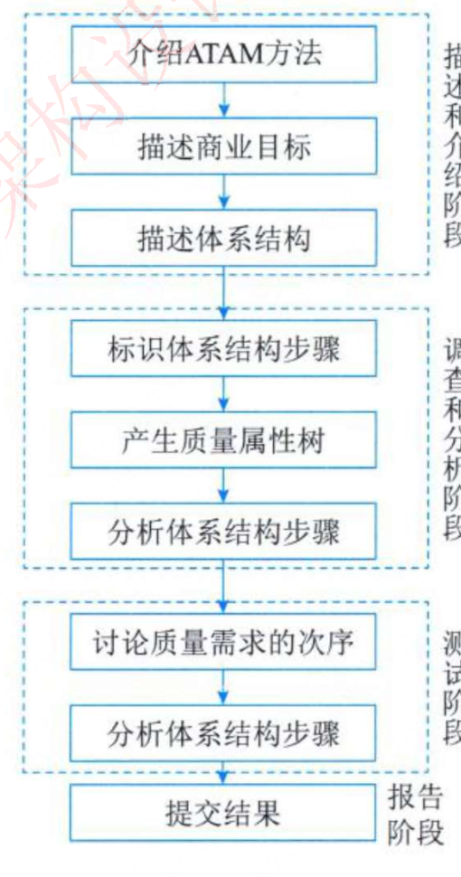

#### CBAM（基于成本效益分析的方法）

CBAM 用于`架构设计决策的成本和收益建模`，根据`投资回报`选择架构策略；在`ATAM 结束时开始`，使用 ATAM 结果。

8 步口诀：`整理场景 → 场景细化 → 确定场景优先级 → 分配效用 → 形成策略-场景-响应级别关系 → 确定响应级别效用 → 计算策略总收益 → 按成本限制和投资回报选策略`。

#### 其他评估方法（仅了解）

| 方法 | 关键词 |
| --- | --- |
| SAEM | 最终产品 + 中间产品；外部/内部质量属性；规约建模、度量准则、评估 |
| SAABNet | 人工智能；BBN；定性知识辅助架构定性评估 |
| SACMM | 软件架构修改的度量 |
| SASAM | 预期架构与实际架构映射比较，静态评估 |
| ALRRA | 架构可靠性风险；动态复杂度、动态耦合度、FMEA |
| AHP | 层次分析法；定性问题定量分析；两两比较求权重 |
| COSMIC+UML | 度量模型；COSMIC 度量；评估架构可维护性 |
