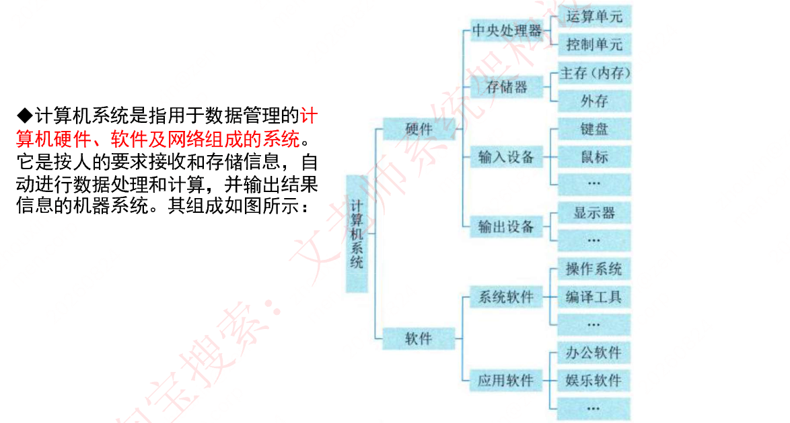

# 第一章 计算机系统基础知识（课件原文）

> 本页为课件原始内容，未经精简。精简笔记见 [笔记 · 第一章](/notes/chapter-01/)。

## 知识点目录

1. 计算机系统组成
2. 计算机硬件
   - 2.1 处理器
   - 2.2 存储器
   - 2.3 总线与接口
3. 计算机软件
   - 3.1 软件分类
   - 3.2 文件与文件系统
   - 3.3 中间件
   - 3.4 构件

## 1 计算机系统组成

计算机系统是指用于数据管理的`计算机硬件、软件及网络`组成的系统。它是按人的要求接收和存储信息，自动进行数据处理和计算，并输出结果信息的机器系统。其组成如图所示：

## 2 计算机硬件

### 2.1 处理器

冯诺依曼5大组成部分：`控制器、运算器、存储器、输入设备、输出设备`。

`运算器和控制器是处理器的核心部件。`

处理器的指令集按照其复杂程度可分为`复杂指令集（CISC）`和`精简指令集（RISC）`。

随着微电子技术发展，用于专用目的的处理器芯片不断涌现，常见的有`图形处理器（GPU）`、`信号处理器（DSP）`以及`现场可编程逻辑门阵列（FPGA）`等。

GPU是一种特殊类型的处理器，具有`数百或数千个内核`，经过优化可`并行运行大量计算`，因此近些年在深度学习和机器学习领域得到了广泛应用。

DSP专用于实时的`数字信号处理`，通过采用饱和算法处理溢出问题，通过乘积累加运算提高矩阵运算的效率，以及为傅里叶变换设计专用指令等方法，在各类高速信号采集的设备中得到广泛应用。

### 2.2 存储器

存储器是利用半导体、磁、光等介质制成`用于存储数据的电子设备`。根据存储器的硬件结构可分为SRAM、DRAM、NVRAM、Flash、EPROM、Disk等。计算机系统中的存储器通常采用分层的体系结构，`按照与处理器的物理距离`可分为4个层次。

（1）`片上缓存`：`在处理器核心中直接集成的缓存`，一般为SRAM结构，实现数据的快速读取。它容量较小，一般为16kB~512kB，按照不同的设计可能划分为一级或二级。

（2）`片外缓存`：`在处理器核心外的缓存`，需要经过交换互联开关访问，一般也是由SRAM构成，容量较片上缓存略大，可以为256kB~4MB。按照层级被称为L2Cache或L3Cache，或者称为平台Cache。

（3）`主存（内存）`：通常采用`DRAM`结构，以独立的部件/芯片存在，通过总线与处理器连接。DRAM依赖不断充电维持其中的数据，容量在数百MB至数十GB之间。

（4）`外存`：可以是磁带、磁盘、光盘和各类Flash等介质器件，这类设备`访问速度慢，但容量大，且在掉电后能够保持其数据`。

### 2.3 总线与接口

总线是指计算机部件间`遵循某一特定协议实现数据交换的形式`，即以一种特定格式按照规定的控制逻辑实现部件间的数据传输。

按照总线在计算机中所处的位置划分为`内总线、系统总线和外部总线`。其中内总线用于`各类芯片内部互连`，也可称为`片上总线或片内总线`。系统总线是指计算机中`CPU、主存、I/O接口的总线`，计算机发展为多总线结构后，系统总线的含义有所变化，狭义的系统总线仍为CPU与主存、通信桥连接的总线；`广义上，还应包含计算机系统内，经由系统总线再次级联的总线`，常被称为`局部总线`。外部总线是`计算机板和外部设备之间，或者计算机系统之间互联的总线`，又称为`通信总线`。总线之间通过桥实现连接，它是一种特殊的外设，主要实现总线协议间的转换。

总线的性能指标常见的有`总线带宽、总线服务质量QoS、总线时延和总线抖动`等。

目前，计算机总线存在许多种类，常见的有`并行总线和串行总线`。并行总线主要包括PCI、PCIe和ATA（IDE）等，串行总线主要包括USB、SATA、CAN、RS-232、RS-485、RapidIO和以太网等。

接口是指`同一计算机不同功能层之间的通信规则`。计算机接口有多种，常见的包括`显示类接口`（HDMI、DVI和DVI等），`音频输入输出类接口`（TRS、RCA、XLR等），`网络类接口`（RJ45、FC等），PS/2接口，USB接口，SATA接口，LPT打印接口和RS-232接口等。此外，像离散量接口与A/D转换接口等这类接口一般属于非标准接口，而是随需求而设计。

对于总线而言，`一种总线可能存在多种接口`。

## 3 计算机软件

### 3.1 软件分类

计算机软件用来扩充计算机系统的功能，提高计算机系统的效率。按照软件所起的作用和需要的运行环境的不同，通常将计算机软件分为`系统软件和应用软件`两大类。

系统软件是`为整个计算机系统配置的不依赖特定应用领域的通用软件`。这些软件`对计算机系统的硬件和软件资源进行控制和管理`，并为用户使用和其他应用软件的运行提供服务。

应用软件是指`为某类应用需要或解决某个特定问题而设计的软件`，如图形图像处理软件、财务软件、游戏软件和各种软件包等。

（操作系统：单独在录播视频第二章扩展讲解。数据库：单独在录播视频第四章扩展讲解。）

（嵌入式系统及软件：单独在录播视频第四章扩展讲解。计算机网络：单独在录播视频第五章扩展讲解。计算机语言、多媒体、系统工程：单独在录播视频第六章讲解。系统性能：单独在录播视频第七章讲解。）

### 3.2 文件与文件系统

文件（File）是`具有符号名的、在逻辑上具有完整意义的一组相关信息项的集合`。

文件是一种抽象机制，它`隐藏了硬件和实现细节`，提供了将信息保存在外存上而且便于以后读取的手段，使用户不必了解信息存储的方法、位置以及存储设备实际操作方式便可存取信息。一个文件包括`文件体和文件说明`。`文件体是文件真实的内容`；`文件说明是操作系统为了管理文件所用到的信息`，包括文件名、文件内部标识、文件类型、文件存储地址、文件长度、访问权限、建立时间和访问时间等。

文件系统是操作系统中`实现文件统一管理的一组软件和数据的集合`，是专门负责管理和存取文件信息的软件机构。文件系统的功能包括`按名存取、统一的用户接口、并发访问和控制、安全性控制、优化性能、差错恢复`。文件的类型：

（1）按文件的性质和用途分类可将文件分为系统文件、库文件和用户文件。

（2）按信息保存期限分类可将文件分为临时文件、档案文件和永久文件。

（3）按文件的保护方式分类可将文件分为只读文件、读/写文件、可执行文件和不保护文件。

（4）UNIX系统将文件分为普通文件、目录文件和设备文件（特殊文件）。

文件的结构是指文件的组织形式。从`用户角度看到的文件组织形式称为文件的逻辑结构`，`文件在文件存储器上的存放方式称为文件的物理结构`。

文件的逻辑结构可分为两大类：一是`有结构的记录式文件`，它是由一个以上的记录构成的文件；二是`无结构的流式文件`，它是由一串顺序字符流构成的文件。

在记录式文件中，`所有的记录通常都是描述一个实体集的`，记录的长度可分为`定长和不定长`。

无结构的流式文件的`文件体为字节流`，不划分记录。无结构的流式文件通常采用`顺序访问方式`，并且每次读/写访问可以指定任意数据长度，其长度以字节为单位。

常见的文件物理结构：`连续结构（顺序结构）、链接结构（串联结构）、索引结构、多个物理块的索引表（链接文件和多重索引方式）`。

文件的存取方法是指读/写文件存储器上的一个物理块的方法。通常有`顺序存取和随机存取`两种方法。

外存空闲空间管理的数据结构通常称为磁盘分配表。空闲空间管理方法有：

（1）`空闲区表`。将外存空间上的一个连续的未分配区域称为"空闲区"。操作系统为磁盘外存上的所有空闲区建立一张空闲表，每个表项对应一个空闲区，适用于连续文件结构。

（2）`位示图`。这种方法是在外存上建立一张位示图，记录文件存储器的使用情况。`每一位对应文件存储器上的一个物理块`，取值0和1分别表示`空闲和占用`。

（3）`空闲块链`。每个空闲物理块中有指向下一个空闲物理块的指针，所有空闲物理块构成一个链表。

（4）`成组链接法`。UNIX系统采用该方法。例如，在实时系统将空闲块分成若干组，每100个空闲块为一组，每组的第1个空闲块登记了下一组空闲块的物理盘块号和空闲块总数。

文件共享中的文件链接有`硬链接和符号链接`两种。

文件的硬链接是指`两个文件目录表目指向同一个索引结点的链接`，该链接也称基于索引结点的链接。换句话说，硬链接是指不同文件名与同一个文件实体的链接。`不利于删除`。

符号链接建立`新的文件或目录`，并与`原来文件或目录的路径名进行映射`，当访问一个符号链接时，系统通过该映射找到原文件的路径，井对其进行访问。

文件系统对文件的保护`常采用存取控制的方式进行`。

实现方式有：`存取控制矩阵`、`存取控制表`（LINUX系统使用，列出一个文件的所有权限用户）、`用户权限表`（列出一个用户能够访问的所有文件）、`密码`。

### 3.3 中间件

中间件作为`应用软件与各种操作系统之间使用的标准化编程接口和协议`，可以起`承上启下`的作用，使应用软件的开发相对`独立于计算机硬件和操作系统`，并能在不同的系统上运行，实现相同的应用功能。中间件分类如下：

1) `通信处理（消息）中间件`：在分布式系统中，人们要建网和制定出通信协议，以保证系统能在不同平台之间通信，实现分布式系统中可靠的、高效的、实时的跨平台数据传输。

2) `事务处理（交易）中间件`：使大量事务在多台应用服务器上能实时并发运行，并进行负载均衡的调度，实现与昂贵的可靠性机和大型计算机系统的同等功能，具有监视和调度整个系统的功能。

3) `数据存取管理中间件`：为在网络上虚拟缓冲存取、格式转换、解压等带来方便。

4) `Web服务器中间件`：浏览器图形用户界面已成为公认规范，然而它的会话能力差，不擅长做数据的写入任务，受HTTP协议的限制多等，就必须对其进行修改和扩充。

5) `安全中间件`。

6) `跨平台和架构的中间件`：在分布式系统中，还需要集成各结点上的不同系统平台上的构件或新老版本的构件。

7) `专用平台中间件`。

8) `网络中间件`：包括网管、接入、网络测试、虚拟社区和虚拟缓冲等。

### 3.4 构件

构件又称为组件，是一个`自包容、可复用的程序集`。构件是一个程序集，或者说是一组程序的集合。这个集合可能会以各种方式体现出来，如源程序或二进制的代码。这个集合整体`向外提供统一的访问接口`，构件外部只能通过接口来访问构件，而不能直接操作构件的内部。

随着软件构件技术的发展，人们开始尝试利用`软件构件进行搭积木式的开发`，即`构件组装模型`。其一般开发过程：`设计构件组装 → 建立构件库 → 构建应用软件 → 测试与发布`。

当前，主流的商用构件标准规范包括`对象管理组织（OMG）的CORBA`、`Sun的J2EE`和`Microsoft的DNA`。

公共对象请求代理架构（CORBA）主要分为`3个层次`：`对象请求代理、公共对象服务和公共设施`。最底层的`对象请求代理（ORB）`规定了分布对象的定义（接口）和语言映射，实现对象间的通信和互操作，是分布对象系统中的"软总线"；在ORB之上定义了很多公共服务，可以提供诸如并发服务、名字服务、事务（交易）服务、安全服务等各种各样的服务；最上层的`公共设施`则定义了构件框架，提供可直接为业务对象使用的服务，规定业务对象有效协作所需的协定规则。

CORBA CCM构件模型是OMG 组织制定的一个用于`开发和配置分布式应用`的服务器端构件模型规范，它主要包括如下3 项内容：

（1）`抽象构件模型`：用以描述服务器端构件结构及构件间互操作的结构。

（2）`构件容器结构`：用以提供通用的构件运行和管理环境，并支持对安全、事务、持久状态等系统服务的集成。

（3）`构件的配置和打包规范`：CCM 使用打包技术来管理构件的二进制、多语言版本的可执行代码和配置信息，并制定了构件包的具体内容和文档内容标准。

J2EE 同时支持`远程方法调用（RMI）和互联网内部对象请求代理协议（IIOP）`，而在服务器端分布式应用的构造形式，则包括了 Java Servlet、JSP、EJB 等多种形式，以支持不同的业务需求。EJB 中的Bean 可以分为会话Bean 和实体Bean，前者维护会话，后者处理事务，通常由Servlet 负责与客户端通信，访问EJB，并把结果通过JSP 产生页面传回客户端。

DNA 2000 融合了当今`最先进的分布式计算理论和思想`，如事务处理、可伸缩性、异步消息队列和集群等内容。DNA 可以开发基于Microsoft平台的服务器构件应用。`Microsoft的DCOM/COM/COM+技术在DNA 2000分布式计算结构基础上，展现了一个全新的分布构件应用模型`。

COM主要为本地的对象连接与嵌入应用服务；DCOM/COM/COM+将其扩充为面向服务器端分布应用的业务逻辑中间件。
