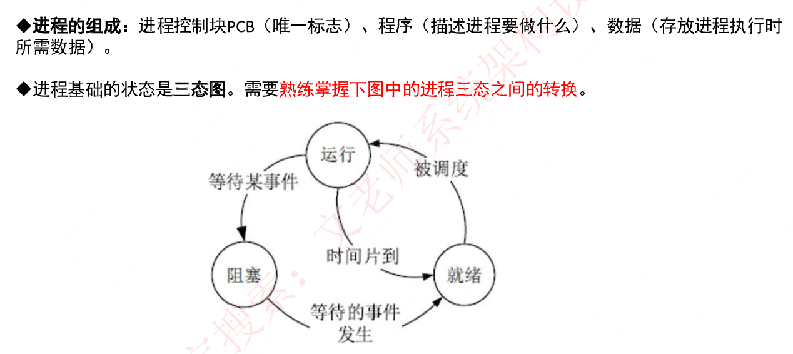
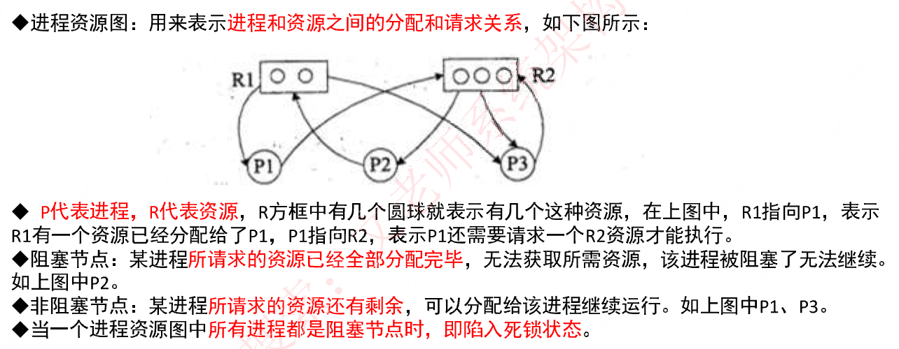
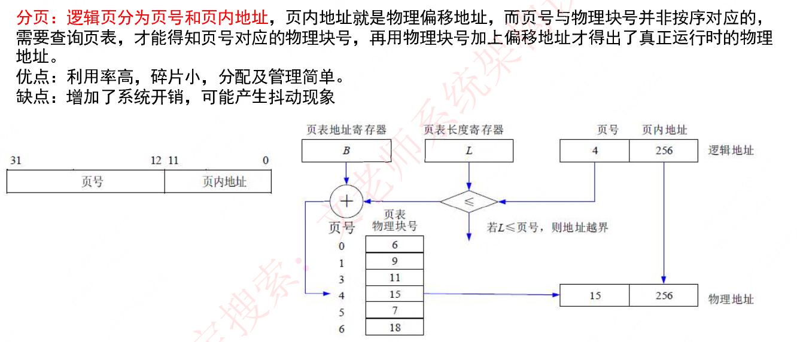
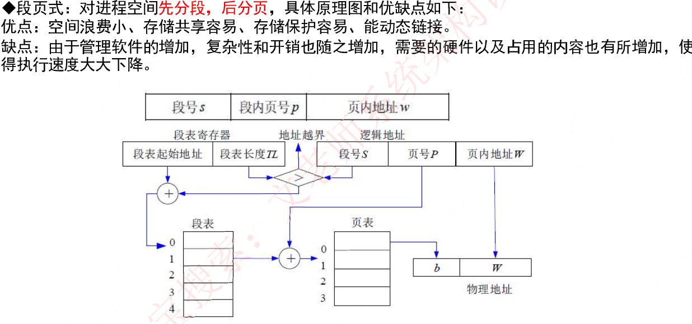
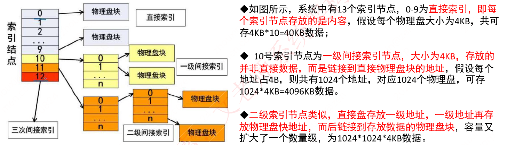

# 第二章 操作系统知识（课件原文）

> 本页为课件原始内容，未经精简。精简笔记见 [笔记 · 第二章](/notes/chapter-02/)。

## 知识点目录

1. 操作系统概述
2. 进程管理
   - 2.1 进程的组成和状态
   - 2.2 进程资源图
   - 2.3 进程间的同步与互斥
   - 2.4 进程调度
   - 2.5 死锁问题
   - 2.6 线程
   - 2.7 中断
3. 存储管理
   - 3.1 分区存储管理
   - 3.2 分页存储管理
   - 3.3 段式存储管理
   - 3.4 段页式存储管理
4. 设备管理
   - 4.1 概述
   - 4.2 I/O 软件
   - 4.3 虚设备和 SPOOLING 技术
   - 4.4 I/O 工作方式
5. 文件管理
   - 5.1 索引文件结构
   - 5.2 文件存储空间管理

> **章节分析**：`本章节改版后仍然每次都考察3-5分，在第二版教材上对应2.3.2，改版后的教材删除了大量内容，但是改版后考试仍然会考察已删除的老版教材内容，因此，除教材内容，还需补充学习`。

## 1 操作系统概述

操作系统是`计算机系统的资源管理者`，它包含对`系统软、硬件资源实施管理的一组程序`，其首要作用就是`通过CPU管理、存储管理、设备管理和文件管理对各种资源进行合理地分配`，改善资源的共享和利用程度，最大限度地发挥计算机系统的工作效率，提高计算机系统在单位时间内处理工作的能力。

操作系统是一种大型、复杂的软件产品，它们通常由`操作系统内核（Kernel）和其他许多附加的配套软件`所组成，包括图形用户界面程序、常用的应用程序（如日历、计算器、资源管理器和网络浏览器等）、实用程序（任务管理器、磁盘清理程序、杀毒软件和防火墙等）以及为支持应用软件开发和运行的各种软件构件（如应用框架、编译器和程序库等）。

操作系统内核指的是`能提供进程管理（任务管理）、存储管理、文件管理和设备管理等功能的那些软件模块，它们是操作系统中最基本的部分`，用于为众多应用程序访问计算机硬件提供服务。

操作系统有三个重要的作用：

第一，`管理计算机中运行的程序和分配各种软硬件资源`；

第二，`为用户提供友善的人机界面`。

第三，`为应用程序的开发和运行提供一个高效率的平台`。

除了上述3个方面的作用之外，操作系统还具有`辅导用户操作（帮助功能）、处理软硬件错误、监控系统性能、保护系统安全`等许多作用。

操作系统的4个特征：

- `并发性`：在一段时间内，宏观上有多个程序同时运行，但实际上在单CPU的运行环境，每一个时刻只有一个程序在执行。
- `共享性`：是指操作系统中的资源（包括硬件资源和信息资源）可以被多个并发执行的进程（线程）共同使用，而不是被一个进程所独占。
- `虚拟性`：是把物理上的一个实体变成逻辑上的多个对应物，或把物理上的多个实体变成逻辑上的一个对应物的技术。
- `不确定性`：在多道程序环境中，允许多个进程并发执行，但由于资源有限，在多数情况下进程的执行不是一贯到底的，而是“走走停停”。

操作系统的功能：

（1）`进程管理`。实质上是对处理机的执行“时间”进行管理，采用多道程序等技术将CPU的时间合理地分配给每个任务，主要包括进程控制、进程同步、进程通信和进程调度。

（2）`文件管理`。主要包括文件存储空间管理、目录管理、文件的读/写管理和存取控制。

（3）`存储管理`。存储管理是对主存储器“空间”进行管理，主要包括存储分配与回收、存储保护、地址映射（变换）和主存扩充。

（4）`设备管理`。实质上是对硬件设备的管理，包括对输入/输出设备的分配、启动、完成和回收。

（5）`作业管理`。包括任务、界面管理、人机交互、图形界面、语音控制和虚拟现实等。

操作系统的分类：

- `批处理操作系统`：单道批处理和多道批处理（主机与外设可并行）。
- `分时操作系统`：一个计算机系统与多个终端设备连接。分时操作系统是将CPU的工作时间划分为许多很短的时间片，轮流为各个终端的用户服务。
- `实时操作系统`：实时是指计算机对于外来信息能够以足够快的速度进行处理，并在被控对象允许的时间范围内做出快速反应。实时系统对交互能力要求不高，但要求可靠性有保障。为了提高系统的响应时间，对随机发生的外部事件应及时做出响应并对其进行处理。
- `网络操作系统`：是使联网计算机能方便而有效地共享网络资源，为网络用户提供各种服务的软件和有关协议的集合。功能主要包括高效、可靠的网络通信；对网络中共享资源的有效管理；提供电子邮件、文件传输、共享硬盘和打印机等服务；网络安全管理；提供互操作能力。三种模式：集中模式、客户端/服务器模式、对等模式。
- `分布式操作系统`：分布式计算机系统是由多个分散的计算机经连接而成的计算机系统，系统中的计算机无主、次之分，任意两台计算机可以通过通信交换信息。通常，为分布式计算机系统配置的操作系统称为分布式操作系统。是网络操作系统的更高级形式。
- `微型计算机操作系统`：简称微机操作系统，常用的有Windows、Mac OS、Linux。

`嵌入式操作系统`：运行在嵌入式智能芯片环境中，对整个智能芯片以及它所操作、控制的各种部件装置等资源进行统一协调、处理、指挥和控制。其主要特点如下：

（1）`微型化`。从性能和成本角度考虑，希望占用的资源和系统代码量少，如内存少、字长短、运行速度有限、能源少（用微小型电池）。

（2）`可定制`。从减少成本和缩短研发周期考虑，要求嵌入式操作系统能运行在不同的微处理器平台上，能针对硬件变化进行结构与功能上的配置，以满足不同应用需要。

（3）`实时性`。嵌入式操作系统主要应用于过程控制、数据采集、传输通信、多媒体信息及关键要害领域需要迅速响应的场合，所以对实时性要求较高。

（4）`可靠性`。系统构件、模块和体系结构必须达到应有的可靠性，对关键要害应用还要提供容错和防故障措施。

（5）`易移植性`。为了提高系统的易移植性，通常采用硬件抽象层（Hardware Abstraction Level，HAL）和板级支撑包（Board Support Package，BSP）的底层设计技术。

`嵌入式系统初始化过程`按照自底向上、从硬件到软件的次序依次为：`片级初始化→板级初始化→系统初始化`。

## 2 进程管理

### 2.1 进程的组成和状态

- `进程的组成`：进程控制块PCB（唯一标志）、程序（描述进程要做什么）、数据（存放进程执行时所需数据）。
- 进程基础的状态是三态图。需要`熟练掌握下图中的进程三态之间的转换`：

### 2.2 进程资源图

进程资源图：用来表示`进程和资源之间的分配和请求关系`，如下图所示：

- `p代表进程，R代表资源`，R方框中有几个圆球就表示有几个这种资源，在上图中，R1指向P1，表示R1有一个资源已经分配给了P1，P1指向R2，表示P1还需要请求一个R2资源才能执行。
- 阻塞节点：某进程`所请求的资源已经全部分配完毕`，无法获取所需资源，该进程被阻塞了无法继续。如上图P2。
- 非阻塞节点：某进程`所请求的资源还有剩余`，可以分配给该进程继续运行。如上图P1、P3。
- 当一个进程资源图中`所有进程都是阻塞节点时，即陷入死锁状态`。

### 2.3 进程间的同步与互斥

- `临界资源`：`各进程间需要以互斥方式对其进行访问`的资源。
- `临界区`：指进程中`对临界资源实施操作的那段程序`。本质是一段程序代码。
- `互斥`：某资源（即临界资源）在`同一时间内只能由一个任务单独使用`，使用时需要加锁，使用完后解锁才能被其他任务使用；如打印机。
- `同步`：`多个任务可以并发执行，只不过有速度上的差异`，在一定情况下停下等待，不存在资源是否单独或共享的问题；如自行车和汽车。
- `互斥信号量`：对临界资源采用互斥访问，使用互斥信号量后其他进程无法访问，`初值为1`。
- `同步信号量`：对共享资源的访问控制，`初值一般是共享资源的数量`。

P/V操作：

- `P操作`：申请资源，`S=S-1`，若S>=0，则执行P操作的进程继续执行；若S<0，则置该进程为阻塞状态（因为无可用资源），并将其插入阻塞队列。
- `V操作`：释放资源，`S=S+1`，若S>0，则执行V操作的进程继续执行；若S<=0，则从阻塞状态唤醒一个进程，并将其插入就绪队列（此时因为缺少资源被P操作阻塞的进程可以继续执行），然后执行V操作的进程继续。

经典问题：`生产者和消费者的问题`

三个信号量：互斥信号量S0（仓库独立使用权），同步信号量S1（仓库空闲个数），同步信号量S2（仓库商品个数）。

生产者流程：生产一个商品S → P(S0) → P(S1) → 将商品放入仓库中 → V(S2) → V(S0)

消费者流程：P(S0) → P(S2) → 取出一个商品 → V(S1) → V(S0)

### 2.4 进程调度

前趋图：用来表示哪些任务可以并行执行，哪些任务之间有顺序关系，具体如下：

前趋图结构：串行 A→B→C→D→E 可转化为并行形式，即 A、B、C 三个节点同时指向 D，D 再指向 E。

可知，A B C可以并行执行，但是必须A B C都执行完后，才能执行D，这就确定了两点：`任务间的并行、任务间的先后顺序`。

进程调度方式是指`当有更高优先级的进程到来时如何分配CPU`。分为`可剥夺`和`不可剥夺`两种，可剥夺指当有更高优先级进程到来时，强行将正在运行进程的CPU分配给高优先级进程；不可剥夺是指高优先级进程必须等待当前进程自动释放CPU。

在某些操作系统中，一个作业从提交到完成需要经历高、中、低三级调度：

（1）高级调度。高级调度又称"长调度""作业调度"或"接纳调度"，它决定`处于输入池中的哪个后备作业可以调入主系统做好运行的准备`，成为一个或一组就绪进程。在系统中一个作业只需经过一次高级调度。

（2）中级调度。中级调度又称"中程调度"或"对换调度"，它决定`处于交换区中的哪个就绪进程可以调入内存`，以便直接参与对CPU的竞争。

（3）低级调度。低级调度又称"短程调度"或"进程调度"，它决定`处于内存中的哪个就绪进程可以占用CPU`。低级调度是操作系统中最活跃、最重要的调度程序，对系统的影响很大。

调度算法：

◆ `先来先服务FCFS`：先到达的进程优先分配CPU。用于宏观调度。

◆ `时间片轮转`：分配给每个进程CPU时间片，轮流使用CPU，每个进程时间片大小相同，很公平，用于微观调度。

◆ `优先级调度`：每个进程都拥有一个优先级，优先级大的先分配CPU。

◆ `多级反馈调度`：时间片轮转和优先级调度结合而成，设置多个就绪队列1,2,3...n，每个队列分别赋予不同的优先级，分配不同的时间片长度；新进程先进入队列1的末尾，按FCFS原则，执行队列1的时间片；若未能执行完进程，则转入队列2的末尾，如此重复。

多级反馈调度图结构：进程从"进程进入"一侧进入就绪进程队列，队列自上而下依次为最高优先级队列、次高优先级队列、……、低优先级队列；各队列均指向CPU，进程在CPU上"运行结束、撤销进程"；若时间片内未能执行完，则"降低优先级"转入更低一级的队列末尾。

### 2.5 死锁问题

当一个进程在等待永远不可能发生的事件时，就会产生死锁，若系统中有多个进程处于死锁状态，就会造成系统死锁。

死锁产生的四个必要条件：`资源互斥、每个进程占有资源并等待其他资源、系统不能剥夺进程资源、进程资源图是一个环路`。

死锁产生后，`解决措施是打破四大条件`，有下列方法：

◆ `死锁预防`：采用某种策略限制并发进程对于资源的请求，破坏死锁产生的四个条件之一，使系统任何时刻都不满足死锁的条件。

◆ `死锁避免`：一般采用银行家算法来避免，银行家算法，就是提前计算出一条不会死锁的资源分配方法，才分配资源，否则不分配资源，相当于借贷，考虑对方还得起才借钱，提前考虑好以后，就可以避免死锁。

◆ `死锁检测`：允许死锁产生，但系统定时运行一个检测死锁的程序，若检测到系统中发生死锁，则设法加以解除。

◆ `死锁解除`：即死锁发生后的解除方法，如强制剥夺资源，撤销进程等。

◆ `死锁资源计算`：系统内有n个进程，每个进程都需要R个资源，那么其`发生死锁的最大资源数为n*(R-1)`。`其不发生死锁的最小资源数为n*(R-1)+1`。

### 2.6 线程

传统的进程有两个属性：`可拥有资源的独立单位`；`可独立调度和分配的基本单位`。

引入线程的原因是进程在创建、撤销和切换中，系统必须为之付出较大的时空开销，故在系统中设置的`进程数目不宜过多`，进程切换的频率不宜太高，这就限制了并发程度的提高。引入线程后，将传统进程的两个基本属性分开，`线程作为调度和分配的基本单位`，`进程作为独立分配资源的单位`。用户可以通过创建线程来完成任务，以减少程序并发执行时付出的时空开销。

线程是进程中的一个实体，是被系统独立分配和调度的基本单位。`线程基本上不拥有资源，只拥有一点运行中必不可少的资源`（如程序计数器、一组寄存器和栈），它`可与同属一个进程的其他线程共享进程所拥有的全部资源`，例如进程的公共数据、全局变量、代码、文件等资源，但`不能共享线程独有的资源`，如线程的栈指针等标识数据。

### 2.7 中断

◆ 中断：由于某些事件的出现，中止现行进程的运行，而由操作系统去处理出现的事件，待适当的时候让被中止的进程继续运行的过程；

◆ 中断源：引起中断的事件；

◆ 中断处理程序：对出现的事件进行处理的程序；

◆ 中断响应：由硬件的中断装置暂停现行进程的运行，让操作系统的中断处理程序占用处理器的过程称中断响应。

中断的分类如下：

1. `程序性中断`：在程序执行的过程中，发现了程序性质的错误或出现了某些特定状态而产生的中断。如浮点溢出、用户态下使用了特权指令、内存越界、跟踪等。

2. `外中断`：对某个中央处理机而言，它的外部非通道式装置所引起的中断称为外部中断。例如，时钟中断、操作员控制台中断，多处理机系统中CPU到CPU之间的通信中断等。

3. `输入输出中断`：它是当外部设备或通道操作正常结束或发生误时所发生的中断。例如：打印机打印完成、缺纸，读磁盘时相应驱动器中没有磁盘等。

4. `硬件故障中断`：当机器发生故障时的中断叫硬件故障中断。例如，电源故障、内存单元奇偶校验错。

5. `访管中断`：对操作系统提出某种请求时所发生的中断。例创建进程，I/O传输、打开文件、关闭文件、文件的读、写等系统调用。

操作系统`用户态`、`内核态`；`单体内核`、`微内核`等概念。

## 3 存储管理

### 3.1 分区存储管理

所谓分区存储组织，就是`整存，将某进程运行所需的内存整体一起分配给它`，然后再执行。有三种分区方式：

◆ **固定分区**：静态分区方法，将主存分为若干个固定的分区，将要运行的作业装配进去，由于分区固定，大小和作业需要的大小不同，会产生内部碎片。

◆ **可变分区**：动态分区方法，主存空间的分区是在作业转入时划分，正好划分为作业需要的大小，这样就不存在内部碎片，但容易将整片主存空间切割成许多块，会产生外部碎片。

◆ **可重定位分区**：可以解决碎片问题，移动所有已经分配好的区域，使其成为一个连续的区域，这样其他外部细小的分区碎片可以合并为大的分区，满足作业要求。只在外部作业请求空间得不到满足时进行。

### 3.2 分页存储管理

**分页**：`逻辑页分为页号和页内地址`，页内地址就是物理偏移地址，而页号与物理块号并非按序对应的，需要查询页表，才能得知页号对应的物理块号，再用物理块号加上偏移地址才得出了真正运行时的物理地址。

优点：利用率高，碎片小，分配及管理简单。

缺点：增加了系统开销，可能产生抖动现象。

分页地址变换图结构：逻辑地址分为页号（高位 31–12 位）和页内地址（低位 11–0 位）；`页表地址寄存器 B`记录页表起始地址，`页表长度寄存器 L`记录页表页数。变换时先将页号与 L 比较（若 L≤页号，则地址越界），否则以页号为索引查页表得到物理块号，物理块号加上页内地址即得物理地址。图中示例：逻辑地址 (4, 256) → 页表[4] = 15 → 物理地址 (15, 256)。

#### 页面置换算法

◆ **最优算法**：OPT，理论上的算法，无法实现，是在进程执行完后进行的最佳效率计算，用来让其他算法比较差距。原理是选择未来最长时间内不被访问的页面置换，这样可以保证未来执行的都是马上要访问的。

◆ **先进先出算法**：FIFO，先调入内存的页先被置换淘汰，会产生`抖动现象`，即分配的页数越多，缺页率可能越多（即效率越低）。

◆ **最近最少使用**：LRU，在最近的过去，进程执行过程中，过去最少使用的页面被置换淘汰，根据局部性原理，这种方式效率高，且不会产生抖动现象，使用大量计数器，但是没有LFU多。

◆ **淘汰原则**：优先淘汰最近未访问的，而后淘汰最近未被修改的页面。

#### 快表

◆ 是一块`小容量的相联存储器`，由快速存储器组成，`按内容访问，速度快`，并且可以从硬件上保证按内容并行查找，一般用来`存放当前访问最频繁的少数活动页面的页号`。

◆ 快表是将页表`存于Cache中`；慢表是将页表存于内存上。慢表需要访问两次内存才能取出页，而快表是访问一次Cache和一次内存，因此更快。

### 3.3 段式存储管理

◆ **分段**：将进程空间分为一个个段，`每段也有段号和段内地址`，与页式存储不同的是，`每段物理大小不同`，`分段是根据逻辑整体分段的`，因此，段表也与页表的内容不同，页表中直接是逻辑页号对应物理块号，而下图所示，`段表有段长和基址两个属性`，才能确定一个逻辑段在物理段中的位置。

段式地址变换图结构：逻辑地址分为段号 s（高位 31–16 位）和段内地址 d（低位 15–0 位）；`段表寄存器`记录段表起始地址和段表长度 L。变换时先以段号与 L 比较（越界则地址越界），否则以段号为索引查段表得到段长和基址，基址加上段内地址 d 即得物理地址（基址 S′，段内地址 d）。

### 3.4 段页式存储管理

◆ **段页式**：对进程空间`先分段，后分页`，具体原理图和优缺点如下：

优点：空间浪费小、存储共享容易、存储保护容易、能动态链接。

缺点：由于管理软件的增加，复杂性和开销也随之增加，需要的硬件以及占用的内容也有所增加，使得执行速度大大下降。

段页式地址变换图结构：逻辑地址分为段号 S、页号 P、页内地址 W 三段；`段表寄存器`记录段表起始地址和段表长度 TL。变换时先以段号与 TL 比较（越界则地址越界），以段号为索引查段表得到该段对应页表的起始地址，再以页号为索引查页表得到物理块 b，物理块 b 加上页内地址 W 即得物理地址 (b, W)。

## 4 设备管理

### 4.1 概述

待补充。

### 4.2 I/O 软件

待补充。

### 4.3 虚设备和 SPOOLING 技术

◆ 一台独占设备，在同一时间只能由一个进程使用，其他进程只能等待，且不知道什么时候打印机空闲，此时，极大的浪费了外设的工作效率。

◆ 引入`SPOOLING（外围设备联机操作）技术`，就是在外设上建立两个数据缓冲区，分别称为输入井和输出井，这样，无论多少进程，都可以共用这一台打印机，只需要将打印命令发出，数据就会排队存储在缓冲区中，打印机会自动按顺序打印，实现了物理外设的共享，使得`每个进程都感觉在使用一个打印机，这就是物理设备的虚拟化`。如下图所示：

SPOOLING系统结构图结构：作业（作业1~作业n）经输入设备由`预输入程序`依次存入输入井（存放作业1信息~作业n信息）；`作业调度程序`、`当前运行的作业`、`井管理程序`负责调度与井管理；执行完成后作业结果存入输出井（作业1结果~作业n结果），由`缓输出程序`经输出设备输出作业结果。

### 4.4 I/O 工作方式

◆ I/O系统的5种工作方式：

1. 程序控制方式：是`由CPU执行一段I/O程序来实现主机与外设之间的数据传输`，根据外设的不同性质，可分为`无条件传送和程序查询方式`两种。

◆ 在无条件传送方式中，I/O端口总是准备好接收主机的输出数据，或总是准备好向主机输入数据，因而`CPU无须查询外设的工作状态，而默认外设始终处于准备就绪状态`。在CPU认为需要时，随时可直接利用I/O指令访问相应的I/O端口，实现与外设之间的数据交换。

◆ 许多外设的工作状态是很难事先预知的，为了保证数据传输的正确进行，就`要求CPU在程序中查询外设的工作状态`。`如果外设尚未准备就绪，CPU就循环等待`，只有当外设已做好准备时，CPU才能执行I/O指令进行数据传输，这就是程序查询方式。

2. 程序中断方式：为了提高I/O能力和CPU的效率，计算机系统引进了中断方式。整个中断过程大体上可以分为5个阶段，分别是中断请求、中断判优、中断响应、中断处理和中断返回。

◆ 当I/O系统与外设间用中断控制方式交换数据时，`CPU无须等待也不必去查询I/O的状态`。进行中断响应时，CPU保存正在执行程序的现场，转入I/O中断服务程序完成与I/O系统的数据交换，然后返回原主程序继续执行。与程序控制方式相比，中断方式因为CPU无须等待而提高了效率。

3. DMA工作方式：是为了在`主存与外设之间实现高速、批量数据交换`而设置的，使用`DMA控制器`（DMAC）来控制和管理数据传输。DMAC和CPU共享系统总线，并且具有独立访问存储器的能力。

4. 通道方式：通道是一种`高级的I/O控制部件`，它在一定的硬件基础上利用软件手段实现对I/O的控制和传送，更多地免去了CPU的介入，从而`使主机和外设的并行工作程度更高`。

◆ 按照所采取的传送方式，可将通道分为`字节多路通道、选择通道和数组多路通道`。

（1）字节多路通道。这是一种`简单的共享通道`，用于连接与管理多台低速设备。

（2）选择通道，又称为高速通道。该通道在物理上也可以连接多个设备，但这些设备不能同时工作，`在一段时间内通道只能选择一台设备进行数据传输`，此时该设备可以独占整个通道。

（3）数组多路通道。该通道是`把字节多路通道和选择通道的特点结合起来`的一种通道结构，它有多个子通道，既可以执行多路通道程序，即像字节多路通道那样，所有子通道分时共享总通道，又可以用选择通道那样的方式成组地传送数据。

5. I/O处理机：也称为外围处理机，具有`丰富的指令系统和完善的中断系统`。专用于大型、高效的计算机系统处理外围设备的I/O，并利用共享存储器或其他共享手段与主机交换信息，从而使大型计算机系统更加高效地工作。I/O处理机具有比较丰富的指令系统，结构接近于一般的处理机，可以有自己的局部存储器。

## 5 文件管理

### 5.1 索引文件结构

索引文件结构图：索引结点共分为13个（编号0~12）：0~9为直接索引结点，直接指向存放内容的物理盘块；10为一级间接索引结点，指向一个0~n的地址表，地址表再指向物理盘块；11为二级间接索引结点，指向一级地址表（0~n），一级地址表指向二级地址表（0~n），二级地址表再指向物理盘块；12为三次间接索引结点。

◆ 如图所示，系统中有13个索引结点，0-9为`直接索引`，即`每个索引节点存放的是内容`，假设每个物理盘大小为4KB，共可存4KB*10=40KB数据；

◆ 10号索引结点为`一级间接索引结点`，大小为4KB，存放的`并非直接数据，而是链接到直接物理盘块的地址`，假设每个地址占4B，则共有1024个地址，对应1024个物理盘，可存1024*4KB=4096KB数据。

◆ `二级索引结点类似，直接盘存放一级地址，一级地址再存放物理盘快地址`，而后链接到存放数据的物理盘块，容量又扩大了一个数量级，为1024*1024*4KB数据。

### 5.2 文件存储空间管理

◆ 文件的存取方法是`指读/写文件存储器上的一个物理块的方法`。通常有`顺序存取和随机存取`两种方法。顺序存取方法是指对文件中的信息按顺序依次进行读/写；随机存取方法是指对文件中的信息可以按任意的次序随机地读/写。

◆ 文件存储空间的管理：

（1）空闲区表。将外存空间上的一个连续的未分配区域称为“空闲区”。操作系统为磁盘外存上的所有空闲区建立一张空闲表，每个表项对应一个空闲区，适用于连续文件结构。

| 序号 | 第一个空闲块号 | 空闲块数 | 状态 |
| ---- | ---- | ---- | ---- |
| 1 | 18 | 5 | 可用 |
| 2 | 29 | 8 | 可用 |
| 3 | 105 | 19 | 可用 |
| 4 | — | — | 未用 |

（2）位示图。这种方法是在外存上建立一张位示图（Bitmap），记录文件存储器的使用情况。`每一位对应文件存储器上的一个物理块，取值0和1分别表示空闲和占用`。

| 字节 | 各比特取值（从左到右） |
| ---- | ---- |
| 第0字节 | 1 0 1 0 0 1 … 0 1 |
| 第1字节 | 0 1 1 1 0 0 … 1 1 |
| 第2字节 | 0 1 1 1 1 0 … 1 0 |
| 第3字节 | 1 1 1 1 0 0 … 0 1 |
| … | … |
| 第n-1字节 | 0 1 0 1 0 1 … 1 1 |

（3）空闲块链。每个空闲物理块中有指向下一个空闲物理块的指针，所有空闲物理块构成一个链表，链表的头指针放在文件存储器的特定位置上（如管理块中），不需要磁盘分配表，节省空间。

（4）成组链接法。例如，在实时系统将空闲块分成若干组，每100个空闲块为一组，每组的第一个空闲块登记了下一组空闲块的物理盘块号和空闲块总数。假如某个组的第一个空闲块号等于0，意味着该组是最后一组，无下一组空闲块。
