# 第三章 数据库（课件原文）

> 本页为课件原始内容，未经精简。精简笔记见 [笔记 · 第三章](/notes/chapter-03/)。

## 知识点目录

1. 三级模式—两级映像
2. 数据库的设计
3. E-R 模型
4. 关系代数运算
5. 关系数据库的规范化
6. 数据故障与备份
7. 分布式数据库
8. 数据仓库与数据挖掘
9. 反规范化技术
10. NoSQL 数据库
11. SQL 语言

> 历年真题考情：本章节每年都考 3-5 分左右，案例考察一道选做题。
>
> 第二版更新：第二版教材上对应 2.3.3 及 6，主要考点在 6，这里一起合并到本章节视频中，从历年真题考点来看无变化，按本视频学习即可。主要改动在数据设计以及新增的 NoSQL，在案例专题会有讲解。
>
> 本章内容分三块：数据库基本概念（数据库系统、三级模式-两级映像、数据库设计、E-R 模型、关系模型、关系代数）；规范化和并发控制（函数依赖、键与约束、范式、模式分解、并发控制、封锁协议）；数据库新技术（数据库安全、分布式数据库、数据仓库、大数据、反规范化技术、SQL 语言）。

## 数据库、数据库系统与数据库管理系统

- 数据库 DB：是长期存储在计算机内、有组织的、可共享的大量数据的集合。
- 数据库系统 DBS：是一个采用了数据库技术，有组织地、动态地存储大量相关数据，方便多用户访问的计算机系统。其由下面四个部分组成：
  - 数据库（统一管理、长期存储在计算机内的，有组织的相关数据的集合）
  - 硬件（构成计算机系统包括存储数据所需的外部设备）
  - 软件（操作系统、数据库管理系统及应用程序）
  - 人员（系统分析和数据库设计人员、应用程序员、最终用户、数据库管理员 DBA）
- 数据库管理系统 DBMS 的功能：实现对共享数据有效的组织、管理和存取。包括数据定义、数据库操作、数据库运行管理、数据的存储管理、数据库的建立和维护等。

## 1 三级模式—两级映像

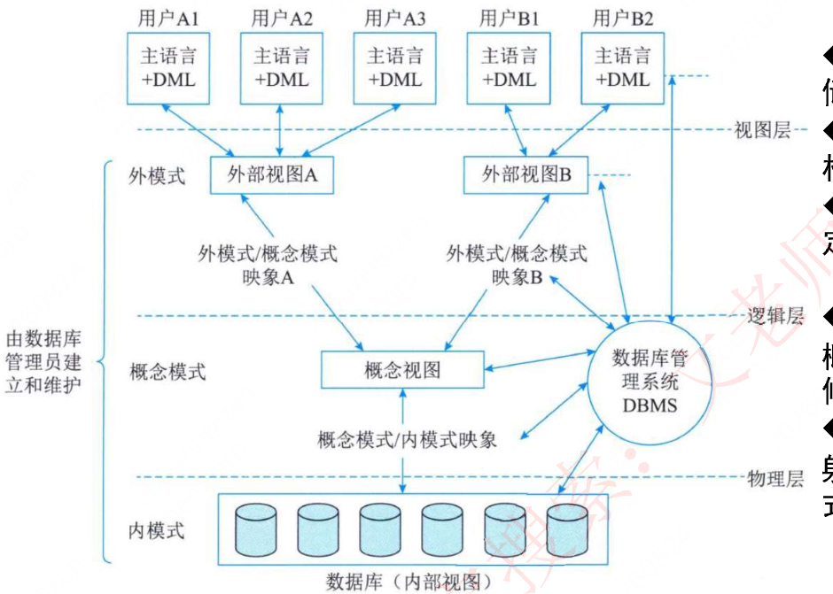

- `内模式`：管理如何存储物理的数据，对应具体物理存储文件。
- `模式`：又称为概念模式，就是我们通常使用的基本表根据应用、需求将物理数据划分成一张张表。
- `外模式`：对应数据库中的视图这个级别，将表进行一定的处理后再提供给用户使用。
- `外模式—模式映像`：是表和视图之间的映射，存在于概念级和外部级之间，若表中数据发生了修改，只需要修改此映射，而无需修改应用程序。
- `模式—内模式映像`：是表和数据的物理存储之间的映射，存在于概念级和内部级之间，若修改了数据存储方式，只需要修改此映射，而不需要去修改应用程序。

## 2 数据库的设计

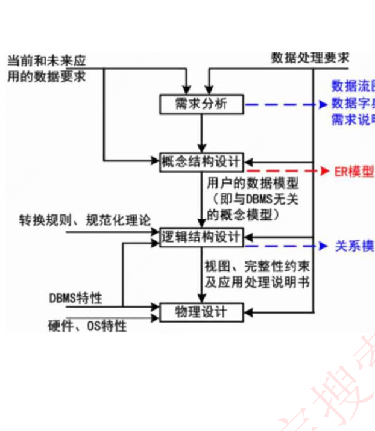

- （1）`需求分析`：即分析数据存储的要求，产出物有数据流图、数据字典、需求说明书。获得用户对系统的三个要求：信息要求、处理要求、系统要求。
- （2）`概念结构设计`：就是设计 E-R 图，也即实体-联系图。工作步骤包括：选择局部应用、逐一设计分 E-R 图、E-R 图合并。`分 E-R 图进行合并时，它们之间存在的冲突主要有以下 3 类。`
  - 属性冲突。同一属性可能会存在于不同的分 E-R 图中。
  - 命名冲突。相同意义的属性，在不同的分 E-R 图上有着不同的命名，或是名称相同的属性在不同的分 E-R 图中代表着不同的意义。
  - 结构冲突。同一实体在不同的分 E-R 图中有不同的属性，同一对象在某一分 E-R 图中被抽象为实体而在另一分 E-R 图中又被抽象为属性。
- （3）`逻辑结构设计`：将 E-R 图，转换成关系模式。工作步骤包括：确定数据模型、将 E-R 图转换成为指定的数据模型、确定完整性约束和确定用户视图。
- （4）`物理设计`：步骤包括确定数据分布、存储结构和访问方式。
- （5）`数据库实施阶段`。根据逻辑设计和物理设计阶段的结果建立数据库，编制与调试应用程序，组织数据入库，并进行试运行。
- （6）`数据库运行和维护阶段`。数据库应用系统经过试运行即可投入运行，但该阶段需要不断地对系统进行评价、调整与修改。

## 3 E-R 模型

- `关系模型是二维表的形式表示的实体-联系模型`，是将实体-联系模型转换而来的，经过开发人员设计的；
- `概念模型是从用户的角度进行建模的，是现实世界到信息世界的第一抽象，是真正的实体-联系模型。`
- 网状模型表示实体类型及其实体之间的联系，一个事物和另外几个都有联系，形成一张网。
- 面向对象模型是采用面向对象的方法设计数据库，以对象为单位，每个对象包括属性和方法，具有类和继承等特点。
- 数据模型三要素：`数据结构`（所研究的对象类型的集合）、`数据操作`（对数据库中各种对象的实例允许执行的操作的集合）、`数据的约束条件`（一组完整性规则的集合）。
- 用 E-R 图来描述概念数据模型，世界是由一组称作实体的基本对象和这些对象之间的联系构成的。
- 在 E-R 模型中，使用 `椭圆表示属性（一般没有）、长方形表示实体、菱形表示联系、联系的两端要填写联系类型`，示例如下图：


- 实体：`客观存在并可相互区别的事物`。可以是具体的人、事、物或抽象概念。如人、汽车、图书、账户、贷款。
- 弱实体和强实体：弱实体依赖于强实体的存在而存在。
- 实体集：具有相同类型和共享相同属性的实体的集合，如学生、课程。
- 属性：`实体所具有的特性`。
- 属性分类：简单属性和复合属性；单值属性和多值属性；NULL 属性；派生属性。
- 域：属性的取值范围称为该属性的域。
- 码（key）：唯一标识实体的属性集。
- 联系：现实世界中 `事物内部以及事物之间的联系`，在 E-R 图中反映为 `实体内部的联系和实体之间的联系`。
- 联系类型：`一对一 1:1、一对多 1:N、多对多 M:N`。
- 两个以上实体型的联系：

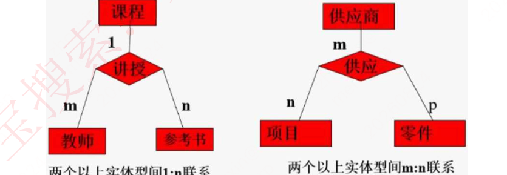

- 关系模型中数据的逻辑结构是一张 `二维表`，由行列组成。用表格结构表达实体集，用外键标识实体间的联系。如下图：

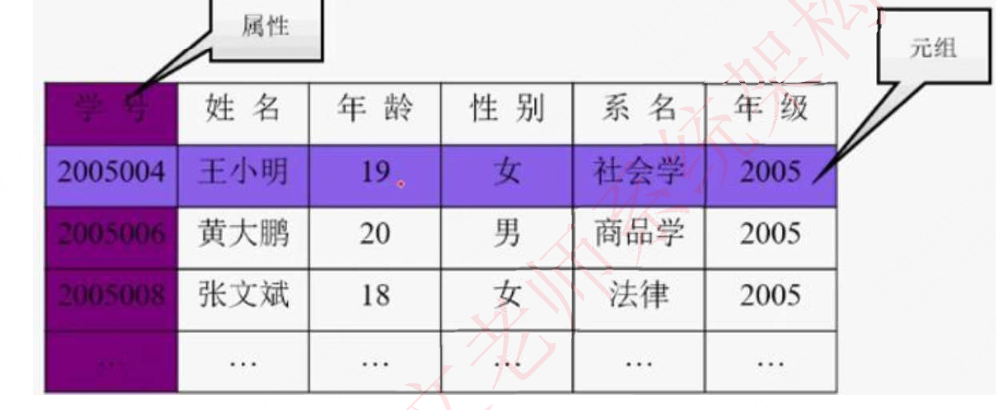

- E-R 模型转换为关系模型：`每个实体都对应一个关系模式`；联系分为三种：
  - 1:1 联系中，联系可以 `放到任意的两端实体中，作为一个属性`（要保证 1:1 的两端关联），也可以转换为一个单独的关系模式；
  - 1:N 的联系中，联系可以单独作为一个关系模式，也可以 `在 N 端中加入 1 端实体的主键`；
  - M:N 的联系中，联系 `必须作为一个单独的关系模式，其主键是 M 和 N 端的联合主键`。

## 4 关系代数运算

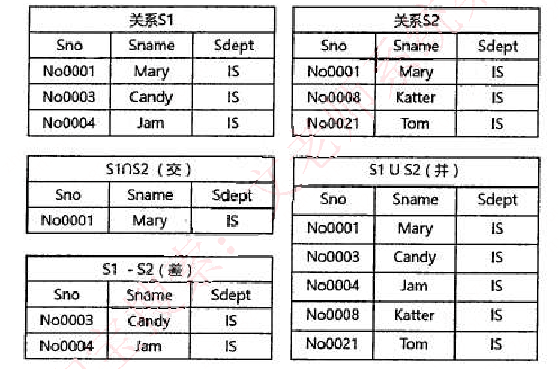

- 并：结果是两张表中所有记录数合并，相同记录只显示一次。
- 交：结果是两张表中相同的记录。
- 差：S1-S2，结果是 S1 表中有而 S2 表没有的那些记录。

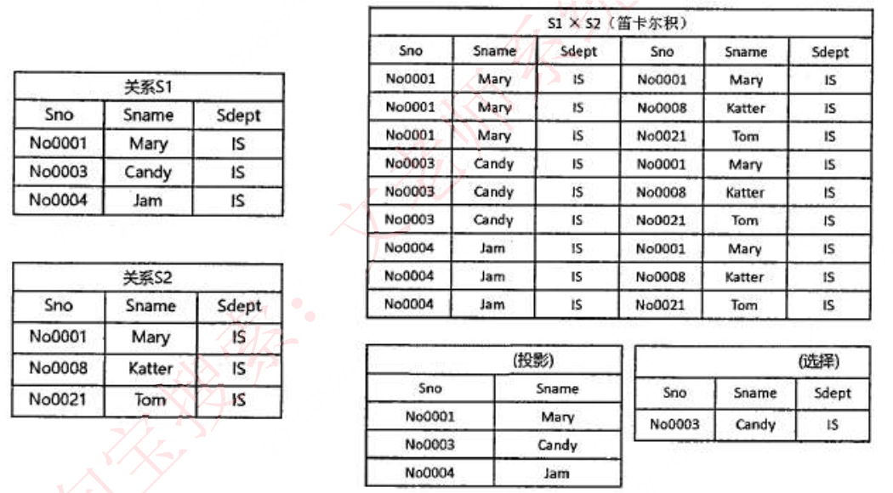

- 笛卡尔积：S1*S2，产生的结果包括 S1 和 S2 的所有属性列，并且 S1 中每条记录依次和 S2 中所有记录组合成一条记录，最终属性列为 S1+S2 属性列，记录数为 S1*S2 记录数。
- 投影：实际是按条件选择某关系模式中的某列，列也可以用数字表示。
- 选择：实际是按条件选择某关系模式中的某条记录。


- 自然连接的结果 `显示全部的属性列，但是相同属性列只显示一次，显示两个关系模式中属性相同且值相同的记录`。
- 设有关系 R、S 如下左图所示，自然连接结果如下右图所示：

## 5 关系数据库的规范化

### 5.1 函数依赖

- 给定一个 X，能唯一确定一个 Y，就称 X 确定 Y，或者说 Y 依赖于 X，例如 Y=X*X 函数。
- 函数依赖又可扩展以下两种规则：
  - 部分函数依赖：A 可确定 C，（A，B）也可确定 C，`（A，B）中的一部分（即 A）可以确定 C`，称为部分函数依赖。
  - 传递函数依赖：当 A 和 B 不等价时，`A 可确定 B，B 可确定 C，则 A 可确定 C`，是传递函数依赖；若 A 和 B 等价，则不存在传递，直接就可确定 C。
- 函数依赖的公理系统（Armstrong）：设关系模式 R<U，F>，U 是关系模式 R 的属性全集，F 是关系模式 R 的一个函数依赖集合。对于 R<U，F> 有以下规则：
  - 自反律：若 Y⊆X⊆U，则 X→Y 为 F 所逻辑蕴含。
  - 增广律：若 X→Y 为 F 所逻辑蕴含，且 Z⊆U，则 XZ→YZ 为 F 所逻辑蕴含。
  - 传递律：若 X→Y 和 Y→Z 为 F 所逻辑蕴含，则 X→Z 为 F 所逻辑蕴含。
  - 合并规则：若 X→Y，X→Z，则 X→YZ 为 F 所蕴涵。
  - 伪传递率：若 X→Y，WY→Z，则 XW→Z 为 F 所蕴涵。
  - 分解规则：若 X→Y，Z⊆Y，则 X→Z 为 F 所蕴涵。

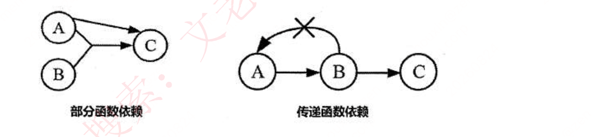

### 5.2 键和约束

- 超键：能 `唯一标识` 此表的属性组合。
- 候选键：超键中 `去掉冗余的属性`，剩余的属性就是候选键。
- 主键：`任选一个候选键`，即可作为主键。
- 外键：`其他表中的主键`。
- 主属性：`候选键内的属性为主属性`，其他属性为非主属性。
- 实体完整性约束：即 `主键约束，主键值不能为空，也不能重复`。
- 参照完整性约束：即外键约束，`外键必须是其他表中已经存在的主键的值，或者为空`。
- 用户自定义完整性约束：`自定义表达式约束`，如设定年龄属性的值必须在 0 到 150 之间。

### 5.3 范式

- `第一范式1NF：关系中的每一个分量必须是一个不可分的数据项`。
- 例：用一个单一的关系模式学生来描述学校的教务系统：学生（学号，学生姓名，系号，系主任姓名，课程号，成绩）。

| 学号 | 学生姓名 | 所在系 | 系主任姓名 | 课程号 | 成绩 |
| --- | --- | --- | --- | --- | --- |
| 201102 | 张明 | 计算机系 | 章三 | 04 | 70 |
| 201103 | 王红 | 计算机系 | 章三 | 05 | 60 |
| 201103 | 王红 | 计算机系 | 章三 | 04 | 80 |
| 201103 | 王红 | 计算机系 | 章三 | 06 | 87 |
| 201104 | 李青 | 机械系 | 王五 | 09 | 79 |
| … | … | … | … | … | … |

- `依赖关系`：学号→学生姓名，学号→系名，系名→系主任姓名，（学号，课程号）→成绩。
- 第二范式：如果 `关系R属于1NF，且每一个非主属性完全函数依赖于任何一个候选码，则R属于` 2NF。通俗地说，2NF 就是在 1NF 的基础上，`表中的每一个非主属性不会依赖复合主键中的某一个列`。
- 上面的学生表不满足 2NF，因为学号不能完全确定课程号和成绩（每个学生可以选多门课）。将学生表分解为：学生（学号，学生姓名，系名，系主任）、选课（学号，课程号，成绩），每张表均属于 2NF。
- 第三范式：在 `满足1NF的基础上，表中不存在非主属性对码的传递依赖`。
- 上面的学生关系模式不属于 3NF，因为学号不能直接决定系主任，存在学号→系名、系名→系主任的传递依赖。将学生表进一步分解为：学生（学号，学生姓名，系名）、系（系名，系主任）、选课（学号，课程号，成绩），每张表都属于 3NF。
- BC 范式 BCNF：指 `在第三范式的基础上进一步消除主属性对于码的部分函数依赖和传递依赖`。通俗地说，就是 `在每一种情况下，每一个依赖的左边决定因素都必然包含候选键`。
- 例：依赖关系为 S→T、S→J、T→J。候选键有（S，T）或（S，J）两种情况。当（S，J）为候选键时，T→J 的决定因素 T 不包含候选键，因此不是 BCNF。将 T→J 改为 TS→J 即可转换为 BCNF。

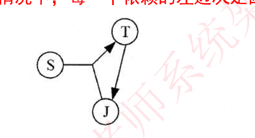

- 多值依赖：若关系模式 R（U）中，X、Y、Z 是 U 的子集，且 Z=U-X-Y，给定一对（x，z）值，有一组 Y 的值，这组值仅仅决定于 x 值而与 z 值无关，则称“Y 多值依赖于 X”或“X 多值决定 Y”，记为 X→→Y。
- 多值依赖的性质：对称性；传递性；函数依赖是多值依赖的特殊情况；若 X→→Y、X→→Z，则 X→→YZ；X→→Y∩Z；X→→Z-Y。
- 4NF：若关系模式 R∈1NF，对于 R 的每个非平凡多值依赖 X→→Y，且 Y⊄X 时，X 必含有码，则关系模式 R（U，F）∈4NF。4NF 限制关系模式的属性间不允许有非平凡且非函数依赖的多值依赖。
- 如果只考虑函数依赖，关系模式最高的规范化程度是 BCNF；如果考虑多值依赖，最高的规范化程度是 4NF。
- 4NF 示例：用户关系 TELEPHONE（CUSTOMERID，PHONE，CELL）中，PHONE 和 CELL 相互独立且存在多个值时违反 4NF。解决方法是设计新表 NEW_PHONE（CUSTOMERID，NUMBER，TYPE），实际应用中一般不要求表满足 4NF。

| CUSTOMERID | PHONE | CELL |
| --- | --- | --- |
| 1000 | 8828-1234 | 149088888888 |
| 1000 | 8838-1234 | 149099999999 |

### 5.4 模式分解

范式之间的转换一般都是通过拆分属性，即模式分解，将具有部分函数依赖和传递依赖的属性分离出来，来达到一步步优化，一般分为以下两种：

- **保持函数依赖分解**：对于关系模式 R，有依赖集 F，若对 R 进行分解，`分解出来的多个关系模式，保持原来的依赖集不变`，则为保持函数依赖的分解。
- 注意要消除掉冗余依赖（如传递依赖）。

例如：

- 原关系模式：`R(A,B,C)`
- 依赖集：`F={A→B, B→C, A→C}`
- 分解为：`R1(A,B)` 和 `R2(B,C)`

R1 保持 A→B，R2 保持 B→C；A→C 是由前两个依赖传递得到的冗余依赖，因此不需要保留。

**保持函数依赖的判断**：

- 若上面的每一个函数依赖都在其分解后的某一个关系上成立，则该分解是保持依赖的（充分条件）。
- 简单方法：看函数依赖左右两边属性是否都在同一个分解模式中。
- 若上述判断失败，不能断言分解不是保持依赖的，还要用通用方法进一步判断。

算法 2：

```text
对F中的每一个α→β使用下面的过程：
result:=α;
while(result发生变化) do
  for each 分解后的Ri
    t=(result∩Ri)+ ∩ Ri
    result=result∪t
```

例：`R(U,F)`，`U={A,B,C}`，`F={A→B, B→C}`。分解为 `ρ={R1(U1,F1), R2(U2,F2)}`，其中 `U1={A,B}`，`U2={A,C}`。

- A. 有损连接但保持函数依赖
- B. 既无损连接又保持函数依赖
- C. 有损连接且不保持函数依赖
- D. 无损连接但不保持函数依赖

答案：D。

分析：U1 保持 A→B，但 B→C 不被保持。对 B 求闭包：`result=B`，`result∩U1=B`，`B+=BC`，`BC∩U1=B`，result 不变；再与 U2 求交集仍不能得到 C，因此 B→C 不被保持。

**无损分解**：分解后的关系模式能够还原出原关系模式，就是无损分解；不能还原就是有损分解。

当分解为两个关系模式时，可以通过以下定理判断是否无损分解：

定理：如果 R 的分解为 `ρ={R1,R2}`，F 为 R 所满足的函数依赖集合，分解 ρ 具有无损连接性的充分必要条件是：

`R1∩R2→(R1-R2)` 或 `R1∩R2→(R2-R1)`。

当分解为二个及以上关系模式时，可以通过表格法求解。例如：

- 关系模式：成绩（学号，姓名，课程号，课程名，分数）
- 函数依赖：学号→姓名，课程号→课程名，（学号，课程号）→分数
- 分解为：
  - 成绩（学号，课程号，分数）
  - 学生（学号，姓名）
  - 课程（课程号，课程名）

先根据学号→姓名处理表格，再根据课程号→课程名处理表格，最终第一行全部为 √，因此本次分解是无损连接分解。


例：`R(U,F)`，`U={A,B,C,D,E}`，`F={A→BC, B→D, D→E}`。分解 `ρ={R1(U1,F1),R2(U2,F2)}`，其中 `U1={A,B,C}`，`U2={B,D,E}`。幻灯片给出的函数依赖判断答案为 D，分解性质判断答案为 A。

选项：

- A. 无损连接并保持函数依赖
- B. 无损连接但不保持函数依赖
- C. 有损连接并保持函数依赖
- D. 有损连接但不保持函数依赖

### 5.5 并发控制基本概念

事务：由一系列操作组成，这些操作要么全做，要么全不做，拥有四种特性，详解如下：

- （操作）**原子性**：要么全做，要么全不做。
- （数据）**一致性**：事务发生后数据是一致的，例如银行转账，不会存在 A 账户转出，但是 B 账户没收到的情况。
- （执行）**隔离性**：任一事务的更新操作直到其成功提交的整个过程对其他事务都是不可见的，不同事务之间是隔离的，互不干涉。
- （改变）**持续性**：事务操作的结果是持续性的。

事务是并发控制的前提条件，并发控制就是`控制不同的事务并发执行`，提高系统效率，但是并发控制中`存在下面三个问题`：

- **丢失更新**：事务 1 对数据 A 进行了修改并写回，事务 2 也对 A 进行了修改并写回，此时事务 2 写回的数据会覆盖事务 1 写回的数据，就丢失了事务 1 对 A 的更新。
- **不可重复读**：事务 2 读 A，而后事务 1 对数据 A 进行了修改并写回，此时若事务 2 再读 A，发现数据不对。即一个事务重复读两次，会发现数据 A 有误。
- **读脏数据**：事务 1 对数据 A 进行了修改后，事务 2 读数据 A，而后事务 1 回滚，数据 A 恢复了原来的值，那么事务 2 对数据 A 做的事是无效的，读到了脏数据。

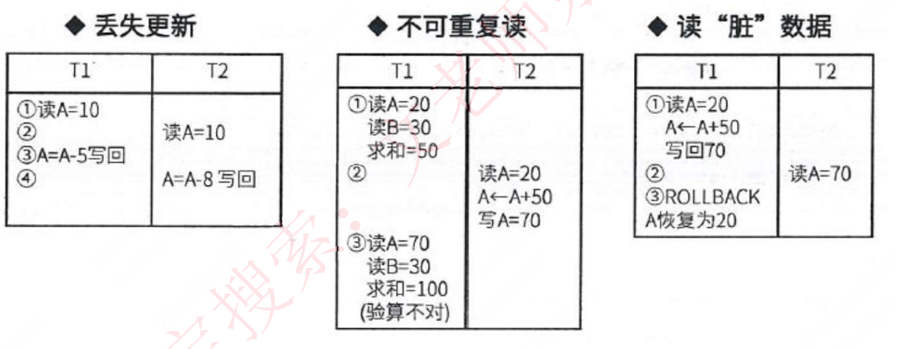

### 5.6 事务管理

事务管理通过封锁等机制协调并发事务，保证事务的原子性、一致性、隔离性和持续性。

### 5.7 封锁协议

- **X 锁是排它锁（写锁）**。若事务 T 对数据对象 A 加上 X 锁，则只允许 T 读取和修改 A，`其他事务都不能再对A加任何类型的锁`，直到 T 释放 A 上的锁。
- **S 锁是共享锁（读锁）**。若事务 T 对数据对象 A 加上 S 锁，则只允许 T 读取 A，但不能修改 A，`其他事务只能再对A加S锁`（也即能读不能修改），直到 T 释放 A 上的 S 锁。

封锁协议共分为三级：

**一级封锁协议**：事务在`修改数据R之前必须先对其加X锁`，直到事务结束才释放。`可解决丢失更新问题`。

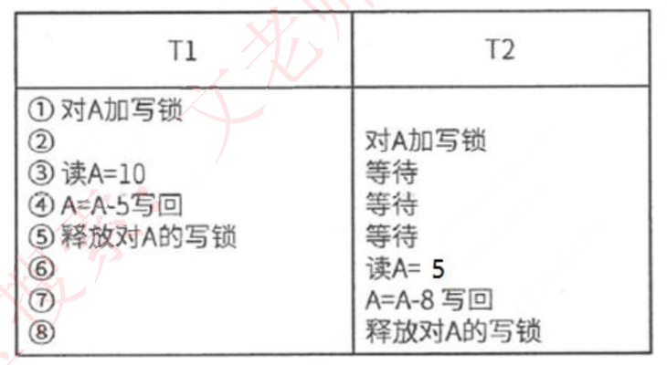

**二级封锁协议**：一级封锁协议的基础上，加上事务 T 在`读数据R之前必须先对其加S锁`，读完后即可释放 S 锁。`可解决丢失更新、读脏数据问题`。

**三级封锁协议**：一级封锁协议加上事务 T 在读数据 R 之前先对其加 S 锁，直到`事务结束才释放`。`可解决丢失更新、读脏数据、数据重复读问题`。

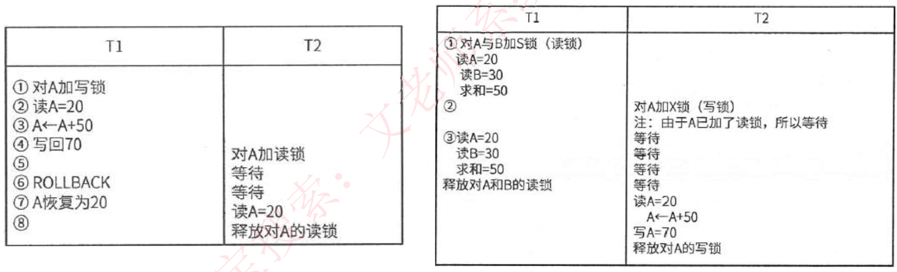

## 6 数据故障与备份

### 6.1 数据库安全

数据库安全措施包括：

| 措施 | 说明 |
| --- | --- |
| 用户标识和鉴定 | 最外层的安全保护措施，可以使用用户帐户、口令及随机数检验等方式 |
| 存取控制 | 对用户进行授权，包括操作类型（如查找、插入、删除、修改等动作）和数据对象（主要是数据范围）的权限 |
| 密码存储和传输 | 对远程终端信息用密码传输 |
| 视图的保护 | 对视图进行授权 |
| 审计 | 使用一个专用文件或数据库，自动将用户对数据库的所有操作记录下来 |

### 6.2 数据故障

| 故障关系 | 故障原因 | 解决方法 |
| --- | --- | --- |
| 事务本身的可预期故障 | 本身逻辑 | 在程序中预先设置 Rollback 语句 |
| 事务本身的不可预期故障 | 算术溢出、违反存储保护 | 由 DBMS 的恢复子系统通过日志，撤消事务对数据库的修改，回退到事务初始状态 |
| 系统故障 | 系统停止运转 | 通常使用检查点法 |
| 介质故障 | 外存被破坏 | 一般使用日志重做业务 |


### 6.3 数据备份

- **静态转储**：即`冷备份`，指在转储期间不允许对数据库进行任何存取、修改操作。优点是非常快速、容易归档（直接物理复制操作）；缺点是只能提供到某一时间点上的恢复，不能做其他工作，不能按表或按用户恢复。
- **动态转储**：即`热备份`，在转储期间允许对数据库进行存取、修改操作，因此，转储和用户事务可并发执行。优点是可在表空间或数据库文件级备份，数据库仍可使用，可达到秒级恢复；缺点是不能出错，否则后果严重，若热备份不成功，所得结果几乎全部无效。
- **完全备份**：备份所有数据。
- **差量备份**：仅备份上一次完全备份之后变化的数据。
- **增量备份**：备份上一次备份之后变化的数据。
- **日志文件**：在事务处理过程中，DBMS 把事务开始、事务结束以及对数据库的插入、删除和修改的每一次操作写入日志文件。一旦发生故障，DBMS 的恢复子系统利用日志文件撤销事务对数据库的改变，回退到事务的初始状态。


## 7 分布式数据库

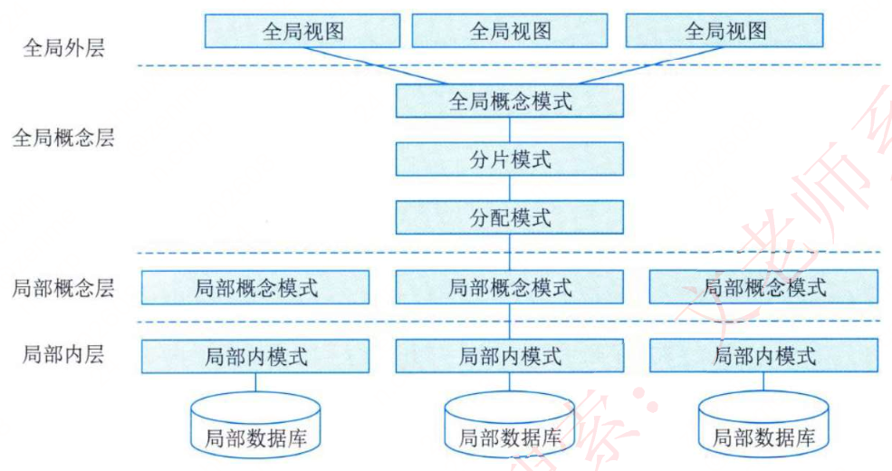

- 局部数据库位于不同的物理位置，使用一个全局 DBMS 将所有局部数据库联网管理，这就是分布式数据库。
- 分片模式：
  - `水平分片`：将表中`水平的记录`分别存放在不同的地方。
  - `垂直分片`：将表中的`垂直的列值`分别存放在不同的地方。
- 分布透明性：
  - 分片透明性：用户或应用程序`不需要知道逻辑上访问的表具体是如何分块存储的`。
  - 位置透明性：应用程序`不关心数据存储物理位置的改变`。
  - 逻辑透明性：用户或应用程序`无需知道局部使用的是哪种数据模型`。
  - 复制透明性：用户或应用程序`不关心复制的数据从何而来`。

## 8 数据仓库与数据挖掘

数据仓库是一个`面向主题的、集成的、非易失的、且随时间变化`的数据集合，用于支持管理决策。


数据仓库的结构通常包含四个层次：

- 1. `数据源`：是数据仓库系统的基础，是整个系统的数据源泉。
- 2. `数据的存储与管理`：是整个数据仓库系统的核心。
- 3. `OLAP（联机分析处理）服务器`：对分析需要的数据进行有效集成，按多维模型组织，以便进行多角度、多层次的分析，并发现趋势。
- 4. `前端工具`：主要包括各种报表工具、查询工具、数据分析工具、数据挖掘工具以及各种基于数据仓库或数据集市的应用开发工具。

BI 系统主要包括`数据预处理`、`建立数据仓库`、`数据分析和数据展现`四个主要阶段。

- 数据预处理是整合企业原始数据的第一步，它包括数据的抽取（Extraction）、转换（Transformation）和加载（Load）三个过程（ETL 过程）；
- 建立数据仓库则是处理海量数据的基础；
- 数据分析是体现系统智能的关键，一般采用联机分析处理（OLAP）和数据挖掘两大技术。联机分析处理不仅进行数据汇总/聚集，同时还提供切片、切块、下钻、上卷和旋转等数据分析功能，用户可以方便地对海量数据进行多维分析。数据挖掘的目标则是挖掘数据背后隐藏的知识，通过关联分析、聚类和分类等方法建立分析模型，预测企业未来发展趋势和将要面临的问题；
- 在海量数据和分析手段增多的情况下，数据展现则主要保障系统分析结果的可视化。

## 9 反规范化技术

- `反规范化技术`：规范化设计后，数据库设计者希望`牺牲部分规范化来提高性能`。
- 采用反规范化技术的`益处`：`降低连接操作的需求、降低外码和索引的数目，还可能减少表的数目，能够提高查询效率`。
- `可能带来的问题`：数据的`重复存储`，浪费了磁盘空间；可能出现数据的`完整性问题`，为了保障数据的一致性，增加了数据维护的复杂性，会`降低修改速度`。
- 具体方法：
  （1）增加冗余列：在`多个表中保留相同的列`，通过增加数据冗余减少或避免查询时的连接操作。
  （2）增加派生列：在表中增加可以`由本表或其它表中数据计算生成的列`，减少查询时的连接操作并避免计算或使用集合函数。
  （3）重新组表：如果许多用户需要查看两个表连接出来的结果数据，则把`这两个表重新组成一个表来减少连接而提高性能`。
  （4）水平分割表：根据一列或多列数据的值，把`数据放到多个独立的表中`，主要用于表数据规模很大、表中数据相对独立或数据需要存放到多个介质上时使用。
  （5）垂直分割表：对表进行分割，将`主键与部分列放到一个表中`，主键与其它列放到另一个表中，在查询时减少 I/O 次数。

## 10 NoSQL 数据库

### 10.1 第三代数据库系统

层次、网状和关系数据库系统的设计目标源于商业事务处理，面对当前层出不穷的新型应用显得力不从心。从 20 世纪 80 年代开始，出现了许多新型应用，数据管理出现了许多新的数据模型，如面向对象模型、语义数据模型、XML 数据模型、半结构化数据模型等。数据模型的发展，需要数据库系统支持日益复杂的数据类型。其中最典型的是 `NoSQL（Not Only SQL）` 运动。

`NoSQL` 一词最早出现于 1998 年，是 Carlo Strozzi 开发的一个轻量、开源、不提供 SQL 功能的关系数据库。2009 年，Last.fm 的 Johan Oskarsson 发起了一次关于分布式开源数据库的讨论，来自 Rackspace 的 Eric Evans 再次提出了 `NoSQL` 的概念。这时的 `NoSQL` 主要指非关系型、分布式、不提供 `ACID` 的数据库设计模式。

2009 年在亚特兰大举行的讨论会是一个里程碑，其口号是：`select fun, profit from real_world where relational=false;`。因此，对 `NoSQL` 最普遍的解释是“非关系型的”，强调 `Key-Value Stores` 和文档数据库的优点，而不是单纯地反对 `RDBMS`。

随着互联网 `Web 2.0` 网站的兴起，传统的关系数据库在处理 `Web 2.0` 网站，特别是超大规模和高并发的 `SNS` 类型的纯动态网站时，已经显得力不从心，出现了很多难以克服的问题；而非关系型数据库则由于其本身的特点得到了非常迅速的发展。`NoSQL` 数据库的产生就是为了面对大规模数据集合和多重数据种类带来的挑战，特别是大数据应用难题。

### 10.2 NoSQL 数据库分类

`NoSQL` 数据库并没有统一的模型，而且是`非关系型的`。常见的 NoSQL 数据库通过存储方式划分，可分为`文档存储`、`键值存储`、`列存储`和`图存储`，其具体分类和特点如表所示：

| 分类 | 典型产品 | 应用场景 | 优点 | 缺点 |
| --- | --- | --- | --- | --- |
| 文档存储 | MongoDB、CouchDB | Web 应用，存储面向文档和半结构化数据 | 结构灵活，可以根据数据 value 构建索引 | 缺乏统一的查询语法，无事务处理能力 |
| 键值存储 | Memcached、Redis | 内容缓存，如会话、配置文件、参数等 | 扩展性好，灵活性强，大量操作时性能高 | 数据无结构化，通常被当成字符串或者二进制数据，通过键查询值 |
| 列存储 | BigTable、HBase、Cassandra | 分布式数据存储和管理 | 可扩展性强，查找速度快，复杂性低 | 功能局限，不支持事务的强一致性 |
| 图存储 | Neo4j、OrientDB | 社交网络、推荐系统，专注于构建系统图谱 | 支持复杂的图形算法 | 复杂性高，只能支持一定的数据规模 |

### 10.3 NoSQL 数据结构类型

按照所使用的数据结构的类型，一般可以将 NoSQL 数据库分为以下 4 种类型。

1. 列式存储数据库：`行式数据库即传统的关系型数据库`，数据按记录存储，每一条记录的所有属性存储在一行。`列式数据库是按数据库记录的列来组织和存储数据的`，数据库中每个表由一组页链的集合组成，每条页链对应表中的一个存储列。
2. 键值对存储数据库：`键值存储的典型数据结构一般为数组链表`：先通过 Hash 算法得出 Hashcode，找到数组的某一个位置，然后插入链表。
3. 文档型数据库：文档型数据库`同键值对存储数据库类似`。该类型的数据模型是版本化的文档，半结构化的文档以特定的格式存储，比如 JSON。
4. 图数据库：图形结构的数据库同其他采用行列以及刚性结构的 SQL 数据库不同，它`使用灵活的图形模型，并且能够扩展到多个服务器上`。NoSQL 数据库没有标准的查询语言（SQL），因此进行数据库查询需要指定数据模型。

目前业界对于 NoSQL 并没有一个明确的范围和定义，但是它们普遍存在下面一些共同特征：

- `易扩展`：去掉了关系数据库的关系型特性。数据之间无关系，这样就非常容易扩展。
- `大数据量，高性能`：NoSQL 数据库都具有非常高的读写性能，尤其在大数据量下。这得益于它的无关系性，数据库的结构简单。
- `灵活的数据模型`：NoSQL 无须事先为要存储的数据建立字段，随时可以存储自定义的数据格式。
- `高可用`：NoSQL 在不太影响性能的情况下，就可以方便地实现高可用的架构，有些产品通过复制模型也能实现高可用。

### 10.4 NoSQL 分层架构

NoSQL 整体框架分为 4 层，由下至上分为`数据持久层`、`数据分布层`、`数据逻辑模型层`和`接口层`。

- （1）`数据持久层定义了数据的存储形式`，主要包括基于内存、硬盘、内存和硬盘接口、订制可插拔 4 种形式。
- （2）`数据分布层定义了数据是如何分布的`，相对于关系型数据库，NoSQL 可选的机制比较多，主要有 3 种形式：`一是 CAP 支持`，可用于水平扩展；`二是多数据中心支持`，可以保证在横跨多数据中心时也能够平稳运行；`三是动态部署支持`，可以在运行着的集群中动态地添加或删除结点。
- （3）`数据逻辑层表述了数据的逻辑表现形式`。
- （4）`接口层为上层应用提供了方便的数据调用接口`，提供的选择远多于关系型数据库。

- NoSQL 分层架构并不代表每个产品在每一层只有一种选择。相反，这种分层设计提供了很大的灵活性和兼容性，`每种数据库在不同层面可以支持多种特性`。
- NoSQL 数据库在以下几种情况比较适用：
  - 数据模型比较简单；
  - 需要灵活性更强的 IT 系统；
  - 对数据库性能要求较高；
  - 不需要高度的数据一致性。
- 对于给定 key，比较容易映射复杂值的环境。

### 10.5 CAP 理论与 BASE

CAP 理论是对于一个分布式系统，一致性（Consistency）、可用性（Availability）和分区容忍性（Partition tolerance）三个特点`最多只能三选二`。

- （1）一致性：一致性指系统在`执行了某些操作后仍处在一个一致的状态`。就是所有的结点在同一时刻有相同的数据。
- （2）可用性：可用性指对数据的`所有操作都应有成功的返回`。就是任何请求不管成功或失败都有响应。
- （3）分区容忍性：这一概念的前提是在`网络发生故障的时候`。在网络连接上，一些结点出现故障，使得原本连通的网络变成了一块一块的分区，`若允许系统继续工作，那么就是分区可容忍的`。

由于 CAP 理论的存在，为了提高性能，出现了 `ACID` 的一种变种 `BASE`。即是一个弱一致性的理论，只要求最终一致性。

- Basic Availability：`基本可用`。
- Soft State：软状态，可以理解为“无连接”的。
- Eventual Consistency：`最终一致性`，最终整个系统（时间和系统的要求有关）看到的数据是一致的。

具体地说，如果选择了 `CP（一致性和分区容忍性）`，那么就要考虑 ACID。如果选择了 `AP（可用性和分区容忍性）`，那么就要考虑 BASE。如果选择了 `CA（一致性和可用性）`，那么在网络发生分区的时候，将不能进行完整的操作。

## 11 SQL 语言

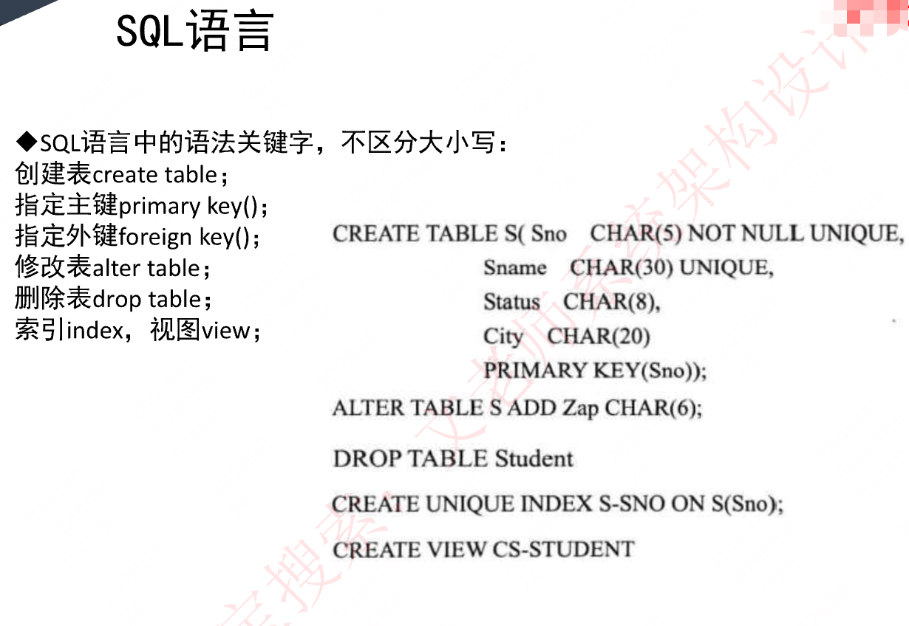

- SQL 语言中的语法关键字，`不区分大小写`：
  - 创建表 `create table`；
  - 指定主键 `primary key()`；
  - 指定外键 `foreign key()`；
  - 修改表 `alter table`；
  - 删除表 `drop table`；
  - 索引 `index`，视图 `view`；
- 示例：

```sql
CREATE TABLE S(Sno CHAR(5) NOT NULL UNIQUE,
              Sname CHAR(30) UNIQUE,
              Status CHAR(8),
              City CHAR(20)
              PRIMARY KEY(Sno));

ALTER TABLE S ADD Zap CHAR(6);

DROP TABLE Student;

CREATE UNIQUE INDEX S-SNO ON S(Sno);

CREATE VIEW CS-STUDENT;
```

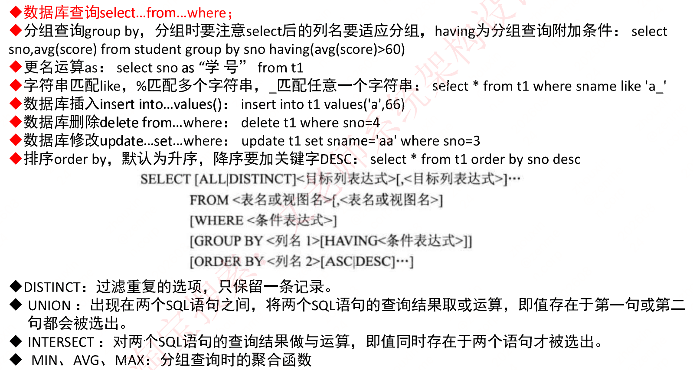

- `数据库查询` `select...from...where`；
- `分组查询` `group by`，分组时要注意 select 后的列名要适应分组，`having` 为分组查询附加条件：`select sno,avg(score) from student group by sno having(avg(score)>60)`
- `更名运算` `as`：`select sno as "学号" from t1`
- `字符串匹配` `like`，`%` 匹配多个字符串，`_` 匹配任意一个字符串：`select * from t1 where sname like 'a_'`
- `数据库插入` `insert into...values()`：`insert into t1 values('a',66)`
- `数据库删除` `delete from...where`：`delete t1 where sno=4`
- `数据库修改` `update...set...where`：`update t1 set sname='aa' where sno=3`
- `排序` `order by`，默认为升序，降序要加关键字 `DESC`：`select * from t1 order by sno desc`
- SELECT 语句格式：

```text
SELECT [ALL|DISTINCT]<目标列表达式>[,<目标列表达式>]…
   FROM <表名或视图名>[,<表名或视图名>]
  [WHERE <条件表达式>]
  [GROUP BY <列名1>[HAVING<条件表达式>]]
  [ORDER BY <列名2>[ASC|DESC]…]
```

- `DISTINCT`：过滤重复的选项，只保留一条记录。
- `UNION`：出现在两个 SQL 语句之间，将两个 SQL 语句的查询结果取或运算，即值存在于第一句或第二句都会被选出。
- `INTERSECT`：对两个 SQL 语句的查询结果做与运算，即值同时存在于两个语句才被选出。
- `MIN、AVG、MAX`：分组查询时的聚合函数。
