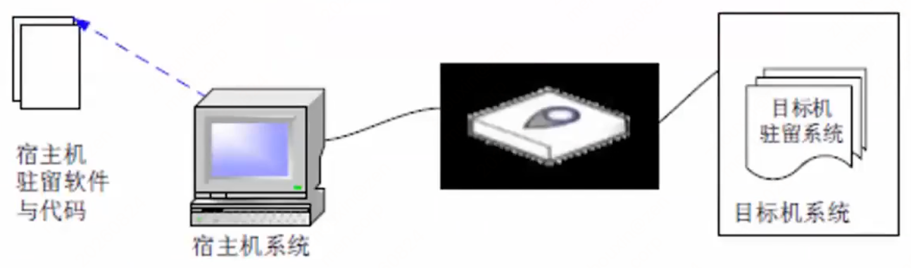

# 第四章 嵌入式技术（课件原文）

> 本页为课件原始内容，未经精简。精简笔记见 [笔记 · 第四章](/notes/chapter-04/)。

## 知识点目录

1. 第二版教材 2.4 嵌入式内容
2. 补充：嵌入式微处理器
3. 补充：嵌入式操作系统
4. 补充：嵌入式软件设计

## 1 第二版教材 2.4 嵌入式内容

### 1.1 本章说明

本章历年真题偶尔会考，一般占 2～3 分。第二版教材对嵌入式内容的介绍比较简略，主要介绍基本概念，课程中补充了嵌入式微处理器、嵌入式操作系统和嵌入式软件设计等内容。如果实际考试涉及，仍可能有部分内容超出教材范围，需要结合历年直播讲题补充。嵌入式系统的组成和特点是本章的主要变化内容。

### 1.2 嵌入式系统及软件

嵌入式系统是`以应用为中心、以计算机技术为基础`，并将可配置与可裁减的软件、硬件集成于一体的专用计算机系统，需要满足应用对`功能、可靠性、成本、体积和功耗`等方面的严格要求。

一般嵌入式系统由`嵌入式处理器、相关支撑硬件、嵌入式操作系统、支撑软件以及应用软件`组成。

（1）嵌入式处理器。嵌入式系统通常在恶劣环境条件下工作。与一般处理器相比，嵌入式处理器`应能抵抗恶劣环境的影响`，例如高温、寒冷、电磁、加速度等环境因素。嵌入式处理器芯片还要满足低功耗、体积小等要求，并根据环境要求分为`民用级、工业级和军用级`三个档次。民用级器件的工作温度范围是 0～70℃，工业级是 -40～85℃，军用级是 -55～150℃。

（2）相关支撑硬件。相关支撑硬件是指`除嵌入式处理器以外组成系统的其他硬件`，包括存储器、定时器、总线、I/O 接口以及相关专用硬件。

（3）嵌入式操作系统。嵌入式操作系统是指`运行在嵌入式系统中的基础软件`，主要用于管理计算机资源和应用软件。与通用操作系统不同，嵌入式操作系统应具备`实时性、可裁减性和安全性`等特征。

（4）支撑软件。支撑软件是指`为应用软件开发与运行提供公共服务、软件开发和调试能力的软件`。支撑软件的公共服务通常运行在操作系统之上，以库的方式被应用软件引用。

（5）应用软件。应用软件是指`为完成嵌入式系统的某一特定目标而开发的软件`。

### 1.3 嵌入式系统的特点

嵌入式系统具有以下特点：

（1）`专用性强`。嵌入式系统面向特定应用需求，能够把通用 CPU 中由多块板卡完成的任务集成到芯片内部，有利于系统小型化。

（2）`技术融合`。嵌入式系统将计算机技术、通信技术、半导体技术和电子技术与各行业的具体应用相结合，是技术密集、资金密集、高度分散且不断创新的知识集成系统。

（3）`软硬一体、软件为主`。软件是嵌入式系统的主体，并具有 IP 核。软硬件都可以进行高效设计、量体裁衣和去除冗余，从而在相同硅片面积上实现更高性能。

（4）`比通用计算机资源少`。嵌入式系统通常只完成少数几个任务，设计时要考虑经济性，不能使用通用 CPU，因此管理的资源少、成本低、结构更简单。

（5）`程序代码固化在非易失存储器中`。为了提高执行速度和系统可靠性，嵌入式系统中的软件一般固化在存储器芯片或单片机内部，而不是存放在磁盘中。

（6）`需专门的开发工具和环境`。嵌入式系统本身不具备开发能力，用户通常也不能修改其中的程序功能，必须使用专门的开发工具和环境进行开发。

（7）体积小、价格低、工艺先进、性能价格比高、系统配置要求低、实时性强。

（8）对`安全性和可靠性`的要求高。

### 1.4 嵌入式系统的分类与体系结构

根据不同用途，嵌入式系统可分为`嵌入式实时系统和嵌入式非实时系统`；实时系统又可分为`强实时系统和弱实时系统`。从安全性要求看，嵌入式系统还可分为`安全攸关系统和非安全攸关系统`。

嵌入式系统的最大特点是`系统的运行和开发是在不同环境中进行的`。运行环境通常称为“目标机”环境，开发环境称为“宿主机”环境。嵌入式系统的通用体系结构主要指目标机环境的体系结构。

嵌入式系统分为`硬件层、抽象层、操作系统层、中间件层和应用层` 5 层：

（1）硬件层。为嵌入式系统运行提供硬件环境，核心包括`微处理器、存储器（ROM、SDRAM、Flash 等）、I/O 接口（A/D、D/A、I/O 等）、通用设备、总线、电源和时钟`等。

（2）抽象层。位于硬件层和软件层之间，主要实现对硬件层硬件的抽象，为上层应用和操作系统提供虚拟硬件资源。`板级支持包（BSP）`是一种硬件驱动软件，负责驱动硬件层的芯片或电路，并为上层操作系统提供硬件管理支持。

（3）操作系统层。主要由`嵌入式操作系统、文件系统、图形用户界面、网络系统和通用组件`等可配置模块组成。

（4）中间件层。一般位于操作系统之上，`管理计算机资源和网络通信`，是连接两个独立应用的桥梁。

（5）应用层。指`嵌入式系统的具体应用`，主要包括不同的应用软件。

### 1.5 嵌入式软件的主要特点

嵌入式软件的主要特点如下：

（1）`可剪裁性`。能够根据系统功能需求，通过工具增加或删减适应性功能，删除系统不需要的软件模块，使系统更加紧凑。

（2）`可配置性`。能够根据系统运行功能或性能需求进行配置，并根据系统不同状态、容量和流程扩展、变更和增量提供软件服务。

（3）`强实时性`。嵌入式系统中的大多数系统属于强实时性系统，要求任务在规定期限内处理完成，所采用算法的优劣会直接影响实时性。

（4）`安全性`。指系统在规定条件和规定时间内不发生事故的能力。

（5）`可靠性`。指系统在规定条件和规定时间周期内执行所要求功能的能力。

（6）`高确定性`。嵌入式系统运行的时间、状态和行为是预先设计规划好的，其行为不能随时间和状态的变化而变化。

## 2 补充：嵌入式微处理器

嵌入式软件的开发通常是在宿主机（PC 或工作站）上使用专门的嵌入式工具完成，生成二进制代码后，再使用工具下载到目标机，或固化在目标机存储器中运行。

### 2.1 冯·诺依曼结构

传统计算机采用`冯·诺依曼（Von Neumann）结构`，也称普林斯顿结构，是一种将`程序指令存储器和数据存储器合并在一起`的存储器结构。

冯·诺依曼结构的计算机程序和数据共用一个存储空间，程序指令存储地址和数据存储地址指向`同一个存储器的不同物理位置`。系统采用`单一的地址及数据总线`，程序指令和数据的宽度相同。处理器执行指令时，`先从存储器中取出指令解码，再取操作数执行运算`，即使单条指令也要耗费几个甚至几十个周期；在高速运算时，传输通道上会出现瓶颈效应。

### 2.2 哈佛结构

哈佛结构是一种`并行体系结构`，主要特点是将`程序和数据存储在不同的存储空间中`，即程序存储器和数据存储器是两个相互独立的存储器，每个存储器独立编址、独立访问。

与两个存储器相对应，系统具有`两套独立的地址总线和数据总线`。这种分离的程序总线和数据总线允许在一个机器周期内同时获取指令字（来自程序存储器）和操作数（来自数据存储器），从而提高执行速度，使数据吞吐率提高约 1 倍。

### 2.3 嵌入式微处理器的分类

（1）`按嵌入式微处理器的字长`，可分为 4 位、8 位、16 位、32 位和 64 位。一般把 16 位及以下的称为嵌入式微控制器（Embedded Micro Controller），32 位及以上的称为嵌入式微处理器。

（2）`按系统集成度`，可分为两类：一种是微处理器内部仅包含单纯的中央处理器单元，称为一般用途型微处理器；另一种是将 CPU、ROM、RAM 及 I/O 等部件集成到同一个芯片上，称为单芯片微控制器（Single Chip Microcontroller）。

（3）`按用途分类`，一般分为嵌入式微控制器 MCU、嵌入式微处理器 MPU、嵌入式数字信号处理器 DSP、嵌入式片上系统 SoC 等。

#### 嵌入式微控制器 MCU

嵌入式微控制器 MCU 的典型代表是`单片机`，其片上外设资源比较丰富，适合于控制。MCU 芯片内部集成 ROM/EPROM、RAM、总线、总线逻辑、定时/计数器、看门狗、I/O、串行口、脉宽调制输出、A/D、D/A、Flash RAM、EEPROM 等必要功能和外设。与嵌入式微处理器相比，微控制器的最大特点是单片化，体积大大减小，从而使功耗和成本下降、可靠性提高；片上资源一般较丰富，适合于控制，是嵌入式系统工业的主流。

#### 嵌入式微处理器 MPU

嵌入式微处理器 MPU`由通用计算机中的 CPU 演变而来`，通常具有`32 位以上的处理器`和较高性能，但价格也相应较高。在实际嵌入式应用中，MPU`只保留和嵌入式应用紧密相关的功能硬件，去除其他冗余功能部分`，以最低的功耗和资源实现嵌入式应用的特殊要求。与工业控制计算机相比，嵌入式微处理器具有体积小、重量轻、成本低、可靠性高等优点。常见的有 ARM、MIPS、PowerPC 等。

#### 嵌入式数字信号处理器 DSP

嵌入式数字信号处理器 DSP 是`专门用于信号处理方面的处理器`，在系统结构和指令算法方面进行了特殊设计，具有很高的编译效率和指令执行速度。DSP 采用`哈佛结构和流水线处理`，其处理速度比最快的 CPU 还快 10～50 倍，广泛应用于数字滤波、FFT、谱分析等仪器中。

#### 嵌入式片上系统 SoC

嵌入式片上系统 SoC 是`追求产品系统最大包容的集成器件`。SoC 最大的特点是成功实现软硬件无缝结合，直接在处理器片内嵌入操作系统的代码模块。它是一个有专用目标的集成电路，其中包含完整系统并具有嵌入式软件的全部内容。

### 2.4 多核处理器

`多核`是指多个微处理器内核封装在一起，集成在一个电路中。多核处理器是`单枚芯片`，能够直接插入单一的处理器插槽。与多 CPU 相比，多核可以很好地降低计算机系统的功耗和体积。在多核技术中，由操作系统软件进行调度，可以支持`多进程、多线程并发`。

两个或多个内核的工作协调有以下两种方式：

（1）`对称多处理技术 SMP`：将 2 颗完全一样的处理器封装在一个芯片内，达到双倍或接近双倍的处理性能，节省运算资源。

（2）`非对称处理技术 AMP`：两个处理内核彼此不同，各自处理和执行特定的功能，在软件协调下分担不同的计算任务。

多核 CPU 环境下进程的调度算法一般有`全局队列调度和局部队列调度`两种：

- 全局队列调度：操作系统维护一个`全局的任务等待队列`，当系统中有一个 CPU 空闲时，操作系统就从全局任务等待队列中选取就绪任务开始执行，CPU 核心利用率高。
- 局部队列调度：操作系统为`每个 CPU 内核维护一个局部的任务等待队列`，当某个 CPU 内核空闲时，就从该核心的任务等待队列中选取适当任务执行，优点是不需要在多个 CPU 之间切换。

### 2.5 嵌入式只读存储器分类

（1）`MASK ROM（掩模型只读存储器）`。制造商为了大量生产 ROM 内存，需要先制作一颗有原始数据的 ROM 或 EPROM 作为样本，然后再大量复制。样本中的资料一旦烧录在 MASK ROM 中便永远无法修改，成本比较低。

（2）`PROM（Programmable ROM，可编程只读存储器）`。可以用刻录机将资料写入 ROM 内存，但只能写入一次，所以也称为“一次可编程只读存储器”。PROM 出厂时存储内容全为 1，用户可以根据需要将其中的某些单元写入数据 0，实现编程目的。

（3）`EPROM（Erasable Programmable ROM，可擦可编程只读存储器）`。具有可擦除功能，擦除后即可进行再编程。写入前必须先用紫外线照射芯片上的透明窗口，清除其中内容，因此芯片封装中通常有“石英玻璃窗”。

（4）`EEPROM（Electrically Erasable Programmable ROM，电可擦可编程只读存储器）`。功能与使用方式与 EPROM 类似，不同之处是`通过约 20V 的电压进行电擦除`，还可以用电信号进行数据写入，常用于即插即用（PnP）接口。

（5）`Flash Memory（快闪存储器）`。可以直接在主机板上修改内容，不需要将芯片拔下；断电后存储的资料不会流失。写入新资料前必须先将原资料清除，缺点是写入信息的速度较慢。

## 3 补充：嵌入式操作系统

### 3.1 嵌入式操作系统概述

嵌入式操作系统是一种用途广泛的系统软件，通常包括`与硬件相关的底层驱动软件、系统内核、设备驱动接口、通信协议、图形界面和标准化浏览器`等。

嵌入式操作系统负责`嵌入式系统的全部软件、硬件资源的分配、任务调度、控制、协调并发活动`。

嵌入式操作系统通常分为两类：一类是`面向控制、通信等领域的嵌入式实时操作系统`，如 VxWorks、Nucleus、μC/OS-II、嵌入式 Linux、Windows Embedded 等；另一类是`面向消费电子产品的非实时嵌入式操作系统`，包括 Google 公司的 Android、Apple 公司的 iOS 以及 Microsoft 公司的 WinCE 等。

### 3.2 嵌入式操作系统的特点

与通用操作系统相比，嵌入式操作系统（EOS）主要具有以下特点：

（1）`微型化`。EOS 的运行平台不是通用计算机，而是嵌入式系统。这类系统一般没有大容量的内存，几乎没有外存，因此 EOS 必须做到小巧，以占用尽量少的系统资源。

（2）`代码质量高`。在大多数嵌入式应用中，存储空间依然是宝贵资源，要求程序代码质量高、尽量精简。

（3）`专业化`。嵌入式系统的硬件平台多种多样，处理器更新速度快，每种处理器都可能针对不同应用领域专门设计。因此，EOS 要有很好的适应性和可移植性，还要支持多种开发平台。

（4）`实时性强`。嵌入式系统广泛应用于过程控制、数据采集、通信、多媒体信息处理等要求实时响应的场合，因此实时性是 EOS 的重要特点。

（5）`可裁减和可配置`。应用的多样性要求 EOS 具有较强的适应能力，能够根据应用的特点和具体要求进行灵活配置和合理裁减，以适应微型化和专业化的要求。

### 3.3 嵌入式实时系统

嵌入式实时系统是一种`完全嵌入受控器件内部、为特定应用而设计的专用计算机系统`。在嵌入式实时系统中，要求`系统在投入运行前即具有确定性和可预测性`。

`可预测性`是指系统在运行之前，其功能、响应特性和执行结果是可预测的；`确定性`是指系统在给定的初始状态和输入条件下，在确定的时间内给出确定的结果。

### 3.4 实时操作系统（RTOS）

实时操作系统（RTOS）的特点是：当外界事件或数据产生时，`能够接收并以足够快的速度予以处理`，其处理结果又能在规定的时间之内控制生产过程或对处理系统做出快速响应，并控制所有实时任务协调一致运行。因此，RTOS 的主要特点是提供`及时响应和高可靠性`。

实时操作系统分为`硬实时和软实时`：

- `硬实时`：要求在规定的时间内必须完成操作，这是在操作系统设计时保证的。
- `软实时`：只要按照任务的优先级，尽可能快地完成操作即可。

嵌入式软件开发与传统软件开发相比，具有以下差异：

（1）使用宿主机上的专用嵌入式工具开发，并将代码下载或固化到目标机中运行。

（2）更强调软硬件协同工作的效率和稳定性。

（3）开发结果通常要固化在目标系统的存储器或处理器内部存储资源中。

（4）通常需要专门的开发工具、目标系统和测试设备。

（5）对`实时性、安全性和可靠性`的要求更高。

（6）开发时要充分考虑`代码规模`；安全攸关系统中的嵌入式软件还要满足相关领域的设计和代码审定要求。

（7）模块化设计是指`将一个较大的程序按功能划分成若干程序模块`，每个模块实现特定功能。

## 4 补充：嵌入式软件设计

### 4.1 安全攸关标准 DO-178B

DO-178B 的目的是`为制造机载系统和设备的机载软件提供指导`，使其能够在符合适航要求的安全性水平下，有信心地完成预期功能。为实现这一目标，DO-178B 从以下三个方面提供指导：

a）软件生命周期过程的`目标`；

b）为满足目标而要进行的`活动`；

c）证明目标已经达到的`证据`，即软件生命周期数据。

在 DO-178B 中，`目标、过程、数据`是软件适航的基本要求。

#### 软件安全等级

DO-178B 根据软件在系统中的重要程度，将软件安全等级分为 A～E 级，不同安全等级的软件需要达到不同的目标要求。标准规定整个软件生命周期需要达到 66 个目标：

| 等级 | 失效状态 | 简要说明 | 目标数量 |
| --- | --- | --- | ---: |
| A 级 | 灾难性的 | 软件异常会导致航空器无法安全飞行和着陆 | 66 |
| B 级 | 危害性的 | 软件异常会严重降低航空器或机组在克服不利运行条件时的能力 | 65 |
| C 级 | 严重的 | 软件异常会显著降低航空器或机组在克服不利运行条件时的能力 | 56 |
| D 级 | 不严重的 | 软件异常会轻微降低航空器或机组在克服不利运行条件时的能力 | 28 |
| E 级 | 没有影响的 | 软件异常不会影响航空器或机组的任何能力 | 0 |

#### 软件生命周期过程

DO-178B 将软件生命周期分为`软件计划过程、软件开发过程和软件综合过程`。其中软件开发过程和软件综合过程又分别细分为 4 个子过程。

软件计划过程负责计划和协调软件生命周期的所有活动，预测软件生命周期的过程和数据是否符合适航要求，制定软件计划和软件标准，并指导软件开发过程和软件综合过程的活动。

软件开发过程包含生产软件产品的所有活动，目标是自顶向下、由粗及细地完成软件产品的开发，包括：

1. `软件需求过程`：根据系统生命周期的输出，开发软件高层需求。
2. `软件设计过程`：细化高层需求，开发软件体系结构和低层需求。
3. `软件编码过程`：根据软件体系结构和低层需求编写源代码。
4. `集成过程`：编译、链接源代码和目标代码，并将其装载到目标机，形成机载系统或设备。

软件综合过程包含验证软件产品、管理和控制软件产品，以及保证软件过程正确、受控和可信的所有活动，包括：

1. `软件验证过程`：对软件产品和验证结果进行技术评价，保证其正确性、合理性、完整性、一致性和无歧义性。
2. `软件配置管理过程`：进行数据配置标识、基线建立、更改控制和软件产品归档，实现软件生命周期数据的配置管理。
3. `软件质量保证过程`：审查数据和过程，评价软件生命周期过程及其输出，保证过程目标实现、缺陷被发现，且软件产品和生命周期数据符合认证审查要求。
4. `审定联络过程`：在软件研制单位和审定机构之间建立交流与沟通。

#### 软件生命周期数据

DO-178B 将软件生命周期中产生的文档、代码、报告、记录等所有产品统称为`软件生命周期数据`。

### 4.2 DO-178 与 CMMI 的区别

DO-178 与 CMMI 是目前承担安全攸关软件开发的企业较为关注的两个标准，主要区别如下：

（1）`CMMI 是从过程改进的视角出发`，对软件开发的技术和管理提出要求，覆盖个人、项目和组织三个层次，更关注组织整体软件能力的提升；`DO-178 是从适航审定的视角出发`，对软件开发的技术和管理过程提出要求，更关注项目软件质量对安全性的影响，因此 DO-178 覆盖的过程范围比 CMMI 小。

（2）`CMMI 主要由实践组成`。实践是对各行业最佳实践的抽象和提炼；`DO-178C 过程主要由目标、活动和数据组成`，活动不代表具体工作步骤，但活动要求更具体，并且对过程输出数据提出了明确要求，结合配置管理过程后，对数据管理与控制的要求也更具体。

（3）`CMMI 综合系统、软件和硬件等视角`，内容和措辞需要兼顾多个场景，容易产生歧义；`DO-178 聚焦软件`，更容易被软件工程师理解，但不代表更容易实现。

总之，`DO-178 比 CMMI 的目标更清晰、要求更具体，并且面向安全攸关软件`。

### 4.3 交叉平台开发环境与交叉编译、调试

一个典型的交叉平台开发环境，包含三个高度集成的部分：

（1）运行在宿主机和目标机上的`强有力的交叉开发工具和实用程序`。

（2）运行在目标机上的`高性能、可裁剪的实时操作系统`。

（3）`连接宿主机和目标机的多种通信方式`，例如，以太网、USB、串口等。

**交叉编译**：嵌入式软件开发所采用的编译为`交叉编译`。所谓交叉编译就是`在一个平台上生成可以在另一个平台上执行的代码`。编译的最主要的工作就在将程序转化成运行该程序的CPU所能识别的机器代码，由于不同的体系结构有不同的指令系统。因此，不同的CPU需要有相应的编译器，而交叉编译就如同翻译一样，把相同的程序代码翻译成不同CPU的对应可执行二进制文件。`嵌入式系统的开发需要借助宿主机（通用计算机）来编译出目标机的可执行代码`。

**交叉调试**：嵌入式软件经过编译和链接后即进入调试阶段，调试是软件开发过程中必不可少的一个环节，嵌入式软件开发过程中的交叉调试与通用软件开发过程中的调试方式有很大的差别。在嵌入式软件开发中，调试时采用的是`在宿主机和目标机之间进行的交叉调试`，`调试器仍然运行在宿主机的通用操作系统之上，但被调试的进程却是运行在基于特定硬件平台的嵌入式操作系统中`，调试器和被调试进程通过串口或者网络进行通信，调试器可以控制、访问被调试进程，读取被调试进程的当前状态，并能够改变被调试进程的运行状态。
