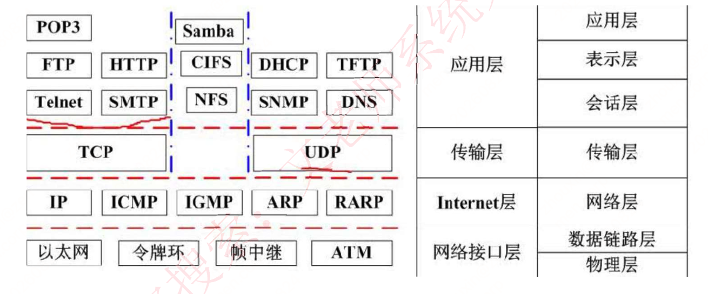
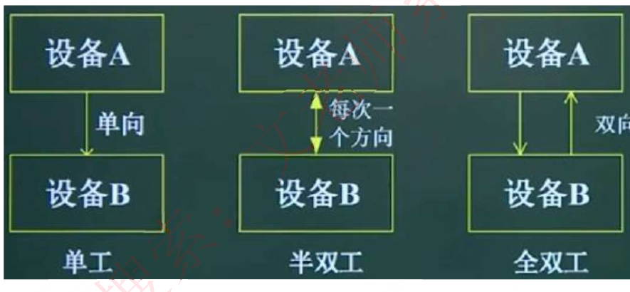
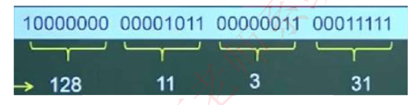
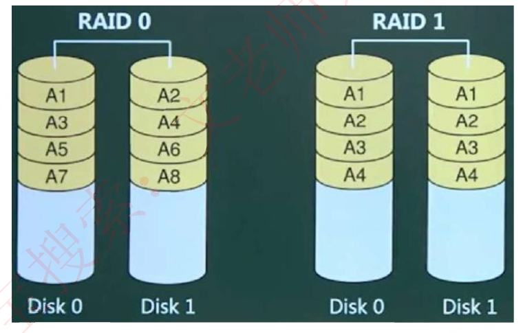
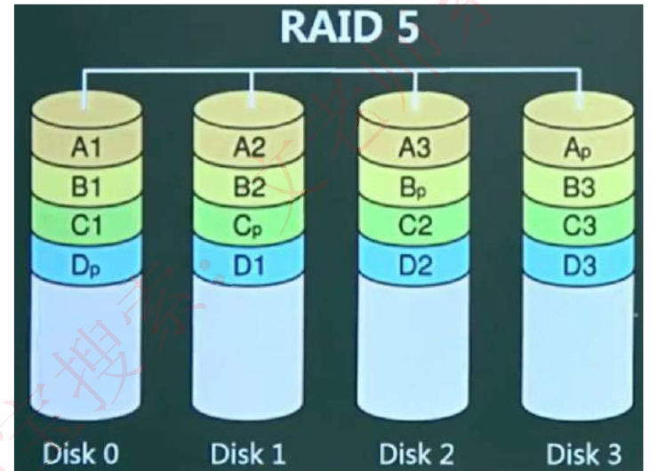
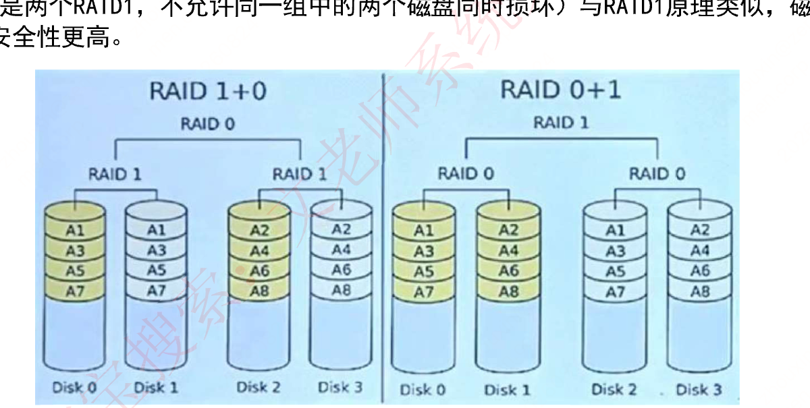
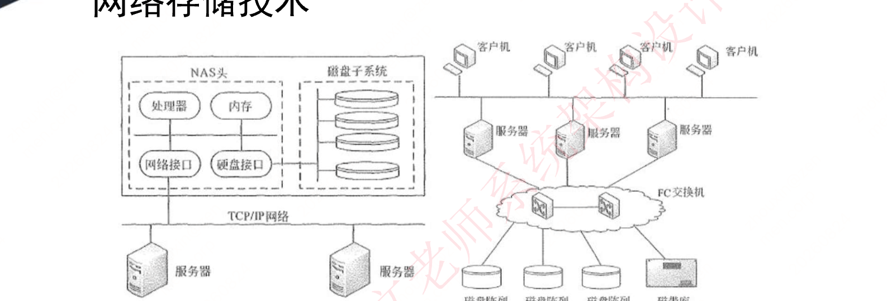

# 第五章 计算机网络（课件原文）

> 本页为课件原始内容，未经精简。精简笔记见 [笔记 · 第五章](/notes/chapter-05/)。

## 知识点目录

1. 网络概述和模型（第二版教材 2.5 内容）
   - 1.1 网络功能和分类
   - 1.2 通信技术与信道
   - 1.3 信号处理与复用多址
   - 1.4 网络分类
   - 1.5 局域网和广域网
   - 1.6 OSI 七层模型
   - 1.7 TCP/IP 协议
   - 1.8 协议端口号
   - 1.9 交换技术
   - 1.10 路由技术
   - 1.11 网络工程
   - 1.12 通信方式和交换方式
2. 补充：IP 地址
   - 2.1 分类地址格式
   - 2.2 子网划分
   - 2.3 无分类编址
3. 补充：IPv6
4. 补充：网络存储技术
   - 4.1 磁盘冗余阵列
   - 4.2 网络存储

> 历年真题考情：本章节每年考 3-5 分左右。

## 1 网络概述和模型

### 1.1 网络功能和分类

- 计算机网络是`利用通信线路将地理上分散的、具有独立功能的计算机系统和通信设备`按不同的形式连接起来，并`依靠网络软件及通信协议实现资源共享和信息传递`的系统。
- 计算机网络技术主要涵盖`通信技术、网络技术、组网技术和网络工程`等四个方面。
- 计算机网络的功能：`数据通信、资源共享、管理集中化、实现分布式处理、负载均衡`。
- 网络性能指标：
  （1）`速率`。网络速率指的是连接在计算机网络上的主机或通信设备在数字信道上`传送数据的速率`。单位是`b/s（比特每秒）`。
  （2）`带宽`。“带宽”有以下两种不同的意义。其一，带宽是指`一个信号具有的频带宽度`。单位是`赫兹`。其二，在计算机网络中，带宽用来`表示网络的通信线路传送数据的能力`。网络带宽表示在单位时间内从网络中一个结点到另一个结点所能通过的“最高数据率”。此处带宽单位是`b/s`。
  （3）`吞吐量`。表示`在单位时间内通过某个网络（或信道、接口）的数据量`。
  （4）`时延`。是指`数据（一个报文、分组甚至比特）从网络（或链路）的一端传送到另一端所需的时间`。它有时也称为延迟或迟延。
  （5）`往返时间`。它表示`从发送方发送数据开始，到发送方收到来自接收方的确认（接受方收到数据后立即发送确认）总共经历的时间`。
  （6）`利用率`。有`信道利用率`和`网络利用率`两种。信道利用率指信道被利用的概率（即有数据通过），通常以百分数表示。完全空闲的信道利用率是零。网络利用率是全网络的信道利用率的加权平均值。
- 网络非性能指标：`费用、质量、标准化、可靠性、可扩展性、可升级性、易管理性和可维护性`。

### 1.2 通信技术与信道

- 通信技术：计算机网络是利用通信技术`将数据从一个结点到另一结点传送的过程`。通信技术是计算机网络的`基础`。这里所说的数据，指的是`模拟信号和数字信号`，它们通过信道来传输。
- 信道可分为`物理信道`和`逻辑信道`。物理信道由`传输介质和设备组成`，根据传输介质的不同，分为`无线信道`和`有线信道`。逻辑信道是指`在数据发送端和接收端之间存在的一条虚拟线路`，可以是有连接的或无连接的。逻辑信道`以物理信道为载体`。
- 信息传输就是`信源和信宿通过信道收发信息的过程`。信源发出信息，发信机负责将信息转换成适合在信道上传输的信号，收信机将信号转化成信息发送给信宿。
  （1）信道是信息的传输通道。
  （2）发信机接收信源发送的信息，进行编码和调制，将信息转化成适合在信道上传输的信号，发送到信道上。
  （3）收信机负责从信道上接收信号，进行解调和译码，将信息恢复出来发送给信宿。
  （4）`香农公式`。信道容量就是信道的最大传输速率，可通过香农公式计算得到。
- 提升信道容量可以`使用比较大的带宽，降低信噪比；也可以使用比较小的带宽，升高信噪比`。

- `奈奎斯特定理（极限速率）`：若信道带宽为 W，则奈奎斯特定理指出最大码元速率为`B=2W（Baud）`。
- 一个码元携带的信息量 n（位）与码元的种类数 N 的关系：`n=log₂N（N=2ⁿ）`。
- 数据速率和波特率是不同的概念，`仅当码元取两个离散值时，两者的数值才相等`。
- `香农定理（有噪声极限速率）`：`C = Wlog₂(1+S/N)`。
- 其中，W 为信道带宽，S 为信号的平均功率，N 为噪声平均功率，S/N 叫作信噪比。由于在实际使用中 S 与 N 的比值太大，故常取其分贝数（dB）。`分贝与信噪比的关系为：dB = 10log₁₀(S/N)`。

### 1.3 信号处理与复用多址

- `发信机`进行的信号处理包括`信源编码`（将模拟信号转换为数字信号）、`信道编码`（通过增加冗余信息便于检错和纠错解决噪声干扰问题）、`交织`（将信道编码之后的数据顺序按照一定规律打乱可使连续误码变成零星误码）、`脉冲成形`（将发送数据转换成合适的波形）、`调制`（将信息承载到满足信号要求的高频载波信号）。
- 相反地，收信机进行的信号处理包括`解调、采样判决、去交织、信道译码和信源译码`。
- 如果同时传递多路数据就需要`复用技术`和`多址技术`。复用技术是指`在一条信道上同时传输多路数据的技术`，如 TDM 时分复用、FDM 频分复用和 CDM 码分复用等。多址技术是指`在一条线上同时传输多个用户数据的技术，在接收端把多个用户的数据分离`（TDMA 时分多址、FDMA 频分多址和 CDMA 码分多址）。
- 作为新一代的移动通信技术，5G 的特征体现在以下方面。
  1）基于 OFDM 优化的波形和多址接入
  2）实现可扩展的 OFDM 间隔参数配直
  3）OFDM 加窗提高多路传输效率
  4）灵活框架设计
  5）大规模 MIMO：最多 256 根天线
  6）毫米波：频率大于 24GHz 以上的频段
  7）频谱共享
  8）先进的信道编码设计：如低密度奇偶校验 LDPC 和 Polar 码等。

### 1.4 网络分类

- 计算机网络按`分布范围和拓扑结构划分`如下表所示：

| 网络分类 | 缩写 | 分布距离 | 计算机分布范围 | 传输速率范围 |
| --- | --- | --- | --- | --- |
| 局域网 | LAN | 10m 左右 | 房间 | 4Mbps～1Gbps |
| 局域网 | LAN | 100m 左右 | 楼宇 | 4Mbps～1Gbps |
| 局域网 | LAN | 1000m 左右 | 校园 | 4Mbps～1Gbps |
| 城域网 | MAN | 10km | 城市 | 50Kbps～100Mbps |
| 广域网 | WAN | 100km 以上 | 国家或全球 | 9.6Kbps～45Mbps |

### 1.5 局域网和广域网

- `局域网的拓扑结构`：总线型（利用率低、干扰大、价格低）、星型（交换机形成的局域网、中央单元负荷大）、环型（流动方向固定、效率低扩充难）、树型（总线型的扩充、分级结构）、分布式（任意节点连接、管理难成本高）。

- 以太网是一种计算机局域网组网技术。
- 以太网规范`IEEE 802.3`是重要的局域网协议，包括：
  - IEEE 802.3 标准以太网 10Mb/s，传输介质为细同轴电缆
  - IEEE 802.3u 快速以太网 100Mb/s，双绞线
  - IEEE 802.3z 千兆以太网 1000Mb/s，光纤或双绞线
  - IEEE 802.3ae 万兆以太网 10Gb/s，光纤

- `最小帧长：64 字节`。
- 无线局域网 WLAN 技术标准：`IEEE 802.11`。
- 在 WLAN 中，通常使用的拓扑结构主要有 3 种形式：`点对点型`（节点对等）、`HUB 型`（一个中心节点+若干外围节点）和`完全分布型`（无具体应该，理论阶段）。
- 广域网相关技术：`同步光网络`（SONET，利用光纤进行数字化信息通信）、`数字数据网`（DDN，利用数字信道提供半永久性连接电路以传输数据）、`帧中继`（FR，数据包交换技术）、`异步传输技术`（ATM，以信元为基础的面向连接的一种分组交换和复用技术）。

- 广域网具有下述特点：
  （1）主要提供`面向数据通信的服务`，支持用户使用计算机进行远距离的信息交换。
  （2）`覆盖范围广，通信的距离远`，广域网`没有固定拓扑结构`。
  （3）由`电信部门或公司负责组建`、`管理`和`维护`，并向全社会提供面向通信的有偿服务等。
- 广域网可以分为`公共传输网络、专用传输网络和无线传输网络`。
  （1）公共传输网络一般是由政府电信部门组建、管理和控制，网络内的传输和交换装置可以提供（或租用）给任何部门和单位使用。公共传输网络大体可以分为`电路交换网络和分组交换网络`两类。
  （2）专用传输网络是由`单个组织或团体自己建立`、使用、控制和维护的私有通信网络。一个专用网络起码要拥有自己的通信和交换设备，它可以建立自己的线路服务，也可以向公用网络或其他专用网络进行租用。专用传输网络主要是`数字数据网（DDN）`。DDN 可以在两个端点之间建立一条永久的、专用的数字通道。它的特点是在租用该专用线路期间，`用户独占该线路的带宽`。
  （3）无线传输网络主要是`移动无线网`，典型的有 GSM、TD-SCDMA/WCDMA/CDMA2000、LTE 和 5G 等。
- 城域网是在`单个城市范围内`所建立的计算机通信网，简称`MAN`。由于采用有源交换元件的局域网技术，网络中传输`时延较小`，它的传输媒介主要采用光缆，传输速率在`100 Mb/s`以上。MAN 基于一种大型的 LAN，通常使用与 LAN 相似的技术，但 MAN 的标准称为`分布式队列双总线 DQDB`，即`IEEE 802.6`。

- 城域网络通常分为 3 个层次：`核心层、汇聚层和接入层`。核心层主要提供`高带宽`的业务承载和传输，完成和已有网络的互联互通，其特征为宽带传输和`高速调度`。汇聚层的主要功能是`给业务接入结点提供用户业务数据的汇聚和分发处理`，同时要实现业务的服务等级分类。接入层利用多种接入技术，进行带宽和业务分配，`实现用户的接入`。
- 移动通信网
- 5G 网络的基本特征是`高速率`（峰值速率可大于 20Gb/s，相当于 4G 的 20 倍）、`低时延`（网络时延从 4G 的 50ms 缩减到 1ms）、`海量设备连接`（满足 1000 亿量级的连接）、`低功耗`（基站更节能，终端更省电）。
- 5G 网络的主要特征：`服务化架构、网络切片`（在单个独立的物理网络上切分出多个逻辑网络）。

### 1.6 OSI 七层模型

| 层 | 功能 | 单位 | 协议 | 设备 |
| --- | --- | --- | --- | --- |
| 1. 物理层 | `在链路上透明地传输位`。需要完成的工作包括线路配置、确定数据传输模式、确定信号形式、对信号进行编码、连接传输介质。为此定义了建立、维护和拆除物理链路所具备的机械特性、电气特性、功能特性以及规程特性。 | 比特 | EIA/TIA RS-232、RS-449、V.35、RJ-45、FDDI | 中继器、集线器 |
| 2. 数据链路层 | 把`不可靠的信道变为可靠的信道`。为此将比特组成帧，在链路上提供点到点的帧传输，并进行差错控制、流量控制等。 | 帧 | SDLC、HDLC、LAPB、PPP、STP、帧中继等、IEEE802、ATM | 交换机、网桥 |
| 3. 网络层 | 在源节点-目的节点之间进行`路由选择、拥塞控制、顺序控制、传送包`，保证报文的正确性。网络层控制着通信子网的运行，因而它又称为通信子网层。 | IP 分组 | IP、ICMP、IGMP、ARP、RARP | 路由器 |
| 4. 传输层 | 提供`端—端间可靠的、透明的数据传输`，保证报文顺序的正确性、数据的完整性。 | 报文段 | TCP、UDP | 网关 |
| 5. 会话层 | 建立`通信进程的逻辑名字与物理名字之间的联系`，提供`进程之间建立、管理和终止会话的方法，处理同步与恢复问题`。 |  | RPC、SQL、NFS | 网关 |
| 6. 表示层 | 实现`数据转换`（包括格式转换、压缩、加密等），提供标准的应用接口、公用的通信服务、公共数据表示方法。 |  | JPEG、ASCII、GIF、MPEG、DES | 网关 |
| 7. 应用层 | 对用户不透明的`提供各种服务`，如 E-mail。 | 数据 | Telnet、FTP、HTTP、SMTP、POP3、DNS、DHCP 等 | 网关 |

### 1.7 TCP/IP 协议

- 网络协议三要素：`语法、语义、时序`。其中语法部分规定传输数据的格式，语义部分规定所要完成的功能，时序部分规定执行各种操作的条件、顺序关系等。

- 网络层协议：
  - IP：网络层最重要的核心协议，在源地址和目的地址之间传送数据报，`无连接、不可靠`。
  - ICMP：因特网控制报文协议，用于在 IP 主机、路由器之间传递控制消息。控制消息是指网络通不通、主机是否可达、路由是否可用等网络本身的消息。
  - ARP 和 RARP：地址解析协议，`ARP 是将 IP 地址转换为物理地址，RARP 是将物理地址转换为 IP 地址`。
  - IGMP：网络组管理协议，允许因特网中的计算机参加多播，是计算机用做向相邻多目路由器报告多目组成员的协议，支持组播。
- 传输层协议：
  - TCP：整个 TCP/IP 协议族中最重要的协议之一，在 IP 协议提供的不可靠数据数据基础上，采用了重发技术，为应用程序提供了一个可靠的、面向连接的、全双工的数据传输服务。一般用于传输数据量比较少，且对可靠性要求高的场合。
  - UDP：是一种不可靠、无连接的协议，有助于提高传输速率，一般用于传输数据量大，对可靠性要求不高，但要求速度快的场合。

- 应用层协议：基于 TCP 的 FTP、HTTP 等都是可靠传输。基于 UDP 的 DHCP、DNS 等都是不可靠传输。
  - FTP：可靠的文件传输协议，用于因特网上的控制文件的双向传输。
  - HTTP：超文本传输协议，用于从 WWW 服务器传输超文本到本地浏览器的传输协议。使用 SSL 加密后的安全网页协议为 HTTPS。
  - SMTP 和 POP3：简单邮件传输协议，是一组用于由源地址到目的地址传送邮件的规则，邮件报文采用 ASCII 格式表示。
  - Telnet：远程连接协议，是因特网远程登录服务的标准协议和主要方式。
  - TFTP：不可靠的、开销不大的小文件传输协议。
  - SNMP：简单网络管理协议，由一组网络管理的标准协议，包含一个应用层协议、数据库模型和一组资源对象。该协议能够支持网络管理系统，泳衣监测连接到网络上的设备是否有任何引起管理师行关注的情况。
  - DHCP：动态主机配置协议，基于 UDP，基于 C/S 模型，为主机动态分配 IP 地址，有三种方式：固定分配、动态分配、自动分配。
  - DNS：域名解析协议，通过域名解析出 IP 地址。

### 1.8 协议端口号

- 协议端口号对照表：

| 端口 | 服务 | 端口 | 服务 |
| --- | --- | --- | --- |
| 20 | 文件传输协议（数据） | 80 | 超文本传输协议（HTTP） |
| 21 | 文件传输协议（控制） | 110 | POP3 服务器（邮箱接收服务器） |
| 23 | Telnet 终端仿真协议 | 69 | 简单文件传输协议（TFTP） |
| 67 | DHCP（服务端） | 68 | DHCP（客户端） |
| 25 | SMTP 简单邮件发送协议 | 161 | SNMP（轮询） |
| 53 | 域名服务器（DNS） | 162 | SNMP（陷阱） |

### 1.9 交换技术

- 数据在网络中转发通常离不开交换机。人们日常使用的计算机通常就是通过交换机接入网络的。
- 交换机功能包括：
  - 集线功能。提供大量可供线缆连接的端口达到部署星状拓扑网络的目的。
  - 中继功能。在转发帧时重新产生不失真的电信号。
  - 桥接功能。在内置的端口上使用相同的转发和过滤逻辑。
  - 隔离冲突域功能。将部署好的局域网分为多个冲突域，而每个冲突域都有自己独立的带宽，以提高交换机整体宽带利用效率。
- 交换机需要实现的功能如下所述。
  （1）转发路径学习。根据收到数据帧中的源 MAC 地址建立该地址同交换机端口的映射，写入 MAC 地址表中。
  （2）数据转发。如果交换机根据数据帧中的目的 MAC 地址在建立好的 MAC 地址表中查询到了，就向对应端口进行转发。
  （3）数据泛洪。如果数据帧中的目的 MAC 地址不在 MAC 地址表中，则向所有端口转发，也就是泛洪。广播帧和组播帧向所有端口（不包括源端口）进行转发。
  （4）链路地址更新。MAC 地址表会每隔一定时间（如 300s）更新一次。

### 1.10 路由技术

- 路由功能由路由器来提供，具体包括：
  （1）异种网络互连，比如具有异种子网协议的网络互连；
  （2）子网协议转换，不同子网间包括局域网和广域网之间的协议转换；
  （3）数据路由，即将数据从一个网络依据路由规则转发到另一个网络；
  （4）速率适配，利用缓存和流控协议进行适配；
  （5）隔离网络，防止广播风暴，实现防火墙；
  （6）报文分片和重组，超过接口的 MTU 报文被分片，到达目的地之后的报文被重组；
  （7）备份、流量控制，如主备线路的切换和复杂流量控制等。
- 路由器工作在 OSI 七层协议中的第 3 层，即网络层。其主要任务是接收来源于一个网络接口的数据包，通常根据此数据包的目地址决定待转发的下一个地址（即下一跳地址）。路由器中维持着数据转发所需的路由表，所有数据包的发送或转发都通过查找路由表来实现。这个路由表可以静态配置，也可以通过动态路由协议自动生成。
- 一般来说，路由协议可分为内部网关协议（IGP）和外部网关协议（EGP）两类。
  （1）内部网关协议。在一个自治系统 AS 内运行的路由协议称为内部网关协议。内部网关协议可以划分为两类：距离矢量路由协议（小型网络）和链路状态路由协议（大型网络如 IS-IS 和 OSPF）。
  （2）外部网关协议。在 AS 之间的路由协议称为外部网关协议。外部网关协议最初采用的是 EGP。为了摆脱 EGP 局限性，IETF 边界网关协议工作组制定了标准的边界网关协议（BGP）。

### 1.11 网络工程

- 网络建设工程可分为网络规划、网络设计和网络实施三个环节。
- 网络规划需要以需求为导向，兼顾技术和工程可行性。网络规划包括网络需求分析、可行性分析以及对现有网络的优化升级时）的分析。
- 网络设计是在网络规划基础上设计一个能解决用户问题的方案。网络设计包括网络总体目标确定、总体设计原则确定以及通信子网设计，设备选型，网络安全设计等。
- 网络实施是依据网络设计结果进行设备采购、安装、调试和系统切换（需对原有系统改造升级时）等。网络实施具体包括工程实施计划、网络设备验收、设备安装和调试、系统试运行和切换、用户培训等。

### 1.12 通信方式和交换方式

- 通信方向：数据通信是指发送方发送数据到接收方，这个传输过程可以分类如下：
  - 单工：只能由设备 A 发给设备 B，即数据流只能单向流动。
  - 半双工：设备 A 和设备 B 可以互相通信，但是同一时刻数据流只能单向流动。
  - 全双工：设备 A 和设备 B 在任意时刻都能互相通信。

- 同步方式：
  - 异步传输：发送方每发送一个字符，需要约定一个起始位和停止位插入到字符的起始和结尾处，这样当接收方接收到该字符时能够识别，但是这样会造成资源浪费，传输效率降低。
  - 同步传输：以数据块为单位进行传输，当发送方要发送数据时，先发送一个同步帧，接收方收到后做好接收准备，开始接收数据块，结束后又会有结束帧确认，这样一次传输一个数据块，效率高。
- 串行传输：只有一根数据线，数据只能 1bit 挨个排队传送，适合低速设备、远距离的传送，一般用于广域网中。
- 并行传输：有多根数据线，可以同时传输多个 bit 数据，适合高速设备的传送，常用语计算机内部各硬件模块之间。

- 交换方式：
  - 电路交换：通信一方进行呼叫，另一方接收后，在二者之间会建立一个专用电路，特点为面向连接、实时性高、链路利用率低，一般用于语音视频通信。
  - 报文交换：以报文为单位，存储转发模式，接收到数据后先存储，进行差错校验，没有错误则转发，有错误则丢弃，因此会有延时，但可靠性高，是面向无连接的。
  - 分组交换：以分组为单位，也是存储转发模式，因为分组的长度比报文小，所以时延小于报文交换，又可分为三种方式：
    - 数据报：是现在主流的交换方式，各个分组携带地址信息，自由的选择不同的路由路径传送到接收方，接收方接收到分组后再根据地址信息重新组装成原数据，是面向无连接的，但是不可靠的。
    - 虚电路：发送方发送一个分组，接收方收到后二者之间就建立了一个虚拟的通信线路，二者之间的分组数据交互都通过这条线路传送，在空闲的时候这条线路也可以传输其他数据，是面向连接的，可靠的。
    - 信元交换：异步传输模式 ATM 采用的交换方式，本质是按照虚电路方式进行转发，只不过信元是固定长度的分组，共 53B，其中 5B 为头部，48B 为数据域，也是面向连接的，可靠的。

## 2 补充：IP 地址

### 2.1 分类地址格式

- 机器中存放的 IP 地址是 32 位的二进制代码，每隔 8 位插入一个空格，可提高可读性，为了便于理解和设置，一般会采用点分十进制方法来表示：将 32 位二进制代码每 8 位二进制转换成十进制，就变成了 4 个十进制数，而后再在每个十进制数间隔中插入，如下所示，最终为 128.11.3.31：

- 因为每个十进制数都是由 8 个二进制数转换而来，因此每个十进制数的取值范围为 0-255（掌握二进制转十进制的快速计算方法，牢记 2 的幂指数值，实现快速转换）。

- 分类 IP 地址：IP 地址分四段，每段八位，共 32 位二进制数组成。在逻辑上，这 32 位 IP 地址分为网络号和主机号，依据网络号位数的不同，可以将 IP 地址分为以下几类：

| 类别 | 点分十进制 | 二进制 |
| --- | --- | --- |
| A 类 | 0.0.0.0（最低） | 00000000 00000000 00000000 00000000 |
| A 类 | 127.255.255.255（最高） | 01111111 11111111 11111111 11111111 |
| B 类 | 128.0.0.0（最低） | 10000000 00000000 00000000 00000000 |
| B 类 | 191.255.255.255（最高） | 10111111 11111111 11111111 11111111 |
| C 类 | 192.0.0.0（最低） | 11000000 00000000 00000000 00000000 |
| C 类 | 223.255.255.255（最高） | 11011111 11111111 11111111 11111111 |
| D 类组播 | 224.0.0.0（最低） | 11100000 00000000 00000000 00000000 |
| D 类组播 | 239.255.255.255（最高） | 11101111 11111111 11111111 11111111 |
| E 类保留 | 240.0.0.0（最低） | 11110000 00000000 00000000 00000000 |
| E 类保留 | 255.255.255.255（最高） | 11111111 11111111 11111111 11111111 |

- 特殊 IP 地址：
  - 公有地址：通过它直接访问因特网。是全网唯一的 IP 地址。
  - 私有地址：属于非注册地址，专门为组织机构内部使用，不能直接访问因特网，私有地址范围如下表所示：

| 类别 | IP 地址范围 | 网络号 | 网络数 |
| --- | --- | --- | --- |
| A | 10.0.0.0～10.255.255.255 | 10 | 1 |
| B | 172.16.0.0～172.31.255.255 | 172.16～172.31 | 16 |
| C | 192.168.0.0～192.168.255.255 | 192.168.0～192.168.255 | 256 |

  - 其他特殊地址如下表所示：

| 网络号 | 主机号 | 源地址使用 | 目的地址使用 | 代表的意思 |
| --- | --- | --- | --- | --- |
| 0 | 0 | 可以 | 不可 | 在本网络上的本主机 |
| 全 1 | 全 1 | 不可 | 可以 | 在本网络上进行广播 |
| Net-ID | 全 1 | 不可 | 可以 | 对 net-ID 上的所有主机进行广播 |
| 127 | 非全 0 或全 1 的数 | 可以 | 可以 | 用作本地软件环回测试之用 |
| 169.254 | 非全 0 或全 1 的数 | 可以 | 可以 | Windows 主机 DHCP 服务器故障分配 |

### 2.2 子网划分

- 子网划分：一般公司在申请网络时，会直接获得一个范围很大的网络，如一个 B 类地址，因为主机数之间相差的太大了，不便于分配，我们一般采用子网划分的方法来划分网络，即自定义网络号位数，就能自定义主机号位数，就能根据主机个数来划分出最适合的方案，不会造成资源的浪费。
- 因此就有子网的概念，一般的 IP 地址按标准划分为 A B C 类后，可以进行再一步的划分，将主机号拿出几位作为子网号，就可以划分出多个子网，此时 IP 地址组成为：网络号+子网号+主机号。
- 网络号和子网号都为 1，主机号都为 0，这样的地址为子网掩码。
- 要注意的是：子网号可以为全 0 和全 1，主机号不能为全 0 或全 1，因此，主机数需要-2，而子网数不用。
- 还可以聚合网络为超网，就是划分子网的逆过程，将网络号取出几位作为主机号，此时，这个网络内的主机数量就变多了，成为一个更大的网络。

### 2.3 无分类编址

- 无分类编址：即不按照 A B C 类规则，自动规定网络号，无分类编址格式为：IP 地址/网络号，示例：128.168.0.11/20 表示的 IP 地址为 128.168.0.11，其网络号占 20 位，因此主机号占 32-20=12 位，也可以划分子网。

## 3 补充：IPv6

- 主要是为了解决 IPv4 地址数不够用的情况而提出的设计方案，IPv6 具有以下特性：
  - IPv6 地址长度为 128 位，地址空间增大了 2^96 倍；
  - 灵活的 IP 报文头部格式，使用一系列固定格式的扩展头部取代了 IPv4 中可变长度的选项字段。IPv6 中选项部分的出现方式也有所变化，使路由器可以简单撂过选项而不做任何处理，加快了报文处理速度；
  - IPv6 简化了报文头部格式，加快报文转发，提高了吞吐量；
  - 提高安全性，身份认证和隐私权是 IPv6 的关键特性；
  - 支持更多的服务类型；
  - 允许协议继续演变，增加新的功能，使之适应未来技术的发展。
- IPv4 和 IPv6 的过渡期间，主要采用三种基本技术：
  （1）双协议栈：主机同时运行 IPv4 和 IPv6 两套协议栈，同时支持两套协议，一般来说 IPv4 和 IPv6 地址之间存在某种转换关系，如 IPv6 的低 32 位可以直接转换为 IPv4 地址，实现互相通信。
  （2）隧道技术：这种机制用来在 IPv4 网络之上建立一条能够传输 IPv6 数据报的隧道，例如可以将 IPv6 数据报当做 IPv4 数据报的数据部分加以封装，只需要加一个 IPv4 的首部，就能在 IPv4 网络中传输 IPv6 报文。
  （3）翻译技术：利用一台专门的翻译设备（如转换网关），在纯 IPv4 和纯 IPv6 网络之间转换 IP 报头的地址，同时根据协议不同对分组做相应的语义翻译，从而使纯 IPv4 和纯 IPv6 站点之间能够透明通信。

## 4 补充：网络存储技术

### 4.1 磁盘冗余阵列

- RAID 即磁盘冗余阵列技术，将数据分散存储在不同磁盘中，可并行读取，可冗余存储，提高磁盘访问速度，保障数据安全性。
- RAID0 将数据分散的存储在不同磁盘中，磁盘利用率 100%，访问速度最快，但是没有提供冗余和错误修复技术；
- RAID1 在成对的独立磁盘上产生互为备份的数据，增加存储可靠性，可以纠错，但磁盘利用率只有 50%；

- RAID2 将数据条块化的分布于不同硬盘上，并使用海明码校验；
- RAID3 使用奇偶校验，并用单块磁盘存储奇偶校验信息（可靠性低于 RAID5）；
- RAID5 在所有磁盘上交叉的存储数据及奇偶校验信息（所有校验信息存储总量为一个磁盘容量，但分布式存储在不同的磁盘上），读/写指针可同时操作；

- RAID0+1（是两个 RAID0，若一个磁盘损坏，则当前 RAID0 无法工作，即有一半的磁盘无法工作）；
- RAID1+0（是两个 RAID1，不允许同一组中的两个磁盘同时损坏）与 RAID1 原理类似，磁盘利用率都只有 50%，但安全性更高。

### 4.2 网络存储

1. 直接附加存储（DAS）：是指将存储设备通过 SCSI 接口直接连接到一台服务器上使用，其本身是硬件的堆叠，存储操作依赖于服务器，不带有任何存储操作系统。
   - 存在问题：在传递距离、连接数量、传输速率等方面都受到限制。容量难以扩展升级；数据处理和传输能力降低；服务器异常会波及存储器。
2. 网络附加存储（NAS）：通过网络接口与网络直接相连，由用户通过网络访问，有独立的存储系统。如下图所示。NAS 存储设备类似于一个专用的文件服务器，去掉了通用服务器大多数计算功能，而仅仅提供文件系统功能。以数据为中心，将存储设备与服务器分离，其存储设备在功能上完全独立于网络中的主服务器。客户机与存储设备之间的数据访问不再需要文件服务器的干预，同时它允许客户机与存储设备之间进行直接的数据访问，所以不仅响应速度快，而且数据传输速率也很高。
   - NAS 的性能特点是进行小文件级的共享存取；支持即插即用；可以很经济的解决存储容量不足的问题，但难以获得满意的性能。

3. 存储区域网（SAN）：SAN 是通过专用交换机将磁盘阵列与服务器连接起来的高速专用子网。它没有采用文件共享存取方式，而是采用块（block）级别存储。SAN 是通过专用高速网将个或多个网络存储设备和服务器连接起来的专用存储系统，其最大特点是将存储设备从传统的以太网中分离了出来，成为独立的存储区域网络 SAN 的系统结构。根据数据传输过程采用的协议，其技术划分为 FC SAN（光纤通道）、IP SAN（IP 网络）和 IB SAN（无线带宽）技术。
