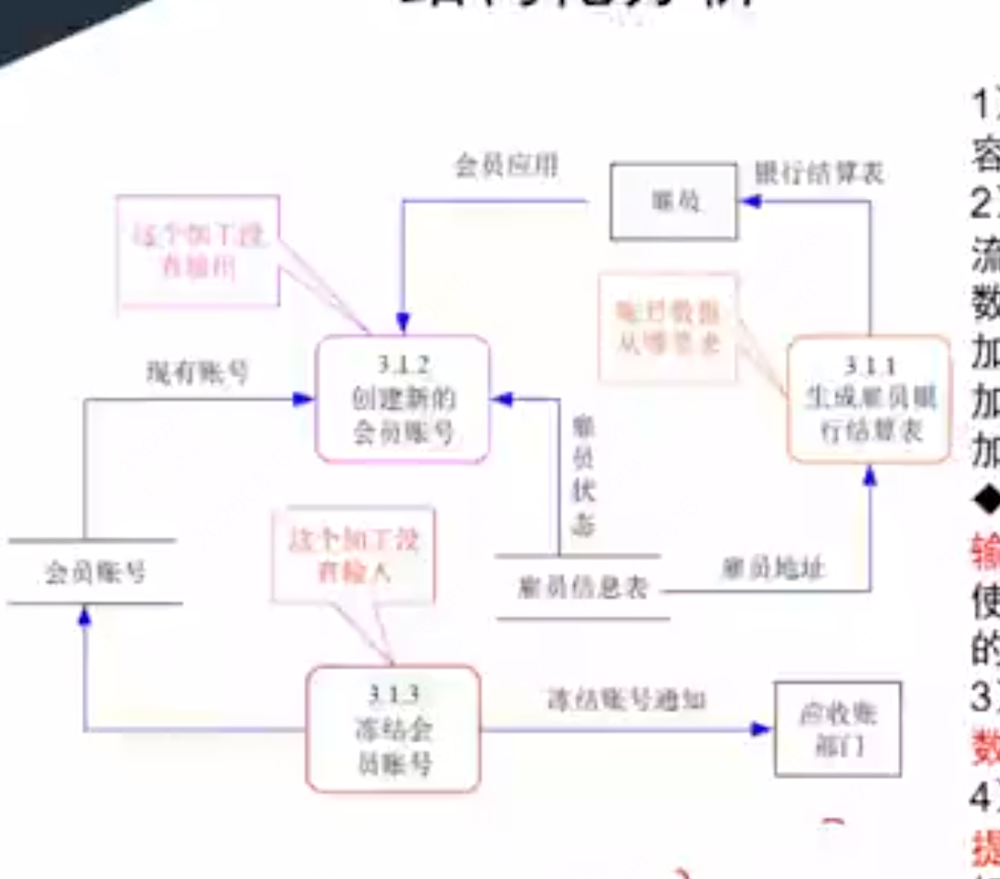

# 第十章 软件工程基础知识（课件原文）

> 本页为课件原始内容，未经精简。精简笔记见 [笔记 · 第十章](/notes/chapter-10/)。

## 知识点目录

1. 软件工程
   - 1.1 软件过程模型
   - 1.2 软件能力成熟度模型
   - 1.3 逆向工程
2. 需求工程
   - 2.1 软件需求
   - 2.2 需求获取
   - 2.3 需求变更和需求追踪
3. 系统分析与设计
   - 3.1 结构化分析
   - 3.2 结构化设计
   - 3.3 人机界面设计
4. 软件测试
   - 4.1 测试方法
   - 4.2 测试阶段
   - 4.3 测试用例设计
   - 4.4 McCabe 度量法
5. ★ 补充：系统运行与维护
6. 净室软件工程
7. 基于构件的软件工程

## 1 软件工程

### 1.1 软件过程模型

#### 统一过程模型（RUP）

待补充。

### 1.2 软件能力成熟度模型

待补充。

### 1.3 逆向工程

待补充。

## 2 需求工程

**需求工程的定义**

需求工程是指应用已证实有效的原理、方法，通过合适的工具和记号，`系统地描述待开发系统及其行为特征和相关约束`。需求工程覆盖了`体系结构设计之前的各项开发活动`，主要包括`分析客户要求、对未来系统的各项功能性及非功能性需求进行规格说明`。需求工程的目标简单明了：`确定客户需求，定义设想中系统的所有外部特征`。

**需求工程的活动**

`需求获取、需求分析、形成需求规格（需求文档化）、需求确认与验证、需求管理`。

**需求基线与需求约定**

软件需求开发的最终文档经过评审批准后，则`定义了开发工作的需求基线`。这个基线在客户和开发者之间构筑了计划产品功能需求和非功能需求的一个约定。`需求约定是需求开发和需求管理之间的桥梁`。

### 2.1 软件需求

待补充。

### 2.2 需求获取

常见的需求获取法包括：

1. `用户面谈`：`1对1-3，有代表性的用户`。其形式包括`结构化和非结构化`两种。面谈过程需要认真的计划和准备；面谈之后，需要复查笔记的准确性、完整性和可理解性；把所收集的信息转化为适当的模型和文档；确定需要进一步澄清的问题。
2. `需求专题讨论会`：`将相关涉众集中在一起集体讨论，与会者可以在应用需求上达成共识`，对操作过程尽快取得统一的意见。参加会议的人员包括主持人、用户、技术人员、项目组人员。
3. `问卷调查`：`用户多，无法一一访谈`。可用于`确认假设和收集统计倾向数据`。
4. `现场观察`：主要是通过`观察用户实际执行业务的过程`，`来直观地了解业务的执行过程`，全面了解需求细节。执行业务可能是手工操作，也可能是在原有的业务系统上执行。
5. `原型化方法`：在需求的早期，用户往往在具体的需求定义上存在很多不确定性。此时往往可以通过`在需求阶段采用原型化方法，通过开发系统原型以及与用户的多迭代反馈`，解决在早期阶段需求不确定的问题，尤其是在人机界面等高度不确定的需求。
6. `头脑风暴法`：在一些新业务拓展的软件项目中，由于业务是新出现的，而且`业务流程存在高度的不确定性`，例如互联网上的新业务系统、App等，`一群人围绕该业务，发散思维，不断产生新的观点`，参会者敞开思想使各种设想在相互碰撞中激起大脑的创造性风暴，从而确定具体的需求。

### 2.3 需求变更和需求追踪

**需求管理**

需求管理是一个`对系统需求变更、了解和控制的过程`。需求管理过程与需求开发过程相互关联，当初始需求导出的同时就启动了需求管理规划，`一旦形成了需求文档的初稿，需求管理活动就开始了`。`需求管理的主要活动如图所示`。

*注："主要活动"原课件配图未包含在截图中，后续补上。*

**需求变更（变更控制）**

为了使开发组织能够`严格控制软件项目`，应该确保以下事项：

- 仔细`评估已建议的变更`。
- 挑选合适的人选`对变更做出判定`。
- 变更应及时`通知所有相关人员`。
- 项目要`按一定的程序来采纳需求变更`，对变更的过程和状态进行控制。

**变更控制过程**（原课件为流程图）：

识别出问题 → 问题分析和变更描述 → 变更分析和成本计算 → 变更实现 → 修改后的需求

1. `问题分析和变更描述`：当提出一份变更提议后，需要对该提议做进一步的问题分析，检查它的有效性，从而产生一个更明确的需求变更提议。
2. `变更分析和成本计算`：当接受该变更提议后，需要对需求变更提议进行影响分析和评估。变更成本计算应该包括对该变更所引起的所有改动的成本，例如修改需求文档、相应的设计、实现等工作成本。一旦分析完成并且被确认，应该进行是否执行这一变更的决策。
3. `变更实现`：当确定执行该变更后，需要根据该变更的影响范围，按照开发的过程模型执行相应的变更。

**需求追踪**

待补充。

## 3 系统分析与设计

### 3.1 结构化分析

结构化分析常用数据流图（Data Flow Diagram，DFD）描述系统的功能和数据流向。数据流图用图形表示系统中数据的流动、处理、存储以及外部数据来源或去向，是结构化分析阶段常用的模型。

#### 数据流图的基本元素

1. **数据流**：用一个箭头描述数据的流向，箭头上标注的内容可以是信息说明或数据项。
2. **处理**：表示对数据进行的加工和转换。指向处理的数据流为该处理的输入数据流，离开处理的数据流为该处理的输出数据流。
3. **数据存储**：表示用数据库形式（或者文件形式）存储的数据。
4. **外部项**：也称为数据源或者数据终点，描述系统数据的提供者或者数据的使用者，例如教师、学生、采购员、某个组织或部门，以及其他系统。

#### 数据流图的常见错误

数据流图中常见三种错误：

- **黑洞**：处理有输入但是没有输出。例如，处理 `3.1.2 创建新的合同服务` 只有输入数据流，没有输出数据流。
- **奇迹**：处理有输出但是没有输入。例如，处理 `3.1.3 存储空白的合同号` 没有输入数据流，却产生了输出数据流。
- **灰洞**：处理的输入不足以产生输出，或者输入、输出之间的关系不完整。例如，处理 `3.1.1 生成订单信息` 中，输入不足以支撑所产生的输出。

产生上述错误的原因可能包括：处理命名错误、输入或输出标注不完整，以及需求实现不完整。灰洞是最常见的错误，也最难排查。数据流图交给程序员后，某个处理的输入数据流必须足以产生该处理的输出数据流。

#### 数据流图的建模过程及步骤

具体的建模过程及步骤如下：

1. **明确目标，确定系统范围**。
2. **建立顶层 DFD 图**。顶层 DFD 图表达和描述了将要实现的系统的主要功能，同时也确定了整个模型的内外关系，表达了系统的边界及范围。
3. **构建第一层 DFD 分解图**。
4. **开发 DFD 层次结构图**。分解可采用以下原则：保持均匀的模型深；按困难程度进行选择；如果一个处理难以确切命名，可以考虑对它重新分解。
5. **检查确认 DFD 图**。具体规则包括：父图中描述的数据流必须要在相应的子图中出现；一个处理至少有一个输入流和一个输出流；一个存储必定有流入的数据流和流出的数据流；一个数据流至少有一端是处理端；模型图中表达和描述的信息是全面的、完整的、正确的和一致的。

#### 数据字典（DD）

数据字典是一种用户可以访问的记录数据库和应用程序元数据的目录。数据字典是指对数据的数据项、数据结构、数据流、数据存储、处理逻辑等进行定义和描述，其目的是对数据流图中的各个元素做出详细的说明。简而言之，数据字典是描述数据信息的集合，是对系统中使用的所有数据元素定义的集合。数据字典各部分的描述如下：

1. **数据项**：数据流图中数据块的数据结构中的数据项说明。数据项是不可再分的数据单位。
2. **数据结构**：数据流图中数据块的数据结构说明。数据结构反映了数据之间的组合关系。
3. **数据流**：数据流图中流线的说明。
4. **数据存储**：数据流图中数据块的存储特性说明。
5. **处理逻辑**：数据流图中功能块的说明。

### 3.2 结构化设计

结构化设计是一种面向数据流的设计方法，它以 SRS 和 SA 阶段所产生的数据流图和数据字典等文档为基础，是一个自顶向下、逐步求精和模块化的过程。SD 方法的基本思想是将软件设计成由相对独立且具有单一功能的模块组成的结构，分为概要设计和详细设计两个阶段。

其中概要设计的主要任务是确定软件系统的结构，对系统进行模块划分，确定每个模块的功能、接口和模块之间的调用关系，输出模块结构图；详细设计的主要任务是为每个模块设计实现的细节，包括模块内详细算法设计、模块内数据结构设计、数据库的物理设计、代码、输入输出格式、用户界面等设计。

#### 结构化设计原则

1. 信息隐藏与抽象：采用封装技术，将程序模块的实现细节隐藏起来，对外仅暴露接口。
2. 模块化：模块是实现功能的基本单位，一般具有功能、逻辑和状态 3 个基本属性。模块的外部特性是指模块名、参数表和给程序乃至整个系统造成的影响；模块的内部特性是指完成其功能的程序代码和仅供该模块内部使用的数据。
3. 高内聚、低耦合。

#### 内聚程度分类

内聚程度从低到高如下表所示：

| 内聚分类 | 定义 | 记忆关键词 |
| --- | --- | --- |
| 偶然内聚 | 一个模块内的各处理元素之间没有任何联系 | 无直接关系 |
| 逻辑内聚 | 模块内执行若干个逻辑上相似的功能，通过参数确定该模块完成哪一个功能 | 逻辑相似、参数决定 |
| 时间内聚 | 把需要同时执行的动作组合在一起形成的模块 | 同时执行 |
| 过程内聚 | 一个模块完成多个任务，这些任务必须按指定的过程执行 | 指定的过程顺序 |
| 通信内聚 | 模块内的所有处理元素都在同一个数据结构上操作，或者各处理使用相同的输入数据或者产生相同的输出数据 | 相同数据结构、相同输入输出 |
| 顺序内聚 | 一个模块中的各个处理元素都密切相关于同一功能且必须顺序执行，前一个功能元素的输出就是下一个功能元素的输入 | 顺序执行、输入为输出 |
| 功能内聚 | 最强的内聚，模块内的所有元素共同作用完成一个功能，缺一不可 | 共同作用、缺一不可 |

#### 耦合程度分类

耦合程度从低到高如下表所示：

| 耦合分类 | 定义 | 记忆关键词 |
| --- | --- | --- |
| 非直接耦合 | 两个模块之间没有直接的关系，它们分别从属于不同模块的控制与调用，不传递任何信息 | 无直接关系 |
| 数据耦合 | 两个模块之间有调用关系，传递的是简单的数据值，相当于高级语言中的值传递 | 传递数据值调用 |
| 标记耦合 | 两个模块之间传递的是数据结构 | 传递数据结构 |
| 控制耦合 | 一个模块调用另一个模块时，传递的是控制变量；被调用模块通过控制变量的值有选择地执行其中某一功能 | 控制变量、选择执行某一功能 |
| 通信耦合 | 一组模块共享一组输入信息，或者它们的输出需要整合以形成完整数据，即共享输入或输出 | 共用通信信息 |
| 公共耦合 | 通过一个公共数据环境相互作用的那些模块之间的耦合 | 公共数据结构 |
| 内容耦合 | 一个模块直接使用另一个模块的内部数据，或通过非正常入口转入另一个模块内部 | 模块内部关联 |

#### 系统结构图与详细设计

系统结构图（SC）又称为模块结构图，是软件概要设计阶段的工具，反映系统的功能实现和模块之间的联系与通信，包括各模块之间的层次结构，即反映了系统的总体结构。

详细设计的基本步骤如下：

1. 分析并确定输入／输出数据的逻辑结构。
2. 找出输入数据结构和输出数据结构中有对应关系的数据单元。
3. 按一定的规则由输入、输出的数据结构导出程序结构。
4. 列出基本操作与条件，并把它们分配到程序结构图的适当位置。
5. 用伪码写出程序。

#### 详细设计的表示工具

详细设计的表示工具有图形工具、表格工具和语言工具。图形工具包括业务流程图、程序流程图、PAD 图、NS 流程图。

- **程序流程图**又称为程序框图：用方框表示一个处理步骤，菱形表示一个逻辑条件，箭头表示控制流向。优点是结构清晰、易于理解、易于修改；缺点是只能描述执行过程，不能描述有关的数据。
- **NS 流程图**也称为盒图，是一种强制使用结构化构造的图示工具，也称为方框图。它具有以下特点：功能域明确、不能任意转移控制、很容易确定局部和全局数据的作用域、很容易表示嵌套关系及模块的层次关系。
- **PAD 图**是一种改进的图形描述方式，可以用来取代程序流程图，比程序流程图更直观、结构更清晰。最大的优点是能够反映和描述自顶向下的历史和过程。PAD 提供了 5 种基本控制结构的图示，并允许递归使用。

### 3.3 人机界面设计

#### 人机界面设计的三大原则

人机界面设计的三大原则是：置于用户控制之下、减少用户的记忆负担、保持界面的一致性。

##### 1. 置于用户控制之下

- 以不强迫用户进入不必要的或不希望的动作的方式来定义交互方式；
- 提供灵活的交互；
- 允许用户交互可以被中断和取消；
- 当技能级别增加时，可以使交互流水化并允许定制交互；
- 使用户隔离内部技术细节；
- 设计应允许用户和出现在屏幕上的对象直接交互。

##### 2. 减少用户的记忆负担

- 减少对短期记忆的要求；
- 建立有意义的缺省；
- 定义直觉性的捷径；
- 界面的视觉布局应该基于真实世界的隐喻；
- 以不断进展的方式揭示信息。

##### 3. 保持界面的一致性

- 允许用户将当前任务放入有意义的语境；
- 在应用系列内保持一致性；
- 如过去的交互模型已经建立起了用户期望，除非有迫不得已的理由，不要去改变它。

## 4 软件测试

### 4.1 测试方法

#### 软件测试的定义与目的

软件测试是使用人工或自动的手段来运行或测定某个软件系统的过程，其目的在于检验它是否满足规定的需求或弄清预期结果与实际结果之间的差别。

软件测试的目的是确保软件的质量，确认软件以正确的方式做了用户所期望的事情。软件测试工作的主要任务是发现软件的错误，有效定义和实现软件成分由低层到高层的组装过程，验证软件是否满足任务书和系统定义文档所规定的技术要求，并为软件质量模型的建立提供依据。

#### 测试方法的分类

软件测试可以从以下角度分类：

- 按测试过程中程序执行状态：动态测试、静态测试。
- 按具体实现算法细节和系统内部结构的相关情况：黑盒测试、白盒测试、灰盒测试。
- 按程序执行方式：人工测试、自动化测试，其中自动化测试通过自动化执行测试脚本完成。

#### 静态测试

静态测试是在被测程序不运行时，只依据分析或检查源程序的语句、结构、过程等来检查程序是否有错误。也就是通过对软件的需求规格说明书、设计说明书以及源程序做结构分析和流程图分析，从而找出错误。例如不匹配的参数、未定义的变量等。

静态测试的主要方法包括：

- **桌前检查**：程序员检查自己编写的程序，在程序编译后、单元测试前进行。
- **代码审查**：由若干个程序员和测试人员组成评审小组，通过召开程序评审会来进行审查。
- **代码走查**：也采用会议方式检查代码，但并非简单地检查代码，而是由测试人员提供测试用例，让程序员扮演计算机的角色，手动运行测试用例，检查代码逻辑。

#### 动态测试

动态测试是通过运行被测试程序，对得到的运行结果与预期的结果进行比较分析，同时分析运行效率和健壮性能等。动态测试方法可简单分为 3 个步骤：构造测试实例、执行程序、分析结果。

#### 黑盒测试

黑盒测试将被测程序看成是一个黑盒，工作人员在不考虑任何程序内部结构和特性的条件下，根据需求规格说明书设计测试实例，并检查程序的功能是否能够按照规范说明正确无误地运行。其主要是对软件界面和软件功能进行测试。对于黑盒测试行为，必须加以量化才能够有效地保证软件的质量。

#### 白盒测试

白盒测试主要是借助程序内部的逻辑和相关信息，通过检测内部动作是否按照设计规格说明书的设定进行，检查每一条通路能否正常工作。白盒测试从程序结构方面出发对测试用例进行设计，主要用于检查各个逻辑结构是否合理、对应的模块独立路径是否正常以及内部结构是否有效。

常用的白盒测试方法有控制流分析、数据流分析、路径分析、程序变异等。根据测试用例的覆盖程度，可分为语句覆盖、判定覆盖、分支覆盖和路径覆盖等。

#### ★ 额外补充：白盒测试用例覆盖标准

◆ 白盒测试用例：

（1）语句覆盖 SC：逻辑代码中的所有语句都要被执行一遍，覆盖层级最低。因为执行了所有的语句，不代表执行了所有的条件判断。

（2）判定覆盖 DC：逻辑代码中所有判断语句的条件的真假分支都要覆盖一次。

（3）条件覆盖 CC：针对每一个判断条件内的每一个独立条件都要执行一遍真和假。

（4）条件判定组合覆盖 CDC：同时满足判定覆盖和条件覆盖。

（5）路径覆盖：逻辑代码中的所有可能路径都覆盖了，覆盖层级最高。

#### 灰盒测试

灰盒测试介于黑盒测试与白盒测试之间。灰盒测试除了重视输出相对于输入的正确性，也看重其内部的程序逻辑，但是不能像白盒测试那样详细和完整。它只是简单地靠一些象征性的现象或标志来判断其内部的运行情况，因此在内部结果出现错误、但输出结果正确的情况下可以采用灰盒测试方法。因为在这种情况下灰盒比白盒高效，比黑盒适用性广的优势就凸显出来了。

#### 自动化测试

自动化测试就是软件测试的自动化，即在预先设定的条件下自动运行被测程序，并分析运行结果。总的来说，这种测试方法就是将以人工驱动的测试行为转化为机器执行的一种过程。

### 4.2 测试阶段

#### （1）单元测试

单元测试也称为模块测试，测试对象是可独立编译或汇编的程序模块、软件构件或面向对象软件中的类，测试依据是软件详细设计说明书。主要对软件模块进行测试，通过测试发现模块的功能不符合或不满足期望的情况和编码错误。

由于模块规模不大、功能单一、结构较简单，测试人员可以通过阅读源程序清楚了解其逻辑结构。首先应通过静态测试方法，例如静态分析、代码审查等，对模块源程序进行分析，按照模块程序设计的控制流程图满足覆盖率要求的逻辑测试要求。此外，也可采用黑盒测试方法提出一组基本测试用例，再用白盒测试方法进行验证。若黑盒测试产生的测试用例满足不了覆盖要求，可采用白盒法补充新的测试用例。

#### （2）集成测试

集成测试的目的是检查模块之间，以及模块和已集成的软件之间的接口关系，并验证已集成的软件是否符合设计要求。测试依据是软件概要设计文档。集成测试通常要对已经严格按照程序设计要求和标准组装起来的模块同时进行测试，明确程序结构组装的正确性，发现和接口有关的问题。一般采用白盒测试和黑盒测试结合的方法进行测试，验证这一阶段设计的合理性以及需求功能的实现性。

#### （3）★ 系统测试

一般情况下，系统测试采用黑盒测试，以此检查系统是否符合软件需求。本阶段的主要测试内容包括功能测试、性能测试、健壮性测试、安装或反安装测试、用户界面测试、压力测试、可靠性及安全性测试等。测试人员必须进行多轮回归测试。系统测试的结束标志是测试工作已满足测试目标所规定的需求覆盖率，并且测试所发现的缺陷都已全部归零。

#### （4）性能测试

性能测试是通过自动化的测试工具模拟多种正常、峰值以及异常负载条件来对系统的各项性能指标进行测试。负载测试和压力测试都属于性能测试，两者可以结合进行。通过负载测试，确定在各种工作负载下系统的性能，目标是测试当负载逐渐增加时系统各项性能指标的变化情况。压力测试是通过确定一个系统的瓶颈或者不能接受的性能点，来获得系统能提供的最大服务级别的测试。

#### （5）验收测试

验收测试是最后一个阶段的测试，是软件产品投入正式交付前的测试工作。其目的是满足用户需求或者与用户签订的合同的各项要求，由用户对要交付软件开展测试，验证软件实际工作的有效性和可靠性，确保用户能用该软件顺利完成既定的任务和功能。通过验收测试后，该产品即可进行发布。Alpha 测试是在软件开发环境下由用户进行的测试；Beta 测试是在实际环境中由多个用户对其进行的测试。

#### （6）回归测试

回归测试的目的是测试软件变更之后，变更部分的正确性和对变更需求的符合性，以及软件原有的、正确的功能、性能和其他规定的要求的不损害性。

### 4.3 测试用例设计

#### ★ 额外补充：测试用例设计（论文可写）

测试用例设计是根据软件需求和测试目标，设计输入数据、操作步骤以及预期输出，用于验证软件功能是否正确。黑盒测试用例设计不考虑程序内部结构，主要依据需求规格说明书，从软件的功能和输入输出关系出发设计测试用例。

#### 黑盒测试用例设计方法

1. **等价类划分**

   等价类划分是把所有可能的输入数据划分为若干个等价类，假定同一等价类中的数据对揭露程序错误是等价的，从每个等价类中选取有代表性的数据作为测试输入。等价类包括：

   - 有效等价类：对程序的规格说明来说是合理的、有意义的输入数据集合。
   - 无效等价类：对程序的规格说明来说是不合理的、无意义的输入数据集合。

   设计测试用例时，应尽量用一个测试用例覆盖多个尚未覆盖的有效等价类；对于每个尚未覆盖的无效等价类，则通常需要设计一个测试用例。

2. **边界值分析**

   边界值分析是对输入或输出范围的边界设计测试用例，因为程序在边界附近最容易发生错误。通常选取范围的端点值、刚刚超出范围的值进行测试，并可结合端点附近的值进行验证。

   例如，规定年龄的有效范围为 0～150 岁，可以选取 `0、150、-1、151` 作为边界测试值，其中 `0、150` 是有效范围端点，`-1、151` 是刚刚超出范围的值。

3. **错误推测法**

   错误推测法是根据测试人员的经验和直觉，推测程序中可能发生错误的地方，并有针对性地设计测试用例。例如，重点测试空输入、非法字符、极端数据、重复提交以及异常操作等容易出错的情况。

4. **因果图法**

   因果图法通过分析输入条件（原因）与输出结果（结果）之间的关系，推导出测试用例。它适合处理输入条件之间存在组合关系、约束关系或相互影响的复杂场景，没有固定的设计方法，需要结合具体需求分析原因和结果。

#### 其他测试

- **A/B 测试**：针对 Web 或 App 的界面、流程等提供多个版本，将相似的目标用户群体随机分配到不同版本，收集用户体验数据和业务数据，比较分析后选择效果更好的版本。
- **Web 测试**：针对 Web 应用开展的测试。由于 Web 应用的功能和性能直接影响用户使用效果，需要对其进行可靠、充分的验证。
- **链接测试**：验证每个链接是否能够跳转到预期页面、被链接的页面是否真实存在，并确保系统中不存在孤立页面。
- **表单测试**：验证表单提交按钮是否有效；例如注册完成后能否返回成功提示，提交的数据能否被正确处理，并向用户提供正确反馈。

### 4.4 McCabe 度量法

待补充。

## 5 ★ 补充：系统运行与维护

> 以下内容不是官网教材的正式内容，但曾经在考试中出现过，作为第十章补充知识记录。

### 5.1 系统转换与数据转换

系统转换是指新系统开发完毕，投入运行，取代现有系统的过程。常见的转换计划有：

1. **直接转换**：现有系统被新系统直接取代，风险很大，适用于新系统不复杂或现有系统已不能使用的情况，优点是节省成本。
2. **并行转换**：新、老系统并行工作一段时间，新系统试运行后再取代老系统。风险极小，适用于大型系统；缺点是耗费人力和时间，难以控制两个系统间的数据转换。
3. **分段转换**：分期分批逐步转换，将大型系统分为多个子系统，成熟一个转换一个。它是直接转换和并行转换的集合，适用于大型项目，但更耗时，需要协调新老系统接口。

**数据转换与迁移**是指将数据从旧数据库迁移到新数据库中，方法包括：系统切换前通过工具迁移、系统切换前手工录入、系统切换后通过新系统生成。

### 5.2 软件可维护性与软件维护

软件的可维护性是维护人员理解、改正、改动和改进软件的难易程度。

| 评价指标 | 含义 |
| --- | --- |
| 易分析性 | 诊断缺陷或失效原因，识别待修改部分 |
| 易改变性 | 实现指定修改，包括编码、设计和文档更改 |
| 稳定性 | 避免因软件修改造成意外结果 |
| 易测试性 | 确认修改后的软件 |
| 维护性的依从性 | 遵循与维护性相关的标准或约定 |

系统维护包括硬件维护、软件维护和数据维护。软件维护类型包括：正确性维护（发现 bug 后修改）、适应性维护（外部环境变化导致的被动修改和升级）、完善性维护（根据用户新需求增加功能、改善性能）、预防性维护（针对未来可能发生的 bug 进行预防性修改）。

## 6 净室软件工程

净室软件工程是应用数学与统计学理论，以经济方式生产高质量软件的工程技术，通过严格的工程化软件过程达到零缺陷或接近零缺陷。其核心是在规约和设计中消除错误，然后以“净”的方式制作，强调第 1 次正确编写代码增量，并在测试前验证正确性。

净室软件工程的理论基础主要是函数理论和抽样理论；应用技术包括统计过程控制下的增量式开发、基于函数的规约与设计、正确性验证、统计测试和软件验证。

其缺点包括：理论化程度高、需要较多数学知识；正确性验证困难且耗时；开发小组不进行传统模块测试不够现实；仍存在传统软件工程的一些弊端。

## 7 基于构件的软件工程

> **选择题高频考点**：以下知识点曾经考过选择题。

基于构件的软件工程（CBSE）是一种基于分布对象技术、强调通过可复用构件设计与构造软件系统的软件复用途径。CBSE 体现了“购买而不是重新构造”的哲学，将软件开发的重点从程序编写转移到了基于已有构件的组装。

**构件的 5 个特征：**可组装型、可部署性、文档化、独立性、标准化。其中：可组装型要求外部交互通过公开定义的接口；可部署性要求构件自包含、可独立运行，且为二进制形式、部署前无需编译；文档化要求用户能依据完整文档判断构件是否满足需求；独立性要求依赖其他构件时必须明确声明；标准化要求符合标准化构件模型。

**构件模型的要素：**接口、使用信息和部署。构件模型提供了一组被构件使用的通用服务，这种服务包括以下两种：

- 平台服务：允许构件在分布式环境下通信和互操作。
- 支持服务：是很多构件需要的共性服务。例如，构件都需要的身份认证服务。中间件实现共性的构件服务，并提供这些服务的接口。

**CBSE 过程的 6 个主要活动：**CBSE 过程是支持基于构件组装的软件开发过程，过程中的 6 个主要活动：系统需求概览、识别候选构件、根据发现的构件修改需求、体系结构设计、构件定制与适配、组装构件创建系统。

**CBSE 过程与传统软件开发过程的不同点：**

1. CBSE 早期需要完整的需求，以便尽可能多地识别出可复用的构件。
2. 在过程早期阶段根据可利用的构件来细化和修改需求。如果可利用的构件不能满足用户需求，就应该考虑由复用构件支持的相关需求。
3. 在系统体系结构设计完成后，会有一个进一步的对构件搜索及设计精化的活动。可能需要为某些构件寻找备用构件，或者修改构件以适合功能和架构的要求。
4. 开发就是将已经找到的构件集成在一起的组装过程。

> 选择题易错点：CBSE 的核心是复用和组装，不是从零编写；构件部署前无需编译；构件不等于完全没有依赖，依赖其他构件时必须明确声明；平台服务负责分布式通信与互操作，支持服务提供身份认证等公共服务。
