# 第十一章 面向对象技术（课件原文）

> 本页为课件原始内容，未经精简。精简笔记见 [笔记 · 第十一章](/notes/chapter-11/)。

## 知识点目录

1. 面向对象基础
2. UML
3. SysML（补充内容）
4. 设计模式
5. 历年真题

## 1 面向对象基础

面向对象开发方法认为`客观世界是由对象组成的`，`对象由属性和操作组成`，对象可按其属性进行分类，`对象之间的联系通过传递消息来实现`，对象具有`封装性、继承性和多态性`。面向对象开发方法是`以用例驱动的、以体系结构为中心的、迭代的和渐增式的开发过程`，主要包括`需求分析、系统分析、系统设计和系统实现`4个阶段，但是，各个阶段的划分不像结构化开发方法那样清晰，而是`在各个阶段之间迭代进行的`。

面向对象的分析方法 (OOA)，是在一个系统的开发过程中进行了系统业务调查以后，`按照面向对象的思想来分析问题`。OOA模型由`5个层次(主题层、对象类层、结构层、属性层和服务层)`和`5个活动(标识对象类、标识结构、定义主题、定义属性和定义服务)`组成。在这种方法中定义了两种对象类之间的结构，`一种称为分类结构；另一种称为组装结构`。分类结构就是所谓的`一般与特殊的关系`。组装结构则反映了对象之间的`整体与部分的关系`。

**OOA原则**

（1）抽象。是`从许多事物中舍弃个别的、非本质的特征，抽取共同的、本质性的特征`。抽象原则包括`过程抽象和数据抽象`两个方面。过程抽象是指，`任何一个完成确定功能的操作序列，其使用者都可以把它看作一个单一的实体`，尽管实际上它可能是由一系列更低级的操作完成的。数据抽象是`根据施加于数据之上的操作来定义数据类型`，并限定数据的值只能由这些操作来修改和观察。`数据抽象是OOA的核心原则`。它强调把`数据（属性）和操作（服务）结合为一个不可分的系统单位（即对象）`，对象的外部只需要知道它做什么，而不必知道它如何做。

（2）封装。就是把`对象的属性和服务结合为一个不可分的系统单位`，并尽可能隐藏对象的内部细节。

（3）继承。特殊类的对象拥有其对应的一般类的全部属性与服务，`称作特殊类对一般类的继承`。好处是：使系统模型比较简练也比较清晰。

（4）分类。就是把`具有相同属性和服务的对象划分为一类`，用类作为这些对象的抽象描述。分类原则实际上是抽象原则运用于对象描述时的一种表现形式。

（5）聚合。又称组装，其原则是：`把一个复杂的事物看成若干比较简单的事物的组装体`，从而简化对复杂事物的描述。

（6）关联。`通过一个事物联想到另外的事物`。能使人发生联想的原因是事物之间确实存在着某些联系。

（7）消息通信。要求`对象之间只能通过消息进行通信`，而不允许在对象之外直接地存取对象内部的属性。通过消息进行通信是由于封装原则而引起的。

（8）粒度控制。一般来讲，人在面对一个复杂的问题域时，不可能在同一时刻既能纵观全局，又能洞察秋毫。因此需要控制自己的视野：`考虑全局时，注意其大的组成部分，暂时不考虑具体的细节；考虑某部分的细节时则暂时撇开其余的部分`。这就是粒度控制原则。

（9）行为分析。现实世界中事物的行为是复杂的，由大量的事物所构成的问题域中各种行为往往相互依赖、相互交织。

**面向对象需求建模**

面向对象需求建模分为`用例模型`和`分析模型`两部分。用例模型完成`识别参与者、合并需求获得用例、细化用例描述、调整用例模型`等活动，细化用例描述并组织用例之间的关系；分析模型完成`定义概念类、识别类之间的关系、为类添加职责、建立交互图`等活动，并识别类之间的关系。

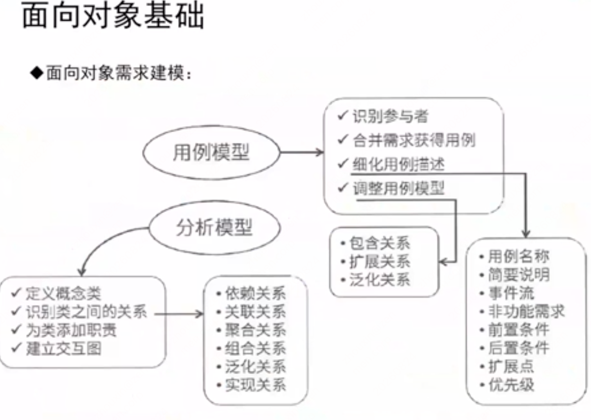

用例模型的活动：`识别参与者、合并需求获得用例、细化用例描述、调整用例模型`。

- 用例描述的组成要素：`用例名称、简要说明、事件流、非功能需求、前置条件、后置条件、扩展点、优先级`。
- 用例之间的关系：`包含关系、扩展关系、泛化关系`。

分析模型的活动：`定义概念类、识别类之间的关系、为类添加职责、建立交互图`。

- 类之间的关系：`依赖关系、关联关系、聚合关系、组合关系、泛化关系、实现关系`。

**面向对象的设计**

面向对象的设计：其基本思想包括`抽象、封装和可扩展性`，其中可扩展性`主要通过继承和多态来实现`。类封装了信息和行为，是面向对象的重要组成部分，它是`具有相同属性、方法和关系的对象集合的总称`。

在OOD中，类可以分为3种类型：`实体类、控制类和边界类`。

1) 实体类。实体类`映射需求中的每个实体`，是指实体类`保存需要存储在永久存储体中的信息`，例如，在线教育平台系统可以提取出学员类和课程类，它们都属于实体类。实体类通常都是`永久性的`，它们所具有的属性和关系是长期需要的，有时甚至在系统的整个生存期都需要。

2) 控制类。控制类是用于`控制用例工作的类`，一般是由`动宾结构的短语`（"动词+名词"或"名词+动词"）转化来的名词，例如，用例"身份验证"可以对应于一个控制类"身份验证器"，它提供了与身份验证相关的所有操作。控制类用于对一个或几个用例所特有的控制行为进行建模，控制对象（控制类的实例）通常控制其他对象，因此，它们的行为具有协调性。

**面向对象的设计原则**

（1）`开放—封闭原则`。软件实体（类、模块、函数等）应该是`可以扩展的`，即开放的；但是`不可修改的`，即封闭的。

（2）`里氏替换原则`。`子类型必须能够替换掉他们的基类型`。即，在任何父类可以出现的地方，都可以用子类的实例来赋值给父类型的引用。

（3）`依赖倒置原则`。`抽象不应该依赖于细节，细节应该依赖于抽象`。换言之，要针对接口编程，而不是针对实现编程。

（4）`组合/聚合复用原则`。又称为`合成复用原则`，是在一个新的对象中通过组合关系或聚合关系来使用一些已有的对象，使之成为新对象的一部分，新对象通过委派调用已有对象的方法达到复用其已有功能的目的。简单地说，就是要`尽量使用组合/聚合关系，少用继承`。一般而言，如果两个类之间是Has-A的关系，`则应使用组合或聚合；如果是Is-A关系，则可使用继承`。

（5）`接口隔离原则`。指`使用多个专门的接口，而不使用单一的总接口`。每个接口应该承担一种相对独立的角色，不多不少，不干不该干的事，该干的事都要干。

（6）最少知识原则也称为迪米特法则，是指`一个软件实体应当尽可能少地与其他实体发生相互作用`。最少知识原则可分为`狭义原则和广义原则`。在狭义原则中，如果两个类之间`不必彼此直接通信，那么这两个类就不应当发生直接的相互作用`；如果其中的一个类`需要调用另一个类的某一个方法，可以通过第三者转发这个调用`。广义原则是指`对对象之间的信息流量、流向和信息的影响的控制`，主要是对信息隐藏的控制。

**面向对象程序设计（OOP）**

面向对象程序设计（OOP）是一种`计算机编程架构`。OOP的一条基本原则是计算机程序由单个能够起到子程序作用的单元或对象组合而成。OOP达到了软件工程的3个主要目标：`重用性、灵活性和扩展性`。OOP=`对象+类+继承+多态+消息`，其中核心概念是`类和对象`。

**数据持久化与数据库**

在面向对象开发方法中，`对象只能存在于内存中，而内存不能永久保存数据`，如果要永久保存对象的状态，需要进行`对象的持久化`。对象持久化是把`内存中的对象保存到数据库或可永久保存的存储设备中`。在多层软件设计和开发中，为了降低系统的耦合度，一般会`引入持久层`，即专注于实现数据持久化应用领域的某个特定系统的一个逻辑层面，将数据使用者和数据实体相关联，持久层的设计`实现了数据处理层内部的业务逻辑和数据逻辑的解耦`。

目前，关系数据库仍旧是使用最为广泛的数据库，因此，将对象持久化到关系数据库中，需要进行`对象/关系的映射（ORM）`。随着对象持久化技术的发展，诞生了越来越多的持久化框架，目前，主流的持久化技术框架包括`Hibernate、iBatis和JDO`等。

## 2 UML

**UML 概述**

UML（统一建模语言）：是一种`可视化的建模语言，而非程序设计语言`，支持从需求分析开始的软件开发的全过程。

从总体上来看，UML 的结构包括`构造块、规则和公共机制`三个部分。

（1）构造块。UML 有三种基本的构造块，分别是`事物（thing）、关系（relationship）和图（diagram）`。事物是 UML 的重要组成部分，关系把事物紧密联系在一起，图是多个相互关联的事物的集合。

- 结构事物：模型的静态部分，如类、接口、用例、构件等；
- 行为事物：模型的动态部分，如交互、活动、状态机；
- 分组事物：模型的组织部分，如包；
- 注释事物：模型的解释部分，依附于一个元素或一组元素之上对其进行约束或解释的简单符号。

（2）公共机制。公共机制是指达到特定目标的公共 UML 方法。

（3）规则。规则是构造块如何放在一起的规定。

**UML 2.0 图的总分类**

`UML2.0` 图，总分类如下：

- 静态图（结构图）：
  - 用例图：系统与外部参与者的交互。
  - 类图：一组类、接口、协作和它们之间的关系。
  - 对象图：一组对象及它们之间的关系。
  - 构件图：一个封装的类和它的接口。
  - 部署图：软硬件之间映射。
  - 制品图：系统的物理结构。
  - 包图：由模型本身分解而成的组织单元，以及他们之间的依赖关系。
  - 组合结构图。
- 动态图（行为图）：
  - 顺序图：`强调按时间顺序`。
  - 通信图（协作图）。
  - 定时图：`强调实际时间`。
  - 交互概览图。
  - 状态图：状态转换变迁。
  - 活动图：类似程序流程图，并行行为。
- `交互图`（动态图中用虚线框出的 4 种）：顺序图、通信图（协作图）、定时图、交互概览图。

**类间关系（6 种）**

- 依赖：一个事物的语义`依赖于另一个事物的语义的变化而变化`。
- 关联：是一种结构关系，描述了一组链，链是对象之间的连接。分为`组合和聚合，都是部分和整体的关系，其中组合事物之间关系更强`。两个类之间的关联，实际上是两个类所扮演角色的关联，因此，两个类之间可以有多个由不同角色标识的关联。
- 泛化：`一般/特殊的关系`，`子类`和`父类`之间的关系。
- 实现：`一个类元指定了另一个类元保证执行的契约`。

**类图**

- 类图：静态图，为系统的`静态设计视图`，展现一组`对象`、`接口`、`协作`和它们之间的关系。UML 类图如下：

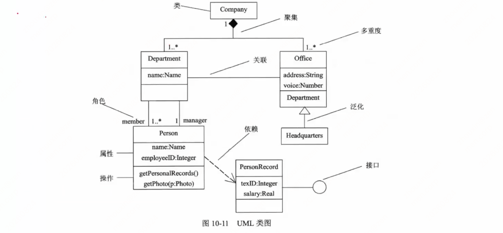

**用例图**

- 用例图：静态图，展现了一组`用例`、`参与者`以及它们之间的关系。用例图中的参与者是人、硬件或其他系统可以扮演的角色；用例是参与者完成的一系列操作，用例之间的关系有`扩展`、`包含`、`泛化`。如下：

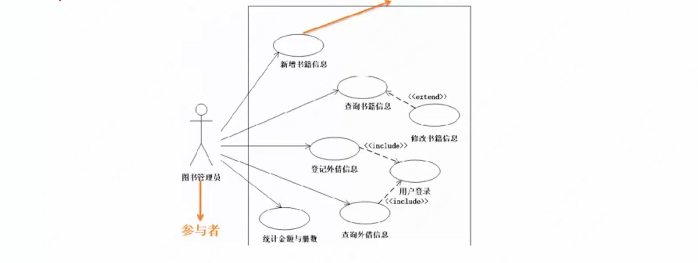

**序列图（顺序图）**

- 序列图：即顺序图，动态图，是场景的图形化表示，描述了`以时间顺序组织的对象之间的交互活动`。消息分三种：
  - 同步消息：进行阻塞调用，调用者中止执行，等待控制权返回，需要等待返回消息，用`实心三角箭头`表示；
  - 异步消息：发出消息后继续执行，不引起调用者阻塞，也不等待返回消息，由`空心箭头`表示；
  - 返回消息：由`从右到左的虚线箭头`表示。
- 示例：

**通信图（协作图）**

- 通信图：动态图，即`协作图`，`强调参加交互的对象的组织`。如下：

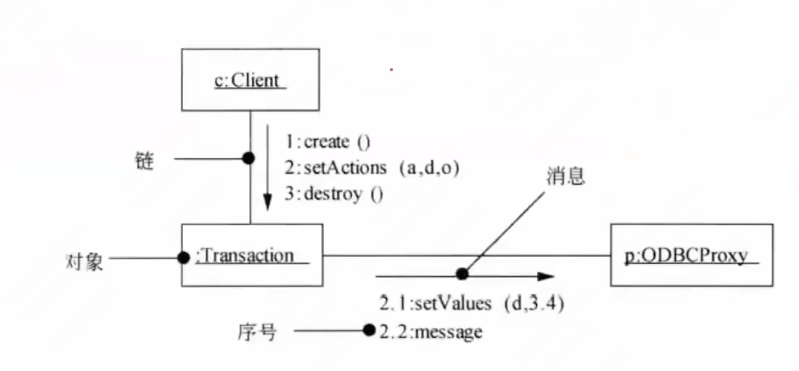

**状态图**

- 状态图：动态图，展现了一个状态机，描述`单个对象在多个用例中的行为`，包括简单状态和组合状态。转换可以通过`事件触发器`触发，事件触发后相应的`监护条件`会进行检查。状态图中转换和状态是两个独立的概念，如下：图中方框代表状态，箭头上的代表触发事件，实心圆点为起点和终点。

**活动图**

- 活动图：动态图，是一种`特殊的状态图`，展现了`在系统内从一个活动到另一个活动的流程`。活动的分岔和汇合线是一条水平粗线。牢记下图中`并发分岔`、`并发汇合`、`监护表达式`、`分支`、`流`等名词及含义。每个分岔的分支数代表了可同时运行的线程数。活动图中能够并行执行的是在一个分岔粗线下分支上的活动。

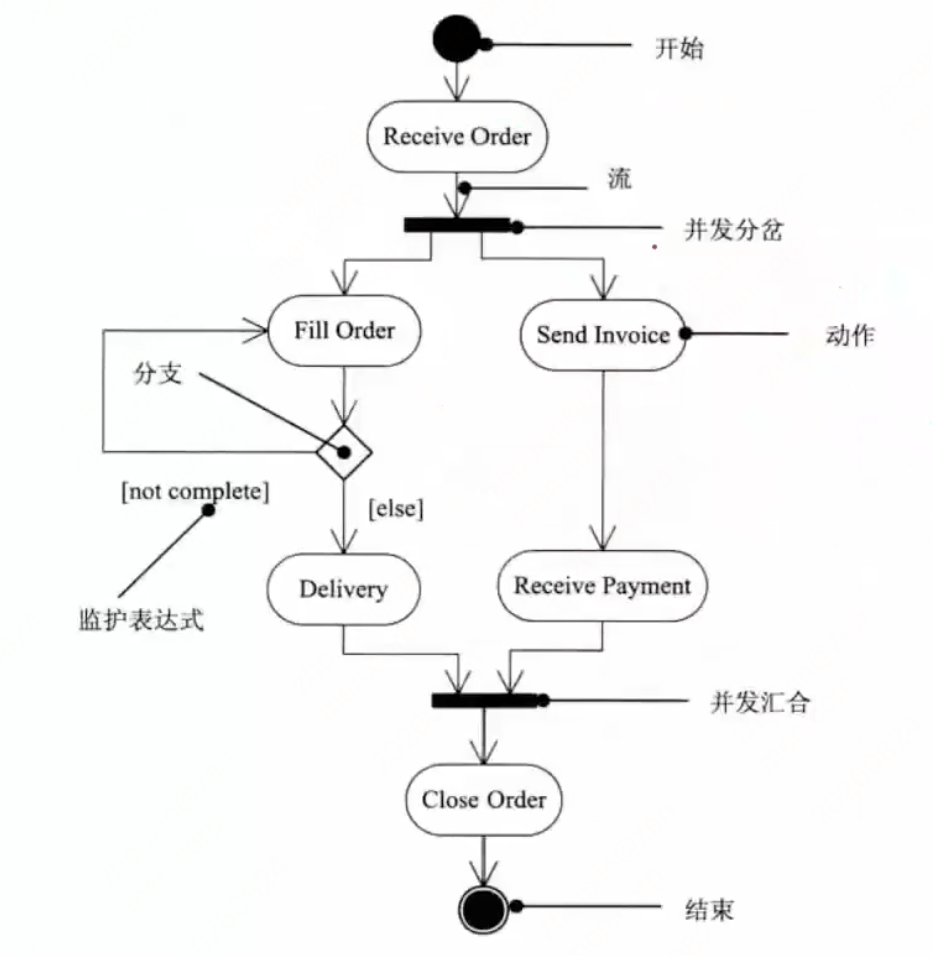

**构件图（组件图）**

- 构件图（组件图）：静态图，为系统`静态实现视图`，展现了一组构件之间的组织和依赖。如下：

**部署图**

- 部署图：静态图，为系统`静态部署视图`，部署图`物理模块`的节点分布。它与构件图相关，通常一个结点包含一个或多个构件。其依赖关系类似于包依赖，因此部署组件之间的依赖是单向的类似于包含关系。如下：

**UML 4+1 视图**

- （1）逻辑视图。逻辑视图也称为`设计视图`，它表示了设计模型中在架构方面具有重要意义的一部分，即`类、子系统、包和用例实现的子集`。
- （2）进程视图。进程视图是`可执行线程和进程作为活动类的建模`，它是`逻辑视图的一次执行实例`，描述了`并发与同步结构`。
- （3）实现视图。实现视图对组成基于系统的`物理代码的文件和构件进行建模`。
- （4）部署视图。部署视图把`构件部署到一组物理节点上`，表示软件到硬件的映射和分布结构。
- （5）用例视图。用例视图是`最基本的需求分析模型`。

## 3 SysML（补充内容）

- SysML 是一种`通用图形建模语言`，用于指定，分析，设计和验证可能包括硬件，软件，信息，人员，程序和设施的复杂系统。特别是，该语言提供了图形表示，其具有用于建模系统需求，行为，结构和参数的语义基础，用于与其他工程分析模型集成。
- 系统建模语言（SysML）已成为`基于模型的系统工程（MBSE）`应用程序的事实上的标准系统架构建模语言。SysML 是 UML 2 的一种方言，它扩展了软件密集型应用程序的统一建模语言（UML）标准，使其可以成功应用于系统工程应用程序。
- SysML 提供了`9 种图`来支持用户进行系统建模。

**9 种 SysML 图、对应 UML 图与目的**

| SysML 图 | UML 图 | 目的 |
| --- | --- | --- |
| 活动图（ACT 或行为）：一种行为图，主要关注控制流程，以及输入转化为输出的过程。 | 活动图：对系统中任何位置的流进行建模。特别是，描述正常用户交互以及替代和例外的用例中的流程由这些活动图很好地建模。 | [行为图] 活动图显示了作为控制和数据流的系统行为。用于功能分析。比较流程图（FBD）和扩展功能流程图（EFFBD），已经在系统工程师中常用。 |
| 模块定义图（BDD 或 bdd）：一种结构图，与内部模块图及参数图互补，用于描述系统的层次以及系统/组件的分类。 | 类图：类图表示类，它们的定义和关系 问题空间中的类和实体也是解决方案空间中的详细技术实体。 定义类的属性和操作包含在此类图中。类图中的关系说明了类如何与其他类交互，协作和继承。类还可以表示关系表，用户界面和控制器。 | [结构图] 模块定义图将系统结构显示为组件及其属性，操作和关系。对系统分析和设计很有用。 |
| 内部模块图（IBD 或 ibd）：一种结构图，与模块定义图及参数图互补，通过组件（Parts）、端口、连接器来用于描述系统模块的内部结构。 | 复合结构图： 在运行时模拟组件或对象行为，显示系统执行期间组件的布局，关系和实例 | [结构图] 内部模块图显示了系统组件的内部结构，包括其部件和连接器。对系统分析和设计很有用。 |
| 包图（PKG 或 pkg）：一种结构图，以包的形式组织模型间的层级关系。 | 包图：表示系统组织的子系统和区域。它还可以模拟包之间的依赖关系，并帮助将业务实体与用户界面，数据库，安全性和管理包分开。 | [结构图] 包图显示了如何将模型组织到包，视图和视观点中。对模型管理很有用。 |
| 参数图（PAR 或 par）：SysML 特有的图，与模块定义图及参数图互补，用于说明系统的约束。 | （无对应 UML 图） | [结构图] 封装图显示结构元素之间的参数约束。对性能和定量分析很有用。 |
| 需求图（REQ 或 req）：用于表述文字化的需求、需求间的关系，以及与之存在满足、验证等关系的其他模型元素。SysML 还包含了分配关系的表述，包括功能到组件的分配、软件到硬件的分配以及逻辑到物理的分配 | （无对应 UML 图） | [需求图] 需求图显示了系统需求及其与其他元素的关系。适用于需求工程，包括需求验证和验证（V&V）。 |
| 序列图（SD 或 SD）：一种行为图，主要关注并精确描述系统内部不同模块间的交互。 | 序列图：根据对象的时间轴模拟对象之间的交互。对象可以在这些图上具体显示，也可以是属于类的匿名对象。 | [行为图] 序列图显示系统行为作为系统组件之间的交互。对系统分析和设计很有用。 |
| 状态机图（STM 或 stm）：一种行为图，主要关注系统内部模块的一系列状态以及在事件触发下的不同状态间的转换。 | 状态机图：显示内存中对象的运行时生命周期。这样的生命周期包括对象的所有状态以及状态改变的条件。 | [行为图] 状态机图将系统行为显示为组件或交互响应事件时所经历的状态序列。对系统设计和模拟/代码生成很有用。 |
| 用例图（UC 或 uc）：一种黑盒视图，是系统功能的高层描述，用于表达系统执行的用例以及引起系统执行行为的参与者。 | 用例图：从用户的角度提供系统或业务流程功能的概述。用户"使用"系统的方式是创建用例图的起点。 | [行为图] 用例图将系统功能需求显示为对系统用户有意义的事务。用于指定功能要求。（注意潜在的语义重叠与需求图中指定的功能需求。） |

**需求图**

标准 SysML 需求包括用于指定其唯一性的标识符和需求文本两个属性，如图所示。其他属性（例如，验证状态，优先级等）也可以由用户指定。

SysML 规定了七个需求关系：

1. **复合关系**。复合需求可以包含需求层次结构中的子需求。复合需求可以声明系统应执行 A 和 B，可以将其分解为系统应执行 A 和系统应进行 B 的子需求。

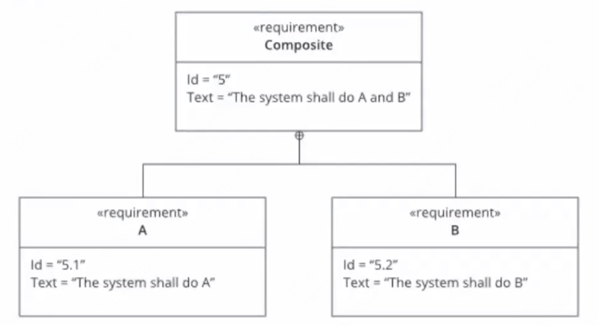

2. **派生关系**。派生的需求通常对应于系统层次结构下一级的需求。一个简单的例子是车辆加速需求，该需求被分析以导出发动机动力等方面的需求。

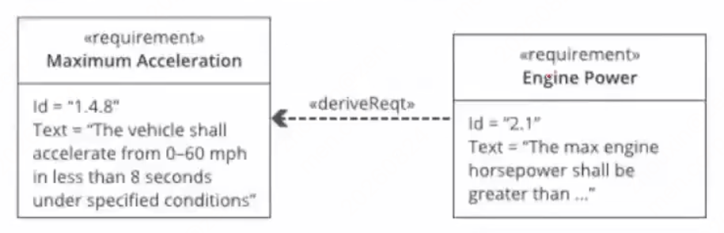

3. **细化关系**。细化关系可用于描述如何使用模型元素或元素集进一步细化需求。例如，可以使用用例或活动图来细化基于文本的功能需求。

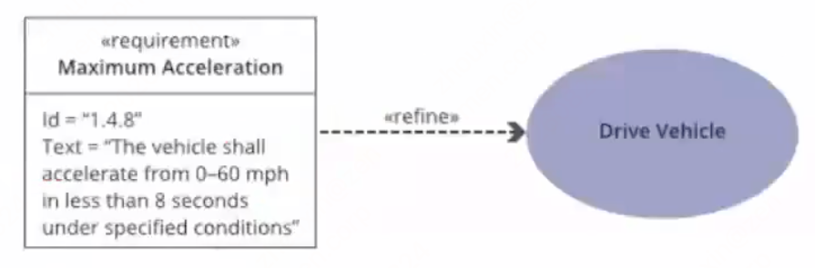

4. **满足关系**。满足关系描述了设计或实现模型如何满足一个或多个需求。然后，系统建模者可以指定旨在满足要求的系统设计元素。

5. **验证关系**。验证关系定义了测试用例或其他模型元素如何验证需求。在 SysML 中，测试用例或其他元素可以用作表示任何标准检验方法的通用机制，分析，演示或测试。

6. **复制关系**。真正需要跨产品系列和项目重用需求。典型的方案是适用于产品和/或产品系列中重复使用的项目和要求的法定法规或合同要求。

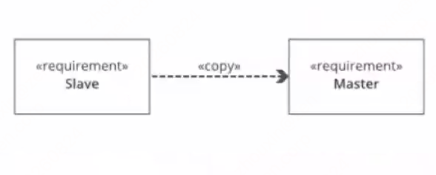

7. **追溯关系**。追溯关系提供了需求和任何其他模型元素之间的通用关系。追溯关系对于将需求与源文档相关联或在规范树中的规范之间建立关系可能很有用。

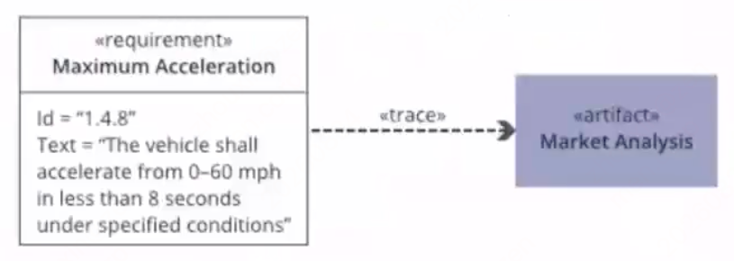

**模块定义图 BDD 和内部模块图 IBD**

- 创建 IBD 是为了指定单个模块的内部结构。和 BDD 一样，IBD 是系统或者系统一个组成部分的静态（结构化）视图。和 BDD 不同的是，IBD 不会显示模块，它会显示对模块的使用——也就是在 IBD 头部命名的模块的组成部分属性和引用属性。
- 在 BDD 中也可以显示组成部分属性和引用属性——或者是作为模块分隔框中的字符串，或者是作为关联一端的角色名称。但是 IBD 可以表达在 BDD 中无法表达的信息：组成部分属性和引用属性之间的连接；在连接之间流动的事件、能量和数据的类型；以及通过连接提供和请求的服务。
- IBD 会表达模块的组成部分必须如何组合才能够创建有效实例。它还会显示模块的实例必须如何与外部实体（引用属性）连接，以在整体上创建系统的有效实例。

**参数图**

SysML 参数图是一种特殊的内部块图。和 IBD 一样，参数图会显示模块的内部结构，但是其关注点在于值属性和约束参数之间的绑定关系。因此，可以说，参数图和块定义图提供了模块的互补视图。

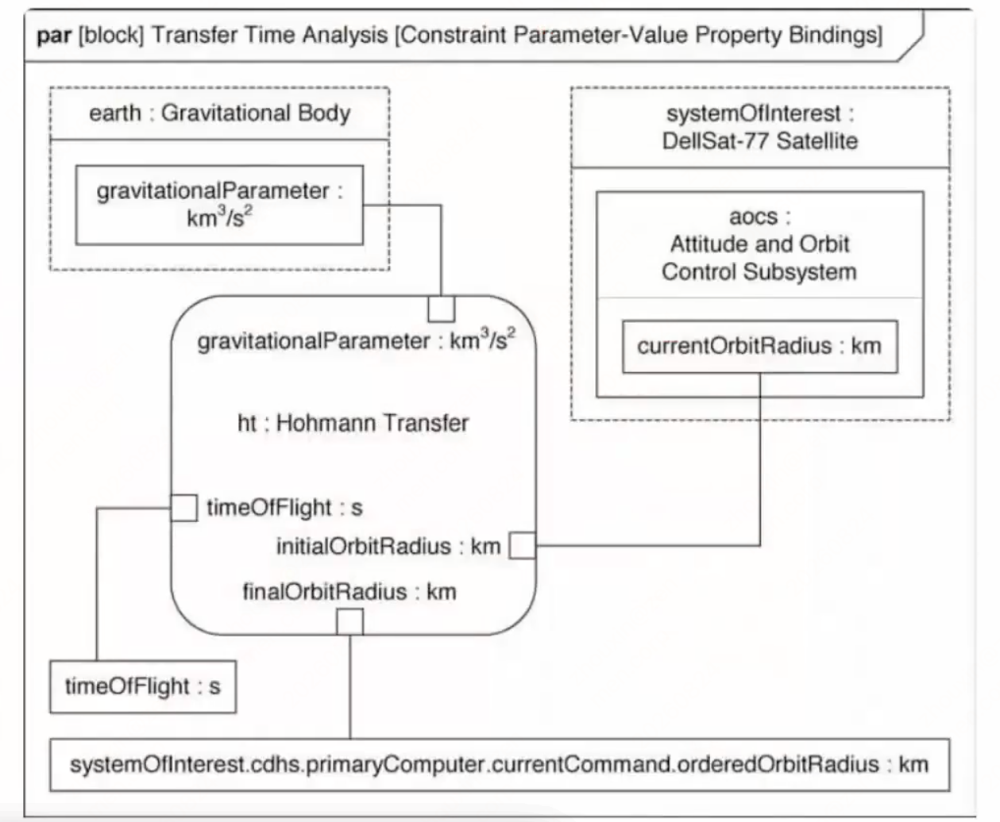

## 4 设计模式

- 设计模式：每一个设计模式描述了一个在我们周围`不断重复发生的问题`，以及`该问题的解决方案的核心`。这样，你就能一次又一次地使用该方案而不必做重复劳动。设计模式的核心在于提供了相关问题的解决方案，使得人们可以更加简单方便的复用成功的设计和体系结构。
- 四个基本要素：`模式名称`、`问题`（应该在何时使用模式）、`解决方案`（设计的内容）、`效果`（模式应用的效果）。
- 根据`目的和用途不同`，设计模式可分为`创建型模式`、`结构型模式`和`行为型模式`三种。创建型模式主要用于创建对象，结构型模式主要用于处理类或对象的组合，行为型模式主要用于描述类或对象的交互以及职责的分配。
- 根据`处理范围`不同，设计模式可分为`类模式`和`对象模式`。类模式处理类和子类之间的关系，这些关系通过继承建立，在编译时刻就被确定下来，属于静态关系。对象模式处理对象之间的关系，这些关系在运行时刻变化，更具动态性。

**创建型设计模式**

| 创建型设计模式 | 定义 | 记忆关键字 |
| --- | --- | --- |
| Abstract Factory 抽象工厂模式 | 提供一个接口，可以创建一系列相关或相互依赖的对象，而无需指定它们具体的类 | 抽象接口 |
| Builder 建构器模式 | 将一个复杂类的表示与其构造相分离，使得相同的构建过程能够得出不同的表示 | 类和构造分离 |
| Factory Method 工厂方法模式 | 定义一个创建对象的接口，但由子类决定需要实例化哪一个类。使得子类实例化过程推迟 | 子类决定实例化 |
| Prototype 原型模式 | 用原型实例指定创建对象的类型，并且通过拷贝这个原型来创建新的对象 | 原型实例，拷贝 |
| Singleton 单例模式 | 保证一个类只有一个实例，并提供一个访问它的全局访问点 | 唯一实例 |

**结构型设计模式**

| 结构型设计模式 | 定义 | 记忆关键字 |
| --- | --- | --- |
| Adapter 适配器模式 | 将一个类的接口转换成用户希望得到的另一种接口。它使原本不相容的接口得以协同工作 | 转换，兼容接口 |
| Bridge 桥接模式 | 将类的抽象部分和它的实现部分分离开来，使它们可以独立的变化 | 抽象和实现分离 |
| Composite 组合模式 | 将对象组合成树型结构以表示"整体-部分"的层次结构，使得用户对单个对象和组合对象的使用具有一致性 | 整体-部分，树形结构 |
| Decorator 装饰模式 | 动态的给一个对象添加一些额外的职责。它提供了用子类扩展功能的一个灵活的替代，比派生一个子类更加灵活 | 附加职责 |
| Façade 外观模式 | 定义一个高层接口，为子系统中的一组接口提供一个一致的外观，从而简化了该子系统的使用 | 对外统一接口 |
| Flyweight 享元模式 | 提供支持大量细粒度对象共享的有效方法 | 细粒度，共享 |
| Proxy 代理模式 | 为其他对象提供一种代理以控制这个对象的访问 | 代理控制 |

**行为型设计模式**

| 行为型设计模式 | 定义 | 记忆关键字 |
| --- | --- | --- |
| Chain of Responsibility 职责链模式 | 通过给多个对象处理请求的机会，减少请求的发送者与接收者之间的耦合。将接收对象链接起来，在链中传递请求，直到有一个对象处理这个请求 | 传递请求、职责、链接 |
| Command 命令模式 | 将一个请求封装为一个对象，从而可用不同的请求对客户进行参数化，将请求排队或记录请求日志，支持可撤销的操作 | 日志记录、可撤销 |
| Interpreter 解释器模式 | 给定一种语言，定义它的文法表示，并定义一个解释器，该解释器用来根据文法表示来解释语言中的句子 | 解释器，虚拟机 |
| Iterator 迭代器模式 | 提供一种方法来顺序访问一个聚合对象中的各个元素而不需要暴露该对象的内部表示 | 顺序访问，不暴露内部 |
| Mediator 中介者模式 | 用一个中介对象来封装一系列的对象交互。它使各对象不需要显式地相互调用，从而达到低耦合，还可以独立的改变对象间的交互 | 不直接引用 |
| Memento 备忘录模式 | 在不破坏封装性的前提下，捕获一个对象的内部状态，并在该对象之外保存这个状态，从而可以在以后将该对象恢复到原先保存的状态 | 保存，恢复 |
| Observer 观察者模式 | 定义对象间的一种一对多的依赖关系，当一个对象的状态发生改变时，所有依赖于它的对象都得到通知并自动更新 | 通知、自动更新 |
| State 状态模式 | 允许一个对象在其内部状态改变时改变它的行为 | 状态变成类 |
| Strategy 策略模式 | 定义一系列算法，把它们一个个封装起来，并且使它们之间可互相替换，从而让算法可以独立于使用它的用户而变化 | 算法替换 |
| Template Method 模板方法模式 | 定义一个操作中的算法骨架，而将一些步骤延迟到子类中，使得子类可以不改变一个算法的结构即可重新定义算法的某些特定步骤 | — |
| Visitor 访问者模式 | 表示一个作用于某对象结构中的各元素的操作，使得在不改变各元素的类的前提下定义作用于这些元素的新操作 | 数据和操作分离 |

## 5 历年真题

- SysML 是一种通用图形建模语言，用于指定，分析，设计和验证可能包括硬件，软件，信息，人员，程序和设施的复杂系统。SysML 比 UML 更好地表达系统工程语义（符号解释）。它减少了 UML 的软件偏差，并为需求管理和性能分析添加了两种新的图表类型：（ ）和参数图。其中，（ ）用于表述文字化的需求、需求间的关系，以及与之存在满足、验证等关系的其他模型元素。
  - A.场景图 B.模块定义图 C.内部模块图 D.需求图
  - A.用例图 B.参数图 C.内部模块图 D.需求图
  - 答案：D D
- 以下关于设计模式的说法中，（ ）是正确的
  - A.隐藏具体类的实例创建和结合方式是创建型设计模式的一个重要目标
  - B.根据处理范围不同，设计模式可分为创建型模式、结构型模式和行为型模式三种
  - C.设计模式有三个基本要求，分别是模式名称、问题、解决方案
  - D.结构型模式主要用于描述类或对象的交互以及职责的分配
  - 答案：A
- 以下关于设计模式的说法中，（ ）是正确的
  - A.装饰模式属于行为模式
  - B.原型属于创建型
  - C.解释器和代理模式是同一类模式
  - D.观察者模式属于结构型模式
  - 答案：B
