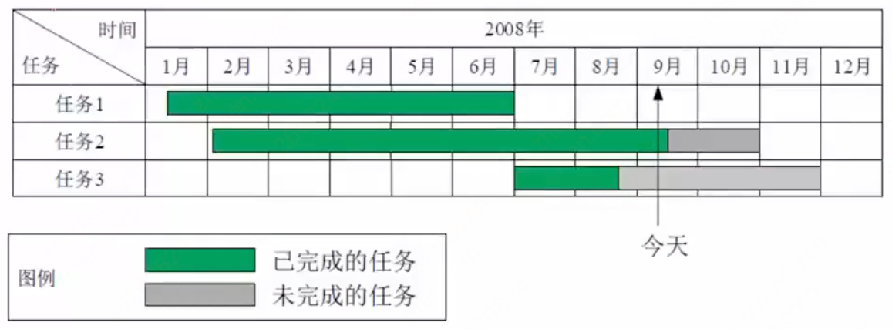
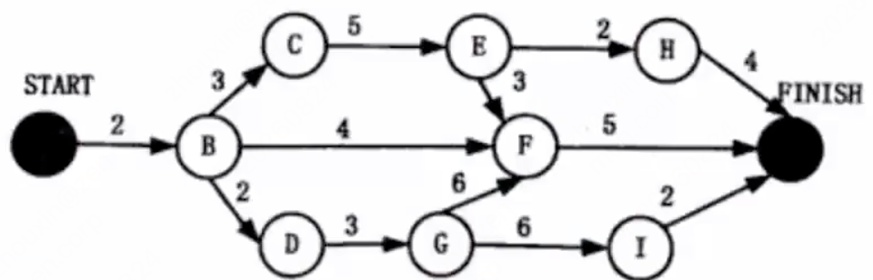
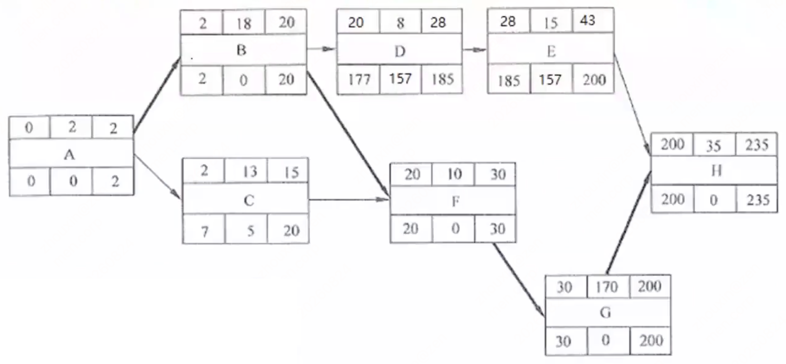
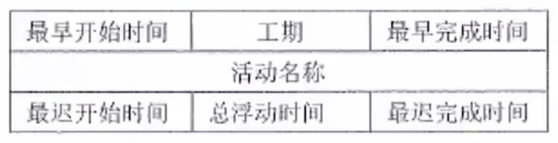
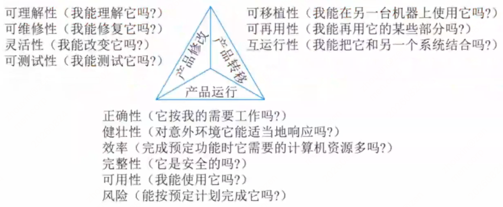

# 第十二章 项目管理（课件原文）

> 本页为课件原始内容，未经精简。精简笔记见 [笔记 · 第十二章](/notes/chapter-12/)。

## 知识点目录

1. 进度管理
2. 软件配置管理
3. 质量管理
4. 风险管理

## 1 进度管理

- 所谓进度，指的是`对执行活动和里程碑所制定的工作计划`，而进度管理指的是`为了确保项目按期完成所需要的管理过程`。在软件进度管理过程中，一般包括：`活动定义、活动排序、活动资源估计、活动历时估计、制定进度计划和进度控制`。
- 软件项目往往是较大而复杂的，往往需要进行层层分解，将大的任务分解成一个个的单一小任务进行处理。`工作分解结构（WBS）`如图所示，就是把一个项目，按一定的原则分解成任务，任务再分解成一项项工作，再把一项项工作分配到每个人的日常活动中，直到分解不下去为止。

- WBS 树形结构中`最底层的被称为工作包`，是最低层次的可交付成果，它应当由唯一主体负责完成。
- WBS 常见的分解方式包括：`按产品的物理结构分解、按产品或项目的功能分解、按照实施过程分解、按照项目的实施单位分解、按照项目的目标分解、按部分或职能进行分解`等。不管采用哪种分解方式，最终都要满足以下对任务分解的基本要求：
  1. WBS 的工作包是`可控和可管理的`，不能过于复杂。
  2. 任务分解也不能过细，`一般原则WBS 的树形结构不超过6 层`。
  3. `每个工作包要有一个交付成果`。
  4. `每个任务必须有明确定义的完成标准`。
  5. `WBS 必须有利于责任分配`。
- 进度安排的常用图形描述方法有`Gantt 图（甘特图）`和`项目计划评审技术（Program Evaluation& Review Technique，PERT）图`。

**关键路径法**

- 关键路径：是项目的`最短工期`，`却是从开始到结束时间最长的路径`。进度网络图中可能有多条关键路径，因为活动会变化，因此关键路径也在不断变化中。
- 关键活动：关键路径上的活动，`最早开始时间=最晚开始时间`。
- 通常，每个节点的活动会有如下几个时间：
  1. `最早开始时间（ES）`，某项活动能够开始的最早时间。
  2. `最早结束时间（EF）`，某项活动能够完成的最早时间。`EF=ES+工期`
  3. `最迟结束时间（LF）`。为了使项目按时完成，某项活动必须完成的最迟时间。
  4. `最迟开始时间（LS）`。为了使项目按时完成，某项活动必须开始的最迟时间。`LS=LF-工期`
- 总浮动时间：在`不延误项目完工时间且不违反进度制约因素`的前提下，活动`可以从最早开始时间推迟或拖延的时间量`，就是该活动的进度灵活性。正常情况下，关键活动的总浮动时间为零。
- `总浮动时间=最迟开始LS-最早开始ES 或 最迟完成LF-最早完成EF 或 关键路径-非关键路径时长`。
- 自由浮动时间：是指在`不延误任何紧后活动的最早开始时间且不违反进度制约因素`的前提下，活动`可以从最早开始时间推迟或拖延的时间量`。
- `自由浮动时间=紧后活动最早开始时间的最小值-本活动的最早完成时间`。
- 这几个时间通常作为每个节点的组成部分，如图所示：
  - `顺推：最早开始ES=所有前置活动最早完成EF的最大值；最早完成EF=最早开始ES+持续时间。`
  - `逆推：最晚完成LF=所有后续活动最晚开始LS的最小值；最晚开始LS=最晚完成LF-持续时间。`

### 考试真题

**1. 某项目有 A~H 八个作业，各作业所需时间（单位：周）以及紧前作业如下表：**

| 作业名称 | A | B | C | D | E | F | G | H |
| --- | --- | --- | --- | --- | --- | --- | --- | --- |
| 紧前作业 | – | A | A | A | B, C | C, D | D | E, F, G |
| 所需时间 | 1 | 3 | 3 | 5 | 7 | 6 | 5 | 1 |

该项目的工期为（ ）周。

- A. 12
- B. 13
- C. 14
- D. 15

答案：B

**2. 某项目包括 8 个作业 A~H，每天需要间接费用 5 万元，完成各作业所需的时间与直接费用、赶进度时每天需要增加的费用以及作业之间的衔接关系见下表。根据这些数据，以最低成本完成该项目需要（ ）天。**

| 作业 | A | B | C | D | E | F | G | H |
| --- | --- | --- | --- | --- | --- | --- | --- | --- |
| 所需时间（天） | 4 | 8 | 6 | 3 | 5 | 9 | 4 | 3 |
| 紧前作业 | - | - | B | A | A | A | B,D | E,G |
| 正常进度需要的直接费用（万元） | 20 | 30 | 15 | 5 | 15 | 40 | 10 | 15 |
| 赶进度需要增加的费用（万元/天） | 5 | 6 | 3 | 2 | 4 | 7 | 3 | 6 |

- A. 13
- B. 14
- C. 15
- D. 16

答案：待补充。

## 2 软件配置管理

- 软件配置管理是一种`标识、组织和控制修改的技术`。软件配置管理应用于`整个软件工程过程`。在软件建立时变更是不可避免的，而变更加剧了项目中软件开发者之间的混乱。SCM 活动的目标就是为了`标识变更、控制变更、确保变更正确实现并向其他有关人员报告变更`。从某种角度讲，SCM 是一种`标识、组织和控制修改的技术`；目的是使`错误降为最小并最有效地提高生产效率`。
- 软件配置管理核心内容包括`版本控制和变更控制`。
- 项目中引起变更的因素有两个：`一是来自外部的变更要求，二是开发过程内部的变更要求`。

## 3 质量管理

- 软件质量就是`软件与明确地和隐含地定义的需求相一致的程度`，更具体地说，软件质量是`软件符合明确地叙述的功能和性能需求、文档中明确描述的开发标准以及所有专业开发的软件都应具有的隐含特征的程度`。
- 从管理角度出发，可以将影响软件质量的因素划分为3 组，分别反映用户在使用软件产品时的3 种不同倾向和观点。这3 组分别是：`产品运行、产品修改和产品转移`。
  - 产品修改：可理解性（我能理解它吗?）、可维修性（我能修复它吗?）、灵活性（我能改变它吗?）、可测试性（我能测试它吗?）
  - 产品转移：可移植性（我能在另一台机器上使用它吗?）、可再用性（我能再用它的某些部分吗?）、互运行性（我能把它和另一个系统结合吗?）
  - 产品运行：正确性（它按我的需要工作吗?）、健壮性（对意外环境它能适当地响应吗?）、效率（完成预定功能时它需要的计算机资源多吗?）、完整性（它是安全的吗?）、可用性（我能使用它吗?）、风险（能按预定计划完成它吗?）

- 软件质量保证是`建立一套有计划，有系统的方法，来向管理层保证拟定出的标准、步骤、实践和方法能够正确地被所有项目所采用`。目的是使软件过程对于管理人员来说是可见的。它通过对`软件产品和活动进行评审和审计来验证软件是合乎标准的`。
- 软件质量保证（SQA）的关注点集中于`一开始就避免缺陷的产生`。质量保证的主要目标是：
  1. `事前预防工作`，例如，着重于缺陷预防而不是缺陷检查。
  2. 尽量在`刚刚引入缺陷时即将其捕获`，而不是让缺陷扩散到下一个阶段。
  3. `作用于过程而不是最终产品`，因此它有可能会带来广泛的影响与巨大的收益。
  4. `贯穿于所有的活动之中`，而不是只集中于一点。
- 软件质量保证的主要任务：`SQA审计与评审、SQA报告、处理不符合问题`。
- 质量认证用来`检验整个企业的质量水平`，注重软件企业的整体资质，全面考察软件企业的整体质量体系，检验该企业是否具有设计、开发和生产符合质量要求的软件的能力。目前国内软件企业主要采用的是`ISO 9000 和能力成熟度模型CMM`。

## 4 风险管理

- 软件项目风险管理是软件项目管理的重要内容。在进行软件项目风险管理时，要`辨识风险，评估它们出现的概率及产生的影响，然后建立一个规划来管理风险`。风险管理的主要目标是`预防风险`。软件项目风险是指在软件开发过程中遇到的预算和进度等方面的问题以及`这些问题对软件项目的影响`。软件项目风险会影响项目计划的实现，如果项目风险变成现实，就有可能影响项目的进度，增加项目的成本，甚至使软件项目不能实现。
- 美国Boehm 的软件风险管理体系，把风险管理活动分成`风险估计`（风险辨识、风险分析、风险排序）和`风险控制`（风险管理计划、风险处理、风险监督）两大阶段。该体系偏重理论。
- 美国Charrette 的风险分析和管理体系，把风险分成`分析`（辨识、估计、评价）和`管理`（计划、控制、监督）两大阶段。该体系偏重理论，与Boehm 体系接近。
