# 第十三章 系统架构设计（课件原文）

> 本页为课件原始内容，未经精简。精简笔记见 [笔记 · 第十三章](/notes/chapter-13/)。

## 知识点目录

1. 软件架构的概念
   - 1.1 软件架构设计与生命周期
2. 基于架构的软件开发方法
3. 软件架构风格
   - 3.1 基本架构风格
   - 3.2 层次结构风格
   - 3.3 面向服务的架构 SOA
4. 软件架构复用
5. 特定领域软件架构 DSSA
6. 系统质量属性与架构评估
   - 6.1 软件系统质量属性
   - 6.2 系统架构评估
   - 6.3 基于场景的评估方法

## 1 软件架构的概念

- 一个程序和计算机系统软件体系结构是指`系统的一个或者多个结构`。结构中包括`软件的构件，构件的外部可见属性以及它们之间的相互关系`。
- 体系结构并非可运行软件。确切地说，它`是一种表达`，使软件工程师能够：
  - （1）`分析设计在满足所规定的需求方面的有效性`；
  - （2）在`设计变更相对容易的阶段，考虑体系结构可能的选择方案`；
  - （3）`降低与软件构造相关联的风险`。
- 上面的定义强调在任意体系结构的表述中“软件构件”的角色。软件构件简单到`可以是程序模块或者面向对象的类`，也可以`扩充到包含数据库和能够完成客户与服务器网络配置的“中间件”`。
- 软件体系结构的设计两个层次：`数据设计和体系结构设计`。数据设计体现传统系统中体系结构的`数据构件和面向对象系统中类的定义`（封装了属性和操作），体系结构设计则主要关注`软件构件的结构、属性和交互作用`。
- 建立体系结构层“内聚的、良好设计的表示”所需的方法，其目标是提供`一种导出体系结构设计的系统化方法`，而体系结构设计是构建软件的初始蓝图。

### 1.1 软件架构设计与生命周期

- `1. 需求分析阶段`。需求分析和 SA 设计面临的是不同的对象：`一个是问题空间；另一个是解空间`。从软件需求模型向 SA 模型的转换主要关注两个问题：`如何根据需求模型构建SA 模型。如何保证模型转换的可追踪性`。
- 针对这两个问题的解决方案，因所采用的需求模型的不同而异。在采用 Use Case 图描述需求的方法中，从 Use Case 图向 SA 模型（包括类图等）的转换一般`经过词法分析和一些经验规则来完成`，而可追踪性则可通过`表格或者Use Case Map 等来维护`。
- 从`软件复用`的角度看，SA 影响需求工程也有其自然性和必然性，`已有系统的SA 模型对新系统的需求工程能够起到很好的借鉴作用`。在需求分析阶段研究 SA，`有助于将SA 的概念贯穿于整个软件生命周期`，从而保证了软件开发过程的概念完整性，也易于维护各阶段的可追踪性。
- `2. 设计阶段`。是 SA 研究关注的`最早和最多的阶段`，这一阶段的 SA 研究主要包括：`SA 模型的描述、SA 模型的设计与分析方法，以及对SA设计经验的总结与复用`等。有关 SA 模型描述的研究分为 3 个层次：
  - （1）`SA的基本概念`：即 SA 模型由哪些元素组成，这些组成元素之间按照何种原则组织。包括`构件和连接子`。
  - （2）`体系结构描述语言ADL`：支持构件、连接子及其配置的描述语言就是如今所说的体系结构描述语言。`ADL 对连接子的重视成为区分ADL 和其他建模语言的重要特征之一`。典型的 ADL 包括 UniCon、Rapide、Darwin、Wright、C2 SADL、Acme、xADL、XYZ/ADL 和 ABC/ADL 等。
  - （3）`SA模型的多视图表示`：从不同的视角描述特定系统的体系结构，从而得到多个视图，并将这些视图组织起来以描述整体的 SA 模型。典型的包括`4+1 模型（逻辑视图、进程视图、开发视图、物理视图，加上统一的场景）`、Hofmesiter 的 4 视图模型（概念视图、模块视图、执行视图和代码视图）、CMU-SEI 的 Views and Beyond 模型（模块视图、构件和连接子视图、分配视图）等。

- `3. 实现阶段`。最初 SA 研究往往只关注较高层次的系统设计、描述和验证。为了有效实现 SA 设计向实现的转换，实现阶段的体系结构研究表现在以下几个方面。
  - （1）`研究基于SA 的开发过程支持`，如项目组织结构、配置管理等。
  - （2）`寻求从SA 向实现过渡的途径`，如将程序设计语言元素引入 SA 阶段、模型映射、构件组装、复用中间件平台等。
  - （3）`研究基于SA 的测试技术`。
- `SA 引入能够有效扩充现有配置管理的能力`，通过在 SA 描述中引入版本、可选项等信息，可以分析和`记录不同版本构件和连接子之间的演化`，从而可用来组织配置管理的相关活动。为了填补高层 SA 模型和底层实现之间的鸿沟，可通过`封装底层的实现细节、模型转换、精化等手段缩小概念之间的距离`。典型的方法如下。
  - （1）`在SA 模型中引入实现阶段的概念`，如引入程序设计语言元素等。
  - （2）`通过模型转换技术，将高层的SA 模型逐步精化成能够支持实现的模型`。
  - （3）`封装底层的实现细节`，使之成为较大粒度构件，在 SA 指导下通过构件组装的方式实现系统，这往往需要底层中间件平台的支持。

- `4. 构件组装阶段`。在 SA 设计模型的指导下，`可复用构件的组装可以在较高层次上实现系统`，并能够提高系统实现的效率。在构件组装的过程中，`SA 设计模型起到了系统蓝图的作用`。研究内容包括如下两个方面。
  - （1）`如何支持可复用构件的互联`，即对 SA 设计模型中规约的连接子的实现提供支持。
  - （2）`在组装过程中，如何检测并消除体系结构失配问题`。
- 中间件遵循特定的构件标准，`为构件互联提供支持，并提供相应的公共服务`，如安全服务、命名服务等。中间件支持的连接子实现的优势：`中间件提供了构件之间跨平台交互的能力，且遵循特定的工业标准`；`产品化的中间件可以提供强大的公共服务能力`，这样能够更好地保证最终系统的质量属性。
- 在构件组装阶段的失配问题主要包括：`由构件引起的失配、由连接子引起的失配、由于系统成分对全局体系结构的假设存在冲突引起的失配`等。
- `5. 部署阶段`。SA 对软件部署作用如下。
  - （1）提供`高层的体系结构视图来描述部署阶段的软硬件模型`。
  - （2）基于`SA 模型可以分析部署方案的质量属性`，从而选择合理的部署方案。
- 现阶段，基于 SA 的软件部署研究`更多地集中在组织和展示部署阶段的SA、评估分析部署方案等方面`，部署方案的分析往往停留在`定性的层面`，并需要部署人员的参与。

- `6. 后开发阶段`。是指`软件部署安装之后`的阶段。这一阶段的 SA 研究主要围绕`维护、演化、复用`等方面来进行。典型的研究方向包括`动态软件体系结构、体系结构恢复与重建`等。
  - （1）动态软件体系结构。现实中的`软件具有动态性，体系结构会在运行时发生改变`。
    - 运行时变化包括两类：`软件内部执行所导致的体系结构改变`（很多服务器端软件会在客户请求到达时创建新的构件来响应用户的请求）；`软件系统外部的请求对软件进行的重配置`（高安全性软件系统在升级或进行其他修改时不能停机）。
    - 包括两个部分的研究：
      - `体系结构设计阶段的支持`：主要包括变化的描述、如何根据变化生成修改策略、描述修改过程、在高抽象层次保证修改的可行性以及分析、推理修改所带来的影响等。
      - `运行时刻基础设施的支持`：主要包括系统体系结构的维护、保证体系结构修改在约束范围内、提供系统的运行时刻信息、分析修改后的体系结构符合指定的属性、正确映射体系结构构造元素的变化到实现模块、保证系统的重要子系统的连续执行并保持状态、分析和测试运行系统等。
  - （2）体系结构恢复与重建。对于`现有系统在开发时候没有考虑SA的情况`，`从这些系统中恢复或重构体系结构`。从已有的系统中获取体系结构的重建方法分为 4 类：`手工体系结构重建、工具支持的手工重建、通过查询语言来自动建立聚集、使用其他技术（如数据挖掘等）`。

**软件架构的重要性**：

1. 架构设计能够满足系统的品质
2. 架构设计便受益人达成一致的目标
3. 架构设计能够支持计划编制过程
4. 架构设计对系统开发的指导性
5. 架构设计能够有效地管理复杂性
6. 架构设计为复用奠定了基础
7. 架构设计能够降低维护费用
8. 架构设计能够支持冲突分析

## 2 基于架构的软件开发方法

> 备注：ABSD 即 Architecture-Based Software Development（基于架构的软件开发）。

- ABSD 方法是由`体系结构驱动的`，即指由`构成体系结构的商业、质量和功能需求的组合`驱动的。它强调采用`视角和视图`来描述软件架构，采用`用例和质量属性场景`来描述需求。进一步来说，`用例描述的是功能需求，质量属性场景描述的是质量需求`（或侧重于非功能需求）。
- 使用 ABSD 方法，`设计活动可以从项目总体功能框架明确就开始`，这意味着需求获取和分析还没有完成，就开始了软件设计。
- ABSD 方法有三个基础。`第一个基础是功能的分解`，使用已有的基于模块的内聚和耦合技术；`第二个基础是通过选择架构风格来实现质量和业务需求`；`第三个基础是软件模板的使用`，软件模板利用了一些软件系统的结构。
- ABSD 方法是一个`自顶向下`、`递归细化`的方法，在最顶层，系统被分解为`若干概念子系统和一个或若干个软件模板`。在第 2 层，概念子系统又被分解成`概念构件和一个或若干个附加软件模板`。

ABSD 模型的软件工程过程如下图所示：

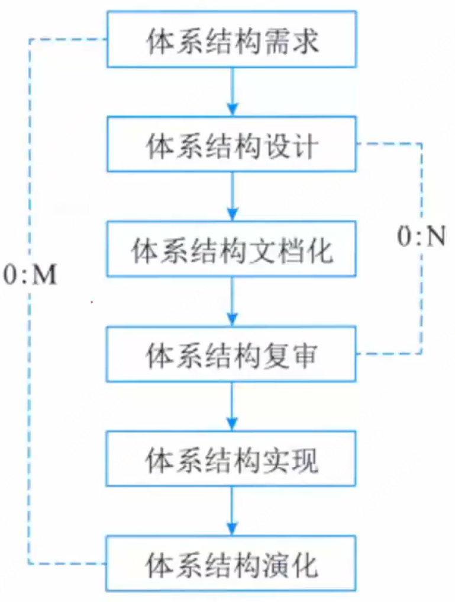

（1）架构需求：重在掌握标识构件的三步，如下左图。
- 需求获取：体系结构需求一般来自三个方面，分别是`系统的质量目标、系统的商业目标和系统开发人员的商业目标`。
- 标识构件：`为系统生成初始逻辑结构`，标识大致的构件。包括图中三个步骤。

（2）架构设计：`将需求阶段的标识构件映射成构件`，进行分析，如下右图。

（3）架构（体系结构）文档化：主要产出两种文档，即`架构（体系结构）规格说明`，`测试架构（体系结构）需求的质量设计说明书`。文档是至关重要的，是所有人员通信的手段，关系开发的成败。

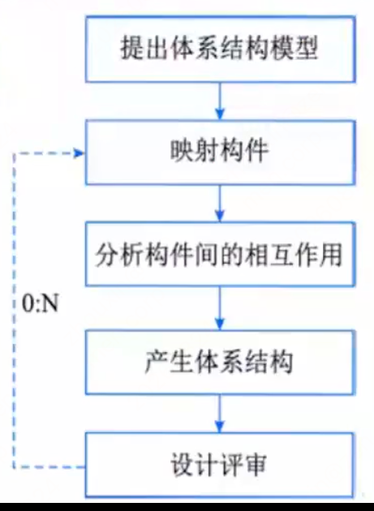

（4）架构复审：`安排一次由外部人员（用户代表和领域专家）参加的复审。根据架构设计，搭建一个可运行的最小化系统用于评估和测试体系架构是否满足需要`。是否存在可识别的技术和协作风险。复审的目的是`标识潜在的风险，及早发现体系结构设计中的缺陷和错误`，包括体系结构能否满足需求、质量需求是否在设计中得到体现、层次是否清晰、构件的划分是否合理、文档表达是否明确、构件的设计是否满足功能与性能的要求等。

（5）架构实现：`用实体来显示出架构。实现构件，构件组装成系统`，如下左图：

（6）架构演化：`对架构进行改变，按需求增删构件，使架构可复用`，如下右图：

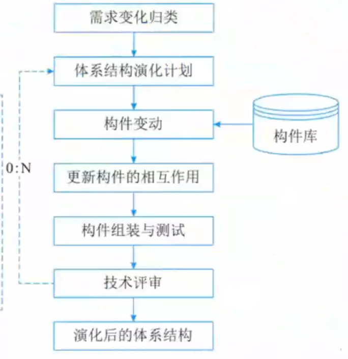

## 3 软件架构风格

### 3.1 基本架构风格

- 软件体系结构设计的一个`核心目标是重复的体系结构模式，即达到体系结构级的软件重用`。也就是说，在不同的软件系统中，使用同一体系结构。基于这个目标，`主要任务是研究和实践软件体系结构风格和类型问题`。
- 软件体系结构风格是`描述某一特定应用领域中系统组织方式的惯用模式`。架构风格定义`一个系统家族，即一个架构定义一个词汇表和一组约束。词汇表中包含一些构件和连接件类型，而这组约束指出系统是如何将这些构件和连接件组合起来的`。
- 架构风格反映了`领域中众多系统所共有的结构和语义特性`，并指导`如何将各个模块和子系统有效地组织成一个完整的系统`。对软件架构风格的研究和实践促进对设计的重用，一些经过实践证实的解决方案也可以可靠地用于解决新的问题。
#### 数据流风格（大分类）

`面向数据流，按照一定的顺序从前向后执行程序`，代表的具体风格有 `批处理序列、管道-过滤器`。

##### 批处理风格

`每个处理步骤是一个单独的程序，每一步必须在前一步结束后才能开始，并且数据必须是完整的，以整体的方式传递`。它的基本构件是独立的应用程序，连接件是某种类型的媒介。连接件定义了相应的数据流图，表达拓扑结构。

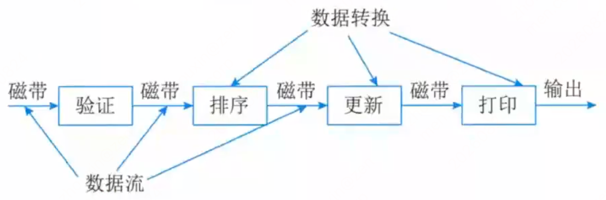

##### 管道-过滤器

把系统分解为`几个序贯的处理步骤，这些步骤之间通过数据流连接，一个步骤的输出是另一个步骤的输入`。每个处理步骤由一个过滤器（Filter）实现，处理步骤之间的数据传输由管道（Pipe）负责。`基本构件是过滤器，连接件是数据流传输管道，将一个过滤器的输出传到另一过滤器的输入`。

#### 调用/返回风格（大分类）

构件之间`存在互相调用的关系，一般是显式的调用`，代表的具体风格有 `主程序/子程序、面向对象、层次结构、客户端/服务器架构风格`。

##### 主程序/子程序

`单线程控制，把问题划分为若干个处理步骤，构件即为主程序和子程序`，子程序通常可合成为模块。`过程调用作为交互机制，充当连接件的角色`。

##### 面向对象

`构件是对象，对象是抽象数据类型的实例。连接件即使对象间交互的方式`，对象是通过函数和过程的调用来交互的。

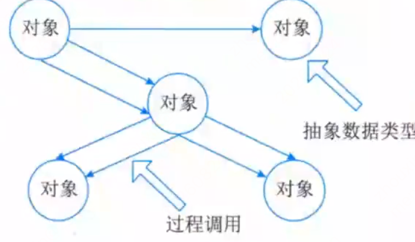

##### 层次结构

`构件组成一个层次结构，连接件通过决定层间如何交互的协议来定义。每层为上一层提供服务，使用下一层的服务，只能见到与自己邻接的层。修改某一层，最多影响其相邻的两层（通常只能影响上层）`。

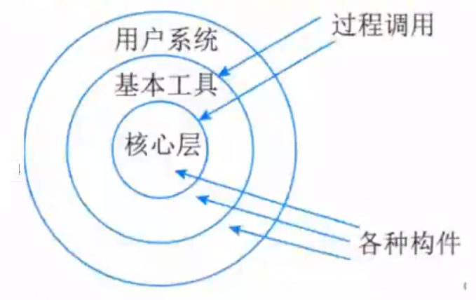

##### 客户端/服务器架构风格

属于`调用/返回风格`。两层C/S 体系结构有3 个主要组成部分：`数据库服务器、客户应用程序和网络`。称为“胖客户机，瘦服务器”。

三层C / S 结构`增加了一个应用服务器`。整个应用逻辑驻留在应用服务器上，只有表示层存在于客户机上，故称为“瘦客户机”。应用功能分为`表示层、功能层和数据层三层`。

#### 以数据为中心的架构风格（大分类）

`所有的操作都是围绕建立的数据中心进行的`，代表的具体风格有 `仓库风格、黑板风格`。

##### 仓库架构风格

属于`以数据为中心的架构风格`。`仓库是存储和维护数据的中心场所`。在仓库体系结构风格中，有两种不同的构件：`中央数据结构（说明当前数据的状态）`，以及`一组对中央数据进行操作的独立构件`，仓库与独立构件间的相互作用在系统中会有大的变化。这种风格的`连接件即为仓库与独立构件之间的交互`。

##### 黑板架构风格

属于`以数据为中心的架构风格`。适用于解决`复杂的非结构化问题`，`能在求解过程中综合运用多种不同知识源`，使得问题的表达、组织和求解变得比较容易。黑板系统是一种`问题求解模型`，是组织推理步骤、控制状态数据和问题求解之领域知识的概念框架。它`将问题的解空间组织成一个或多个应用相关的分级结构`。各种应用通过不同知识表达方法、推理框架和控制机制的组合来实现。一般包括`知识源、黑板和控制`三部分。
- 黑板系统的传统应用是`信号处理领域，如语音识别和模式识别`。另一应用是`松耦合代理数据共享存取`。

#### 虚拟机风格（大分类）

`人为构建一个运行环境`，在这个环境之上，可以解析与运行自定义的一些语言，这样来增加架构的灵活性。代表的具体风格有 `解释器、基于规则的系统`。

##### 解释器

通常包括`一个完成解释工作的解释引擎`、`一个包含将被解释的代码的存储区`、`一个记录解释引擎当前工作状态的数据结构`，以及`一个记录源代码被解释执行进度的数据结构`。具有解释器风格的软件中含有一个虚拟机，可以`仿真硬件的执行过程和一些关键应用`，缺点是`执行效率低`。典型的例子是专家系统。

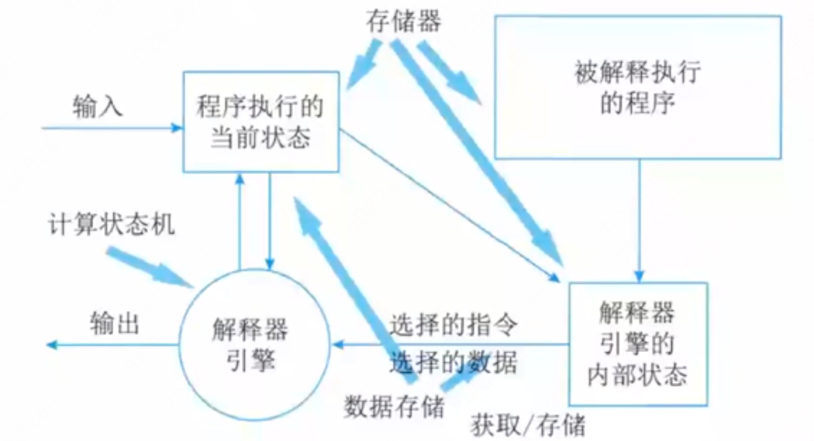

##### 基于规则的系统

包括`规则集、规则解释器、规则/数据选择器和工作内存`，一般用于`人工智能领域和DSS`中。

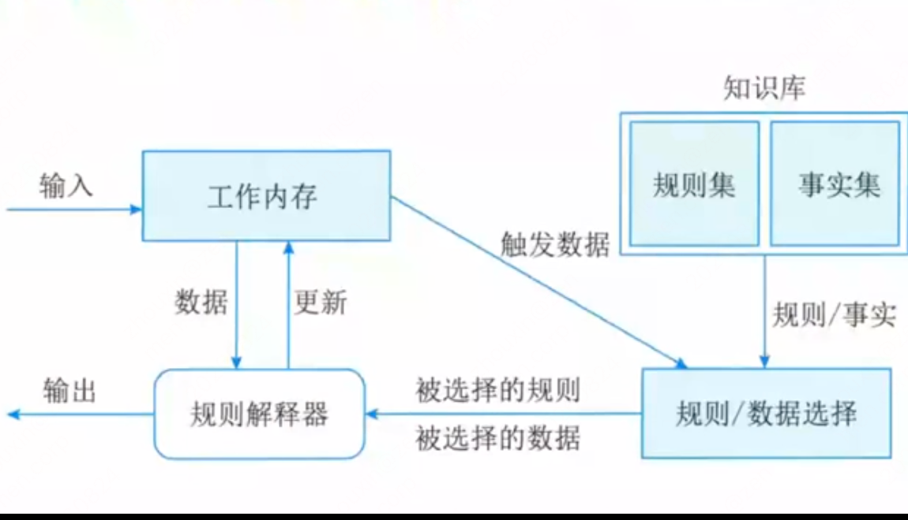

#### 独立构件风格（大分类）

`构件之间是互相独立的，不存在显式的调用关系`，而是通过某个事件触发、异步的方式来执行，代表的具体风格有 `进程通信、事件驱动系统（隐式调用）`。

##### 进程通信

在进程通信结构体系结构风格中，`构件是独立的进程，连接件是消息传递`。这种风格的特点是`构件通常是命名进程`，消息传递的方式可以是`点到点、异步或同步方式及远程过程调用`等。

##### 事件驱动系统（隐式调用）

事件系统风格基于事件的隐式调用，其思想是构件`不直接调用一个过程，而是触发或广播一个或多个事件`。系统中的其他构件中的过程在一个或多个事件中注册，当一个事件被触发，系统自动调用在这个事件中注册的所有过程。
- 从架构上说，这种风格的`构件是一些模块`，这些模块既可以是一些过程，又可以是一些事件的集合。过程可以用通用的方式调用，也可以在系统事件中注册一些过程；当发生这些事件时，过程被调用。
- 主要优点是`为软件复用提供了强大的支持，为构件的维护和演化带来了方便`；缺点是`构件放弃了对系统计算的控制`。

### 架构风格对比表（课件原文）

| 架构风格名 | 常考关键字及实例 | 简介 |
| --- | --- | --- |
| 数据流-批处理 | 传统编译器，每个阶段产生的结果作为下一个阶段的输入，区别在于整体。 | 一个接一个，以整体为单位。 |
| 数据流-管道-过滤器 | 传统编译器，每个阶段产生的结果作为下一个阶段的输入，区别在于整体。 | 一个接一个，前一个输出完后一个输入。 |
| 调用/返回-主程序/子程序 |  | 显式调用，主程序直接调用子程序。 |
| 调用/返回-面向对象 |  | 对象是构件，通过对象调用封装的方法和属性。 |
| 调用/返回-层次结构 |  | 分层，每层最多影响其上下两层，有调用关系。 |
| 调用/返回-客户端/服务器 |  | 两层 CS：客户端、服务器；三层 CS：表示层、功能层、数据层。 |
| 独立构件-进程通信 |  | 进程间独立的消息传递，同步异步。 |
| 独立构件-事件驱动（隐式调用） | 事件触发推动动作，如程序语言的语法高亮、语法错误提示。 | 不直接调用，通过事件驱动。 |
| 虚拟机-解释器 | 自定义流程，按流程执行，规则随时改变，灵活定义，业务组合灵活。 | 解释自定义的规则，解释引擎、存储区、数据结构。 |
| 虚拟机-规则系统 | 自定义流程，按流程执行，规则随时改变，灵活定义，业务组合灵活。机器人。 | 规则集、规则解释器、选择器和工作内存，用于DSS 和人工智能、专家系统。 |
| 数据中心-仓库 | 现代编译器的集成开发环境 IDE，以数据为中心。又称为数据共享风格。 | 中央共享数据源，独立处理单元。 |
| 数据中心-黑板 | 现代编译器的集成开发环境 IDE，以数据为中心。又称为数据共享风格。 | 语音识别、知识推理等问题复杂、解空间很大、求解过程不确定的这一类软件系统，黑板、知识源、控制。 |
| 闭环-过程控制 | 汽车巡航定速、空调温度调节，设定参数，并不断调整。 | 发出控制命令并接受反馈，循环往复达到平衡。 |

### 3.2 层次结构风格

层次结构风格包括客户端/服务器（C/S）、浏览器/服务器（B/S）以及 MVC、MVP、MVVM 等具体架构形式。主程序/子程序、面向对象、层次结构、客户端/服务器架构风格和三层 C/S 结构均属于`调用/返回风格`。

#### 两层 C/S 架构

两层 C/S 体系结构有 3 个主要组成部分：`数据库服务器、客户应用程序和网络`。服务器负责数据管理，客户机完成与用户的交互和应用逻辑处理，因此称为“胖客户机，瘦服务器”。客户端和服务器都有处理功能。

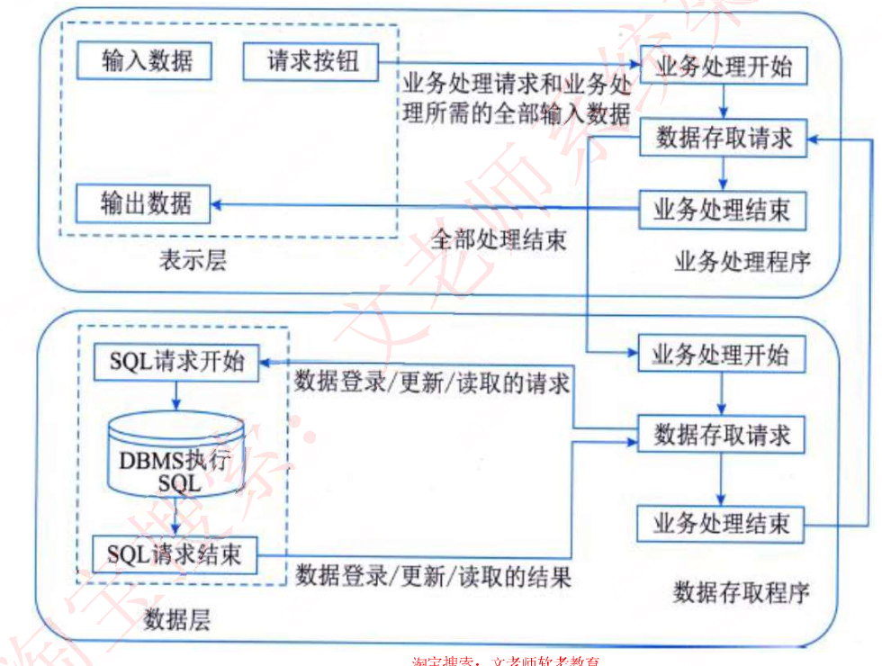

两层 C/S 架构存在以下问题：

1. 开发成本较高。
2. 客户端程序设计复杂。
3. 信息内容和形式单一。
4. 用户界面风格不一。
5. 软件移植困难。
6. 软件维护和升级困难。
7. 新技术不能轻易应用。
8. 安全性问题。
9. 服务器端压力大，难以复用。

因此，两层 C/S 架构现在已经不常用。

#### 三层 C/S 架构

三层 C/S 架构在两层结构的基础上，将处理功能独立出来，增加应用服务器，把应用功能划分为`表示层、功能层和数据层`。

- 表示层：位于客户机，负责用户界面和数据表示。
- 功能层：位于应用服务器，负责业务逻辑处理。
- 数据层：位于数据库服务器，负责数据的存储和管理。

即表示层在客户机上，功能层在应用服务器上，数据层在数据库服务器上。

三层 C/S 架构的优点如下：

1. 各层在逻辑上保持相对独立，能提高系统和软件的可维护性和可扩展性。
2. 允许灵活有效地选用相应的平台和硬件系统，使各层具有较好的可升级性和开放性。
3. 各层可以并行开发，而且各层可以选择最适合的开发语言。
4. 功能层有效地隔离表示层与数据层，为严格的安全管理奠定了坚实基础，整个系统的管理层次也更加合理和可控制。

设计三层 C/S 架构时，各层之间的通信会增加系统开销，因此需要重点考虑各层之间的通信效率。

#### 三层 B/S 架构

三层 B/S 架构是三层 C/S 架构的一种变形：将客户端变为用户客户端上的浏览器，将应用服务器变为网络上的 Web 服务器。客户端不需要安装专用应用程序，因此又称为零客户端架构（0 客户端架构）。

三层 B/S 架构存在以下不足：

1. 缺乏对动态页面的支持能力。
2. 没有集成有效的数据库处理功能。
3. 系统安全性难以控制。
4. 查询响应速度远低于 C/S 架构。
5. 数据提交一般以页面为单位，动态交互能力不强，不利于在线事务处理（OLTP）应用。

#### 混合架构风格

在实际系统中，可以把 C/S 与 B/S 结合形成混合架构：

- `内外有别`：企业内部用户采用 C/S 架构，外部用户采用 B/S 架构。
- `查改有别`：查询等只读操作采用 B/S 架构，修改和维护操作采用 C/S 架构。

#### 富互联网应用 RIA

富互联网应用（Rich Internet Application，RIA）是一种用户接口，提供比传统 HTML 页面更健壮且可视化程度更高的用户界面。RIA 结合了 C/S 架构反应速度快、交互性强的优点与 B/S 架构传播范围广、容易传播的特性，能够简化并改进 B/S 架构的用户交互。

数据能够被缓存在客户端，从而可以实现比基于 HTML 的界面响应速度更快、数据往返于服务器次数更少的用户界面。RIA 本质还是 0 客户端，借助高速网速实现必要插件在本地的快速缓存，增强页面对动态页面的支持能力，典型应用如小程序。

#### MVC 架构

MVC（Model-View-Controller，模型-视图-控制器）将应用划分为模型、视图和控制器三个部分：

- `控制器（Controller）`：是应用程序中处理用户交互的部分。通常控制器负责从视图中读取数据，控制用户输入，并向模型发送数据。
- `模型（Model）`：是应用程序中用于处理应用程序数据逻辑的部分。通常模型对象负责在数据库中存取数据，模型表示业务数据和业务逻辑。
- `视图（View）`：是应用程序中处理数据显示的部分。通常视图依据模型数据创建，是用户看到并与之交互的界面。视图向用户显示相关数据并接收用户输入，但不进行任何实际的业务处理。

#### MVP 架构

MVP（Model-View-Presenter，模型-视图-表示器）由 MVC 演变而来，把 MVC 中的 Controller 换成 Presenter（呈现），目的是完全切断 View 与 Model 之间的联系，由 Presenter 充当桥梁，实现 View-Model 之间通信的完全隔离。

- Model、View、Presenter 之间的通信是双向的。
- View 与 Model 不直接通信，所有交互都通过 Presenter 进行。
- View 非常薄，不部署任何业务逻辑，称为“被动视图”；Presenter 中部署主要业务逻辑。
- Presenter 通过接口与具体 View 交互，因此 Presenter 可以复用于不同的 View。

#### MVVM 架构

MVVM（Model-View-ViewModel，模型-视图-视图模型）与 MVC 相似，核心目标也是将视图和模型分离。ViewModel 负责连接 View 与 Model，并通过数据绑定同步二者状态。

MVVM 的优点如下：

1. `低耦合`：View 可以独立于 Model 变化和修改，一个 ViewModel 可以绑定到不同的 View。
2. `可重用性`：可以把一些视图逻辑放在 ViewModel 中，让多个 View 重用。
3. `独立开发`：开发人员可以专注业务逻辑和数据，设计人员可以专注页面设计。
4. `可测试性`：界面通常较难测试，而测试可以针对 ViewModel 编写。

### 3.3 面向服务的架构 SOA

#### SOA 基本概念

面向服务的体系结构（Service-Oriented Architecture，SOA）是一种粗粒度、松耦合服务架构，服务之间通过简单、精确定义的接口进行通信，不涉及底层编程接口和通信模型。服务是一种为了满足某项业务需求的操作、规则等的逻辑组合，它包含一系列有序活动的交互，为实现用户目标提供支持。

SOA 不仅是一种开发方法，还具有管理上的优点：管理员可直接管理开发人员所构建的相同服务。多个服务通过企业服务总线提出服务请求，由应用管理进行处理。

#### 实施 SOA 的特征

实施 SOA 的关键目标是实现企业 IT 资产重用的最大化。实施 SOA 时通常需要具备以下特征：

1. 可从企业外部访问。
2. 随时可用（服务请求能被及时响应）。
3. 粗粒度接口：粗粒度服务提供一项特定的业务功能，而细粒度服务代表技术构件方法。
4. 服务分级：服务可以按照不同抽象层次组织，并由低层服务组合形成高层服务。
5. 松散耦合：服务提供者和服务使用者分离，请求者只需了解服务接口，不依赖服务内部实现。
6. 可重用的服务及服务接口设计管理。
7. 标准化的接口：以 WSDL、SOAP 和 XML 等开放标准为核心。
8. 支持各种消息模式。
9. 精确定义的服务接口。

软件复用形态从基于对象到基于构件再到基于服务演进时，架构越来越松散耦合，粒度越来越粗，接口越来越标准。

#### 服务构件与传统构件

服务构件与传统构件的主要区别如下：

1. 服务构件粗粒度，传统构件细粒度居多。
2. 服务构件的接口是标准的，主要是 WSDL 接口；传统构件常以具体 API 形式出现。
3. 服务构件的实现与语言无关；传统构件常绑定某种特定语言。
4. 服务构件可以通过构件容器提供 QoS 服务；传统构件完全由程序代码直接控制。

#### Web Service 基础协议

Web Service 最基本的协议包括UDDI、WSDL 和 SOAP，通过它们可以提供直接而又简单的 Web Service 支持。

> 全名备注：`UDDI = Universal Description, Discovery and Integration（统一描述、发现和集成）`；`WSDL = Web Services Description Language（Web 服务描述语言）`；`SOAP = Simple Object Access Protocol（简单对象访问协议）`。

##### UDDI

UDDI（Universal Description, Discovery and Integration，统一描述、发现和集成协议）是一项广泛、开放的行业计划，使商业实体能够彼此发现，定义它们怎样在 Internet 上互相作用，并在一个全球的注册体系架构中共享信息。

在 Web Service 交互过程中：

- 服务提供者通过 UDDI `发布`服务。
- 服务请求者通过 UDDI `查找`服务。
- 服务提供者使用 WSDL `描述`服务。
- 服务请求者与服务提供者通过 SOAP `绑定并交换消息`。

##### WSDL

WSDL（Web Services Description Language，Web 服务描述语言）是一种用于描述 Web 服务和说明如何与 Web 服务通信的 XML 语言，主要描述以下 3 个方面：

1. 服务做些什么——服务所提供的操作（方法）。
2. 如何访问服务——和服务交互的数据格式以及必要协议。
3. 服务位于何处——协议相关的地址，如 URL。

WSDL 文档以端口集合的形式描述 Web 服务。WSDL 服务描述包含对一组操作和消息的抽象定义、绑定到这些操作和消息的具体协议，以及该绑定的网络端点规范。WSDL 文档分为两种类型：服务接口和服务实现。

##### SOAP

SOAP（Simple Object Access Protocol，简单对象访问协议）是在分散或分布式环境中交换信息的简单协议，是一种基于 XML 的协议。

SOAP 包括以下 4 个部分：

1. SOAP 封装（Envelope）：定义描述消息内容、消息发送者、接收和处理者以及处理方式的框架。
2. SOAP 编码规则：用于表示应用程序需要使用的数据类型实例。
3. SOAP RPC：表示远程过程调用和应答的协定。
4. SOAP 绑定：使用底层协议交换信息。

SOAP 的两个主要设计目标是简单性和可扩展性，这意味着传统消息系统或分布式对象系统的某些性质不是 SOAP 规范的一部分。

#### Web Service 架构与服务注册

Web Service 架构包含服务提供者、服务注册中心（中介，提供交易平台，可有可无）和服务请求者。服务提供者将服务描述发布到服务注册中心，供服务请求者查找；查找到服务后，服务请求者与服务提供者绑定并调用服务。

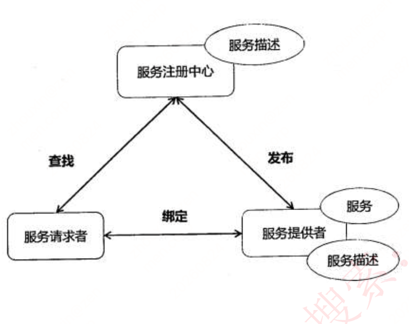

Web Service 可分为六层：

1. 底层传输层：负责底层消息传输，采用 HTTP、JMS、SMTP 等协议。
2. 服务通信协议层：描述并定义服务间通信的技术标准，采用 SOAP 和 REST 协议。
3. 服务描述层：采用 WSDL 协议描述服务。
4. 服务层：对企业应用系统进行包装，通过 WSDL 定义的标准进行调用。
5. 业务流程层：支持服务发现、服务调用和点到点的服务调用，采用 WSDPEL 标准。
6. 服务注册层：采用 UDDI 协议。

服务注册包括以下三个步骤：

1. 服务注册：应用开发者（服务提供者）在注册表中公布服务的功能。
2. 服务位置：服务使用者（服务应用开发者）查询注册服务，寻找符合自身要求的服务。
3. 服务绑定：服务使用者利用检索到的服务接口编写代码，将代码与注册服务绑定，调用注册服务并与其交互。

#### 企业服务总线 ESB

企业服务总线（Enterprise Service Bus，ESB）简单来说是一根管道，用来连接各个服务节点。ESB 用于集成基于不同协议的不同服务，承担消息转换、解释和路由工作，使不同服务互联互通。

ESB 包括客户端（服务请求者）、基础架构服务（中间件）和核心集成服务（提供服务）。

ESB 的主要功能如下：

1. 提供位置透明性的消息路由和寻址服务。
2. 提供服务注册和命名的管理功能。
3. 支持多种消息传递范型。
4. 支持多种可以广泛使用的传输协议。
5. 支持多种数据格式及其相互转换。
6. 提供日志和监控功能。

## 4 软件架构复用

- 软件产品线是指一组软件密集型系统，它们共享一个公共的、可管理的特性集，满足某个特定市场或任务的具体需要，是以规定的方式用公共的核心资产集成开发出来的，即围绕核心资产库进行管理、复用、集成新的系统。
- 核心资产库包括软件架构及其可剪裁的元素；更广泛地说，还包括设计方案及其文档、用户手册、项目管理的历史记录（如预算和进度）、软件测试计划和测试用例。
- 软件复用是一种系统化的软件开发过程，通过识别、开发、分类、获取和修改软件实体，以便在不同的软件开发过程中重复使用它们。
- 软件架构复用的类型包括机会复用和系统复用。机会复用是指开发过程中，只要发现有可复用的资产，就对其进行复用；系统复用是指在开发之前就进行规划，以决定需要复用哪些资产。
- 可复用的资产包括：需求、架构设计、元素、建模与分析、测试、项目规划、过程、方法和工具、人员、样本系统、缺陷消除。

复用的基本过程主要包括三个阶段：

1. 首先构造／获取可复用的软件资产。
2. 管理可复用资产。最重要的是构件库，构件库应提供构件的存储、管理、检索、浏览和维护等功能，并支持使用者有效、准确地发现所需的可复用构件。这里存在两个关键问题：一是构件分类，二是构件检索。
3. 使用可复用资产。通过获取需求、检索复用资产库、获取可复用资产，定制这些资产，包括修改、扩展、配置等，最后将其组装与集成，形成最终系统。

## 5 特定领域软件架构 DSSA

- DSSA（Domain Specific Software Architecture，特定领域软件架构）是专用于一类特定类型任务（领域）的、在整个领域中能够有效使用的、为成功构造应用系统限定了标准组合结构的软件构件集合。
- DSSA 是一个在特定问题领域中支持一组应用的领域模型、参考需求和参考架构等组成的开发基础，其目标是支持在一个特定领域中多个应用的生成。

DSSA 的必备特征如下：

1. 一个严格定义的问题域和问题解域。
2. 具有普遍性，使其可以用于领域中某个特定应用的开发。
3. 对整个领域的构件组织模型的恰当抽象。
4. 具备该领域固定的、典型的、在开发过程中可重用的元素。

对 DSSA 和领域有两种理解：

1. `垂直域`：在一个特定领域中通用的软件架构，是一个完整的架构。
2. `水平域`：在多个不同特定领域之间相同部分的小工具。例如购物和教育领域都有收费系统，收费系统就是水平域。

### DSSA 的三个基本活动

#### 领域分析

领域分析的目标是获得`领域模型（领域需求）`，主要活动包括：

1. 定义领域边界，明确分析对象。
2. 识别信息源。信息源包括`现存系统、技术文献、问题域和系统开发专家、用户调查和市场分析、领域演化历史记录`等。
3. 分析领域中系统的需求。
4. 确定领域中系统广泛共享的需求。
5. 建立领域模型。

#### 领域设计

领域设计的目标是获得`DSSA`。DSSA 描述领域模型中表示的需求的解决方案。它不是表示单个系统，而是适应领域中多个系统需求的高层次设计。建立领域模型后，可派生出满足这些建模需求的 DSSA。

#### 领域实现

领域实现的目标是依据`领域模型和 DSSA`开发和组织`可重用信息`。可重用信息既可以从现有系统提取，也可以通过新开发获得。

以上过程是`反复的、逐渐求精`的过程。在领域工程的每个阶段，都可能返回之前的步骤，修改和完善之前的结果，再回到当前步骤，在新的基础上继续活动。

### DSSA 的四种角色人员

#### 领域专家

领域专家包括领域中有经验的用户，以及从事领域需求分析、设计、实现、项目管理的有经验软件工程师。他们负责或协助：

- 提供领域系统需求规范和实现知识；
- 帮助组织规范一致的领域字典；
- 帮助选择样本系统作为领域工程依据；
- 复审领域模型、DSSA 等领域工程产品。

#### 领域分析人员

领域分析人员是具有知识工程背景的有经验系统分析员，负责控制整个领域分析过程、进行知识获取，并将获取的知识组织到领域模型中。

#### 领域设计人员

领域设计人员由有经验的软件设计人员担任，根据领域模型和现有系统开发 DSSA，并验证 DSSA 的准确性和一致性。

#### 领域实现人员

领域实现人员由有经验的程序设计人员担任，根据领域模型和 DSSA 开发构件。

### DSSA 的建立过程

DSSA 建立过程分为 5 个阶段。每个阶段可以进一步划分为步骤或子阶段，并包括：`一组需要回答的问题、一组需要的输入、一组将产生的输出和验证标准`。完成过程可能需要对每个阶段经历几遍，每次增加更多细节，类似螺旋模型。

1. `定义领域范围`：确定感兴趣领域及过程何时结束；输出是领域中应用满足用户的一系列需求。
2. `定义领域特定的元素`：编译领域字典和领域术语的同义词词典；归纳领域术语，识别相同和不相同元素。
3. `定义领域特定的设计和实现需求的约束`：识别领域中的所有约束，以及这些约束对领域设计和实现的后果。
4. `定义领域模型和架构`：产生一般架构并描述其构件说明。
5. `产生、搜集可复用的产品单元`：为 DSSA 增加复用构件，使其可用于新的系统。

DSSA 建立过程是`并发的、递归的和反复进行的`，目的在于将`用户的需求映射为基于实现限制集合的软件需求`。领域工程和领域分析不区分功能性需求和实现限制，统称为“需求”。

### DSSA 三层次模型

1. `领域开发环境`：领域架构师决定核心架构，产出`参考结构、参考需求、架构、领域模型、开发工具`。
2. `领域特定的应用开发环境`：应用工程师根据具体环境将核心架构实例化。
3. `应用执行环境`：操作员实现实例化后的架构。

领域开发环境向领域特定的应用开发环境提供参考结构、参考需求、架构、领域模型和开发工具；应用开发环境产出`实例化的体系结构`，再由应用执行环境运行。

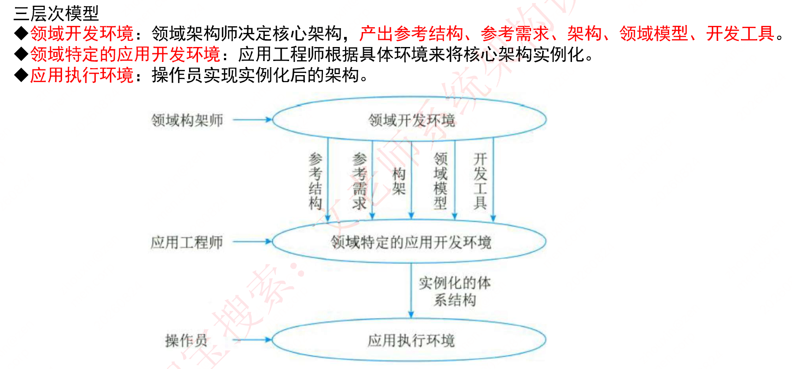

## 6 系统质量属性与架构评估

### 6.1 软件系统质量属性

软件系统质量是`软件系统与明确地和隐含地定义的需求相一致的程度`。

从管理角度，软件系统质量可分为 6 种维度：`功能性、可靠性、易用性、效率、维护性、可移植性`。

| 质量维度 | 包含的子属性 |
| --- | --- |
| 功能性 | 适合性、准确性、互操作性、依从性、安全性 |
| 可靠性 | 容错性、易恢复性、成熟性 |
| 易用性 | 易学性、易理解性、易操作性 |
| 效率 | 资源特性、时间特性 |
| 维护性 | 可测试性、可修改性、稳定性、易分析性 |
| 可移植性 | 适应性、易安装性、一致性、可替换性 |

#### 开发期质量属性

软件系统质量属性又可分为`开发期质量属性`和`运行期质量属性`。

开发期质量属性主要包括：

1. `易理解性`：设计被开发人员理解的难易程度。
2. `可扩展性`：因适应新需求或需求变化而增加新功能的能力，也称灵活性。
3. `可重用性`：重用软件系统或某一部分的难易程度。
4. `可测试性`：对软件测试以证明满足需求规范的难易程度。
5. `可维护性`：修改缺陷、增加功能、提高质量属性时，识别修改点并实施修改的难易程度。
6. `可移植性`：软件系统从一个运行环境移到另一个不同运行环境的难易程度。

#### 运行期质量属性

运行期质量属性主要包括：

1. `性能`：及时提供相应服务的能力，如速度、吞吐量、容量。
2. `安全性`：同时满足合法用户服务并阻止未授权使用。
3. `可伸缩性`：用户数和数据量增加时仍维持服务质量，如增加服务器。
4. `互操作性`：与其他系统交换数据和相互调用服务的难易程度。
5. `可靠性`：一定时间内持续无故障运行。
6. `可用性`：一定时间内正常工作的时间比例；受系统错误、恶意攻击、高负载影响。
7. `鲁棒性`：非正常情况（非法操作、软硬件故障等）下仍能正常运行，也称健壮性。

### 6.2 系统架构评估

面向架构评估的主要质量属性包括：

1. `性能`：系统响应能力，即多长时间响应某事件，或一定时间内处理事件的个数，如响应时间、吞吐量。设计策略包括优先级队列、增加计算资源、减少计算开销、引入并发机制、资源调度。
2. `可靠性`：应用或系统错误前，在意外或错误使用情况下维持功能特性的基本能力，包括容错和健壮性。指标包括`MTTF、MTBF、MTTR`；设计策略包括心跳、Ping/Echo、冗余、选举。
3. `可用性`：能够正常运行的时间比例，可用故障间隔时间、故障恢复时间表示。设计策略包括心跳、Ping/Echo、冗余、选举。
4. `安全性`：向合法用户提供服务，同时阻止非授权用户使用企图或拒绝服务。属性包括`保密性、完整性、不可抵赖性、可控性`；设计策略包括入侵检测、用户认证、用户授权、追踪审计。
5. `可修改性`：能够快速以较高性价比对系统进行变更的能力，包括可维护性、可扩展性、结构重组、可移植性。设计策略包括接口-实现分类、抽象、信息隐藏。
6. `功能性`：系统所能完成所期望工作的能力。一项任务的完成需要系统中许多或大多数构件相互协作。
7. `可变性`：体系结构经扩充或变更而成为新体系结构的能力。新体系结构应符合预先定义规则，某些方面不同于原体系结构；对软件产品线很重要。
8. `互操作性`：系统组成部分不是独立存在，经常与其他系统或自身环境相互作用；体系结构必须为外部可视功能特性和数据结构提供精心设计的软件入口。

### 6.3 基于场景的评估方法

质量属性场景是`面向特定质量属性的需求`，由 6 部分组成：

1. `刺激源（Source）`：生成刺激的实体，可以是人、计算机系统或其他刺激器。
2. `刺激（Stimulus）`：刺激到达系统时需要考虑的条件。
3. `环境（Environment）`：刺激发生的条件，系统可能处于过载、运行或其他情况。
4. `制品（Artifact）`：被刺激的制品，可以是整个系统或系统的一部分。
5. `响应（Response）`：刺激到达后系统采取的动作。
6. `响应度量（Measurement）`：响应发生时对响应进行度量的方式，用于检验需求是否满足。

#### 可用性质量属性场景

可用性场景关注：系统故障发生的频率；出现故障时会发生什么；允许系统有多长时间非正常运行；什么时候可以安全出现故障；如何防止故障；发生故障时要求进行哪种通知。

| 场景要素 | 可能的情况 |
| --- | --- |
| 刺激源 | 系统内部、系统外部 |
| 刺激 | 疏忽、错误、崩溃、时间 |
| 环境 | 正常操作、降级模式 |
| 制品 | 系统处理器、通信信道、持久存储器、进程 |
| 响应 | 系统应该检测事件，并进行以下一个或多个活动：记录下来；通知适当各方（包括用户和其他系统）；根据已定义规则禁止导致错误或故障的事件源；在一段预先指定的时间间隔内不可用，其中时间间隔取决于系统关键程度；在正常或降级模式下运行 |
| 响应度量 | 系统必须可用的时间间隔；可用时间；系统可以在降级模式下运行的时间间隔；故障修复时间 |

#### 可修改性质量属性场景

可修改性质量属性场景主要关注系统在改变功能、质量属性时需要付出的成本和难度，可发生在系统设计、编译、构建、运行等多种情况和环境下。

| 场景要素 | 可能的情况 |
| --- | --- |
| 刺激源 | 最终用户、开发人员、系统管理员 |
| 刺激 | 希望增加、删除、修改、改变功能、质量属性、容量等 |
| 环境 | 系统设计时、编译时、构建时、运行时 |
| 制品 | 系统用户界面、平台、环境或与目标系统交互的系统 |
| 响应 | 查找架构中需要修改的位置，进行修改且不会影响其他功能；对所做修改进行测试；部署所做的修改 |
| 响应度量 | 根据所影响元素的数量度量成本、努力、资金；以及该修改对其他功能或质量属性造成影响的程度 |

#### 性能质量属性场景

性能质量属性场景主要关注系统的`响应速度`，可以通过`效率、响应时间、吞吐量、负载`来客观评价性能的好坏。

| 场景要素 | 可能的情况 |
| --- | --- |
| 刺激源 | 用户请求、其他系统触发的事件 |
| 刺激 | 定期事件到达、随机事件到达、偶然事件到达 |
| 环境 | 正常模式、超载（Overload）模式 |
| 制品 | 系统 |
| 响应 | 处理刺激、改变服务级别 |
| 响应度量 | 等待时间、期限、吞吐量、抖动、缺失率、数据丢失率 |

#### 可测试性质量属性场景

可测试性质量属性场景主要关注`系统测试过程中的效率`，以及`发现系统缺陷或故障的难易程度`。

| 场景要素 | 可能的情况 |
| --- | --- |
| 刺激源 | 开发人员、增量开发人员、系统验证人员、客户验收测试人员、系统用户 |
| 刺激 | 已完成的分析、架构、设计、类和子系统集成；所交付的系统 |
| 环境 | 设计时、开发时、编译时、部署时 |
| 制品 | 设计、代码段、完整的应用 |
| 响应 | 提供对状态值的访问；提供所计算的值；准备测试环境 |
| 响应度量 | 已执行的可执行语句的百分比；如果存在缺陷出现故障的概率；执行测试的时间；测试中最长花费的长度；准备测试环境的时间 |

#### 易用性质量属性场景

易用性质量属性场景主要关注用户`在使用系统时的容易程度`，包括系统的学习曲线、完成操作的效率、对系统使用过程的满意程度等。

| 场景要素 | 可能的情况 |
| --- | --- |
| 刺激源 | 最终用户 |
| 刺激 | 想要学习系统特性、有效使用系统、使错误的影响最低、适配系统、对系统满意 |
| 环境 | 系统运行时或配置时 |
| 制品 | 系统 |
| 响应 | （1）系统提供一个或多个响应来支持“学习系统特性”：帮助系统与环境联系紧密；界面为用户所熟悉；在不熟悉的环境中，界面是可以使用的。（2）系统提供一个或多个响应来支持“有效使用系统”：数据和（或）命令的聚合；已输入的数据和（或）命令的重用；支持在界面中的有效导航；具有一致操作的不同视图；全面搜索；多个同时进行的活动。（3）系统提供一个或多个响应来使“错误的影响最低”：撤销；取消；从系统故障中恢复；识别并纠正用户错误；检索忘记的密码；验证系统资源。（4）系统提供一个或多个响应来“适配系统”：定制能力；国际化。（5）系统提供一个或多个响应来使客户“对系统的满意”：显示系统状态；与客户的节奏合拍 |
| 响应度量 | 任务时间、错误数量、解决问题的数量、用户满意度、用户知识的获得、成功操作在总操作中所占的比例、损失的时间 |

#### 安全性质量属性场景

安全性质量属性场景主要关注系统在安全性方面的要素，衡量系统在向合法用户提供服务的同时，阻止非授权用户使用的能力。

| 场景要素 | 可能的情况 |
| --- | --- |
| 刺激源 | 正确识别、非正确识别身份未知的来自内部或外部的个人或系统；经过授权/未授权地访问了有限的资源/大量资源 |
| 刺激 | 试图显示数据，改变/删除数据，访问系统服务，降低系统服务的可用性 |
| 环境 | 在线或离线、联网或断网、连接有防火墙或者直接连到了网络 |
| 制品 | 系统服务、系统中的数据 |
| 响应 | 对用户身份进行认证；隐藏用户的身份；阻止对数据或服务的访问；允许访问数据或服务；授予或收回对访问数据或服务的许可；根据身份记录访问、修改或试图访问、修改数据、服务；以一种不可读的格式存储数据；识别无法解释的对服务的高需求；通知用户或另外一个系统，并限制服务的可用性 |
| 响应度量 | 用成功的概率表示；避开安全防范措施所需要的时间、努力、资源；检测到攻击的可能性；确定攻击或访问、修改数据或服务的个人的可能性；在拒绝服务攻击的情况下仍然获得服务的百分比；恢复数据、服务；被破坏的数据、服务和（或）被拒绝的合法访问的范围 |

### 软件架构评估

软件架构评估是在`对架构分析、评估的基础上，对架构策略的选取进行决策`。软件架构评估在`架构设计之后、系统设计之前`，与设计、实现、测试没有直接关系。评估的目的是`评价所采用的架构是否能解决软件系统需求`，但不是单纯地确定是否满足需求。

`敏感点`是指为了实现某种特定的质量属性，一个或多个构件所具有的特性。`权衡点`是影响多个质量属性的特性，是多个质量属性的敏感点。

`风险承担者`（也称利益相关人）是对架构施加各种影响、希望自身目标实现的相关人员。`场景`是在进行架构评估时，首先精确得出的具体质量目标，也是从风险承担者角度对系统交互的简短描述；为得出目标而采用的机制称为场景。架构评估中一般采用`刺激、环境和响应`三方面描述场景。

架构评估的常用方法包括：`基于调查问卷或检查表的方法、基于场景的评估方法、基于度量的评估方法`。

#### 软件架构分析方法 SAAM

SAAM 是一种`非功能质量属性`的架构分析方法，是`最早形成文档并得到广泛应用`的软件架构分析方法。

1. 特定目标：SAAM 的目标是`对描述应用程序属性的文档，验证基本的架构假设和原则`。
2. 评估技术：SAAM 使用`场景技术`。
3. 质量属性：把任何形式的质量属性都具体化为场景，但`可修改性`是 SAAM 分析的主要质量属性。
4. 风险承担者：协调`不同参与者之间感兴趣的共同方面`，作为后续决策的基础，达成对架构的共识。
5. 架构描述：SAAM 用于架构的`最终版本`，但早于详细设计；架构描述形式应被所有参与者理解，`功能、结构和分配`是描述架构的 3 个主要方面。
6. 方法活动：SAAM 的主要输入是`问题描述、需求声明和架构描述`，包括 5 个步骤：`场景开发、架构描述、单个场景评估、场景交互和总体评估`。
7. 已有知识库的可重用性：`SAAM 不考虑这个问题`。
8. 方法验证：SAAM 是一种成熟的方法，已应用到多个系统中，如空中交通管制、嵌入式音频系统、WRCS（修正控制系统）、KWIC（根据上下文查找关键词系统）等。

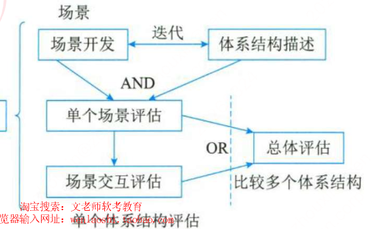

#### 架构权衡分析方法 ATAM

ATAM 的目标是在`考虑多个相互影响的质量属性`的情况下，从原则上提供一种理解软件架构能力的方法。对于特定的软件架构，在系统开发之前，可以使用 ATAM 确定`多个质量属性之间折中的必要性`。

1. 质量属性：开始时考虑系统的`可修改性、安全性、性能和可用性`。
2. 风险承担者：在`场景、需求收集`相关活动中，ATAM 方法需要所有系统相关人员参与。
3. 架构描述：基于`5 种基本结构`进行，这 5 种结构从 4+1 视图派生；其中逻辑视图分为功能结构和代码结构，并用一组`消息顺序图`表示运行时交互和场景。
4. 评估技术：使用`场景技术`。场景包括`用例（对系统典型的使用、引出信息）、增长场景（对系统的修改）、探测场景（可能对系统造成过载的极端修改）`。
5. 方法活动：ATAM 分为 4 个主要活动领域，即`场景和需求收集、架构视图和场景实现、属性模型构造和分析、折中`。

ATAM 方法采用`效用树（Utility tree）`对质量属性进行分类和优先级排序。效用树的结构包括：`树根—质量属性—属性分类—质量属性场景（叶子节点）`。

#### 基于成本效益分析的方法 CBAM

成本效益分析方法用于`对架构设计决策的成本和收益进行建模`，是优化此类决策的一种手段。CBAM 的思想是架构策略影响系统的质量属性，反过来这些质量属性又会为系统的项目干系人带来一些收益，CBAM 协助项目干系人`根据其投资回报选择架构策略`。CBAM 在`ATAM 结束时开始`，实际使用了 ATAM 评估的结果。

CBAM 的 8 个步骤如下：

1. 整理场景：确定场景并确定优先级，选择三分之一优先级最高的场景进行分析。
2. 对场景进行细化：对每个场景详细分析，确定最好、最坏的情况。
3. 确定场景的优先级：项目干系人对场景投票，根据投票结果确定优先级。
4. 分配效用：对场景响应级别确定效用表，建立策略、场景、响应级别的表格。
5. 形成“策略—场景—响应级别的对应关系”。
6. 确定期望的质量属性响应级别的效用：根据效用表确定所对应具体场景的效用。
7. 计算各架构策略的总收益。
8. 根据受成本限制影响的投资回报率选择架构策略：估算成本，用上一步的收益减去成本，得出收益，并选择收益最高的架构策略。

#### 其他评估方法（仅了解）

1. `SAEM 方法`：将软件架构看作一个最终产品以及设计过程中的一个中间产品，从外部质量属性和内部质量属性两个角度阐述评估模型；包括规约建模、为外部和内部质量属性创建度量准则、评估质量属性 3 个过程。
2. `SAABNet 方法`：用来表达和使用定性知识以辅助架构的定性评估，源于人工智能，使用 BBN 表示和使用开发过程中的知识。
3. `SACMM 方法`：一种软件架构修改的度量方法。
4. `SASAM 方法`：通过对预期架构和实际架构进行映射和比较来静态地评估软件架构。
5. `ALRRA 方法`：软件架构可靠性风险评估方法，使用动态复杂度准则和动态耦合度准则定义构件和连接件的复杂性，利用失效模式和影响分析（FMEA）技术。
6. `AHP（层次分析法）`：对定性问题进行定量分析的多准则决策方法，通过层次化、两两比较和数学计算确定各层次元素的相对权重及排序。
7. `COSMIC+UML 方法`：基于度量模型评估软件架构可维护性，采用统一的软件度量 COSMIC 方法进行度量和评估。
