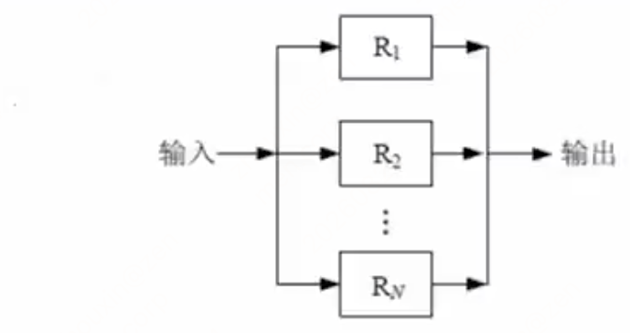
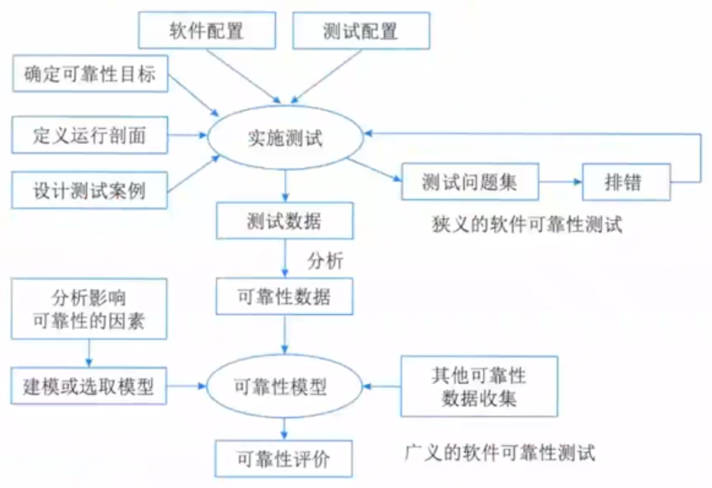

# 第十四章 软件可靠性基础知识（课件原文）

> 本页为课件原始内容，未经精简。精简笔记见 [笔记 · 第十四章](/notes/chapter-14/)。
>
> 备注：本章重要度较低，了解即可，不必深挖。

## 知识点目录

1. 软件可靠性基本概念
2. 软件可靠性建模
3. 软件可靠性管理
4. 软件可靠性设计
5. 软件可靠性测试与评价

## 1 软件可靠性基本概念

- 软件可靠性是软件产品`在规定的条件下和规定的时间区间完成规定功能`的能力。
- `软件可靠性和硬件可靠性区别`：
  - （1）复杂性：`软件复杂性比硬件高`，大部分失效来自于软件失效。
  - （2）物理退化：硬件失效主要是物理退化所致，`软件不存在物理退化`。
  - （3）唯一性：`软件是唯一的`，每个COPY版本都一样，而两个硬件不可能完全一样。
  - （4）版本更新周期：`硬件较慢，软件较快`。
- 软件可靠性的`定量描述`：
  1. 规定时间：自然时间、运行时间、执行时间（占用CPU）。
  2. 失效概率：软件运行初始时为0，随着时间增加单调递增，不断趋向于1。
  3. 可靠度：软件系统在规定的条件下、规定的时间内不发生失效的概率。等于1-失效概率。
  4. 失效强度：单位时间软件系统出现失效的概率。
  5. `平均失效前时间（MTTF）`：平均无故障时间，发生故障前正常运行的时间。
  6. `平均恢复前时间（MTTR）`：平均故障修复时间，发生故障后的修复时间。
  7. `平均故障间隔时间（MTBF）`：失效或维护中所需的平均时间，包括故障时间以及检测和维护设备的时间。`MTBF=MTTF+MTTR`。
- 系统可用性=MTTF/(MTTF+MTTR)*100%。

### 串并联系统可靠性

- 无论什么系统，都是由多个设备组成的，协同工作，而这多个设备的组合方式可以是串联、并联，也可以是混合模式，假设每个设备的可靠性为R1，R2……Rn，则不同的系统的可靠性公式如下：
- 串联系统，一个设备不可靠，整个系统崩溃，`整个系统可靠性R=R1 * R2 * … * Rn`。

- 并联系统，所有设备都不可靠，整个系统才崩溃，`整个系统可靠性R=1-(1-R1) * (1-R2) * … * (1-Rn)`。

### 失效严重程度类

- 对软件运行的影响程度不仅取决于`软件失效发生的概率`，还和`软件失效的严重程度`有很大关系。这里引出另外一个概念——`失效严重程度类`。
- 失效严重程度类就是`对用户具有相同程度影响的失效集合`。
- 对失效严重程度的分级可以按照不同的标准进行，最为常见的是`按对成本影响、对系统能力的影响`等标准划分软件失效的严重程度类。
- 对成本的影响可能包括`失效引起的额外运行成本、修复和恢复成本`、现有或潜在的业务机会的损失等。由于失效严重程度类的影响分布很广泛，为了按照一定数量的等级去定义失效严重程度类，通常用数量级去划分等级。

## 2 软件可靠性建模

- 软件可靠性模型是指`为预计或估算软件的可靠性所建立的可靠性框图和数学模型`。
- 影响软件可靠性的因素是纷杂而众多的，甚至包括技术以外的许多因素。首先必须考虑影响软件可靠性的主要因素：`缺陷的引入、发现和清除`。缺陷的引入主要`取决于软件产品的特性和软件的开发过程特性`。软件产品的特性指软件本身的性质，开发过程特性包括`开发技术、开发工具、开发人员的水平、需求的变化频度`等。缺陷的发现依靠`用户对软件的操作方式、运行环境等`，也就是运行剖面。缺陷的清除`依赖于失效的发现和修复活动及可靠性方面的投入`。
- 从技术的角度来看，影响软件可靠性的主要因素包括：`运行环境、软件规模、软件内部结构、软件的开发方法和开发环境、软件的可靠性投入`。
- 一个软件可靠性模型通常（但不是绝对）由`以下几部分`组成：
  1. `模型假设`。模型是实际情况的简化或规范化，总要包含若干假设，例如测试的选取代表实际运行剖面，不同软件失效独立发生等。
  2. `性能度量`。软件可靠性模型的输出量就是性能度量，如失效强度、残留缺陷数等。在软件可靠性模型中性能度量通常以数学表达式给出。
  3. `参数估计方法`。某些可靠性度的实际值无法直接获得，例如残留缺陷数，这时需通过一定的方法估计参数的值，从而间接确定可靠性度量的值。
  4. `数据要求`。一个软件可靠性模型要求一定的输入数据，即软件可靠性数据。
- 绝大多数的模型包含`3个共同假设`：
  1. `代表性假设`。是指可以用测试产生的软件可靠性数据预测运行阶段的软件可靠性行为。
  2. `独立性假设`。此假设认为软件失效是独立发生于不同时刻，一个软件失效的发生不影响另一个软件失效的发生。
  3. `相同性假设`。此假设认为所有软件失效的后果（等级）相同，即建模过程只考虑软件失效的具体发生时刻，不区分软件的失效严重等级。
- 人们常常通过`估计或预测`的方法来确定模型的参数。确定了模型的参数后，就可以`来表示失效过程的很多不同的特性`。例如，大多数模型都会对如下的内容进行解析表达：`任何时间点所经历的平均失效数。一段时间间隔内的平均失效数。任何时间点的失效强度。失效区间的概率分布`。
- 一个好的软件可靠性模型应该具有如下重要特性：`基于可靠的假设。简单。计算一些有用的量。给出未来失效行为的好的映射。可广泛应用`。

### 软件的可靠性模型分类

1. 种子法模型。利用捕获-再捕获抽样技术估计程序中的错误数，在程序中`预先有意"播种"一些设定的错误"种子"`，然后`根据测试出的原始错误数和发现的诱导错误的比例`，来估计程序中残留的错误数。
2. 失效率类模型。用来研究`程序的失效率`。
3. 曲线拟合类模型。用`回归分析`的方法研究软件复杂性、程序中的缺陷数、失效率、失效间隔时间。
4. 可靠性增长模型。这类模型`预测软件在检错过程中的可靠性改进`，用增长函数来描述软件的改进过程。
5. 程序结构分析模型。是根据`程序、子程序及其相互间的调用关系`，形成一个可靠性分析网络。网络中的每个结点代表一个子程序或一个模块，网络中的`每一有向弧代表模块间的程序执行顺序`。假定各结点的可靠性是相互独立的，`通过对每个结点可靠性、结点间转换的可靠性和网络在结点间的转换概率，得出该持续程序的整体可靠性`。
6. 输入域分类模型。`选取软件输入域中的某些样本"点"运行程序，根据这些样本点在"实际"使用环境中的使用概率的测试运行时的成功／失效率，推断软件的使用可靠性`。
7. 执行路径分析方法模型。分析方法与上面的模型相似，`先计算程序各逻辑路径的执行概率和程序中错误路径的执行概率，再综合出该软件的使用可靠性`。
8. 非齐次泊松过程模型。是以`软件测试过程中单位时间的失效次数为独立泊松随机变量`，来预测在今后软件的某使用时间点的累计失效数。
9. 马尔可夫过程模型。包括：完全改错的线性死亡模型。不完全改错的线性死亡模型。完全改错的非静态线性死亡模型。
10. 贝叶斯模型。是利用`失效率的试验前分布和当前的测试失效信息`，来评估软件的可靠性。

另外，Musa 和 Okumoto 依据模型的不同属性对可靠性模型进行以下分类：

- `时间域`：有两种，自然或日历时间与执行（CPU）时间。
- `失效数类`：取决于无限时间内发生的失效数是有限的还是无限的。
- `失效数分布`：相对于时间系统失效数的统计分布形式，主要的两类是泊松分布型和二项分布型。
- `有限类`：对有限失效数的类别适用，用时间表示的失效强度的函数形式。
- `无限类`：对无限失效数的类别适用，用经验期望失效数表示的失效强度的函数形式。

## 3 软件可靠性管理

- 软件可靠性管理是软件工程管理的一部分，它以`全面提高和保证软件可靠性为目标`，`以软件可靠性活动为主要对象`，是把现代管理理论用于软件生命周期中的可靠性保障活动的一种管理形式。
- 软件可靠性管理的内容包括`软件工程各个阶段的可靠性活动的目标、计划、进度、任务和修正措施等`。可靠性各阶段设计任务如下：
  - 需求分析阶段：确定可靠性目标、分析影响因素、确定验收标准、制定框架、制定文档编写规范、制定初步计划、确定数据收集规范。
  - 概要设计阶段：确定可靠性度量、制定详细验收方案、可靠性设计、收集数据、调整计划、明确后续阶段详细计划、编制文档。
  - 详细设计阶段：可靠性设计、预测、调整计划、收集数据、明确后续阶段详细计划、编制文档。
  - 编码阶段：可靠性测试（单元）、排错、调整计划、收集数据、明确后续阶段详细计划、编制文档。
  - 测试阶段：可靠性测试（集成和系统）、排错、可靠性建模、评价、调整计划、收集数据、明确后续阶段详细计划、编制文档。
  - 实施阶段：可靠性测试（验收）、排错、收集数据、调整模型、评价、编制文档。

## 4 软件可靠性设计

- 实践证明，保障软件可靠性最有效、最经济、最重要的手段是在`软件设计阶段`采取措施进行可靠性控制。
- 可靠性设计其实就是在`常规的软件设计中`，应用各种方法和技术，使程序设计在兼顾用户的功能和性能需求的同时，`全面满足软件的可靠性要求`。
- 软件可靠性设计原则：
  1. 软件可靠性设计是`软件设计的一部分`，必须在软件的总体设计框架中使用，并且不能与其他设计原则相冲突。
  2. 软件可靠性设计在满足提高软件质量要求的前提下，以`提高和保障软件可靠性为最终目标`。
  3. 软件可靠性设计应`确定软件的可靠性目标`，不能无限扩大化，并且排在功能度、用户需求和开发费用之后考虑。
- 软件可靠性设计技术主要有`容错设计、检错设计和降低复杂度设计`等技术。

### 容错设计技术

- 软件容错的主要方法是`提供足够的冗余信息和算法程序`，使系统在`实际运行时能够及时发现程序设计错误`，采取补救措施，以提高系统可靠性，保证整个系统的正常运行。软件容错技术主要有`N版本程序设计、恢复块设计和冗余设计`3种方法。
- 恢复块设计（动态冗余）：程序的`执行过程可以看成是由一系列操作构成的`，这些操作又可由更小的操作构成。恢复块设计就是`选择一组操作作为容错设计单元，从而把普通的程序块变成恢复块`。一个恢复块`包含有若干个功能相同、设计差异的程序块文本，每一时刻有一个文本处于运行状态。一旦该文本出现故障，则用备份文本加以替换，从而构成“动态冗余”`。
- N版本程序设计：核心是通过`设计出多个模块或不同版本，对于相同初始条件和相同输入的操作结果，实行多数表决，防止其中某一软件模块/版本的故障提供错误的服务`，以实现软件容错。
- 为使此种容错技术具有良好的结果，必须注意以下两个方面：`使软件的需求说明具有完全性和精确性。设计全过程的不相关性`。
- 与通常软件开发过程不同的是，N版本程序设计增加了三个新的阶段：`相异成分规范评审、相异性确认、背对背测试`。

**表 19-1 恢复块方法与N版本程序设计的比较**

| | 恢复块方法 | N版本程序设计 |
| --- | --- | --- |
| 硬件运行环境 | 单机 | 多机 |
| 错误检测方法 | 验证测试程序 | 表决 |
| 恢复策略 | 后向恢复 | 前向恢复 |
| 实时性 | 差 | 好 |

### 冗余设计

- 软件的冗余设计技术实现的原理是`在一套完整的软件系统之外，设计一种不同路径、不同算法或不同实现方法的模块或系统作为备份`，在出现故障时可以使用冗余的部分进行替换，从而维持软件系统的正常运行。

### 检错技术

- 在`软件出现故障后能及时发现并报警，提醒维护人员进行处理`。代价低，但不能自动解决故障。
- 采用检错设计技术要着重考虑几个要素：`检测对象、检测延时、实现方式和处理方式`。

### 降低复杂度设计

- 软件复杂性常分为`模块复杂性和结构复杂性`。模块复杂性主要包含`模块内部数据流向和程序长度两个方面`，结构复杂性用`不同模块之间的关联程度`来表示。
- 软件的`复杂度`与软件可靠性有着密切的关系，软件复杂性是产生软件缺陷的重要根源。有研究表明，当软件的复杂度超过一定界限时，软件缺陷数会急剧上升，软件的可靠性急剧下降。
- 降低复杂度设计的思想就是`在保证实现软件功能的基础上，简化软件结构，缩短程序代码长度，优化软件数据流向，降低软件复杂度，从而提高软件可靠性`。

### 系统配置技术

- 通常在系统配置中可以采用相应的容错技术，通过系统的整体来提供相应的可靠性，主要有`双机热备技术和服务器集群技术`。
- 双机热备技术：是一种`软硬件结合的容错应用方案`。该方案是由`两台服务器和一个外接共享磁盘阵列及相应的双机热备份软件`组成。
- 在这个容错方案中，操作系统和应用程序安装在两台服务器的本地系统盘上，`整个网络系统的数据是通过磁盘阵列集中管理和数据备份的`。
- 双机热备系统采用“心跳”方法保证主系统与备用系统的联系。所谓心跳，是指`主从系统之间相互按照一定的时间间隔发送通信信号`，表明各自系统当前的运行状态。一旦心跳信号表明主机系统发生故障，或者备用系统无法收到主系统的心跳信号，则系统的高可用性管理软件认为主系统发生故障，立即将系统资源转移到备用系统上。
- 工作模式：`双机热备模式（一主一备）；双机互备模式（互为备份）；双机双工模式（同时运行）`。
- 集群技术就是将`多台计算机组织起来进行协同工作`，它是提高系统可用性和可靠性的一种技术。在集群系统中，每台计算机均`承担部分计算任务和容错任务`，当其中一台计算机出现故障时，系统使用集群软件将这台计算机从系统中隔出离去，通过各计算机之间的负载转嫁机制`完成新的负载分担`，同时向系统管理人员发出警报。集群系统通过功能整合和故障过渡，实现了系统的高可用性和可靠性。
- 特点：可伸缩性、高可用性、可管理性、高性价、高透明性。
- 分类：高性能计算集群、负载均衡集群、高可用性集群。
- 负载均衡是`集群系统中的一项重要技术`，可以提高集群系统的整体处理能力，也提高了系统的可靠性，最终`目的是加快集群系统的响应速度，提高客户端访问的成功概率`。集群的最大特征是多个节点的`并行和共同工作`，如何让所有节点承受的负荷平均，不出现局部过大负载或过轻负载的情况，是负载均衡的重要目的。
- 比较常用的负载均衡实现技术主要有以下几种：
  1. `基于特定软件的负载均衡（应用层）`。很多网络协议都支持`重定向功能`，例如，基于HTTP重定向服务，其主要原理是服务器使用HTTP重定向指令，将一个客户端重新定位到另一个位置。服务器返回一个重定向响应，而不是返回请求的对象。客户端确认新地址然后重发请求，从而达到负载均衡的目的。
  2. `基于DNS的负载均衡属于传输层负载均衡技术`，其主要原理是在DNS服务器中为同一个主机名配置多个地址，在应答DNS查询时，DNS服务器对每个查询将以DNS文件中主机记录的IP地址按顺序返回不同的解析结果，将客户端的访问引导到不同的节点上去，使得不同的客户端访问不同的节点，从而达到负载均衡的目的。
  3. `基于NAT的负载均衡`。将一个外部IP地址映射为多个内部IP地址，对每次连接需求动态地转换为一个内部节点的地址，将外部连接请求引到转换得到地址的那个节点，上从而达到负载均衡的目的。
  4. `反向代理负载均衡`。将来自Internet上的连接请求以反向代理的方式动态地转发给内部网络上的多个节点进行处理，从而达到负载均衡的目的。
  5. `混合型负载均衡`。

## 5 软件可靠性测试与评价

### 可靠性测试的意义

- （1）软件失效可能造成`灾难性的后果`。
- （2）软件的失效在`整个计算机系统失效`中的比例较高。
- （3）`软件可靠性技术很不成熟`，加剧了软件可靠性问题的重要性。
- （4）软件可靠性问题是`造成费用增长的主要原因之一`。
- （5）软件对`生产活动和社会生活的影响越来越大`，从而增加了软件可靠性问题在软件工程领域乃至整个计算机工程领域的重要性。

### 广义与狭义的软件可靠性测试

- 广义的软件可靠性测试是指为了最终评价软件系统的可靠性而`运用建模、统计、试验、分析和评价等一系列手段对软件系统实施的一种测试`。
- 狭义的软件可靠性测试是指为了`获取可靠性数据`，`按预先确定的测试用例，在软件的预期使用环境中`，对软件实施的一种测试。它是面向缺陷的测试，以用户将要使用的方式来测试软件。

### 可靠性测试的目的

可靠性测试的目的可归纳为以下3个方面：

- （1）`发现`软件系统在需求、设计、编码、测试和实施等方面的`各种缺陷`。
- （2）为软件的`使用和维护提供可靠性数据`。
- （3）确认软件`是否达到可靠性的定量要求`。

### 可靠性测试的过程

- 软件可靠性测试由`可靠性目标的确定、运行剖面的开发、测试用例的设计、测试实施、测试结果的分析`等主要活动组成。
- 测试步骤：`定义软件运行剖面（为软件的使用行为建模）——设计可靠性测试用例——实施可靠性测试`。

### 软件可靠性评价

- 软件可靠性评价3个过程：`选择可靠性模型、收集可靠性数据、可靠性评估和预测`。
- 选择可靠性模型考虑因素：`模型假设的适用性、预测的能力与质量、模型输出值能否满足可靠性评价需求、模型使用的简便性`。
- 可靠性数据的收集：可靠性数据主要是指`软件失效数据`，是软件可靠性评价的基础，主要是在软件测试、实施阶段收集的。数据收集工作存在的问题：`可靠性数据的规范不统一；收集工作连续性不保证；缺乏有效的收集手段；完整性不能保证；数据质量和准确性不保证`。
- 应采用的解决方法：`及早确定所采用的可靠性模型、制订可实施性较强的可靠性数据收集计划、重视软件测试数据的整理和分析、充分利用数据库来完成可靠性数据的存储和统计分析`。
- 可靠性评估和预测：`判断是否达到了可靠性目标；如未能达到要再投入多少`；在软件系统投入实际运行一年或若干时间后，经过维护、升级和修改，软件能否达到交付或部分交付用户使用的可靠性水平。`辅助方法：`失效数据的图形分析法、试探性数据分析技术。
