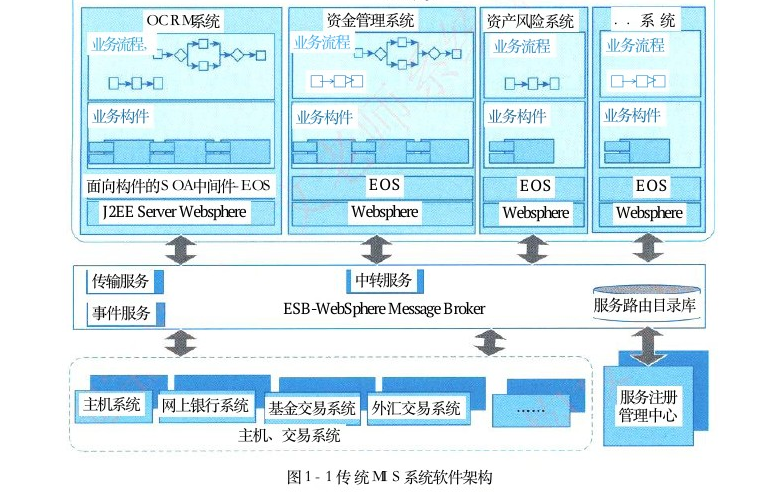
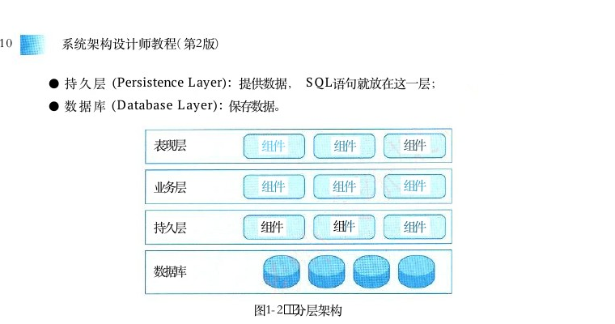
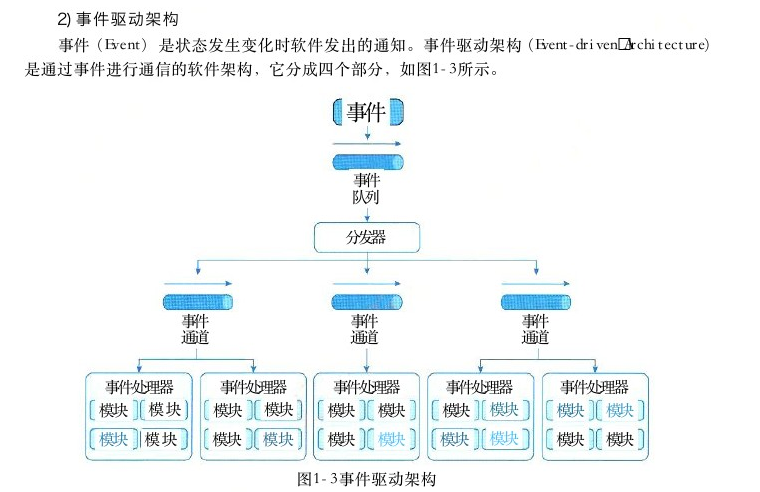
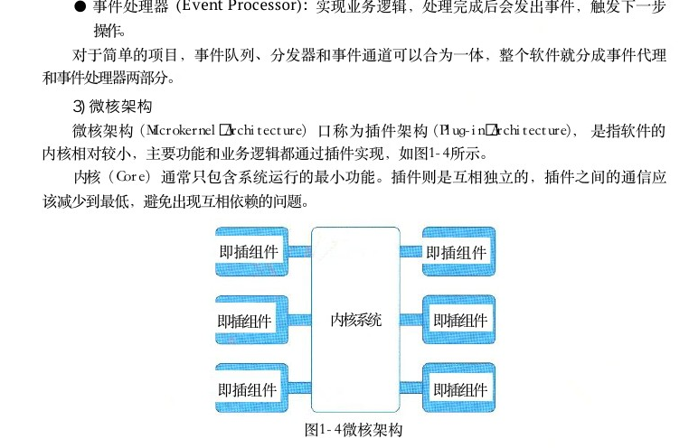
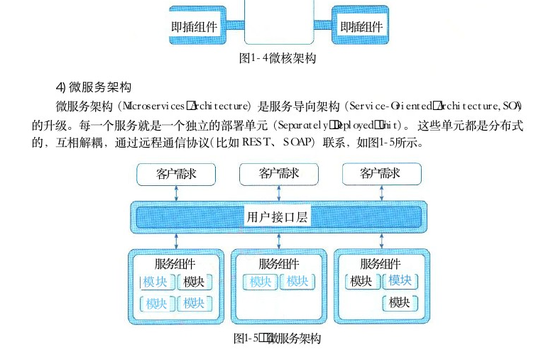
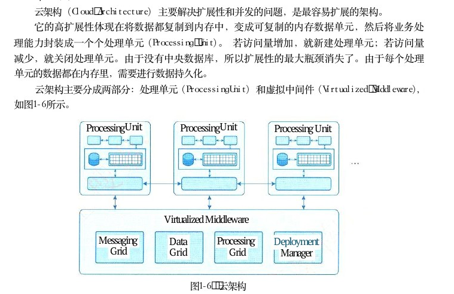
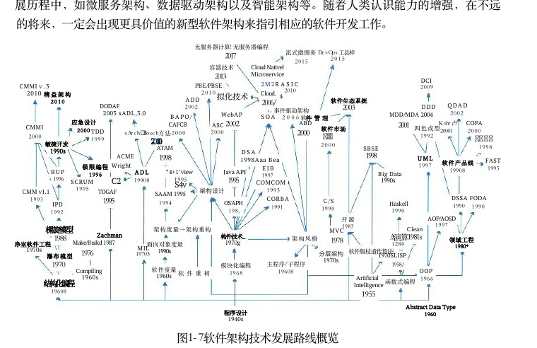

# 第1章 绪论

> 本页为教材原文文字提取版。图示已按 PDF 页面裁剪并插入正文图注前。

<!-- PDF 第 15 页 -->

系统架构设计师 （System Architecture Designer） 是项目开发活动中的关键角色之一。系统架构是系统的一种整体的高层次的结构表示，是系统的骨架和根基，其决定了系统的健壮性和生命周期的长短。本章首先从架构定义、发展历程、典型架构和未来发展等方面概要说明，给读者建立一个架构的整体概念；然后对系统架构设计师的定义、职责、范围和工作内容等进行讲解，并说明了对于一名合格的系统架构设计师的要求。

## 1．1 系统架构概述

自1946年世界上第一台计算机（正式名称为“电子数字积分器和计算机”，即 ENIAC ） 诞生以来，对人类使用的计算工具产生了革命性变革。当时参与美国原子弹研制工作的著名美籍匈牙利数学家冯·诺伊曼针对 ENIAC 的不足，提出了“离散变量自动电子计算机” （EDVAC），它由运算器、控制器、存储器、输入和输出设备五部分组成。该计算机的内部运算采用二进制，而不是十进制。由于一个电子元件只有开或关两种状态，可以表示0或1，这就大大提高了运算速度（十进制有0～9十种状态，用电子元件来表示要复杂得多）；控制计算机运行的程序存放在存储器中，可以自动地从一个程序指令转入下一个程序指令。冯·诺伊曼的思想是电子计算机发展史上的里程碑，当今计算机都是依据这一理论制造的，也被称为冯·诺伊曼结构计算机。从冯·诺伊曼结构计算机起，计算机被分解成计算机硬件和计算机软件两部分，并逐步促进了计算机硬件系统和软件系统的发展。现在计算机已渗透到各行各业，如工业控制、军事装备、轨道交通和环境预测等，人类的衣、食、住、行每时每刻都已离不开计算机技术。计算机是全球信息化发展的核心载体，随着各种基础技术突飞猛进的发展，信息系统的规模越来越大、复杂程度越来越高、系统的结构显得越来越重要。如果在搭建系统时未能设计出优良的结构，势必对系统的可靠性、安全性、可移植性、可扩展性、可用性和可维护性等方面产生重大影响。因此，系统架构 （System Architecture） 是系统的一种整体的高层次的结构表示，是系统的骨架和根基，也决定了系统的健壮性和生命周期的长短。系统架构设计师是承担系统架构设计的核心角色，他不仅是连接用户需求和系统进一步设计与实现的桥梁，也是系统开发早期阶段质量保证的关键角色。随着系统规模和复杂性的提升，系统架构设计师在整个项目研制中的主导地位愈加重要。可以说，系统架构师就是项目的总设计师，他是一个既需要掌控整体又需要洞悉局部瓶颈，并依据具体的业务场景给出解决方案的总体设计人员；他要确认和评估系统需求，给出开发规范，搭建系统实现的核心构架，并澄清技术细节、扫清主要难点的技术人员；他要掌握技术团队的能力需要，给出项目管理方法，采用合适生命周期模型，具备以自身为核心形成团队的能力，并在项目进度计划和经费分配等方面开展评估，以预防项目风险。要成为一名系统架构设计师就应精通专业基础知识，具备丰富的实际工作经验，具有跨学

<!-- PDF 第 16 页 -->

科能力和把握系统整体设计的能力。在我国系统架构设计师已成为专业学科中非常重要的角色之一，是当前项目实施总体设计的关键人物，该角色在项目研制过程中起到了承上启下的作用。当然，目前系统架构设计师的职业在工作内容、工作职责以及工作边界等方面还存在一定的模糊性和不确定性，但它确实是时代发展的需要，并在实践中不断完善和成熟。

## 1．1．1系统架构的定义及发展历程

## 1．系统架构的定义

这里的架构 （Architecture） 定义来源于IEEE 1471－2000：“IEEE＇s Recommand Practice forArchitectural Description of Software－Intensive Systems．” 标准，本标准主要针对软件密集系统进行了架构描述，其对架构定义如下：架构是体现在组件中的一个系统的基本组织、它们彼此的关系与环境的关系及指导它的设计和发展的原则。系统是组织起来完成某一特定功能或一组功能的组件集。系统这个术语包括了单独的应用程序、传统意义上的系统、子系统、系统之系统、产品线、整个企业及感兴趣的其他集合。系统用于完成其环境中的一个或多个任务。环境或者上下文决定了对这个系统的开发、运作、政策以及会对系统造成其他影响的环境和设置。任务是由一个或者多个利益相关者通过系统达到一些目标的系统的一个用途或操作。通俗地说，系统架构 （System Architecture） 是系统的一种整体的高层次的结构表示，是系统的骨架和根基，支撑和链接各个部分，包括组件、连接件、约束规范以及指导这些内容设计与演化的原理，它是刻画系统整体抽象结构的一种手段。系统架构设计的目的是对需要开发的系统进行一系列相关的抽象，用于指导系统各个方面的设计与实现，架构设计在系统开发过程中起着关键性作用，架构设计的优劣决定了系统的健壮性和生命周期的长短。我们通常把架构设计作为系统开发过程中需求分析阶段后的一个关键步骤，也是系统设计前的不可或缺工作要点之一，架构设计的作用主要包括以下几点：

● 解决相对复杂的需求分析问题；

● 解决非功能属性在系统占据重要位置的设计问题；

● 解决生命周期长、扩展性需求高的系统整体结构问题；

● 解决系统基于组件需要的集成问题；

● 解决业务流程再造难的问题。系统架构设计是成熟系统开发过程中的一个重要环节，它不仅是连接用户需求和系统进一步设计与实现的桥梁，也是系统早期阶段质量保证的关键步骤。软件架构（也可称为体系结构）是用来刻画软件系统整体抽象结构的一种手段，软件架构设计也是软件系统开发过程中的一个重要环节。随着研究的深入和应用的推广，软件架构逐渐成为软件工程学科的重要分支方向，在基础理论和技术方向等各工程实践领域形成了自己的独特理念和完整体系。

<!-- PDF 第 17 页 -->

## 2．发展历程

系统架构的发展历程可追溯到20世纪60年代中期爆发的一场大规模软件危机，其突出表现是软件生产不仅效率低，而且质量差。究其原因，主要是因为软件开发的理论和方法不够系统、技术手段相对落后，软件生产主要是手工作坊式。为了解决软件危机，北大西洋公约组织（ NATO ） 分别于1968年和1969年连续召开两次著名的软件会议（即NATO会议），提出了软件工程的概念，发展了软件工程的理论和方法，为今后的软件产业的发展指明了方向。但是随着软件规模的进一步扩大和软件复杂性的不断提高，新一轮的软件危机再次出现。1995年， Standish Group 研究机构以美国境内8000个软件工程项目为调查样本进行调查，其结果显示，有84％的软件项目无法按时按需完成，超过30％的项目夭折，工程项目耗费超出预算189％，软件工程遭遇到了前所未有的困难。通过避免软件开发中重复劳动的方式提升软件开发效率并保障软件质量，软件重用与组件化成为解决此次危机行之有效的方案。随着软件组件化开发方式的发展，如何在设计阶段对软件系统进行抽象，获取系统蓝图以支持系统开发中的决策成为迫切而现实的问题，分析问题的根源和产生的原因，以下现象应该获得关注：

（1）软件复杂、易变，其行为特征难以预见，软件开发过程中需求和设计之间缺乏有效的转换，导致软件开发过程困难和不可控。

（2）随着软件系统的规模越来越大、越来越复杂，整个系统的结构和规格说明就显得越来越重要。

（3）对于大规模的复杂软件系统，相较于对计算算法和数据结构的选择，系统的整体结构设计和规格说明已经变得明显重要得多。

（4）对软件系统结构的深入研究将会成为提高软件生产率和解决软件维护问题的最有希望的新途径。在这种情况下，软件架构应运而生。20世纪90年代，研究人员展开了对软件架构的基础研究，主要集中于架构风格（模式）、架构描述语言、架构文档和形式化方法。众多研究机构在促进软件架构成为一门学科的过程中发挥了举足轻重的作用。例如，美国卡内基－梅降大学的 Mary Shaw和 David Garland的专著推广了软件架构的概念，即组件、连接件和风格的集合。美国加州大学欧文分校针对架构风格、架构描述语言和动态架构也开展了深入的研究。软件架构自概念诞生以来，大致经历了四个发展阶段：

## 1）基础研究阶段（1968—1994年）

“软件架构”术语在1968年由北大西洋公约组织会议上第一次提出，但并没有得到明确的定义。直到20世纪80年代，“架构”一词在大多数情况下被用于表示计算机的物理结构，偶尔用于表示计算机指令集的特定体系。从20年代80年代起，为应对大型软件开发中存在的危机，对软件结构进行描述的方法开始在大型软件开发过程中广泛应用，并在实践中积累了大量经验，逐步形成了以描述软件高层次结构为目标的体系，形成了软件架构的雏形，随着软件规模的增大，模块化开发方法已被逐步采用，为后续软件架构的发展奠定了基础。

<!-- PDF 第 18 页 -->

模块化开发方法是指把一个待开发的软件分解成若干个小的而且简单的部分，采用对复杂事物分而治之的经典原则。模块化开发方法涉及的主要问题是模块设计的规则，即系统如何分解成模块。而每一模块都可独立开发与测试，最后再组装成一个完整软件。对一个规约进行分解，以得到模块系统结构的方法有数据结构设计法、功能分解法、数据流设计和面向对象的设计等。将系统分解成模块时，应该遵循以下规则：

（1）最高模块内聚。也就是在一个模块内部的元素最大限度地关联，只实现一种功能的模块是高内聚的，具有三种以上功能的模块则是低内聚的。

（2）最低耦合。也就是不同模块之间的关系尽可能弱，以利于软件的升级和扩展。

（3）模块大小适度。颗粒过大会造成模块内部维护困难，而颗粒过小又会导致模块间的耦合增加。

（4）模块调用链的深度（嵌套层次）不可过多。

（5）接口简单、精炼（扇入扇出数不宜太大），具有信息隐蔽能力。

（6）尽可能地复用已有模块。模块化的思想推动了软件架构的快速发展。此时，恰逢全球信息技术的大力发展，企业一方面需要提高业务的灵活性和创新能力；另一方面随着 IT 环境的复杂度和历史遗留系统的增加，企业面临着新的挑战。模块化方法恰恰可帮助企业从根本上解决这一问题，它一方面通过抽象、封装、分解、层次化等基本科学方法，对各种软件组件和软件应用进行打包，提高对企业现有资产的重用水平和能力；另一方面，基于模块化思想，业界提出了面向对象服务架构（Service－Oriented Architecture，SOA） 思想，它提供一组基于标准的方法和技术，通过有效整合和重用现有的应用系统和各种资源实现服务组件化，并基于服务组件实现各种新业务应用的快速组装，帮助企业更好地应对业务的灵活性要求。这样，通过有效平衡业务的灵活性和 IT 的复杂度，为开发者提供了新的视角，有效拉近了 IT和业务的距离。到20世纪90年代末期，计算机的发展推动了企业管理自动化的步伐，管理信息系统 （Management Information System，MIS）在企业中得到了广泛使用。与此同时， IT业为了降低开发成本，解决业务需求的易变性，实现软件模块的重用，考虑将企业业务与数据处理相分离的分层思想，这也是软件架构的初步雏形。图1－1给出传统 MIS 系统的架构。

## 2）概念体系和核心技术形成阶段（1999—2000年）

软件架构概念体系的建设始于20世纪90年代， Windton W．Royce 与 Waiker Royce在1991年首次对软件架构进行了定义。1992年 D．E．Perry与 A．L．Wolf对软件架构进行了创造性的阐述：｛elements，forms，rationale｝＝software， 使之成为后续软件架构概念发展的基础。1996年，卡内基－梅隆大学软件工程研究所 （CMU／SEI） 的 Mary Shaw 和 David Garlan 在 SoftwareArchitecture：Perspectives on an Emerging Discipline书中对软件架构概念的内涵和外延进行了详尽阐述，这对软件架构概念的形成起到了至关重要的作用。从1995年起，软件架构研究领域开始进入快速发展阶段，来自于工业界与学术界的研究成果大量出现，使得软件架构作为一个技术领域日渐成熟。 Booch、Runbaugh 和 Jacobson从另一个角度对软件架构的概念进行了全新诠释，认为架构是一系列重要决策模式。同时，由某个软

<!-- PDF 第 19 页 -->

件研究机构提出了一套实践方法体系一SAAM 。 企业界也提出并完善了多视角软件架构表示方法以及针对软件架构的特定设计模式。 Siemens、Nokia、Philips、Nortel、IBM 以及其他一些大型软件开发组织开始关注软件架构，并联手进行了软件产品线架构的重用性调查。

MIS系统资金管理系统． ． 系统OCRM系统资产风险系统业务流程业务流程，业务流程业务流程

□→□＞□□→□＞□业务构件业务构件业务构件业务构件

面向构件的SOA中间件－EOSEOS EOSEOS J2EE Server Websphere WebsphereWebsphereWebsphere

中转服务传输服务服务路由目录库ESB-WebSphere Message Broker事件服务

服务注册主机系统网上银行系统基金交易系统外汇交易系统管理中心主机、交易系统

图 1 － 1 传统 MIS 系统软件架构

2000年， IEEE 1471－2000标准的发布第一次定义了软件架构的形式化标准。这标志着软件架构理论体系已基本建立，并已具备普及应用的基础。这一阶段最重要的成果之一就是软件组件化技术，通过沿用20世纪的工业组件概念，提升了软件重用能力和质量。通常，组件具有可组装性和可插拔性。每个组件的运行仅依赖于平台或者容器，组件与组件之间不存在直接的耦合关系。同时，组件和组件之间又并非绝对独立。组件经过组装后可以与其他组件进行业务上的交互。组件化开发并不等同于模块化开发。模块化开发只是在逻辑上做了切分，物理上（代码）通常并没有真正意义上的隔离。组件化也不等同于应用集成，应用集成是将一些基于不同平台或不同方案的应用软件有机地集成到一个无缝的、并列的、易于访问的单一系统中，以建立一个统一的综合应用。组件化比模块化更独立，但比应用集成结合得更加紧密。

## 3 ） 理论体系完善与发展阶段 （ 1 9 9 6 年至今 ）

随着基于组件软件架构理论的建立，与之相关的一些研究方向逐渐成为软件工程领域的研究重点，主要包括：软件架构描述与表示、软件架构分析、设计与测试；软件架构发现、演化

<!-- PDF 第 20 页 -->

与重用；基于软件架构开发方法；软件架构风格；动态软件架构等。

（1）软件架构描述与表示。目前存在多种软件架构描述语言，比较典型的是基于组件和消息的软件架构描述语言C2SADL， 分布、并发类型的架构描述语言 Wright， 架构互换语言 ACME ， 基于组件和连接的架构描述语言 UniCon， 基于事件的架构描述语言 Rapide， 以及其他比较有影响力的描述语言Darwin、MetaH、Aesop、Weaves、SADL、xADL等。

（2）软件架构分析、设计和测试。架构分析的内容可分为结构分析、功能分析和非功能分析。分析的目的是系统被实际构造之前预测其质量属性。架构分析常用的方法有：软件架构分析方法SAAM、 架构权衡分析法ATAM 、 成本效益分析法 CBAM 、 基于场景的架构再工程 SBAR、 架构层次的软件可维护性预测ALPSM、 软件架构评估模型 SAEM等。架构设计是指生成一个满足用户需求的软件架构过程。架构设计常用的方法有：从工件描述中提取架构描述的工件驱动 （artifact－driven） 方法；从用例导出架构抽象的用例驱动 （use－case－driven）； 从模式导出架构抽象的模式驱动 （pattern－driven） 方法；从领域模型导出架构抽象的域驱动 （domain－driven） 方法以及从设计过程中获得架构质量属性需求的属性驱动设计（attribute－driven design） 方法等。架构测试着重于仿真系统模型、解决架构层的主要问题。由于测试的抽象层次不同，架构测试策略分为单元、子系统、集成和验收测试等阶段的测试策略。测试方法主要包括架构测试覆盖方法、组件设计正确性验证方法和基于 CHAM 的架构动态语义验证方法等。

（3）软件架构发现、演化与重用。软件架构发现解决如何从已经存在的系统中提取软件架构的问题，属于逆向工程。 Waters等人提出了一种迭代式架构发现过程。软件架构演化即由于系统需求、技术、环境和分布等因素的变化而最终导致软件架构的变动。软件系统在运行时刻的架构变化称为架构动态性，而将架构的静态修改称为架构扩展。架构扩展和动态性都是架构适应性和演化的研究范畴。软件架构复用属于设计重用，比代码重用更抽象。架构模式就是架构复用的一种成果。

（4）基于软件架构的开发方法。软件开发模型是跨越整个软件生存周期的系统开发、运行和维护所实施的全部工作和任务的结构框架，给出了软件开发活动各个阶段之间的关系。通常软件开发模型可分为三种：以软件需求完全确认为前提的瀑布模型；在软件开发初期只能提供基本需求为前提的渐进式开发模型（如螺旋模型等）；以形式化开发方法为基础的变换模型。

（5）软件架构风格。架构风格（架构模式）是针对给定场景中经常出现的问题提供的一般性可重用方案，它反映了领域中众多系统所共有的结构和语义特征，并指导如何将各个模块和子系统有效地组成一个完整的系统。通常，将软件架构风格分成主要五类 （David Garland和 Mary Shaw 划分方式）：数据流风格、调用／返回风格、独立组件风格、虚拟机风格和仓库风格。

<!-- PDF 第 21 页 -->

## 4）普及应用阶段（2000年至今）

在软件架构的发展历程中，1999年是一个关键年份。这一年召开了第一届 IFIP软件架构会议，并成立了 IFIP工作组2．0与全球软件架构师协会。许多企业开始将软件架构相关理论投入实践，为了使架构描述能够在实践中得到更广泛的应用， Open Group提出了 ADML ， 它是一种基于 XML 的架构描述语言，支持广泛的架构模型共享。由于企业对重用以及产品族的形成有着更多考虑，因此，软件产品线成为软件架构的一个重要分支，吸引了大量大型企业的关注。软件产品线架构表示一组具有公共的系统需求集的软件系统，它们都是根据基本的用户需求对标准的产品线架构进行定制，将可重用组件与系统独立的部分集成而得到的。软件架构是软件生命周期中的重要产物，它影响软件开发的各个阶段。

● 需求阶段：把软件架构有的概念引入需求分析阶段，有助于保证需求规约和系统设计之间的可追踪性和一致性。

● 设计阶段：设计阶段是软件架构研究关注最早、最多的阶段，这一阶段的软件架构主要包括软件架构的描述、软件架构模型的设计与分析以及对软件架构设计经验的总结与复用等。

● 实现阶段：将设计阶段设计的算法及数据类型用程序设计语言进行表示，满足设计、架构和需求分析的要求，从而得到满足设计需求的目标系统。

● 维护阶段：为了保证软件具有良好的维护性，在软件架构中针对维护性目标进行分析时，需要对一些有关维护性的属性（如可扩展性、可替换性）进行规定，当架构经过一定的开发过程实现和形成软件系统时，这些属性也相应地反映了软件的维护性。纵观软件架构的发展历程，其完成了由实践上升到理论，再由理论反馈指导实践的过程，理论与实践均处于健康发展中，已经形成良性发展循环。架构设计师也是随着架构概念的不断演化而逐步发展为软件开发过程中一个非常重要的角色。

## 1．1．2软件架构的常用分类及建模方法

## 1．软件架构的常用分类

多年来，“架构”概念经过不断演化，目前已形成了满足不同用途的架构模式，比较典型的架构模型包括分层架构、事件驱动架构、微核架构、微服务架构和云架构等五类。当然，像 C／S、B／S、 管道－过滤器和 PAC 等架构也是被广泛使用的软件架构，本节简要说明典型架构内涵。

## 1）分层架构

分层架构 （Layered Architecture） 是最常见的软件架构，也是事实上的标准架构。这种架构将软件分成若干个水平层，每一层都有清晰的角色和分工，不需要知道其他层的细节。层与层之间通过接口进行通信。分层架构通常明确约定软件一定要分成多少层，但是，最常见的是四层结构，如图1－2所示。

● 表现层用户界面，负责视觉和用户互动；(Presentation Layer):

● 业务层实现业务逻辑；(Business Layer):

<!-- PDF 第 22 页 -->

● 持久层提供数据，语句就放在这一层；(Persistence Layer):SQL

● 数据库保存数据。(Database Layer):

表现层组件组件组件

组件业务层组件组件

组件组件组件持久层

数据库

图1－2 分层架构

有的项目在逻辑层和持久层之间加了一个服务层 （Service）， 提供不同业务逻辑需要的一些通用接口。用户的请求将依次通过这四层的处理，不能跳过其中任何一层。

## 2）事件驱动架构

事件 （Event） 是状态发生变化时软件发出的通知。事件驱动架构 （Event－driven Architecture）是通过事件进行通信的软件架构，它分成四个部分，如图1－3所示。

事件

事件队列

分发器

事件事件事件通道通道通道

事件处理器事件处理器事件处理器事件处理器事件处理器模块模块模块模块模块模块模块模块模块模块模块模块模块模块模块模块模块模块模块模块

图1－3事件驱动架构

● 事件队列接收事件的入口；( EventQueue ) :

● 分发器将不同的事件分发到不同的业务逻辑单元；( EventMediator ) :

● 事件通道分发器与处理器之间的联系渠道；( EventChannel ) :

<!-- PDF 第 23 页 -->

● 事件处理器实现业务逻辑，处理完成后会发出事件，触发下一步(Event Processor):操作。对于简单的项目，事件队列、分发器和事件通道可以合为一体，整个软件就分成事件代理和事件处理器两部分。

## 3）微核架构

微核架构 （Microkernel Architecture） 又称为插件架构 （Plug－in Architecture）， 是指软件的内核相对较小，主要功能和业务逻辑都通过插件实现，如图1－4所示。内核 （Core） 通常只包含系统运行的最小功能。插件则是互相独立的，插件之间的通信应该减少到最低，避免出现互相依赖的问题。

即插组件即插组件

内核系统即插组件即插组件

即插组件即插组件

图1－4微核架构

## 4）微服务架构

微服务架构 （Microservices Architecture） 是服务导向架构 （Service－Oriented Architecture，SOA）的升级。每一个服务就是一个独立的部署单元 （Separately Deployed Unit）。 这些单元都是分布式的，互相解耦，通过远程通信协议（比如 REST、SOAP） 联系，如图1－5所示。

客户需求客户需求客户需求

用户接口层

服务组件服务组件服务组件模块模块模块模块模块模块模块模块模块

图1－5 微服务架构

微服务架构分成三种实现模式。

●模式：服务通过提供，云服务就属于这一类；RESTfulAPIAPI

<!-- PDF 第 24 页 -->

●应用模式：服务通过传统的网络协议或者应用协议提供，背后通常是一个多功RESTful能的应用程序，常见于企业内部；

● 集中消息模式：采用消息代理可以实现消息队列、负载均衡、统一(Message Broker)日志和异常处理，缺点是会出现单点失败，消息代理可能要做成集群。

## 5）云架构

云架构 （Cloud Architecture） 主要解决扩展性和并发的问题，是最容易扩展的架构。它的高扩展性体现在将数据都复制到内存中，变成可复制的内存数据单元，然后将业务处理能力封装成一个个处理单元 （Processing Unit）。 若访问量增加，就新建处理单元；若访问量减少，就关闭处理单元。由于没有中央数据库，所以扩展性的最大瓶颈消失了。由于每个处理单元的数据都在内存里，需要进行数据持久化。云架构主要分成两部分：处理单元 （ProcessingUnit） 和虚拟中间件 （Virtualized Middleware），如图1－6所示。

ProcessingUnitProcessingUnit Processing Unit

Virtualized Middleware

Messaging Processing Data Deployment Grid GridGrid Manager

图1－6 云架构

（1）处理单元：实现业务逻辑。

（2）虚拟中间件：负责通信、保持会话控制 （sessions）、 数据复制、分布式处理和处理单元的部署。这里，虚拟中间件又包含四个组件：

● 消息中间件管理用户请求和会话控制当一个请求进(Messaging Grid):( sessions ) ,来以后，它决定分配给哪一个处理单元。

● 数据中间件将数据复制到每一个处理单元，即数据同步。保证某个处理( DataGrid ) :单元都得到同样的数据。

● 处理中间件可选，如果一个请求涉及不同类型的处理单元，该中(Processing Grid):间件负责协调处理单元。

● 部署中间件负责处理单元的启动和关闭，监控负载和响应时(Deployment Manager):间，当负载增加，就新启动处理单元，负载减少，就关闭处理单元。

<!-- PDF 第 25 页 -->

## 2．系统架构的常用建模方法

架构师在进行软件架构设计时，必须掌握软件架构的表示方法，即如何对软件架构建模。根据建模的侧重点的不同，可以将软件架构的模型分成4种：结构模型、框架模型、动态模型和过程模型。

● 结构模型：这是一个最直观、最普遍的建模方法。此方法以架构的构件、连接件和其他概念来刻画结构。并力图通过结构来反映系统的重要语义内容，包括系统的配置、约束、隐含的假设条件、风格和性质。研究结构模型的核心是架构描述语言。

● 框架模型：框架模型与结构模型类似，但它不太侧重描述结构的细节，而更侧重整体的结构。框架模型主要以一些特殊的问题为目标建立只针对和适应问题的结构。

● 动态模型：动态模型是对结构或框架模型的补充，主要研究系统的“大颗粒”行为的性质。例如，描述系统的重新配置或演化。这里的动态可以是指系统总体结构的配置、建立或拆除通信或计算的过程，这类系统模型常是激励型的。

● 过程模型：过程模型是研究构造系统的步骤和过程，其结构是遵循某些过程脚本的结果。上述介绍的4种模型并不是完全独立的，通过有机的结合才可形成一个完整的模型来刻画软件架构，也将能更加准确、全面地反映软件架构。软件架构可从不同角度来描述用户所关心架构的特征。 Philippe Kruchten 在1995年提出了一个“4＋1”视角模型。“4＋1”模型从5个不同的视角包括逻辑 （Logical） 视角、过程 （Process） 视角、物理 （Physical） 视角、开发（Development） 视角和场景 （Scenarios） 视角来描述软件架构。每一个视角只关心系统的一个侧面，5个视角结合在一起才能够反映系统的软件架构的全部内容。

## 1．1．3软件架构的应用场景

软件架构发展至今，已随着信息技术的广泛应用而成为各个领域的关键技术能力。概括来讲，软件架构风格在实践中已被反复使用，不同的架构风格具有各自的优缺点和应用场景，比如管道－过滤器风格适用于将系统分成若干独立的步骤；主程序／子系统和面向对象的架构风格可用于对组件内部进行设计；虚拟机风格经常用于构造解释器或专家系统； C／S 和 B／S 风格适合于数据和处理分布在一定范围，通过网络连接构成系统；平台／插件风格适用于具有插件扩展功能的应用程序； MVC 风格被广泛地应用于用户交互程序的设计； SOA 风格应用在企业集成等方面；C 2风格适用于GUI 软件开发，用以构建灵活和可扩展的应用系统等。而对于现代大型软件，很少使用单一的架构风格进行设计与开发，而是混合多种风格，从不同视角描述大型软件系统的能力，并可保证软件系统的可靠性、可扩展性、可维护性等非功能属性的正确描述。

## 1．1．4软件架构的发展未来

从20世纪40年代出现编程算法算起，软件架构及相关技术经历了70余年的发展，其中关键的技术如图1－7所示。架构发展的主线可以归纳为模块化编程／面向对象编程、构件技术、面向服务开发技术和云技术。这些阶段一方面引起了软件开发方法的演变，另一方面引发了领域

<!-- PDF 第 26 页 -->

工程相关技术的广泛应用。针对架构本身的描述，建模和验证技术也在其中扮演着至关重要的角色。从软件架构的发展历程可知，任何新技术、新方向和新思想的出现都会融入软件架构的发展历程中，如微服务架构、数据驱动架构以及智能架构等。随着人类认识能力的增强，在不远的将来，一定会出现更具价值的新型软件架构来指引相应的软件开发工作。

无服务器计算！无服务器编程流式微围务 DevOps工县样容器技术Cloud Nativel Microservice DCI

## 2 M 2RASIC

PBE/PBSE CMMI v .32009精益架构

## 2 0 1 0拟化技术Cloud.

软件生态系统ADD

## 2 0 1 02006／

## 20022003QDAD

DODAF DDD事件驱动架构

## 2003 xADL,3.0

WebAPMDD/MDA 2004

## 2 0 0 6 软件管理

BAPO /SOA应急设计2002

## 2001K．ohr卢

ABDCOPA CAFCBASC CMMI软件市场四色或型TDDxArch Booch方法2000

## 2000B/S

FORM敏捷开发ATAM SBSE

## 1990s

DSA ACME1998UML

## 1 9 9 8 AaaBeaFAST

软件产品线极限编程Wright EJB／RUP*4+1"viewJava API ADL Big Data C21990s SCRUM COMCOM S4v架构设计CMM v1.1TOGAF SAAM 1995

## 1993DSSA FODA

## 1995CORBA

C / S OS'APH Haskell IPD

## 198，1990

开源AOP/AOSD棵旋模型架构废量→架构重构Clean MVC Zachman构件技术＿A．演算1981s架构风格

## 1978领域工程

净室软件工程Make/Buikd 1987面向对象度最1970g1280

## 1980＊

MIL

## 1970s软件版杖遗传算法）

## 19761990s

## 19705分层架构

瀑布模型

## 1970SLISP

## 1970s

主程序／子程序1958／模块化编程软件度量Compiling19608OOP软件重树1968

## 1960s

## 1960sArtificial1966

结构化编程函数式编程Intelligence Abstract Data Type程序设计

## 1940s

图1－7软件架构技术发展路线概览

## 1．2 系统架构设计师概述

系统架构设计师 （System Architecture Designer） 是项目开发活动中的众多角色之一，它可以是一个人或一个小组，也可以是一个团队。架构师 （Architect） 包含建筑师、设计师、创造者、缔造者等含义，可以说，架构师是社会各领域的创造者和缔造者。从组织上划分，架构师通常可分为：业务架构师 （Business Architect）、 主题领域架构师 （Domain Architect）、 技术架构师 （Technology Architect）、 项目架构师 （Project Architect）和系统架构师 （System Architecture） 等5类。如果参考微软公司对架构设计师的分类，这里根据架构师关注的领域不同，可将系统架构设计师分为4种：企业架构师 EA（EnterpriseArchitect）、 基础结构架构师IA（Infrastructure Architect）、 特定技术架构师TSA（TechnologyArchitect） 和解决方案架构师 SA（Solution Architect）。 本书的培养对象重点是围绕系统架构师的职责展开。

<!-- PDF 第 27 页 -->

## 1．2．1架构设计师的定义、职责和任务

## 1．架构设计师的定义

在定义架构设计师之前，先了解一下架构设计师、架执行架构设计师架构设计构设计与架构之间的关系，如图1－8所示。架构设计师是系统开发的主体角色，他们通过执行一创建生成系列活动来实施架构设计。架构设计通过生成过程形成最架构终的产品架构，架构设计师的成果是创建架构。从图1－8图1－8 架构设计师、架构可以看出，系统开发中架构设计师是整个系统的核心。设计和架构的关系架构设计师是负责系统架构的人、团队或组织 （IEEE1471－2000）。架构设计师是系统或产品线的设计责任人，是一个负责理解和管理并最终确认和评估非功能性系统需求（如软件的可维护性、性能、复用性、可靠性、有效性和可测试性等），给出开发规范，搭建系统实现的核心构架，对整个软件架构、关键构件和接口进行总体设计并澄清关键技术细节的高级技术人员。

## 2．架构设计师的职责

架构设计师的职责应该是技术领导，这意味着架构设计师除了拥有专门技能外，还必须拥有领导能力。首先，领导能力既体现在组织中的职位上，也体现在架构设计师展现的品质上。在组织中的职位方面，架构设计师是项目中的技术领导，应该拥有进行技术决策的权威。项目经理更关注管理资源、进度和成本方面的项目计划，架构设计师和项目经理代表了这个项目的公共角色。在架构设计师展现的品质方面，领导力也可以在与其他团队成员的交流中展现出来，架构设计师应该为他人树立榜样并在制定方向方面表现出自信。成功的架构设计师是以人为导向的，都应在指导并培养他们团队的成员上花时间，以保证团队成员能够在后续项目的开发中能够完整地理解架构设计师的设计思路。其次，拥有专门技能主要体现在除了必须非常清楚项目的总体目标和实施方法外，还应是特定的开发平台、语言、工具的大师，对常见应用场景能及时给出最恰当的解决方案，同时要对所属的开发团队有足够的了解，能够评估该开发团队实现特定的功能需求目标的资源代价。架构设计师必须非常关注交付的实际结果，并必须赋予项目在技术方面的驱动力，还必须能够进行决策并确保这些决策被传达、理解并始终被执行。

## 3．架构设计师的任务与组成

架构设计师在项目中的主要任务可概述如下。

（1）领导与协调整个项目中的技术活动（分析、设计和实施等）。

（2）推动主要的技术决策并最终表达为系统架构。

（3）确定系统架构，并促使其架构设计的文档化，这里的文档化应包括需求、设计、实施和部署等“视图”。从技术角度看，架构设计师的职责就是抽象设计、非功能设计和关键技术设计等三大任务。架构设计师角色可以由一个人或一个团队来履行。在角色和人之间是存在差异的，如一个人可能会履行多个角色。由于架构设计师需要非常广泛的技能，所以架构设计师角色通常由多

<!-- PDF 第 28 页 -->

个人履行。这种方式允许技能分布于多个人，每个人都能充分运用他自己的经验。特别是在理解业务领域和掌握各个方面技术所必须的技能上，往往由几个人才能很好地覆盖。这个团队是拥有共同目标和执行目标，拥有使他们可以相互负责的方法，同时技能相互补充的一小部分人。如果架构设计师角色由一个团队履行，拥有一个首席架构设计师角色非常重要，他不仅具有先知先明的能力、还是架构团队的单点协调人。没有这个协调人，架构团队的成员要创造出内聚的架构或做出决策是困难的。优秀的架构设计师应知道他的优势和弱势。无论架构设计师的角色是否由一个团队来履行，架构设计师都应有好几个可信顾问的支持，这样架构设计师不仅可以了解其弱点，还可以通过获取必要的技能或与他人一起合作来弥补其知识的缺陷，进而弥补这些弱点。最优秀的架构通常由一个团队而不是个人创建，这仅仅因为当有多人参与进来时，使见识更广和更深。

## 1．2．2架构设计师应具备的专业素质

架构设计师作为项目的技术领导，他应熟悉业务领域知识并熟练掌握软件开发知识。一个优秀的架构设计师通常可以做到在软件开发知识和业务领域知识之间的平衡。因此，架构设计师应该具备以下专业知识。

## 1．掌握业务领域的知识

领域是从事于某一行业的人理解并归纳的一组概念和术语知识或者活动范畴 （ UML ， Userguide 1999）。当架构设计师理解软件开发但不理解业务模型时，可能会开发出一个不能满足用户需求而只能反映该架构设计师所熟悉内容的解决方案，因此，熟悉业务也使得架构设计师能够预见可能发生的改变。由于架构受其部署环境（包括业务领域）影响很大，对业务领域的正确认识可使架构设计师能够在可能改变的区域和稳定性方面做出更全面的决策。

## 2．掌握技术知识

由于架构设计的某些方面明确需要技术知识，所以一个架构设计师应该拥有一定程度的技术水平。然而架构设计师不必是一个技术专家，它必须关注技术的重要因素，而不是细节。架构设计师需要理解像 Java EE或．NET 这类平台上的可用关键框架，但是不必理解访问这些平台可用的每个应用程序接口 （API） 的细节。由于技术的发展相当快速，架构设计师必须跟得上这些技术的发展。

## 3．掌握设计技能

设计过程是架构设计的核心内容，架构是关键设计决策的具体化，因此，架构设计师应该拥有很强的设计技能。关键设计决策指关键结构设计决策、特定模型的选择和指导规格说明书等。为了保证系统的结构完整性，这些元素被代表性的广泛应用并对系统取得成功产生深远的影响。因此，这样的元素应该由拥有相当技能的人识别出来。设计能力不可能在短时间内获得，而是多年经验积累的结果，因此，一个优秀的架势设计师是要经过多年工作实践才能成为技术领导。

<!-- PDF 第 29 页 -->

## 4．具备编程技能

项目中的开发人员是架构设计师必须与之打交道的最重要的团队成员，而项目的最终产品是可执行代码，只有架构设计师承认开发人员的工作价值时，在架构设计师和开发人员之间的沟通才是有效的，尤其是在项目开发后期的缺陷更改时，双方的沟通尤为重要。因此，架构设计师应该具有一定的编程技能，即使他们在项目中不必编写代码，也必须跟上技术的更新。优秀的架构设计师通常会有组织地参与开发并应该编写一定量的代码，如果架构设计师参与代码实现，开发组织会从架构设计师那儿获得见识，这些见识可以直接有益于架构的专业知识本身。架构设计师还可以通过查看他们决策和设计的第一手结果，对开发流程给出反馈。

## 5．具备沟通能力

与架构设计师相关的所有软技能中，沟通最重要。架构设计师应该具备有效的口头和书面表达能力。有效的沟通可使开发组织能够充分理解架构设计师的思想，同时开发组织也能够及时将架构设计实现中遇到的问题及时反馈给架构设计师。有效的沟通是项目成功的基础。架构设计师能够有效地与利益相关方沟通，对于理解他们的需求及与他们就架构达成并保持一致是非常重要的。架构设计师不是简单地将信息传达给团队，还要激励团队，架构设计师负责传达系统愿望，以便这个愿望为大家共享，而不是只有架构设计师理解并相信。

## 6．具备决策能力

决策是架构设计师必须具备的能力，尤其是在很多不很明确的情况下，而且没有充足的时间研究所有可能性时，架构设计师不能果断决策会延误项目，失去信任。优秀的架构设计师应承认这种情况，即使在决策时咨询其他人并营造共同参与决策的环境，进行适当的决策仍然是架构设计师的职责，而这些决策并不总是正确的，但是架构设计师必须学会纠正这些错误决策。

## 7．知道组织策略

成功的架构设计师并不仅仅关心技术，他们还应对政治敏感并知道其在组织中的权利，他们利用这些知识与恰当的人进行沟通，并确保项目在适当的周期中获得支持。

## 8．应是谈判专家

架构设计师需要与许多利益相关者进行交流，其中的一些交流需要谈判技巧。架构设计师应特别关注的一点是在项目中尽可能早地把风险降到最低，这对稳定架构所花费的时间有直接影响。因为风险与需求有关，消除风险的一个途径是通过精炼需求以使这种风险不再出现，因此，必须回退需求以便利益相关者和架构设计师达成一致。这种情形要求架构设计师是一位有效的谈判专家，能够清晰明白地表明各种折中方案的后果。

## 1．2．3架构设计师的知识结构

架构设计师综合的知识能力结构主要包括10个方面。

（1）战略规划能力。

（2）业务流程建模能力。

（3）信息数据架构能力。

<!-- PDF 第 30 页 -->

（4）技术架构设计和实现能力。

（5）应用系统架构的解决和实现能力。

（6）基础 IT知识及基础设施、资源调配的能力。

（7）信息安全技术支持与管理保障能力。

（8）IT 审计、治理与基本需求的分析和获取能力。

（9）面向软件系统可靠性与系统生命周期的质量保障服务能力。

（10）对新技术与新概念的理解、掌握和分析能力。系统架构设计师必须是开发团队的技术引导者。他们应具有很强的系统思维能力，在项目中需要能够从大量互相冲突的系统方法和工具中，判断出哪些是有效的或者是无效的，并在关键时刻能够做出科学的决策。这样，就要求架构设计师应当是一个思维敏捷、经验丰富、技术水平高超、受过良好教育的善于学习与沟通且决策能力强的人。他必须广泛了解各种技术并精通一种特定技术，至少了解计算机通用技术以便确定哪种技术最优，或组织团队开展技术评估。优秀的架构设计师能考虑并评估所有可用来解决问题的总体技术方案。架构设计师需要拥有良好的书面和口头沟通技巧，一般通过可视化模型和小组讨论进行沟通并指导团队，从而确保开发人员按照架构建造系统。因此，系统架构设计师应该是一种综合性特强的人才，其知识维度可以满足多层次、多方面的能力。多层次是指架构设计师应在技术领域的深度上掌握更多的基础知识，即必须在体系结构、计算机软硬件与网络基础知识、系统工程、信息系统、嵌入式系统、软件安全与可靠性等知识层面上受过良好教育并拥有自学习能力；还须在架构设计方法、架构模式、开发流程以及各种模型等方面有丰富的经验，广泛了解各种产品和技术并精通一种特定领域的架构设计方法。多方面是指架构设计师应在业务领域以及管理、商务、财务和法律等方面具备一定背景知识并熟悉相关政策，这与系统架构设计师的多角色特点是紧密相关的。

## 1．3如何成为一名好的系统架构设计师

## 1．3．1 如何衡量一名优秀架构设计师

对于系统架构设计师而言 ， 其优劣无领导者沟通专家法用统一的标准去衡量，优秀与否实际上是相对的，但是，根据架构设计师的能力可以进行评价。架构设计师是一个充满挑战的职战略技术开发者专家业，需要关注很多维度和技术。 Pat Kua （原ThoughWorks 咨询师）提出：一个好的架构设计师是技术全面的，并给出了成为一个技术全系统综合者企业家转转面的架构设计师必须具备的6个角色特质（见图1－9系统架构设计师的6种角色特质图1－9）。

<!-- PDF 第 31 页 -->

● 作为领导者；

● 作为开发者；

● 作为系统综合者；

● 具备企业家思维；

● 具备战略技术专家的权衡思维与战术思维；

● 具备良好的沟通能力。

## 1．作为技术领导者

一名好的软件架构设计师需要明白，作为领导者并不一定要告诉开发人员做什么。相反，好的架构设计师就像一个导师，能够带领开发团队向同一个技术愿景前进。好的架构设计师会借助讲故事、影响力、引导冲突和构建信任等领导技能，将他们的架构愿景变成现实。一个好的领导者，同时也是一个好的架构设计师。他／她会仔细听取每个参与者的意见，通过与团队的互动调整他们的愿景。

## 2．作为开发人员

一个架构设计师同时又是一个好的开发人员。通常，做出一个良好的架构选择需要权衡理想的架构状态与软件系统的当前状态。例如，如果一个问题更适合采用关系型数据库来解决，那么将文档数据库引入到系统中的做法是毫无道理的。一个架构设计师如果不考虑技术选型与问题域之间的匹配度，会很容易受到各种技术的诱惑——这也就是常见的“象牙塔式架构设计师”行为模式。缓解这种情况的最佳方法是让架构设计师多与开发人员待在一起，花一些时间在代码上。了解系统的构建方式及系统的约束，这将帮助架构设计师在当下环境中做出正确的选择。

## 3．聚焦系统

经验丰富的开发人员明白代码只是软件的一部分。为了让代码可运行，他们还需要了解代码在生产环境中运行良好所需的其他重要质量属性。他们需要考虑部署过程、自动化测试、性能、安全和可支持性等多个方面。开发人员可能以临时的方式来实现这些质量属性，而架构设计师不仅需要专注于了解代码，还要了解并满足不同利益相关者（如支持、安全和运营人员）的需求。一个好的架构设计师需要专注于寻找那些能够满足不同利益相关者需求的解决方案，而不是选择针对某一个参与者的偏好或风格进行优化的工具或方法。

## 4．具备企业家思维

所有技术选型都有相关的成本和收益，一个好的架构设计师需要从这两个角度考虑新的技术选型，就如成功的企业家是愿意承担风险的，他不但会寻求快速学习的机会和方法，也要学会做好接受失败的心理准备。架构设计师可以用类似的方式做出技术选型，收集真实世界中有关短期和长期成本的信息，以及他们可能意识到的好处。这方面一个很好的例子是，架构设计师避免承诺立即使用一个在阅读新文章时看到或在某一会议上听到过的工具。相反，他们试图通过架构调研来了解工具在其环境中的相关性，以收

<!-- PDF 第 32 页 -->

集更多信息。他们对于工具的选择不是基于销售量，而是考虑他们需要什么以及这个工具所提供的价值。他们还会寻找这些工具背后的隐性成本，例如工具的支持情况（如文档化程度、社区使用情况），工具可能带来的约束或长期来看可能带来的额外风险。

## 5．权衡策略思维与战术思维

许多团队由一些独立的开发人员一起构建软件，而每个人都倾向于选择自己最舒适或最有经验的工具和技术。好的架构设计师会持续关注可能有用的新技术、工具或方法，但不一定立即采用它们。技术采用往往需要长期的考量。架构设计师将在团队和组织层面寻求敏捷度（允许团队快速采取行动）和一致性（保持足够的一致性）之间的良好平衡。建立自己的技术雷达进行练习是用战略思维探索技术的一个有用工具。

## 6．良好的沟通

架构设计师需要知道，有效的沟通是建立信任和影响团队以外成员的关键技能。他们知道不同群体使用不同的术语，而使用技术术语的描述语言与业务人员沟通将会变得比较困难。与其谈论模式、工具和编程概念，架构设计师需要使用听众熟悉的术语与之交流，诸如风险回报、成本和收益等。这比单纯使用技术词汇进行沟通来得更好。架构设计师还需要认识到团队内部沟通与外部沟通同样重要，可以使用图表和小组讨论的方式来建立和完善技术愿景，并进行书面记录（如架构决策日志或 Wiki 等），从而为将来留下可追溯的历史。总之，做一个技术全面的架构设计师并不容易，因为有很多方面需要关注，而每个方面都有很多作为开发人员经常不会专注并练习的技能。其实最重要的不一定是一个架构设计师的能力，而是他们在每个不同的领域都有足够的专业知识。有价值的架构设计师需要在上述6个方面都具备良好的专业知识。

## 1．3．2从工程师到系统架构设计师的演化

人们通常把系统架构设计师类比为建筑师，其共同点都是做好顶层设计，充当需求方和实施者的桥梁。但是系统架构设计师和建筑师存在许多不同，对于建筑师而言，在成为建筑设计师之前，是不会成为建筑工人或工程师的；而系统架构设计师一定是从工程师成长起来的。工程师和架构设计师的本质区别主要体现在技术、组织和个人成长上。在技术上，架构设计师的首要工作是抽象建模，而比首要工作更重要的是要了解自己所处的业务领域。只有对业务足够了解，才能更好地抽象和建模，也更能沉淀通用的设计方法论。另一方面，架构设计师需要了解甚至精通业务领域所涉及的技术领域，譬如对于互联网行业的架构设计师，小到语言、算法、数据库，大到网络协议、分布式系统、服务器、中间件、 IDC等等都需要涉猎。一句话，架构设计师是技术团队的对外接口人，也应该是外部团队技术问题的终结者。除广度之外还要有深度，对于关键技术模块的设计，架构设计师需要有技术的权威性。而工程师则属于开发团队成员，主要负责项目的具体实现工作，在架构设计师的指导和帮助下，要熟悉相关业务流程，懂得建模方法，使用已确定的开发方法进行设计、编码和测试等工作，从掌握专用技术知识层面来讲，工程师必须熟练掌握详细的设计方法、编程语言、工具

<!-- PDF 第 33 页 -->

和环境。架构设计师要成为业务和技术的桥梁，因此需要精通业务和技术的语言，要锻炼沟通能力，不只是口头沟通能力，也包括用标准化的图表表达设计思路的能力。架构设计师需要一种学会掌握“中庸之道”的方法。不管是技术的选型，团队的协作、培养和分工，商业诉求和成本控制，产品需求和技术诉求的匹配，很多时候都是在做权衡。可以说，架构的工作主题就是权衡，这可能也是工程师成长为架构设计师的最大挑战。工程师经常是完美主义的，程序也总是精准而精确的，但是架构设计师要习惯于不完美和一定条件下的不精确。工程师主要是追求产品的完美形态，通过自己设计出的漂亮程序以充分展示自我能力，很少考虑团队与协同，开发团队相互间为了提升，往往存在相互竞争。系统架构设计师一般都具备计算机科学或软件工程的知识，由工程师做起，然后再慢慢成长为架构设计师。成为系统架构设计师的关键是要培养自己的判断力、执行力和创新力。判断力是能够准确判断系统的复杂度在哪里，能准确地看出系统的脆弱点；执行力是能够使用合适的方案解决复杂度问题；创新力是能够创造新的解决方案解决复杂度问题。因此，要成为一个系统架构设计师，就需要不断地锻炼自己的内功，这些内功来源于经验、视野和思考。因此，要从工程师成长为架构设计师，应遵循积累经验，拓宽视野和深度思考的原则。下面说明从工程师到架构设计师的成长过程。

## 1．工程师阶段

要从一名技术员（助理工程师）成为一个合格的工程师需要参加相关工作1～3年时间，其典型特征是“在别人的指导下完成开发”，这里的“别人”主要是“高级工程师”或者“技术专家”。通常情况下，高级工程师或者技术专家负责需求分析、讨论和方案设计，工程师负责编码实现，高级工程师或者技术专家会指导工程师进行编码实现。工程师阶段应该是原始的“基础技能积累阶段”，主要积累基础知识，包括编程语言、基本数据结构、开发环境、操作系统、数据库以及相关软件开发流程等。

## 2．高级工程师阶段

从工程师成长为高级工程师需要3～5年时间，其典型特征是“独立完成开发”，包括需求分析、方案设计和编码实现，其中需求分析和方案设计已经包含了“判断”和“选择”，只是范围相对来说小一些，更多是在已有架构下进行设计。高级工程师主要需要“积累方案设计经验”，简单来说就是业务当前用到的相关技术的设计经验。高级工程师阶段相比工程师阶段有两个典型的差异：其一是深度，如果说工程师是要求知道 How ， 那高级工程师就要求知道 Why了。例如 Java 的各种数据结构的实现原理，因为只有深入掌握了这些实现原理，才能对其优缺点和使用场景有深刻理解，这样在做具体方案设计的时候才能选择合适的数据结构。其二是理论，理论就是前人总结出来的成熟的设计经验，例如数据库表设计的3个范式、面向对象的设计模式、 SOLID 设计原则、缓存设计理论（缓存穿透、缓存雪崩和缓存热点）等。

<!-- PDF 第 34 页 -->

## 3．技术专家阶段

成长为技术专家需要4～8年时间，其典型的特征是“某个领域的专家”，通俗地讲，只要是这个领域的问题，技术专家都可以解决。例如： Java 开发专家、嵌入式开发专家、操作系统开发专家等。通常情况下，“领域”的范围不能太小，例如我们可以说 “Java 开发专家”，但不会说 “Java 多线程专家”或 “Java JDBC 专家”。技术专家与高级工程师的一个典型区别就是：高级工程师主要是在已有的架构框架下完成设计，而技术专家会根据需要修改、扩展和优化架构。从高级工程师成长为技术专家，主要需要“拓展技术宽度”，因为一个“领域”必然会涉及众多的技术面。需要注意的是，拓展技术宽度并不意味着仅仅只是知道一个技术名词，而是要深入去理解每个技术的原理、优缺点以及应用场景。

## 4．系统架构设计师（初级）

成长为初级架构设计师需要5～8年时间，其典型特征就是能够“独立完成一个系统的架构设计”，可以是从0到1设计一个新系统，也可以是将架构从1．0重构到2．0。初级架构设计师负责的系统复杂度相对来说不高，例如后台管理系统、某个业务下的子系统等。初级架构设计师和技术专家的典型区别是：初级架构设计师是基于完善的架构设计方法论的指导来进行架构设计，而技术专家更多的是基于经验进行架构设计。简单来说，即使是同样一个方案，初级架构设计师能够清晰地阐述架构设计的理由和原因，而技术专家可能就是因为自己曾经这样做过，或者看到别人这样做过而选择设计方案。但在实践工作中，技术专家和初级架构设计师的区别并不很明显，事实上很多技术专家其实就承担了初级架构设计师的角色，因为在系统复杂度相对不高的情况下，架构设计的难度不高，用不同的备选方案最终都能够较好地完成系统设计。从技术专家成长为初级架构设计师，最主要的是形成自己的“架构设计方法论”。形成自己的架构设计方法论的主要手段有：系统学习架构设计方法论，包括订阅专栏或者阅读书籍等；深入研究成熟开源系统的架构设计；结合架构设计方法论，分析和总结自己团队甚至公司的各种系统的架构设计的优缺点，尝试思考架构的重构方案。

## 5．系统架构设计师（中级）

成长为中级架构设计师需要8￣10年以上时间，其典型特征是“能够完成复杂系统的架构设计”，包含高性能、高可用、可扩展、海量存储等复杂系统，例如设计一个总共100人参与开发的业务系统等。中级架构设计师与初级架构设计师的典型区别在于系统复杂度的不同，中级架构设计师面对的系统复杂度要高于初级架构设计师。以开源项目为例，初级架构设计师可能引入某个开源项目就可以完成架构设计，而中级架构设计师可能发现其实没有哪个开源项目是合适的，而需要自己开发一个全新的项目，事实上很多开源项目就是这样诞生出来的。从初级架构设计师成长为中级架构设计师，最关键的是“技术深度和技术理论的积累”。

## 6．系统架构设计师（高级）

成长为高级架构设计师需要10年以上时间，其典型特征是“创造新的架构模式”，例如：谷歌的分布式存储架构、分布式计算 MapReduce架构和列式存储架构等开创了大数据时代；在

<!-- PDF 第 35 页 -->

虚拟机很成熟的背景下， Docker 创造了容器化的技术潮流。高级架构设计师与中级架构设计师相比，典型区别在于“创造性”，高级架构设计师能够创造新的架构模式，开创新的技术潮流。总之，关于如何在专业领域内提升，有个著名的“10000小时定律”，简单来说要成为某个领域顶尖的专业人才，需要10000小时持续不断的练习，例如小提琴、足球、国际象棋、围棋等领域，无一例外都遵循这个定律，而技术人员的成长也基本遵循这个定律。系统架构设计师的成长其实最关键的还是技术人员对技术的热情以及持续不断地投入，包括学习、实践、思考和总结等。
