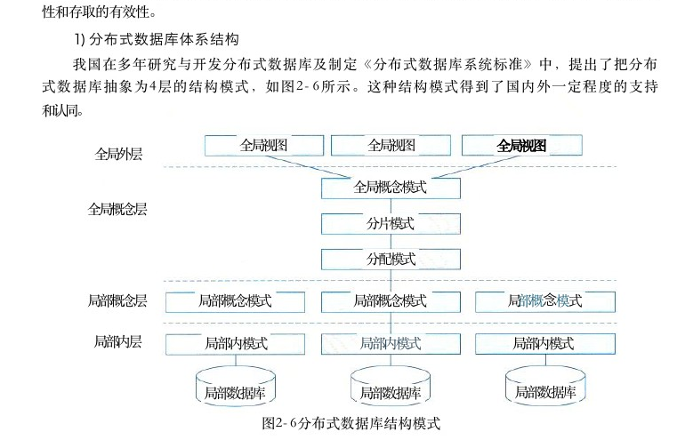
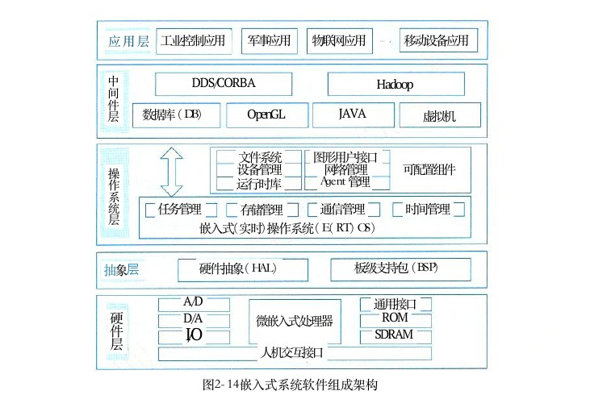
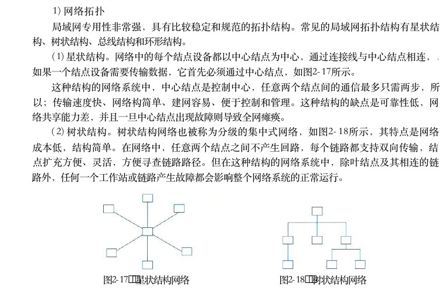
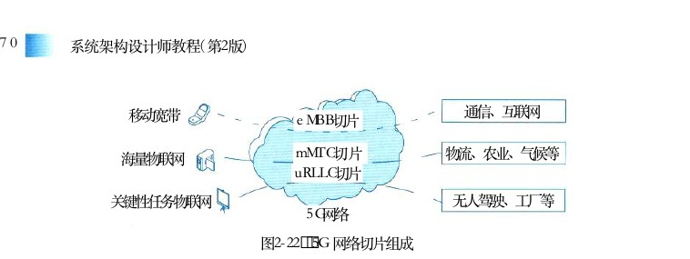
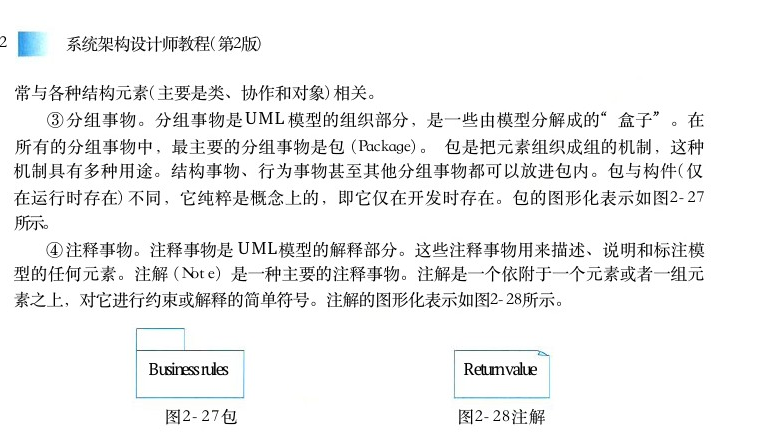
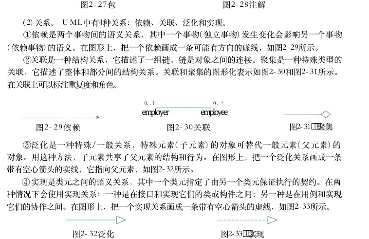

# 第2章 计算机系统基础知识

> 本页为教材原文文字提取版。图示已按 PDF 页面裁剪并插入正文图注前。

<!-- PDF 第 36 页 -->

## 2．1 计算机系统概述

计算机系统 （Computer System） 是指用于数据管运算单元中央处理器－理的计算机硬件、软件及网络组成的系统。它是按人控制单元的要求接收和存储信息，自动进行数据处理和计算，主存（内存）存储器并输出结果信息的机器系统。人们在谈及计算机系统外存时，一般指由硬件子系统和软件子系统组成的系统，键盘硬件简称为计算机。而将连接多个计算机以实现计算机间鼠标输入设备数据交换能力的网络设备，则称之为计算机网络，简称网络。计显示器算计算机系统可划分为硬件（子系统）和软件（子输出设备机系统）两部分。硬件由机械、电子元器件、磁介质和系统操作系统光介质等物理实体构成，例如处理器（含运算单元和系统软件编译工具控制单元）、存储器、输入设备和输出设备等。软件是一系列按照特定顺序组织的数据和指令，并控制硬软件办公软件件完成指定的功能。可将计算机软件进一步分为系统应用软件娱乐软件软件和应用软件，系统软件是指支持应用软件的运行，为用户开发应用软件提供平台支撑的软件，而应用软件是指计算机用户利用计算机的软、硬件资源为图2－1 典型计算机系统的组成某一专门的应用目的而开发的软件。典型的计算机系统组成如图2－1所示。从存在形式上看，计算机硬件是有形的，而软件是无形的；从计算机功能来看，硬件与软件的界限正在逐渐模糊。在不同的应用场合，基于设计考虑，某些功能可能由硬件实现，也可能由软件实现。比如，较典型的可编程逻辑，它在设计阶段可作为软件对待，但运行中则是以逻辑门的物理形态而存在。随着科技的发展，计算机系统的组成越来越复杂，多功能设备越来越多。计算机系统的分类维度很多，也较为复杂，可以从硬件的结构、性能、规模上划分，亦可从软件的构成、特征上划分，或者从系统的整体用途、服务对象等进行分类。这里结合计算机系统的构成特征、应用领域和用途等描述一种常见分类，如图2－2所示。由于篇幅限制，在图2－2所示的分类中，各结点的具体内容此处不再一一列举说明。由于技术的交叉和融合，同一设备可以具有多种特征，可以归属于不同的父分类，如电话手表、具备通信功能的平板电脑、具备路由功能的电视盒等，故该分类并没有严格的界限，仅能够从主体功能进行大致分类。

<!-- PDF 第 37 页 -->

基站网络交换电信设备移动终端视听设备家用电子设备厨卫电器可穿戴电子设备族入式计算机医疗设备交通设备计算国防设备机金融设备系统台式电脑个人计算机平板电脑云存储通用计算机网络服务器云计算超级计算机图2－2 ·种计算机系统的分类示意

## 2．2 计算机硬件

## 2．2．1计算机硬件组成

计算机组成结构 （Computer Architecture） 源于冯·诺依曼计算机结构，该结构成为现代计算机系统发展的基础。冯·诺依曼计算机结构将计算机硬件划分为5部分，但在现实的硬件构成中，控制单元和运算单元被集成为一体，封装为通常意义上的处理器（但处理器并不是只有上述两部分）；输入设备和输出设备则经常被设计者集成为一体，按照传输过程被划分为总线、接口和外部设备。下面按照处理器、存储器、总线、接口和外部设备进行阐述。

## 2．2．2处理器

处理器 （Central Processing Unit，CPU） 作为计算机系统运算和控制的核心部件，经历了长期演化过程。在位宽上由4位处理器发展到64位处理器；在能力构成上从仅具有运算和控制功能发展到集成多级缓存、多种通信总线和接口；在内核上从单核处理器发展为多核、异构多核和众核处理器等。处理器的指令集按照其复杂程度可分为复杂指令集 （Complex Instruction Set Computers，CISC） 与精简指令集 （Reduced Instruction Set Computers，RISC） 两类。 CISC 以Intel、AMD的x86CPU 为代表， RISC 以 ARM 和 Power为代表。随着研究的深入，除了由于历史原因而仍然存在的 CISC 结构外， RISC 已经成为计算机指令集发展的趋势，几乎所有后期出现的指令集

<!-- PDF 第 38 页 -->

均为 RISC 架构。典型的处理器系统结构如图2－3所示。

指令部件

寄存器组存取部件运算部件

Cache部件MMU部件完成部件

地址总线数据总线图2－3 典型的处理器体系结构示意图

在图2－3中，指令部件通过MMU － Cache 的存储结构，从内存等存储设备中取得相应的软件代码指令并完成译码和控制操作，控制存取部件从存储设备中取得新的数据，控制寄存器组为运算器准备有关寄存器数据，并准备好结果寄存器，控制整型、浮点、向量等运算部件开展运算。运算部件、寄存器单元、存取部件将执行结果通知完成部件，并在完成部件中完成结果的排队，由完成部件向指令部件反馈执行结果，控制指令的顺序执行、跳转等时序。随着微电子技术发展，用于专用目的处理器芯片不断涌现，常见的有图形处理器 （GraphicsProcessing Unit，GPU） 处理器、信号处理器 （Digital Signal Processor，DSP） 以及现场可编程逻辑门阵列 （Field Programmable Gate Array，FPGA） 等。 GPU 是一种特殊类型的处理器，具有数百或数千个内核，经过优化可并行运行大量计算，因此近些年在深度学习和机器学习领域得到了广泛应用。 DSP 专用于实时的数字信号处理，通过采用饱和算法处理溢出问题，通过乘积累加运算提高矩阵运算的效率，以及为傅里叶变换设计专用指令等方法，在各类高速信号采集的设备中得到广泛应用。随着我国国家政策的日益完善，国产处理器也呈现百花齐放的局面。在市场上占有率和知名度较高的包括龙芯、飞腾、申威、兆芯、国微、国芯、华睿、翔腾微和景嘉微等产品，各自在不同的行业领域中得到应用。

## 2．2．3存储器

存储器是利用半导体、磁、光等介质制成用于存储数据的电子设备。根据存储器的硬件结构可分为 SRAM 、 DRAM 、 NVRAM 、 Flash 、 EPROM 、 Disk等。计算机系统中的存储器通常采用分层的体系 （Memory Hierarchy） 结构，按照与处理器的物理距离可分为4个层次。

（1）片上缓存：在处理器核心中直接集成的缓存，一般为 SRAM 结构，实现数据的快速读取。它容量较小，一般为16kB￣512kB， 按照不同的设计可能划分为一级或二级。

（2）片外缓存：在处理器核心外的缓存，需要经过交换互联开关访问，一般也是由 SRAM构成，容量较片上缓存略大，可以为256kB￣4MB。 按照层级被称为 L2Cache 或 L3Cache， 或者

<!-- PDF 第 39 页 -->

称为平台 Cache（PlatformCache）。（ 3 ） 主存 （ 内存 ） ： 通常采用 DRAM 结构，以独立的部件／芯片存在，通过总线与处理器连接。 DRAM 依赖不断充电维持其中的数据，容量在数百 MB 至数十GB 之间。

（4）外存：可以是磁带、磁盘、光盘和各类 Flash等介质器件，这类设备访问速度慢，但容量大，且在掉电后能够保持其数据。不同的介质类型容量有所不同，如 Nor Flash 容量一般在MB 级别，磁盘容量则在 GB 和 TB 级别。外存能够在掉电后保持数据，但并非所有介质都能够永久性保存数据，每种介质都有一定的年限，如 Flash外存的维持数据的年限在10年左右，光盘年限在数年至数十年，磁盘年限在10年以上，磁带年限为30年以上。

## 2．2．4总线

总线 （Bus） 是指计算机部件间遵循某一特定协议实现数据交换的形式，即以一种特定格式按照规定的控制逻辑实现部件间的数据传输。按照总线在计算机中所处的位置划分为内总线、系统总线和外部总线。其中内总线用于各类芯片内部互连，也可称为片上总线 （On－Chip Bus） 或片内总线。系统总线是指计算机中CPU、 主存、 I／O 接口的总线，计算机发展为多总线结构后，系统总线的含义有所变化，狭义的系统总线仍为 CPU 与主存、通信桥连接的总线；广义上，还应包含计算机系统内，经由系统总线再次级联的总线，常被称为局部总线 （Local Bus）。 外部总线是计算机板和外部设备之间，或者计算机系统之间互联的总线，又称为通信总线。总线之间通过桥 （Bridge） 实现连接，它是一种特殊的外设，主要实现总线协议间的转换。总线的性能指标常见的有总线带宽、总线服务质量 QoS、 总线时延和总线抖动等。目前，计算机总线存在许多种类，常见的有并行总线和串行总线。并行总线主要包括PCI、PCle和 ATA （ IDE ） 等 ， 串行总线主要包括USB、SATA、CAN、RS－232、RS－485、RapidIO和以太网等。在一些专业领域中还定义了多种类型的总线，比如航空领域的 ARINC429、ARINC659、ARINC664 和 MIL－STD－1553B 等；工业控制领域的 CAN、IEEE1394、PCI、PCle和 VME等。

## 2．2．5接口

接口是指同一计算机不同功能层之间的通信规则。计算机接口有多种，常见的包括显示类接口 （ HDMI 、 DVI 和 DVI等 ） ， 音频输入输出类接口 （ TRS 、 RCA 、 XLR等 ） ， 网络类接口（RJ45、FC 等 ） ， PS／2 接口， USB 接口， SATA接口， LPT打印接口和 RS－232 接口等。此外，像离散量接口与 A ／ D 转换接口等这类接口一般属于非标准接口，而是随需求而设计。对于总线而言，一种总线可能存在多种接口，比如，以太网总线可以通过RJ－45 或同轴电缆与之连接， PCle 总线则具有多种形态的接口实现连接。

## 2．2．6外部设备

外部设备也称为外围设备，是计算机的非必要设备（但各类计算机必然会有一些）。现代计算机的外部设备种类日益丰富，包括所有的输入输出设备以及部分存储设备（即外存）。

<!-- PDF 第 40 页 -->

常见的外部设备包括键盘、鼠标、显示器、扫描仪、摄像头、麦克风、打印机、光驱、各型网卡和各型存储卡／盘等。在移动和穿戴设备中，常见的包括加速计、 GPS、 陀螺仪、感光设备和指纹识别设备等。在工业控制、航空航天和医疗等领域，还存在更多种类的外部设备，例如测温仪、测速仪、轨迹球、各型操作面板、红外／NFC 等感应设备、各种场强测量设备、功率驱动装置、各型机械臂、各型液压装置、油门杆和驾驶杆，等等。随着人们日益增长的物质需求，还会有更多形态各异、功能多样的外部设备产生。各型外部设备虽然种类多样，但都是通过接口实现与计算机主体的连接，并通过指令、数据实现预期的功能。

## 2．3计算机软件

早期的计算机软件和计算机程序 （Computer Program） 的概念几乎不加区别，后来计算机软件的概念在计算机程序的基础上得到了延伸。计算机软件是指计算机系统中的程序及其文档，是计算任务的处理对象和处理规则的描述。任何以计算机为处理工具的任务都是计算任务。处理对象是数据（如数字、文字、图形、图像和声音等，他们只是表示，而无含义）或信息（数据及有关的含义）。处理规则一般指处理的动作和步骤，文档是为了便于了解程序所需的阐述性资料。

## 2．3．1计算机软件概述

软件系统是指在计算机硬件系统上运行的程序、相关的文档资料和数据的集合。计算机软件用来扩充计算机系统的功能，提高计算机系统的效率。按照软件所起的作用和需要的运行环境的不同，通常将计算机软件分为系统软件和应用软件两大类。系统软件是为整个计算机系统配置的不依赖特定应用领域的通用软件。这些软件对计算机系统的硬件和软件资源进行控制和管理，并为用户使用和其他应用软件的运行提供服务。也就是说，只有在系统软件的作用下，计算机硬件才能协调工作，应用软件才能运行。根据系统软件功能的不同，可将其划分为：操作系统、程序设计语言翻译系统、数据库管理系统和网络软件等。应用软件是指为某类应用需要或解决某个特定问题而设计的软件，如图形图像处理软件、财务软件、游戏软件和各种软件包等。在企事业单位或机构中，应用软件发挥着巨大的作用，承担了许多计算任务，如人事管理、财务管理和图书管理等。按照应用软件使用面的不同，可进一步把应用软件分为专用的应用软件和通用的应用软件两类。

## 2．3．2操作系统

操作系统是计算机系统的资源管理者，它包含对系统软、硬件资源实施管理的一组程序，其首要作用就是通过 CPU 管理、存储管理、设备管理和文件管理对各种资源进行合理地分配，改善资源的共享和利用程度，最大限度地发挥计算机系统的工作效率，提高计算机系统在单位时间内处理工作的能力。操作系统是配置在计算机硬件上的第1层软件，它向下管理裸机及其中的文件，向上为其他的系统软件（汇编程序、编译程序、数据库管理系统等）和大量应用软

<!-- PDF 第 41 页 -->

件提供支持，以及为用户提供方便使用系统的接口。

## 1．操作系统的组成

操作系统是一种大型、复杂的软件产品，它们通常由操作系统内核 （Kernel） 和其他许多附加的配套软件所组成，包括图形用户界面程序、常用的应用程序（如日历、计算器、资源管理器和网络浏览器等）、实用程序（任务管理器、磁盘清理程序、杀毒软件和防火墙等）以及为支持应用软件开发和运行的各种软件构件（如应用框架、编译器和程序库等）。操作系统内核指的是能提供进程管理（任务管理）、存储管理、文件管理和设备管理等功能的那些软件模块，它们是操作系统中最基本的部分，用于为众多应用程序访问计算机硬件提供服务。由于应用程序直接对硬件操作非常复杂，所以操作系统内核对硬件设备进行了抽象，为应用软件提供了一套简洁、统一的接口（称为系统调用接口或应用程序接口API）。 内核通常都驻留在内存中，它以 CPU 的最高优先级运行，能执行指令系统中的特权指令，具有直接访问各种外设和全部主存空间的特权，负责对系统资源进行管理和分配。

## 2．操作系统的作用

操作系统主要有以下3个方面的重要作用。

（1）管理计算机中运行的程序和分配各种软硬件资源。计算机中一般总有多个程序在运行，这些程序在运行时都可能要求使用系统中的资源（如访问硬盘，在屏幕上显示信息等），此时操作系统就承担着资源的调度和分配任务，以避免冲突，保证程序正常有序地运行。操作系统的资源管理功能主要包括处理器管理、存储管理、文件管理、 I／O 设备管理等几个方面。

（2）为用户提供友善的人机界面。人机界面的任务是实现用户与计算机之间的通信（对话）。几乎所有操作系统都向用户提供图形用户界面 （GUI）， 它通过多个窗口分别显示正在运行的各个程序的状态，采用图标 （Icon） 来形象地表示系统中的文件、程序和设备等对象，用户借助单击“菜单”的方法来选择要求系统执行的命令或输入某个参数，利用鼠标器或触摸屏控制屏幕光标的移动，并通过单击操作以启动某个操作命令的执行，甚至还可以采用拖放方式执行所需要的操作。这些措施使用户能够比较直观、灵活、有效地使用计算机。

（3）为应用程序的开发和运行提供一个高效率的平台。安装了操作系统之后，实际上呈现在应用程序和用户面前的是一台“虚拟计算机”。操作系统屏蔽了几乎所有物理设备的技术细节，它以规范、高效的方式（例如系统调用、库函数等）向应用程序提供了有力的支持，从而为开发和运行其他系统软件及各种应用软件提供了一个平台。除了上述3个方面的作用之外，操作系统还具有辅导用户操作（帮助功能）、处理软硬件错误、监控系统性能、保护系统安全等许多作用。总之，有了操作系统，计算机才能成为一个高效、可靠、通用的数据处理系统。

## 3．操作系统的特征

## 1 ） 并发性

在多道程序环境下，并发性是指在一段时间内，宏观上有多个程序同时运行，但实际上在单 CPU的运行环境，每一个时刻只有一个程序在执行。因此，从微观上来说，各个程序是交

<!-- PDF 第 42 页 -->

替、轮流执行的，如果计算机系统中有多个 CPU ， 则可将多个程序分配到不同 CPU上实现并行运行。

## 2）共享性

共享是指操作系统中的资源（包括硬件资源和信息资源）可以被多个并发执行的进程（线程）共同使用，而不是被一个进程所独占。出于经济上的考虑，一次性向每个用户程序分别提供它所需的全部资源不但是浪费的，有时也是不可能的。现实的方法是让操作系统和多个用户程序共用一套计算机系统的所有资源，因此必然会产生共享资源的需要。共享资源的方式可以分为同时共享和互斥共享。

## 3 ） 虚拟性

虚拟性是指操作系统中的一种管理技术，它是把物理上的一个实体变成逻辑上的多个对应物，或把物理上的多个实体变成逻辑上的一个对应物的技术。前者是实际存在的，而后者是虚构假想的，是用户感觉上的东西。采用虚拟技术的目的是为用户提供易于使用且方便高效的操作环境。

## 4）不确定性

在多道程序环境中，允许多个进程并发执行，但由于资源有限，在多数情况下进程的执行不是一贯到底的，而是“走走停停”。例如一个进程，在 CPU 上运行一段时间后，由于等待资源或某事件发生，它被暂停执行，将CPU 转让给另一个进程执行。系统中的进程何时执行，何时暂停，以什么样的速度向前推进，进程总共要花多少时间执行才能完成，这些都是不可预知的。或者说该进程是以不确定的方式运行的，其导致的直接后果是程序执行结果可能不唯一。

## 4．操作系统的分类

通常，操作系统可分为批处理操作系统、分时操作系统、实时操作系统、网络操作系统、分布式操作系统、微型计算机操作系统和嵌入式操作系统等类型。

## 1）批处理操作系统

批处理操作系统分为单道批处理和多道批处理。单道批处理操作系统是一种早期的操作系统，用户可以向系统提交多个作业，“单道”的含义是指一次只有一个作业装入内存执行。作业由用户程序、数据和作业说明书（作业控制语言）3个部分组成。当一个作业运行结束后，随即自动调入同批的下一个作业，从而节省了作业之间的人工干预时间，提高了资源的利用率。多道批处理操作系统允许多个作业装入内存执行，在任意一个时刻，作业都处于开始点和终止点之间。每当运行中的一个作业由于输入／输出操作需要调用外部设备时，就把 CPU 交给另一个等待运行的作业，从而将主机与外部设备的工作由串行改变为并行，进一步避免了因主机等待外设完成任务而浪费宝贵的 CPU 时间。多道批处理系统主要有3个特点：多道、宏观上并行运行和微观上串行运行。

## 2）分时操作系统

在分时操作系统中，一个计算机系统与多个终端设备连接。分时操作系统是将CPU 的工作

<!-- PDF 第 43 页 -->

时间划分为许多很短的时间片，轮流为各个终端的用户服务。例如，一个带20个终端的分时系统，若每个用户每次分配一个50ms 的时间片，则每隔 ls 即可为所有的用户服务一遍。因此，尽管各个终端上的作业是断续运行的，但由于操作系统每次对用户程序都能做出及时响应，因此用户感觉整个系统均归其一人占用。分时系统主要有4个特点：多路性、独立性、交互性和及时性。

## 3）实时操作系统

实时是指计算机对于外来信息能够以足够快的速度进行处理，并在被控对象允许的时间范围内做出快速反应。实时系统对交互能力要求不高，但要求可靠性有保障。实时系统分为实时控制系统和实时信息处理系统。实时控制系统主要用于生产过程的自动控制，例如数据自动采集、武器控制、火炮自动控制、飞机自动驾驶和导弹的制导系统等。实时信息处理系统主要用于实时信息处理，例如飞机订票系统、情报检索系统等。

## 4）网络操作系统

网络操作系统是使联网计算机能方便而有效地共享网络资源，为网络用户提供各种服务的软件和有关协议的集合。因此，网络操作系统的功能主要包括高效、可靠的网络通信；对网络中共享资源（在 LAN 中有硬盘、打印机等）的有效管理；提供电子邮件、文件传输、共享硬盘和打印机等服务；网络安全管理；提供互操作能力。一个典型的网络操作系统的特征包括硬件独立性和多用户支持等。其中，硬件独立性是指网络操作系统可以运行在不同的网络硬件上，可以通过网桥或路由器与其他网络连接；多用户支持，应能同时支持多个用户对网络的访问，应对信息资源提供完全的安全和保护功能；支持网络实用程序及其管理功能，如系统备份、安全管理、容错和性能控制；多种客户端支持；提供目录服务，以单一逻辑的方式让用户访问位于世界范围内的所有网络服务和资源的技术；支持多种增值服务，如文件服务、打印服务、通信服务和数据库服务等。

## 5）分布式操作系统

分布式计算机系统是由多个分散的计算机经连接而成的计算机系统，系统中的计算机无主、次之分，任意两台计算机可以通过通信交换信息。通常，为分布式计算机系统配置的操作系统称为分布式操作系统。分布式操作系统能直接对系统中的各类资源进行动态分配和调度、任务划分、信息传输协调工作，并为用户提供一个统一的界面与标准的接口，用户通过这一界面实现所需要的操作和使用系统资源，使系统中若干台计算机相互协作完成共同的任务，有效地控制和协调诸任务的并行执行。分布式操作系统是网络操作系统的更高级形式，它保持网络系统所拥有的全部功能，同时又有透明性、可靠性和高性能等特性。

## 6）微型计算机操作系统

微型计算机操作系统简称微机操作系统，常用的有 Windows、Mac OS、Linux。

## 7）嵌入式操作系统

嵌入式操作系统运行在嵌入式智能设备环境中，对整个智能硬件以及它所操作、控制的各

<!-- PDF 第 44 页 -->

种部件装置等资源进行统一协调、处理、指挥和控制，其主要特点如下。

● 微型化：从性能和成本角度考虑，希望占用的资源和系统代码量少，如内存少、字长短、运行速度有限、能源少（用微小型电池）。

● 可定制：从减少成本和缩短研发周期考虑，要求嵌入式操作系统能运行在不同的微处理器平台上，能针对硬件变化进行结构与功能上的配置，以满足不同应用需要。

● 实时性：嵌入式操作系统主要应用于过程控制、数据采集、传输通信、多媒体信息及关键要害领域需要迅速响应的场合，所以对实时性要求较高。

● 可靠性：系统构件、模块和体系结构必须达到应有的可靠性，对关键要害应用还要提供容错和防故障措施。

● 易移植性：为了提高系统的易移植性，通常采用硬件抽象层(Hardware AbstractionLevel，HAL） 和板级支撑包 （Board Support Package，BSP） 的底层设计技术。常见的嵌入式实时操作系统有 VxWorks、μClinux、PalmOS、WindowsCE、μC／OS－ⅡI 和eCos 等。

## 2．3．3数据库

在信息处理领域，由于数据量庞大，如何有效组织、存储数据对实现高效率的信息处理至关重要。数据库技术是目前最有效的数据管理技术。数据库 （DataBase，DB） 是指长期存储在计算机内、有组织的、统一管理的相关数据的集合。它不仅描述事物的数据本身，而且还包括相关事物之间的联系。数据库可以直观地理解为存放数据的仓库，只不过这个仓库是在计算机的存储设备上，而且数据是按一定格式存放的，具有较小的冗余度、较高的数据独立性和易扩展性，可为多个用户共享。早期数据库种类有3种，分别是层次式数据库、网络式数据库和关系型数据库。目前最常见的数据库种类是关系型数据库和非关系型数据库。根据数据库存储体系分类，还可分为关系型数据库、键值 （Key－Value） 数据库、列存储数据库、文档数据库和搜索引擎数据库等类型。

（1）关系型数据库。这种类型的数据库是最传统的数据库类型，关系型数据库模型是把复杂的数据结构归结为简单的二元关系，在数据库中，对数据的操作几乎全部建立在一个或多个关系表格上。在大型系统中通常有多个表，且表之间有各种关系。实际使用就是通过对这些关联的表格进行分类、合并、连接或选取等运算来实现数据库的管理。

（2）键值数据库。键值数据库是一种非关系型数据库，它使用简单的键值方法来存储数据。键值数据库将数据存储为键值对集合，其中键作为唯一标识符。

（3）列存储数据库。列式存储 （Column－Based） 是相对于传统关系型数据库的行式存储（Row－Basedstorage） 来说的。简单来说两者的区别就是对表中数据的存储形式的差异。

（4）文档数据库。此类数据库可存放并获取文档，可以是XML 、 JSON 、 BSON 等格式，这些文档具备可述性 （Self－Describing）， 呈现分层的树状结构 （Hicrarchical Tree Data Structure），可以包含映射表、集合和纯量值。数据库中的文档彼此相似，但不必完全相同。文档数据库所存放的文档，就相当于键值数据库所存放的“值”。文档数据库可视为其值可查的键值数据库。

<!-- PDF 第 45 页 -->

（5）搜索引擎数据库。搜索引擎数据库是应用在搜索引擎领域的数据存储形式，由于搜索引擎会爬取大量的数据，并以特定的格式进行存储，这样在检索的时候才能保证性能最优。下面简要介绍常用的关系数据库和分布式数据库。

## 1．关系数据库

数据模型是数据特征的抽象，它是对数据库组织方式的一种模型化表示，是数据库系统的核心与基础。它具有数据结构、数据操作和完整性约束条件三要素。关系可以理解为二维表。一个关系模型就是指用若干关系表示实体及其联系，用二维表的形式存储数据。例如，对某高校学生的选课（不同年级甚至同一年级学生所选课程可以不同）进行管理，可以用二维表表示，如图2－4所示。

姓名系别学号年龄学号课程号分数许文秀电信系S1 S1C2赵国兴计算机系S2 S1C4计算机系周新娥S3 S2 Cl电信系刘德峰S4 S2C29 0（a） 学生关系S2C37 6S39 1Cl课程号课程名学分C2 S392计算机导论C12 ． 0C3 S3C ＋ ＋程序设计8 4C2

## 3 ． 0

数据库原理及应用C3S4C1

## 3．58

数字信号处理C43 ． 0S4 C47 6（b） 课程关系（c） 选课关系图2－4二维表表示

用关系表示如下，其中带下画线的属性为主码，主码能唯一确定某个实体，如学号能唯一确定某个学生。学生（学号，姓名，年龄，系别）课程（课程号，课程名，学分）选课（学号，课程号，分数）

## 1）关系数据库设计的特点及方法

数据库设计是指对于一个给定的应用环境构造最优的数据库，建立数据库及其应用系统，使之能有效地存储数据，满足各种用户的需求。数据库设计包括结构特性和行为特性的设计两方面的内容。数据库设计的很多阶段都可以和软件工程的各阶段对应起来，数据库设计的特点有：从数据结构即数据模型开始，并以数据模型为核心展开，这是数据库设计的一个主要特点；静态结构设计与动态行为设计分离；试探性；反复性和多步性。目前已有的数据库设计方法可分为4类，即直观设计法、规范设计法、计算机辅助设计法

<!-- PDF 第 46 页 -->

和自动化设计法。常用的有基于3NF 的设计方法、基于实体联系 （E－R） 模型的数据库设计方法、基于视图概念的数据库设计方法、面向对象的关系数据库设计方法、计算机辅助数据库设计方法、敏捷数据库设计方法等。

## 2）关系数据库设计的基本步骤

数据库设计分为需求分析、概念结构设计、逻辑结构设计、物理结构设计、应用程序设计和运行维护6个阶段，如图2－5所示。

当前和未来应用的数据处理要求数据要求需求分析需求说明书概念结构设计用户的数据模式（即与DBMS无关的概念模型）转换规则、规范化理论，逻辑结构设计

视图、概念模式及应用处理说明书DBMS特性物理结构设计硬件、OS特性图2－5 数据库的设计步骤

需求分析阶段的任务是对现实世界要处理的对象（组织、部门和企业等）进行详细调查，在了解现行系统的概况和确定新系统功能的过程中，收集支持系统目标的基础数据及其处理方法。需求分析是在用户调查的基础上，通过分析逐步明确用户对系统的需求，包括数据需求和围绕这些数据的业务处理需求。数据库概念结构设计是在需求分析的基础上，依照需求分析中的信息需求，对用户信息加以分类、聚集和概括，建立信息模型，并依照选定的数据库管理系统软件，把它们转换为数据的逻辑结构，再依照软硬件环境，最终实现数据的合理存储。这一过程也称为数据建模。设计数据库概念模型的最著名、最常用的方法是 E － R 方法。采用E － R方法的数据库概念结构设计可分为三步：设计局部 E － R 模型、设计全局 E － R 模型以及全局 E － R 模型的优化。逻辑结构设计是在概念结构设计基础上进行的数据模型设计，可以是层次、网状模型和关系模型。逻辑结构设计阶段的主要任务是确定数据模型，将 E － R 图转换为指定的数据模型，确定完整性约束，确定用户视图。数据库在物理设备上的存储结构与存取方法称为数据库的物理结构。数据库的物理结构设计是对已确定的数据库逻辑结构，利用 DBMS所提供的方法、技术，以较优的存储结构和数据存取路径、合理的数据存放位置以及存储分配，设计出一个高效的、可实现的数据库物理结构。数据库应用系统开发是 DBMS 的二次开发，一方面是对用户信息的存储；另一方面就是对

<!-- PDF 第 47 页 -->

用户处理要求的实现。数据库应用程序设计要做的工作有选择设计方法、制订开发计划、选择系统架构和设计安全性策略。在应用程序设计阶段，设计方法有结构化设计方法和面向对象设计方法两种。安全性策略主要是指硬件平台、操作系统、数据库系统、网络及应用系统的安全。数据库的正常运行和优化也是数据库设计的内容之一。在数据库运行维护阶段要做的工作主要有数据库的转储和恢复，数据库的安全性和完整性控制，数据库性能的监督、分析和改造，数据库的重组和重构等。

## 2．分布式数据库

分布式数据库系统 （Distributed DataBase System，DDBS） 是针对地理上分散，而管理上又需要不同程度集中管理的需求而提出的一种数据管理信息系统。满足分布性、逻辑相关性、场地透明性和场地自治性的数据库系统被称为完全分布式数据库系统。分布式数据库系统的特点是数据的集中控制性、数据独立性、数据冗余可控性、场地自治性和存取的有效性。

## 1）分布式数据库体系结构

我国在多年研究与开发分布式数据库及制定《分布式数据库系统标准》中，提出了把分布式数据库抽象为4层的结构模式，如图2－6所示。这种结构模式得到了国内外一定程度的支持和认同。

全局视图全局视图全局视图全局外层

全局概念模式全局概念层分片模式

分配模式

局部概念层局部概念模式局部概念模式局部概念模式

局部内层局部内模式局部内模式局部内模式

局部数据库局部数据库局部数据库

图2－6分布式数据库结构模式

4层模式划分为全局外层、全局概念层、局部概念层和局部内层，在各层间还有相应的层间映射。这种4层模式适用于同构型分布式数据库系统，也适用于异构型分布式数据库系统。

## 2）分布式数据库的应用

分布式数据库的应用领域有分布式计算、 Internet应用、数据仓库、数据复制以及全球联网查询等， Sybase 公司的 Replication Server 即是一种典型的分布式数据库系统。

<!-- PDF 第 48 页 -->

## 3．常用数据库管理系统

计算机科学技术不断发展，数据库管理系统也不断发展进化， MySQLAB 公司（2009年被Oracle 公司收购 ） 的 MySQL、Microsoft 公司的 Access 等是小型关系数据库管理系统的代表，Oracle 公司的 Oracle、Microsoft 公司的 SQL Server、IBM 公司的 DB 2 等是功能强大的大型关系数据库管理系统的代表。

## 1)Oracle

Oracle 是一种适用于大型、中型和微型计算机的关系数据库管理系统。 Oracle 的结构包括数据库的内部结构、外存储结构、内存储结构和进程结构。在 Oracle 中，数据库不仅指物理上的数据，还包括处理这些数据的程序，即 DBMS本身。 Oracle使用PL／SQL（ProceduralLanguage／SQL） 语言执行各种操作。 Oracle 除了以关系格式存储数据外， Oracle 8 以上的版本还支持面向对象的结构（如抽象数据类型）。Oracle 产品主要包括数据库服务器、开发工具和连接产品三类。 Oracle 还提供了一系列的工具产品，如逻辑备份工具 Export、Import等。

## 2)IBM DB2

DB 2 是 IBM 的一种分布式数据库解决方案。简单地说， DB 2就是 IBM 开发的一种大型关系型数据库平台，它支持多用户或应用程序在同一条 SQL 语句中查询不同 Database 甚至不同DBMS 中的数据。DB 2 核心数据库的特色有支持面向对象编程，支持多媒体应用程序，支持备份和恢复功能，支持存储过程和触发器，支持SQL 查询，支持异构分布式数据库访问，支持数据复制。DB 2 采用多进程多线索体系结构，可运行于多种操作系统之上。 IBM还提供了Visualizer、Visualage、Visualgen 等开发工具。

## 3)Sybase

Sybase 是美国 SYBASE 公司在20世纪80年代中期推出的客户机／服务器 （Client／Server，C／S） 结构的关系数据库系统，也是世界上第一个真正的基于客户机／服务器结构的 RDBMS 产品。Sybase 数据库主要由三部分组成：进行数据库管理和维护的联机关系数据库管理系统 Sybase SQL Server，支持数据库应用系统建立与开发的一组前端工具 Sybase SQL Toolset，可把异构环境下其他厂商的应用软件和任何类型的数据连接在一起的接口 Sybase OpenClient／OpenServer。Sybase 提供了 Sybase Adaptive Server Enterprise 高性能企业智能型关系数据库管理系统、EAServer 电子商务解决方案应用服务器、系统分析设计工具 PowerDesigner 和应用开发工具 PowerBuilder。

## 4)Microsoft SQL Server

Microsoft SQL Server是一种典型的关系型数据库管理系统，可运行于多个操作系统上，它使用 Transact－SQL 语言完成数据操作。

<!-- PDF 第 49 页 -->

SQL Server 的基本服务器组件包括 Open Data Services、MS SQL Server、SQL Server Agent和 MSDTC（Microsoft Distributed Transaction Coordinator）。SQL Server 数据平台包括以下工具：关系型数据库、复制服务、通知服务、集成服务、分析服务、报表服务、管理工具和开发工具。

## 4．大型数据库管理系统的特点

大型数据库管理系统主要有如下7个特点。

（1）基于网络环境的数据库管理系统。可以用于C／S 结构的数据库应用系统，也可以用于B／S 结构的数据库应用系统。

（2）支持大规模的应用。可支持数千个并发用户、多达上百万的事务处理和超过数百 GB的数据容量。

（3）提供的自动锁功能使得并发用户可以安全而高效地访问数据。

（4）可以保证系统的高度安全性。

（5）提供方便而灵活的数据备份和恢复方法及设备镜像功能，还可以利用操作系统提供容错功能，确保设计良好的应用中的数据在发生意外的情况下可以最大限度地被恢复。

（6）提供多种维护数据完整性的手段。

（7）提供了方便易用的分布式处理功能。

## 2．3．4文件系统

## 1．文件与文件系统

文件 （File） 是具有符号名的、在逻辑上具有完整意义的一组相关信息项的集合，例如，一个源程序、一个目标程序、编译程序、一批待加工的数据和各种文档等都可以各自组成一个文件。文件是一种抽象机制，它隐藏了硬件和实现细节，提供了将信息保存在外存上而且便于以后读取的手段，使用户不必了解信息存储的方法、位置以及存储设备实际操作方式便可存取信息。一个文件包括文件体和文件说明。文件体是文件真实的内容；文件说明是操作系统为了管理文件所用到的信息，包括文件名、文件内部标识、文件类型、文件存储地址、文件长度、访问权限、建立时间和访问时间等。文件系统是操作系统中实现文件统一管理的一组软件和相关数据的集合，是专门负责管理和存取文件信息的软件机构。文件系统的功能包括按名存取，即用户可以“按名存取”，而不是“按地址存取”；统一的用户接口，在不同设备上提供同样的接口，方便用户操作和编程；并发访问和控制，在多道程序系统中支持对文件的并发访问和控制；安全性控制，在多用户系统中的不同用户对同一文件可有不同的访问权限；优化性能，采用相关技术提高系统对文件的存储效率、检索和读／写性能；差错恢复，能够验证文件的正确性，并具有一定的差错恢复能力。

## 2．文件的类型

（1）按文件的性质和用途分类可将文件分为系统文件、库文件和用户文件。

（2）按信息保存期限分类可将文件分为临时文件、档案文件和永久文件。

<!-- PDF 第 50 页 -->

（3）按文件的保护方式分类可将文件分为只读文件、读／写文件、可执行文件和不保护文件。（ 4 ） UNIX系统将文件分为普通文件、目录文件和设备文件（特殊文件）。目前常用的文件系统类型有 FAT、VFAT、NTFS、Ext2 和 HPFS 等。文件分类的目的是对不同文件进行管理，提高系统效率，提高用户界面友好性。当然，根据文件的存取方法和物理结构的不同，还可以将文件分为不同的类型。

## 3．文件的结构和组织

文件的结构是指文件的组织形式。从用户角度看到的文件组织形式称为文件的逻辑结构，文件系统的用户只要知道所需文件的文件名就可以存取文件中的信息，而无须知道这些文件究竟存放在什么地方。从实现的角度看，文件在文件存储器上的存放方式称为文件的物理结构。

## 1）文件的逻辑结构

文件的逻辑结构可分为两大类：一是有结构的记录式文件，它是由一个以上的记录构成的文件；二是无结构的流式文件，它是由一串顺序字符流构成的文件。在记录式文件中，所有的记录通常都是描述一个实体集的，有着相同或不同数目的数据项，记录的长度可分为定长（指文件中所有记录的长度相同）和不定长（指文件中各记录的长度不相同）两类。无结构的流式文件的文件体为字节流，不划分记录。无结构的流式文件通常采用顺序访问方式，并且每次读／写访问可以指定任意数据长度，其长度以字节为单位。对于流式文件的访问，是利用读／写指针指出下一个要访问的字符。可以把流式文件看作是记录式文件的一个特例。

## 2）文件的物理结构

文件的物理结构是指文件的内部组织形式，即文件在物理存储设备上的存放方法。由于文件的物理结构决定了文件在存储设备上的存放位置，所以文件的逻辑块号到物理块号的转换也是由文件的物理结构决定的。根据用户和系统管理上的需要，可采用多种方法来组织文件，下面介绍几种常见的文件物理结构。

（1）连续结构。连续结构也称顺序结构，它将逻辑上连续的文件信息（如记录）依次存放在连续编号的物理块上。只要知道文件的起始物理块号和文件的长度，就可以很方便地进行文件的存取。

（2）链接结构。链接结构也称串联结构，它是将逻辑上连续的文件信息（如记录）存放在不连续的物理块上，每个物理块设有一个指针指向下一个物理块。因此，只要知道文件的第1个物理块号，就可以按链指针查找整个文件。

（3）索引结构。在采用索引结构时，将逻辑上连续的文件信息（如记录）存放在不连续的物理块中，系统为每个文件建立一张索引表。索引表记录了文件信息所在的逻辑块号对应的物理块号，并将索引表的起始地址放在与文件对应的文件目录项中。

<!-- PDF 第 51 页 -->

（4）多个物理块的索引表。索引表是在文件创建时由系统自动建立的，并与文件一起存放在同一文件卷上。根据一个文件大小的不同，其索引表占用物理块的个数不等，一般占一个或几个物理块。多个物理块的索引表可以有两种组织方式：链接文件和多重索引方式。

## 4．文件存取的方法和存储空间的管理

## 1）文件的存取方法

文件的存取方法是指读／写文件存储器上的一个物理块的方法。通常有顺序存取和随机存取两种方法。顺序存取方法是指对文件中的信息按顺序依次进行读／写；随机存取方法是指对文件中的信息可以按任意的次序随机地读／写。

## 2）文件存储空间的管理

要将文件保存到外部存储器（简称外存或辅存）上，首先必须知道存储空间的使用情况，即哪些物理块是被“占用”的，哪些是“空闲”的。特别是对大容量的磁盘存储空间被多用户共享时，用户执行程序经常要在磁盘上存储文件和删除文件，因此，文件系统必须对磁盘空间进行管理。外存空闲空间管理的数据结构通常称为磁盘分配表 （Disk Allocation Table）。 常用的空闲空间管理方法有空闲区表、位示图和空闲块链3种。

（1）空闲区表。将外存空间上的一个连续的未分配区域称为“空闲区”。操作系统为磁盘外存上的所有空闲区建立一张空闲表，每个表项对应一个空闲区，空闲表中包含序号、空闲区的第1块号、空闲块的块数和状态等信息，如表2－1所示。它适用于连续文件结构。表2－1 空闲区表

第1个空闲块号空闲块数状态序号可用可用可用未用

（2）位示图。这种方法是在外存上建立一第0字· …张位示图 （Bitmap）， 记录文件存储器的使用第1字＋情况。每一位对应文件存储器上的一个物理块，第2字· ·取值0和1分别表示空闲和占用。例如，某文1第3字件存储器上位示图的大小为n ， 物理块依次编一·…·号为 0 ， 1 ， 2 ， … 。 假如计算机系统中字长为… … · …

## 32位，那么在位示图中的第0个字（逻辑编号）

第n－1字

## 1…

对应文件存储器上的0，1，2，…，31号物理块；图2－7位示图例第1个字对应文件存储器上的32，33，34，…，63号物理块，依此类推，如图2－7所示。

<!-- PDF 第 52 页 -->

这种方法的主要特点是位示图的大小由磁盘空间的大小（物理块总数）决定，位示图的描述能力强，适合各种物理结构。

（3）空闲块链。每个空闲物理块中有指向下一个空闲物理块的指针，所有空闲物理块构成一个链表，链表的头指针放在文件存储器的特定位置上（如管理块中），不需要磁盘分配表，节省空间。每次申请空闲物理块只需根据链表的头指针取出第1个空闲物理块，根据第一个空闲物理块的指针可找到第2个空闲物理块，依此类推。

（4）成组链接法。 UNIX 系统采用该方法。例如，在实现时系统将空闲块分成若干组，每100个空闲块为一组，每组的第1个空闲块登记了下一组空闲块的物理盘块号和空闲块总数。假如某个组的第1个空闲块号等于0，意味着该组是最后一组，无下一组空闲块。

## 5．文件共享和保护

## 1）文件的共享

文件共享是指不同用户进程使用同一文件，它不仅是不同用户完成同一任务所必须的功能，还可以节省大量的主存空间，减少由于文件复制而增加的访问外存次数。文件共享有多种形式，采用文件名和文件说明分离的目录结构有利于实现文件共享。常见的文件链接有硬链接和符号链接两种。

（1）硬链接。文件的硬链接是指两个文件目录表目指向同一个索引结点的链接，该链接也称基于索引结点的链接。换句话说，硬链接是指不同文件名与同一个文件实体的链接。文件硬链接不利于文件主删除它拥有的文件，因为文件主要删除它拥有的共享文件，必须首先删除（关闭）所有的硬链接，否则就会造成共享该文件的用户的目录表目指针悬空。

（2）符号链接。符号链接建立新的文件或目录，并与原来文件或目录的路径名进行映射，当访问一个符号链接时，系统通过该映射找到原文件的路径，并对其进行访问。采用符号链接可以跨越文件系统，甚至可以通过计算机网络连接到世界上任何地方的机器中的文件，此时只须提供该文件所在的地址以及在该机器中的文件路径。

## 2）文件的保护

文件系统对文件的保护常采用存取控制的方式进行。所谓存取控制，就是规定不同的用户对文件的访问有不同的权限，以防止文件被未经文件主同意的用户访问。

（1）存取控制矩阵。理论上，存取控制的方法可用存取控制矩阵实现，它是一个二维矩阵，一维列出计算机的全部用户，另一维列出系统中的全部文件，矩阵中的每个元素A，表示第 i个用户对第j 个文件的存取权限。通常，存取权限有可读 R、 可写 W、 可执行 X 以及它们的组合，如表2－2所示。表2－2 存取控制矩阵

文件ALPHABETAREPORT SQRT用户张军RWXR-X王伟RWXR-X R-X

<!-- PDF 第 53 页 -->

（续表）文件ALPHABETAREPORT SQRT用户赵凌RWX李晓钢R-XRWXR-X

（2）存取控制表。存取控制矩阵由于太大往往无法实现。一个改进的办法是按用户对文件的访问权力的差别对用户进行分类，由于某一文件往往只与少数几个用户有关，所以这种分类方法可使存取控制表简化。 UNIX系统就是使用了这种存取控制表方法，它把用户分成三类：文件主、同组用户和其他用户，每类用户的存取权限为可读、可写、可执行以及它们的组合。

（3）用户权限表。改进存取控制矩阵的另一种方法是以用户或用户组为单位将用户可存取的文件集中起来存入表中，这称为用户权限表。表中的每个表目表示该用户对应文件的存取权限，这相当于存取控制矩阵一行的简化。

（4）密码。在创建文件时，由用户提供一个密码，在文件存入磁盘时用该密码对文件的内容加密。在进行读取操作时，要对文件进行解密，只有知道密码的用户才能读取文件。

## 2．3．5网络协议

在计算机网络中要实现资源共享以及信息交换，必须实现不同系统中实体的通信。两个实体要想成功通信，它们必须具有相同的语言，在计算机网络中称为协议（或规程）。所谓协议，指的是网络中的计算机与计算机进行通信时，为了能够实现数据的正常发送与接收必须要遵循的一些事先约定好的规则（标准或约定），在这些规程中明确规定了通信时的数据格式、数据传送时序以及相应的控制信息和应答信号等内容。常用的网络协议包括局域网协议 （LAN）、 广域网协议 （WAN）、 无线网协议和移动网协议。互联网使是 TCP／IP 协议簇。

## 2．3．6中间件

由于应用软件是在系统软件基础上开发和运行的，而系统软件又有多种，如果每种应用软件都要提供能在不同系统上运行的版本，开发成本将大大增加。因而出现了一类称为“中间件”（Middleware） 的软件，它们作为应用软件与各种操作系统之间使用的标准化编程接口和协议，可以起承上启下的作用，使应用软件的开发相对应用应用独立于计算机硬件和操作系统，并能在不同的系中间件（分布式系统服务）统上运行，实现相同的应用功能。中间件是基础软件的一大类，属于可复用软件的范畴。顾名思操作系统操作系统义，中间件处在操作系统、网络和数据库之上，网络、数据库应用软件的下层，如图2－8所示。也有人认为中间图2－8 中间件图示件应该属于操作系统中的一部分。

<!-- PDF 第 54 页 -->

## 1．中间件分类

按照中间件在分布式系统中承担的职责不同，可以划分以下几类中间件产品。

## 1）通信处理（消息）中间件

正如，人们通过安装红绿灯，设立交通管理机构，制定出交通规则，才能保证道路交通畅通一样，在分布式系统中，人们要建网和制定出通信协议，以保证系统能在不同平台之间通信，实现分布式系统中可靠的、高效的、实时的跨平台数据传输，这类中间件称为消息中间件，也是市面上销售额最大的中间件产品，目前主要产品有 BEA的 eLink、IBM 的 MQSeries、TongLINK 等。实际上，一般的网络操作系统如Windows 已包含了其部分功能。

## 2）事务处理（交易）中间件

正如城市交通中要运行各种运载汽车，以此来完成日常的运载工作，同时随时监视汽车的运行，在出现故障时及时排堵保畅。在分布式事务处理系统中，经常要处理大量事务，特别是OLTP 中，每项事务常常要多台服务器上的程序按顺序协调完成，一旦中间发生某种故障，不但要完成恢复工作，而且要自动切换系统保证系统永不停机，实现高可靠性运行。要使大量事务在多台应用服务器上能实时并发运行，并进行负载平衡的调度，实现与昂贵的可靠性机和大型计算机系统的同等功能，为了实现这个目标，要求中间件系统具有监视和调度整个系统的功能。BEA 的 Tuxedo 由此而闻名，它成为增长率最高的厂商。

## 3）数据存取管理中间件

在分布式系统中，重要的数据都集中存放在数据服务器中，它们可以是关系型的、复合文档型、具有各种存放格式的多媒体型，或者是经过加密或压缩存放的，该中间件将为在网络上虚拟缓冲存取、格式转换、解压等带来方便。

## 4 ） Web 服务器中间件

浏览器图形用户界面已成为公认规范，然而它的会话能力差，不擅长做数据的写入任务，受HTTP 协议的限制多等，就必须对其进行修改和扩充，因此出现了Web服务器中间件，如SilverStream 公司的产品。

## 5）安全中间件

一些军事、政府和商务部门上网的最大障碍是安全保密问题，而且不能使用国外提供的安全措施（如防火墙、加密和认证等），必须用国产产品。产生不安全因素是由操作系统引起的，但必须要用中间件去解决，以适应灵活多变的要求。

## 6）跨平台和架构的中间件

当前开发大型应用软件通常采用基于架构和构件技术，在分布式系统中，还需要集成各结点上的不同系统平台上的构件或新老版本的构件，由此产生了架构中间件。功能最强的是CORBA ， 可以跨任意平台，但是其过于庞大； JavaBeans 较灵活简单，很适合用于浏览器，但运行效率有待改善； COM ＋模型主要适合 Windows平台，已在桌面系统广泛使用。由于国内新建系统多基于 UNIX （包括Linux） 和 Windows， 因此，针对这两个平台建立相应的中间件市场相对要大得多。

<!-- PDF 第 55 页 -->

## 7）专用平台中间件

专用平台中间件为特定应用领域设计领域参考模式，建立相应架构，配置相应的构件库和中间件，为应用服务器开发和运行特定领域的关键任务（如电子商务、网站等）。

## 8）网络中间件

它包括网管、接入、网络测试、虚拟社区和虚拟缓冲等，也是当前最热门的研发项目。

## 2．中间件产品介绍

主流的中间件产品有 IBM MQSeries 和 BEA Tuxedo。

## 1)IBM MQSeries

IBM 公司的 MQSeries 是 IBM 的消息处理中间件。 MQSeries 提供一个具有工业标准、安全、可靠的消息传输系统，它用于控制和管理一个集成的系统，使得组成这个系统的多个分支应用（模块）之间通过传递消息完成整个工作流程。 MQSeries基本由一个信息传输系统和一个应用程序接口组成，其资源是消息和队列。MQSeries 的关键功能之一是确保信息的可靠传输，即使在网络通信不可靠或出现异常时也能保证信息的传输。 MQSeries 的异步消息处理技术能够保证当网络或者通信应用程序本身处于“忙”状态或发生故障时，系统之间的信息不会丢失，也不会阻塞。这样的可靠性是非常关键的，否则大量的金钱和客户信誉就会面临极大的损害。同时， MQSeries 是灵活的应用程序通信方案。 MQSeries 支持所有的主要计算平台和通信模式，也能够支持先进的技术（如 Internet和 Java）， 拥有连接至主要产品（如 LotusNotes和SAP／R3 等）的接口。

## 2)BEA Tuxedo

BEA 公司的 Tuxedo 作为电子商务交易平台，属于交易中间件。它允许客户机和服务器参与一个涉及多个数据库协调更新的交易，并能够确保数据的完整性。 BEA Tuxedo 一个特色功能是能够保证对电子商务应用系统的不间断访问。它可以对系统构件进行持续的监视，查看是否有应用系统、交易、网络及硬件的故障。一旦出现故障， BEA Tuxedo 会从逻辑上把故障构件排除，然后进行必要的恢复性步骤。BEA Tuxedo 根据系统的负载指示，自动开启和关闭应用服务，可以均衡所有可用系统的负载，以满足对应用系统的高强度使用需求。借助DDR （数据依赖路由）， BEA Tuxedo 可按照消息的上下文来选择消息路由。其交易队列功能，可使分布式应用系统以异步“少连接”方式协同工作。BEA Tuxedo 的 LLE 安全机制可确保用户数据的保密性，应用／交易管理接口为50多种硬件平台和操作系统提供了一致的应用编程接口。 BEA Tuxedo 基于网络的图形界面管理可以简化对电子商务的管理，为建立和部署电子商务应用系统提供了端到端的电子商务交易平台。

## 2．3．7软件构件

构件又称为组件，是一个自包容、可复用的程序集。构件是一个程序集，或者说是一组程序的集合。这个集合可能会以各种方式体现出来，如源程序或二进制的代码。这个集合整体向

<!-- PDF 第 56 页 -->

外提供统一的访问接口，构件外部只能通过接口来访问构件，而不能直接操作构件的内部。构件的两个最重要的特性是自包容与可重用。

## 1．软件构件的组装模型

随着软件构件技术的发展，人们开始尝试利用软件构件进行搭积木式的开发，即构件组装模型。在构件组装模型中，当经过需求分析定义出软件功能后，将对构件的组装结构进行设计，将系统划分成一组构件的集合，明确构件之间的关系。在确定了系统构件后，则将独立完成每一个构件，这时既可以开发软件构件，也可以重用已有的构件，当然也可以购买或选用第三方的构件。构件是独立的、自包容的，因此架构的开发也是独立的，构件之间通过接口相互协作。构件组装模型的一般开发过程如图2－9所示。

设计构构建应测试建立用软件与发布件组装构件库图2－9 构件组装模型的开发过程

构件组装模型的优点如下：构件的自包容性让系统的扩展变得更加容易；设计良好的构件更容易被重用，降低软件开发成本；构件的粒度较整个系统更小，因此安排开发任务更加灵活，可以将开发团队分成若干组，并行地独立开发构件。构件组装模型也有明显的缺点：对构件的设计需要经验丰富的架构设计师，设计不良的构件难以实现构件的优点，降低构件组装模型的重用度；在考虑软件的重用度时，往往会对其他方面做出让步，如性能等；使用构件组装应用程序时，要求程序员能熟练地掌握构件，增加了研发人员的学习成本；第三方构件库的质量会最终影响到软件的质量，而第三方构件库的质量往往是开发团队难以控制的。

## 2．商用构件的标准规范

当前，主流的商用构件标准规范包括对象管理组织 （Object Management Group，OMG） 的CORBA 、 Sun 的 J2EE和 Microsoft 的 DNA。

## 1)CORBA

公共对象请求代理架构 （Common Object Request Broker Architecture，CORBA） 主要分为3个层次：对象请求代理、公共对象服务和公共设施。最底层的对象请求代理 （Object RequestBroker，ORB） 规定了分布对象的定义（接口）和语言映射，实现对象间的通信和互操作，是分布对象系统中的“软总线”；在 ORB 之上定义了很多公共服务，可以提供诸如并发服务、名字服务、事务（交易）服务、安全服务等各种各样的服务；最上层的公共设施则定义了构件框架，提供可直接为业务对象使用的服务，规定业务对象有效协作所需的协定规则。CORBA CCM（CORBA Component Model） 构件模型是OMG组织制定的一个用于开发和配置分布式应用的服务器端构件模型规范，它主要包括如下3项内容。

（1）抽象构件模型：用以描述服务器端构件结构及构件间互操作的结构。

（2）构件容器结构：用以提供通用的构件运行和管理环境，并支持对安全、事务、持久状态等系统服务的集成。

<!-- PDF 第 57 页 -->

（3）构件的配置和打包规范： CCM 使用打包技术来管理构件的二进制、多语言版本的可执行代码和配置信息，并制定了构件包的具体内容和文档内容标准。

## 2 ) J 2 EE

在 J2EE 中，SUN 给出了完整的基于Java 语言开发面向企业分布的应用规范。其中，在分布式互操作协议上， J2EE 同时支持远程方法调用 （Remote Method Invocation，RMI） 和互联网内部对象请求代理协议 （Internet Inter－ORB Protocol，IIOP）， 而在服务器端分布式应用的构造形式，则包括了 Java Servlet、JSP、EJB 等多种形式，以支持不同的业务需求。而且 Java 应用程序具有跨平台的特性，使得 J2EE技术在发布计算领域得到了快速发展。其中， EJB 给出了系统的服务器端分布构件规范，这包括了构件、构件容器的接口规范以及构件打包、构件配置等的标准规范内容。 EJB 技术的推出，使得用 Java 基于构件方法开发服务器端分布式应用成为可能。从企业应用多层结构的角度， EJB 是业务逻辑层的中间件技术。与 JavaBeans不同，它提供了事务处理的能力，自从三层结构提出以后，中间层（也就是业务逻辑层）是处理事务的核心，从数据存储层分离，取代了存储层的大部分地位。从Internet 技术应用的角度， EJB、Servlet和JSP 一起成为新一代应用服务器的技术标准。 EJB 中的 Bean可以分为会话 Bean 和实体 Bean，前者维护会话，后者处理事务，通常由Servlet 负责与客户端通信，访问EJB， 并把结果通过JSP 产生页面传回客户端。

## 3)DNA 2000

Microsoft DNA 2000 是 Microsoft 在推出 Windows 2000 系列操作系统平台的基础上，在扩展了分布计算模型以及改造 BackOffice 系列服务器端分布计算产品后发布的新的分布计算架构和规范。在服务器端， DNA 2000提供了 ASP、COM、Cluster 等的应用支持。 DNA 2000 融合了当今最先进的分布计算理论和思想，如事务处理、可伸缩性、异步消息队列和集群等内容。DNA可以开发基于 Microsoft 平台的服务器构件应用，其中，如数据库事务服务、异步通信服务和安全服务等，都由底层的分布对象系统提供。Microsoft 的 DCOM ／ COM ／ COM ＋ 技术在 DNA 2 0 0 0 分布计算结构基础上 ， 展现了一个全新的分布构件应用模型。首先， DCOM ／ COM ／ COM ＋ 的构件仍然采用普通的构件对象模型（Component Object Model，COM）。COM最初作为Microsoft 桌面系统的构件技术，主要为本地的对象连接与嵌入 （Object Linking and Embedding，OLE） 应用服务，但是随着 Microsoft服务器操作系统 Windows NT 和分布式构件对象模型（ Distributed Component Object Model，DCOM ） 的发布， COM 通过底层的远程支持使得构件技术延伸到了分布应用领域。 DCOM ／COM ／ COM ＋更将其扩充为面向服务器端分布应用的业务逻辑中间件。通过COM ＋ 的相关服务设施，如负载均衡、内存数据库、对象池、构件管理与配置等， DCOM ／ COM ／ COM ＋ 将 COM、DCOM、MTS（ Microsoft Transaction Server， 微软事物处理服务器）的功能有机地统一在一起，形成了一个功能强大的构件应用架构。通过购买商用构件（平台）并遵循其开发标准来进行应用开发，是提高应用软件开发效率的常见选择。

<!-- PDF 第 58 页 -->

## 2．3．8应用软件

应用软件是为了利用计算机解决某类问题而设计的程序的集合，是为满足用户不同领域、不同问题的应用需求而提供的软件。有些软件是为个人用户设计的，有些软件则是为企业应用设计的。应用软件种类繁多，包括办公软件、图形图像、系统管理、文件管理、邮件处理、学习娱乐、即时通信、音频视频工具和浏览器等。按照应用软件的开发方式和适用范围，应用软件可再分成通用应用软件和定制应用软件两大类。

## 1．通用软件

常见的通用软件分文字处理软件、电子表格软件、媒体播放软件、网络通信软件、个人信息管理软件、演示软件、绘图软件、信息检索软件和游戏软件等（见表2－3）。这些软件设计得很精巧，易学易用，在用户几乎不经培训就能普及到计算机应用的进程中，它们起到了很大的作用。表2－3通用应用软件的主要类别和功能

类别流行软件举例功能文字处理软件文本编辑、文字处理、桌面排版等WPS、Word、Adobe、FrontPage等Excel 等电子表格软件表格设计、数值计算、制表、绘图图像处理、几何图形绘制、动画制作等AutoCAD、Photoshop、3DMAX、Flash等图形图像软件媒体播放软件播放各种数字音频和视频文件Microsoft Media Player、RealPlayer 等电子邮件、聊天、 IP电话、微博、微信等Outlook、Express、MSN、QQ、ICQ 等网络通信软件PowerPoint 等演示软件投影片制作与播放在因特网中查找需要的信息信息检索软件百度、Google、 天网等个人信息管理软件记事本、日程安排、通信录Notepad、Lotus Notes 等游戏软件游戏和娱乐下棋、扑克、休闲游戏、角色游戏等

## 2．专用软件

专用软件是按照不同领域用户的特定应用要求而专门设计开发的，如超市的销售管理和市场预测系统、汽车制造厂的集成制造系统、大学教务管理系统、医院信息管理系统、酒店客房管理系统等。这类软件专用性强，设计和开发成本相对较高，主要是机构用户购买，因此价格比通用应用软件贵得多。所有得到广泛使用的应用软件，一般都具有以下的共同特点：它们能替代现实世界已有的工具，而且使用起来比已有工具更方便、有效；它们能完成已有工具很难完成甚至完全不可能完成的任务，扩展了人们的能力。

<!-- PDF 第 59 页 -->

## 2．4嵌入式系统及软件

嵌入式系统 （Embedded System） 是为了特定应用而专门构建且将信息处理过程和物理过程紧密结合为一体的专用计算机系统。嵌入式系统随着20世纪70年代单片微型计算机 （ SCM ）发明而兴起，目前已涵盖军事、自动化、医疗、通信、工业控制、消费电子、交通运输等各个应用领域。嵌入式软件则是指可运行在嵌入式系统中的程序代码和帮助这些软件开发所用的工具或环境软件的总称。

## 2．4．1嵌入式系统的组成及特点

嵌入式系统是以应用为中心、以计算机技术为基础，并将可配置与可裁减的软、硬件集成于一体的专用计算机系统，需要满足应用对功能、可靠性、成本、体积和功耗等方面的严格要求。嵌入式系统通常通过外部接口采集相关输入信息或人机接口输入的命令，对输入数据进行加工和计算，并将计算结果通过外部接口输出，以控制受控对象，如图2－10所示。

人－机接口数字／模拟接口嵌入式受控对象操作者计算机图2－10嵌入式系统的基本工作原理

从计算机角度看，嵌入式系统是指嵌入各种设备及应用产品内部的计算机系统。它主要完成信号控制的功能，体积小、结构紧凑，可作为一个部件埋藏于所控制的装置中。它提供用户接口，管理有关信息的输入输出和设备监控工作，使设备及应用系统有较高智能和性价比。从技术角度看，嵌入式系统是计算机技术、通信技术、半导体技术、微电子技术、语音图像、数据传输技术，以及传感器等先进技术和具体应用对象相结合后的换代产品，是技术密集、投资规模大、高度分散、不断创新的知识密集型系统，反映了当代最新技术的先进水平。从综合角度看，嵌入式系统定义为现代科学多学科相互融合的以应用技术产品为核心，以计算机技术为基础，以通信技术为载体，以消费类产品为对象，引入各类传感器，引入 Internet 网络技术的连接，从而适应应用环境的产品。

## 1．嵌入式系统的组成

一般嵌入式系统由嵌入式处理器、相关支撑硬件、嵌入式操作系统、支撑软件以及应用软件组成。

（1）嵌入式处理器。由于嵌入式系统一般是在恶劣的环境条件下工作，与一般处理器相比，嵌入式处理器应可抵抗恶劣环境的影响，比如高温、寒冷、电磁、加速度等环境因素。为适应恶劣环境，嵌入式处理器芯片除满足低功耗、体积小等需求外，根据不同环境需求，其工艺可分为民用、工业和军用等三个档次。

（2）相关支撑硬件。相关支撑硬件是指除嵌入式处理器以外的构成系统的其他硬件，包括存储器、定时器、总线、 IO接口以及相关专用硬件。基于 ARM 处理器的嵌入式计算机硬件组

<!-- PDF 第 60 页 -->

成图如图2－11所示，其中嵌入式 ARM处理器是嵌入式计算机的核心部件，也是整个系统的运算中心。相关支撑硬件主要包括4类：存储器、输出设备、输入设备、接口和网络总线。本嵌入式存储器配备了非易失存储器 （Flash）、 内存 （SDRAM）、 硬盘（非线性 Flash 盘 ） ， 显示设备配备了 LCD显示，输入设备配备了键盘设备，提供了 RS－232 串行接口、 USB 接口和 JTAG等三路 I／O 接口，配备了TCP／IP 网络和 CAN总线。

LCD显示

## 1 MB线性Flash

USB接口(BIOS)USBN9603基于ARM架构的32位两个RS－232

## 8MB SDRAM

微处理器串行通信接口（系统内存）Samsung S3C44BOX

## 16MB非线性

JTAG调试端口Flash（硬盘）

TCP／IP协议键盘输入

CAN BUS图2－11 基于 ARM 处理器的嵌入式计算机硬件组成

（3）嵌入式操作系统。嵌入式操作系统是指运行在嵌入式系统中的基础软件，主要用于管理计算机资源和应用软件。与通用操作系统不同，嵌入式操作系统应具备实时性、可剪裁性和安全性等特征。

（4）支撑软件。支撑软件是指为应用软件开发与运行提供公共服务、软件开发、调试能力的软件，支撑软件的公共服务通常运行在操作系统之上，以库的方式被应用软件所引用。

（5）应用软件。应用软件是指为完成嵌入式系统的某一特定目标所开发的软件。

## 2．嵌入式系统的特点

根据嵌入式系统的应用背景及其在应用中所起作用，嵌入式系统应具备以下特性。

（1）专用性强。嵌入式系统面向特定应用需求，能够把通用 CPU 中许多由板卡完成的任务集成在芯片内部，从而有利于嵌入式系统的小型化。

（2）技术融合。嵌入式系统将先进的计算机技术、通信技术、半导体技术和电子技术与各个行业的具体应用相结合，是一个技术密集、资金密集、高度分散、不断创新的知识集成系统。

（3）软硬一体软件为主。软件是嵌入式系统的主体，有 IP 核。嵌入式系统的硬件和软件都可以高效地设计，量体裁衣，去除冗余，可以在同样的硅片面积上实现更高的性能。

（4）比通用计算机资源少。由于嵌入式系统通常只完成少数几个任务。设计时考虑到其经济性，不能使用通用 CPU ， 这就意味着管理的资源少，成本低，结构更简单。

（5）程序代码固化在非易失存储器中。为了提高执行速度和系统可靠性，嵌入式系统中的软件一般都固化在存储器芯片或单片机本身中，而不是存在磁盘中。

<!-- PDF 第 61 页 -->

（6）需专门开发工具和环境。嵌入式系统本身不具备开发能力，即使设计完成以后，用户通常也不能对其中的程序功能进行修改，必须有一套开发工具和环境才能进行开发。

（7）体积小、价格低、工艺先进、性能价格比高、系统配置要求低、实时性强。

（8）对安全性和可靠性的要求高。

## 2．4．2嵌人式系统的分类

由于嵌入式系统是一个“深埋”于设备中，对设备的各种传感器进行管理与控制的系统，可安全攸关系统从不同角度去划分嵌入式系统。通常，根据不同用途可将嵌入式系统划分为嵌入式实时系统和嵌入式安全安全攸关嵌入式非实时系统两种 ， 而实时系统又可分为攸关系统实时系统强实时 （Hard Real－Time） 系统和弱实时 （ Weak嵌入式安Real－Time） 系统。如果从安全性要求看，嵌入式全攸关实时系统系统还可分为安全攸关 （Safety－Critical 或 Life－嵌入式系统实时系统嵌入式实Critical） 系统和非安全攸关系统。嵌入式系统的时系统分类如图2－12所示。（ 1 ） 实时系统 （Real－Time System，RTS）。实时系统是指能够在指定或者确定的时间内完成图2－12嵌入式系统分类系统功能和外部或内部、同步或异步时间做出响应的系统。也就是说，系统计算的正确性不仅取决于程序的逻辑正确性，也取决于结果产生的时间，如果系统的时间约束条件得不到满足，将会发生系统错误。（ 2 ） 安全攸关系统 （Safety－Critical System）。 安全攸关系统也称为安全关键系统或者安全生命关键系统 （Life－Critical System）， 是指其不正确的功能或者失效会导致人员伤亡、财产损失等严重后果的计算机系统。

## 2．4．3嵌入式软件的组成及特点

嵌入式系统的最大特点就是系统的运行和开发是在不同环境中进行的，通常将运行环境称为“目标机”环境，称开发环境为“宿主机”环境，其结构如图2－13所示。在目标机环境运行时，系统与被控对象直接相关联，其系统架构的优劣也影响着被控对象功能的好坏。下面所介绍的嵌入式系统通用架构主要指目标串口／网络／JTAG机环境架构。嵌入式系统的能力与应用需求密不可分，同时也与硬件配置存在着紧密的耦合性。通常，嵌入式系统软件组成架构宿主机采用层次化结构，并且具备可配置、可剪裁能力。从现代嵌入式系统观看，人们把嵌入式系统分为硬件层、抽象层、操目标机作系统层、中间件层和应用层等5层，如图2－14所示。图2－13 嵌入式系统开发环境

<!-- PDF 第 62 页 -->

工业控制应用军事应用物联网应用移动设备应用应用层…

中DDS/CORBA Hadoop间件数据库 （DB）JAVA虚拟机OpenGL层

文件系统图形用户接口设备管理网络管理可配置组件操Agent管理运行时库作系统时间管理任务管理存储管理通信管理层嵌入式（实时）操作系统（E（RT）OS）

板级支持包 （BSP）硬件抽象（HAL）抽象层

通用接口A/D硬D/A微嵌入式处理器ROM件I/O SDRAM层人机交互接口

图2－14嵌入式系统软件组成架构

（1）硬件层。硬件层主要是为嵌入式系统提供运行支撑的硬件环境，其核心是微处理器、存储器 （ROM、SDRAM、Flash 等）、 I／O 接口 （A／D、D／A、I／O 等）和通用设备以及总线、电源、时钟等。（ 2 ） 抽象层 。 在硬件层和软件层之间为抽象层 ， 主要实现对硬件层的硬件进行抽象（Hardware Abstract Layer，HAL）， 为上层应用（操作系统）提供虚拟的硬件资源；板级支持包（Board Support Package，BSP） 是一种硬件驱动软件，它是面向硬件层的硬件芯片或电路进行驱动，为上层操作系统提供对硬件进行管理的支持。

（3）操作系统层。操作系统层主要由嵌入式操作系统、文件系统、图形用户接口、网络系统和通用组件等可配置模块组成。嵌入式操作系统的功能主要包括任务管理、内部存储器管理、任务间通信管理和时钟／中断管理等，主要完成系统的硬件资源、软件资源进行调度和管理；可配置组件是对操作系统的基本功能的扩展，为用户提供更加丰富的公共能力，这些组件具备可配置和可剪裁特性，用户可根据自己设计的应用系统需求，做适当组合。通常可配置组件包括了文件系统、设备管理、运行时库 （RTL）、 图形用户接口 （GUI）、 网络管理 （ 如 TCP／IP）和支持系统软件调试用的目标机代理 （Agent） 等组件。（ 4 ） 中间件 （Middleware） 层。中间件是指一种独立的系统软件或服务程序，分布式应用系统借助这种软件可在不同的技术之间共享资源。中间件层一般位于操作系统之上，管理计算机资源和网络通信，中间件层是连接两个独立应用的桥梁。通常，中间件可分为服务中间件、集成中间件、数据中间件、消息中间件和安全中间件等5类。在嵌入式系统中，比较常用的中

<!-- PDF 第 63 页 -->

间件产品有嵌入式数据库、 OpenGL 图形图像处理软件、 JAVA 中间件、虚拟机 （ VM ） 、 DDS ／CORBA和 Hadoop 等。

（5）应用层。应用层是指嵌入式系统的具体应用，主要包括不同的应用软件。外部环境的变化会对系统的硬件性能产生影响，硬件的变化必然会引发软件的异常现象，比如，航天领域的辐射会引起存储器的负离子反转，那么存储器中存储的程序或数据就会发生变化，因此，嵌入式软件也要适应恶劣环境的影响。嵌入式软件的主要特点如下。

（1）可剪裁性。嵌入式软件能够根据系统功能需求，通过工具进行适应性功能的加或减，删除掉系统不需要的软件模块，使得系统更加紧凑。可剪裁性通常采用的设计方法包括静态编译、动态库和控制函数流程实现功能控制等。

（2）可配置性。嵌入式软件需要具备根据系统运行功能或性能需要而被配置的能力，使得嵌入式软件能够根据系统的不同状态、不同容量和不同流程，对软件工作状况进行能力的扩展、变更和增量服务。可配置通常采用的设计方法包括数据驱动、静态编译和配置表等。

（3）强实时性。嵌入式系统中的大多数都属于强实时性系统，要求任务必须在规定的时限（Deadline） 内处理完成，因此，嵌入式软件采用的算法优劣是影响实时性的主要原因。强实时性通常采用的设计方法包括表驱动、配置、静／动态结合、汇编语言等。（ 4 ） 安全性 （Safety）。 安全性是指系统在规定的条件下和规定的时间内不发生事故的能力。安全性是判断、评价系统性能的一个重要指标，可直接反映系统失效后所带来损失大小。通常，在嵌入式系统中根据软件危害程度可将软件分成不同安全等级，例如，机载领域 DO－178适航标准将软件分为 A ￣ E 5 个安全等级。提高安全性通常采用的设计方法包括编码标准、安全保障机制、 FMECA （故障模式、影响及危害性分析）。

（5）可靠性。可靠性是指系统在规定的条件下和规定的时间周期内程序执行所要求的功能的能力。可靠性也是判断、评价系统性能的一个重要指标。软件可靠性与硬件可靠性的衡量指标是完全不同的，软件是不可能随着时间发生变化。在安全攸关系统中，其系统的可靠性指标通常要达到10？～10°。提高安全性通常采用的设计方法包括容错技术、余度技术和鲁棒性设计等。

（6）高确定性。嵌入式系统运行的时间、状态和行为是预先设计规划好的，其行为不能随时间、状态的变迁而变化。也就是说，在嵌入式系统中，任务、资源、状态、错误和时限等都是预先由设计师规划好的，在系统运行期间，不能发生资源枯竭和未预计的状态出现等情况，尤其是在系统失效后不能由于未预计到的错误而引发灾难。确保软件确定性通常采用的设计方法包括静态分配资源、越界检查、状态机、静态任务调度等。此外，嵌入式软件的开发也与传统的软件开发方法存在比较大的差异，主要表现在以下方面。

（1）嵌入式软件开发是在宿主机 （ PC 机或工作站）上使用专门的嵌入式工具开发，生成二进制代码后，需要使用工具卸载到目标机或固化在目标机储存器上运行。

（2）嵌入式软件开发时更强调软／硬件协同工作的效率和稳定性。

（3）嵌入式软件开发的结果通常需要固化在目标系统的储存器或处理器内部储存器资源中。

<!-- PDF 第 64 页 -->

（4）嵌入式软件的开发一般需要专门的开发工具、目标系统和测试设备。

（5）嵌入式软件对实时性的要求更高。

（6）嵌入式软件对安全性和可靠性的要求较高。

（7）嵌入式软件开发是要充分考虑代码规模。

（8）在安全攸关系统中的嵌入式软件，其开发还应满足某些领域对设计和代码审定。

（9）模块化设计即将一个较大的程序按功能划分成若干程序模块，每个模块实现特定的功能。

## 2．4．4安全攸关软件的安全性设计

美国电气和电子工程协会 （IEEE） 将安全攸关软件定义为：“用于一个系统中，可能导致不可接受的风险的软件”。在航空航天、轨道交通和核工业等领域中，其系统的安全性保障是至关重要的。因为一旦飞行器出现安全问题，将会带来机毁人亡的重大灾难。如今，嵌入式计算机及软件在这些领域中起着主导作用。如何设计一款高安全、高可靠的嵌入式软件，已成为软件业亟待解决的问题。NASA 8719．13A给出了软件安全 （Safety） 的定义，即“在软件生命周期内，应用安全性工程技术，确保软件采取积极的措施提高系统安全性，确保降低系统安全性的错误，使其减少或控制在一个风险可接受的水平内”。严格来说，安全性属于一种系统特性，软件自身从本质上无从谈起是安全还是不安全。然而，当软件是一个安全攸关系统的一部分时，它可能引起或助长不安全的因素，从而影响系统的安全性。也正因如此，对于是否存在软件安全性说法一直存在较大争议，认为安全性只用系统才有。安全性分析应自上而下，安全性分析离不开所适用的场景。为了开发出能强化安全性的软件，必须首先理解软件所运行的系统，对整个系统进行安全性评估，通过对系统功能需求和系统体系结构的安全性分析，也能识别出相应的安全性需求，并将之反馈到系统需求中，作为系统需求的一部分共同作为软件、硬件开发的基础。根据软件对安全性的不同影响程度，利用软件开发保证级别的概念来对软件进行分类和区别对待，即对安全攸关软件分配不同的开发保证级别，对级别越高的功能要求执行越多的开发和验证活动，要求越多的依赖性证据，要求越多的错误要被识别和排除。不同软件开发保证级别，软件开发成本不同，甚至相差极大，因此开发保证级别的分配对于一个组织来说也不是越高越好，因为越高的开发保证级别代表了越大的成本。合理的功能分配、体系结构设计会帮助改善软件开发保证级别分配，从而降低软件研发成本和风险。在安全攸关软件设计中有很多方法可以参考，而 Do－178 标准中的 Software Considerations inAirborne System and Equipment Certifcation 是美国 FAA 制定的一套民用飞机适航标准中针对机载软件而制定的“机载系统／设备合格审定中的软件考虑”唯一标准，此标准被航空、航天等安全攸关领域普遍采用。本节概要介绍 DO－178B 对高安全软件开发的要求。1982年由RTCA和 EUROCAE 正式发布了 DO－178版，这是民用航空机载软件开发中安全保证的一个里程碑。1992年发布的 Do－178 第三版 （ B版 ） 称为 Do－178B。 现在， DO－178B 早就成了国际公认的民用航空机载软件的开发标准。一架民用飞机（相对军用飞机而言）不经过

<!-- PDF 第 65 页 -->

“民航标准体系”的适航认证，是不可以飞行的。而这个“民航标准体系”中，针对机载软件适航认证的，就是 DO－178B 标准。经过再次完善和补充，2011年形成了 DO－178C 标准，它将工具鉴定、基于模型的开发验证技术、面向对象的技术和形式化验证技术纳入适航验证中。

## 1．DO－178B的目的和内容

DO － 1 7 8 B 的目的是为制造机载系统和设备的机载软件提供指导，使其能够提供在满足符合适航要求的安全性水平下完成预期功能。为了满足该目标， DO － 1 7 8 B给予了以下3方面的指导。

（1）软件生命周期过程的目标。

（2）为满足上述目标要进行的活动。

（3）证明上述目标已经达到的证据，也即软件生命周期数据。在 DO－178B 中，目标、过程、数据是软件适航的基本要求。这三方面适航要求是辩证统一的关系，即一旦选择了DO－178B 标准作为符合性方法，就必须满足该标准所定义的所有适航目标，而满足这些适航目标的途径则是执行该标准所建议的过程和活动，为证明这些适航目标被满足，应按照该标准所定义的软件生命周期数据来组织相关证据。 DO － 1 7 8 B 的主要内容就是介绍目标、过程、数据这三个方面的适航要求。目标、过程和数据三个因素是 DO－178B 的精髓，它贯穿在整个软件生命周期各个过程之中。

（1）目标。 DO－178B 标准规定了软件整个生命周期需要达到的66个目标。在 DO－178B 中，根据软件在系统中的重要程度将软件的安全等级分为 A ￣ E 五级，不同安全等级的软件，需要达到目标要求不同，其分布详见表2－4。表2－4软件安全等级与目标关系等级失效状态简要说明目标数量A 级灾难性的软件异常会导致的后果是：航空器无法安全飞行和着陆软件异常会导致的后果是：严重降低了航空器或机组在克服不B 级危害性的利运行情况时的能力软件异常会导致的后果是：显著降低了航空器或机组在克服不C 级严重的利运行情况时的能力软件异常会导致的后果是：轻微降低了航空器或机组在克服不D 级不严重的利运行情况时的能力E 级没有影响的软件异常会导致的后果是：不会影响航空器或机组任何能力

（2）过程。 DO－178B 标准把软件生命周期分为“软件计划过程”“软件开发过程”和“软件综合过程”，其中软件开发过程和软件综合过程又分别被细分成4个子过程。

（3）数据。 DO－178B 把软件生命周期中产生的文档、代码、报表、记录等所有产品统称为软件生命周期数据。DO－178B 仅仅定义的是软件生命周期过程，在嵌入式系统中，软件的需求是来自系统分解给它的需求，二者是密不可分的。图2－15展示了软件生存周期与系统生存周期的关系。

<!-- PDF 第 66 页 -->

系统需求

高层需求

软件架构底层需求

源程序代码

可执行目标代码图 2 － 1 5 软件生存周期与系统生存周期的关系

## 2．DO－178B的软件生命周期

DO－178B 标准将软件生命周期分为“软件计划过程”“软件开发过程”和“软件综合过程”，其中软件开发过程和软件综合过程又分别被细分成4个子过程。

## 1）软件计划过程

软件计划过程策划和协调软件生命周期的所有活动，预测软件生命周期的过程和数据是否符合适航要求，制订一系列软件计划和软件标准，用以指导软件开发过程和软件综合过程活动。

## 2）软件开发过程

软件开发过程包含了生产软件产品的所有活动。整个过程所有活动的共同目标就是实现软件产品的自顶向下、由粗及细、从无到有的生产。软件开发过程又包括了软件需求过程、软件设计过程、软件编码过程和集成过程4个子过程。

（1）软件需求过程。它包含了根据系统生命周期的输出来开发软件高层需求的所有活动。

（2）软件设计过程。它包含了对高层需求进行细化，开发软件体系结构和低层需求的所有活动。

（3）软件编码过程。它包含了根据软件体系结构和低层需求编写源代码的所有活动。

（4）集成过程。它包含了对源代码和目标码进行编译、链接并加载到目标机，形成机载系统或设备的所有活动。

## 3）软件综合过程

软件综合过程包含了验证软件产品、管理软件产品、控制软件产品，以保证软件产品和软件过程的正确、受控和可信的所有活动。软件综合过程又包含了软件验证过程、软件配置管理过程、软件质量保证过程、审定联络过程4个子过程。

（1）软件验证过程。它包含了对软件产品和软件验证结果进行技术评估以保证其正确性合理性、完好性、一致性、无歧义性等特性的所有活动。软件验证依然是一项十分复杂的活动，DO－178B 中根据验证活动的分类，列出了这些验证活动应该实现的目标。

<!-- PDF 第 67 页 -->

（2）软件配置管理过程。它包含对数据进行配置标识、基线建立、更改控制、软件产品归档等一系列活动。这个过程中所有活动的目标就是实现软件生命周期数据的配置管理。

（3）软件质量保证过程。它包含对数据和过程进行审计的所有活动。整个过程所有活动的共同目标就是评价软件生命周期过程及其输出，保证过程的目标得以实现，缺陷得以检测，软件产品和软件生命周期数据与合格审查要求一致。

（4）审定联络过程。它包含了软件研制单位与合格审查机构之间建立交流和沟通的所有活动。从工作流关系分析定义的软件生命周期全过程的流程关系如图2－16所示。这里DO-178B把计划过程、开发过程和综合过程纵向并排，并在过程的流向之间标明了软件生存周期的数据项，可以清晰地展示出过程与过程、过程与数据的关系。在图的顶部指明了来自系统生命周期过程的输入。

系统生命周期

系纳需录系统需求需求软件级别系统软件需求数据软件需求标准软件需求标准软件需求数据测试用例分析报告软件需求进程软件需求验证需求覆析盖率分软件开发计划软件需求数据软件需求数据软件设计描述软件设计标准软件设计标准软件设计描述测试用例分析报告软件设计进程软件设计验证需求覆盖率分析软件开发计划测试用例软件设计描述软件设计描述软件编码标准源代码日标代码软件编码标准分析报告源代码软件编码进程软件编码验证结构覆盖率分析计划软件开发源代码源代术码源代码目标代码软件开发计划目标代码分析报告集成进程集成进程验证源／目标代码追踪软件计划进程口标代码测试用例目标代码测试用列／过程测试过程测试结果分析报告测试测试结果分析软件开发进程验证的验证走查分析报告验证活动软件验证计划测试用例／过程软件配置管理计划软件配置管理进程软件质量保证计划软件质量保证进程软件审定计划审定联络进程图2－16软件生命周期过程、活动关系图

## 3．DO－178与CMMI 差异

CMM 能力成熟度模型是1994年由美国国防部与卡内基－梅隆大学的软件工程研究中心以及美国国防工业协会共同开发和研制的，其目的是帮助软件企业对软件工程过程进行管理和

<!-- PDF 第 68 页 -->

改进，增强开发与改进能力，从而能按时、不超预算地开发出高质量的软件，同时也用于采办方评估和选择软件供应商。2002年推出了能力成熟度模型集成 （ CMMI ） ， 把开发模型 CMMI －Dev、 服务模型 CMMI－SVC、 采购模型 CMMI－ACQ、 人力模型 P － CMM 等多个领域能力成熟度模型集成到一个框架中去。DO－178 与 CMMI 是目前承担安全攸关软件开发企业最为关注的两个标准，二者的主要区别如下。（ 1 ） CMMI 是从过程改进的视角，对软件开发的技术与管理提出要求，覆盖了从个人、项目及组织三个层次的要求，更关注组织整体软件能力提升。 DO－178 是从适航审定视角，对软件开发的技术与管理过程提出要求，更关注项目软件质量对于安全性的影响。所以 DO－178覆盖的过程范围比 CMMI少，比如 DO－178C 对于项目监控过程、风险管理过程、培训过程等并没有提出明确要求。（ 2 ） CMMI 主要由实践组成，实践是各行业最佳实践的抽象（去环境、方法）提炼，而DO－178C 过程主要由目标、活动与数据组成，活动虽不代表具体工作步骤，但活动要求比较具体，并且对过程输出（数据）提出了明确要求，结合 DO－178 的配置管理过程，对数据管理与控制的要求也较为具体。（ 3 ） CMMI 是集成了系统、软件和硬件等视角，所以在内容和措辞上必须兼顾多个场景，容易产生歧义。而 DO－178 聚焦软件，更容易为软件工程师所理解（不代表容易做到）。总之， DO－178 比 CMMI 的目标更清晰，要求更具体，而且是针对安全攸关软件的。这两个标准都侧重于要求，而不是具体方法和步骤。对一个企业而言，不仅要关注一个项目的成功，还要在多个项目中持续获得成功，而且是商业成功（包括质量、进度、成本等），这就需要建立更为系统的软件过程体系，在这一点上 CMMI 更有指导性。过程改进思想的本质是过程不断丰富和优化的过程，在这个过程中需要融合不同标准与方法的要求以及实践中的经验与教训的总结。

## 2．5计算机网络

计算机网络是利用通信线路将地理上分散的、具有独立功能的计算机系统和通信设备按不同的形式连接起来，并依靠网络软件及通信协议实现资源共享和信息传递的系统。计算机网络技术主要涵盖通信技术、网络技术、组网技术和网络工程等四个方面。

## 2．5．1 网络的基本概念

## 1．计算机网络的发展

纵观计算机网络发展，其大致经历了诞生、形成、互联互通和高速发展等4个阶段。

## 1）诞生阶段

20世纪60年代中期之前的第一代计算机网络是以单个计算机为中心的远程联机系统，典型应用是由一台计算机和全美范围内2000多个终端组成的飞机订票系统，终端是一台计算机的

<!-- PDF 第 69 页 -->

外围设备，包括显示器和键盘，无 CPU和内存。随着远程终端的增多，在主机之前增加了前端机 （FEP）。 当时，人们把计算机网络定义为“以传输信息为目的而连接起来，实现远程信息处理或资源共享的系统”，这样的通信系统已具备网络的雏形。

## 2）形成阶段

20世纪60年代中期至70年代的第二代计算机网络，是以多个主机通过通信线路互联起来为用户提供服务。它兴起于20世纪60年代后期，典型代表是美国国防部高级研究计划局协助开发的 ARPANET。 主机之间不是直接用线路相连，而是由接口报文处理机 （IMP） 转接后互联的。 IMP和它们之间互联的通信线路一起负责主机间的通信任务，构成了通信子网。通信子网互联的主机负责运行程序，提供资源共享，组成资源子网。这个时期，网络概念为“以能够相互共享资源为目的互联起来的具有独立功能的计算机之集合体”，形成了计算机网络的基本概念。

## 3）互联互通阶段

20世纪70年代末至90年代的第三代计算机网络是具有统一的网络体系结构并遵守国际标准的开放式和标准化网络。 ARPANET 兴起后，计算机网络发展迅猛，各大计算机公司相继推出自己的网络体系结构及实现这些结构的软硬件产品。由于没有统一的标准，不同厂商的产品之间互联很困难，人们迫切需要一种开放性的标准化实用网络环境，因此产生了两种国际通用的最重要的体系结构，即 TCP／IP 体系结构和国际标准化组织的OSI体系结构。

## 4）高速发展阶段

20世纪90年代至今的第四代计算机网络，由于局域网技术发展成熟，出现光纤及高速网络技术，整个网络就像一个对用户透明的庞大的计算机系统，发展为以因特网 （Internet） 为代表的互联网。

## 2．计算机网络的功能

## 1）数据通信

数据通信是计算机网络最主要的功能之一。数据通信是依照一定的通信协议，利用数据传输技术在两个通信结点之间传递信息的一种通信方式。它可实现计算机和计算机、计算机和终端以及终端与终端之间的数据信息传递，是继电报、电话业务之后的第3种最大的通信业务。数据通信中传递的信息均以二进制数据形式表示。数据通信的另一个特点是，它通常与远程信息处理相联系，是包括科学计算、过程控制、信息检索等内容的广义的信息处理。

## 2）资源共享

资源共享是人们建立计算机网络的主要目的之一。计算机资源包括硬件资源、软件资源和数据资源。硬件资源的共享可以提高设备的利用率，避免设备的重复投资，如利用计算机网络建立网络打印机、计算资源池等，供网络上的用户或应用来共享；软件资源和数据资源的共享可以充分利用已有的信息资源，比如可减少软件开发过程中的重复劳动，也可避免大型数据库的重复建设等。

<!-- PDF 第 70 页 -->

## 3）管理集中化

计算机网络技术的发展和应用，已使得现代的办公手段、经营管理等发生了深刻变化。迄今已经有了许多管理信息系统、办公自动化系统等，通过这些系统可以实现日常工作的集中管理，提高工作效率，增加经济效益。

## 4）实现分布式处理

网络技术的发展，使得分布式计算成为可能。对于大型的课题，可以分为许许多多小题目，由不同的计算机分别完成，然后再集中来解决问题。

## 5）负荷均衡

负荷均衡是指工作负荷 （Workload） 被均匀地分配给网络上各台计算机系统。网络控制中心负责分配和检测，当某台计算机负荷过重时，系统会自动转移负荷到较轻的计算机系统来处理。综上所述，计算机网络可以极大扩展计算机系统的功能及其应用范围，提高可靠性，在为用户提供方便的同时，减少了整体系统费用，提高了系统性价比。

## 3．网络有关指标

计算机网络性能是衡量网络服务质量的重要体现，除了性能指标外，还有一些非性能特征，它们对计算机网络的性能也有很大影响。

## 1）性能指标

可以从速率、带宽、吞吐量和时延等不同方面来度量计算机网络的性能。

（1）速率。网络速率指的是连接在计算机网络上的主机或通信设备在数字信道上传送数据的速率，它也称为数据率 （Data Rate） 或比特率 （Bit Rate）。 速率是计算机网络中最重要的性能指标之一。速率的单位是 b／s （比特每秒）。

（2）带宽。“带宽”有以下两种不同的意义。其一，带宽是指一个信号具有的频带宽度。信号的带宽表示一个信号所包含的各种不同频率成分所占据的频率范围。例如，在传统的通信线路上传送的电话信号的标准带宽是3．1kHz（300Hz￣3．4kHz 为话音的主要成分的频率范围）。带宽的单位是赫兹（或千赫、兆赫、吉赫等）。其二，在计算机网络中，带宽用来表示网络的通信线路传送数据的能力。网络带宽表示在单位时间内从网络中一个结点到另一个结点所能通过的“最高数据率”。此处带宽单位是“比特每秒”，记为b／s。

（3）吞吐量。吞吐量表示在单位时间内通过某个网络（或信道、接口）的数据量。吞吐量受网络的带宽或网络额定速率所限制。例如，对于一个带宽为100Mb／s 的以太网，其额定速率是100Mb／s， 那么这个数值也是该以太网的吞吐量的绝对上限值。因此，对100Mb／s 的以太网，其典型的吞吐量可能也只有70Mb／s。 有时吞吐量还可用每秒传送的字节数或帧数来表示。

（4）时延。时延是指数据（一个报文、分组甚至比特）从网络（或链路）的一端传送到另一端所需的时间。时延是个很重要的性能指标，它有时也称为延迟或迟延。网络中的时延由以下几个不同部分组成，如发送时延、传播时延、处理时延、排队时延等组成。

（5）往返时间。往返时间 （RTT） 也是一个重要的网络性能指标，它表示从发送方发送数

<!-- PDF 第 71 页 -->

据开始，到发送方收到来自接收方的确认（接受方收到数据后便立即发送确认）总共经历的时间。

（6）利用率。利用率有信道利用率和网络利用率两种。信道利用率指信道被利用的概率（即有数据通过），通常以百分数表示。完全空闲的信道利用率是零。网络利用率是全网络的信道利用率的加权平均值。

## 2）非性能指标

费用、质量、标准化、可靠性、可扩展性、可升级性、易管理性和可维护性等非性能指标与前面介绍的性能指标有很大相关性。

（1）费用。构建网络的费用（网络价格）包括设计和实现的费用。网络的性能与其价格密切相关。一般说来，网络的速率越高，其价格也越高。

（2）质量。网络的质量取决于网络中所有构件的质量以及由它们构建网络的方式。网络的质量体现在诸多方面，如网络可靠性、网络管理简易性以及网络性能等。高质量的网络往往价格不菲。

（3）标准化。网络硬件和软件的设计既可以按照通用的国际标准，也可以遵循特定的专用网络标准。采用国际标准设计的网络，具有更好的互操作性，更易于升级换代和维护，也更容易得到技术上的支持。

（4）可靠性。可靠性与网络的质量和性能都有密切关系。速率更高的网络，其可靠性不一定会更差。但速率更高的网络要可靠地运行，则往往更加困难，同时所需费用也会更高。

（5）可扩展性和可升级性。网络在构造时就应当考虑到日后可能需要的扩展（即规模扩大）和升级（即性能和版本的提高）。网络性能越好，其扩展和升级的难度与费用往往也越高。

（6）易管理和维护性。如果对网络不进行良好的管理和维护，就很难达到和保持所设计的性能。

## 4．网络应用前景

21世纪人类将全面进入信息时代。信息时代的重要特征就是数字化、网络化和信息化。网络可以非常迅速地传递信息，要实现信息化就需要完善的网络。网络现在已经成为信息社会的命脉和发展知识经济的重要基础。网络对社会生活、社会经济的发展已经产生了不可估量的影响。从20世纪90年代以后，以因特网 （Internet） 为代表的计算机网络得到了飞速的发展，已从最初的教育科研网络逐步发展成为商业网络，并已成为仅次于全球电话网的世界第二大网络。因特网正在改变着人们工作和生活的方方面面，它已经给人类社会带来了巨大益处，并加速了全球信息革命的进程。因特网是人类自印刷术发明以来在通信方面最大的变革。现在，人们的生活、工作、学习和交往都已离不开因特网了。

## 2．5．2通信技术

计算机网络是利用通信技术将数据从一个结点传送到另一结点的过程。通信技术是计算机网络的基础。这里所说的数据，指的是模拟信号和数字信号，它们通过信道来传输。

<!-- PDF 第 72 页 -->

信道可分为物理信道和逻辑信道。物理信道由传输介质和设备组成，根据传输介质的不同，分为无线信道和有线信道。逻辑信道是指在数据发送端和接收端之间存在的一条虚拟线路，可以是有连接的或无连接的。逻辑信道以物理信道为载体。

## 1．信道

信息传输就是信源和信宿通过信道收发信息的过程。信源发出信息，发信机负责将信息转换成适合在信道上传输的信号，收信机将信号转化成信息发送给信宿。

（1）信道是信息的传输通道。

（2）发信机接收信源发送的信息，进行编码和调制，将信息转化成适合在信道上传输的信号，发送到信道上。

（3）收信机负责从信道上接收信号，进行解调和译码，将信息恢复出来发送给信宿。不是所有频率的信号都可以通过信道传输，频率响应决定了哪些可以通过，可以通过的频率范围大小是信道的带宽。

（4）香农公式。信道容量就是信道的最大传输速率，可通过香农公式计算得到。S（2－1）C=B×log (1+）N 'C 代表信道容量，单位是 b／sB 代表信号带宽，单位是 HzS 代表信号平均功率，单位是WN 代表噪声平均功率，单位是 WS／N代表信噪比，单位是 dB （分贝）提升信道容量可以使用比较大的带宽，降低信噪比；也可以使用比较小的带宽，升高信噪比。

## 2．信号变换

发信机进行的信号处理包括信源编码、信道编码、交织、脉冲成形和调制。相反地，收信机进行的信号处理包括解调、采样判决、去交织、信道译码和信源译码：

## 1）信源编码

将模拟信号进行模数转换，再进行压缩编码（去除冗余信息），最后形成数字信号。例如GSM （全球移动通信系统）先通过 PCM （脉冲编码调制）编码将模拟语音信号转化成二进制数字码流，再利用 RPE－LPT （规则脉冲激励－长期预测编码）算法对其进行压缩。

## 2）信道编码

信道编码通过增加冗余信息以便在接收端进行检错和纠错，解决信道、噪声和干扰导致的误码问题，一般只能纠正零星的错误，对于连续的误码无能为力。

## 3 ） 交织

为了解决连续误码导致的信道译码出错问题，通过交织将信道编码之后的数据顺序按照一定规律打乱，到了接收端在信道译码之前再通过交织将数据顺序复原，这样连续的误码到了接

<!-- PDF 第 73 页 -->

收端就变成了零星误码，信道译码就可以正确纠错了。

## 4）脉冲成形

为了减小带宽需求，需要将发送数据转换成合适的波形，这就是脉冲成形。矩形脉冲要求的信道会很宽，主要原因是矩形脉冲的竖边是垂直的，想要达到这一点要很高的频率，脉冲成形并不要求是垂直的，所以频率要求降低了。

## 5 ） 调制

调制是将信息承载到满足信号要求的高频载波信号的过程。

## 3．复用技术和多址技术

在一条信道上只传输一路数据的情况下，只需要经过信源编码、信道编码、交织、脉冲成形、调制之后就可以发送到信道上进行传输了；但如果同时传递多路数据就需要复用技术和多址技术。

## 1）复用技术

复用技术是指在一条信道上同时传输多路数据的技术，如 TDM 时分复用、 FDM 频分复用和 CDM 码分复用等。 ADSL使用了 FDM 的技术，语音的上行和下行占用了不同的带宽。

## 2）多址技术

多址技术是指在一条线上同时传输多个用户数据的技术，在接收端把多个用户的数据分离（ TDMA 时分多址、 FDMA 频分多址和CDMA码分多址）。多路复用技术是多址技术的基础，多址技术还涉及信道资源分配算法， Walsh 码分配算法等。

## 4 ． 5 G通信网络

作为新一代的移动通信技术，5G 的网络结构、网络能力和应用场景等都与过去有很大不同，其特征体现在以下方面。

## 1 ） 基于 OFDM 优化的波形和多址接入

5 G 采用基于 OFDM 优化的波形和多址接入技术，因为OFDM 技术被当今的4G LTE 和WiFi 系统广泛采用，因其可扩展至大带宽应用，具有高频谱效率和较低的数据复杂性，能够很好地满足5G 要求。 OFDM 技术可实现多种增强功能，例如，通过加窗或滤波增强频率本地化，在不同用户与服务间提高多路传输效率，以及创建单载波 OFDM 波形，实现高能效上行链路传输。

## 2）实现可扩展的 OFDM 间隔参数配置

通过 OFDM 子载波之间的15kHz 间隔 （ 固定的 OFDM 参数配置）， LTE 最高可支持 2 0MHz 的载波带宽。为了支持更丰富的频谱类型／带（为了连接尽可能丰富的设备，5G 将利用所有可利用的频谱，如毫米微波、非授权频段）和部署方式。5G NR（New Radio） 将引入可扩展的 OFDM 间隔参数配置。这一点至关重要，因为当快速傅里叶变换 （Fast Fourier Transform，FFT） 为更大带宽扩展尺寸时，必须保证不会增加处理的复杂性。而为了支持多种部署模式的

<!-- PDF 第 74 页 -->

不同信道宽度，5GNR 必须适应同一部署下不同的参数配置，在统一的框架下提高多路传输效率。另外，5GNR也能跨波形实现载波聚合，比如聚合毫米波和6GHz 以下频段的载波。

## 3 ） OFDM 加窗提高多路传输效率

5 G 将被应用于大规模物联网，这意味着会有数十亿设备相互连接，5G 势必要提高多路传输的效率，以应对大规模物联网的挑战。为了相邻频带不相互干扰，频带内和频带外信号辐射必须尽可能小。 OFDM 能实现波形后处理 （Post－Processing）， 如时域加窗或频域滤波，来提升频率局域化。

## 4）灵活框架设计

5G NR 采用灵活的5G 网络架构，进一步提高5G 服务多路传输的效率。这种灵活性既体现在频域，更体现在时域上，5GNR 的框架能充分满足5G 的不同服务和应用场景。这包括可扩展的传输时间间隔 （Scalable Transmission Time Interval，STTI） 和自包含集成子帧 （Self－Contained Integrated Subframe）。

5 ） 大规模MIMO（Multiple－Input Multiple－Output）5 G 将2×2 MIMO 提高到了4×4 MIMO。 更多的天线也意味着占用更多的空间，要在空间有限的设备中容纳更多天线显然不现实，只能在基站端叠加更多 MIMO。 从目前的理论来看，5G NR 可以在基站端使用最多256根天线，而通过天线的二维排布，可以实现3D 波束成型，从而提高信道容量和覆盖。

## 6 ） 毫米波

全新5G 技术首次将频率大于24GHz 以上的频段（通常称为毫米波）应用于移动宽带通信。大量可用的高频段频谱可提供极致的数据传输速度和容量，这将重塑移动体验。但毫米波的利用并非易事，使用毫米波频段传输更容易造成路径受阻与损耗（信号衍射能力有限）。通常情况下，毫米波频段传输的信号甚至无法穿透墙体，此外，它还面临着波形和能量消耗等问题。

## 7）频谱共享

用共享频谱和非授权频谱，可将5G 扩展到多个维度，实现更大容量，使用更多频谱，支持新的部署场景。这不仅将使拥有授权频谱的移动运营商受益，而且会为没有授权频谱的厂商创造机会，如有线运营商、企业和物联网垂直行业，使他们能够充分利用5GNR技术。5GNR原生地支持所有频谱类型，并通过前向兼容灵活地利用全新的频谱共享模式。

## 8）先进的信道编码设计

现有移动通信网络编码（如 LTE Turbo 码）不足以应对未来无线数据传输需求。在5G 通信信道编码中拟采用更符合5G 网络应用场景的编码方式，如 LDPC 码和 Polar 码等。低密度奇偶校验 （Low－Density Parity－Check，LDPC） 码是一种具有稀疏校验矩阵的分组纠错码，性能逼近香农容量极限，实现简单，译码简单且可实行并行操作，适合硬件实现。 LDPC码传输效率远超 LTE Turbo， 且易于平行化的解码设计，能以低复杂度和低时延途径进行扩展，获得更高传输速率。Polar 码是一种前向错误更正编码方式。在编码侧采用此方式使各个子信道呈现出不同的可

<!-- PDF 第 75 页 -->

靠性，当码长持续增加时，部分信道将趋向于容量近于1的完美信道（无误码），另一部分信道趋向于容量接近于0的纯噪声信道，选择在容量接近于1的信道上直接传输信息以逼近信道容量；在解码侧，极化后的信道可用简单的逐次干扰抵消解码的方法，以较低的复杂度获得与最大自然解码相近的性能。由于没有误码率，极化编码可以支持99．999％的可靠性，这正迎合了5 G 应用的超高可靠性诉求。 Polar码是用作5G 控制信道的主要编码方式。

## 2．5．3网络技术

网络通常按照网络的覆盖区域和通信介质等特征来分类，可分为局域网 （LAN）、 无线局域网 （WLAN）、 城域网 （MAN）、 广域网 （ WAN ） 和移动通信网等。

## 1．局域网 （ LAN ）

局域网 （Local Area Network，LAN） 是指在有限地理范围内将若干计算机通过传输介质互联成的计算机组（即通信网络），通过网络软件实现计算机之间的文件管理、应用软件共享、打印机共享、工作组内的日程安排、电子邮件和传真通信服务等功能。局域网是封闭型的，比如可以由办公室内的两台及以上计算机组成，也可以由一个公司内的若干台计算机组成。

## 1）网络拓扑

局域网专用性非常强，具有比较稳定和规范的拓扑结构。常见的局域网拓扑结构有星状结构、树状结构、总线结构和环形结构。

（1）星状结构。网络中的每个结点设备都以中心结点为中心，通过连接线与中心结点相连，如果一个结点设备需要传输数据，它首先必须通过中心结点，如图2－17所示。这种结构的网络系统中，中心结点是控制中心，任意两个结点间的通信最多只需两步，所以；传输速度快、网络构简单、建网容易、便于控制和管理。这种结构的缺点是可靠性低，网络共享能力差，并且一旦中心结点出现故障则导致全网瘫痪。

（2）树状结构。树状结构网络也被称为分级的集中式网络，如图2－18所示，其特点是网络成本低，结构简单。在网络中，任意两个结点之间不产生回路，每个链路都支持双向传输，结点扩充方便、灵活，方便寻查链路路径。但在这种结构的网络系统中，除叶结点及其相连的链路外，任何一个工作站或链路产生故障都会影响整个网络系统的正常运行。

图2－17 星状结构网络图2－18 树状结构网络

（3）总线结构。总线结构网络是将各个结点设备和一根总线相连，如图2－19 （a） 所示。网络中所有的结点设备都是通过总线进行信息传输的。在总线结构中，作为数据通信必经的总线的负载能力是有限度的，这是由通信媒体本身的物理性能决定的。

<!-- PDF 第 76 页 -->

总线作为连接各结点设备通信的枢纽，它的故障将影响总线上每个结点的通信。

（4）环形结构。将网络中各结点通过一条首尾相连的通信链路连接起来，形成一个闭合环形结构网，如图2－19 （b） 所示。环形结构的网络中各结点设备的地位相同，信息按照固定方向单向流动，两个节点之间仅有一条通路，系统中无信道选择问题，任一结点的故障将导致物理瘫痪。由于环路是封闭的，所以环形结构的网络不便于扩充，系统响应延时长，且信息传输效率相对较低。

（b） 环形结构（a） 总线结构图2－19总线结构和环形结构网络

（5）网状结构。网状网络中的任何结点彼此之间均存在一条通信链路，任何结点故障不会影响其他结点之间的通信。但这种拓扑结构的网络布线较为烦琐，且建设成本高，控制方法复杂。

## 2）以太网技术

以太网 （Ethernet） 是一种计算机局域网组网技术。 IEEE 制定的 IEEE 802．3 标准给出了以太网的技术标准。它规定了包括物理层的连线、电信号和介质访问层协议的内容。以太网是当前应用最普遍的局域网技术。

（1）以太网帧结构。在以太网链路上的数据包被称作以太帧，其结构如图2－20所示。

DMACSMACFCS Length/Type DATA/PAD图2－20 以太帧结构

DMAC 代表目的终端的 MAC地址， SMAC 代表源 MAC地址，而Length／Type 字段长度是2字节，若该字段的值大于1500，则代表该数据帧的类型（比如该帧是属于哪个上层协议的数据单元）；若该字段的值小于1500，则代表该数据帧的长度。 DATA ／ PAD 代表具体数据，以太网数据帧的最小长度必须不小于64字节（根据半双工模式下最大距离计算获得的），如果数据长度加上帧头不足64字节，需要在数据部分增加填充内容。当 Length／Type 取值大于1500的时候， MAC 子层可以根据 Length／Type 的值直接把数据帧提交给上层协议，由上层协议进行分帧处理。这种结构为当前较为流行的 ETHERNET＿Ⅱ 协议，大部分计算机都支持这种结构。 FCS则是帧校验字段，用于判断该数据帧是否出错。

（2）最小帧长。由于 CSMA ／ CD 算法限制，以太网帧的最小长度为64字节。高层协议要保证此长度。如果实际数据不足64个字节，则高层协议必须进行填充。数据域的长度上限可以灵活设置，但通常被设置为1500字节。规定最小帧长的原因是为了避免发生某结点已经将一个数据包的最后一个 BIT 发送完毕，

<!-- PDF 第 77 页 -->

但这个报文的第一个 BIT还未传送到距离较远的结点。这可能使得这些结点认为线路空闲而发送数据，导致链路上数据发送冲突。

（3）最大传输距离。以太网的最大传输距离没有严格限制，由线路质量、信号衰减程度等因素决定。

（4）流量控制。当通过交换机端口流量过大，超过了它的处理能力时，就会发生端口阻塞。网络拥塞一般是由于线速不匹配（如100M 向10M 端口发送数据）和突发的集中传输而产生的，它可能导致延时增加、丢包和重传增加这几种情况，使网络资源不能有效利用。流量控制的作用是防止在设备出现阻塞情况下丢帧。在半双工方式下，流量控制通过反压 （Back－Pressure） 技术实现，模拟产生碰撞，使得信息源降低发送速度。在全双工方式下，流量控制一般遵循IEEE 802．3 标准。 IEEE 802．3x规定了一种64字节的“PAUSE”MAC 控制帧格式。当端口发生阻塞时，交换机向信息源发送 “PAUSE” 帧，告诉信息源暂停一段时间再发送信息。在实际网络中，尤其是一般局域网产生网络拥塞情况极少，所以有的厂家交换机并不支持流量控制。高性能的交换机通常都支持半双工方式下的反向压力和全双工的IEEE 802．3x 流控。有的交换机的流量控制将阻塞整个 LAN 的输入，降低整个LAN 的性能；高性能的交换机采用的策略是仅仅阻塞向交换机拥塞端口输入帧的端口，保证其他端口用户的正常工作。

## 2．无线局域网 （WLAN）

无线局域网 WLAN（Wireless Local Area Networks） 利用无线技术在空中传输数据、话音和视频信号。无线局域网所使用的关键技术，除了红外传输技术、扩频技术、窄带微波技术外还有一些其他技术，如调制技术、加解扰技术、无线分集接收技术、功率控制技术和节能技术。无线局域网在室外主要有以下几种结构：点对点型、点对多点型、多点对点型和混合型。与有线网络相比，无线局域网具有安装便捷、使用灵活、经济节约、易于扩展等优点。

## 1 ） WLAN 标准

IEEE 802．11 是最早的无线局域网技术标准，当时传输速率只有1～2Mb／s， 采用无连接的协议。IEEE 802．11 b标准的速率可达11Mb／s，IEEE 802．1la 标准的传输速率可达到54Mb／s。 同时还出现了IEEE 802．11g标准，该标准具有与 IEEE 802．11a 标准一样的接入速率，同时兼容 IEEE

802．11b标准，工作于免费的2．4GHz 频段，价格比 IEEE802．11a 更便宜。之后出现了 IEEE

802．11n新标准，其传输速率可达200Mb／s 以上。

## 2 ） WLAN 拓扑结构

在 WLAN 中，通常使用的拓扑结构主要有3种形式：点对点型、 HUB 型和全分布型。这3种结构解决问题的方法各有优缺点，目的都是让用户在无线信道中，获得与有线 LAN兼容或相近的传输速率。

（1）点对点型。典型的点对点结构是通过单频或扩频微波电台、红外发光二极管、红外激光等方法，连接两个固定的有线LAN 网段，实际上是作为一种网络互联方案。无线链路与有线

<!-- PDF 第 78 页 -->

LAN 是通过桥路器或中继器完成连接的。点对点拓扑结构简单，采用这种方案可获得中远距离的高速率链路。由于不存在移动性问题，收发信机的波束宽度可以很窄，虽然这会增加设备调试难度，但可减小由波束发散引起的功率衰耗。（ 2 ） HUB 型。由一个中心结点 （ HUB ） 和若干外围节点组成，外围结点既可以是独立的结点，也可与多个用户相连。中心 HUB 作为网络管理设备，为访问有线LAN 或服务器提供逻辑接入点，并监控所有节点对网路的访问，管理外围设备对广播带宽的竞争，其管理功能由软件具体实现。在此拓扑中，任何两外围结点间的数据通信都须经过HUB ， 是典型的集中控制式通信。采用这种结构的网络具有用户设备简单，维护费用低，网络管理单一等优点，并可与微蜂窝技术结合，实现空间和频率复用。但是，用户之间的通信延迟增加，网络抗毁性能较差，中心结点的故障容易导致整个网络的瘫痪。

（3）完全分布型。完全分布结构目前还无具体应用，仅处于理论探讨阶段，它要求相关结点在数据传输过程中发挥作用，类似于分组无线网的概念。对每一结点而言，一般仅只有网络的部分拓扑信息，但它可与邻近结点以某种方式分享各自拓扑结构信息，基于此完成一种分布路由算法，使得传输路径上的每一结点都要协助源结点数据传送至目的结点。分布式结构抗毁性能好，移动能力强，可形成多跳网，适合较低速率的中小型网络，但对于用户结点而言，复杂性和成本较其他结构大幅度提高，网络管理困难，并存在多径干扰问题，同时随着网络规模的扩大，其性能指标快速下降。但在军事领域中，分布式 WLAN 具有很好的应用前景。

## 3．广域网（WAN）

广域网是一种将分布于更广区域（比如一个城市、一个国家甚至国家之间）的计算机设备联接起来的网络。它通常是电信部门负责组建、经营和管理，并向社会公众提供通信服务。广域网由通信子网与资源子网组成。通信子网主要是由一些通信结点设备和连接这些设备的链路组成。通信结点设备负责网络中数据的转发，其链路用于承载用户的数据，一般分为传输主干链路和末端用户线路。广域网的通信子网可以利用公用分组交换网、卫星通信网和无线分组交换网来构建，将分布在不同地区的局域网或计算机系统互连起来，达到资源共享的目的。资源子网是指网络中实现资源共享功能的设备及其软件的集合。资源子网主要指网络资源设备，如信息服务或业务服务器、用户计算机、网络存储系统、独立运行的网络数据设备、网络上运行的各种软件资源、数据资源等。

## 1）广域网相关技术

（1）同步光网络。同步光网络 （Synchronous Optical Networking，SONET） 是使用光纤进行数字化信息通信的一个标准。同步数字体系 （Synchronous Digital Hierarchy，SDH） 标准从SONET 发展而来。 SONET是由美国标准化组织颁布的标准， SDH 是国际电信联盟颁布的标准，两者均为传输网络物理层技术。 SONET 和 SDH 两种技术都被广泛应用， SONET 应用在美国和加拿大， SDH应用于其他国家。 SONET 和 SDH 体制都能够用来封装较早的数字传输标准，比如 PDH（Plesiochronous Digital Hierarchy） 标准，或者直接用来支持 ATM 以及 SONET上的分

<!-- PDF 第 79 页 -->

组业务 （Packet Over SONET）。

（2）数字数据网。数字数据网 DDN（Digital Data Network） 利用数字信道提供半永久性连接电路以传输数据。它可以满足各类租用数据专线业务的需要。它具有传输速率高、传输质量高、协议简单、连接方式灵活、电路可靠性高和网络运行管理简便等优点。

（3）帧中继。帧中继 FR（Frame Relay） 是一种高性能广域网技术，运行于 OSI ／ RM 的物理层和数据链路层，是一种数据包交换技术，是 X．25 网络的简化版本，但具有更高性能和传输效率。帧中继采用虚电路技术，充分利用网络资源，具有吞吐量高，时延低，适合突发性业务等特点。

（4）异步传输技术。异步传输模式 （Asynchronous Transfer Mode，ATM） 是以信元为基础的面向连接的一种分组交换和复用技术。它具有高速数据传输率，可满足多种业务（如语音、数据、传真、实时视频等）传输的需要。在 ATM中信元不仅是传输的基本单位，也是交换的信息单位。由于信元长度固定（53个字节），可高速地进行处理和交换，去除不必要的数据校验，交换速率大大高于其他传统数据网，其典型速率为150Mb／s。

## 2）广域网的特点

广域网具有下述特点：（1）主要提供面向数据通信的服务，支持用户使用计算机进行远距离的信息交换。（2）覆盖范围广，通信的距离远，广域网没有固定拓扑结构。（3）由电信部门或公司负责组建、管理和维护，并向全社会提供面向通信的有偿服务等。

## 3）广域网的分类

广域网可以分为公共传输网络、专用传输网络和无线传输网络。

（1）公共传输网络一般是由政府电信部门组建、管理和控制，网络内的传输和交换装置可以提供（或租用）给任何部门和单位使用。公共传输网络大体可以分为电路交换网络和分组交换网络两类。

（2）专用传输网络是由单个组织或团体自己建立、使用、控制和维护的私有通信网络。一个专用网络起码要拥有自己的通信和交换设备，它可以建立自己的线路服务，也可以向公用网络或其他专用网络进行租用。专用传输网络主要是数字数据网 （ DDN ） 。 DDN 可以在两个端点之间建立一条永久的、专用的数字通道。它的特点是在租用该专用线路期间，用户独占该线路的带宽。

（3）无线传输网络主要是移动无线网，典型的有 GSM 、 TD － SCDMA ／ WCDMA ／ CDMA 2 0 0 0 、LTE 和 5G 等

## 4．城域网（MAN）

城域网是在单个城市范围内所建立的计算机通信网 ， 简称 MAN（Metropolitan AreaNetwork）。 由于采用有源交换元件的局域网技术，网络中传输时延较小，它的传输媒介主要采用光缆，传输速率在100 Mb／s 以上。 MAN 基于一种大型的LAN ， 通常使用与 LAN相似的技术，但 MAN 的标准称为分布式队列双总线 DQDB（Distributed Queue Dual Bus）， 即 IEEE

802．6。DQDB是由双总线构成，将加入 MAN 的所有计算机都连接起来。

<!-- PDF 第 80 页 -->

如果说局域网或广域网通常是为了一个单位或系统服务的，那么城域网则是为整个城市而非某个特定部门服务。它向上与骨干网相连，向下将本地所有的联网用户与城市骨干网相连。城域网络通常分为3个层次：核心层、汇聚层和接入层。核心层主要提供高带宽的业务承载和传输，完成和已有网络（如 ATM 、 FR 、 DDN 、 IP 网络）的互联互通，其特征为宽带传输和高速调度。汇聚层的主要功能是给业务接入结点提供用户业务数据的汇聚和分发处理，同时要实现业务的服务等级分类。接入层利用多种接入技术，进行带宽和业务分配，实现用户的接入。

## 5．移动通信网

## 1）移动通信网发展

移动通信网络自从20世纪80年代出现以来，经历近40年的发展历程。最初采用模拟信号传输，即将电磁波进行频率调制后，将语音信号转换到载波电磁波上，载有信息的电磁波发布到空间后由接收设备接收，并从载波电磁波上还原语音信息，完成人与人之间的通话，即1G通信时代。由于1G 采用模拟信号传输，所以其容量非常有限，一般只能传输语音信号，且存在语音品质低、信号不稳定、涵盖范围不够全面、安全性差和易受干扰等问题。之后出现的2G移动通信采用数字调制技术。移动通信系统的容量有了增加，此时手机可以上网了，虽然数据传输速度很慢，速率为9．6￣14．4kb／s， 但可传输文字信息。这也是移动互联网发展的起点。随后，移动通信网络发展到3G 时代。3G 延续 2G 数字数据传输技术，但通过开辟新电磁波频谱及研发新标准，使得3G 传输速率可达384kb／s， 在室内稳定环境下甚至可达2 Mb／s 的速率，比2 G 提升了百倍之多。由于采用更宽频带，传输稳定性大大提高。正是由于速度大幅提升和通信稳定性的提高，使大数据的传送成为可能，催生了移动通信多样化的应用。随着移动通信自身演进以及移动互联网发展的需要，诞生了4G 移动通信技术。4G 采用更先进的通信协议和技术，理论上网速度为3G 的几十倍，实际用户上网体验与固网20Mb／s 家庭宽带相当。4G 可满足人们使用手机流畅观看高清电影，进行大数据传输等需要。4G 已经像“水电”一样成为人们生活中不可或缺的基本资源，像微信、微博、视频、移动支付等手机应用成为生活中的必需，人们无法想象离开手机的生活。因此，4G 将人类带进了移动互联网快速发展的时代。随着社会信息化发展步伐的加快，以及社会各个领域对移动通信需求的日益多样化的驱动，诞生了5G 通信网络，5G 不再由某项业务能力或者某个典型技术特征加以定义。它不仅是更高速率、更大带宽、更强能力的技术，而且是一个多业务、多技术融合的网络，更是面向业务应用和用户体验的智能网络，最终打造以用户为中心的信息生态系统。5G 网络的基本特征是高速率（峰值速率可大于20Gb／s， 相当于 4G 的20倍）、低时延（网络时延从4G 的50ms 缩减到1ms）、 海量设备连接（满足1000亿量级的连接）、低功耗（基站更节能，终端更省电）。

## 2 ） 5 G 网络的主要特征

（1）服务化架构。为满足5G 时代行业应用的差异化需求，网络需要具备软件快速迭代和升级的能力，以加快业务创新，低成本试错，实现商业敏捷，3GPP（3rd Generation PartnershipProject） 在 5G 核心网中引入了 SBA（Service－based Architecture） 服务化架构，实现网络功能的灵活定制和按需组合。图2－21给出了5G 网络的系统架构。

<!-- PDF 第 81 页 -->

NSSFNEFNRFPCFUDMAF Nudm Nnrf NnefNpcf Nnssf Naf Nausf Nsmf Namf AUSFAMFSMF

N2 N4 UE(R)ANN3UPFN6-DN

N9-图2－215G 网络的系统架构

在 5G 通信系统中涉及的主要网元 NF（Network Function） 如图2－21所示，其中控制面 NF包括：认证服务功能 （Authentication Server Function，AUSF）， 接入和移动性管理功能 （Accessand Mobility Management Function，AMF）， 网络能力开放功能 （Network Exposure Function，NEF ） ， 网络存储功能 （Network Repository Function，NRF）， 网络切片选择功能 （NetworkSlice Selection Function，NSSF）， 策略控制功能 （Policy Control Function，PCF）， 会话管理功能 （Session Management Function，SMF）， 统一数据管理功能 （Unifed Data Management，UDM ） ， 应用功能 （Application Function，AF） 等 。 用户面NF包括用户面功能 （User PlaneFunction，UPF）， 另外包括用户设备 （User Equipment，UE）， 接入网或无线接入网 （ （Radio）Access Network，（R）AN） 等 。 数据网（Data Network，DN ） 泛指运营商服务网络、 Internet互联网或者是第三方服务网络等。它是5G 通信系统要接入的业务网络。5 G 系统控制面网元 （ 如 AMF 、 SMF 、 NRF 、 NSSF等 ） 之间采用服务化接口 （ServiceBased Interface，SBI） 互通，使 HTTP 协议作为承载协议。其中 AMF 和接入网 （ AN ） 采用点到点方式通信，使用 SCTP 协议作为承载协议， SMF 和用户面网元 （ UPF ） 之间采用点到点通信，使用 UDP协议作为承载协议。 UPF 和 （ R ） AN之间采用点到点方式通信，使用 UDP 作为承载协议。 UDP 和 DN 之间基于／IP 协议通信。（ 2 ） 网络切片 。 5G 时代网络服务的对象不再是单纯的移动手机，而是各种类型的设备，如移动手机、平板、固定传感器和车辆等；应用场景也更加多样化，如移动宽带、大规模物联网、任务关键型互联网等；要满足的要求也愈加多样化，如移动性、安全性、时延性和可靠性等。这便催生了网络切片的诞生。通过网络切片技术在单个独立的物理网络上切分出多个逻辑网络，从而避免了为每一个服务建设一个专用的物理网络，极大地降低了建网和运维成本。图2－22描述了根据不同群体与不同需求（应用场景）划分的不同网络切片。在图2－22中，移动宽带 （ eMBB ） 的应用场景如面向4K ／ 8 K 超高清视频、全息技术、增强现实／虚拟现实等应用，对网络带宽和速率要求较高；海量大规模物联网 （ mMTC ） 的应用场景如海量的物联网传感器部署于测量、建筑、农业、物流、智慧城市、家庭等领域，这些传感器设备是非常密集的，规模庞大，且大部分是静止的，对时延和移动性要求不高；关键任务物联网 （ uRLLC ） 的应用场景如无人驾驶、车联网、自动工厂、远程医疗等领域，要求超低时延和超高可靠性：

<!-- PDF 第 82 页 -->

通信、互联网移动宽带eMBB切片

mMTC切片物流、农业、气候等海量物联网uRLLC切片关键性任务物联网无人驾驶、工厂等

## 5G网络

图2－22 5G 网络切片组成

为了满足5G 网络切片组网的需要，引入了 SPN（Slicing Packet Network） 技术，其中包括基于灵活以太网 （Flexible Ethernet，FlexE） 的硬切片技术。 FlexE 基于 PHY 层的切片转发，提供刚性管道隔离，实现带宽灵活分配。基于 FlexE Cross－connection 的FlexE Channel则将业务隔离从端口级扩展到网络级，可对不同业务实现端到端子信道隔离，为5G 承载网络切片提供最佳转发面支撑。同时，基于 FlexE Channel 技术的保护倒换能做到1ms 以内，把电信级保护提升到了工业控制级。

## 2．5．4组网技术

## 1．网络设备及其工作层级

网络设备是连接到网络中的物理实体。网络设备的种类繁多，且与日俱增。基本的网络设备有集线器、中继器、网桥、交换机、路由器和防火墙等。

## 1）集线器

集线器是最简单的网络设备。在集线器中，从一个端口收到的数据被转送到所有其他端口，无论与端口相连的系统是否准备好。集线器还有一个端口被指定为上联端口，用来将该集线器连接到其他集线器或路由设备等以便形成更大的网络。

## 2）中继器

中继器是局域网互连设备，工作于OSI体系结构的物理层，它接收并识别网络信号，然后再生信号，将其发送到网络的其他分支上。为了保证中继器正常工作，需要保证每一个分支中的数据包和逻辑链路协议相同。此外，中继器可以用来连接不同物理介质，并在各种物理介质中传输数据包。

## 3 ） 网桥

网桥工作于 OSI 体系的数据链路层。 OSI模型数据链路层以上各层的信息对网桥来说是透明的。网桥包含了中继器的功能和特性，不仅可以连接多种介质，还能连接不同的物理分支，如以太网、令牌网，能将数据包在更大的范围内进行传送。

## 4 ） 交换机

交换机是一种工作在 OSI七层协议中的数据链路层，为接入交换机的任意两个网络结点提供独享的转发通路，将从一个端口接收的数据通过内部处理转发到指定端口。交换机具备自动寻址和交换的功能，同时具有避免端口冲突、提高网络吞吐 （Throughput） 的能力。

<!-- PDF 第 83 页 -->

## 5 ） 路由器

路由器工作在OSI 体系结构中的网络层，它可以在多个网络上交换和路由数据包。路由器可通过在相互独立网络中交换路由信息以生成路由表来达到数据包的路径选择。路由表包含网络地址、连接信息、路径信息和发送代价等属性。路由器通常用于广域网或广域网与局域网的互连。

## 6 ） 防火墙 （Firewall）

防火墙是网络中一种重要设备，它通常作为网络的门户，为网络的安全运行提供保障。通过在防火墙设置若干安全规则实现对进出网络的数据进行监视和过滤。在网络中通常采用硬件防火墙。硬件防火墙是指把防火墙程序做到芯片里面，由硬件执行这些功能，能减少 CPU 的负担，使路由更稳定。它的安全和稳定，直接关系到整个网络的安全。

## 2．网络协议

## 1）开放系统互连模型

开放系统是指遵从国际标准的、能够通过互连而相互作用的系统。系统之间的相互作用只涉及系统的外部行为 ， 而与系统内部的结构和功能无关 。 国际标准化组织 （InternationalStandard Organization，ISO） 公布了开放系统互连参考模型 （ OSI ／ RM ） 。 OSI ／ RM 为开放系统互连提供了一种功能结构的框架。 OSI ／ RM 是一种分层的体系结构，参考模型共有7层，分层的基本想法是每一层都在它的下层提供的服务基础上提供更高级的增值服务，而最高层提供能运行分布式应用程序的服务。这样，通过分层的方法将复杂的问题分解，并保持层次之间的独立性。OS ／ ／ RM 的网络体系结构如图2－23所示，由低层至高层分别为物理层 （Physical Layer）、 数据链路层 （Datalink Layer）、 网络层 （Network Layer）、 传输层 （Transport Layer）、 会话层 （SessionLayer）、 表示层 （Presentation Layer） 和应用层 （Application Layer）。

应用层协议应用层应用层表示层协议表示层表示层会话层协议会话层会话层传输层协议传输层传输层

网络层网络层网络层网络层子网协议数据链路层数据链路层数据链路层数据链路层

物理层物理层物理层物理层IMPIMP一网络层主机——IMP协议数据链路层主机——IMP协议物理层主机——协议IMP图2－23 OSI 网络体系结构

<!-- PDF 第 84 页 -->

## 2 ） OSI 协议集

国际标准化组织除了定义开放系统互连 （Open System Interconnection，OSI） 参考模型，还开发了实现7个功能层次的各种协议和服务标准，通称为 OSI 协议。与其他协议一样， OSI 协议是实现某些功能的过程描述和说明。每一个 OSI协议都详细地规定了特定层次的功能特性。OSI 协议集如表2－5所示。表 2 － 5OSI协议集

协议集网络分层CNIP/CMISMHS VTDSFTMA ANS.1应用层ACSE,RTSE,ROSE,CCR表示层OSI 表示层协议会话层OSI 会话层协议传输层TPO , TP 1 , TP 2 , TP 3 , TP 4 ES-IS,IS-IS网络层CLNP X.25 PLP数据链路层IEEE 802.2HDLC PAP-B物理层RS-232 RS-449 X-21 V.35 ISDN

## 802.3802.4802.5 FDDI

## 3 ） TCP ／ IP协议集

TCP／IP（Transmission Control Protocol ／Internet Protocol） 作为 Internet 的核心协议，已被广泛应用于局域网和广域网中， TCP／IP 的主要特性为逻辑编址、路由选择、域名解析、错误检测和流量控制以及对应用程序的支持等。 TCP／IP 是个协议族，主要包括因特网协议 （IP）、 传输控制协议 （TCP）、 用户数据报协议 （UDP）、 虚拟终端协议 （TELNET）、 文件传输协议 （FTP）、电子邮件传输协议 （SMTP）、 网上新闻传输协议 （ NNTP ） 和超文本传送协议 （ HTTP ） 等8个。TCP／IP 网络协议模型共分为网络接口层、网际层、传输层和应用层4层。对于网络访问层，在 TCP／IP参考模型中并没有详细描述，只是指出主机必须使用某种协议与网络相连。网际层是整个 TCP／IP体系结构的关键部分，其功能是使主机可以把分组发往任何网络，并使分组独立地传向目标。传输层使源端和目的端机器上的对等实体可以进行会话。这一层定义了两个端到端的协议：传输控制协议 （ TCP ） 和用户数据报协议 （UDP）。

## 4 ） ISO ／ OSI模型与 TCP／IP 模型的对比

ISO／OSI 模型与 TCP／IP 模型的对比如表2－6所示。表 2 － 6ISO／OSI模型与TCP／IP模型的对比ISO／OSI模型TCP／IP 协议TCP／IP 模型应用层电子邮网络文件服务协网络管理协文件传输远程登录协应用层表示层件协议协议FTP议 Telnet议NFS议SNMPSMTP会话层

<!-- PDF 第 85 页 -->

（续表）ISO／OSI 模型TCP／IP 模型TCP／IP协议传输层传输层TCP UDP网络层ICMP网际层IPARPRARP数据链路层网络接口层EnternetPPP/Token-Ring/IEEE 802.3 FDDIARCnet硬件层IEEE 802.3SLIP物理层硬件层

如表2－6所示， TCP／IP 分层模型由4个层次构成，即应用层、传输层、网际层和网络接口层。网际层定义的协议除了IP 外，还有ICMP（Internet Control Message Protocol）、ARP（Address Resolution Protocol） 和 RARP（Reverse Address Resolution Protocol） 等几个重要协议 。 应用层的协议有NFS（Network File Serve）、Telnet、SMTP（Simple Mail TransportProtocol）、SNMP（Simple Network Management Protocol） 和 FTP（File Transfer Protocol） 等。Internet 的地址主要有两种表示形式：域名格式和 IP 地址格式。域名和 IP 地址是一一对应的。IP协议版本号为4，也称之为IPv4；IP 协议版本号为6时，称之为 IPv6。WWW（World Wide Web） 也称万维网，是指在因特网上以超文本为基础形成的信息网。它采用统一的资源定位器 （Uniform Resource Locator，URL） 和图文声并茂的用户界面，可以方便地浏览 Internet 上的信息和利用各种网络服务。互联网常用的服务包括域名服务 （DomainNameServer ， DNS ） 、 WWW服务、 E－mail 电子邮件服务、 FTP 文件传输服务、 Telnet 远程登录服务、 Gopher， 等等。

## 3．交换技术

数据在网络中转发通常离不开交换机。人们日常使用的计算机通常就是通过交换机接入网络的。交换机功能包括：

（1）集线功能。提供大量可供线缆连接的端口达到部署星状拓扑网络的目的。

（2）中继功能。在转发帧时重新产生不失真的电信号。

（3）桥接功能。在内置的端口上使用相同的转发和过滤逻辑。

（4）隔离冲突域功能。将部署好的局域网分为多个冲突域，而每个冲突域都有自己独立的带宽，以提高交换机整体宽带利用效率。

## 1）基本交换原理

交换机是一种基于 MAC 地址识别，能完成封装转发数据包功能的网络设备。交换机可以“学习”MAC 地址，并把其存放在内部地址表中，通过在数据帧的始发者和目标接收者之间建立临时的交换路径，使数据帧直接由源地址到达目的地址，交换机需要实现的功能如下所述。

（1）转发路径学习。根据收到数据帧中的源MAC 地址建立该地址同交换机端口的映射，写入 MAC地址表中。

（2）数据转发。如果交换机根据数据帧中的目的 MAC 地址在建立好的MAC 地址表中查询到了，就向对应端口进行转发。

<!-- PDF 第 86 页 -->

（3）数据泛洪。如果数据帧中的目的 MAC地址不在MAC地址表中，则向所有端口转发，也就是泛洪。广播帧和组播帧向所有端口（不包括源端口）进行转发。

（4）链路地址更新。 MAC地址表会每隔一定时间（如300s ） 更新一次。

## 2）交换机协议

在交换机组网中，为保证链路的可靠性通常会采用一条以上的物理链路来连接设备，因此，如果在一个交换网络中两台设备之间连接多条链路时就会产生环路。而环路的出现会导致数据转发异常，影响交换机的正常工作。而生成树协议 （STP） 就可以很好解决链路环路问题。另外，为提高链路可靠性，或提升与邻接交换设备之间端口带宽，可采用链路聚合协议，如802．3ad。

## 4．路由技术

应用或业务数据在网络中的传输，是依照网络路由机制来进行的。路由功能由路由器（Router） 来提供，具体包括：（1）异种网络互连，比如具有异种子网协议的网络互连；（2）子网协议转换，不同子网间包括局域网和广域网之间的协议转换；（3）数据路由，即将数据从一个网络依据路由规则转发到另一个网络；（4）速率适配，利用缓存和流控协议进行适配；（5）隔离网络，防止广播风暴，实现防火墙；（6）报文分片和重组，超过接口的 MTU报文被分片，到达目的地之后的报文被重组；（7）备份、流量控制，如主备线路的切换和复杂流量控制等。

## 1）路由原理

路由器工作在 OSI 七层协议中的第3层，即网络层。其主要任务是接收来源于一个网络接口的数据包，通常根据此数据包的目地址决定待转发的下一个地址（即下一跳地址）。路由器中维持着数据转发所需的路由表，所有数据包的发送或转发都通过查找路由表来实现。这个路由表可以静态配置，也可以通过动态路由协议自动生成。

## 2）路由器协议

路由器是通过路由表来转发接收到的数据。转发策略可以是人工指定的，即通过静态配置路由的方法来指定。在较小规模网络中，人工指定转发策略没有任何问题，但是在较大规模网络中（如跨国企业网络、 ISP 网络等），如果通过人工指定路由或转发策略的话，将会给网络管理员带来巨大工作量，并且管理、维护路由表也变得十分困难。为了解决这个问题，路由协议应运而生。路由协议 （Routing Protocol） 是一种指定数据包转送方式的协议。路由协议是运行在路由器上的协议，可以让路由器自动学习到其他路由器的网络，并且在网络拓扑发生改变后自动更新其维护的路由表。网络管理员只需要简单配置路由协议即可，相比人工配置转发策略、路由，工作量大大减少，同时避免了人为配置可能带来的差错。路由协议通过在路由器之间共享路由信息来支持可路由协议。路由信息在相邻路由器之间传递，使得所有路由器获悉其他路由器的路径，以此路由协议创建路由表，描述网络拓扑结构；路由协议与路由器协同工作，执行路由选择和数据包转发功能。一般来说，路由协议可分为内部网关协议 （IGP） 和外部网关协议 （EGP） 两类。

<!-- PDF 第 87 页 -->

（1）内部网关协议。在一个自治系统AS（Autonomous System） 内运行的路由协议称为内部网关协议 （Interior Gateway Protocol）。 内部网关协议可以划分为两类：距离矢量路由协议和链路状态路由协议。距离矢量路由协议采用的是距离向量算法； IS－IS和 OSPF 采用的是链路状态算法。对于小型网络，采用基于距离向量算法的路由协议易于配置和管理，且应用广泛，但在面对大型网络时，不但其固有的环路问题变得更难解决，所占用的带宽也迅速增长，以至于网络无法承受。因此对于大型网络，采用链路状态算法的 IS－IS 和 OSPF更为有效，并得到广泛应用。

（2）外部网关协议。在 AS 之间的路由协议称为外部网关协议 （Exterior Gateway Protocol，EGP）。 外部网关协议最初采用的是 EGP 。 EGP 是为简单的树形拓扑结构设计的，随着越来越多的用户和网络加入Internet， 给 EGP 带来了很多局限性。为了摆脱 EGP 局限性， IETF 边界网关协议工作组制定了标准的边界网关协议 （BGP）。

## 2．5．5网络工程

网络建设是一个复杂的系统工程，是对计算机网络、信息系统建设和项目管理等领域知识进行综合利用的过程。作为系统架构设计师，应充分分析和调研市场，确定网络建设方案。网络建设工程可分为网络规划、网络设计和网络实施三个环节。

## 1．网络规划

网络规划是网络建设的首要环节，也是至关重要的步骤，同时也是系统性过程。网络规划需要以需求为导向，兼顾技术和工程可行性。网络规划包括网络需求分析、可行性分析以及对现有网络的分析（需对现有网络进行优化升级时）。

## 2．网络设计

网络设计是在网络规划基础上设计一个能解决用户问题的方案。网络设计包括网络总体目标确定、总体设计原则确定以及通信子网设计，设备选型，网络安全设计等。

## 3．网络实施

网络实施是依据网络设计结果进行设备采购、安装、调试和系统切换（需对原有系统改造升级时）等。网络实施具体包括工程实施计划、网络设备验收、设备安装和调试、系统试运行和切换、用户培训等。

## 2．6计算机语言

## 2．6．1计算机语言的组成

计算机语言 （Computer Language） 是指用于人与计算机之间交流的一种语言，是人与计算机之间传递信息的媒介。计算机语言主要由一套指令组成，而这种指令一般包括表达式、流程控制和集合三大部分内容。表达式又包含变量、常量、字面量和运算符。流程控制有分支、循环、函数和异常。集

<!-- PDF 第 88 页 -->

合包括字符串、数组、散列表等数据结构。编程人员可以通过这些指令来指挥计算机进行各种工作。

## 2．6．2计算机语言的分类

计算机语言的种类繁多，早期人们把计算机语言分成机器语言、汇编语言和高级语言三大类，而针对不同的处理器架构，机器语言和汇编语言又存在着许多种语言类。近年来，随着计算机语言的不断发展，涌现出了众多其他语言，这里主要分别介绍机器语言、汇编语言、高级语言、建模语言和形式化语言等。

## 1．机器语言

机器语言是最早使用的程序设计语言，是第一代计算机语言，是计算机自身具有的“本地语”。在计算机设计时，围绕的中心是指令，指令是一种基本的操作。一台计算机处理功能的大小与指令的功能以及指令的多少有关。所有指令的集合称为指令系统，也就是机器语言。机器语言是计算机能够直接接收并能识别和执行操作的语言，其优点是可以被计算机直接理解和执行，而且执行速度快、占用内存少。由于每条机器指令就是一个0、1串，使用机器语言编程十分烦琐，且不易学、不易记、不易用、不易调试和维护，而且由于每台计算机的指令系统往往各不相同，所以，在一台计算机上执行的程序，要想在另一台计算机上执行必须另编程序，造成了重复工作。因此，机器语言是不可或缺的，但它又阻碍了计算机应用的发展，使计算机仅为少数专业人员所使用。

## 1）机器语言的指令格式

机器语言指令是一种二进制代码，由操作码和操作数两部分组成。计算机是通过执行指令来处理各种数据的。为了指出数据的来源、操作结果的去向及所执行的操作，一条指令必须包含下列信息。

（1）操作码。它具体说明了操作的性质及功能。一台计算机可能有几十条至几百条指令，每一条指令都有一个相应的操作码，计算机通过识别该操作码来完成不同的操作。

（2）操作数的地址。 CPU 通过该地址就可以取得所需的操作数。

（3）操作结果的存储地址。把对操作数的处理所产生的结果保存在该地址中，以便再次使用。

（4）下条指令的地址。执行程序时，大多数指令按顺序依次从主存中取出执行，只有在遇到转移指令时，程序指令的执行顺序才会改变。为了压缩指令的长度，可以用一个程序计数器（Program Counter，PC） 存放指令地址。每执行一条指令， PC 的指令地址就自动＋1（设该指令只占一个主存单元），指出将要执行的下一条指令的地址。当遇到执行转移指令时，则用转移地址修改PC 的内容。由于使用了PC， 指令中就不必明显地给出下一条将要执行指令的地址。一条指令实际上包括两种信息即操作码和地址码。操作码用来表示该指令所要完成的操作（如加、减、乘、除、数据传送等），其长度取决于指令系统中的指令条数。地址码用来描述该指令的操作对象，它或者直接给出操作数，或者指出操作数的存储器地址或寄存器地址（即寄存器名）。

<!-- PDF 第 89 页 -->

指令包括操作码域和地址域两部分。根据地址域所涉及的地址数量，常见的指令格式有以下几种。

（1）三地址指令。一般地址域中A 1 、 A 2 分别确定第1、第2操作数地址， A 3 确定结果地址。下一条指令的地址通常由程序计数器按顺序给出。

（2）二地址指令。地址域中Al 确定第1操作数地址， A 2 同时确定第2操作数地址和结果地址。

（3）单地址指令。地址域中A 确定第1操作数地址。固定使用某个寄存器存放第2操作数和操作结果。因而在指令中隐含了它们的地址。

（4）零地址指令。在堆栈型计算机中，操作数一般存放在堆栈顶的两个单元中，结果又放入栈顶，地址均被隐含，因而大多数指令只有操作码而没有地址域。

（5）可变地址数指令。地址域所涉及的地址的数量随操作定义而改变。如有的计算机的指令中的地址数可少至0个，多至6个。

## 2．汇编语言

为了降低使用机器语言编程的难度，人们进行了一种有益的改进，即用一些简洁的英文字母、符号串来替代一个特定指令的二进制串，例如，用ADD 代表加法， MOV代表数据传递等，这样一来，人们很容易读懂并理解程序在做什么，编程、纠错及维护都变得方便了，这种程序设计语言就称为汇编语言，即第二代计算机语言。与机器语言相比，汇编语言有许多优点。程序设计人员用汇编语言写出的程序，代码短、省空间、效率高。但是汇编语言仍是一种面向机器的语言，通用性差。它要求程序设计人员详细了解计算机的硬件结构，如计算机的指令系统、 CPU 中寄存器的结构及存储单元的寻址方式等，并且要求程序设计人员具有较高的编程技巧。汇编语言是机器语言的符号化描述，所以也是面向机器的程序设计语言。然而，计算机并不认识这些符号，这就需要一个专门的程序，专门负责将这些符号翻译成二进制的机器语言，这种翻译程序被称为汇编程序。汇编语言同样十分依赖于机器硬件，可移植性不好，但效率十分高，针对计算机特定硬件编制的汇编语言程序，能准确发挥计算机硬件的功能和特长，程序精炼且质量高，所以至今仍是一种常用的强有力的软件开发工具。

## 1）汇编语言的语句格式

语句 （Statements） 是汇编语言程序的基本组成单位。在汇编语言源程序中有3种语句：指令语句、伪指令语句和宏指令语句（或宏调用语句）。

（1）指令语句。指令语句又称为机器指令语句，将其汇编后能产生相应的机器代码，这些代码能被CPU 直接识别并执行相应的操作。基本的指令有ADD 、 SUB 和 AND 等，书写指令语句时必须遵循指令的格式要求。指令语句可分为传送指令、算术运算指令、逻辑运算指令、移位指令、转移指令和处理机控制指令等类型。

（2）伪指令语句。伪指令语句指示汇编程序在汇编源程序时完成某些工作，例如为变量分配存储单元地址，给某个符号赋一个值等。伪指令语句与指令语句的区别是：伪指令语句经汇

<!-- PDF 第 90 页 -->

编后不产生机器代码，而指令语句经汇编后要产生相应的机器代码。另外，伪指令语句所指示的操作是在源程序被汇编时完成的，而指令语句的操作必须在程序运行时完成。

（3）宏指令语句。在汇编语言中，还允许用户将多次重复使用的程序段定义为宏。宏的定义必须按照相应的规定进行，每个宏都有相应的宏名。在程序的任意位置，若需要使用这段程序，只要在相应的位置使用宏名，即相当于使用了这段程序。因此，宏指令语句就是宏的引用。

## 2）指令语句和伪指令语句格式

指令语句和伪指令语句有相同的语句格式，每条语句均由如下4个字段 （Fields） 组成：名字、操作符、操作数和注释。其中，每个字段的意义如下。

（1）名字字段 （Name Field）。 除少数伪指令语句必选外，其他多数语句是一个任选字段。在指令语句中，这个字段的名字叫标号，且一定是用冒号“：”作为名字字段的结束符。标号是一条指令的符号地址，它代表该指令代码的第1个字节单元地址。通常在一个程序段的入口指令语句处选用标号。当程序需要转入这个程序时，就可直接引用这个标号。在伪指令语句中，对于不同的伪指令这个字段的名字有所不同，它们可以是常量名、变量名、段名、过程名等。伪指令语句的名字字段后面用空格作为结束符，不得使用冒号，这是它与指令语句的一个重要区别。伪指令语句的这些名字，有的代表一个具体常数值，有的作为存储单元的符号地址。它们都可以在指令语句和伪指令语句的操作数字段中直接加以引用。

（2）操作符字段 （Operator Field）。 这是一条语句不可缺少的主要字段，它反映了这个语句的操作要求。在指令语句中，这个字段就是指令助记符，如 MOV 、 ADD 和 SUB 等，它表示程序在运行时 CPU 完成的操作功能。在伪指令语句中，这个字段就是本章后面将要介绍的各种伪指令，如数据定义伪指令 DB 、 DW 、 DD ； 段定义伪指令SEGMENT ； 过程定义伪指令PROC 等，它表示汇编程序如何汇编（翻译）源程序各条语句。这些伪指令的操作要求都是由汇编程序在汇编源程序时完成的。

（3）操作数字段 （Operand Field）。 在一条语句中，本字段是否需要、需要几个以及需要什么形式的操作数等都由该语句的操作符字段（指令助记符／伪指令）确定。如果需要本字段，那么本字段与操作符字段用空格或制表符Tab 作为分界符。如果本字段要求有两个或两个以上操作数，那么各操作数之间用逗号“，”或空格分隔。

（4）注释字段 （Comment Field）。 这是一个任选字段。如选用本字段，必须以分号“；”作为字段的开始符。本字段可由程序设计人员编写任意字符串，其内容不影响程序和指令的功能，它们也不出现在目标程序中。这个字段为提高程序的可读性和可维护性提供了方便，它对某些程序段或指令加以注解，说明它们的功能和意义。当需要进行较多的文字说明时，一条语句可以只有注释字段，这时该语句的第1个有效字符必须是分号。

## 3．高级语言

由于汇编语言依赖于硬件，使得程序的可移植性极差，而且编程人员在使用新的计算机时还需学习新的汇编指令，大大增加了编程人员的工作量，为此诞生计算机高级语言。高级语言不是一门语言，而是一类语言的统称，它比汇编语言更贴近于人类使用的语言，易于理解、记

<!-- PDF 第 91 页 -->

忆和使用。由于高级语言和计算机的架构、指令集无关，因此它具有良好的可移植性。高级语言应用非常广泛，世界上绝大多数编程人员都在使用高级语言进行程序开发。常见的高级语言包括C、C＋＋、Java、VB、C＃、Python、Ruby 等。下面介绍几种常见的高级语言。

## 1)C

C 语言是20世纪70年代由美国 Bell 实验室为描述 UNIX 操作系统而开发的一种系统描述语言。 C 语言同时具有汇编语言和高级语言的优点：语言简洁紧凑，使用方便灵活，运算符极其丰富，可移植性好，可以直接操作硬件，生成的目标代码质量高，程序执行效率高。因此， C语言一出现便在国际上广泛流行起来。20世纪80年代初，随着微型计算机的日益普及，出现了许多 C 语言版本。由于没有统一的标准，所以这些C 语言之间出现了一些不兼容的地方。美国国家标准学会 （ANSI） 于1989年发布了第1个完整的 C 语言标准，称为 ANSI C 标准，简称 C89。1990 年 C89 被国际标准化组织 （International Standard Organization，ISO） 采纳，称为 ISO／IEC 9899：1990 （ 简称为 C90）标准。1999年，在对C 语言做了一些必要的修正和完善后，发布命名为 ISO／IEC 9899：1999 （简称为 C 9 9 ） C 语言新标准。之后还有2011年发布的 ISO／IEC 9899：2011 （简称为 C11）， 最新的C 语言标准是 ISO／IEC 9899：2018 （简称为C18）。

## 2)C++

美国Bell 实验室于1980年开始对 C 语言进行改进和扩充，引入面向对象程序设计思想，并于1983年将这个扩充的 C 语言正式命名为 C＋＋。C＋＋ 不仅保持了 C 语言简洁、高效和可取代汇编语言等优点，而且还在模块化结构的基础上增加了对面向对象程序设计的支持。美国国家标准化协会ANSI 和国际标准化组织 ISO 一起对 C ＋ ＋语言进行了标准化工作，并于1998年正式发布了 C ＋ ＋ 语言的第1个国际标准 ISO／IEC 14882：1998 （简称为 C＋＋98）。 此后，在 C ＋ ＋98的基础上增加了许多新特性后，发布了 ISO／IEC 14882：2011 （简称为 C＋＋11） 标准，进一步改进后依次发布了 ISO／IEC 14882：2014（C＋＋14）、ISO／IEC 14882：2017（C＋＋17）、ISO／IEC14882：2020（C＋＋20），C＋＋20 中引入了更多特性，以更简单地编写和维护代码。面向对象程序设计是软件开发方法的一场革命，它代表了计算机程序设计的新的思维方法。该方法与通常的结构化程序设计不同，它支持一种概念，即旨在使计算机问题的求解更接近人的思维活动，人们能够利用 C ＋ ＋语言充分挖掘硬件的潜力，在减少开销的前提下提供更有力的软件开发工具。

## 3 ) Java

Java 语言是1991年美国 SUN 公司提出的面向计算机网络、完全面向对象的程序设计语言。Java语言的口号是“一次编写，处处运行”。随着 Internet／Intranet 的发展，加上 Java语言本身结构的新颖、能实时操作、可靠又安全、最适合于浏览器编程的特点， Java语言被公认为Internet 上的“世界语”。Java是纯面向对象的语言，其可重用性好，编程效率高，安全性好，程序运行时系统不容易崩溃。更重要的是其跨平台的特性， Java 语言新颖的、完全开放的软件技术思路，做到了与硬／软件平台无关，使 Java程序可以在网络上任何装有 Java解释器的计算机上运行。

<!-- PDF 第 92 页 -->

## 4 ) Python

Python是一种结合了解释性、编译性、互动性和面向对象的脚本语言，由荷兰人吉多·范罗苏姆 （Guido van Rossum） 于1989年设计，1991年公开发布了Python 的第1个版本。Python是纯粹的自由软件，具有简洁、易学、易读、易维护、可移植、可嵌入、可扩展、互动等特点，特别是具有强大的标准库，提供了系统管理、网络通信、文本处理、数据库接口、图形系统、 XML 处理等额外的功能。 Python 的主要应用包括Web 应用、科学计算、大数据分析处理等。

## 4．建模语言

软件开发技术和模型的表现手法层出不穷，但在目前的软件开发方法中，面向对象的方法占据着主导地位。面向对象方法的主导地位也决定着软件开发过程模型化技术的发展，面向对象的建模技术方法也就成为主导的方法。公认的面向对象建模语言出现于 2 0 世纪 7 0 年代中期 。 从 1 9 8 9 年到 1 9 9 4 年 ， 其数量从不到10种增加到了50多种。20世纪90年代中期，一批新方法出现了，其中最引人注目的是Booch1993、OOSE 和 OMT － 2 等。面对众多的建模语言，用户由于没有能力区别不同语言之间的差别，因此很难找到一种比较适合其应用特点的语言；其次，众多的建模语言实际上各有千秋，极大地妨碍了用户之间的交流。因此，在客观上有必要在精心比较不同的建模语言优缺点及总结面向对象技术应用实践的基础上，组织联合设计小组，根据应用需求，取其精华，去其糟粕，求同存异，统一建模语言工作，之后先后推出了 UML 的多个版本。UML 的发展历史如图2－24所示。在美国，截至1996年10月， UML 获得了工业界、科技界和应用界的广泛支持，已有700多个公司表示支持采用 UML作为建模语言。1997年10月17日， OMG 采纳 UML 1 ． 1 作为面向对象技术的标准建模语言。在我国， UML 也成为广大软件公司的建模语言。1999年底， UML已稳占面向对象技术市场的90％，成为可视化建模语言事实上的工业标准。

Unified Method 2.0

Unified Method 1.4

Unified Method 1.3

## 1998Unified Method 1.2

## 1997年9月最后提

Unified Method 1.1交给OMG

## 1997年1月最初提

Unified Method 1.0交给OMG

## 1996Unified Method 0.9

Unified Method 0.8Booch方法OMT OOSE图2－24 UML 的发展历史

<!-- PDF 第 93 页 -->

UML 是一种定义良好、易于表达、功能强大且普遍适用的建模语言。它的作用不限于支持面向对象的分析与设计，还支持从需求分析开始的软件开发的全过程。 UML 成为“标准”建模语言的原因之一在于与程序设计语言无关。而且， UML 符号集只是一种语言而不是一种方法学，不需要任何正式的工作产品。因为语言与方法学不同，它可以在不做任何更改的情况下很容易地适应任何公司的业务运作方式。

## 1 ） UML 组成要素

UML 由3个要素构成： UML 的基本构造块 （ 事物 、 关系 ） 、 图 （ 支配基本构造块如何放置在一起的规则）和运用于整个语言的公用机制。

（1）事物。 UML 中有4种事物：结构事物、行为事物、分组事物和注释事物。① 结构事物 。 结构事物是模型中的名词 。 它们通常是模型的静态部分 ， 描述概念UML或物理元素。结构事物包括类 （Class）、 接口 （Interface）、 协作 （Collaboration）、 用例 （UseCase）、 主动类 （Active Class）、 构件 （Component）、 制品 （Artifact） 和结点 （Node）。各种结构事物的图形化表示如图2－25所示。

类接口协作名用例名－属性＋方法（）接口类接口协作用例

主动类&lt;&lt;component&gt;&gt;结点名&lt;&lt;artifact&gt;&gt;[构件名－属性制品名＋方法（）主动类构件制品结点图2－25 结构事物的图形表示

② 行为事物 。 行为事物是模型的动态部UML display Waitingplace order分。它们是模型中的动词，描述了跨越时间和空间消息状态动作的行为 。 行为事物包括交互 （Interaction）、 状态机图2－26 行为事务的图形表示（State Machine） 和活动 （Activity）。 各种行为事物的图形化表示如图2－26所示。状态机描述了一个对象或一个交互在生命期内响应事件所经历的状态序列。单个类或一组类之间协作的行为可以用状态机来描述。一个状态机涉及一些其他元素，包括状态、转换（从一个状态到另一个状态的流）、事件（触发转换的事物）和活动（对一个转换的响应）。在图形上，把状态表示为一个圆角矩形，通常在圆角矩形中含有状态的名称及其子状态。活动是描述计算机过程执行的步骤序列，注重步骤之间的流而不关心哪个对象执行哪个步骤。活动的一个步骤称为一个动作。在图形上，把动作画成一个圆角矩形，在其中含有指明其用途的名字。状态和动作通过不同的语境来区别。交互、状态机和活动是可以包含在 UML 模型中的基本行为事物。在语义上，这些元素通

<!-- PDF 第 94 页 -->

常与各种结构元素（主要是类、协作和对象）相关。③ 分组事物。分组事物是模型的组织部分，是一些由模型分解成的“盒子”。在UML所有的分组事物中，最主要的分组事物是包 （Package）。 包是把元素组织成组的机制，这种机制具有多种用途。结构事物、行为事物甚至其他分组事物都可以放进包内。包与构件（仅在运行时存在）不同，它纯粹是概念上的，即它仅在开发时存在。包的图形化表示如图2－27所示。④ 注释事物。注释事物是模型的解释部分。这些注释事物用来描述、说明和标注模UML型的任何元素。注解 （Note） 是一种主要的注释事物。注解是一个依附于一个元素或者一组元素之上，对它进行约束或解释的简单符号。注解的图形化表示如图2－28所示。

Business rulesReturn value

图2－27包图2－28注解

（2）关系。 UML 中有4种关系：依赖、关联、泛化和实现。①依赖是两个事物间的语义关系，其中一个事物（独立事物）发生变化会影响另一个事物（依赖事物）的语义。在图形上，把一个依赖画成一条可能有方向的虚线，如图2－29所示。②关联是一种结构关系，它描述了一组链，链是对象之间的连接。聚集是一种特殊类型的关联，它描述了整体和部分间的结构关系。关联和聚集的图形化表示如图2－30和图2－31所示。在关联上可以标注重复度和角色。

## 0．．10 ． ＊

employeremployee图2－31 聚集图2－29依赖图2－30关联

③泛化是一种特殊／一般关系，特殊元素（子元素）的对象可替代一般元素（父元素）的对象。用这种方法，子元素共享了父元素的结构和行为。在图形上，把一个泛化关系画成一条带有空心箭头的实线，它指向父元素，如图2－32所示。④ 实现是类元之间的语义关系，其中一个类元指定了由另一个类元保证执行的契约。在两种情况下会使用实现关系：一种是在接口和实现它们的类或构件之间；另一种是在用例和实现它们的协作之间。在图形上，把一个实现关系画成一条带有空心箭头的虚线，如图2－33所示。

图2－32泛化图2－33 实现

这4种关系是UML 模型中可以包含的基本关系事物。它们也有变体，例如，依赖的变体有精化、跟踪、包含和延伸。（ 3 ） UML 中的图。图是一组元素的图形表示，大多数情况下把图画成顶点（代表事物）和弧（代表关系）的连通图。为了对系统进行可视化，可以从不同的角度画图，这样图是对系统

<!-- PDF 第 95 页 -->

的投影。UML 2．0 提供了13种图，分别是类图、对象图、用例图、序列图、通信图、状态图、活动图、构件图、部署图、组合结构图、包图、交互概览图和计时图。序列图、通信图、交互概览图和计时图均被称为交互图。用例图 （Use Case Diagram） 展现了一组用例、参与者 （Actor） 以及它们之间的关系。用例图通常包括用例和参与者以及它们之间的关系，如图2－34所示。

登记系统包含关系

入学登记研讨会登记&lt;&lt;include&gt;&gt;

学生泛化关系&lt;&lt;extend&gt;&gt;扩展关系参与者

登记家庭成员执行安全检查

用例国际留学生系统边界图2－34 UML 用例图

用例之间有扩展关系（＜＜extend＞＞） 和包含关系 （ ＜＜include＞＞）， 参与者和用例之间有关联关系，用例与用例、参与者与参与者之间有泛化关系。用例图用于对系统的静态用例视图进行建模。这个视图主要支持系统的行为，即该系统在它的周边环境的语境中所提供的外部可见服务。当对系统的静态用例视图建模时，可以用下列两种方式来使用用例图。①对系统的语境建模。对一个系统的语境进行建模，包括围绕整个系统画一条线，并声明有哪些参与者位于系统之外并与系统进行交互。在这里，用例图说明了参与者以及他们所扮演的角色的含义。②对系统的需求建模。对一个系统的需求进行建模，包括说明这个系统应该做什么（从系统外部的一个视点出发），而不考虑系统应该怎样做。在这里，用例图说明了系统想要的行为。通过这种方式，用例图使人们能够把整个系统看作一个黑盒子，采用矩形框表示系统边界；可以观察到系统外部有什么，系统怎样与哪些外部事物相互作用，但却看不到系统内部是如何工作的。

## 2 ） UML 5 种视图

对于同一个系统，不同人员所关心的内容并不一样。因此一个系统应从不同的角度进行描述，从一个角度观察到的系统称为一个视图 （View）， 每个视图表示系统的一个特殊的方面。按照图本身具有的特点，可以把图形划分为5类视图，分别是用例视图、逻辑视图、进程视图、

<!-- PDF 第 96 页 -->

实现视图和部署视图，其中的用例视图居于中心地位。

（1）用例视图：描述系统的功能需求，方便找出用例和执行者；它展示了一个外部用户能够观察到的系统功能模型，主要包括用例图。对此关心的开发团队成员主要包括客户、分析者、设计者、开发者和测试者。

（2）逻辑视图：描述如何实现系统内部的功能；系统的静态结构和因发送消息而出现的动态协作关系。逻辑视图包含类图和对象图、状态图、顺序图、合作图和活动图。

（3）进程视图：描述系统的并发性，并处理这些线程间的通信和同步；它将系统分割成并发执行的控制线程及处理这些线程的通信和同步。进程视图主要包括状态图、顺序图、合作图、活动图、构件图和配置图；对此关心的开发团队成员主要包括开发者和系统集成者。

（4）实现视图：描述系统代码构件组织和实现模块及它们之间的依赖关系；实现视图主要包括构件图；对此关心的开发团队成员主要有设计者、开发者和测试者。

（5）部署视图：定义系统中软硬件的物理体系结构及连接、哪个程序或对象驻留在哪台计算机上执行；主要包括配置图；对此关心的开发团队成员主要包括开发者、系统集成者和测试者。

## 5．形式化语言

形式化方法是把概念、判断、推理转化成特定的形式符号后，对形式符号表达系统进行研究的方法，是用具有精确语义的形式语言书写的程序功能描述，它是设计和编制程序的出发点，也是验证程序是否正确的依据。形式化方法就是用符号化的数学变换把需求分析准确地表述出来，这样可以确保和需求的一致性，并能用于分析和验证应用程序。毕竟，一个程序本身就是一个正式的规范化语言。

## 1）形式化规格说明语言

为了书写形式化的规格说明，许多计算机科学家从不同的角度，提出了多种不同的形式化规格说明语言。由于所根据的数学基础不同，方法与途径不同，形成了以下几个主要流派。

（1）公理方法，利用前置条件与后置条件描述程序的行为，这个学派的代表人物有 Floyd、Hoare 和 Dijkstra。

（2）基于集合论和一阶谓词演算的 meta－IV 语言和 Z 语言，这种语言已广泛用于书写大型软件的规格说明与设计。在描述程序语言的指称语义时，利用这类语言可以方便地定义高阶函数，并由此定义程序语言的复杂控制构造的意义。利用 meta－IV 描述的形式化软件开发方法，称为维也纳开发方法，简称VDM。

（3）代数规格说明，是关于抽象数据类型的代数描述，语言有 OBJ 及 ACT。

（4）进程描述语言，用于描述开发进程的行为。主要有Hoare 的顺序通信进程 CSP 及R．Milner的通信系统理论CCS。专用的规格说明语言已有大量的成功实例，例如，在计算机网络与通信系统中，广泛地使用形式化方法来研制与开发各种网络协议。目前国际标准化组织认可的形式化规格说明语言有ISO LOTOS、ISO ESTELLE、ISO SDL、CCITT Z．100和 CCITT SDL 等。

<!-- PDF 第 97 页 -->

## 2）形式化方法的分类

针对不同的系统，需要采用不同的形式化方法，每一种形式化方法都有不同的数学定义，可通过类型分析决定应用程序采用何种形式化方法。一是面向对象的形式化方法，通过定义状态和操作进行建模，如 Z 语言、 VDM、B、Object－Z 等方法；二是面向属性的形式化方法，如OBJ3、Larch 等方法；三是基于并发性的形式化方法，如CCS 、 ACP 、 CSP 、 LOTOS 等；四是基于实时性的形式化方法，如 TRIO、RTOZ 等方法。

（1）根据描述方式，可将形式化方法归为模型描述的形式化方法和性质描述的形式化方法两类。模型描述的形式化方法通过构造一个数学模型来直接描述系统或程序；性质描述的形式化方法通过对目标软件系统中不同性质的描述来间接描述系统或程序。

（2）根据表达能力，可将形式化方法大致分为模型方法、代数方法、进程代数方法、逻辑方法和网络模型方法5类。模型方法对系统状态和改变系统状态的动作直接给出抽象定义，并进行显式描述。该方法的缺陷是不能显式地表示并发。代数方法通过定义不同操作系统的关系，隐式地描述操作。代数方法也不能显式地表示并发。进程代数方法通过一个显式模型来描述并发过程，将并发性归为非确定性，通过交错语义来表示系统行为。逻辑方法通过描述程序状态规范和时间状态规范的逻辑方法来描述系统特性，如 CSS、CSP 和 ACP 等。网络模型方法通过独立描述网络中每一个结点，显式地给出系统的并发模型。如Petri网。

## 3）形式化方法的开发过程

按照软件工程“自顶向下、逐步求精”的原则，软件生命周期可分为可行性分析、需求分析、体系结构设计、详细设计、编码和测试发布6个阶段，形式化方法贯穿软件工程整个生命周期。

（1）可行性分析。可行性分析是对待开发系统提供一种综合性的分析方法。综合各方面因素论证待开发系统是否可行，为开发过程提出综合评价和决策依据。由于形式化方法的符号演算系统仍不能完全表达自然语言，所以在此阶段的应用仍是一项巨大挑战。

（2）需求分析。需求分析是在软件开发过程的早期阶段，将用户需求转换为说明文档。一般非形式化的描述可能导致描述的不明确和需求的不一致，可能导致编程错误，影响程序的使用和可靠性。形式化方法则要求明确描述用户需求。

（3）体系结构设计。体系结构设计阶段的根本目的是将用户需求转换为计算机可以实现的目标系统。本阶段侧重描述软件系统的接口、功能和结构。形式化方法对于软件需求描述的优点同样适用于软件设计的描述。由于需求阶段功能描述并不能完全实现，所以形式化方法在此阶段的应用仍存在问题。使用者可采用半形式化方法来完成此阶段的工作。

（4）详细设计。详细设计阶段的形式化是以体系结构规范为基础进行精化描述的过程。通

<!-- PDF 第 98 页 -->

过此阶段的形式化描述能够检验需求描述和用户需求是否一致。为使形式化方法更适用于详细设计和精化过程，可将各种形式的规范联系起来。

（5）编码。自动代码生成器目前能将一些规模较小软件系统的形式化描述直接转换成可执行程序。在简化软件开发过程的同时不仅节约了资源，还增强了软件的可靠性。

（6）测试发布。软件开发的最后阶段是测试发布。在软件投入运行前，需要对软件开发各阶段的文档以及程序源代码进行检查。对于测试来讲，形式化方法可用于测试用例的自动生成，保证测试用例的覆盖率。

## 4）形式化规格语言——Z 语言

Z 语言是一种形式化语言，它是具有“状态一操作”风格的形式化规格说明语言，在很多大型软件项目中获得成功应用。它以一阶逻辑和集合论作为形式语义基础，将函数、映射、关系等教学方法用于规格说明。 Z 语言借助模式来表达系统结构，它提供了一种能独立于实现的、可推理的系统数学模型，具有精确、简洁、无二义性的优点，有利于保证程序的正确性，尤其是适用于无法进行现场调试的高安全性系统的开发。 Z 语言最主要的结构是模式，一个模式由变量说明和谓词约束两部分组成，可用来描述系统状态和操作。Z 语言建立于集合论和数理逻辑的基础上。集合论包括标准的集合运算符、笛卡尔积和幂集，数理逻辑包括一阶谓词演算，二者合二为一，形成了一个易学易用的数学语言。Z 语言具备将数学进行结构化的方式。数学对象与它上面的操作结合起来形成构型（Schema）。 构型语言可被用来描述系统的状态及改变系统的性质，对一个设计的可能求精细化进行推理。Z 语言是一个强类型系统。数学语言中的每个对象都有唯一的类型，类型作为当前的规格说明中一个最大集合来表示。类型在程序设计实践中是非常有用的概念，据此可以检查一个规格说明中每个对象的类型的一致性。Z 语言可以使用自然语言。人们用数学陈述问题，发掘解法，证明所做的设计满足规格说明的要求。同时，人们可以使用自然语言将数学与现实世界中的对象相关联，因为人们可以选择富有含义的变量名和辅以注文。一个好的规格说明应当是读者一看就懂的白话文。Z 语言可以进行求精。通过构造一项设计的模型，利用简单的数学类型标识所需的行为，可以开发一个系统。通过构造关于一个系统设计决策的另一个模型，作为第1个模型的一个实现，就是一次求精。这种求精的过程可以一直继续到产生可执行的代码。Z 语言是具有强大构造机构的数学语言，同自然语言结合起来，它可被用来产生形式化的规格说明。利用数理逻辑的证明技术，可以对执行规格说明进行推理。对一个规格说明进行求精，得到接近于可执行代码的另一个描述。但是， Z 语言没有提供关于计时的或并发的行为的描述，而有些语言适于做这样的描述，如 CSP 和 CCS。 可以将 Z 语言与这些形式化方法结合起来，产生含并发行为的系统的规格说明。

<!-- PDF 第 99 页 -->

## 2．7 多媒体

## 2．7．1 多媒体概述

媒体 （Media） 是承载信息的载体，即信息的表现形式（或者传播形式），如文字、声音、图像、动画和视频等。按照 ITU－T 建议的定义，媒体可分为感觉媒体、表示媒体、显示媒体、存储媒体和传输媒体。

（1）感觉媒体 （Perception Medium）， 指的是用户接触信息的感觉形式，如视觉、听觉和触觉等。（ 2 ） 表示媒体 （Representation Medium）， 指的是信息的表示形式，如图像、声音、视频等。

（3）表现媒体 （Presentation Medium） 也称为显示媒体，指表现和获取信息的物理设备，如键盘、鼠标、扫描仪、话筒和摄像机等为输入媒体；显示器、打印机和音箱等为输出媒体。

（4）存储媒体 （Storage Medium）， 指用于存储表示媒体的物理介质，如硬盘、软盘、磁盘、光盘、ROM及RAM等。

（5）传输媒体 （Transmission Medium）， 指传输表示媒体的物理介质，如电缆、光缆和电磁波等。多媒体 （Multimedia） 就是指利用计算机技术把文本、图形、图像、声音、动画和电视等多种媒体综合起来，使多种信息建立逻辑连接，并能对它们进行获取、压缩、加工处理和存储，集成为一个具有交互性的系统。当前，多媒体技术已被广泛应用于工业、医疗、军事、轨道交通、办公、教学、娱乐和智能家电等领域。

## 1．多媒体的重要特征

多媒体有4个重要的特征。

（1）多维化。多维化是指媒体的多样化。它提供了多维化信息空间下的交互能力和获得多维化信息空间的方法，如输入、输出、传输、存储和处理的手段与方法等。

（2）集成性。集成性不仅指多媒体设备集成，而且指多媒体信息集成或表现集成。

（3）交互性。交互性是人们获取和使用信息时变被动为主动的最重要的标志。交互性可向用户提供更有效地控制和使用信息的手段，可增加人们对信息的注意和理解。

（4）实时性。实时性是指多媒体技术中涉及的一些媒体。例如，音频和视频信息具有很强的时间特性，会随着时间的变化而变化。多媒体技术主要包括感觉媒体的表示技术、数据压缩技术、多媒体存储技术、多媒体数据库技术、超文本与超媒体技术、多媒体信息检索技术、多媒体通信技术、人机交互技术以及多媒体计算机及外部设备等。

## 2．多媒体系统的基本组成

多媒体系统通常由硬件和软件组成。其中，多媒体硬件主要包括计算机主要配置和外部设备以及与各种外部设备的控制接口。多媒体软件主要包括多媒体驱动软件、多媒体操作系统、

<!-- PDF 第 100 页 -->

多媒体数据处理软件、多媒体创作工具软件和多媒体应用软件等。图2－35给出了多媒体系统的基本组成。

多媒体计算机 （MPC、 图形工作站等）多媒体硬件多媒体板卡（显示卡、音频卡、视频卡等）多媒体外部设备（触摸屏、扫描仪、摄像头等）多媒体驱动程序多媒体系统多媒体系统软件多媒体操作系统多媒体素材制作工具多媒体软件多媒体支持软件多媒体著作工具多媒体编程语言多媒体应用软件图2－35 多媒体系统的基本组成

## 3．多媒体技术应用

目前，多媒体技术主要涉及以下几个方面，且在这些方面具有非常广阔的应用前景。首先是对图像信息的处理，通过多媒体的压缩功能，能够将图像信息进行各种形式的转换，从而保证图像信息的传递性。其次是对音频信息的处理，多媒体技术能够通过音频的合成产生人们需要的一些特定语音信息。此外，当前非常流行的语音转换功能能够实现语音信息和文本信息之间的良好转换，从而极大地方便人们的生活和工作。

## 2．7．2多媒体系统的关键技术

## 1．视音频技术

视频技术包括视频数字化和视频编码技术两个方面。视频数字化是将模拟视频信号经模数转换变换为计算机可处理的数字信号，使计算机可以显示和处理视频信号。视频编码技术是将数字化的视频信号经过编码成为视频信号，从而可以录制或播放。音频技术包括音频数字化、语音处理、语音合成及语音识别4个方面。随着计算机的普及，如何给不熟悉计算机的人提供一个友好的人机交互手段，是人们感兴趣的问题，而语音识别技术就是其中自然的一种交流手段。

## 1 ） 视音频编码

编解码器指的是能够对一个信号或者一个数据流进行变换的设备或者程序。视音频编码的目的是对视音频数据进行传输和存储，在很多多媒体数据流中，往往需要同时包含音频数据和视频数据，这时通常会加入一些用于音频和视频数据同步的元数据（如字幕）。通常，这种编码后的封装是通过视频文件格式来实现的，如常见的＊．mpg、＊．avi、＊．mov、＊mp4、＊．rm、＊ogg和 ＊tta等。

## 2）视音频压缩方法

目前，视音频压缩方法有上百种，这些方法总体上可归类为有损 （Lossy ） 压缩和无损

<!-- PDF 第 101 页 -->

（Lossless） 压缩两类。无损压缩也即压缩前和解压缩后的数据完全一致。多数的无损压缩都采用RLE行程编码算法。而有损压缩意味着解压缩后的数据与压缩前的数据不一致，在压缩的过程中要丢失一些人眼和人耳不敏感的图像或音频信息，这些丢失的信息是不可恢复的。无损压缩常见的格式有 WAV 、 PCM 、 TTA 、 FLAC 、 AU 、 APE 、 TAK和 WavPack （ WV ） 等；有损压缩常见的格式有 MP3、Windows Media Audio（WMA）、Ogg Vorbis（OGG） 等。

## 2．通信技术

通信技术是多媒体系统中的一项关键技术，是指将信息从一个地点传送到另一个地点所采取的方法和措施。这里所说的通信技术仅仅涵盖多媒体系统采用的通信方法。通信技术通常包括了数据传输信道技术和数据传输技术。数据传输信道是指通信的物理介质，包括同轴电缆、双绞线、光纤、越洋海底电缆、微波信道、短波信道、无线通信和卫星通信等。数据传输技术是指在物理介质上如何组织、传送数据的方法，包括基带传输、频带传输及调制技术、同步技术、多路复用技术、数据交换技术、编码、加密、差错控制技术和数据通信网、设备、协议等。

## 3．数据压缩技术

在多媒体系统中，由于所涉及的各种媒体信息主要是非常规数据类型，如图形、图像、视频和音频等，这些数据所需要的存储空间是十分巨大的。为了使多媒体技术达到实用水平，除了采用新技术手段增加存储空间和通信带宽外，对数据进行有效压缩将是多媒体发展中必须解决的最关键技术之一。数据压缩的算法非常多，不同特点的数据有不同的数据压缩算法（也就是编码方式），按类别分主要存在以下3类。

（1）即时压缩和非即时压缩。即时／非即时压缩的区别在于信息在传输过程中被压缩还是信息压缩后再传输。即时压缩一般应用在影像、声音数据的传送中。即时压缩常用到专门的硬件设备，如压缩卡等。

（2）数据压缩和文件压缩。数据压缩是专指一些具有时间性的数据，这些数据常常是即时采集、即时处理或传输的。而文件压缩是指对将要保存在磁盘等物理介质的数据进行压缩。

（3）无损压缩与有损压缩。无损压缩是利用数据的统计冗余进行压缩，通常无损压缩的压缩比比较低。而有损压缩是利用了人类对视觉、听觉对图像、声音中的某些频率成分不敏感的特性，允许压缩的过程中损失一定的信息。国际上已广泛使用数据压缩技术处理各类图形、图像、视频数据，比较流行的几种编码格式已形成国际编码标准。

（1）静态图像压缩编码的国际标准。联合图像专家小组标准 （Joint Photographic Experts Group，JPEG） 是一种对静态图像压缩的编码算法。“联合”的含义是：国际电报电话咨询委员会 （Consultative Committee onInternational Telephone and Telegraph，CCITT） 和国际标准化协会联合组成的图像专家小组。静态图像压缩标准有 JPEG、JPEG 2000。

<!-- PDF 第 102 页 -->

（2）动态图像视频编码标准 （MPEG）。运动图像专家组 （Moving Picture Experts Group，MPEG） 是专门制定多媒体领域内的国际标准的一个组织。该组织成立于1988年，由全世界大约300名多媒体技术专家组成。 MPEG标准是面向运动图像压缩的一个系列标准。目前有MPEG－1、MPEG－2、MPEG－4、MPEG－7、MPEG－21、DVI。

（3）视频编解码器标准 （H．26L）。H．26L标准最初是由 ITU－T 的VCEG（Video Coding Experts Group） 在1997年制定的一个视频编码标准， ISO／IEC MPEG 和 ITU－T VCEG 联合组成了新的组织 Joint Video Team（JVT）的H．26L 研究，在2002年第 H．26L标准正式确定。 H．26L 旨在提供更高的压缩效率和更灵活的网络适应性，以及增强对于差错的健壮性，适用于可视电话和视频会议等实时视频通信应用。

## 4．虚拟现实（ VR ） ／增强现实（ AR ）技术

虚拟现实 （Virtual Reality，VR） 又称人工现实、临境等，是近年来十分活跃的技术领域，是多媒体发展的更高境界， VR 技术涵盖了传统多媒体技术的所有内容。 VR 是一种可以创建和体验虚拟世界的计算机仿真系统，它利用计算机生成一种模拟环境，使用户沉浸到该环境中，让人有种身临其境的感觉。VR采用计算机技术生成一个逼真的视觉、听觉、触觉、味觉及嗅觉的感知系统，用户可以用人的自然技能与这个生成的虚拟实体进行交互操作，其概念包含3层含义。

● 虚拟实体是用计算机生成的一个逼真的实体。

● 用户可以通过人的自然技能（头部转动、眼动、手势或其他身体动作）与该环境交互。

● 要借助一些三维传感设备来完成交互动作，常用的有头盔立体显示器、数据手套、数据服装和三维鼠标等。增强现实 （Augmented Reality，AR） 技术是指把原本在现实世界的一定时间和空间范围内很难体验到的实体信息（视觉信息、声音、味道和触觉等），通过模拟仿真后，再叠加到现实世界中被人类感官所感知，从而达到超越现实的感官体验。增强现实的出现与计算机图形图像技术、空间定位技术和人文智能 （Humanistic Intelligence） 等技术的发展密切相关。

（1）计算机图形图像技术。增强现实的用户可以戴上透明的护目镜，透过它看到整个世界，连同计算机生成而投射到这一世界表面的图像，从而使物理世界的景象超出用户的日常经验之外。这种增强的信息可以是在真实环境中与之共存的虚拟物体，也可以是实际存在的物体的非几何信息。

（2）空间定位技术。为了改善效果，增强现实所投射的图像必须在空间定位上与用户相关。当用户转动或移动头部时，视野变动，计算机产生的增强信息随之做相应的变化。

（3）人文智能。该技术以将处理设备和人的身心能力结合起来为特点，并非仿真人的智能，而是试图发挥传感器、可穿戴计算等技术的优势，使人们能够捕获自己的日常经历、记忆及所见所闻，并与他人进行更有效的交流。随着计算机图形学、人机接口技术、多媒体技术、传感技术和网络技术等快速发展，虚拟现实和增强现实技术已进入应用阶段，开始对教育、工业生产、旅游、建筑、医疗等领域带来

<!-- PDF 第 103 页 -->

颠覆性影响。VR ／ AR 技术主要分为桌面式、分布式、沉浸式和增强式4种。表2－7给出了这4类 VR ／ AR的具体定义和特点。表2－7 VR／AR技术分类

特点名称定义利用计算机形成三维交互场景，通过鼠标、力易实现、应用广泛、成本较低，但因会桌面式VR受到环境干扰而缺乏体验感矩球等输入设备交互，由屏幕呈现出虚拟环境将VR 与网络技术相融合，在同一VR环境下，忽略地域限制因素，共享度高，同时研分布式 VR多用户之间可以相互共享任何信息发成本极高，适合专业领域借助各类型输入设备与输出设备，给予用户一良好的实时交互性和体验感，但对硬件沉浸式 VR配置、混合技术要求较高，开发成本高个可完全沉浸，全身心参与的环境增强式 VR将虚拟现实模拟仿真的世界与现实世界叠加到体验更完美，但对混合技术要求更高，一起，用户无须脱离真实世界即可提高感知开发成本高，起步晚(AR)

VR ／ AR 技术发展至今，虽然被广泛应用，其主要关键技术还有待深入研究，这些关键技术主要包括：

（1）数据采集与优化传输技术。数据采集主要解决如何获取光照、火焰、动态地形等自然现象的数据问题，通常用3种设备获取，即全向相机、高速摄像机和激光设备。优化数据传输技术是要满足低功耗、低延时、高效率等特点，保证数据传输的可靠性。

（2）交互与情形实时再现技术。交互技术的接触方式可分为力觉反馈和触觉反馈两种。力觉反馈是指借助操作控制杆的反作用力效果将虚拟物体的运动轨迹转换成真实物体的机械运动；触觉反馈是指通过手戴3D 数据手套获取手掌和手指的形态和温度等信息，来满足用户对虚拟物体的移动、抓取和触摸等操作。情形实时再现包含了跟踪定位技术、高效可靠的渲染技术和逼真的显示技术等。

## 2．8 系统工程

系统工程是一种组织管理技术。所谓系统，首先是把要研究的对象或工程管理问题看作一个由很多相互联系、相互制约的组成部分构成的总体，然后运用运筹学的理论和方法以及电子计算机技术，对构成系统的各组成部分进行分析、预测和评价，最后进行综合，从而使该系统达到最优。

## 2．8．1 系统工程概述

系统工程产生于第二次世界大战期间，在1950年有了初步发展。1960年，美国的阿波罗登月计划成功地运用了系统工程的科学方法，按预定目标第一次把人送到了月球。以此为转机，系统工程受到了世界各国的高度重视，获得迅速发展，被广泛应用到自然科学和社会科学的各个领域，开创了系统工程发展的新时期。近年来，我国对系统工程非常重视，在许多重大项目

<!-- PDF 第 104 页 -->

中得到广泛应用。系统工程是运用系统方法，对系统进行规划、研究、设计、制造、试验和使用的组织管理技术。 ISO／IEC 15288：2008 中对系统工程做了进一步说明，系统是人造的，被创建用于在定义明确的环境中提供产品或服务，使用户和其他利益攸关者受益。这些系统可配置有一个或多个系统元素：硬件、软件、数据、人员、流程、程序或指令、设施、材料和自然界存在的实体。系统是由交互的元素组织起来的组合，用以实现一个或多个特定的目的。一个特指的系统及其架构和对系统元素的理解和定义取决于观察者的兴趣和职责。一个人感兴趣的系统可能是另一个人感兴趣系统的系统元素。此外，一个人感兴趣的系统也可能是另一个人感兴趣系统的运行环境的一部分。系统是一组综合的元素、子系统或组件，用以完成一个确定的目标。这些元素包括产品（硬件、软件或固件）、流程、人员、信息、技术、设施、服务和其他支持元素。例如，航空运输系统是系统的一个实例。系统之系统 （System of System，SoS） 适用于其系统元素本身也是系统的情况。这些系统之系统带来了大规模跨学科问题，涉及多重、混合和分布式的系统。这些部件系统的互操作集合通常能产生单个系统无法单独达成的结果。例如，全球定位系统 （GPS） 是飞机机载导航系统的基本组成部分，作为一个子系统其自身的复杂性不亚于航空运输系统。 SoS 的另一个特点是部件系统可以是其他无关系统的一部分。例如， GPS 也是汽车导航系统的基本组成部分。系统工程是一个视角、一个流程或一门专业，从其出现到现在，系统工程有多种不同的定义和说明。系统工程是为了最好地实现系统的目的，对系统的组成要素、组织结构、信息流、控制机构等进行分析研究的科学方法。它运用各种组织管理技术，使系统的整体与局部之间的关系协调和相互配合，实现总体的最优运行。系统工程不同于一般的传统工程学，它所研究的对象不限于特定的工程物质对象，而是任何一种系统。它是在现代科学技术基础之上发展起来的一门跨学科的边缘学科。系统工程是从整体出发，合理开发、设计、实施和运用系统科学的工程技术。它根据总体协调的需要，综合应用自然科学和社会科学中有关的思想、理论和方法，利用电子计算机作为工具，对系统的结构、要素、信息和反馈等进行分析，以达到最优规划、最优设计、最优管理和最优控制的目的。系统工程从系统观念出发，以最优化方法求得系统整体最优的、综合化的组织、管理、技术和方法的总称。钱学森教授在1978年指出：“‘系统工程’是组织管理‘系统’的规划、研究、设计、制造、试验和使用的科学方法，是一种对所有‘系统’都具有普遍意义的科学方法。”国际系统工程学会 （INCOSE） 认为，系统工程 （SE） 是一种使系统能够成功实现的跨学科的方法和手段。系统工程专注于：在开发周期的早期阶段，就定义客户需求与所要求的功能，将需求文件化；然后再考虑完整问题，即运行、成本、进度、性能、培训、保障、实验、制造和退出问题，并进行设计综合和系统确认。 SE 以提供满足用户需求的高质量产品为目的，同时考虑了所有用户的业务和技术需求。

<!-- PDF 第 105 页 -->

这些定义中出现了一些关键词，比如跨学科、技术和整体性等。 SE视角基于系统思维，系统思维来自于感知、建模以及探讨真实世界以更好地理解和定义与之一起工作的系统的过程中的发现、学习、诊断和对话。系统思维是对现实的一种独特的视角，提高了人们的整体意识，从而理解整体内的各部分是如何相互关联的。总之，系统工程是人们用科学方法解决复杂问题的一门技术。它的核心集中在分析和设计与其部分截然不同的整体。它坚持全面看问题，考虑所有的侧面和一切可变因素，并且把问题的社会方面与技术方面联系起来。采用系统工程方法的主要步骤包括：对系统提出要求；根据要求设计系统，评价设计方案；修改要求，再设计。如此反复，经过若干循环，求得最佳方案，即最后综合成一个技术上合理、经济上合算、研制周期短并能协调运转的工程系统。

## 2．8．2系统工程方法

系统工程方法是一种现代的科学决策方法，也是一门基本的决策技术。系统工程方法分门别类地处理将要解决的问题及相关情况并确定边界，又强调把握各门类之间和各门类内部诸因素之间的内在联系的完整性与整体性，否定片面和静止的观点和方法。在此基础上，它针对主要问题、主要情况和全过程，运用有效工具进行全面的分析和处理。系统工程方法的特点是整体性、综合性、协调性、科学性和实践性。系统工程方法是人类在自然科学和社会科学领域，不断实践中产生的一系列科学处理问题的方法，它包括整体观念、综合观念、科学观念和创新观念等。

## 1．霍尔的三维结构

霍尔三维结构又称霍尔的系统工程，是美国系统工程专家霍尔 （A．D．Hall） 等人在大量工程实践的基础上，于1969年提出的一种系统工程方法论。后人将其与软系统方法论对比，称为硬系统方法论 （Hard System Methodology，HSM）。 其内容可以直观展示在系统工程各项工作内容的三维结构图中。霍尔三维结构集中体现了系统工程方法的系统化、综合化、最优化、程序化和标准化等特点，是系统工程方法论的重要基础内容。霍尔三维结构是将系统工程整个活动过程分为前后紧密衔接的7个阶段和7个步骤，同时还考虑了为完成这些阶段和步骤所需要的各种专业知识和技能。这样，就形成了由时间维、逻辑维和知识维组成的三维空间结构。其中，时间维表示系统工程活动从开始到结束按时间顺序排列的全过程，分为规划、拟订方案、研制、生产、安装、运行、更新7个时间阶段。逻辑维是指时间维的每个阶段内所要进行的工作内容和应该遵循的思维程序，包括明确问题、确定目标、系统综合、系统分析、优化、决策、实施7个逻辑步骤。知识维需要运用包括工程、医学、建筑、商业、法律、管理、社会科学、艺术等各种知识和技能。三维结构体系形象地描述了系统工程研究的框架，对其中任意一个阶段和步骤又可进一步展开，形成了分层次的树状体系。霍尔的三维结构模式的出现，为解决大型复杂系统的规划、组织、管理问题提供了一种统一的思想方法，因而在世界各国得到了广泛应用。

<!-- PDF 第 106 页 -->

## 2．切克兰德方法

20世纪40—60年代，系统工程主要用来寻求各种“战术”问题的最优策略，或用来组织和管理大型工程建设项目，最适合应用霍尔方法论。进入20世纪70年代以来，系统工程越来越多地用于研究社会经济发展战略和组织管理问题，涉及的人、信息和社会等因素相当复杂，使得系统工程的对象系统软化，并导致其中的许多因素难以量化。从70年代中期开始，许多学者在霍尔方法论基础上，进一步提出了各种软系统工程方法论。80年代中前期由英国 P． 切克兰德 （P．Checkland） 提出的方法比较系统且具有代表性。P． 切克兰德认为完全按照解决工程问题的思路来解决社会问题或“软科学”问题，会碰到许多困难，尤其在设计价值系统、模型化和最优化等步骤方面，有许多因素很难进行定量分析。P． 切克兰德把霍尔方法论称为“硬科学”的方法论，他提出了自己的方法论，并把它称之为“软科学”方法论。社会经济系统中的问题往往很难和工程技术系统中的问题一样，事先将需求确定清楚，难以按价值系统的评价准则设计出符合这种需求的最优系统方案。切克兰德方法论的核心不是“最优化”而是“比较”与“探寻”。从模型和现状的比较中来学习改善现状的途径。“比较”这一步骤，含有组织讨论、听取各方面有关人员意见的意思，不拘泥于非要进行定量分析的要求，能更好地反映人的因素和社会经济系统的特点。切克兰德方法将工作过程分为7个步骤。

（1）认识问题。收集与问题有关的信息，表达问题现状，寻找构成和影响因素及其关系，以便明确系统问题结构、现存过程及其相互之间的不适应之处，确定有关的行为主体和利益主体。

（2）根底定义。初步弄清、改善与现状有关的各种因素及其相互关系。根底定义的目的是弄清系统问题的关键要素以及关联因素，为系统的发展及其研究确立各种基本的看法，并尽可能选择出最合适的基本观点。

（3）建立概念模型。在不能建立精确数学模型的情况下，用结构模型或语言模型来描述系统的现状。概念模型来自于根底定义，是通过系统化语言对问题抽象描述的结果，其结构及要素必须符合根底定义的思想，并能实现其要求。

（4）比较及探寻。将现实问题和概念模型进行对比，找出符合决策者意图且可行的方案或途径。有时通过比较，需要对根底定义的结果进行适当修正。

（5）选择。针对比较的结果，考虑有关人员的态度及其他社会、行为等因素，选出现实可行的改善方案。

（6）设计与实施。通过详尽和有针对性的设计，形成具有可操作性的方案，并使得有关人员乐于接受和愿意为方案的实现竭尽全力。

（7）评估与反馈。根据在实施过程中获得的新认识，修正问题描述、根底定义及概念模型等。

## 3．并行工程方法

并行工程 （Concurrent Engineering） 是对产品及其相关过程（包括制造过程和支持过程）进

<!-- PDF 第 107 页 -->

行并行、集成化处理的系统方法和综合技术。它要求产品开发人员从设计开始就考虑产品生命周期的全过程，不仅考虑产品的各项性能，如质量、成本和用户要求，还应考虑与产品有关的各工艺过程的质量及服务的质量。它通过提高设计质量来缩短设计周期，通过优化生产过程来提高生产效率，通过降低产品整个生命周期的消耗，如产品生产过程中原材料消耗、工时消耗等，以降低生产成本。并行工程的目标是提高质量、降低成本、缩短产品开发周期和产品上市时间。并行工程的具体做法是：在产品开发初期，组织多种职能协同工作的项目组，使有关人员从一开始就获得对新产品需求的要求和信息，积极研究涉及本部门的工作业务，并将相应的要求提供给设计人员，使许多问题在开发早期就得到解决，从而保证了设计的质量，避免了大量的返工浪费。并行工程强调以下3点。

（1）在产品的设计开发期间，将概念设计、结构设计、工艺设计、最终需求等结合起来，保证以最快的速度按要求的质量完成。

（2）各项工作由与此相关的项目小组完成。进程中小组成员各自安排自身的工作，但可以随时或定期反馈信息，并对出现的问题协调解决。

（3）依据适当的信息系统工具，反馈与协调整个项目的进行。利用现代 CIM技术，在产品的研制与开发期间，辅助项目进程的并行化。

## 4．综合集成法

1990年初，钱学森等首次把处理开放的复杂巨系统的方法命名为从定性到定量的综合集成法。综合集成是从整体上考虑并解决问题的方法论。钱学森指出，这个方法不同于近代科学一直沿用的培根式的还原论方法，是现代科学条件下认识方法论上的一次飞跃。开放的复杂巨系统，是由我国科学家钱学森于1990年提出的概念，并认为复杂性问题实际上是开放复杂巨系统的动力学特性问题。钱学森等提出从系统的本质出发对系统进行分类的新方法，并首次公布了“开放的复杂巨系统”这一新的科学领域及其基本观点。从系统的本质出发，根据组成子系统及子系统种类的多少和它们之间关联关系的复杂程度，可以把系统分为简单系统和巨系统两大类。

（1）如果组成系统的子系统数量比较少，它们之间的关系比较单纯的系统称为简单系统，如一台测量仪器。

（2）如果子系统数量非常巨大（如成千上万），则称作巨系统。

（3）如巨系统中子系统种类不太多（几种、几十种），且它们之间的关联关系又比较简单，就称作简单巨系统，如激光系统。

（4）如果子系统种类很多并有层次结构，它们之间的关联关系又很复杂，这就是复杂巨系统，如果这个系统又是开放的，就称作开放的复杂巨系统 （Open Complex Giant Systems）。开放的复杂巨系统的一般基本原则与一般系统论的原则相一致：一是整体论原则；二是相互联系的原则；三是有序性原则；四是动态原则。

<!-- PDF 第 108 页 -->

开放的复杂巨系统的主要性质可以概括为：

（1）开放性。系统对象及其子系统与环境之间有物质、能量、信息的交换。

（2）复杂性。系统中子系统的种类繁多，子系统之间存在多种形式、多种层次的交互作用。

（3）进化与涌现性。系统中子系统或基本单元之间的交互作用，从整体上演化、进化出一些独特的新性质，如通过自组织方式形成某种模式。

（4）层次性。系统部件与功能上具有层次关系。

（5）巨量性。数目极其巨大。钱学森教授在1992年又提出建设从定性到定量的综合集成研讨厅体系的设想。指出研究和解决开放的复杂巨系统的方法应以系统论为指导。综合集成研讨厅体系就其实质而言，是将专家群体（各方面的专家）、数据和各种信息与计算机、网络等信息技术有机结合起来，把各种学科的科学理论和人的认识结合起来，由这三者构成的系统，这个系统是基于网络的。应用综合集成法对开放的复杂巨系统进行探索研究，成为系统科学发展的里程碑，开辟了系统科学新的发展方向和研究领域。综合集成方法的主要特点有：

（1）定性研究与定量研究有机结合，贯穿全过程。

（2）科学理论与经验知识结合，把人们对客观事物的知识综合集成解决问题。

（3）应用系统思想把多种学科结合起来进行综合研究。

（4）根据复杂巨系统的层次结构，把宏观研究与微观研究统一起来。

（5）必须有大型计算机系统支持，不仅有管理信息系统、决策支持系统等功能，而且还要有综合集成的功能。

## 5．WSR 系统方法

WSR是物理 （Wuli）－ 事理 （Shili）－ 人理 （Renli） 方法论的简称，是中国著名系统科学专家顾基发教授和朱志昌博士于1994年在英国 HULL 大学提出的。它既是一种方法论，又是一种解决复杂问题的工具。在观察和分析问题时，尤其是观察分析具备复杂特性的系统时， WSR体现其独特性，并具有中国传统哲学的思辨思想，是多种方法的综合统一。根据具体情况， WSR将多种方法条理化、层次化，起到化繁为简之功效；属于定性与定量分析综合集成的东方系统思想。顾名思义， WSR是物理、事理和人理三者如何巧妙配置、有效利用以解决问题的一种系统方法论。“懂物理、明事理、通人理”就是 WSR方法论的实践准则，形容一个人的“通情达理”，就是对其成功实践了 WSR 的概括。WSR系统方法论的内容易于理解，而具体实践方法与过程应按实践领域与考察对象而灵活调整。 WSR方法论一般工作过程可理解为这样的7步：理解意图、制定目标、调查分析、构造策略、选择方案、协调关系和实现构想。这些步骤不一定严格依照顺序，协调关系始终贯穿于整个过程。协调关系不仅仅是协调人与人的关系，实际上协调关系可以是协调每一步实践中物理、事理和人理的关系；协调意图、目标、现实、策略、方案、构想间的关系；协调系统实践的投入、产出与成效的关系。这些协调都是由人完成的，着眼点与手段应根据协调对象的不同而有所不同。有关处理物理的方法主要应用自然科学中的各种科学方法。而事理主要使用各种运筹学、

<!-- PDF 第 109 页 -->

系统工程、管理科学、控制论和一些数学方法。特别是近年来软计算方法（进化计算、模糊计算和网络计算等），各种模型和仿真技术等，还有一些定性方法以及定性和定量结合的方法，如特尔斐法、层次分析法都是经常采用的。人理可以细分为关系、感情、习惯、知识、利益、斗争、和解、和谐和管理等。

（1）关系。人之间都有相互关系，需要去深入了解，并将它们适当表示出来。

（2）感情。人之间是有感情的，可以用各种方法直接或间接地找出来。

（3）习惯。人们在待人、处世、办事和做决策时都有一定的习惯，就像物体运动时会有惯性。人们可以从一个人过去的习惯去判断这个人会怎样做事，也可以改造一些不好的习惯，建立一些好的习惯。

（4）知识。人能拥有知识和创造知识的能力，因此找到知识的表达，特别是把隐性知识如何变成更多人可以掌握的显性知识。

（5）利益。不同人有不同的利益，如何去协调，争取利益。

（6）在协调管物、管事中人的管理。例如，在计划协调技术和统筹法中，要安排好项目中的时间、设备，同时还要考虑人的资源。

## 2．8．3系统工程的生命周期

按照 ISO／IEC 15288：2008 的定义：生命周期根据系统的本质属性、目的、用途和当时环境而变化。每个阶段都具有不同的目的和对全生命周期的贡献，并且在计划和执行该系统生命周期时保持不变，因此，这些阶段为组织提供了一个框架，在该框架内，组织管理对于项目和技术流程有着高层级的可见性和可控性。定义系统生命周期的目的是以有序而且高效的方式建立一个满足利益攸关者需求的框架。一般通过定义生命周期阶段，并使用一些决策来确定是否处于就绪状态，以便从一个阶段进入下一个阶段来实现这一目的。跳过某些阶段和省去一些“耗时”的决策可能会大幅度增加风险（成本和进度），减少系统工程的投入程度也可能对技术开发造成不利影响。系统工程的任务通常集中在生命周期的初期，但商业组织和政府组织都认识到贯穿系统生命跨度的系统工程的需求，因为往往系统产品或服务进入生产阶段或运行阶段后还经常被修改或改变。进而，系统工程成为所有生命周期阶段的重要部分。

## 1．生命周期阶段

下面是系统工程流程的7个一般生命周期阶段。

## 1）探索性研究阶段

探索性研究阶段的目的是识别利益攸关者的需求，探索创意和技术。许多行业使用探索性研究阶段来研究诸多新的创意或使能技术和能力，然后使其发展进入到一个新项目的启动阶段。大量的创造性系统工程在该阶段中完成，领导这些研究的系统工程师，作为项目推动者，有可能将一个新创意引入到概念阶段。

## 2）概念阶段

概念阶段的目的是细化利益攸关者的需求，探索可行概念，提出有望实现的解决方案。

<!-- PDF 第 110 页 -->

概念阶段是对探索性研究阶段所开展的研究、实验和工程模型的细化与拓展。需要对利益攸关者的需求进行识别、明确并文档化。若没有探索性研究阶段，则在概念阶段完成该项工作。

## 3）开发阶段

开发阶段的目的是细化系统需求，创建解决方案的描述，构建系统，验证并确认系统。开发阶段包括详细计划、开发和验证与确认 （ V ＆ V ） 活动。该阶段可以完全自主地选择开发模型，并不局限于瀑布或其他计划驱动的方法。开发阶段与所有阶段一样，组织将选择最适合项目需求的流程和活动。

## 4）生产阶段

生产阶段的目的是生产系统并进行检验和验证。生产阶段是系统被生产或制造的阶段。该阶段可能需要产品更改以解决生产问题，以降低生产成本，或提高产品或系统的能力。上述任何一点均可能影响系统需求，且需要系统重新验证或重新确认。所有这些变化都需要在被批准前进行系统工程评估。

## 5）使用阶段

使用阶段的目的是运行系统以满足用户需求。使用阶段是系统在预期环境中运行以交付预期服务的阶段。该阶段通常在系统运行期间有计划地引入产品更改，这样的升级能提高系统的能力。这些变化应由系统工程师评估以确保其与运行的系统能顺利融合，对应的技术流程是运行流程。

## 6）保障阶段

保障阶段的目的是提供持续的系统能力。保障阶段是为系统提供服务，使之能持续运行的阶段。该阶段可建议进行更改以解决保障性问题，降低运行成本或延长系统寿命。这些变化需要进行系统工程评估以避免运行时丧失系统性能，对应的技术流程是维护流程。

## 7）退役阶段

退役阶段的目的是存储、归档或退出系统。退役阶段是系统及其相关服务从运行中移除的阶段。这一阶段中的 SE 活动主要集中于确保退出需求被满足。实际上，退出计划是在概念阶段系统定义的一部分。在21世纪早期，许多国家已经更改了它们的法律，强制系统的创建者负责系统生命终止时恰当地退出。

## 2．生命周期方法

## 1）计划驱动方法

需求、设计、构建、测试、部署范式被认为是构建系统的传统方式。在一些需要协调多家公司人员参与的大型团队项目中，计划驱动方法提供一种基础的框架，为生命周期流程提供规程。计划驱动方法的特征在于整个过程始终遵守规定流程的系统化方法。特别关注文档的完整性、需求的可追溯性以及每种表示的事后验证。

<!-- PDF 第 111 页 -->

## 2）渐进迭代式开发

20世纪60年代以来就已经开始使用渐进迭代式开发 （IID） 方法。该方法允许为项目提供一个初始能力，随之提供连续交付以达到期望的系统。目标在于快速产生价值并提供快速响应能力。当需求不清晰不确定或者客户希望在系统中引入新技术时，则使用 IID 方法。基于一系列最初的假设，开发候选的系统，然后对其进行评估以确定是否满足用户需求。若不满足，则启动另一轮演进，并重复该流程，直到交付的系统满足利益攸关者的要求或直到组织决定终止这项工作。一般而言，IID 方法适用于较小的、不太复杂的系统。这种方法的重点在于灵活性，通过剪裁突出了产品开发的核心活动。

## 3）精益开发

精益思想中的精益开发和更广泛的方法均起源于丰田的“准时化”哲学思想，其目标是“通过彻底消除生产线上的浪费、不一致性及不合理需求，高效率地生产出优质产品”。精益 SE是将精益思想应用到 SE， 以及组织与项目管理的相关方面。 SE 聚焦于促使复杂技术系统无缺陷开发的规程。精益思想是一种整体性的范式，聚焦于向客户交付最大价值并使浪费活动最小化。精益思想已成功地应用于制造、飞机库管、行政管理、供应链管理、健康医疗、产品开发和工程等领域。精益思想是一个动态的、知识驱动的、以客户为中心的过程，通过这一过程使特定企业的所有人员以创造价值为目标不断地消除浪费。精益系统工程是将精益原则、实践和工具应用到系统工程，以提升对系统利益攸关者的价值交付。

## 4）敏捷开发

敏捷联盟致力于开发迭代和敏捷的方法，寻求更快、更好的软件和系统开发方法，挑战更多的传统模型。敏捷的关键目标在于灵活性，当风险可接受时允许从序列中排除选定的事件。适用于系统工程的敏捷原则如下：

● 最高的优先级是通过尽早地和持续地交付有价值的软件来满足客户。

● 欢迎需求变更，即使是在项目开发后期。敏捷流程利用需求变更帮助客户获得竞争优势。

● 不断交付可用的软件，周期从几周到几个月不等，且越短越好。

● 在项目中业务人员与开发人员每天在一起工作，业务人员始终参与到开发工作中。

● 在开发团队内部和团队之间，传递信息最有效的方法是面对面交谈。

● 工作软件是进展的主要度量。

● 对技术的精益求精以及对设计的不断完善将提升敏捷性。

● 简单性（尽最大可能减少不必要的工作的艺术）是精髓。

● 最佳的架构、需求和设计出自于自组织的团队。

● 团队要定期反省如何能够做到更加高效，并相应地调整团队的行为。

<!-- PDF 第 112 页 -->

## 2．8．4基于模型的系统工程

2007年，国际系统工程学会 （INCOSE） 在《系统工程2020年愿景》中，正式提出了基于模型的系统工程 （Model－Based Systems Engineering，MBSE） 的定义： MBSE是建模方法的形式化应用，以使建模方法支持系统需求、分析、设计、验证和确认等活动，这些活动从概念性设计阶段开始，持续贯穿到设计开发以及后来的所有生命周期阶段。MBSE 仍然还是系统工程，其层层分解、综合集成的思路并没有变化，核心就是采用形式化、图形化、关联化的建模语言及相应的建模工具，改造系统工程的技术过程，充分利用计算机、信息技术的优势，开展建模（含分析、优化、仿真）工作，为系统实现、验证奠定更为坚实的基础，从而提升整个研制过程的效率。系统工程过程的三个阶段分别产生三种图形：在需求分析阶段，产生需求图、用例图及包图；在功能分析与分配阶段，产生顺序图、活动图及状态机 （State Machine） 图；在设计综合阶段，产生模块定义图、内部块图及参数图等。MBSE 的三大支柱分别是建模语言、建模工具和建模思路。

## 1）建模语言

对象管理组织OMG在对 UML 2．0 的子集进行重用和扩展的基础上，提出了一种新的系统建模语言SysML（Systems Modeling Language）， 作为系统工程的标准建模语言。 SysML 的目的是统一系统工程中使用的建模语言。系统建模语言在知识的表示和处理方面有若干优点：一是相当于在现有的各个学科之间、各类人员之间建立了一门新的通用语言，各门学科的知识都可以“翻译”转换成系统建模语言的形式；二是可以对知识进行图形化、可视化的表示，便于读者的理解；三是便于计算机的处理（由于系统建模语言形式化、关联化的特点）。因此，系统建模语言便于系统研制中对知识的理解、继承、重用和集成，便于各方的技术沟通。

## 2）建模工具

MBSE 的建模工具主要就是支持系统建模语言画图的计算机和网络环境，当然核心是支持系统建模语言的软件。建模者使用屏幕上给出的系统建模语言的各种符号建模，底层利用系统建模语言的语法对相关数据进行关联，并形成模型库。人们可以构建分布式的建模环境，方便研制团队的协同设计。同时，国际系统工程界已经制定了相关数据转换标准，能够和已有的各种软件分析工具进行数据交换，如专业的热学分析软件、力学分析软件，可以从系统建模语言构建的系统模型中读取数据，进行分析、计算、优化后再把数据写回系统模型中，不断地迭代优化，大幅度提高工程分析的效率。

## 3）建模思路

建模思路就是设计团队如何利用系统建模语言的各种图形来建立系统模型，也就是工作流程。目前主要的方法包括 IBM Telelogic Harmony－SE、Weilkiens System Modeling（SYSMOD）method、INCOSE Object－Oriented Systems Engineering Method（OOSEM） 等。目前，国内许多大型企业，如航空、航天企业等，使用 MBSE 方法进行项目的研制工作。

<!-- PDF 第 113 页 -->

在使用 MBSE时，建模思路以及工作流程的研究、探索、试用，应该是重点工作和前置性工作，因为系统建模语言是统一的，不同的建模工具虽然各有特点，但本质是一样的，因此，关键就在于根据组织机构的特点，研究适合自身的建模思路和工作流程，这需要在试点型号中探索应用，然后进行推广。

## 2．9 系统性能

系统性能是一个系统提供给用户的所有性能指标的集合。它既包括硬件性能（如处理器主频、存储器容量、通信带宽等）和软件性能（如上下文切换、延迟、执行时间等），也包括部件性能指标和综合性能指标。系统性能包含性能指标、性能计算、性能设计和性能评估4个方面的内容。

## 2．9．1性能指标

性能指标是软、硬件的性能指标的集成。在硬件中，包括计算机、各种通信交换设备、各类网络设备等；在软件中，包括操作系统、数据库、网络协议以及应用程序等。

## 1．计算机的性能指标

评价计算机的主要性能指标有时钟频率（主频）、运算速度、运算精度、内存的存储容量、存储器的存取周期、数据处理速率 （Processing Data Rate，PDR）、 吞吐率、各种响应时间、各种利用率、 RASIS 特性 （ 即可靠性 （Reliability）、 可用性 （Availability）、 可维护性（Serviceability）、 完整性和安全性 （Integrity and Security））、 平均故障响应时间、兼容性、可扩充性和性能价格比。

## 2．路由器的性能指标

评价路由器的主要性能指标有设备吞吐量、端口吞吐量、全双工线速转发能力、背靠背帧数、路由表能力、背板能力、丢包率、时延、时延抖动、 VPN 支持能力、内部时钟精度、队列管理机制、端口硬件队列数、分类业务带宽保证、 RSVP、IP DiffServ、CAR支持、冗余、热插拔组件、路由器冗余协议、网管、基于 Web 的管理、网管类型、带外网管支持、网管粒度、计费能力／协议、分组语音支持方式、协议支持、语音压缩能力、端口密度、信令支持。

## 3．交换机的性能指标

评价交换机所依据的性能指标有交换机类型、配置、支持的网络类型、最大 ATM端口数、最大 SONET 端口数、最大FDDI 端口数、背板吞吐量、缓冲区大小、最大 MAC地址表大小、最大电源数、支持协议和标准、路由信息协议 （RIP）、RIP2、 开放式最短路径优先第2版、边界网关协议 （BGP）、 无类别域间路由 （CIDR）、 互联网成组管理协议 （IGMP）、 距离矢量多播路由协议 （DVMRP）、 开放式最短路径优先多播路由协议 （MOSPF）、 协议无关的多播协议（PIM）、 资源预留协议 （RSVP）、802．1p 优先级标记，多队列、路由、支持第3层交换、支持多层（4￣7层）交换、支持多协议路由、支持路由缓存、可支持最大路由表数、 VLAN、 最大

<!-- PDF 第 114 页 -->

VLAN数量、网管、支持网管类型、支持端口镜像、 QoS、 支持基于策略的第2层交换、每端口最大优先级队列数、支持基于策略的第3层交换、支持基于策略的应用级 QoS、 支持最小／最大带宽分配、冗余、热交换组件（管理卡、交换结构、接口模块、电源、冷却系统）、支持端口链路聚集协议、负载均衡。

## 4．网络的性能指标

评价网络的性能指标有设备级性能指标、网络级性能指标、应用级性能指标、用户级性能指标和吞吐量。

## 5．操作系统的性能指标

评价操作系统的性能指标有系统上下文切换、系统响应时间、系统的吞吐率（量）、系统资源利用率、可靠性和可移植性。

## 6．数据库管理系统的性能指标

衡量数据库管理系统的主要性能指标包括数据库本身和管理系统两部分，有数据库的大小、数据库中表的数量、单个表的大小、表中允许的记录（行）数量、单个记录（行）的大小、表上所允许的索引数量、数据库所允许的索引数量、最大并发事务处理能力、负载均衡能力、最大连接数，等等。

## 7 ． Web 服务器的性能指标

评价 Web 服务器的主要性能指标有最大并发连接数、响应延迟和吞吐量。

## 2．9．2性能计算

性能指标计算的主要方法有定义法、公式法、程序检测法和仪器检测法。常用的性能指标的计算过程 （Millions of Instructions Per Second，MIPS） 的计算方法、峰值计算、等效指令速度（吉普森 （Gibson） 法）。在实际应用中，往往是对这些常用性能指标的复合计算，然后通过算法加权处理得到最终结果。

## 2．9．3性能设计

## 1．性能调整

当系统性能降到最基本的水平时，性能调整由查找和消除瓶颈组成。对于数据库系统，性能调整主要包括 CPU ／ 内存使用状况、优化数据库设计、优化数据库管理以及进程／线程状态、硬盘剩余空间、日志文件大小等；对于应用系统，性能调整主要包括应用系统的可用性、响应时间、并发用户数以及特定应用的系统资源占用等。在开始性能调整之前，必须做的准备工作有识别约束、指定负载、设置性能目标。在建立了性能调整的边界和期望值后，就可以开始调整了，这是一系列重复的、受控的性能试验，循环的调整过程为收集、分析、配置和测试。

<!-- PDF 第 115 页 -->

## 2．阿姆达尔解决方案

阿姆达尔 （Amdahl） 定律是指计算机系统中对某一部件采用某种更快的执行方式所获得的系统性能改变程度，取决于这种方式被使用的频率，或所占总执行时间的比例。阿姆达尔定律定义了采用特定部件所取得的加速比。假定人们使用某种增强部件，计算机的性能就会得到提高，加速比定义如下：不使用增强部件时完成整个任务的时间（2－2）加速比＝使用增强部件时完成整个任务的时间加速比反映了使用增强部件后完成一个任务比不使用增强部件完成同一任务加快了多少。加速比主要取决于两个因素：

（1）在原有的计算机上，能被改进并增强的部分在总执行时间中所占的比例。这个值称为增强比例，它永远小于等于1。

（2）通过增强的执行方式所取得的改进，即如果整个程序使用了增强的执行方式，那么这个任务的执行速度会有多少提高，这个值是在原来条件下程序的执行时间与使用增强功能后程序的执行时间之比。原来的机器使用了增强功能后，执行时间等于未改进部分的执行时间加上改进部分的执行时间。增强比例（2－3）新的执行时间＝原来的执行时间× 1－增强比例）＋增强加速比（）总加速比等于两种执行时间的比：

原来的执行时间总加速比＝（2－4）新的执行时间增强比例（1－增强比例）＋增强加速比（）

## 2 ． 9 ． 4 性能评估

性能评估是为了一个目的，按照一定的步骤，选用一定的度量项目，通过建模和实验，对一个系统的性能进行各项检测，对测试结果做出解释，并形成一份文档的技术。性能评估的一个目的是为性能的优化提供参考。

## 1．基准测试程序

大多数情况下，为测试新系统的性能，用户必须依靠评价程序来评价机器的性能。下面列出了4种评价程序，它们评测的准确程度依次递减：真实的程序、核心程序、小型基准程序和合成基准程序。把应用程序中用得最多、最频繁的那部分核心程序作为评价计算机性能的标准程序，称为基准测试程序 （benchmark）。 基准测试程序有整数测试程序 Dhrystone、 浮点测试程序 Linpack、Whetstone 基准测试程序、 SPEC 基准测试程序和 TPC基准程序。

<!-- PDF 第 116 页 -->

## 2．Web服务器的性能评估

在Web 服务器的测试中，反映其性能的指标主要有：最大并发连接数、响应延迟和吞吐量等。常见的 Web服务器性能评测方法有基准性能测试、压力测试和可靠性测试。

## 3．系统监视

进行系统监视的方法通常有3种方式：一是通过系统本身提供的命令，如 UNIX／Linux 中的W、ps、last，Windows 中的 netstat 等；二是通过系统记录文件查阅系统在特定时间内的运行状态；三是集成命令、文件记录和可视化技术，如 Windows 的Perfmon应用程序。
