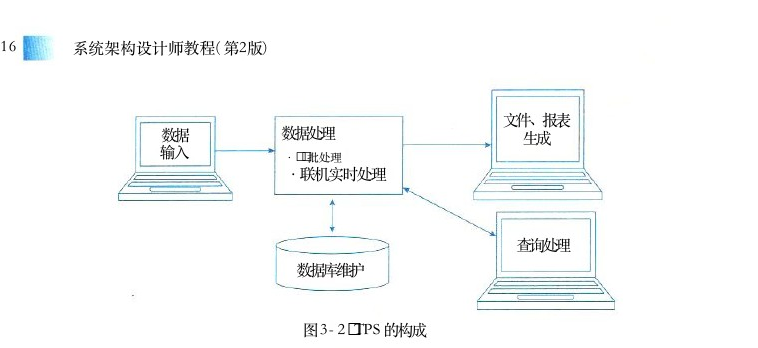
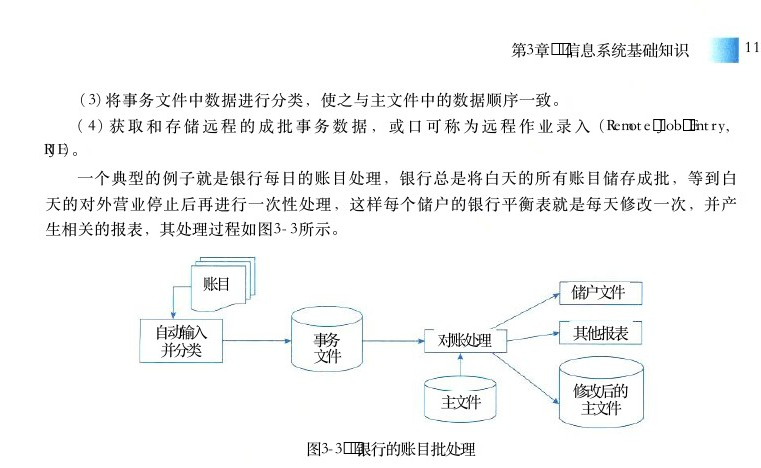
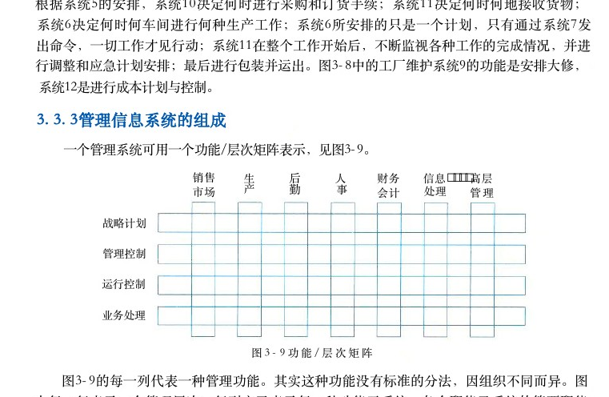
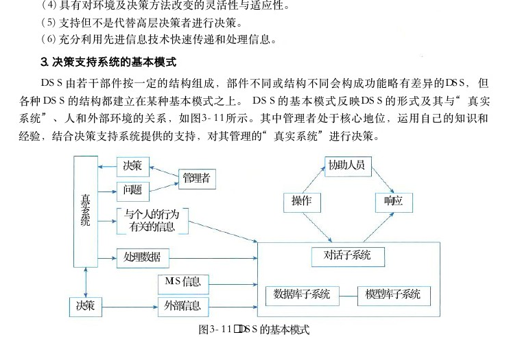
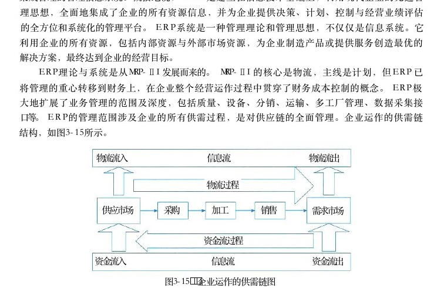

# 第3章 信息系统基础知识

> 本页为教材原文文字提取版。图示已按 PDF 页面裁剪并插入正文图注前。

<!-- PDF 第 117 页 -->

信息系统 （Information System，IS） 一般泛指收集、存储、处理和传播各种信息的具有完整功能的集合体。现代信息系统总是与计算机技术和互联网技术的应用联系在一起，主要是指以计算机为信息处理工具，以网络为信息传输手段的信息系统。本章主要介绍了信息系统的基本概念和发展现状，并就典型的6类信息系统的相关知识进行了详细讲解，最后介绍典型的信息系统架构模型。

## 3．1 信息系统概述

## 3 ． 1 ． 1 信息系统的定义

信息系统是由计算机硬件、网络和通信设备、计算机软件、信息资源、信息用户和规章制度组成的以处理信息流为目的的人机一体化系统。从技术上可以定义为一系列支持决策和控制的相关要素，这些要素主要包括信息的收集、检索、加工处理和信息服务。除了支持决策、协作和控制外，信息系统还帮助管理人员和生产人员分析问题，使复杂问题可视化，创造产生新的产品和服务。它的任务是对原始数据进行收集、加工、存储，并处理产生各种所需信息，以不同的方式提供给各类用户使用。信息系统的5个基本功能：输入、存储、处理、输出和控制。

● 输入功能。输入功能决定于系统所要达到的目的及系统的能力和信息环境的许可。

● 存储功能。存储功能指的是系统存储各种信息资料和数据的能力。

● 处理功能。它是数据处理工具。处理功能基于数据仓库技术的联机分析处理(OLAP)和数据挖掘 （ DM ） 技术。

● 输出功能。信息系统的各种功能都是为了保证最终实现最佳的输出功能。

● 控制功能。控制功能对构成系统的各种信息处理设备进行控制和管理，对整个信息加工、处理、传输、输出等环节通过各种程序进行控制。从概念上说，任何一个组织都有信息系统的存在，例如，一个工厂的正常运转，离不开计划的执行情况、物资器材的库存情况、流动资金的周转情况以及市场情况等信息。因而，任何企业单位占有信息的数量和质量以及处理信息的能力决定了其工作成效。进一步说，人类社会的发展速度，将取决于人们对信息的利用水平。信息系统既可以是基于计算机的，又可以是基于手工的。手工的信息系统采用纸笔等手段实现信息的传递和交流，而基于计算机的信息系统则是依赖于计算机硬、软件技术来加工处理和传输信息的。人们通常说的“信息系统”这一术语，是指基于计算机的信息系统，即依赖于计算机技术、规范的、有组织的信息系统。计算机信息系统是利用计算机技术将原始数据处理加工成为有意义的信息，但从某种意义上讲，计算

<!-- PDF 第 118 页 -->

机和信息系统之间仍存在着明显的区别。计算机只提供了存储、处理信息的设备和现代管理信息系统的技术功能，但信息系统的许多工作，诸如输入数据或使用系统的输出结果等还需要作为用户的人来完成，计算机仅仅是信息系统中的一部分。用户和计算机共同构成了一个整合的系统，提出问题以及对问题的具体解答都是通过计算机和用户之间的一系列交互活动来实现的，这充分体现了信息系统的性质所在，即信息系统是以计算机为基础的人机交互系统。信息系统的性质影响着系统开发者和系统用户的知识需求。“以计算机为基础”要求系统设计者必须具备计算机及其在信息处理中的应用知识。“人机交互”要求系统设计者还需要了解人作为系统组成部分的能力以及人作为信息使用者的各种行为。从广域上讲，信息化工作是信息系统发展带来的系统层面上的信息战略规划。所谓信息化（Informationalization） 是指在国家宏观信息政策指导下，通过信息技术开发、信息产业的发展、信息人才的配置，最大限度地利用信息资源以满足全社会的信息需求，从而加速社会各个领域的共同发展以推进信息社会的过程。信息化应该是以信息资源开发利用为核心，以网络技术、通信技术等高科技技术为依托的一种新技术扩散的过程。在信息化过程中，信息技术自身和整个社会都发生着质的变化。信息化不仅仅是生产力的变革，而且伴随着生产关系的重大变革。

## 3．1．2信息系统的发展

现代信息系统与70年来计算机技术和网络技术的发展保持同步。随着社会的进步和技术的发展，信息系统的内容和形式也都在不断发生着巨大的变化。1979年，美国管理信息系统专家诺兰 （Richard L．Nolan） 通过对200多个公司、部门发展信息系统的实践和经验做出的总结，提出了著名的信息系统进化的阶段模型，即诺兰模型。诺兰认为，任何组织由手工信息系统向以计算机为基础的信息系统发展时，都存在着一条客观的发展道路和规律。数据处理的发展涉及技术的进步、应用的拓展、计划和控制策略的变化以及用户的状况等4个方面。诺兰将计算机信息系统的发展道路划分为6个阶段，即：初始阶段、传播阶段、控制阶段、集成阶段、数据管理阶段和成熟阶段。

## 1．初始阶段

计算机刚进入企业时只作为办公设备使用，应用非常少，通常用来完成一些报表统计工作，甚至大多数时候被当作打字机使用。在这一阶段， IT的需求只被作为简单的办公设施改善的需求来对待，采购量少，只有少数人使用，在企业内没有普及。这一阶段的主要特点是：

（1）组织中只有个别人具有使用计算机的能力。

（2）该阶段一般发生在一个组织的财务部门。

## 2．传播阶段

企业对计算机有了一定了解，想利用计算机解决工作中的问题，比如进行更多的数据处理，给管理工作和业务带来便利。于是，应用需求开始增加，企业对IT 应用开始产生兴趣，并对开发软件热情高涨，投入开始大幅度增加。这一阶段的主要特点是：

（1）数据处理能力得到迅速发展。

（2）出现许多新问题（如数据冗余、数据不一致性、难以共享等）。

<!-- PDF 第 119 页 -->

（3）计算机使用效率不高等。

## 3．控制阶段

在前一阶段盲目购机、盲目定制开发软件之后，企业管理者意识到计算机的使用超出控制，IT 投资增长快，但效益不理想，于是开始从整体上控制计算机信息系统的发展，在客观上要求组织协调、解决数据共享问题。此时，企业IT建设更加务实，对IT 的利用有了更明确的认识和目标。在这一阶段，一些职能部门内部实现了网络化，如财务系统、人事系统、库存系统等，但各软件系统之间还存在“部门壁垒”与“信息孤岛”。信息系统呈现单点、分散的特点，系统和资源利用率不高。这一阶段的主要特点是：

（1）成立了一个领导小组。

（2）采用了数据库 （ DB ） 技术。

（3）这一阶段是计算机管理变为数据管理的关键。

## 4．集成阶段

在控制的基础上，企业开始重新进行规划设计，建立基础数据库，并建成统一的信息管理系统。企业的 IT 建设开始由分散和单点发展到成体系。企业 IT主管开始把企业内部不同的 IT机构和系统统一到一个系统中进行管理，使人、财、物等资源信息能够在企业集成共享，更有效地利用现有的 IT 系统和资源。这一阶段的主要特点是：

（1）建立集中式的 DB 及相应的 IS。

（2）增加大量硬件，预算费用迅速增长。

## 5．数据管理阶段

企业高层意识到信息战略的重要，信息成为企业的重要资源，企业的信息化建设也真正进入到数据处理阶段。这一阶段中，企业开始选定统一的数据库平台、数据管理体系和信息管理平台，统一数据的管理和使用，各部门、各系统基本实现资源整合和信息共享。 IT 系统的规划及资源利用更加高效。

## 6．成熟阶段

信息系统已经可以满足企业各个层次的需求，从简单的事务处理到支持高效管理的决策。企业真正把 IT 与管理过程结合起来，将组织内部、外部的资源充分整合和利用，从而提升了企业的竞争力和发展潜力。这6个阶段模型反映了企业计算机应用发展的规律性，前3个阶段具有计算机时代的特征，后3个阶段具有信息时代的特征，其转折点是进行信息资源规划的时机。“诺兰模型”的预见性，被其后国际上许多企业的计算机应用发展情况所证实。

## 3．1．3信息系统的分类

从信息系统的发展和系统特点来看，传统的信息系统可分为业务（数据）处理系统、管理信息系统、决策支持系统、专家系统和办公自动化系统等5类。这5类经历了一个从低级到高级、从局部到全局、从简单到复杂的过程。

<!-- PDF 第 120 页 -->

## 1．业务（数据）处理系统

随着企业业务需求的增长和技术条件的发展，人们逐步将计算机应用于企业局部业务（数据）的管理，如财会管理、销售管理、物资管理和生产管理等，即计算机应用发展到对企业的局部事务的管理，形成了所谓业务（数据）处理系统 （Transaction／DATA Processing System，TPS／DPS）， 但它并未形成对企业全局的、整体的管理。

## 2．管理信息系统

管理信息系统 （Management Information System，MIS） 最早出现在20世纪80年代初，是用系统思想建立起来，以电子计算机为基本信息处理手段，现代通信设备为基本传输工具，且能为管理决策提供信息服务的人机系统。即管理信息系统是一个由人和计算机等组成的，能进行管理信息的收集、传输、存储、加工、维护和使用的系统。在管理信息系统发展过程中，形成了对企业全局性的、整体性的计算机应用。 MIS 强调以企业管理系统为背景，以基层业务系统为基础，强调企业各业务系统间的信息联系，以完成企业总体任务为目标，它能提供企业各级领导从事管理需要的信息，但其收集信息的范围还更多地侧重于企业内部。

## 3．决策支持系统

决策支持系统 （Decision Support System，DSS） 是管理信息系统应用概念的深化，是在管理信息的基础上发展起来的系统。 DSS 是能帮助决策者利用数据和模型去解决半结构化决策问题和非结构化决策问题的交互式系统。服务于高层决策的管理信息系统，按功能可分为专用DSS 、 DSS 工具和 DSS 生成器。专用 DSS是为解决某一领域问题的 DSS 。 DSS 工具是指某种语言、某种操作系统、某种数据库系统。 DSS 生成器是通用决策支持系统，一般 DSS 包括数据库、模型库、方法库、知识库和会话部件。

## 4．专家系统

专家系统 （Expert System，ES） 是一个智能计算机程序系统，其内部含有某个领域具有专家水平的大量知识与经验，能够利用人类专家的知识和解决问题的方法来处理该领域的问题。也就是说，专家系统是一个具有大量的专门知识与经验的程序系统，它应用人工智能技术和计算机技术，根据某领域一个或多个专家提供的知识和经验，进行推理和判断，模拟人类专家的决策过程，以便解决那些需要人类专家处理的复杂问题。简而言之，专家系统是一种模拟人类专家解决领域问题的计算机程序系统。

## 5．办公自动化系统

办公自动化系统 （Office Automation System，OAS） 是一个人机结合的综合性的办公事务管理系统，或称办公事务处理系统。该系统将当代各种先进技术和设备包括计算机、文字处理机、声音图形（图像）识别、数值计算、光学、微电子学、通信和管理科学等，应用于办公室的办公活动中，使办公活动实现科学化、自动化，以达到改善工作环境、最大限度地提高办公事务工作质量和工作效率。

<!-- PDF 第 121 页 -->

## 6．综合性信息系统

信息系统之间的关系并不是取代关系，而是互相促进、共同发展的关系。在一个企业里，以上5个类型的信息系统，可能同时都存在，也可能只有其中的1种、2种或3种。更高级的是几种信息系统互相融合成一体。同时，以上这5种信息系统本身也是与时俱进发展的，不断有新的技术、新的方法和新的工具融入其中。随着各国信息化工程的不断推行，智能制造和信息化技术的融合，为企业带来了丰厚的利益。目前企业主要使用的信息化系统主要有 ERP 系统（企业资源管理）、 WMS 系统（仓储管理系统）、 MES 系统（也称之为SFC， 即制造过程管理系统）和产品数据管理系统 （PDM）。

●系统：主要管理公司的各种资源，负责处理进销存、供应链、生产计划ERPMPSMRP计算、生产订单、管理会计，是财务数据的强力支撑。

●系统：主要包括库房货位管理，主要有收发料，通过扫码进出库，对库存进行库WMS位、先进先出与盘点；栈板出货管控、库龄管理等内容，主要是立体仓库或大批量仓库数据需求。

●系统：负责生产过程和生产过程中防呆、自动化设备集成，是各个客户审核的重MES点，是生产全流程管控，也有企业称之为SFC， 其实大同小异，但是它是生产过程、生产工艺、生产设备、自动化生产直接的核心。

●系统：管理研发阶段的物料、工程变更数据，负责产品数据为主。系PDMBOMPDM统是产品研发全过程管理，主要涉及协同研发等能力。

## 3．1．4信息系统的生命周期

一般来说，信息系统的生命周期分为4个阶段，即产生阶段、开发阶段、运行阶段和消亡阶段。

## 1．信息系统的产生阶段

信息系统的产生阶段，也是信息系统的概念阶段或者是信息系统的需求分析阶段。这一阶段又分为两个过程，一是概念的产生过程，即根据企业经营管理的需要，提出建设信息系统的初步想法；二是需求分析过程，即对企业信息系统的需求进行深入地调研和分析，并形成需求分析报告。

## 2．信息系统的开发阶段

信息系统的开发阶段是信息系统生命周期中最重要和关键的阶段。该阶段又可分为5个阶段，即，总体规划、系统分析、系统设计、系统实施和系统验收阶段。

（1）总体规划阶段。信息系统总体规划是系统开发的起始阶段，它的基础是需求分析。以计算机和互联网为工具的信息系统是企业管理系统的重要组成部分，是实现企业总体目标的重要工具。因此，它必须服从和服务于企业的总体目标和企业的管理决策活动。总体规划的作用主要有：指明信息系统在企业经营战略中的作用和地位；指导信息系统的开发；优化配置和利用各种资源，包括内部资源和外部资源。通过规划过程规范企业的业务流程，一个比较完整的

<!-- PDF 第 122 页 -->

总体规划，应当包括信息系统的开发目标、信息系统的总体架构、信息系统的组织结构和管理流程、信息系统的实施计划、信息系统的技术规范等。

（2）系统分析阶段。系统分析阶段的目标是为系统设计阶段提供系统的逻辑模型。系统分析阶段以企业的业务流程分析为基础，规划即将建设的信息系统的基本架构，它是企业的管理流程和信息流程的交汇点。系统分析的内容主要包括组织结构及功能分析、业务流程分析、数据和数据流程分析、系统初步方案等。

（3）系统设计阶段。系统设计阶段是根据系统分析的结果，设计出信息系统的实施方案。系统设计的主要内容包括系统架构设计、数据库设计、处理流程设计、功能模块设计、安全控制方案设计、系统组织和队伍设计、系统管理流程设计等。

（4）系统实施阶段。系统实施阶段是将设计阶段的结果在计算机和网络上具体实现，也就是将设计文本变成能在计算机上运行的软件系统。由于系统实施阶段是对以前的全部工作的检验，因此，系统实施阶段用户的参与特别重要。系统实施阶段以后，用户逐步变为系统的主导地位。

（5）系统验收阶段。信息系统实施阶段结束以后，系统就要进入试运行。通过试运行，系统性能的优劣以及是否做到了用户友好等问题都会暴露在用户面前，这时就进入了系统验收阶段。

## 3．信息系统的运行阶段

当信息系统通过验收，正式移交给用户以后，系统就进入了运行阶段。一般来说，一个性能良好的系统，运行过程中会较少出现故障，即使出现故障，也较容易排除；而那些性能较差的系统，运行过程中会故障不断，而且可能会出现致命性故障，有时故障会导致系统瘫痪。因此，长时间的运行是检验系统质量的试金石。另外，要保障信息系统正常运行，一项不可缺少的工作就是系统维护。在软件工程中，把维护分为4种类型，即排错性维护、适应性维护、完善性维护和预防性维护。一般在系统运行初期，排错性维护和适应性维护比较多，而到后来，完善性维护和预防性维护就会比较多。

## 4．信息系统的消亡阶段

通常人们比较重视信息系统的开发阶段，轻视信息系统运行阶段，而几乎完全忽视信息系统的消亡阶段。计算机技术和互联网技术的发展迅速，新的技术、新的产品不断出现；同时，由于企业处在瞬息万变的市场竞争的环境之中，在这种情况下，企业开发好一个信息系统想让它一劳永逸地运行下去，是不现实的。企业的信息系统会经常不可避免地会遇到系统更新改造、功能扩展，甚至报废重建的情况。对此，在信息系统建设的初期企业就应当注意系统的消亡条件和时机，以及由此而花费的成本。

## 3．1．5信息系统建设原则

为了能够适应开发的需要，在信息系统规划设计以及系统开发的过程中，必须要遵守一系列原则，这是系统成功的必要条件。以下是信息系统开发的常用原则。

<!-- PDF 第 123 页 -->

## 1．高层管理人员介入原则

一个信息系统的建设目标总是为企业的总体目标服务，否则，这个系统就不应当建设。而真正能够理解企业总体目标的人必然是那些企业的高层管理人员，只有他们才能知道企业究竟需要什么样的信息系统，而不需要什么样的信息系统；也只有他们才知道企业有多大的投入是值得的，而超过了这个界限就是浪费。这是那些身处某一部门的管理人员或者是技术人员所无法做到的。因此，信息系统从概念到运行都必须有企业高层管理人员介入。当然，这里的“介入”有着其特定的含义，它可以是直接参加，也可以是决策或指导，还可以是在政治、经济、人事等方面的支持。这里需要说明的是，高层管理人员介入原则在现阶段已经逐步具体化，那就是企业的“首席信息官” （Chief Information Officer，CIO） 的出现。 CIO 是企业设置的相当于副总裁的一个高级职位，负责公司信息化的工作，主持制定公司信息规划、政策、标准，并对全公司的信息资源进行管理控制的公司行政官员。在大多数企业里， CIO 是公司最高管理层中的核心成员之一。毫无疑问，深度介入信息系统开发建设以及运行是 CIO 的职责所在。

## 2．用户参与开发原则

在我国信息系统开发中流行所谓“用户第一”或“用户至上”的原则。当然，这个原则并没有错，一个成功的信息系统，必须把用户放在第一位，这应该是毫无疑义的。用户参与开发原则主要包括以下几项含义：一是“用户”有确定的范围。人们通常把“用户”仅仅理解成为用户单位的领导，其实，这是很片面的。当然，用户单位领导应该包括在用户范围之内，但是，更重要的用户或是核心用户是那些信息系统的使用者，而用户单位的领导只不过是辅助用户或是外围用户。二是用户，特别是那些核心用户，不应是参与某一阶段的开发，而应当是参与全过程的开发，即用户应当参与从信息系统概念规划和设计阶段，直到系统运行的整个过程。而当信息系统交接以后，他们就成为系统的使用者。三是用户应当深度参与系统开发。用户以什么身份参与开发是一个很重要的问题。一般说来，参与开发的用户人员，既要以甲方代表身份出现，又应成为真正的系统开发人员，与其他开发人员融为一体。

## 3．自顶向下规划原则

在信息系统开发的过程中，经常会出现信息不一致的问题，这种现象的存在对于信息系统来说往往是致命的，有时一个信息系统会因此而造成报废的结果。研究表明，信息的不一致是由计算机应用的历史性演变造成的，它通常发生在没有一个总体规划的指导就来设计实现一个信息系统的情况之下。因此，坚持自顶向下规划原则对于信息系统的开发和建设来说是至关重要的。自顶向下规划的一个主要目标是达到信息的一致性。同时，自顶向下规划原则还有另外一个方面，那就是这种规划绝不能取代信息系统的详细设计。必须鼓励信息系统各子系统的设计者在总体规划的指导下，进行有创造性的设计。

<!-- PDF 第 124 页 -->

## 4．工程化原则

在20世纪70年代，出现了世界范围内的“软件危机”。所谓软件危机是指一个软件编制好以后，谁也无法保证它能够正确地运行，也就是软件的可靠性成了问题。软件危机曾一度引起人们特别是工业界的恐慌。经过探索人们认识到，之所以会出现软件危机，是因为，软件产品是一种个体劳动产品，最多也就是作坊式的产品。因此，没有工程化是软件危机发生的根本原因。此后，发展成了“软件工程”这门工程学科，在一定程度上解决了软件危机。信息系统也经历了与软件开发大致相同的经历。在信息系统发展的初期，人们也像软件开发初期一样，只要做出来就行，根本不管实现的过程。这时的信息系统，大都成了少数开发者的“专利”，系统可维护性、可扩展性都非常差。后来，信息工程、系统工程等工程化方法被引入到信息系统开发过程之中，才使问题得到了一定程度的解决。其实，工程化不仅是一种有效的方法，它也应当是信息系统开发的一项重要原则。

## 5．其他原则

对于信息系统开发，人们还从不同的角度提出了一系列原则，例如：创新性原则，用来体现信息系统的先进性；整体性原则，用来体现信息系统的完整性；发展性原则，用来体现信息系统的超前性；经济性原则，用来体现信息系统的实用性。

## 3．1．6信息系统开发方法

企业信息系统对于企业信息化的重要意义是不言而喻的。从实际运行的效果来看，有些信息系统运行得很成功，取得了巨大的经济效益和社会效益；但也有些信息系统效果并不显著，甚至还有个别信息系统开始时还能正常运行，可时间一长，系统就故障不断，最后走上报废之路。这里的原因可能很复杂，但有一个原因是十分重要和关键的，那就是信息系统的开发方法问题。信息系统是一个极为复杂的人－机系统，它不仅包含计算机技术、通信技术，以及其他的工程技术，而且，它还是一个复杂的管理系统，还需要管理理论和方法的支持。下面简单介绍几种最常用的信息系统开发方法。

## 1．结构化方法

结构化方法是由结构化系统分析和设计组成的一种信息系统开发方法，是目前最成熟、应用最广泛的信息系统开发方法之一。它假定被开发的系统是一个结构化的系统，因而，其基本思想是将系统的生命周期划分为系统调查、系统分析、系统设计、系统实施、系统维护等阶段。这种方法遵循系统工程原理，按照事先设计好的程序和步骤，使用一定的开发工具，完成规定的文档，在结构化和模块化的基础上进行信息系统的开发工作。结构化方法的开发过程一般是先把系统功能视为一个大的模块，再根据系统分析设计的要求对其进行进一步的模块分解或组合。结构化生命周期法主要特点如下：

（1）开发目标清晰化。结构化方法的系统开发遵循“用户第一”的原则，开发中要保持与用户的沟通，取得与用户的共识，这使得信息系统的开发建立在可靠的基础之上。

（2）工作阶段程式化。结构化方法的每个阶段的工作内容明确，注重开发过程的控制。每

<!-- PDF 第 125 页 -->

一阶段工作完成后，要根据阶段工作目标和要求进行审查，这使得各阶段工作有条不紊，也避免为以后的工作留下隐患。

（3）开发文档规范化。结构化方法的每一阶段工作完成后，要按照要求完成相应的文档，以保证各个工作阶段的衔接与系统维护工作的便利。

（4）设计方法结构化。结构化方法采用自上而下的结构化、模块化分析与设计方法，使各个子系统间相对独立，便于系统的分析、设计、实现与维护。结构化方法被广泛地应用于不同行业信息系统的开发中，特别适合于那些业务工作比较成熟、定型的系统，如银行、电信、商品零售等行业。

## 2．原型法

原型法是一种根据用户需求，利用系统开发工具，快速地建立一个系统模型展示给用户，在此基础上与用户交流，最终实现用户需求的信息系统快速开发的方法。在现实生活中，一个大型工程项目建设之前制作的沙盘，以及大型建筑的模型等都与快速原型法有同样的效果。应用快速原型法开发过程包括系统需求分析、系统初步设计、系统调试、系统检测等阶段。用户仅需在系统分析与系统初步设计阶段完成对应用系统的简单描述，开发者在获取一组基本需求定义后，利用开发工具生成应用系统原型，快速建立一个目标应用系统的最初版本，并把它提交给用户试用、评价，根据用户提出的意见和建议进行修改和补充，从而形成新的版本再返回给用户。通过这样多次反复，使得系统不断地细化和扩充，直到生成一个用户满意的方案为止。

## 3．面向对象方法

面向对象方法是对客观世界的一种看法，它是把客观世界从概念上看成一个由相互配合、协作的对象所组成的系统。信息系统开发的面向对象方法的兴起是信息系统发展的必然趋势。数据处理包括数据与处理两部分。但在信息系统的发展过程的初期却是有时偏重这一面，有时偏重那一面。在20世纪70￣80年代，偏重数据处理者认识到初期的数据处理工作是计算机相对复杂而数据相对简单。因此，先有结构化程序设计的发展，随后产生面向功能分解的结构化设计与结构化分析。偏重于数据方面人员同时提出了面向数据结构的分析与设计。到了20世纪80年代，兴起了信息工程方法，使信息系统开发发展到了新的阶段。信息工程在实际应用中既表现出其优越性的一面，同时，也暴露了一些缺点，例如，过于偏重数据，致使应用开发受到影响。而面向对象方法则集成了以前各种方法的优点，避免了各自的一些缺点。面向对象的分析方法是利用面向对象的信息建模概念，如实体、关系、属性等，同时运用封装、继承、多态等机制来构造模拟现实系统的方法。传统的结构化设计方法的基本点是面向过程，系统被分解成若干个过程。而面向对象的方法是采用构造模型的观点，在系统的开发过程中，各个步骤的共同目标是建造一个问题域的模型。在面向对象的设计中，初始元素是对象，然后将具有共同特征的对象归纳成类，组织类之间的等级关系，构造类库。在应用时，在类库中选择相应的类。

<!-- PDF 第 126 页 -->

## 4．面向服务的方法

面向对象的应用构建在类和对象之上，随后发展起来的建模技术将相关对象按照业务功能进行分组，就形成了构件的概念。对于跨构件的功能调用，则采用接口的形式暴露出来。进一步将接口的定义与实现进行解耦，则催生了服务和面向服务的开发方法。从应用的角度来看，组织内部、组织之间各种应用系统的互相通信和互操作性直接影响着组织对信息的掌握程度和处理速度。如何使信息系统快速响应需求与环境的变化，提高系统可复用性、信息资源共享和系统之间的互操作性，成为影响信息化建设效率的关键问题，而面向服务的开发方法的思维方式恰好满足了这种需求。目前，面向服务的开发方法是一个较新的领域，许多研究和实践还有待进一步深入。但是，它代表着不拘泥于具体技术实现方式的一种新的系统开发思想，已经成为信息系统建设的大趋势，越来越多的组织开始实施面向服务的信息系统。

## 3．2 业务处理系统（TPS）

业务处理系统 （Transaction Processing System，TPS） 又可称为电子数据处理系统 （ElectronicData Processing System，EDP）， 是计算机在管理方面早期应用的最初级形式的信息系统。自从1946年世界上第一台电子计算机诞生之后， TPS 即开始获得广泛的应用，20世纪50至60年代出现了 TPS 的应用高潮，随着信息技术及相关学科的发展， TPS 的功能越来越强大，应用的范围也越来越广。可以这样说，在当今世界的各行业各领域的管理系统中，几乎都有 TPS的存在。

## 3．2．1业务处理系统的概念

企业在经营活动过程中产生各种数据。这些数据利用传票记录、传送和保管，将传票的内容再转记到账目上。企业内建立反映各种活动的账簿，然后对账簿的内容进行统计、分类等处理，整理出各种用于管理决策的报表。这些“传票”“账簿”“报表”按组织体系有机地结合起来反映和支持整个经营管理活动，如图3－1所示。所谓事务处理系统，就是针对管理中具体的事务（如财会、销售、库存等）来辅助管理人员将所发生的数据进行记录、传票、记账、统计和分类，并制成报表等活动，为经营决策提供有效信息的基于计算机的信息系统。

采购会计销售

生产库存控制物料规划

·采购合同·工艺单·销售合同·库存记录·发货通知·收货通知书·供应商发票

●员工工时卡·顾客发票·给供应商的付款凭证·员工工资卡·顾客的付款凭证·其他·其他·其他图3－1 企业中的事务处理

<!-- PDF 第 127 页 -->

TPS 是服务于组织管理层次中最低层、最基础的信息系统。这些系统通常是一种分离式单独处理某一项具体事务的系统，如账务处理系统、工资管理系统、物料进出库管理系统、合同管理系统等。各个子系统有自己专有的软、硬件和专有的数据文件，它们之间一般不交流、不共享某些专用数据库文件。在作业层上，要处理的任务、所需的资源及要实现的目标都是预先确定的、高度结构化的。例如，一个公司的订货、发货业务，其处理过程可预先明确规定由如下事务组成。①接待顾客，商洽订货业务。②将订货内容记入订货台账。③检查库存。④检查顾客的信用度。⑤生成各种传票。⑥按出库传票备货⑦将出库数量记入出、入库台账。⑧将送货司机带回的收据和销售传票的内容进行核对。⑨将结账单相销售传票进行核对。⑩将结账单内容记入赊销台账。上述业务大体可分成四个功能：第1个功能：由事务①②④构成，它们的主要作用是根据所接受的订货要求，确定是否接受这个要求，这组事务完成了订货受理功能。第2个功能：由事务⑤⑥构成，它们的主要作用是根据所接受的订货要求进行发货准备，如检查库存储状况，向仓库发出出库指示等，这组事务完成了发货准备功能。第3个功能：由事务⑥⑦构成，是仓库的具体发货工作，称为发货功能。第4个功能：由事务⑧⑨⑩构成，主要是对每一笔订货业务进行发货后的检查核对，并进行财务结账，以便向顾客发出付款通知，完成了付款通知各功能。构造支持类似上述业务处理过程的 TPS 的主要目的在于帮助作业层管理人员减轻处理原始数据负担，提高具体事务的处理效率。在某些情况下，甚至可以完全取代业务层的手工操作。因此， TPS 主要放置于车间或一般的行政管理办公室，而处于企业系统边界的 TPS 则能将企业和它的外部环境联系起来。

## 3．2．2业务处理系统的功能

由于 TPS 的主要功能就是对企业管理中日常事务所发生的数据进行输入、处理和输出。因此，如图3－2所示， TPS 的数据处理周期由以下5个阶段构成：数据输入、数据处理、数据库的维护、文件报表的生成和查询处理。下面对这5个阶段的工作过程作进一步的阐述。

<!-- PDF 第 128 页 -->

文件、报表数据处理数据生成输入· 批处理·联机实时处理

查询处理数据库维护

图3－2 TPS 的构成

## 1．数据输入

数据输入是 TPS 工作过程的第1个阶段，该阶段主要解决如何将企业经营活动中产生的大量原始数据准确、迅速地输入到计算机系统中并存储起来，这是信息系统进行信息处理的“瓶颈”。因此，数据的输入方式和进度是这个阶段的关键问题。常见的数据输入方式有3种，即人工、自动及二者结合。若用人工输入数据，在运行TPS中的数据输入模块时，屏幕上就会显示出与原始数据凭证相似格式的画面，而后由作业层的管理人员通过键盘等输入装置进行数据输入，输入的数据以 TPS 预先确定好的格式（即数据库结构 ） 存储或由TPS 直接使用。这种传统的数据输入方式的缺点是显而易见的，即费时、费力，需要大量存储空间，而且还极易出错。随着计算机及相关技术的迅速发展，原始数据的输入也朝着自动化方向发展，只要将自动化数据录入装置，与远程TPS 的计算机系统连接起来，就可以实现原始数据的自动化或半自动化输入。常见的自动化输入装置有：（ 1 ） POS终端：获取条码或磁卡中的信息。（ 2 ） 光读机 OCR ： 阅读条码信息。（ 3 ） ATM ： 接收各种信用卡信息，

（4）扫描仪：输入图像信息。

（5）语音识别系统：输入声音信息。

（6）触摸屏：直接接收用户输入的信息。

## 2．数据处理

TPS中常见的数据处理方式有两种，一种是批处理方式；另一种是联机事务处理方式。

## 1 ） 批处理 （Batch Processing）

这种方式是将事务数据积累到一段时间后进行定期处理（如每日、每周、每月等），批处理的主要作用：

（1）收集原始数据文件，如销售合同、发票等，结组成批。

（2）转储其他输入介质上的事务数据。

<!-- PDF 第 129 页 -->

（3）将事务文件中数据进行分类，使之与主文件中的数据顺序一致。（ 4 ） 获取和存储远程的成批事务数据 ， 或又可称为远程作业录入 （Remote Job Entry，RJE）。一个典型的例子就是银行每日的账目处理，银行总是将白天的所有账目储存成批，等到白天的对外营业停止后再进行一次性处理，这样每个储户的银行平衡表就是每天修改一次，并产生相关的报表，其处理过程如图3－3所示。

账目储户文件

自动输入其他报表事务对账处理并分类文件

修改后的主文件主文件

图3－3 银行的账目批处理

批处理方式的优点是：当有大量的事务数据需要处理时，使用批处理是一种较经济的方式，因为它可以缩减因频繁修改数据库所需的费用。这种方式适合于在事务发生时无须即时修改数据库以及只须定期产生文件、报表的应用。例如，在每周发放工资的情况下，员工的考勤数据及其他有关的工资数据就可以收集成批之后每周处理一次。批处理方式的缺点是：在定期事务处理的间隔期，主文件易过时而且也无法满足实时的查询需求。2 ） 联机事务处理（OnLine Transaction Processing，OLTP）这种方式又可称为实时处理，即能对所发生的事务数据进行立即处理，并将处理结果提供给终端用户。事务数据一旦产生，则无须积累成批，也无须经过分类，就直接从联机的终端上输入到计算机系统中并进行处理。因此，这些事务数据总是从联机存储在接存取文件中，有关文件及数据库也立刻得到更新，并能即时响应终端用户的查询需求。 OLIP 方式主要依赖于网络来实现事务终端、工作站和其他计算机系统之间的通信。某些实时处理是不能被中断的，如证券的股票交易、航空公司的客户订单等。为保证在硬件系统运行出现故障时这些实时处理仍能继续进行，通常要在 TPS 中采用有关的容错处理。常用的容错技术有：双 CPU 的计算机、后备机、保存冗余数据等。OLIP 方式的优点是当事务数据产生时能即时更新有关的文件和数据库，并能立刻响应终端用户的查询请求。其缺点是成本高，由于是对数据库进行联机直接存取，为防止数据被非法存取或被偶然破坏，需要有一定授权机制。同时为保证实时处理不被中断，要采用有关的容错技术，这也需要额外的开支。但是，在某些情况下，以费用换取速度、效率和更优质的服务是值得的。

## 3．数据库的维护

一个组织的数据库通过TPS 来更新，以确保数据库中的数据能及时、正确地反映当前最新

<!-- PDF 第 130 页 -->

的经营状况，因此数据库的维护是 TPS 的一项主要功能。这些数据库是一个企业的数据资源，能为支持中、高层管理人员决策的管理信息系统、决策支持系统和专家系统等提供有用的基础信息。对数据库的访问形式基本有4种：检索、修改、存入和删除。

## 4．文件报表的产生

TPS 的输出就是为终端用户提供所需的有关文件和报表，这些文件和报表根据其用途不同可分为以下几类。

（1）行动文件 （Action Documents）： 即该文件的接收者持有文件后可进行某项事务处理，例如，采购订单交给采购员，采购员即可向有关的供应商购货；工资支票交给银行后，银行便向员工支付工资等。

（2）信息文件 （Information Documents）： 该类文件向其持有者表明某项业务已发生了，例如订单确认书及客户发票向购货方表明供货方已供货了。这类文件有时也可作为控制文件使用。

（3）周转文件 （Turaround Documents）： 这类文件交给接受者之后通常还要返回到发送者手中，故称为周转文件。例如计算机印制的发票（多联）交给客户，客户必须将付款凭证与其中一联发票再一起交回，因此这类文件的信息可通过自动数据录入装置输入到计算机系统中。TPS还产生一些其他类型的报表，用于记录和监控某段时间内业务发生或处理的结果，它们并不是因管理的需要而特别编制的，例如流水账（即业务日志）等。因此TPS 产生的文件、报表是原始数据经简单的分类、汇总之后形成，几乎未经任何分析和概括，无法对中、高层管理人员的决策提供直接支持。

## 5．查询处理

TPS支持终端用户的批次查询或联机实时查询，典型的查询方式是用户通过屏幕显示获得查询结果，例如，销售人员可查询客户的合同情况，读者可查询图书馆的借书情况等。这种查询实际上是对数据库进行有条件的检索，因此，为保证数据的安全性和保密性，必须对不同级别的用户授以不同的访问权限。

## 3．2．3业务处理系统的特点

业务处理系统 （TPS） 是信息系统发展的最初级形式，但这并不意味着 TPS 不重要甚至不需要。实际上， TPS 是其他类型信息系统的信息产生器，企业在推进全面信息化的过程中往往是从开发 TPS 入手的。由于TPS 支持的是企业的日常业务管理， TPS 一旦出现故障，就有可能导致企业的正常运作发生紊乱，例如航空公司的订票系统、银行的存取款／转账系统、企业的物料进出库系统等。同时，许多 TPS 是处于企业系统的边界，它是将企业与外部环境联系起来的“桥梁”。因此， TPS 性能的好坏将直接影响着组织的整体形象，是提高企业市场竞争力的重要因素。由于 TPS 面对的是结构化程度很高的管理问题，因此可以采用结构化生命周期法来进行开发。而且同行业事务处理的相似性，使得越来越多的 TPS 都已商品化。所以，许多企业可直接购买现成的TPS， 只要再进行一些简单的二次开发，就能投入使用，避免了低水平的重复开发工作。

<!-- PDF 第 131 页 -->

## 3．3 管理信息系统（MIS）

管理信息系统 （Manage Information System，MIS） 是由业务处理系统发展而成的 ， 是在TPS 基础上引进大量管理方法对企业整体信息进行处理，并利用信息进行预测、控制、计划辅助企业全面管理的信息系统。从MIS应用的历史和现状来看， MIS 是一个高度集成化的人机信息系统，它是企业信息系统中职能明确、体系结构较为稳定、处理技术成熟、应用也最为成功的分支。管理信息系统中包含各种模型和方法，数据共享能力更大，能够提供分析、计划和辅助决策功能的系统，并具有改进企业组织的效能。

## 3．3．1管理信息系统的概念

从管理信息系统概念出发，管理信息信息管理者系统由四大部件组成，即信息源、信息处信息源信息处理器信息用户理器、信息用户和信息管理者，见图3－4。首先，根据各部件之间的联系可分为图3－4管理信息系统总体结构开环和闭环。开环结构是在执行一个决策的过程中不收集外部信息，不根据信息情况改变决策，直至产生本次决策的结果，事后的评价只供以后的决策作参考。闭环结构是在决策过程中不断收集信息，不断发送给决策者，不断调整决策。事实上最后执行的决策已不是当初设想的决策，见图3－5。

变行结评识决记事件1别换动果价策录

存储

事件2（a） 开环系统

企业内部识变行结评记决别换动果价外部录策数据源存储

（b） 闭环系统图3－5 开环与闭环结构

计算机实时处理的系统均属于闭环系统，而批处理系统均属于开环系统，但对于一些较长的决策过程来说批处理系统也能构成闭环系统。其次，根据处理的内容及决策的层次来看，我们可以把管理信息系统看成一个金字塔式的结构，见图3－6。

<!-- PDF 第 132 页 -->

组织管理均是分层次的，例如分为战战略计划略计划、管理控制和运行控制3层。由于一般管理均是按职能分条的，信息系统也生财管理控制产就可以分为销售与市场、生产、财务与会务写计、人事及其他。一般来说，下层的系统运行控制全处理量大，上层的处理量小，组成了纵横业务处理交织的金字塔结构。管理信息系统的结构又可以用子系统及它们之间的连接来描述，图3－6 管理信息系统的金字塔结构所以又有管理信息系统的纵向综合、横向综合以及纵横综合的概念。横向综合是按层划分子系统，纵向综合就是按条划分子系统。例如，把车间、科室以及总经理层的所有人事问题划分成一个子系统。纵横综合则是金字塔中任何一部分均可与任何其他部分组成子系统，达到随意组合自如使用的目的。

## 3 ． 3 ． 2 管理信息系统的功能

一个管理信息系统从使用者的角度看，它总是有一个目管理信息系统标，具有多种功能，各种功能之间又有各种信息联系，构成一个有机结合的整体，形成一个功能结构。例如，一个企业的内生市人供部管理系统可以具有图3－7所示的结构。财产场会事运由图3－7可以看出，这里子系统的名称所标注的是管理的子子子子子系系系系系功能或职称，而不是计算机的名词。它说明管理信息系统能实统统统统统现哪些管理功能。职能的完成往往是通过“过程”实现，过程图 3 － 7 管理信息系统的功能结构是逻辑上相关活动的集合，因而往往把管理信息系统的功能结构表示成功能－过程结构，见图3－8。

细计划执行计划主计划

指令性计划订货采购库房安排服务及进货订货

包装主生产库存制造活发出预测运出计划监督管理动计划工作令

各子系统

成本计划与控制工厂维护工程技术与生产数据管理

图3－8 管理信息系统的功能－过程结构

<!-- PDF 第 133 页 -->

这个系统标明了企业各种功能子系统怎样互相联系并形成一个全企业的管理系统，是企业各种管理过程的一个缩影。整个流程自左至右展开，这里的企业主生产计划4是根据指令性计划、订货服务以及预测的结果来制订的。通过库存管理决定需要多少原料、半成品、外购件以及资金，而且确定物料的到达时间及库存水平。要产生这些信息用到的产品数据由系统1得到，根据系统5的安排，系统10决定何时进行采购和订货手续；系统11决定何时何地接收货物；系统6决定何时何车间进行何种生产工作；系统6所安排的只是一个计划，只有通过系统7发出命令，一切工作才见行动；系统11在整个工作开始后，不断监视各种工作的完成情况，并进行调整和应急计划安排；最后进行包装并运出。图3－8中的工厂维护系统9的功能是安排大修，系统12是进行成本计划与控制。

## 3．3．3管理信息系统的组成

一个管理系统可用一个功能／层次矩阵表示，见图3－9。

销售后生人财务信息高层产勤事市场处理会计管理

战略计划

管理控制

运行控制

业务处理

图 3 － 9 功能 ／ 层次矩阵图3－9的每一列代表一种管理功能。其实这种功能没有标准的分法，因组织不同而异。图中每一行表示一个管理层次，行列交叉表示每一种功能于系统。各个职能子系统的简要职能如下。

（1）销售市场子系统。它包括销售和推销，在运行控制方面包括雇用和训练销售人员、销售和推销的日常调度，还包括按区域、产品、顾客销售数量的定期分析等。在管理控制方面，包含总的成果和市场计划的比较，它所用的信息有顾客、竞争者、竞争产品和销售力量要求等。在战略计划方面包含新市场的开发和战略，它使用的信息包含顾客分析、竞争者分析、顾客评价、收入预测、入口预测和技术预测等。

（2）生产子系统。它包括产品设计、生产设备计划、生产设备的调度和运行、生产人员的雇用和训练、质量控制和检查等。典型的业务处理是生产订货、装配订货、成品票、废品票和工时票等。运行控制要求将实际进度与计划相比较，发现问题环节；管理控制要求进行总进度、单位成本和工事消耗的计划比较；战略计划要考虑加工方法和自动化的方法。

（3）后勤子系统。它包括采购、收货、库存控制和分发。典型的业务包括采购的征收、采购订货、制造订货、收货报告、库存票、运输票和装货票、脱库项目、超库项目、库营业额报

<!-- PDF 第 134 页 -->

告、卖主性能总结、运输单位性能分析等。管理控制包括每一后勤工作的实际与计划的比较，如库存水平、采购成本、出库项目和库存营业额等；战略分析包括信息的分配战略分析、对卖主的新政策、“做或买”的战略、新技术信息、分配方案等。

（4）人事子系统。它包括雇用、培训、考核记录、工资和解雇等。其典型的业务有雇用需求的说明、工作岗位责任说明、培训说明、人员基本情况数据、工资变化、工作小时和离职说明等。运行控制关心的是雇佣、培训、终止、变化工资率、产生效果。管理控制主要进行实情与计划的比较，包括雇用数、招募费用、技术库存成分、培训费用、支付工资、工资率的分配和政府要求符合的情况。战略计划包括雇用战略和方案评价、工资、训练、收益、建筑位置及对留用人员的分析等，把本国的人员流动、工资率、教育情况和世界的情况进行比较。

（5）财务和会计子系统。按原理说财务和会计有不同的目标，财务的目标是保证企业的财务要求，并使其花费尽可能的低；会计则是把财务业务分类、总结，填入标准财务报告，准备预算、成本数据的分析与分类等。运行控制关心每天的差错和异常情况报告、延迟处理的报告和未处理业务的报告等；管理控制包括预算和成本数据的分析比较，如财务资源的实际成本，处理会计数据的成本和差错率等，战略计划关心的是财务保证的长期计划、减少税收影响的长期计划，成本会计和预算系统的计划。

（6）信息处理子系统。该系统的作用是保证企业的信息需要。典型的任务是处理请求、收集数据、改变数据和程序的请求、报告硬件和软件的故障及规划建议等。运行控制的内容包括日常任务调度、差错率、设备故障。对于新项目的开发还应当包括程序员的进展和调试时间。管理控制关心计划和实际的比较，如设备成本、全体程序员的水平、新项目的进度和计划的对比等。战略计划关心功能的组织是分散还是集中、信息系统总体计划、硬件软件的总体结构。办公室自动化也可算作与信息处理分开的一个子系统或者是合一的系统。当前办公室自动化主要的作用是支持知识工作和文书工作，如字符处理、电子信件、电子文件和数据与声音通信。

（7）高层管理子系统。每个组织均有一个最高领导层，如公司总经理和各职能域的副总经理组成的委员会，这个子系统主要为他们服务。其业务包括查询信息和支持决策，编写文件和信件便笺，向公司其他部门发送指令。运行控制层的内容包括会议进度、控制文件、联系文件。管理控制层要求各功能子系统执行计划的总结和计划的比较等。战略计划层关心公司的方向和必要的资源计划。高层战略计划要求广泛而综合的外部信息和内部信息，这里可能包括特级数据检索和分析以及决策支持系统。它所需要的外部信息可能包括：竞争者的信息、区域经济指数、顾客的喜好、提供的服务质量等。对应于这个管理系统，在管理信息系统中的软件系统或模块组成一个软件结构，见图3－10。图3－10中每个方块是一段程序块或是一个文件，每一个纵行是支持某一管理领域的软件系统。

<!-- PDF 第 135 页 -->

公用程序应用软件销售生后人财务信息高层勒事市场处理会计管理用于战略计划管理控制模型库数据库管运行控制理系统公用应用业务处理程序

专用文件公用数据文件图3－10管理信息系统的软件结构

## 3．4 决策支持系统（ DSS ）

## 3．4．1决策支持系统的概念

## 1．决策支持系统的发展

2 0 世纪 7 0 年代中期 ， 首次提出了决策支持系统 （Decision Support System，DSS） 一词，标志着利用计算机与信息支持决策的研究与应用进入了一个新的阶段，并形成了决策支持系统新学科。20世纪70年代末期， DSS 大都由模型库、数据库及人机交互系统3个部件组成。20世纪80年代初， DSS 增加了知识库与方法库，构成了三库系统或四库系统。80年代后期，人工智能技术与 DSS 相结合，充分利用两者优点，形成了智能决策支持系统。提高了 DSS 支持非结构化决策问题的能力。近年来， DSS 与计算机网络技术结合，构成了新型的能供异地决策者共同参与决策的群体决策支持系统。群体决策支持系统利用便捷的网络通信技术在多位决策者之间沟通信息，提供良好的协商与综合决策环境，以支持需要集体做出决定的重要决策。在此基础上，为了支持范围更广的群体，人们又将分布式数据库、模型库与知识库等决策资源有机地集成起来，构建分布式决策支持系统。DSS 的发展与信息技术、管理科学、人工智能及运筹学等科学技术的发展密切相关。随着DSS 研究与应用范围的扩大和层次的提高，新技术、新方法的不断推出与引入， DSS 会逐步走向成熟，实用性与有效性会进一步提高。

## 2．决策支持系统的定义

对 DSS 的定义始终存在着不同的观点，但都基本一致认为其定义必须建立在对象所具有的特征之上，下面列举几个比较典型的定义。

<!-- PDF 第 136 页 -->

## 1 ） 定义一

DSS 是一个由语言系统、知识系统和问题处理系统3个互相关联的部分组成的，基于计算机的系统。DSS 应具有的特征是：

（1）数据和模型是 DSS 的主要资源。（ 2 ） DSS 用来支援用户作决策而不是代替用户作决策。（ 3 ） DSS 主要用于解决半结构化及非结构化问题。（ 4 ） DSS 的作用在于提高决策的有效性而不是提高决策的效率。

## 2 ） 定义二

DSS 应当是一个交互式的、灵活的、适应性强的基于计算机的信息系统，能够为解决非结构化管理问题提供支持，以改善决策的质量。 DSS 使用数据，提供容易使用的用户界面，并可以体现决策者的意图。 DSS 可以提供即时创建的模型，支持整个决策过程中的活动，并可能包括知识成分。DSS 应具有的特征是：

（1）主要针对上层管理人员经常面临的结构化程度不高、说明不够充分的问题。

（2）界面友好，容易被非计算机人员所接受。

（3）将模型、分析技术与传统的数据存取与检索技术结合起来。

（4）具有对环境及决策方法改变的灵活性与适应性。

（5）支持但不是代替高层决策者进行决策。

（6）充分利用先进信息技术快速传递和处理信息。

## 3．决策支持系统的基本模式

DSS 由若干部件按一定的结构组成，部件不同或结构不同会构成功能略有差异的DSS ， 但各种 DSS 的结构都建立在某种基本模式之上。 DSS 的基本模式反映DSS 的形式及其与“真实系统”、人和外部环境的关系，如图3－11所示。其中管理者处于核心地位，运用自己的知识和经验，结合决策支持系统提供的支持，对其管理的“真实系统”进行决策。

协助人员决策管理者问题真操作响应实系与个人的行为统有关的信息

对话子系统处理数据

MIS信息数据库子系统模型库子系统决策外部信息

图3－11 DSS 的基本模式

<!-- PDF 第 137 页 -->

## 4．决策支持系统的结构

具有不同功能特色的 DSS， 其系统结构也不相用户对话子系统同。DSS 的两种基本结构形式是两库结构和基于知识的结构，实际中的 DSS 由这两种基本结构通过分解或模型库子系统数据库子系统增加某些部件演变而来。两库结构由数据库子系统、模型库子系统和对话图3－12 DSS 的两库结构子系统形成三角形分布的结构，如图3－12所示。

## 3．4．2决策支持系统的功能

决策支持系统的总体功能是支持各种层次的人们进行决策。从功能上分解，决策支持系统可细分为以下功能。

（1）决策支持系统用来整理和提供本系统与决策问题有关的各种数据。各种不同的待决策的问题可能需要不同方面、不同层次的数据，如生产数据、库存数据、财务数据、设备运行数据等。

（2）决策支持系统要尽可能地收集、存储和及时提供与决策有关的外部信息。外部信息是保证正确决策的重要依据，如市场需求、商品价格、原材料供应、竞争对手的经营状况等。

（3）决策支持系统能及时收集和提供有关各项活动的反馈信息，包括系统内和与系统相关的信息，如计划完成情况、产品销售情况、用户反映信息等。

（4）决策支持系统对各种与决策有关的模型具有存储和管理的能力。不同的决策内容需要不同的决策模型的支持，如库存控制模型、生产调度模型、投入产出模型等。

（5）决策支持系统提供对常用的数学方法、统计方法和运筹方法的存储和管理，如统计检验方法、回归分析方法、线性规划方法等。

（6）决策支持系统能对各种数据、模型、方法进行有效管理，为用户提供查找、变更、增加、删除等操作功能，以使用户可以对系统所提供的数据、模型和方法进行有效而灵活的运用，如数据的变更、模型的修改、方法的增删等，都可以通过系统来完成。

（7）决策支持系统运用所提供的模型和方法对数据进行加工，并得出有效支持决策的信息，如对数据进行汇总、分析、预测等。

（8）决策支持系统具有人－机对话接口和图形加工、输出功能，不仅用户可以对所需要的数据进行查询，而且可以输出相应的图形，如回答 “What…if．…” 等类型的问题和输出各种统计、分析图表。

（9）决策支持系统应能支持分布使用方式，提供有效的传输功能，以保证分散在不同地点的用户能共享系统所提供的模型、方法和可共享的数据，如系统在局域网的环境中运行，并提供了可共享的数据、模型和方法。由上述功能可见，决策支持系统应是在一种网络环境下，提供对数据、模型和方法进行管理功能的，并具有良好的人－机界面的完整的软件系统。一个实用的决策支持系统，更重要的是它拥有能对决策起辅助作用的丰富的数据和成熟的模型以及有效的方法。

<!-- PDF 第 138 页 -->

## 3．4．3决策支持系统的特点

从决策支持系统的任务和功能，可以归纳出决策支持系统不同于其他计算机信息系统的特点。

（1）决策支持系统面向决策者，系统在开发中遵循的需求和操作是设计系统的依据和原则。系统的收集、存储和输出的一切信息，都是为决策者服务。

（2）决策支持系统支持对半结构化问题的决策。半结构化问题的复杂性致使传统的计算机信息系统，如电子数据处理系统、管理信息系统都难以解决，而决策支持系统则可以辅助决策者对决策信息过程和方案进行较系统且全面的分析。

（3）决策支持系统的作用是辅助决策者、支持决策者。由于决策过程的复杂性和决策过程中的重要作用，系统不可能取代人而做出决策。在整个决策过程中系统不可能也不应该提供答案，也不应该强加给决策者预先规定的决策顺序。

（4）决策支持系统体现决策过程的动态性。用户或用户通过模型，根据决策层次、决策环境、问题理解、知识积累等多方面变化的情况来动态地确定问题的解答，并在决策的动态运行过程中完善和调整系统。

（5）决策支持系统提倡交互式处理。通过人－机对话的方式将决策人的经验、观念和判断纳入系统，进而将人们主观的、经验的判断与客观的信息反映相结合，最后确定决策方案。

## 3．4．4决策支持系统的组成

## 1．数据的重组和确认

与决策支持系统相关的数据库的问题是，获得正确的数据并且可用理想的形式操作这些数据。有时这是非常困难的，因为从事务处理系统收集的数据必须经过重组和确认才能对决策支持有效。这个问题可以通过数据仓库的概念解决。

## 2．数据字典的建立

大多数支持商业信息系统的数据库并不能满足管理者决策支持的需要。现存数据库的问题是数据以特定的格式存储，同一个数据在不同系统中的表示不同。最重要的是，管理者不能得到他们需要的日常问题的答案。例如，去年同期的某一产品的特殊促销手段的影响，将对今年产品的定价产生什么样的影响。大多数现存作业层的数据库没有按有利于分析类型和查询应用的方式组织。起初，公司通过产生一些从查询得到的固定的数据析取来解决这样的问题。但这种方法使析取的数据固定在一个时间点上，并随时间的推移很快就不适用了。数据仓库是一个与作业层系统分离存在的数据库。通过对数据仓库的存取，管理者可以做出以事实为根据的决策来解决许多业务问题。例如，什么定价策略最有效，什么样的客户能带来更多的利润，什么样的产品有最大利润。生成数据仓库的过程十分直接。首先，数据被“提炼”出来，确认它们是有意义的、一致的和准确的，然后载入关系表中以便支持分析及查询应用。通常数据必须从多个生产系统和外

<!-- PDF 第 139 页 -->

部来源获得，这是一个困难的过程，包括识别相应数据、数据混合、提炼数据阶段以保证其有效性。最后数据需要与建立的逻辑数据模型相一致。

## 3．数据挖掘和智能体

一旦建成数据仓库，管理者们需要运用工具进行数据存取和查询，这个过程为数据挖掘，使用的工具称为智能体。智能体是管理者用来在关系数据库中搜寻相应数据的软件，用来做趋势分析、异常情况识别和结果跟踪。数据挖掘工具同时也被用来识别数据的模式，从模式中得出规则，并且利用另外的数据检验来精炼这些规则。数据挖掘的结果类型包括：

（1）联合：把各个事件联系在一起的过程。例如，将学生们经常同时选修的两门课程联系起来，以便这两门课程不被安排在同一时间。

（2）定序：识别模式的过程。例如，识别学生们多个学期课程的次序。

（3）分类：根据模式组织数据的过程。例如，以学生完成学业的时间（4年以内，4年以上）为标准分成几个小组。

（4）聚类：推导特定小组与其他小组相区分的判断规则的过程。例如，通过兴趣、年龄、工作经验来划分学生。数据仓库的主要优点是向管理者提供所需要的数据和用来分析这些数据的工具。数据仓库的概念使信息系统专业人员从日常定制报告的编程中解脱出来，给决策者提供真正的决策支持工具。此外，许多数据仓库工具还配有图形用户界面，以便用户的使用。

## 4．模型建立

模型管理的目的就是帮助决策者理解与选择有关的现象。例如，在一场广告竞争中，能够知道一种产品对年轻未婚的职业人员或年轻已婚的蓝领工人是否具有吸引力是有益的。大量业务问题需要分析可选的方案设计，模型是建立分析框架的一种有利的工具。每种模型都有不同的应用范围，例如，统计模型包括回归分析、方差和指数平滑，会计模型包括折旧、纳税计划和成本分析，人事管理模型包括环境模拟、角色练习，市场营销模型包括广告策略分析、消费者选择倾向及消费者行为转变分析。建立一个决策支持系统的难点在于，必须清楚系统应包括什么样的模型，如何使这些模型对决策者有意义。模型也有不同的特点，有一些是经验的，有一些是客观的。经验模型包括判断和专家的意见，例如，一个内科医生使用一个经验模型去诊断心脏的状况，客观模型意味着数据分析独立于决策者的经验。建立模型的方法有穷枚举法、算法、启发式和模拟法。

（1）神经网络经常支持穷枚举法。一个神经网络包括许多简单的处理单元，它们结合成网络，每个处理单元基于输入的特性及权重产生一个输出。神经网络可以帮助解决复杂模式匹配、不完全信息和大规模数据的问题。神经网络通过一组例子训练，当网络通过训练样本训练过之后，用另一组例子来测试它的性能。不同于规则推理，训练后神经网络得出的决策标准可能与传统或常规规则相矛盾，但是决策结果是有效的。

（2）算法或算法模型是一组可以循环执行以获得结果的过程。算法支持许多类型的业务决策，包括如何投资，何时对商品进行广告宣传，如何把员工分派到项目中去。

（3）另外一个建立模型的基础是启发式，启发式是经验法则，用于分析结构化程度低的问

<!-- PDF 第 140 页 -->

题。启发式模型经常在专家系统设计中使用，因为这些模型可以使用户应用规则来重复专家解决结构化程度低的技巧。

（4）第4个建模的方法是模拟，模拟的目标是仿真。如模拟工厂的运作、业务的操作或一个国家的政治气候。通过这些，用户能在每个环境中进行策略改变分析。

## 3．5 专家系统 （ ES ）

## 3．5．1 专家系统的概念

## 1．专家系统

基于知识的专家系统简称为专家系统 （Expert System，ES） 是人工智能的一个重要分支。专家系统的能力来自于它所拥有的专家知识，知识的表示及推理的方法则提供了应用的机理。因此这种基于知识的系统设计是以知识库和推理机为中心而展开的。知识 ＋ 推理 ＝ 系统而传统的软件的结构是：数据结构＋算法＝程序专家系统是一种智能的计算机程序，该程序使用知识与推理过程，求解那些需要资深专家的专门知识才能解决的高难度问题。由此定义可以看出，专家系统既不同于传统的应用程序，也不同于其他类型的人工智能问题求解程序。不同点主要表现在以下5个方面。

（1）专家系统属于人工智能范畴，其求解的问题不是传统程序求解的结构化问题，而是半结构化或非结构化问题，需要应用启发法或弱方法来解决，它不同于传统应用程序的算法。

（2）传统应用程序通过建立数学模型去模拟问题领域，而专家系统模拟的是人类专家在问题领域的推理，而不是模拟问题领域本身。从模拟对象的不同，足可以区分出专家系统与传统的应用程序。

（3）专家系统由3个要素组成：描述问题状态的综合数据库、存放启发式经验知识的知识库和对知识库的知识进行推理的推理机。三要素分别对应数据级、知识库级和控制级三级知识，而传统应用程序只有数据和程序两级结构。它将描述算法的过程性计算信息与控制性判断信息合而为一地编码在程序中，缺乏专家系统的灵活性。

（4）专家系统处理的问题属于现实世界中必须具备人类专家的大量专门知识才能解决的问题，它必须可靠地工作，并在合理的时间内对求解的问题给出可用的解答。所以它面对的往往是实际的问题，而不是纯学术的问题。

（5）从求解手段来看，专家系统的高性能是通过将问题领域局限在相对狭窄的特定领域内，它更强调该领域中人类专家的专门知识的应用。专家系统所拥有的这种启发式知识的数量和质量，将决定专家系统的性能和效率。从这个方面讲，专家系统的问题求解的通用性是较差的。总之，专家系统是使用某个领域内实际专家所拥有的领域知识来求解问题，而不是用那些从数学或计算机科学中导出的与领域关系不大的方法来解决问题。所以专家系统适合于完成那

<!-- PDF 第 141 页 -->

些没有公认的理论和方法、信息不完整、人类专家短缺或专门知识相对昂贵的工作，诸如规划、设计及决策制定、医疗诊断、质量监控等。

## 2．人工智能

人工智能 （Artificial Intelligence，Al） 旨在利用机械、电子、光电或生物器件等制造的装置或机器模仿人类的智能。自古以来，人类对人工智能就有持久、狂热的追求，想用机器来代替人的部分脑力劳动，从而用机器来延伸和扩展人类的智能行为。1956年夏季，在美国的达特茅斯大学 （Dartmouth University） 的一次学术讨论会上，由当时的年轻数学助教，现为斯坦福大学教授的麦卡锡 （J．MeCarthy） 首次提出用人工智能来描述具有模仿或复制人脑功能能力的计算机系统，从而开创了人工智能作为一门独立学科的研究方向。麦卡锡因此也被成为人工智能之父。

## 1）人工智能的特点

AI 研究的重点放在开发具有智能行为的计算机系统上，智能行为表现出以下5个特点。

（1）从过去的事件或情形中汲取经验，并将从经验中得到的知识应用于新的环境和场景。然而汲取经验并应用知识不是计算机系统的本性，它需要精心为其设计的软件提供支持。

（2）具有在缺乏重要信息时解决问题的能力。

（3）具有处理和操纵各种符号、理解形象化图片（图像）的能力。

（4）想象力和创造力。

（5）善于启发：上面列出的仅是智能行为的部分特征。目前人工智能与人的智能还有巨大的差别。

## 2）人工智能的主要分支

人工智能人工智能是一个极为广泛的领域， AI 的主要分支有专家系统、机器人技术、视觉系统、自然语言处理、学习系自机然视学神专统和神经网络等，如图3－13所示。各个分支之间的相互器语经觉习家人言网系系系密切关联的，一个领域取得的进展往往会引起其他领域的技处络统统统术进步。理图3－13人工智能主要分支

## 3．5．2专家系统的特点

专家系统与一般的计算机系统相比有着特殊的设置，二者的相异之处如表3－1所示。进一步剖析专家系统，可发现它具有以下主要特性：表3－1 专家系统与一般计算机系统的比较

一般计算机系统系统专家系统解决问题功能解决问题、解释结果、进行判断与决策处理数字处理能力处理数字与符号多属准结构性或非结构性，可处理不确定的知识，处理问题种类多属结构性，处理确定的知识使用于特定的领域

<!-- PDF 第 142 页 -->

## 1．超越时间限制

人类专家的工作时间有限，但专家系统是恒久的，一旦开发完成，可随时使用，并可24小时持续运作。

## 2．操作成本低廉

人类专家稀少且昂贵，虽然专家系统在起步发展时必须花一笔不小的经费，但日常操作的成本比起人类专家便宜许多。因此在专家不在或经济上请专家不合算的情况下，利用专家系统仍能处理与专家水平相等的工作。

## 3．易于传递与复制

专家与专家知识是稀有的资源，在知识密集的工作环境下，新进人员需要做相当多的训练，而关键人物的知识随着人事变动不能储存，在传递起来亦耗时费力但专家系统则不然，它能轻易地将知识传递或复制。

## 4．处理手段一致

人类专家判断决策的结果常会因时或因人而异，而专家系统对于所处理的问题则具有一致性的输出。

## 5．善于克服难题

由于专家系统具有既定的知识库与严谨的推理程序，因此往往比人类专家还能胜任一些执行起来较费时、复杂度较高的工作，如需要庞大计算量的问题。另外，若工作的内容重复性很高，专家系统比人类专家能有更佳的表现。

## 6．适用特定领域

由于建构搜集知识库以及推理规则有一定的困难，因此专家系统通常只使用小范围的特定知识领域。而当问题的知识牵涉较广，或是没有一定的处理程序时，就必须靠人类专家的智慧来处理。目前，专家系统和人工智能所关注的是，把数据和信息转换为可使用知识的能力，吸取和分享专家意见，并且把知识管理成一种至关重要的竞争资源。虽然人工智能和专家系统在物流方面的应用还很有限，但是目前已显示出其提高物流生产率和物流质量的能力，许多原型都已取得了很大的收益。作为集物流、商流、信息流、资金流于一身的配送中心，智能系统发挥的作用将愈来愈明显。专家用户

## 3．5．3专家系统的组成

知识获取人一机接口由于专家系统的应用领域不同，求解问题的咨询，建议类型不同，专家系统的结构也略有差别。但总的来说，专家系统的核心部分基本相同，其一般结知识库推理机构如图3－14所示。（专家系统核心）专家系统的结构与系统的适用性和有效性密图3－14 专家系统的一般结构

<!-- PDF 第 143 页 -->

切相关，选择什么样的系统结构，要根据系统的应用环境和所执行任务的特点而定。

## 1．知识库

专家系统的知识库用来存放系统求解实际问题的领域知识。一般来说，知识库中的知识可分成两类：一类为事实性知识；另一类是启发性知识。这些知识可以从书籍中或亲身实践中获得。事实通常指的是公共定义的或已经发生的具体事件。事实性知识尽管相对容易获得，但在求解问题时是不可或缺的。启发性知识是领域专家在长期的工作中获得的经验总结，一般条例性差，较难理解，且适用范围窄，但对求解问题却十分有效，它使专家系统的决策在领域中具有专家的水平。知识库中的知识主要供推理机求解问题时使用。知识库要具有知识存储、检索、排序、增删改等管理功能。知识的表示方法和组织结构是设计知识库时必须考虑的问题。知识表示方法要尽量简洁、准确地表达领域专家的知识。知识的组织结构要增强知识的模块性和独立性，便于知识库的管理和维护。

## 2．综合数据库

综合数据库是专家系统在执行与推理过程中用以存放所需要和产生的各种信息的工作存储器，通常包括欲解决问题的初始状态描述、中间结果、求解过程的记录、用户对系统提问的回答等信息，因此，综合数据库又叫动态知识库，其内容在系统运行过程中是不断变化的。相应地把专家系统的知识库称为静态知识库，因为它在一次推理中其内容是保持不变的，只有领域专家或知识工程师通过知识获取模块或系统通过自学习功能才能改变它的内容。可以认为，综合数据库和知识库一起才构成专家系统的完整知识库。在设计专家系统时，一般使综合数据库的数据表示与组织和知识库的知识表示与组织相一致。这样可以方便推理机的推理。

## 3．推理机

推理机和知识库一起构成专家系统的核心。甚至有人认为专家系统等于知识库加推理机。推理机也被称为控制结构或规则解释器，通常包括推理机制和控制策略，是一组用来控制系统的运行、执行各种任务、根据知识库进行各种搜索和推理的程序模块。专家系统中常用的推理方式有3种：正向推理或前向推理、反向推理或逆向推理、双向推理或混合推理。正向推理又称数据驱动策略，即从条件出发推出结论。反向推理又称目标驱动策略，即先假设结论正确，再去验证条件是否满足，若诸条件都满足，则证明结论正确；否则，再由另一个假设去推断结论。正向推理适用于目标解空间很大的问题。反向推理适用于解空间较小的问题。双向推理是正向推理和反向推理同时进行，以期在某一时刻使正、反向推理过程达到某种一致状态而获得问题的解。在双向推理中，常常用正向推理来确定各种假设证实的先后次序，一旦确定后，又用反向推理验证假设是否成立。推理机的构成与实现依赖于领域问题的性质和知识表示方法及组织结构。在设计专家系统时，一般使知识库和推理机相分离，即求解问题的知识与使用知识的程序相分离，以保证专家系统的模块性、灵活性和可维护性。

<!-- PDF 第 144 页 -->

## 4．知识获取

知识获取模块主要有两方面功能：一是知识的编辑和求精；二是知识自学习。两者相辅相成，负责管理知识库中的知识，根据需要添加、修改或删除知识以及由此产生的一些必要的改动，维护知识库的一致性和完整性。知识的编辑与求精，可使领域专家的经验或书本上的知识转化为系统所需的内部形式，作为新知识移入知识库，同时也可以使领域专家方便地修改知识库。自学习功能可以根据系统运行过程中积累的经验自动地修改和补充知识库的知识，发现求解问题的规律，提高系统的性能和处理效率。

## 5．解释程序

解释程序是面向用户服务的，负责解答用户提出的各种问题。这些问题既可以是和系统运行过程有关的，也可以是关于系统性能和行为的。当用户得到一个问题的答案时，可以通过向专家系统提问的方式，验证推理结果的合理性或正确性，了解专家系统对问题求解过程的细节。这时，通过解释程序，专家系统可以针对性地以一种用户易于理解的形式对用户的问题进行解释，回答推导结论的步骤、每个步骤的根据、所用的各种数据和知识等。日前，解释程序的实现方法大多是在推理过程中，把每步推理所用的数据和知识按推理的顺序连接起来，一旦需要解释时，就把这个推理链一步一步地显示给用户，以此作为对用户提问的回答。

## 6．人一机接口

人一机接口通常包括两部分：一部分是专家系统与用户的接口；另一部分是专家系统与领域专家和知识工程师的接口。与用户的接口可直接处理用户的操作命令和提出的问题，通过对命令的解释和对问题的分析，将结果传送到推理机、综合数据库和知识库，以启动系统的问题求解过程，同时也将系统对用户的提问以及对问题求解过程的跟踪解释传递给用户，使用户对专家系统的执行动态有所了解。与领域专家和知识工程师的接口可接受领域专家或知识工程师的知识，使领域专家或知识工程师了解系统的性能，并进一步改善和提高系统求解问题的能力。不论是哪种接口，都要包括输入和输出，完成系统的内部表示形式和外部表示形式（用户、领域专家和知识工程师易于理解和接受的形式）的相互转换。随着自然语言理解、语音识别、图像处理、文字识别等技术的不断完善和逐步成熟，专家系统将会更多地采用包含图、文、声、像的多媒体接口。一般的专家系统通过推理机与知识库和综合数据库的交互作用来求解领域问题。这种求解过程有如下几个步骤。

（1）根据用户的问题对知识库进行搜索，寻找有关的知识。

（2）根据有关的知识和系统的控制策略形成解决问题的途径，即知识操作算子序列，从而构成一个假设集合。

（3）对解决问题的一组可能假设方案进行排序，并挑选其中在某些准则下最优的假设方案。

（4）根据挑选的解决方案去求解具体问题。

<!-- PDF 第 145 页 -->

（5）如果该方案不能真正解决问题，则追溯到假设方案序列中的下一个假设方案，重复求解问题。

（6）上述过程循环进行，直至问题已经解决或者所有的求解方案都不能解决问题而宣告“本系统该问题无解”为止。

## 3．6 办公自动化系统（ OAS ）

## 3．6．1办公自动化系统的概念

## 1．办公活动

自从人类社会形成以来就存在着办公活动，办公可以说是处理群体公务的活动。具体地说，办公活动就是抄写、打字、发布文件、传达批示、批阅文件、安排日程表、开会、分析、判断、决策等；办公室则是人们管理信息的场所。办公活动所涉及的信息类型十分复杂，通常有以下几种：数据，指各种计算数据和原始数据，以数值型为主；文字，指用各种语言文字所表示的文件、公文、信函、报告、电报等；声音，指用声音形式表达的各种信息、命令、指示、通知、电报等；图形，指静态的图形如各种产品样本、照片、图案、图表、文件上的公章及首长亲笔签字等；图像，指动态的图形如电视转播、电视会议、闭路电视图像等。在办公室工作的有4类人员：第1类是主管人员即领导；第2类是专业人员，从事技术、财务、销售等专门工作；第3类是秘书，他们协助主管人员或专业人员，进行一些日常工作处理，如接电话、收发信函、接待来访、约定会晤时间等；第4类是办事员，帮秘书做复印文件、邮寄、归档等具体事务工作。这4类人主要承担的工作有：

（1）处理数据：如编制定期的报表，准备会议用的数字材料等，这些工作有的是手工处理，有的是在计算机上处理，其中一部分便是事务处理系统的任务。

（2）文字处理：包括起草、修改、审阅分发、收缴文件报告或者函件、通知等。

（3）分类归档：不论数据报表还是文字报告文件的存储，都有分类归档保存以备日后查询的需要。一般都设专人管理。

（4）沟通：办公室人员要花很多时间在开会和打电话上，个人独自思考和读、写文件时间反而很少。

（5）决策：这是主管人员的基本任务，至于专业人员，他们或是自己对具体问题做出决定，或是辅助主管人员做出决定。决策是办公室内关键性的活动。从上面5项活动可以看出，越是底层人员则承担前两三项的任务越多，高层人员则集中在后两项工作上。

## 2．办公自动化的概念

办公自动化就是办公信息处理手段的自动化。从20世纪50年代电子打字机的出现，70年代文字处理机的出现，直至80年代迅速发展起来的办公自动化系统，表明办公自动化的发展历史虽短，但是办公手段却发生了翻天覆地的变化，经历了从低级到高级、从简单到复杂、从单

<!-- PDF 第 146 页 -->

功能到多功能的发展过程，并逐步向系统化、综合化、数字化、标准化、智能化、网络化方向发展。与业务处理系统和管理信息系统等以数据处理的信息系统有所不同， OAS 要解决的是包括数据、文字、声音、图像等信息的一体化处理问题。目前，对办公自动化这一概念还没有一个公认的定义。从本质上讲，办公自动化就是以先进的科学技术为基础，利用有关办公自动化设备协助办公人员管理各项办公信息，主要利用资源以提高办公效率和办公质量。它是一个集文字、数据、语言、图像为一体的综合性、跨学科的人机信息处理系统，计算机技术、通信技术、系统科学和行为科学是它的4大支柱。其中以行为科学为主导，系统科学为理论基础，结合运用计算机技术和通信技术。

## 3．6．2办公自动化系统的功能

OAS 的功能就是要能完成办公信息处理各个环节的任务，准确并及时地为有关单位人员提供信息服务，改善办公环境，提高办公效率。从业务性质来看， OAS 的主要功能有3项。

## 1．事务处理

企业中各个办公部门都有大量的烦琐事情，如发送通知、草拟文件、打字文印、数据汇总、报表合成、日程安排和会议组织等，一般由企业内的文案工作者来完成的。实行 OAS 可以把这类大量、繁杂、反复性强的事务交由有关的设备及相应的软件来完成，以达到提高工作效率，减轻工作负担和节省人力的目的。这种办公自动化系统称为事务办公系统，它又可分为两种，即单机处理系统和可以支持一个机构内的各办公室的多机处理系统。

（1）单机系统主要完成以下任务：①文字处理，完成各类文件、报告、通知等书面材料的起草、修改、编辑及存储，并能通过相应的输出设备（如打印机、轻印刷设备等）输出符合需求、排版精美的书面文本；②日程安排，为各级办公人员或某一部门安排活动日程工作计划，具有自动提醒、提示、警告等能力；③文档管理，能对各类文件档案资料收发登录，处理领导批示、检阅登记、分类存储、建立目录、主题词等索引，方便查询，并有行文追踪的随机查询和自动提示的功能；④电子报表，能对各种数据进行报表格式处理并对各种报表格式的数据进行输入、加工、计算及输出；⑤数据处理，能对各种办公数据包括人事、工资、财务、房屋、基、建、车辆和各种办公用品等进行数据采集、计算和存储，主要是利用数据库管理系统来构造小型办公事务处理数据库。

（2）多机系统具有通信功能，实现信息共享，主要功能有：①电子会议，包括会议日程安排、资料查问、发言记录、会议纪要等；②电子邮件，利用计算机及其网络系统对各种公文、信函、报表和资料进行编辑、加工、收发、存储及传递，实现无纸办公；③语音处理，利用电子设备对语音进行识别、合成、存储并传输，如电话会议、语音信箱等；④图形图像处理，对办公事务中的图形（静态）、图像（动态）进行输入、加工、传输和输出，如电视会议、图形扫描、文字传真等；⑤联机情报检索，对国内、国际上的大型综合情报资料数据库进行联机检索，以获得所需相关领域的信息。

## 2．信息管理

对信息流的控制管理是每个办公部门最本质的工作，主要包括信息的收集、加工、传

<!-- PDF 第 147 页 -->

递、交流、存取、提供、分析、判断、应用和反馈那些办公人员的综合性工作，一般由企业中层管理人员完成。支持这类办公活动的办公自动化系统可称为管理型办公系统，它能将事务型办公系统中各项孤立的事务处理通过信息交换和共享资源联系起来，获得准确、快捷、及时、优质的功效。管理型办公系统是一种分布式的处理系统，具有计算机通信和网络功能。

## 3．辅助决策

决策是根据预定目标做出的行动决定，它是办公活动的重要组成部分，一般由企业高层领导人及其“智囊团”（即专业人员）来完成。担任辅助决策的办公自动化系统可称为决策型办公系统，以经理型办公系统提供的大量信息作为决策工作的基础，建立起能综合分析、预测发展、判断利弊的计算机可运行的决策模型，根据原始数据信息，自动做出比较符合实际的决策方案。

## 3．6．3办公自动化系统的组成

办公自动化系统是现代企业办公的一类信息系统， OAS 的组成包括以下4部分。

## 1．计算机设备

计算机设备包括主机系统、终端设备及外部设备。办公自动化系统通常是一个局城网系统，它由主机系统连接各种终端以及远地工作站、远程终端。因此，主机系统至少要由超级微机来担任，它必须具备有高速的处理机，有大容量的存储设备，有各种高低档的外部设备。终端设备是安置在各办公室内供工作人员使用的，一般情况下系统都会为用户提供一个用户界面，如菜单式提示，以方便用户使用。外部设备包括输入设备、输出设备。在办公自动化系统中使用的输入设备除了常用的键盘输入以外，经常使用的还有语音输入、手写输入、图像输入等形式。输出设备有各种类型的打印机，如针式打印机、喷墨打印机、激光打印机等，可以输出各类印制要求较高的公文和报表。

## 2．办公设备

办公设备包括电话机、传真机、电传机、复印机和轻印刷设备。各种大容量存储介质（如光盘、缩微胶片等）以及电子会议支持设备（如闭路电视、投影仪等）等。

## 3．数据通信及网络设备

数据通信及网络设备应能连接各远程结点，便于快速处理数据，及时上传下达。

## 4．软件系统

软件系统体现了办公自动化的全部功能，可分为以下3大类：系统软件，如操作系统软件、网络系统软件等，提供应用软运行的系统支持；专用软件，根据实际应用，利用一定的系统开发方法和开发工具进行各项办公信息、事务处理和管理的专用程序；支持软件，辅助专用软件完成相应的管理工作，如文字处理软件、数据库管理系统、电子邮件支持软件、图形图像处理软件等几类软件与系统软件一般都是通过购买而直接使用的。

<!-- PDF 第 148 页 -->

## 3．7 企业资源规划（ ERP ）

企业资源规划 （Enterprise Resource Planning，ERP） 是企业在生产制造过程普遍使用的一种信息系统。它由美国Gartner Group公司于1990年提出。企业资源规划是企业制造资源规划（Manufacturing Resource Planning ⅡI，MRPⅡ） 的下一代制造业系统和资源计划系统软件。除了MRP Ⅱ 已有的生产资源计划、制造、财务、销售、采购等功能外，还有质量管理，实验室管理，业务流程管理，产品数据管理，存货、分销与运输管理，人力资源管理和定期报告系统。目前，在我国 ERP 所代表的含义已经被扩大，用于企业的各类软件，已经统统被纳入 ERP 的范畴。它跳出了传统企业边界，从供应链范围去优化企业的资源，是基于网络经济时代的新一代信息系统。它主要用于改善企业业务流程以提高企业核心竞争力。

## 3．7．1企业资源规划的概念

企业的所有资源包括三大流：物流、资金流和信息流。 ERP 也就是对这3种资源进行全面集成管理的管理信息系统。概括地说， ERP 是建立在信息技术基础上，利用现代企业的先进管理思想，全面地集成了企业的所有资源信息，并为企业提供决策、计划、控制与经营业绩评估的全方位和系统化的管理平台。 ERP 系统是一种管理理论和管理思想，不仅仅是信息系统。它利用企业的所有资源，包括内部资源与外部市场资源，为企业制造产品或提供服务创造最优的解决方案，最终达到企业的经营目标。ERP 理论与系统是从MRP－ⅡI 发展而来的。 MRP－ⅡI 的核心是物流，主线是计划，但 ERP 已将管理的重心转移到财务上，在企业整个经营运作过程中贯穿了财务成本控制的概念。 ERP 极大地扩展了业务管理的范围及深度，包括质量、设备、分销、运输、多工厂管理、数据采集接口等。 ERP 的管理范围涉及企业的所有供需过程，是对供应链的全面管理。企业运作的供需链结构，如图3－15所示。

物流流入信息流物流流出

物流过程

供应市场采购加工销售需求市场

资金流过程

资金流入信息流资金流出

图3－15 企业运作的供需链图

## 3．7．2企业资源规划的结构

ERP 中的企业资源包括企业的“三流”资源，即物流资源、资金流资源和信息流资源。ERP 实际上就是对这“三流”资源进行全面集成管理的管理信息系统。

<!-- PDF 第 149 页 -->

ERP 的结构原理如图3－16所示。由图可知， ERP 主要包括了以下11个基本模块。

综合信息成本管理基本数据分销资源管理财务管理

经营管理

生产预测主生产计划“级生产计划车间作业计划

销售管理人事管理采购管理设备管理工具管理

客户关系管理供应链管理生产管理质量管理库存管理图3－16 ERP 结构原理图

## 1）生产预测

市场需求是企业生存的基础，在 ERP 中首先需要对市场进行较准确的预测。预测主要用于计划，在 ERP 的5个层次的计划中，前3个层次计划，即经营计划、生产计划大纲和主生产计划的编制都离不开预测。常用的预测方法有德尔菲 （Delphi） 方法、移动平移法、指数平滑法和非线性最小二乘曲线拟合法。

## 2）销售管理（计划）

销售管理主要是针对企业的销售部门的相关业务进行管理。企业销售部门是企业与市场连接的桥梁，其主要职能是为客户和最终用户提供服务，从而使企业获得利润，实现其经济和社会价值。销售管理从其计划角度来看，属于最高层计划的范畴，是企业最重要的决策层计划之一。

## 3）经营计划（生产计划大纲）

生产计划大纲 （Production Planning，PP） 是根据经营计划的生产目标制定的，是对企业经营计划的细化，用以描述企业在可用资源的条件下，在一定时期中的产量计划。生产计划大纲在企业决策层的3个计划中有承上启下的作用，一方面它是企业经营计划和战略规划的细化，另一方面它又用于指导企业编制主生产计划，指导企业有计划地进行生产。

## 4）主生产计划

主生产计划 （Master Production Schedule，MPS） 是对企业生产计划大纲的细化，说明在一定时期内的下计划：生产什么，生产多少和什么时候交货。主生产计划的编制以生产大纲为准，其汇总结果应当等同于生产计划大纲，同时，主生产计划又是其下一层计划——物料需求计划的编制依据。主生产计划的编制是ERP的主要工作内容。主生产计划的质量将大大影响企业的生产组织工作和资源的利用。

## 5）物料需求计划

物料需求计划是对主生产计划的各个项目所需的全部制造件和全部采购件的网络支持计划

<!-- PDF 第 150 页 -->

和时间进度计划。它根据主生产计划对最终产品的需求数量和交货期，推导出构成产品的零部件及材料的需求数量和需求时期，再导出自制零部件的制作订单下达日期和采购件的采购订单发送日期，并进行需求资源和可用能力之间的进一步平衡。物料需求计划是生产管理的核心，它将主生产计划安排生产的产品分解成各自制零部件的生产计划和采购件的采购计划。物料需求计划属于 ERP 管理层计划。

## 6）能力需求计划

能力需求计划 （Capacity Requirements Planning，CRP） 是对物料需求计划所需能力进行核算的一种计划管理方法。旨在通过分析比较MRP 的需求和企业现有生产能力，及早发现能力的瓶颈所在，为实现企业的生产任务而提供能力方面的保障。

## 7）车间作业计划

车间作业计划 （Production Activity Control，PAC） 是在 MRP所产生的加工制造订单（即自制零部件生产计划）的基础上，按照交货期的前后和生产优先级选择原则以及车间的生产资源情况（如设备、人员、物料的可用性、加工能力的大小等），将零部件的生产计划以订单的形式下达给适当的车间。车间作业计划属于 ERP执行层计划。当前主流的车间作业计划模式是 JIT（Just In Time） 模式。

## 8）采购与库存管理

采购与库存管理是 ERP 的基本模块，其中采购管理模块是对采购工作，即从采购订单产生至货物收到的全过程进行组织、实施与控制，库存管理 （Inventory Management，IM） 模块则是对企业物料的进、出、存进行管理。

## 9）质量与设备管理

质量管理贯穿于企业管理的始终。企业经营活动中的各环节、各项工作以及各种产品都离不开质量，都要讲究质量。全面质量管理 （Total Quality Management，TQM） 是质量管理的主要实施模式，它要求对企业的全过程进行质量管理，而且明确指出执行质量职能是企业全体人员的责任。设备管理是指依据企业的生产经营目标，通过一系列的技术、经济和组织措施，对设备寿命周期内的所有设备物资运动形态和价值运动形态进行的综合管理。

## 10）财务管理

会计工作是企业管理的重要组成部分，是以货币的形式反映和监督企业的日常经济活动，并对这些经济业务的数据进行分类、汇总，以便为企业管理和决策提供必要的信息支持。企业财务管理是企业会计工作和活动的统称，财务管理是一种综合性的管理，它渗透在企业全面的经济活动之中，哪里有经济活动，哪里就有资金运动，哪里就有财务管理。

## 1 1 ） ERP有关扩展应用模块

与 ERP 有关的扩展应用模块，如客户关系管理、分销资源管理、供应链管理和电子商务等。这几个扩展模块本身也是一个独立的系统，在市场上它们常作为独立的软件产品进行出售和实施。

<!-- PDF 第 151 页 -->

## 3 ． 7 ． 3 企业资源规划的功能

ERP 为企业提供的功能是多层面的和全方位的，主要包括：

（1）支持决策的功能。 ERP 在 MRP Ⅱ 的基础上扩展了管理范围，给出了新的结构，将企业内部业务流程划分成几个相互协同作业的支持子系统，如财务、市场营销、生产制造、质量控制、服务维护和工程技术等，并在功能上增加了质量控制、运输、分销、售后服务与维护，以及市场开发、人事管理等功能，把企业的制造系统、营销系统、财务系统等都紧密地结合在一起，可以实现全球范围内的多工厂、多地点的跨国经营运作。因而，能够不断地收到来自各个业务过程的运作信息，并且提供了对质量控制、市场变化、客户满意度、经营效绩等关键问题的实时分析，从而有力地支持企业的各个层面上的决策。

（2）为处于不同行业的企业提供有针对性的 IT 解决方案。 ERP 打破了MRP－ⅡI 只局限在传统制造业的格局，把应用扩展到其他行业，并逐渐形成了针对于某种行业的解决方案。有些ERP 供应商除了传统的制造业解决方案外，还推出了商业与零售业、金融业、能源、公共事业、工程与建筑业等行业的解决方案，以财务、人事、后勤等功能为核心，加入每一行业特殊的需求。

（3）从企业内部的供应链发展为全行业和跨行业的供应链。当前企业只有联合该行业中其他上下游企业，建立一条业务关系紧密、经济利益相连的供应链实现优势互补，才能适应社会化大生产的竞争环境，共同增强市场竞争实力。因此，供应链的概念就由狭义的企业内部业务流程扩展为广义的全行业供应链及跨行业的供应链， ERP 的管理范围亦相应地由企业的内部拓展到整个行业的原材料供应、生产加工、配送环节、流通环节以及最终消费者。在整个行业中建立一个环环相扣的供应链，使多个企业能在一个整体的 ERP 管理下实现协作经营和协调运作。把这些企业的分散计划纳入整个供应链的计划中，从而大大增强该供应链在大市场环境中的整体优势，同时也使每家企业之间均可实现以最小的个别成本和转换成本来获得成本优势。

## 3．8 典型信息系统架构模型

## 3 ． 8 ． 1 政府信息化与电子政务

## 1．电子政务的概念

电子政务实质上是对现有的、工业时代形成的政府形态的一种改造，即利用信息技术和其他相关技术，将其管理和服务职能进行集成，在网络上实现政府组织结构和工作流程优化重组，超越时间、空间与部门分隔的制约，实现公务、政务、商务、事务的一体化管理与运行。电子政务主要包括3个组成部分：

（1）政府部门内部的电子化和网络化办公。

（2）政府部门之间通过计算机网络进行的信息共享和实时通信。

（3）政府部门通过网络与居民之间进行的双向信息交流。电子政务的发展过程实质上是对原有的政府形态进行信息化改造的过程，通过不断地摸索

<!-- PDF 第 152 页 -->

和实践，最终构造出一个与信息时代相适应的政府形态。

## 2．电子政务的内容

在社会中，与电子政务相关的行为主体主要有3个，即政府、企（事）业单位及居民。因此，政府的业务活动也主要围绕着这3个行为主体展开。政府与政府，政府与企（事）业，以及政府与居民之间的互动构成了下面5个不同的、却又相互关联的领域。

（1）政府与政府。政府与政府之间的互动包括首脑机关与中央和地方政府组成部门之间的互动；中央政府与各级地方政府之间；政府的各个部门之间、政府与公务员和其他政府工作人员之间的互动。这个领域涉及的主要是政府内部的政务活动，包括国家和地方基础信息的采集、处理和利用，如人口信息；政府之间各种业务流所需要采集和处理的信息，如计划管理；政府之间的通信系统，如网络系统；政府内部的各种管理信息系统，如财务管理；以及各级政府的决策支持系统和执行信息系统，等等。

（2）政府对企（事）业。政府面向企业的活动主要包括政府向企（事）业单位发布的各种方针、政策、法规、行政规定，即企（事）业单位从事合法业务活动的环境；政府向企（事）业单位颁发的各种营业执照、许可证、合格证和质量认证等。

（3）政府对居民。政府对居民的活动实际上是政府面向居民所提供的服务。政府对居民的服务首先是信息服务，让居民知道政府的规定是什么，办事程序是什么，主管部门在哪里，以及各种关于社区公安和水、火、天灾等与公共安全有关的信息。户口、各种证件和牌照的管理等政府面向居民提供的各种服务。政府对居民提供的服务还包括各公共部门，如学校、医院、图书馆和公园等。

（4）企业对政府。企业面向政府的活动包括企业应向政府缴纳的各种税款，按政府要求应该填报的各种统计信息和报表，参加政府各项工程的竞、投标，向政府供应各种商品和服务，以及就政府如何创造良好的投资和经营环境，如何帮助企业发展等提出企业的意见和希望，反映企业在经营活动中遇到的困难，提出可供政府采纳的建议，向政府申请可能提供的援助，等等。

（5）居民对政府。居民对政府的活动除了包括个人应向政府缴纳的各种税款和费用，按政府要求应该填报的各种信息和表格，以及缴纳各种罚款等外，更重要的是开辟居民参政、议政的渠道，使政府的各项工作不断得以改进和完善。政府需要利用这个渠道来了解民意，征求群众意见，以便更好地为人民服务。此外，报警服务（盗贼、医疗、急救、火警等）即在紧急情况下居民需要向政府报告并要求政府提供的服务，也属于这个范围。当前，世界各国电子政务的发展就是围绕着上述5个方面展开的，其目标除了不断地改善政府、企业与居民三个行为主体之间的互动，使其更有效、更友好、更精简、更透明之外，更强调在电子政务的发展过程中对原有的政府结构以及政府业务活动组织的方式和方法等进行重要的、根本的改造，从而最终构造出一个信息时代的政府形态。

<!-- PDF 第 153 页 -->

## 3．电子政务的技术形式

电子政务在世界范围内的迅速发展经过了近50年的信息化进程，西方发达国家政府内部的管理信息系统和各种决策支持系统已经基本完成。当前，电子政务在世界范围内的发展有2个主要的特征：第1个特征是以互联网为基础设施，构造和发展电子政务。第2个特征是，就电子政务的内涵而言，更强调政府服务功能的发挥和完善，包括政府对企业、对居民的服务以及政府各部门之间的相互服务。电子政务的发展大致经历了以下4个阶段。

（1）起步阶段。政府信息网上发布是电子政务发展起步阶段较为普遍的一种形式。大体上是通过网站发布与政府有关的各种静态信息，如法规、指南、手册、政府机构、组织、官员和通信联络等。

（2）政府与用户单向互动。在这个阶段，政府除了在网上发布与政府服务项目有关的动态信息之外，还向用户提供某种形式的服务。

（3）政府与用户双向互动。在这个发展阶段，政府与用户可以在网上完成双向的互动。一个典型的例子是用户可以在网上取得报税表，在网上填完报税表，然后，从网上将报税表发送至国税局。

（4）网上事务处理。沿用上面举过的例子，如果国税局在网上收到企业或居民的报税表并审阅后，向报税人寄回退税支票；或者在网上完成划账，将企业或居民的退税所得直接汇入企业或居民的账户。这样，居民或企业在网上就完成了整个报税过程的事务处理。到了这一步，可以说，电子政务在居民报税方面是趋于成熟了。因为，它是以电子的方式实实在在地完成了一项政府业务的处理。一般来说，电子政务所要处理的业务流有数百个之多。在电子政务的发展中，这数百个业务流的信息化不可能同时进行，更不可能同时趋于成熟。相反地，只能按照轻重缓急，根据需要和可能，一批一批地开发。因此，建设一个成熟的电子政务可能需要十几年甚至数十年的时间，是一个持续的发展过程。

## 4．电子政务的应用领域

按照电子政务的应用结构，我国电子政务的应用领域可以集中在以下6个方面。

（1）面向社会的应用，主要包括：政府通过自己的网站向社会发布信息，为社会公众提供查询服务；面向社会的各类信访、建议、反馈以及数据收集和统计系统；各类公共服务性业务的信息发布和实施，如工商管理、税务管理、保险管理、城建管理等；面向社会的各类项目的申报、申请；相关文件、法规的发布。

（2）政府部门之间的应用，主要包括：各级政府间的公文信息审核、传递系统；各级政府间的多媒体信息应用平台，如视频会议、多媒体数据交换等；同级政府间的公文传递、信息交换。

（3）政府部门内部的各类应用系统，主要包括：政府内部的公文流转、审核、处理系统；政府内部的各类专项业务管理系统，如日程安排、会议管理、机关事务管理等；政府内部面向不同管理层的统计、分析系统。

<!-- PDF 第 154 页 -->

（4）涉及政府部门内部的各类核心数据的应用系统，主要包括：机要、秘密文件及相关管理系统；领导事务管理系统，如日程安排等；涉及重大事件的决策分析、决策处理系统；涉及国家重大事务的数据分析、处理系统。

（5）政府电子化采购，也就是政府的电子商务。

（6）电子社区，即城市社区管理中信息手段的应用。

## 3．8．2企业信息化与电子商务

## 1．企业信息化的概念

企业作为国民经济的基本单元，其信息化程度是国家信息化建设的基础和关键。企业信息化就是企业利用现代信息技术，通过信息资源的深入开发和广泛利用，实现企业生产过程的自动化、管理方式的网络化、决策支持的智能化和商务运营的电子化，不断提高生产、经营、管理、决策的效率和水平，进而提高企业经济效益和企业竞争力的过程。如果从动态的角度来看，企业信息化就是企业应用信息技术及产品的过程，或者更确切地说，企业信息化是信息技术由局部到全局，由战术层次到战略层次向企业全面渗透，运用于流程管理、支持企业经营管理的过程。这个过程表明，信息技术在企业的应用，在空间上是一个从无到有、由点到面的过程；在时间上具有阶段性和渐进性，起初是战术阶段，经过逐步深化，发展到战略阶段；信息化的核心和本质是企业运用信息技术，进行知识的挖掘和编码，对业务流程进行管理。企业信息化的实施，一般来说，可以沿两个方向进行，一是自上而下，必须与企业的制度创新、组织创新和管理创新结合；二是自下而上，必须以作为企业主体的业务人员的直接受益和使用水平逐步提高为基础。

## 2．企业信息化的目的

企业信息化的具体目标是优化企业业务活动，使之更加有效，它的根本目的在于提高企业竞争能力，使得企业具有平稳和有效的运作能力，对紧急情况和机会做出快速反应，为企业内外部用户提供有价值的信息。企业信息化涉及对企业管理理念的创新，管理流程的优化，管理团队的重组和管理手段的革新。

（1）技术创新。现实的情况是：一方面，我国企业能够拥有并掌握的技术创新成果甚少，相关信息闭塞；另一方面，又有大量的技术开发成果被沉淀和搁置，造成惊人的浪费。对此，必须运用信息技术，通过在生产工艺设计、产品设计中计算机辅助设计系统的应用，通过互联网及时了解和掌握创新的技术信息，才能加快技术向生产的转化。还有，生产技术与信息技术相结合，能够大幅度地提高技术水平和产品的竞争力。

（2）管理创新。按照市场发展的要求，要对企业现有的管理流程重新整合，从作为管理核心的财务、资金管理，转向技术、物资、人力资源的管理，并延伸到企业技术创新、工艺设计、产品设计、生产制造过程的管理，进而扩展到客户关系管理、供应链的管理乃至发展到电子商务。实现这样的管理目标，就必须借助信息技术，发挥计算机的信息采集、储存功能和网络的传递与共享功能。

（3）制度创新。在建立现代企业制度的过程中，信息化起着重要的作用。特别是在由计划

<!-- PDF 第 155 页 -->

经济体制向市场经济体制转轨的过程中，赋予企业信息化一系列特殊的使命，那些不适应企业信息化的管理体制、管理机制和管理制度必须得到创新。同时，通过计算机网络系统管理，建立起明确的岗位责任和精准的监管体系；借助互联网获取全面、系统、及时的信息，彻底改变企业一直沿用的计划经济体制的资源分配方式和管理方式，注重市场信息的分析和研究，提供准确及时的决策信息；应用科学的方法实施管理。因此，建立在计算机网络技术基础上的管理，才更科学、更有效。我们在倡导企业技术改造、技术创新的同时，还应当倡导企业加快管理改造和管理创新。

## 3．企业信息化的规划

企业信息化一定要建立在企业战略规划基础之上，以企业战略规划为基础建立的企业管理模式是建立企业战略数据模型的依据。企业信息化就是技术和业务的融合。这个“融合”并不是简单地利用信息系统对手工的作业流程进行自动化改造，而是需要从3个层面来实现。

（1）企业战略的层面。在规划中必须对企业目前的业务策略和未来的发展方向作深入分析。通过分析，确定企业的战略对企业内外部供应链和相应管理模式，从中找出实现战略目标的关键要素，分析这些要素与信息技术之间的潜在关系，从而确定信息技术应用的驱动因素，达到战略上的融合。

（2）业务运作层面。针对企业所确定的业务战略，通过分析获得实现这些目标的关键驱动力和实现这些目标的关键流程。这些关键流程的分析和确定要根据它们对企业价值产生过程中的贡献程度来确定。关键的业务需求是从那些关键的业务流程分析中获得的，它们将决定未来系统的主要功能。这一环节非常重要，因为，信息系统如果能够与这些直接创造价值的关键业务流程相融合，这对信息化投资回报的贡献是非常巨大的，也是信息化建设的成败的一个衡量指标。

（3）管理运作层面。虽然这一层面从价值链的角度上来说，是属于辅助流程，但它对企业日常管理的科学性、高效性是非常重要的。另外，在企业战略层面的分析中，我们可以获得适应企业未来业务发展的管理模式，这个模式的实现是离不开信息技术的支撑的。所以，在管理运作层面的规划上，除了提出应用功能的需求外，还必须给出相应的信息技术体系，这些将确保管理模式和组织架构适应信息化的需要。企业战略数据模型分为数据库模型和数据仓库模型，数据库模型用来描述日常事务处理中数据及其关系；数据仓库模型则描述企业高层管理决策者所需信息及其关系。在企业信息化过程中，数据库模型是基础，一个好的数据库模型应该客观地反映企业生产经营的内在联系。数据库是办公自动化、计算机辅助管理系统、开发与设计自动化、生产过程自动化、 Intranet 的基础和环境。信息技术和网络技术都在飞速发展，企业信息化是多种类、多层次信息系统建设、集成和应用的过程，因而，不是一蹴而就的事情，需要结合企业的实际，全面规划，分步实施。

## 4．企业信息化方法

通过二三十年的发展，人们已经总结出了许多非常实用的企业信息化方法，并且还在探索

<!-- PDF 第 156 页 -->

新的方法。这里只简单介绍几种常用的企业信息化方法。

（1）业务流程重构方法。企业业务流程重构的中心思想是，在信息技术和网络技术迅猛发展的时代，企业必须重新审视企业的生产经营过程，利用信息技术和网络技术，对企业的组织结构和工作方法进行“彻底的、根本性的”重新设计，以适应当今市场发展和信息社会的需求。

（2）核心业务应用方法。任何一家企业，要想在市场竞争的环境中生存发展，都必须有自己的核心业务，否则，必然会被市场所淘汰。当然，不同的企业，其核心业务是不同的。比如，一个石油生产企业，原油的勘探开发生产就是它的核心业务。围绕核心业务应用计算机技术和网络技术是很多企业信息化成功的秘诀。

（3）信息系统建设方法。对大多数企业来说，建设信息系统是企业信息化的重点和关键。因此，信息系统建设成了最具普遍意义的企业信息化方法。

（4）主题数据库方法。主题数据库就是面向企业业务主题的数据库，也就是面向企业的核心业务的数据库。有些企业，特别是在业务数量浩繁，流程错综复杂的大型企业里，建设覆盖整个企业的信息系统往往很难成功。但是，各个部门的局部开发和应用又有很大弊端，会造成系统分割严重，形成许多“信息孤岛”，造成大量的无效或低效投资。在这样的企业里，应用主题数据库方法推进企业信息化无疑是一个投入少、效益好的方法。

（5）资源管理方法。计算机技术和网络技术的应用为企业资源管理提供了强大的能力。目前，流行的企业信息化的资源管理方法有很多，最常见的有企业资源计划 （Enterprise ResourcePlanning，ERP）、 供应链管理 （Supply Chain Management，SCM） 等。

（6）人力资本投资方法。人力资本的概念是经济学理论发展的产物。人力资本与人力资源的主要区别是人力资本理论把一部分企业的优秀员工看作是一种资本，能够取得投资收益。人力资本投资方法特别适用于那些依靠智力和知识而生存的企业，例如，各种咨询服务、软件开发等企业。
