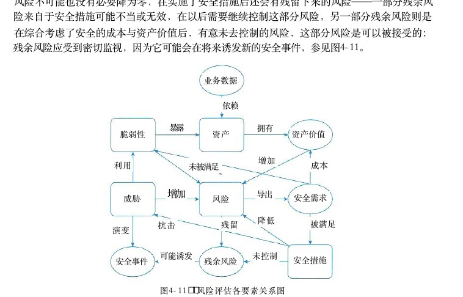

# 第4章 信息安全技术基础知识

> 本页为教材原文文字提取版。图示已按 PDF 页面裁剪并插入正文图注前。

<!-- PDF 第 157 页 -->

信息是一种重要的战略资源，信息的获取、处理和安全保障能力成为一个国家综合国力的重要组成部分，信息安全事关国家安全和社会稳定。信息安全理论与技术的内容十分广泛，包括密码学与信息加密、可信计算、网络安全和信息隐藏等多个方面。

## 4．1 信息安全基础知识

## 4．1．1 信息安全的概念

信息安全包括5个基本要素：机密性、完整性、可用性、可控性与可审查性。

（1）机密性：确保信息不暴露给未授权的实体或进程。

（2）完整性：只有得到允许的人才能修改数据，并且能够判别出数据是否已被篡改。

（3）可用性：得到授权的实体在需要时可访问数据，即攻击者不能占用所有的资源而阻碍授权者的工作。

（4）可控性：可以控制授权范围内的信息流向及行为方式。

（5）可审查性：对出现的信息安全问题提供调查的依据和手段。信息安全的范围包括：设备安全、数据安全、内容安全和行为安全。

## 1）设备安全

信息系统设备的安全是信息系统安全的首要问题，是信息系统安全的物质基础，它包括3个方面。

（1）设备的稳定性：指设备在一定时间内不出故障的概率。

（2）设备的可靠性：指设备在一定时间内正常执行任务的概率。

（3）设备的可用性：指设备可以正常使用的概率。

## 2）数据安全

数据信息可能泄露，可能被篡改，数据安全即采取措施确保数据免受未授权的泄露、篡改和毁坏，包括以下3个方面。

（1）数据的秘密性：指数据不受未授权者知晓的属性。

（2）数据的完整性：指数据是正确的、真实的、未被篡改的、完整无缺的属性。

（3）数据的可用性：指数据可以随时正常使用的属性。

## 3）内容安全

内容安全是信息安全在政治、法律、道德层次上的要求，包括以下3个方面。

（1）信息内容在政治上是健康的。

（2）信息内容符合国家的法律法规。

<!-- PDF 第 158 页 -->

（3）信息内容符合中华民族优良的道德规范。

## 4）行为安全

信息系统的服务功能是指最终通过行为提供给用户，确保信息系统的行为安全，才能最终确保系统的信息安全。行为安全的特性如下。

（1）行为的秘密性：指行为的过程和结果不能危害数据的秘密性。

（2）行为的完整性：指行为的过程和结果不能危害数据的完整性，行为的过程和结果是预期的。

（3）行为的可控性：指当行为的过程偏离预期时，能够发现、控制和纠正。

## 4．1．2信息存储安全

信息的存储安全包括信息使用的安全（如用户的标识与验证、用户存取权限限制、安全问题跟踪等）、系统安全监控、计算机病毒防治、数据的加密和防止非法的攻击等。

## 1．信息使用的安全

## 1）用户的标识与验证

用户的标识与验证主要是限制访问系统的人员。它是访问控制的基础，是对用户身份的合法性验证。用户的标识与验证方法有两种，一是基于人的物理特征的识别，包括签名识别法、指纹识别法和语音识别法；二是基于用户所拥有特殊安全物品的识别，包括智能 IC 卡识别法、磁条卡识别法。

## 2）用户存取权限限制

用户存取权限限制主要是限制进入系统的用户所能做的操作。存取控制是对所有的直接存取活动通过授权进行控制以保证计算机系统安全的保密机制，是对处理状态下的信息进行保护。它一般有两种方法：隔离控制法和限制权限法。

（1）隔离控制法。隔离控制法是在电子数据处理成分的周围建立屏障，以便在该环境中实施存取。隔离控制技术的主要实现方式包括物理隔离方式、时间隔离方式、逻辑隔离方式和密码技术隔离方式等。

（2）限制权限法。限制权限法是有效地限制进入系统的用户所进行的操作。即对用户进行分类管理，安全密级、授权不同的用户分在不同类别；对目录、文件的访问控制进行严格的权限控制，防止越权操作；放置在临时目录或通信缓冲区的文件要加密，用完尽快移走或删除。

## 2．系统安全监控

系统必须建立一套安全监控系统，全面监控系统的活动，并随时检查系统的使用情况，一旦有非法入侵者进入系统，能及时发现并采取相应措施，确定和填补安全及保密的漏洞。还应当建立完善的审计系统和日志管理系统，利用日志和审计功能对系统进行安全监控。管理员还应该经常做以下4方面的工作。

（1）监控当前正在进行的进程和正在登录的用户情况。

（2）检查文件的所有者、授权、修改日期情况和文件的特定访问控制属性。

<!-- PDF 第 159 页 -->

（3）检查系统命令安全配置文件、口令文件、核心启动运行文件、任何可执行文件的修改情况。

（4）检查用户登录的历史记录和超级用户登录的记录，如发现异常应及时处理。

## 3．计算机病毒防治

计算机网络服务器必须加装网络病毒自动检测系统，以保护网络系统的安全，防范计算机病毒的侵袭，并且必须定期更新网络病毒检测系统。由于计算机病毒具有隐蔽性、传染性、潜伏性、触发性和破坏性等特点，所以需要建立计算机病毒防治管理制度。

（1）经常从软件供应商网站下载、安装安全补丁程序和升级杀毒软件。

（2）定期检查敏感文件。对系统的一些敏感文件定期进行检查，以保证及时发现已感染的病毒和黑客程序。

（3）使用高强度的口令。尽量选择难以猜测的口令，对不同的账号选用不同的口令。

（4）经常备份重要数据，要坚持做到每天备份。

（5）选择、安装经过公安部认证的防病毒软件，定期对整个硬盘进行病毒检测和清除工作。

（6）可以在计算机和因特网之间安装使用防火墙，提高系统的安全性。

（7）当计算机不使用时，不要接入因特网，一定要断掉网络连接。

（8）重要的计算机系统和网络一定要严格与因特网物理隔离。

（9）不要打开陌生人发来的电子邮件，无论它们有多么诱人的标题或者附件，同时要小心处理来自于熟人的邮件附件。

（10）正确配置系统和使用病毒防治产品。正确配置系统，充分利用系统提供的安全机制，提高系统防范病毒的能力，减少病毒侵害事件。了解所选用防病毒产品的技术特点，正确配置以保护自身系统的安全。

## 4．1．3 网络安全

## 1．网络安全漏洞

通常，入侵者寻找网络存在的安全弱点，从缺口处无声无息地进入网络。因而开发黑客反击武器的思想是找出现行网络中的安全弱点，演示、测试这些安全漏洞，然后指出应如何堵住安全漏洞。当前，信息系统的安全性非常弱，主要体现在操作系统、计算机网络和数据库管理系统都存在安全隐患，这些安全隐患表现在以下方面。

（1）物理安全性。凡是能够让非授权机器物理接入的地方都会存在潜在的安全问题，也就是能让接入用户做本不允许做的事情。

（2）软件安全漏洞。“特权”软件中带有恶意的程序代码，从而可以导致其获得额外的权限。

（3）不兼容使用安全漏洞。当系统管理员把软件和硬件捆绑在一起时，从安全的角度来看，可以认为系统将有可能产生严重安全隐患。所谓的不兼容性问题，即把两个毫无关系但有用的事物连接在一起，从而导致了安全漏洞。一旦系统建立并运行，这种问题很难被发现。

<!-- PDF 第 160 页 -->

（4）选择合适的安全哲理。这是一种对安全概念的理解和直觉。完美的软件，受保护的硬件和兼容部件并不能保证正常而有效地工作，除非用户选择了适当的安全策略和打开了能增加其系统安全的部件。由于网络传播信息快捷且隐蔽性强，在网络上难以识别用户的真实身份，网络犯罪、黑客攻击、有害信息传播等方面的问题日趋严重，网络安全已成为网络发展中的一个重要课题。网络安全的产生和发展，标志着传统的通信保密时代过渡到了信息安全时代。

## 2．网络安全威胁

一般认为，目前网络存在的威胁主要表现在以下5个方面。

（1）非授权访问。没有预先经过同意就使用网络或计算机资源被看作非授权访问，如有意避开系统访问控制机制，对网络设备及资源进行非正常使用或擅自扩大权限，越权访问信息。它主要有以下几种形式：假冒、身份攻击、非法用户进入网络系统进行违法操作、合法用户以未授权方式进行操作等。

（2）信息泄露或丢失。信息泄露或丢失指敏感数据在有意或无意中被泄露出去或丢失，它通常包括信息在传输中丢失或泄露、信息在存储介质中丢失或泄露以及通过建立隐蔽隧道等方式窃取敏感信息等。如黑客利用电磁泄露或搭线窃听等方式可截获机密信息，或通过对信息流向、流量、通信频度和长度等参数的分析，推测出有用信息，如用户口令、账号等重要信息。

（3）破坏数据完整性。以非法手段窃得对数据的使用权，删除、修改、插入或重发某些重要信息，以取得有益于攻击者的响应；恶意添加，修改数据，以干扰用户的正常使用。

（4）拒绝服务攻击。它不断对网络服务系统进行干扰，改变其正常的作业流程，执行无关程序使系统响应减慢甚至瘫痪，影响正常用户的使用，甚至使合法用户被排斥而不能进入计算机网络系统或不能得到相应的服务。

（5）利用网络传播病毒。通过网络传播计算机病毒的破坏性大大高于单机系统，而且用户很难防范。

## 3．安全措施的目标

安全措施的目标包括如下几个方面。

（1）访问控制。确保会话对方（人或计算机）有权做它所声称的事情。

（2）认证。确保会话对方的资源（人或计算机）与它声称的一致。

（3）完整性。确保接收到的信息与发送的一致。

（4）审计。确保任何发生的交易在事后可以被证实，发信者和收信者都认为交换发生过，即所谓的不可抵赖性。

（5）保密。确保敏感信息不被窃听。

## 4．2信息系统安全的作用与意义

随着信息产业的空前繁荣，危害信息安全的事件也在不断发生。比如：黑客入侵已经成为一种经常性、多发性事件，每年都有许多黑客入侵的严重事件发生。利用计算机进行经济犯罪

<!-- PDF 第 161 页 -->

已超过普通经济犯罪。目前，钓鱼网站、电信诈骗、 QQ诈骗等犯罪活动，已经成为直接骗取民众钱财的常见形式，严重扰乱了社会治安。计算机病毒已超过几万种，而且还在继续增加，追求经济和政治利益、团体作案、形成地下产业链，已经成为计算机病毒的新特点。2010年，美国和以色列黑客利用 APT（Advanced Persistent Threaten） 攻击，物理摧毁了伊朗纳坦兹核工厂上千台铀浓缩离心机，重创伊朗核计划，这一事件表明黑客攻击已经从过去的窃取信息为主的“软打击”，上升到毁坏硬件设备的“硬摧毁”阶段。敌对势力的破坏、恶意软件的入侵、黑客攻击、利用计算机犯罪、网络有害信息泛滥、个人隐私泄露等等，对信息安全构成了极大威胁，严重危害人民的身心健康，危害社会的安定团结，危害了国家的主权与发展。我国正处于建设有中国特色社会主义现代化强国的关键时期，必须采取强有力措施确保我国的信息安全。我国政府高度重视信息安全，2014年中央成立了中央网络安全与信息化领导小组，集中领导与规划我国的信息化发展与信息安全保障，习近平主席亲自担任中央网络安全与信息化领导小组组长。2014年2月，他指出：没有网络安全就没有国家安全，没有信息化就没有现代化。网络安全和信息化是事关国家安全和国家发展、事关广大人民群众工作生活的重大战略问题，要从国际国内大势出发，总体布局，统筹各方，创新发展，努力把我国建成为网络强国。

## 4．3信息安全系统的组成框架

信息系统安全系统框架通常由技术体系、组织机构体系和管理体系共同构建。

## 4．3．1技术体系

从实现技术上来看，信息安全系统涉及基础安全设备、计算机网络安全、操作系统安全、数据库安全、终端设备安全等多方面技术。

（1）基础安全设备包括密码芯片、加密卡、身份识别卡等，此外还涵盖运用到物理安全的物理环境保障技术，建筑物、机房条件及硬件设备条件满足信息系统的机械防护安全，通过对电力供应设备以及信息系统组件的抗电磁干扰和电磁泄漏性能的选择性措施达到相应的安全目的。

（2）计算机网络安全指信息在网络传输过程中的安全防范，用于防止和监控未经授权破坏、更改和盗取数据的行为。通常涉及物理隔离，防火墙及访问控制，加密传输、认证、数字签名、摘要，隧道及 VPN 技术，病毒防范及上网行为管理，安全审计等实现技术。

（3）操作系统安全是指操作系统的无错误配置、无漏洞、无后门、无特洛伊木马等，能防止非法用户对计算机资源的非法存取，一般用来表达对操作系统的安全需求。操作系统的安全机制包括标识与鉴别机制、访问控制机制、最小特权管理、可信通路机制、运行保障机制、存储保护机制、文件保护机制、安全审计机制，等等。

（4）数据库安全可粗略划分为数据库管理系统安全和数据库应用系统安全两个部分，主要涉及物理数据库的完整性、逻辑数据库的完整性、元素安全性、可审计性、访问控制、身份认证、可用性、推理控制、多级保护以及消除隐通道等相关技术。

<!-- PDF 第 162 页 -->

（5）终端安全设备从电信网终端设备的角度分为电话密码机、传真密码机、异步数据密码机等。

## 4 ． 3 ． 2 组织机构体系

组织机构体系是信息系统安全的组织保障系统，由机构、岗位和人事机构三个模块构成一个体系。机构的设置分为3个层次：决策层、管理层和执行层。岗位是信息系统安全管理机关根据系统安全需要设定的负责某一个或某几个安全事务的职位。人事机构是根据管理机构设定的岗位，对岗位上在职、待职和离职的雇员进行素质教育、业绩考核和安全监管的机构。

## 4 ． 3 ． 3 管理体系

管理是信息系统安全的灵魂。信息系统安全的管理体系由法律管理、制度管理和培训管理3个部分组成。所谓“三分技术，七分管理”。

（1）法律管理是根据相关的国家法律、法规对信息系统主体及其与外界关联行为的规范和约束。

（2）制度管理是信息系统内部依据系统必要的国家、团体的安全需求制定的一系列内部规章制度。

（3）培训管理是确保信息系统安全的前提。

## 4．4信息加解密技术

## 4 ． 4 ． 1 数据加密

数据加密是防止未经授权的用户访问敏感信息的手段，这就是人们通常理解的安全措施，也是其他安全方法的基础。研究数据加密的科学叫作密码学 （Cryptography）， 它又分为设计密码体制的密码编码学和破译密码的密码分析学。密码学有着悠久而光辉的历史，古代的军事家已经用密码传递军事情报了，而现代计算机的应用和计算机科学的发展又为这一古老的科学注入了新的活力。现代密码学是经典密码学的进一步发展和完善。由于加密和解密此消彼长的斗争永远不会停止，这门科学还在迅速发展之中。一般的保密通信模型如图4－1所示。

偷听者发送端接收端明文P明文P加密算法E解密算法D密文C＝E（K，P）密钥K密钥K图4－1 保密通信模型从图中可以看出，发送端把明文 P 用加密算法 E 和密钥 K 加密，变换成密文 C ， 即 C＝E（K，P）； 接收端利用解密算法 D 和密钥K 对 C 解密得到明文 P， 即P＝D（K，C）。这里加／解密函数E 和 D 是公开的，而密钥 K （加解密函数的参数）是秘密的。在传送过

<!-- PDF 第 163 页 -->

程中偷听者得到的是无法理解的密文，而他又得不到密钥，这就达到了对第三者保密的目的。需要说明的是，不论偷听者获取了多少密文，但是密文中没有足够的信息，使得可以确定出对应的明文，则这种密码体制叫作是无条件安全的，或称为是理论上不可破解的。在无任何限制的条件下，几乎目前所有的密码体制都不是理论上不可破解的。能否破解给定的密码，取决于使用的计算资源。所以密码专家们研究的核心问题就是要设计出在给定计算费用的条件下，计算上（而不是理论上）安全的密码体制。

## 4．4．2对称密钥加密算法

对称密钥加密算法中加密密钥和解密密钥是相同的，称为共享密钥算法或对称密钥算法。

## 1.DES(Data Encryption Standard)

1977年1月，美国 NSA（National Security Agency） 根据 IBM 的专利技术 Lucifer制定了DES。 明文被分成64位的块，对每个块进行19次变换（替代和换位），其中16次变换由56位的密钥的不同排列形式控制 （ IBM 使用的是128位的密钥），最后产生64位的密文块，如图4－2所示。

明文－

## 16次替换和换位

初始交换反向交换→密文图4－2 DES 加密算法

由于 NSA 减少了密钥，而且对 DES 的制定过程保密，甚至为此取消了IEEE 计划的一次密码学会议。人们怀疑 NSA 的目的是保护自己的解密技术，因而对 DES 从一开始就充满了怀疑和争论。1977年， Diffie和 Hellman 设计了DES 解密机。只要知道一小段明文和对应的密文，该机器就可以在一天之内穷试2°种不同的密钥（这叫作野蛮攻击）。据估计，这个机器当时的造价为2千万美元。三重 DES（Triple－DES） 是 DES 的改进算法，它使用两把密钥对报文做三次 DES 加密，效果相当于将DES 密钥的长度加倍，克服了 DES 密钥长度较短的缺点。本来应该使用3个不同的密钥进行3次加密，这样就可以把密钥的长度加长到3×56＝168位。但许多密码设计者认为168位的密钥已经超过了实际需要，所以便在第1层和第3层中使用相同的密钥，产生一个有效长度为112位的密钥。之所以没有直接采用两重 DES ， 是因为第2层 DES 不是十分安全，它对一种称为“中间可遇”的密码分析攻击极为脆弱，所以最终还是采用了利用两个密钥进行三重 DES 加密操作。假设两个密钥分别是K 1 和 K 2 ， 其算法的步骤如下：

（1）用密钥 K 1 进行 DES 加密。（ 2 ） 用 K 2 对步骤（1）的结果进行 DES 解密。

（3）对步骤（2）的结果使用密钥 K 1 进行 DES 加密。这种方法的缺点是要花费原来3倍的时间，但从另一方面来看，112位密钥长度的三重DES 是很“强壮”的加密方式。

<!-- PDF 第 164 页 -->

2.IDEA(International Data Encryption Algorithm)1990年，瑞士联邦技术学院的来学嘉和 Masscy 建议了一种新的加密算法。这种算法使用128位的密钥，把明文分成64位的块，进行8轮迭代加密。 IDEA 可以用硬件或软件实现，并且比DES 快。在苏黎世技术学院用25MHz 的VLSI 芯片，加密速率是177Mb／s。IDEA 经历了大量的详细审查，对密码分析具有很强的抵抗能力，在多种商业产品中得到应用，已经成为全球通用的加密标准。

3．高级加密标准（Advanced Encryption Standard，AES）1997年1月，美国国家标准与技术局 （NIST） 为高级加密标准征集新算法。最初从许多响应者中挑选了15个候选算法，经过世界密码共同体的分析，选出了其中的5个。经过用 ANSI C和Java语言对5个算法的加／解密速度、密钥和算法的安装时间，以及对各种攻击的拦截程度等进行了广泛的测试后，2000年10月， NIST 宣布 Rijndael算法为 AES 的最佳候选算法，并于2002年5月26日发布为正式的AES 加密标准。AES 支持128、192和256位3种密钥长度，能够在世界范围内免版税使用，提供的安全级别足以保护未来20～30年内的数据，可以通过软件或硬件实现。

## 4 ． 4 ． 3 非对称密钥加密算法

非对称加密算法中使用的加密密钥和解密密钥是不同的，称为不共享密钥算法或非对称密钥算法。1976年，斯坦福大学的 Diffie 和 Hellman 提出了使用不同的密钥进行加密和解密的公钥加密算法。设P 为明文， C 为密文， E 为公钥控制的加密算法， D 为私钥控制的解密算法，这些参数满足下列3个条件：

（1）D（E（P））＝P。

（2）不能由 E 导出 D。

（3）选择明文攻击（选择任意明文－密文对以确定未知的密钥）不能破解E。加密时计算 C＝E（P）， 解密时计算 P＝D（C）。 加密和解密是互逆的。用公钥加密，私钥解密，可实现保密通信；用私钥加密，公钥解密，可实现数字签名。RSA（Rivest Shamir and Adleman） 这是一种公钥加密算法，方法是按照下面的要求选择公钥和密钥：

（1）选择两个大素数p 和 q （大于1010°）。

（2）令 n＝pq、z＝（p－1）（q－1）。

（3）选择 d 与z 互质。

（4）选择 e， 使 ed＝1（modz）。明文P 被分成k 位的块， k 是满足2k＜n 的最大整数，于是有0≤ P＜n。 加密时计算C＝P°（modn）这样公钥为 （e，n）。 解密时计算P＝Cd（modn）即私钥为 （d，n）。

<!-- PDF 第 165 页 -->

用例子说明这个算法，设p＝3，q＝11，n＝33，z＝20，d＝7，e＝3，C＝P3（mod33），P＝C？（mod

33）。则有C = 2 ³ ( mod 3 3 ) = 8 ( mod 3 3 ) = 8 P=8 (mod33)=2097152(mod33)=2RSA算法的安全性基于大素数分解的困难性。如果攻击者可以分解已知的 n， 得到p 和 q，然后可得到 z， 最后用 Euclid 算法，由 e 和 z 得到 d。 然而要分解200位的数，需要40亿年；分解500位的数，则需要1025年。

## 4．5 密钥管理技术

## 4 ． 5 ． 1 对称密钥的分配与管理

密钥分配一般要解决两个问题：一是引进自动分配密钥机制，以提高系统的效率；二是尽可能减少系统中驻留的密钥量。这两个问题也可以同步解决。

## 1．密钥的使用控制

两个用户（主机、进程、应用程序）在进行保密通信时，必须拥有一个共享的并且经常更新的秘密密钥。密钥的分配技术从一定程度上决定着密码系统的强度。控制密钥的安全性主要有以下两种技术。

## 1）密钥标签

例如用于DES 的密钥控制，将DES 中的8个校验位作为控制这个密钥的标签，其中前3位分别代表了该密钥的不同信息：主／会话密钥、加密、解密。但是长度过于限制，且须经解密方能使用，带来了一定的不便性。

## 2）控制矢量

被分配的若干字段分别说明不同情况下密钥是被允许使用或者不允许，且长度可变。它在密钥分配中心 KDC（Key Distribution Center） 产生密钥时加在密钥之中：首先由一杂凑函数将控制矢量压缩到加密密钥等长，然后与主密钥异或后作为加密会话密钥的密钥，即：H = h ( CV )Kn =Km XOR H Kou=EKm XORH[KS]其恢复过程为： KS＝DKm XOR H［EKm XOR H［KS］］用户只有使用与KDC共享的主密钥以及 KDC 发送过来的控制矢量才能恢复会话密钥，因此，须保证保留会话密钥和他控制矢量之间的对应关系。

## 2．密钥的分配

两个用户 A 和 B 在获得共享密钥时可以有4种方式。

（1）经过 A 选取的密钥通过物理手段发送给另一方 B。

（2）由第3方选取密钥，在通过物理手段分别发送给A 和 B。

<!-- PDF 第 166 页 -->

（ 3 ） A 、 B 事先已有一个密钥，其中一方选取新密钥后，用已有密钥加密该新密钥后发送给另一方。

（4）三方 A 、 B 、 C 各有一保密信道， C 选取密钥后，分别通过A 、 B各自的保密信道发送。前两种方法称为人工发送。若网络中N 个用户都要求支持加密服务，则任意一对希望通信的用户各需要一个共享密钥，这导致密钥数目多达N（N－1）／2。 第3种方法攻击者一旦获得一个密钥就可获取以后所有的密钥，这就给安全性带来隐患。这3种方法的公共弱点在于当N 很大时，密钥的分配代价也变得非常大。但是，这种无中心的密钥控制技术在整个网络的局部范围内却显得非常有用。如图4－3所示，其中 N 表示随机数。

①reques4|IN,

B A②Eykm[Kslrequest||IDgIf(N )|N ]

E＆［／（N？）］③图 4 － 3 无 KDC 的密钥分配

第4种方法是较常用的。第3方 C 是为用户分配密钥的 KDC ， 每个用户和 KDC 有一个共享密钥，即主密钥。主密钥再分配给每对用户会话密钥，用于用户间的保密通信。会话密钥在通信结束后立即销毁。虽然此种方法的会话密钥数目是 N （ N － 1 ） ／ 2 ， 但是主密钥的数目却只需要N 个，可以通过物理手段进行发送。如图4－4所示，其中N 表示随机数， Ks表示会话密钥。

KDC①request|IN②E&amp; [Kslrequest||NII Ex(K IDA)③E [Ks|ID]

ABEx，［N？］④

Ex［f（N？）］⑤图 4 － 4 有 KDC 的密钥分配

由于网络中用户数目非常多并且地域分布非常广泛，因此有时需要使用多个KDC 的分层结构。可在每个小范围（如一个 LAN 或一个建筑物）内，建立本地 KDC ； 不同范围的两个本地间可再用一个全局 KDC 连接。这样建立的两层 KDC 不但减少了主密钥的分布，更可以将虚假的KDC 的危害限制到一个局部的区域。另外，应注意会话密钥有效期的设置。会话密钥更换得越频繁，系统的安全性也就越高。但是另一方面，频繁更换会话密钥会造成网络负担，延迟用户之间的交换。因此在决定其有效期时，应权衡矛盾的两个方面。

<!-- PDF 第 167 页 -->

## 4．5．2公钥加密体制的密钥管理

## 1．公开发布

公开发布是指用户将自己的公钥发给每一其他用户，或向某一团体广播。例如： PGP（PrettyGood Privacy） 中采用 RSA算法，很多用户就可将自己的公钥附加到消息上，发送到公开区域。这种方法虽然简单，但有一个非常大的缺点：任何人都可以伪造密钥公开发布。如果某个用户假装是用户 A ， 并以A 的名义向另一用户发送或广播自己的公开钥，则在 A 发现假冒者以前，这一假冒者可解读所有发向 A 的加密消息，甚至还能用伪造的密钥获得认证。

## 2．公用目录表

公用目录表指一个公用的公钥动态目录表，由某个可信的实体或组织（公用目录的管理员）承担该共用目录表的建立、维护以及公钥的分布等。管理员为每个用户在目录表中建立一个目录，其中包括用户名和用户的公开钥两个数据项，并且定期公布和更新目录表。每个用户都亲自或以某种安全的认证通信在管理者那里注册自己的公开钥，可通过电子手段访问目录表，还可随时替换新密钥。但是，这种公用目录表的管理员秘密钥一旦被攻击者获取，同样面临被假冒的危险。

## 3．公钥管理机构

与公用目录表类似的，不过用公钥管理机构来为各用户建立、维护动态的公钥目录，这种对公钥分配更加严密的控制措施可以增强其安全性。特别注意的是，每个用户都可靠地知道管理机构的公开钥，但是只有管理机构自己知道相应的秘密钥。例如：当用户 A 向公钥管理机构发送一个请求时，该机构对请求作出应答，并用自己的秘密钥 SKAu加密后发送给 A ， A 再用机构的公开钥解密。它的缺点在于因为每一用户要想和他人联系都须求助于管理机构，所以容易使管理机构成为系统的瓶颈，并且管理机构维护的公钥目录表也容易被敌手窜扰。

## 4．公钥证书

公钥证书可以从一定程度上解决以上策略存在的一些不足之处。公钥证书是由证书管理机构CA（Certificate Authority） 为用户建立的，其中的数据项有与该用户的秘密钥相匹配的公开钥及用户的身份和时戳等，所有的数据项经CA 用自己的秘密钥签字后就形成证书，即证书的形式为 CA＝ESKcA［T，IDA，PK？］。T是当前的时戳， ID？ 是用户 A 的身份， PKA 是 A 的公钥，SKcA 是 CA 的秘密钥， CA则是用户 A 产生的证书。用户将自己的公开钥通过公钥证书发给另一用户，而接受方则可用 CA 的公钥 PKcA对证书加以验证。这样通过证书交换用户之间的公钥而无须再与公钥管理机构联系，从而避免了由统一机构管理所带来的不便和安全隐患。

## 4．5．3公钥加密分配单钥密码体制的密钥

公开钥分配完之后，用户可用公钥加密体制进行保密通信。但是，这种加密体制的加密速

<!-- PDF 第 168 页 -->

度比较慢，因此比较适合于单钥密码体制的密钥分配，如图4－5所示。

①Epx？［N？｜ID，］

②EpK？［N？｜｜N？］B A③Epxs[N ]

EEKJ]④？［x？［？图4－5 密钥分配

假定 A 、 B双方用户已完成公钥交换，则可利用公钥加密体制按照如下步骤建立共享会话密钥。（ 1 ） A 将用 B 的公钥加密得到的身份 IDA 和一个用于唯一标志这个业务的一次性随机数N，发往 B。（ 2 ） 预使A 确定对方是 B， 则 B 用 A 的公钥加密N？ 和另一新产生的随机数N？， 因为只有B 能解读①中的加密。（ 3 ） A 用 B 的公钥 PKB 对 N？ 加密后返回给 B ， 以使 B 相信对方确是A。（ 4 ） A 将 M＝Epkp［ESKA［Ks］］ 发送给 B ， 其中 Ks 为会话密钥，用 B 的公开钥加密是为保证只有 B 能解读加密结果，用 A 的秘密钥加密是保证该加密结果只有 A 能发送。（ 5 ） B 以DpkA［DskB［M］］恢复会话密钥。这种分配过程的保密性和认证性均非常强，既可防止被动攻击，又可防止主动攻击。

## 4．6访问控制及数字签名技术

## 4 ． 6 ． 1 访问控制技术

互联网络的蓬勃发展，为信息资源的共享提供了更加完善的手段，企业在信息资源共享的同时也要阻止非授权用户对企业敏感信息的访问。访问控制的目的是为了保护企业在信息系统中存储和处理的信息的安全。

## 1．访问控制的基本模型

访问控制是指主体依据某些控制策略或权限对客体本身或是其资源进行的不同授权访问。访问控制包括3个要素，即主体、客体和控制策略。访问控制模型是一种从访问控制的角度出发，描述安全系统，建立安全模型的方法。

（1）主体 （Subject）： 是可以对其他实体施加动作的主动实体，简记为S。 有时我们也称为用户 （User） 或访问者（被授权使用计算机的人员），记为 U。 主体的含义是广泛的，可以是用户所在的组织（以后我们称为用户组）、用户本身，也可是用户使用的计算机终端、卡机、手持终端（无线）等，甚至可以是应用服务程序程序或进程。（ 2 ） 客体 （Object）： 是接受其他实体访问的被动实体，简记为 O。 客体的概念也很广泛，凡是可以被操作的信息、资源、对象都可以认为是客体。在信息社会中，客体可以是信息、文

<!-- PDF 第 169 页 -->

件和记录等的集合体，也可以是网路上的硬件设施，无线通信中的终端，甚至一个客体可以包含另外一个客体。

（3）控制策略：是主体对客体的操作行为集和约束条件集，简记为 KS。 简单讲，控制策略是主体对客体的访问规则集，这个规则集直接定义了主体对可以的作用行为和客体对主体的条件约束。访问策略体现了一种授权行为，也就是客体对主体的权限允许，这种允许不超越规则集，由其给出。访问控制的实现首先要考虑对合法用户进行验证，然后是对控制策略的选用与管理，最后要对没有非法用户或是越权操作进行管理。所以，访问控制包括认证、控制策略实现和审计3方面的内容：

（1）认证。主体对客体的识别认证和客体对主体的检验认证。主体和客体的认证关系是相互的，当一个主体受到另外一个客体的访问时，这个主体也就变成了客体。一个实体可以在某一时刻是主体，而在另一时刻是客体，这取决于当前实体的功能是动作的执行者还是动作的被执行者。

（2）控制策略的具体实现。如何设定规则集合从而确保正常用户对信息资源的合法使用，既要防止非法用户，也要考虑敏感资源的泄露，对于合法用户而言，更不能越权行使控制策略所赋予其权利以外的功能。

（3）审计。审计的重要意义在于，比如客体的管理者即管理员有操作赋予权，他有可能滥用这一权利，这是无法在策略中加以约束的。必须对这些行为进行记录，从而达到威慑和保证访问控制正常实现的目的。

## 2．访问控制的实现技术

建立访问控制模型和实现访问控制都是抽象和复杂的行为，实现访问的控制不仅要保证授权用户使用的权限与其所拥有的权限对应，制止非授权用户的非授权行为；还要保证敏感信息的交叉感染。为了便于讨论这一问题，我们以文件的访问控制为例对访问控制的实现做具体说明。通常用户访问信息资源（文件或是数据库），可能的行为有读、写和管理。为方便起见，用Read 或是R 表示读操作， Write或是 W 表示写操作， Own 或是〇表示管理操作。之所以将管理操作从读写中分离出来，是因为管理员也许会对控制规则本身或是文件的属性等做修改。

## 1）访问控制矩阵

访问控制矩阵 （Access Control Matrix，ACM） 是通过矩阵形式表示访问控制规则和授权用户权限的方法。也就是说，对每个主体而言，都拥有对哪些客体的哪些访问权限；而对客体而言，又有哪些主体对他可以实施访问；将这种关联关系加以阐述，就形成了控制矩阵。其中，特权用户或特权用户组可以修改主体的访问控制权限。访问矩阵是以主体为行索引，以客体为列索引的矩阵，矩阵中的每一个元素表示一组访问方式，是若干访问方式的集合。矩阵中第i行第j 列的元素记录着第 i个主体 S，可以执行的对第j个客体 O ，的访问方式，比如M ，等于表示 S， 可以对O，进行读和写访问。访问控制矩阵的实现很易于理解，但是查找和实现起来有一定的难度，而且，如果用户和文件系统要管理的文件很多，那么控制矩阵将会成几何级数增长。因为在大型系统中访问矩阵很大而且其中会有很多空值，所以目前使用的实现技术都不是保存整个访问矩阵，而是基于访

<!-- PDF 第 170 页 -->

问矩阵的行或者列来保存信息。

## 2）访问控制表

访问控制表 ACLs（Access Control Lists） 是目前最流行、使用最多的访问控制实现技术。每个客体有一个访问控制表，是系统中每一个有权访问这个客体的主体的信息。这种实现技术实际上是按列保存访问矩阵。访问控制表提供了针对客体的方便的查询方法，通过查询一个客体的访问控制表，很容易决定某一个主体对该客体的当前访问权限。删除客体的访问权限也很方便，把该客体的访问控制表整个替换为空表即可。但是用访问控制表来查询一个主体对所有客体的所有访问权限是很困难的，必须查询系统中所有客体的访问控制表来获得其中每一个与该主体有关的信息。类似地，删除一个主体对所有客体的所有访问权限也必须查询所有客体的访问控制表，删除与该主体相关的信息。

## 3 ） 能力表

能力表 （Capabilities） 对应于访问控制表，这种实现技术实际上是按行保存访问矩阵。每个主体有一个能力表 （Cap－ability Lists）， 是该主体对系统中每一个客体的访问权限信息。使用能力表实现的访问控制系统可以很方便地查询某一个主体的所有访问权限，只需要遍历这个主体的能力表即可。然而查询对某一个客体具有访问权限的主体信息就很困难了，必须查询系统中所有主体的能力表。20世纪70年代，很多操作系统的访问控制安全机制是基于能力表实现的，但并没有取得商业上的成功，现代的操作系统大多改用基于访问控制表的实现技术，只有少数实验性的安全操作系统使用基于能力表的实现技术。在一些分布式系统中，也使用了能力表和访问控制表相结合的方法来实现其访问控制安全机制。

## 4）授权关系表

访问矩阵也有既不对应于行也不对应于列的实现技术，那就是对应访问矩阵中每一个非空元素的实现技术——授权关系表 （Authorization Relations）。 授权关系表的每一行（或者说元组）就是访问矩阵中的一个非空元素，是某一个主体对应于某一个客体的访问权限信息。如果授权关系表按主体排序，查询时就可以得到能力表的效率；如果按客体排序，查询时就可以得到访问控制表的效率。安全数据库系统通常用授权关系表来实现其访问控制安全机制。

## 4．6．2数字签名

与人们手写签名的作用一样，数字签名系统向通信双方提供服务，使得 A 向 B 发送签名的消息 P， 以便达到以下几点：（ 1 ） B 可以验证消息P 确实来源于A。（ 2 ） A 以后不能否认发送过 P。（ 3 ） B 不能编造或改变消息 P。

## 1．数字签名的条件

可用的数字签名应保证以下几个条件：

（1）签名是可信的。签名使文件的接收者相信签名者是慎重地在文件上签字的。

（2）签名不可伪造。签名证明是签字者而不是其他人慎重地在文件上签字。

<!-- PDF 第 171 页 -->

（3）签名不可重用。签名是文件的一部分，不法之徒不可能将签名移到不同的文件上。

（4）签名的文件是不可改变的。在文件签名后，文件不能改变。

（5）签名是不可抵赖的。签名和文件是物理的东西。签名者事后不能声称他没有签过名。在现实生活中，关于签名的这些特性没有一个是完全真实的。签名能够被伪造，签名能够从文章中盗用移到另一篇文章中，文件在签名后能够被改变。在计算机上做这种事情，同样存在一些问题。首先计算机文件易于复制。即使某人的签名难以伪造（例如，手写签名的图形），但是从一个文件到另一个文件剪切和粘贴有效的签名都是很容易的。这种签名并没有什么意义；其次文件在签名后也易于修改，并且不会留下任何修改的痕迹。为解决这些问题，数字签名技术就应运而生。

## 2．对称密钥签名

基于对称密钥的签名如图4－6所示。设BB 是 A 和 B 共同信赖的仲裁人。 K ？ 和 KB分别是A 和 B 与 BB 之间的密钥，而KpB 是只有 BB 掌握的密钥， P 是 A 发给 B 的消息， t是时间戳。BB 解读了 A 的报文｛A ， KA （ B ， R ， t ， P ） ｝ 以后产生了一个签名的消息Kg ？ （ A ， t ， P ） ， 并装配成发给 B 的报文｛Kg （ A ， R ？ ， t ， P ， Kgp （ A ， t ， P ） ） ｝ 。 B 可以解密该报文，阅读消息 P，并保留证据 KB （ A ， t ， P ） 。 由于 A 和 B 之间的通信是通过中间人 BB 的，所以不必怀疑对方的身份。又由于证据Kgn （ A ， t ， P ） 的存在， A 不能否认发送过消息 P ， B 也不能改变得到的消息P， 因为 BB 仲裁时可能会当场解密 KgB（A，t，P）， 得到发送人、发送时间和原来的消息 P。

A , K ( B , RA , t , P )ABBB Kg ( A , R , , t , P , KBB ( A , t , P ) )Ks ( Rg )图4－6 基于密钥的数字签名

## 3．公开密钥签名

在对称密码体制中由于加密密钥和解密密钥是可以相互推导的。密钥暴露会使系统变得不安全。而公钥密码体制可以很容易地解决密钥交换问题。在公钥密码系统中，解密密钥和加密密钥是不同的，并且很难从一个推导出另外一个。利用公钥加密算法的数字签名系统如图4－7所示。如果 A 方否认， B 可以拿出 Dx （ P ） ， 并用A 的公钥 EA 解密得到 P ， 从而证明P 是 A 发送的。如果B 篡改消息 P ， 当 A 要求 B 出示原来的D ？ （ P ） 时，B 拿不出来。

发送方接收方A 的私钥A 的公钥B的公钥B的私钥P P EgDg DAEA

D (P)D.(P)Eg ( D ( P ) )图4－7基于公钥的数字签名

<!-- PDF 第 172 页 -->

在实践中，对长文件签名采用公钥密码算法效率太低。为了节约时间，数字签名协议经常和单向 Hash 函数一起使用，即并不对整个文件签名，只对文件的 Hash值签名。基于消息摘要大大地提高了数字签名的计算速度。此外该协议还有其他优点：首先，签名和文件可以分开保存。其次，接收者对文件和签名的存储量要求大大降低。档案系统可用这类协议来验证文件的存在而不需保存它们的内容。用户将文件的 Hash 值传给数据库，数据库加上时间标记并保存，如果对某文件的存在发生争执，数据库可通过找到文件的Hash 值来解决争端。

## 4．7信息安全的抗攻击技术

## 4．7．1密钥的选择

密钥在概念上被分成两大类：数据加密密钥 （ DK ） 和密钥加密密钥 （KK）。 前者直接对数据进行操作，后者用于保护密钥，使之通过加密而安全传递。算法的安全性在于密钥。如果密钥由脆弱的密码程序生成，那么整个系统都将处于极其脆弱的环境中，当攻击者能够分析密钥生成算法时，也就无须分析密码算法了。为对抗攻击者的攻击，密钥生成需要考虑3个方面的因素。

## 1．增大密钥空间

一个密码算法的密钥若设为 N 位，那么该密钥空间为2＾。显然，若某加密程序限制了密钥的位数，那么密钥空间随之减小，特别是当密钥生成程序比较脆弱的话，将导致密钥能够轻易被破译。例如，采用各种专用蛮力攻击硬件和并行技术，无论是对于一台机器甚至是多台机器并行处理，只要每秒测试100万个密钥，破译8字节以下小写字母和小写字母与数字构成的密钥、7字节以下字母数字密钥、6字节以下可打印字母密钥和 ASCⅡI 字符密钥以及5字节以下8位的 ASCII字符密钥都是可以的。另外随着计算机设备的不断改进，对破译的时间和条件要求也越来越少。加长密钥位数，增大密钥空间，对阻止攻击是很有帮助的。例如，采用穷举搜索所有密钥的时间，对于8位 ASCⅡ字符（256个）在4字节密钥空间下只需要1．2小时，在6字节密钥空间下需要8．9年，而在8字节情况下需要580000年！明显增加了攻击的难度。

## 2．选择强钥

在实际应用中，人们为了能方便记忆，往往选择较弱的密钥，如选择 “Klone”， 而不是“＊9（hH＼A－”。 简单的密钥方便了人们的记忆，也方便了攻击者的测试。对于公钥算法，不同的算法对强钥的选择也有不同的规定。

## 3．密钥的随机性

好的生成密钥是一个随机位串。会话密钥的产生，用随机数作为会话密钥；公钥密码算法也采用随机数作为密钥。密钥位可从可靠的随机源获得，如一些物理噪声产生器、离子辐射脉冲检测器、气体放电关、漏电容等；也可从安全的伪随机数发生器借助于安全的密码算法来产生，只要设计得好，能通过各种随机性检验就具有伪随机性。

<!-- PDF 第 173 页 -->

随机数序列需满足随机性和不可预测性的要求。首先，均匀分布和独立性可以用来保证随机数的随机性，数列中每个数的出现频率应基本相等且均不能由其他数推出。在设计密码算法时，经常会使用一种称为伪随机数列的数列。例如在 RSA 算法中素数的产生。一般情况下，决定一个大数N 是否为素数是很困难的。最原始的方法就是用每个比N1／2 小的数去除 N ， 如果 N很大，比如10160，这一方法则超出人类的分析能力和计算能力。另外在相互认证和会话密钥的产生等应用中，更要求数列中以后的数是不可预测的。

## 4．7．2拒绝服务攻击与防御

拒绝服务攻击 DoS（Denial of Service） 是由人为或非人为发起的行动，使主机硬件、软件或者两者同时失去工作能力，使系统不可访问并因此拒绝合法的用户服务要求。拒绝服务攻击的主要企图是借助于网络系统或网络协议的缺陷和配置漏洞进行网络攻击，使网络拥塞、系统资源耗尽或者系统应用死锁，妨碍目标主机和网络系统对正常用户服务请求的及时响应，造成服务的性能受损甚至导致服务中断。由于目前个人计算机或者服务器系统的性能逐渐在提升，网络带宽也由原来的10Mb／s逐步提升到1000Mb／s 甚至是10kMb／s， 个人对其他主机发起攻击行为，要使其性能受损或者服务中断，非常困难。目前常见的拒绝服务攻击为分布式拒绝服务攻击 DDoS（Distributed Denial ofService）。要对服务器实施拒绝服务攻击，有两种思路：

（1）服务器的缓冲区满，不接收新的请求。

（2）使用 IP欺骗，迫使服务器把合法用户的连接复位，影响合法用户的连接。这也是DoS攻击实施的基本思想。

## 1．传统拒绝服务攻击的分类

拒绝服务攻击有许多种，网络的内外部用户都可以发动这种攻击。内部用户可以通过长时间占用系统的内存、 CPU 处理时间使其他用户不能及时得到这些资源，而引起拒绝服务攻击；外部黑客也可以通过占用网络连接使其他用户得不到网络服务。本节主要讨论外部用户实施的拒绝服务攻击。外部用户针对网络连接发动拒绝服务攻击主要有以下几种模式：

（1）消耗资源。计算机和网络需要一定的条件才能运行，如网络带宽、内存、磁盘空间、CPU 时间。攻击者利用系统资源有限这一特征，或者是大量地申请系统资源，并长时间地占用；或者是不断地向服务程序发请求，使系统忙于处理自己的请求，而无暇为其他用户提供服务。攻击者可以针对以下几种资源发起拒绝服务攻击。

● 针对网络连接的拒绝服务攻击；

● 消耗磁盘空间；

● 消耗CPU 资源和内存资源。

（2）破坏或更改配置信息。计算机系统配置上的错误也可能造成拒绝服务攻击，尤其是服务程序的配置文件以及系统、用户的启动文件。这些文件一般只有该文件的属主才可以写入，

<!-- PDF 第 174 页 -->

如果权限设置有误，攻击者（包括已获得一般访问权的黑客与恶意的内部用户）可以修改配置文件，从而改变系统向外提供服务的方式。

（3）物理破坏或改变网络部件。这种拒绝服务针对的是物理安全，一般来说，通过物理破坏或改变网络部件以达到拒绝服务的目的。其攻击的目标有：计算机、路由器、网络配线室、网络主干段、电源、冷却设备、其他的网络关键设备。

（4）利用服务程序中的处理错误使服务失效。最近出现了一些专门针对Windows 系统的攻击方法，如 LAND 等等。被这些工具攻击之后，目标机的网络连接就会莫名其妙地断掉，不能访问任何网络资源或者出现莫名其妙的蓝屏，系统进入死锁状况。这些攻击方法主要利用服务程序中的处理错误，发送一些该程序不能正确处理的数据包，引起该服务进入死循环。

## 2．分布式拒绝服务攻击DDoS

分布式拒绝服务 DDoS 攻击是对传统 DoS 攻击的发展，攻击者首先侵入并控制一些计算机，然后控制这些计算机同时向一个特定的目标发起拒绝服务攻击。传统的拒绝服务攻击有受网络资源的限制和隐蔽性差两大缺点，而分布式拒绝服务攻击却克服了传统拒绝服务攻击的这两个致命弱点。分布式拒绝服务攻击的隐蔽性更强。通过间接操纵网络上的计算机实施攻击，突破了传统攻击方式从本地攻击的局限性。被 DDoS 攻击时可能的现象有：

（1）被攻击主机上有大量等待的 TCP 连接。

（2）大量到达的数据分组（包括 TCP 分组和 UDP 分组）并不是网站服务连接的一部分，往往指向机器的任意端口。

（3）网络中充斥着大量无用的数据包，源地址为假。

（4）制造高流量的无用数据造成网络拥塞，使受害主机无法正常和外界通信。

（5）利用受害主机提供的服务和传输协议上的缺陷，反复发出服务请求，使受害主机无法及时处理所有正常请求。

（6）严重时会造成死机。DDoS引入了分布式攻击和 Client／Server 结构，使DoS 的威力激增。同时， DDoS囊括了ient ient已经出现的各种重要的 DoS攻击方法，比DoS的危害性更大。现有的 DDoS工具一般采用三级结构，如图4－8所示，其中 Client （客户端）HandlerHandlerHandlerHandler运行在攻击者的主机上，用来发起和控制 DDoS攻击；Handler （主控端）运行在已被攻击者侵入并获得控制的主机上，用来控制代理端； Agent（代理端）运行在已被攻击者侵入并获得控制的Agent Agent AgentAgentAgentAgentAgentAgent主机上，从主控端接收命令，负责对目标实施图4－8 DDoS 的三级控制结构实际的攻击。

## 3．拒绝服务攻击的防御方法

操作系统和网络设备的缺陷在不断地被发现，并被攻击者利用来进行恶意的攻击。如果清

<!-- PDF 第 175 页 -->

楚地认识到这一点，应当使用下面的方法尽量阻止拒绝服务攻击。

（1）加强对数据包的特征识别，攻击者在传达攻击命令或发送攻击数据时，虽然都加入了伪装甚至加密，但是其数据包中还是有一些特征字符串。通过搜寻这些特征字符串，就可以确定攻击服务器和攻击者的位置。

（2）设置防火墙监视本地主机端口的使用情况。对本地主机中的敏感端口，如 UDP 31335、UDP27444、TCP 27665 进行监视，如果发现这些端口处于监听状态，则系统很可能受到攻击。即使攻击者已经对端口的位置进行了一定的修改，但如果外部主机主动向网络内部高标号端口发起连接请求，则系统也很可能受到侵入。

（3）对通信数据量进行统计也可获得有关攻击系统的位置和数量信息。例如，在攻击之前，目标网络的域名服务器往往会接收到远远超过正常数量的反向和正向的地址查询。在攻击时，攻击数据的来源地址会发出超出正常极限的数据量。

（4）尽可能的修正已经发现的问题和系统漏洞。

## 4 ． 7 ． 3 欺骗攻击与防御

## 1 ． ARP 欺骗

## 1 ） ARP 欺骗原理

ARP 原理：某机器 A 要向主机 C 发送报文，会查询本地的 ARP 缓存表，找到 C 的 IP 地址对应的 MAC 地址后，就会进行数据传输。如果未找到，则广播一个 ARP 请求报文（携带主机A 的 IP 地址Ia——物理地址 AA：AA：AA：AA）， 请求 IP 地址为 Ic 的主机 C 回答物理地址 Pc。网上所有主机包括C 都收到 ARP 请求，但只有主机 C 识别自己的 IP 地址，于是向 A 主机发回一个 ARP 响应报文。其中就包含有 C 的 MAC 地址CC ： CC ： CC ： CC ， A接收到C 的应答后，就会更新本地的 ARP 缓存。接着使用这个 MAC地址发送数据（由网卡附加 MAC 地址）。因此，本地高速缓存的这个ARP 表是本地网络流通的基础，而且这个缓存是动态的。ARP 协议并不只在发送了 ARP 请求才接收 ARP 应答。当计算机接收到 ARP应答数据包的时候，就会对本地的 ARP缓存进行更新，将应答中的 IP和 MAC地址存储在 ARP 缓存中。因此，局域网中的机器 B 首先攻击 C ， 使 C 瘫痪，然后向A 发送一个自己伪造的 ARP 应答，而如果这个应答是 B 冒充 C 伪造来的，即 IP 地址为 C 的 IP， 而 MAC 地址是 B 的，则当 A接收到 B 伪造的ARP 应答后，就会更MAC: CC:CC:CC:CC新本地的 ARP 缓存，这样在 A 看来 CC 的MAC地址为的IP 地址没有变，而它的 MAC 地址BB:BB:BB:BB已经变成 B 的了。由于局域网的网络C使C 瘫痪流通不是根据 IP 地址进行，而是按照MAC: BB:BB:BB:BBMAC地址进行传输。如此就造成 A 传A送给 C 的数据实际上是传送到 B。 这就是一个简单的 ARP欺骗，如图4－9B所示。图4－9 ARP 欺骗

<!-- PDF 第 176 页 -->

## 2 ） ARP欺骗的防范措施

（ 1 ） 在 Win XP下输入命令：arp －s gate－way－ip gate－way－mac 固化ARP表，阻止 ARP 欺骗。（ 2 ） 使用 ARP 服务器。通过该服务器查找自己的 ARP 转换表来响应其他机器的 ARP 广播。确保这台 ARP 服务器不被黑。

（3）采用双向绑定的方法解决并且防止ARP 欺骗。（ 4 ） ARP 防护软件——ARP Guard。 通过系统底层核心驱动，无须安装其他任何第三方软件 （ 如 WinPcap）， 以服务及进程并存的形式随系统启动并运行，不占用计算机系统资源。无须对计算机进行 IP地址及 MAC 地址绑定，从而避免了大量且无效的工作量。也不用担心计算机会在重启后新建 ARP 缓存列表，因为此软件是以服务与进程相结合的形式存在于计算机中，当计算机重启后软件的防护功能也会随操作系统自动启动并工作。

## 2． DNS欺骗

DNS 欺骗是一种比较常见的攻击手段。一个著名的利用 DNS 欺骗进行攻击的案例是，全球著名网络安全销售商 RSA Security的网站所遭到的攻击。其实 RSA Security网站的主机并没有被入侵，而是 RSA 的域名被黑客劫持，当用户连上 RSA Security 时，发现主页被改成了其他的内容。

## 1 ） DNS欺骗的原理

DNS 欺骗首先是冒充域名服务器，然后把查询的 IP 地址设为攻击者的 IP 地址，这样的话，用户上网就只能看到攻击者的主页，而不是用户想要取得的网站的主页了，这就是 DNS 欺骗的基本原理。 DNS 欺骗其实并不是真的“黑掉”了对方的网站，而是冒名顶替、招摇撞骗罢了。

## 2 ） DNS 欺骗的现实过程

如图4－10所示， www．xxx．com 的 IP地址为202．109．2．2，如果 www．angel．com 向xxx．com的子域 DNS 服务器查询 www．xxx．com 的 IP地址时， www．heike．com 冒充 DNS 向 www．angel．com 回复www．xxx．com 的 IP地址为200．1．1．1，这时 www．angel．com 就会把200．1．1．1当www．xxx．com 的地址了。当www．angel．com 连 www．xxx．com时，就会转向那个虚假的 IP 地址了，这样对 www．xxx．com 来说，就算是给黑掉了。因为别人根本连接不上他的域名。

DNVS www . xxx . com 'DNS服务器询IP:200.1.1.1

\ www.angle.com www . XXX . com IP: 202.109.2.2

www.heike.com IP:200.1.1.1图4－10 DNS 欺骗

<!-- PDF 第 177 页 -->

## 3 ） DNS 欺骗的检测

根据检测手段的不同，将其分为被动监听检测、虚假报文探测和交叉检查查询3种。

（1）被动监听检测。该检测手段是通过旁路监听的方式，捕获所有 DNS 请求和应答数据包，并为其建立一个请求应答映射表。如果在一定的时间间隔内，一个请求对应两个或两个以上结果不同的应答包，则怀疑受到了 DNS 欺骗攻击，因为DNS 服务器不会给出多个结果不同的应答包，即使目标域名对应多个IP 地址， DNS 服务器也会在一个 DNS 应答包中返回，只是有多个应答域 （Answer Section） 而已。

（2）虚假报文探测。该检测手段采用主动发送探测包的手段来检测网络内是否存在DNS 欺骗攻击者。这种探测手段基于一个简单的假设：攻击者为了尽快地发出欺骗包，不会对域名服务器 IP 的有效性进行验证。这样如果向一个非 DNS服务器发送请求包，正常来说不会收到任何应答，但是由于攻击者不会验证目标IP 是否是合法 DNS 服务器，他会继续实施欺骗攻击，因此如果收到了应答包，则说明受到了攻击。

（3）交叉检查查询。所谓交叉检查即在客户端收到 DNS 应答包之后，向 DNS 服务器反向查询应答包中返回的 IP 地址所对应的 DNS 名字，如果二者一致说明没有受到攻击，否则说明被欺骗。

## 3．IP欺骗

## 1 ） IP 欺骗的原理

通过编程的方法可以随意改变发出的包的 IP地址，但工作在传输层的 TCP 协议是一种相对可靠的协议，不会让黑客轻易得逞。由于 TCP 是面向连接的协议，所以在双方正式传输数据之前，需要用“三次握手”来建立一个值得信赖的连接。假设是 hosta和 hostb两台主机进行通信， hostb 首先发送带有 SYN 标志的数据段通知hosta建立 TCP 连接， TCP 的可靠性就是由数据包中的多位控制字来提供的，其中最重要的是数据序列 SYN 和数据确认标志 ACK 。 B将TCP 报头中的 SYN设为自己本次连接中的初始值 （ISN）。假如想冒充 hostb 对 hosta进行攻击，就要先使 hostb 失去工作能力。也就是所谓的拒绝服务攻击，让 hostb 瘫痪。

## 2 ） IP 欺骗的防范

虽然 IP 欺骗攻击有着相当难度，但这种攻击非常广泛，入侵往往由这里开始。预防这种攻击可以删除 UNIX 中所有的／etc／hosts．equiv、￥HOME／．rhosts 文件，修改／etc／inetd．conf文件，使得 RPC 机制无法应用。另外，还可以通过设置防火墙过滤来自外部而信源地址却是内部 IP 的报文。

## 4．7．4端口扫描

网络中的每一台计算机如同一座城堡，在这些城堡中，有的对外完全开放，有的却是紧锁城门。在网络技术中，把这些城堡的城门称之为计算机的“端口”。端口扫描是入侵者搜集信息的几种常用手法之一，也正是这一过程最容易使入侵者暴露自己的身份和意图，所以利用暴露的信息可以防范此类攻击。一般来说，扫描端口有如下目的。

<!-- PDF 第 178 页 -->

（1）判断目标主机上开放了哪些服务。

（2）判断目标主机的操作系统。如果入侵者掌握了目标主机开放了哪些服务，运行何种操作系统，他们就能够使用相应的手段实现入侵。

## 1．端口扫描原理

端口在计算机网络领域中是个非常重要的概念。它是专门为计算机通信而设计的，它不是硬件，不同于计算机中的“插槽”，可以说是个“软插槽”。如果有需要的话，一台计算机中可以有上万个端口。端口是由计算机的通信协议 TCP／IP 协议定义的。 TCP／IP 协议规定，用 IP 地址和端口作为套接字，它代表 TCP 连接的一个连接端，一般称为 Socket。 具体来说，就是用 ［IP： 端口］来定位一台主机中的进程。可以做这样的比喻，端口相当于两台计算机进程间的大门，可以随便定义，其目的只是为了让两台计算机能够找到对方的进程。计算机就像一座大楼，这个大楼有好多入口（端口），进到不同的入口中就可以找到不同的公司（进程）。如果要和远程主机 A 的程序通信，那么只要把数据发向 ［A： 端口］就可以实现通信了。端口扫描就是尝试与目标主机的某些端口建立连接，如果目标主机该端口有回复（见三次握手中的第二次），则说明该端口开放，即为“活动端口”。

## 2．扫描原理分类

（ 1 ） 全 TCP 连接。这种扫描方法使用三次握手，与目标计算机建立标准的TCP 连接。需要说明的是，这种古老的扫描方法很容易被目标主机记录。

（2）半打开式扫描 （ SYN 扫描）。在这种扫描技术中，扫描主机自动向目标计算机的指定端口发送 SYN 数据段，表示发送建立连接请求。

● 如果目标计算机的回应报文中则说明该端口是活动的，接着扫描TCPSYN=1,ACK=1,主机传送一个RST给目标主机拒绝建立TCP连接，从而导致三次握手的过程失败。

● 如果目标计算机的回应是则表示该端口为“死端口”，这种情况下，扫描主机不RST,用做任何回应。由于扫描过程中，全连接尚未建立，所以大大降低了被目标计算机记录的可能性，并且加快了扫描的速度。（ 3 ） FIN 扫描。在前面介绍过的 TCP报文中，有一个字段为 FIN ， FIN扫描则依靠发送FIN 来判断目标计算机的指定端口是否是活动的。发送一个 FIN＝1 的 TCP 报文到一个关闭的端口时，该报文会被丢掉，并返回一个RST 报文。但是，如果当 FIN 报文到一个活动的端口时，该报文只是被简单的丢掉，不会返回任何回应。从FIN 扫描可以看出，这种扫描没有涉及任何TCP 连接部分。因此，这种扫描比前两种都安全，可以称之为秘密扫描。

（4）第三方扫描。第三方扫描又称“代理扫描”，这种扫描是利用第三方主机来代替入侵者进行扫描。这个第三方主机一般是入侵者通过入侵其他计算机而得到的，该“第三方”主机常被入侵者称之为“肉鸡”。这些“肉鸡”一般为安全防御系数极低的个人计算机。

<!-- PDF 第 179 页 -->

## 4 ． 7 ． 5 强化TCP ／ IP堆栈以抵御拒绝服务攻击

针对 TCP／IP堆栈的攻击方式有多种类型，下面分别介绍攻击原理及抵御方法。

## 1．同步包风暴 （SYN Flooding）

同步包风暴是当前最流行的DoS （拒绝服务攻击）与 DDoS （分布式拒绝服务攻击）的方式之一，是应用最广泛的一种 DoS 攻击方式，它的原理虽然简单，但使用起来却十分有效。问题出在 TCP 连接的三次握手中，假设一个用户向服务器发送了 SYN报文后突然死机或掉线，那么服务器在发出SYN ＋ ACK应答报文后是无法收到客户端的 ACK报文的（第三次握手无法完成），这种情况下服务器端一般会重试（再次发送 SYN ＋ ACK 给客户端），并等待一段时间后丢弃这个未完成的连接，这段时间的长度称为 SYN Timeout， 一般来说这个时间是分钟的数量级（大约为30秒～2分钟）；一个用户出现异常导致服务器的一个线程等待1分钟并不是什么很大的问题，但如果有一个恶意的攻击者大量模拟这种情况，服务器端将为了维护一个非常大的半连接列表而消耗非常多的资源——数以万计的半连接，即使是简单的保存并遍历也会消耗非常多的CPU 时间和内存，何况还要不断对这个列表中的 IP 进行SYN ＋ ACK 的重试。实际上如果服务器的 TCP／IP 堆栈不够强大，最后的结果往往是堆栈溢出崩溃。即使服务器端的系统足够强大，服务器端也将忙于处理攻击者伪造的 TCP 连接请求而无暇理睬客户的正常请求（毕竟客户端的正常请求比率非常之小），此时从正常客户的角度看来，服务器失去响应。这种情况被称作：服务器端受到了 SYN Flooding 攻击。如果攻击者盗用的是某台可达主机X 的IP地址，由于主机 X 没有向主机 D 发送连接请求，所以当它收到来自 D 的 SYN ＋ ACK 包时，会向D 发送 RST 包，主机 D 会将该连接重置。因此，攻击者通常伪造主机 D 不可达的 IP 地址作为源地址。攻击者只要发送较少的、来源地址经过伪装，而且无法通过路由达到的 SYN 连接请求至目标主机提供 TCP 服务的端口，将目的主机的 TCP 缓存队列填满，就可以实施一次成功的攻击。实际情况下，攻击者往往会持续不断地发送 SYN 包，故称为 “SYN 洪水”。可以通过修改注册表防御 SYN Flooding攻击，修改键值位于注册表项HKEY ＿ LOCAL ＿MACHINE＼SYSTEM＼CurrentControlSet Services 的下面，如表4－1所示。表 4 － 1 防御SYN Flooding 攻击所需修改键值值 （ REG ＿ DWORD ）值名称SynAttackProtect2TcpMaxPortsExhausted TcpMaxHalfOpen5 0 0TcpMaxHalfOpenRetried Tcp Max ConnectResponseRetransmissions TcpMaxDataRetransmissions EnablePMTUDiscovery

## 300000（5分钟）

KeepAliveTime NoNameReleaseOnDemand

<!-- PDF 第 180 页 -->

## 2． ICMP攻击

ICMP 协议是 TCP／IP 协议集中的一个子协议，主要用于在主机与路由器之间传递控制信息，包括报告错误、交换受限控制和状态信息等。当遇到 IP 数据无法访问目标， IP路由器无法按当前的传输速率转发数据包等情况时，会自动发送 ICMP消息。我们可以通过 Ping 命令发送ICMP 回应请求消息并记录收到 ICMP 回应的回复消息，通过这些消息来对网络或主机的故障提供参考依据。ICMP 协议本身的特点决定了它非常容易被用于攻击网络上的路由器和主机。比如，前面提到的 “Ping of Dcath” 攻击就是利用操作系统规定的 ICMP 数据包的最大尺寸不超过64KB 这一规定，达到使 TCP／IP堆栈崩溃、主机死机的效果。可以通过修改注册表防御 ICMP 攻击，修改键值位于注册表项HKLMSystem CurrentControlSet＼Services＼AFD＼Parameters 的下面，如表4－2所示。表4－2 防御ICMP攻击所需修改键值

值名称值 （ REG ＿ DWORD ）EnableICMPRedirect

## 3 ． SNMP 攻击

SNMP 是 TCP／IP 网络中标准的管理协议，它允许网络中的各种设备和软件，包括交换机、路由器、防火墙、集线器、操作系统、服务器产品和部件等，能与管理软件通信，汇报其当前的行为和状态。但是， SNMP 还能被用于控制这些设备和产品，重定向通信流，改变通信数据包的优先级，甚至断开通信连接。总之，入侵者如果具备相应能力，就能完全接管你的网络。可以通过修改注册表项HKLMSystem CurrentControlSet Services TcpiplParameters的键值防御SNMP攻击，如表4－3所示。表4－3 防御SNMP攻击所需修改键值值名称值 （ REG ＿ DWORD ）EnableDcadGWDetect

## 4．7．6系统漏洞扫描

系统漏洞扫描指对重要计算机信息系统进行检查，发现其中可能被黑客利用的漏洞。系统漏洞扫描的结果是对系统安全性能的一个评估，指出了哪些攻击是可能的，因此，成为安全方案的一个重要组成部分。目前，从底层技术来划分，可以将系统漏洞扫描分为基于网络的扫描和基于主机的扫描这两种类型。

## 1．基于网络的漏洞扫描

基于网络的漏洞扫描器，是通过网络来扫描远程计算机中的漏洞。比如，利用低版本的

<!-- PDF 第 181 页 -->

DNS Bind 漏洞，攻击者能够获取 root权限，侵入系统或者攻击者能够在远程计算机中执行恶意代码。使用基于网络的漏洞扫描工具，能够监测到这些低版本的 DNS Bind 是否在运行。一般来说，基于网络的漏洞扫描工具可以看作为一种漏洞信息收集工具，根据不同漏洞的特性，构造网络数据包，发给网络中的一个或多个目标服务器，以判断某个特定的漏洞是否存在。基于网络的漏洞扫描器，一般由以下几个方面组成。

（1）漏洞数据库模块。漏洞数据库包含了各种操作系统的各种漏洞信息，以及如何检测漏洞的指令。

（2）用户配置控制台模块。用户配置控制台与安全管理员进行交互，用来设置要扫描的目标系统以及扫描哪些漏洞。

（3）扫描引擎模块。扫描引擎是扫描器的主要部件。根据用户配置控制台部分的相关设置，扫描引擎组装好相应的数据包，发送到目标系统，将接收到的目标系统的应答数据包与漏洞数据库中的漏洞特征进行比较，来判断所选择的漏洞是否存在。

（4）当前活动的扫描知识库模块。通过查看内存中的配置信息，该模块监控当前活动的扫描，将要扫描的漏洞的相关信息提供给扫描引擎。

（5）结果存储器和报告生成工具。报告生成工具，利用当前活动扫描知识库中存储的扫描结果，生成扫描报告。基于网络的漏洞扫描器有很多优点：

（1）基于网络的漏洞扫描器的价格相对来说比较便宜。

（2）基于网络的漏洞扫描器在操作过程中，不需要涉及目标系统的管理员。

（3）基于网络的漏洞扫描器在检测过程中，不需要在目标系统上安装任何东西。

（4）维护简便。当企业的网络发生了变化的时候，只要某个结点能够扫描网络中的全部目标系统，基于网络的漏洞扫描器不需要进行调整。

## 2．基于主机的漏洞扫描

基于主机的漏洞扫描器，扫描目标系统漏洞的原理与基于网络的漏洞扫描器的原理类似，但是两者的体系结构不一样。基于主机的漏洞扫描器通常在目标系统上安装了一个代理（Agent） 或者是服务 （Services）， 以便能够访问所有的文件与进程，这也使得基于主机的漏洞扫描器能够扫描更多的漏洞。基于主机的漏洞扫描优点：

（1）扫描的漏洞数量多。

（2）集中化管理。基于主机的漏洞扫描器通常都有个集中的服务器作为扫描服务器。所有扫描的指令，均从服务器进行控制，这一点与基于网络的扫描器类似。服务器下载到最新的代理程序后，再分发给各个代理。这种集中化管理模式，使得基于主机的漏洞扫描器在部署上能够快速实现。

（3）网络流量负载小。由于 ESM 管理器与 ESM 代理之间只有通信的数据包，漏洞扫描部分都由 ESM 代理单独完成，这就大大减少了网络的流量负载。当扫描结束后， ESM 代理再次与 ESM 管理器进行通信，将扫描结果传送给 ESM 管理器。

<!-- PDF 第 182 页 -->

## 4．8信息安全的保障体系与评估方法

## 4．8．1计算机信息系统安全保护等级

《计算机信息系统安全保护等级划分准则》 （GB 17859—1999） 规定了计算机系统安全保护能力的5个等级。

（1）第1级：用户自主保护级（对应 TCSEC 的 C 1 级）。本级的计算机信息系统可信计算基 （Trusted Computing Base） 通过隔离用户与数据，使用户具备自主安全保护的能力。它具有多种形式的控制能力，对用户实施访问控制，即为用户提供可行的手段，保护用户和用户组信息，避免其他用户对数据的非法读写与破坏。

（2）第2级：系统审计保护级（对应 TCSEC 的 C 2 级）。与用户自主保护级相比，本级的计算机信息系统可信计算基实施了粒度更细的自主访问控制，它通过登录规程、审计安全性相关事件和隔离资源，使用户对自己的行为负责。

（3）第3级：安全标记保护级（对应TCSEC 的 B 1 级）。本级的计算机信息系统可信计算基具有系统审计保护级所有功能。此外，还提供有关安全策略模型、数据标记以及主体对客体强制访问控制的非形式化描述；具有准确地标记输出信息的能力；消除通过测试发现的任何错误。

（4）第4级：结构化保护级（对应 TCSEC 的 B 2 级）。本级的计算机信息系统可信计算基建立于一个明确定义的形式化安全策略模型之上，它要求将第三级系统中的自主和强制访问控制扩展到所有主体与客体。此外，还要考虑隐蔽通道。本级的计算机信息系统可信计算基必须结构化为关键保护元素和非关键保护元素。计算机信息系统可信计算基的接口也必须明确定义，使其设计与实现能经受更充分的测试和更完整的复审。它加强了鉴别机制；支持系统管理员和操作员的职能；提供可信设施管理；增强了配置管理控制。系统具有相当的抗渗透能力。

（5）第5级：访问验证保护级（对应TCSEC 的B 3 级）。本级的计算机信息系统可信计算基满足访问监控器需求。访问监控器仲裁主体对客体的全部访问。访问监控器本身是抗篡改的；必须足够小，能够分析和测试。为了满足访问监控器需求，计算机信息系统可信计算基在其构造时，排除了那些对实施安全策略来说并非必要的代码；在设计和实现时，从系统工程角度将其复杂性降低到最小程度。支持安全管理员职能；扩充审计机制，当发生与安全相关的事件时发出信号；提供系统恢复机制。系统具有很高的抗渗透能力。

## 4．8．2安全风险管理

信息系统的安全风险，是指由于系统存在的脆弱性，人为或自然的威胁导致安全事件发生所造成的影响。信息安全风险评估，则是指依据国家有关信息安全技术标准，对信息系统及由其处理、传输和存储的信息的保密性、完整性和可用性等安全属性进行科学评价的过程，它要评估信息系统的脆弱性、信息系统面临的威胁以及脆弱性被威胁源利用后所产生的实际负面影响，并根据安全事件发生的可能性和负面影响的程度来识别信息系统的安全风险。信息安全风险评估是信息安全保障体系建立过程中重要的评价方法和决策机制。没有准确及时的风险评估，

<!-- PDF 第 183 页 -->

将使得各个机构无法对其信息安全的状况做出准确的判断。风险评估的准备过程是组织进行风险评估的基础，是整个风险评估过程有效性的保证。组织对自身信息及信息系统进行风险评估的结果将受到业务需求及战略目标、文化、业务流程、安全要求、规模和结构的影响。不同组织对于风险评估的实施过程可能存在不同的要求，因此在风险评估实施前，应该考虑如下内容。

（1）确定风险评估的范围。进行风险评估可能是由于自身的商业要求、战略目标的要求、相关方的要求或其他原因，因此应根据上述原因确定风险评估范围。风险评估的范围可能是组织全部的信息和信息系统，可能是单独的信息系统，可能是组织的关键业务流程，也可能是客户的知识产权。

（2）确定风险评估的目标。组织应明确风险评估的目标，为风险评估的过程提供导向。支持组织的信息、系统、应用软件和网络是组织重要的资产。资产的保密性、完整性和可用性对于维持竞争优势、现金流动、获利能力、法规要求和组织形象是必要的。组织要面对来自四面八方日益增长的安全威胁，系统、应用软件和网络可能是严重威胁的目标。同时，由于组织的信息化程度的不断提高，对基于信息系统和服务技术的依赖日益增加，一个组织则可能出现更多的脆弱性。组织风险评估的目标基本上来源于组织业务持续发展的需要、满足相关方的要求、满足法律法规的要求等方面。

（3）建立适当的组织结构。在风险评估过程中，组织应建立适当的组织结构，以支持整个过程的推进，如成立由管理层、相关业务骨干、 IT 技术人员等组成的风险评估小组。组织结构的建立应考虑其结构和复杂程度，以保证能够满足风险评估的范围、目标。

（4）建立系统性的风险评估方法。风险评估方法应考虑评估的范围、目的、时间、效果、组织文化、人员素质以及开展程度等因素来确定，使之能够与环境和安全要求相适应。

（5）获得最高管理者对风险评估策划的批准。上述所有内容应得到组织的最高管理者的批准，并对管理层和员工进行传达。根据评估实施者的不同，将风险评估形式分为自评估和他评估两大类。自评估是由被评估信息系统的拥有者依靠自身的力量，对其自身的信息系统进行的风险评估活动。他评估则是被评估信息系统拥有者的上级主管机关或业务主管机关发起的，依据已经颁布的法规或标准进行的具有强制意味的检查活动，是通过行政手段加强信息安全的重要措施。他评估也是经常提及的检查评估，自评估和他评估都可以通过信息安全风险评估服务机构进行风险评估的咨询、服务、培训以及得到风险评估有关工具。风险评估的基本要素为脆弱性、资产、威胁、风险和安全措施，与这些要素相关的属性分别为业务战略、资产价值、安全需求、安全事件和残余风险，这些也是风险评估要素的一部分。风险评估的工作是围绕其基本要素展开的，在对这些要素的评估过程中需要充分考虑业务战略、资产价值、安全事件和残余风险等与这些基本要素相关的各类因素。这些要素之间存在着以下关系：业务战略依赖于资产去完成；资产拥有价值，单位的业务战略越重要，对资产的依赖度越高，资产的价值则就越大，风险也越大，并可能演变成安全事件；威胁都要利用脆弱性，脆弱性越大则风险越大；脆弱性使资产暴露，是未被满足的安全需求，威胁要通过利用脆弱性来危害资产，从而形成风险；资产的重要性和对风险的意识会导出安全需求；安全需求要通过安

<!-- PDF 第 184 页 -->

全措施来得以满足，且是有成本的；安全措施可以抗击威胁，降低风险，减弱安全事件的影响；风险不可能也没有必要降为零，在实施了安全措施后还会有残留下来的风险——一部分残余风险来自于安全措施可能不当或无效，在以后需要继续控制这部分风险，另一部分残余风险则是在综合考虑了安全的成本与资产价值后，有意未去控制的风险，这部分风险是可以被接受的；残余风险应受到密切监视，因为它可能会在将来诱发新的安全事件，参见图4－11。

业务数据

依赖

暴露拥有脆弱性资产资产价值

增加利用成本未被满足

增加导出威胁安全需求风险

降低被满足残留抗击演变

可能诱发未控制安全措施安全事件残余风险

图4－11 风险评估各要素关系图在一般的评估体系中，资产大多属于不同的信息系统，业务生产系统的数量还可能会很多，需要将信息系统及其中的信息资产进行恰当的分类，才能进行下一步的风险评估工作。在实际项目中，具体的资产分类方法根据具体环境由评估者来灵活把握。资产赋值是对资产安全价值的估价，而不是以资产的账面价格来衡量。在对资产进行估价时，不仅要考虑资产的成本价格，还要考虑资产对于组织业务的安全重要性，即根据资产损失所引发的潜在商务影响来决定。为确保资产估价时的一致性和准确性，机构应该建立一个资产价值尺度，明确如何对资产进行赋值。资产估价的过程也就是对资产保密性、完整性和可用性影响分析的过程。影响就是由人为或突发性引起的安全事件对资产破坏的后果，这一后果可能毁灭某些资产，危及信息系统并使其丧失保密性、完整性和可用性，最终还会导致财政损失、市场份额或公司形象的损失。特别重要的是，即使每一次影响引起的损失并不大，但长期积累的众多意外事件的影响总和则可造成严重损失。一般情况下，影响主要从以下几方面来考虑。

（1）违反了有关法律或（和）规章制度。

（2）影响了业务执行。

（3）造成了信誉、声誉损失。

（4）侵犯了个人隐私。

（5）造成了人身伤害。

<!-- PDF 第 185 页 -->

（6）对法律实施造成了负面影响。

（7）侵犯了商业机密。

（8）违反了社会公共准则。

（9）造成了经济损失。

（10）破坏了业务活动。

（11）危害了公共安全。资产安全属性的不同通常也意味着安全控制、保护功能需求的不同。通过考察保密性、完整性和可用性3种不同的安全属性，能够基本反映资产的价值。安全威胁是一种对机构及其资产构成潜在破坏的可能性因素或者事件。无论对于多么安全的信息系统，安全威胁都是一个客观存在的事物，它是风险评估的重要因素之一。产生安全威胁的主要因素可以分为人为因素和环境因素。人为因素又可区分为有意和无意两种。环境因素包括自然界的不可抗的因素和其他物理因素。威胁作用形式可以是对信息系统直接或间接的攻击，例如非授权的泄露、篡改、删除等，在保密性、完整性或可用性等方面造成损害。也可能是偶发的或蓄意的事件。一般来说，威胁总是要利用网络、系统、应用或数据的弱点才可能成功地对资产造成伤害。安全事件及其后果是分析威胁的重要依据。但是有相当一部分威胁发生时，由于未能造成后果或者没有意识到，而被安全管理人员忽略。这将导致对安全威胁的认识出现偏差。在威胁评估过程中，首先就要对组织需要保护的每一项关键资产进行威胁识别。在威胁识别过程中，应根据资产所处的环境条件和资产以前遭受威胁损害的情况来判断。一项资产可能面临着多个威胁，同样一个威胁可能对不同的资产造成影响。脆弱性评估是安全风险评估中的重要内容。弱点包括物理环境、组织、过程、人员、管理、配置、硬件、软件和信息等各种资产的脆弱性。弱点是资产本身存在的，它可以被威胁利用、引起资产或商业目标的损害。值得注意的是，弱点虽然是资产本身固有的，但它本身不会造成损失，它只是一种条件或环境，可能导致被威胁利用而造成资产损失。如果没有相应的威胁发生，单纯的弱点并不会对资产造成损害。那些没有安全威胁的弱点可以不需要实施安全保护措施，但它们必须记录下来以确保当环境、条件有所变化时能随之加以改变。需要注意的是不正确的、起不到应有作用的或没有正确实施的安全保护措施本身就可能是一个安全薄弱环节。脆弱性评估将针对每一项需要保护的信息资产，找出每一种威胁所能利用的脆弱性，并对脆弱性的严重程度进行评估，即对脆弱性被威胁利用的可能性进行评估，最终为其赋相对等级值。在进行脆弱性评估时，提供的数据应该来自于这些资产的拥有者或使用者，来自于相关业务领域的专家以及软硬件信息系统方面的专业人员。脆弱性评估所采用的方法主要有问卷调查、人员问询、工具扫描、手动检查、文档审查、渗透测试等。脆弱性主要从技术和管理两个方面进行评估，涉及物理层、网络层、系统层、应用层、管理层等各个层面的安全问题。其中在技术方面主要是通过远程和本地两种方式进行系统扫描，对网络设备和主机等进行人工抽查，以保证技术脆弱性评估的全面性和有效性；管理脆弱性评估方面可以按照BS7799 等标准的安全管理要求对现有的安全管理制度及其执行情况进行检查，发现其中的管理漏洞和不足。风险计算模型包含信息资产、弱点／脆弱性、威胁等关键要素。每个要素有各自的属性，信息资产的属性是资产价值，弱点的属性是弱点被威胁利用后对资产带来的影响的严重程度，

<!-- PDF 第 186 页 -->

威胁的属性是威胁发生的可能性。风险计算的过程如下。

（1）对信息资产进行识别，并对资产赋值。

（2）对威胁进行分析，并对威胁发生的可能性赋值。

（3）识别信息资产的脆弱性，并对弱点的严重程度赋值。

（4）根据威胁和脆弱性计算安全事件发生的可能性。

（5）结合信息资产的重要性和发生安全事件的可能性，计算信息资产的风险值。
