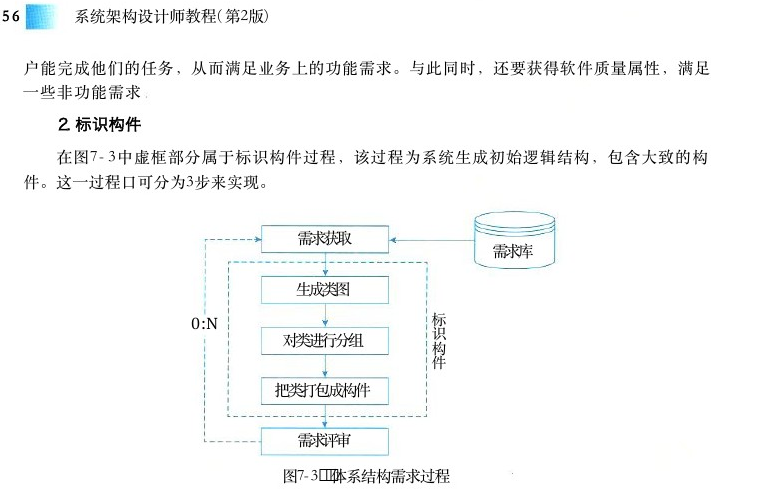
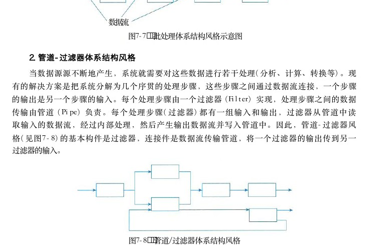
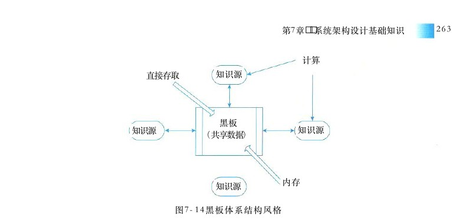
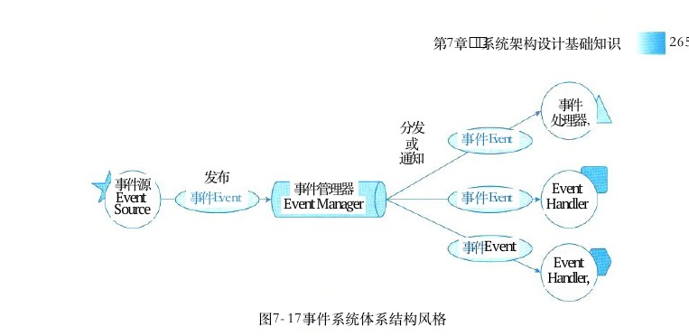
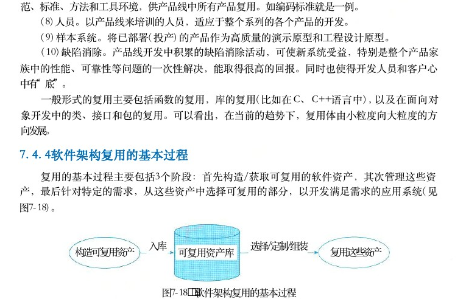
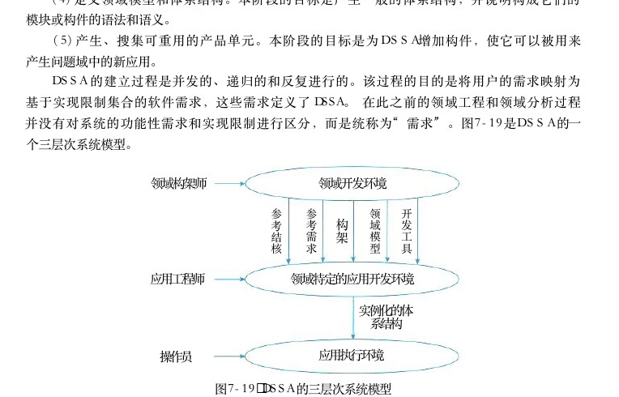

# 第7章 系统架构设计基础知识

> 本页为教材原文文字提取版。图示已按 PDF 页面裁剪并插入正文图注前。

<!-- PDF 第 260 页 -->

Shaw 和 Garlan 在他们划时代的著作中以如下方式讨论了软件的体系结构：从第一个程序被划分成模块开始，软件系统就有了体系结构。现在，有效的软件体系结构及其明确的描述和设计，已经成为软件工程领域中重要的主题。由于历史原因，研究者和工程人员对 Software Architecture （简称SA ） 的翻译不尽相同，本书中软件“体系结构”和“架构”具有相同的含义。

## 7．1 软件架构概念

## 7．1．1软件架构的定义

Bass、Clements和 Kazman 对于这个难懂的概念给出了如下的定义：一个程序和计算系统软件体系结构是指系统的一个或者多个结构。结构中包括软件的构件，构件的外部可见属性以及它们之间的相互关系。体系结构并非可运行软件。确切地说，它是一种表达，使软件工程师能够：

（1）分析设计在满足所规定的需求方面的有效性；

（2）在设计变更相对容易的阶段，考虑体系结构可能的选择方案；

（3）降低与软件构造相关联的风险。上面的定义强调在任意体系结构的表述中“软件构件”的角色。在体系结构设计的环境中，软件构件简单到可以是程序模块或者面向对象的类，也可以扩充到包含数据库和能够完成客户与服务器网络配置的“中间件”（也可以是作为包含数据库和能够完成客户与服务器网络配置的“中间件”的扩充）。软件体系结构的设计通常考虑到设计金字塔中的两个层次——数据设计和体系结构设计。数据设计体现传统系统中体系结构的数据构件和面向对象系统中类的定义（封装了属性和操作），体系结构设计则主要关注软件构件的结构、属性和交互作用。建立体系结构层“内聚的、良好设计的表示”所需的方法，其日标是提供一种导出体系结构设计的系统化方法，而体系结构设计是构建软件的初始蓝图。

## 7．1．2软件架构设计与生命周期

## 1．需求分析阶段

需求分析阶段的 SA研究还处于起步阶段。在本质上，需求分析和 SA 设计面临的是不同的对象：一个是问题空间；另一个是解空间。保持二者的可追踪性和可转换性，一直是软件工程领域追求的目标。从软件需求模型向 SA模型的转换主要关注两个问题。

<!-- PDF 第 261 页 -->

（1）如何根据需求模型构建 SA 模型。

（2）如何保证模型转换的可追踪性。针对这两个问题的解决方案，因所采用的需求模型的不同而异。在采用 Use Case 图描述需求的方法中，从Use Case 图向SA 模型（包括类图等）的转换一般经过词法分析和一些经验规则来完成，而可追踪性则可通过表格或者 Use Case Map 等来维护。从软件复用的角度看， SA 影响需求工程也有其自然性和必然性，已有系统的 SA 模型对新系统的需求工程能够起到很好的借鉴作用。在需求分析阶段研究 SA， 有助于将 SA 的概念贯穿于整个软件生命周期，从而保证了软件开发过程的概念完整性，有利于各阶段参与者的交流，也易于维护各阶段的可追踪性。

## 2．设计阶段

设计阶段是 SA研究关注的最早和最多的阶段，这一阶段的 SA 研究主要包括： SA 模型的描述、 SA 模型的设计与分析方法，以及对 SA 设计经验的总结与复用等。有关SA 模型描述的研究分为3个层次。（ 1 ） SA 的基本概念，即 SA 模型由哪些元素组成，这些组成元素之间按照何种原则组织。传统的设计概念只包括构件（软件系统中相对独立的有机组成部分，最初称为模块）以及一些基本的模块互联机制。随着研究的深入，构件间的互联机制逐渐独立出来，成为与构件同等级别的实体，称为连接子。现阶段的SA 描述方法是构件和连接子的建模。近年来，也有学者认为应当把 Aspect等引入 SA 模型。

（2）体系结构描述语言 （Architecture Description Language，ADL）， 支持构件、连接子及其配置的描述语言就是如今所说的体系结构描述语言。 ADL 对连接子的重视成为区分 ADL和其他建模语言的重要特征之一。典型的 ADL 包括 UniCon、Rapide、Darwin、Wright、C2 SADL、Acme 、 xADL 、 XYZ ／ ADL 和 ABC ／ ADL等。（ 3 ） SA模型的多视图表示，从不同的视角描述特定系统的体系结构，从而得到多个视图，并将这些视图组织起来以描述整体的 SA 模型。多视图作为一种描述SA 的重要途径，也是近年来SA研究领域的重要方向之一。系统的每一个不同侧面的视图反映了一组系统相关人员所关注的系统的某一特定方面，多视图体现了关注点分离的思想。把体系结构描述语言和多视图结合起来描述系统的体系结构，使系统更易于理解，方便系统相关人员之间进行交流，并且有利于系统的一致性检测以及系统质量属性的评估。学术界已经提出若干多视图的方案，典型的包括4＋1模型（逻辑视图、进程视图、开发视图、物理视图，加上统一的场景）、 Hofmesiter 的4视图模型（概念视图、模块视图、执行视图和代码视图）、CMU－SEI 的 Views and Beyond模型（模块视图、构件和连接子视图、分配视图）等。此外，工业界也提出了若干多视图描述 SA 模型的标准，如 IEEE 标准1471－2000（软件密集型系统体系结构描述推荐实践）、开放分布式处理参考模型 （RM－ODP）、 统一建模语言 （ UML ） 以及 IBM公司推出的 Zachman 框架等。需要说明的是，现阶段的 ADL大多没有显式地支持多视图，并且上述多视图并不一定只是描述设计阶段的模型。

<!-- PDF 第 262 页 -->

## 3．实现阶段

最初的 SA研究往往只关注较高层次的系统设计、描述和验证。为了有效实现从 SA设计向实现的转换，实现阶段的体系结构研究表现在以下几个方面。

（1）研究基于 SA 的开发过程支持，如项目组织结构、配置管理等。

（2）寻求从 SA 向实现过渡的途径，如将程序设计语言元素引入 SA阶段、模型映射、构件组装、复用中间件平台等。

（3）研究基于 SA 的测试技术。SA提供了待生成系统的蓝图，根据该蓝图较好地实现系统需要的开发组织结构和过程管理技术。以体系结构为中心的软件项目管理方法，开发团队的组织结构应该和体系结构模型有一定的对应关系，从而提高软件开发的效率和质量。对于大型软件系统而言，由于参与实现的人员较多，所以需要提供适当的配置管理手段。SA 引入能够有效扩充现有配置管理的能力，通过在 SA 描述中引入版本、可选择项 （Options）等信息，可以分析和记录不同版本构件和连接子之间的演化，从而可用来组织配置管理的相关活动。典型的例子包括支持给构件指定多种实现的 UniCon、 支持给构件和连接子定义版本信息和可选信息的xA DL等。为了填补高层 SA模型和底层实现之间的鸿沟，可通过封装底层的实现细节、模型转换、精化等手段缩小概念之间的差距。典型的方法如下。（ 1 ） 在 SA 模型中引入实现阶段的概念，如引入程序设计语言元素等。

（2）通过模型转换技术，将高层的 SA模型逐步精化成能够支持实现的模型。

（3）封装底层的实现细节，使之成为较大粒度构件，在 SA 指导下通过构件组装的方式实现系统，这往往需要底层中间件平台的支持。

## 4．构件组装阶段

在 SA设计模型的指导下，可复用构件的组装可以在较高层次上实现系统，并能够提高系统实现的效率。在构件组装的过程中， SA 设计模型起到了系统蓝图的作用。研究内容包括如下两个方面。

（1）如何支持可复用构件的互联，即对 SA设计模型中规约的连接子的实现提供支持。

（2）在组装过程中，如何检测并消除体系结构失配问题。对设计阶段连接子的支持：不少 ADL 支持在实现阶段将连接子转换为具体的程序代码或系统实现，如 UniCon 定义了Pipe、FileIO、ProcedureCall 等多种内建的连接子类型，它们在设计阶段被实例化，并可以在实现阶段中在工具的支持下转化为具体的实现机制，如过程调用、操作系统数据访问、 Unix 管道和文件、远程过程调用等。支持从 SA 模型生成代码的体系结构描述语言，如 C2SADL、Rapide等，也都提供了一定的机制以生成连接子的代码。中间件遵循特定的构件标准，为构件互联提供支持，并提供相应的公共服务，如安全服务、命名服务等。中间件支持的连接子实现有如下优势。

（1）中间件提供了构件之间跨平台交互的能力，且遵循特定的工业标准，如 CORBA、J 2 EE 、 COM 等，可以有效地保证构件之间的通信完整性。

<!-- PDF 第 263 页 -->

（2）产品化的中间件可以提供强大的公共服务能力，这样能够更好地保证最终系统的质量属性。设计阶段连接子的规约可以用于中间件的选择，如消息通信连接子最好选择提供消息通信机制的中间件平台。从某种意义上说，随着中间件技术的发展，也导致一类新的 SA 风格，即中间件导向的体系结构风格 （Middleware－Induced Architectural Style） 的出现。检测并消除体系结构失配：体系结构失配问题由David Garlan 等人在1995年提出。失配是指在软件复用的过程中，由于待复用构件对最终系统的体系结构和环境的假设 （Assumption）与实际状况不同而导致的冲突。在构件组装阶段的失配问题主要包括3个方面。

（1）由构件引起的失配，包括由于系统对构件基础设施、构件控制模型和构件数据模型的假设存在冲突引起的失配。

（2）由连接子引起的失配，包括由于系统对构件交互协议、连接子数据模型的假设存在冲突引起的失配。

（3）由于系统成分对全局体系结构的假设存在冲突引起的失配等。要解决失配问题，首先需要能够检测出失配问题，并在此基础上通过适当的手段消除检测出的失配问题。

## 5．部署阶段

随着网络与分布式软件的发展，软件部署逐渐从软件开发过程中独立出来，成为软件生命周期中一个独立的阶段。为了使分布式软件满足一定的质量属性要求，如性能、可靠性等，部署需要考虑多方面的信息，如待部署软件构件的互联性、硬件的拓扑结构、硬件资源占用（如CPU、 内存）等。 SA 对软件部署作用如下。

（1）提供高层的体系结构视图来描述部署阶段的软硬件模型。

（2）基于 SA 模型可以分析部署方案的质量属性，从而选择合理的部署方案。现阶段，基于 SA 的软件部署研究更多地集中在组织和展示部署阶段的 SA、 评估分析部署方案等方面，部署方案的分析往往停留在定性的层面，并需要部署人员的参与。

## 6．后开发阶段

后开发阶段是指软件部署安装之后的阶段。这一阶段的 SA 研究主要围绕维护、演化、复用等方面来进行。典型的研究方向包括动态软件体系结构、体系结构恢复与重建等。

## 1）动态软件体系结构

传统的SA研究设想体系结构总是静态的，即软件的体系结构一旦建立，就不会在运行时刻发生变动。但人们在实践中发现，现实中的软件往往具有动态性，即它们的体系结构会在运行时发生改变。 SA 在运行时发生的变化包括两类：一类是软件内部执行所导致的体系结构改变。比如，很多服务器端软件会在客户请求到达时创建新的构件来响应用户的请求。某个自适应的软件系统可能根据不同的配置状况采用不同的连接子来传送数据。另一类变化是软件系统外部的请求对软件进行的重配置。比如，有很多高安全性的软件系统，这些系统在升级或进行其他修改时不能停机。因为修改是在运行时刻进行的，体系结构也就动态地发生了变化。在高安全性系统之外也有很多软件需要进行动态修改，比如很多操作系统期望能够在升级时无须重新启动系统，在运行过程中就完成对体系结构的修改。

<!-- PDF 第 264 页 -->

由于软件系统会在运行时刻发生动态变化，这就给体系结构的研究提出了很多新的问题。如何在设计阶段捕获体系结构的这种动态性，并进一步指导软件系统在运行时刻实施这些变化，从而实现系统的在线演化或自适应甚至自主计算，是动态体系结构所要研究的内容。现阶段，动态软件体系结构研究可分为以下两个部分。

（1）体系结构设计阶段的支持：主要包括变化的描述、如何根据变化生成修改策略、描述修改过程、在高抽象层次保证修改的可行性以及分析、推理修改所带来的影响等。

（2）运行时刻基础设施的支持：主要包括系统体系结构的维护、保证体系结构修改在约束范围内、提供系统的运行时刻信息、分析修改后的体系结构符合指定的属性、正确映射体系结构构造元素的变化到实现模块、保证系统的重要子系统的连续执行并保持状态、分析和测试运行系统等。

## 2）体系结构恢复与重建

当前系统的开发很少是从头开始的，大量的软件开发任务是基于已有的遗产系统进行升级、增强或移植。这些系统在开发的时候没有考虑 SA， 在将这些系统进行构件化包装、复用的时候，会得不到体系结构的支持。因此，从这些系统中恢复或重构体系结构是有意义的，也是必要的。SA重建是指从已实现的系统中获取体系结构的过程。一般地， SA 重建的输出是一组体系结构视图。现有的体系结构重建方法可以分为4类。

（1）手工体系结构重建。

（2）工具支持的手工重建。通过工具对手工重建提供辅助支持，包括获得基本体系结构单元、提供图形界面允许用户操作 SA模型、支持分析 SA模型等。如KLOCwork inSight工具使用代码分析算法直接从源代码获得 SA 构件视图，用户可以通过操作图形化的 SA 来设定体系结构规则，并可在工具的支持下实现对体系结构的理解、自动控制和管理。

（3）通过查询语言来自动建立聚集。这类方法适用于较大规模的系统，基本思路是：在逆向工程工具的支持下分析程序源代码，然后将得到的体系结构信息存入数据库，并通过适当的查询语言得到有效的体系结构显示。

（4）使用其他技术，比如数据挖掘等。

## 7．1．3软件架构的重要性

软件架构设计是降低成本、改进质量、按时和按需交付产品的关键因素。

## 1．架构设计能够满足系统的品质

系统的功能性是软件架构设计师通过组成体系架构的多种元素之间的交互作用来支持的。架构设计用于实现系统的品质，如性能、安全性和可维护性等。通过架构设计文档化，可以尽早地评估项目的这些品质。

## 2．架构设计使受益人达成一致的目标

架构设计的过程使得不同的受益人达成一致的目标，体系架构的设计过程需要确保架构设

<!-- PDF 第 265 页 -->

计被清楚地传达与理解。一个被有效传达的体系架构使得涉众们可以辩论、决议和权衡，反复讨论，最终达成共识。文档化体系架构是非常重要的，这是软件架构设计师的主要职责。

## 3．架构设计能够支持计划编制过程

架构设计将确定组件之间的依赖关系，直接支持项目计划和项目管理的活动，例如，细节划分、日程安排、工作分配、成本分析、风险管理和技能开发等；架构设计师还能协助估算项目成本，例如，体系架构决定使用第三方组件的成本，以及支持开发的所有工具的成本；架构设计师支持技术风险的管理，包括制订每一个风险的优先次序，以及确定一个恰当的风险缓解策略。

## 4．架构设计对系统开发的指导性

架构设计的主要目标就是确保体系架构能够为设计人员和实现人员所承担的工作提供可靠的框架。很明显，这比简单的传送一个体系架构视图要复杂得多。为了确保最终体系架构的完整性，架构设计师必须明确地定义体系架构，因为它确定了体系架构的重要元素，例如系统的组件，组件之间的接口以及组件之间的通信。架构设计师同时还必须定义恰当的标准和指导方针，它们将会引导设计人员和实现人员的工作。对开发过程活动采取恰当的架构回顾和评估，能够确保体系架构的完整性。这些质量保障 （Quality Assurance，QA） 活动的任务是确定体系架构的标准和指导方针的有效性。

## 5．架构设计能够有效地管理复杂性

如今的系统越来越复杂，这种复杂性需要我们去管理。体系架构通过构件及构件之间关系，描述了一个抽象的系统，因而提供了高层次的复杂的管理的方法。同样，架构设计过程考虑组件地递归分解。这是处理一个大问题很好的方法，它可以把这个大问题分解成很多小问题，再逐个解决。

## 6．架构设计为复用奠定了基础

架构设计过程可以同时支持使用和建立复用资源。复用资源可以降低一个系统的成本，并且可以改进系统的质量，这些好处已经被证明。一个体系架构的建立，能够支持大粒度的资源复用。例如，体系架构的重要组件和它们之间的接口和质量，能够支持现货供应的组件，存在的系统和封装的应用程序等的选择，从而可以用来实现这些组件。

## 7．架构设计能够降低维护费用

架构设计过程可以在很多方面帮助我们降低维护费用。首先最重要的是架构设计过程要确保系统的维护人员是一个主要的涉众，并且他们的需求被作为首要的任务满足。一个被恰当文档化的体系架构不应该仅仅为了减轻系统的可维护性，架构设计师还应该确保结合了恰当的系统维护机制，并且在建立体系架构的时候还要考虑系统的适应性和可扩充性。

## 8．架构设计能够支持冲突分析

架构设计的一个重要的好处是，它可以允许人们在采取改变之前推断它所产生的影响。一个软件构架确定了主要的组件和它们之间的交互作用，两个组件之间的依赖性以及这些组件对

<!-- PDF 第 266 页 -->

于需求的可追溯性。有了这个信息，例如需求的改变等可以通过组件的影响来分析。同样的，改变一个组件的影响可以在依靠它的其他组件上分析出来。

## 7．2基于架构的软件开发方法

## 7．2．1体系结构的设计方法概述

基于体系结构的软件设计 （Architecture－Based Software Design，ABSD） 方法。 ABSD 方法是由体系结构驱动的，即指由构成体系结构的商业、质量和功能需求的组合驱动的。使用ABSD 方法，设计活动可以从项目总体功能框架明确就开始，这意味着需求抽取和分析还没有完成（甚至远远没有完成），就开始了软件设计。设计活动的开始并不意味着需求抽取和分析活动就可以终止，而是应该与设计活动并行。特别是在不可能预先决定所有需求时（例如，产品线系统或长期运行的系统），快速开始设计是至关重要的。ABSD 方法有3个基础。第1个基础是功能的分解。在功能分解中， ABSD 方法使用已有的基于模块的内聚和耦合技术。第2个基础是通过选择体系结构风格来实现质量和商业需求。第3个基础是软件模板的使用，软件模板利用了一些软件系统的结构。ABSD 方法是递归的，且迭代的每一个步骤都是清晰定义的。因此，不管设计是否完成，体系结构总是清晰的，这有助于降低体系结构设计的随意性。

## 7．2．2概念与术语

## 1．设计元素

ABSD 方法是一个自顶向下，递归细化的方法，软件系统的体系结构通过该方法得到细化，直到能产生软件构件和类。ABSD 方法中使用的设计元素如图7－1所示。在最顶层，系统被分解为若干概念子系统和一个或若干个软件模板。在第2层，概念子系统又被分解成概念构件和一个或若干个附加软件模板。

系统

概念子系统模板

模板概念构件

实际构件图示聚合继承进化图7－1 ABSD方法过程

<!-- PDF 第 267 页 -->

## 2．视角与视图

考虑体系结构时，要从不同的视角（Perspective） 来观察对架构的描述，这需要软件设计师考虑体系结构的不同属性。例如，展示功能组织的静态视角能判断质量特性，展示并发行为的动态视角能判断系统行为特性，因此，选择的特定视角或视图（如逻辑视图、进程视图、实现视图和配置视图）可以全方位的考虑体系结构设计。使用逻辑视图来记录设计元素的功能和概念接口，设计元素的功能定义了它本身在系统中的角色，这些角色包括功能、性能等。

## 3．用例和质量场景

用例已经成为推测系统在一个具体设置中的行为的重要技术，用例被用在很多不同的场合，用例是系统的一个给予用户一个结果值的功能点，用例用来捕获功能需求。在使用用例捕获功能需求的同时，人们通过定义特定场景来捕获质量需求，并称这些场景为质量场景。这样一来，在一般的软件开发过程中，人们使用质量场景捕获变更、性能、可靠性和交互性，分别称之为变更场景、性能场景、可靠性场景和交互性场景。质量场景必须包括预期的和非预期的场景。例如，一个预期的性能场景是估计每年用户数量增加10％的影响，一个非预期的场景是估计每年用户数量增加100％的影响。非预期场景可能不会真正实现，但它们在决定设计的边界条件时很有用。

## 7．2．3基于体系结构的开发模型

体系结构需求本节讨论基于体系结构的软件开发模型。传统的软件开发过程可以划分为从概念直到实现的若干个阶段，包括问题定义、体系结构设计需求分析、软件设计、软件实现及软件测试等。如果采用传统的软件开发模型，软件体系结构的建立应位于需求分析之后，

## 0:N

体系结构文档化概要设计之前。

## 0:M

传统软件开发模型存在开发效率不高，不能很好地支持软体系结构复审件重用等缺点。 ABSD 模型把整个基于体系结构的软件过程划分为体系结构需求、设计、文档化、复审、实现和演化6个子体系结构实现过程，如图7－2所示。

体系结构演化

## 7．2．4体系结构需求

图7－2 体系结构开发模型需求是指用户对目标软件系统在功能、行为、性能、设计约束等方面的期望。体系结构需求受技术环境和体系结构设计师的经验影响。需求过程主要是获取用户需求，标识系统中所要用到的构件。体系结构需求过程如图7－3所示。如果以前有类似的系统体系结构的需求，我们可以从需求库中取出，加以利用和修改，以节省需求获取的时间，减少重复劳动，提高开发效率。

## 1．需求获取

体系结构需求一般来自3个方面，分别是系统的质量目标、系统的商业目标和系统开发人员的商业目标。软件体系结构需求获取过程主要是定义开发人员必须实现的软件功能，使得用

<!-- PDF 第 268 页 -->

户能完成他们的任务，从而满足业务上的功能需求。与此同时，还要获得软件质量属性，满足一些非功能需求

## 2．标识构件

在图7－3中虚框部分属于标识构件过程，该过程为系统生成初始逻辑结构，包含大致的构件。这一过程又可分为3步来实现。

需求获取需求库

生成类图标

## 0:N

识对类进行分组构件把类打包成构件

需求评审

图7－3 体系结构需求过程

第 1 步 ： 生成类图 。 生成类图的 CASE 工具有很多，例如 Rational Rose 2000 能自动生成类图。第2步：对类进行分组。在生成的类图基础上，使用一些标准对类进行分组可以大大简化类图结构，使之更清晰。一般地，与其他类隔离的类形成一个组，由概括关联的类组成一个附加组，由聚合或合成关联的类也形成一个附加组。第3步：把类打包成构件。把在第2步得到的类簇打包成构件，这些构件可以分组合并成更大的构件。

## 3．架构需求评审

组织一个由不同代表（如分析人员、客户、设计人员和测试提出体系结构模型人员）组成的小组，对体系结构需求及相关构件进行仔细地审查。审查的主要内容包括所获取的需求是否真实地反映了用户的要求；映射构件类的分组是否合理，构件合并是否合理等。必要时，可以在“需求获取一标识构件一需求评审”之间进行迭代。分析构件相互作用

## 0:N

## 7．2．5体系结构设计

产生体系结构体系结构需求用来激发和调整设计决策，不同的视图被用来表达与质量目标有关的信息。体系结构设计是一个迭代过程，如设计评审果要开发的系统能够从已有的系统中导出大部分，则可以使用已图7－4体系结构设计过程有系统的设计过程。软件体系设计过程如图7－4所示。

<!-- PDF 第 269 页 -->

## 1．提出软件体系结构模型

在建立体系结构的初期，选择一个合适的体系结构风格是首要的。在这个风格的基础上，开发人员通过体系结构模型，可以获得关于体系结构属性的理解。此时，虽然这个模型是理想化的（其中的某些部分可能错误地表示了应用的特征），但是，该模型为将来的实现和演化过程建立了目标。

## 2．把已标识的构件映射到软件体系结构中

把在体系结构需求阶段已标识的构件映射到体系结构中，将产生一个中间结构，这个中间结构只包含那些能明确适合体系结构模型的构件。

## 3．分析构件之间的相互作用

为了把所有已标识的构件集成到体系结构中，必须认真分析这些构件的相互作用和关系。

## 4．产生软件体系结构

一旦决定了关键构件之间的关系和相互作用，就可以在第2阶段得到的中间结构的基础上进行精化。

## 5．设计评审

一旦设计了软件体系结构，必须邀请独立于系统开发的外部人员对体系结构进行评审。

## 7．2．6体系结构文档化

绝大多数的体系结构都是抽象的，由一些概念上的构件组成。例如，层的概念在任何程序设计语言中都不存在。因此，要让系统分析员和程序员去实现体系结构，还必须将体系结构进行文档化。文档是在系统演化的每一个阶段，系统设计与开发人员的通信媒介，是为验证体系结构设计和提炼或修改这些设计（必要时）所执行预先分析的基础。体系结构文档化过程的主要输出结果是两个文档：体系结构规格说明和测试体系结构需求的质量设计说明书。生成需求模型构件的精确的形式化的描述，作为用户和开发者之间的一个协约。软件体系结构的文档要求与软件开发项目中的其他文档是类似的。文档的完整性和质量是软件体系结构成功的关键因素。文档要从使用者的角度进行编写，必须分发给所有与系统有关的开发人员，且必须保证开发者手上的文档是最新的。

## 7．2．7体系结构复审

从图7－2中可以看出，体系结构设计、文档化和复审是一个迭代过程。从这个方面来说，在一个主版本的软件体系结构分析之后，要安排一次由外部人员（用户代表和领域专家）参加的复审。鉴于体系结构文档标准化以及风险识别的现实情况，通常人们根据架构设计，搭建一个可运行的最小化系统用于评估和测试体系架构是否满足需要。是否存在可识别的技术和协作风险。复审的目的是标识潜在的风险，及早发现体系结构设计中的缺陷和错误，包括体系结构能

<!-- PDF 第 270 页 -->

否满足需求、质量需求是否在设计中得到体现、层次是否清晰、构件的划分是否合理、文档表达是否明确、构件的设计是否满足功能与性能的要求等。

## 7．2．8体系结构实现

所谓“实现”就是要用实体来显示出一个复审后的文档化的体系结构软件体系结构，即要符合体系结构所描述的结构性设计决策，分割成规定的构件，按规定方式互分析与设计相交互。体系结构的实现过程如图7－5所示。图 7 － 5 中的虚框部分是体系结构的实现过构件实现程。整个实现过程是以复审后的文档化的体系结构件库构说明书为基础的，每个构件必须满足软件体系构件组装结构中说明的对其他构件的责任。这些决定即实现的约束是在系统级或项目范围内给出的，每个系统测试构件上工作的实现者是看不见的。在体系结构说明书中，已经定义系统中的体系结构演化构件与构件之间的关系。因为在体系结构层次上，构件接口约束对外唯一地代表了构件，所以图7－5体系结构实现过程可以从构件库中查找符合接口约束的构件，必要时开发新的满足要求的构件。然后，按照设需求变化归类计提供的结构，通过组装支持工具把这些构件的实现体组装起来，完成整个软件系统的连接体系结构演化计划与合成。最后一步是测试，包括单个构件的功能性构件变动测试和被组装的应用的整体功能和性能测试。构件库

## 0:N

## 7．2．9体系结构的演化

更新构件的相互作用在构件开发过程中，用户的需求可能还有构件组装与测试变动。在软件开发完毕正常运行后，由一个单位移植到另一个单位，需求也会发生变化。在技术评审这两种情况下，就必须相应地修改软件体系结构，以适应已发生变化的软件需求。体系结构演化后的体系结构演化过程如图7－6所示。体系结构演化是使用系统演化步骤去修改图7－6 体系结构演化过程应用，以满足新的需求。主要包括以下6个步骤。

## 1．需求变化归类

首先必须对用户需求的变化进行归类，使变化的需求与已有构件对应。对找不到对应构件

<!-- PDF 第 271 页 -->

的变动，也要做好标记，在后续工作中，将创建新的构件，以对应这部分变化的需求。

## 2．制订体系结构演化计划

在改变原有结构之前，开发组织必须制订一个周密的体系结构演化计划，作为后续演化开发工作的指南。

## 3．修改、增加或删除构件

在演化计划的基础上，开发人员可根据在第1步得到的需求变动的归类情况，决定是否修改或删除存在的构件、增加新构件。最后，对修改和增加的构件进行功能性测试。

## 4．更新构件的相互作用

随着构件的增加、删除和修改，构件之间的控制流必须得到更新。

## 5．构件组装与测试

通过组装支持工具把这些构件的实现体组装起来，完成整个软件系统的连接与合成，形成新的体系结构。然后对组装后的系统整体功能和性能进行测试。

## 6．技术评审

对以上步骤进行确认，进行技术评审。评审组装后的体系结构是否反映需求变动、符合用户需求。如果不符合，则需要在第2到第6步之间进行迭代。在原来系统上所做的所有修改必须集成到原来的体系结构中，完成一次演化过程。

## 7．3软件架构风格

软件体系结构设计的一个核心目标是重复的体系结构模式，即达到体系结构级的软件重用。也就是说，在不同的软件系统中，使用同一体系结构。基于这个目标，主要任务是研究和实践软件体系结构风格和类型问题。

## 7．3．1 软件架构风格概述

软件体系结构风格是描述某一特定应用领域中系统组织方式的惯用模式。体系结构风格定义一个系统家族，即一个体系结构定义一个词汇表和一组约束。词汇表中包含一些构件和连接件类型，而这组约束指出系统是如何将这些构件和连接件组合起来的。体系结构风格反映了领域中众多系统所共有的结构和语义特性，并指导如何将各个模块和子系统有效地组织成一个完整的系统。对软件体系结构风格的研究和实践促进对设计的重用，一些经过实践证实的解决方案也可以可靠地用于解决新的问题。例如，如果某人把系统描述为“客户／服务器”模式，则不必给出设计细节，人们立刻就会明白系统是如何组织和工作的。

## 7．3．2数据流体系结构风格

数据流体系结构是一种计算机体系结构，直接与传统的冯·诺依曼体系结构或控制流体系

<!-- PDF 第 272 页 -->

结构进行了对比。数据流体系结构没有概念上的程序计数器：指令的可执行性和执行仅基于指令输入参数的可用性来确定，因此，指令执行的顺序是不可预测的，即行为是不确定的。数据流体系结构风格主要包括批处理风格和管道－过滤器风格。

## 1．批处理体系结构风格

在批处理风格（见图7－7）的软件体系结构中，每个处理步骤是一个单独的程序，每一步必须在前一步结束后才能开始，并且数据必须是完整的，以整体的方式传递。它的基本构件是独立的应用程序，连接件是某种类型的媒介。连接件定义了相应的数据流图，表达拓扑结构。

数据转换

磁带磁带输出磁带磁带验证排序更新打印

数据流图7－7 批处理体系结构风格示意图

## 2．管道－过滤器体系结构风格

当数据源源不断地产生，系统就需要对这些数据进行若干处理（分析、计算、转换等）。现有的解决方案是把系统分解为几个序贯的处理步骤，这些步骤之间通过数据流连接，一个步骤的输出是另一个步骤的输入。每个处理步骤由一个过滤器 （Filter） 实现，处理步骤之间的数据传输由管道 （Pipe） 负责。每个处理步骤（过滤器）都有一组输入和输出，过滤器从管道中读取输入的数据流，经过内部处理，然后产生输出数据流并写入管道中。因此，管道－过滤器风格（见图7－8）的基本构件是过滤器，连接件是数据流传输管道，将一个过滤器的输出传到另一过滤器的输入。

图7－8 管道／过滤器体系结构风格

## 7．3．3调用／返回体系结构风格

调用／返回风格是指在系统中采用了调用与返回机制。利用调用－返回实际上是一种分而治之的策略，其主要思想是将一个复杂的大系统分解为若干子系统，以便降低复杂度，并且增加可修改性。程序从其执行起点开始执行该构件的代码，程序执行结束，将控制返回给程序调用构件。调用／返回体系结构风格主要包括主程序／子程序风格、面向对象风格、层次型风格以及

<!-- PDF 第 273 页 -->

客户端／服务器风格。

## 1．主程序／子程序风格

主程序／子程序风格一般采用单线程控制，把问题划分为若干处理步骤，构件即为主程序和子程序。子程序通常可合成为模块。过程调用作为交互机制，即充当连接件。调用关系具有层次性，其语义逻辑表现为子程序的正确性取决于它调用的子程序的正确性。

## 2．面向对象体系结构风格

对象对象抽象数据类型概念对软件系统有着重要作用，目前软件界已普遍转向使用面向对象系统。这种对象风格建立在数据抽象和面向对象的基础上，数据抽象数据类型的表示方法和它们的相应操作封装在一个抽象数对象对象据类型或对象中。这种风格的构件是对象，或者过程调用说是抽象数据类型的实例（见图7－9）。图7－9面向对象体系结构风格

## 3．层次型体系结构风格

层次系统 （ 见图 7 － 1 0 ） 组成一个层次结构 ， 每一层为过程调用用户系统上层提供服务，并作为下层的客户。在一些层次系统中，基本工具除了一些精心挑选的输出函数外，内部的层接口只对相邻核心层的层可见。这样的系统中构件在层上实现了虚拟机。连接件由通过决定层间如何交互的协议来定义，拓扑约束包括各种构件对相邻层间交互的约束。由于每一层最多只影响两层，同时只要给相邻层提供相同的接口，允许每层用不同的方法图7－10 层次型体系结构风格实现，这同样为软件重用提供了强大的支持。

## 4．客户端／服务器体系结构风格

C／S （客户端／服务器）软件体系结构（见图7－11）是基于资源不对等，且为实现共享而提出的 ， 在 2 0 世纪 9 0 年代逐渐成熟起来 。 两层 C／S 体系结构有 3 个主要组成部分 ： 数据库服务器 、 客户应用程序和网络 。 服务器 （ 后台 ） 负责数据管理 ， 客户机 （ 前台 ） 完成与用户的交互任务，称为“胖客户机，瘦服务器”。

OS:UNIX

主机

终端终端终端图7－11 C／S体系结构风格

<!-- PDF 第 274 页 -->

与两层C／S 结构相比，三层 C／S 结构（见图7－12）增加了一个应用服务器。整个应用逻辑驻留在应用服务器上，只有表示层存在于客户机上，故称为“瘦客户机”。应用功能分为表示层、功能层和数据层三层。表示层是应用的用户接口部分，通常使用图形用户界面；功能层是应用的主体，实现具体的业务处理逻辑；数据层是数据库管理系统。以上三层逻辑上独立。

数据库

应用服务器1应用服务器2

工作站工作站工作站工作站工作站工作站图7－12 三层 C／S 体系结构风格

## 7．3．4以数据为中心的体系结构风格

以数据为中心的体系结构风格主要包括仓库体系结构风格和黑板体系结构风格。

## 1．仓库体系结构风格

仓库 （Repository） 是存储和维护数据的中心场所。在仓库风格（见图7－13）中，有两种不同的构件：中央仓库数据结构说明当前数据的状态以及一组对中央数据进行操作的独立构件，仓库与独立构件间的相互作用在系统中会有大的变化。这种风格的连接件即为仓库与独立构图7－13 仓库体系结构风格件之间的交互。

## 2．黑板体系结构风格

黑板体系结构风格（见图7－14）适用于解决复杂的非结构化的问题，能在求解过程中综合运用多种不同知识源，使得问题的表达、组织和求解变得比较容易。黑板系统是一种问题求解模型，是组织推理步骤、控制状态数据和问题求解之领域知识的概念框架。它将问题的解空间组织成一个或多个应用相关的分级结构。分级结构的每一层信息由一个唯一的词汇来描述，它代表了问题的部分解。领域相关的知识被分成独立的知识模块，它将某一层次中的信息转换成同层或相邻层的信息。各种应用通过不同知识表达方法、推理框架和控制机制的组合来实现。影响黑板系统设计的最大因素是应用问题本身的特性，但是支撑应用程序的黑板体系结构有许多相似的特征和构件。

<!-- PDF 第 275 页 -->

计算知识源直接存取

黑板知识源知识源（共享数据）

内存知识源

图7－14黑板体系结构风格

对于特定应用问题 ， 黑板系统可通过选取各种黑板 、 知识源和控制模块的构件来设计 ， 也可以利用预先定制的黑板体系结构的编程环境 。 黑板系统的传统应用是信号处理领域 ， 如语音识别和模式识别。另一应用是松耦合代理数据共享存取。

## 7．3．5虚拟机体系结构风格

虚拟机体系结构风格的基本思想是人为构建一个运行环境 ， 在这个环境之上 ， 可以解析与运行自定义的一些语言 ， 这样来增加架构的灵活性 。 虚拟机体系结构风格主要包括解释器风格和规则系统风格。

## 1 ． 解释器体系结构风格

一个解释器通常包括完成解释工作的解释引擎 ， 一个包含将被解释的代码的存储区 ， 一个记录解释引擎当前工作状态的数据结构 ， 以及一个记录源代码被解释执行进度的数据结构 。具有解释器风格 （ 见图 7 － 1 5 ） 的软件中含有一个虚拟机 ， 可以仿真硬件的执行过程和一些关键应用 。 解释器通常被用来建立一种虚拟机以弥合程序语义与硬件语义之间的差异 。 其缺点是执行效率较低。典型的例子是专家系统。存储器被解释执行的程序输入程序执行的当前状态

计算状态机

解释器输出选择的指令解释器引擎的引擎选择的数据内部状态数据存储获取／存储图7－15解释器体系结构风格

<!-- PDF 第 276 页 -->

## 2．规则系统体系结构风格

基于规则的系统（见图7－16）包括规则集、规则解释器、规则／数据选择器及工作内存。

知识库

输入规则集事实集工作内存触发数据数据更新规则／事实

被选择的规则输出规则／数据选择规则解释器被选择的数据图7－16 规则系统体系结构风格

## 7．3．6独立构件体系结构风格

独立构件风格主要强调系统中的每个构件都是相对独立的个体，它们之间不直接通信，以降低耦合度，提升灵活性。独立构件风格主要包括进程通信和事件系统风格。

## 1．进程通信体系结构风格

在进程通信结构体系结构风格中，构件是独立的过程，连接件是消息传递。这种风格的特点是构件通常是命名过程，消息传递的方式可以是点到点、异步或同步方式及远程过程调用等。

## 2．事件系统体系结构风格

事件系统风格（见图7－17）基于事件的隐式调用风格的思想是构件不直接调用一个过程，而是触发或广播一个或多个事件。系统中的其他构件中的过程在一个或多个事件中注册，当一个事件被触发，系统自动调用在这个事件中注册的所有过程，这样，一个事件的触发就导致了另一模块中的过程的调用。从架构上说，这种风格的构件是一些模块，这些模块既可以是一些过程，又可以是一些事件的集合。过程可以用通用的方式调用，也可以在系统事件中注册一些过程，当发生这些事件时，过程被调用。基于事件的隐式调用风格的主要特点是事件的触发者并不知道哪些构件会被这些事件影响。这使得不能假定构件的处理顺序，甚至不知道哪些过程会被调用，因此，许多隐式调用的系统也包含显式调用作为构件交互的补充形式。支持基于事件的隐式调用的应用系统很多。例如，在编程环境中用于集成各种工具，在数据库管理系统中确保数据的一致性约束，在用户界面系统中管理数据，以及在编辑器中支持语法检查。例如在某系统中，编辑器和变量监视器可以登记相应Debugger 的断点事件。当Debugger 在断点处停下时，它声明该事件，由系统自动调用处理程序，如编辑器可以卷屏（返回）到断点，变量监视器刷新变量数值。而Debugger本身只声明事件，并不关心哪些过程会启动，也不关心这些过程做什么处理。

<!-- PDF 第 277 页 -->

事件处理器，分发事件Event或通知发布事件源事件管理器Event事件Event事件EventEvent Event ManagerHandler Source

事件Event Event Handler,

图7－17事件系统体系结构风格

## 7．4 软件架构复用

## 7．4．1软件架构复用的定义及分类

软件产品线是指一组软件密集型系统，它们共享一个公共的、可管理的特性集，满足某个特定市场或任务的具体需要，是以规定的方式用公共的核心资产集成开发出来的。即围绕核心资产库进行管理、复用、集成新的系统。核心资产库包括软件架构及其可剪裁的元素，更广泛地，它还包括设计方案及其文档、用户手册、项目管理的历史记录（如预算和进度）、软件测试计划和测试用例。复用核心资产（特别是软件架构），更进一步采用产品线将会惊人地提高生产效率、降低生产成本和缩短上市时间。软件复用是指系统化的软件开发过程：开发一组基本的软件构造模块，以覆盖不同的需求／体系结构之间的相似性，从而提高系统开发的效率、质量和性能。软件复用是一种系统化的软件开发过程，通过识别、开发、分类、获取和修改软件实体，以便在不同的软件开发过程中重复的使用它们。软件架构复用的类型包括机会复用和系统复用。机会复用是指开发过程中，只要发现有可复用的资产，就对其进行复用。系统复用是指在开发之前，就要进行规划，以决定哪些需要复用。

## 7．4．2软件架构复用的原因

软件架构复用可以减少开发工作、减少开发时间以及降低开发成本，提高生产力。不仅如此，它还可以提高产品质量使其具有更好的互操作性。同时，软件架构复用会使产品维护变得更加简单。

## 7．4．3软件架构复用的对象及形式

基于产品间共性的“软件”产品线代表了软件工程中一个创新的、不断发展的概念。软件

<!-- PDF 第 278 页 -->

产品线的本质是在生产产品家族时，以一种规范的、策略性的方法复用资产。可复用的资产非常广，包括以下几个方面。

（1）需求。许多需求与早期开发的系统相同或部分相同，如网上银行交易与银行柜面交易。

（2）架构设计。原系统在架构设计方面花费了大量的时间与精力，系统成功验证了架构的合理性，如果新产品能复用已有的架构，将会取得很好的效益。

（3）元素。元素复用不只是简单的代码复用，它旨在捕获并复用设计中的可取之处，避免（不要重复）设计失败的地方。

（4）建模与分析。各类分析方法（如性能分析）及各类方案模型（如容错方案、负载均衡方案）都可以在产品中得到复用。

（5）测试。采用产品线可积累大量的测试资源，即在考虑测试时不是以项目为单位，而是以产品线为单位。这样整个测试环境都可以得到复用，如测试用例、测试数据、测试工具，甚至测试计划、过程、沟通渠道都可以得到复用。

（6）项目规划。利用经验对项目的成本、预算、进度及开发小组的安排等进行预测，即不必每次都建立工作分解结构。

（7）过程、方法和工具。有了产品线这面旗帜，企业就可以建立产品线级的工作流程、规范、标准、方法和工具环境，供产品线中所有产品复用。如编码标准就是一例。

（8）人员。以产品线来培训的人员，适应于整个系列的各个产品的开发。

（9）样本系统。将已部署（投产）的产品作为高质量的演示原型和工程设计原型。

（10）缺陷消除。产品线开发中积累的缺陷消除活动，可使新系统受益，特别是整个产品家族中的性能、可靠性等问题的一次性解决，能取得很高的回报。同时也使得开发人员和客户心中有“底”。一般形式的复用主要包括函数的复用，库的复用（比如在 C 、 C ＋ ＋语言中），以及在面向对象开发中的类、接口和包的复用。可以看出，在当前的趋势下，复用体由小粒度向大粒度的方向发展。

## 7．4．4软件架构复用的基本过程

复用的基本过程主要包括3个阶段：首先构造／获取可复用的软件资产，其次管理这些资产，最后针对特定的需求，从这些资产中选择可复用的部分，以开发满足需求的应用系统（见图7－18）。

入库选择／定制／组装构造可复用资产复用这些资产可复用资产库

图7－18 软件架构复用的基本过程

<!-- PDF 第 279 页 -->

1．复用的前提：获取可复用的软件资产首先需要构造恰当的、可复用的资产，并且这些资产必须是可靠的、可被广泛使用的、易于理解和修改的。

## 2．管理可复用资产

该阶段最重要的是：构件库 （Component Library）， 由于对可复用构件进行存储和管理，它是支持软件复用的必要设施。构件库中必须有足量的可复用构件才有意义。构件库应提供的主要功能包括构件的存储、管理、检索以及库的浏览与维护等，以及支持使用者有效地、准确地发现所需的可复用构件。在这个过程中，存在两个关键问题：一是构件分类，构件分类是指将数量众多的构件按照某种特定方式组织起来；二是构件检索，构件检索是指给定几个查询需求，能够快速准确地找到相关构件。

## 3．使用可复用资产

在最后阶段，通过获取需求，检索复用资产库，获取可复用资产，并定制这些可复用资产：修改、扩展、配置等，最后将它们组装与集成，形成最终系统。

## 7．5特定领域软件体系结构

早在20世纪70年代就有人提出程序族、应用族的概念，特定领域软件体系结构的主要目的是在一组相关的应用中共享软件体系结构。

## 7．5．1 DSSA的定义

简单地说， DSSA（Domain Specific Software Architecture） 就是在一个特定应用领域中为一组应用提供组织结构参考的标准软件体系结构。对 DSSA 研究的角度、关心的问题不同导致了对 DSSA 的不同定义。Hayes Roth 对 DSSA 的定义如下： “DSSA 就是专用于一类特定类型的任务（领域）的、在整个领域中能有效地使用的、为成功构造应用系统限定了标准的组合结构的软件构件的集合。”Tracz 的定义为： “DSSA就是一个特定的问题领域中支持一组应用的领域模型、参考需求、参考体系结构等组成的开发基础，其目标就是支持在一个特定领域中多个应用的生成。”通过对众多的 DSSA 的定义和描述的分析，可知 DSSA 的必备特征如下。

（1）一个严格定义的问题域和问题解域。

（2）具有普遍性，使其可以用于领域中某个特定应用的开发。

（3）对整个领域的构件组织模型的恰当抽象。

（4）具备该领域固定的、典型的在开发过程中可重用元素。一般的 DSSA 的定义并没有对领域的确定和划分给出明确说明。从功能覆盖的范围的角度有两种理解 DSSA 中领域的含义的方式。

<!-- PDF 第 280 页 -->

（1）垂直域：定义了一个特定的系统族，包含整个系统族内的多个系统，结果是在该领域中可作为系统的可行解决方案的一个通用软件体系结构。

（2）水平域：定义了在多个系统和多个系统族中功能区城的共有部分。在子系统级上涵盖多个系统族的特定部分功能。在垂直域上定义的DSSA 只能应用于一个成熟的、稳定的领域，但这个条件比较难以满足。若将领域分割成较小的范围，则相对更容易，也容易得到一个一致的解决方案。

## 7．5．2 DSSA的基本活动

实施 DSSA的过程中包含了一些基本的活动。虽然具体的 DSSA 方法可能定义不同的概念、步骤和产品等，但这些基本活动大体上是一致的。下面将分3个阶段介绍这些活动。

## 1．领域分析

这个阶段的主要目标是获得领域模型。领域模型描述领域中系统之间的共同需求，即领域模型所描述的需求为领域需求。在这个阶段中首先要进行一些准备性的活动，包括定义领域的边界，从而明确分析的对象。识别信息源，即整个领域工程过程中信息的来源。可能的信息源包括现存系统、技术文献、问题域和系统开发的专家、用户调查和市场分析、领域演化的历史记录等。在此基础上就可以分析领域中系统的需求，确定哪些需求是领域中的系统广泛共享的，从而建立领域模型。当领域中存在大量系统时，需要选择它们的一个子集作为样本系统。对样本系统的需求地考察将显示领域需求的一个变化范围。一些需求对所有被考察的系统是共同的，一些需求是单个系统所独有的。很多需求位于这两个极端之间，即被部分系统共享。

## 2．领域设计

这个阶段的主要目标是获得 DSSA 。 DSSA 描述在领域模型中表示的需求的解决方案，它不是单个系统的表示，而是能够适应领域中多个系统的需求的一个高层次的设计。建立了领域模型之后，就可以派生出满足这些被建模的领域需求的 DSSA ， 由于领域模型中的领域需求具有一定的变化性， DSSA 也要相应地具有变化性。它可以通过多选一的 （Alternative）、 可选的（Optional） 解决方案等来做到这一点。因此在这个阶段通过获得 DSSA ， 也就同时形成了重用基础设施的规约。

## 3．领域实现

这个阶段的主要目标是依据领域模型和 DSSA 开发和组织可重用信息。这些可重用信息可能是从现有系统中提取得到，也可能需要通过新的开发得到。它们依据领域模型和 DSSA进行组织，也就是领域模型和 DSSA定义了这些可重用信息的重用时机，从而支持了系统化的软件重用。这个阶段也可以看作重用基础设施的实现阶段。值得注意的是，以上过程是一个反复的、逐渐求精的过程。在实施领域工程的每个阶段中，都可能返回到以前的步骤，对以前的步骤得到的结果进行修改和完善，再回到当前步骤，在新的基础上进行本阶段的活动。

<!-- PDF 第 281 页 -->

## 7．5．3参与DSSA的人员

参与 DSSA 的人员可以划分为4种角色：领域专家、领域分析人员、领域设计人员和领域实现人员。

## 1．领域专家

领域专家可能包括该领域中系统的有经验的用户、从事该领域中系统的需求分析、设计、实现以及项目管理的有经验的软件工程师等。领域专家的主要任务包括提供关于领域中系统的需求规约和实现的知识，帮助组织规范的、一致的领域字典，帮助选择样本系统作为领域工程的依据，复审领域模型、 DSSA等领域工程产品等。领域专家应该熟悉该领域中系统的软件设计和实现、硬件限制、未来的用户需求及技术走向等。

## 2．领域分析人员

领域分析人员应由具有知识工程背景的有经验的系统分析员来担任。领域分析人员的主要任务包括控制整个领域分析过程，进行知识获取，将获取的知识组织到领域模型中，根据现有系统、标准规范等验证领域模型的准确性和一致性，维护领域模型。领域分析人员应熟悉软件重用和领域分析方法；熟悉进行知识获取和知识表示所需的技术、语言和工具；应具有一定的该领域的经验，以便于分析领域中的问题及与领域专家进行交互；应具有较高的进行抽象、关联和类比的能力；应具有较高的与他人交互和合作的能力。

## 3．领域设计人员

领域设计人员应由有经验的软件设计人员来担任。领域设计人员的主要任务包括控制整个软件设计过程，根据领域模型和现有的系统开发出 DSSA ， 对 DSSA 的准确性和一致性进行验证，建立领域模型和 DSSA 之间的联系。领域设计人员应熟悉软件重用和领域设计方法；熟悉软件设计方法；应有一定的该领域的经验，以便于分析领域中的问题及与领域专家进行交互。

## 4．领域实现人员

领域实现人员应由有经验的程序设计人员来担任。领域实现人员的主要任务包括根据领域模型和 DSSA ， 或者从头开发可重用构件，或者利用再工程的技术从现有系统中提取可重用构件，对可重用构件进行验证，建立 DSSA 与可重用构件间的联系。领域实现人员应熟悉软件重用、领域实现及软件再工程技术；熟悉程序设计；具有一定的该领域的经验。

## 7．5．4 DSSA的建立过程

因所在的领域不同， DSSA 的创建和使用过程也各有差异， Tract 曾提出一个通用的 DSSA应用过程，这些过程也需要根据所应用到的领域来进行调整。一般情况下，需要用所应用领域的应用开发者习惯使用的工具和方法来建立 DSSA模型。同时 Tract强调了DSSA 参考体系结

<!-- PDF 第 282 页 -->

构文档工作的重要性，因为新应用的开发和对现有应用的维护都要以此为基础。DSSA 的建立过程分为 5 个阶段 ， 每个阶段可以进一步划分为一些步骤或子阶段 。 每个阶段包括一组需要回答的问题，一组需要的输入，一组将产生的输出和验证标准。本过程是并发的 （Concurrent）、 递归的 （Recursive）、 反复的 （Iterative）。 或者可以说，它是螺旋模型（Spiral）。 完成本过程可能需要对每个阶段经历几遍，每次增加更多的细节。

（1）定义领域范围。本阶段的重点是确定什么在感兴趣的领域中以及本过程到何时结束。这个阶段的一个主要输出是领域中的应用需要满足一系列用户的需求。

（2）定义领域特定的元素。本阶段的目标是编译领域字典和领域术语的同义词词典。在领域工程过程的前一个阶段产生的高层块圈将被增加更多的细节，特别是识别领域中应用间的共同性和差异性。

（3）定义领域特定的设计和实现需求约束。本阶段的目标是描述解空间中有差别的特性。不仅要识别出约束，并且要记录约束对设计和实现决定造成的后果，还要记录对处理这些问题时产生的所有问题的讨论。

（4）定义领域模型和体系结构。本阶段的目标是产生一般的体系结构，并说明构成它们的模块或构件的语法和语义。

（5）产生、搜集可重用的产品单元。本阶段的目标是为 DSSA增加构件，使它可以被用来产生问题域中的新应用。DSSA 的建立过程是并发的、递归的和反复进行的。该过程的目的是将用户的需求映射为基于实现限制集合的软件需求，这些需求定义了 DSSA。 在此之前的领域工程和领域分析过程并没有对系统的功能性需求和实现限制进行区分，而是统称为“需求”。图7－19是DSSA 的一个三层次系统模型。

领域构架师领域开发环境

参参领开构考考域发架结需模工核求型具

应用工程师领域特定的应用开发环境

实例化的体系结构

应用执行环境操作员

图7－19 DSSA 的三层次系统模型
