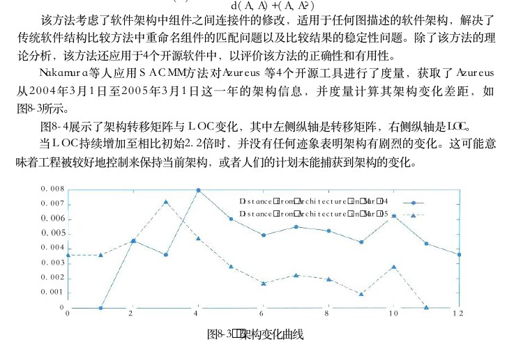
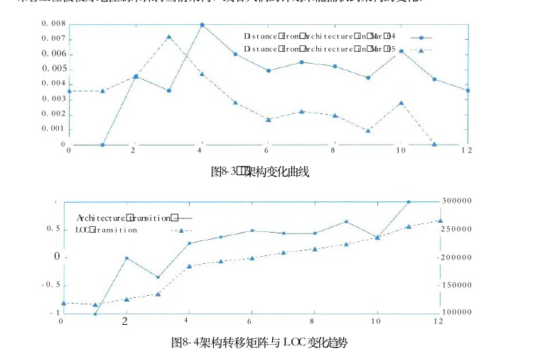
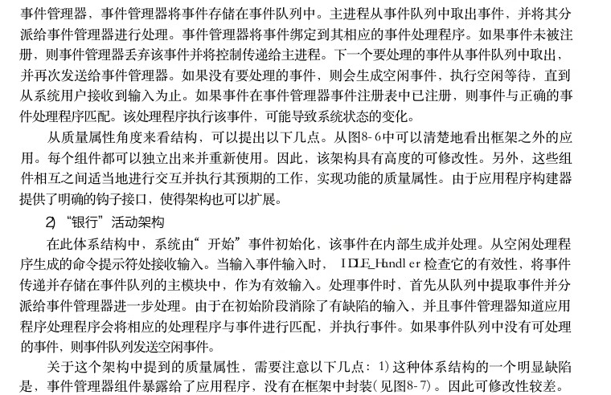

# 第8章 系统质量属性与架构评估

> 本页为教材原文文字提取版。图示已按 PDF 页面裁剪并插入正文图注前。

<!-- PDF 第 283 页 -->

软件系统属性包括功能属性和质量属性，软件架构重点关注的是质量属性。架构的基本需求是在满足功能属性的前提下，关注软件系统质量属性。为了精确、定量地表达系统的质量属性，通常会采用质量属性场景的方式进行描述。在确定软件系统架构，精确描述质量属性场景后，就需要对系统架构进行评估。软件系统架构评估是在对架构分析、评估的基础上，对架构策略的选取进行决策。它也可以灵活地运用于软件架构评审等工作。

## 8．1 软件系统质量属性

## 8．1．1质量属性概念

软件系统的质量就是“软件系统与明确地和隐含地定义的需求相一致的程度”。更具体地说，软件系统质量是软件与明确地叙述的功能和性能需求文档中明确描述的开发标准以及任何专业开发的软件产品都应该具有的隐含特征相一致的程度。根据 GB／T 16260．1 定义，从管理角度对软件系统质量进行度量，可将影响软件质量的主要因素划分为6种维度特性：功能性、可靠性、易用性、效率、维护性与可移植性。其中功能性包括适合性、准确性、互操作性、依从性、安全性；可靠性包括容错性、易恢复性、成熟性；易用性包括易学性、易理解性、易操作性；效率包括资源特性和时间特性；维护性包括可测试性、可修改性、稳定性和易分析性；可移植性包括适应性、易安装性、一致性和可替换性。软件系统质量属性 （Quality Attribute） 是一个系统的可测量或者可测试的属性，用来描述系统满足利益相关者 （Stakeholders） 需求的程度。基于软件系统的生命周期，可以将软件系统的质量属性分为开发期质量属性和运行期质量属性2个部分。

## 1．开发期质量属性

开发期质量属性主要指在软件开发阶段所关注的质量属性，主要包含6个方面。

（1）易理解性：指设计被开发人员理解的难易程度。

（2）可扩展性：软件因适应新需求或需求变化而增加新功能的能力，也称为灵活性。

（3）可重用性：指重用软件系统或某一部分的难易程度。

（4）可测试性：对软件测试以证明其满足需求规范的难易程度。

（5）可维护性：当需要修改缺陷、增加功能、提高质量属性时，识别修改点并实施修改的难易程度。

（6）可移植性：将软件系统从一个运行环境转移到另一个不同的运行环境的难易程度。

<!-- PDF 第 284 页 -->

## 2．运行期质量属性

运行期质量属性主要指在软件运行阶段所关注的质量属性，主要包含7个方面。

（1）性能：性能是指软件系统及时提供相应服务的能力，如速度、吞吐量和容量等的要求。

（2）安全性：指软件系统同时兼顾向合法用户提供服务，以及阻止非授权使用的能力。

（3）可伸缩性：指当用户数和数据量增加时，软件系统维持高服务质量的能力。例如，通过增加服务器来提高能力。

（4）互操作性：指本软件系统与其他系统交换数据和相互调用服务的难易程度。

（5）可靠性：软件系统在一定的时间内持续无故障运行的能力。

（6）可用性：指系统在一定时间内正常工作的时间所占的比例。可用性会受到系统错误，恶意攻击，高负载等问题的影响。

（7）鲁棒性：是指软件系统在非正常情况（如用户进行了非法操作、相关的软硬件系统发生了故障等）下仍能够正常运行的能力，也称健壮性或容错性。

## 8 ． 1 ． 2 面向架构评估的质量属性

为了评价一个软件系统，特别是软件系统的架构，需要进行架构评估。在架构评估过程中，评估人员所关注的是系统的质量属性。评估方法所普遍关注的质量属性有以下几种。

## 1．性能

性能 （Performance） 是指系统的响应能力，即要经过多长时间才能对某个事件做出响应，或者在某段事件内系统所能处理的事件的个数。经常用单位时间内所处理事务的数量或系统完成某个事务处理所需的时间来对性能进行定量表示。性能测试经常要使用基准测试程序。

## 2．可靠性

可靠性 （Reliability） 是软件系统在应用或系统错误面前，在意外或错误使用的情况下维持软件系统的功能特性的基本能力。可靠性是最重要的软件特性，通常用来衡量在规定的条件和时间内，软件完成规定功能的能力。可靠性通常用平均失效等待时间 （Mean Time To Failure，MTTF ） 和平均失效间隔时间 （Mean Time Between Failure，MTBF） 来衡量。在失效率为常数和修复时间很短的情况下， MTTF 和 MTBF几乎相等。可靠性可以分为两个方面。

（1）容错。容错的目的是在错误发生时确保系统正确的行为，并进行内部“修复”。例如在一个分布式软件系统中失去了一个与远程构件的连接，接下来恢复了连接。在修复这样的错误之后，软件系统可以重新或重复执行进程间的操作，直到错误再次发生。

（2）健壮性。这里说的是保护应用程序不受错误使用和错误输入的影响，在发生意外错误事件时确保应用系统处于预先定义好的状态。值得注意的是，和容错相比，健壮性并不是说在错误发生时软件可以继续运行，它只能保证软件按照某种已经定义好的方式终止执行。软件架构对软件系统的可靠性有巨大的影响。例如，软件架构设计上通过在应用程序内部采用冗余机制，或集成监控构件和异常处理，以提升系统可靠性。

<!-- PDF 第 285 页 -->

## 3．可用性

可用性 （Availability） 是系统能够正常运行的时间比例。经常用两次故障之间的时间长度或在出现故障时系统能够恢复正常的速度来表示。

## 4．安全性

安全性 （Security） 是指系统在向合法用户提供服务的同时能够阻止非授权用户使用的企图或拒绝服务的能力。安全性可根据系统可能受到的安全威胁类型来分类。安全性又可划分为机密性、完整性、不可否认性及可控性等特性。其中，机密性保证信息不泄露给未授权的用户、实体或过程；完整性保证信息的完整和准确，防止信息被非法修改；不可否认性是指信息交换的双方不能否认其在交换过程中发送信息或接收信息的行为；可控性保证对信息的传播及内容具有控制的能力，防止为非法者所用。

## 5．可修改性

可修改性 （Modifability） 是指能够快速地以较高的性价比对系统进行变更的能力。通常以某些具体的变更为基准，通过考查这些变更的代价来衡量可修改性。可修改性包含以下4个方面。

（1）可维护性 （Maintainability）。 这主要体现在问题的修复上，在错误发生后“修复”软件系统。可维护性好的软件架构往往能做局部性的修改并能使对其他构件的负面影响最小化。

（2）可扩展性 （Extendibility）。 这一点关注的是使用新特性来扩展软件系统，以及使用改进版本方式替换构件并删除不需要或不必要的特性和构件。为了实现可扩展性，软件系统需要松散耦合的构件。其目标是实现一种架构，能使开发人员在不影响构件客户的情况下替换构件。支持把新构件集成到现有的架构中也是必要的。

（3）结构重组 （Reassemble）。 这一点处理的是重新组织软件系统的构件及构件间的关系，例如通过将构件移动到一个不同的子系统而改变它的位置。为了支持结构重组，软件系统需要精心设计构件之间的关系。理想情况下，它们允许开发人员在不影响实现的主体部分的情况下灵活地配置构件。

（4）可移植性 （Portability）。 可移植性使软件系统适用于多种硬件平台、用户界面、操作系统、编程语言或编译器。为了实现可移植，需要按照硬件、软件无关的方式组织软件系统。可移植性是系统能够在不同计算环境下运行的能力，这些环境可能是硬件、软件，也可能是两者的结合。如果移植到新的系统需要做适当更改，则该可移植性就是一种特殊的可修改性。

## 6．功能性

功能性 （Functionality） 是系统能完成所期望的工作的能力。一项任务的完成需要系统中许多或大多数构件的相互协作。

## 7．可变性

可变性 （Changeability） 是指架构经扩充或变更而成为新架构的能力。这种新架构应该符合预先定义的规则，在某些具体方面不同于原有的架构。当要将某个架构作为一系列相关产品（例如，软件产品线）的基础时，可变性是很重要的。

<!-- PDF 第 286 页 -->

## 8．互操作性

作为系统组成部分的软件不是独立存在的，通常与其他系统或自身环境相互作用。为了支持互操作性，软件架构必须为外部可视的功能特性和数据结构提供精心设计的软件入口。程序和用其他编程语言编写的软件系统的交互作用就是互操作性的问题，这种互操作性也影响应用的软件架构。

## 8．1．3质量属性场景描述

为了精确描述软件系统的质量属性，通常采用质量属性场景 （Quality Attribute Scenario） 作为描述质量属性的手段。质量属性场景是一个具体的质量属性需求，是利益相关者与系统的交互的简短陈述。质量属性场景是一种面向特定质量属性的需求。它由6部分组成：

● 刺激源这是某个生成该刺激的实体（人、计算机系统或者任何其他刺激器）。( Source ) :

● 刺激该刺激是当刺激到达系统时需要考虑的条件。( Stimulus ) :

● 环境该刺激在某些条件内发生。当激励发生时，系统可能处于过载、( Environment ) :运行或者其他情况。

● 制品某个制品被激励。这可能是整个系统，也可能是系统的一部分。( Artifact ) :

● 响应该响应是在激励到达后所采取的行动。( Response ) :

● 响应度量当响应发生时，应当能够以某种方式对其进行度量，以对( Measurement ) :需求进行测试。质量属性场景主要关注可用性、可修改性、性能、可测试性、易用性和安全性等6类质量属性，下面分别列表进行介绍。

## 1．可用性质量属性场景

可用性质量属性场景所关注的方面包括系统故障发生的频率、出现故障时会发生什么情况、允许系统有多长是非正常运行、什么时候可以安全地出现故障、如何防止故障的发生以及发生故障时要求进行哪种通知，表8－1给出了详细描述。表8－1 可用性质量属性场景描述场景要素可能的情况刺激源系统内部、系统外部刺激疏忽、错误、崩溃、时间环境正常操作、降级模式制品系统处理器、通信信道、持久存储器、进程系统应该检测事件、并进行如下一个或多个活动：将其记录下来通知适当的各方，包括用户和其他系统；根据已定义的规则禁止导致错误或响应故障的事件源在一段预先指定的时间间隔内不可用，其中，时间间隔取决于系统的关键程度在正常或降级模式下运行

<!-- PDF 第 287 页 -->

（续表）场景要素可能的情况系统必须可用的时间间隔可用时间响应度量系统可以在降级模式下运行的时间间隔故障修复时间

## 2．可修改性质量属性场景

可修改性质量属性场景主要关注系统在改变功能、质量属性时需要付出的成本和难度，可修改性质量属性场景可能发生在系统设计、编译、构建、运行等多种情况和环境下，表8－2给出了详细描述。表8－2可修改性质量属性场景描述场景要素可能的情况刺激源最终用户、开发人员、系统管理员希望增加、删除、修改、改变功能、质量属性、容量等刺激环境系统设计时、编译时、构建时、运行时系统用户界面、平台、环境或与目标系统交互的系统制品查找架构中需要修改的位置，进行修改且不会影响其他功能，对所做的修改进行测试，部响应署所做的修改根据所影响元素的数量度量的成本、努力、资金；该修改对其他功能或质量属性所造成影响应度量响的程度

## 3．性能质量属性场景

性能质量属性场景主要关注系统的响应速度，可以通过效率、响应时间、吞吐量、负载来客观评价性能的好坏，表8－3给出了详细描述。表8－3性能质量属性场景描述场景要素可能的情况用户请求，其他系统触发等刺激源刺激定期事件到达、随机事件到达、偶然事件到达环境正常模式、超载 （Overload） 模式系统制品响应处理刺激、改变服务级别响应度量等待时间、期限、吞吐量、抖动、缺失率、数据丢失率

<!-- PDF 第 288 页 -->

## 4．可测试性质量属性场景

可测试性质量属性场景主要关注系统测试过程中的效率，发现系统缺陷或故障的难易程度等，表8－4给出了详细描述。表8－4可测试性质量属性场景描述

场景要素可能的情况刺激源开发人员、增量开发人员、系统验证人员、客户验收测试人员、系统用户刺激已完成的分析、架构、设计、类和子系统集成；所交付的系统环境设计时、开发时、编译时、部署时制品设计、代码段、完整的应用响应提供对状态值的访问，提供所计算的值，准备测试环境已执行的可执行语句的百分比如果存在缺陷出现故障的概率响应度量执行测试的时间测试中最长依赖的长度准备测试环境的时间

## 5．易用性质量属性场景

易用性质量属性场景主要关注用户在使用系统时的容易程度，包括系统的学习曲线、完成操作的效率、对系统使用过程的满意程度等，表8－5给出了详细描述。表8－5易用性质量属性场景描述可能的情况场景要素刺激源最终用户想要学习系统特性、有效使用系统、使错误的影响最低、适配系统、对系统满意刺激系统运行时或配置时环境制品系统

（1）系统提供以下一个或多个响应来支持“学习系统特性”：帮助系统与环境联系紧密；界面为用户所熟悉；在不熟悉的环境中，界面是可以使用的

（2）系统提供以下一个或多个响应来支持“有效使用系统”：数据和（或）命令的聚合；已输入的数据和（或）命令的重用；支持在界面中的有效导航；具有一致操作的不同视图；全面搜索；多个同时进行的活动

（3）系统提供以下一个或多个响应来“使错误的影响最低”：响应撤销；取消；从系统故障中恢复；识别并纠正用户错误；检索忘记的密码；验证系统资源

（4）系统提供以下一个或多个响应来“适配系统”：定制能力；国际化

（5）系统提供以下一个或多个响应来使客户“对系统的满意”：显示系统状态；与客户的节奏合拍任务时间、错误数量、解决问题的数量、用户满意度、用户知识的获得、成功操作在总操响应度量作中所占的比例、损失的时间／丢失的数据量

<!-- PDF 第 289 页 -->

## 6．安全性质量属性场景

安全性质量属性场景主要关注系统在安全性方面的要素，衡量系统在向合法用户提供服务的同时，阻止非授权用户使用的能力，表8－6给出了详细描述。表8－6安全性质量属性场景描述场景要素可能的情况正确识别、非正确识别身份未知的来自内部／外部的个人或系统；经过了授权／未授权它刺激源访问了有限的资源／大量资源刺激试图显示数据，改变／删除数据，访问系统服务，降低系统服务的可用性在线或离线、联网或断网、连接有防火墙或者直接连到了网络环境制品系统服务、系统中的数据对用户身份进行认证；隐藏用户的身份；阻止对数据或服务的访问；允许访问数据或服务；授予或收回对访问数据或服务的许可；根据身份记录访问、修改或试图访问、修改数据、响应服务；以一种不可读的格式存储数据；识别无法解释的对服务的高需求；通知用户或另外个系统，并限制服务的可用性用成功的概率表示，避开安全防范措施所需要的时间、努力、资源；检测到攻击的可能性；响应度量确定攻击或访问、修改数据或服务的个人的可能性；在拒绝服务攻击的情况下仍然获得服务的百分比；恢复数据、服务；被破坏的数据、服务和（或）被拒绝的合法访问的范围

## 8．2 系统架构评估

系统架构评估是在对架构分析、评估的基础上，对架构策略的选取进行决策。它利用数学或逻辑分析技术，针对系统的一致性、正确性、质量属性、规划结果等不同方面，提供描述性、预测性和指令性的分析结果。系统架构评估的方法通常可以分为3类：基于调查问卷或检查表的方式、基于场景的方式和基于度量的方式。

（1）基于调查问卷或检查表的方法。该方法的关键是要设计好问卷或检查表，充分利用系统相关人员的经验和知识，获得对架构的评估。该方法的缺点是在很大程度上依赖于评估人员的主观推断。

（2）基于场景的评估方法。基于场景的方式由卡耐基梅隆大学软件工程研究所首先提出并应用在架构权衡分析法 （Architecture Tradeoff Analysis Method，ATAM） 和软件架构分析方法（Software ArchitectureAnalysis Method，SAAM） 中。它是通过分析软件架构对场景（也就是对系统的使用或修改活动）的支持程度，从而判断该架构对这一场景所代表的质量需求的满足程度。

（3）基于度量的评估方法。它是建立在软件架构度量的基础上的，涉及3个基本活动，首先需要建立质量属性和度量之间的映射原则，然后从软件架构文档中获取度量信息，最后根据映射原则分析推导出系统的质量属性。本节首先介绍系统架构评估中的重要概念，然后对 SAAM 、 ATAM和 CBAM 等 3 种重要的架构评估方法进行详细论述，并简要说明其他评估方法。

<!-- PDF 第 290 页 -->

## 8．2．1 系统架构评估中的重要概念

（ 1 ） 敏感点和权衡点。敏感点和权衡点是关键的架构(Sensitivity Point)(Tradeoff Point)决策。敏感点是一个或多个构件（和／或构件之间的关系）的特性。研究敏感点可使设计人员或分析员明确在搞清楚如何实现质量目标时应注意什么。权衡点是影响多个质量属性的特性，是多个质量属性的敏感点。例如，改变加密级别可能会对安全性和性能产生非常重要的影响。提高加密级别可以提高安全性，但可能要耗费更多的处理时间，影响系统性能。如果某个机密消息的处理有严格的时间延迟要求，则加密级别可能就会成为一个权衡点。（ 2 ） 风险承担者或者称为利益相关人。 系统的架构涉及很多人的利益，这(Stakeholders)些人都对架构施加各种影响，以保证自己的目标能够实现。表8－7列出在架构评估中可能涉及的一些风险承担者及其所关心的问题。表8－7 系统架构评估涉及的问题职责所关心的问题风险承担者系统生产者对其他风险承担者提出的质量需求的折负责软件架构的质量需求间进行权衡的人软件系统架构师中和调停架构描述的清晰与完整、各部分的内聚设计人员或程序员开发人员性与受限藕合、清楚的交互机制可维护性，确定出某个更改发生后必须系统初次部署完成后对系统进行更改的人维护人员对系统中哪些地方进行改动的能力集成人员负责构件集成和组装的开发人员与上同集成、一致的错误处理协议，受限的构测试人员负责系统测试的开发人员件耦合、构件的高内聚性、概念完整性对所关心问题的分离、可修改性和互操负责所开发软件必须满足的标准细节的开标准专家发人员作性分析系统的工作产品以确定系统是否满足易理解性、概念完整性、性能、可靠性性能工程师其性能及吞吐量需求的人员安全专家负责保证系统满足其安全性需求的人员安全性负责为各小组配置资源、保证开发进度、架构层次清晰，便于组建小组；任务划项目经理保证不超出预算的人员，负责与客户沟通分结构、进度标志和最后期限等设想该架构和相关资产怎样在该组织的其产品线经理可重用性、灵活性他开发中得以重用的人员系统消费者开发的进度、总体预算、系统的有用客户系统的购买者性、满足需求的情况功能性、可用性最终用户所实现系统的使用者应用开发者利用该架构及其他已有可重用构件，通过架构的清晰性、完整性、简单交互机制、（对产品架构而言）简单裁减机制将其实例化而构建产品的人员

<!-- PDF 第 291 页 -->

（续表）风险承担者职责所关心的问题任务专家、任务规知道系统将会怎样使用以实现战略目标的功能性、可用性、灵活性划者客户代表系统服务人员系统管理员负责系统运行的人员容易找到可能出现问题的地方网络管理员管理网络的人员网络性能、可预测性为系统在该领域中的使用和维护提供支持技术支持人员使用性、可服务性、可裁减性的人员其他人员类似系统或所考察系统将要在其中运行的领域代表可互操作性系统的构建者或拥有者整个系统的架构设计师，负责在软件和硬系统设计师可移植性、灵活性、性能和效率件之间进行权衡并选择硬件环境的人熟悉该软件必须与之交互的硬件的人员，设备专家可维护性、性能能够预测硬件技术的未来发展趋势的人员

（ 3 ） 场景 （scenarios）。 在进行架构评估时，一般首先要精确地得出具体的质量目标，并以之作为判定该架构优劣的标准。为得出这些目标而采用的机制称之为场景。场景是从风险承担者的角度对与系统的交互的简短描述。在架构评估中，一般采用刺激 （Stimulus）、 环境（Environment） 和响应 （Response） 三方面来对场景进行描述。

## 8．2．2系统架构评估方法

## 1 ． SAAM 方法

SAAM（Scenarios－based Architecture Analysis Method） 是卡耐基梅隆大学软件工程研究所（SEI at CMU） 的 Kazman 等人于1983年提出的一种非功能质量属性的架构分析方法，是最早形成文档并得到广泛使用的软件架构分析方法。最初它用于比较不同软件体系的架构，以分析系统架构的可修改性，后来实践证明它也可用于其他质量属性如可移植性、可扩充性等，最终发展成了评估一个系统架构的通用方法。

（1）特定目标。 SAAM 的目标是对描述应用程序属性的文档，验证基本的架构假设和原则。此外，该分析方法有利于评估架构固有的风险。 SAAM 指导对架构的检查，使其主要关注潜在的问题点，如需求冲突，或仅从某一参与者观点出发得出的不全面的系统设计。 SAAM 不仅能够评估架构对于特定系统需求的使用能力，也能被用来比较不同的架构。

（2）评估技术。 SAAM 所使用的评估技术是场景技术。场景代表了描述架构属性的基础，描述了各种系统必须支持的活动和可能存在的状态变化。

（3）质量属性。这一方法的基本特点是把任何形式的质量属性都具体化为场景，但可修改性是 SAAM 分析的主要质量属性。

<!-- PDF 第 292 页 -->

（4）风险承担者。 SAAM 协调不同参与者之间感兴趣的共同方面，作为后续决策的基础，达成对架构的共识。

（5）架构描述。 SAAM 用于架构的最后版本，但早于详细设计。架构的描述形式应当被所有参与者理解。功能、结构和分配被定义为描述架构的3个主要方面。

（6）方法活动。 SAAM 的主要输入是问题描述 、 需求声明和架构描述 。 图 8 － 1 描绘了SAAM分析活动的相关输入及评估过程。

场景迭代场景开发体系结构描述问题描述AND需求分析需求说明单个场景评估SAAM OR总体评估体系结构设计体系结构描述场景交互评估比较多个体系结构单个体系结构评估图8－1 SAAM 输入与评估过程

SAAM 分析评估架构的过程包括5个步骤，即场景开发、架构描述、单个场景评估、场景交互和总体评估。通过各类风险承担者协商讨论，开发一些任务场景，体现系统所支持的各种活动。用一种易于理解的、合乎语法规则的架构描述软件架构，体现系统的计算构件、数据构件以及构件之间的关系（数据和控制）。对场景（直接场景和间接场景）生成一个关于特定架构的场景描述列表。通过对场景交互的分析，能得出系统中所有场景对系统中的构件所产生影响的列表。最后，对场景和场景间的交互作一个总体的权衡和评价。

（7）已有知识库的可重用性： SAAM 不考虑这个问题。

（8）方法验证： SAAM是一种成熟的方法，已被应用到众多系统中，这些系统包括空中交通管制、嵌入式音频系统、 WRCS （修正控制系统）、 KWIC （根据上下文查找关键词系统）等。

## 2 ． ATAM 方法

架构权衡分析方法 （Architecture Tradeoff Analysis Method，ATAM） 是在 SAAM的基础上发展起来的，主要针对性能、实用性、安全性和可修改性，在系统开发之前，对这些质量属性进行评价和折中。

（1）特定目标。 ATAM 的目标是在考虑多个相互影响的质量属性的情况下，从原则上提供一种理解软件架构的能力的方法。对于特定的软件架构，在系统开发之前，可以使用 ATAM 方法确定在多个质量属性之间折中的必要性。

（2）质量属性。 ATAM 方法分析多个相互竞争的质量属性。开始时考虑的是系统的可修改性、安全性、性能和可用性。

（3）风险承担者。在场景、需求收集相关活动中， ATAM 方法需要所有系统相关人员的参与。

<!-- PDF 第 293 页 -->

（4）架构描述。架构空间受到历史遗留系统、互操作性和以前失败的项目约束。架构描述基于 5 种基本结构来进行 ， 这 5 种结构是从 Kruchten 的4＋1视图派生而来的。其中逻辑视图被分为功能结构和代码结构。这些结构加上它们之间适当的映射可以完整地描述一个架构。用一组消息顺序图表示运行时的交互和场景，对架构描述加以注解。 ATAM方法被用于架构设计中，或被另一组分析人员用于检查最终版本的架构。

（5）评估技术。可以把 ATAM方法视为一个框架，该框架依赖于质量属性，可以使用不同的分析技术。它集成了多种优秀的单一理论模型，其中每种都能够高效、实用地处理属性。该方法使用了场景技术。从不同的架构角度，有3种不同类型的场景，分别是用例（包括对系统典型的使用、引出信息）、增长场景（用于涵盖那些对它的系统的修改）、探测场景（用于涵盖那些可能会对系统造成过载的极端修改）。ATAM 还使用定性的启发式分析方法 （Qualitative Analysis Heuristics）， 在对一个质量属性构造了一个精确分析模型时要进行分析，定性的启发式分析方法就是这种分析的粗粒度版本。

（6）方法的活动。 ATAM 被分为 4 个主要的活动领域 （ 或阶段 ） ， 分别是场景和需求收集 、架构视图和场景实现、属性模型构造和分析、折中。图8－2描述了与每个阶段相关的步骤，还描述了架构设计和分析改进中可能存在的迭代。

行动计划

阶段4阶段1折中

## 1．收集场景场景和需

## 7．标志折中

## 2．收集需求／约

求收集

## 6．标志敏感度

束／环境

## 5．特定属性分 3．描述体系结

析（优秀的单构视图一理论）4．实现场景，阶段2阶段3体系结构视图属性模型构造和场景实现和分析图8－2 ATAM分析评估过程

属性专家独立地创建和分析他们的模型，然后交换信息（澄清和创建新的需求）。属性分析是相互依赖的，因为每个属性都会涉及其他属性。获得属性关联的方法有两种，即使用敏感度分析来发现折中点和通过检查假设。在架构设计中， ATAM 提供了迭代的改进。除了通常从场景派生而来的需求，还有很多对行为模式和执行环境的假设。由于属性之间存在着折中，每一个假设都要被检查、验证和询问，以此作为 ATAM 方法的结果。在完成所有这些操作之后，把分析的结果和需求进行比较；如果系统预期的行为大多接近于需求，设计者就可以继续进行下一步更为详细的设计或实现。（ 7 ） 领域知识库的可重用性 。 领域知识库通过基于属性的架构风格 （Attribute BasedArchitecture Style） 维护。 ABAS有助于从架构风格的概念转向基于特定质量属性模型的推理能

<!-- PDF 第 294 页 -->

力。获取一组基于属性的架构风格的目标在于要把架构设计变得更为惯例化和更可预测，并得到一个基于属性的架构分析的标准问题集合，使设计与分析之间的联系更为紧密。

（8）方法验证。该方法已经应用到多个软件系统，但仍处在研究之中。虽然软件架构分析与评价已经取得了很大的进步，但是在某些方面也存在一些问题。例如，架构的描述、质量特征的分析、场景不确定性的处理、度量的应用架构分析和评价支持工具等，这些都影响和制约着分析评估技术的发展。 Clement认为在未来的5～10年内，架构的分析是架构发展的5个方向之一。ATAM 方法采用效用树 （Utility tree） 这一工具来对质量属性进行分类和优先级排序。效用树的结构包括：树根—质量属性—属性分类—质量属性场景（叶子节点）。需要注意的是，ATAM 主要关注4类质量属性：性能、安全性、可修改性和可用性，这是因为这4个质量属性是利益相关者最为关心的。得到初始的效用树后，需要修剪这棵树，保留重要场景（通常不超过50个），再对场景按重要性给定优先级（用 H／M／L 的形式），再按场景实现的难易度来确定优先级（用 H ／ M ／ L的形式），这样对所选定的每个场景就有一个优先级对（重要度、难易度），如 （H、L） 表示该场景重要且易实现。

## 3 ． CBAM 方法

在大型复杂系统的构建过程中，经济性通常是需要考虑的首要因素。因此，需要从经济角度建立成本、收益、风险和进度等方面软件的“经济”模型。成本效益分析法 （the Cost BenefitAnalysis Method，CBAM） 是在 ATAM 上构建，用来对架构设计决策的成本和收益进行建模，是优化此类决策的一种手段。 CBAM 的思想就是架构策略影响系统的质量属性，反过来这些质量属性又会为系统的项目干系人带来一些收益（称为“效用”）， CBAM协助项目干系人根据其投资回报 （Return On Investment，ROI） 选择架构策略。 CBAM在 ATAM 结束时开始，它实际上使用了 ATAM 评估的结果。CBAM 方法分为以下8个步骤。

（1）整理场景。整理 ATAM 中获取的场景，根据商业目标确定这些场景的优先级，并选取优先级最高的1／3的场景进行分析。

（2）对场景进行求精。为每个场景获取最坏情况、当前情况、期望情况和最好情况的质量属性响应级别。

（3）确定场景的优先级。项目关系人对场景进行投票，其投票是基于每个场景“所期望的”响应值，根据投票结果和票的权值，生成一个分值（场景的权值）。

（4）分配效用。对场景的响应级别（最坏情况、当前情况、期望情况和最好情况）确定效用表。

（5）架构策略涉及哪些质量属性及响应级别，形成相关的“策略一场景一响应级别”的对应关系。

（6）使用内插法确定“期望的”质量属性响应级别的效用。即根据第4步的效用表以及第5步的对应关系，确定架构策略及其对应场景的效用表。

<!-- PDF 第 295 页 -->

（7）计算各架构策略的总收益。根据第3步的场景的权值及第6步的架构策略效用表，计算出架构策略的总收益得分。

（8）根据受成本限制影响的 ROI 选择架构策略。根据开发经验估算架构策略的成本，结合第7步的收益，计算出架构策略的 ROI ， 按 ROI排序，从而确定选取策略的优先级。

## 4．其他评估方法

上面所介绍的 SAAM 、 ATAM和 CBAM 方法是架构评估中被公认的3种方法。当然，针对架构评估的研究刚刚起步，方法众多，下面再简要介绍一些其他评估方法，详细算法描述请参考相关资料。

## 1 ） SAEM 方法

SAEM 方法将软件架构看作一个最终产品以及设计过程中的一个中间产品，从外部质量属性和内部质量属性两个角度来阐述它的评估模型，旨在为软件架构的质量评估创建一个基础框架。外部属性指用户定义的质量属性，而内部属性指开发者决定的质量属性。该软件架构评估模型包含以下几个流程。

（1）对待评估的质量属性进行规约建模，参考ISO／IEC 9126－1 标准中的质量模型，先从用户的角度描述架构的外部质量属性，再基于外部质量属性规约从开发者的角度描述架构的内部质量属性。

（2）为外部和内部的质量属性创建度量准则，先从评估目的（如软件架构比较、最终产品的质量预测），评估角度（如开发者、用户、维护者），评估环境（架构作为最终产品或设计中间产品）出发来定义架构评估的目标，再根据目标相关的属性来提出问题，然后回答每个问题并提出相应的度量准则。

（3）评估质量属性，包括数据收集、度量和结果分析3个活动。该模型已在相关系统领域得到应用。

## 2 ） SAABNet 方法

软件架构定性的评估技术依赖于专家知识，包括某些特定类型问题的解决方案以及可能的诱导因素、统计知识（如60％的系统消耗花费在维护上）、审美观等，这些定性的知识比较含糊且难以文档化。 SAABNet是一种用来表达和使用定性知识以辅助架构的定性评估。该方法来源于人工智能 （AI）， 允许不确定、不完整知识的推理。该方法使用 BBN（Bayesian Belief Networks） 来表示和使用开发过程中的知识，包含定性和定量的描述，其中定性的描述是所有结点的图，定量的描述是每个结点状态相关的条件概率，为了将软件架构开发中的定性知识放到 BBN 中，需要经过以下几个步骤。

（1）识别架构中的相关变量。

（2）定义变量之间的概率依赖，这就是 BBN的定性描述。

（3）评估条件概率，这就是 BBN 的定量描述。（ 4 ） 测试BBN来验证其输出是否正确。基于 BBN 正确的定量规约和定性规约，可以数学方法推导出架构正确性概率。根据该方

<!-- PDF 第 296 页 -->

法创建了 SAABNet ， 其中的变量可分为3类，即架构质量属性变量（如可维护性、灵活性等）、质量属性的度量准则变量 （ 如容错性 、 响应性等 ） 和架构特征变量 （ 如继承深度 、 编程语言等），高层抽象的质量属性变量分解为低层抽象的度量准则变量，度量准则变量则分解为更低层抽象的架构特征变量。至于 SAABNet 的定量规约，由于难以获取足够的架构信息，只有通过实验的方法来获取质量属性满足的概率，另外由于缺乏详细的信息，只能大概估计结点之间的条件概率， SAABNet 的目的是辅助架构的定性评估，因此定量规约不是必要的。 SAABNet 可以帮助诊断软件架构问题的可能导致原因，以及分析架构中的修改给质量属性带来的影响、预测架构的质量属性，帮助架构设计做决策。SAABNet 度量的对象包括架构属性、质量准则和质量因素3部分，其中每部分包含的可能变量如表8－8所示。表8－8架构属性、质量准则和质量因素架构属性变量属性可选值属性可选值动态绑定high、low架构风格管道－过滤器、代理、层、平台有、无类继承深度深、不深异常处理C＋＋、Java组件粒度细粒度、粗粒度执行语言接口粒度细粒度、粗粒度组件互依赖性多、少多、少多重继承有、无内容选择静态、松散组合线程应用high、low文档好、坏质量准则变量属性可选值属性可选值高容错、低容错可测试性好、坏容错高、低水平复杂度数据吞吐量好、坏好、坏内存使用高、低易理解性好、坏垂直复杂度高、低响应安全性安全、不安全质量因素变量可选值属性可选值属性复杂度性能好、坏高、低好、坏配置好、坏可信度

## 3 ） SACMM 方法

当一个软件发生修改时，一个重要的问题是，在修改流程中其软件架构是否也发生了修改。伴随着架构修改的软件修改通常是比较困难的，因为软件架构的修改涉及多个组件之间连接件的修改，度量架构的修改可以为描述软件的修改和预测修改的消耗提供有用的信息。一般的研究在类似大小、复杂性、耦合度和内聚度这样的架构度量准则层次考虑架构的修改，但这样的

<!-- PDF 第 297 页 -->

抽象层次太高了，无法度量两个架构之间的不同，架构需要一个结构化的描述方式，而不是一个简单的标量值。很多逆向工程研究从软件程序中抽取出一个图结构的软件架构，可以利用这样的图结构来比较两个架构之间的不同。SACMM 方法是一种软件架构修改的度量方法，首先基于图内核定义差异度量准则来计算两个软件架构之间的距离，图内核的基本思想是将结构化的对象描述为它的子结构的集合，通过子结构的配对比较来分析对象之间的相似性。假设可以提取到软件架构实际值的属性向量，表示为φ（4）＝｛ I（4），φ2（4），…｝， 两个架构A ，和 A，相似度（即内核）可以通过其内含子结构的相似度总和来计算：中（4）K（4，，A，）＝（φ（A．），（4，））＝Z＋（4）使用该定义，可以计算A．和 A， 之间的距离：d（4，，4，）＝√K（4，，4．）－2K（A，4，）＋K（4，，4）由于A，和A，的子结构的个数可能是指数级的大小，φ （A？） 和φ （A，） 的计算通常是不可行的，可以将递归地分解为子结构内核的卷积，即A、和A， 中所有可能子结构内K （ A ， ， A ． ）核的权重和：

K（A，A，）＝ 22 f（s｜A）f（s＇｜A，）K，（s，s）seS（A？）y＝5（A，）其中， S （ A ？ ） 和 S （ A ） 是A．和 A 的子结构：f（s｜A？） 和 f（s＇｜A） 是 s ∈ S （ A ？ ） 和s＇∈S（A？） 的权重。若架构的图表达由带有标签的结点和连接组成，那么子结构就定义为图中的路径，可以通过图上的随机游走获得，即选择一个开始结点，然后移动到它的相邻结点直到结束，用 y 表示在每一步停止随机游走的概率，避免了指数级项目的加法，相似度公式可以重新定义如下：

R。（h，L）K （ A ， A ） ＝乙A．I｜A，｜h∈A，，M＝A？s．11g＝1H其中， h？和 k1是随机游走的开始结点， l＊是节点的标签。

## 1－y1－y

R．（i，j）×．R ． （ h ， k ） ＝ r 2 ＋ 乙（＃of hs neighbors）（＃of hs neighbors）i．js，t．），＝1，1h＝1x＼（使用以上的图内核函数来计算软件架构的距离时，先要将软件架构用图模型来描述，选择一个合适的模型需要考虑3个因素：①抽象层次。每个组件对应一个结点，该组件可以是文件、类／接口或者方法，最详细的层次可以是每个表达式对应一个结点，但是太详细的抽象会导致模型的计算过于复杂，若对表达式层次的修改不感兴趣，还会导致相似度的结果不精确。②结点标签的赋值。决定了两个架构中哪些结点可以匹配。若将源文件的名字赋给结点标签，文件在修改过程中重命名会导致无法匹配，另一个极端是给所有的结点赋同样的标签，但这样得出的相似度会偏高，因此可以采取中间的方法，如给不同类的结点赋不同的标签。③连接标签的赋值。与结点的赋值类似，但可能更难，因为连接的类型很多。

<!-- PDF 第 298 页 -->

基于距离度量可以描述架构在修改过程中的转换模型，将架构修改过程的两个端点 A。和 An设为参考点，根据这两个参考点检查中间软件架构中连接件的修改 d （ A ， A ？ ） 和 d （ A ， An ） ，从而将架构修改过程建模为一系列架构转换A？A？，…，A， 的轨道，描述了架构在何时以及如何修改，有助于定量和定性的分析。进一步定义了软件版本Pi 的修改准则为L （ P ） ， 它应该满足：｜L（P）－L（P）：｜L（P）－L（P．）＝d（A，A）：d（A，A？）假设 L （ P ） ≤ L （ Pi ） ≤ L （ Pn ） ， 从而得到修改准则的公式：d（A，A？）L（P）＋d（A，A？）L（P）L（P）＝d（A，A）＋（A，A？）该方法考虑了软件架构中组件之间连接件的修改，适用于任何图描述的软件架构，解决了传统软件结构比较方法中重命名组件的匹配问题以及比较结果的稳定性问题。除了该方法的理论分析，该方法还应用于4个开源软件中，以评价该方法的正确性和有用性。Nakamura等人应用 SACMM 方法对Azureus 等4个开源工具进行了度量，获取了 Azureus从2004年3月1日至2005年3月1日这一年的架构信息，并度量计算其架构变化差距，如图8－3所示。图8－4展示了架构转移矩阵与 LOC 变化，其中左侧纵轴是转移矩阵，右侧纵轴是LOC。当 LOC 持续增加至相比初始2．2倍时，并没有任何迹象表明架构有剧烈的变化。这可能意味着工程被较好地控制来保持当前架构，或者人们的计划未能捕获到架构的变化。

## 0．008

Distance from Architecture in Mar 04

## 0．007

Distance from Architecture in Mar 05

## 0．006

## 0．005

## 0．004

## 0．003

## 0．002

## 0．001

图8－3 架构变化曲线

Architecture transition ——

## 0．5

LOC transition2 5 0 0 0 0

－0．5

－ 1

图8－4架构转移矩阵与 LOC 变化趋势

<!-- PDF 第 299 页 -->

## 4 ） SASAM 方法

SASAM 方法通过对预期架构（架构设计阶段的相关描述材料）和实际架构（源代码中执行的架构）进行映射和比较来静态地评估软件架构，并将静态评估与架构开发方法 PuLSE－DSSA 结合，识别出10种不同的目的和需求来指导静态的架构评估。静态评估方法对预期架构模型和实际架构模型中的每个元素进行映射，比较某个模型元素或关联是否在两个架构模型中都存在，还是只存在于其中某个架构模型中，从而得到评估结果，其中映射需要手工完成，比较评估可以在软件架构可视化和评估工具 SAVE 中执行。10个评估目的包括：

（1）产品线可能性。分析几个不相干的系统是否适用于某个共有的架构，即分析它们是否能成为预期产品线的一部分。

（2）产品对准性。评估系统的软件架构是否与产品线的软件架构一致。

（3）重用可能性。分析组件是否能重用。

（4）组件充分性。评估组件的内在质量。

（5）对软件架构的理解。

（6）一致性。评估架构文档和执行的一致性。

（7）完备性。检测未被文档化的架构实体。

（8）软件系统或产品线的文档。

（9）控制演化。

（10）支持架构结构的分解。

## 5 ） ALRRA方法

可靠性风险主要包含两个因素：故障发生的可能性以及故障所致后果的严重性。 ALRRA是一种软件架构可靠性风险评估方法，该方法使用动态复杂度准则和动态耦合度准则来定义组件和连接件的复杂性因素，其中，动态复杂度准则在某个场景的执行中分析组件的动态行为来度量组件的复杂性，动态耦合度准则在某个场景的执行中分析连接件的消息传递协议来度量连接件的复杂性。该方法利用失效模式和影响分析 （ FMEA ） 来定义故障引起的后果的严重性因素，并将复杂度和严重性因素组合起来定义组件和连接件的启发式风险因素，然后基于组件依赖图定义风险分析模型和风险分析算法，将组件和连接件的风险因素集成到架构层次的风险因素中。使用 ALRRA 方法进行软件架构可靠性风险评估的步骤：

（1）使用架构描述语言 （ ADL ） 建模软件架构。

（2）使用仿真进行复杂性分析。（ 3 ） 使用 FMEA 和失效严重性分析。

（4）为组件和连接件启发式地定义可靠性风险因素。

（5）构造架构的 CDG ， 对每个结点 C；赋予组件的可靠性风险 hrf， 对 C， 和 C； 之间连接件赋连接件的可靠性风险 hrf。

（6）用图遍历算法执行架构的风险评估和分析，架构的可靠性风险因素可以通过集成其组件和连接件的风险因素获取。

<!-- PDF 第 300 页 -->

## 6）AHP 方法

在软件架构评估量化方式中，层次分析法 （Analytical Hierarchy Process，AHP） 是多种架构评估度量方法的基础理论。 AHP在20世纪70年代由美国运筹学家 T．L．Saaty提出，它是对定性问题进行定量分析的一种简便、灵活而又实用的多准则决策方法。 AHP 方法的特点是把复杂问题中的各种因素通过划分为相联系的有序层次使之条理化，并在一般情况下通过两两对比，根据一定客观现实的主观判断结构，把专家意见和分析者的客观判断结果直接、有效地结合起来，将一定层次上元素的某些重要性进行定量描述，之后利用数学方法计算反映每一层次元素的相对重要性次序的权值，并最后通过所有层次之间的总排序计算所有元素的相对权重及对权重进行排序。该方法可以把定性分析和定量计算相结合，并对各种决策因素进行处理，而且该方法的使用过程较为简单，已经在包括软件架构分析与评估、能源系统分析、城市规划、经济管理、科研评估等很多领域得到广泛的重视与应用。层次分析法对AHP 问题域的分析、度量一般分为5步。

（1）通过对系统的深入认识，确定该系统的总目标，得出规划决策所涉及的范围、所要采取的措施方案和政策、实现目标的准则以及策略和各种约束条件等，并广泛收集在分析过程中要用到的多种信息。

（2）建立一个多层次的递阶结构，按目标的不同、实施功能的差异，将系统分为几个等级层次。

（3）确定以上递阶结构中相邻层次元素间的相关程度，通过构造比较判断矩阵及矩阵运算的数学方法，确定对于上一层次的某个元素而言本层次中与其相关元素的重要性排序，即相对权值。

（4）计算各层元素对系统目标的合成权重，进行总排序，确定递阶结构图中底层的各个元素的重要程度。

（5）根据分析计算结果，考虑相应的决策。软件架构评估包括对各种质量属性的评估以及其他一些非功能非质量因素的评估，这些属性之间有时存在某些冲突。 AHP 是一种重要的辅助决策方法，通常被用来解决这种冲突。 AHP可以帮助对提供的设计方案进行整体排名。

## 7 ） COSMIC ＋ UML 方法

基于面向对象系统源代码的可维护性度量准则（包括复杂度、耦合度和内聚度的度量准则）， Anjos 等人提出了基于度量模型来评估软件架构可维护性的方法。针对不同表达方式的软件架构，采用统一的软件度量 COSMIC方法来进行度量和评估。例如，针对UML组件图描述的软件架构，其可维护性度量包括以下3个步骤。

（1）将面向对象的度量准则与 COSMIC 方法相关联。（ 2 ） 对 COSMIC 标记进行完善以适用于描述UML组件图。

（3）提出 UML 组件图的度量准则：复杂度、耦合度和内聚度等。该方法主要是为了辅助分析软件架构的演化方案是否可行，并在开源软件 DCMMS 的软件架构 UML组件图上得以验证。

<!-- PDF 第 301 页 -->

## 8 ． 3 ATAM方法架构评估实践

介绍ATAM方法描用ATAM 方法评估软件体系结构，其工作分为4个基本述阶段，即演示、调查和分析、测试和报告 ATAM （如图8－5所和描述商业目标介示）。下面就每个阶段的实践进行详细介绍。绍阶描述体系结构段

## 8．3．1阶段1——演示 （Presentation）

这是使用 ATAM 评估软件体系结构的初始阶段。此阶段标识体系结构步骤调有3个主要步骤。在本文中，我们将重点介绍下面的3个演查和示步骤。产生质量属性树分析阶第1步：介绍ATAM分析体系结构步骤段这一步涉及ATAM 评估过程的描述。在此步骤中，评估负责人向所有相关参与者提供有关ATAM 过程的一般信息。讨论质量需求的次序测领导者说明评估中使用的分析技术以及评估的预期结果。领试阶导者解决小组成员的任何疑虑、期望或问题。分析体系结构步骤段第2步：介绍业务驱动因素报告提交结果阶段在这一步中，提到了系统体系结构驱动程序的业务目标。图8－5 ATAM方法的评估实践这一步着重于系统的业务视角。它提供了有关系统功能、主要阶段划分利益相关方、业务目标和系统其他限制的更多信息。本步骤将定义被评估系统的主要功能以及涉及的利益相关方。在对体系结构的评估工作中，应用程序使用 Event框架。 Event框架的主要功能是处理和处理事件。该任务通过框架中现有的不同组件之间的交互来完成。应用程序组件是利用框架的系统的另一部分。评估这两种架构时考虑的主要利益相关者包括：最终用户、架构师和应用程序开发人员。这三个利益相关者在两个系统中执行不同的重要任务。最终用户通过在命令行界面向系统提供输入来使用“成品”；架构师是事件框架的创建者；应用程序开发人员负责构建使用事件框架的事件驱动的应用程序。所有利益相关者在系统中都有不同的期望和关切。第3步：介绍要评估的体系结构在这一步中，架构团队描述了要评估的架构。它侧重于体系结构、时间可用性以及体系结构的质量要求。此步骤中的体系结构演示非常重要，因为它会影响分析的质量。这里涉及的关键问题包括技术约束，与正在评估的系统交互的其他系统，以及为满足质量属性而实施的架构方法。系统的质量属性是代表系统所需质量的问题。这些属性的例子包括性能、可靠性等。下面将详细介绍胡佛事件架构和“银行”事件架构。

## 1 ） 胡佛 （Hoover） 事件架构

胡佛事件架构的简单类图如图8－6所示，随后描述了系统及其组件。

<!-- PDF 第 302 页 -->

mainQueue

Event Type Bindings Managei＊state EventType Registry Event＊Type

Event:Type, Args Handler_IDLE Handler Handler STOP Legend:A key component Application＊Handler Framework Activities pertaining to a class图8－6 Hoover体系结构的简单类图

胡佛的事件架构由组成事件框架的组件和利用框架服务的应用程序组成。如前所述，该框架基于事件框架，根据事件不同的类型进行相应处理。一个事件由两个主要部分组成：事件类型 （Event Type） 和事件需要处理的参数 （Args）。 为了处理多个事件，系统中存在一个事件队列 （Qucue） 组件。事件队列 （Event Queue） 保存系统中的事件，并以先来先服务 （FIFO） 模式进行分派。事件队列能够存储任意时间内产生的事件，并支持检索以供将来处理。该框架的核心组件是事件管理器 （Event Manager）。 该组件绑定事件队列和事件类型 （TypeBindings）。 事件管理器还维护事件类型注册表 （Event Type Registry） 数据结构，并将事件类型注册到相关关联的处理程序中。一个事件可能关联多个处理程序。当事件正在执行时，由于事件管理器维护着事件类型注册表。它能将事件动态绑定到相应的处理程序中，这大大增加了框架的灵活性。该框架还有一个Handler 组件，它是所有处理程序的基类。基本处理程序组件包含两个主要处理程序：

●此处理程序负责系统终止。STOP handler:

●此处理程序执行“空闲等待”，直到用户输入一个输入事件。它将系统IDLEhandler :维持在空闲状态，直到有任意输入被提交给系统处理。应用程序在某些定义的“挂钩”处挂钩到上述框架。如图8－6所示，灰色背景阴影区域代表了胡佛架构的框架。主进程控制事件类型和应用程序的状态，它也控制着事件管理器。所有应用程序处理程序都会修改系统的状态（在图8－6中由应用程序处理程序组件旁边的＊表示）。

<!-- PDF 第 303 页 -->

但是，只有一个事件管理器控制系统。

## 2）“银行”（Banking）事件架构

图8－7显示了一个简单的“银行”体系结构类图，其后是对系统及其组件的描述。

Type Binding EventManager Application

main Handler_START

Handler_IDLE Handler Queue＊Handler STOP Event:Type, Args Legend:＊＊Akey component Application Handler Framework Activities pertaining to a class图8－7一个简单的“银行”体系结构类图

“银行”体系结构由组成事件框架的组件和利用框架服务的应用程序组成。这个框架与上面描述的架构类似，但有一些区别。在这种架构中，即使没有特有的事件组件，底层主题也可看作是一种事件（框架默认）。在这种架构中，事件有两个主要部分：类型（Type） 及其参数 （Args）。事件队列 （Queue） 组件对事件进行排队，并以先进先出 FIFO 模式进行处理。如果没有要返回的事件，则会生成“空闲”事件。框架中有一个基本的处理程序 （Handler） 组件，该组件由三个标准的指定处理程序和相应的扩展接口。

●在启动时初始化系统。START handler:

●终止系统。STOP handler:

●此处理程序执行“空闲等待”，直到用户输入一个事件。当用户输入事IDLEhandler :件后，该处理程序验证输入事件是否有效。如果有效，则事件排队；否则会产生另一个空闲事件。该处理程序将系统保持在空闲状态，直到系统处理任何输入事件。在这个架构中，主模块 （Main） 是框架的一部分。该组件将事件管理器和事件队列绑定到一起。该模块的基本功能是从事件队列中取出一个事件并将其分派给事件管理器进行处理。该组件中没有应用程序的特定信息。在此框架中，应用程序挂接在事件管理器，应用程序处理器 （Application Handler） 也链接到

<!-- PDF 第 304 页 -->

此事件处理器中。框架支持定义多个系统事件和多个应用程序处理程序，但只有一个事件队列和一个事件管理器。

## 8．3．2阶段2——调查和分析

这是使用 ATAM技术评估架构的第2阶段。在这个阶段，人们对评估期间需要重点关注的一些关键问题进行彻底调查。这个阶段被细分为后边的3个步骤。第4步：确定架构方法这一步涉及能够理解系统关键需求的关键架构方法。在这一步中，架构团队解释了架构的流程控制，并提供了关于如何达成关键目标以及是否达到关键目标的适当解释。以下是与正在评估的两种体系结构有关的两种体系结构方法的讨论。

## 1）胡佛的架构

在此体系结构中，系统从闲置处理程序生成的命令提示符处接受输入。输入事件被传递给事件管理器，事件管理器将事件存储在事件队列中。主进程从事件队列中取出事件，并将其分派给事件管理器进行处理。事件管理器将事件绑定到其相应的事件处理程序。如果事件未被注册，则事件管理器丢弃该事件并将控制传递给主进程。下一个要处理的事件从事件队列中取出，并再次发送给事件管理器。如果没有要处理的事件，则会生成空闲事件，执行空闲等待，直到从系统用户接收到输入为止。如果事件在事件管理器事件注册表中已注册，则事件与正确的事件处理程序匹配。该处理程序执行该事件，可能导致系统状态的变化。从质量属性角度来看结构，可以提出以下几点。从图8－6中可以清楚地看出框架之外的应用。每个组件都可以独立出来并重新使用。因此，该架构具有高度的可修改性。另外，这些组件相互之间适当地进行交互并执行其预期的工作，实现功能的质量属性。由于应用程序构建器提供了明确的钩子接口，使得架构也可以扩展。

## 2）“银行”活动架构

在此体系结构中，系统由“开始”事件初始化，该事件在内部生成并处理。从空闲处理程序生成的命令提示符处接收输入。当输入事件输入时， IDLE＿Handler检查它的有效性，将事件传递并存储在事件队列的主模块中，作为有效输入。处理事件时，首先从队列中提取事件并分派给事件管理器进一步处理。由于在初始阶段消除了有缺陷的输入，并且事件管理器知道应用程序处理程序会将相应的处理程序与事件进行匹配，并执行事件。如果事件队列中没有可处理的事件，则事件队列发送空闲事件。关于这个架构中提到的质量属性，需要注意以下几点：1）这种体系结构的一个明显缺陷是，事件管理器组件暴露给了应用程序，没有在框架中封装（见图8－7）。因此可修改性较差。

2）这些组件高度相互依赖，互相协同以完成特定功能。由于组件的相互依赖性，此架构的可重用性较差。3）空闲事件的输入需要额外的处理空间，因为对其进行解析并消除任何有缺陷的输入，才能保证架构的可靠性。

<!-- PDF 第 305 页 -->

第5步：生成质量属性效用树在评估阶段，系统最重要的质量属性目标被确定，并确定优先次序和完善。这一步至关重要，因为它将所有利益相关方和评估人员的注意力集中在关系到体系成功至关重要的体系结构的不同方面。这是通过建立效用树来实现的。效用树提供了一种使系统目标更加具体的方法，还提供了质量属性目标重要性的比较方式。因此，效用树表达了系统的整体“良好”程度。最重要的是，效用树包含了与系统有关的质量属性，以及对利益相关者重要的质量属性要求（称之为情景）。情景是一个说明利益相关者和系统之间的相互作用的陈述。这些情景用来判断架构的质量目标。此阶段完成的结果将成为 ATAM评估步骤其余部分使用的情景优先列表。它缩小了在架构中探索的风险和架构的选择范围。因此，这一步在评估过程中是非常宝贵的。在这个项目中， Event 系统有两个相互竞争的体系结构，在这一步中，将会有一个实用程序树代表系统的质量目标，这些场景是代表三个利益相关者生成的：最终用户、架构师和应用程序开发人员。如上所述，质量属性需求（场景）在这一步中是非常重要的。经过仔细地思考，利益相关者会提出可能的情景。

## 1 ） 情景生成

情景生成是创建效用树之前的重要步骤。表8－9显示了与每个利益相关者有关的情景以及它所代表的质量属性。表8－9与利益相关者有关的情景和其代表的质量属性利益相关者场景质量属性针对系统的未授权访问安全性性能所有操作以尽可能快的速度处理失效发生后应该立即回复用户可用性可靠性处理使用系统过程中的用户错误处理针对系统功能的新需求可修改性可变性框架的主要部分应该支持重用框架的修改开销小、速度快、时间短可修改性框架中的组件能够协同交互功能性可变性框架能够扩展以支持更复杂的选项架构师可以在不同环境中执行可移植性安全性合适的数据封装和安全的数据结构可以用其他编程语言灵活实现可移植性概念一致性架构层面上期望有着全局一致的行为应用开发人员框架应该完整、清晰并与需求一致功能性

<!-- PDF 第 306 页 -->

## 2）质量属性效用树生成

效用树以“效用”作为根结点，质量属性构成效用树的辅助级别。这些属性位于表8－9中的第3列。在每个质量属性中都会包含特定的质量属性说明，以提供对方案更精确的描述。后者形成了实用程序树中的叶节点。效用树沿着两个维度进行优先顺序：每个场景对系统成功的重要性以及对此场景实现（从架构师的角度来看）所带来的难易程度的估计。效用树中的优先级排名为高 （H）、 中 （ M ） 和低 （L）。第6步：分析体系结构方法这是“调查和分析”阶段的最后一步。在这一步中，人们分析前一步生成的效用树的输出，并进行彻底调查和分析，找出处理相应质量属性架构的方法。人们根据这些质量属性分析这两种架构，并为它们提供适当的解释。这里还确定了每种架构方法的风险、非风险、敏感点和权衡点。从步骤5的效用树中，提取高优先级场景。例如，请考虑步骤5中效用程序树的以下两个方案：（L，M）

●所有操作都以最快的速度处理（性能）。（H，M）

●应该处理系统中的用户错误（可靠性）。场景旁边的 （ L ， M ） 和 （ H ， M ） 所示这些场景的优先级，从而决定选择哪个质量属性。在这个例子中，选择第2种方案是因为它对系统的成功和架构师的中等难度具有高度重要性。第1种情况不被考虑，因为它对系统的重要性不高。从效用树中获得的高优先级属性是可变性、可靠性、集成性 （Conceptual Integrity）、 功能性和可修改性。质量属性（如性能、可用性、安全性和可移植性）没有被赋予高优先级，因为它们对系统目标不那么重要。这一步可分为四个主要阶段：

● 调查架构方法。

● 创建分析问题。

● 分析问题的答案。

● 找出风险、非风险、敏感点和权衡点。

## 1）调查架构方法

在识别出对系统目标至关重要的质量属性后，我们分析两种架构并确定它们如何支持这些质量属性。我们对体系结构进行详细的调查，以了解这些质量属性要求是否得到满足。

（1）可变性。可变性是定义如何扩展或修改架构以生成新体系结构的属性。①胡佛架构。胡佛架构如图8－6所示，该框架非常灵活。框架维护一个队列，其独立Event于应用程序的处理程序和事件组件。由于该应用程序未嵌入许多组件，因此该系统具有高度可修改性。例如，如果架构团队希望包含主模块调用队列的新方案，则可以在稍后阶段完成。由于架构清楚地显示了所有组件的交互作用，因此可以重构任何组件，或者可以将任何新组件添加到架构中，而不会影响任何其他组件。因此，胡佛架构高度支持可变性。②银行体系结构。如图8－7所示，架构的组件是高度相互依赖的，并且许多组件包含特定于应用程序的信息。例如，如果主模块调用应用程序处理程序，则事件管理器会受到影响，因

<!-- PDF 第 307 页 -->

为后者包含特定于应用程序的信息。但是，架构的某些部分支持可变性。例如，如果事件队列更改为绑定到事件管理器，而不是当前体系结构中的主模块，则不会影响其他组件。因此，这种架构在一定程度上支持变化。另外，这种架构的一个主要缺陷是事件管理器被排除在框架之外，因为它包含与应用程序相关的信息。事件管理器应该是框架内的核心组件。如果这种架构在未来得到扩展，这个缺陷将会造成很大的困难。一般而言，某些组件的更改或新组件的包含很可能会影响其他相关组件。

（2）可靠性。可靠性是决定系统响应故障的行为以及系统如何随时间运行的特性。①胡佛架构。在这个架构中的输入阶段，任何输入都是在没有消除任何“有缺陷”的输入的情况下处理的。传播有缺陷的输入直到事件绑定时的主要原因是，它是一个特定于应用程序的细节。因此，无论应用程序是否与之相关，框架保持不变。然而，最终在事件管理器组件中以适当的方式处理有缺陷的输入。因此，该体系结构支持可靠性。②银行体系结构。在此体系结构中，在空闲事件的输入活动中识别有缺陷的输入。因此，在事件存储到队列中之前，将检查类型和参数的有效性。请注意：这是一个特定于应用程序的细节。尽管这是一个与应用程序相关的活动，但系统在任何有缺陷的输入和可靠性得到满足后都会恢复。但是，如果任何其他应用程序挂钩到框架，则此验证过程必须更改。

（3）集成性 （Conceptual Integrity）。 该属性定义了统一各级系统设计的基础主题。架构应该是一致的，在执行架构的所有进程时使用最少的数据和控制机制。①胡佛架构。在这个架构中，事件在整个系统中以类似的方式处理。无论事件类型如何，主模块都将事件传递给事件管理器，后者将事件绑定到执行该过程的处理程序。在系统中执行任何操作都涉及很少的控制机制，并且后者以有效的方式执行。因此，概念完整性得以实现。②银行体系结构。在这个架构中，所有事件都以类似的方式处理，但所使用的控制机制的数量相当多。在这个体系结构中，事件从事件队列中提取并传递给事件管理器，事件管理器相对于某些特定于应用程序的细节处理事件。处理事件后，事件管理器通过调用应用程序处理程序将该事件传播到其处理程序，处理程序依次处理该事件。虽然类似的方法被用于架构中的所有事件，但是使用的控制机制的数量可以被最小化。因此，在这个架构中，概念完整性的属性没有得到妥善处理。

（4）功能性。此属性标识系统中组件之间的交互以及系统是否执行预期的任务。①胡佛架构。如前所述，在这个架构中，组件之间展示了适当的相互作用。该体系结构还以有效的方式执行事件处理的预期任务。组件之间的交互是合理和适当的。事件队列保存事件，根据请求分派给事件管理器。另外，事件管理器与应用程序处理程序协调，并将事件绑定到相应的处理程序。因此，在这种架构中，功能的属性显然是需要关注的。②银行体系结构。在这种架构中，组件之间存在适当的交互，系统通常适当地执行预期的任务。尽管在系统的许多组件中都嵌入了特定于应用程序的细节，但组件协调也是合理的。因此，在这种架构中适度地解决了功能问题。

（5）可修改性。顾名思义，该属性验证系统是否能够以一种快速、经济、高效的方式进行修改。它验证了体系结构如何处理对组件所做的更改，以及是否可以将任何不同的应用程序挂接到框架。

<!-- PDF 第 308 页 -->

①胡佛架构。在此体系结构中，可修改性的程度很高，因为所有框架组件都与应用程序分离。如果要包含任何新的特定于应用程序的组件，该体系结构有能力以经济有效的方式适应这种修改。事件管理器组件维护一个事件类型的注册表，它将每个事件注册到它的处理程序。此注册表的内容不固定，但依赖于使用事件框架的应用程序。这确保了架构中的高度可修改性。②银行体系结构。在这种架构中，应用程序嵌入在许多组件中。因此，重新使用不同应用程序的框架或添加任何新的应用程序特定组件都会涉及很多困难和修改。因此修改过程可能不是成本有效的。鉴于这些观点，这种架构没有表现出足够的可修改性。

## 2）创建分析问题

本步骤的下一个阶段涉及收集上面讨论过的高优先级场景中产生的分析问题。在现实生活中，所有利益相关者都会收集分析问题。在这个项目中，我们只是简单地创建了优先场景中显著的示例问题。分析问题与上面讨论的每种架构方法相关联；并面向重要的质量属性。以下是分析问题列表和正在解决的属性：①架构的组件可以重复用于未来的项目吗？（变化性）②未来可以扩展框架以适应新的应用程序或新组件吗？（变化性）③系统会处理用户提供的任何输入并处理无效输入吗？（可靠性）④架构的行为是否一致？（概念完整）⑤是否可以将任何新的应用程序特定功能添加到架构中？（可修改性）⑥系统能否以短时间和成本效益的方式进行修改？（修改性）⑦组件是否正确交互？ （功能性）⑧体系结构是否正确执行其事件处理任务？（功能）

## 3）分析问题的答案

这一步的第三阶段是根据两种评估架构对上述分析问题提供合理的解释或答案。以下是在每个架构中如何处理这些问题的讨论。

（1）胡佛架构。①架构的组件可以重复用于未来的项目吗？如前所述，此体系结构中的每个组件都是相互独立的，并以适当的方式进行协调。例如，无论它链接到哪个组件，事件管理器都会在使用任何注册的事件类型调用时，将事件绑定到相应的处理程序。②未来可以扩展框架以适应新的应用程序或新组件吗？是的。这个架构可以很容易地扩展以适应更多的组件和任何给定的应用程序。这是由于上一个问题中给出的原因。③系统是否处理用户提供的任何输入并处理无效输入？虽然有缺陷的输入在稍后阶段被识别，但系统会处理用户给出的所有输入并处理任何无效输入。④架构的行为是否一致？是的。胡佛的架构在处理所有事件时的行为是一致的。另外，它利用最少数量的控制机制

<!-- PDF 第 309 页 -->

来执行任何给定的任务。⑤是否可以将任何新的特定于应用程序的功能添加到架构中？由于应用程序完全独立于此框架组件。在这个体系结构中，可以将任何新功能添加到架构中，而不会影响其他组件。该应用程序被添加到框架中的“挂钩”，这在架构中有明确定义。⑥系统是否可以在短时间内以具有成本效益的方式进行修改？是的。因为应用程序没有嵌入到许多组件中，并且在极小的地方与框架链接，所以可以在更短的时间内以经济高效的方式进行修改。⑦组件是否正确交互？正如上述架构方法的讨论中所解释的，此架构中的组件以协调的方式进行交互。⑧体系结构是否正确执行其事件处理任务？胡佛的体系结构提供了所需的结果，因为事件处理的主要任务是通过系统中各组件之间的适当交互来处理的。

（2）银行体系结构。①架构的组件可以重复用于未来的项目吗？这些组件可以重用，但会涉及一些重大更改，因为应用程序嵌入了许多组件。但是，像事件队列这样的组件可以被重用。②未来可以扩展框架以适应新的应用程序或新组件吗？使用框架来改变应用程序并不是一件容易的事情，因为必须对框架的主要部分进行重大更改。事件管理器组件在此体系结构中是高度特定于应用程序的，并且如果要添加任何应用程序，则必须对其进行修改。出于同样的原因，添加任何新功能都需要付出很大的努力。③系统是否处理用户提供的任何输入并处理无效输入？是的。系统处理系统用户给出的所有输入，并丢弃无效的输入事件。④架构的行为是否一致？在这种体系结构中，一致性没有充分显示，因为控制权被转移到一系列组件中以执行任何任务。⑤是否可以将任何新的特定于应用程序的功能添加到架构中？即使涉及许多组件，也可以向系统添加任何新功能。⑥系统是否可以在短时间内以具有成本效益的方式进行修改？鉴于该应用程序嵌入到系统中涉及的许多组件中，所以修改需要更多时间，并且可能不具有成本效益优势。⑦组件是否正确交互？这些组件以适当的方式进行交互（如上面在架构方法讨论中所述）。⑧体系结构是否正确执行其事件处理任务？我们的体系结构提供了所需的结果，因为事件处理的主要任务得到处理，即使系统中还存在其他缺陷。

<!-- PDF 第 310 页 -->

4）找出风险、非风险、敏感点和权衡点。此步骤的最后阶段是确定风险、无风险、敏感点和权衡点。风险是架构中的一个问题点，后者不支持给定的优先级质量属性。非风险是体系结构的优势，后者实现特定的优先级质量属性。敏感点是一个或多个组件的属性，对于实现给定的质量属性至关重要。如果架构对多个属性敏感，那么该点称为权衡点。敏感点和权衡点的确切定义见8．2．1节。胡佛架构与银行体系结构的风险和非风险对比，如表8－10所示。表8－10两种体系结构的风险和非风险对比非风险架构风险可变性可靠性概念一致性胡佛架构功能性可修改性可变性可靠性银行体系结构概念一致性功能性可修改性

（1）敏感点。这两种体系结构的敏感点：

● 更改体系结构的范围对应用程序嵌入到系统中的位置数量很敏感。

● 错误输入的处理对应用程序中事件类型的数量很敏感（因为在验证过程中，输入事件是针对已知事件进行验证的）。

● 系统一致性水平对用于处理流程的控制机制的数量很敏感。

● 从系统获取所需输出的过程，对组件协调的方式以及彼此之间的交互方式非常敏感。

● 向应用程序添加新功能的能力，对应用程序嵌入到系统中的位置数量很敏感。

（2）权衡点。从敏感点可以清楚地看出，应用程序嵌入系统的地方，数量会影响变化性和可修改性质量属性。因此，这形成了一个权衡点。基于这一观察 ， 人们发现银行业务体系结构具有上述的权衡点 ， 而胡佛的体系结构则没有。

## 8．3．3阶段3——测试

第7步——头脑风暴和优先场景这是 ATAM 测试阶段的第一步。前者代表利益相关者的利益，用于理解质量属性要求。在效用树生成步骤中，主要结果是从架构师的角度来理解质量属性。在这一步中，目标是让更大的利益相关者参与其中。将头脑风暴情景的优先列表与在步骤5中从树中获得的优先方案进行比较。利益相关者需

<!-- PDF 第 311 页 -->

要使用头脑风暴的三种场景：

● 用例场景：在这种情况下，利益相关者就是最终用户。

● 增长情景：代表了架构发展的方式。

● 探索性场景：代表架构中极端的增长形式。这一步执行的活动如下：

● 首先，情景是在利益相关者的大风暴活动之后收集的。

● 场景优先。与相同质量属性有关的所有场景都被合并，利益相关者投票选出他们认为最重要的场景。每个利益相关者都被分配了一定数量的选票：票数＝场景总数×30％。

● 投票结束后，投票结果会被记录下来，场景按总票数排序。采取截止线以上的情况，其余不予考虑。

● 将优先头脑风暴情景列表与优先情景进行比较。优先方案从步骤5中的效用树中获得，增加头脑风暴中的场景。在实用程序树中适当的分支可能是树中已经存在的场景的副本，或者它可能在新的叶子下，或者可能不适合任何分支。在这个阶段提及这一点很重要，因为我们可以进行两次 ATAM。一个项目中的体系结构只能模拟利益相关者以及他们的想法和兴趣。这个阶段有一些步骤，在现实生活中有很多利益相关者，如评估团队、架构师和开发人员，这些步骤更加明智。在这个项目中，应尽可能地尝试表示这个过程的不同部分。这里，首先介绍这一步中的头脑风暴情景列表，用于正在评估的架构中的三个利益相关者。场景列表不需要与步骤5中生成的场景不同，但也可以通过头脑风暴过程生成新场景。表8－11显示了编号方案的列表、类型以及所代表的质量属性。表8－11 编号方案的列表、类型以及所代表的质量属性Scenario Quality场景Scenario Attribute Type场景编号质量属性场景分类No unauthorized access to the systemSecurity禁止非法访问系统安全性Performance All operations are processed in fastest possible speed性能所有的操作都以最快的速度处理Any failure should be followed by immediate recovery Availability Use case可用性在任何发生的故障之后，立即修复用例场景User errors in using system should be handled Reliability可靠性处理用户在使用系统时出现的错误New demands on system functionality should be accommodatedModifability可修改性适应系统新的功能需求

<!-- PDF 第 312 页 -->

（续表）Scenario Quality Scenario场景TypeAttribute场景编号场景分类质量属性New demands on system functionality should be accommodatedModifiability适应系统新的功能需求可修改性Major parts of the framework should be reusable for future architectures Variability未来的体系结构可重用框架的主体部分可变性Framework modification is cost-effective, fast and in minimal time Modifiability框架的修改应高效、快速，并在最短的时间内完成可修改性Components in framework interact in a coordinated mannerFunctionality框架中的组件通过交互协议交互功能性Framework expansion is possible to allow for more sophisticated Variability options可变性框架可以向更复杂的方向扩展Growth Scenarios Implementation allows for execution in different environmentsPortability增长场景系统可以在不同的环境中运行可移植性Proper data encapsulation and secure data structures Security适当的数据封装和安全的数据结构安全性Flexible implementation using other programming languagesPortability系统的实现方式可灵活使用其他编程语言可移植性Functionality Overall consistent behavior expected from the architecture功能性架构预期的整体行为一致（此处有修改）Framework should be complete clear and perform exactly as required Functionality框架应该是完全清晰的，并且完全按照需求执行功能性

Hook up multiple applications to the framework at same timeFunctionality Exploratory同时将多个应用程序连接到框架功能性Scenarios Change interface from command-driven to window-based Variability探索性场景将交互方式从基于命令行的方式修改为基于窗口的方式可变性

在这一点上 ， 头脑风暴的场景清单已经准备就绪 。 下一步是让利益相关者为他们认为重要的情景进行投票。分配给每个利益相关者的票数定义如下：票数 ＝ 情景总数 × 3 0 ％ ＝ 0 ． 3 × 1 6 （ 到最近的整数 ） ＝ 5因此 ， 三个利益相关者都有 5 张投票可供选择 。 接下来 ， 我们模拟一个投票活动 ， 每个利益相关者对他们最感兴趣的情景进行投票。在这个阶段，我们根据不同的利益相关者进行思考，并对各种情况进行投票 。 示例投票活动的结果显示在下面的表 8 － 1 2 中 （ 得到 0 张选票的情况均不包含在此表中 ） 。 最终 ， 根据不同的需求类别对投票结果进行整理统计 ， 统计结果如表 8 － 1 3所示。

<!-- PDF 第 313 页 -->

表8－12示例投票活动的结果

App.Architect User DevTotal Sc #Quality votesvotes Scenario场景votes AttributeVotes架构师投场景用户投开发人总票数编号质量属性票票员投票Framework should be complete clear and perform exactly as required Functionality框架应该是完全清晰的，并且完全按照需功能性求执行User errors in using system should be handledReliability处理用户在使用系统时出现的错误可靠性New demands on system functionality should Modifiability be accommodated.—1可修改性适应系统新的功能需求Components in framework interact in a Functionality coordinated manner0202功能性框架中的组件通过交互协议交互No unauthorized access to the system Security

## 1—

安全性禁止非法访问系统All operations are processed in fastest Performance possible speed性能所有的操作都以最快的速度处理Overall consistent behavior expected from Functionality the architecture一概念上的完整性架构预期的整体行为一致Major parts of the framework should be Variability reusable for future architectures可变性未来的体系结构可重用框架的主体部分表8－13 示例统计结果Sc #Quality Scenario Attribute场景场景质量属性编号Components in framework interact in a coordinated manner框架中的组件通过交互协议交互Overall consistent behavior expected from the architectureFunctionality功能性架构预期的整体行为一致Framework should be complete clear and perform exactly as required.框架应该是完全清晰的，并且完全按照需求执行

<!-- PDF 第 314 页 -->

（续表）Quality Sc #Scenario场景Attribute场景编号质量属性User crrors in using system should be handled Reliability可靠性处理用户在使用系统时出现的错误New demands on system functionality should be accommodated.Modifiability可修改性适应系统新的功能需求No unauthorized access to the systemSecurity安全性禁止非法访问系统Performance All operations are processed in fastest possible speed所有的操作都以最快的速度处理性能Major parts of the framework should be reusable for future Variability architectures可变性未来的体系结构可重用框架的主体部分第8步——分析架构方法这是“测试”阶段的最后一步。在这一步中，我们分析上一步中高优先级的质量属性。我们找到了处理这些质量属性的架构设计方案，并检查相应的架构设计方案是否可支持满足这些属性。这一步重复“调查和分析”阶段的第6步。唯一的区别在于，在步骤6中，高优先级质量属性来自效用树，而这一步需要考虑在头脑风暴投票中，高得票数的质量属性。一些在步骤6中被认为是高优先级的质量属性可能在头脑风暴的步骤中，仍被认为是高优先级的质量属性。同时，头脑风暴的过程也可能产生一些新的高优先级的质量属性。最后，分析架构设计方案中的风险、非风险、敏感点和权衡点。从上一步的投票表中，高质量的质量属性是功能性、可靠性、可修改性、安全性、性能和可变性。由于其中一些质量属性已经在步骤6中讨论过，所以这里只关注新出现的属于安全和性能质量属性的情况。在这一步中，仅根据这两种情况分析两种体系结构。这一步分为四个主要阶段：

● 调查架构方法。

● 创建分析问题。

● 分析问题的答案。

● 找出风险、非风险、敏感点和权衡点。

## 1 ） 调查架构方法

（1）安全性。此属性验证系统是否有能力限制未经授权的访问，以及体系结构是否提供任何数据机密性。①胡佛架构。在这种架构中，一些组件以适当的方式使用数据封装。例如，只有事件管理器执行事件注册表活动，因此未经授权的组件不能执行此任务或者操作事件注册表数据结构。由于框架完全独立于特定于应用程序的信息，因此组件的协调可以确保正确的数据封装，并且

<!-- PDF 第 315 页 -->

信息仅对需要它的组件可见。因此，解决了安全问题。② 银行体系结构。在这种体系结构中，特定于应用程序的信息被嵌入到架构中的许多组件中，因此数据机密性处理不当。因此，框架的结构非常“开放”。但是，在某些情况下，保密性是可以达到标准。例如，应用程序处理程序仅由事件管理器调用，并且不能由其他组件访问。这支持一些受限组件的安全性，但不支持整体体系结构。

（2）性能。该属性使我们能够了解系统的响应性。性能因素通常表示为每单位时间的交易次数或执行一次交易所花费的时间。①胡佛架构。在此体系结构中，用户界面是命令驱动的，因此整个系统的性能不能以每单位时间的事务数量来衡量。但是，由于执行任何给定流程所涉及的组件都很少，因此可以推断执行一项事务所花费的时间很少。因此，该体系结构解决了性能问题。②银行体系结构。这种体系结构也是由命令驱动的，并且如果根据处理任何事件所涉及的组件数量来计算性能，则可以说该体系结构中的这个数字更高。因此，这种体系结构中的性能不足。

## 2）创建分析问题

以下是利益相关方收集的分析问题清单，并基于高投票数的情景。①系统是否允许未经授权的访问？（安全）②架构是否描绘数据机密性？（安全）③架构是否以最快的速度处理任何任务？（性能）

## 3）分析问题的答案

现在我们在这两种体系结构中找到这些分析问题的合理答案。

（1）胡佛架构。①系统是否允许未经授权的访问？在组件层面，胡佛的架构中未经授权的访问受到限制。但是，在应用程序级别，如果需要，可以通过修改应用程序组件来限制访问。②架构是否描绘数据机密性？如前所述，特定于应用程序的信息并未嵌入组件的不同部分，因此数据得到了很好的保护。③架构是否以最快的速度处理任何任务？由于执行任何任务所涉及的组件数量极少，并且每个组件中的处理量在此架构中最小，因此后者以最快的速度执行操作。

（2）银行体系结构。①系统是否允许未经授权的访问？在组件级别，某些组件受到限制，而体系结构中的大多数组件都可用于访问未经授权的组件。②架构是否描绘数据机密性？考虑到应用程序特定的信息在许多组件中可用，这些信息分散在架构中，因此不存在数据机密性。

<!-- PDF 第 316 页 -->

③架构是否以最快的速度处理任何任务？由于涉及事件处理的组件数量很多，因此此架构不能以最快的速度执行操作。

4）找出风险、非风险、敏感点和权衡点。

（1）风险与非风险见表8－14。表8－14 两种体系结构涉及的风险和非风险Non-Risks ArchitectureRisks非风险架构风险Security安全性Hoover's Architecture胡佛架构Performance性能Security安全性Banking Architecture银行架构Performance性能

（2）敏感点。

● 数据保密级别对嵌入应用程序的地点数量很敏感。

● 执行任务的平均速度对处理任务所涉及的组件数量敏感。

（3）权衡点。考虑到上述敏感点和步骤6中列出的敏感点，我们得出以下权衡点。

● 应用程序嵌入的地点数量。

● 处理任务所涉及的组件数量。基于这些权衡点，我们可以推断胡佛的架构在框架中没有应用程序特定信息，并且执行任务所涉及的组件数量很少。而在银行架构中，这两个权衡点都不被处理正确。

## 8．3．4阶段4——报告ATAM

这是ATAM 评估的最后阶段，其中提供了评估期间收集的所有信息。 ATAM 团队将他们的发现呈现给利益相关者。ATAM 团队的主要发现通常包括：

● 一种效用树；

● 一组生成的场景；

● 一组分析问题；

● 一套确定的风险和非风险；

● 确定的架构方法。报告中包含的所有内容在前述的8个步骤中已经进行了介绍。
