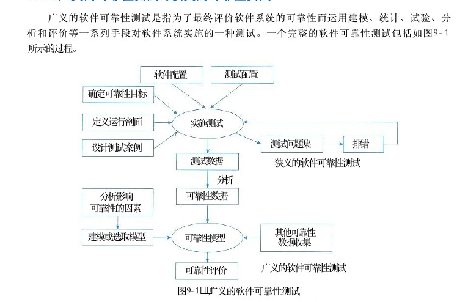

# 第9章 软件可靠性基础知识

> 本页为教材原文文字提取版。图示已按 PDF 页面裁剪并插入正文图注前。

<!-- PDF 第 317 页 -->

随着软件复杂度的增加，软件设计的正确性验证成本也越来越高。可靠和可信的计算模型首先在军事和高要求的商业系统中开始研究，可靠性和其他质量属性一样是衡量软件架构的重要指标。实践证明，保障软件可靠性最有效、最经济、最重要的手段是在软件设计阶段采取措施进行可靠性控制。本章探讨软件可靠性的概念、模型、设计、测试以及评价等相关技术。

## 9．1 软件可靠性基本概念

在现代军事和商用系统中，以软件为核心的产品得到了广泛的应用。随着系统中软件成分的不断增加，使得系统对软件的依赖性越来越强，对软件可靠性的要求也越来越高。软件可靠性技术研究成为当今可靠性工程研究领域中一个重要领域。国外从20世纪60年代后期开始加强对软件可靠性的研究工作，经过40多年的研究，推出了各种可靠性模型和预测方法，于1990年前后形成了较为系统的软件可靠性工程体系。同时，从20世纪80年代中期开始，西方各主要工业强国均确立了专门的研究计划和课题，如英国的AIVEY （软件可靠性和度量标准）计划、欧洲的 ESPRIT （欧洲信息技术研究与发展战略）计划、SPMMS （软件生产和维护管理保障）课题和 Eureka （尤里卡）计划等。每年都有大量的人力、物力投入到软件可靠性研究项目中，并取得了一定的成果。国内对于软件可靠性的研究工作起步较晚，在软件可靠性量化理论、度量标准（指标体系）、建模技术、设计方法和测试技术等方面与国外差距较大。

## 9．1．1软件可靠性定义

软件可靠性 （Software Reliability） 是软件产品在规定的条件下和规定的时间区间完成规定功能的能力。规定的条件是指直接与软件运行相关的使用该软件的计算机系统的状态和软件的输入条件，或统称为软件运行时的外部输入条件；规定的时间区间是指软件的实际运行时间区间；规定功能是指为提供给定的服务，软件产品所必须具备的功能。软件与硬件有很多不同点，但从可靠性的角度来看，它们主要有如下4个不同点。

（1）复杂性。软件内部逻辑高度复杂，硬件则相对简单，这就在很大程度上决定了设计错误是导致软件失效的主要原因，而导致硬件失效的可能性则很小。

（2）物理退化。软件不存在物理退化现象，硬件失效则主要是由于物理退化所致。这就决定了软件正确性与软件可靠性密切相关，一个正确的软件任何时刻均可靠。然而，一个正确的硬件元器件或系统，则可能在某个时刻失效。

（3）唯一性。软件是唯一的，软件复制不改变软件本身，而任何两个硬件不可能绝对相同。

<!-- PDF 第 318 页 -->

这就是为什么概率方法在硬件可靠性领域取得巨大成功，而在软件可靠性领域不令人满意的原因。

（4）版本更新较快。硬件的更新周期通常较慢，硬件产品一旦定型一般就不会更改，而软件产品通常受需求变更、软件缺陷修复的需要，造成软件版本更新较快，这也给软件可靠性评估带来较大的难度。1983年，美国 IEEE计算机学会对“软件可靠性”做出了明确的定义，随后，此定义经美国标准化研究所批准为美国的国家标准。在1989年，我国国家标准 GB／T－11457也采用了这个定义。这个定义就是：在规定的条件下，在规定的时间内，软件不引起系统失效的概率，该概率是系统输入和系统使用的函数，也是软件中存在的缺陷函数；系统输入将确定是否会遇到已存在的缺陷（如果缺陷存在的话）。简言之，就是在规定的时间周期内，在所述条件下程序执行所要求的功能的能力。显而易见，美国 IEEE 计算机学会关于“软件可靠性”的定义仍然沿用了“产品可靠性”的定义，但有了更具体的定位和更深入的描述。下面来分析一下软件可靠性的框架性定义。

（1）规定的时间。软件可靠性只是体现在其运行阶段，所以将“运行时间”作为“规定的时间”的度量。“运行时间”包括软件系统运行后工作与挂起（开启但空闲）的累计时间。由于软件运行的环境与程序路径选取的随机性，软件的失效为随机事件，所以运行时间属于随机变量。

（2）规定的条件。规定的条件主要指软件的运行环境。它涉及软件系统运行时所需的各种支持要素，如支持硬件平台（服务器、台式机和网络平台等）、操作系统、数据库管理系统、中间件，以及其他支持软件、输入数据格式和范围及操作规程等。不同的环境条件下软件的可靠性是不同的，具体地说，规定的环境条件主要是描述软件系统运行时计算机的配置情况及对输入数据的要求，并假定其他一切因素都是理想的。有了明确规定的环境条件，还可以有效地判断软件失效的责任在用户方还是开发方。

（3）所要求的功能。软件可靠性还与规定的任务和功能有关。由于要完成的任务不同，软件的运行情况会有所区别，则调用的子模块就不同（包括程序选择路径不同），其可靠性也就可能不同。所以，要准确度量软件系统的可靠性，必须先明确它的任务和功能。

（4）“软件可靠性”定义具有以下特点。①用内在的“缺陷”和外在的“失效”关系来描述可靠性，更能深刻地体现软件的本质特点。②定义使人们对软件可靠性进行量化评估成为可能。对于软件的可靠性这样一个质量特性，很难用一个明确直观的数值去体现。而依据这个定义，人们有可能通过分析影响可靠性的因素，用函数的形式，按照不同的目的建立各种数学模型去分析软件可靠性。③用概率的方法去描述可靠性是比较科学的。前面讲到，软件失效是随机的外部表现，完全是一个随机事件，而软件缺陷是软件固有的没有损耗的内在特点。定义用规定时间内其操作

<!-- PDF 第 319 页 -->

不出现软件失效的概率，也就是输入未碰到软件缺陷的概率来描述可靠性，这种方法就是用概率来描述纯粹的随机事件，是比较合理的，也是可行的。

## 9．1．2软件可靠性的定量描述

从软件可靠性的定义可以看到，软件的可靠性可以基于使用条件、规定时间、系统输入、系统使用和软件缺陷等变量构建的数学表达式。下面从可靠性定义中的术语“规定时间”“失效概率”开始，探讨软件可靠性的定量描述，并相应地引入一些概念。

## 1．规定时间

对于“规定时间”有3种概念：一种是自然时间，也就是日历时间，指人们日常计时用的年、月、周、日等自然流逝的时间段；一种是运行时间，指软件从启动开始，到运行结束的时间段；最后一种是执行时间，指软件运行过程中，中央处理器 （ CPU ） 执行程序指令所用的时间总和。例如，某单位有一套供会计人员使用的财务软件，我们来关注一整天的时间，上午9：00上班开机运行，下午5：00下班退出程序。在这里，自然时间是一天，也就是24小时，运行时间是 8 个小时 ， 而CPU 处理程序的执行时间可能不到2小时，这要视会计的业务繁忙状况、使用软件的频度和软件本身的设计而定。很明显，在这三种时间中，人们使用执行时间来度量软件的可靠性最为准确，效果也最好。如果运行的软件系统处于一种相对稳定的工作状态，可以根据一定的经验值，按一定的换算比例，对这三种时间进行折算。

## 2．失效概率

从软件运行开始，到某一时刻 t 为止，出现失效的概率可以看作是关于软件运行时间的一个随机函数，用 F （ t ） 表示。根据我们对软件可靠性的分析，函数 F （ t ） 有如下特征。（ 1 ） F （ 0 ） ＝ 0 ， 即软件运行初始时刻失效概率为0。（ 2 ） F （ t ） 在时间域 （ 0 ， ＋ c ） 上是单调递增的。（ 3 ） F （ ＋ c ） ＝ 1 ， 即失效概率在运行时间不断增长时趋向于1，这也和“任何软件都存在缺陷”的思想相吻合。为了简化分析，把F （ t ） 看作关于时间 t 的一个连续函数，并且可导。

## 3．可靠度

人们用来表示可靠性最为直接的方式就是可靠度，根据可靠性的定义，可靠度就是软件系统在规定的条件下、规定的时间内不发生失效的概率。如果用 F （ t ） 来表示到t 时刻止，软件不出现失效的概率，则可靠度的公式为（9－1）R ( t ) = 1 - F ( t )同样，我们知道R （ 0 ） ＝ 1 ， R （ ＋ ） ＝ 0 。

## 4．失效强度

失效强度 （Failure Intensity） 的物理解释就是单位时间软件系统出现失效的概率。在 t时刻

<!-- PDF 第 320 页 -->

到 t＋△t时刻之间软件系统出现失效的平均概率为 （F（t＋△t）－F（t））／△t， 当△t趋于很小时，就表现为 t时刻的失效强度。用f（t） 表示失效强度函数，则F（t＋△t）－f（t）（9－2）＝ F＇（t）f（t）＝lim→o△t

## 5．平均失效前时间

可靠度为R （ t ） 的系统平均失效前时间 （Mean Time To Failure，MTTF） 定义为从 t＝0 时到故障发生时系统的持续运行时间的期望值：mR（t）dtMTTF ＝对于不可修复系统，系统的平均寿命指系统发生失效前的平均工作（或存储）时间或工作次数，也称为系统在失效前的平均时间。 MTTF 的长短，通常与使用周期中的产品有关，其中不包括老化失效。

## 6．平均恢复前时间

平均恢复前时间 （Mean Time To Restoration，MTTR） 是随机变量恢复时间的期望值，就是从出现故障到修复成功中间的这段时间，它包括确认失效发生所必需的时间，记录所有任务的时间，还有将设备重新投入使用的时间。 MTTR越短表示易恢复性越好。

## 7．平均故障间隔时间

MTBF（Mean Time Between Failures， 平均故障间隔时间）定义为：失效或维护中所需的平均时间，包括故障时间以及检测和维护设备的时间。对于可靠度服从指数分布的系统，从任一时刻 t？到达故障的期望时间都是相等的，因此有：MTBF ＝ MTTF ＋ MTTR当讨论完对软件可靠性的定量描述问题之后，需要对软件可靠度这个直接反映软件可靠性的度量指标作下列补充说明。

（1）描述的软件对象必须明确，即需指明它与其他软件的界限。

（2）软件失效必须明确定义。

（3）必须假设硬件无故障（失效）和软件有关变量的输入值正确。

（4）运行环境包括硬件环境、软件支持环境和确定的软件输入域。

（5）规定的时间必须指明时间基准，可以是自然时间（日历时间）、运行时间、执行时间（ CPU 时间）或其他时间基准。

（6）软件无失效运行的机会通常以概率度量，但也可以是模糊数学中的可能性加以度量。

（7）上述定义是在时间域上进行的，这时软件可靠度是一种动态度量。也可以是在数据域上将软件可靠度定义为一种表态度量，表示软件成功执行一个回合的概率。软件回合 （Run） 是指软件在规定环境下的一个基本执行过程，如给定一组输入数据，到软件给定相应的输出数据这一过程。软件回合是软件运行最小的、不可分的执行单位，软件的运行过程由一系列软件回合组成。

（8）有时将软件运行环境简单地理解为软件运行剖面 （Operational Profile）。 欧空局 （ESA）

<!-- PDF 第 321 页 -->

标准 PSS－01－21（1991）“ESA 软件产品保证要求”中，“软件运行剖面”的定义为：“对系统使用条件的定义。系统的输入值都用其按时间的分布或按它们在可能输入范围内的出现概率的分布来定义”。简单来说，运行剖面定义了关于软件可靠性描述中的“规定条件”，也就是相当于可靠性测试中需要考虑的测试环境、测试数据等一系列问题。

## 9．1．3可靠性目标

前面定量分析软件的可靠性时，使用失效强度来表示软件缺陷对软件运行的影响程度。然而在实际情况中，对软件运行的影响程度不仅取决于软件失效发生的概率，还和软件失效的严重程度有很大关系。这里引出另外一个概念——失效严重程度类 （Failure Severity Class）。失效严重程度类就是对用户具有相同程度影响的失效集合。对失效严重程度的分级可以按照不同的标准进行，最为常见的是按对成本影响、对系统能力的影响等标准划分软件失效的严重程度类。对成本的影响可能包括失效引起的额外运行成本、修复和恢复成本、现有或潜在的业务机会的损失等。由于失效严重程度类的影响分布很广泛，为了按照一定数量的等级去定义失效严重程度类，通常用数量级去划分等级。表9－1给出了一个按照对成本的影响划分失效严重程度类的例子，这个例子涉及的软件系统是某电子商务运营系统。表9－1 按照对成本的影响划分失效严重程度类

定义（人民币万元）失效严重程度类失效严重程度类定义（人民币万元）成本＞100

## 40 ． 1 ＜ 成本 ≤ 1

## 10＜成本≤100成本＜0．1

## 1＜成本≤10

对系统能力的影响常常表现为关键数据的损失、系统异常退出、系统崩溃、导致用户操作无效等。对于不同性质的软件系统，相同的表现可能造成的失效严重程度是不同的，例如对可用性要求较高的系统，导致长时间停机的失效常常会划分到较高的严重级别中去。表9－2给出了一个按照对系统能力的影响划分失效严重程度类的例子，这个例子涉及的软件系统是某电信实时计费系统。表9－2按照对系统能力的影响划分失效严重程度类

失效严重程度类定义系统崩溃，重要数据不可恢复—系统出错停止响应，重要数据可恢复用户重要操作无响应，可恢复部分操作无响应，但可用其他操作方式替代

<!-- PDF 第 322 页 -->

有了失效严重程度的划分，现在可以结合失效强度来定量地表示一个软件系统的可靠性目标了。可靠性目标是指客户对软件性能满意程度的期望。通常用可靠度、故障强度和平均失效时间 （ MTTF ） 等指标来描述，根据不同项目的不同需要而定。建立定量的可靠性指标需要对可靠性、交付时间和成本进行平衡。为了定义系统的可靠性指标，必须确定系统的运行模式，定义故障的严重性等级，确定故障强度目标。例如，对于表9－1的例子，可以根据经验和用户的需求确定软件系统需要达到的可靠程度，按照前面的公式，换算成失效强度和平均无失效时间，如表9－3所示。表9－3可靠性目标参考表

失效严重程度类可靠性要求／％失效强度平均无失效时间

## 114年

1 0 ？

## 99．9999

10？417天

## 299．99

## 4天

## 9小时

## 9．1．4可靠性测试的意义

软件可靠性问题已被越来越多的软件工程专家所重视，人们已开始投入大量的人力、物力去研究软件可靠性的设计、评估和测试等课题。以下多个方面可以反映出软件可靠性问题对软件工程实践，乃至对生产活动和社会活动产生的深远影响。

（1）软件失效可能造成灾难性的后果。一个最显著的例子就是由于控制系统的 Fortran 程序中少了个逗点，致使控制系统未能发出正确的指令，最终使美国的一次宇宙飞行失败。而目前由于计算机和软件在各行各业中应用的日益广泛和深入，例如军用作战系统、民航指挥系统、银行支付系统和交通调控系统等，一旦发生严重级别的软件失效，轻则造成经济损失，重则危及人们的生命安全，危害国家安全。

（2）软件的失效在整个计算机系统失效中的比例较高。某研究机构曾经作过统计，在计算机系统的失效中，有80％和软件有关。原因是软件系统的内容结构太复杂了，一个较简单的程序，其所有的路径数就可能是一个天文数字。在软件开发的过程中，很难用全路径覆盖方式的测试去发现软件系统中隐藏的所有缺陷，也就是说，很难完全排除软件缺陷。

（3）相比硬件可靠性技术，软件可靠性技术很不成熟，这就加剧了软件可靠性问题的重要性。例如在硬件可靠性领域，故障树分析 （Fault Tree Analysis，FTA）、 失效模式与效应分析（Failure Made And Effect Analysis，FMEA） 等技术比较成熟，容错技术也有广泛应用，但在软件可靠性领域，这些技术似乎尚未定型。

（4）与硬件元器件成本急剧下降形成鲜明对比的是，软件费用呈有增无减的势头，而软件可靠性问题是造成费用增长的主要原因之一。

（5）计算机技术获得日益广泛的应用，随着计算机应用系统中软件成分的不断增加，使得系统对于软件的依赖性越来越强，软件对生产活动和社会生活的影响越来越大，从而增加了软件可靠性问题在软件工程领域乃至整个计算机工程领域的重要性。

<!-- PDF 第 323 页 -->

软件可靠性问题的重要性凸显了发展以发现软件可靠性缺陷为目的的可靠性设计与测试技术的迫切性。

## 9．1．5广义的可靠性测试与狭义的可靠性测试

广义的软件可靠性测试是指为了最终评价软件系统的可靠性而运用建模、统计、试验、分析和评价等一系列手段对软件系统实施的一种测试。一个完整的软件可靠性测试包括如图9－1所示的过程。

测试配置软件配置确定可靠性目标

定义运行剖面实施测试

测试问题集排错设计测试案例测试数据狭义的软件可靠性测试分析可靠性数据分析影响可靠性的因素

其他可靠性建模或选取模型可靠性模型数据收集

广义的软件可靠性测试可靠性评价

图9－1 广义的软件可靠性测试

狭义的软件可靠性测试是指为了获取可靠性数据 ， 按预先确定的测试用例 ， 在软件的预期使用环境中，对软件实施的一种测试。狭义的软件可靠性测试也叫“软件可靠性试验”（Software Reliability Test）， 它是面向缺陷的测试，以用户将要使用的方式来测试软件，每一次测试代表用户将要完成的一组操作，使测试成为最终产品使用的预演。这就使得所获得的测试数据与软件的实际运行数据比较接近，可用于软件可靠性评价。其实，软件可靠性测试是软件测试的一种形式，和易用性测试、性能测试、标准符合性测试等前面介绍的测试类型一样，是针对软件的某个重要质量特性，使用一定的测试用例对软件进行测试的过程。可靠性测试是对软件产品的可靠性进行调查、分析和评价的一种手段。它不仅仅是为了用测试数据确定软件产品是否达到可靠性目标，还要对检测出的失效的分布、原因及后果进行分析，并给出纠正建议。总的来说，可靠性测试的目的可归纳为以下3个方面。

（1）发现软件系统在需求、设计、编码、测试和实施等方面的各种缺陷。

（2）为软件的使用和维护提供可靠性数据。

（3）确认软件是否达到可靠性的定量要求。

<!-- PDF 第 324 页 -->

## 9．2软件可靠性建模

## 9．2．1影响软件可靠性的因素

在讲到软件可靠性评估的时候，我们不得不提到软件可靠性模型。软件可靠性模型（Software Reliability Model） 是指为预计或估算软件的可靠性所建立的可靠性框图和数学模型。建立可靠性模型是为了将复杂系统的可靠性逐级分解为简单系统的可靠性，以便于定量预计、分配、估算和评价复杂系统的可靠性。为了构建软件的可靠性模型，首先要来分析一下影响软件可靠性的因素。影响软件可靠性的因素是纷杂而众多的，甚至包括技术以外的许多因素。首先必须考虑影响软件可靠性的主要因素：缺陷的引入、发现和清除。缺陷的引入主要取决于软件产品的特性和软件的开发过程特性。软件产品的特性指软件本身的性质，开发过程特性包括开发技术、开发工具、开发人员的水平、需求的变化频度等。缺陷的发现依靠用户对软件的操作方式、运行环境等，也就是运行剖面。缺陷的清除依赖于失效的发现和修复活动及可靠性方面的投入。从技术的角度来看，影响软件可靠性的主要因素如下。

（1）运行剖面（环境）。软件可靠性的定义是相对运行环境而言的，一样的软件在不同的运行剖面下，其可靠性的表现是不一样的。

（2）软件规模。软件规模也就是软件的大小，一个只有数十行代码的软件和几千、几万行代码的软件是不能相提并论的。

（3）软件内部结构。结构对软件可靠性的影响主要取决于软件结构的复杂程度，一般来说，内部结构越复杂的软件，所包含的软件缺陷数就可能越多。

（4）软件的开发方法和开发环境。软件工程表明，软件的开发方法对软件的可靠性有显著影响。例如，与非结构方法相比，结构化方法可以明显减少软件的缺陷数。

（5）软件的可靠性投入。软件在生命周期中可靠性的投入包括开发者在可靠性设计、可靠性管理、可靠性测试和可靠性评价等方面投入的人力、资金、资源和时间等。经验表明，在早期重视软件可靠性并采取措施开发出来的软件，可靠性有明显的提高。总之，有许许多多的因素影响着软件的可靠性，有些至今也无法确定它们与软件可靠性之间的定量关系，甚至定性关系也不甚清楚。

## 9．2．2软件可靠性的建模方法

一个软件可靠性模型通常（但不是绝对）由以下几部分组成。

（1）模型假设。模型是实际情况的简化或规范化，总要包含若干假设，例如测试的选取代表实际运行剖面，不同软件失效独立发生等。

（2）性能度量。软件可靠性模型的输出量就是性能度量，如失效强度、残留缺陷数等。在软件可靠性模型中性能度量通常以数学表达式给出。

（3）参数估计方法。某些可靠性度量的实际值无法直接获得，例如残留缺陷数，这时需通过一定的方法估计参数的值，从而间接确定可靠性度量的值。当然，对于可直接获得实际值的

<!-- PDF 第 325 页 -->

可靠性度量，就无须参数估计了。

（4）数据要求。一个软件可靠性模型要求一定的输入数据，即软件可靠性数据。不同类型的软件可靠性模型可能要求不同类型的软件可靠性数据。绝大多数的模型包含3个共同假设。这些假设至今主宰着软件可靠性建模的研究发展，人们尚未找到克服这些假设局限性的有效方法。

（1）代表性假设。此假设认为软件测试用例的选取代表软件实际的运行剖面，甚至认为测试用例是独立随机地选取。此假设实质上是指可以用测试产生的软件可靠性数据预测运行阶段的软件可靠性行为。

（2）独立性假设。此假设认为软件失效是独立发生于不同时刻，一个软件失效的发生不影响另一个软件失效的发生。例如在概率范畴，假设相邻软件失效间隔构成一组独立随机变量，或假设一定时间内软件失效次数构成一个独立增量过程。在模糊数学范畴，则相邻软件失效间隔构成一组不相关的模糊变量。

（3）相同性假设。此假设认为所有软件失效的后果（等级）相同，即建模过程只考虑软件失效的具体发生时刻，不区分软件的失效严重等级。软件可靠性模型要描述失效过程对上一节所分析因素的一般依赖形式。由于这些因素大多数在本质上是概率性的，并且表现与时间相关联，所以通过失效数据的概率分布和随机过程随时间的变化的特性来整体区分软件可靠性模型。人们常常通过下面估计或预测的方法来确定模型的参数。估计是通过收集到的失效数据进行统计分析，利用一定的推导过程归纳出模型的参数；预测则是使用软件产品自身的属性和开发过程来确定模型的参数，这种方法可以在开始执行程序前完成。确定了模型的参数后，就可以来表示失效过程的很多不同的特性。例如，大多数模型都会对如下的内容进行解析表达。

（1）任何时间点所经历的平均失效数。

（2）一段时间间隔内的平均失效数。

（3）任何时间点的失效强度。

（4）失效区间的概率分布。在对将来的故障行为进行预测时，应保证模型参数的值不发生变化。如果在进行预测时发现引入了新的错误，或修复行为使新的故障不断发生，就应停止预测，并等足够多的故障出现后，再重新进行模型参数的估计。否则，这样的变化会因为增加问题的复杂程度而使模型的实用性降低。一般来说，软件可靠性模型是以在固定不变的运行环境中运行的不变的程序作为估测实体的。这也就是说，程序的代码和运行剖面都不发生变化，但它们往往总要发生变化的，于是在这种情况之下，就应采取分段处理的方式来进行工作。因此，模型主要集中注意力于排错。但是，也有的模型具有能处理缓慢地引进错误情况的能力。对于一个已发行并正在运行的程序，应暂缓安装新的功能和对下一次发行的版本的修复。如果能保持一个不变的运行剖面，则程序的故障密度将显示为一个常数。一般来说，一个好的软件可靠性模型增加了关于开发项目的交流，并对了解软件开发过

<!-- PDF 第 326 页 -->

程提供了一个共同的工作基础。它也增加了管理的透明度和其他令人感兴趣的东西。即使在特殊的情况之下，通过模型做出的预测并不是很精确的话，上面的这些优点也仍然是明显而有价值的。要建立一个有用的软件可靠性模型必须有坚实的理论研究工作、有关工具的建造和实际工作经验的积累。通常这些工作要许多人一年的工作量。相反，要应用一个好的软件可靠性模型，则要求以极少的项目资源就可以在实际工作中产生好的效益。一个好的软件可靠性模型应该具有如下重要特性。

（1）基于可靠的假设。

（2）简单。

（3）计算一些有用的量。

（4）给出未来失效行为的好的映射。

（5）可广泛应用。

## 9．2．3软件的可靠性模型分类

一个有效的软件可靠性模型应尽可能地将上面所述的因素在软件可靠性建模时加以考虑，尽可能简明地反映出来。自1972年第一个软件可靠性分析模型发表的30多年来，见之于文献的软件可靠性统计分析模型将近百种。这些可靠性模型大致可分为如下10类。

● 种子法模型。

● 失效率类模型。

● 曲线拟合类模型。

● 可靠性增长模型。

● 程序结构分析模型。

● 输入域分类模型。

● 执行路径分析方法模型。

● 非齐次泊松过程模型。

● 马尔可夫过程模型。

● 贝叶斯分析模型。下面分别对这些模型进行简单介绍。

## 1．种子法模型

种子法模型利用捕获一再捕获抽样技术估计程序中的错误数，在程序中预先有意“播种”一些设定的错误“种子”，然后根据测试出的原始错误数和发现的诱导错误的比例，来估计程序中残留的错误数。其优点是简便易行，缺点是诱导错误的“种子”与实际的原始错误之间的类比性估量困难。

## 2．失效率类模型

失效率类模型用来研究程序的失效率，主要有下列内容。

<!-- PDF 第 327 页 -->

●的模型。Jelinski-MorandaDe-eutrophication

●的几何模型。Jelinski-MorandaDe-eutrophication

●模型。Schick-Wolverton

● 改进的模型。Schick-Wolverton

●的几何泊松模型。Moranda

●和不完全排错模型。GoalOkumoto

## 3．曲线拟合类模型

曲线拟合类模型用回归分析的方法研究软件复杂性、程序中的缺陷数、失效率、失效间隔时间，包括参数方法和非参数方法两种。

## 4．可靠性增长模型

这类模型预测软件在检错过程中的可靠性改进，用增长函数来描述软件的改进过程。这类模型如下。

●模型。Duane

●模型。Weibull

●的改进模型。WagonerWeibull

●和的逻辑增长曲线。YamadaOsaki

●的增长曲线。Gompertz

## 5．程序结构分析模型

程序结构分析模型是根据程序、子程序及其相互间的调用关系，形成一个可靠性分析网络。网络中的每个结点代表一个子程序或一个模块，网络中的每一有向弧代表模块间的程序执行顺序。假定各结点的可靠性是相互独立的，通过对每个结点可靠性、结点间转换的可靠性和网络在结点间的转换概率，得出该持续程序的整体可靠性。这类模型如下。

●马尔可夫结构模型。Littewood

●的面向用户的马尔可夫模型。Cheung

## 6．输入域分类模型

输入域分类模型选取软件输入域中的某些样本“点”运行程序，根据这些样本点在“实际”使用环境中的使用概率的测试运行时的成功／失效率，推断软件的使用可靠性。这类模型的重点（亦是难点）是输入域的概率分布的确定及对软件运行剖面的正确描述。这类模型如下。

●模型。Nelson

●的基于输入域的随机过程模型。Bastani

## 7．执行路径分析方法模型

执行路径分析方法类模型的分析方法与上面的模型相似，先计算程序各逻辑路径的执行概率和程序中错误路径的执行概率，再综合出该软件的使用可靠性。 Shooman分解模型属于此类。

<!-- PDF 第 328 页 -->

## 8．非齐次泊松过程模型

非齐次泊松过程模型 （NHPP）， 是以软件测试过程中单位时间的失效次数为独立泊松随机变量，来预测在今后软件的某使用时间点的累计失效数。这类模型如下。

●的指数模型。Musa

●和的模型，GoelOkumotoNHPPS＿

●型可靠性增长模型。

● 超指数增长模型。

●改进的模型。PhamNHPP

## 9．马尔可夫过程模型

马尔可夫过程模型如下。

● 完全改错的线性死亡模型。

● 不完全改错的线性死亡模型。

● 完全改错的非静态线性死亡模型。

## 10．贝叶斯模型

贝叶斯模型是利用失效率的试验前分布和当前的测试失效信息，来评估软件的可靠性。这是一类当软件可靠性工程师对软件的开发过程有充分地了解，软件的继承性比较好时具有良好效果的可靠性分析模型。这类模型如下。

● 连续时间的离散型马尔可夫链。

●模型。Shock另外， Musa 和 Okumoto依据模型的不同属性对可靠性模型进行以下分类。

● 时间域：有两种，自然或日历时间与执行时间。(CPU)

● 失效数类：取决于无限时间内发生的失效数是有限的还是无限的。

● 失效数分布：相对于时间系统失效数的统计分布形式，主要的两类是泊松分布型和二项分布型。

● 有限类：对有限失效数的类别适用，用时间表示的失效强度的函数形式。

● 无限类：对无限失效数的类别适用，用经验期望失效数表示的失效强度的函数形式。

## 9．3软件可靠性管理

为了进一步提高软件可靠性，人们又提出了软件可靠性管理的概念，把软件可靠性活动贯穿于软件开发的全过程。软件可靠性管理是软件工程管理的一部分，它以全面提高和保证软件可靠性为目标，以软件可靠性活动为主要对象，是把现代管理理论用于软件生命周期中的可靠性保障活动的一种管理形式。软件可靠性管理的内容包括软件工程各个阶段的可靠性活动的目标、计划、进度、任务和

<!-- PDF 第 329 页 -->

修正措施等。软件工程各个阶段可能进行的主要软件可靠性活动如下所述。由于软件之间的差异较大，并且人们对可靠性的期望不同，对可靠性的投入不同，所以下面的每项活动并不是每一个软件系统的可靠性管理的必须内容，也不是软件可靠性管理的全部内容。

## 1．需求分析阶段

（1）确定软件的可靠性目标。

（2）分析可能影响可靠性的因素。

（3）确定可靠性的验收标准。

（4）制定可靠性管理框架。

（5）制定可靠性文档编写规范。

（6）制订可靠性活动初步计划。

（7）确定可靠性数据收集规范。

## 2．概要设计阶段

（1）确定可靠性度量。

（2）制定详细的可靠性验收方案。

（3）可靠性设计。

（4）收集可靠性数据。

（5）调整可靠性活动计划。

（6）明确后续阶段的可靠性活动的详细计划。

（7）编制可靠性文档。

## 3．详细设计阶段

（1）可靠性设计。

（2）可靠性预测（确定可靠性度量估计值）。

（3）调整可靠性活动计划。

（4）收集可靠性数据。

（5）明确后续阶段的可靠性活动的详细计划。

（6）编制可靠性文档。

## 4．编码阶段

（1）可靠性测试（含于单元测试）。

（2）排错。

（3）调整可靠性活动计划。

（4）收集可靠性数据。

（5）明确后续阶段的可靠性活动的详细计划。

（6）编制可靠性文档。

<!-- PDF 第 330 页 -->

## 5．测试阶段

（1）可靠性测试（含于集成测试、系统测试）。

（2）排错。

（3）可靠性建模。

（4）可靠性评价。

（5）调整可靠性活动计划。

（6）收集可靠性数据。

（7）明确后续阶段的可靠性活动的详细计划。

（8）编制可靠性文档。

## 6．实施阶段

（1）可靠性测试（含于验收测试）

（2）排错。

（3）收集可靠性数据。

（4）调整可靠性模型。

（5）可靠性评价。

（6）编制可靠性文档。可靠性管理目前还停留在定性描述的水平上，很难用量化的指标来进行可靠性管理。可靠性管理规范的制定水平和实施效果也有待提高。怎样利用有限的可靠性投入，达到预期的可靠性目标是软件项目管理者常常要面对的难题。因此，可靠性管理研究是一个长期的课题。

## 9．4软件可靠性设计

在测试阶段，利用测试手段收集测试数据，并利用软件可靠性模型，可以评估或预测软件的可靠性。这些软件可靠性测试活动虽然能通过查错和排错活动有限地改善软件可靠性，但不能从根本上提高软件的可靠性，也难以保证软件可靠性，并且修改由于设计导致的软件缺陷，有可能付出比较昂贵的代价。实践证明，保障软件可靠性最有效、最经济、最重要的手段是在软件设计阶段采取措施进行可靠性控制。为了从根本上提高软件的可靠性，降低软件后期修改的成本和难度，人们提出了可靠性设计的概念。可靠性设计其实就是在常规的软件设计中，应用各种方法和技术，使程序设计在兼顾用户的功能和性能需求的同时，全面满足软件的可靠性要求，即采用一些技术手段，把可靠性“设计”到软件中去。软件可靠性设计技术就是以提高和保障软件的可靠性为目的，在软件设计阶段运用的一种特殊的设计技术。在软件工程中已有很多比较成熟的设计技术，如结构化设计、模块化设计、自顶向下设计及自底向上设计等，这些技术是为了保障软件的整体质量而采用的。在此基础上，为了进一步提高软件的可靠性，通常会采用一些特殊设计技术。虽然软件可靠性设计技术与普通的软件设计技术没有明显的界限，但软件可靠性设计仍要遵循一些自己的原则。

<!-- PDF 第 331 页 -->

（1）软件可靠性设计是软件设计的一部分，必须在软件的总体设计框架中使用，并且不能与其他设计原则相冲突。

（2）软件可靠性设计在满足提高软件质量要求的前提下，以提高和保障软件可靠性为最终目标。

（3）软件可靠性设计应确定软件的可靠性目标，不能无限扩大化，并且排在功能度、用户需求和开发费用之后考虑。可靠性设计概念被广为引用，但并没有多少人能提出非常实用并且广泛运用的可靠性设计技术。一般来说，被认可的且具有应用前景的软件可靠性设计技术主要有容错设计、检错设计和降低复杂度设计等技术。

## 9．4．1容错设计技术

对于软件失效后果特别严重的场合，如飞机的飞行控制系统、空中交通管制系统及核反应堆安全控制系统等，可采用容错设计方法。常用的软件容错技术主要有恢复块设计、 N 版本程序设计和冗余设计3种方法。

## 1）恢复块设计

程序的执行过程可以看成是由一系列操作构成的，这些操作又可由更小的操作构成。恢复块设计就是选择一组操作作为容错设计单元，从而把普通的程序块变成恢复块。被选择用来构造恢复块的程序块可以是模块、过程、子程序和程序段等。一个恢复块包含有若干个功能相同、设计差异的程序块文本，每一时刻有一个文本处于运行状态。一旦该文本出现故障，则用备份文本加以替换，从而构成“动态冗余”。软件容错的恢复块方法就是使软件包含有一系列恢复块。

## 2 ） N版本程序设计

N 版本程序的核心是通过设计出多个模块或不同版本，对于相同初始条件和相同输入的操作结果，实行多数表决，防止其中某一软件模块／版本的故障提供错误的服务，以实现软件容错。为使此种容错技术具有良好的结果，必须注意以下两个方面。

（1）使软件的需求说明具有完全性和精确性。这是保证软件设计错误不相关的前提，因为软件的需求说明是不同设计组织和人员的唯一共同出发点。

（2）设计全过程的不相关性。它要求各个不同的软件设计人员彼此不交流，程序设计使用不同的算法、不同的编程语言、不同的编译程序、不同的设计工具、不同的实现方法和不同的测试方法。为了彻底保证软件设计的不相关性，甚至提出设计人员应具有不同的受教育背景，来自不同的地域、不同的国家。

## 3）冗余设计

改善软件可靠性的一个重要技术是冗余设计。在硬件系统中，在主运行的系统之外备用额外的元件或系统，如果出现一个元件故障或系统故障，则立即更换冗余的元件或切换到冗余的系统，则该硬件系统仍可以维持运行。在软件系统中，冗余技术的运用有所区别。如果采用相同两套软件系统互为备份，其意义不大，因为在相同的运行环境中，一套软件出故障的地方，

<!-- PDF 第 332 页 -->

另外一套也一定会出现故障。软件的冗余设计技术实现的原理是在一套完整的软件系统之外，设计一种不同路径、不同算法或不同实现方法的模块或系统作为备份，在出现故障时可以使用冗余的部分进行替换，从而维持软件系统的正常运行。从表面上看，设计开发完成同样功能但实现方法完全不同的两套软件系统，需要的费用可能接近于单个版本软件开发费用的两倍，但采用冗余技术设计软件所增加的额外费用肯定远低于重新设计一个版本软件的费用。这是因为大多数设计花费，例如文档、测试以及人力都是有可能复用的。冗余设计还有可能导致软件运行时所花费的存储空间、内存消耗以及运行时间有所增加，这就需要在可靠性要求和额外付出代价之间做出折中。

## 9．4．2检错技术

在软件系统中，对无须在线容错的地方或不能采用冗余设计技术的部分，如果对可靠性要求较高，故障有可能导致严重的后果。一般采用检错技术，在软件出现故障后能及时发现并报警，提醒维护人员进行处理。检错技术实现的代价一般低于容错技术和冗余技术，但它有一个明显的缺点，就是不能自动解决故障，出现故障后如果不进行人工干预，将最终导致软件系统不能正常运行。采用检错设计技术要着重考虑几个要素：检测对象、检测延时、实现方式和处理方式。

（1）检测对象：包含两个层次的含义，即检测点和检测内容。在设计时应考虑把检测点放在容易出错的地方和出错对软件系统影响较大的地方；检测内容选取那些有代表性的、易于判断的指标。

（2）检测延时：从软件发生故障到被自检出来是有一定延时的，这段延时的长短对故障的处理是非常重要的。因此，在软件检错设计时要充分考虑到检测延时。如果延时长到影响故障的及时报警，则需要更换检测对象或检测方式。

（3）实现方式：最直接的一种实现方式是判断返回结果，如果返回结果超出正常范围，则进行异常处理。计算运行时间也是一种常用的技术，如果某个模块或函数运行超过预期的时间，可以判断出现故障。另外，还有置状态标志位等多种方法，自检的实现方式要根据实际情况来选用。

（4）处理方式：大多数检错采用“查出故障一停止软件系统运行一报警”的处理方式，但也有采用不停止或部分停止软件系统运行的情况，这一般由故障是否需要实时处理来决定。

## 9．4．3降低复杂度设计

前面讲到，软件和硬件最大的区别之一就是软件的内部结构比硬件复杂得多，人们用软件复杂度来定量描述软件的复杂程度。软件复杂性常分为模块复杂性和结构复杂性。模块复杂性主要包含模块内部数据流向和程序长度两个方面，结构复杂性用不同模块之间的关联程度来表示。软件复杂度可用涉及模块复杂性和结构复杂性的一些统计指标来进行定量描述，在这里就不进行详细叙述了。软件的复杂性与软件可靠性有着密切的关系，软件复杂性是产生软件缺陷的重要根源。有研究表明，当软件的复杂度超过一定界限时，软件缺陷数会急剧上升，软件的可靠性急剧下降。

<!-- PDF 第 333 页 -->

因此，在设计时就应考虑降低软件的复杂性，使之处于一个合理的阈值之内，这是提高软件可靠性的有效方法。降低复杂度设计的思想就是在保证实现软件功能的基础上，简化软件结构，缩短程序代码长度，优化软件数据流向，降低软件复杂度，从而提高软件可靠性。除了容错设计、检错设计和降低复杂度设计技术外，人们尝试着把硬件可靠性设计中比较成熟的技术，如故障树分析 （FTA）、 失效模式与效应分析 （ FMEA ） 等运用到软件可靠性设计领域，这些技术大多是运用一些分析、预测技术，在软件设计时就充分考虑影响软件可靠性的因素，并采取一些措施进行优化。由于软件与硬件内部性质的巨大差异，这些技术在软件可靠性设计领域的应用效果和范围极其有限。

## 9．4．4系统配置技术

通常在系统配置中可以采用相应的容错技术，通过系统的整体来提供相应的可靠性，主要有双机热备技术和服务器集群技术。

## 1）双机热备技术

双机热备技术是一种软硬件结合的较高容错应用方案。该方案是由两台服务器系统和一个外接共享磁盘阵列柜和相应的双机热备份软件组成。在这个容错方案中，操作系统和应用程序安装在两台服务器的本地系统盘上，整个网络系统的数据是通过磁盘阵列集中管理和数据备份的。用户的数据存放在外接共享磁盘阵列中，在一台服务器出现故障时，备机主动替代主机工作，保证网络服务不间断。双机热备系统采用“心跳”方法保证主系统与备用系统的联系。所谓“心跳”，指的是主从系统之间相互按照一定的时间间隔发送通信信号，表明各自系统当前的运行状态。一旦“心跳”信号表明主机系统发生故障，或者备用系统无法收到主机系统的“心跳”信号，则系统的高可用性管理软件认为主机系统发生故障，立即将系统资源转移到备用系统上，备用系统替代主机工作，以保证系统正常运行和网络服务不间断。双机热备方案中，根据两台服务器的工作方式可以有3种不同的工作模式，即：双机热备模式、双机互备模式和双机双工模式。

（1）双机热备模式，即通常所说的 Active／Standby方式， Active 服务器处于工作状态；而Standby服务器处于监控准备状态，服务器数据包括数据库数据同时往两台或多台服务器写入（通常各服务器采用 RAID 磁盘阵列卡），保证数据的即时同步。当 Active 服务器出现故障的时候，通过软件诊测或手工方式将 Standby 机器激活，保证应用在短时间内完全恢复正常使用。这是目前采用较多的一种模式，但由于另外一台服务器长期处于后备的状态，就存在一定的计算资源浪费。

（2）双机互备模式，是两个相对独立的应用在两台机器同时运行，但彼此均设为备机，当某一台服务器出现故障时，另一台服务器可以在短时间内将故障服务器的应用接管过来，从而保证了应用的持续性，但对服务器的性能要求比较高。

（3）双机双工模式是集群的一种形式，两台服务器均处于活动状态，同时运行相同的应用，

<!-- PDF 第 334 页 -->

以保证整体系统的性能，也实现了负载均衡和互为备份，通常使用磁盘柜存储技术。 Web服务器或 FTP服务器等用此种方式比较多。

## 2）服务器集群技术

集群技术是指一组相互独立的服务器在网络中组合成为单一的系统工作，并以单一系统的模式加以管理。此单一系统为客户工作站提供高可靠性的服务。大多数情况下，集群中所有的计算机拥有一个共同的名称，集群内任一系统上运行的服务可被所有的网络客户所使用。集群必须可以协调管理分离的构件出现的错误和故障，并可透明地向集群中加入构件。一个集群包含多台服务器。每台服务器的操作系统和应用程序文件存储在其各自的本地储存空间上。集群内各结点服务器通过内部局域网相互通信，当某结点服务器发生故障时，这台服务器上所运行的应用程序将在另一结点服务器上被自动接管。当一个应用服务发生故障时，应用服务将被重新启动或被另一台服务器接管。当以上的任一故障发生时，客户都将能很快连接到其他应用服务器上。

## 9．5软件可靠性测试

## 9．5．1软件可靠性测试概述

软件测试者可以使用很多方法进行软件测试，如按行为或结构来划分输入域的划分测试，纯粹随机选择输入的随机测试，基于功能、路径、数据流或控制流的覆盖测试等。对于给定的软件，每种测试方法都局限于暴露一定数量和一些类别的缺陷。通过这些测试能够查找、定位、改正和消除某些缺陷，实现一定意义上的软件可靠性增长。但是，由于它们都是面向错误的测试，测试所得的结果数据不能直接用于软件可靠性评价，必须经过一定的分析处理后方可使用可靠性模型进行可靠性评价。软件可靠性测试由可靠性目标的确定、运行剖面的开发、测试用例的设计、测试实施、测试结果的分析等主要活动组成。软件可靠性测试还必须考虑对软件开发进度和成本的影响，最好是在受控的自动测试环境下，由专业测试机构完成。软件可靠性测试是一种有效的软件测试和软件可靠性评价技术。尽管软件可靠性测试也不能保证软件中残存的缺陷数最少，但经过软件可靠性测试可以保证软件的可靠性达到较高的要求，对于开发高可靠性与高安全性软件系统很有帮助。软件可靠性测试要在工程上获得广泛应用，还有许多实际问题需要解决。

## 9．5．2定义软件运行剖面

定义运行剖面首先需要为软件的使用行为建模，建模可以采用马尔可夫链来完成。用马尔可夫链将输入域编码为一个代表用户观点的软件使用的状态集。弧用来连接状态并表示由各种激励导致的转换，这些激励可能由硬件、人机接口或其他软件等产生。将转换概率分配给每个

<!-- PDF 第 335 页 -->

弧，用来代表一个典型用户最有可能施加给系统的激励。这种类型的马尔可夫链是一个离散的有限状态集，这类模型可以用有向图或转换矩阵表示。定义运行剖面的下一步是开发使用模型，明确需要测试的内容。软件系统可能会有许多用户和用户类别，每类用户都可能以不同的方式使用系统。开发使用模型涉及将输入域分层，有两种类型的分层形式：用户级分层和用法级分层。用户级分层依赖于谁或什么能激励系统；用法级分层依赖于在测试状态下系统能做什么。换句话说，用户级分层考虑各种类型的用户以及他们如何使用系统；用法级分层则要求考虑系统能够提供的所有功能。一旦用户和用法模型被开发出来，弧上的概率将被分配。这些概率估计主要是基于如下几个方面。

（1）从现有系统收集到的数据。

（2）与用户的交谈或对用户进行观察获得的信息。

（3）原型使用与测试分析的结果。

（4）相关领域专家的意见。定义使用概率的最佳方法是使用实际的用户数据，如来自系统原型、前一版本的使用数据；其次是由该软件应用领域的用户和专家提供的预期使用数据；在没有任何数据可用的情况下，只能是将每个状态现有的弧分配相同的概率，这是最差的一种方法。由于软件可靠性行为是相对于软件实际的运行剖面而言的，同一软件在不同运行剖面下其可靠性表现可能大不相同，所以用于可靠性测试准备的运行剖面的开发与定义必须充分分析和考虑软件的实际运行情况。软件可靠性测试假设每个操作的数据输入都有同样的发生错误的概率，这样最频繁出现的操作和输入将表现出最高的故障率。对于特定的操作环境这是正确的，但无法贯穿系统的全部操作集合。典型的例子是飞机的飞行控制软件，在正常飞行、起飞、降落、地面运动和地面等待这5个状态中，尽管起飞和降落在运行剖面上只占有很小的百分比，但是它们却占有很大的故障比例。对于高安全性要求的软件，一个看起来很少使用的代码路径也可能带来灾难性的后果。因此，对于边界、跃迁情况和关键功能不应该用简单的运行剖面来对待，应该构造专门的运行剖面，补充统计模型之外的测试用例。在覆盖率水平不够时，可根据具体空白，进行适当的补充测试。如果补充测试发现了错误，就可分析这些错误，估计其对可靠性产生的影响。一个产品有可能需要开发多个运行剖面，这取决于它所包含的运行模式和关键操作，通常需要为关键操作单独定义运行剖面。

## 9．5．3可靠性测试用例设计

为了对软件可靠性进行良好的预计，必须在软件的运行域上对其进行测试。首先定义一个相应的剖面来镜像运行域，然后使用这个剖面驱动测试，这样可以使测试真实地反映软件的使用情况。由于可能的输入几乎是无限的，测试必须从中选择出一些样本，即测试用例。测试用例要能够反映实际的使用情况，反映系统的运行剖面。将统计方法运用到运行剖面开发和测试用例生成中去，并为在运行剖面中的每个元素都定量地赋予一个发生概率值和关键因子，然后根据这些因素分配测试资源，挑选和生成测试用例。

<!-- PDF 第 336 页 -->

在这种测试中，优先测试那些最重要或最频繁使用的功能，释放和缓解最高级别的风险，有助于尽早发现那些对可靠性有最大影响的故障，以保证软件的按期交付。设计测试用例就是针对特定功能或组合功能设计测试方案，并编写成文档。测试用例的选择既要有一般情况，也应有极限情况以及最大和最小的边界值情况。因为测试的目的是暴露应用软件中隐藏的缺陷，所以在设计选取测试用例和数据时要考虑那些易于发现缺陷的测试用例和数据，结合复杂的运行环境，在所有可能的输入条件和输出条件中确定测试数据，来检查应用软件是否都能产生正确的输出。一个典型的测试用例应该包括下列组成部分。

（1）测试用例标识。

（2）被测对象。

（3）测试环境及条件。

（4）测试输入。

（5）操作步骤。

（6）预期输出。

（7）判断输出结果是否符合标准。

（8）测试对象的特殊需求。由于可靠性测试的主要目的是评估软件系统的可靠性，因此，除了常规的测试用例集仍然适用外，还要着重考虑和可靠性密切相关的一些特殊情况。在测试中，可以考虑进行“强化输入”，即比正常输入更恶劣（合理程度的恶劣）的输入。表9－4给出了一些参考实例。表9－4可靠性测试用例设计时重点考虑的特殊情况

序号测试目的描述考虑对用户常见的误操作的提示和屏蔽情况屏蔽用户操作错误错误提示的准确性对用户的错误提示准确描述错误是否导致系统异常退出有无操作错误引起系统异常退出的情况系统应对输入的数据进行有效性检查，对冗余的数据进行过滤、数据可靠性校验和清洗，保证数据的正确性和可靠性考察数据和系统的受影响程度，若受损，是否提供补救工具，补救的情况如何。异常情况包括：异常情况的影响● 硬件故障

● 网络故障

● 部分软件模块失效

## 9．5．4可靠性测试的实施

在进行应用软件的可靠性测试前有必要检查软件需求与设计文档是否一致，检查软件开发过程中形成的文档的准确性、完整性以及与程序的一致性，检查所交付程序和数据以及相应的软件支持环境是否符合要求。

<!-- PDF 第 337 页 -->

这些检查虽然增加了工作量，但对于在测试早期发现错误和提高软件的质量是非常必要的。软件可靠性测试必须是受控测试，在运行此类测试时，为了保证统计数据的有效性，测试过程中的每个测试用例必须用相同的软件版本，新的软件版本意味着新测试的开始。在有些情况下，不能进行纯粹的可靠性测试。因为客户的要求、合同的规定或者标准的约束，需要补充其他形式的非统计测试。这时的最佳选择是既执行可靠性测试，也执行非统计测试（如覆盖测试）。如果非统计测试在可靠性测试之前完成，由统计测试产生的统计数据仍然有效。但是在可靠性测试之后执行非统计测试，可能会影响软件可靠性评估的准确性。软件可靠性测试同样依赖于软件的可测试性。可靠性测试的难点就在于判断测试用例的运行是成功还是失败。在控制系统及类似的软件中，失效由详细说明、时间（通常是 CPU 时间或时钟时间）来客观地定义。而在一般应用系统中，失效的定义更主观些，它不仅依赖于程序是否符合规格说明的要求，也取决于指定的性能是否能够达到用户的期望，但是否达到期望没有确定的标准。在一些科学计算中，计算结果只能由计算机给出，在这种情况下，如果软件只是输出了错误的结果而不是整个系统发生失效，错误就不可能被发现。此时可以将测试分成两个阶段进行。第一阶段运行较少量的测试用例，并对照规范进行仔细检查。第二阶段再运行大量测试用例。第二阶段不用人工检查输出的每项内容，而是找失效现象，包括错误信息、断电、崩溃和死机。也可把输出记录到文件中，采用搜索或过滤方法进行处理。如果软件有足够的可测试性，这种方法不会漏掉很多的严重失效。如果计算的正确性无法验证，就需要对软件进行一些形式化的证明。开发方交付的任何软件文档中与可靠性质量特性有关的部分、程序以及数据都应当按照需求说明和质量需求进行测试。在项目合同、需求说明书和用户文档中规定的所有配置情况下，程序和数据都必须进行测试。软件可靠性数据是可靠性评价的基础。为了获得更多的可靠性数据，应该使用多台计算机同时运行软件，以增加累计运行时间。应该建立软件错误报告、分析与纠正措施系统。按照相关标准的要求，制定和实施软件错误报告和可靠性数据收集、保存、分析和处理的规程，完整、准确地记录软件测试阶段的软件错误报告和收集可靠性数据。用时间定义的软件可靠性数据可以分为4类，这4类数据可以互相转化，具体内容如下。

（1）失效时间数据：记录发生一次失效所累积经历的时间。

（2）失效间隔时间数据：记录本次失效与上一次失效间的间隔时间。

（3）分组时间内的失效数：记录某个时间区内发生了多少次失效。

（4）分组时间的累积失效数：记录到某个区间的累积失效数。在测试过程中必须真实地进行记录，每个测试记录必须包含如下信息。

（1）测试时间。

（2）含有测试用例的测试说明或标识。

（3）所有与测试有关的测试结果，包括失效数据。

（4）测试人员。测试活动结束后要编写《软件可靠性测试报告》，对测试用例及测试结果在测试报告中加以总结归纳。编写时可以参考 GJB 438A－97 中提供的《软件测试报告》格式，并应根据情况进行

<!-- PDF 第 338 页 -->

剪裁。测试报告应具备如下内容。

（1）软件产品标识。

（2）测试环境配置（硬件和软件）。

（3）测试依据。

（4）测试结果。

（5）测试问题。

（6）测试时间。把可靠性测试过程进行规范化，有利于获得真实有效的数据，为最终得到客观的可靠性评价结果奠定基础。

## 9．6软件可靠性评价

## 9．6．1软件可靠性评价概述

软件可靠性评价是软件可靠性活动的重要组成部分，既适用于软件开发过程，也可针对最终软件系统。在软件开发过程中使用软件可靠性评价，可以使用软件可靠性模型，估计软件当前的可靠性，以确认是否可以终止测试并发布软件，同时还可以预计软件要达到相应的可靠性水平所需要的时间和工作量，评价提交软件时的软件可靠性水平。对于最终软件产品，软件可靠性评价结合可靠性验证测试，确认软件的执行与需求的一致性，确定最终软件产品所达到的可靠性水平。这一节阐述的软件可靠性评价工作是指选用或建立合适的可靠性数学模型，运用统计技术和其他手段，对软件可靠性测试和系统运行期间收集的软件失效数据进行处理，并评估和预测软件可靠性的过程。这个过程包含如下3个方面。

（1）选择可靠性模型。

（2）收集可靠性数据。

（3）可靠性评估和预测。

## 9．6．2怎样选择可靠性模型

在前面讨论了软件的可靠性模型以及一个实例，一些可靠性研究者试图寻找一个最好的模型，能适用于所有的软件系统，但这样的工作是徒劳的。因为对于不同的软件系统，出于不同的可靠性分析目的，模型的适用性是不一样的。但究竟怎样来为可靠性评价选用不同的模型，却又是一个不小的难题。针对可靠性模型的构成以及使用模型来进行可靠性评价的目的，可以从以下几个方面进行比较和选择。

## 1．模型假设的适用性

模型假设是可靠性模型的基础，模型假设要符合软件系统的现有状况，或与假设冲突的因素在软件系统中应该是可忽略的。例如，有的模型假定检测或发现的软件缺陷是立即排除掉的，

<!-- PDF 第 339 页 -->

而且排除时间忽略不计，如果现有的软件系统对于严重程度类较低的软件缺陷不进行立即排错，那么这个模型显然是不适用的。往往一个模型的假设有许多条，我们需要在选用模型的时候对每一条假设进行细致地分析，评估现有的软件系统中不符合假设的因素对可靠性评价的影响如何，以确定模型是否适合软件系统的可靠性评价工作。

## 2．预测的能力与质量

预测的能力与质量是指模型根据现在和历史的可靠性数据，预测将来的可靠性和失效概率的能力，以及预测结果的准确程度。显然，模型预测的能力与质量是比较难于评价的，但任何一个模型只有在实践中加以实验和不断改善，才能得到认可。所以，在满足其他条件的前提下，应尽量选用比较成熟、应用较广的模型作为分析模型。

## 3．模型输出值能否满足可靠性评价需求

使用模型进行可靠性评价的最终目的，是想得到软件系统当前的可靠性定量数据，以及预测一定时间后的可靠性数据，可以根据可靠性测试目的来确定哪些模型的输出值满足可靠性评价需求。一般来说，最重要的几个需要精确估计的可靠性定量指标包括如下内容。

（1）当前的可靠度。

（2）平均无失效时间。

（3）故障密度。

（4）期望达到规定可靠性目标的日期。

（5）达到规定的可靠性目标的成本要求。

## 4．模型使用的简便性

模型使用的简便性一般包含如下3层含义。

（1）模型需要的数据在软件系统中应该易于收集，而且收集需要投入的成本不能超过可靠性计划的预算。

（2）模型应该简单易懂，进行可靠性分析的软件测试人员不会花费太多的时间去研究专业的数学理论，他们只需要知道哪些假设适用，需要收集哪些数据，能够得到哪些分析结果就可以了。

（3）模型应该便于使用，最好能用工具实现数据的输入。也就是说，测试人员除了输入可靠性数据外，不需要深入模型内部进行一些额外的工作。尽管这样，由于可靠性研究理论在软件工程领域发展的限制，可供选择的可靠性模型极其有限，这已在相当大的程度上制约了可靠性测试的开展。

## 9．6．3可靠性数据的收集

面向缺陷的可靠性测试产生的测试数据经过分析后，可以得到非常有价值的可靠性数据，是可靠性评价所用数据的一个重要来源，这部分数据取决于定义的运行剖面和选取的测试用例集。可靠性数据主要是指软件失效数据，是软件可靠性评价的基础，主要是在软件测试、实施

<!-- PDF 第 340 页 -->

阶段收集的。在软件工程的需求、设计和开发阶段的可靠性活动，也会产生影响较大的其他可靠性数据。因此，可靠性数据的收集工作是贯穿于整个软件生命周期的。由于软件开发过程中的特殊复杂性及许多潜在因素的影响，可靠性数据收集工作会极为困难。目前，关于数据的收集工作，存在许多有待解决的问题。

（1）可靠性数据的规范不统一，对软件进行度量的定义混乱不清。例如，时间、缺陷、失效和模型结构等的定义就相当含糊，缺乏统一的标准。这样就使得在进行软件可靠性数据的收集时，目标不明确，甚至无从下手。

（2）数据收集工作的连续性不能保证。可靠性数据的收集是连续的、长期的过程，而且需要投入一定的资金、人力、时间，往往这些投入会在软件的开发计划中被忽略，以至于不能保证可靠性数据收集工作的正常进行。

（3）缺乏有效的数据收集手段。进行数据收集同样需要方便实用的工具，然而除了在可靠性测试方面有了一些可用的数据收集工具外，其他方面的工具还十分缺乏。

（4）数据的完整性不能保证。即使可靠性活动计划做得再周密，收集到的数据仍有可能是不完全的，而且遗漏的数据往往会影响到可靠性评价的结果。

（5）数据质量和准确性不能保证。不完全的排错及诊断，使收集的数据中含有不少虚假的成分，它们不能正确反映软件的真实状况。使用不准确的可靠性数据进行的可靠性评价，误差有可能会比利用可靠性模型进行预测产生的误差大一个数量级，这说明数据质量的重要性。为了给软件可靠性评价提供一套准确、有效的可靠性数据，有必要在软件工程中重视软件可靠性数据的收集工作，采取一些措施尽量解决上述问题。在现有条件下可行的办法如下。

（1）及早确定所采用的可靠性模型，以确定需要收集的可靠性数据，并明确定义可靠性数据规范中的一些术语和记录方法，如时间、失效、失效严重程度类的定义，制定标准的可靠性数据记录和统计表格等。

（2）制订可实施性较强的可靠性数据收集计划，指定专人负责，抽取部分开发人员、质量保证人员、测试人员、用户业务人员参加，按照统一的规范收集记录可靠性数据。

（3）重视软件测试特别是可靠性测试产生的测试数据的整理和分析，因为这部分数据是用模拟软件实际运行环境的方法、模拟用户实际操作的测试用例测试软件系统产生的数据，对软件可靠性评价和预测有较高的实用价值。

（4）充分利用数据库来完成可靠性数据的存储和统计分析。一方面减少数据管理的混乱，一方面提高数据处理的效率。

## 9．6．4软件可靠性的评估和预测

软件可靠性的评估和预测的主要目的，是为了评估软件系统的可靠性状况和预测将来一段时间的可靠性水平。下面是一些常见的需要利用软件可靠性评价进行解答的问题。

（1）判断是否达到了可靠性目标，是否达到了软件付诸使用的条件，是否达到了中止测试的条件。

（2）如未能达到，要再投入多少时间、人力和资金才能达到可靠性目标或投入使用。

<!-- PDF 第 341 页 -->

（3）在软件系统投入实际运行一年或若干时间后，经过维护、升级和修改，软件能否达到交付或部分交付用户使用的可靠性水平。目前有不少支持软件可靠性估计的软件工具，只要将收集的失效数据分类并录入，选择合适的可靠性模型就可以获得软件可靠性的评价结果。然而，对于那些可靠性要求很高的系统，必须进行很多测试才能预计出高置信度的可靠性结果。即便如此，仍然可能没有任何失效发生。没有失效就无法估计可靠性，不能认为程序的可靠度是1．0。除非已经进行了完全的测试，否则程序不失效就无法做出估计，而完全的测试几乎总是不可能的。如果在测试期间没有失效发生，可以简单地假设测试是基于二项式分布的，这样就可以对可靠性作保守估计。也可以凭经验，根据无故障运行的测试用例的数量，在一定的置信度水平上，估计可靠性的等级。软件可靠性评价技术和方法主要依据选用的软件可靠性模型，其来源于统计理论。软件可靠性评估和预测以软件可靠性模型分析为主，但也要在模型之外运用一些统计技术和手段对可靠性数据进行分析，作为可靠性模型的补充、完善和修正。这些辅助方法如下。

（1）失效数据的图形分析法。运行图形处理软件失效数据，可以直观地帮助人们进行分析，图形指标如下。①累积失效个数图形。②单位时间段内的失效数的图形。③失效间隔时间图形。

（2）试探性数据分析技术 （Exploratory Data Analysis，EDA）。 对于失效数据图形进行一定的数字化分析，能发现和揭示出数据中的异常。对可靠性分析有用的信息如下。①循环相关。②短期内失效数的急剧上升。③失效数集中的时间段。这种分析方法常可以发现因排错引入新的缺陷、数据收集的质量问题及时间域的错误定义等问题。还有其他一些分析方法，这里就不一一赘述了。
