# 第10章 软件架构的演化和维护

> 本页为教材原文文字提取版。图示已按 PDF 页面裁剪并插入正文图注前。

<!-- PDF 第 342 页 -->

软件架构一般会经历初始设计、实际使用、修改完善和退化弃用的过程，其中修改完善的过程实际上就是软件架构的演化和维护过程，演化和维护的目的就是为了使软件能够适应环境的变化而进行的纠错性修改和完善性修改等。软件架构的演化和维护过程是一个不断迭代的过程，通过演化和维护，软件架构逐步得到完善，以满足用户需求。本章详细讨论软件架构的演化和维护问题，包括基本概念、演化类型和维护手段，还介绍了一些实际有用的软件架构演化原则。

## 10．1 软件架构演化和定义的关系

## 10．1．1演化的重要性

为了适应用户的新需求、业务环境和运行环境的变化等，软件架构需要不断地进行自身的演化，也就是说软件架构的演化就是为了维持软件架构自身的有用性。本质上讲，软件架构的演化就是软件整体结构的演化，演化过程涵盖软件架构的全生命周期，包括软件架构需求的获取、软件架构建模、软件架构文档、软件架构实现以及软件架构维护等阶段。所以，人们通常说软件架构是演化来的，而不是设计来的。为什么软件架构演化如此重要？首先，软件架构作为软件系统的骨架支撑着整个软件系统，是软件系统具备诸多好的特性的重要保障。因为最终软件系统的性能、可靠性、安全性和易维护性等是软件系统最重要的质量和功能属性，是决定软件系统是否被用户接受、是否具有市场竞争力、是否具有进一步改造升级的可能性、是否具有较长生命周期的重要因素；软件架构自身的好坏直接影响着它们是否满足用户需求，而软件架构演化正是为了保障这些方面向人们预期的方向发展的重要措施。其次，软件架构作为软件蓝图为人们宏观管控软件系统的整体复杂性和变化性提供了一条有效途径，而且基于软件架构进行的软件检测和修改成本相对较低，所以要刻画复杂的软件演化，并对演化中的影响效应进行观察和控制，从软件架构演化出发更加合理。软件架构的演化可以更好地保证软件演化的一致性和正确性，而且明显降低软件演化的成本，并且软件架构演化使得软件系统演化更加便捷，这里主要有3个原因。

（1）对系统的软件架构进行的形式化、可视化表示提高了软件的可构造性，便于软件演化。

（2）软件架构设计方案涵盖的整体结构信息、配置信息、约束信息等有助于开发人员充分考虑未来可能出现的演化问题、演化情况和演化环境。

（3）架构设计时对系统组件之间的耦合描述有助于软件系统的动态调整。

<!-- PDF 第 343 页 -->

## 10．1．2演化和定义的关系

由于软件架构的定义很多，根据不完全统计已有近百种不同的定义。不同的定义确定了不同的软件架构组成方式和组成规则。同时在这些定义中，一些定义给出的架构又有很多共性的描述。所以，软件架构演化根据这些定义体现了相同面，也体现了不同面。所以，我们在理解软件架构演化时，需要考虑具体的软件架构定义。例如，如果软件架构定义是 SA＝｛components，connectors，constraints｝， 也就是说，软件架构包括组件 （Components）、 连接件 （Connectors） 和约束 （Constraints） 三大要素，这类软件架构演化主要关注的就是组件、连接件和约束的添加、修改与删除等。组件是软件架构的基本要素和结构单元，表示系统中主要的计算元素、数据存储以及一些重要模块，当需要消除软件架构存在的缺陷、增加新的功能、适应新的环境时几乎都涉及组件的演化。组件的演化体现在组件中模块的增加、删除或修改。通常模块的增加、删除和修改会产生波及效应，其中增加模块会导致增加新的交互消息，删除模块会导致删除已有交互消息，改变模块会导致改变已有交互消息。连接件是组件之间的交互关系，大多数情况下组件的演化牵涉到连接件的演化。连接件的演化体现在组件交互消息的增加、删除或改变，它除了伴随模块的改变而改变外，还有一种情况是由于系统内部结构调整导致的人与系统交互流程的改变，即组件之间交互消息的增加、删除或改变。约束是组件和连接件之间的拓扑关系和配置，它为组件和连接件提供额外数据支撑，可以是架构的约束数据，也可以是架构的参数。约束的演化体现在知识库中仿真数据的增加、删除或改变。无论是组件、连接件还是约束的演化都可能导致一系列的波及效应，从而分为受变更直接影响的组件、连接件、约束，以及受到变更波及的组件、连接件、约束两类变更元素。最终这两类变更元素和不受影响的元素共同组成了演化后的软件架构。

## 10．2面向对象软件架构演化过程

假设软件架构对应到具体的架构风格或模式，我们就可以讨论演化的各种具体操作了。下面以面向对象软件架构为例，结合UML 顺序图来进一步讨论各种演化操作。

## 10．2．1对象演化

在顺序图中，组件的实体为对象。组件本身包含了众多的属性，如接口、类型、语义等，这些属性的演化是对象自身的演化，对于描述对象之间的交互过程并无影响。因此，会对架构设计的动态行为产生影响的演化只包括AddObject （ AO ） 和 DeleteObject（DO） 两种，如图10－1所示。AO 表示在顺序图中添加一个新的对象。这种演化一般是在系统需要添加新的对象来实现某种新的功能，或需要将现有对象的某个功能独立以增加架构灵活性的时候发生。

<!-- PDF 第 344 页 -->

A？A？

s？s2s2AO→Sslnew

A？A？A＿A？A？A？A。newAA。

s2s2（s＿del）s 1slDO

A？A？A？A？A？A？A＿del图10－1对象演化的自动机表示

DO 删除顺序图中现有的一个对象。这种演化一般在系统需要移除某个现有的功能，或需要合并某些对象及其功能来降低架构的复杂度的时候发生。对于发生演化的对象，如果其没有与现有的任何一个对象产生交互关系，则可以认为其对于系统而言没有任何意义，因为这种演化不会对当前的架构正确性或时态属性产生影响。因此，在发生对象演化时，一般会伴随着相应的消息演化，新增相应的消息以完成交互，从而对架构的正确性或时态属性产生影响。

## 10．2．2消息演化

消息是顺序图中的核心元素，包含了名称、源对象、目标对象、时序等信息。这些信息与其他对象或消息相关联，产生的变化会直接影响到对象之间的交互，从而对架构的正确性或时态属性产生影响。另外，消息自身的属性，如接口、类型等，产生的变化不会影响到对象之间交互的过程，则不考虑其发生的演化类型。因此，我们将消息演化分为AddMessage（AM）、DeleteMessage（DM）、SwapMessageOrder（SMO）、OverturnMessage（OM）、ChangeMessageModule（CMM）5 种，如图10－2所示，其中状态里的是行为信息，即对象发出的消息；边上的是转移信息，即对象接收到的消息。由于消息是由一个对象发送给另一个对象，因此每次消息产生演化时均会涉及两个对象的自动机的变化，而 obj1 和 obj2 分别为产生变化的两个对象。为了表示消息的发送和接收的对应关系，这里用 m ？ 、 m 2来表示消息的一一对应关系。

<!-- PDF 第 345 页 -->

演化前演化后演化前演化后演化前演化后obj1objl obj2obj1obj2obj2objlobj1 obj2objlobj2obj2 mlml ml mlml m1 AMAM AM mlmlmlml mlml ml m_m_mmnew m2m2土m2m2new m_newm_new newnew卫m2m 2m 2m 2 m2m2 DMDM DM m2 m2 c)a)b )演化后演化前演化后演化前演化后演化前objlobj2obj1obj2 obj1obj2obj1obj2obj1obj2obj1obj2 mlml m2 m4m 4m 4m2m2m2 m4 mlmlml SMOm1SMOm1SMO m1 m2业ml m2 m 2m2m2m2m 2m2m1 ml土业ml m 3m3m3m3m3 m3重m.3m.3 e)d)f )

演化前演化后演化前演化后objlobj2objlobj2objlobj2obj3objlobj2 obj3 mlmlmlmlml mlm3m3 ml OMCMM m 2 m2m2m2m2m4m2＊m 2 mim1＊m4

g)h )图10－2消息演化的自动机表示

AM 增添一条新的消息，产生在对象之间需要增加新的交互行为的时候。 DM 删除当前的一条消息，产生在需要移除某个交互行为的时候，是 AM 的逆向演化。 SMO 交换两条消息的时间顺序，发生在需要改变两个交互行为之间关系的时候。 OM反转消息的发送对象与接收对象，发生在需要修改某个交互行为本身的时候。 CMM 改变消息的发送或接收对象，发生在需要修改某个交互行为本身的时候。消息与约束直接相关，消息的演化会直接影响到对象之间的交互行为，但不一定会违背约束 。 我们可以将这种演化分为 3 类 。 第 1 类演化与当前约束无关 ， 如 AddMessage 在大多数情

<!-- PDF 第 346 页 -->

况下与当前的约束无关，这些演化不会对架构设计的正确性或时态属性产生影响。第2类演化与约束直接关联但不会违背约束，如 ChangeMessageModule 后的消息不会违背“在某处产生”的约束，这些演化同样不会对架构设计的正确性或时态属性产生影响。第3类演化与约束直接关联并会违背约束，如 DeleteMessage删除的某条消息是某条约束的内容之一，这种演化后的架构违背了约束，其是不正确的演化。消息是顺序图的核心内容，消息演化是顺序图演化的核心。对象的演化会伴随着消息演化，否则没有意义；复合片段和约束均基于消息存在，二者的演化也直接受到消息演化的影响。因此，对其他演化进行分析研究的同时，也要对相关联的消息演化进行分析。

## 10．2．3复合片段演化

复合片段是对象交互关系的控制流描述，表示可能发生在不同场合的交互，与消息同属于连接件范畴。复合片段本身的信息包括类型、成立条件和内部执行序列，其中内部执行序列的演化等价于消息序列演化。通常，会产生分支的复合片段包括 ref、loop、break、alt、opt、par，其余的复合片段类型并不会产生分支，因此主要考虑这些会产生分支的复合片段所产生的演化。复合片段的演化分为AddFragment（AF）、DeleteFragment（DF）、FragmentTypeChange（FTC）和 FragmentConditionChange（FCC）， 如图10－3所示。实际上的复合片段的修改与相应的语义有关，会有非常多可能的控制流，这里仅仅列出了其中一些常见的示例。FCC 改变复合片段内部执行的条件，发生在改变当前控制流的执行条件时。自动机中与控制流执行条件相对应的转移包括两个，一个是符合条件时的转移，另一个是不符合条件时的转移，因此每次发生 FFC 演化时会同时修改这两个转移的触发事件。AF 在某几条消息上新增复合片段，发生在需要增添新的控制流时。复合片段所产生的分支是不同类型的，例如ref会关联到另一个顺序图， par 会产生并行消息，其余的则为分支过程。DF 删除某个现有的复合片段，发生在需要移除当前某段控制流时。 DF 与 AF 互为逆向演化过程，因此这里不再单独说明。FTC 改变复合片段的类型，发生在需要改变某段控制流时。类型演化意味着交互流程的改变，一般伴随着条件、内部执行序列的同时演化，可以视为复合片段的删除与添加的组合。复合片段的演化对应着对象之间交互流程的变化，因此会对架构设计的正确性及其他时态属性产生影响。新的复合片段的增加、条件的改变可能会直接改变消息的执行流程，从而使得违背约束的情况出现。因此需要对复合片段演化的情况进行验证，以保证演化后不会产生预料之外的错误。

<!-- PDF 第 347 页 -->

演化前演化后＞—÷（mlm 2 objlm 2m 2obj2 obj1obj2objlobj2演化前AF ( ref )DF ( ref )FCC＞ml—→m 2 m2 ml condlcondlcond 2cond 2 objl obj2演化后!(cond2)!(cond2)! ( cond 1 )! ( cond 1 )AA ？b )a )

→ml- m 3 ( m 4- m 5 (m2objl演化前m . 3obj2→m 5m 2— mlm 4演化前演化后AF ( ref )DF(par)objlobj 2obj1obj2 ml s_b ml mlm 2 -—→mlmlml）obj2AF ( loop obj1←ml p ( sm )上演化后m2 m 2 m 2 m 1condcond

A ？A ？m 2 m 3 AA ？DF(loop m 5 m 4 )s_b!(cond)! ( cond )d )c )演化前演化后obj1obj2objlobj2

AF ( break )ml ml演化前演化后里objlobj2 obj1obj2 ml mlcondm 2cond cond_b condcondbcond mi2里皇mlmlAF(alt)DF ( break )!(cond)! ( cond )m 2 m 2m 2 condcond ml!(cond_b)m2 !(cond_b)! ( cond )! ( cond )ml m 2上DF ( alt )!(cond)m 2! ( cond )里

e )f )图10－3复合片段的演化说明

<!-- PDF 第 348 页 -->

## 10．2．4约束演化

顺序图中的约束信息以文字描述的方式存储于对象或消息中，如通常可以用 LTL 来描述时态属性约束。约束演化对应着架构配置的演化，一般来源于系统属性的改变，而更多情况下约束会伴随着消息的改变而发生改变。由于其不存在可视化的描述，因此约束演化的信息并未存储于定义的层次自动机中，其不存在自动机描述方式。约束演化即直接对约束信息进行添加和删除。AC（Add Constraint） 直接添加新的约束信息，会对架构设计产生直接的影响，需要判断当前设计是否满足新添加的约束要求。DC（Delete Constraint） 直接移除某条约束信息，发生在去除某些不必要条件的时候，一般而言架构设计均会满足演化后的约束。由于约束缺乏可视化的描述，因此如果对约束信息进行修改，可以视同为删除了原有约束并添加了新的约束，这里不再另外列出。

## 10．3软件架构演化方式的分类

目前，软件架构演化方式没有一种公认的分类法，分类方法很多，以下举例说明3种较典型的分类方法：

（1）按照软件架构的实现方式和实施粒度分类：基于过程和函数的演化、面向对象的演化、基于组件的演化和基于架构的演化。

（2）按照研究方法将软件架构演化方式分为4类 （Jeffrey M．Barnes等人的分类方法）：第1类是对演化的支持，如代码模块化的准则、可维护性的指示（如内聚和耦合）、代码重构等；第2类是版本和工程的管理工具，如CVS 和 COCOMO ； 第3类是架构变换的形式方法，包括系统结构和行为变换的模型，以及架构演化的重现风格等；第4类是架构演化的成本收益分析，决定如何增加系统的弹性。

（3）针对软件架构的演化过程是否处于系统运行时期，可以将软件架构演化分为静态演化（Static Evolution） 和动态演化 （Dynamic Evolution）， 前者发生在软件架构的设计、实现和维护过程中，软件系统还未运行或者处在运行停止状态；后者发生在软件系统运行过程中。本章重点介绍软件架构的静态演化和动态演化。

## 10．3．1软件架构演化时期

## 1．设计时演化

设计时演化 （Design－Time Evolution） 是指发生在体系结构模型和与之相关的代码编译之前的软件架构演化。

## 2．运行前演化

运行前演化 （Pre－Execution Evolution） 是指发生在执行之前、编译之后的软件架构演化，

<!-- PDF 第 349 页 -->

这时由于应用程序并未执行，修改时可以不考虑应用程序的状态，但需要考虑系统的体系结构，且系统需要具有添加和删除组件的机制。

## 3．有限制运行时演化

有限制运行时演化 （Constrained Runtime Evolution） 是指系统在设计时就规定了演化的具体条件，将系统置于“安全”模式下，演化只发生在某些特定约束满足时，可以进行一些规定好的演化操作。

## 4．运行时演化

运行时演化 （Runtime Evolution） 是指系统的体系结构在运行时不能满足要求时发生的软件架构演化，包括添加组件、删除组件、升级替换组件、改变体系结构的拓扑结构等。此时的演化是最难实现的。

## 10．3．2软件架构静态演化

## 1．静态演化需求

软件架构静态演化的需求是广泛存在的，可以归结为两个方面。

（1）设计时演化需求。在架构开发和实现过程中对原有架构进行调整，保证软件实现与架构的一致性以及软件开发过程的顺利进行。

（2）运行前演化需求。软件发布之后由于运行环境的变化，需要对软件进行修改升级，在此期间软件的架构同样要进行演化。下面分别介绍软件演化中的架构静态演化和适应该静态演化的应用实例——正交软件架构，以及软件开发过程中的架构静态演化。

## 2．静态演化的一般过程

软件静态演化是系统停止运行期间的修改和更新，即一般意义上的软件修复和升级。与此相对应的维护方法有3类：更正性维护、适应性维护和完善性维护。软件的静态演化一般包括如下5个步骤，如图10－4所示。

● 软件理解：查阅软件文档，分析软件架构，识别系统组成元素及其之间的相互关系，提取系统的抽象表示形式。

● 需求变更分析：静态演化往往是由于用户需求变化、系统运行出错和运行环境发生改变等原因所引起的，需要找出新的软件需求与原有的差异。

● 演化计划：分析原系统，确定演化范围和成本，选择合适的演化计划。

● 系统重构：根据演化计划对系统进行重构，使之适应当前的需求。

● 系统测试：对演化后的系统进行测试，查找其中的错误和不足之处。在系统未运行的情况下，软件功能的变更或环境变化可能会带来架构中组件元素的增加、替换、删除、组合和拆分操作。架构静态演化需要对这些操作给其他组件和系统本身带来的影响进行分析。通过对组件间的影响关系进行建模，按照可达矩阵的方式即可计算出每种组件变更操作所影响的范围。

<!-- PDF 第 350 页 -->

软件理解需求变更分析原系统循环迭代更新后系统

系统测试系统重构演化计划
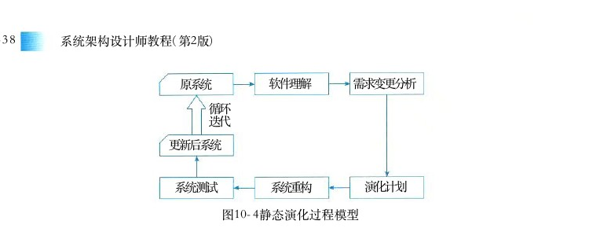

图10－4静态演化过程模型

## 3．静态演化的原子演化操作

一次完整软件架构演化过程可以看作经过一系列原子演化操作组合而成。所谓原子演化操作是指基于 UML模型表示的软件架构，在逻辑语义上粒度最小的架构修改操作。这些操作并非物理结构上不可分割。例如增加一个新的模块，该模块需要与架构其余部分相关联，必然导致模块间依赖关系的增加。然而模块的增加还涉及模块内部的类、接口以及与模块相关的规约条件，这些对架构相关质量属性的度量均有影响，因而我们认为模块的增加是单独的原子粒度不可再拆分的架构修改操作。每经过一次原子演化操作，架构会形成一个演化中间版本 Ai。 对于不同的质量属性度量和评估，影响该质量属性变化的原子演化操作类型不同，形成软件架构的中间版本序列 A 0 ， A 1 ， A 2 ， … ， An 也不同。例如，假设我们需要度量软件架构的可维护性和可靠性，就应该讨论影响可维护性和可靠性的度量结果的各种原子演化操作。

## 1）与可维护性相关的架构演化操作

架构演化的可维护性度量基于组件图表示的软件架构，在较高层次上评估架构的某个原子修改操作对整个架构所产生的影响。这些原子修改操作包括增加／删除模块间的依赖、增加／删除模块间的接口、增加／删除模块、拆分／聚合模块等，如表10－1所示。表10－1 可维护性相关架构演化操作

名称说明增加模块间的依赖关系AMD(Add Module Dependence)删除模块间的依赖关系RMD(Remove Module Dependence)增加模块间的接口AMI(Add Module Interface)删除模块间的接口RMI(Remove Module Interface)增加一个模块AM(Add Module)RM(Remove Module)删除一个模块拆分模块SM(Split Module)聚合模块AGM(Aggregate Modules)

●模块间的依赖关系体现了模块逻辑组织结构和控制关系，包含模块对其他AMD / RMD :模块的直接依赖和间接依赖，对模块依赖关系的修改改变了模块的控制关系以及逻辑响

<!-- PDF 第 351 页 -->

应，从整体上影响了架构的组织结构，可能导致架构的外部质量属性发生变化。

●模块间的接口表示模块间的调用方式，模块通过接口直接提供相应可执行功AMI / RMI :能，对接口的修改可直接改变模块间的调用关系和调用方式，并可能导致具体的执行事件的顺序和方式发生更改。

●在架构中，模块封装了一系列逻辑耦合度高或部署紧密的子模块，用来表达AM / RM :完整的功能。模块的增加、删除不仅仅表示软件功能的更改，该模块与其他模块的耦合方式可能使得架构整体组织结构的变化，从而引入AMD和RMD操作。过多的耦合会造成修改影响范围增大，不利于软件的维护以及持续演化。另外模块本身内部设计的正确性、合理性等问题将会影响软件潜在风险。

●拆分和聚合模块通常发生在软件调整过程中，对模块的拆分和聚合可直接影SM / AGM :响软件的内聚度和耦合度，从而影响软件整体复杂性。

## 2）与可靠性相关的架构演化操作

架构演化的可靠性评估基于用例图、部署图和顺序图，分析在架构模块的交互过程中某个原子演化操作对交互场景的可靠程度的影响。这些原子修改操作包括增加／删除消息、增加／删除交互对象、增加／删除／修改消息片段、增加／删除用例执行、增加／删除角色等，如表10－2所示。表10－2可靠性相关架构修改操作

名称说明在顺序图中增加模块交互消息AMS(Add Message)在顺序图中删除模块交互消息RMS(Remove Message)在顺序图中增加交互对象AO(Add Object)在顺序图中删除交互对象RO(Remove Object)在顺序图中增加消息片段AF(Add Fragment)在顺序图中删除消息片段RF(Remove Fragment)在顺序图中修改消息片段CF(Change Fragment)AU(Add Use Case)在用例图中为参与者增加一个可执行用例在用例图中为参与者删除某个可执行用例RU(Remove Use Case)AA(Add Actor)在用例图中增加参与者RA(Remove Actor)在用例图中删除参与者

●模块间的消息交互体现在顺序图中。消息变化包含增加消息、删除消AMS / RMS :UML息和修改消息。消息的修改可能为顺序更改、交互对象更改等，该变化可通过删除原消息和增加新的消息等操作组合而成，因而这里只讨论原子粒度的增加消息和删除消息两种操作。消息的删减导致交互过程中时序复杂度的变化，可能引入运行时风险。

<!-- PDF 第 352 页 -->

●在顺序图中增加或删除交互对象将引入操作，即与该对象相关的消AO / RO :AMS/DMS息将同时被增加或删除，同时，在部署图中还须将该模块添加到相关站点或从相关站点删除该模块。由于一个执行场景的可靠性直接取决于组件和连接件的可靠性，交互对象的增减将直接影响一个或多个包含该模块的场景的交互复杂性。

●消息片段为顺序图中一组交互消息的循环调用，消息片段的增加、删除或AF / RF / CF :者调用次数的修改将影响交互过程的复杂度，从而影响该场景的执行风险。

●为参与者增加或删除可执行用例，表示参与者执行权限的变化，一般来说可执AU / RU :行用例越多的参与者其权限越高。用户在运行系统时以某一参与者的身份执行用例，由于其参与的执行事件的增加或者事件执行方式的多样化，将导致系统运行更为复杂，运行时风险增加。

●增加或删除某一参与者意味着执行权限的增加或减少，该操作将引入操AA / RA :AU/RU作。参与者的增减虽然不会导致软件结构上的变化，然而不同的参与者有不同的执行方式，因而会导致系统动态交互上的变化，对程序运行时的风险有影响。

4．静态演化实例：正交软件架构（Orthogonal Software Architecture）在静态演化中，为了高效地对修改进行分析和管理，一种应用广泛的处理方式就是使用正交软件架构。对于复杂的应用系统，通过对功能进行分层和线索化，可以形成正交体系结构，同一层次中的组件不允许相互调用，故每个变动仅影响一条线索，如图10－5所示。更新前第一层A

更新后第二层BCC'

第三层D E

G'FG第四层

第五层H图10－5正交软件体系结构的演化

这样，正交体系的演化过程概括如下：①需求变动归类，使需求的变化和现有组件及线索相对应，判断重用情况；②制订架构演化计划；③修改、增加或删除组件；④更新组件之间的相互作用；⑤产生演化后的软件架构，作为系统更新的详细设计方案和实现基础。

## 10．3．3软件架构动态演化

动态演化是在系统运行期间的演化，需要在不停止系统功能的情况下完成演化，较之静态演化更加困难。具体发生在有限制的运行时演化和运行时演化阶段。

<!-- PDF 第 353 页 -->

## 1．动态演化的需求

架构的动态演化主要来自两类需求：①软件内部执行所导致的体系结构改变，例如，许多服务器端软件会在客户请求到达时创建新的组件来响应用户需求；②软件系统外部的请求对软件进行的重配置，例如，操作系统在升级时无须重新启动，在运行过程中就完成对体系结构的修改。对于一些需要长期运行且具有特殊使命的系统（如航空航天、生命维持、金融、交通等），如果系统需求或环境发生了变化，此时停止系统运行进行更新或维护将会产生高额的费用和巨大的风险，对系统的安全性也会产生很大的影响。静态体系结构缺乏表示动态更新的机制，很难用其分析、描述这样的系统，更不能用它来指导系统进行动态演化。因此，动态演化架构的研究应运而生。随着网络和许多新兴软件技术（如 Agent、 网格计算、普适计算、移动计算、网构软件等）的发展，对架构提出了许多更高的要求，如架构的扩展性、复用性、适应性等，而传统的静态体系结构已难以满足这些要求。

## 2．动态演化的类型

## 1）软件动态性的等级

CarlosE．Cuesta 等人将软件的动态性分为3个级别（见图10－6）：①交互动态性 （InteractiveDynamism）， 要求数据在固定的结构下动态交互；②结构动态性 （Structural Dynamism）， 允许对结构进行修改，通常的形式是组件和连接件实例的添加和删除，这种动态性是研究和应用的主流；③架构动态性 （Architectural Dynamism）， 允许软件架构的基本构造的变动，即结构可以被重定义，如新的组件类型的定义。以 Cuesta 划分标准衡量，目前软件架构的动态演化研究大多仅支持发生在级别1和2上的动态性，而对级别3上的动态性支持甚少，但是 Cuesta 坚持认为只有级别3的架构才是真正的动态架构。

级别3架构动态性级别2结构动态性交互动态性级别1
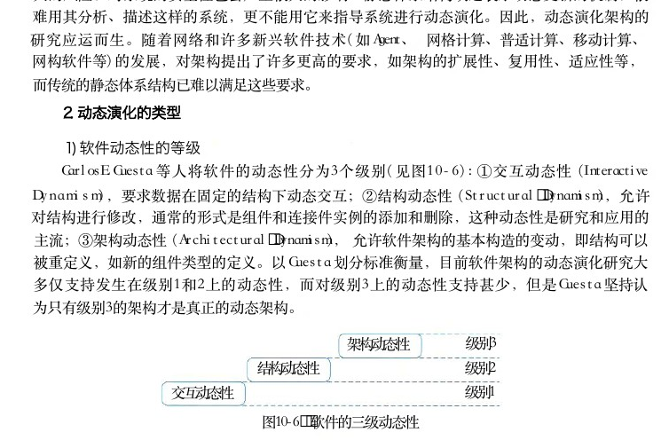

图10－6 软件的三级动态性

## 2）动态演化的内容

根据所修改的内容不同，软件的动态演化主要包括以下4个方面。

● 属性改名：目前所有的都支持对非功能属性的分析和规约，而在运行过程中，用户ADL可能会对这些指标进行重新定义（如服务响应时间）。

● 行为变化：在运行过程中，用户需求变化或系统自身服务质量的调节都将引发软件行为的变化。诸如，为了提高安全级别而更换加密算法；将HTTP协议改为HTTPS协议；组件和连接件的替换和重新配置。

● 拓扑结构改变：如增删组件，增删连接件，改变组件与连接件之间的关联关系等。

● 风格变化：一般软件演化后其架构风格应当保持不变，如果非要改变软件的架构风格，

<!-- PDF 第 354 页 -->

也只能将架构风格变为其衍生风格，如将两层C／S结构调整为三层C／S结构或C／S与B／S的混合结构，将“1对1”的请求响应结构改为“1对N” 的请求响应结构，以实现负载的平衡。目前，实现软件架构动态演化的技术主要有两种：采用动态软件架构 （Dynamic SoftwareArchitecture，DSA） 和进行动态重配置 （Dynamic Reconfiguration，DR）。DSA 是指在运行时刻会发生变化的系统框架结构，允许在运行过程中通过框架结构的动态演化实现对架构的修改；DR 从组件和连接件的配置入手，允许在运行过程中增删组件，增删连接件，修改连接关系等操作。二者从不同的侧面对软件和架构的动态演化进行研究，尚无明确的分类。在此，我们将DSA 归结为架构动态性，将 DR归结为结构动态性。下面分别对二者进行讨论。

## 3．动态软件架构

Perry 在2000年第十六届世界计算机大会中提出，软件架构中最为重要的3个研究方向，即软件架构风格、软件架构连接件和 DSA 。 DSA 指那些在软件运行时刻会发生变化的体系结构。与静态软件架构相比， DSA 的特殊之处在于它的动态性。软件架构的动态性指由于系统需求、技术、环境、分布等因素的变化而导致软件架构在软件运行时刻的变化，主要通过软件架构的动态演化来体现。Bradbury等人为 DSA 做了如下定义：动态软件架构 （ DSA ） 可以修改自身的架构，并在系统执行期间进行修改。DSA 的意义主要在于能够减少系统开发的费用和风险。由于采用 DSA ， 一些具有特殊使命的系统能够在系统运行时根据需求对系统进行更新，并降低更新的费用和风险。此外， DSA能增强用户自定义性和可扩展性，并可为用户提供更新系统属性的服务。

## 1 ） 基于 DSA 实现动态演化的基本原理

实现软件架构动态演化的基本原理是使 DSA 在可运行应用系统中以一类有状态、有行为、可操作的实体显式地表示出来，并且被整个运行环境共享，作为整个系统运行的依据。也就是说，运行时刻体系结构相关信息的改变可用来触发、驱动系统自身的动态调整。此外，对系统自身所做的动态调整结果可反映在体系结构这一抽象层面上。在系统结构上，通过引入运行时体系结构对象，使得相关协同逻辑可从计算组件中分离出来，显式、集中地得以表达，符合关注分离的原则；同时又解除了系统组件之间的直接耦合，这些都有助于系统的动态调整。由于动态演化实现起来比静态演化复杂得多，系统必须提供 SA动态演化的一些相关功能。首先，系统必须提供保存当前软件架构信息（拓扑结构、组件状态和数目等）的功能；其次，实施动态演化还须设置一个监控管理机制，对系统有无需求变化进行监视。当发现有需求变化时，应能分析并判断可否实施演化，以及何时演化和演化范围，并最终分析或生成演化策略。再者，还应保证演化操作原子性，即在动态变化过程中，如果其中之一的操作失败了，整个操作集都要被撤销，从而避免系统出现不稳定的状态。DSA 实施动态演化大体遵循以下4步：①捕捉并分析需求变化；②获取或生成体系结构演化策略；③根据步骤2得到的演化策略，选择适当的演化策略并实施演化；④演化后的评估与检测。完成这4个步骤还需要DSA 描述语言和演化工具的支持。

<!-- PDF 第 355 页 -->

## 2 ） DSA描述语言

按照描述视角可将软件动态性建模语言分为3类：①基于行为视角的π－ADL ， 使用进程代数来描述具有动态性的行为；②基于反射视角的 Pilar， 利用反射理论显式地为元信息建立模型；③ 基于协调视角的注重计算和协调部分的分离，利用协调论的原理来解决动态性交互。LIME,( 1 ) - ADL一般来说，软件架构的描述分为两个部分：结构相关描述和行为相关描述。 DSA 的重点是运行时对结构进行改变的行为，因此需要对这些行为进行描述和验证。进程代数是处理这一问题的形式化方法，其中以序列化方式执行的一系列行为被抽象为进程，行为的交互被简化为进程的合成。目前主流的进程代数语言之一就是π演算，π－ADL 就是以此为基础设计的架构描述语言，它采用运行时的观点对系统进行建模，其模型包括组件、连接件和行为。所有元素都会随时间演化。π－ADL 是为移动系统建模设计的，由于移动通信领域中动态性特别明显（如手机移动时会动态改变与服务器的连接关系），移动系统本身就需要使用 DSA。( 2 ) Pilar对于动态架构的直观解决方案就是实现架构反射，将模型与系统相关联，模型的修改会反映到系统的修改上，系统的变化也会表现为模型的变化。形式化的反射模型是一个基于层的模型，其中每一层都作为它的基层的元系统 （Meta－System）， 而基层就称为基系统 （Base－System）。 对于每一个元－基系统对，元系统描述了系统如何感知或修改自身，而基系统则提供常规的应用操作和结构。反射模型并没有限定层的数量，但是在实际应用中一般采用少于3层的反射模型。MARMOL（Meta Architecture Model） 是第一个试图将反射和架构结合起来的形式化模型，其主要思想在于：在架构描述中引入多个层次，并利用反射的概念来表示它们。要注意MARMOL 既不是针对特定问题或项目的模型，也不是一种架构风格或模式，而是一种描述风格，它能够与其他ADL 结合起来应用，如使用 MARMOL描述层模型，而对于单个的层则使用其他ADL 进行描述。基于 MARMOL 的动态架构描述语言 Pilar 已经出现。在 Pilar 中只有一种顶级元素一组件，而每个组件都由4部分组成，即接口、配置、具化 （Reification） 和约束。( 3 ) LIME在分布式和并行系统的演化中，协调模型 （Coordination Model） 的应用广泛。它提供了增强模块性、组件复用性、移植性和语言互操作性的框架。协调模型与 DSA 的关系在于：大规模并行系统分布在许多逻辑结点上，这些结点的交互行为本质上就是动态的，对于 DSA 的需求即来自于此。Linda 首次将协调模型应用于计算机科学，而 LIME（Linda In a Mobile Environment） 则是Linda 的扩展，支持移动应用的开发。它既能描述物理移动性，也能描述逻辑移动性，通过分离计算部分和协调部分使得时间、空间因素分离，简化了分布式系统的开发。

<!-- PDF 第 356 页 -->

## 3 ） DSA演化工具

动态演化的工具需要支持系统在演化过程中与其软件架构的一致性检查，并能够对架构演化过程进行管理，主要有以下几种方法。

● 使用反射机制：等人设计了框架元模型，该模型使用有类型的有DowlingK-Component向配置图对架构进行表示，能够支持系统的动态调整。北京大学研究的PKUAS系统引入运行时软件架构 （ RSA ） 作为全局视图，支持置于单个EJB容器内的组件演化。李长云等提出的基于体系结构空间支持动态演化的软件模型 （ SASM ） 使用运行时体系结构（ RSAS ） 作为架构模型，是一个在运行期间有状态、有行为、可访问的对象，支持面向服务架构的动态演化。余萍等人提出的Artemis－ARC系统是以ACME为语义设计的运行时可编程架构模型，支持构架和服务架构演化，可以对DSA进行追溯、验证和框架代码检查。

● 基于组件操作：主要有王海燕等提出的一种基于组件的动态体系结构模型和李长云等设计的一个面向应用的、开放的、 SA驱动的分布式运行环境SACDRE。 此类工具用于支持基于组件的系统构架进行动态演化。

● 基于π演算：π演算是在的基础上提出的、基CCS(Calculus of Communicating System)于命名概念的进程代数并发通信行为演算方法，可以用来描述结构不断变化的并发系统。于振华等提出的软件体系抽象模型 （Software Architecture Abstract Model，SAAM）便是通过一系列π演算进程对SA实施演化，并利用π演算的相关分析方法对SA的一致性进行分析。

● 利用外部的体系结构演化管理器：加州大学欧文分校提出了基于的开发和运行环境SAArchStudio， 该执行工具包含3种体系结构变更源工具——Argo、ArchShell和扩展向导。Argo提供一个体系结构的图形描述和操作手段， ArchShell提供一个文本的、命令式的体系结构变更语言，扩展向导提供一个可执行的脚本更改语言，用来对体系结构进行连续演化。其所定义的系统动态演化方法是如何将体系结构层面表达的动态调整在具体系统中实施的一个典型代表。

## 4．动态软件架构应用实例——PKUAS

PKUAS 是一个符合Java EE规范的组件运行支撑平台，支持3种标准 EJB 容器，包括无态会话容器、有态会话容器和实体容器，并支持远程接口和本地接口，提供 IOP 、 JRMP 、 SOAP以及 EJBLocal 互操作机制，内置命名服务、安全服务、事务服务、日志服务、数据库连接服务；通过了 Java EE 蓝图程序 JPS v1．1 的测试。为了能够明确标识、访问和操纵系统中的计算实体，反射式中间件必须具备组件化的基础设施体系。基于 Java 虚拟机， PKUAS 将平台自身的实体划分为如下4种类型。

（1）容器系统：容器是组件运行时所处的空间，负责组件的生命周期管理（如类装载、实例化、缓存、释放等）以及组件运行需要的上下文管理（如命名服务上下文、数据库连接等）。

<!-- PDF 第 357 页 -->

在 PKUAS 内置的3种 EIB 容器中，一个容器实例管理一个EJB组件的所有实例，而一个应用中所有EJB 组件的容器实例组成一个容器系统。这种组织模式有利于实现特定于单个应用的配置和管理，如不同应用使用不同的通信端口、认证机制与安全域。

（2）公共服务：其实现系统的非功能性约束，如通信、安全、事务等。由于这些服务可通过微内核动态增加、替换和删除，因此，为了保证容器或组件正确调用服务并避免服务卸载的副作用，必须提供服务功能的动态调用机制。对于供容器使用的服务，必须开发相应的截取器作为容器调用服务的执行点。对于供组件使用的服务，必须在命名服务中加以注册。

（3）工具：辅助用户使用和管理 PKUAS 的工具集合，主要包括部署工具、配置工具与实时监控工具。其中，部署工具既可热部署整个应用，也可热部署单个组件，从而实现应用的在线演化；配置工具允许用户配置整个服务器或单个应用；而实时监控工具允许用户实时观察系统的运行状态并做出相应调整。

（4）微内核：上述3类实体统称为系统组件，微内核负责这些系统组件的装载、配置、卸载，以及启动、停止、挂起等状态管理。 PKUAS 微内核符合 Java平台管理标准JMX （ JavaManagemente Extension）， 继承了JMX可移植、伸缩性强、易于集成其他管理方案、有效利用现有 Java技术、可扩展等优点。其中，容器系统、服务、工具等被管理的系统组件组成资源层，通过 MBean接口对外提供与管理相关的属性和操作。负责注册资源的MBcan Server和管理资源的插件组成管理层。MBean Server 对外提供所有资源的管理接口，允许资源动态地增加或删除。管理插件则是执行其他管理功能的 MBean ， 如 PKUAS 实时监控管理工具的核心功能就是通过管理插件实现的。

## 5．动态重配置

基于软件动态重配置的软件架构动态演化主要是指在软件部署之后对配置信息的修改，常常被用于系统动态升级时需要进行的配置信息修改。一般来说，动态重配置可能涉及的修改有：①简单任务的相关实现修改；②工作流实例任务的添加和删除；③组合任务流程中的个体修改；④任务输入来源的添加和删除；⑤任务输入来源的优先级修改；⑥组合任务输出目标的添加和删除；⑦组合任务输出目标的优先级修改等。

## 1）动态重配置模式

每种重配置模式说明了软件模式中组件是如何协作的，以及如何通过协作来完成整个产品线的动态重配置过程（即从一种配置转化为另一种配置）。下面介绍4种重配置模式。（ 1 ） 主从 （Master－Slave） 模式：在主从模式中，主组件接收客户端的服务请求，它将工作划分给从组件，然后合并、解释、总结或整理从组件的响应。当主组件没有对从组件分配工作时，从组件处于空闲 （Idle） 状态，并会在新的任务分配时被重新激活。主从模式由主操作重配置状态图描述，其中包含两个正交的图，即主操作状态图和主重配置状态图，主操作状态图定义了主组件的操作状态，主重配置状态图描述了主组件如何安排重配置的过程。

（2）中央控制 （Centralized Control） 模式：中央控制模式广泛应用于实时系统之中。在该模式中，一个中央控制器会控制多个组件，其状态图会维持两个状态，分别标识中央控制器是

<!-- PDF 第 358 页 -->

否处于空闲状态。（ 3 ） 客户端 ／ 服务器 （Client／Server） 模式：客户端／服务器模式中的客户端组件需要服务器组件所提供的服务，二者通过同步消息进行交互，在客户端／服务器重配置模式中，当客户端发起的事务完成之后可以添加或删除客户端组件；当顺序服务器 （Sequential Server） 完成了当前的事务，或者并发服务器 （Concurrent Server） 完成了当前事务的集合，且将新的事务在服务器消息缓冲中排队完毕之后，可以添加或删除服务器组件。（ 4 ） 分布式控制 （Decentralized Control） 模式 ： 分布式控制模式下系统的功能整合在多个分布式控制组件之中。该模式广泛用于分布式应用之中，且有着多种相似的类型，如环形（Ring） 模式和顺序 （Serial） 模式。环形模式中每个组件有着相同的功能，且在其左右均有一个组件（称为前驱和后继）与之交互；顺序模式中每个组件使用相同的连接与自己的前驱和后继交互，每个组件向自己的前驱发送请求并获得响应。

2）例子：可重用、可配置的产品线架构软件产品线是一种软件开发和配置的方法论，促进了软件的有效开发，但是尚存一些不足：配置复杂性高，用户可定制的弹性不足，而且关注点有所偏移，从产品转移到了领域。为此Bayer等人给出了PuLSE（Product Line Software Engineering） 方法论 （ 如图 1 0 － 7 所示 ） ， 其能够在各种企业环境中进行软件产品线构想和部署。这是通过以下元素来实现的：在 PuLSE各步骤中以产品为核心关注点，包括组件的可定制性、增量（组件）导入的能力、结构演化的成熟度，以及主要产品开发过程的适应性调整等。

部署步骤技术组件用户定制（BC）PLPuLSE初始化基Scoping(Eco)础设建模（CDA）PL基础设施施演构建架构（DSSA）化和Instantiating{1}管PL基础设施理演化和管理 （EM）使用

工程入口点成熟度组织事务支持组件
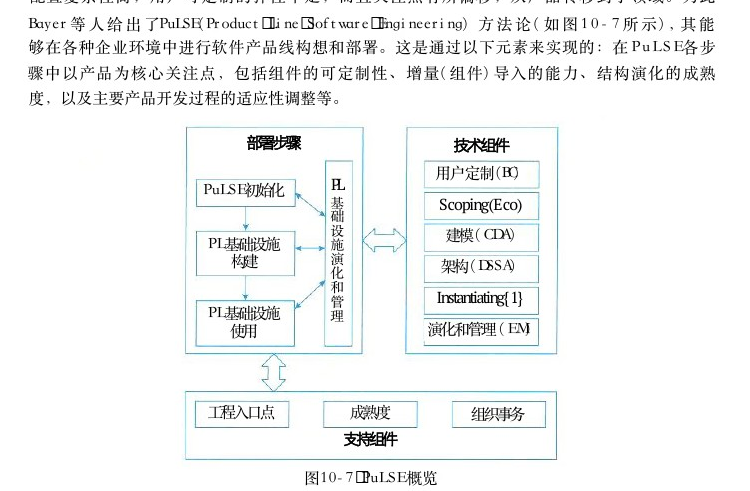

图10－7 PuLSE概览

Gomaa 等人提出了一种使用 UML 对软件产品线建立多视角元模型的方法。该模型是一种面向对象的领域模型，能够从多个方面对一个软件产品线进行描述，包括用例模型、静态模型、交互模型、状态机模型和特性模型，并使用对象约束语言 （ OCL ） 对各个模型的一致性进

<!-- PDF 第 359 页 -->

行检查。他们开发了一个原型系统Product Line UML Based Software Engineering Environment（PLUSEE） 用以实施该方法。

## 3）动态重配置的难点

Tamura 等人提出了在带有服务质量 （Quality of Service，QoS） 约束的情况下，基于扩展图进行架构重配置的方法。针对此类重配置说明了动态重配置的4个难点：①约束定义困难；②性能约束难以静态衡量，需要在软件运行时进行评估；③某些重配置方案能够解决性能约束的某一方面，但是难以管理所有方面；④重配置需要同时保证两个方面，即维持组件系统的完整性和重配置策略的正确和安全性。

## 10．4软件架构演化原则

本节列举了18种软件架构可持续演化原则，并针对每个原则设计了相应的度量方案。这些度量方案看似简单，但每个方案都能紧抓该原则的本质，可以做到从架构（系统的整体结构）层面提供有价值的信息，帮助对架构进行有效观察。

## 1．演化成本控制原则

● 原则名称：演化成本控制原则。(Evolution Cost Control,ECC)

● 原则解释：演化成本要控制在预期的范围之内，也就是演化成本要明显小于重新开发成本。

● 原则用途：用于判断架构演化的成本是否在可控范围内，以及用户是否可接受。

● 度量方案：CoE&lt;&lt;CoRD

● 方案说明：为演化成本，为重新开发成本，远小于最佳。CoECoRDCoECoRD

## 2．进度可控原则

● 原则名称：进度可控原则。(Schedule Control)

● 原则解释：架构演化要在预期时间内完成，也就是时间成本可控。

● 原则用途：根据该原则可以规划每个演化过程的任务量；体现一种迭代、递增（持续演化）的演化思想。

● 度量方案：ttask=|Ttask-T'task|]

● 方案说明：某个演化任务的实际完成时间和预期完成时间的时间(Ttask)( T ' task )差，时间差ttask越小越好。

## 3．风险可控原则

● 原则名称：风险可控原则。(Risk Control)

● 原则解释：架构演化过程中的经济风险、时间风险、人力风险、技术风险和环境风险等必须在可控范围内。

● 原则用途：用于判断架构演化过程中各种风险是否易于控制。

<!-- PDF 第 360 页 -->

● 度量方案：分别检验。

● 方案说明：时间风险、经济风险、人力风险、技术风险都不存在。

## 4．主体维持原则

● 原则名称：主体维持原则。

● 原则解释：对称稳定增长原则所有其他因素必(the Average Incremental Growth,AIG)须与软件演化协调，开发人员、销售人员、用户必须熟悉软件演化的内容，从而达到令人满意的演化。因此，软件演化的平均增量的增长须保持平稳，保证软件系统主体行为稳定。

● 原则用途：用于判断架构演化是否导致系统主体行为不稳定。

● 度量方案：计算即可，主体规模的变更量／主体的规模。AIGAIG=

● 方案说明：根据度量动态变更信息（类型、总量、范围）来计算。

## 5．系统总体结构优化原则

● 原则名称：系统总体结构优化原则。(Optimization of Whole Structure)

● 原则解释：架构演化要遵循系统总体结构优化原则，使得演化之后的软件系统整体结构（布局）更加合理。

● 原则用途：用于判断系统整体结构是否合理，是否最优。

● 度量方案：检查系统的整体可靠性和性能指标。

● 方案说明：判断整体结构优劣的主要指标是系统的可靠性和性能。

## 6．平滑演化原则

● 原则名称：平滑演化原则。(Invariant Work Rate,IWR)

● 原则解释：在软件系统的生命周期里，软件的演化速率趋于稳定，如相邻版本的更新率相对固定。

● 原则用途：用于判断是否存在剧烈架构演化。

● 度量方案：计算即可，变更总量／项目规模。IWRIWR=

● 方案说明：根据度量动态变更信息（类型、总量、范围等）来计算。

## 7．目标一致原则

● 原则名称：目标一致原则。(Objective Conformance)

● 原则解释：架构演化的阶段目标和最终目标要一致。

● 原则用途：用于判断每个演化过程是否达到阶段目标，所有演化过程结束是否能达到最终目标。

● 度量方案：otask=|Otask-O'task|

● 方案说明：阶段目标的实际达成情况和预期目标的差，越小(Otask)(O'task)Otask越好。

<!-- PDF 第 361 页 -->

## 8．模块独立演化原则

● 原则名称：模块独立演化原则，或称为修改局部化原则 （Local Change）。

● 原则解释：软件中各模块（相同制品的模块，如Java的某个类或包）自身的演化最好相互独立，或者至少保证对其他模块的影响比较小或影响范围比较小。

● 原则用途：用于判断每个模块自身的演化是否相互独立。

● 度量方案：检查模块的修改是否是局部的。

● 方案说明：可以通过计算修改的影响范围来进行度量。

## 9．影响可控原则

● 原则名称：影响可控 （Impact Limitation） 原则。

● 原则解释：软件中一个模块如果发生变更，其给其他模块带来的影响要在可控范围内，也就是影响范围可预测。

● 原则用途：用于判断是否存在对某个模块的修改导致大量其他修改的情况。

● 度量方案：检查影响的范围是否可控。

● 方案说明：可以通过计算修改的影响范围来进行度量。

## 10．复杂性可控原则

● 原则名称：复杂性可控 （Complexity Controllability） 原则。

● 原则解释：架构演化必须要控制架构的复杂性，从而进一步保障软件的复杂性在可控范围内。

● 原则用途：用于判断演化之后的架构是否易维护、易扩展、易分析、易测试等。

● 度量方案： CC＜某个阈值；方案说明： CC增长可控。

## 11．有利于重构原则

● 原则名称：有利于重构 （Useful for Refactoring） 原则。

● 原则解释：架构演化要遵循有利于重构原则，使得演化之后的软件架构更便于重构。

● 原则用途：用于判断架构易重构性是否得到提高。

● 度量方案：检查系统的复杂度指标。

● 方案说明：系统越复杂越不容易重构。

## 12．有利于重用原则

● 原则名称：有利于重用 （Useful for Reuse） 原则。

● 原则解释：架构演化最好能维持，甚至提高整体架构的可重用性。

● 原则用途：用于判断整体架构可重用性是否遭到破坏。

● 度量方案：检查模块自身的内聚度、模块之间的耦合度。

● 方案说明：模块的内聚度越高，该模块与其他模块之间的耦合度越低，越容易重用。

<!-- PDF 第 362 页 -->

## 13．设计原则遵从性原则

● 原则名称：设计原则遵从性原则。(Design Principles Conformance)

● 原则解释：架构演化最好不能与架构设计原则冲突。

● 原则用途：用于判断架构设计原则是否遭到破坏（架构设计原则是好的设计经验总结，要保障其得到充分使用）。

● 度量方案：RCP=ICDP//DP|

● 方案说明：冲突的设计原则集合和总的设计原则集合 （DP） 的比较，越小(CDP)RCP越好。

## 14．适应新技术原则

● 原则名称：适应新技术原则。(Technology Independence,TI)

● 原则解释：软件要独立于特定的技术手段，这样才能够让软件运行于不同平台。

● 原则用途：用于判断架构演化是否存在对某种技术依赖过强的情况。

● 度量方案：其中依赖的技术集合用到的技术合集｜。TI=1-DDT,DDT=

● 方案说明：根据演化系统对关键技术的依赖程度进行度量。

## 15．环境适应性原则

● 原则名称：环境适应性原则。(Platform Adaptability)

● 原则解释：架构演化后的软件版本能够比较容易适应新的硬件环境与软件环境。

● 原则用途：用于判断架构在不同环境下是否仍然可使用，或者容易进行环境配置。

● 度量方案：硬件／软件兼容性。

● 方案说明：结合软件质量中兼容性指标进行度量。

## 16．标准依从性原则

● 原则名称：标准依从性原则。(Standard Conformance)

● 原则解释：架构演化不会违背相关质量标准（国际标准、国家标准、行业标准、企业标准等）。

● 原则用途：用于判断架构演化是否具有规范性，是否有章可循；而不是胡乱或随意地演化。

● 度量方案：需要人工判定。

## 17．质量向好原则

● 原则名称：质量向好原则。(Quality Improvement,QI)

● 原则解释：通过演化使得所关注的某个质量指标或某些质量指标的综合效果变得更好或者更满意，例如可靠性提高了。

● 原则用途：用于判断架构演化是否导致某些质量指标变得很差。

● 度量方案：EQIQ

<!-- PDF 第 363 页 -->

● 方案说明：演化之后的质量比原来的质量 （ SQ ） 要好。(EQI)

## 18．适应新需求原则

● 原则名称：适应新需求原则。(New Requirement Adaptability)

● 原则解释：架构演化要很容易适应新的需求变更；架构演化不能降低原有架构适应新需求的能力；架构演化最好可以提高适应新需求的能力。

● 原则用途：用于判断演化之后的架构是否降低了架构适应新需求的能力。

● 度量方案：RNR=|ANR//NR|

● 方案说明：适应的新需求集合和实际新需求集合 （ NR ） 的比较，越小( ANR )RNR越好。

## 10．5软件架构演化评估方法

本节主要介绍软件架构演化的评估方法，根据演化过程是否已知可将评估过程分为：演化过程已知的评估和演化过程未知的评估。

## 10．5．1演化过程已知的评估

演化过程已知的评估其目的在于通过对架构演化过程进行度量，比较架构内部结构上的差异以及由此导致的外部质量属性上的变化，对该演化过程中相关质量属性进行评估。本小节主要对演化过程已知的架构演化评估工作进行阐述，给出评估流程以及具体的相关指标的计算方法。

## 1．评估流程

架构演化评估的基本思路是将架构度量应用到演化过程中，通过对演化前后的不同版本的架构分别进行度量，得到度量结果的差值及其变化趋势，并计算架构间质量属性距离，进而对相关质量属性进行评估。架构演化评估的执行过程如图10－8所示。图中A。 和 A ，表示一次完整演化前后的相邻版本的软件架构。我们可以将Ao 演化到 A。 的过程拆分为一系列原子演化操作，一次完整的架构演化可以视为不同类型的原子演化操作形成的序列。每经过一次原子演化，即可得到一个架构中间演化版本 A ； （ i ＝ 1 ， 2 ， … ， n － 1 ） ， 因而经过一次完整的软件演化后可以得到架构中间版本形成的序列Ao ， A ？ ， A ？ ， … ， An 。 对每个中间版本架构进行度量，得到架构 A； 的质量属性度量值 Q ， 进而得到演化过程中架构质量度量结果形成的序列 QoQ，…，Qn。 对于相邻版本的架构A？－1 和 A ， 可以根据它们的质量属性度量值 Q，－1 和 Q ， 计算相邻版本间的架构质量属性距离D（i－1，i）。 最后，软件架构相邻版本 A。和 A， 间的架构质量属性距离 D （ 0 ， n ）可以通过 Q。 和 Q ， 计算得出。最后综合各个版本架构的度量结果，对架构演化相关质量属性进行评估。

<!-- PDF 第 364 页 -->

## 2．架构演化中间版本度量

对于不同类型的质量属性，其度量方法不同，度量结果的类型也不同。本章主要度量的是架构的可维护性和可靠性，其具体度量方法在前面已经进行过详细阐述。其中对于可靠性，架构质量属性度量结果 Q，是一个实数值；而对于可维护性，它包含圈复杂度、扇入扇出度、模块间耦合度、模块的响应、紧内聚度、松内聚度这6个子度量指标，度量结果 Q， 是这6个指标的度量值形成的六元组 （q？，q？，…，96）。 对于每一次原子粒度的演化，我们可以明确该原子演化对架构内部逻辑结构或交互过程的影响；通过比较原子演化前后架构质量属性 Q．－1 和 Q， 间的变化，可以分析该类演化对待评估系统的外部质量属性的影响，进而找出架构内部结构变化和外部质量属性变化间的关联。

软件架构AoAAA

质量QoQQQ（可维护性／可靠性）

距离D(n-l,n)D(0,1)D ( 0 . 2 )图10－8演化过程已知的架构演化评估执行过程

## 3．架构质量属性距离

架构质量属性距离D （ i － 1 ， i ） 用来评估相邻版本架构间质量属性的差异。由于架构质量属性距离的计算直接依赖于架构质量属性度量值 Q．－1 和 Q ， 所以对于不同的质量属性， D（i－1，i）的计算有所不同。本节分别介绍架构可维护性和可靠性的质量属性距离计算方法，并介绍架构质量属性距离更一般的用法。

## 1）可维护性距离计算方法

可以将一次完整的演化操作拆分成如表10－1所示的原子演化操作序列，对于每次原子演化操作，我们度量架构在演化前后可维护性指标的值（包括 CCN 、 FFC 等共6项），得到演化前后架构A 和B 的可维护性指标向量 （a？，a？，…，a？） 和 （b，b？，…，b？）， 求取两个向量归一化的笛卡儿距离，如公式10－1所示。

- ba - ba . - b＋＋．．．＋（10－1）Dm(A,B)=a + ba + ban +b）（）（a，和 b，表示的是不同版本的架构在同一质量指标上的值，计算出的值越大，表明两个架构可维护性质量差距越大。由于软件可能经过许多轮演化，其架构与原始架构会有很大差距，某些实现与原设计不符，从而导致一些不易察觉的质量问题。而即使是相邻版本的架构也会产生某些质量属性的极大差距。因而我们试图追踪和控制软件质量属性，将其控制在某个适当区间，保持当前软件的正确性和可用性等，且为其之后的演化提供良好的扩展性和适应性，使得软件

<!-- PDF 第 365 页 -->

能够持续演化和重用。

## 2）可靠性距离计算方法

我们也可以将一次完整的演化操作拆分成如表10－2所示的原子演化操作序列，对于每次原子演化操作，度量演化前后架构A 和 B 的可靠性度量值a 和 b （ a ， b 为实数），架构 A 和 B 之间的可靠性距离计算公式如公式10－2所示。

a - b（10－2）（D,(A,B)=a + b）该公式可以看作一个简化的向量归一化的笛卡儿距离，计算出的值越大，表明两个架构的可靠性差距越大。值得注意的是，可靠性度量值为一个实数值，它表示该软件的潜在风险率，而与架构的物理组织结构（模块间的逻辑依赖和调用等）没有必然因果联系。两个完全不同的软件在架构上的相似度很低，但它们的可靠性度量值可能相等；而同一个软件经过演化，相邻版本之间的架构可能由于某些不适当的修改而造成可靠性大幅度降低。同理，我们也无法通过可靠性度量值推断两个架构结构上的变化或差异。可靠性与软件运行过程中的逻辑交互复杂度相关，可靠性的升高或降低表示交互场景的复杂或简化。

## 3）非相邻版本的架构质量属性距离

对于可维护性距离Dm （ A ， B ） 和可靠性距离 Dr （ A ， B ） ， 当A 和 B 为相邻版本的架构时，所得结果即为相邻版本架构间的质量属性距离。一般地讲，若 A 和 B 为任意两个架构演化版本，计算结果即为任意演化过程中两个架构在相关质量属性上的差异。对于可维护性和可靠性，质量属性间的差异与架构本身内部结构的差异并没有正相关关系。对于两个完全不同的软件架构，它们的质量属性度量结果可能相近，导致质量属性距离较小，此时度量这两个架构的质量属性距离并没有实际意义。因而质量属性距离应针对同一架构的不同演化版本进行度量，以对架构演化过程进行监控，保障架构能够持续健康演化。值得注意的是，在架构中间版本序列 Ao ， A ？ ， A ？ ， … ， A ， 中，架构 Ao 和 A ， 间的质量属性距离 D （ 0 ， n ） 并不等于 D （ 0 ， 1 ） 、 D （ 1 ， 2 ） 、 D （ 2 ， 3 ） … 的叠加，即原子演化操作所产生的架构质量属性影响并不具有累加性，然而它却可以帮助我们观察在该次演化过程中每一步物理结构的变化对整体的影响范围，并对关键模块风险控制以及故障定位等有积极的作用。

## 4．架构演化评估

基于度量的架构演化评估方法，其基本思路在于通过对演化前后的软件架构进行度量，比较架构内部结构上的差异以及由此导致的外部质量属性上的变化。基于度量的架构演化评估，可以帮助我们分析架构内部结构的修改对外部质量属性所产生的影响、监控演化过程中架构质量的变化、归纳架构演化趋势，并有助于开发和维护等相关工作开展，具体包括如下几个方面：①架构修改影响分析：为了更好地归纳和说明架构演化的相关规律，本节对演化进行分类，比较不同类型的演化操作对架构相关质量属性的影响。通过将演化过程拆分成粒度很细的原子演化操作序列，具体分析架构内部逻辑结构和交互过程的修改会对哪些相关外部质量属性产生影

<!-- PDF 第 366 页 -->

响，并分析修改影响范围，进一步分析架构版本距离和相关质量属性距离的关联。②监控演化过程：通过对架构演化过程中的中间版本架构进行度量，我们可以得到架构相关质量属性随时间推移的变化曲线。通过对架构演化过程中质量属性的监控，将有利于保持架构健康持续地演化。③分析关键演化过程：架构质量属性距离评估不同版本的架构在质量属性上的差异。从质量属性距离形成的曲线可以观察到架构质量发生较大改变的时刻，在该时刻架构的逻辑依赖或交互过程可能发生重大改变，在开发和维护过程中应该予以重视，这将有利于架构维护及故障定位等。

## 10．5．2演化过程未知的评估

当演化过程未知时，我们无法像演化过程已知演化前架构演化后架构时那样追踪架构在演化过程中的每一步变化，只能根据架构演化前后的度量结果逆向推测出架构发生架构度量架构度量了哪些改变，并分析这些改变与架构相关质量属性的关联关系。演化前架构演化后架构图10－9显示了演化过程未知时的架构演化评估度量结果度量结果过程。对于演化前后的相邻版本的架构，可以利用比较基于度量的架构评估方法分别对它们进行度量，得到架构演化前后的不同版本的度量结果，并根据度架构质量量结果的差异计算它们之间的质量属性距离。通过属性变化分析架构演化前后质量属性的变化以及质量属性间推测是否符合的距离，可以逆向推测出架构可能发生了哪些演化架构演化架构演化操作，以及这些演化操作发生的位置和作用的对象。分析÷（操作集合驱动因素更进一步地，对于每一个演化操作，分别找出其对架构相关质量属性的影响，并分析发生该演化操作图10－9演化过程未知时的架构演化的高层驱动原因（修复代码错误、提高性能、平台评估过程示意图移植等）。最终，我们找到针对某演化驱动原因的演化操作集合，并分析这些演化操作所产生的架构质量属性变化是否符合预期。若这些演化操作对架构相关质量属性的影响符合预期，例如，我们希望对代码进行重构以使得架构更加清晰、易于维护和扩展，而最终分析得出此次版本演化确实使得架构的可维护性获得提高（圈复杂度减少、模块间耦合度降低等），则说明这次演化确实根据演化需求完成了任务；否则说明这次演化并没有解决架构原先存在的问题，或者在演化过程中引入了新的错误或相关质量问题，即该次演化并不十分恰当，需要进一步演化来完善。

## 10．6大型网站系统架构演化实例

大型网站的技术挑战主要来自于庞大的用户，高并发的访问和海量的数据，任何简单的业

<!-- PDF 第 367 页 -->

第 1 0 章软件架构的演化和维护

务一旦需要处理数以 P 计的数据和面对数以亿计的用户，问题就会变得很棘手。通常大型网站架构主要解决这类问题。

10．6．1第一阶段：单体架构

大型网站都是从小型网站发展而来，网站架构也应用服务器是一样，是从小型网站架构逐步演化而米。小型网站文件最开始没有太多人访问，只需要一台服务器就绰绰有余，这时的网站架构如图10－10所示，应用程序、数应用程序据库、文件等所有资源都在一台服务器上。

数据库

10．6．2第二阶段：垂直架构

随着网站业务的发展，一台服务器逐渐不能满足图 1 0 － 1 0 第一阶段网站架构需求，越来越多的用户访问导致性能越来越差，越来越多的数据导致存储空间不足，这时就需要将应用和数据分离。应用和数据分离后整个网站使用3台服务器：应用服务器、文件服务器和数据库服务器。这3台服务器对硬件资源的要求各不相同：

● 应用服务器需要处理大量的业务逻辑 ， 因此需要更快更强大的处理器速度 。

● 数据库服务器需要快速磁盘检索和数据缓存，因此需要更快的磁盘和更大的内存。文件服务器需要存储大量用户上传的文

●文件服务器件，因此需要更大容量的硬盘。此时，网站系统的架构如图10－11所示，应文件应用服务器用和数据分离后，不同特性的服务器承担不同的服务角色，网站的并发处理能力和数据存储空间应用程序数据库服务器得到了很大改善，支持网站业务进一步发展。但是随着用户逐渐增多，网站又一次面临挑战：数数据库据库压力太大导致访问延迟，进而影响整个网站的性能，用户体验受到影响。这时需要对网站架图10－11 第二阶段网站架构构进一步优化。

10．6．3第三阶段：使用缓存改善网站性能

网站访问的特点和现实世界的财富分配一样遵循二八定律：80％的业务访问集中在20％的数据上。既然大部分业务访问集中在一小部分数据上，那么如果把这一小部分数据缓存在内存中，就可以减少数据库的访问压力，提高整个网站的数据访问速度，改善数据库的写入性能了。网站使用的缓存可以分为两种：缓存在应用服务器上的本地缓存和缓存在专门的分布式缓存服务器上的远程缓存。

● 本地缓存的访问速度更快一些，但是受应用服务器内存限制，其缓存数据量有限，而且会出现和应用程序争用内存的情况。

<!-- PDF 第 368 页 -->

● 远程分布式缓存可以使用集群的方式 ， 部署大内存的服务器作为专门的缓存服务器 ， 可以在理论上做到不受内存容量限制的缓存服务。此时 ， 网站系统的架构如图 1 0 － 1 2分布式缓存服务器n所示。分布式缓存服务器2使用缓存后 ， 数据访问压力得到有效分布式缓存服务器1缓解 ， 但是单一应用服务器能够处理的请远程分布式缓存求连接有限 ， 在网站访问高峰期 ， 应用服务器成为整个网站的瓶颈。

10．6．4第四阶段：使用服务集群文件服务器改善网站并发处理能力应用服务器文件使用集群是网站解决高并发 、 海量数应用程序据问题的常用手段 。 当一台服务器的处理数据库服务器能力 、 存储空间不足时 ， 不要企图去更换本地缓存更强大的服务器 ， 对大型网站而言 ， 不管数据库多么强大的服务器 ， 都满足不了网站持续增长的业务需求 。 这种情况下 ， 更恰当的图10－12第三阶段网站架构做法是增加一台服务器分担原有服务器的访问及存储压力 。 对网站架构而言 ， 只要能通过增加一台服务器的方式改善负载压力 ， 就可以以同样的方式持续增加服务器不断改善系统性能 ， 从而实现系统的可伸缩性 。 应用服务器实现集群是网站可伸缩架构设计中较为简单成熟的一种。此时，网站系统架构如图10－13所示。

分布式缓存服务器n分布式缓存服务器2分布式缓存服务器1

远程分布式缓存应用服务器n应用服务器2文件服务器应用服务器1负载均衡调度应用程序服务器文件

本地缓存数据库服务器

数据库
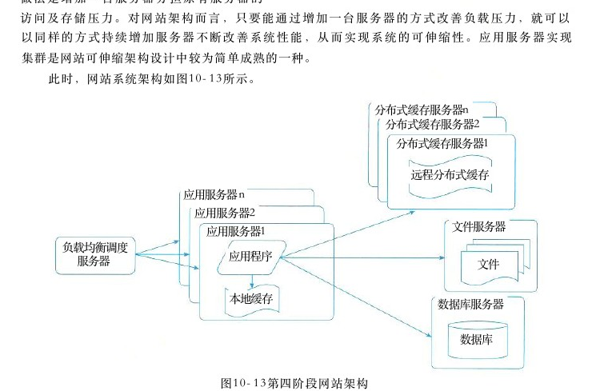

图10－13第四阶段网站架构

<!-- PDF 第 369 页 -->

第 1 0 章软件架构的演化和维护

通过负载均衡调度服务器 ， 可以将来自用户浏览器的访问请求分发到应用服务器集群中的任何一台服务器上 ， 如果有更多用户 ， 就在集群中加入更多的应用服务器 ， 使应用服务器的压力不再成为整个网站的瓶颈。

10．6．5第五阶段：数据库读写分离

网站在使用缓存后 ， 使对大部分数据读操作访问都可以不通过数据库就能完成 ， 但是仍有一部分读操作 （ 缓存访问不命中 、 缓存过期 ） 和全部的写操作都需要访问数据库 ， 在网站的用户达到一定规模后 ， 数据库因为负载压力过高而成为网站的瓶颈 。 目前大部分的主流数据库都提供主从热备功能 ， 通过配置两台数据库主从关系 ， 可以将一台数据库服务器的数据更新同步到另一台服务器上 。 网站利用数据库的这一功能 ， 实现数据库读写分离 ， 从而改善数据库负载压力。应用服务器在写数据的时候 ， 访问主数据库 ， 主数据库通过主从复制机制将数据更新同步到从数据库 ， 这样当应用服务器读数据的时候 ， 就可以通过从数据库获得数据 。 为了便于应用程序访问读写分离后的数据库 ， 通常在应用服务器端使用专门的数据访问模块 ， 使数据库读写分离对应用透明。此时，网站系统架构如图10－14所示。

分布式缓存服务器n分布式缓存服务器2分布式缓存服务器

远程分布式缓存应用服务器n应用服务器2文件服务器应用服务器1负载均衡调度应用程序服务器文件数据访问本地缓存模块数据库服务器写操作（主）读操作数据库数据库服务器（从）主／从复制数据库
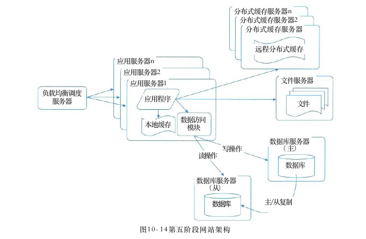

图10－14第五阶段网站架构

<!-- PDF 第 370 页 -->

10．6．6第六阶段：使用反向代理和 CDN加速网站响应

随着网站业务不断发展，用户规模越来越大，由于区域的差别使得网络环境异常复杂，不同地区的用户访问网站时，速度差别也极大。有研究表明，网站访问延迟和用户流失率正相关，网站访问越慢，用户越容易失去耐心而离开。为了提供更好的用户体验，留住用户，网站需要加速网站访问速度。主要手段有使用 CDN 和反向代理。 CDN 和反向代理的基本原理都是缓存。

●部署在网络提供商的机房，使用户在请求网站服务时，可以从距离自己最近的网络CDN提供商机房获取数据。

● 反向代理则部署在网站的中心机房，当用户请求到达中心机房后，首先访问的服务器是反向代理服务器，如果反向代理服务器中缓存着用户请求的资源，就将其直接返回给用户。使用 CDN 和反向代理的目的都是尽早返回数据给用户，一方面加快用户访问速度，另一方面也减轻后端服务器的负载压力。此时，网站系统架构如图10－15所示。

分布式缓存服务器n分布式缓存服务器2分布式缓存服务器1CDN服务器1

远程分布式缓存反向代理服务器1应用服务器n应用服务器2文件服务器应用服务器1负载均衡调度文件应用程序服务器1数据访问模块本地缓存写操作数据库服务器（主）读操作数据库服务器数据库（从）

数据库
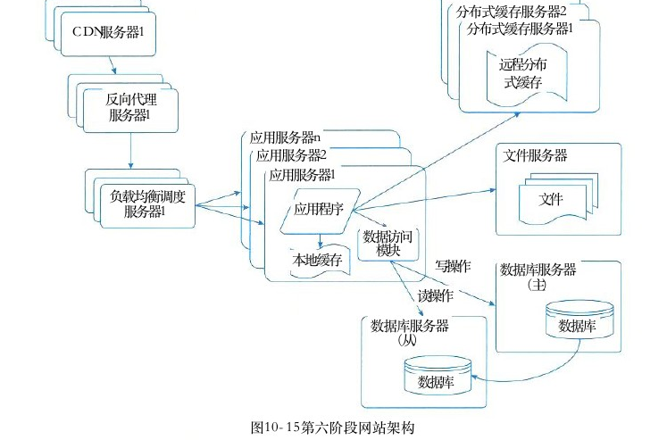

图10－15第六阶段网站架构

<!-- PDF 第 371 页 -->

第 1 0 章软件架构的演化和维护3 5 9

10．6．7第七阶段：使用分布式文件系统和分布式数据库系统

任何强大的单一服务器都满足不了大型网站持续增长的业务需求 。 数据库经过读写分离后 ，从一台服务器拆分成两台服务器 ， 但是随着网站业务的发展依然不能满足需求 ， 这时需要使用分布式数据库 。 文件系统也一样 ， 需要使用分布式文件系统 。 分布式数据库是网站数据库拆分的最后手段 ， 只有在单表数据规模非常庞大的时候才使用 。 不到不得已时 ， 网站更常用的数据库拆分手段是业务分库，将不同业务的数据部署在不同的物理服务器上。此时，网站系统架构如图10－16所示。

分布式缓存服务器r分布式缓存服务器2分布式缓存服务器1CDN服务器1远程分布式缓存

反向代理应用服务器n服务器1分布式文件服务器n应用服务器2分布式文件服务器2应用服务器1分布式文件服务器1负载均衡调度应用程序服务器1统一数据访问模块文件本地缓存

分布式数据库服务器n分布式数据库服务器2分布式数据库服务器1

数据库
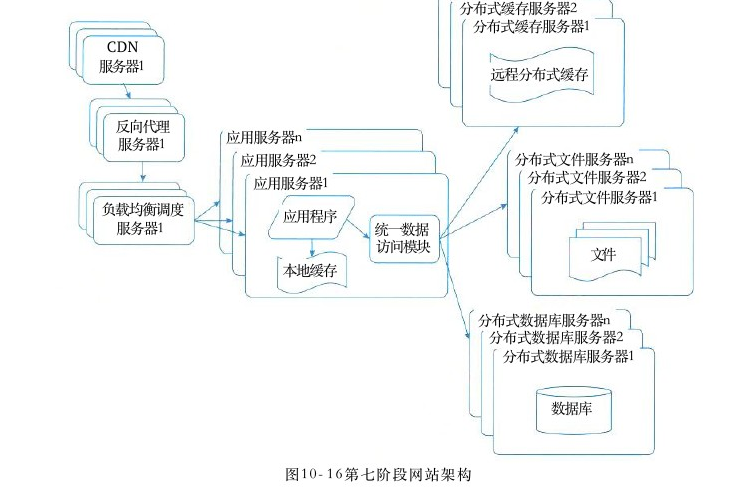

图10－16第七阶段网站架构

10．6．8第八阶段：使用NoSQL和搜索引擎

随着网站业务越来越复杂 ， 对数据存储和检索的需求也越来越复杂 ， 网站需要采用一些非关系数据库技术如 NoSQL 和非数据库查询技术如搜索引擎 。 NoSQL 和搜索引擎都是源自互联网的技术手段 ， 对可伸缩的分布式特性具有更好的支持 。 应用服务器则通过一个统一数据访问模块访问各种数据，减轻应用程序管理诸多数据源的麻烦。此时，网站系统架构如图10－17所示。

<!-- PDF 第 372 页 -->

分布式缓存服务器n分布式缓存服务器2分布式缓存服务器1CDN服务器1远程分布式缓存

反向代理应用服务器n服务器1分布式文件服务器n应用服务器2分布式文件服务器2应用服务器1分布式文件服务器1负载均衡调度应用程序服务器1统一数据访问模块文件本地缓存

分布式数据库服务器n分布式数据库服务器2分布式数据库服务器1

搜索引擎NoSQL数据库服务器1服务器1

图 1 0 － 1 7 第八阶段网站架构

10．6．9第九阶段：业务拆分

大型网站为了应对日益复杂的业务场景，通过使用分而治之的手段将整个网站业务分成不同的产品线。如大型购物交易网站都会将首页、商铺、订单、买家、卖家等拆分成不同的产品线，分归不同的业务团队负责。具体到技术上，也会根据产品线划分，将一个网站拆分成许多不同的应用，每个应用独立部署。应用之间可以通过一个超链接建立关系（在首页上的导航链接每个都指向不同的应用地址），也可以通过消息队列进行数据分发，当然最多的还是通过访问同一个数据存储系统来构成一个关联的完整系统。此时，网站系统架构如图10－18所示。

<!-- PDF 第 373 页 -->

分布式缓存服务器n分布式缓存服务器2分布式缓存服务器1CDNB应用服务器1服务器1消息队列远程分布式缓存服务器1

反向代理A 应用服务器n服务器1分布式文件服务器nA 应用服务器2分布式文件服务器2A应用服务器1分布式文件服务器1负载均衡调度应用程序服务器1统一数据访问模块文件本地缓存

分布式数据库服务器n分布式数据库服务器2分布式数据库服务器1

搜索引擎NoSQL服务器1数据库服务器1
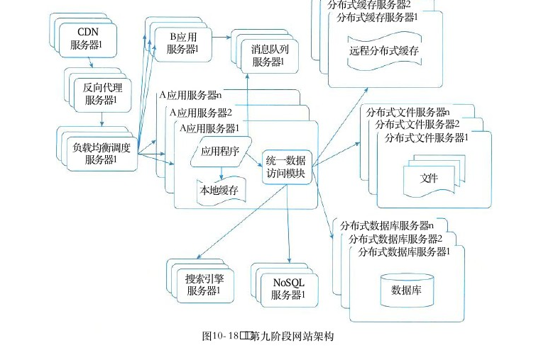

图10－18 第九阶段网站架构

10．6．10第十阶段：分布式服务

随着业务拆分越来越小 ， 存储系统越来越庞大 ， 应用系统的整体复杂度呈指数级增加 ， 部署维护越来越困难 。 由于所有应用要和所有数据库系统连接 ， 在数万台服务器规模的网站中 ，这些连接的数目是服务器规模的平方，导致数据库连接资源不足，拒绝服务。既然每一个应用系统都需要执行许多相同的业务操作 ， 比如用户管理 、 商品管理等 ， 那么可以将这些共用的业务提取出来 ， 独立部署 。 由这些可复用的业务连接数据库 ， 提供共用业务服务 ， 而应用系统只需要管理用户界面 ， 通过分布式服务调用共用业务服务完成具体业务操作。此时，网站系统架构如图10－19所示。大型网站的架构演化到这里 ， 基本上大多数的技术问题都得以解决 ， 诸如跨数据中心的实时数据同步和具体网站业务相关的问题也都可以通过组合改进现有技术架构解决 。

<!-- PDF 第 374 页 -->

分布式缓存服务器n分布式缓存服务器2分布式缓存服务器1CDNB应用服务器1远程分布式缓存服务器1

反向代理分布式服务ii服务器1消息队列服务器i分布式文件服务器n服务器1分布式服务服务器2．分布式文件服务器2分布式服务i 服务器1分布式文件服务器1负载均衡调度［应用程序统一数据服务器1A 应用访问模块）服务器1文件本地缓存

分布式数据库服务器n分布式数据库服务器2分布式数据库服务器1搜索引擎NoSQL数据库服务器1服务器1
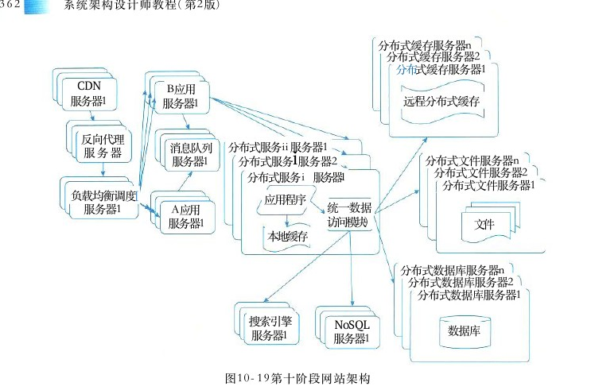

图10－19第十阶段网站架构

## 1 0 ． 7 软件架构维护

软件架构是软件开发和维护过程中的一个重点制品，是软件需求和设计、实现之间的桥梁。软件架构的开发和维护是基于架构软件生命周期中的关键环节 ， 与之相关的步骤包括导出架构需求 、 架构开发 、 架构文档化 、 架构分析 、 架构实现和架构维护 。 软件架构的维护与演化密不可分 ， 维护需要对软件架构的演化过程进行追踪和控制 ， 以保障软件架构的演化过程能够满足需求 （ 亦有说法将架构维护作为架构演化的一个部分 ） 。由于软件架构维护过程一般涉及架构知识管理 、 架构修改管理和架构版本管理等内容 ， 下面分别对它们进行简要介绍。

## 10．7．1软件架构知识管理

软件架构知识管理是对架构设计中所隐含的决策来源进行文档化表示 ， 进而在架构维护过程中帮助维护人员对架构的修改进行完善的考虑，并能够为其他软件架构的相关活动提供参考。

## 1．架构知识的定义

Lago 等人给出了架构知识的定义 ： 架构知识 ＝ 架构设计 ＋ 架构设计决策 。 即需要说明在进行架构设计时采用此种架构的原因。

<!-- PDF 第 375 页 -->

## 2．架构知识管理的含义

架构知识管理侧重于软件开发和实现过程所涉及的架构静态演化，从架构文档等信息来源中捕捉架构知识，进而提供架构的质量属性及其设计依据以进行记录和评价。架构知识管理不仅要涵盖架构的解决方案，也要涵盖产生该方案的架构设计决策、设计依据与其他信息，以有助于架构进一步的演化。

## 3．架构知识管理的需求

许多人认为架构知识的可获得性能够极大地提升软件开发流程。如果对架构知识不进行管理的话，那么关键的设计知识就会“沉没”在软件架构之中，如果开发组人员发生变动，那么“沉没”的架构知识就会“腐蚀”。

## 4．架构知识管理的现状

对于软件架构知识的讨论侧重于对架构信息的整理、存储和恢复。尽管如此，当前尚无实用的架构知识整理策略，构建架构的利益相关者（即拥有架构知识的人）通常不会使用文档来记录架构知识，原因在于对架构知识文档化和维护的动机不足：其好处看起来不够重大而成本相对较高；利益相关者对工程的短期兴趣比起长远的架构知识重用显得更重要；开发者被设计中的创造性工作所吸引，而不会反思设计决策的长远影响；缺乏此方面的培训。更为严重的是，即使实现了文档化，通常架构知识也不能在整个组织中得到充分的分享。例如，架构知识没有传播给合适的利益相关者；架构知识的接收者没有将之应用于他们的任务之中；知识笨重，难以在应用的时候快速地搜索和定位到合适的知识。

## 10．7．2软件架构修改管理

在软件架构修改管理中，一个主要的做法就是建立一个隔离区域 （Rcgion of Quiescence），保障该区域中任何修改对其他部分的影响比较小，甚至没有影响。为此，需要明确修改规则、修改类型，以及可能的影响范围和副作用等。

## 10．7．3软件架构版本管理

软件架构版本管理为软件架构演化的版本演化控制、使用和评价等提供了可靠的依据，并为架构演化量化度量奠定了基础。例如，王映辉等人在描述 SA 的组件－连接件模型的基础上，首先针对 SA 的静态演化建立了SA 邻接矩阵和可达矩阵，凭借矩阵变换与运算对SA 静态演化中的波及效应进行了深入的分析和量化界定，同时给出了组件在SA 中贡献大小相对量的计算方法。同时针对 SA 的动态演化，给出了 SA 动态语义网络模型，分析了 SA 动态语义网络中基于不动点的浸润过程收敛的判定依据，提出了邻接矩阵原子过滤的概念，进而指出 SA 动态演化过程可用一系列邻接矩阵来描述。他们还给出了在两个层面上对 SA 演化波及效应进行分析的框架。

<!-- PDF 第 376 页 -->

## 10．7．4软件架构可维护性度量实践

架构可维护性评估针对架构组件图进行度量 ， 评估高层次上的架构复杂程度 ， 待评估的 Web 读写系统的组件图如图 1 0 － 2 0 所示 。 将该图导出为 XML文件并输入架构评估系统MSAES ， 解析出可维护性度量所需的数据，根据可维护性的6个子度量指标的计算公式进行计算。

cmp Component ClientApplication User&lt;&lt;delegate&gt;&gt;sublsub2 LocalDB电&lt;&lt;delegate&gt;&gt;MainInterface电

WebInterfaceWebApplicationUser User电电

RemoteInterface.RSInterface RemoteApplicatior RemoteDB RSApplication电电电电电
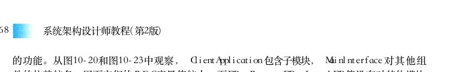

图10－20 Web 读写程序组件图

从待评估系统的组件图中解析出的评估所需数据如表10－3所示。 L、totalN 和 totalE 分别表示组件图数目、组件图中所有外部组件及其相连的边的数目（不包括组件内部的子组件以及子组件之间的连接边）。然后针对每个组件，我们获取该组件的内部组件数目 S、 依赖出边数目E、 依赖入边数目 X、 使用接口数目 R 和提供接口数目 W。 由于组件 ClientApplication 具有子组件，需要获取其内部组件的依赖关系形成的邻接矩阵来度量该模块的内聚度。此处 subl 和 sub2之间只有接口关系，没有依赖关系，因而其邻接矩阵是一个2×2的零矩阵。表10－3Web读写程序组件图解析数据LtalalE totaIN组件图EXRW S sub2 sub1 RemoteDB RSApplication RSInterface

<!-- PDF 第 377 页 -->

（续表）LtalalEtotaIN RemoteApplication RemoteInterface WebApplication WebInterface LocalDB ClientApplication MainInterface User

然后根据可维护性的6个子度量指标的度量公式，利用解析得到的架构评估数据分别进行度量。其中圈复杂度 （ CCN ） 度量整个架构的独立执行路径的条数，该结果值即为待评估架构的最终度量结果；而对于扇入扇出度 （FFC）、 模块间耦合度 （CBO）、 模块的响应 （RFC）、 紧内聚度 （TCC）、 松内聚度 （ LCC ） 这5个度量指标，它们针对每个组件进行度量，则待评估架构的最终度量结果为所有组件结果的平均值。我们以组件 Client Application 为例分析各个子度量指标的计算方法。CCN = ( totalE - totalN ) + 2 L = ( 1 9 - 1 3 ) + 2 × 1 = 8 FFC=CCN×((E+W)×(X+R))²=8×((1+1)×(0+1))²=32

## 1 ＋ 0 ＋ 1 ＋ 1

E + X + W + R＝ 0 ． 2 3 1CBO =三totalN RFC = S + E + R = 2 + 1 + 1 = 4

## 1 ＋ 0 ＋ 1 ＋ 1

E + X + W + R＝ 3TCC =二

## 2×（2－1）／2

P(S)E + X + W + R + NC ( S )E + X + W + R + 0 LCC == TCC = 3二 ·P(S)P(S)待评估系统中其他组件的度量方法与Client Application 相同。但是由于其他组件均没有子组件，使得 P （ S ） 的计算结果为0， TCC 和 LCC 的计算公式中分母为0。此时无法计算该组件模块的内聚度，以 “not applied” 表示。当一个组件没有子组件时，我们认为该组件的内聚度最小。在依次计算出每个模块的相关指标度量结果后，除 CCN 外，其余架构可维护性度量指标的最终结果为各个模块的度量结果的平均值，如表10－4所示。值得注意的是，我们只对组件图中的外部模块进行度量，即度量架构中的所有最高层模块，而其余模块均作为内部子模块，用来度量高层模块的内聚度。

<!-- PDF 第 378 页 -->

表10－4 Web 读写系统可维护性度量结果

FFCRFCCBOTCC LCC RSInterface

## 3 220 ． 2 3 1not applied

not applied

## 3 20 ． 2 3 1

RcmoteApplication1not applied not applied RcmotcInterface

## 3 210 ． 2 3 1

not appliednot applied RemoteDB

## 800 ． 1 5 4

not appliednot applied LocalDB

## 00 ． 1 5 4

## 8not applied

not applied RSApplication0 ． 3 0 8not applied not applied

## 3 240 ． 2 3 13

ClientApplication3

## 1 2 820 ． 3 0 8

WebApplicationnot applied not applied WebInterface

## 3 220．231

not appliednot applied MainInterface

## 30 ． 3 0 8

not appliednot applied User

## 00 ． 0 7 7

not applied not applied DB

## 0 ． 1 5 4

## 0not applied

not applied Browser

## 3 220 ． 2 3 1

not applied not applied CCN FFCRFCCBOLCC TCC最终结果

## 84 6 ． 1 5 43

## 1．6150 ． 2 1 9

根据表10－4所示的 Web 读写系统的度量结果，我们分别对架构可维护性的6个度量指标进行分析：图10－21～图10－23分别显示基于 Web读写系统的各个组件的 FFC 、 CBO 、 RFC 度量结果，并按照结果值从高到低排序。

## 1 ） 圈复杂度（ CCN ）

由于在组件图中组件是独立的，每个组件代表一个系统或子系统中的封装单位，封装了完整的事务处理行为，组件图能够通过组件之间的控制依赖关系来体现整个系统的组成结构。对架构的组件图进行圈复杂度的度量，可以对整个系统的复杂程度做出初步评估，在设计早期发现问题和做出调整，并预测待评估系统的测试复杂度，及早规避风险，提高软件质量。圈复杂度高的程序往往是最容易出现错误的程序，实践表明程序规模以 CCN ≤ 1 0 为宜。

## 2 ） 扇入扇出度 （ FFC ）

基于Web读写系统的各个组件的 FFC 度量值按照从高到低显示在图10－21中。扇入是指直接调用该模块的上级模块的个数，扇出指该模块直接调用的下级模块的个数。本文中用扇入扇出度综合评估组件主动调用以及被调用的频率。扇入扇出度越大，表明该组件与其他组件间的接口关联或依赖关联越多。从图10－20和图10－21中可以发现， RSApplication、WebApplication及 MainInterface 的关联关系最多， FFC 度量值最大，而 User、DB 等组件与其他组件关联较少，FFC 度量值也较小，验证了度量模型和结果的一致性。

<!-- PDF 第 379 页 -->

FFC

## 120－

## 0－
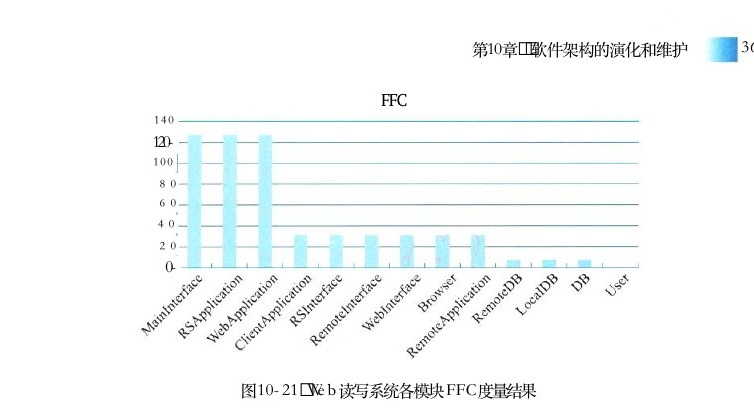

图10－21 Web 读写系统各模块FFC 度量结果

## 3）模块间耦合度 （ CBO ）

基于 Web 读写系统的各个组件的CBO 度量值按照从高到低显示在图10－22中。模块间耦合度 CBO 度量模块与其他模块交互的频繁程度。 CBO 越大的模块，越容易受到其他模块中修改和错误的影响，因而可维护性越差，风险越高。一般来说，组件与其他组件的依赖关系及接口越多，该组件的耦合度越大。从图10－20和图10－22中可以发现， RSApplication、WebApplication 等关联关系较多的组件，其 CBO 度量值也较大；反之， User、DB 等与其他组件关联较少的组件，其 CBO 度量值也较小。

CBO

## 0．35

## 0．3

## 0．25

## 0 ． 2

## 0．15

## 0．1

## 0．05

## 0L
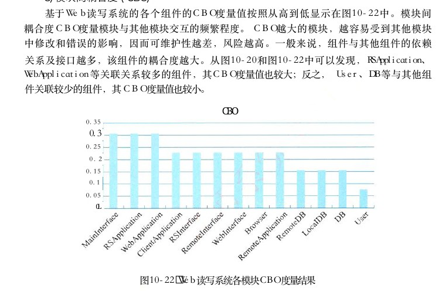

图10－22 Web 读写系统各模块CBO 度量结果

## 4）模块的响应 （ RFC ）

基于 Web读写系统的各个组件的 RFC 度量值按照从高到低显示在图10－23中。 RFC 度量组件执行所需的功能的数量，包括接口提供的功能、依赖的其他模块提供的功能以及子模块提供

<!-- PDF 第 380 页 -->

的功能。从图10－20和图10－23中观察， ClientApplication 包含子模块， Mainlnterface对其他组件的依赖较多，因而它们的 RFC度量值较大；而DB、RemoteDB、LocalDB 等没有对其他模块的依赖和调用，且不包含子模块，因而其 RFC 度量值为0。

RFC

## 4．5

## 3．5

## 2．5

## 1．5

## 0．5
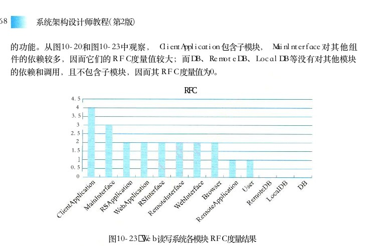

图10－23 Web读写系统各模块 RFC度量结果

## 5）模块间内聚度TCC 和 LCC

由于只有组件ClientApplication 具有子模块，因而对该组件进行度量，并将该组件的度量值作为待评估系统的最终结果。好的架构设计应该遵循“高内聚－低耦合”原则，提高模块的独立性，降低模块间接口调用的复杂性。
