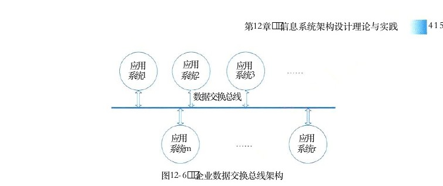
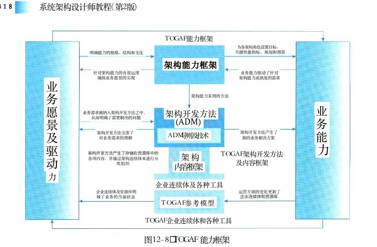
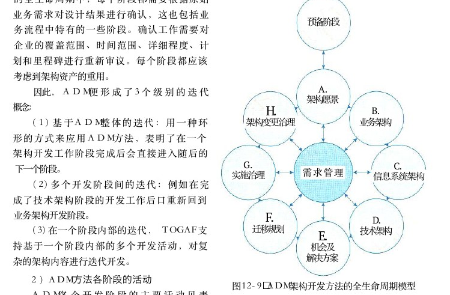
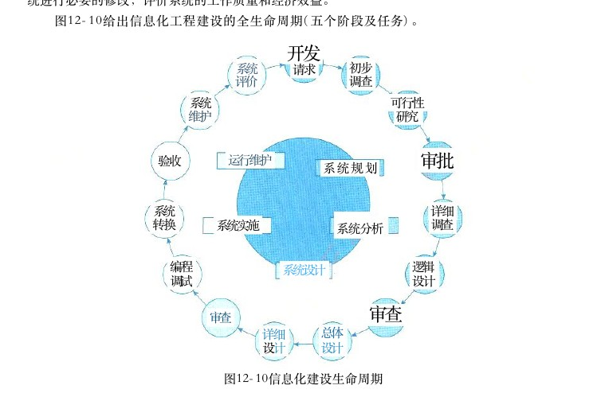
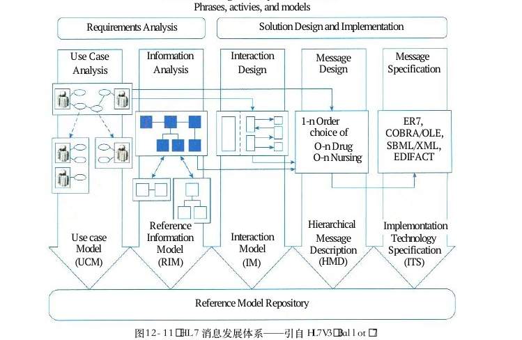
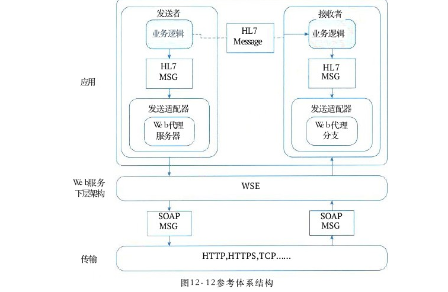
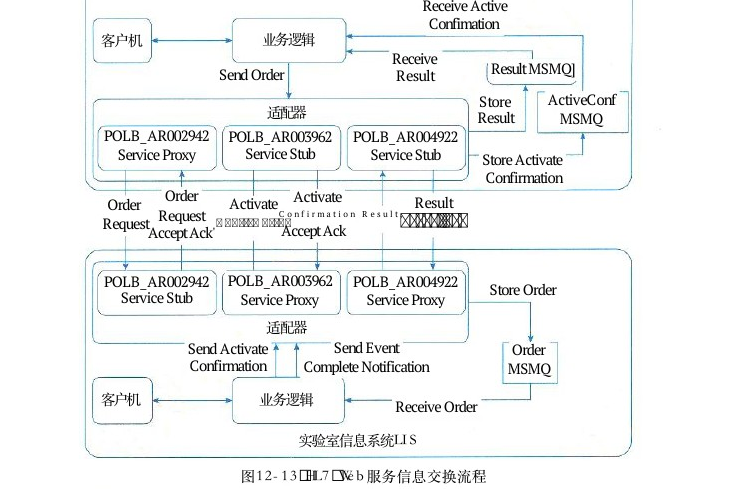

# 第12章 信息系统架构设计理论与实践

> 本页为教材原文文字提取版。图示已按 PDF 页面裁剪并插入正文图注前。

<!-- PDF 第 417 页 -->

信息系统架构 （Information System Architecture，ISA） 是一种体系结构，它反映了一个政府、企业或事业单位信息系统的各个组成部分之间的关系，以及信息系统与相关业务，信息系统与相关技术之间的关系。本章主要介绍信息系统架构的基本概念及其发展历程，阐述信息系统架构的基本原理、分类、常用架构风格和架构模型，以及企业信息系统架构框架。重点分两部分讲解架构开发方法论 （ ADM ） 和信息化工程的相关知识。最后给出了信息系统架构案例分析。

## 12．1 信息系统架构基本概念及发展

随着技术的进步，信息系统的规模越来越大，复杂程度越来越高，系统的结构显得越来越重要。对于大规模的复杂系统来说，对总体的系统结构设计比起对计算算法和数据结构的选择已经变得更重要。在这种情况下，人们认识到系统架构的重要性，设计并确定系统整体结构的质量成为了重要的议题。系统架构对于系统开发时所涉及的成熟产品与相关的组织整合问题具有非常重要的作用，而系统架构师正是解决这些问题的专家。系统架构作为集成技术框架规范了开发和实现系统所必需的技术层面的互动，作为开发内容框架影响了开发组织和个人的互动，因此，技术和组织因素也是系统架构要讨论的主要话题。在系统开发项目中，系统架构师是项目的总设计师，是企业生产新产品、新技术体系的构建者，是目前系统开发中急需的高层次技术人才。

## 12．1．1信息系统架构的概述

信息就是对客观事物的反映，从本质上看信息是对社会、自然界的事物特征、现象、本质及规律的描述。信息通常是指音讯、消息、通信系统传输和处理的对象，泛指人类社会传播的一切内容。人通过获得、识别自然界和社会的不同信息来区别不同事物，得以认识和改造世界。1948年，数学家香农在题为《通信的数学理论》的论文中指出：“信息是用来消除随机不定性的东西。”创建一切宇宙万物的最基本万能单位是信息。信息系统架构 （Information System Architecture，ISA） 则是指对某一特定内容里的信息进行统筹、规划、设计、安排等一系列有机处理的活动。它的主体对象是信息，由信息建筑师来加以设计结构、决定组织方式以及归类，好让使用者与用户容易寻找与管理的一项艺术与科学。现代信息系统的“架构”本质上存在两个层次：一个是概念层次，一个是物理层次。而概念层次则包含了艺术、科学、方法和建设风格。物理层次是指在一系列的架构工作之后而产生的物理结构及其相互作用的结果。在实际工作中，为了有效地管理公司和运营业务，首先必须定义和建立一系列清晰的、实

<!-- PDF 第 418 页 -->

用的信息及其处理流程。这就是在一个企业中的企业总体业务架构观念，所谓信息系统架构必须支持这一观念。目前，信息系统架构已经成为软件工程领域的研究热点。作为大型软件系统与软件产品线开发中的关键技术之一，已发展为软件工程领域的一个独立学科分支。由于所属的专业领域、学术研究和实践内容的不同，研究人员对信息系统架构有不同的理解和定义。信息系统架构是关于软件系统的结构、行为和属性的高级抽象。在描述阶段，其对象是直接构成系统的抽象组件以及各个组件之间的连接规则，特别是相对细致地描述组件之间的通信。在实现阶段，这些抽象组件被细化为实际的组件，比如具体类或者对象。软件系统架构不仅指定了软件系统的组织结构和拓扑结构，而且表示了系统需求和构成组件之间的对应关系，包括设计决策的基本方法和基本原理。

## 12．1．2信息系统架构的发展

20世纪80年代中期，在 IBM 工作的 John Zachman首先引入“信息系统架构框架”的概念。 Zachman 被公认为是企业架构领域的开拓者，他认为使用一个逻辑的企业构造蓝图（即一个架构）来定义和控制企业系统和其组件的集成是非常有用的。为此， Zachman 提出从信息、流程、网络、人员、时间和基本原理等6个视角来分析企业，并提供了与这些视角相对应的6个模型，包括语义、概念、逻辑、物理、组件和功能模型。1999年9月，美国联邦 CIO 委员会公布了联邦企业架构框架，意图是为联邦机构提供一个架构的公共结构，以利于这些联邦机构间的公共业务流程、技术引入、信息流和系统投资的协调等。联邦企业架构框架定义了一个 IT企业架构作为战略信息资产库，它定义了业务、运营业务所必须的业务信息，支持业务运行的必要的 IT技术，响应业务变革实施新技术所必须的变革流程等要素。随后，政府、应用企业、咨询和研究机构、厂商广泛参与，企业架构标准化的工作越来越重要，也产生了一些研究团体和标准框架。目前，业界最有名的企业架构框架是 TOGAF （ TheOpen Group Architecture Framework，Open Group 架构框架）， TOGAF是一个行业标准的架构框架，它可以被任何希望开发一个信息系统架构的组织在组织内免费使用。企业信息系统架构实施的主体是企业，企业的需求才是信息系统架构发展的引擎。而企业软件的需求来源广泛，企业信息化需要支持市场需求、环境要求、经营需要、技术发展、用户要求以及法律需求，涉及企业的各个业务领域，而几乎所有领域都能够和信息技术相结合构成企业信息化项目。信息系统架构的研究已发展为软件工程领域的一个独立学科分支，研究主要包括信息系统架构描述语言、信息系统架构的描述与表示、信息系统架构的分析与验证、基于架构的软件维护与演化、信息系统架构的可靠性等方面。

## 12．1．3信息系统架构的定义

信息系统架构仍在不断发展中，还没有形成一个统一的、公认的定义，这里仅举出几个较

<!-- PDF 第 419 页 -->

权威的定义。定义1：软件或计算机系统的信息系统架构是该系统的一个（或多个）结构，而结构由软件元素、元素的外部可见属性及它们之间的关系组成。定义2：信息系统架构为软件系统提供了一个结构、行为和属性的高级抽象，由构成系统元素的描述、这些元素的相互作用、指导元素集成的模式及这些模式的约束组成。定义3：信息系统架构是指一个系统的基础组织，它具体体现在：系统的构件，构件之间、构件与环境之间的关系，以及指导其设计和演化的原则上。前两个定义都是按“元素一结构一架构”这一抽象层次来描述的，它们的基本意义相同，其中定义1较通俗，因此，本章采用这一定义。该定义中的“软件元素”是指比“构件”更一般的抽象，元素的“外部可见属性”是指其他元素对该元素所做的假设，如它所提供的服务、性能特征等。为了更好地理解信息系统架构的定义，特作如下说明：

（1）架构是对系统的抽象，它通过描述元素、元素的外部可见属性及元素之间的关系来反映这种抽象。因此，仅与内部具体实现有关的细节是不属于架构的，即定义强调元素的“外部可见”属性。

（2）架构由多个结构组成，结构是从功能角度来描述元素之间的关系的，具体的结构传达了架构某方面的信息，但是个别结构一般不能代表大型信息系统架构。

（3）任何软件都存在架构，但不一定有对该架构的具体表述文档。即架构可以独立于架构的描述而存在。如文档己过时，则该文档不能反映架构。

（4）元素及其行为的集合构成架构的内容。体现系统由哪些元素组成，这些元素各有哪些功能（外部可见），以及这些元素间如何连接与互动。即在两个方面进行抽象：在静态方面，关注系统的大粒度（宏观）总体结构（如分层）；在动态方面，关注系统内关键行为的共同特征。

（5）架构具有“基础”性：它通常涉及解决各类关键重复问题的通用方案（复用性），以及系统设计中影响深远（架构敏感）的各项重要决策（一旦贯彻，更改的代价昂贵）。

（6）架构隐含有“决策”，即架构是由架构设计师根据关键的功能和非功能性需求（质量属性及项目相关的约束）进行设计与决策的结果。不同的架构设计师设计出来的架构是不一样的，为避免架构设计师考虑不周，重大决策应经过评审。特别是架构设计师自身的水平是一种约束，不断学习和积累经验才是摆脱这种约束走向优秀架构师的必经之路。在设计信息系统架构时也必须考虑硬件特性和网络特性，因此，信息系统架构与系统架构二者间的区别其实不大。但是，在大多情况下，架构设计师在软件方面的选择性较之硬件方面，其自由度大得多。因此，使用“信息系统架构”这一术语，也表明了一个观点：架构设计师通常将架构的重点放在软件部分。将信息系统架构置于商业背景中进行观察，可以发现信息系统架构对企业非常重要。

（1）影响架构的因素。软件系统的项目干系人（客户、用户、项目经理、程序员、测试人员、市场人员等）对软件系统有不同的要求、开发组织（项目组）有不同的人员知识结构、架构设计师的素质与经验、当前的技术环境等方面都是影响架构的因素。这些因素通过功能性需求、非功能性需求、约束条件及相互冲突的要求，影响架构设计师的决策，从而影响架构。

<!-- PDF 第 420 页 -->

（2）架构对上述诸因素具有反作用，例如，影响开发组织的结构。架构描述了系统的大粒度（宏观）总体结构，因此可以按架构进行分工，将项目组分为几个工作组，从而使开发有序；影响开发组织的目标，即成功的架构为开发组织提供了新的商机，这归功于：系统的示范性、架构的可复用性及团队开发经验的提升，同时，成功的系统将影响客户对下一个系统的要求等。这种反馈机制构成了架构的商业周期。

## 12．2信息系统架构

## 12．2．1 架构风格

信息系统架构设计的一个核心问题是能否使用重复的信息系统架构模式，即能否达到架构级别的软件重用。也就是说，能否在不同的软件系统中，使用同一架构。信息系统架构风格是描述某一特定应用领域中系统组织方式的惯用模式。架构风格定义了一个系统家族，即一个架构定义一个词汇表和一组约束。词汇表中包含一些构件和连接件类型，而这组约束指出系统是如何将这些构件和连接件组合起来的。架构风格反映了领域中众多系统所共有的结构和语义特性，并指导如何将各个模块和子系统有效地组织成一个完整的系统。按这种方式理解，信息系统架构风格定义了用于描述系统的术语表和一组指导构建系统的规则。信息系统架构风格为大粒度的软件重用提供了可能。然而，对于应用架构风格来说，由于视点的不同，架构设计师有很大的选择余地。要为系统选择或设计某一个架构风格，必须根据特定项目的具体特点，进行分析比较后再确定，架构风格的使用几乎完全是特定的。信息系统架构风格通常也遵循通用的架构风格， Garlan和 Shaw 给出的通用架构风格包括：

（1）数据流风格：批处理序列；管道／过滤器。

（2）调用／返回风格：主程序／子程序；面向对象风格；层次结构。

（3）独立构件风格：进程通信；事件系统。

（4）虚拟机风格：解释器；基于规则的系统。

（5）仓库风格：数据库系统；超文本系统；黑板系统。有关通用架构风格已在7．3节给出详细描述，这里不再说明。

## 12．2．2信息系统架构分类

12．1．1节已经提到，信息系统架构可分为物理结构与逻辑结构两种，物理结构是指不考虑系统各部分的实际工作与功能结构，只抽象地考察其硬件系统的空间分布情况。逻辑结构是指信息系统各种功能子系统的综合体。

## 1．信息系统物理结构

按照信息系统硬件在空间上的拓扑结构，其物理结构一般分为集中式与分布式两大类。

## 1）集中式结构

集中式结构是指物理资源在空间上集中配置。早期的单机系统是最典型的集中式结构，它

<!-- PDF 第 421 页 -->

将软件、数据与主要外部设备集中在一套计算机系统之中。由分布在不同地点的多个用户通过终端共享资源组成的多用户系统，也属于集中式结构。集中式结构的优点是资源集中，便于管理，资源利用率较高。但是随着系统规模的扩大，以及系统的日趋复杂，集中式结构的维护与管理越来越困难，也不利于用户发挥在信息系统建设过程中的积极性与主动性。此外，资源过于集中会造成系统的脆弱，一旦主机出现故障，就会使整个系统瘫痪。在信息系统建设中，一般很少使用集中式结构。

## 2）分布式结构

随着数据库技术与网络技术的发展，分布式结构的信息系统开始产生，分布式系统是指通过计算机网络把不同地点的计算机硬件、软件、数据等资源联系在一起，实现不同地点的资源共享。各地的计算机系统既可以在网络系统的统一管理下工作，也可以脱离网络环境利用本地资源独立运作。由于分布式结构适应了现代企业管理发展的趋势，即企业组织结构朝着扁平化、网络化方向发展，分布式结构已经成为信息系统的主流模式。分布式结构的主要特征是：可以根据应用需求来配置资源，提高信息系统对用户需求与外部环境变化的应变能力，系统扩展方便，安全性好，某个结点所出现的故障不会导致整个系统停止运作。然而由于资源分散，且又分属于各个子系统，系统管理的标准不易统一，协调困难，不利于对整个资源的规划与管理。分布式结构又可分为一般分布式与客户机／服务器模式。一般分布式系统中的服务器只提供软件与数据的文件服务，各计算机系统根据规定的权限存取服务器上的数据文件与程序文件。客户机／服务器结构中，网络上的计算机分为客户机与服务器两大类。服务器包括文件服务器、数据库服务器、打印服务器等；网络结点上的其他计算机系统则称为客户机。用户通过客户机向服务器提出服务请求，服务器根据请求向用户提供经过加工的信息。

## 2．信息系统的逻辑结构

信息系统的逻辑结构是其功能综合体和概念性框架。由于信息系统种类繁多，规模不一，功能上存在较大差异，其逻辑结构也不尽相同。对于一个工厂的管理信息系统，从管理职能角度划分，包括供应、生产、销售、人事、财务等主要功能的信息管理子系统。一个完整的信息系统支持组织的各种功能子系统，使得每个子系统可以完成事务处理、操作管理、管理控制与战略规划等各个层次的功能。在每个子系统中可以有自己的专用文件，同时可以共用系统数据库中的数据，通过接口文件实现子系统之间的联系。与之相类似，每个子系统有各自的专用程序，也可以调用服务于各种功能的公共程序，以及系统模型库中的模型。信息系统结构的综合：从不同的侧面，人们可对信息系统进行不同的分解。在信息系统研制的过程中，最常见的方法是将信息系统按职能划分成一个个职能子系统，然后逐个研制和开发。显然，即使每个子系统的性能均很好，并不能确保每个系统的优良性能，切不可忽视对整个系统的全盘考虑，尤其是对各个子系统之间的相互关系应做充分的考虑。因此，在信息系统开发中，强调各子系统

<!-- PDF 第 422 页 -->

之间的协调一致性和整体性。要达到这个目的，就必须在构造信息系统时注意对各种子系统进行统一规划，并对各子系统进行综合。

## 1）横向综合

将同一管理层次的各种职能综合在一起，例如，将运行控制层的人事和工资子系统综合在一起，使基层业务处理一体化。

## 2）纵向综合

把某种职能的各个管理层次的业务组织在一起，这种综合沟通了上下级之间的联系，如工厂的会计系统和公司的会计系统综合在一起，它们都有共同之处，能形成一体化的处理过程。

## 3）纵横综合

主要是从信息模型和处理模型两个方面来进行综合，做到信息集中共享，程序尽量模块化，注意提取通用部分，建立系统公用数据库和统一的信息处理系统。

## 12．2．3信息系统架构的一般原理

在信息系统中使用体系结构一词，不如计算机体系结构，网络体系结构和数据体系结构那么显而易见。这是因为信息系统是基于计算机、通信网络等现代化工具和手段，服务于信息处理的人机系统，不仅包括了计算机、网络和数据等，并且还包含了大量人的因素，因此对信息系统架构的研究比计算机体系结构、网络体系结构、数据体系结构要复杂得多。信息系统架构指的是在全面考虑企业的战略、业务、组织、管理和技术的基础上，着重研究企业信息系统的组成成分及成分之间的关系，建立起多维度分层次的、集成的开放式体系结构，并为企业提供具有一定柔性的信息系统及灵活有效的实现方法。对于每个具体的企业，其管理方式、运作模式、组织形式、机构大小、工作习惯、经营策略都各不相同，反映在信息系统的建设上，为软硬件产品的选择、系统环境的构造、用户界面的形式、数据库的要求，以及程序的编制都不一样。并且随着社会的变革、企业的发展、技术的进步，不仅要求信息系统具有较强的适应性，即在环境变化的情况下，系统的变化能达到最小，而且要求信息系统具有对自身进行改进、扩充和完善的能力，同时不影响企业的正常运转，对企业不造成风险。虽然软件工程在软件开发方法学、软件工具与软件工程环境，以及软件工程管理方法学上都取得了很大进展，极大地提高了软件的生产率与可靠性，实现了软件产品的优质高产。但是，对信息系统柔性化需求没有实质性的改变。一个事物对环境的变化具有适应能力，意味着该事物能根据环境变化进行适当的改变，这种改变可能是局部的、表面的，也可能是全局的、本质性的。事物改变自己的程度与环境的变化程度，以及环境变化对事物产生的压力程度有关。事物之所以具有适应能力，是因为该事物中存在着一些基本部分，无论外界环境怎样变化，这些基本部分始终不变，另外还存在一些可随环境变化而变化的部分。对于不同的事物，不变的部分和变化的部分所占的比例是不同的。因此，这里认为架构包含两个基本部分：组成成分和组成成分之间的关系。在外界环境方式变化时架构中组成成分和关系有些可能是不变的，有些则可能要产生很大的变化。在信息系统中，析出相对稳定的组成成分与关系，并在相对稳定部分的支持下，对相对变化较多的部分

<!-- PDF 第 423 页 -->

进行重新组织，以满足变化的要求，就能够使得信息系统对环境的变化具有一定的适应能力，即具有一定的柔性．这就是信息系统架构的基本原理。

## 1 2 ． 2 ． 4 信息系统常用 4 种架构模型

本节主要介绍几种常用的信息系统结构模式，可以供应用系统设计时参考。这些模式主要包括：单机应用系统、两层／多层C ／ S 、 MVC结构、面向服务的 SOA 与多服务集合和数据交换总线等。

## 1．单机应用模式（Standalone）

准确地讲，单机应用系统是最简单的软件结构，是指运行在一台物理机器上的独立应用程序。当然，该应用可以是多进程或多线程的。在信息系统普及之前的时代，大多数软件系统其实都是单机应用系统。这并不意味着它们简单，实际情况是这样的系统有时更加复杂，因为软件技术最初普及时，多数行业只是将软件技术当作辅助手段来解决自己专业领域的问题，其中大多都是较深入的数学问题或图形图像处理算法的实现。有些系统非常庞大，可多达上百万行代码，而这些程序当时可都是一行行写出来的。这样一个大型的软件系统，要有许多个子系统集成在一个图形界面上执行，并可在多种如 UNIX和DOS 平台下运行。而这些软件系统，从今天的软件架构上来讲，是很简单，是标准的单机系统。当然至今，这种复杂的单机系统也有很多，它们大多都是专业领域的产品，如 CAD ／ CAM领域的 CATIA、Pro／Engineer，Autodesk 的 AutoCAD， 还有熟悉的 Photoshop、CorelDraw， 等等。软件架构设计较为重要的应用领域就是信息系统领域，即以数据处理（数据存储、传输、安全、查询、展示等）为核心的软件系统。

## 2．客户机／服务器 （Client／Server） 模式

客户机／服务器模式是信息系统中最常见的一种。 C／S 概念可理解为基于TCP／IP 协议的进程间通信IPC 编程的“发送”与“反射”程序结构，即 Client方向Server 方发送一个 TCP或UDP包，然后 Server方根据接收到的请求向 Client 方回送TCP 或 UDP数据包，目前C／S 架构非常流行下面介绍四种常见的客户机／服务器的架构。

## 1 ） 两层 C／S

前台界面两层 C／S， 其实质就是 IPC 客户端／服务器结构的应用系统体现。两／服务层 C／S 结构通俗地说就是人们常说的“胖客户端”模式。在实际的系统设计中，该类结构主要是指前台客户端＋后台数据库管理系统，如图12－1所示。在两层 C／S 结构中，图12－1前台界面＋后台数据库服务的模式最为数据库典型，传统的很多数据库前端开发工具（如 Power Builder、Delphi、VB）等都是用来专门制作这种结构的软件工具。两层C／S 结构实际上就是将图12－1 典型的两层前台界面与相关的业务逻辑处理服务的内容集成在一个可运行单元中了。客户机／服务器架构

<!-- PDF 第 424 页 -->

## 2 ） 三层C／S与B／S结构

三层 C／S结构如图12－2 （a） 所示，其前台界面送往后台的请求中，除了数据库存取操作以外，还有很多其他业务逻辑需要处理。三层 C／S 的前台界面与后台服务之间必须通过一种协议（自开发或采用标准协议）来通信（包括请求、回复、远程函数调用等），通常包括以下7种：

（1）基于 TCP／IP协议，直接在底层 Socket API 基础上自行开发。这样做一般只适合需求与功能简单的小型系统。

（2）首先建立自定义的消息机制（封装 TCP／IP与 Socket编程），然后前台与后台之间的通信通过该消息机制来实现。消息机制可以基于 XML ， 也可以基于字节流 （Stream） 定义。虽然是属于自定义通信，但是，它可以基于此构建大型分布式系统。

（3）基于 RPC 编程。

（4）基于 CORBA／IIOP协议。

（5）基于 Java RMI。

（6）基于 J2EE JMS。（ 7 ） 基于 HTTP协议。比如浏览器与 Web服务器之间的信息交换。这里需要指出的是HTTP 不是面向对象的结构，面向对象的应用数据会被首先平面化后进行传输。目前最典型的基于三层 C／S 结构的应用模式便是我们最Web前台界面熟悉、较流行的B／S（Brower／Server， 浏览器／服务器）模式，浏览器如图12－2 （b） 所示。图12－2 （b） 的B／S 结构中， Web 浏览器是一个用于文档Web后台服务检索和显示的客户应用程序，并通过超文本传输协议 HTTP服务器（Hyper Text Transfer Protocol） 与 Web服务器相连。该模式下，通用的、低成本的浏览器节省了两层结构的 C／S模式客户端数据库数据库软件的开发和维护费用。这些浏览器大家都很熟悉，包括 MS(a)Internet Explorer、Mozilla FireFox、NetScape 等。( b )Web 服务器是指驻留于因特网上某种类型计算机的程序。图12－2 三层 C／S 与B／S 架构当Web 浏览器（客户端）连到服务器上并请求文件或数据时，服务器将处理该请求并将文件或数据发送到该浏览器上，附带的信息会告诉浏览器如何查看该文件（即文件类型）。服务器使用 HTTP 进行信息交流，可称为 HTTP服务器。我们每天都在 Web 浏览器上进行各种操作，这些操作中绝大多数其实都是在 Web服务器上执行的， Web浏览器只是将我们的请求以 HTTP 协议格式发送到 Web 服务器端或将返回的查询结果显示而已。当然，驻留 Web 浏览器与服务器的硬件设备可以是位于Web 网络上的两台相距千里的计算机。应该强调的是 B／S 模式的浏览器与 Web 服务器之间的通信仍然是 TCP／IP， 只是将协议格式在应用层进行了标准化。实际上 B／S 是采用了通用客户端界面的三层 C／S 结构。

## 3 ） 多层C／S结构

多层 C／S 结构一般是指三层以上的结构，在实践中主要是三层与四层，四层即前台界面

<!-- PDF 第 425 页 -->

第 1 2 章信息系统架构设计理论与实践

（如浏览器）、 Web 服务器、中间件（或应用服务器）及数据库服务器，典型的客户机／服务器软件结构如图12－3所示。

前台Web中间件／数据库界面服务器应用层

图 1 2 － 3 典型多层客户机 ／ 服务器架构多层客户机／服务器模式主要用于较有规模的企业信息系统建设，其中中间件一层主要完成以下几个方面的工作：

（1）提高系统可伸缩性，增加并发性能。在大量并发访问发生的情况下， Wcb服务器可处理的并发请求数可以在中间件一层得到更进一步的扩展，从而提高系统整体并发连接数。

（2）中间件／应用层这一层专门完成请求转发或一些与应用逻辑相关的处理，具有这种作用的中间件一般可以作为请求代理，也可作为应用服务器。中间件的这种作用在 J2EE 的多层结构中比较常用，如 BEA WebLogic、IBM WebSphere等提供的 EJB 容器，就是专门用以处理复杂企业逻辑的中间件技术组成部分。

（3）增加数据安全性。在网络结构设计中， Web 服务器一般都采用开放式结构，即直接可以被前端用户访问，如果是一些在公网上提供服务的应用，则 Web 服务器一般都可以被所有能访问与联网的用户直接访问。因此，如果在软件结构设计上从 Web服务器就可以直接访问企业数据库是不安全的。因此，中间件的存在，可以隔离 Web 服务器对企业数据库的访问请求：Web 服务器将请求先发给中间件，然后由中间件完成数据库访问处理后返回。

## 4 ) MVC

MVC（Model－View－Controller） 的概念在目前信息系统设计中非常流行，严格来讲， MVC实际上是上述多层 C／S 结构的一种常用的标准化模式，或者可以说是从另一个角度去抽象这种多层 C／S 结构。在J2EE架构中， View 表示层指浏览器层 ， 用Web浏览器于图形化展示请求结果； Controller控制器指 Web 服务器层， Model 模型层指应用逻辑实现及数据持久HTTP回复HTTP请求化的部分 。 目前流行的 J2EE开发框架 ， 如JSF、处理结果控制器视图Struts、Spring、Hibernate等及它们之间的组合 ， 如K(View)(Controller)形成页面Struts+Spring+Hibernate(SSH) JSP+Spring+Hibernate数据或业务处理结果等都是面向 MVC 架构的。另外， PHP、Perl、MFC 等处理请求返回语言都有 MVC 的实现模式。模型MVC主要是要求表示层 （ 视图 ） 与数据层 （ 模(Model)（数据或业型）的代码分开，而控制器则可以用于连接不同的模务逻辑）型和视图来完成用户的需求。从分层体系的角度来讲，数据库MVC 的层次结构如图12－4所示，控制器与视图通常处服务器于Web 服务器一层，而根据“模型”有没有将业务逻图12－4 MVC架构的分层体系

<!-- PDF 第 426 页 -->

辑处理分离成单独服务处理， MVC 可以分为三层或四层体系。

## 3．面向服务架构（ SOA ）模式

上面所论述的客户机／服务器模式，无论多少层的 C／S 软件结构，对外来讲，都只是一个单结点应用（无论它由多个不同层的“服务”相互配合来完成其功能），具体表现为一个门户网站、一个应用系统等。而多个单点应用相互通信的多服务结构也是一种信息系统常用的架构模式。

## 1）面向服务架构

如果两个多层 C／S 结构的应用系统之间需要相消息多层C／S多层C／S互进行通信，那么，就产生了面向服务架构，称为应用1应用2消息Service Oriented Architecture， 简称 SOA ， 如图12－5图12－5 多服务结构所示。在 SOA 的概念中，将由多层服务组成的一个结点应用看作是一个单一的服务。在 SOA 的定义里，对“服务”的概念进行的广义化，即它不是指计算机层面的一个 Daemon， 而是指向提供一组整体功能的独立应用系统。所谓独立应用系统是指：无论该应用系统由多少层服务组成，去掉任何一层，它都将不能正常工作，对外可以是一个提供完整功能的独立应用。这个特征便可以将面向服务架构与多层单服务体系完全区分开来。两个应用之间一般通过消息来进行通信，可以互相调用对方的内部服务、模块或数据交换和驱动交易等。在实践中，通常借助中间件来实现 SOA的需求，如消息中间件、交易中间件等。面向服务架构在实践中，又可以具体分为异构系统集成、同构系统聚合、联邦体系结构等。

## 2)Web Service

面向服务架构体现在Web应用之间，就成为了Web Service， 即两个互联网应用之间可以相互向对方开放一些内部“服务”（这种服务可以理解为功能模块、函数、过程等）。目前， Web应用对外开放其内部服务的协议主要有 SOAP与 WSDL ， 具体资料可以查阅相关标准。Web Service 是面向服务架构的一个最典型、最流行的应用模式，但除了由 Web应用为主而组成的特点以外， Web Service 最主要的应用是一个 Web 应用向外提供内部服务，而不像传统意义上 SOA 那样有更加丰富的应用类型。

## 3）面向服务架构的本质

面向服务架构的本质是消息机制或远程过程调用 （RPC）。 虽然其具体的实现底层并不一定是采用 RPC 编程技术，但两个应用之间的相互配合确实是通过某种预定义的协议来调用对方的“过程”实现的，这与前节所讲多层架构的单点应用系统中，两个处于不同层的运行实例相互之间通信的协议类型基本是相同的。

## 4．企业数据交换总线

实践中，还有一种较常用的架构，即企业数据交换总线，即不同的企业应用之间进行信息交换的公共通道，如图12－6所示。

<!-- PDF 第 427 页 -->

应用应用应用系统1系统2系统3

数据交换总线

应用应用系统m系统r

图12－6 企业数据交换总线架构

这种架构在大型企业不同应用系统进行信息交换时使用较普遍，在国内，主要是银行或电信等信息化程度较高的行业采用此种结构，其他的许多行业虽然也有类似的需求，但大多都仍处于半信息化阶段，没有达到“企业数据交换总线”的层次。关于数据总线本身，其实质应该是一个称之为连接器的软件系统 （Connector）， 它可以基于中间件（如：消息中间件或交易中间件）构建，也可以基于CORBA／IIOP 协议开发，主要功能是按照预定义的配置或消息头定义，进行数据 （data）、 请求 （request） 或回复 （response） 的接收与分发。从理论上来讲，企业数据交换总线可以同时具有实时交易与大数据量传输的功能，但在实践中，成熟的企业数据交换总线主要是为实时交易而设计的，而对可靠的大数据量级传输需求往往要单独设计。如果采用 CORBA 为通信协议，交换总线就是对象请求代理 （ ORB ） ， 也被称之为“代理 （Agent） 体系”。另外，在交换总线上挂接的软件系统，有些也可以实现代理的功能，各代理之间可以以并行或串行的方式进行工作，通过挂接在同一交换总线上的控制器来协调各代理之间的活动。

## 12．2．5企业信息系统的总体框架

信息系统的架构 （Information System Architecture，ISA） 中的 Architecture含义具有丰富内涵和作用，相比计算机领域的 Architecture 来说它的单一性、片面性模型是难以描述 ISA 的全部的， ISA 模型应该是多维度，分层次、高度集成化的模型，要在企业中建立一个有效集成的ISA， 必须考虑企业中的四个方面：战略系统、业务系统，应用系统和信息基础设施。信息系统体系结构的总体参考框架如图12－7所示。

战略系统战略第一层：管理

第二层：业务系统应用系统）战术管理

运行管理第三层：信息基础设施管理金字塔图12－7信息系统体系结构的总体框架

<!-- PDF 第 428 页 -->

信息系统体系结构总体参考框架由四个部分组成，即战略系统、业务系统、应用系统和信息基础设施。这四个部分相互关联，并构成与管理金字塔相一致的层次。战略系统处在第一层，其功能与战略管理层次的功能相似，一方面向业务系统提出重组的要求。另一方面向应用系统提出集成的要求。业务系统和应用系统同在第二层，属于战术管理层，业务系统在业务处理流程的优化上对企业进行管理控制和业务控制，应用系统则为这种控制提供计算机实现的手段，并提高企业的运行效率。信息基础设施处在第三层，是企业实现信息化的基础部分，相当于运行管理层，它在为应用系统和战略系统提供数据上支持的同时，也为企业的业务系统实现重组提供一个有效的、灵活响应的技术上和管理上的支持平台。

## 1．战略系统

战略系统是指企业中与战略制定、高层决策有关的管理活动和计算机辅助系统。在 ISA 中战略系统由两个部分组成，其一是为以计算机为基础的高层决策支持系统，其二是企业的战略规划体系。在 ISA 中设立战略系统有两重含义：一是它表示信息系统对企业高层管理者的决策支持能力；二是它表示企业战略规划对信息系统建设的影响和要求。通常企业战略规划分成长期规划和短期规划两种，长期规划相对来说，比较稳定，如：调整产品结构；短期规划一般是根据长期规划的目的而制定，相对来说，容易根据环境、企业运作情况而改变，如：决定新产品的类型。

## 2．业务系统

业务系统是指企业中完成一定业务功能的各部分（物质、能量、信息和人）组成的系统。企业中有许多业务系统，如：生产系统、销售系统、采购系统、人事系统、会计系统等，每个业务系统由一些业务过程来完成该业务系统的功能，例如：会计系统，包括应付账款、应收账款、开发票、审计等业务过程。业务过程可以分解成一系列逻辑上相互依赖的业务活动，业务活动的完成有先后次序，每个业务活动都有执行的角色，并处理相关数据。企业业务过程重组是以业务流程为中心，打破企业的职能部门分工，对现有的业务过程进行改进或重新组织，以求在生产效率、成本、质量、交货期等方面取得明显改善，提高企业的市场竞争力。据估计，企业业务过程重组可使企业的经济效率提高70％～80％。业务系统作为一个组成成分在 ISA 中的作用是：对企业现有业务系统、业务过程和业务活动进行建模，并在企业战略的指导下，采用业务流程重组 （Business Process Reengineering，BPR ） 的原理和方法进行业务过程优化重组，并对重组后的业务领域、业务过程和业务活动进行建模，从而确定出相对稳定的数据，以此相对稳定的数据为基础，进行企业应用系统的开发和信息基础设施的建设。

## 3．应用系统

应用系统即应用软件系统，指信息系统中的应用软件部分。软件按其与计算机硬件和用户的关系，可以分为系统软件、支持性软件和应用软件，它们具有层次性关系。对于企业信息系统中的应用软件（应用系统），一般按完成的功能可包含：事务处理系统TPS、 管理信息系统 MIS、 决策支持系统 DSS、 专家系统 ES、 办公自动化系统 OAS、 计算机辅

<!-- PDF 第 429 页 -->

助设计／计算机辅助工艺设计／计算机辅助制造CAD／CAPP／CAM、 制造资源计划系统 MRP Ⅱ等。对于其中的 MIS、MRPⅡ 又可按所处理的业务，再细分为子系统：生产控制子系统、销售管理子系统、采购管理子系统、库存管理子系统、运输管理子系统、财务管理子系统、人事管理子系统、设备管理子系统等。无论哪个层次上的应用系统，从架构的角度来看，都包含两个基本组成部分：内部功能实现部分和外部界面部分。这两个基本部分由更为具体的组成成分及组成成分之间的关系构成。界面部分是应用系统中相对变化较多的部分，主要由用户对界面形式要求的变化引起，功能实现部分中，相对来说，处理的数据变化较小，而程序的算法和控制结构的变化较多，主要由用户对应用系统功能需求的变化和对界面形式要求的变化引起。

## 4．企业信息基础设施

企业信息基础设施 （Enterprises Information Infrastructure，EII） 是指根据企业当前业务和可预见的发展趋势，及对信息采集、处理、存储和流通的要求，构筑由信息设备、通信网络、数据库、系统软件和支持性软件等组成的环境。这里可以将企业信息基础设施分成三部分：技术基础设施、信息资源设施和管理基础设施。

● 技术基础设施由计算机、网络、系统软件、支持性软件、数据交换协议等组成；

● 信息资源设施由数据与信息本身、数据交换的形式与标准、信息处理方法等组成；

● 管理基础设施指企业中信息系统部门的组织结构、信息资源设施管理人员的分工、企业信息基础设施的管理方法与规章制度等。技术基础设施由于技术的发展和企业系统需求的变化，在信息系统的设计、开发和维护中，面临的变化因素较多，并且由于实现技术的多样性，完成同一功能有多种实现方式。信息资源设施在系统建设中的相对变化较小，无论企业完成何种功能，业务流程如何变化，都要对数据和信息进行处理，它们中的大部分不随业务改变而改变。企业为了适应环境的变化和满足竞争的需要，尤其在我国向市场经济转轨的阶段，我国经济政策的出台或改变，将在很大程度上造成企业规章制度、管理方法、人员分工以及组织结构的改变，因此，管理基础设施相对变化较多。上面只是对信息基础设施中的三个基本组成部分的相对稳定与相对变化程度的笼统说明，在技术基础设施、信息资源设施、管理基础设施中都有相对稳定的部分和相对易变的部分，不能一概而论。

## 12．3信息系统架构设计方法

## 12．3．1 ADM架构开发方法

## 1 ． TOGAF 概述

TOGAF（The Open Group Architecture Framework，TOGAF） 是一种开放式企业架构框架标准，它为标准、方法论和企业架构专业人员之间的沟通提供一致性保障。 TOGAF 的能力框架见图12－8。

<!-- PDF 第 430 页 -->

TOGAF能力框架为各架构角色设置目标、关健性能指标、规划和预算明确能力的规模、结构和支化架构能力框架针对架构能力的有效运用业务能力驱动了针对确保业务愿景的实现架构能力成熟度的需求业务架构能力采用的方法业愿架构开发方法业务需求被纳入架构开发方法之中，从而明确了需要解决的问题务景(ADM)架构开发方法产生了架构开发方法完善了能及ADM导则及技术对业务需求的理解新的业务解决方案力驱TOGAF架构开发方法架构开发方法产生了存储在资源库中的架构各项内容，并通过架构连续体来进行分动及内容框架类组织内容框架力企业连续体及各种工具企业连续体及资源库明运营方面的变化更新了企业连续体和资源库姊了业务的当前状态TOGAF参考模型

TOGAF企业连续体和各种工具

图12－8 TOGAF 能力框架

TOGAF 由国际标准权威组织 The Open Group 制定。 The Open Group 于1993年开始应客户要求制定系统架构的标准，在1995年发表TOGAF 架构框架。 TOGAF 的基础是美国国防部的信息管理技术架构 （Technical Architecture For Information Management，TAFIM）。 它是基于一个迭代 （Iterative） 的过程模型，支持最佳实践和一套可重用的现有架构资产。它可让设计、评估、并建立组织的正确架构。在国际上， TOGAF 已经被验证，可以灵活、高效地构建企业 IT架构。引进TOGAF ， 将对国内软件产业产生重要影响。该框架旨在通过以下四个目标帮助企业组织和解决所有关键业务需求。

（1）确保从关键利益相关方到团队成员的所有用户都使用相同的语言。这有助于每个人以相同的方式理解框架，内容和目标，并让整个企业在同一页面上打破任何沟通障碍。

（2）避免被“锁定”到企业架构的专有解决方案。只要该公司在内部使用 TOGAF 而不是用于商业目的，该框架就是免费的。

（3）节省时间和金钱，更有效地利用资源。

（4）实现可观的投资回报 （ROI）。TOGAF 反映了企业内部架构能力的结构和内容， TOGA 9版本包括六个组件：

（1）架构开发方法：这部分是 TOGAF 的核心。它描述了 TOGAF 架构开发方法 （ ADM ） ，即一种开发企业架构的分步方法。（ 2 ） ADM 指南和技术：这部分包含一系列可用于应用 ADM 的指南和技术。

（3）架构内容框架：这部分描述了 TOGAF 内容框架，包括架构工件的结构化元模型、可重用架构构建块 （ ABB ） 的使用以及典型架构可交付成果的概述。

<!-- PDF 第 431 页 -->

（4）企业连续体和工具：这部分讨论分类法和工具，用于对企业内部架构活动的输出进行分类和存储。（ 5 ） TOGAF 参考模型：这部分提供了两个架构参考模型，即 TOGAF 技术参考模型 （ TRM ）和集成信息基础设施参考模型（Ⅲ－RM）。

（6）架构能力框架：这部分讨论在企业内建立和运营架构实践所需的组织、流程、技能、角色和职责。其框架的核心思想是：

（1）模块化架构： TOGAF 标准采用模块化结构。

（2）内容框架： TOGAF标准包括了一个使遵循架构开发方法 （ ADM ） 所产出结果更加一致的内容框架。 TOGAF 内容框架为架构产品提供了详细的模型。

（3）扩展指南： TOGAF标准的一系列扩展概念和规范为大型组织内部团队开发多层级集成架构提供支持，这些架构均在一个总体架构治理模式内运行。

（4）架构风格： TOGAF 标准在设计上注重灵活性，可用于不同的架构风格。TOGAF 的关键是架构开发方法 （Architecture Development Method：ADM）。 它是一个可靠的、行之有效的方法，能够满足商务需求的企业架构。

## 2 ． ADM 架构开发方法

架构开发方法 （Architecture Development Method，ADM） 为开发企业架构所需要执行各个步骤以及它们之间的关系进行详细的定义，同时它也是 TOGAF 规范中最为核心的内容。一个组织中企业架构的发展过程可以看成是其企业连续体从基础架构开始，历经通用基础架构和行业架构阶段而最终达到组织特定架构的演进过程，而在此过程中用于对组织开发行为进行指导的正是架构开发方法。由此可见，架构开发方法是企业连续体得以顺利演进的保障，而作为企业连续体在现实中的实现形式或信息载体，企业架构资源库也与架构开发方法有着千丝万缕的联系。企业架构资源库为架构开发方法的执行过程提供了各种可重用的信息资源和参考资料，而企业架构开发方法中各步骤所产生的交付物和制品也会不停地填充和刷新企业架构资源库中的内容，因此在刚开始执行企业架构开发方法时，各个企业或组织常常会因为企业架构资源库中内容的缺乏和简略而举步维艰，但随着一个又一个架构开发循环的持续进行，企业架构资源库中的内容将日趋丰富和成熟，从而企业架构的开发也会越发明快。

## 1 ） ADM的架构开发阶段

ADM 方法是由一组按照架构领域的架构开发顺序而排列成一个环的多个阶段所构成。通过这些开发阶段的工作，设计师可以确认是否已经对复杂的业务需求进行了足够全面的讨论。TOGAF 中最为著名的一个 ADM架构开发的全生命周期模型见图12－9。此模型将 ADM 全生命周期划分为准备、需求管理、架构愿望、业务架构、信息系统架构（应用和数据）、技术架构、机会和解决方案、迁移规划、实施治理、架构变更管理等十个阶段，这十个阶段是反复迭代的过程。ADM 方法被迭代式的应用在架构开发的整个过程中、阶段之间和每个阶段内部。在ADM

<!-- PDF 第 432 页 -->

的全生命周期中，每个阶段都需要根据原始业务需求对设计结果进行确认，这也包括业预备阶段务流程中特有的一些阶段。确认工作需要对企业的覆盖范围、时间范围、详细程度、计划和里程碑进行重新审议。每个阶段都应该考虑到架构资产的重用。A.因此， ADM便形成了 3 个级别的迭代架构愿景概念：H.B.架构变更治理业务架构（ 1 ） 基于 ADM整体的迭代 ： 用一种环形的方式来应用 ADM 方法，表明了在一个架构开发工作阶段完成后会直接进入随后的G.C.下一个阶段。需求管理实施治理信息系统架构（ 2 ） 多个开发阶段间的迭代 ： 例如在完成了技术架构阶段的开发工作后又重新回到业务架构开发阶段。F.D.迁移规划

（3）在一个阶段内部的迭代， TOGAF 支技术架构E.持基于一个阶段内部的多个开发活动，对复机会及解决方案杂的架构内容进行迭代开发。

## 2 ） ADM方法各阶段的活动

图12－9 ADM 架构开发方法的全生命周期模型ADM各个开发阶段的主要活动见表12－1。表12－1 ADM 架构设计方法各阶段主要活动ADM阶段ADM阶段内的活动为实施成功的企业架构项目做好准备，包括定义组织机构、特定的架构框架、准备阶段架构原则和工具完成需求的识别、保管和交付，相关联的 ADM 阶段则按优先级顺序对需求进需求管理行处理TOGAF 项目的每个阶段，都是建立在业务需求之上并且需要对需求进行确认设置 TOGAF 项目的范围、约束和期望。创建架构愿景，包括：

● 定义利益相关者；阶段 A ： 架构愿景● 确认业务上下文环境；

● 创建架构工作说明书；

● 取得上级批准从业务、信息系统和技术三个层面进行架构开发，在每一个层面分别完成以下阶段 B： 业务架构活动：阶段 C ： 信息系统

● 开发基线架构描述；架构（应用＆数据）

● 开发目标架构描述；阶段 D ： 技术架构

● 执行差距分析

<!-- PDF 第 433 页 -->

（续表）ADM 阶段ADM阶段内的活动进行初步实施规划，并确认在前面阶段中确定的各种构建块的交付物形式；

● 确定主要实施项目；

● 对项目分组并纳入过渡架构；阶段 E ： 机会和解决方案

● 决定途径（制造／购买／重用、外包、商用、开源）；

● 评估优先顺序；

● 识别相依性阶段F： 迁移规划对阶段E 确定的项目进行绩效分析和风险评估，制订一个详细的实施和迁移计划定义实施项目的架构限制；

● 提供实施项目的架构监督；阶段G ： 实施治理

● 发布实施项目的架构合同；

● 监测实施项目以确保符合架构要求提供持续监测和变更管理的流程，以确保架构可以响应企业的需求并且将架构阶段 H ： 架构变更管理对于业务的价值最大化

## 3 ） ADM方法的详细说明

在以下按表格方式详细说明 ADM各个阶段具体内容 ， 重点从目标 、 步骤 、 输入和输出几个方面对 ADM 环中的每个阶段进行了分析和描述，见表12－2。

（1）准备阶段。表12－2 准备阶段活动的详细说明目标步骤

● 对进行企业架构活动的组织的背景和环境进行审查；

● 确认利益相关者、他们的需求、优先级和需要承担的义务；

● 确定并审视企业机构中受到影响的部分，并对其范围进行界定，定义约束条件和假设条件，这一点在大型企业体系结构环境的大型机

● 界定将要受到影响的企业组构中特别重要；织的范围；

● 定义组织的“架构足迹”，包括确定执行架构开发工作的人是谁、

● 确定治理和支持框架；他们在哪里以及他们的责任是什么：

● 建立企业架构团队；

● 定义用于进行企业架构建设的框架和详细方法，这里通常是对ADM

● 定义架构原则；进行适应性的改变；

● 选择架构框架并剪裁定制；

● 确定一个治理和支持框架，用来在整个过程中为架构治理提供ADM

● 落实相关架构工具业务流程和资源方面的支持，此种框架将会确保目标架构的适用性（fitness for purpose）， 并对其在进行过程中的效能进行评测；

● 选择和落实用于支持架构活动的各种工具和基础设施；

● 定义架构原则，而这些原则将会成为约束架构工作的一个部分输入输出

●架构框架资料；TOGAF● 企业架构的组织模型；

● 其他的架构框架资料；● 定制的企业架构框架，包括架构原则；

● 业务原则、业务目标和驱动力；

<!-- PDF 第 434 页 -->

（续表）输入输出

● 架构治理策略；● 企业架构资源库的雏形；

●战略；● 针对业务目标、原则和驱动IT

● 当前企业架构组织模型；力的声明或引用；

● 当前企业架构框架；

● 治理框架；

● 当前企业架构原则；● 架构工作要求书

● 当前企业架构资源库

（ 2 ） 阶段 A — —架构愿景。在架构愿景阶段 ， 将启动一次架构开发过程的迭代 ， 设置迭代工作的范围 、 约束和期望 ，创建架构愿景、验证业务上下文，创建架构工作说明书并取得大家的一致认可。愿景表达了我们对架构的期望结果 ， 阐明重要涉众关注的问题和目标 ， 可帮助团队关注架构的核心领域，详细说明见表12－3。表12－3 架构愿景阶段活动的详细说明步骤目标

● 获取管理层对这次特定的循环的相关承诺；ADM

● 制订一个架构开发周期；● 成立架构项目；

● 识别干系人、关注点和业务需求；

● 确认业务原则 、 业务目标 、 驱动力和KPI ( key

● 确定并阐述业务目标、驱动力和约束；performance indicators);

● 定义基线架构的范围，明确其所包含的组件以及组 ● 评估业务能力；件的优先级；● 评估业务转型的准备情况；

● 确认相关干系人、他们的关注点和目标；● 定义范围；

● 定义架构工作所要解决的关键业务需求，以及必须 ● 确认并阐述架构原则，包括业务原则；

● 开发架构愿景；应对的各项约束；

● 阐明架构愿景，并定制价值主张，这些价值主张被 ● 定义目标架构的价值主张和KPI;

● 识别业务转型风险和应对措施；用来阐述对于那些需求和约束的回应；

● 开发企业架构计划和架构工作说明书，并确

● 创建一个符合企业项目管理框架要求的综合计划；

● 取得继续下一个步骤工作的正式批准；保被批准

● 理解与其他并行的企业架构开发循环之间的相互影响输出输入

● 得到批准的架构工作说明书：

● 架构工作要求书；

● 范围和约束

● 业务原则、业务目标和驱动力；

● 企业架构的组织模型，包括受影响的组织范围、成● 架构工作计划熟度评测、差距及解决办法、架构团队所担当的角

● 角色和职责

● 风险与应对措施色和职责；

● 工作产品效能评测

● 定制的架构框架，包括定制的架构方法、架构内

● 业务案例与指标容、架构原则和配置部署工具；KPI

● 初具内容的架构资源库（包含初始的框架说明、架 ● 改善的业务原则、业务目标和驱动力说明；

● 架构原则；构描述和基线描述内容）

<!-- PDF 第 435 页 -->

第 1 2 章信息系统架构设计理论与实践

（续表）输入输出

● 能力评估；

● 定制的架构框架（方法、内容、工具）；

● 架构愿景：

● 改善的关键高层次干系人的需求

● 基线业务架构0．1版

● 基线数据架构0．1版

● 基线应用架构0．1版

● 基线技术架构0．1版

● 目标业务架构0．1版

● 目标应用架构0．1版

● 目标数据架构0．1版

● 目标技术架构0．1版

● 沟通计划

● 纳入到架构资源库中的新增内容

（ 3 ） 阶段 B — —业务架构。在业务架构阶段 ， 将开发一个支持架构愿景的业务架构 。 架构愿景中概括的基线和目标业务架构将在此被细化 ， 从而使它们可以作为技术分析的有效输入 。 业务过程建模 、 业务目标建模和用例建模是用于生成业务架构的一些技术 ， 这里还包含了所期望状态的差距分析 。本阶段的核心内容包括组织如何满足业务目标 ； 企业静态特征 （ 业务目标 、 业务组织结构 、业务角色 ） ； 企业动态特征 （ 流程 、 功能 、 服务 ） ， 具体活动见表 1 2 － 4 。表12－4业务架构阶段活动的详细说明目标步骤

● 选择参考模型、视角和工具；

● 开发基线业务架构描述；

● 描述基线业务架构；

● 开发目标业务架构描述；

● 开发目标业务架构；

● 执行差距分析；

● 执行以上二者间的差距分析；

● 定义架构路线图组件；

● 选择和开发相关的架构视角，通过这些视角架构师可以

● 分析对整个架构的影响；阐述业务架构是如何对各干系人的关注点进行解答的；

● 评审；

● 确定与架构视角相关的工具和技术

● 最终确定业务架构；

● 创建架构定义文档输入输出

● 架构工作要求书；● 架构工作说明书( Update ) ;

● 业务原则、业务目标和驱动力；● 经过验证的业务原则、业务目标和驱动力；

● 能力评估；● 详细的业务架构原则；

● 沟通计划；● 架构定义文档草稿

● 企业架构的组织模型；● 基线业务架构1．0版本，如果有的话；

<!-- PDF 第 436 页 -->

（续表）输入输出

● 目标业务架构1．0版本

● 得到批准的架构工作说明书；

● 业务架构原则，包括在此之前已经存在了的业务原则；● 组织结构

● 定制的架构框架；● 业务目标

● 企业连续体；● 业务功能

● 架构资源库：● 业务服务

● 业务流程，包括测评和交付物

● 可重用的构件块

● 业务角色，包括相关技能需求的

● 公开且可得的参考模型发展与改进

● 组织特定的参考模型

● 业务数据模型

● 组织标准

● 组织和功能之间的相互关联

● 架构愿景：

● 主要涉众关注的业务架构视图；

● 经过改善的关键高层次干系人的需求

● 架构需求说明书草稿：

● 基线业务架构0．1版

● 差距分析的结果；

● 基线数据架构0．1版

● 技术需求；

● 基线应用架构0．1版

● 更新的业务需求；

● 基线技术架构0．1版

● 目标业务架构0．1版

● 架构路线图的业务架构组件

● 目标应用架构0．1版

● 目标数据架构0．1版

● 目标技术架构0．1版

（ 4 ） 阶段C — —信息系统架构。在信息系统架构设计阶段 ， 确定主要的信息类型和处理这些信息的应用系统 。 在本阶段有两个主要的步骤 ， 数据架构设计和应用架构设计 ， 二者既可以依次开发 ， 也可以并行开发 。 核心内容为 ： 信息系统如何满足企业的业务目标 ； 信息以及信息之间的关系 ； 应用以及应用之间的关系。数据架构见表12－5：表12－5信息系统架构设计阶段活动的详细说明（数据架构）步骤目标

● 选择参考模型、视角和工具；

● 开发基线数据架构1．0版；

● 开发目标数据架构1．0版；

● 执行差距分析；定义业务运行所需的数据源和数据类型● 定义组件；

● 分析对整个架构的影响；

● 评审；

● 确定最终的数据架构；

● 完善架构定义文档

<!-- PDF 第 437 页 -->

（续表）输入输出

● 架构工作要求书；

● 经过改善或更新的架构愿景阶段中的各交付物：

● 能力评估；

● 架构工作说明( Update ) ;

● 沟通计划；● 经过验证的数据原则或新增的数据原则；

● 企业架构的组织模型；● 更新的架构定义文档草稿：

● 定制的架构框架；

● 基线数据架构1．0版；

● 数据原则（如果有的话）；

● 目标数据架构1．0版：

● 架构工作说明书；

● 业务数据模型

● 架构资源库：

● 逻辑数据模型

● 可重用的构件块

● 数据管理流程模型

● 公开可得的参考模型

● 数据实体／业务功能矩阵

● 组织特定的参考模型

● 主要涉众关注的数据架构视图；

● 组织标准

● 更新的架构需求说明书：

● 架构定义文档草稿，包括：● 差距分析结果

● 基线业务架构1．0版

● 数据集成需求

● 目标业务架构1．0版

● 适用于当前阶段的相关技术需求

● 基线数据架构0．1版● 对于下一步将要设计的技术架构的约束

● 目标数据架构0．1版● 更新的业务需求

● 基线应用架构（0．1或1．0版）● 更新的应用需求

● 目标应用架构（0．1或1．0版）● 架构路线图中的数据架构组件

● 基线技术架构（0．1版）

● 目标技术架构（0．1版）

● 架构需求说明书草稿，包括：

● 差距分析结果

● 适用于此阶段的相关技术需求

● 在架构路线图中的业务架构组件

应用架构见表12－6：表12－6信息系统架构设计阶段活动的详细说明（应用架构）目标步骤

● 选择参考模型、视角和工具；

● 开发基线应用架构1．0版；

● 开发目标应用架构1．0版；

● 执行差距分析；定义处理数据并支撑业务运行所需的各种应用系统

● 定义组件；

● 分析对整个架构的影响；

● 评审；

● 最终确定应用架构；

● 完善架构定义文档

<!-- PDF 第 438 页 -->

（续表）输出输入

● 架构工作要求书；● 经过改善和更新的架构愿景阶段中的各交付物：

● 能力评估；● 架构工作说明(Update)

● 沟通计划；● 经过验证的应用原则或新增的应用原则

● 更新的架构定义文档：

● 企业架构的组织模型；

● 定制的架构框架；● 基线应用架构1．0版

● 目标应用架构1．0版

● 应用原则；

● 主要涉众关注的应用架构视图

● 架构工作说明书；

● 架构资源库：

● 更新的架构需求说明书：

● 可重用的构建块● 差距分析结果

● 应用交互需求

● 公开且可得的参考模型

● 适用于当前阶段的相关技术需求

● 组织特定的参考模型

● 对于将要设计的技术架构的约束

● 组织标准

● 更新的业务需求

● 架构定义文档草稿，包括：

● 更新的数据需求

● 基线业务架构1．0版

● 架构路线图的应用架构组件

● 目标业务架构1．0版

● 基线数据架构（0．1版或1．0版）

● 目标数据架构（0．1版或1．0版）

● 基线应用架构0．1版

● 目标应用架构0．1版

● 基线技术架构0．1版

● 目标技术架构0．1版

● 架构需求说明书草稿，包括：

● 差距分析结果

● 适用于此阶段的相关技术需求

● 架构路线图的业务架构组件和数据架构组件

（ 5 ） 阶段 D — —技术架构。在技术架构阶段 ， 完成对系统基础服务设施的设计 ， 定义了架构解决方案的物理实现 ， 包括硬件、软件和通信技术，具体活动见表12－7。表12－7技术架构阶段活动的详细说明目标步骤

● 选择参考模型、视角和工具；

● 开发基线技术架构1．0版；

● 开发一个目标技术架构，并以此作为后续

● 开发目标技术架构1．0版；的实施和迁移计划的基础。

● 执行差距分析；

● 将应用架构中定义的各种应用组件映射为

● 定义组件；相应的技术组件，这些技术组件代表了各

● 分析对整个架构的影响；种可以从市场或组织内部获得的软件和硬

● 评审；件组件

● 技术架构定稿；

● 完善架构定义文档

<!-- PDF 第 439 页 -->

（续表）输入输出

● 架构工作要求书；● 经过改善和更新的架构愿景阶段中的各交付物：

● 能力评估；

● 架构工作说明(Update)

● 沟通计划；

● 经过验证的或新增的技术原则

● 企业架构的组织模型；

● 更新的架构定义文档：

● 定制的架构框架；● 基线技术架构1．0版

● 技术原则；● 目标技术架构10．版

● 架构工作说明书；

● 各技术组件以及它们与信息系统之间的关系

● 架构资源库（4方面）；● 各技术平台以及它的结构组成

● 架构定义文档草稿，包括：

● 环境和位置

● 基线业务架构1．0版

● 期望的处理负荷以及技术组件间的负荷分布

● 物理 （ 网络 ） 通信

● 目标业务架构1．0版

● 基线数据架构1．0版

● 硬件及网络说明

● 目标数据架构1．0版

● 主要涉众关注的技术架构视图

● 基线应用架构1．0版● 更新的架构需求说明书：

● 差距分析结果

● 目标应用架构1．0版

● 基线技术架构0．1版● 从业务架构和信息系统架构阶段输出的需求

● 目标技术架构0．1版● 更新后的技术需求

● 架构需求说明书草稿，包括：

● 架构路线图的技术架构组件

● 差距分析结果

● 来自于之前各阶段的相关技术需求

● 架构路线图的业务、数据和应用架构组件

（ 6 ） 阶段 E — —机会及解决方案。这是第一个直接关注实施的阶段 ， 该阶段主要描述确定目标架构交付物 （ 项目 、 程序或文件）的过程，具体活动见表12－8。表12－8机会及解决方案阶段活动的详细说明步骤目标

● 确定关键的公司变更属性；

● 重新审查业务目标和业务能力，合并从 ● 确定项目实施的业务约束；BD阶段B 到阶段D 的差距分析，确定主要工 ● 审查并合并从阶段到阶段的差距分析结果；作包并分组：

● 从功能的角度审查信息需求；

● 重新审查并确认企业承受变化的能力；● 确定并加强交互需求；

● 获得一系列过渡架构，它们可以通过对 ● 改善并验证依赖关系；各种机会的开发利用，来为各构件块的 ● 确认业务转型的准备情况和风险；实现提供持续的业务价值；● 制定高层次的实施和迁移策略；

● 产生概要性的实施与迁移策略，并取得 ● 识别主要的工作包并进行分组；共识● 确定过渡架构；

● 创建项目投资组合和项目章程，同时对架构进行更新

<!-- PDF 第 440 页 -->

（续表）输入输出

● 经过改善和更新的架构愿景、业务架构、信息系统架构

● 产品信息；和技术架构阶段中的各交付物：

● 架构工作要求书；

● 能力评估；

● 架构工作说明(Update)

● 沟通计划；

● 架构愿景(Update)

● 架构定义文档草稿

● 规划方法；

● 识别出的增量内容

● 企业架构的组织模型；

● 交互和共存需求

● 定制的架构框架；

● 实现和移植策略

● 架构工作说明书；

● 项目清单和项目章程

● 架构愿景；

● 架构资源库；● 架构需求说明书草稿(Update)

● 架构定义文档草稿 （v1．0版的4个基线架● 能力评估：

● 企业架构成熟度概况构和4个目标架构）；

● 转型准备工作报告

● 架构需求说明书草稿：

● 差距分析结果（业务、数据、应用和● 过渡架构1．0版：

● 确定的关于差距、解决方案和依赖性的评估技术架构）

● 架构需求● 风险注册表1．0版本

● 信息服务管理一体化要求● 影响分析（项目列表）

● 现存业务程序或项目的变更请求● 依赖性分析报告

● 实施因素的评估和推导矩阵(Deduction Matrix)

● 实施和迁移计划0．1版本（概述）

（ 7 ） 阶段 F — —迁移规划。该阶段通过制订一个详细的实现和迁移计划完成从基线架构向目标架构的转变 ， 具体活动见表12－9。表12－9迁移规划阶段活动的详细说明步骤目标

● 确定管理框架与实施和迁移规划之间的相

● 确保实施和迁移规划与企业中正在使用的各种管理框互作用；架相协调；

● 为每个项目指定业务价值；

● 通过分配业务价值和执行业务成本分析，划分所有工

● 估算资源需求、项目时间和交付工具；作包、项目和构建块的优先级；

● 通过绩效评估和风险验证，确定迁移项目

● 最终确定架构愿景和架构定义文档，使其与共同商定的优先级；的实施方法一致；

● 确定过渡架构的增量内容并更新架构定义

● 与相关干系人一起确认在机会和解决方案阶段中定义文档；的过渡架构；

● 生成架构实现路线图（有时间标识）和迁

● 创建、演进并监控详细的实施和迁移规划，提供实现移计划；过渡架构所需的各种资源

● 创建架构演进循环并记录收到的经验教训

<!-- PDF 第 441 页 -->

第 1 2 章信息系统架构设计理论与实践

（续表）输出输入

● 架构工作要求书；● 实施和迁移计划1．0版；

● 能力评估（企业架构成熟度概况和转型准备报告）；● 定稿的架构定义文档；

● 定稿的架构需求说明书；

● 沟通计划；

● 定稿的架构路线图；

● 企业架构的组织模型；

● 定稿的过渡架构；

● 治理模型和框架：

● 企业架构管理框架● 可重用的架构构件块；

● 架构工作要求书 （ 各实施项目 ， 如果有

● 能力管理框架

● 投资组合管理框架的话 ） ；

● 项目管理框架● 架构契约（关于各实施项目）；

● 运营管理框架● 实施治理模型；

● 定制的架构框架；● 从经验教训中产生的变更请求

● 架构工作说明；

● 架构愿景；

● 架构资源库；

● 架构定义文档草稿：

● 迁移规划策略

● 影响分析（项目列表和章程）

● 架构需求说明书草稿：

● 差距分析结果（业务、数据、应用和技术架构）

● 架构需求

● 信息服务管理一体化要求

● 现存业务程序和项目的变更请求；

● 经过确认和验证的架构路线图；

● 过渡架构1．0版：

● 确定的关于差距、解决方案和依赖性的评估

● 风险注册表1．0版本

● 影响分析（项目列表）

● 依赖性分析报告

● 实施因素评估和推导矩阵

● 实现和迁移计划0．1版

（ 8 ） 阶段G — —实施治理。该阶段定义了实施项目的架构约束 ， 提供项目构建的架构监督 ， 产生一个架构契约 ， 具体活动见表12－10。

<!-- PDF 第 442 页 -->

表12－10 实施治理阶段活动的详细说明目标步骤

● 为每个实施项目给予建议；

● 通过开发管理工作，确认部署的范围和

● 对涵盖整个实施和部署过程的架构契约进行治理；优先级；

● 在解决方案正在实施和部署时，行使恰当的治理职责；

● 明确用于部署的资源和技能；

● 确保各实施项目符合于规定的架构；

● 指导部署解决方案的开发工作；

● 确保按工作计划成功部署了解决方案的相关程序；

● 执行企业架构合规审查；

● 确保已经部署的解决方案与目标架构一致；● 实施业务和信息运营；

● 组织各种支持性行动，确保被部署的解决方案长期有效● 执行实施后审查并结束实施工作输入输出

● 架构契约（签字）；

● 架构工作要求书；

● 能力评估；● 变更请求；

● 企业架构的组织模型：● 影响分析（实施）；

● 受影响的组织范围● 建议；

● 成熟度评测、差距及解决方法● 可部署的符合架构要求的解决方案：

● 架构团队所担当的角色和职责● 实现的符合架构要求的系统

● 架构工作的约束

● 填充了相关资料的架构资源库

● 预算需求

● 架构合规性建议与特许

● 治理和支持策略● 对服务交付需求的建议

● 定制的架构框架：● 关于效能指标的建议

● 定制的架构方法● 服务水平协议(SLAs)

● 定制的架构内容（交付物和制品）● 在实施后经过更新的架构愿景

● 配置和部署工具● 在实施后经过更新的架构定义文档

● 架构工作说明书；● 在实施后经过更新的过渡架构

● 架构愿景；

● 已实施解决方案的业务和信息运营

● 架构资源库：模型

● 可重用的构件块

● 公开且可得的参考模型

● 组织特定的参考模型

● 组织标准

● 架构定义文档；

● 架构需求说明书：

● 架构需求

● 差距分析结果（业务、数据、应用和技术）

● 架构路线图；

● 过渡架构；

● 实施治理模型；

● 架构契约；

● 架构工作要求书（经过机会与解决方案和迁移规划阶段明确的）：

● 实施和迁移计划

<!-- PDF 第 443 页 -->

第 1 2 章信息系统架构设计理论与实践

（ 9 ） 阶段H — —架构变更管理。该阶段确保能够以一种可控制的方式对架构的改变进行管理，具体活动见表12－11。表12－11 架构变更管理阶段活动的详细说明目标步骤

● 确保基线架构持续符合当前实际情况；

● 建立价值实现过程；

● 部署监控工具；

● 评估架构性能并提出改进建议；

● 管理风险；

● 评估在之前阶段中制定的框架和原则的变化；

● 为实施治理阶段建立的新的企业架构基线建立一个架构变更管 ● 提供架构变更管理分析；

● 开发变更需求以满足性能目标；理流程；

● 将架构和运营的业务价值最大化；● 管理治理过程；

● 运用治理框架● 启动实施变更的流程输入输出EF

● 架构的各种更新；

● 在阶段和中确认的架构工作要求书；

● 对架构框架和原则的变更；

● 企业架构的组织模型；

● 新的架构工作要求书，用于发起

● 架构工作说明书；另一次ADM循环；

● 架构愿景；

● 架构资源库；

● 架构工作说明书( Update ) ;

● 架构定义文档；

● 架构契约( Update ) ;

● 架构需求说明书；

● 合规性的评估(Update)

● 架构路线图；

● 由技术变化产生的变更请求：

● 新技术报告

● 资产管理成本削减措施

● 技术退出报告

● 各标准举措

● 由业务变化产生的变更请求：

● 业务发展

● 业务异常

● 业务革新

● 业务技术革新

● 战略变化发展

● 由经验教训产生的变更请求；

● 过渡架构；

● 实施治理模型；

● 架构契约 （ 签字 ） ；

● 合规性的评估；

● 实施和迁移计划

<!-- PDF 第 444 页 -->

（10）需求管理。架构需求管理适用于 ADM 的所有阶段，这是一个动态的过程，完成对企业需求的识别、存储并把它们插入或取出相应的 ADM 阶段。需求管理是ADM 流程的中心。处理需求变化的能力对于 ADM 过程是非常重要的，架构通过其天然处理不确定性和变化的能力在涉众诉求之间架起桥梁并交付一个可实践的解决方案，具体活动见表12－12。表12－12需求管理活动的详细说明目标步骤

● 通过业务情景或其他模拟技术来识别并记录需求(ADM各阶段）；

● 建立需求基线：

● 确定产生于当前架构开发方法阶段的各优先级事项

● 确认干系人认可各个结果优先级事项

● 记录需求优先级并将其放入需求库

● 监控需求基线；

● 定义一个可以贯穿循环各个阶段的 ● 识别发生变更的需求各阶段）：ADM(ADM管理架构需求的过程；● 增、删、改处理并重新评定优先级

● 识别和存储企业需求并与相应的阶● 识别并解决冲突ADM

● 生成需求影响说明段进行交互

● 评估变更的需求对现在和之前的阶段产生的影响ADM（ ADM各阶段）；

● 实施架构变更管理阶段的需求架构变更管理( ADM阶段）；

● 更新需求资源库；

● 实施当前阶段的需求变更各阶段）；(ADM

● 评估并修订先前阶段的差距分析各阶段）(ADM输入输出

● 各个阶段中与需求相关的输出就是 ● 更新的架构需求说明（如有必要）；ADM

● 需求影响的评估，识别出需要回到的阶段。最终版需求管理流程的输入；ADM

● 最初高层次的需求是作为一部分的架构本必须包含需求的全部含义（如成本、时间范围和业务愿景所产生；流程）

● 每个架构领域都有相应的详细需求，之后的ADM阶段交付物也包含了对新的需求类型的映射（如一致性需求）

（11）建立架构活动的范围。ADM方法不能够确定架构活动的范围，这必须由企业自己确定。需要限定架构活动范围的原因与以下因素有关：

● 创建架构的团队所具备的组织权力；

● 需要在架构中实现的目标和干系人的诉求；

<!-- PDF 第 445 页 -->

● 可利用的人、资金以及其他资源。选定的架构活动范围理论上应该支持企业中的架构师高效地完成治理和整合工作。这需要一套一致的“架构分区”，确保架构师不会从事重复劳动或冲突的活动。这同样需要定义重用和多个架构分区间的服从关系。表12－13从四个维度对架构活动范围的限定进行了说明。表12－13 四个维度对架构活动范围的限定

维度考察企业最大的业务范围是什么？其中又有多少是需要架构工作聚焦的？许多企业的规模非常企业范围或大，实际上形成了一个组织单位成员的联盟，每个成员都有自己独立的企业权利。现代企焦点业越来越突破它的传统界线，包括了一个由供应商、客户和合作伙伴形成的模糊的传统行业企业联盟一个全面的企业架构描述应该包括全部四个架构领域（业务、数据、应用、技术），但是实际的资源和时间约束经常意味着没有充分的时间、资金或其他资源去设计一个自顶而下架构领域的、包含全部四个架构领域的架构描述。即使在选定的架构活动范围小于企业整体业务范围时也是这样架构工作应该细化到第几层？怎么样的架构工作才算充分的？详述垂直范围或级别架构工作和其他相关工作（系统设计、系统工程以及系统开发）的界线是什么架构愿景的准确时间周期是什么？它是否意味着要在这个时间期间内用详细的架构描述填时间周期充满？如果不是，那么需要定义多少个中间级别的目标架构，并且它们的时间周期是多少

## 12．3．2信息化总体架构方法

随着中国经济的高速增长，中国信息化有了显著的发展和进步。我国信息化已走过两个阶段正向第三阶段迈进。第三阶段定位为新兴社会生产力，主要以物联网和云计算为代表，这两项技术掀起了计算机、通信、信息内容的监测与控制的大革命，网络功能已开始为社会各行业和社会生活提供全面应用。国家发展改革委印发了《“十四五”推进国家政务信息化规划》，提出了三大任务11项具体工程，到2025年，推进政务信息化工作迈入以数据赋能、协同治理、智慧决策、优质服务为主要特征的“融慧治理”新阶段。通常，信息化包含了七个主要平台：知识管理平台、日常办公平台、信息集成平台、信息发布平台、协同工作平台、公文流转平台和企业通信平台。

## 1．信息化的一般概念

## 1）信息化

信息化的概念起源于20世纪60年代的日本，首先是由日本学者梅棹忠夫提出来的，而后被译成英文传播到西方，西方社会普遍使用“信息社会”和“信息化”的概念是70年代后期才开始的。1997年中国召开了首届全国信息化工作会议，对信息化和国家信息化定义为：“信息化是指培育、发展以智能化工具为代表的新的生产力并使之造福于社会的历史过程。国家信息化就是在国家统一规划和组织下，在农业、工业、科学技术、国防及社会生活各个方面应用现代信息技术，深入开发广泛利用信息资源，加速实现国家现代化进程”。实现信息化就

<!-- PDF 第 446 页 -->

要构筑和完善6个要素（开发利用信息资源，建设国家信息网络，推进信息技术应用，发展信息技术和产业，培育信息化人才，制定和完善信息化政策）的国家信息化体系。国外比较认可的定义是日本学者 Tadao Umesao 在题为《论信息产业》的文章中，提出的“信息化是指通讯现代化、计算机化和行为合理化的总称”。这里，行为合理化是指人类按公认的合理准则与规范进行；通信现代化是指社会活动中的信息交流基于现代通信技术基础上进行的过程；计算机化是社会组织和组织间信息的产生、存储、处理（或控制）、传递等广泛采用先进计算机技术和设备管理的过程，而现代通信技术是在计算机控制与管理下实现的。因此，社会计算机化的程度是衡量社会是否进入信息化的一个重要标志。

## 2）信息化生产力

信息化生产力是迄今人类最先进的生产力，它要求要有先进的生产关系和上层建筑与之相适应，一切不适应该生产力的生产关系和上层建筑将随之改变。完整的信息化内涵包括以下四方面内容：

（1）信息网络体系：包括信息资源，各种信息系统，公用通信网络平台等。

（2）信息产业基础：包括信息科学技术研究与开发，信息装备制造，信息咨询服务等。

（3）社会运行环境：包括现代工农业、管理体制、政策法律、规章制度、文化教育、道德观念等生产关系与上层建筑。

（4）效用积累过程：包括劳动者素质，国家现代化水平，人民生活质量不断提高，精神文明和物质文明建设不断进步等。

## 3）信息化建设

信息化建设指品牌利用现代信息技术来支撑品牌管理的手段和过程。信息化建设包括了企业规模，企业在电话通信、网站、电子商务方面的投入情况，在客户资源管理、质量管理体系方面的建设成就等。信息化建设是品牌生产、销售、服务各环节的核心支撑平台，并随着信息技术在企业中应用的不断深入显得越来越重要，未来甚至许多企业就是只依靠信息化建设而生存。品牌指数数据模型中的信息化建设权值为10分，当品牌在企业规模、通信系统、网络、电子商务、客户资源管理、质量管理等方面有正向的建设内容时，品牌指数将给予加分。在品牌2．0理论体系中，信息化建设作为品牌母体树冠部分的支撑物，同属自触点，也就是品牌母体可以主导的部分。品牌信息化建设必须详细分析、系统实施。品牌在进行信息化建设时必须根据该品牌的情况因地制宜地实施，千万别好高骛远，在中国，信息化建设失败的案例极其常见，尤其是CRM 、 ERP 领域。对品牌来说，错误的信息化建设决策有可能带来比未进行有效信息化建设更大的风险。

## 4）信息化特征

信息化主要体现以下6种特征：

## 1）易用性

易用性对软件推广来说最重要，是能否帮助客户成功应用的首要因素，故在产品的开发

<!-- PDF 第 447 页 -->

设计上尤为重点考虑。一套软件功能再强大，但如果不易用，用户会产生抵触情绪，很难向下推广。

## 2 ） 健壮性

健壮性表现为软件能支撑的最大并发用户数，支持大的数据量，使用多年以后速度、性能不会受到影响。

## 3）平台化、灵活性、拓展性

通过自定义平台，可以实现在不修改一行源代码的前提下，通过应用人员就可以搭建功能模块，以及小型业务系统，从而实现系统的自我成长。同时通过门户自定义、知识平台自定义、工作流程自定义、数据库自定义、模块自定义，以及大量的设置和开关，让各级系统维护人员对系统的控制力大大加强。

## 4 ） 安全性

系统能够支持多种如 Windows、Linux、Unix 等操作系统，对安全性要求高的用户通常将系统部署在 LINUX平台或国内的麒麟基础软件平台，同时，从流程、公文、普通文件等在传输和存储上都是绝对加密的，系统本身有严格的思维管理权限、 IP 地址登录范围限制、关键操作的日志记录、电子签章和流程的绑定等多种方式来保证系统的安全性。

## 5）门户化、整合性

协同办公系统只是起点，后续必然会逐步增加更多的系统建设，如何将各个孤立的系统协同起来，以综合性的管理平台将数据统一展示给用户，选择具有拓展性的协同办公系统就成为向后一体信息化建设的关键。

● 技术上：产品底层设计选择了整合性强的技术架构，系统内预留了大量接口，为整合其他系统提供了技术保障。

● 经验上：成功实施了大量系统整合案例，丰富的系统整合经验确保系统整合达到客户预期的效果。

## 6 ） 移动性

信息化平台嵌入手机，使用户通过手机也可以方便使用信息化服务。

## 2．信息化工程建设方法

## 1）信息化架构模式

信息化架构一般有两种模式，一种是数据导向架构，一种是流程导向架构。对于数据导向架构重点是在数据中心， BI 商业智能等建设中使用较多，关注数据模型和数据质量；对于流程导向架构， SOA本身就是关键方法和技术，关注端到端流程整合，以及架构对流程变化的适应度。两种架构并没有严格的边界，而是相互配合和补充。数据导向架构关注数据对象本身，其研究和切入的方法一般是从主题域分析切入，到主题域中的业务对象分析，再到业务对象关系分析，形成主题域的概念模型视图。最终再转换为逻辑模型和物理模型。因此可以看到数据导向架构研究的是数据对象和数据对象之间的关系，这

<!-- PDF 第 448 页 -->

个是首要的内容。在这个完成后仍然要开始考虑数据的产生、变更、废弃等数据生命周期，这些自然涉及的数据管理的相关流程。流程导向架构关注的是流程，架构本身的目的是为了端到端流程整合服务。因此研究切入点会是价值链分析，流程分析和分解，业务组件划分。通过这些形成企业的集成架构，系统架构和功能架构。通过业务组件划分后组件关系分析来识别服务，通过流程编排来满足流程整合需要。但是要看到的是流程中传递的仍然是数据，流程导向架构最容易导致的问题就是没有一个完整的数据模型和数据架构，而只是关注单个接口或服务相关的元数据定义。在这种情况下导致无法更好地支撑组合服务，导致数据质量管理等工作无法落地。我们可以看到主数据管理 （ MDM ） 底层架构偏数据导向，而 SOA架构偏流程导向，两者必须要更好地结合才能够相互补充，满足业务的需要。在这里对两者的相互需求做个简单描述：SOA 无法解决数据存储和数据质量管理问题，而这些刚好借助 MDM 系统能力完成。同时MDM 完成的数据集中管理和整合，提供的统一数据视图根据有利于 SOA 提供组合业务服务的能力。而 MDM 不仅仅是完成数据的存储和数据质量管理，还需要进行数据的收集和分发，为了更好地提供敏捷和实时响应， MDM 正好借助 SOA 能力进行数据的集中分发和路由。

## 2）信息化建设生命周期

任何事物都有产生、发展、成熟、消亡（更新）的过程，信息系统建设也不例外。信息系统在使用过程中随着其生存环境的变化，要不断维护、修改，当它不再适应的时候就要被淘汰，就要由新系统代替老系统，这种周期循环称为信息系统的生命周期。信息系统的生命周期可以分为系统规划、系统分析、系统设计、系统实施、系统运行和维护等五个阶段。

（1）系统规划阶段。系统规划阶段的任务是对企业的环境、目标、现行系统的状况进行初步调查，根据企业目标和发展战略，确定信息系统的发展战略，对建设新系统的需求做出分析和预测，同时考虑建设新系统所受的各种约束，研究建设新系统的必要性和可能性。根据需要与可能，给出拟建系统的备选方案。对这些方案进行可行性分析，写出可行性分析报告。可行性分析报告审议通过后，将新系统建设方案及实施计划编写成系统设计任务书。

（2）系统分析阶段。系统分析阶段的任务是根据系统设计任务书所确定的范围，对现行系统进行详细调查，描述现行系统的业务流程，指出现行系统的局限性和不足之处，确定新系统的基本目标和逻辑功能要求，即提出新系统的逻辑模型。这个阶段又称为逻辑设计阶段。这个阶段是整个系统建设的关键阶段，也是信息系统建设与一般工程项目的重要区别所在。系统分析阶段的工作成果体现在系统说明书中，这是系统建设的必备文件。它既是给用户看的，也是下一阶段的工作依据。因此，系统说明书既要通俗，又要准确。用户通过系统说明书可以了解未来系统的功能，判断是不是其所要求的系统；系统说明书一旦讨论通过，就是系统设计的依据，也是将来验收系统的依据。

<!-- PDF 第 449 页 -->

（3）系统设计阶段。简单地讲，系统分析阶段的任务是回答系统“做什么”的问题，而系统设计阶段要回答的问题是“怎么做”。该阶段的任务是根据系统说明书中规定的功能要求，考虑实际条件，具体设计实现逻辑模型的技术方案，也即设计新系统的物理模型。这个阶段又称为物理设计阶段。这个阶段又可分为总体设计和详细设计两个阶段。这个阶段的技术文档是“系统设计说明书”。

（4）系统实施阶段。系统实施阶段是将设计的系统付诸实施的阶段。这一阶段的任务包括计算机等设备的购置、安装和调试、程序的编写和调试、人员培训、数据文件转换、系统调试与转换等。这个阶段的特点是几个互相联系、互相制约的任务同时展开，必须精心安排、合理组织。系统实施是按实施计划分阶段完成的，每个阶段应写出实施进度报告。系统测试之后写出系统测试分析报告。

（5）系统运行和维护阶段。系统投入运行后，需要经常进行维护和评价，记录系统运行的情况，根据一定的规格对系统进行必要的修改，评价系统的工作质量和经济效益。图12－10给出信息化工程建设的全生命周期（五个阶段及任务）。

开发初步系统请求评价调查系统可行性研究维护

审批运行维护验收系统规划

系统详细转换调查系统实施系统分析

编程逻辑系统设计调试设计

审查审查总体详细设计设计

图12－10信息化建设生命周期

## 3）信息化工程总体规划的方法论

用于管理信息系统规划的方法很多 ， 主要是关键成功因素法 （Critical Success Factors，CSF）、 战略目标集转化法 （Strategy Set Transformation，SST） 和企业系统规划法 （BusinessSystem Planning，BSP）。 其他还有企业信息分析与集成技术、产出／方法分析、投资回收法、征费法 （chargout）、 零线预算法和阶石法等。用得最多的是前面三种。

<!-- PDF 第 450 页 -->

（1）关键成功因素法。在现行系统中，总存在着多个变量影响系统目标的实现，其中若干个因素是关键的和主要的（即关键成功因素）。通过对关键成功因素的识别，找出实现目标所需的关键信息集合，从而确定系统开发的优先次序。关键成功因素来自于组织的目标，通过组织的目标分解和关键成功因素识别、性能指标识别，一直到产生数据字典。识别关键成功因素，就是要识别联系于组织目标的主要数据类型及其关系。不同组织关键成功因素不同，不同时期关键成功因素也不相同。当在一个时期内的关键成功因素解决后，新的识别关键成功因素又开始。关键成功因素法能抓住主要矛盾，使目标的识别突出重点。通常人们比较熟悉这种方法的原因是这种方法可以快速明确目标，因而人们乐于努力去实现。该方法最有利于确定企业的管理目标。

（2）战略目标集转化法。把整个战略目标看成是一个“信息集合”，由使命、目标、战略等组成，管理信息系统的规划过程即是把组织的战略目标转变成为管理信息系统的战略目标的过程。战略目标集转化法从另一个角度识别管理目标，它反映了各种人的要求，而且给出了按这种要求的分层，然后转化为信息系统目标的结构化方法。它能保证目标比较全面，疏漏较少，但它在突出重点方面不如关键成功因素法。

（3）企业系统规划法。信息支持企业运行。通过自上而下地识别系统目标、企业过程和数据，然后对数据进行分析，自下而上地设计信息系统。该管理信息系统支持企业目标的实现，表达所有管理层次的要求，向企业提供一致性信息，对组织机构的变动具有适应性。企业系统规划法虽然也首先强调目标，但它没有明显的目标导引过程。它通过识别企业“过程”引出了系统目标，企业目标到系统目标的转化是通过企业过程／数据类等矩阵的分析得到的。

## 12．4 信息系统架构案例分析

目前，信息系统架构技术依然是工业界和学术界探讨并不断发展的学科，属于起步阶段。工业界和学术界都用自己的方式表达对体系结构的概念与思维和探索。本节选择了一些案例或文章，以便于读者分析、研究体系结构。

## 12．4．1价值驱动的体系结构——连接产品策略与体系结构

系统的存在是为了为利益相关方创造价值。然而，这种理想往往无法完全实现。当前的开发方法给利益相关方、架构师和开发人员提供的信息是不完全和不充分的。这里介绍两个概念：价值模型和体系结构策略。它们似乎在许多开发过程中被遗忘，但创造定义完善的价值模型可以为提高折中方案的质量提供指导，特别是那些部署到不同环境中的用户众多的系统。

<!-- PDF 第 451 页 -->

## 1．价值模型概述

开发有目的的系统，其目的是为其利益相关者创造价值。在大多数情况下，这种价值被认为是有利的，因为这些利益相关者在其他系统中扮演着重要角色。同样，这些其他系统也是为了为其利益相关者创造价值。系统的这种递归特性是分析和了解价值流的一个关键。下一部分（发现价值模型）将对此进行更深入的讨论。价值模型核心的特征可以简化为三种基本形式。

（1）价值期望值：表示对某一特定功能的需求，包括内容（功能）、满意度（质量）和不同级别质量的实用性。例如，汽车驾驶员对汽车从60英里每小时的速度进行急刹车的快慢和安全性有一种价值期望值。

（2）反作用力：系统部署实际环境中，实现某种价值期望值的难度，通常期望越高难度越大，即反作用力。例如，汽车从60英里每小时的速度进行紧急刹车的结果如何取决于路面类型、路面坡度和汽车重量等。

（3）变革催化剂：表示环境中导致价值期望值发生变化的某种事件，或者是导致不同结果的限制因素。反作用力和变革催化剂称为限制因素，把这三个统称为价值驱动因素。如果系统旨在有效满足其利益相关者的价值模型要求，那么它就需要能够识别和分析价值模型。传统方法，如用例方案和业务／营销需求，都是通过聚焦于与系统进行交互的参与者的类型开始的。这种方法有如下几个突出的局限性。

（1）对参与者的行为模型关注较多，而对其中目标关注较少。

（2）往往将参与者固定化分成几种角色，其中每个角色所在的个体在本质上都是相同的（例如商人、投资经理或系统管理员）。

（3）往往忽略限制因素之间的差别（例如，纽约的证券交易员和伦敦的证券交易员是否相同？市场开放交易与每天交易是否相同？）。

（4）结果简单。要求得到满足或未得到满足，用例成功完成或未成功完成。这种方法有一个非常合乎逻辑的实际原因。它使用顺序推理和分类逻辑，因此易于教授和讲解，并能生成一组易于验证的结果。

## 2．体系结构挑战

体系结构挑战是因为一个或多个限制因素使得满足一个或多个期望值变得更困难。在任何环境中，识别体系结构挑战都涉及评估。

（1）哪些限制因素影响一个或多个期望值？

（2）如果知道了影响，它们满足期望值更容易（积极影响）还是更难（消极影响）？

（3）各种影响的影响程度如何？在这种情况下，简单的低、中和高三个等级通常就已经够用了。必须在体系结构挑战自己的背景中对其加以考虑。虽然跨背景平均效用曲线是可能的，但对于限制因素对期望值的影响不能采用同样的处理方法。例如，假设 Web 服务器在两种情况下提供页面：一种情况是访问静态信息，如参考文献，它们要求相应时间为1～3s； 另一种情况是访问动态信息，如正在进行的体育项目的个人得分表，其响应时间为3～6s。

<!-- PDF 第 452 页 -->

两种情况都有CPU、 内存、磁盘和网络局限性。不过，当请求量增加10或100倍时，这两种情况可能遇到大不相同的可伸缩性障碍。对于动态内容，更新和访问的同步成为重负载下的一个限制因素。对于静态内容，重负载可以通过频繁缓存读页来克服。制定系统的体系结构策略始于：

（1）识别合适的价值背景并对其进行优先化。

（2）在每一背景中定义效用曲线和优先化期望值。

（3）识别和分析每一背景中的反作用力和变革催化剂。

（4）检测限制因素使满足期望值变难的领域。最早的体系结构决策产生最大价值才有意义。有几个标准可用于优先化体系结构。建议对以下几点进行权衡。

（1）重要性：受挑战影响的期望值的优先级有多高？如果这些期望值是特定于不多的几个背景，那么这些背景的相对优先级如何？

（2）程度：限制因素对期望值产生了多大影响？

（3）后果：大概多少种方案可供选择？这些方案的难度或有效性是否有很大差异？

（4）隔离：对最现实的方案的隔离情况如何？影响越广，该因素的重要性越高。一旦体系结构挑战的优先级确定之后，就要确定处理最高优先级挑战的方法。尽管体系结构样式和模式技术非常有用，不过在该领域，在问题和解决方案领域的身后经验仍具有无法估量的价值。应对的有效方法源于技能、洞察力、奋斗和辛勤的工作。这个论断千真万确，不管问题是关于外科学、行政管理还是软件体系结构。当制定了应对高优先级的方法之后，体系结构策略就可以表达出来了。架构是会分析这组方法，并给出一组关于以下领域的指导原则。

（1）组织：如何系统性地组织子系统和组件？它们的组成和职责是什么？系统如何部署在网络上？都有哪些类型的用户和外部系统？它们位于何处？是如何连接的？

（2）操作：组件如何交互？在哪些情况下通信是同步的？在哪些情况下是异步的？组件的各种操作是如何协调的？何时可以配置组件或在其上运行诊断？如何检测、诊断和纠正错误条件？

（3）可变性：系统的哪些重要功能可以随部署环境的变化而变化？对于每一功能，哪些方案得到支持？何时可以做出选择（例如，编译、链接、安装、启动或在运行时）？各个分歧点之间有什么相关性？

（4）演变：为了支持变更同时保持其稳定性，系统是如何设计的？哪些特定类型的重大变革已在预料之中，应对这些变更有哪些可取的方法？总之，体系结构策略就是帆船的舵和龙骨，可以确定方向和稳定性。它应该是简短的高标准方向的陈述，必须能够被所有利益相关者所理解，并应在系统的整个生存期内保持相对稳定。

## 3．结论

价值模型有助于了解和传达关于价值来源的重要信息。它解决一些重要问题，如价值如何流动，期望值和外部因素中存在的相似性和区别，系统要实现这些价值有哪些子集。架构师分解系统产生一般影响的力，特定于某些背景的力和预计随着时间的推移而变化的力，以实现这

<!-- PDF 第 453 页 -->

些期望值。价值模型和软件体系结构的联系是明确而又合乎逻辑的，可以用以下9点来表述。

（1）软件密集型产品和系统的存在是为了提供价值。

（2）价值是一个标量，它融合了对边际效用理解和诸多不同目标之间的相对重要性。目标折中是一个极其重要的问题。

（3）价值存在于多个层面，其中某些层面包含了目标系统，并将其作为一个价值提供者。用于这些领域的价值模型包含了软件体系结构的主要驱动因素。

（4）该层次结构中高于上述层面的价值模型可以导致其下层价值模型发生变化。这是制定系统演化原则的一个重要依据。

（5）对于每一个价值群，价值模型都是同类的。暴露于不同环境条件的价值背景具有不同的期望值。

（6）对于满足不同价值背景需要，系统的开发赞助商有着不同的优先级。

（7）体系结构挑战是由环境因素自某一背景中对期望的影响引起的。

（8）体系结构方法试图通过首先克服最高优先级体系结构挑战来实现价值的最大化。

（9）体系结构策略是通过总结共同规则、政策和组织原则、操作、变化和演变从最高优先级体系结构方法综合得出的。

1 2 ． 4 ． 2 Web服务在HL 7上的应用 — —Web服务基础实现框架

今天，由于商业与法律的需要，例如美国的健康保险便利和义务法案 （Health InsurancePortability and Accountability Act，HIPAA）——卫生保健组织机构很清楚要与它们的商业结合起来。遗憾的是，大多数的健康信息系统一直是私有，而且在一个卫生保健行业它们只为一个部门服务。Health Level Seven（HL7） 是美国国家标准化协会 （ANSI） 认可的标准化开发组织中的一个，它正在全世界保健行业里运行着 （Level Seven引用了开放系统互连模型 OSI 的最高层——应用层）。传统上，它从事临床建模与数据的管理工作，最近的一个版本——HL73．0版本扩展到了各种卫生保健行业，如制药业、医疗设备及成像设备。HL 7标准也指定了一些适当的信息基层组织，如 Web Services， 它就适合传送 HL 7 信息，并且在应用软件之间对于如何确保这个信息的传送的交互性，提供了一个说明性的向导。将HL 7应用软件应用在 Web Services 上，意味着首先设计一个正确的体系结构，其次是提供一个可执行且满足 Web Services 的环境。本文只是涉及 HL7 Web Services Basic profile（HL7WSP）。

## 1 ． HL 7模型概念

通过对 HL 7 标准规格说明书以及本文以外的一些工具的描述，这部分将介绍一些主要的HL 7 模型概念和人工制品，这些都与我们的讨论相关。

## 1）参考信息模型

对于一个给定的卫生保健领域， HL73．0 版本说明书是基于参考信息模型的 （RIM）。 这是一种公共的模型框架，包括病例模型、信息模型、交互模型、消息模型和实现信息说明书。HL 7 的参考信息模型是一个静态的卫生保健信息模型，它代表了至今为止负责 HL 7 标准发展行为的卫生保健领域的各个方面。 HL 7 3 ． 0版本标准开发过程定义了一些规则，这些规则用于

<!-- PDF 第 454 页 -->

从参考信息模型中获取一些具体领域信息模型 ， 从而在 HL 7 规格说明书中使这些模型更精确，最后产生 XML 表单定义 （ XSD ） 与一个具体的消息类型联合起来。

## 2 ） 消息结构

HL 7 应用软件之间的交互行为是通过消息的交换来完成的 。 这样 ， 在提供 envelopes支持应用程序之间的消息交换期间 ， 这个标准就提供了一个真实的功能水准 。 HL 7 消息的封装被称为 wrappers， 最初是通过RIM 中类的定义和关联模型化的 。 然后 ， 这些说明书被用来为消息wrappers创建XML 表单 。 接下来 ， 在 HL 7消息开发框架中所列的过程在图12－11中有所描述。

The HL7 Message Development Framework Phrases, activies, and models Solution Design and Implementation Requirements Analysis

InformationInteraction Use CaseMessage Message DesignSpecification AnalysisDesign Analysis

## 1-n OrderER7,

choice ofCOBRA/OLE,SBML/XML,O-n Drug EDIFACT O-n Nursing

Hierarchical ReferenceImplemontation Interaction Use caseInformationTechnology Message Model ModelModel DescriptionSpecification(HMD)(ITS)(UCM)(RIM)(IM)

Reference Model Repository

图12－11 HL 7 消息发展体系——引自 HL7V3 Ballot 7

所有的 HL 7 消息都被放在 Transmission Wrapper，Wrapper 的目的是支持应用软件之间消息的传输 （ 和确认 ） 。 Wrapper 的重要部分是一些元素 ， 如消息标志符 、 消息的创建时间 、 交互标志符 、 发送者和接收者标志符 、 确认编码和消息序列号 （ 可选 ） 。 认为HL 7 消息是在合理的HL 7 应用软件之间进行交换这一点是很重要的 。 也就是说 ， 特殊的软件应用或是组成成分 （ 像“ 顺序实体 ” ） 都代表着有组织的或是可管理的实体 。 所以 ， 在传输层 ， 发送者和接收者概念不会被看成是一个规格说明书的一部分。

## 3 ） 交互

一次HL 7 交互就是信息特殊转移过程中的一次联合，一个触发事件就开始了消息的转移，应

<!-- PDF 第 455 页 -->

用软件进行接收和发送消息 。 在 HL 7 里 ， 一个触发事件是引起信息在应用软件之间进行转移的一系列精确条件，它也代表着一个真实的事件。例如，实验室顺序的安排或是一个病人的登记。

## 4 ） 应用程序角色

HL 7 里的每一个应用属于一个具体的应用程序角色 。 根据一个应用程序提供给其他应用程序的服务或是一个应用程序为了获得特定的服务而发送给其他应用程序的消息 ， 这样一个角色就体现了应用程序的职责。

## 5 ) Storyboard

像消息类型 、 交互作用和应用程序角色这些概念都集合在了一个 HL7 Storyboard 里 ， 它是用来指定在 HL 7标准化行为范围内与任意卫生保健领域相关联的用例。一个 Storyboard 是由一小段记叙了它本身的目的及交互作用图表的描述所组成的 （ 在应用层 ） 应用程序角色间相互作用的级数 。 交互作用的图表指明了相应交互作用的职责 （ 就是应用程序角色）、交换信息的类型以及期望的信息交换的顺序。

## 2 ． 体系结构

基于刚刚介绍的 HL 7 概念模型 ， 现在我们能更精确地定义出 HL 7应用 。 这些都是在支持应用程序角色软件组成中的设计与实现 ， 这些角色是作为交互行为中的一部分来实现发送者 ／接收者的职责 ， 通过使用 Web服务通信基层结构来满足HL 7 Web 服务的 （ 如图 1 2 － 1 2 所示 ） 。

发送者接收者HL7业务逻辑业务逻辑Message

HL7 HL7 MSG MSG应用

发送适配器发送适配器Web代理Web代理服务器分支

Web服务WSE下层架构

SOAPSOAP MSGMSG

HTTP,HTTPS,TCP……传输

图12－12参考体系结构

<!-- PDF 第 456 页 -->

在图12－12所示的结构里，能够抽象出HL 7 发送者／接收者内部的这两组功能：商业逻辑和Web 服务适配器（需要强调的是，这里商业逻辑的范围是在 HL 7 应用进行它们的发送者的角色和／或信息的接收者内部。也就是说，它支持一种具体的通信模式。应用层商业逻辑、消息的产生，或是为了响应需求而提供的具体服务这些都是在范围之外的）。至于 HL 7 消息的扩展，我们需要关注一下。商业逻辑的任务如下。

（1）发送端：创建一种具体 HL 7 消息类型的 XML 描述，消息类型包含消息体、 Transmissionand Control Wrappers。 将消息传送到Web服务适配器，适配器负责传送到接收应用端。

（2）接收端：“找回”由Web服务适配器接收的 HL 7 消息，同时从接收到的XML消息那里打开Transmission Wrapper、Control Wrapper 和消息体；验证HL 7 消息是否满足用来交互的商业规则和约束；核实发送应用端是否需要一个应用层的确认信息 （ HL 7 消息类型 MCI ） — —如果是那样的话，发送那个消息。Web 服务适配器的功能主要是用来处理消息的分发和确认信息。因此，主要包括如下内容。

## 1）发送端

（1）读取接收到的 HL 7 消息的 Transmission Wrapper， 以便决定如何到达 Web 服务基层结构上的发送容器（例如接收应用软件），从而配置 SOAP。（ 2 ） 基于 HL 7 消息类型、应用配置和规则（如安全性）来准备一个 SOAP 消息，包括作为一个 SOAP 消息体部分的 HL 7 XML 消息，这个消息被发送到 Web服务基层组织。（ 3 ） 把 SOAP消息传递到 Web 服务代理，通过网络进行传输。

（4）无论发送端什么时候请求，都准备接收并存储来自接收端的相应信息或是应用层的确认消息。

## 2）接收端

（ 1 ） 从Web 服务站处接收SOAP 消息。

（2）验证接收到的 SOAP 消息满足应用配置和一些约束条件（如安全性）。

（3）或者将这些接收到的消息在内存中以永久的形式保留。

（4）有选择性地从 SOAP 消息里打开 HL 7 XML 消息，同时核对接收到的 HL 7 消息是否与期望的 HL 7 消息类型相符合。

（5）验证是否任意通信层的确认信息都需要被执行，在哪种情况下需要返回一个合适的消息发送到源消息发送端。（ 6 ） 传递HL 7 消息给接收应用端。在适配器层，这些情况都能够当作多个单行道方式或是请求／就答消息扩展模式来实现。在一个真正的实施过程中，适配器的结构也需要处理综合性应用和互操作能力。例如，如果一个应用业务逻辑不能直接与一个Web 服务环境进行交互或是它被搭建在一个与以前实现时不同的平台上。

## 3．开发 HL 7 Web 服务适配器

原则上，尤其是当范围被限制在只是支持 HL7 Web 服务时，开发HL7 Web 服务就与开发普通的 Web服务相类似了。事实上， RIM 的标准化模型的有效性，消息类型的说明书，通信模式及 Web 服务都在一定程序上影响着开发过程。为了高效地开发HL7 Web 服务适配器，需要按

<!-- PDF 第 457 页 -->

如下步骤来做。

（1）消息和数据类型的设计。在一个像HL 7 这样面向消息的环境里开发一个 Web 服务，必须首先设计可交换的消息、已用的数据类型以及 XSD表单里它们的说明书。这项活动完全受益于HL 7 （使XSD表单自动化产生）所构造的消息和数据类型工具。

（2）适配器模式的选择。创建 Web 服务适配器的下一步是选择哪一个适配器结构模式能够最好地适合 HL 7 通信模式，这个通信模式是由步骤（1）中所获得的消息类型来指定的。这一步要定义，比如说，一个（仅仅一个）代理／Stub 组成成分是必要的。（ 3 ） HL 7 Web 服务契约开发。从一个普通的角度考虑，在创建一个面向消息的 Web 服务的下一步就能够定义它的契约了，用一种标准化的可用计算机处理的语言称作 Web 服务描述语言，或者在支持 Web 服务标准的编程语言里实现它的开发。（ 4 ） 产生 Web服务 Stub 和代理的实现。一旦WSDL 契约完成，它就可能创建使用一些工具的 Web 服务 Stub 和代理服务器，这些工具是由像 WSDL．exe 这样的开发平台所提供的。

（5）开发适配器业务逻辑。这一步是建立在前一步代码生成的基础上的，添加了必要的逻辑来支持适配器的功能。一个普通的 WSDL 契约都详细说明了一个 Web 服务的名字和端口，通过这些端口， Web 服务器可以和客户端应用程序进行通信。一个端口指定了网络中服务生效的位置。每个端口也指定了端口上的一些有用的操作 （portTypes）， 和客户与服务器在那个端口上进行通信的协议间的一个绑定。端口类型代表了暴露在 Web 服务上的各种接口。操作是接口的方法，它们定义了客户端请求服务端的输入信息，以及定义了服务器用于应答客户的输出信息。消息的格式也是基于WSDL 契约中所定义的类型的格式 （ XML 表单）。

## 4．案例研究

一个参考实现案例已经构建了，包括两个系统之间的交互：医疗信息系统 （HospitalInformation System，HIS） 和实验室信息系统 （Laboratory Information System，LIS）。（ 1 ） HIS 是由两个 Sub－systems 排序和报告组成的，为此应用程序和Web 服务已经被开发。

（2）类似地， LIS是由 Web 服务和业务逻辑组成的， Web 服务从 HIS 排序系统接收命令，业务逻辑是将确认信息返回到 HIS 排序或报告系统。

（3）这里，设想中用到的通信模式交换与前面所描述的“发送消息负载一附有确认信息一立即”是相符的。

（4）为了保持业务逻辑的简单实施，当允许一些用户与样品应用程序进行交互时，两个Windows 客户应用程序必须被开发。HIS 客户应用程序发送命令请求给 HIS Web 服务器，并且显示发送命令的接收确认信息。它的用户界面允许用户发送一个命令（发送按钮），因为全球唯一的标识符 （ GUID ） 是由客户应用程序自动产生的。当 HIS 系统接收确认、信息确认和通信结果时， HIS 客户用户界面也会通过 LIS 系统（用三个验证框： OrderAck、ActiveConf和 Result） 显示出来。图12－13是用来交换 HL 7 信息的流程，这些信息存在于提前设想的模板的上下文里。

<!-- PDF 第 458 页 -->

医疗信息系统HISReceive Active Confimation客户机业务逻辑Receive Result MSMQ]Send Order Result ActiveConf Store适配器ResultMSMQ POLB_AR002942 POLB_AR003962POLB_AR004922 Service Stub Service Proxy Service Stub Store Activate Confirmation Order Activate Result OrderActivate Request ConfirmationResult ,Accept Ack RequestConfirmation Accept Ack Accept Ack'

POLB_AR003962 POLB_AR002942POLB_AR004922 Store Order Service Stub Service ProxyService Proxy适配器Send Event Send Activate Order Confirmation Complete Notification MSMQ客户机业务逻辑Receive Order实验室信息系统LIS

图12－13 HL7 Web 服务信息交换流程

（ 1 ） 当用户接口从HIS 客户机那里收到信号时， HIS 业务逻辑就会产生一个序号标识符 ，同时通过创建一个 XML文件以及在HL 7 负载里加入一个序号 ID 来构造 POLB ＿ IN 2 1 2 0 信息。（ 2 ） 业务逻辑发送一个 POLB ＿ IN 2 1 2 0 信息 （Send Order） 给适配器 ， 通过它的代理服务（ POLB ＿ AR 0 0 2 9 4 2 服务代理 ） 来调用 LIS服务。（ 3 ） 在 Laboratory端， POLB＿AR002942 Service Stub 接收到 SOAP信息 ， 同时使它对于LIS Web服务适配器是可用的。（ 4 ） LIS 适配器从 SOAP 信息里得到 HL 7信息 （Order）， 同时依据 HL 7 信息类型表单来验证从 SOAP 那得到的被封装的 HL 7 负载。（ 5 ） LIS 适配器从 SOAP 信息里得到 HL 7 信息 （Order）， 同时依据 HL 7信息类型表单来验证从 SOAP 那得到的被封装的 HL 7 负载。（ 6 ） 如果需要 ， 它会准备确认序列 ， 这个确认序列是通过构造一个 XML 文件同时在文件里附上一个预先定义的应答确认来实现的。（ 7 ） 当一个新的信息到达时 ， LIS 业务逻辑重新从顺序队列里得到 HL 7信息 ， 并且将信息发送给 LIS 客户端。事实上，对于给定的应用程序角色和交互活动，可以构造一个能自动产生代码的工具，用这个工具来创建需求信息队列和存储引入的信息。这是一种用来构建 Web服务适配器代码的方法。

<!-- PDF 第 459 页 -->

## 5．结论

在卫生保健领域，HL 7 是用来为协同工作而创建的基层结构。 HL 7 使用参考信息模型 （RIM）来获得具体领域的信息模型，同时把它们精炼到 HL 7 说明书中，结合具体的消息类型自动产生XML表单定义 （XSD）。 因为能够被设计所公用，因此这些概念就对它们进行建模，而不是只集中在关于互操作能力的一些技术问题上。我们能够考虑说明书，同时知道如何构建一个应用程序软件，包括角色、协作模式和消息。从理论到实践， HL 7 并没有告诉我们怎么构建和设计一些方案，而是当 Web 服务被用时，本文提到的参考体系结构就是一个相应的出发点。

## 1 2 ． 4 ． 3 以服务为中心的企业整合

以一个经过简化的实际案例为例，介绍了以服务为中心的企业集成的基本步骤，从业务分析到服务建模，到架构设计，到系统开发的整个生命周期。以服务为中心的企业集成涉及的主要技术被穿插在各个步骤中进行了详细的讲解。

## 1．案例背景

某航空公司的信息系统已有好几十年的历史。该航空公司的主要业务系统构建于20世纪七八十年代，以IBM 的主机系统为主——包括运行于 TPF 上的订票系统和运行在IMS 上的航班调度系统等。在这些核心系统周围也不乏基于 UNIX 的非核心作业系统，和基于．Net 的简单应用。这些形形色色的应用，有的用汇编或 COBOL编写，运行于主机和 IMS 之上；有的以PRO ＊ C 编写，运行在 UNIX 和 Oracle上。这些应用虽然以基于主机终端的界面，但是基于 Web和 GUI 的应用也为数众多。近年来，该公司在企业集成方面也是煞费苦心——已经在几个主要的核心系统之间构建了用于信息集成的信息 Hub（Information Hub）， 其他应用间也有不少点到点的集成。尽管这些企业集成技术在一定程度上增进了系统间的信息共享，但是面对如此异构的系统，技术人员依然觉得企业集成困难重重。

（1）因为大部分核心应用构建在主机之上，所以Information Hub 是基于主机技术开发，很难被开放系统使用。

（2）Information Hub 对 Event 支持不强，被集成的系统间的事件以点到点流转为主，被集成系统间耦合性强。

（3）牵扯到多个系统间的业务协作以硬编码为主，将业务活动自动化的成本高，周期长，被开发的业务活动模块重用性差。为了解决这些企业集成中的问题，该公司决定以 Ramp Control 系统为例探索一条以服务为中心的企业集成道路。本文将以Ramp Control 系统中的Ramp Coordination 流程为例，说明如何用以服务为中心的企业集成技术一步步解决该公司 IT技术人员面临的企业集成问题。

## 2．业务环境分析

在航空业中， Ramp Coordination是指飞机从降落到起飞过程中所需要进行的各种业务活动的协调过程。通常，每个航班都有一个人负责 Ramp Coordination， 这人通常称为 Ramp

<!-- PDF 第 460 页 -->

Coordinator。 由 Ramp Coordinator协调的业务活动有：检查机位环境是否安全，以及卸货、装货和补充燃料是否方便和安全等。实际上， Ramp Coordination的流程因航班类型的不同，机型的不同有很大差异。图12－14所示的流程主要针对降落后不久就起飞的航班，这种类型的航班称为 short turn around航班。除了short turn around 航班外，还有其他两种类型的航班。 Arrival Only航班指降落后需要隔夜才起飞的，Departure Only 航班是指每天一早第一班飞机。这些航班的Ramp Coordination的流程和 Short TumAround 类型的流程大部分的业务活动是相似的。这三种类型的航班根据长途／短途，国内／国外等因素还可以进一步细分。每种细分的航班类型的 Ramp Coordination 的流程都是略有不同。

开始

Check RetrieveCheck Flight BOSpotUnloading CheckCheck Push Back Loading

结束

图 1 2 － 1 4 Ramp Coordination流程图很明显，如此多的流程之间共享着一个业务活动的集合，如此多种类型的流程都是这些业务活动的不同组装方式。以服务为中心的企业集成中流程服务就是通过将这些流程间共享的业务活动抽象为可重用的服务，并通过流程服务提供的流程编排的能力将它们组成各种大同小异的流程类型，来降低流程集成成本，加快流程集成开发效率的。以服务为中心的企业集成，通过服务建模过程发现这些可重用的服务，并通过流程模型将这些服务组装在一起。

## 3．服务建模

IBM 推荐使用组件业务建模 （Component Business Model） 和面向服务的建模和架构（Service－Oriented Model and Architecture） 两种方法建立业务的组件模型、服务模型和流程模型。服务模型是服务建模的主要结果。 Ramp Coordination相关的服务模型和 Ramp Coordination流程相关的有两个业务组件：①Ramp Control 负责Ramp Control 相关各种业务活动的组件；②负责航班相关信息的管理，包括航班日程，乘客信息等。这两个业务组件Flight Management分别输出如下服务。

（1）Retrieve Flight BO： 由 Flight Management 输出，主要用于提取和航班相关的数据信息。

（2）Ramp Coordination： 由 Ramp Control 输出，主要用于Ramp Coordination 流程的编排。

（3）Check Spot： 由 Ramp Control输出，用于检测机位安全信息。

（4）Check Unloading： 由Ramp Control输出，用于检查卸货状况。

（5）Check Loading： 由 Ramp Control输出，用于检查装货状况。

（6）Check Push Back： 由 Ramp Control输出，用于检查关门动作。在服务建模确定系统相关的服务输出后，还需要确定服务在当前环境下的实现方式。在我们的案例中， Retrieve Flight BO 被实现为信息服务， Ramp Coordination 被实现为流程服务，通

<!-- PDF 第 461 页 -->

过 BPEL 4 WS方式实现。其他4个服务都是 Staff Service。 需要注意的是，因为环境的不同和随着系统的演化，我们可能会改变服务的实现方式，如 Check Push Back 现在通过 Staff Service 即人工服务实现。将来随着自动化程度的增强， Check Push Back完全可能通过自动化的系统实现。到那时，只需重新实现这个服务，而无需改变整个流程。这是服务的可替换性的一个典型实例。

## 4．IT 环境分析

在构建Ramp Control 系统之前，该航空公司已经有大量的信息系统。作为架构设计的重要步骤对现有IT 环境调研，描绘了和 Ramp Control 相关的 IT系统的状况，包括周围应用和应用提供的接口，这些应用和 Ramp Control 交互的类型和数据格式。简化的 IT环境视图，描绘了Ramp Coordination 流程和周围系统交互状况。目前， Ramp Coordination流程需要4种类型的外围应用交互。

（1）从乘务人员管理系统提取航班乘务员的信息。

（2）从订票系统中提取乘客信息。

（3）从机务人员管理系统中提取机务人员信息。

（4）接收来自航班调度系统的航班到达事件。通过将主机应用中的信息集中为粗粒度的业务对象，并通过信息服务输出，为该公司的核心系统提供了更加通用的连接能力，同时为 IT 系统的平滑演进提供了必要的条件。

## 5．高层架构设计

据需求和设计阶段的业务模型和现有 IT环境调研结果，再结合传统的 IT 应用开发方法，Ramp Coordination系统的高层架构被设计了出来，如图12－15所示。

Stall Service-Service

(3)ProcessImtemation Service Service Interaction Service(Websphere Porial Server)(WBISF)(WAS/SDO)Check CheckCheckCheckRamp Retrieve spotUrloadingLoadingPush Back Coandination Flight,BQ

(1)Federetion Service o SoAp/HUPò（）／TransportServiceWSIFRMIIOP Wait/(2)Event Service ESB(JMS Pvb/Sub over)On-RamP Service Event Detect IMS J2C Fire-Socket Service Message BrokerIDBC Connector MQ

Passage FlightCockpit CrewInto

(4)Ramp Arivel Info Info Coordination（无）机务人员管理系统Function航班调试系统乘务人员管理系统订票系统IMSOracle Partner ServiceRCMSS/390IBM TPFHP-UX图12－15 Ramp Coordination系统架构

本案例中的主要架构元素以及它们之间的工作关系如下。

（1）信息服务。 Federation Service 是 Ramp Coordination 流程中需要从已有系统中提取4

<!-- PDF 第 462 页 -->

类信息，在 Service 建模阶段这4类信息被聚合为 Flight BO（Business Object）。 如上文所述，Retrieve Flight BO 服务用于从已有系统中提取 Flight BO。 它实际上是一个Federation Service，将来自乘务人员管理系统、机务人员管理系统和订票系统中的信息聚合在一起。从这三个已有系统来的 Crew Info、Cockpit Info 和 Passage Info 是在已有系统中已经存在的业务逻辑或业务数据，它们属于可接入服务 （on－ramp Service）， 接入的协议分别为 JDBC、IMS J2C Connector 和socket。 乘务人员管理系统基于 Oracle 数据库， Crew Info可以直接通过 JDBC 获得。机务人员管理系统基于 S／390上的 IMS ， IBM 已经提供了 IMS 的 J2C Connector， 所以 Cockpit Info 可以通过 J2C connector获得。订票系统构建在 IBM TPF 之上，由于实时性的要求， socket 是比较好的接入方法。 Retrieve Flight BO 被实现为一个EJB， 外部访问通过RMI／IIOP 绑定访问这个服务。在Retrieve Flight BO 内部， Flight BO 以 SDO 来表示。

（2）企业服务总线中的事件服务。 Event Service 是在检查机务环境安全 （Check Spot） 前，Ramp Coordiator 需要被通知航班已经到达。这个业务事件由航班调度系统激发， Flight Arrival是典型事件发现服务 （Event Detect Service）， 它通过 MQ将事件传递给 Message Broker， 通过JMS 的Pub／Sub， 这个事件被分发给 Check Spot。 这里的 Event Service 是本例中 ESB 的重要组成部分。通过 ESB 上的通用事件服务，现有 Information Hub 的缺陷得到了克服。应用程序间的事件集成不再需要点到点的方式，而是通过 ESB 的事件服务完成订阅发布，应用程序间的耦合性得到了极大的缓解。

（3）流程服务。 Process Service 是 Ramp Coordination被实现为一个Process Service， 它被WBI SF 的 BPEL 4 WS 容器执行， BPEL 4 WS 容器提供Choreograph Service、Transaction Service和 Staff Service 支持。 Ramp Coordination 通过RMI／IIOP协议调用，在BPEL 4 WS容器中 WSIF被用于通过各种协议调用服务，它成为 ESB 中 Transport Service 的一部分。 Ramp Coordination中的人工动作被实现为 Staff Service 而集成到流程中。这里， Staff Service 通过 Portlet 实现，运行在 Websphere Portal Server上。 Portal Service 实现部分 Delivery Service支持PDA设备， RampCoordinator 通过 PDA设备访问系统。（ 4 ） 企业服务总线中的传输服务 。 RCMS 是即将新建系统 ， 用于提供包括 RampCoordination 在内的Ramp Control 的功能。 RCMS通过由 WSIF 实现的 Transport Service 以SOAP／HTTP 调用 Ramp Coordination 服务。

## 6．结论

通过一个简单的案例，讲解了以服务为中心的企业集成的主要步骤和涉及的技术。这些集成的技术，无论是方法学、体系结构还是编程模型都在不断地发展中。随着这些技术的不断完善，以服务为中心的企业集成方案的实施将更加简单高效。
