# 第13章 层次式架构设计理论与实践

> 本页为教材原文文字提取版。图示已按 PDF 页面裁剪并插入正文图注前。

<!-- PDF 第 463 页 -->

层次式架构是软件体系结构设计中最为常用的一种架构形式，它为软件系统提供了一种在结构、行为和属性方面的高级抽象，其核心思想是将系统组成为一种层次结构，每一层为上层服务，并作为下层客户。本章重点介绍了层次式架构中的表现层、中间层、访问层和数据层的体系结构设计技术，给出了层次式架构的案例分析。

## 13．1 层次式体系结构概述

软件体系结构可定义为：软件体系结构为软件系统提供了结构、行为和属性的高级抽象，由构成系统的元素描述、这些元素的相互作用、指导元素集成的模式以及这些模式的约束组成。软件体系结构不仅指定了系统的组织结构和拓扑结构，并且显示了系统需求和构成系统的元素之间的对应关系，提供了一些设计决策的基本原理，是构建于软件系统之上的系统级复用。软件体系结构贯穿于软件研发的整个生命周期内，具有重要的影响。这主要从以下三个方面来进行考察。

（1）利益相关人员之间的交流。软件体系结构是一种常见的系统抽象，代码级别的系统抽象仅仅可以成为程序员的交流工具，而包括程序员在内的绝大多数系统的利益相关人员都借助软件体系结构来作为相互沟通的基础。

（2）系统设计的前期决策。软件体系结构是我们所开发的软件系统最早期设计决策的体现，而这些早期决策对软件系统的后续开发、部署和维护具有相当重要的影响。这也是能够对系统进行分析的最早时间点。

（3）可传递的系统级抽象。软件体系结构是关于系统构造以及系统各个元素工作机制的相对较小、却又能够突出反映问题的模型。由于软件系统具有的一些共通特性，这种模型可以在多个系统之间传递，特别是可以应用到具有相似质量属性和功能需求的系统中，并能够促进大规模软件的系统级复用。分层式体系结构是一种最常见的架构设计方法，能有效地使设计简化，使设计的系统机构清晰，便于提高复用能力和产品维护能力。层次式体系结构设计是将系统组成一个层次结构，每一层为上层服务，并作为下层客户。在一些层次系统中，除了一些精心挑选的输出函数外，内部的层接口只对相邻的层可见。连接件通过决定层间如何交互的协议来定义，拓扑约束包括对相邻层间交互的约束。由于每一层最多只影响两层，同时只要给相邻层提供相同的接口，允许每层用不同的方法实现，同样为软件重用提供了强大的支持。软件层次式体系结构是最通用的架构，也被叫作N 层架构模式 （n－tier architecture pattern）。

<!-- PDF 第 464 页 -->

这也是 Java EE （也称为J2EE） 应用经常采用的标准模式。这种架构模式非常适合传统的 IT 通信和组织结构，很自然地成为大部分应用的第一架构选择。在分层次体系结构中的组件被划分成几个层，每个层代表应用的一个功能，都有自己特定的角色和职能。分层架构本身没有规定要分成多少层，大部分的应用会分成表现层（或称为展示层）、中间层（或称为业务层）、数据访问层（或称为持久层）和数据层。其结构见图13－1所示。分层架构的一个特性就是关注分离 （separation of concerns）。 该层中的组件只负责本层的逻辑，组件的划分很容易明确组件的角色和职责，也比较容易开发、测试、管理和维护。

Request

封闭表现层组件组件组件组件

组件封闭组件组件中间层组件

组件组件组件封闭访问层组件

封闭数据层
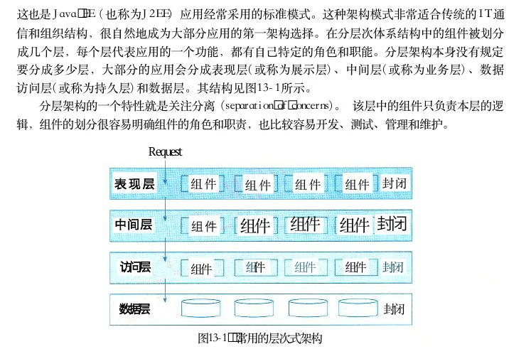

图13－1 常用的层次式架构

当然，小的应用有时候会将业务层和持久层合在一起，更大规模的应用可能会划分更多的层，比如：增加调用外部服务的层等。层次式体系结构是一个可靠的通用的架构，对很多应用来说，如果不确定哪种架构适合，可以用它作为一个初始架构。但是，设计时要注意以下两点：

（1）要注意的是污水池反模式。所谓污水池反模式 （architecture sinkhole anti－pattern）， 就是请求流简单地穿过几个层，每层里面基本没有做任何业务逻辑，或者做了很少的业务逻辑。比如一些 Java EE例子，业务逻辑层只是简单的调用了持久层的接口，本身没有什么业务逻辑。每一层或多或少都有可能遇到这样的场景，关键是分析这样的请求的百分比是多少。二八原则可以帮助你决定是否正在遇到污水池反模式。如果请求超过20％，则应该考虑让一些层变成开放的。

（2）需要考虑的是分层架构可能会让你的应用变得庞大。即使你的表现层和中间层可以独立发布，但它的确会带来一些潜在的问题，比如：分布模式复杂、健壮性下降、可靠性和性能的不足，以及代码规模的膨胀等。

<!-- PDF 第 465 页 -->

## 13．2表现层框架设计

## 13．2．1表现层设计模式

## 1．MVC模式

MVC 是一种目前广泛流行的软件设计模式。近年来，随着 Java EE 的成熟， MVC 成为了Java EE 平台上推荐的一种设计模式。 MVC 强制性地把一个应用的输入、处理、输出流程按照视图、控制、模型的方式进行分离，形成了控制器、模型、视图三个核心模块。（ 1 ） 控制器 （Controller）： 接受用户的输入并调用模型和视图去完成用户的需求。该部分是用户界面与Model的接口。一方面它解释来自于视图的输入，将其解释成为系统能够理解的对象，同时它也识别用户动作，并将其解释为对模型特定方法的调用；另一方面，它处理来自于模型的事件和模型逻辑执行的结果，调用适当的视图为用户提供反馈。（ 2 ） 模型 （Model）： 应用程序的主体部分。模型表示业务数据和业务逻辑。一个模型能为多个视图提供数据。由于同一个模型可以被多个视图重用，所以提高了应用的可重用性。（ 3 ） 视图 （View）： 用户看到并与之交互的界面。视图向用户显示相关的数据，并能接收用户输入的数据，但是它并不进行任何实际的业务处理。视图可以向模型查询业务状态，但不能改变模型。视图还能接受模型发出的数据更新事件，从而对用户界面进行同步更新。三者的协作关系如图13－2所示。

（控制器）选择视图业务处理接受用户请求调用模型响应用户请求选择视图显示响应结果

用户请求（模型）（视图）显示模型状态代表应用程序状态状态查询接受数据更新请求响应状态查询把用户输入数据传给处理业务流程通知新数据更新通知视图业务状态更新控制器方法调用图例事件图13－2 MVC设计模式从图13－2中可以看到，首先，控制器接收用户的请求，并决定应该调用哪个模型来处理；然后，模型根据用户请求进行相应的业务逻辑处理，并返回数据；最后，控制器调用相应的视图来格式化模型返回的数据，并通过视图呈现给用户。使用 MVC 模式来设计表现层，可以有以下的优点。（ 1 ） 允许多种用户界面的扩展 。 在MVC 模式中，视图与模型没有必然的联系，都是通过控制器发生关系，这样如果要增加新类型的用户界面，只需要改动相应的视图和控制器即可，而模型则无须发生改动。

<!-- PDF 第 466 页 -->

（2）易于维护。控制器和视图可以随着模型的扩展而进行相应的扩展，只要保持一种公共的接口，控制器和视图的旧版本也可以继续使用。

（3）功能强大的用户界面。用户界面与模型方法调用组合起来，使程序的使用更清晰，可将友好的界面发布给用户。MVC 是构建应用框架的一个较好的设计模式，可以将业务处理与显示分离，将应用分为控制器、模型和视图，增加了应用的可拓展性、强壮性及灵活性。基于 MVC 的优点，目前比较先进的 Web 应用框架都是基于 MVC 设计模式的。

## 2． MVP 模式

MVP（Model－View－Presenter） 模式提供数据， View 负责显示， Controller／Presenter 负责逻辑的处理。 MVP 是从经典的模式 MVC演变而来，它们的基本思想有相通的地方： Controller／Presenter 负责逻辑的处理， Model 提供数据， View 负责显示 。 当然MVP 与 MVC 也有一些显著的区别， MVC模式中元素之间“混乱”的交互主要体现在允许View 和 Model 直接进行“交流 ” ， 这在 MVP 模式中是不允许的。在 MVP 中 View并不直接使用 Model， 它们之间的通信是通过 Presenter（MVC 中的 Controller） 来进行的，所有的交互都发生在 Presenter 内部，而在MVC 中 View 会直接从 Model 中读取数据而不是通过Controller。MVP 不仅仅避免了View 和 Model 之间的耦合，还进一步降低了 Presenter对 View 的依赖。Presenter 依赖的是一个抽象化的View， 即 View 实现的接口 IView， 这带来的最直接的好处，就是使定义在 Presenter 中的 UI 处理逻辑变得易于测试。由于 Presenter对 View 的依赖行为定义在接口 IView 中，只需要一个实现了这个接口的 View 就能对Presenter进行测试。 MVP 的结构如图13－3所示。

Presenter

## 3:updates the model

## 2:action

(use View as a notification5:notification of change's store)Model changes

## 4:gets updated

data

## 1:makes action

## 6:renderingModel

View

## 7:rendered output
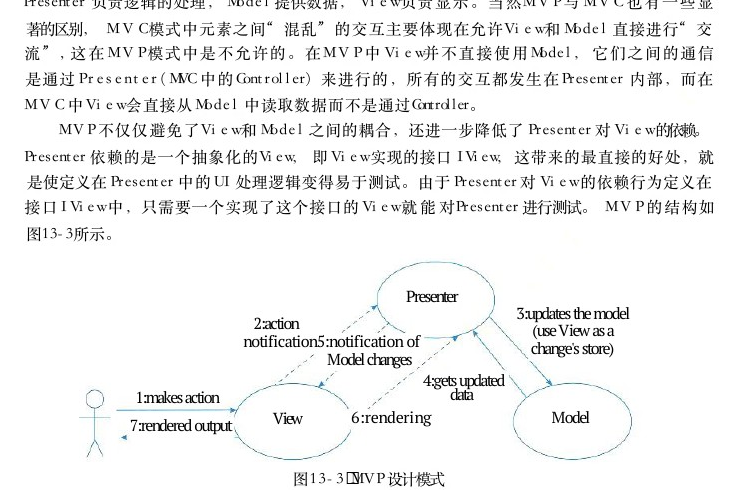

图13－3 MVP 设计模式

使用 MVP 模式来设计表现层，可以有以下的优点。

（1）模型与视图完全分离，可以修改视图而不影响模型。

（2）可以更高效地使用模型，因为所有的交互都发生在一个地方——Presenter 内部。（ 3 ） 可以将一个 Presenter用于多个视图，而不需要改变 Presenter 的逻辑。这个特性非常的有用，因为视图的变化总是比模型的变化频繁。

（4）如果把逻辑放在 Presenter 中，就可以脱离用户接口来测试这些逻辑（单元测试）。

<!-- PDF 第 467 页 -->

目前， MVP模式被更多地用在 Android 开发当中。

## 3． MVVM 模式

MVVM模式正是为解决 MVP 中UI种类变多，接口也会不断增加的问题而提出的。MVVM 模式全称是模型－视图－视图模型 （Model－View－ViewModel）， 它和 MVC 、 MVP类似，主要目的都是为了实现视图和模型的分离，不同的是 MVVM 中， View与 Model 的交互通过 ViewModel来实现 。 ViewModel是 MVVM 的核心 ， 它通过DataBinding 实现View与Model 之间的双向绑定，其内容包括数据状态处理、数据绑定及数据转换。例如， View 中某处的状态和 Model 中某部分数据绑定在一起，这部分数据一旦变更将会反映到View 层。而这个机制通过 ViewModel 来实现。ViewModel， 即视图模型，是一个专门用于数据转换的控制器，它可以把对象信息转换为视图信息，将命令从视图携带到对象。它通过 View 发布对象的公共数据，同时向视图提供数据和方法。 View和 ViewModel 之间使用视图、观察者DataBinding及其事件进行通信。 View 的用户(View)必接口事件仍然由View 自身处理，并把相关事件映射到 ViewModel， 以实现 View 中的对象与视图模型内容的同步，且可通过双向数据绑模型、被观察者视图模型定进行更新。因此，程序员只需编写包含声明(ViewModel)(Model)绑定的视图模板，以及 ViewModel 中的数据图13－4 MVVM设计模式变更逻辑，就能使 View 获得响应式的更新。MVVM 流程设计如图13－4所示。在MVVM模式下 View和 Model 不能直接通信，两者的通信只能通过ViewModel 来实现。ViewModel 通常要实现一个观察者，当数据发生变化， ViewModel 能够监听到数据的变化，然后通知对应的视图做自动更新；而当用户操作视图， ViewModel 也能监听到视图的变化，再通知数据做改动，从而形成数据的双向绑定。这使得 MVVM 更适用于数据驱动的场景，尤其是数据操作特别频繁的场景。但也正是由于数据和视图的双向绑定，导致出现问题时不太好定位来源，有可能由数据问题导致、也有可能由业务逻辑中对视图属性的修改导致。若项目中有计划采用MVVM ， 倾向建议使用官方的架构组件 ViewModel、LiveData 等去实现 MVVM 。

1 3 ． 2 ． 2 使用XML设计表现层 ， 统一WebForm与 WindowsForm的外观

XML （可扩展标记语言）与 HTML 类似，是一种标记语言。与主要用于控制数据的显示和外观的 HTML 标记不同， XML 标记用于定义数据本身的结构和数据类型。 XML 已被公认为是优秀的数据描述语言，并且成为了业内广泛采用的数据描述标准。由于XML 的设计目标是描述数据并集中于数据的内容，所以虽然XML 和 HTML 类似，但是业内很少采用 XML 作为表现层技术，表现层技术仍然是 HTML 唱主角。但是，由于 Web应用程序对特定浏览器的局限以及性能问题，基于窗体表现形式的胖客户端应用程序又开始有

<!-- PDF 第 468 页 -->

了卷土重来的趋势。这两种应用程序各有优势，在未来很长一段时间这两种技术架构都会并存。因此，许多开发厂商在开发新产品时提出了既要支持胖客户端的表现形式，又要支持 Web 的表现形式。于是，有人提出将 GUI 用一个标准的形式描述，对于不同的表现形式，提供特定形式的转换器，根据GUI 的描述转换成相应的表现形式。这就要求描述语言有非常好的通用性和扩展性， XML 恰恰是这种描述语言理想的载体。对于大多数应用系统， GUI 主要是由GUI控件组成。控件可以看成是一个数据对象，其包含位置信息、类型和绑定的事件等。这些信息在 XML 中都可以作为数据结点保存下来，每一个控件都可以被描述成一个 XML结点，而控件的那些相关属性都可以描述成这个 XML结点的 Attribute。 由于 XML本身就是一种树形结构描述语言，所以可以很好地支持控件之间的层次结构。同时， XML标记由架构或文档的作者定义，并且是无限制的，所以架构开发人员可以随意约定控件的属性，例如可以约定 type＝＂button＂ 是一个按钮， typc＝＂panel＂ 是一个控件容器，type＝＂Constraint＂ 是位置等。这样，整个 GUI 就可以完整而且简单地通过XML 来描述。例如：

&lt; componenttype = " panel " constraint = " 1 6 , 2 2 , 7 8 , 2 0 0 " / &gt;&lt;component type="button" isvisible-"false"constraint = " 1 7 , 2 2 2 , 7 8 , 2 0 " / &gt;&lt;/component&gt;这么一段 XML 很清晰地表示一个控件容器位置是（16，22，78，200），包含了一个不可视按钮。用上述的XML 形式将 GUI 按照数据描述的形式保存下来代替原先特有的表现形式所需要的 GUI 描述载体。然后，对于特定的表现技术，实现不同的解析器解析XML 配置文件。根据 XML 中的标签，按照特有的表现技术实例化的 GUI 控件实例对象。例如，解析器遇到button，JFC 解析器会给予 JLabel 对象， XSLT 解析器会给予 ＜button id＝…＞这样一个 HTML字符串，再调用特定表现技术的 API 将实例化出来的组件对象添加到 GUI 上显示。从设计模式的角度来说，整个XML 表现层解析的机制是一种策略模式。在调用显示GUI时，不是直接调用特定的表现技术的 API， 而是装载 GUI 对应的XML配置文件，然后根据特定的表现技术的解析器解析 XML ， 得到 GUI 视图实例对象。这样，对于 GUI 开发人员来说，GUI 视图只需要维护一套 XML 文件即可。

## 13．2．3表现层中UIP设计思想

应用程序通常要用代码来管理用户界面，例如一个窗体可以决定下一个要呈现给用户的窗体。开发人员可以把这些代码写在 UI代码中间，但是会使得代码复杂，不易复用、维护和扩展。另一方面，应用程序要运行在其他的平台也变得相当困难，因为它进行控制的逻辑和状态都不能被复用。在大多数情况下，应用程序需要维护一个状态，如状态存储在窗体中，代码需要访问这个窗体以重新恢复状态。这样做会比较困难并且代码也会变得不雅，同时也会对用户接口的重用性和可扩展性产生影响。用户应用系统的时候，可能会先启动一个任务，离开一段时间后再回来继续。如果在中间

<!-- PDF 第 469 页 -->

用户关闭了应用程序，它将失去当前的状态，要想继续任务的话必须一切从头开始。因此设计程序的时候，必须分开来考虑工作流、导航、与商业服务的交互等各个组成部分，以获取数据并呈现给用户。UIP（UserInterface Process Application Block） 是微软社区开发的众多 Application Block 中的其中之一，它是开源的。 UIP 提供了一个扩展的框架，用于简化用户界面与商业逻辑代码的分离的方法，可以用它来写复杂的用户界面导航和工作流处理，并且它能够复用在不同的场景、并可以随着应用的增加而进行扩展。使用 UIP框架的应用程序把表现层分为了以下几层。

●这个组件就是原来的表现层，用户看到的和进行交互都是这User Interface Components:个组件，它负责获取用户的数据并且返回结果。

●这个组件用于协调用户界面的各部分，使其配合后User Interface Process Components:台的活动，例如导航和工作流控制，以及状态和视图的管理。用户看不到这一组件，但是这些组件为User Interface Components提供了重要的支持功能。图13－5展示了这两层在基于．Net 的分布式应用程序中的位置。

Users

UI Components(UIC)OUI Process Components(UIP)perCaotmiomSService interfaces(SInueacnluircMiaBusinessatBusiness BusinesstyniaWorkflows(BW)ogComponents(BC)Entities(BE)nementData Access Service Gateways(SG)Components(DAC)

Data SourcesSources
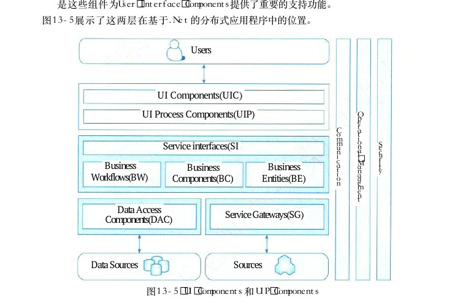

图13－5 UI Components和 UIP Components

UIP 的组件主要负责的功能是：管理经过 User Interface Components 的信息流；管理UIP 中各个事件之间的事务；修改用户过程的流程以响应异常；将概念上的用户交互流程从实现或者涉及的设备上分离出来；保持内部的事务关联状态，通常是持有一个或者多个的与用户交互的事务实体。因此，这些组件也能从 UI 组件收集数据，执行服务器的成组的升级或是跟踪UIP 中的任务过程的管理。

<!-- PDF 第 470 页 -->

## 13．2．4表现层动态生成设计思想

基于 XML 的界面管理技术可实现灵活的界面配置、界面动态生成和界面定制。其思路是用 XML 生成配置文件及界面所需的元数据，按不同需求生成界面元素及软件界面。基于 XML界面管理技术，包括界面配置、界面动态生成和界面定制三部分，如图13－6所示。

可执行文件界面定制模块

界面动态生成模块

界面配置模块数据存取类DOM API

XML配置文件数据库图 1 3 － 6 基于XML 的界面管理技术框图

界面配置是对用户界面的静态定义，通过读取配置文件的初始值对界面配置。由界面配置对软件功能进行裁剪、重组和扩充，以实现特殊需求。界面定制是对用户界面的动态修改过程，在软件运行过程中，用户可按需求和使用习惯，对界面元素（如菜单、工具栏、键盘命令）的属性（如文字、图标、大小和位置等）进行修改。软件运行结束，界面定制的结果被保存。系统通过 DOMAPI 读取XML 配置文件的表示层信息 （ 如初始界面大小 、 位置等 ） ， 通过数据存取类读取数据库中的数据层信息，运行时由界面元素动态生成界面。界面配置和定制模块在软件运行前后修改配置文件、更改界面内容。基于 XML的界面管理技术实现的管理信息系统实现了用户界面描述信息与功能实现代码的分离，可针对不同用户需求进行界面配置和定制，能适应一定程度内的数据库结构改动。只须对 XML文件稍加修改，即可实现系统的移植。

## 13．3 中间层架构设计

## 13．3．1业务逻辑层组件设计

业务逻辑组件分为接口和实现类两个部分。接口用于定义业务逻辑组件，定义业务逻辑组件必须实现的方法是整个系统运行的核心。通常按模块来设计业务逻辑组件，每个模块设计一个业务逻辑组件，并且每个业务逻辑组件以多个 DAO（Data Access Object） 组件作为基础，从而实现对外提供系统的业务逻辑服务。增加业务逻辑组件的接口，是为了提供更好的解耦，控制器无须与具体的业务逻辑组件耦合，而是面向接口编程。

<!-- PDF 第 471 页 -->

## 1．业务逻辑组件的实现类

业务逻辑组件以DAO 组件为基础，必须接收 Spring 容器注入的 DAO 组件，因此必须为业务逻辑组件的实现类提供对应的 setter方法。业务逻辑组件的实现类将DAO组件接口实例作为属性（面向接口编程），而对于复杂的业务逻辑，可能需要访问多个对象的数据，那么只需在这个方法里调用多个DAO 接口，将具体实现委派给DAO 完成。

## 2．业务逻辑组件的配置

由于业务逻辑组件的 DAO组件从未被初始化过，那么业务方法如何完成？ DAO 组件初始化是由 Spring 的反向控制 （Inverse of Control，IoC） 或者称为依赖注入 （Dependency Injection，DI） 机制完成的。为此，还需要在 applicationContext．xml 里面配置 FacadeManager 组件。定义 FacadeManager组件时必须为其配置所需要的 DAO 组件 ， 配置信息表示Base－Manager继承刚才配置的事务代理模板 。 并且由容器给BascManagcr注入DAO 的组件 ， 即 BaseDAOHibernate。 而 target则是TransactionProxy FactoryBean 需要指定的属性 ，TransactionProxyFactoryBean 负责为某个 bean 实例生成代理，代理必须有个目标， target属性则用于指定目标。当然，也可以不使用事务代理模板及嵌套 bean， 而是为组件指定单独的事务代理属性，让事务代理的目标引用容器中已经存在的 bcan。applicationContext．xml 文件的源代码配置了应用的数据源和 SessionFactory等 bean， 而业务逻辑组件也被部署在该文件中。在配置文件中，采用继承业务逻辑组件的事务代理，将原有的业务逻辑组件作为嵌套 bean配置，避免了直接调用没有事务特性的业务逻辑组件。系统实现了所有的后台业务逻辑，并且向外提供了统一的Facade 接口，前台Web 层仅仅依赖这个 Facade 接口。这样， Web层与后台业务层的耦合已经非常松散，系统可以在不同的 Web框架中方便切换，即使将整个 Web 层替换掉也非常容易。

## 1 3 ． 3 ． 2 业务逻辑层工作流设计

工作流管理联盟 （Workflow Management Coalition） 将工作流定义为：业务流程的全部或部分自动化，在此过程中，文档、信息或任务按照一定的过程规则流转，实现组织成员间的协调工作以达到业务的整体目标。工作流参考模型见图13－7。工作流管理一直是企业界和学术界关注的热点领域。1993年，国际上专门成立了工作流管理联盟 （WorkFlow Management Coalition，WFMC）， 以便对工作流实现标准化管理。它是一种反映业务流程的计算机化的模型，是为了在先进计算机环境支持下实现经营过程集成与经营过程自动化而建立的可由工作流管理系统执行的业务模型。它解决的主要问题是：使在多个参与者之间按照某种预定义的规则传递文档、信息或任务的过程自动进行，从而实现某个预期的业务目标，或者是促使此目标的实现。

<!-- PDF 第 472 页 -->

过程定义工具接口1工作流API和交互形式其他工作流工作流设置服务器设置服务器接口4接口5管理与监视工具工作流工作流引擎引擎

接口2接口3工作流相关客户端应用应用
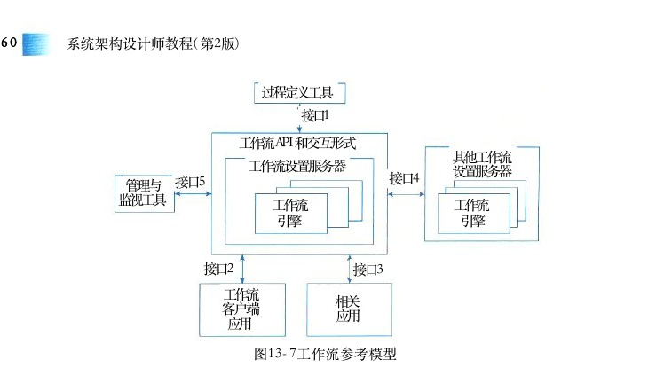

图13－7工作流参考模型

（1）interface 1： 过程定义导入／导出接口。这个接口的特点是：转换格式和 API调用，从而支持过程定义信息间的互相转换。这个接口也支持已完成的过程定义或过程定义的一部分之间的互相转换。早期标准是 WPDL ， 后来发展为XPDL。

（2）interface 2： 客户端应用程序接口。通过这个接口工作流机可以与任务表处理器交互，代表用户资源来组织任务。然后由任务表处理器负责，从任务表中选择、推进任务项。由任务表处理器或者终端用户来控制应用工具的活动。

（3）interface 3： 应用程序调用接口。允许工作流机直接激活一个应用工具，来执行一个活动。典型的是调用以后台服务为主的应用程序，没有用户接口。当执行活动要用到的工具，需要与终端用户交互，通常是使用客户端应用程序接口来调用那个工具，这样可以为用户安排任务时间表提供更多的灵活性。

（4）interface 4： 工作流机协作接口。其目标是定义相关标准，以使不同开发商的工作流系统产品相互间能够进行无缝的任务项传递。 WFMC 定义了4个协同工作模型，包含多种协同工作能力级别。

（5）interface 5： 管理和监视接口。提供的功能包括用户管理、角色管理、审查管理、资源控制、过程管理和过程状态处理器等。用工作流的思想组织业务逻辑，优点是：将应用逻辑与过程逻辑分离，在不修改具体功能的情况下，通过修改过程模型改变系统功能，完成对生产经营部分过程或全过程的集成管理，可有效地把人、信息和应用工具合理地组织在一起，发挥系统的最大效能。

## 13．3．3业务逻辑层实体设计

业务逻辑层实体具有以下特点：业务逻辑层实体提供对业务数据及相关功能（在某些设计中）的状态编程访问。业务逻辑层实体可以使用具有复杂架构的数据来构建，这种数据通常来自数据库中的多个相关表。业务逻辑层实体数据可以作为业务过程的部分 I／O 参数传递。业务逻辑层实体可以是可序列化的，以保持它们的当前状态。例如，应用程序可能需要在本地磁盘、

<!-- PDF 第 473 页 -->

桌面数据库（如果应用程序脱机工作）或消息队列消息中存储实体数据。业务逻辑层实体不直接访问数据库，全部数据库访问都是由相关联的数据访问逻辑组件提供的。业务逻辑层实体不启动任何类型的事务处理，事务处理由使用业务逻辑层实体的应用程序或业务过程来启动。在应用程序中表示业务逻辑层实体的方法有很多（从以数据为中心的模型到更加面向对象的表示法），如 XML、 通用 DataSet、 有类型的 DataSet 等。以下示例显示了如何将一个简单的业务逻辑层实体表示为 XML。 该业务逻辑层实体包含一个产品。

&lt; ? xmlversion = " 1 . 0 " ? &gt;&lt;Product xmlns="urn:aUniqueNamespace"&gt;&lt; ProductID &gt; 1 &lt; / ProductID &gt;&lt; ProductName &gt;Chai&lt;/ProductName &gt;&lt; QuantityPerUnit &gt; 1 0 boxesx 2 0 bags &lt; / QuantityPerUnit &gt;&lt; UnitPrice &gt; 1 8 . 0 0 &lt; / UnitPrice &gt;&lt; UnitsInStock &gt; 3 9 &lt; / UnitsInstock &gt;&lt; Unitsonorder &gt; 0 &lt; / UnitsOnOrder &gt;&lt; ReorderLevel &gt; 1 0 &lt; / ReorderLevel &gt;&lt; / Product &gt;将业务逻辑层实体表示为 XML 的优点如下。

（1）标准支持。 XML是 World Wide Web Consortium（W3C） 的标准数据表示格式。

（2）灵活性。 XML 能够表示信息的层次结构和集合。

（3）互操作性。在所有平台上， XML 都是与外部各方及贸易伙伴交换信息的理想选择。如果 XML 数据将由ASP．NET应用程序或 Windows 窗体应用程序使用，则还可以把这些XML数据装载到一个 DataSet 中，以利用 DataSet提供的数据绑定支持。将业务逻辑层实体表示为通用 DataSet。 通用 DataSet 是 DataSet类的实例，它是在 ADO．NET 的 System．Data命名空间中定义的。 DataSet 对象包含一个或多个 DataTable 对象，用于表示数据访问逻辑组件从数据库检索到的信息。图13－8所示为用于 Product 业务逻辑层实体的通用 DataSet 对象 。 该DataSet 对象具有一个 DataTable， 用于保存产品信息。该 DataTable具有一个 UniqueConstraint对象，用于将ProductID 列标记为主键。 DataTable 和 UniqueConstraint对象是在数据访问逻辑组件中创建该DataSet 时创建的。

将ProductID定义为Product DataTable Product Data Table UniqueConStraint中的主键
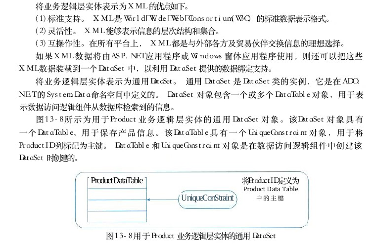

图13－8用于 Product业务逻辑层实体的通用 DataSet

<!-- PDF 第 474 页 -->

图 1 3 － 9 所示为用于 Order业务逻辑层实体的通用 DataSet对象 。 此DataSet 对象具有两个DataTable对象，分别保存订单信息和订单详细信息。每个DataTable具有一个对应的 UniqueConstraint 对象，用于标识表中的主键。此外，该 DataSet还有一个 Relation 对象，用于将订单详细信息与订单相关联。

Product DataTable将ProductID定义为UniqueConstraintProduce DataTable中的主键关联Order和关系OrderDetails DataTable将OrderID和ProductID定义为Product DataTable OrderDetails DataTable中的复合主键UniqueConstraint
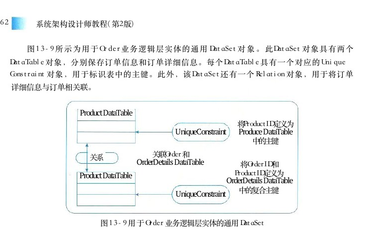

图13－9用于 Order业务逻辑层实体的通用 DataSet

将业务逻辑层实体表示为通用 DataSet 的优点如下。

（1）灵活性。 DataSet 可以包含数据的集合，能够表示复杂的数据关系。

（2）序列化。在层间传递时， DataSet 本身支持序列化。（ 3 ） 数据绑定 。 可以把 DataSet 绑定到 ASP ． NET应用程序和 Windows 窗体应用程序的任意用户界面控件。（ 4 ） 排序与过滤 。 可以使用 DataView 对象排序和过滤DataSet。 应用程序可以为同一个DataSet 创建多个DataView 对象，以便用不同方式查看数据。（ 5 ） 与 XML 的互换性。可以用 XML格式读写 DataSet。

（6）开放式并发。在更新数据时，可以配合使用数据适配器与 DataSet 方便地执行开放式并发检查。

（7）可扩展性。如果修改了数据库架构，则适当情况下数据访问逻辑组件中的方法可以创建包含修改后的 DataTable 和 DataRelation对象的 DataSet。将业务逻辑层实体表示为有类型的 DataSet。 有类型的 DataSet 是包含具有严格类型的方法、属性和类型定义以公开DataSet中的数据和元数据的类。将业务逻辑层实体表示为有类型的 DataSet 的优点如下。

（1）代码易读。要访问有类型的DataSet 中的表和列，可以使用有类型的方法和属性。

（2）有类型的方法和属性的提供使得使用有类型的 DataSet 比使用通用 DataSet更方便。使用有类型的 DataSet 时， IntelliSense将可用。

（3）编译时类型检查，无效的表名称和列名称将在编译时而不是在运行时检测。

<!-- PDF 第 475 页 -->

## 13．3．4业务逻辑层框架

业务框架位于系统架构的中间层，是实现系统功能的核心组件。采用容器的形式，便于系统功能的开发、代码重用和管理。图13－10便是在吸收了 SOA 思想之后的一个三层体系结构的简图。

Java应用其他客户端表示层JSPServlet

业务需求

业务容器DomainM ServiceControl业务层

DAO 界面

DAO 执行

数据库图13－10业务框架在整个系统架构中的位置

从图13－10中可以看到，业务层采用业务容器 （Business Container） 的方式存在于整个系统当中，采用此方式可以大大降低业务层和相邻各层的耦合，表示层代码只需要将业务参数传递给业务容器，而不需要业务层多余的干预。如此一来，可以有效地防止业务层代码渗透到表示层。在业务容器中，业务逻辑是按照 Domain Model—Service—Control 思想来实现的。

（1）Domain Model 是领域层业务对象，它仅仅包含业务相关的属性。

（2）Service 是业务过程实现的组成部分，是应用程序的不同功能单元，通过在这些服务之间定义良好的接口和契约联系起来。接口是采用中立的方式进行定义的，这使得构建在各种这样的系统中的服务可以以一种统一和通用的方式进行交互。这种具有中立的接口定义（没有强制绑定到特定的实现上）的特征称为服务之间的松耦合。松耦合系统的好处有两点，一是它的灵活性，二是当组成整个应用程序的每个服务的内部结构和实现逐渐地发生改变时，它能够继续存在。

（3）Control 服务控制器，是服务之间的纽带，不同服务之间的切换就是通过它来实现的。通过服务控制器控制服务切换可以将服务的实现和服务的转向控制分离，提高了服务实现的灵活性和重用性。

<!-- PDF 第 476 页 -->

以下是 Domain Model—Service—Control三者的互动关系。

（1）Service 的运行会依赖于 Domain Model的状态，反之， Service 也会根据业务规则改变Domain Model 的状态。

（2）Control作为服务控制器，根据 Domain Model 的状态和相关参数决定 Service 之间的执行顺序及相互关系Domain Model—Service—Control 的互动关系，是吸取了 Model—View—Control 的优点，在“控制和显示的分离”的基础之上演变而来的，通过将服务和服务控制隔离，使程序具备高度的可重用性和灵活性。

## 13．4 数据访问层设计

## 13．4．15种数据访问模式

## 1．在线访问

在线访问是最基本的数据访问模式，也是在实际开发过程中最常采用的。如图13－11所示，这种数据访问模式会占用一个数据库连接，读取数据，每个数据库操作都会通过这个连接不断地与后台的数据源进行交互。

## 2. DataAccess Object

如图13－12所示， DAO 模式是标准 J2EE 设计模式之一，开发人员常常用这种模式将底层数据访问操作与高层业务逻辑分离开。

进程边界

＊aClient:aClient GetTile()

GetFirstName(DAOWeb应用数据库

GetMiddleName()DAOWeb应用数据库DAO

GetLastName(ERP DAOWeb应用系统＊DAO图13－12 DAO 模式图13－11在线访问模式

<!-- PDF 第 477 页 -->

一个典型的 DAO 实现通常有以下组件。（ 1 ） 一个 DAO 工厂类。（ 2 ） 一个DAO 接口。

（3）一个实现了 DAO 接口的具体类。

（4）数据传输对象。这当中具体的 DAO 类包含访问特定数据源的数据的逻辑。

## 3.Data Transfer Object

如图13－13所示， Data Transfer Object 是经典 EJB 设计模式之一。 DTO 本身是这样一组对象或是数据的容器，它需要跨不同的进程或是网络的边界来传输数据。这类对象本身应该不包含具体的业务逻辑，并且通常这些对象内部只能进行一些诸如内部一致性检查和基本验证之类的方法，而且这些方法最好不要再调用其他的对象行为。进程边界aClient:CustomerDTOaServer＊GeetCustomerDto()

《创建》GetTitle()

GetFirstName()

GetMiddleName()

GetLastName()审
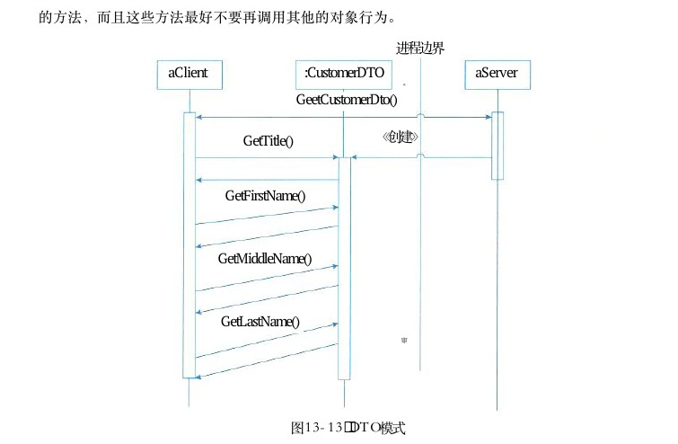

图13－13 DTO 模式

在具体设计这类对象 （ DTO ） 时，通常可以有如下两种选择。

（1）使用编程语言内置的集合对象，它通常只需要一个类，就可以在整个应用程序中满足任何数据传输目的；而且几乎所有的编程语言都内置了集合类型，不需要再另外编写实现代码。同时，使用内置的集合对象来实现DTO 对象的时候 ， 客户端必须按位置序号 （ 在简单数组的情况下）或元素名称（在键控集合的情况下）访问集合内的字段。不过，集合存储的是同一类型 （ 通常是最基本的 Object 类型）的对象，这有时会导致在编译时碰到一些无法检测到的编码错误。

<!-- PDF 第 478 页 -->

（2）通过创建自定义类来实现 DTO 对象，通过定义显示的get 或是 set方法来访问数据。这种方式能够提供与任何其他对象完全一样的、客户端应用程序可访问的强类型对象。这种对象可以提供编译时的类型检查，但是增加了编码的工作量，若应用程序发出许多远程调用的话，需要编写大量的调用代码。具体实现中有许多方法试图将上述这两种方法的优点结合在一起。第一种方法是代码生成技术，该技术可以生成脱离现有元数据（如可扩展标记语言 XML 架构 ） 的自定义 DTO 类的源代码；第二种方法是提供更强大的集合，尽管它也是平台内置的一般的集合，但它将关系和数据类型信息与原始数据存储在一起，例如 IBM 提出的 SDO 技术或是微软 ADO ． NET 中的DataSet 就支持这类方法。

## 4．离线数据模式

离线数据模式是以数据为中心，数据从数据源获取之后，将按照某种预定义的结构（这种结构可以是 SDO 中的Data 图表结构，也同样可以是 ADO ． NET 中的关系结构）存放在系统中，成为应用的中心。离线，对数据的各种操作独立于各种与后台数据源之间的连接或是事务；与XML 集成，数据可以方便地与 XML 格式的文档之间互相转换；独立于数据源，离线数据模式的不同实现定义了数据的各异的存放结构和规则，这些都是独立于具体的某种数据源的。

5．对象／关系映射 （Object／Relation Mapping，O／R Mapping）在最近几年，采用 OR 映射的指导思想来进行数据持久层的设计似乎已经成了一种潮流。对象／关系映射的基本思想来源于这样一种现实：大多数应用中的数据都是依据关系模型存储在关系型数据库中；而很多应用程序中的数据在开发或是运行时则是以对象的形式组织起来的。那么，对象／关系映射就提供了这样一种工具或是平台，能够帮助将应用程序中的数据转换成关系型数据库中的记录；或是将关系数据库中的记录转换成应用程序中代码便于操作的对象。

## 13．4．2工厂模式在数据访问层应用

在应用程序的设计中，数据库的访问是非常重要的，数据库的访问需要良好的封装性和可维护性。在．Net 中，数据库的访问，对于微软自家的 SqIServer 和其他数据库（支持OleDb），采用不同的访问方法，这些类分别分布于 System．Data．SqIClient和 System．Data．OleDb 名称空间中。微软后来又推出了专门用于访问Oracle 数据库的类库。我们希望在编写应用系统的时候，不因这么多类的不同而受到影响，尽量做到数据库无关。这就需要在实际开发过程中将这些数据库访问类再作一次封装。经过这样的封装，不仅可以达到上述的目标，还可以减少操作数据库的步骤，减少代码编写量。工厂设计模式是使用的主要方法。工厂模式定义一个用于创建对象的接口，让子类决定实例化哪一个类。工厂方法使一个类的实例化延迟到其子类。这里可能会处理对多种数据库的操作，因此，需要首先定义一个操纵数据库的接口，然后根据数据库的不同，由类工厂决定实例化哪个类。下面首先来定义这个访问接口。为了方便说明问题，在这里只列出了比较少的方法，其他的方法是很容易参照添加的。

<!-- PDF 第 479 页 -->

public interface DataAccess

／／数据库类型DatabaseType DatabaseType{get;}／／得到数据库连接IDbConnection DbConnection{get;}／／打开数库连接void Open();／／关闭数据库连接void Close();／／开始一个事务IDbTransaction BeginTransaction();／／执行 sql 语句int ExecuteNonQuery(string commandText);DataSet ExecuteDataset(string commandText);／／执行 Sql， 返回 DataSet

因为 DataAccess 的具体实现类有一些共同的方法，所以先从DataAccess 实现一个抽象的AbstractDataAccess 类，包含一些公用方法。然后，分别为 SQL Server、Oracle 和 OleDb数据库编写三个数据访问的具体实现类。

public sealed class MSSqlDataAccess :AbstractDataAccess

…／／具体实现代码

public class oleDbDataAccess :AbstractDataAccess

…／／具体实现代码

｝public class oracleDataAccess :AbstractDataAccess

…／／具体实现代码

现在已经完成了所要的功能，下面需要创建一个 Factory 类，来实现自动数据库切换的管理。这个类很简单，主要的功能就是根据数据库类型，返回适当的数据库操纵类。

public sealed class DataAccessFactory

private DataAccessFactory(){}private static PersistenceProperty defaultPersistenceProperty;public static PersistenceProperty DefaultPersistenceProperty

get{return defaultPersistenceProperty;}set{defaultPersistenceProperty=value;}

public static DataAccess CreateDataAccess(PersistenceProperty pp)—

<!-- PDF 第 480 页 -->

DataAccess dataAccess;switch(pp.DatabaseType)

case(DatabaseType.MSSQLServer):dataAccess = new MSSqlDataAccess(pp.Connection-String);break;case(DatabaseType.Oracle):dataAccess = new OracleDataAccess(pp.Connection-String);break ;case(DatabaseType.OleDBSupported):dataAccess = new OleDbDataAccess(pp.ConnectionString);break ;default :dataAccess=new MSSqlDataAccess(pp.ConnectionString);break ;｝return dataAccess;

public static DataAccess CreateDataAccess()

return CreateDataAccess(defaultPersistenceProperty);

现在一切都完成了，客户端在代码调用的时候，可能就是采用如下形式。

PersistenceProperty pp = new PersistenceProperty();pp.ConnectionString =“server=127.0.0.1;uid=sa;pwd=;database=Northwind;”;pp.DatabaseType = DatabaseType.MSSQLServer;pp.UserID =“sa”;pp.Password =“”;DataAccess db= DataAccessFactory.CreateDataAccess(pp)db.Open();…／／db．需要的操作db.Close();或者，如果事先设定了Data Access Factory 的 Default Persistence Property 属性，可以直接使用Data Access db＝ Data Access Factory．Create Data Access（） 方法创建 Data Access 实例。当数据库发生变化时，只需要修改 PersistenceProperty 的值，客户端不会感觉到变化，也不用去关心。这样，实现了良好的封装性。当然，前提是你在编写程序时，没有用到特定数据库

<!-- PDF 第 481 页 -->

的特性，例如， SqlServer 的专用函数。

## 13．4．3 ORM、Hibernate与CMP2．0设计思想

ORM（Object－Relation Mapping） 在关系型数据库和对象之间作一个映射，这样，在具体操纵数据库时，就不需要再去和复杂的 SQL 语句打交道，只要像平时操作对象一样操作即可。当开发一个应用程序的时候（不使用 OR Mapping）， 可能会涉及许多数据访问层的代码，用来从数据库保存、删除和读取对象信息等，然而这些代码写起来总是重复的。一个更好的办法就是引入 OR Mapping。 实质上，一个 OR Mapping会生成 DAL。 与其自己写DAL 代码，不如用 OR Mapping， 开发者只需要关心对象就好。使用 ORM 可以大大降低学习和开发成本。而在实际的开发中，真正对客户有价值的是其独特的业务功能，而不应该把大量时间花费在编写数据访问、 CRUD方法、后期的 Bug 查找和维护上。在使用 ORM 之后， ORM 框架已经把数据库转变成了我们熟悉的对象，我们只需要了解面向对象开发就可以实现数据库应用程序的开发，不需要浪费时间在 SQL 上。同时也可减少代码量，减少数据层出错机会。通过 Cache 的实现，能够对性能进行调优，实现了 ORM 区隔离实际数据存储和业务层之间的关系，能够对每一层进行单独跟踪，增加了性能优化的可能。Hibernate 是一个开放源代码的对象关系映射框架，它对 JDBC 进行了轻量级的对象封装，使Java 程序员可以随心所欲地使用对象编程思维来操纵数据库。它不仅提供了从 Java 类到数据表之间的映射，还提应用供了数据查询和恢复机制。相对于使用 JDBC 和 SQL 来手持久对象工操作数据库， Hibernate 可以大大减少操作数据库的工作量。另外， Hibernate 可以利用代理模式来简化载入类的过Hibernate程，这将大大减少利用 Hibernate QL 从数据库提取数据的HibernateXML属性映射代码的编写量。 Hibernate 可以和多种 Web服务器或者应用服务器良好集成，如今已经支持几乎所有流行的数据库服数据库务器。Hibernate技术本质上是一个提供数据库服务的中间件，图13－14 Hibernate 架构图它的架构如图13－14所示。图13－11显示了 Hibernate件 （ 如hibernate．properties） 的工作原理，它是利用数据库以及其他一些配置XML Mapping等来为应用程序提供数据持久化服务的。Hibernate 具有很大的灵活性，但同时它的体系结构比较复杂，提供了好几种不同的运行方式。在轻型体系中，应用程序提供JDBC 连接，并且自行管理事务，这种方式使用了Hibernate的一个最小子集。在全面解决体系中，对于应用程序来说，所有底层的JDBC／JTA API 都被抽象了，Hibernate 会照管所有的细节。Hibernate 是一个功能强大，可以有效地进行数据库数据到业务对象的 O ／ R映射方案。Hibernate 推动了基于普通 Java对象模型，用于映射底层数据结构的持久对象的开发。通过将持久层的生成自动扩展到一个更大的范围， Hibernate 使开发人员专心实现业务逻辑而不用分心于

<!-- PDF 第 482 页 -->

烦琐的数据库方面的逻辑，同时提供了更加合理的模块划分的方法。

## 13．4．4灵活运用XML Schema

XML Schema用来描述 XML文档合法结构、内容和限制。 XML Schema 由 XML 1．0 自描述，并且使用了命名空间，有丰富的内嵌数据类型及其强大的数据结构定义功能，充分地改造了并且极大地扩展了 DTDs （传统描述XML文档结构和内容限制的机制）的能力，将逐步替代DTDs， 成为 XML 体系中正式的类型语言，同 XML 规范、 Namespace 规范一起成为XML 体系的坚实基础。XML Schema 由诸如类型定义和元素声明的组件组成，可以用来评估一个格式良好元素和属性信息的有效性。 XML Schema 是 Schema 组件的集合，这些组件分为三组：基本组件、组件和帮助组件。其中基本组件包括简单类型定义、复杂类型定义、属性声明和元素声明；组件包括属性组、完整性约束定义、模型组和符号声明；帮助组件包括注释、模型组、小品词、通配符和属性使用。 Schema 组件详细说明了抽象数据模型的每个组件的严格语义，每个组件在XML 中的表示，一个 XMLSchema文档类型的 DTD 和 XML Schema 引用。XML Schema提供了创建XML 文档必要的框架，详细说明了一个XML 文档的不同元素和属性的有效结构、限制和数据类型。 XML Schema规范由如下三部分组成。

（1）XML Schema Part0：Primer。 一个非标准化的文档，提供了XML Schema 的一个简单可读的描述，目的是快速地理解如何利用 XMLSchema语言创建一个Schema （框架）。

（2）XML Schema Partl：Structures。 这一部分详细说明了 XML Schema定义语言，这个语言为描述XML 1 ． 0 文档的结构和内容限制提供了便利，包括开发了 XML Namespace （命名空间）的使用。

（3）XML Schema Part2：Datatypes。 这一部分定义了可用于 XML Schema 和其他 XML 规范中的定义数据类型的方法。这个数据类型语言，本身由XML 1．0 自描述，提供了说明元素和属性数据类型的 XML 1 ． 0文档类型定义 （DTDs） 的一个超集。这部分提出了标准的数据类型内容集合，其中讲述了目的、需求、范围和术语。 XML Schema与 DTD相比，有其独特的特点，提供了丰富的数据类型，实现了继承和复用，与命名空间紧密联系，易于使用。与DTD 不同， XML Schema 规范提供了丰富的数据类型。其中不仅包括一些内嵌的数据类型，如 string、integer、Boolean、time 和 date 等，还提供了定义新类型的能力，如complexType和 simpleType。 开发者可以利用内嵌的数据类型和用户定义的数据类型，有效地定义和限制XML 文档的属性和元素值。XML Schema 支持继承是它的另一特点。可以利用从已经存在的Schema 中获得某些类型而构造新的 Schema， 也可以在不需要时使获得的类型无效。同时， XML Schema 能将一个 Schema 分成单独的组件，这样，在写 Schema 时，就可以正确地引用已经定义的组件。继承性使得软件复用更加有效，帮助开发者避免了每一次创建都要从零开始，极大地提高了软件开发和维护的效率。XML Schema与 XML Namespace 紧密联系，使得在一个命名空间中创建元素和属性非常容易。这种联系简化了使用多个命名空间定义多个 Schema 的 XML 文档的创建和验证文档有效性。

<!-- PDF 第 483 页 -->

## 1 3 ． 4 ． 5 事务处理设计

事务是现代数据库理论中的核心概念之一。如果一组处理步骤或者全部发生或者一步也不执行，我们称该组处理步骤为一个事务。当所有的步骤像一个操作一样被完整地执行，我们称该事务被提交。由于其中的一部分或多步执行失败，导致没有步骤被提交，则事务必须回滚（回到最初的系统状态）。事务必须服从 ISO／IEC所制定的ACID 原则。 ACID 是原子性（Atomicity）、 一致性 （Consistency）、 隔离性 （Isolation） 和持久性 （Durability） 的缩写。事务的原子性表示事务执行过程中的任何失败都将导致事务所做的任何修改失效。一致性表示当事务执行失败时，所有被该事务影响的数据都应该恢复到事务执行前的状态。隔离性表示在事务执行过程中对数据的修改，在事务提交之前对其他事务不可见。持久性表示已提交的数据在事务执行失败时，数据的状态都应该正确。一般情况下， J2EE 应用服务器支持 JDBC 事务、 JTA（Java Transaction API） 事务和容器管理事务。一般情况下，最好不要在程序中同时使用上述三种事务类型，例如在 JTA 事务中嵌套JDBC事务。另外，事务要在尽可能短的时间内完成，不要在不同方法中实现事务的使用。下面举例说明两种事务处理方式。

## 1．JavaBean 中使用 JDBC 方式进行事务处理

在 JDBC 中怎样将多个SQL 语句组合成一个事务呢？在JDBC 中，打开一个连接对象Connection 时，默认是 auto－commit模式，每个SQL语句都被当作一个事务，即每次执行一个语句，都会自动地得到事务确认。为了能将多个 SQL 语句组合成一个事务，要将 auto－commit模式屏蔽掉。在 auto－commit 模式屏蔽掉之后，如果不调用 commit（） 方法， SQL 语句不会得到事务确认。在最近一次commit（） 方法调用之后的所有SQL 会在方法 commit（）调用时得到确认。

publicintdeletelintsID ) {dbc = new DataBaseConnection();Connection con = dbc.getConnection();try {con．setAutoCommit（false）； ／／ 更改JDBC事务的默认提交方式dbc.executeUpdate("delete from bylaw where ID="+ sID);dbc.executeUpdate("delete from bylaw _content where ID="+ sID);dbc.executeupdate(“delete from bylaw_affix where bylawid=”+ sID);／／提交JDBC事务con.commit();con．setAutoCommit（true）； ／／ 恢复JDBC事务的默认提交方式dbc . close ( ) ;return 1 ;

catch(Exception exc){／／回滚 JDBC事务con . rollBack ( ) ;exc.printStackTrace();dbc . close ( ) ;

<!-- PDF 第 484 页 -->

return - 1 ;

## 2．SessionBean中的JTA事务

JTA 是事务服务的 J2EE 解决方案。本质上，它是描述事务接口（例如UserTransaction接口，开发人员直接使用该接口或者通过 J2EE 容器使用该接口来确保业务逻辑能够可靠地运行 ） 的 J2EE 模型的一部分。 JTA具有的三个主要的接口，分别是 UserTransaction 接口、TransactionManager接口和 Transaction接口。这些接口共享公共的事务操作，例如 commit（） 和rollback（）； 但是也包含特殊的事务操作，例如suspend（）、resume（） 和 enlist（）， 它们只出现在特定的接口上，以便在实现中允许一定程度的访问控制。例如， UserTransaction 能够执行事务划分和基本的事务操作，而 TransactionManager能够执行上下文管理。应用程序可以调用 UserTransaction．begin（） 方法开始一个事务，该事务与应用程序正在其中运行的当前线程相关联。底层的事务管理器实际处理线程与事务之间的关联。 UserTransaction．commit（） 方法终止与当前线程关联的事务。 UserTransaction．rollback（）方法将放弃与当前线程关联的当前事务。

publicintdelete ( intsID ) {DataBaseConnection dbc = null;dbc = new DataBaseConnection();dbc.getConnection();UserTransaction transaction = sessionContext.getUserTransaction();／／获得JTA事务try {／／开始JTA事务transaction . begin ( ) ;dbc.executeUpdate(“delete from bylaw where ID=”+ sID);dbc.executeUpdate(“delete from bylaw_content where ID=”+ sID);dbc.executeUpdate(“delete from bylaw_affix where bylawid=”+ sID);／／提交JTA 事务transaction . commit ( ) ;dbc.close();return 1 ;？catch(Exception exc){try {／／JTA事务回滚transaction . rollback ( ) ;

catch(Exception ex)(／／JTA事务回滚出错处理ex . printStackTrace ( ) ;｝

<!-- PDF 第 485 页 -->

exc . printstackTrace ( ) ;dbc . close ( ) ;return - 1 ;

## 13．4．6 连接对象管理设计

在基于 JDBC 的数据库应用开发中，数据库连接的管理是一个难点，因为它是决定该应用性能的一个重要因素。对于共享资源，有一个很著名的设计模式——资源池。该模式正是为了解决资源频繁分配、释放所造成的问题。把该模式应用到数据库连接管理领域，就是建立一个数据库连接池，提供一套高效的连接分配、使用策略。建立连接池的第一步，就是要建立一个静态的连接池。所谓静态，是指池中的连接是在系统初始化时就分配好的，并且不能够随意关闭。 Java 中给我们提供了很多容器类，可以方便地用来构建连接池，如 Vector、Stack 等。在系统初始化时，根据配置创建连接并放置在连接池中，以后所使用的连接都是从该连接池中获取的，这样就可以避免连接随意建立、关闭造成的开销（当然，我们没有办法避免 Java 的 Garbage Collection 带来的开销）。有了这个连接池，下面就可以提供一套自定义的分配、释放策略。当客户请求数据库连接时，首先看连接池中是否有未分配出去的连接。如果存在空闲连接则把连接分配给客户，并作相应处理。具体处理策略，在关键议题中会详述，主要的处理策略就是标记该连接为已分配。若连接池中没有空闲连接，就在已经分配出去的连接中，寻找一个合适的连接给客户，此时该连接在多个客户间复用。当客户释放数据库连接时，可以根据该连接是否被复用，进行不同的处理。如果连接没有使用者，就放入到连接池中，而不是被关闭。可以看出，正是这套策略保证了数据库连接的有效复用。

## 13．5数据架构规划与设计

## 13．5．1 数据库设计与类的设计融合

对类和类之间关系的正确识别是数据模型的关键所在。本节将讨论如何发现、识别以及描述类。要想将建模过程缩减为一个简单的、逐步进行的过程是不太可能的。从本质上讲，建模是一项艺术。对一个给定的复杂情况而言，不存在唯一正确的数据模型，然而却存在好的数据模型。一个企业或机构的某个数据模型可能会优于另一个数据模型，但就如何为一个特定的系统建立数据模型，却没有唯一的解决方案。好模型的目标是将工程项目整个生存期内的花费减至最小，同时也会考虑到随时间的推移系统将可能发生的变化，因而设计时也要考虑能适应这些变化。因此，将目光集中在最大限度

<!-- PDF 第 486 页 -->

地降低开发费用上是一个错误。

## 1 3 ． 5 ． 2 数据库设计与XML设计融合

WWW 的迅速发展，使其成为全球信息传递和共享日益重要和最具潜力的资源，电子商务、电子图书和远程教育等全新领域的需求和发展，使 Web数据变得更加复杂和多样化，利用传统数据库技术很难存储和管理所有不同的 Web 数据。目前， XML正在成为 Internet上数据描述和交换的标准，并且将来会代替 HTML而成为Web 上保存数据的主要格式。XML 文档分为两类：一类是以数据为中心的文档，这种文档在结构上是规则的，在内容上是同构的，具有较少的混合内容和嵌套层次，人们只关心文档中的数据而并不关心数据元素的存放顺序，这种文档简称为数据文档，它常用来存储和传输 Web 数据。另一类是以文档为中心的文档，这种文档的结构不规则，内容比较零散，具有较多的混合内容，并且元素之间的顺序是有关的，这种文档常用来在网页上发布描述性信息、产品性能介绍和 E－mail信息等。Web 上存有大量的 XML 文档，并需要持久保存，这一需求引发了人们对 XML 文档的存储技术研究。已经提出的XML 文档的存储方式有两种：基于文件的存储方式和数据库存储方式。

（1）基于文件的存储方式。基于文件的存储方式是指将 XML 文档按其原始文本形式存储，主要存储技术包括操作系统文件库、通用文档管理系统和传统数据库的列（作为二进制大对象 BLOB 或字符大对象 CLOB）。 这种存储方式需维护某种类型的附加索引，以建立文件之间的层次结构。基于文件的存储方式的特点：无法获取 XML 文档中的结构化数据；通过附加索引可以定位具有某些关键字的 XML 文档，一旦关键字不确定，将很难定位；查询时，只能以原始文档的形式返回，即不能获取文档内部信息；文件管理存在容量大、管理难的缺点。

（2）数据库存储方式。数据库在数据管理方面具有管理方便、存储占用空间小、检索速度快、修改效率高和安全性好等优点。一种比较自然的想法是采用数据库对 XML文档进行存取和操作，这样可以利用相对成熟的数据库技术处理 XML文档内部的数据。数据库存储方式的特点：能够管理结构化和半结构化数据；具有管理和控制整个文档集合本身的能力；可以对文档内部的数据进行操作；具有数据库技术的特性，如多用户、并发控制和一致性约束等；管理方便，易于操作。在某种程度上， XML及其一系列相关技术就是一个数据库系统。它提供了传统数据库所具有的特点，如存储（以 XML 文档形式）、数据库的模式 （ DTD或 XMLSchema）、 查询语言（XQuery、XPath、XQL和 XML － QL 等 ） 和编程接口 （ 如 SAX 、 DOM ） 等。但与传统数据库相比，它在存储、索引、安全、多用户访问和事务管理等方面还存在不足之处。在一定的环境下，例如当数据量和操作用户较少并且性能要求不高的情况下， XML 文档能够作为数据库在应用程序中使用。如果应用程序有许多操作用户，并且要求严格的数据完整性和性能要求，则不宜采用XML 文档。

<!-- PDF 第 487 页 -->

XML数据库是一组XML 文档的集合，并且是持久的和可操作的；有专门的DBMS 管理（不是 XML文件系统）；文档都是有效的（即符合某一模式）；文档的集合可能基于多个模式文件（即文件扩展名为．xsd）， 多个模式文件之间可能有语法和语义上的相互联系。

## 13．6物联网层次架构设计

物联网可以分为三个层次，底层是用来感知数据的感知层，即利用传感器、二维码、 RFID等设备随时随地获取物体的信息。第二层是数据传输处理的网络层，即通过各种传感网络与互联网的融合，将对象当前的信息实时准确地传递出去。第三层则是与行业需求结合的应用层，即通过智能计算、云计算等将对象进行智能化控制。

## 1．感知层

感知层用于识别物体、采集信息。感知层包括二维码标签和识读器、 RFID标签和读写器、摄像头、 GPS、 传感器、 M 2 M 终端、传感器网关等，主要功能是识别对象、采集信息，与人体结构中皮肤和五官的作用类似。感知层解决的是人类世界和物理世界的数据获取问题。它首先通过传感器、数码相机等设备，采集外部物理世界的数据，然后通过 RFID、 条码、工业现场总线、蓝牙、红外等短距离传输技术传递数据。感知层所需要的关键技术包括检测技术、短距离无线通信技术等。对于目前关注和应用较多的 RFID 网络来说，附着在设备上的 RFID 标签和用来识别 RFID信息的扫描仪、感应器都属于物联网的感知层。在这一类物联网中被检测的信息就是 RFID 标签的内容，现在的电子不停车收费系统 （Electronic Toll Collection，ETC）、 超市仓储管理系统、飞机场的行李自动分类系统等都用到了这个层次的设备。

## 2．网络层

网络层用于传递信息和处理信息。网络层包括通信网与互联网的融合网络、网络管理中心、信息中心和智能处理中心等。网络层将感知层获取的信息进行传递和处理，类似于人体结构中的神经中枢和大脑。网络层解决的是传输和预处理感知层所获得数据的问题。这些数据可以通过移动通信网、互联网、企业内部网、各类专网、小型局域网等进行传输。特别是在三网融合后，有线电视网也能承担物联网网络层的功能，有利于物联网的加快推进。网络层所需要的关键技术包括长距离有线和无线通信技术、网络技术等。物联网的网络层将建立在现有的移动通信网和互联网基础上。物联网通过各种接入设备与移动通信网和互联网相连，例如，手机付费系统中由刷卡设备将内置手机的 RFID 信息采集上传到互联网，网络层完成后台鉴权认证，并从银行网络划账。网络层中的感知数据管理与处理技术是实现以数据为中心的物联网的核心技术，包括传感网数据的存储、查询、分析、挖掘和理解，以及基于感知数据决策的理论与技术。云计算平台作为海量感知数据的存储、分析平台，将是物联网网络层的重要组成部分，也是应用层众多应用的基础。在产业链中，通信网络运营商和云计算平台提供商将在物联网网络层占据

<!-- PDF 第 488 页 -->

重要的地位。

## 3．应用层

应用层实现广泛智能化。应用层是物联网与行业专业技术的深度融合，结合行业需求实现行业智能化，这类似于人们的社会分工。物联网应用层利用经过分析处理的感知数据，为用户提供丰富的特定服务。物联网的应用可分为监控型（物流监控、污染监控）、查询型（智能检索、远程抄表）、控制型（智能交通、智能家居、路灯控制）和扫描型（手机钱包、高速公路不停车收费）等。应用层解决的是信息处理和人机交互的问题。网络层传输而来的数据在这一层进入各类信息系统进行处理，并通过各种设备与人进行交互。这一层也可按形态直观地划分为两个子层。一个是应用程序层，进行数据处理，它涵盖了国民经济和社会的每一领域，包括电力、医疗、银行、交通、环保、物流、工业、农业、城市管理、家居生活等，其功能可包括支付、监控、安保、定位、盘点、预测等，可用于政府、企业、社会组织、家庭、个人等。这正是物联网作为深度信息化的重要体现。另一个是终端设备层，提供人机接口。物联网虽然是“物物相连的网”，但最终要以人为本，还是需要人的操作与控制，不过这里的人机界面已远远超出现实中人与计算机交互的概念，而是泛指与应用程序相连的各种设备与人的交互。应用层是物联网发展的体现，软件开发、智能控制技术将会为用户提供丰富多彩的物联网应用。各种行业和家庭应用的开发将会推动物联网的普及，也给整个物联网产业链带来丰厚的利润。

## 13．7层次式架构案例分析

## 13．7．1电子商务网站（网上商店PetShop）

PetShop是一个范例，微软用它来展示，Net 企业系统开发的能力。 PetShop 随着版本的不断更新，至现在基于．Net 2．0 的 PetShop 4．0 为止，整个设计逐渐变得成熟而优雅，有很多可以借鉴之处。 PetShop 是一个小型的项目，系统架构与代码都比较简单，却也凸现了许多颇有价值的设计与开发理念。PetShop 的表示层是用 ASPNet 设计的，也就是说，它应是一个 B／S 系统。在．Net 中，标准的 B／S 分层式结构如图13－15所示。随着 PetShop版本的更新，其分层式结构也在不断完善，例如 PetShop 2．0， 就没有采用标准的三层式结构，如图13－16所示。

<!-- PDF 第 489 页 -->

第 1 3 章层次式架构设计理论与实践

表示层ASP.NET Web FormslIS

表示层ASP.NET Web FormsC ＃业务构件业务逻辑层C ＃构件CLR企业服务器业务逻辑层数据访问构件数据访问层DAAB ADO.NET SQL Sever 2000 SQL Sever 2000账目，产品订单订单账目与产品图13－15 Net 中标准的 BS分层式结构图13－16 PetShop 2．0 的体系架构

从图 1 3 － 1 6 中可以看到 ， 并没有明显的数据访问层设计 。 这样的设计虽然提高了数据访问的性能 ， 但也同时导致了业务逻辑层与数据访问的职责混乱 。 一旦要求支持的数据库发生变化 ，或者需要修改数据访问的逻辑 ， 由于没有清晰的分层 ， 会导致项目做大的修改 。 而随着硬件系统性能的提高 ， 以及充分利用缓存 、 异步处理等机制 ， 分层式结构所带来的性能影响几乎可以忽略不计。PetShop 3．0纠正了此前层次不明的问题 ， 将数据访问逻辑作为单独的一层独立出来 。PetShop 3．0的体系架构如图13－17所示。

ASP.NET Web Forms表示层用户界面处理业务业务构件实业务逻辑层体企业服务器

DAL工厂DAL界面数据访问层

Oracle DALSQL Server DAl SQL DAAB Oracle DAAB
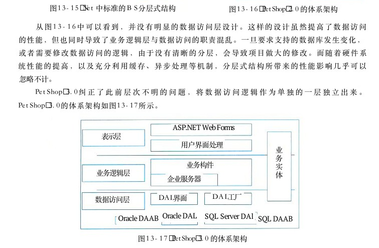

图13－17 PetShop 3．0 的体系架构

PetShop 4．0 基本上延续了 3 ． 0 的结构 ， 但在性能上作了一定的改进 ， 引入了缓存和异步处理机制 ， 同时又充分利用了 ASP．Net 2．0 的新功能 MemberShip。 因此， PetShop 4．0 的系统架构如图13－18所示。比较 3 ． 0 和 4 ． 0 的系统架构图 ， 其核心的内容并没有发生变化 。 在数据访问层 （ DAL ） 中，仍然采用DAL Interface抽象出数据访问逻辑 ， 并以DAL Factory 作为数据访问层对象的工厂模块 。 对于DAL Interface 而言 ， 分别有支持 MS － SQL 的 SQL Server DAL和支持 Oracle 的 OracleDAL 具体实现 ， 而 Model 模块则包含了数据实体对象 ， 其详细的模块结构如图 1 3 － 1 9 所示 。

<!-- PDF 第 490 页 -->

ASP.NET 2.0 CacheDependencyASP．NET窗体、用户控件、母版页、向导

## 1CacheDependency

订单处理表现层Profile Provider Membership Provider控制台应用程序CacheDependency Factory Profile Mcmbership安全、用户账户购物车、愿景TableCache登录控件用户熟悉Dependency模型业务组件对象业务逻辑层订单策略C＃业务组件分类、产品、库存、项目、订单、购物车等异步同步

Profile DALProfile DAL Messaging接口接口接口Oracle Sql数据访问层MembershipMembership工厂工厂工厂Provider Provider MSMQ OracleOracle SQL SQL Messaging

SQL 2000/2005 SQL 2000/2005SQL 2000/2005SQL 2000/2005 MSMQ Oracle 10g Oracle 10gOracle 10gOracle 10g异步订单成员数据库配置数据库订单数据库库存数据库

图 1 3 － 1 8 PetShop 4．0 的体系架构

数据访问层的接口程序集

DALFactory IDALModel

数据访问层需要使用的数据对象，也即为创建DAL对象的工厂持久层的持久对象。只有属性，没有行为

OracleDAL SQLServerDAL访问MS Sql Server数据访问Oraclc数据库。库。实现了IDAL的接口实现了IDAL的接口
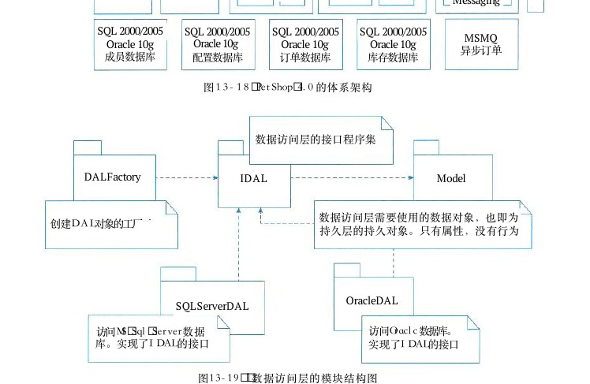

图13－19 数据访问层的模块结构图可以看到，在数据访问层中，完全采用了“面向接口编程”思想。抽象出来的 IDAL模块，脱离了与具体数据库的依赖，从而使得整个数据访问层有利于数据库迁移。 DALFactory模块

<!-- PDF 第 491 页 -->

专门管理 DAL 对象的创建，便于业务逻辑层访问。 SQL Server DAL 和 OracleDAL 模块均实现IDAL模块的接口，其中包含的逻辑就是对数据库的 Select、Insert、Update 和 Delete 操作。因为数据库类型的不同，对数据库的操作也有所不同，代码也会因此有所区别。此外，抽象出来的 IDAL 模块，除了解除了向下的依赖之外，对于其上的业务逻辑层同样仅存在弱依赖关系，如图13－20所示。

业务逻辑层对业务策略的抽象封装IBLLStrategy业务逻辑层。核心的业务代码都在本模块中BLL

IDALModel DALFactory
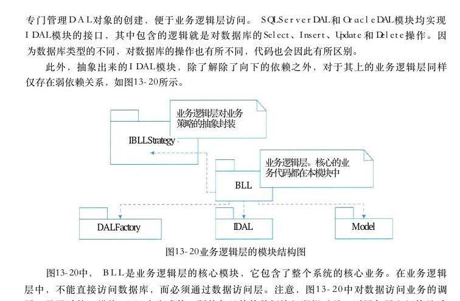

图13－20业务逻辑层的模块结构图

图13－20中， BLL 是业务逻辑层的核心模块，它包含了整个系统的核心业务。在业务逻辑层中，不能直接访问数据库，而必须通过数据访问层。注意，图13－20中对数据访问业务的调用，是通过接口模块 IDAL来完成的。既然与具体的数据访问逻辑无关，则层与层之间的关系就是松散耦合的。如果此时需要修改数据访问层的具体实现，只要不涉及 IDAL 的接口定义，那么业务逻辑层就不会受到任何影响。毕竟，具体实现的 SQL Server DAL 和 OracalDAL 根本就与业务逻辑层没有半点关系。因为在 PetShop 4．0 中引入了异步处理机制，插入订单的策略可以分为同步和异步，两者的插入策略明显不同。但对于调用者而言，插入订单的接口是完全一样的，所以 PetShop 4．0 中设计了IBLLStrategy模块 。 虽然在 IBLLStrategy 模块中，仅仅是简单的 IOrderStategy， 但同时也给出了一个范例和信息，那就是在业务逻辑的处理中，如果存在业务操作的多样化或者是今后可能的变化，均应利用抽象的原理、或者使用接口、或者使用抽象类，从而脱离对具体业务的依赖。不过在 PetShop 中，由于业务逻辑相对简单，这种思想体现得不够明显。也正因为此，PetShop 将核心的业务逻辑都放到了一个模块BLL 中，并没有将具体的实现和抽象严格地按照模块分开。所以表示层和业务逻辑Web Component层之间的调用关系，其耦合度相对较高。图13－21表示层的模块结构图中，各个层次中还引入了辅助的模块，如数据访问层的 Messaging 模块，是为异步插入订单的BLL功能提供 ， 采用了MSMQ（Microsoft Messaging Queue） 技术，而表示层的 CacheDependency 则提供缓存功能。图13－21 表示层的楼块结构

<!-- PDF 第 492 页 -->

## 13．7．2基于物联网架构的电子小票服务系统

## 1 ． 电子小票物联网架构

采用感知层 、 网络层和应用层的 3 层物联网体系架构模型 ， 电子小票物联网的架构见图13－22。

云平台小票服务云平台数据服务可视化经营小票实时推送数据管理应用历史小票查询用户精准推荐层

会员积分查询区域畅销品排名

互联网互联网电子小票云平台基础服务网络数据传输智能硬件商家管理商品管理数据存储会员管理层与处理设备管理

WiFi／GPRS传输

小票智能硬件（采集收银机待打印的购物小票）感知系统设计驱动程序控制程序层
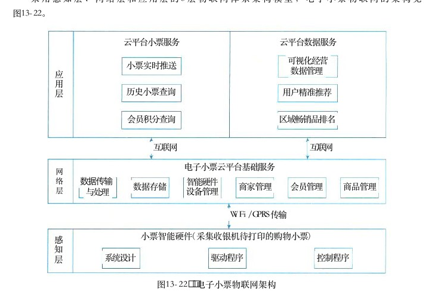

图13－22 电子小票物联网架构

感知层的小票智能硬件能够取代传统的小票打印机，在不改变商家原有收银系统的前提下，采集收银机待打印的购物小票信息 ， 通过Wi－Fi／GPRS 传输将其存储到电子小票云平台。网络层支持感知层电子小票信息的传输 、 处理和存储 ， 并为顾客和线下商家的应用提供服务支撑 ， 实现的功能为 ： 数据传输与处理 、 数据存储 、 智能硬件设备管理 、 商家管理 、 会员管理和商品管理等。应用层是电子小票服务系统与顾客 、 商家的接口 ， 包括云平台小票服务和数据服务 ： 云平台小票服务基于微信公众平台向顾客提供电子小票实时推送 、 历史小票查询和会员积分查询等服务 ； 云平台数据服务向线下零售商家提供可视化经营数据管理 、 用户精准推荐和区域畅销品排名等服务。

## 2．电子小票服务系统架构

电子小票服务系统由小票智能硬件 、 商家收银机 、 电子小票云平台 、 微信公众平台 、 消费者智能手机和商家 PC 终端构成 （ 图 1 3 － 2 3 ） 。 小票智能硬件包括 STM 3 2 控制器 、 薄膜晶体管液晶显示屏 （Thin Film Transistor Liquid Crystal Display，TFTLCD）、 字模存储 Flash 和无线模

<!-- PDF 第 493 页 -->

第 1 3 章层次式架构设计理论与实践

块 。 商家收银机不需要改变原有的收银系统 ， 只需要安装小票智能硬件的驱动程序便可以将小票智能硬件当作一台打印机 。 小票智能硬件首先接收待打印的购物小票数据和打印命令 ， 经过数据完整性判断后通过串行外设接口 （Serial Peripheral Interface，SPI） 总线读取数据的字模信息 ， 然后用通用输入 ／ 输出接口 （General Purpose Input ／Output，GPIO） 模拟 8 0 8 0 总线将数据在 TFTLCD 屏中显示 ； 同时将购物小票数据通过无线模块 （ Wi － Fi ／ GPRS ） 上传至电子小票云平台。云平台通过微信公众平台将电子小票实时推送到消费者微信应用中。

小票智能硬件微信电子小票字模存储Flash无线模块云平台，公众平台Wi-Fi/SPI[GPRS串口

GPIO STM32TFTLCD屏控制器消费者商家智能手机USB转串口PC终端

商家收银机图13－23 电子小票服务系统结构框图
