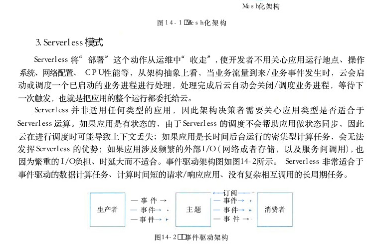
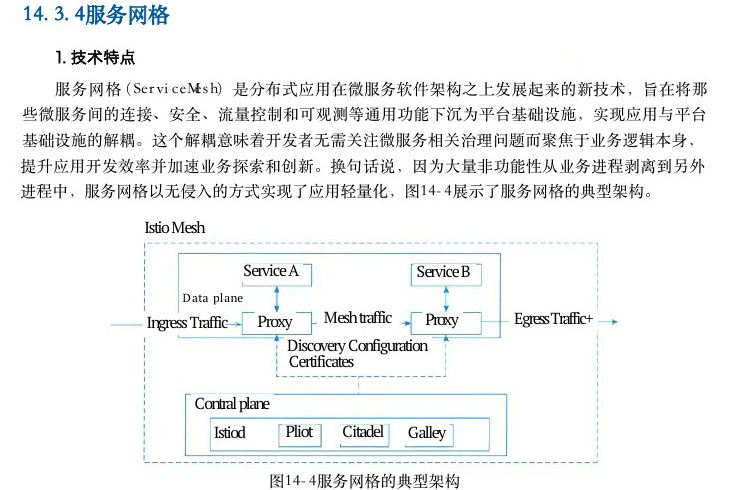
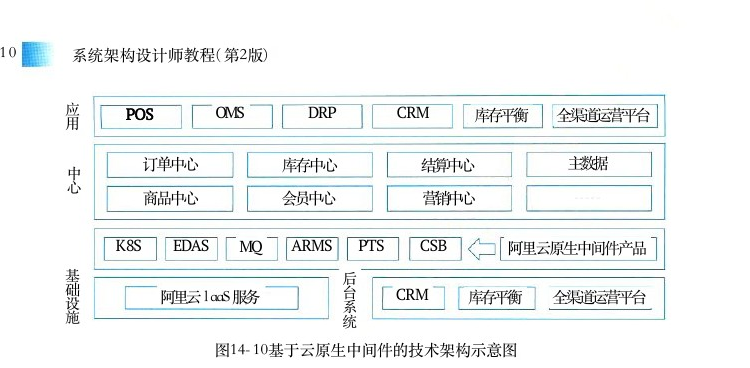

# 第14章 云原生架构设计理论与实践

> 本页为教材原文文字提取版。图示已按 PDF 页面裁剪并插入正文图注前。

<!-- PDF 第 494 页 -->

云原生 （Cloud Native） 是近几年云计算领域炙手可热的话题，云原生技术已成为驱动业务增长的重要引擎。同时，作为新型基础设施的重要支撑技术，云原生也逐渐在人工智能、大数据、边缘计算、5G 等新兴领域崭露头角。伴随各行业上云的逐步深化，云原生化转型进程将进一步加速。本章主要介绍了云原生背景、定义、架构以及相关云原生技术等方面知识。

## 14．1 云原生架构产生背景

“云原生”来自于 Cloud Native 的直译，拆开来看， Cloud 就是指其应用软件是在云端而非传统的数据中心。 Native代表应用软件从一开始就是基于云环境、专门为云端特性而设计，可充分利用和发挥云平台的弹性＋分布式优势，最大化释放云计算生产力。对于原来的企业而言，企业内部 IT建设以“烟筒”模式比较多，每个部门甚至每个应用都相对独立，如何管理与分配资源成了难题。大多数都基于最底层 IDC 设施独自向上构建，需要单独分配硬件资源，这就造成资源被大量占用且难以被共享。但是上云之后，由于云厂商提供了统一的 IaaS 能力和云服务，大幅提升了企业 IaaS 层的复用程度， CIO 或者 IT主管自然而然想到 IaaS 以上层的系统也需要被统一，使资源、产品可被不断复用，从而能够进一步降低企业运营成本。对于开发而言，传统的 IT架构方式，将开发、 IT 运营和质量保障分别设置，各自独立，开发与运营之间存在着信息“鸿沟”，开发人员希望基础设施更快响应，运营人员则要求系统的可靠性和安全性，而业务需求则是更快地将更多的特性发布给最终用户使用。这种模式被称为“瀑布式流程”的开发模式，一方面造成了开发上下游的信息不对称，一方面拉长了开发周期和调整难度。但是随着用户需求的快速增加和产品迭代周期的不断压缩，原有的开发流程不再适合现实的需求，这时工程师们引入了一种新的开发模式——敏捷开发。但是，敏捷开发只是解决了软件开发的效率和版本更新的速度，还没有和运维打通。出于协调开发和运维的“信息对称”问题，开发者又推出了一套新的方法——DevOps，DevOps可以看作是开发、技术运营和质量保障三者的交集，促进之间的沟通、协作与整合，从而提高开发周期和效率。而云原生的容器、微服务等技术正是为 DevOps提供了很好的前提条件，保证 IT 软件开发实现 DevOps 开发和持续交付的关键应用。换句话说，能够实现 DevOps 和持续交付，已经成为云原生技术价值不可分割的内涵部分，这也是无论互联网巨头企业，还是众多中小应用开发公司和个人，越来越多选择云原生技术和工具的原因。现在数以亿计的高并发流量都得益于云原生技术的快速弹性扩容来实现。而对于企业而言，选择云原生技术，也就不仅仅是降本增效的考虑，而且还能为企业创造过去难以想象的业务承载量，对于企业业务规模和业务创新来说，云原生技术都正在成为全新的生产力工具。过去企

<!-- PDF 第 495 页 -->

业看重的办公楼、厂房、 IT 设施等有形资产，其重要性也逐渐被这些云端数字资产所超越，企业正通过云原生构建一个完整的数字孪生的新体系，而这才是云原生技术的真正价值所在。所有这些问题都指向一个共同点，那就是云的时代需要新的技术架构，来帮助企业应用能够更好地利用云计算优势，充分释放云计算的技术红利，让业务更敏捷、成本更低的同时又可伸缩性更灵活，而这些正好就是云原生架构专注解决的技术点。对于整个云计算产业的发展本身来说，云原生区别于早先的虚拟机阶段，也完成了一次全新的技术生产力变革，是从云技术的应用特性和交付架构上进行了创新性的组合，能够极大地释放云计算的生产能力。此外，云原生的变革从一开始自然而然地与开源生态走在了一起，也意味着云原生技术从一开始就选择了一条“飞轮进化”式的道路，通过技术的易用性和开放性实现快速增长的正向循环，又通过不断壮大的应用实例来推动了企业业务全面上云和自身技术版图的不断完善。云原生所带来的种种好处，对于企业的未来业务发展的优势，已经成为众多企业的新共识。可以预见，更多企业在经历了这一轮云原生的变革之痛后，能够穿越企业的原有成长周期，跨越到数字经济的新赛道，在即将到来的全面云化的数字时代更好地开发业务。开源项目的不断更新和逐步成熟，也促使各企业在Al、 大数据、边缘、高性能计算等新兴业务场景不断采用云原生技术来构建创新解决方案。大量企业尝试使用容器替换现有人工智能、大数据的基础平台，通过容器更小粒度的资源划分、更快的扩容速度、更灵活的任务调度，以及天然的计算与存储分离架构等特点，助力人工智能、大数据在业务性能大幅提升的同时，更好地控制成本。各云厂商也相继推出了对应的容器化服务，比如华为云的 AI 容器、大数据容器， AWS 的深度学习容器等。云原生技术与边缘计算相结合，可以比较好地解决传统方案中轻量化、异构设备管理、海量应用运维管理的难题，如目前国内最大的边缘计算落地项目——国家路网中心的全国高速公路取消省界收费站项目，就使用了基于云原生技术的边缘计算解决方案，解决了10万＋异构设备管理、30多万边缘应用管理的难题。主流的云计算厂商也相继推出了云原生边缘计算解决方案，如华为云智能边缘平台 IEF 、 AWS 的 GreenGrass、 阿里云的 ACK ＠ Edge 等等。云原生在高性能计算 （ HPC ） 领域的应用呈现出快速上升的势头。云原生在科研及学术机构、生物、制药等行业率先得到应用，例如欧洲核子研究中心 （CERN）、 中国科学院上海生命科学研究院、中国农业大学、华大基因、未来组等单位都已经将传统的高性能计算业务升级为云原生架构。为了更好地支撑高性能计算场景，各云计算厂商也纷纷推出面向高性能计算专场的云原生解决方案。云原生与商业场景的深度融合，不仅为各行业注入了发展与创新的新动能，也促使云原生技术更快发展、生态更加成熟，主要表现为以下几点：

（1）从为企业带来的价值来看，云原生架构有着以下优势通过对多元算力的支持，满足不同应用场景的个性化算力需求，并基于软硬协同架构，为应用提供极致性能的云原生算力；基于多云治理和边云协同，打造高效、高可靠的分布式泛在计算平台，并构建包括容器、裸机、虚机、函数等多种形态的统一计算资源；以“应用”为中心打造高效的资源调度和管理平台，为企业提供一键式部署、可感知应用的智能化调度，以及全方位监控与运维能力。

（2）通过最新的DevSecOps应用开发模式，实现了应用的敏捷开发，提升业务应用的迭代

<!-- PDF 第 496 页 -->

速度，高效响应用户需求，并保证全流程安全。对于服务的集成提供侵入和非侵入两种模式辅助企业应用架构升级，同时实现新老应用的有机协同，立而不破。

（3）帮助企业管理好数据，快速构建数据运营能力，实现数据的资产化沉淀和价值挖掘，并借助一系列 AI 技术，再次赋能给企业应用，结合数据和 AI 的能力帮助企业实现业务的智能升级。

（4）结合云平台全方位企业级安全服务和安全合规能力，保障企业应用在云上安全构建，业务安全运行。

## 14．2 云原生架构内涵

关于云原生的定义有众多版本，云原生架构的理解也不尽相同，本书将根据广泛的云原生技术、产品和上云实践，给出一般性的理解。

## 14．2．1云原生架构定义

从技术的角度，云原生架构是基于云原生技术的一组架构原则和设计模式的集合，旨在将云应用中的非业务代码部分进行最大化的剥离，从而让云设施接管应用中原有的大量非功能特性（如弹性、韧性、安全、可观测性、灰度等），使业务不再有非功能性业务中断困扰的同时，具备轻量、敏捷、高度自动化的特点。由于云原生是面向“云”而设计的应用，因此，技术部分依赖于传统云计算的3层概念，即基础设施即服务 （IaaS）、 平台即服务 （PaaS） 和软件即服务 （SaaS）。云原生的代码通常包括三部分：业务代码、三方软件、处理非功能特性的代码。其中“业务代码”指实现业务逻辑的代码；“三方软件”是业务代码中依赖的所有三方库，包括业务库和基础库；“处理非功能性的代码”指实现高可用、安全、可观测性等非功能性能力的代码。三部分中只有业务代码是核心，是对业务真正带来价值的，另外两个部分都只算附属物，但是，随着软件规模的增大、业务模块规模变大、部署环境增多、分布式复杂性增强，使得今天的软件构建变得越来越复杂，对开发人员的技能要求也越来越高。云原生架构相比较传统架构进了一大步，从业务代码中剥离大量非功能性特性（不会是所有，比如易用性还不能剥离）到 IaaS 和PaaS 中，从而减少业务代码开发人员的技术关注范围，通过云厂商的专业性提升应用的非功能性能力。此外，具备云原生架构的应用可以最大程度利用云服务和提升软件交付能力，进一步加快软件开发。

## 1．代码结构发生巨大变化

云原生架构产生的最大影响就是让开发人员的编程模型发生了巨大变化。今天大部分的编程语言中，都有文件、网络、线程等元素，这些元素为充分利用单机资源带来好处的同时，也提升了分布式编程的复杂性；因此大量框架、产品涌现，来解决分布式环境中的网络调用问题、高可用问题、 CPU 争用问题、分布式存储问题，等等。

<!-- PDF 第 497 页 -->

在云的环境中，“如何获取存储”变成了若干服务，包括对象存储服务、块存储服务和没有随机访问的文件存储服务。云不仅改变了开发人员获得这些存储能力的界面，还在于云产品解决了分布式场景中的各种挑战，包括高可用挑战、自动扩缩容挑战、安全挑战、运维升级挑战等，应用的开发人员不用在其代码中处理节点宕机前如何把本地保存的内容同步到远端的问题，也不用处理当业务峰值到来时如何对存储节点进行扩容的问题，而应用的运维人员不用在发现zeroday 安全问题时紧急对三方存储软件进行升级。云把三方软硬件的能力升级成了服务，开发人员的开发复杂度和运维人员的运维工作量都得到极大降低。显然，如果这样的云服务用得越多，那么开发和运维人员的负担就越少，企业在非核心业务实现上从必须的负担变成了可控支出。在一些开发能力强的公司中，对这些三方软硬件能力的处理往往是交给应用框架（或者说公司内自己的中间件）来做的；在云的时代云厂商提供了更具SLA 的服务，使得所有软件公司都可以由此获益。这些使得业务代码的开发人员技能栈中，不再需要掌握文件及其分布式处理技术，不再需要掌握各种复杂的网络技术，简化让业务开发变得更敏捷、更快速。

## 2．非功能性特性大量委托

任何应用都提供两类特性，功能性特性和非功能性特性。功能性特性是真正为业务带来价值的代码，比如建立客户资料、处理订单、支付等；即使是一些通用的业务功能特性，比如组织管理、业务字典管理、搜索等也是紧贴业务需求的。非功能性特性是没有给业务带来直接业务价值，但通常又是必不可少的特性，比如高可用能力、容灾能力、安全特性、可运维性、易用性、可测试性、灰度发布能力等。云计算虽然没有解决所有非功能性问题，但确实有大量非功能性，特别是分布式环境下复杂非功能性问题，被云产品解决了。以大家最头疼的高可用为例，云产品在多个层面为应用提供了解决方案。虚拟机：当虚拟机检测到底层硬件发生异常时，自动帮助应用做热迁移，迁移后的应用不需重新启动而仍然具备对外服务的能力，应用对整个迁移过程都不会有任何感知。容器：有时应用所在的物理机是正常的，只是应用自身的问题（比如 bug、 资源耗尽等）而无法正常对外提供服务。容器通过监控检查探测到进程状态异常，从而实施异常节点的下线、新节点上线和生产流量的切换等操作，整个过程自动完成而无需运维人员干预。云服务：如果应用把“有状态”部分都交给了云服务（如缓存、数据库、对象存储等），加上全局对象的持有小型化或具备从磁盘快速重建能力，由于云服务本身是具备极强的高可用能力，那么应用本身会变成更薄的“无状态”应用，高可用故障带来的业务中断会降至分钟级；如果应用是N － M 的对等架构模式，那么结合负载均衡产品可获得很强的高可用能力。

## 3．高度自动化的软件交付

软件一旦开发完成，需要在公司内外部各类环境中部署和交付，以将软件价值交给最终客户。软件交付的困难在于开发环境到生产环境的差异（公司环境到客户环境之间的差异）以及软件交付和运维人员的技能差异，填补这些差异的是一大堆安装手册、运维手册和培训文档。容器以一种标准的方式对软件打包，容器及相关技术则帮助屏蔽不同环境之间的差异，进而基

<!-- PDF 第 498 页 -->

于容器做标准化的软件交付。对自动化交付而言，还需要一种能够描述不同环境的工具，让软件能够“理解”目标环境、交付内容、配置清单并通过代码去识别目标环境的差异，根据交付内容以“面向终态”的方式完成软件的安装、配置、运行和变更。基于云原生的自动化软件交付相比较当前的人工软件交付是一个巨大的进步。以微服务为例，应用微服务化以后，往往被部署到成千上万个结点上，如果系统不具备高度的自动化能力，任何一次新业务的上线，都会带来极大的工作量挑战，严重时还会导致业务变更超过上线窗口而不可用。

## 14．2．2云原生架构原则

云原生架构本身作为一种架构，也有若干架构原则作为应用架构的核心架构控制面，通过遵从这些架构原则可以让技术主管和架构师在做技术选择时不会出现大的偏差。

## 1．服务化原则

当代码规模超出小团队的合作范围时，就有必要进行服务化拆分了，包括拆分为微服务架构、小服务 （MiniService） 架构，通过服务化架构把不同生命周期的模块分离出来，分别进行业务迭代，避免迭代频繁模块被慢速模块拖慢，从而加快整体的进度和稳定性。同时服务化架构以面向接口编程，服务内部的功能高度内聚，模块间通过公共功能模块的提取增加软件的复用程度。分布式环境下的限流降级、熔断隔仓、灰度、反压、零信任安全等，本质上都是基于服务流量（而非网络流量）的控制策略，所以云原生架构强调使用服务化的目的还在于从架构层面抽象化业务模块之间的关系，标准化服务流量的传输，从而帮助业务模块进行基于服务流量的策略控制和治理，不管这些服务是基于什么语言开发的。

## 2．弹性原则

大部分系统部署上线需要根据业务量的估算，准备一定规模的机器，从提出采购申请，到供应商洽谈、机器部署上电、软件部署、性能压测，往往需要好几个月甚至一年的周期；而这期间如果业务发生变化了，重新调整也非常困难。弹性则是指系统的部署规模可以随着业务量的变化而自动伸缩，无须根据事先的容量规划准备固定的硬件和软件资源。好的弹性能力不仅缩短了从采购到上线的时间，让企业不用操心额外软硬件资源的成本支出（闲置成本），降低了企业的 IT成本，更关键的是当业务规模面临海量突发性扩张的时候，不再因为平时软硬件资源储备不足而“说不”，保障了企业收益。

## 3．可观测原则

大部分企业的软件规模都在不断增长，原来单机可以对应用做完所有调试，但在分布式环境下需要对多个主机上的信息做关联，才可能回答清楚服务为什么宕机，哪些服务违反了其定义的 SLO（Service Level Objective， 服务等级目标），目前的故障影响哪些用户，最近这次变更对哪些服务指标带来了影响等问题，这些都要求系统具备更强的可观测能力。可观测性与监控、

<!-- PDF 第 499 页 -->

业务探活、 APM 等系统提供的能力不同，前者是在云这样的分布式系统中，主动通过日志、链路跟踪和度量等手段，使得一次点击背后的多次服务调用的耗时、返回值和参数都清晰可见，甚至可以下钻到每次三方软件调用、 SQL 请求、节点拓扑、网络响应等，这样的能力可以使运维、开发和业务人员实时掌握软件运行情况，并结合多个维度的数据指标，获得前所未有的关联分析能力，不断对业务健康度和用户体验进行数字化衡量和持续优化。

## 4．韧性原则

当业务上线后，最不能接受的就是业务不可用，让用户无法正常使用软件，影响体验和收入。韧性代表了当软件所依赖的软硬件组件出现各种异常时，软件表现出来的抵御能力，这些异常通常包括硬件故障、硬件资源瓶颈（如 CPU ／ 网卡带宽耗尽）、业务流量超出软件设计能力、影响机房工作的故障和灾难、软件bug、 黑客攻击等对业务不可用带来致命影响的因素。韧性从多个维度诠释了软件持续提供业务服务的能力，核心目标是提升软件的平均无故障时间 （Mean Time Between Failure，MTBF）。 从架构设计上，韧性包括服务异步化能力、重试／限流／降级／熔断／反压、主从模式、集群模式、 AZ 内的高可用、单元化、跨 region 容灾、异地多活容灾等。

## 5．所有过程自动化原则

技术往往是把“双刃剑”，容器、微服务、 DevOps、 大量第三方组件的使用，在降低分布式复杂性和提升迭代速度的同时，因为整体增大了软件技术栈的复杂度和组件规模，所以不可避免地带来了软件交付的复杂性，如果这里控制不当，应用就无法体会到云原生技术的优势 。 通过 IaC（Infrastructure as Code）、GitOps、OAM（Open Application Model）、KubernetesOperator 和大量自动化交付工具在 CI／CD 流水线中的实践，一方面标准化企业内部的软件交付过程，另一方面在标准化的基础上进行自动化，通过配置数据自描述和面向终态的交付过程，让自动化工具理解交付目标和环境差异，实现整个软件交付和运维的自动化。

## 6．零信任原则

零信任安全针对传统边界安全架构思想进行了重新评估和审视，并对安全架构思路给出了新建议。其核心思想是，默认情况下不应该信任网络内部和外部的任何人／设备／系统，需要基于认证和授权重构访问控制的信任基础，诸如 IP地址、主机、地理位置、所处网络等均不能作为可信的凭证。零信任对访问控制进行了范式上的颠覆，引导安全体系架构从“网络中心化”走向“身份中心化”，其本质诉求是以身份为中心进行访问控制。零信任第一个核心问题就是身份 （Identity）， 赋予不同的实体不同的身份，解决是谁在什么环境下访问某个具体的资源的问题。在研发、测试和运维微服务场景下，身份及其相关策略不仅是安全的基础，更是众多（资源、服务、环境）隔离机制的基础；在员工访问企业内部应用的场景下，身份及其相关策略提供了即时的接入服务。

## 7．架构持续演进原则

今天技术和业务的演进速度非常快，很少有一开始就清晰定义了架构并在整个软件生命周

<!-- PDF 第 500 页 -->

期里面都适用，相反往往还需要对架构进行一定范围内的重构，因此云原生架构本身也必须是一个具备持续演进能力的架构，而不是一个封闭式架构。除了增量迭代、目标选取等因素外，还需要考虑组织（例如架构控制委员会）层面的架构治理和风险控制，特别是在业务高速迭代情况下的架构、业务、实现平衡关系。云原生架构对于新建应用而言的架构控制策略相对容易选择（通常是选择弹性、敏捷、成本的维度），但对于存量应用向云原生架构迁移，则需要从架构上考虑遗留应用的迁出成本／风险和到云上的迁入成本／风险，以及技术上通过微服务／应用网关、应用集成、适配器、服务网格、数据迁移、在线灰度等应用和流量进行细颗粒度控制。

## 14．2．3主要架构模式

云原生架构有非常多的架构模式，这里选取一些对应用收益更大的主要架构模式进行讨论。

## 1．服务化架构模式

服务化架构是云时代构建云原生应用的标准架构模式，要求以应用模块为颗粒度划分一个软件，以接口契约（例如 IDL） 定义彼此业务关系，以标准协议 （HTTP、gRPC 等 ） 确保彼此的互联互通，结合 DDD （领域模型驱动）、 TDD （测试驱动开发）、容器化部署提升每个接口的代码质量和迭代速度。服务化架构的典型模式是微服务和小服务模式，其中小服务可以看作是一组关系非常密切的服务的组合，这组服务会共享数据，小服务模式通常适用于非常大型的软件系统，避免接口的颗粒度太细而导致过多的调用损耗（特别是服务间调用和数据一致性处理）和治理复杂度。通过服务化架构，把代码模块关系和部署关系进行分离，每个接口可以部署不同数量的实例，单独扩缩容，从而使得整体的部署更经济。此外，由于在进程级实现了模块的分离，每个接口都可以单独升级，从而提升了整体的迭代效率。但也需要注意，服务拆分导致要维护的模块数量增多，如果缺乏服务的自动化能力和治理能力，会让模块管理和组织技能不匹配，反而导致开发和运维效率的降低。

## 2． Mesh化架构模式

Mesh化架构是把中间件框架（如 RPC、 缓存、异步消息等）从业务进程中分离，让中间件SDK与业务代码进一步解耦，从而使得中间件升级对业务进程没有影响，甚至迁移到另外一个平台的中间件也对业务透明。分离后在业务进程中只保留很“薄”的 Client部分， Client通常很少变化，只负责与 Mesh 进程通信，原来需要在 SDK 中处理的流量控制、安全等逻辑由 Mesh进程完成。整个架构如图14－1所示。实施 Mesh化架构后 ， 大量分布式架构模式 （ 熔断 、 限流 、 降级 、 重试 、 反压 、 隔仓……）都由 Mesh进程完成，即使在业务代码的制品中并没有使用这些三方软件包；同时获得更好的安全性（比如零信任架构能力）、按流量进行动态环境隔离、基于流量做冒烟／回归测试等。

<!-- PDF 第 501 页 -->

第 1 4 章云原生架构设计理论与实践

业务进程业务进程业务代码业务代码RPCDB MQ Redis SDKSDKSDKSDK Redis RPC DB MQ SDKSDKSDKSDKSDK协议、标准协议

Mesh进程（流量控制、安全策略、微隔离……）SDK协议

新协议、加密、染色……网络

传统架构网络

Mesh化架构图 1 4 － 1 Mesh化架构

## 3．Serverless模式

Serverless 将“部署”这个动作从运维中“收走”，使开发者不用关心应用运行地点、操作系统、网络配置、 CPU 性能等，从架构抽象上看，当业务流量到来／业务事件发生时，云会启动或调度一个已启动的业务进程进行处理，处理完成后云自动会关闭／调度业务进程，等待下一次触发，也就是把应用的整个运行都委托给云。Serverless 并非适用任何类型的应用，因此架构决策者需要关心应用类型是否适合于Serverless运算。如果应用是有状态的，由于 Serverless 的调度不会帮助应用做状态同步，因此云在进行调度时可能导致上下文丢失；如果应用是长时间后台运行的密集型计算任务，会无法发挥 Serverless 的优势；如果应用涉及频繁的外部 I／O （网络或者存储，以及服务间调用），也因为繁重的 I／O 负担、时延大而不适合。事件驱动架构图如图14－2所示。 Serverless 非常适合于事件驱动的数据计算任务、计算时间短的请求／响应应用、没有复杂相互调用的长周期任务。

←—订阅——— 事件 →—事件→生产者主题消费者—事件→—事件→— 事件 →— 事件→

图14－2 事件驱动架构

## 4．存储计算分离模式

分布式环境中的 CAP 困难主要是针对有状态应用，因为无状态应用不存在 C （一致性）这个维度，因此可以获得很好的 A （ 可用性 ） 和P （分区容错性），因而获得更好的弹性。在云环境中，推荐把各类暂态数据（如 session）、 结构化和非结构化持久数据都采用云服务来保存，从而实现存储计算分离。但仍然有一些状态如果保存到远端缓存，会造成交易性能的明显下降

<!-- PDF 第 502 页 -->

比如交易会话数据太大、需要不断根据上下文重新获取等，这时可以考虑通过采用时间日志＋快照（或检查点）的方式，实现重启后快速增量恢复服务，减少不可用对业务的影响时长。

## 5．分布式事务模式

微服务模式提倡每个服务使用私有的数据源，而不是像单体这样共享数据源，但往往大颗粒度的业务需要访问多个微服务，必然带来分布式事务问题，否则数据就会出现不一致。架构师需要根据不同的场景选择合适的分布式事务模式。

（1）传统采用 XA 模式，虽然具备很强的一致性，但是性能差。

（2）基于消息的最终一致性 （ BASE ） 通常有很高的性能，但是通用性有限。（ 3 ） TCC模式完全由应用层来控制事务，事务隔离性可控，也可以做到比较高效；但是对业务的侵入性非常强，设计开发维护等成本很高。（ 4 ） SAGA 模式与 TCC 模式的优缺点类似但没有 try这个阶段，而是每个正向事务都对应一个补偿事务，也是开发维护成本高。

（5）开源项目 SEATA 的 AT 模式非常高性能且无代码开发工作量，且可以自动执行回滚操作，同时也存在一些使用场景限制。

## 6．可观测架构

可观测架构包括Logging、Tracing、Metrics 三个方面，其中 Logging提供多个级别 （verbose／debug／warning／error／fatal） 的详细信息跟踪，由应用开发者主动提供； Tracing 提供一个请求从前端到后端的完整调用链路跟踪，对于分布式场景尤其有用；Metrics 则提供对系统量化的多维度度量。架构决策者需要选择合适的、支持可观测的开源框架（比如Open Tracing、Open Telemetry等），并规范上下文的可观测数据规范（例如方法名、用户信息、地理位置、请求参数等），规划这些可观测数据在哪些服务和技术组件中传播，利用口志和 tracing 信息中的 spanid／traceid，确保进行分布式链路分析时有足够的信息进行快速关联分析。由于建立可观测性的主要目标是对服务 SLO（Service Level Objective） 进行度量，从而优化SLA， 因此架构设计上需要为各个组件定义清晰的 SLO， 包括并发度、耗时、可用时长、容量等。

## 7．事件驱动架构

事件驱动架构 （EDA，Event Driven Architecture） 本质上是一种应用／组件间的集成架构模式。事件和传统的消息不同，事件具有 schema， 所以可以校验 event的有效性，同时EDA 具备QoS 保障机制，也能够对事件处理失败进行响应。事件驱动架构不仅用于（微）服务解耦，还可应用于下面的场景中。

（1）增强服务韧性：由于服务间是异步集成的，也就是下游的任何处理失败甚至宕机都不会被上游感知，自然也就不会对上游带来影响。

（2）CQRS（Command Query Responsibility Segregation）： 把对服务状态有影响的命令用事件来发起，而对服务状态没有影响的查询才使用同步调用的API 接口；结合 EDA 中的 Event

<!-- PDF 第 503 页 -->

Sourcing机制可以用于维护数据变更的一致性，当需要重新构建服务状态时，把EDA 中的事件重新“播放”一遍即可。

（3）数据变化通知：在服务架构下，往往一个服务中的数据发生变化，另外的服务会感兴趣，比如用户订单完成后，积分服务、信用服务等都需要得到事件通知并更新用户积分和信用等级。

（4）构建开放式接口：在EDA 下，事件的提供者并不用关心有哪些订阅者，不像服务调用的场景——数据的产生者需要知道数据的消费者在哪里并调用它，因此保持了接口的开放性。

（5）事件流处理：应用于大量事件流（而非离散事件）的数据分析场景，典型应用是基于Kafka 的日志处理。基于事件触发的响应：在 IoT 时代大量传感器产生的数据，不会像人机交互一样需要等待处理结果的返回，天然适合用 EDA来构建数据处理应用。

## 14．2．4典型的云原生架构反模式

技术往往像一把双刃剑，企业做云原生架构演进的时候，会充分考虑根据不同的场景选择不同的技术，下面是一些典型云原生架构反模式。

## 1．庞大的单体应用

庞大单体应用的最大问题在于缺乏依赖隔离，包括代码耦合带米的责任不清、模块间接口缺乏治理而带来变更影响扩散、不同模块间的开发进度和发布时间要求难以协调、一个子模块不稳定导致整个应用都变慢、扩容时只能整体扩容而不能对达到瓶颈的模块单独扩容等。因此当业务模块可能存在多人开发的时候，就需要考虑通过服务化进行一定的拆分，梳理聚合根，通过业务关系确定主要的服务模块以及这些模块的边界、清晰定义模块之间的接口，并让组织关系和架构关系匹配。

## 2．单体应用“硬拆”为微服务

服务的拆分需要适度，过分服务化拆分反而会导致新架构与组织能力的不匹配，让架构升级得不到技术红利，典型的例子包括：

（1）小规模软件的服务拆分：软件规模不大，团队人数也少，但是为了微服务化，强行把耦合度高、代码量少的模块进行服务化拆分，一次性的发布需要拆分为多个模块分开发布和维护。

（2）数据依赖：服务虽然拆分为多个，但是这些服务的数据是紧密耦合的，于是让这些服务共享数据库，导致数据的变化往往被扇出到多个服务中，造成服务间数据依赖。

（3）性能降低：当耦合性很强的模块被拆分为多个微服务后，原来的本地调用变成了分布式调用，从而让响应时间变大了上千倍，导致整个服务链路性能急剧下降。

## 3．缺乏自动化能力的微服务

软件架构中非常重要的一个维度就是处理软件复杂度问题，一旦问题规模提升了很多，那就必须重新考虑与之适应的新方案。在很多软件组织中，开发、测试和运维的工作单位都是以进程为单位，比如把整个用户管理作为一个单独的模块进行打包、发布和运行；而进行了微服

<!-- PDF 第 504 页 -->

务拆分后，这个用户管理模块可能被分为用户信息管理、基本信息管理、积分管理、订单管理等多个模块，由于仍然是每个模块分别打包、发布和运行，开发、测试和运维人员的人均负责模块数就会直线上升，造成了人均工作量增大，也就增加了软件的开发成本。实际上，当软件规模进一步变大后，自动化能力的缺失还会带来更大的危害。由于接口增多会带来测试用例的增加，更多的软件模块排队等待测试和发布，如果缺乏自动化会造成软件发布时间变长，在多环境发布或异地发布时更是需要专家来处理环境差异带来的影响。同时更多的进程运行于一个环境中，缺乏自动化的人工运维容易给环境带来不可重现的影响，而一旦发生人为运维错误又不容易“快速止血”，造成了故障处理时间变长，以及使得日常运维操作都需要专家才能完成。所有这些问题都会导致软件交付时间变长、风险提升以及运维成本的增加。

## 14．3 云原生架构相关技术

## 14．3．1容器技术

## 1．容器技术的背景与价值

容器作为标准化软件单元，它将应用及其所有依赖项打包，使应用不再受环境限制，在不同计算环境间快速、可靠地运行。容器部署模式与其他模式的比较如图14－3所示。

APP APPAPPAPPApp AppApp Bin/Library Bin/LibraryBin/Library Bin/Library Bin/Library ContainerContainer Container Operating SystemOperating System Container Runtime APPAPPVirtual MachineVirtual Machine APP

Operating SystemOperating System Operating System

HardWareHardWareHardWare Traditional Deployment Container Deploymeni Virtualized Deployment图14－3传统、虚拟化、容器部署模式比较

虽然2008年Linux提供了Cgroups资源管理机制、 Linux Name Space视图隔离方案，让应用得以运行在独立沙箱环境中，避免相互间冲突与影响；但直到 Docker 容器引擎的开源，才很大程度上降低了容器技术的使用复杂性，加速了容器技术普及。 Docker 容器基于操作系统虚拟化技术，共享操作系统内核、轻量、没有资源损耗、秒级启动，极大提升了系统的应用部署密度和弹性。更重要的是， Docker提出了创新的应用打包规范——Docker 镜像，解耦了应用与运行环境，使应用可以在不同计算环境一致、可靠地运行。借助容器技术呈现了一个优雅的抽象场景：让开发所需要的灵活性、开放性和运维所关注的标准化、自动化达成相对平衡。容器镜像迅速成为了应用分发的工业标准。随后开源的 Kubernetes， 凭借优秀的开放性、可扩展性以及活跃开发者社区，在容器编排

<!-- PDF 第 505 页 -->

之战中脱颖而出，成为分布式资源调度和自动化运维的事实标准。 Kubernetes 屏蔽了 IaaS层基础架构的差异并凭借优良的可移植性，帮助应用一致地运行在包括数据中心、云、边缘计算在内的不同环境。企业可以通过 Kubernetes， 结合自身业务特征来设计自身云架构，从而更好地支持多云／混合云，免去被厂商锁定的顾虑。伴随着容器技术逐步标准化，进一步促进了容器生态的分工和协同。基于 Kubernetes， 生态社区开始构建上层的业务抽象，比如服务网格 Istio、机器学习平台Kubeflow、 无服务器应用框架 Knative等。在过去几年，容器技术获得了越发广泛的应用的同时，三个核心价值最受用户关注：敏捷弹性可移植性容器技术提升企业IT架构敏捷性的同时，让业务迭代更加迅捷，为创新探索提供了坚实的技术保障。比如疫情期间，教育、视频、公共健康等行业的在线化需求突现爆发性高速增长，很多企业通过容器技术适时把握了突如其来的业务快速增长机遇。据统计，使用容器技术可以获得3￣10倍交付效率提升，这意味着企业可以更快速地迭代产品，更低成本进行业务试错。在互联网时代，企业IT 系统经常需要面对促销活动、突发事件等各种预期内外的爆发性流量增长。通过容器技术，企业可以充分发挥云计算弹性优势，降低运维成本。一般而言，借助容器技术，企业可以通过部署密度提升和弹性降低50％的计算成本。以在线教育行业为例，面对疫情之下指数级增长的流量，教育信息化应用工具提供商希沃 （Seewo） 利用阿里云容器服务ACK和弹性容器实例 ECI 大大满足了快速扩容的迫切需求，为数十万名老师提供了良好的在线授课环境，帮助百万学生进行在线学习。容器已经成为应用分发和交付的标准技术，将应用与底层运行环境进行解耦； Kubernetes成为资源调度和编排的标准，屏蔽了底层架构差异性，帮助应用平滑运行在不同基础设施上。 CNCF云原生计算基金会推出了Kubernetes 一致性认证，进一步保障了不同 K8s 实现的兼容性，这也让企业愿意采用容器技术来构建云时代应用基础设施。

## 2．容器编排

Kubernetes 已经成为容器编排的事实标准，被广泛用于自动部署，扩展和管理容器化应用。Kubernetes 提供了分布式应用管理的核心能力。

● 资源调度：根据应用请求的资源量CPU、Memory， 或者GPU等设备资源，在集群中选择合适的节点来运行应用。

● 应用部署与管理：支持应用的自动发布与应用的回滚，以及与应用相关的配置的管理；也可以自动化存储卷的编排，让存储卷与容器应用的生命周期相关联。

● 自动修复： Kubernetes能监测这个集群中所有的宿主机，当宿主机或者OS出现故障，节点健康检查会自动进行应用迁移； K 8 s也支持应用的自愈，极大简化了运维管理的复杂性。

● 服务发现与负载均衡：通过Service资源出现各种应用服务，结合DNS和多种负载均衡机制，支持容器化应用之间的相互通信。

● 弹性伸缩： K8s可以监测业务上所承担的负载，如果这个业务本身的CPU利用率过高，或者响应时间过长，它可以对这个业务进行自动扩容。Kubernetes 的控制平面包含四个主要的组件： APIServer、Controller、Scheduler 以及 etcd。

● 声明式API： 开发者可以关注于应用自身，而非系统执行细节。比如Deployment （无状

<!-- PDF 第 506 页 -->

态应用）、 StatefulSet （有状态应用）、 Job （任务类应用）等不同资源类型，提供了对不同类型工作负载的抽象；对Kubernetes实现而言，基于声明式API的 “level－triggered”实现比 “edge－triggered” 方式可以提供更加健壮的分布式系统实现。

● 可扩展性架构：所有组件都是基于一致的、开放的实现和交互；三方开发者也可K8sAPI通过CRD（Custom Resource Definition）／Operator等方法提供领域相关的扩展实现，极大提升了 K8s的能力。

● 可移植性：通过一系列抽象如（负载均衡服务）、（容器网K8sLoad Balance ServiceCNI络接口）、 CSI （容器存储接口），帮助业务应用可以屏蔽底层基础设施的实现差异，实现容器灵活迁移的设计目标。

## 14．3．2云原生微服务

## 1．微服务发展背景

过去开发一个后端应用最为直接的方式就是通过单一后端应用提供并集成所有的服务，即单体模式。随着业务发展与需求不断增加，单体应用功能愈发复杂，参与开发的工程师规模可能由最初几个人发展到十几人，应用迭代效率由于集中式研发、测试、发布、沟通模式而显著下滑。为了解决由单体应用模型衍生的过度集中式项目迭代流程，微服务模式应运而生。微服务模式将后端单体应用拆分为松耦合的多个子应用，每个子应用负责一组子功能。这些子应用称为“微服务”，多个“微服务”共同形成了一个物理独立但逻辑完整的分布式微服务体系。这些微服务相对独立，通过解耦研发、测试与部署流程，提高整体迭代效率。此外，微服务模式通过分布式架构将应用水平扩展和冗余部署，从根本上解决了单体应用在拓展性和稳定性上存在的先天架构缺陷。但也要注意到微服务模型也面临着分布式系统的典型挑战：如何高效调用远程方法、如何实现可靠的系统容量预估、如何建立负载均衡体系、如何面向松耦合系统进行集成测试、如何面向大规模复杂关联应用的部署与运维。在云原生时代，云原生微服务体系将充分利用云资源的高可用和安全体系，让应用获得更有保障的弹性、可用性与安全性。应用构建在云所提供的基础设施与基础服务之上，充分利用云服务所带来的便捷性、稳定性，降低应用架构的复杂度。云原生的微服务体系也将帮助应用架构全面升级，让应用天然具有更好的可观测性、可控制性、可容错性等特性。

## 2．微服务设计约束

相较于单体应用，微服务架构的架构转变，在提升开发、部署等环节灵活性的同时，也提升了在运维、监控环节的复杂性。设计一个优秀的微服务系统应遵循以下设计约束：

## 1）微服务个体约束

一个设计良好的微服务应用，所完成的功能在业务域划分上应是相互独立的。与单体应用强行绑定语言和技术栈相比，这样做的好处是不同业务域有不同的技术选择权，比如推荐系统采用 Python 实现效率可能比Java要高效得多。从组织上来说，微服务对应的团队更小，开发效率也更高。“一个微服务团队一顿能吃掉两张披萨饼”“一个微服务应用应当能至少两周完成一

<!-- PDF 第 507 页 -->

次迭代”，都是对如何正确划分微服务在业务域边界的隐喻和标准。总结来说，微服务的“微”并不是为了微而微，而是按照问题域对单体应用做合理拆分。进一步，微服务也应具备正交分解特性，在职责划分上专注于特定业务并将之做好，即SOLID 原则中单一职责原则 （Single Responsibility Principle，SRP）。 如果当一个微服务修改或者发布时，不应该影响到同一系统里另一个微服务的业务交互。

## 2）微服务与微服务之间的横向关系

在合理划分好微服务间的边界后，主要从微服务的可发现性和可交互性处理服务间的横向关系。微服务的可发现性是指当服务A 发布和扩缩容的时候，依赖服务 A 的服务 B 如何在不重新发布的前提下，如何能够自动感知到服务 A 的变化？这里需要引入第三方服务注册中心来满足服务的可发现性；特别是对于大规模微服务集群，服务注册中心的推送和扩展能力尤为关键。微服务的可交互性是指服务 A 采用什么样的方式可以调用服务 B。 由于服务自治的约束，服务之间的调用需要采用与语言无关的远程调用协议，比如 REST 协议很好地满足了“与语言无关”和“标准化”两个重要因素，但在高性能场景下，基于 IDL 的二进制协议可能是更好的选择。另外，目前业界大部分微服务实践往往没有达到HATEOAS 启发式的 REST 调用，服务与服务之间需要通过事先约定接口来完成调用。为了进一步实现服务与服务之间的解耦，微服务体系中需要有一个独立的元数据中心来存储服务的元数据信息，服务通过查询该中心来理解发起调用的细节。伴随着服务链路的不断变长，整个微服务系统也就变得越来越脆弱，因此面向失败设计的原则在微服务体系中就显得尤为重要。对于微服务应用个体，限流、熔断、隔仓、负载均衡等增强服务韧性的机制成为了标配。为进一步提升系统吞吐能力、充分利用好机器资源，可以通过协程、 Rx 模型、异步调用、反压等手段来实现。

## 3）微服务与数据层之间的纵向约束

在微服务领域，提侣数据存储隔离 （Data Storage Segregation，DSS） 原则，即数据是微服务的私有资产，对于该数据的访问都必须通过当前微服务提供的 API 来访问。如若不然，则造成数据层产生耦合，违背了高内聚低耦合的原则。同时，出于性能考虑，通常采取读写分离（ CQRS ） 手段。同样，由于容器调度对底层设施稳定性的不可预知影响，微服务的设计应当尽量遵循无状态设计原则，这意味着上层应用与底层基础设施的解耦，微服务可以自由在不同容器间被调度。对于有数据存取（即有状态）的微服务而言，通常使用计算与存储分离方式，将数据下沉到分布式存储，通过这个方式做到一定程度的无状态化。

## 4）全局视角下的微服务分布式约束

从微服务系统设计一开始，就需要考虑以下因素：高效运维整个系统，从技术上要准备全自动化的 CI／CD 流水线满足对开发效率的诉求，并在这个基础上支持蓝绿、金丝雀等不同发布策略，以满足对业务发布稳定性的诉求。面对复杂系统，全链路、实时和多维度的可观测能力成为标配。为了及时、有效地防范各类运维风险，需要从微服务体系多种事件源汇聚并分析相关数据，然后在中心化的监控系统中进行多维度展现。伴随着微服务拆分的持续，故障发现时效性和根因精确性始终是开发运维人员的核心诉求。

<!-- PDF 第 508 页 -->

## 3．主要微服务技术

Apache Dubbo作为源自阿里巴巴的一款开源高性能RPC框架，特性包括基于透明接口的RPC、 智能负载均衡、自动服务注册和发现、可扩展性高、运行时流量路由与可视化的服务治理。经过数年发展已是国内使用最广泛的微服务框架并构建了强大的生态体系。为了巩固 Dubbo生态的整体竞争力，2018年阿里巴巴陆续开源了Spring Cloud Alibaba （分布式应用框架）、 Nacos（注册中心＆配置中心）、 Sentinel （流控防护）、 Seata （分布式事务）、 Chaosblade （故障注入），以便让用户享受阿里巴巴十年沉淀的微服务体系，获得简单易用、高性能、高可用等核心能力。Dubbo在 v3 中发展服务网格 （ServiceMesh）， 目前 Dubbo协议已经被Envoy 支持，数据层选址、负载均衡和服务治理方面的工作还在继续，控制层目前在继续丰富 Istio／Pilot－discovery 中。Spring Cloud 作为开发者的主要微服务选择之一，为开发者提供了分布式系统需要的配置管理、服务发现、断路器、智能路由、微代理、控制总线、一次性 Token、 全局锁、决策竞选、分布式会话与集群状态管理等能力和开发工具。Eclipse MicroProfile作为 Java 微服务开发的基础编程模型，它致力于定义企业 Java 微服务规范， MicroProfile提供指标、 API 文档、运行状况检查、容错与分布式跟踪等能力，使用它创建的云原生微服务可以自由地部署在任何地方，包括服务网格架构。Tars是腾讯将其内部使用的微服务框架 TAF（Total Application Framework） 多年的实践成果总结而成的开源项目，在腾讯内部有上百个产品使用，服务内部数千名 C＋＋、Java、Golang、Node．Js 与 PHP 开发者。 Tars 包含一整套开发框架与管理平台，兼顾多语言、易用性、高性能与服务治理，理念是让开发更聚焦业务逻辑，让运维更高效。SOFAStack（Scalable Open Financial Architecture Stack） 是由蚂蚁金服开源的一套用于快速构建金融级分布式架构的中间件，也是在金融场景里的最佳实践。 MOSN是 SOFAStack 的组件，它一款采用 Go 语言开发的服务网格数据平面代理，功能和定位类似Envoy， 旨在提供分布式、模块化、可观测、智能化的代理能力。 MOSN 支持 Envoy 和 Istio 的 API， 可以和Istio 集成。DAPR（Distributed Application Runtime， 分布式应用运行时）是微软新推出的一种可移植的、无服务器的、事件驱动的运行时，它使开发人员可以轻松构建弹性，无状态和有状态微服务，这些服务运行在云和边缘上，并包含多种语言和开发框架。

## 14．3．3无服务器技术

## 1．技术特点

随着以Kubernetes 为代表的云原生技术成为云计算的容器界面， Kubernetes成为云计算的新一代操作系统。面向特定领域的后端云服务 （BaaS） 则是这个操作系统上的服务API， 存储、数据库、中间件、大数据、 AI 等领域的大量产品与技术都开始提供全托管的云形态服务，如今越来越多用户已习惯使用云服务，而不是自己搭建存储系统、部署数据库软件。当这些 BaaS 云服务日趋完善时，无服务器技术 （Serverless） 因为屏蔽了服务器的各种运维复杂度，让开发人员可以将更多精力用于业务逻辑设计与实现，而逐渐成为云原生主流技术之一。 Serverless 计算包含以下特征：

<!-- PDF 第 509 页 -->

（1）全托管的计算服务，客户只需要编写代码构建应用，无需关注同质化的、负担繁重的基于服务器等基础设施的开发、运维、安全、高可用等工作；

（2）通用性，结合云 BaaSAPI 的能力，能够支撑云上所有重要类型的应用；

（3）自动弹性伸缩，让用户无需为资源使用提前进行容量规划；

（4）按量计费，让企业使用成本得有效降低，无需为闲置资源付费。函数计算 （Function as a Service，FaaS） 是 Serverless 中最具代表性的产品形态。通过把应用逻辑拆分多个函数，每个函数都通过事件驱动的方式触发执行，例如，当对象存储 （OSS）中产生的上传／删除对象等事件，能够自动、可靠地触发 FaaS 函数处理且每个环节都是弹性和高可用的，客户能够快速实现大规模数据的实时并行处理。同样，通过消息中间件和函数计算的集成，客户可以快速实现大规模消息的实时处理。目前函数计算这种 Serverless 形态在普及方面仍存在一定困难，例如：

（1）函数编程以事件驱动方式执行，这在应用架构、开发习惯方面，以及研发交付流程上都会有比较大的改变；

（2）函数编程的生态仍不够成熟，应用开发者和企业内部的研发流程需要重新适配；

（3）细颗粒度的函数运行也引发了新技术挑战，比如冷启动会导致应用响应延迟，按需建立数据库连接成本高等。针对这些情况，在 Serverless 计算中又诞生出更多其他形式的服务形态，典型的就是和容器技术进行融合创新，通过良好的可移植性，容器化的应用能够无差别地运行在开发机、自建机房以及公有云环境中；基于容器工具链能够加快解决 Serverless 的交付。云厂商如阿里云提供了弹性容器实例 （ECI） 以及更上层的 Serverless 应用引擎 （SAE），Google 提供了 CloudRun 服务，这都帮助用户专注于容器化应用构建，而无需关心基础设施的管理成本。此外 Google 也开源了基于 Kubernetes 的 Serverless 应用框架 Knative。相对函数计算的编程模式，这类Serverless应用服务支持容器镜像作为载体，无需修改即可部署在 Serverless环境中，可以享受Serverless带来的全托管免运维、自动弹性伸缩、按量计费等优势。

## 2．技术关注点

## 1）计算资源弹性调度

为了实现精准、实时的实例伸缩和放置，必须把应用负载的特征作为资源调度依据，使用“白盒”调度策略，由 Serverless 平台负责管理应用所需的计算资源。平台要能够识别应用特征，在负载快速上升时，及时扩容计算资源，保证应用性能稳定；在负载下降时，及时回收计算资源，加快资源在不同租户函数间的流转，提高数据中心利用率。因此更实时、更主动、更智能的弹性伸缩能力是函数计算服务获得良好用户体验的关键。通过计算资源的弹性调度，帮助用户完成指标收集、在线决策、离线分析、决策优化的闭环。在创建新实例时，系统需要判断如何将应用实例放置在下层计算节点上。放置算法应当满足如下多方面的目标。

（1）容错：当有多个实例时，将其分布在不同的计算节点和可用区上，提高应用的可用性。

（2）资源利用率：在不损失性能的前提下，将计算密集型、 I／O 密集型等应用调度到相同计算节点上，尽可能充分利用节点的计算、存储和网络资源。动态迁移不同节点上的碎片化实例，

<!-- PDF 第 510 页 -->

进行“碎片整理”，提高资源利用率。

（3）性能：例如复用启动过相同应用实例或函数的节点、利用缓存数据加速应用的启动时间。

（4）数据驱动：除了在线调度，系统还将天、周或者更大时间范围的数据用于离线分析。离线分析的目的是利用全量数据验证在线调度算法的效果，为参数调优提供依据，通过数据驱动的方式加快资源流转速度，提高集群整体资源利用率。

## 2）负载均衡和流控

资源调度服务是 Serverless 系统的关键链路。为了支撑每秒近百万次的资源调度请求，系统需要对资源调度服务的负载进行分片，横向扩展到多台机器上，避免单点瓶颈。分片管理器通过监控整个集群的分片和服务器负载情况，执行分片的迁移、分裂、合并操作，从而实现集群处理能力的横向扩展和负载均衡。在多租户环境下，流量隔离控制是保证服务质量的关键。由于用户是按实际使用的资源付费，因此计算资源要通过被不同用户的不同应用共享来降低系统成本。这就需要系统具备出色的隔离能力，避免应用相互干扰。

## 3 ） 安全性

Serverless计算平台的定位是通用计算服务，要能执行任意用户代码，因此安全是不可逾越的底线。系统应从权限管理、网络安全、数据安全、运行时安全等各个维度全面保障应用的安全性。轻量安全容器等新的虚拟化技术实现了更小的资源隔离粒度、更快的启动速度、更小的系统开销，使数据中心的资源使用变得更加细粒度和动态化，从而更充分地利用碎片化资源。

## 14．3．4服务网格

## 1．技术特点

服务网格 （ServiceMesh） 是分布式应用在微服务软件架构之上发展起来的新技术，旨在将那些微服务间的连接、安全、流量控制和可观测等通用功能下沉为平台基础设施，实现应用与平台基础设施的解耦。这个解耦意味着开发者无需关注微服务相关治理问题而聚焦于业务逻辑本身，提升应用开发效率并加速业务探索和创新。换句话说，因为大量非功能性从业务进程剥离到另外进程中，服务网格以无侵入的方式实现了应用轻量化，图14－4展示了服务网格的典型架构。

Istio Mesh

Service A Service B Dataplane Mesh traffic Egress Traffic+Proxy→Proxy Ingress Traffic Discovery Configuration Certificates

Contral plane IstiodPliotCitadel Galley

图14－4服务网格的典型架构

<!-- PDF 第 511 页 -->

在这张架构图中，服务A 调用服务 B 的所有请求，都被其下的服务代理截获，代理服务A 完成到服务B 的服务发现、熔断、限流等策略，而这些策略的总控是在控制平面 （ControlPlane） 上配置。从架构上，以开源的 Istio服务网格为例，其可以运行在虚拟机或容器中， Istio 的主要组件包括 Pilot （服务发现、流量管理）、 Mixer （访问控制、可观测性）、 Citadel （终端用户认证、流量加密）；整个服务网格关注连接和流量控制、可观测性、安全和可运维性。虽然相比较没有服务网格的场景多了4个 IPC 通信的成本，但整体调用的延迟随着软硬件能力的提升而并不会带来显著的影响，特别是对于百毫秒级别的业务调用而言可以控制在2％以内。从另一方面，服务化的应用并没有做任何改造，就获得了强大的流量控制能力、服务治理能力、可观测能力、4个9（99．99％）以上高可用、容灾和安全等能力，加上业务的横向扩展能力，整体收益仍然是远大于额外 IPC 通信支出。服务网格的技术发展上数据平面与控制平面间的协议标准化是必然趋势。大体上，服务网格的技术发展围绕着事实标准去展开——共建各云厂商共同采纳的开源软件。从接口规范的角度：Istio 采纳了Envoy所实现的xD S协议，将该协议当作是数据平面和控制平面间的标准协议；Microsoft提出了 SMI（Service Mesh Interface）， 致力于让数据平面和控制平面的标准化做更高层次的抽象，以期为 Istio、Linkerd 等服务网格解决方案在服务观测、流量控制等方面实现最大程度的开源能力复用。 UDPA（Universal Data Plane API） 是基于xD S协议而发展起来，以便根据不同云厂商的特定需求便捷地进行扩展并由xD S 去承载。此外数据平面插件的扩展性和安全性也得到了社区的广泛重视。从数据平面角度， Envoy得到了包括 Google、IBM、Cisco、Microsoft、 阿里云等大厂的参与共建以及主流云厂商的采纳而成为了事实标准。在 Envoy 的软件设计为插件机制提供了良好扩展性的基础之上，目前正在探索将 Wasm 技术运用于对各种插件进行隔离，避免因为某一插件的软件缺陷而导致整个数据平面不可用。 Wasm 技术的优势除了提供沙箱功能外，还能很好地支持多语言，最大程度地让掌握不同编程语言的开发者可以使用自己所熟悉的技能去扩展Envoy 的能力。在安全方面，服务网格和零信任架构天然有很好的结合，包括 PODIdentity、 基于mTLS 的链路层加密、在 RPC 上实施 RBAC 的 ACL、 基于Identity 的微隔离环境（动态选取一组节点组成安全域）。

## 2．主要技术

2017年发起的服务网格Istio开源项目，清晰定义了数据平面（由开源软件Envoy 承载 ） 和管理平面 （Istio 自身的核心能力）。 Istio为微服务架构提供了流量管理机制，同时亦为其他增值功能（包括安全性、监控、路由、连接管理与策略等）创造了基础。 Istio利用久经考验的LyftEnvoy 代理进行构建，可在无需对应用程序代码作出任何发动的前提下实现可视性与控制能力。2019年 Istio 所发布的1．12版已达到小规模集群上线生产环境水平，但其性能仍受业界诟病。开源社区正试图通过架构层面演进改善这一问题。由于Istio 是建构于 Kubernetes 技术之上的，所以它当然可运行于提供 Kubernetes 容器服务的云厂商环境中，同时 Istio 成为了大部分云厂商默认使用的服务网格方案。

<!-- PDF 第 512 页 -->

除了Istio 外，也有 Linkerd、Consul 这样相对小众的 ServiceMesh 解决方案。 Linkerd 在数据平面采用了 Rust编程语言实现了linkerd－proxy， 控制平面与 Istio 一样采用 Go 语言编写。最新的性能测试数据显示， Linkerd 在时延、资源消耗方面比 Istio 更具优势。 Consul 在控制面上直接使用 ConsulServer， 在数据面上可以选择性地使用 Envoy。 与 Istio 不同的是， Linkerd 和Consul 在功能上不如 Istio 完整。Conduit 作为 Kubernetes 的超轻量级 ServiceMesh， 其目标是成为最快、最轻、最简单且最安全的 ServiceMesh。 它使用 Rust 构建了快速、安全的数据平面，用 Go 开发了简单强大的控制平面，总体设计围绕着性能、安全性和可用性进行。它能透明地管理服务之间的通信，提供可测性、可靠性、安全性和弹性的支持。虽然与 Linkerd 相仿，数据平面是在应用代码之外运行的轻量级代理，控制平面是一个高可用的控制器，然而与 Linkerd 不同的是， Conduit 的设计更加倾向于 Kubernetes 中的低资源部署。

## 14．4 云原生架构案例分析

随着云计算的普及与云原生的广泛应用，越来越多的从业者、决策者清晰地认识到“云原生化将成为企业技术创新的关键要素，也是完成企业数字化转型的最短路径”。因此，具有前瞻思维的互联网企业从应用诞生之初就扎根于云端，谨慎稳重的新零售、政府、金融、医疗等领域的企业与机构也逐渐将业务应用迁移上云，深度使用云原生技术与云原生架构。面对架构设计、开发方式到部署运维等不同业务场景，基于云原生架构的应用通常针对云的技术特性进行技术生命周期设计，最大限度利用云平台的弹性、分布式、自助、按需等产品优势。借助以下几个典型实践案例，我们来看看企业如何使用云原生架构解决交付周期长、资源利用率低等实际业务问题。

## 14．4．1某旅行公司云原生改造

## 1．背景和挑战

某旅行公司登录香港联交所主板挂牌上市，成为港股 “OTA第一股”。财报显示，2021年上半年，某艺龙 MAU约为2．56亿元，其中在第二季度， MAU达到2．8亿元，同比增长58．3％，创下了历史新高。业务量的增长让某旅行的技术团队感到欣喜，但另一方面这也意味着团队需要直面高流量带来的新挑战，云原生改造成了解决问题的关键。2019年，某旅行公司主要面临两个问题。首先，由于刚和某网完成公司主体合并不久，两个前身公司各自存在着不同技术体系的构建、发布等系统，这些系统随着公司业务的逐步整合，也必须在技术层面做进一步的收敛，以达到平台统一的目的。同时，在线旅行业务具有较明显的业务波动特性，在季度、节假日、每日时段上都有比较突出的波峰波谷特性。这样的业务特性对技术资源的整体利用率波动影响较大。所以此次云原生改造也面临了不小的挑战。

<!-- PDF 第 513 页 -->

## 2．基于云原生架构的解决方案

改造第一阶段，某旅行技术团队为了提升集群资源利用率，降低资源使用成本。利用云原生思维重构部分技术体系，将多套旧有系统合并、收拢到一套以云原生应用为核心的私有云平台上，同时将 IDC、 物理网络、虚拟网络、计算资源、存储资源等通过laaS、PaaS 等，实现虚拟化封装、切割、再投产的自动化流程。基础层面，为了支持 IaaS 层的网络虚拟化，运维人员选择了 Vxlan、 大二层技术，并用KVM作为计算资源的切割。在容器网络虚拟化这部分，考虑到要降低损耗，采用了 BGP、Host网络模式等技术，同时开发了绑核、 NUMA 等相关技术。容器存储方面，远端存储选择了Ceph， 本地层使用块存储设备、 NUMA 设备等。异构资源侧则采用了 GPU 改 CUDA library 的方式来完成虚拟化的切分和分时复用。技术团队将资源调度变成了利用时序数据预测应用规模的方式，提升了资源利用率。但是在改造完成后服务部署时，有大批量的物理机都出现负载上升的情况，原因是低版本的 Java 程序无法准确识别容器里的规格，导致 GC 时频繁发生资源争抢。由于无法确定其他语言是否会出现同样的问题，研发团队开发了垂直扩缩容，确保 GC 可以使用更多的计算资源。另一方面进行了 JVM 版本升级，并且还引入了隔离性较强的 Kata Container 来彻底解决该问题。第一阶段改造完成后，平台开始服务同程旅行的大部分在线业务。随着服务器集群规模的扩大，部分机器开始频繁出现故障。此时，保障服务稳定性成了第二阶段改造的首要任务。基于公有云、私有云和离线专属云集群等新型动态计算环境，某旅行公司的技术团队帮助业务构建和运行具有弹性的云原生应用，促进业务团队开始使用声明式 API， 同时通过不可变基础设施、服务网格和容器服务，来构建容错性好、易于管理和观察的应用系统，并结合平台可靠的自动化恢复、弹性计算来完成整个服务稳定性的提升。技术团队将公有云的镜像预热、分发，专线直连内网机房，解决了内网集群需要镜像快速分发等问题，依赖的缓存资源和持久化数据实现了常驻云上，离线资源所在的专有云集群也同步被打通。同时，依托弹性计算能力，团队将集群间资源使用成本降到最低，并将最高服务稳定性的智能化调度平台的服务动态部署在多个集群上。针对业务专有需求和特殊，平台可以输出基础设施API 和基础能力 API ， 供业务构建自己的云服务。为了解决应用出现了明显的卡顿，影响到用户体验的问题，团队通过弹性计算改造为业务快速提供支持，之后又尝试了 Scale Zero 等方式，最终将该业务的资源使用量降到了之前常备资源的20％。2021年上半年，某旅行公司进入到云原生改造的第三个阶段。通过基础组件、服务的云原生改造、服务依赖梳理和定义等方式，使应用不再需要考虑底层资源、机房、运行时间和供应商等因素。此外，某旅行公司还利用标准的云原生应用模型，实现了服务的跨地域、跨云自动化灾备、自动部署，并向云原生场景下的 DevOps 演进。某旅行公司云原生平台架构图如图14－5所示。

<!-- PDF 第 514 页 -->

云原生应用Al／大数据音／视频在／离线Serverless

集群管理安全隔离监控＆报警云DevOps原某多环境＆混合云部署标准＆非标资源管控日志分析CI/CD生旅监控报警资源利用率优化资源利用率优化全链路故障漏洞分析应用市场＆平行台模型市场 ＆应用安全合规审计全链路追踪资源申请收口资源申请收口数据市场·标准云原生Jean ＆ Furt（Kubernetcs）＆兜率（机器学习平台）应用·标准化数据产品ServiceAPI接口汇聚·标准化预训练模型Wangler(KVM)Wangler(Docker)Wangler(Kubernetes)容器网络存储运行时计算CPU/GPUDocker/Kata Local/Route Calico/Linux Route

OS层Windows Linux

物理机混合云机器虚拟机机器资源池图14－5某旅行公司云原生平台架构图

## 3．应用效益

通过第一阶段改造，订单业务从原先独享机器集群切换到了共享机器集群，仅使用之前独享机器集群40％的机器就完成了对全线服务业务的支撑，同时由于调度算法加入了自研的服务画像技术作为默认调度属性，资源调度的稳定性不降反升。并且同程旅行已实现纳入到该平台部分单机资源利用率提升了20％，并通过云原生化的旧应用改造，下掉了当时集群内一半的服务器和相应的机房水电资源。通过第二阶段改造，原本用来应对季节性流量高峰期而采购的机器资源开始减少。通过判断服务当前冗余度来缩容线上服务的实例数，平台可以用最小的实例数量提供线上服务，而节省下来的资源可以提供给离线业务混合部署使用。并且在不额外新增机器的情况下额外获得的算力，成功支持了屡次创纪录的峰值流量。同时 Service Balance 系统可以在服务性能受损时自动尝试修复该节点性能，使得平台能够以较低的成本稳定运行。并借用弹性计算成功撑住爆款应用带来的日常流量300％的峰值流量，也顶住了2021年上半年的屡次刷新公司峰值流量，为公司同类业务场景提供了坚实的技术支撑。

## 1 4 ． 4 ． 2 云原生技术助力某汽车公司数字化转型实践

## 1．背景和挑战

汽车行业正迅速步入数字化时代。车企服务的对象发生变化，从购车市场转为覆盖后车市场的全周期，通过互联网渠道直面客户，服务客户急速增多。为适配客户快速变化的需求，互

<!-- PDF 第 515 页 -->

第 1 4 章云原生架构设计理论与实践5 0 3

联网营销成为常态。业务开展承担新的使命，对业务交付的数量、周期、复杂度都提出新挑战。目前汽车制造处于“＋互联网”和“互联网＋”的进程中，面临着互联网业态模式和架构挑战。对业务价值链进行识别，既要满足对产品配置、价格管理、合同管理等稳态业务的支撑，又需要实现商机管理、营销策略、营销管理、电子商务等敏捷业务的快速迭代。两种业态将长期共存。汽车制造正逐渐从传统汽车生产商和销售商，转变为移动服务、自动驾驶和娱乐、车内体验的供应服务商。新的商业模式，要求充分利用创新的技术，融入业务的每一个角落。软件定义汽车的时代即将来临。某汽车公司自2016年开始引入移动互联网、电商等数字化营销系统，逐步布局汽车后服务市场，为更好更快迎合客户需求变化，掌握市场转换的主动权，对某云行为代表的互联网应用进行全面的推广，通过触点连接客户并提供便捷用车和增值服务。同时，积极开拓在线支付、车联网、二手车交易等新型汽车服务业务场景，积累了丰富的实践经验。充分利用容器、微服务、DevOps 云原生转型方法和手段，驱动技术与汽车场景业务深度融合，建立业务与技术之间良性循环。

## 2．基于云原生架构的解决方案

战略性构建容器云平台。通过平台实现对某云行 App、 二手车、在线支付、优惠券等核心互联网应用承载。以多租户的形式提供弹性计算、数据持久化、应用发布等面向敏捷业务服务，并实现高水平资源隔离。标准化交付部署，快速实现业务扩展，满足弹性要求。利用平台健康检查、智能日志分析和监控告警等手段及时洞察风险，保障云平台和业务应用稳定运行。数字混合云交付。采用私有云＋公有云的混合交付模式，按照服务的敏态／稳态特性和管控要求划分部署，灵活调度公有云资源来满足临时突发或短期高 TPS 业务支撑的需求。利用PaaS 平台标准化的环境和架构能力，实现私有云和公有云一致交付体验。深度融合微服务治理体系，实现架构的革新和能力的沉淀，逐步形成支撑数字化应用的业务中台（其云平台架构如图14－6所示）。通过领域设计、系统设计等关键步骤，对原来庞大的某云体系应用进行微服务拆分，形成能量、社群、用户、车辆、订单等多共享业务服务，同步制定了设计与开发规范、实施路径和配套设施，形成一整套基于微服务的分布式应用架构规划、设计方法论。

用户能量车辆订单业务组件

微服务治理网服务发现消息中心调度中心配置中心组件关

Kafka中间件服务Redis RabbitMQ Nginx

运维开发需求项目测试上线DevOps

资源集群应用镜像安全日志监控告警容器云平台

压测环境测试环境生产环境共有云环境混合云环境

图 1 4 － 6 某容器云平台架构示意图

<!-- PDF 第 516 页 -->

DevOps 理念贯穿始终。通过 DevOps平台规避软件黑盒，从软件生命周期的源头开始把控，实现对核心代码资产的自主、透明管理，避免对开发商的过度依赖。利用 DevOps 平台的可视化界面，实现全流程自动化、透明化、标准化，实现业务功能迭代变更的核心掌控。

## 3．应用效益

某汽车公司采用云原生技术在多云环境部署混合云平台，推进某云行体系应用的架构革新。满足多样化的业务上云需求，满足业务高可用、高性能、高扩展性、高伸缩性和高安全性要求，为互联网场景业务开展提供有效支撑。提升不同场景下的互联网业务资源使用效率，同时建立以容器为核心的应用交付和运维管理标准，并制定微服务架构应用管理规范。加强技术管控，提升交付速度。建立适配某汽车公司的 DevOps 实践规范，配合敏捷化开发模式，通过 DevOps 平台实现快速、持续、可靠、规模化地交付业务应用，应用交付周期从两个月缩短到一个月。通过敏捷基础架构能力，加快业务创新步伐。持续推进车联网、共享出行等新型场景布局，为某汽车公司数字化转型发展提供有力支撑。

## 14．4．3某快递公司核心业务系统云原生改造

## 1．背景和挑战

作为发展最为迅猛的物流企业之一，某快递公司一直积极探索技术创新赋能商业增长之路，以期达到降本提效的目的。目前，某快递公司日订单处理量已达千万量级，亿级别物流轨迹处理量，每天产生数据已达到TB 级别，使用1300＋个计算结点来实时处理业务。过往某快递公司的核心业务应用运行在 IDC机房，原有 IDC 系统帮助某快递公司安稳度过早期业务快速发展期。但伴随着业务体量指数级增长，业务形式愈发多元化。原有系统暴露出不少问题，传统 IOE 架构、各系统架构的不规范、稳定性、研发效率都限制了业务高速发展的可能。软件交付周期过长，大促保障对资源的特殊要求难实现、系统稳定性难以保障等业务问题逐渐暴露。在与阿里云进行多次需求沟通与技术验证后，某快递公司最终确定阿里云为唯一合作伙伴，采用云原生技术和架构实现核心业务搬迁上阿里云。2019年开始将业务逐步从 IDC 迁移至阿里云。目前，核心业务系统已经在阿里云上完成流量承接，为申通提供稳定而高效的计算能力。

## 2．基于云原生架构的解决方案

某快递公司核心业务系统原架构基于 Vmware＋Oracle 数据库进行搭建。随着搬迁上阿里云，架构全面转型为基于Kubernetes 的云原生架构体系。其中，引入云原生数据库并完成应用基于容器的微服务改造是整个应用服务架构重构的关键点。

## 1）引入云原生数据库

通过引入 OLTP 跟 OLAP 型数据库，将在线数据与离线分析逻辑拆分到两种数据库中，改变此前完全依赖 Oracle 数据库的现状。满足在处理历史数据查询场景下Oracle 数据库所无法支

<!-- PDF 第 517 页 -->

第 1 4 章云原生架构设计理论与实践

持的实际业务需求。

## 2）应用容器化

伴随着容器化技术的引进，通过应用容器化有效解决了环境不一致的问题，确保应用在开发、测试、生产环境的一致性。与虚拟机相比，容器化提供了效率与速度的双重提升，让应用更适合微服务场景，有效提升产研效率。

## 3）微服务改造

由于过往很多业务是基于 Oracle 的存储过程及触发器完成的，系统间的服务依赖也需要Oracle数据库 OGG（Oracle Golden Gate） 同步完成。这样带来的问题就是系统维护难度高且稳定性差。通过引入 Kubernetes 的服务发现，组建微服务解决方案，将业务按业务域进行拆分，让整个系统更易于维护。综合考虑申通实际业务需求与技术特征，最终选择了“阿里云 ACK ＋ 神龙＋云数据库”的云原生解决方案，从而实现核心应用迁移上阿里云。图14－7展示了最终的上云架构。

阿里云DNSLinux-Bind阿里DNSPrivateZone流量F5－内部VIPF5－外部VIPSLB－外部VIPSLB －内部VIP入口内部：stosystem．com外部： sto－express．cr内部： stosystem．com外部： sto．cr

接生产－3套Ingres生产－2套Nginx 接入Nginx Nginx入内／外内／外／办公网外网内网层

Java Java.NET.NET应用VMVMPod ECS中云Redis中间件RedisOracle云上中间件OLAP/OLTP台

基VMWare 虚拟化平台ACK础设物理机神龙服务器施上云混合态架构图 1 4 － 7 某快递公司核心业务上云架构示意图

（1）架构阐述。基础设施，全部计算资源取自阿里云的神龙裸金属服务器。相较于一般云服务器 （ECS），Kubernetes 搭配神龙服务器能够获得更优性能及更合理的资源利用率。且云上资源按需取量，对于拥有促活动等短期大流量业务场景的申通而言极为重要。相较于线下自建机房、常备机器，云上资源随取随用。在促活动结束后，云上资源使用完毕后即可释放，管理与采购成本更低，相应效率。

<!-- PDF 第 518 页 -->

流量接入，阿里云提供两套流量接入，一套是面向公网请求，另外一套是服务内部调用。域名解析采用云 DNS 及 PrivateZone。 借助 Kubernetes 的Ingress 能力实现统一的域名转发，以节省公网 SLB 的数量，提高运维管理效率。

（2）平台层。基于 Kubernetes打造的云原生 PaaS 平台优势明显突出。

● 打通闭环，统一测试，集成，预发、生产环境；DevOps

● 天生资源隔离，机器资源利用率高；

● 流量接入可实现精细化管理；

● 集成了日志、链路诊断、平台；Metrics

● 统一接口和扩展，支持多云及混合云部署。APIServer

（3）应用服务层。每个应用都在 Kubernetes 上面创建单独的一个 Namespace， 应用和应用之间实现资源隔离。通过定义各个应用的配置Yaml 模板，当应用在部署时直接编辑其中的镜像版本即可快速完成版本升级，当需要回滚时直接在本地启动历史版本的镜像快速回滚。

（4）运维管理。线上 Kubernetes集群采用阿里云托管版容器服务，免去了运维 Master 结点的工作，只需要制定 Worker 结点上线及下线流程即可。同时业务系统均通过阿里云的 PaaS 平台完成业务日志搜索，按照业务需求投交扩容任务，系统自动完成扩容操作，降低了直接操作 Kubernetes 集群带来的业务风险。

## 3．应用效益

成本方面：使用公有云作为计算平台，可以让企业不必因为业务突发增长需求，而一次性投入大量资金成本用于采购服务器及扩充机柜。在公共云上可以做到随用随付，对于一些创新业务想做技术调研十分便捷。用完即释放，按量付费。另外云产品都免运维自行托管在云端，有效节省人工运维成本，让企业更专注于核心业务。稳定性方面：首先，云上产品提供至少5个9（99．999％）以上的 SLA服务确保系统稳定，而自建系统稳定性相去甚远。其次，部分开源软件可能存在功能 Bug， 造成故障隐患。最后，在数据安全方面云上数据可以轻松实现异地备份，阿里云数据存储体系下的归档存储产品具备高可靠、低成本、安全性、存储无限等特点，让企业数据更安全。效率方面：借助与云产品深度集成，研发人员可以完成一站式研发、运维工作。从业务需求立项到拉取分支开发，再到测试环境功能回归验证，最终部署到预发验证及上线，整个持续集成流程耗时可缩短至分钟级。排查问题方面，研发人员直接选择所负责的应用，并通过集成的 SLS 日志控制台快速检索程序的异常日志进行问题定位，免去了登录机器查日志的麻烦。赋能业务：阿里云提供超过300余种的云上组件，组件涵盖计算、 AI、 大数据、 IoT等诸多领域。研发人员开箱即用，有效节省业务创新带来的技术成本。

<!-- PDF 第 519 页 -->

## 14．4．4某电商业务云原生改造

## 1．背景和挑战

某是一家致力于线上的化妆品销售品牌。伴随着公司业务高速发展，技术运维面临着非常严峻的挑战。伴随着“双11”电商大促、“双12”购物节、小程序、网红直播带货呈现爆发式增长趋势，如何确保微商城系统稳定顺畅地运行成为某面对的首要难题。其中，比较突出几个挑战包含以下几点：

● 系统开发迭代快，线上问题较多，定位问题耗时较长；

● 频繁大促，系统稳定性保障压力很大，第三方接口和一些慢存在导致严重线上故障SQL的风险；

● 压测与系统容量评估工作相对频繁，缺乏常态化机制支撑；

● 系统大促所需资源与日常资源相差较大，需要频繁扩缩容。

## 2．云原生解决方案

某与阿里云一起针对所面临问题以及未来业务规划进行了深度沟通与研讨。通过阿里云原生应用稳定性解决方案以解决业务问题。引入阿里云容器服务 ACK、Spring Cloud Alibaba、PTS、AHAS、 链路追踪等配套产品，对应用进行容器化改造部署，优化配套的测试、容量评估、扩缩容等研发环节，提升产研效率。图14－8展示了某最终的核心应用架构方案。

Redis云数据库

ARMSAPM类全链路监控容器容器

容器弹性伸缩容器kubernetes限流、熔断、降级、AHAS系统保护PTS容器容器性能测试服务云监控监控、报警MQ消息队列日志类数据采、消费、云日志投递集及查询分析功能DB弹性扩容云盘NASOSS图14－8某核心应用架构示意图

方案的关键点是：

● 通过容器化部署，利用阿里云容器服务的快速弹性应对大促时的资源快速扩容。

● 提前接入链路追踪产品，用于对分布式环境下复杂的服务调用进行跟踪，对异常服务进行定位，帮助客户在测试和生产中快速定位问题并修复，降低对业务的影响。

● 使用阿里云性能测试服务进行压测，利用秒级流量拉起、真实地理位置流量等功( PTS )能，以最真实的互联网流量进行压测，确保业务上线后的稳定运营。

<!-- PDF 第 520 页 -->

● 采集压测数据，解析系统强弱依赖关系、关键瓶颈点，对关键业务接口、关键第三方调用、数据库慢调用、系统整体负载等进行限流保护。

● 配合阿里云服务团队，在大促前进行安全等产品扩容、链路梳理、缓存／连接ECS/RDS/池预热、监控大屏制作、后端资源保障演练等，帮助大促平稳进行。

## 3．应用效益

● 高可用：利用应用高可用服务产品的限流降级和系统防护功能，对系统关(AHAS)键资源进行防护，并对整体系统水位进行兜底，确保大促平稳进行，确保顺畅的用户体验。

● 容量评估：利用性能测试服务和业务实时监控对系统单机能力及整(PTS)(ARMS)体容量进行评估，对单机及整体所能承载的业务极限量进行提前研判，以确保未来对业务大促需求可以做出合理的资源规划和成本预测。

● 大促保障机制：通过与阿里云服务团队的多次配合演练，建立大促保障标准流程及应急机制，达到大促保障常态化。

## 4．客户声音

“使用ACK容器服务可以帮助我们快速拉起测试环境，利用 PTS 即时高并发流量压测确认系统水位，结合ARMS 监控，诊断压测过程中的性能瓶颈，最后通过 AHAS 对突发流量和意外场景进行实时限流降级，加上阿里云团队保驾护航，保证了我们每一次大促活动的系统稳定性和可用性，同时利用 ACK容器快速弹性扩缩容，节约服务器成本50％以上。”某技术中台负责人如上说。

## 14．4．5某体育用品公司基于云原生架构的业务中台构建

## 1．背景和挑战

某体育用品公司作为中国领先的体育用品企业之一，在2016年，某体育用品公司启动集团第三次战略升级，打造以消费者体验为核心的“3＋”（“互联网＋”、“体育＋”和“产品＋”）的战略目标，积极拥抱云计算、大数据等新技术，实现业务引领和技术创新，支撑企业战略变革的稳步推进。在集团战略的促使下，阿里云中间件团队受邀对某体育用品公司 IT 信息化进行了深度调研，挖掘阻碍其战略落地的些许挑战：

（1）商业套件导致无法满足某体育用品公司业务多元化发展要求，例如多品牌拆分重组所涉及的相关业务流程以及组织调整。对某体育用品公司而言，传统应用系统都是紧耦合，业务的拆分重组意味着必须重新实施部署相关系统。

（2）IT 历史包袱严重，内部烟囱系统林立。通过调研，阿里云发现某体育用品公司烟囱系统多达63套，仅 IT供应商就有三十余家。面对线上线下业务整合涉及的销售、物流、生产、采购、订货会、设计等不同环节及场景，想要实现全渠道整合，需要将几十套系统全部打通。

<!-- PDF 第 521 页 -->

（3）高库存、高缺货问题一直是服装行业的死结，某体育用品公司同样被这些问题困扰着。系统割裂导致数据无法实时在线，并受限于传统单体 SQL Server数据库并发限制，6000多家门店数据只能采用 T＋1 方式回传给总部，直接影响库存高效协同周转。

（4）IT 建设成本浪费比较严重，传统商业套件带来了“烟囱式”系统的弊端，导致很多功能重复建设、重复数据模型以及不必要的重复维护工作。

## 2．云原生解决方案

阿里云根据某体育用品公司业务转型战略需求，为之量身打造了基于云原生架构的全渠道业务中台解决方案，将不同渠道通用功能在云端合并、标准化、共享，衍生出全局共享的商品中心、渠道中心、库存中心、订单中心、营销中心、用户中心、结算中心。无论哪个业务线、哪个渠道、哪个新产品诞生或调整， IT 组织都能根据业务需求，基于共享服务中心现有模块快速响应，打破低效的“烟囱式”应用建设方式。全渠道业务中台遵循互联网架构原则，规划线上线下松耦合云平台架构，不仅彻底摆脱传统IT 拖业务后腿的顽疾并实现灵活支撑业务快速创新，将全渠道数据融通整合在共享服务中心平台上，为数据化决策、精准营销、统一用户体验奠定了良好的产品与数据基础，让某体育用品公司真正走上了“互联网＋”的快车道。2017年1月某体育用品公司与阿里云启动全渠道中台建设，耗时6个月完成包括需求调研、中台设计、研发实施、测试验证等在内的交付部署，历经4个月实现全国42家分公司、6000＋门店全部上线成功。图14－9是某体育用品公司全渠道业务中台总体规划示意图。

业分钠南城著分销订货B 2 B特跑族APP私人定制门店零售POS特购商摸CRM会员商坡WMS智慧导购天猫淘宝官方商膜B2B2C前自全渠道运营支撑平台商品订单管理门店零售运营会是营销管理智能配补树门店运昔渠道分销管理WMS销鲁管班会员资料会员等级库存管理门店优光级参数配置门店管理全采购管理要货管理促销管理库存可视商品管理事道补货人工运业绪管理订单管理积分体系升降级管理库世管理补货计算导购管理库存管理渠道管理库存管理订单适配调整营会员标签销博结算

## 0 2 0 洁算

订单接入会员日管理发货曾理销售预警门店售碧率绩效考核货权转移词按管理发货管职管理管理业务共享服务中心营销中心支付中心数据中心噪道中心商品中心库存中心交易中心结算中心会员中心订单服务注册服务代金券服务微信服务报表照务业商品服务出入库服务销售结算服务基础服务著中

## 020结算服务支付宝服务

量点服务组织服外类目服务跟踪服务积分服务红包服务统计服务台门店服务促销服务库存可视团购服务银联服务标签服务寻源服务结算对账服务挫送服务

后HR.OA PLMMES SAP合图14－9某体育用品公司全渠道业务中台总体规划示意图

图14－10是基于云原生中间件的技术架构示意图。

<!-- PDF 第 522 页 -->

应库存平衡全渠道运营平台OMSDRPCRM POS用

订单中心主数据库存中心结算中心中心商品中心会员中心营销中心… … … … …

阿里云原生中间件产品K8SEDASARMSPTSCSB MQ基后础台阿里云 laaS服务CRM库存平衡全渠道运营平台设系施统图14－10基于云原生中间件的技术架构示意图架构的关键点：

（1）应用侧：新技术架构全面承载面向不同业务部门的相关应用，包括门店 POS、 电商OMS 、 分销商管理供销存DRP、 会员客户管理CRM 。 此外，在全渠道管理方面也会有一些智能分析应用，比如库存平衡，同时可以通过全渠道运营平台来简化全渠道的一些配置管理。所有涉及企业通用业务能力比如商品、订单等，可以直接调用共享中心的能力，让应用“更轻薄”。

（2）共享中心：全渠道管理涉及参与商品品类、订单寻源、共享库存、结算规则等业务场景，也涉及与全渠道相关的会员信息与营销活动等。这些通用业务能力全部沉淀到共享中心，向不同业务部门输出实时、在线、统一、复用的能力。直接将某体育用品公司所有订单、商品、会员等信息融合、沉淀到一起，从根本上消除数据孤岛，（ 3 ） 技术层 ： 为了满足弹性 、 高可用 、 高性能等需求 ， 通过 Kubernetes、EDAS、MQ、ARMS 、 PTS 等云原生中间件产品，目前某体育用品公司核心交易链路并发可支撑10w／tps 且支持无线扩容提升并发能力。采用阿里历经多年“双11”考验的技术平台，稳定性和效率都得到了高规格保障，让开发人员能够更加专注在业务逻辑实现，再无后顾之忧。

（4）基础设施：底层的计算、存储、网络等 laaS 层资源。

（5）后台系统：客户内部的后台系统，比如 SAP、 生产系统、 HR ／ OA 等。

## 3．应用效益

全渠道业务中台为某体育用品公司核心战略升级带来了明显的变化，逐步实现了 IT 驱动业务创新。经过中台改造后， POS 系统从离线升级为在线化。包括收银、库存、会员、营销在内的POS 系统核心业务全部由业务中台统一提供服务，从弱管控转变为集团强管控，集团与消费者之间真正建立起连接，为消费者精细化管理奠定了坚实的基础。中台的出现，实现了前端渠道的全局库存共享，库存业务由库存中心实时处理。借助全局库存可视化，交易订单状态信息在全渠道实时流转，总部可直接根据实时经营数据对线下店铺进行销售指导，实现快速跨店商品挑拨。中台上线后，售罄率提升8％，缺货率降低12％，周转

<!-- PDF 第 523 页 -->

率提升20％，做到赋能一线业务。IT 信息化驱动业务创新，通过共享服务中心将不同渠道类似功能在云端合并共享，打破低效的“烟囱式”应用建设方式，吸收互联网 DDD 领域驱动设计原则，设计线上线下松耦合云平台架构，不仅彻底摆脱了传统 IT拖业务后腿的顽疾并灵活支撑业务快速创新。全渠道数据融通整合在共享服务中心平台上，沉淀和打造出特步的核心数据资产，培养出企业中最稀缺的“精通业务，懂技术”创新人才，使之在企业业务创新、市场竞争中发挥核心作用。截至2019年初，业务部门对 IT部门认可度持续上升，目前全渠道业务支撑系统几乎全部自主搭建，80％前台应用已经全部运行在中台之上，真正实现技术驱动企业业务创新。
