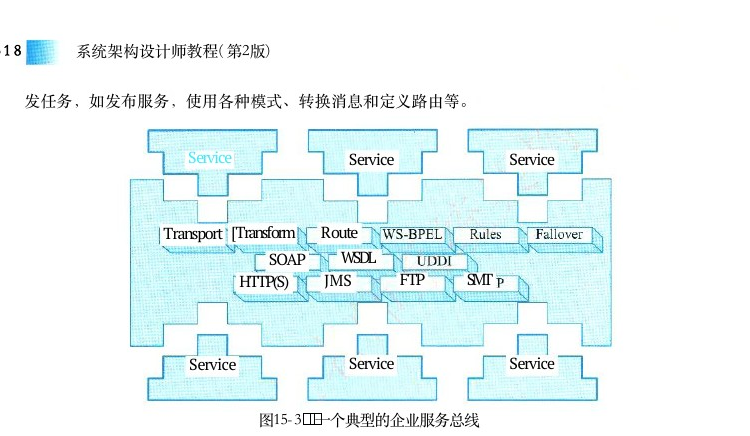
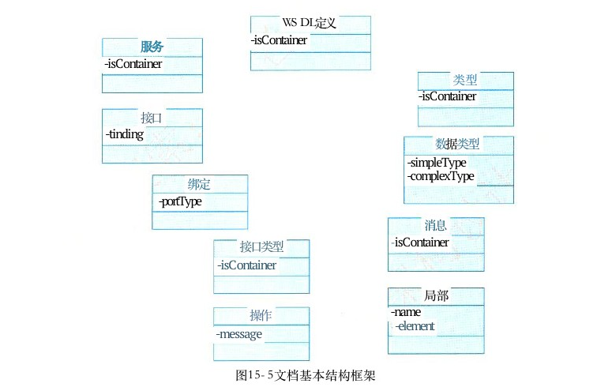
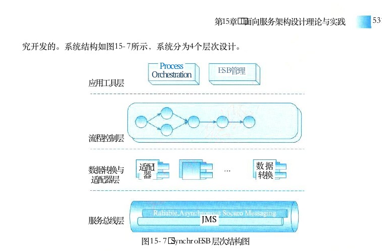
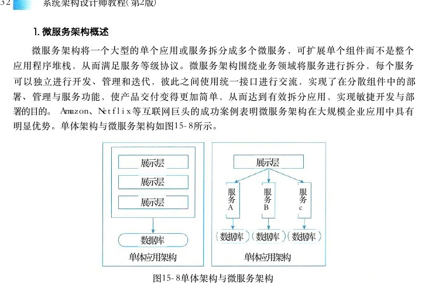

# 第15章 面向服务架构设计理论与实践

> 本页为教材原文文字提取版。图示已按 PDF 页面裁剪并插入正文图注前。

<!-- PDF 第 524 页 -->

Massimo Pezzini，Gartner Group说过，“当有一天，所有的应用都写成 Web 服务，集成也许可以变得更容易”。服务是一个由服务提供者提供的，用于满足使用者请求的业务单元。服务的提供者和使用者都是软件代理为了各自的利益而产生的角色。在面向服务的体系结构 （Service－Oriented Architecture，SOA） 中，服务的概念有了延伸，泛指系统对外提供的功能集。例如，在一个大型企业内部，可能存在进销存、人事档案和财务等多个系统，在实施 SOA 后，每个系统用于提供相应的服务，财务系统作为资金运作的重要环节，也向整个企业信息化系统提供财务处理的服务，那么财务系统的开放接口可以看成是一个服务。

## 15．1 SOA的相关概念

## 15．1．1 SOA的定义

面向服务的体系结构 （Service－Oriented Architecture，SOA）， 从应用和原理的角度看，目前有两种业界公认的标准定义。从应用的角度定义，可以认为 SOA 是一种应用框架，它着眼于日常的业务应用，并将它们划分为单独的业务功能和流程，即所谓的服务。 SOA 使用户可以构建、部署和整合这些服务，且无需依赖应用程序及其运行平台，从而提高业务流程的灵活性。这种业务灵活性可使企业加快发展速度，降低总体拥有成本，改善对及时、准确信息的访问。 SOA 有助于实现更多的资产重用、更轻松的管理和更快的开发与部署。从软件的基本原理定义，可以认为 SOA 是一个组件模型，它将应用程序的不同功能单元（称为服务）通过这些服务之间定义良好的接口和契约联系起来。接口是采用中立的方式进行定义的，它应该独立于实现服务的硬件平台、操作系统和编程语言。这使得构建在各种这样的系统中的服务可以一种统一和通用的方式进行交互。作为软件架构师，后一种从软件原理方面的定义，对日常工作更具指导性。

## 15．1．2业务流程与BPEL

业务流程是指为了实现某种业务目的行为所进行的流程或一系列动作。在计算机领域，业务流程代表的是某一个问题在计算机系统内部得到解决的全部流程。由于业务流程来源于现实世界，传统上是通过复杂的语言进行描述。在计算机业务系统建模中，需要用到一种特定的、简洁的语言来专门描述计算机系统的业务流程，这便促使了BPEL 的诞生。

<!-- PDF 第 525 页 -->

BPEL（Business Process Execution Language For Web Services） 翻译成中文的意思是面向Web 服务的业务流程执行语言，也有的文献简写成 BPEL 4 WS ， 它是一种使用 Web 服务定义和执行业务流程的语言。使用 BPEL ， 用户可以通过组合、编排和协调 Web 服务自上而下地实现面向服务的体系结构。 BPEL提供了一种相对简单易懂的方法，可将多个 Web 服务组合到一个新的复合服务（称作业务流程）中。BPEL 目前用于整合现有的 Web Services， 将现有的 Web Services按照要求的业务流程整理成为一个新的 Web Services， 在这个基础上，形成一个从外界看来和单个 Service 一样的Service。

## 15．2 SOA的发展历史

## 15．2．1 SOA的发展历史

SOA 的概念最初由 Gartner 公司提出，由于当时的技术水平和市场环境尚不具备真正实施SOA 的条件，因此当时 SOA 并未引起人们的广泛关注， SOA 在当时沉寂了一段时间。伴随着因特网的浪潮，越来越多的企业将业务转移到因特网领域，带动了电子商务的蓬勃发展。为了能够将公司的业务打包成独立的、具有很强伸缩性的基于因特网的服务，人们提出了 Web 服务的概念，这可以说是 SOA 的起源。Web服务开始流行以后，因特网迅速出现了大量的基于不同平台和语言开发的 Web 服务组件。为了能够有效地对这些为数众多的组件进行管理，人们迫切需要找到一种新的面向服务的分布式 Web 计算架构，该架构要能够使这些由不同组织开发的Web 服务相互学习和交互，保障安全以及兼顾复用性和可管理性。由此，人们重新找回面向服务的架构，并赋予其时代的特征。需求推动技术进步，正是这种强烈的市场需求，使得 SOA 再次成为人们关注的焦点。回顾SOA 发展历程，我们把其大致分为了三个阶段，下面将分别介绍每个阶段的重要标准和规范。SOA 的发展最初始于国外，其经历了如下三个阶段。

## 1．萌芽阶段

这一阶段以 XML技术为标志，时间大致从20世纪90年代末到21世纪初。虽然这段时期很少提到 SOA ， 但 XML 的出现无疑为 SOA 的兴起奠定了稳固的基石。XML 系 W 3 C 所创建 ， 源自流行的标准通用标记语言 （Standard Generalized MarkupLanguage，SGML）， 它在20世纪60年代后期就已存在。这种广泛使用的元语言，允许组织定义文档的元数据，实现企业内部和企业之间的电子数据交换。由于 SGML 比较复杂，实施成本很高，因此很长时间里只用于大公司之间，限制了它的推广和普及。通过 XML ， 开发人员摆脱了 HTML 语言的限制，可以将任何文档转换成XML 格式，然后跨越因特网协议传输。借助XML 转换语言 （eXtensible Stylesheet Language Transformation，XSLT）， 接受方可以很容易地解析和抽取XML 的数据。这使得企业既能够将数据以一种统一的格式描述和交换，同时又不必负担 SGML 那样高的成本。事实上， XML 实施成本几乎和HTML 一样。

<!-- PDF 第 526 页 -->

XML是 SOA 的基石。 XML 规定了服务之间以及服务内部数据交换的格式和结构。 XSDSchemas 保障了消息数据的完整性和有效性，而 XSLT使得不同的数据表达能通过 Schema 映射而互相通信。

## 2．标准化阶段

2000年以后，人们普遍认识到基于公共因特网之上的电子商务具有极大的发展潜力，因此需要创建一套全新的基于因特网的开放通信框架，以满足企业对电子商务中各分立系统之间通信的要求。于是，人们提出了 Web 服务的概念，希望通过将企业对外服务封装为基于统一标准的 Web 服务，实现异构系统之间的简单交互。这一时期，出现了三个著名的 Web 服务标准和规范：简单对象访问协议 （Simple Object Access Protocal，SOAP）、Web 服务描述语言（Web Services Description Language，WSDL） 及通用服务发现和集成协议 （Universal DiscoveryDescription and Integration，UDDI）。这三个标准可谓 Web服务三剑客，极大地推动了Web 服务的普及和发展。短短几年之间，因特网上出现了大量的 Web 服务，越来越多的网站和公司将其对外服务或业务接口封装成 Web服务，有力地推动了电子商务和因特网的发展。 Web服务也是因特网 Web 2．0 时代的一项重要特征。

## 3．成熟应用阶段

从2005年开始， SOA 推广和普及工作开始加速。不仅专家学者，几乎所有关心软件行业发展的人士都开始把目光投向 SOA。 一时间， SOA 频频出现在各种技术媒体、新产品发布会和技术交流会上。各大厂商也逐渐放弃成见，通过建立厂商间的协作组织共同努力制定中立的 SOA 标准。这一努力最重要的成果体现在三个重量级规范上： SCA／SDO／WS－Policy。SCA 和 SDO 构成了SOA编程模型的基础，而 WS－Policy 建立了 SOA 组件之间安全交互的规范。这三个规范的发布，标志着 SOA 进入了实施阶段。从整体架构角度看，人们已经把关注点从简单的 Web 服务拓展到面向服务体系架构的各个方面，包括安全、业务流程和事务处理等。

## 15．2．2国内SOA的发展现状与国外对比

在 SOA概念深入普及的同时，国内也兴起了对 SOA 的研究和初步实践。2007年， IDC 发布了 《SOA 中国路线图》。有观点认为，这是“国际研究机构首次基于中国 IT背景，针对中国企业实施SOA 路线所做的特定解读”，这也是目前关于 SOA 这一新兴技术在中国实施的第一份比较权威的报告。报告中，重点指出了中国和美国在 SOA 领域的差距。在美国，过去的半个多世纪，美国从主机时代、 PC时代，到了现在的网络时代，积累了大量的应用系统。美国实现 SOA 架构的关键任务是：对已有系统中的功能进行提取和包装，形成标准的“服务”。在中国，过去近30年的IT建设多为生产型系统，服务型系统普遍未开始建设，大量“服

<!-- PDF 第 527 页 -->

务”需要全新构造才是中国 SOA 的主要任务。这份报告的可取之处如下。

（1）指出了中美 IT系统所面临的根本性问题不同。现阶段，国内主要是以“构建支撑某一业务的应用系统”为主，其中伴随着一部分企业内部应用系统之间的整合。如果用前面的“三个阶段”来做以下匹配，可能更多还处于第一阶段，即使第二阶段的应用也处于起步状态。

（2）为国内大型集团化企业指明了如何解决系统集成和系统构建的融合性问题，基于 SOA方式下的解决方案。关于国内实施 SOA 的现状，报告用表15－1进行了阐述。表15－1 可修改性质量属性场景描述服务型系统还没开始大规模构造领域IT建设领先领域（电信、金融）（政府、电力、国防）

## 1．首先需要统一标准 （SCA／SDO）

## 1．采用对遗留系统进行切割和封装的方式，或整个

## 2．用符合 SOA 标准的方法（面向构件）构造粒度更

系统包装成一个服务小、组合更容易、架构更灵活的“服务”

## 2．未来的新建系统用粒度更小、组合更容易、架构

## 3．SOA 的流程管理

更灵活的面向构件技术构造

## 4．SOA 的软件治理

## 3．用 ESB 实现新旧“服务”的注册与管理

## 5．多“服务”用 ESB 实现集成

## 1 5 ． 2 ． 3 SOA的微服务化发展

随着互联网技术的快速发展，为适应日益增长的用户访问量和产品的快速更新迭代，应用系统架构也经历了从简到繁、从单体架构到 SOA 架构再至微服务架构的演进过程。这导致SOA 架构向更细粒度、更通用化程度发展，就成了所谓的微服务了。 SOA 与微服务的区别在于如下几个方面：

（1）微服务相比于 SOA 更加精细，微服务更多地以独立的进程的方式存在，互相之间并无影响；

（2）微服务提供的接口方式更加通用化，例如 HTTP RESTful 方式，各种终端都可以调用，无关语言、平台限制；

（3）微服务更倾向于分布式去中心化的部署方式，在互联网业务场景下更适合。SOA 架构是一个面向服务的架构，可将其视为组件模型，其将系统整体拆分为多个独立的功能模块，模块之间通过调用接口进行交互，有效整合了应用系统的各项业务功能，系统各个模块之间是松耦合的。 SOA架构以企业服务总线链接各个子系统，是集中式的技术架构，应用服务间相互依赖导致部署复杂，应用间交互使用远程通信，降低了响应速度。微服务架构是 SOA架构的进一步优化，去除了 ESB 企业服务总线，是一个真正意义上去中心化的分布式架构。其降低了微服务之间的耦合程度，不同的微服务采用不同的数据库技术，服务独立，数据源唯一，应用极易扩展和维护，同时降低了系统复杂性。架构如图15－1所示。

<!-- PDF 第 528 页 -->

用户用户

UIUI

企业服务总线ESB

微服务服务服务服务微服务微服务

数据库数据库SOA架构微服务架构图15－1 SOA 架构与微服务架构图

总而言之，微服务架构是 SOA 架构思想的一种扩展，更加强调服务个体的独立性、拆分粒度更小。

## 15．3 SOA 的参考架构

IBM 的 Websphere 业务集成参考架构（如图15－2所示，以下称参考架构）是典型的以服务为中心的企业集成架构，接下来的讨论都将以此参考架构为背景进行。以服务为中心的企业集成采用“关注点分离 （Separation of Concern）” 的方法规划企业集成中的各种架构元素，同时从服务视角规划每种架构元素提供的服务，以及服务如何被组合在一起完成某种类型的集成。这里架构元素提供的服务既包括狭义的服务 （ WSDL 描述 ） ， 也包括广义的服务（某种能力）。从服务为中心的视角来看，企业集成的架构（如图15－2所示）可划分为6大类。（ 1 ） 业务逻辑服务 （Business Logic Service）： 包括用于实现业务逻辑的服务和执行业务逻辑的能力，其中包括业务应用服务 （Business Application Service）、 业务伙伴服务 （PartnerService） 以及应用和信息资产 （Application and Information asset）。（ 2 ） 控制服务 （Control Service）： 包括实现人 （People）、 流程 （Process） 和信息 （Infor－mation） 集成的服务，以及执行这些集成逻辑的能力。（ 3 ） 连接服务 （Connectivity Service）： 通过提供企业服务总线提供分布在各种架构元素中服务间的连接性。

（4）业务创新和优化服务 （Business Innovation and Optimization Service）： 用于监控业务系统运行时服务的业务性能，并通过及时了解到的业务性能和变化，采取措施适应变化的市场。（ 5 ） 开发服务 （Development Service）： 贯彻整个软件开发生命周期的开发平台，从需求分析，到建模、设计、开发、测试和维护等全面的工具支持。（ 6 ） IT服务管理 （IT Service Management）： 支持业务系统运行的各种基础设施管理能力或服务，如安全服务、目录服务、系统管理和资源虚拟化。

<!-- PDF 第 529 页 -->

Development Services Business Innovation and Optimization Services

Process InteractionInformation Services Services Serviccs Control Service Connectivity Services

BusinessApplication and PartnerApplication ServicesServicesInformation Assets Business Logic Servicel

IT Services Management图15－2 IBM WebSphere业务集成参考架构

## 1．连接服务——企业服务总线

企业服务总线 （Enterprise Service Bus，ESB） 是过去消息中间件的发展，采用了“总线”这样一种模式来管理和简化应用之间的集成拓扑结构，以广为接受的开放标准为基础来支持应用之间在消息、事件和服务的级别上动态地互联互通。ESB的基本特征和能力包括：描述服务的元数据和服务注册管理；在服务请求者和提供者之间传递数据，以及对这些数据进行转换的能力，并支持由实践中总结出来的一些模式如同步模式、异步模式等；发现、路由、匹配和选择的能力，以支持服务之间的动态交互，解耦服务请求者和服务提供者。高级一些的能力，包括对安全的支持、服务质量保证、可管理性和负载平衡等。ESB 所提供的基于标准的连接服务，将应用中实现的功能或者数据资源转化为服务请求者能以标准的方式来访问的服务；当请求者来请求一个服务时， ESB 中这种中介转换过程可能简单到什么也没有，也可能需要很复杂的中介服务支持，包括动态地查找、选择一个服务，消息的传递、路由和转换、协议的转换。这种中介过程，是 ESB 借助于服务注册管理以及问题域相关的知识（如业务方面的一些规则等）自动进行的，不需要服务请求者和提供者介入，从而实现了解耦服务请求者和提供者的技术基础，使得服务请求者不需要关心服务提供者的位置和具体实现技术，双方在保持接口不变的情况下，各自可以独立地演变。所以， ESB 采用总线结构模式简化了应用之间的集成拓扑，通过源自实践的模式，提供了基于标准的通用连接服务，使得服务请求者和服务提供者之间可以以松散耦合、动态的方式交互，从而在不同层次上使得 SOA 解决方案是一个松散耦合、灵活的架构。一个典型的企业服务总线如图15－3所示。需要注意的是， ESB 是一种架构模式，不能简单地等同于特定的技术或者产品，但实现 ESB 确实需要各种产品在运行时和工具方面的支持。IBM 有很好的产品支持，运行时支持包括 WebSphere ESB和 WebSphere Message Broker； 而工具方面 IBM 则有 WebSphere Integration Developer， 支持用户以图形界面的方式来完成相关的开

<!-- PDF 第 530 页 -->

发任务，如发布服务，使用各种模式、转换消息和定义路由等。

Service ServiceService

Route Transport [Transform WSDL SOAP FTPSMT JMS HTTP(S)

ServiceService Service

图15－3 一个典型的企业服务总线

## 2．业务逻辑服务

## 1）整合已有应用——应用和信息访问服务

已有应用和信息是实现业务逻辑和业务数据的重要资产。通过集成已有的应用和信息将可以在已有企业系统上实现更多增值服务，所以集成已有应用和信息是企业集成中重要的一环。以服务为中心的企业集成通过应用和信息访问服务 （Application and Information AccessService） 来实现对已有应用和信息的集成。它通过各种适配器技术将已有系统中的业务逻辑和业务数据包装成企业服务总线支持的协议和数据格式。通过企业服务总线，这些被包装起来的业务逻辑和数据就可以方便地参与上层的业务流程，从而已有应用系统的能力可以得以继续发挥。这里的已有应用包括遗留应用、预包装的应用和各种企业数据存储。在参考架构中，主要有两类访问服务。（ 1 ） 可接入服务 （On－Ramp Service）： 通过各种消息通信模式（单向、请求／应答和轮询）将业务逻辑和业务数据包装成企业服务总线可以访问的功能。（ 2 ） 事件发现服务 （Event Detect Service）： 提供事件通知服务将已有应用和数据中的变化通过事件框架发布到企业服务总线上。

## 2）整合新开发的应用——业务应用服务

同已有应用和数据类似，新开发的应用也作为重要的业务逻辑成为企业集成的目标。以服务为中心的企业集成通过业务应用服务 （Business Application Service） 实现新应用集成。一方面，业务应用服务帮助程序员开发可重用、可维护和灵活的业务逻辑组件；另一方面，它也提供运行时的集成对业务逻辑组件的自治管理。在参考架构中，有三类业务应用服务。（ 1 ） 组件服务 （Component Service）： 为可重用的组件提供应用的运行时容器管理服务，如对象持久化、组件安全管理和事务管理等。（ 2 ） 核心服务 （Core Service）： 提供运行时的服务，包括内存管理、对象实例化和对象池、

<!-- PDF 第 531 页 -->

性能管理和负载均衡、可用性管理等。

（3）接口服务 （Interface Service）： 提供和其他企业系统集成的接口，如其他企业应用，数据库、消息系统和管理框架。

## 3）整合客户和业务伙伴（B2C／B2B）——伙伴服务

以服务为中心的企业集成通过伙伴服务提供与企业外部的 B 2 B 的集成能力。因为业务伙伴系统的异构性，伙伴服务需要支持多种传输协议和数据格式。在参考架构中，提供如下服务。（ 1 ） 社区服务 （Community Service）： 用于管理和企业贸易的业务伙伴，支持以交易中心（Trade Hub） 为主的集中式管理和以伙伴为中心的自我管理。

（2）文档服务 （Document Service）： 用于支持和业务伙伴交换的文档格式，以及交互的流程和状态管理，支持主流的 RosettaNet、EDI 和 AS1／AS2 等。

（3）协议服务 （ProtocolService）： 为文档的交互提供传输层的支持，包括认证和路由等。

## 3．控制服务

## 1）数据整合——信息服务

企业数据的分布性和异构性是应用系统方便访问企业数据和在企业数据之上提供增值服务的主要障碍。数据集成和聚合技术在这种背景下诞生，用于提供对分布式数据和异构数据的透明访问。以服务为中心的企业集成通过信息服务提供集成数据的能力，目前主要包括如下集中信息服务。

（1）联邦服务 （Federation Service）： 提供将各种类型的数据聚合的能力，它既支持关系型数据，也支持像 XML 数据、文本数据和内容数据等非关系型数据。同时，所有的数据仍然按照自己本身的方式管理。

（2）复制服务 （Replication Service）： 提供远程数据的本地访问能力，它通过自动的实时复制和数据转换，在本地维护一个数据源的副本。本地数据和数据源在技术实现上可以是独立的。

（3）转换服务 （Transformation Service）： 用于数据源格式到目标格式的转换，可以是批量的或者是基于记录的。

（4）搜索服务 （Search Service）： 提供对企业数据的查询和检索服务，既支持数据库等结构化数据，也支持像 PDF 等非结构化数据。

## 2）流程整合——流程服务

企业部门内部的 IT 系统通过将业务活动自动化来提高业务活动的效率。但是这些部门的业务活动并不是独立的，而是和其他部门的活动彼此关联的。毋庸置疑，将彼此关联的业务活动组成自动化流程可以进一步提高业务活动的效率。业务流程集成正是在这一背景下诞生的。以服务为中心的企业集成通过流程服务来完成业务流程集成。在业务流程集成中，粒度的业务逻辑被组合成业务流程，流程服务提供自动执行这些业务流程的能力。在参考架构中，流程服务包括如下内容。

（1）编排服务 （Choreography Service）： 通过预定义的流程逻辑控制流程中业务活动的执

<!-- PDF 第 532 页 -->

行，并帮助业务流程从错误中恢复。

（2）事务服务 （Transaction Service）： 用于保证流程执行中的事务特性 （ACID）。 对于短流程，通常采用传统的两阶段提交技术；对于长流程，一般采用补偿的方法。

（3）人工服务 （StaffService）： 用于将人工的活动集成到流程中。一方面，它通过关联的交互服务使得人工可以参与到流程执行中；另一方面，它需要管理由于人工参与带来的管理任务，如任务分派、授权和监管等。

## 3）用户访问整合——交互服务

将适当的信息、在适当的时间、传递给合适的人一直是信息技术追求的目标。用户访问集成是实现这一目标的重要一环，它负责将信息系统中的信息传递给客户，不管它在哪里，以什么样的设备接入。以服务为中心的企业集成，通过交互服务来实现用户访问集成。参考架构中的交互服务包括如下类型。

（1）交付服务 （Delivery Service）： 提供运行时的交互框架，它通过各种技术支持同样的交互逻辑可以在多种方式（图形界面、语音和普及计算消息）和设备（桌面、 PDA和无线终端等）上运行，例如通过页面聚合和标签翻译使得同一个 Portlet 可以在桌面浏览器和 PDA浏览器上展现。

（2）体验服务 （Experience Service）： 通过用户为中心的服务增强用户体验，其中的技术包括个性化、协作和单点登录等。

（3）资源服务 （Resource Service）： 提供运行时交互组件的管理，如安全配置、界面皮肤等。

## 4．开发服务

企业集成涉及面很广，不仅需要开发新的应用并使其成为可以被用于企业集成的功能组件，而且需要将被包装的已有的应用和数据用于集成；不仅有企业内部的集成，而且需要和企业外部的系统集成；不仅有交互集成和数据集成，还有功能和应用集成。考虑到这其中的每部分在技术上都会涉及各种平台和中间件，企业集成的技术复杂性是普通应用开发不可比拟的。这种技术复杂性需要更强有力的开发工具支持。企业集成的开发工具需要有标准的工具框架，这些工具能够以即插即用方式支持来自多家厂商的开发工具。同时，企业集成的开发工具需要支持整个软件开发周期，以提高开发过程中各种角色的生产力。在以服务为中心的企业集成中，除了需要支持整个软件开发周期和标准的工具框架以外，开发服务需要提供和服务开发相关的技术。

（1）用于支持以服务为中心的企业集成方法学和建模，如 SODA和 IBM 的 SOMA（ServiceOriented Modeling and Architecture）。

（2）用于服务为中心的编程模型，如WSDL 、 BPEL 4 WS 、 SCA 和 SDO 等。开发环境和工具中为不同开发者的角色提供的功能被称为开发服务。根据开发过程中开发者角色和职责的不同，有如下4类服务。

（1）建模服务 （ModelService）： 用于构建可视化的业务流程模型。

<!-- PDF 第 533 页 -->

（2）设计服务 （Design Service）： 根据业务模型，进一步分解为服务组件，设计服务用于设计和开发这些服务组件。

（3）实现服务 （Implementation Service）： 用于将设计和开发的服务组件部署到生产环境中。

（4）测试服务 （Test Service）： 支持服务组件的单元测试和系统的集成测试。

## 5．业务创新和优化

一方面，以服务为中心的企业集成通过各种集成提高信息流转速度，从而提高生产效率；另一方面，以服务为中心的企业集成也为业务创新和优化提供了支持平台——业务创新和优化服务。业务创新和优化服务以业务性能管理 （Business Process Management，BPM） 技术为核心提供业务事件发布、收集和关键业务指标监控能力。具体而言，业务创新和优化服务由以下服务组成。

（1）公共事件框架服务 （Common Event Infrastructure Service）： 通过一个公共事件框架提供IT和业务事件的激发、存储和分类等。

（2）采集服务 （Collection Service）： 通过基于策略的过滤和相关性分析检测感兴趣的服务。

（3）监控服务 （Monitoring Service）： 通过事件与监控上下文间的映射，计算和管理业务流程的关键性能指标 （Key Performance Indicators，KPI）。业务创新和优化服务与开发服务是紧密相联的。在建模阶段被确定的业务流程的关键性能指标，被转为特别的事件标志构建到业务流程中，建模过程中的业务流程也被转换为用于监控服务的监控上下文。在业务流程执行过程中，这些事件标志激发的事件被公共事件框架服务截获，经过采集服务的过滤被传递给监控服务用于计算关键性能指标。关键性能指标作为重要的数据被用于重构或优化业务流程，这种迭代的方法使得业务流程处于不断的优化中。

## 6．IT 服务管理

为业务流程和服务提供安全、高效和健康的运行环境，也是以服务为中心的企业集成重要的部分，它由 IT服务管理来完成。 IT 服务管理包括如下两部分。

（1）安全和目录服务 （Security and Directory Service）： 企业范围的用户、认证和授权管理，如单点登录 （SSO）。

（2）系统管理和虚拟化服务 （System Management and Virtualization Service）： 用于管理服务器、存储、网络和其他 IT 资源。IT 服务管理中相当一部分服务是面向软硬件管理的；而另外一部分服务，特别是安全和目录服务，以及操作系统和中间件管理，会通过企业服务总线和其他服务集成在一起，用于实现业务流程和服务的非功能性需求，如性能、可用性和安全性等。

## 1 5 ． 4 SOA主要协议和规范

Web 服务作为实现 SOA 中服务的最主要手段。首先来了跟踪 Web Service 相关的标准。它们大多以 “WS－” 作为名字的前缀，所以统称 “WS－＊”。Web服务最基本的协议包括 UDDI、

<!-- PDF 第 534 页 -->

WSDL 和 SOAP ， 通过它们，可以提供直接而又简单的 Web Service 支持，如图15－4所示。

服务注册x 克校

方用WSDL描述服务请求者服务提供者通过SOAP连接图15－4基本Web 服务协议

## 15．4．1 UDDI协议

UDDI （统一描述、发现和集成协议）计划是一个广泛的、开放的行业计划，它使得商业实体能够彼此发现；定义它们怎样在 Internet上互相作用，并在一个全球的注册体系架构中共享信息。UDDI 是这样一种基础的系统构筑模块，它使商业实体能够快速、方便地使用它们自身的企业应用软件来发现合适的商业对等实体，并与其实施电子化的商业贸易。UDDI 同时也是 Web 服务集成的一个体系框架，包含了服务描述与发现的标准规范。 UDDI规范利用了 W 3 C 和 Internet 工程任务组织的很多标准作为其实现基础，如 XML 、 HTTP 和 DNS等协议。另外，在跨平台的设计特性中，UDDI 主要采用了已经被提议给 W 3 C 的 SOAP（SimpleObject Access Protocol， 简单对象访问协议）规范的早期版本。

## 15．4．2 WSDL规范

WSDL（Web Services Description Language，Web 服务描述语言），是一个用来描述Web 服务和说明如何与 Web服务通信的 XML语言。它是 Web 服务的接口定义语言，由Ariba、Intel、IBM 和 MS 等共同提出，通过 WSDL ， 可描述 Web服务的三个基本属性。

（1）服务做些什么——服务所提供的操作（方法）。

（2）如何访问服务——和服务交互的数据格式以及必要协议。

（3）服务位于何处——协议相关的地址，如 URL。WSDL 文档以端口集合的形式来描述Web 服务， WSDL服务描述包含对一组操作和消息的一个抽象定义，绑定到这些操作和消息的一个具体协议，和这个绑定的一个网络端点规范。 WSDL 文档被分为两种类型：服务接口 （Service Interface） 和服务实现 （ServiceImplementations）。 文档基本结构框架如图15－5所示。服务接口文档中主要元素的作用分别如下。

●服务使用的所有数据类型集合，可被元素的各消息部件所引用。它使types :Web定义了用某种类型系统（一般使用XML Schema中的类型系统）。

●通信消息数据结构的抽象类型化定义。使用所定义的类型来定义整个消message :Types息的数据结构。

<!-- PDF 第 535 页 -->

●对服务中所支持操作的抽象描述。一般单个描述了一个访问入口的operation :operation请求／响应消息对。

●对于某个访问入口点类型所支持操作的抽象集合。这些操作可以由一个或多portType:个服务访问点来支持。

●包含了如何将抽象接口的元素转变为具体表示的细节，也就是指binding :(portType)特定的数据格式和协议的结合，以及特定端口类型的具体协议和数据格式规范的绑定。

●定义为协议／数据格式绑定与具体访问地址组合的单个服务访问点。port :Web

●这是一个粗糙命名的元素，代表端口的集合，以及相关服务访问点的集合。service:

WSDL定义-isContainer服务-isContainer类型-isContainer接口-tinding数据类型-simpleType-complexType绑定-portType消息－isContainer接口类型-isContainer

局部-name操作-element-message

图15－5文档基本结构框架

## 15．4．3 SOAP协议

SOAP 是在分散或分布式的环境中交换信息的简单的协议，是一个基于 XML 的协议。它包括4个部分： SOAP封装 （Envelop）， 定义了一个描述消息中的内容是什么，是谁发送的，谁应当接收并处理它以及如何处理它们的框架； SOAP 编码规则 （Encoding Rules）， 用于表示应用程序需要使用的数据类型的实例； SOAPRPC表示 （RPC Representation） 是远程过程调用和应答的协定； SOAP 绑定 （Binding） 是使用底层协议交换信息。虽然这 4 个部分都作为SOAP 的一部分，作为一个整体定义的，但它们在功能上是相交的、彼此独立的。特别地，信封和编码规则是被定义在不同的 XML 命名空间 （Namespace） 中，这

<!-- PDF 第 536 页 -->

样使得定义更加简单。SOAP 的两个主要设计目标是简单性和可扩展性，这就意味着有一些传统消息系统或分布式对象系统中的某些性质将不是 SOAP规范的一部分。例如，分布式垃圾收集 （DistributedGarbage Collection）、 成批传送消息、对象引用和对象激活等。

## 15．4．4 REST规范

REST是 Roy Thomas Fielding 博士在他的一篇论文中提出的一个概念，在这篇论文中设计了一种新的互联网软件架构风格， REST 的设计不只是要适用于互联网环境，而是一个普遍的设计理念，目的是为了让不同的软件或者应用程序在任何网络环境下都可以进行信息的互相传递。微服务对外就是以 REST API 形式暴露给调用者。 RESTful 即 REST 式的，是对遵循 REST 设计思想同时满足设计约束的一类架构设计或应用程序的统称，这一类都可称为RESTful。REST即 Representational State Transfer， 对应的翻译是表述性状态转移，可以理解为资源表述性状态转移。

## 1．资源 （Resource）

REST 是以资源为中心构建，资源可以是一个订单，也可以是一幅图片。将互联网中一切暴露给客户端的事物都可以看作是一种资源，对资源相关数据和表述进行组合，借助 URI （统一资源标识符）标识 Web 上的资源。但是 URI 和资源又不是一一映射，一个资源可以设计多个URI， 但一个URI 只能对应一种资源。

## 2．表述 （Representational）

REST 中用表述描述资源在 Web 中某一个时间的状态。客户端和服务端借助 RESTful API传递数据，实际就是在进行资源表述的交互。表述在 Web 中常用表现形式有HTML、JSON、XML、 纯文本等，但是资源表述返回客户端的形式只是统一格式，是开发阶段根据实际需求设计一个统一的表述格式。

## 3．状态转移（State Transfer）

REST 定义中状态分为两种：应用状态和资源状态。应用状态是对某个时间内用户请求会话相关信息的快照，保存在客户端，由客户端自身维护，可以和缓存配合降低服务端并发请求压力。资源状态在服务端保存，是对某个时间资源请求表述的快照，保证在服务端，如果一段时间内没有对资源状态进行改变，客户端对同一资源请求返回的表述一致。同时状态转移还要借助HTTP方法来实现，如 GET 方法、 POST方法、 DELETE 方法等。

## 4．超链接

超链接是通过在页面中嵌入链接和其他资源建立联系，这里的资源可以是文本、图片、文件等。 REST 定义中超链接是很重要的一部分，在资源表述中除了处理当前请求资源信息外，还会添加一些相关资源 URI， 将一些资源接口暴露给客户端，便于用户请求这些资源，实现资源状态转移。这些超链接是包含在应用状态中，由客户端维护保存，并不是服务端提前设定好的，是服务请求过程中添加进去，客户端对其解析提供给用户。

<!-- PDF 第 537 页 -->

REST是一种设计风格而不是一个架构。 RESTful 不可能摒弃 REST 而独立存在，是人们借助 HTTP 、 JSON 、 URI 、 HTML等 Web 服务开发中广泛使用的标准和协议，同时使用不同的编程语言编写客户端和服务端，通过 HTTP 方法操作资源状态，最后遵循 REST 设计原则实现的应用程序或服务架构。

## 1 5 ． 5 SOA 设计的标准要求

## 15．5．1文档标准化

SOA 服务具有平台独立的自我描述XML 文档。 Web 服务描述语言是用于描述服务的标准语言。

## 15．5．2通信协议标准

SOA 服务用消息进行通信，该消息通常使用 XML Schema来定义 （ 也称作 XSD ， XMLSchema Definition）。 消费者和提供者，或消费者和服务之间的通信多见于不知道提供者的环境中。服务间的通信也可以看作企业内部处理的关键商业文档。

## 15．5．3应用程序统一登记与集成

在一个企业内部， SOA 服务通过一个扮演目录列表 （Directory Listing） 角色的登记处（Registry） 来进行维护。应用程序在登记处 （Registry） 寻找并调用某项服务。统一描述、定义和集成是服务登记的标准。

## 15．5．4服务质量 （QoS）

每项 SOA服务都有一个与之相关的服务质量 （Quality of Service，QoS）。QoS 的一些关键元素有安全需求（例如认证和授权）、可靠通信以及谁能调用服务的策略。在企业中，关键任务系统用来解决高级需求，例如安全性、可靠性和事务。当一个企业开始采用服务架构作为工具来进行开发和部署应用的时候，基本的 Web服务规范，像 WSDL、SOAP 以及 UDDI 就不能满足这些高级需求。正如前面所提到的，这些需求也称作服务质量。与 QoS 相关的众多规范已经由一些标准化组织 （Standards Bodies） 提出，像 W 3 C和 OASIS（theOrganization for the Advancement of Structured Information Standards）。 下面的部分将会讨论一些QoS 服务和相关标准。

## 1．可靠性

在典型的 SOA环境中，服务消费者和服务提供者之间会有几种不同的文档在进行交换。具有诸如“仅且仅仅传送一次 （Once－and－only－once Delivery）”“最多传送一次 （At－most－onceDelivery）”“重复消息过滤 （Duplicate Message Elimination）” 和“保证消息传送 （GuaranteedMessage Delivery）” 等特性消息的发送和确认，在关键任务系统 （Mission－critical Systems） 中变得十分重要。 WS－Reliability 和 WS－Reliable Messaging是两个用来解决此类问题的标准。这些标

<!-- PDF 第 538 页 -->

准现在都由OASIS 负责。

## 2．安全性

Web 服务安全规范用来保证消息的安全性。该规范主要包括认证交换、消息完整性和消息保密。该规范吸引人的地方在于它借助现有的安全标准，例如， SAML（as Security AssertionMarkup Language） 实现 Web 服务消息的安全。 OASIS 正致力于Web 服务安全规范的制定。

## 3．策略

服务提供者有时候会要求服务消费者与某种策略通信。例如，服务提供商可能会要求消费者提供 Kerberos 安全标示才能取得某项服务。这些要求被定义为策略断言 （Policy Assertions），一项策略可能会包含多个断言。WS－Policy 用来标准化服务消费者和服务提供者之间的策略通信。

## 4．控制

在 SOA 中，进程是使用一组离散的服务创建的。 BPEL 4 WS 或者 WSBPEL（Web ServiceBusiness Process Execution Language） 是用来控制这些服务的语言。当企业着手于服务架构时，服务可以用来整合数据仓库 （Silos of Data）， 应用程序，以及组件。整合应用意味着像异步通信，并行处理，数据转换，以及校正等进程请求必须被标准化。

## 5．管理

随着企业服务的增长，所使用的服务和业务进程的数量也随之增加，一个用来让系统管理员管理所有，运行在多种环境下的服务的管理系统就显得尤为重要。 WSDM（Web Services forDistributed Management） 的制定，使任何根据 WSDM 实现的服务都可以由一个 WSDM 适应（WSDM－compliant） 的管理方案来管理。其他的 QoS 特性，例如合作方之间的沟通和通信，多个服务之间的事务处理，都在 WS －Coordination 和 WS－Transaction 标准中描述，这些都是 OASIS 的工作。

## 15．6 SOA 的作用

在一个企业内部，可能存在不同的应用系统，而这些应用系统由于开发的时间不同，采用的开发工具不同，一个业务请求很难有效地调用所有的应用系统。用简单的语言来表述，这些已有应用系统是孤立的，也就是我们常说的“信息孤岛”。不同种类的操作系统，应用软件，系统软件和应用基础结构相互交织，这是“信息孤岛”的表现症状。一些现存的应用程序被用来处理当前的业务流程，因此从头建立一个新的基础环境是不可能的。企业应该能对业务的变化做出快速的反应，利用对现有的应用程序和应用基础结构的投资来解决新的业务需求，为客户、商业伙伴以及供应商提供新的互动渠道，并呈现一个可以支持有机业务 （Organic Business） 的构架。 SOA凭借其松耦合的特性，使得企业可以按照模块化的方式来添加新服务或更新现有服务，以解决新的业务需要，提供选择从而可以通过不同的渠道提供服务，并可以把企业现有的或已有的应用作为服务，从而保护了现有的 IT基础建设投资。

<!-- PDF 第 539 页 -->

在 SOA 得以普及之前，解决企业内部信息系统“信息孤岛”的问题通常是采用EAI （企业应用整合）的方式。为了保证所有的应用能够互通互用，每一个应用都需要一个 EAI Server 来对应。打个简单的比方， EAI Server就好像一个“翻译”一样，让每两个应用之间可以对话，可以互相调用。但是，这样会带来 EAI Server 呈几何倍数的增长，当一个企业只有两个应用的时候需要一个“翻译”，当企业有三个应用需要互通的时候需要三个“翻译”，当有四个应用的时候就需要六个“翻译”，五个应用互通就需要十个“翻译”……这显然不是解决“信息孤岛”的妥善办法。SOA 对于实现企业资源共享，打破“信息孤岛”的步骤如下。

（1）把应用和资源转换成服务。

（2）把这些服务变成标准的服务，形成资源的共享。从这个意义上讲， SOA 不仅仅是一个技术，而是一个软件架构。企业的决策者只需要根据企业的策略来制定流程，把应用作为服务“拿来就用”，而无需考虑底层的集成。这样就可以实现IT和企业业务之间同步。一个服装零售组织拥有500家国际连锁店，它们常常需要更改设计来赶上时尚的潮流。这可能意味着不仅需要更改样式和颜色，甚至还可能需要更换布料、制造商和可交付的产品。如果零售商和制造商之间的系统不兼容，那么从一个供应商到另一个供应商的更换可能就是一个非常复杂的软件流程。通过利用 WSDL接口在操作方面的灵活性，每个公司都可以将它们的现有系统保持现状，而仅仅匹配 WSDL接口并制订新的服务级协定，这样就不必完全重构它们的软件系统了。这是业务的水平改变，也就是说，它们改变的是合作伙伴，而所有的业务操作基本上都保持不变。这里，业务接口可以作少许改变。而内部操作却不需要改变。之所以这样做，仅仅是为了能够与外部合作伙伴一起工作。

## 15．7 SOA 的设计原则

SOA 架构中，继承了来自对象和组件设计的各种原则，如封装、自我包含等。那些保证服务的灵活性、松散耦合和重用能力的设计原则，对 SOA 架构来说同样是非常重要的。结构上，服务总线是 SOA 的架构模式之一。关于服务，一些常见和讨论的设计原则如下。

（1）无状态。以避免服务请求者依赖于服务提供者的状态。

（2）单一实例。避免功能冗余。

（3）明确定义的接口。服务的接口由WSDL 定义，用于指明服务的公共接口与其内部专用实现之间的界线。 WS－Policy用于描述服务规约， XML 模式 （Schema） 用于定义所交换的消息格式（即服务的公共数据）。使用者依赖服务规约调用服务，所以服务定义必须长时间稳定，一旦公布，不能随意更改；服务的定义应尽可能明确，减少使用者的不适当使用；不要让使用者看到服务内部的私有数据。

（4）自包含和模块化。服务封装了那些在业务上稳定、重复出现的活动和组件，实现服务的功能实体是完全独立自主的，独立进行部署、版本控制、自我管理和恢复。

<!-- PDF 第 540 页 -->

（5）粗粒度。服务数量不应该太大，依靠消息交互而不是远程过程调用 （RPC）， 通常消息量比较大，但是服务之间的交互频度较低。

（6）服务之间的松耦合性。服务使用者看到的是服务的接口，其位置、实现技术和当前状态等对使用者是不可见的，服务私有数据对服务使用者是不可见的。

（7）重用能力。服务应该是可以重用的。

（8）互操作性、兼容和策略声明。为了确保服务规约的全面和明确，策略成为一个越来越重要的方面。这可以是技术相关的内容，例如一个服务对安全性方面的要求；也可以是跟业务有关的语义方面的内容，例如需要满足的费用或者服务级别方面的要求，这些策略对于服务在交互时是非常重要的。 WS－Policy 用于定义可配置的互操作语义，来描述特定服务的期望、控制其行为。在设计时，应该利用策略声明确保服务期望和语义兼容性方面的完整和明确。

## 1 5 ． 8 SOA 的设计模式

## 15．8．1服务注册表模式

服务注册表 （Service Registry） 主要在SOA 设计时段使用，虽然它们常常也具有运行时段的功能。注册表支持驱动 SOA 治理的服务合同、策略和元数据的开发、发布和管理。因此，它们提供一个主控制点，或者称为策略执行点 （Policy Enforcement Point，PEP）。 在这个点上，服务可以在 SOA 中注册和被发现。注册表可以包括有关服务和相关软件组件的配置、遵从性和约束配置文件。任何帮助注册、发现和检索服务合同、元数据和策略的信息库、数据库、目录或其他节点都可以被认为是一个注册表。主要的服务注册厂商分为两个阵营。一个阵营是提供服务、策略和元数据注册表及信息库的纯 SOA 厂商，其中包括Flashline、Infravio、LogicLibrary、SOA Software 和 Systinet（MercuryInteractive 下属分公司）；另一个阵营是 SOA 平台厂商，这些厂商将注册表作为集成产品套件的一个组件，厂商的集成产品套件常常包括应用服务器、门户、数据库管理系统、 BI 工具、集成中间件和其他功能组件。提供注册表的 SOA 平台厂商包括 BEA、IBM、Microsoft、Novell、Oracle、SAP、Sun 和 WebMethods。UDDI （通用描述、发现与集成）标准定义了 SOA 的一种主要注册环境，尽管这绝非唯一的环境。大多数纯 SOA 厂商和 SOA 平台厂商还提供 SOA开发、集成和管理工具。没有自己注册表的 SOA 厂商，常常通过 UDDI v3 和其他开放标准与一个或多个第三方注册表产品进行集成。大多数商用服务注册产品支持下面的 SOA 治理功能。

（1）服务注册：应用开发者，也叫服务提供者，向注册表公布他们的功能。他们公布服务合同，包括服务身份、位置、方法、绑定、配置、方案和策略等描述性属性。实现 SOA 治理最有效的方法之一，是限制哪类新服务可以向主注册表发布、由谁发布以及谁批准和根据什么条件批准。此外，许多注册表包含开发向注册表发布服务可能需要的说明性服务模板。

（2）服务位置：也就是服务应用开发者，帮助他们查询注册服务，寻找符合自身要求的服

<!-- PDF 第 541 页 -->

务。注册表让服务的消费者检索服务合同。对谁可以访问注册表，以及什么服务属性通过注册表暴露的控制，是另一些有效的 SOA治理手段，注册表产品一般都支持此类功能。

（3）服务绑定：服务的消费者利用检索到的服务合同来开发代码，开发的代码将与注册的服务绑定、调用注册的服务以及与它们实现互动。开发者常常利用集成的开发环境自动将新开发的服务与不同的新协议、方案和程序间通信所需的其他接口绑在一起。工具驱动对服务绑定的控制，有效地管理服务在 ESB 上的互动。设计时段， SOA 治理中新出现的最佳实践之一是注册表中的配置文件 （Profile） 管理。配置文件用于说明服务目前的生命周期阶段和该阶段的相关策略。 Fiorano公司的 CTO Atul Saini是这样描述服务配置是如何在开发时段发挥作用的：“有人可能想在某台使用某个输入参数集合的机器上运行一项服务。机器名和参数成为与服务连接在一起的开发配置文件的一部分，一旦服务被开发，它可以被升级到质量保证阶段，运行在使用不同参数的不同机器上。第二台机器／参数集合构成一个新配置文件。这样，可以为某个服务创建多个配置文件，只需在任意时间将不同的配置文件与服务建立联系，这个服务就可以在其生命周期中的不同阶段之间移动。”配置文件管理常常假设开发部门拥有一个将服务升级到下一阶段的结构化流程。一些 SOA开发工具包含嵌入式工作流环境，帮助企业满足这方面的设计时段治理需要。 LogicLibrary公司CTO、 合作创始人Brent Carlson 说：“公司的 Logidex 工具帮助开发部门将检查点、角色和多步骤工作流配置到 SOA 开发流程之中。”他说：“您可以自动执行将服务提升到下一阶段所涉及的审查和验证，如果发现定义不一致，在服务向注册表发布之前，可将它退回开发者加以改正。”

## 15．8．2企业服务总线模式

在企业基于 SOA 实施 EAI、B2B 和 BMP 的过程中，如果采用点对点的集成方式存在着复杂度高，可管理性差，复用度差和系统脆弱等问题。企业服务总线 （Enterprise Service Bus，ESB ） 技术在这种背景下产生，其思想是提供一种标准的软件底层架构，各种程序组件能够以服务单元的方式“插入”到该平台上运行，并且组件之间能够以标准的消息通信方式来进行交互。它的定义通常如下：企业服务总线是由中间件技术实现的支持面向服务架构的基础软件平台，支持异构环境中的服务以基于消息和事件驱动模式的交互，并且具有适当的服务质量和可管理性。如图15－6所示， ESB 本质上是以中间件形式支持服务单元之间进行交互的软件平台。各种程序组件以标准的方式连接在该“总线”上，并且组件之间能够以格式统一的消息通信的方式来进行交互。一个典型的在 ESB 环境中组件之间的交互过程是：首先由服务请求者触发一次交互过程，产生一个服务请求消息，并将该消息按照 ESB 的要求标准化，然后标准化的消息被发送给服务总线。 ESB 根据请求消息中的服务名或者接口名进行目的组件查找，将消息转发至目的组件，并最终将处理结果逆向返回给服务请求者。这种交互过程不再是点对点的直接交互模式，而是由事件驱动的消息交互模式。通过这种方式， ESB 最大限度上解耦了组件之间的依赖关系，降低了软件系统互连的复杂性。连接在总线上的组件无需了解其他组件和应用系统的位置及交互协议，只需要向服务总线发出请求，消息即可获得所需服务。服务总线事实上实现

<!-- PDF 第 542 页 -->

了组件和应用系统的位置透明和协议透明。技术人员可以通过开发符合 ESB 标准的组件 （ 适配器）将外部应用连接至服务总线，实现与其他系统的互操作。同时， ESB 以中间件的方式，提供服务容错、负载均衡、 QoS 保障和可管理功能。

User Community InformationProcess Application Interaction Integration ServiceService Service Service Service

Enterprise Service Bus

Enterprise ApplicationEnterprise Data图15－6 ESB 示意图

ESB 的核心功能如下。

（1）提供位置透明性的消息路由和寻址服务。

（2）提供服务注册和命名的管理功能。

（3）支持多种消息传递范型（如请求／响应、发布／订阅等）。

（4）支持多种可以广泛使用的传输协议。

（5）支持多种数据格式及其相互转换。

（6）提供日志和监控功能。由于采用了基于标准的互连技术， ESB 使得企业内部以及外部系统之间可以很容易地进行异步或同步交互。它采用的面向服务的架构为系统提供了易扩展性和灵活性，在提高集成应用的开发效率的同时降低了成本。 ESB技术克服了传统应用集成技术的缺陷，能够对各种技术和应用系统提供支持，具有很强的灵活性和可扩展性，可以说是目前理想的 EAI 、 B 2 B 应用系统集成支撑平台。ESB 本身为 EAI 提供了良好的支持平台，但是，作为最终的企业用户需要的则是包含业务集成软件基础平台、各种预制服务组件、集成应用开发、部署、管理和监控工具为一体的 EAI环境。因此，作为软件厂商只是以 ESB 中间件作为基础软件平台，为用户提供整套立体的完善的企业应用软件集成平台。

## 15．8．3案例研究

协同企业服务总线 SynchroESB 就是基于 SOA 体系结构，以ESB 为底层架构，包含丰富的预制程序组件，集中式管理工具和可视化应用程序开发界面的服务整合软件平台。该产品在国家高新技术产业化计划的支持下，由西安协同时光软件公司和西北工业大学计算机学院联合研

<!-- PDF 第 543 页 -->

究开发的。系统结构如图15－7所示，系统分为4个层次设计。

ProcessESB管理Orchestration应用工具层

流程控制层

数据适配［数据转换与器转换适配器层

服务总线层JMS

图15－7 SynchroESB 层次结构图

服务总线层为整个 EAI 应用环境提供底层支持。 ESB 层之上的数据转换与适配器层为各种EAI 应用提供接入功能，它要解决的是应用集成服务器与被集成系统之间的连接和数据接口的问题。其上是流程整合层，它将不同的应用系统连接在一起，进行协同工作，并提供业务流程管理的相关功能，包括流程设计、监控和规划，实现业务流程的管理。最上端的用户交互层，则是为用户在界面上提供一个统一的信息服务功能入口，通过将内部和外部各种相对分散独立的信息组成一个统一的整体。SynchroESB 支持企业构建可管理的、可扩展的和经济实用的 EAI 解决方案。它提供简单经济可扩展的方法和工具，以组件化的方式灵活构建业务流程。应用独创的“粗颗粒”组件编程模型技术构建可重用的组件库，使得诸如构建、原型化、生产和管理分布式复杂应用的活动，变得和今天我们习惯使用的电子表格操作一样简单。 SynchroESB 支持企业以基于标准的、面向服务架构的方式将应用系统和流程跨越企业进行集成。通过分布式架构和集中式管理，SynchroESB解决了集中式的集成方式中存在的问题，它使企业能够利用企业内任何地方的现有业务系统来快速组建一个有效的解决方案。 SynchroESB 采用事件驱动架构使得企业能够更快地响应业务的变化。

## 15．8．4微服务模式

SOA 的架构中，复杂的 ESB 企业服务总线依然处于非常重要的位置，整个系统的架构并没有实现完全的组件化以及面向服务，它的学习和使用门槛依然偏高。而微服务不再强调传统SOA 架构里面比较重的 ESB 企业服务总线，同时 SOA 的思想进入到单个业务系统内部实现真正的组件化。

<!-- PDF 第 544 页 -->

## 1．微服务架构概述

微服务架构将一个大型的单个应用或服务拆分成多个微服务，可扩展单个组件而不是整个应用程序堆栈，从而满足服务等级协议。微服务架构围绕业务领域将服务进行拆分，每个服务可以独立进行开发、管理和迭代，彼此之间使用统一接口进行交流，实现了在分散组件中的部署、管理与服务功能，使产品交付变得更加简单，从而达到有效拆分应用，实现敏捷开发与部署的目的。 Amazon、Netflix等互联网巨头的成功案例表明微服务架构在大规模企业应用中具有明显优势。单体架构与微服务架构如图15－8所示。

展示层展示层展示层服服服务务务展示层ABc

数据库数据库数据库数据库单体应用架构单体应用架构

图15－8单体架构与微服务架构

## 1）复杂应用解耦

微服务架构将单一模块应用分解为多个微服务，同时保持总体功能不变。应用按照业务逻辑被分解为多个可管理的分支或服务，避免了复杂度的不断积累。每个服务专注于单一功能，通过良好的接口清晰表述服务边界。由于功能单一、复杂度低，小规模开发团队完全能够掌握，易于保持较高的开发效率，且易于维护。

## 2 ） 独立

微服务在系统软件生命周期中是独立开发、测试及部署的。微服务具备独立的运行进程，每个微服务可进行独立开发与部署，因此在大型企业互联网系统中，当某个微服务发生变更时无需编译、部署整个系统应用。从测试角度来看，每个微服务具备独立的测试机制，测试过程中不需要建立大范围的回归测试，不用担心测试破坏系统其他功能。因此，微服务组成的系统应用具备一系列可并行的发布流程，使得开发、测试、部署更加高效，同时降低了因系统变更给生产环境造成的风险。

## 3）技术选型灵活

微服务架构下系统应用的技术选型是去中心化的，每个开发团队可根据自身应用的业务需求发展状况选择合适的体系架构与技术，从而更方便地根据实际业务情况获得系统应用最佳解决方案，并且每个微服务功能单一、结构简单，在架构转型或技术栈升级时面临较低风险，因此系统应用不会被长期限制在某个体系架构或技术栈上。

<!-- PDF 第 545 页 -->

## 4 ） 容错

在传统单体应用架构下，当某一模块发生故障时，该故障极有可能在整个应用内扩散，造成全局应用系统瘫痪。然而，在微服务架构下，由于各个微服务相互独立，故障会被隔离在单个服务中，并且系统其他微服务可通过重试、平稳退化等机制实现应用层的容错，从而提高系统应用的容错性。微服务架构良好的容错机制可避免出现单个服务故障导致整个系统瘫痪的情况。

## 5）松耦合，易扩展

传统单体应用架构通过将整个应用完整地复制到不同节点，从而实现横向扩展。但当系统应用的不同组件在扩展需求上存在差异时，会导致系统应用的水平扩展成本很高。微服务架构中每个服务之间都是松耦合的，可以根据实际需求实现独立扩展，体现微服务架构的灵活性。

## 2．微服务架构模式方案

微服务是一种软件架构演变后的新型架构风格，是系统应用开发的一种设计思想，没有固定开发模式。开发团队可根据企业实际业务场景进行架构设计，体现了微服务架构的灵活性。常见的微服务设计模式有聚合器微服务设计模式、代理微服务设计模式、链式微服务设计模式、分支微服务设计模式、数据共享微服务设计模式、异步消息传递微服务设计模式等。

## 1）聚合器微服务

在聚合器微服务中，聚合器调用多个微服务实现系统应用程序所需功能，具体有两种形式，一种是将检索到的数据信息进行处理并直接展示；另一种是对获取到的数据信息增加业务逻辑处理后，再进一步发布成一个新的微服务作为一个更高层次的组合微服务，相当于从服务消费者转换成服务提供者。与普通微服务特性相同，聚合器微服务也有自己的缓存和数据库。作为聚合器模式的一个变种，在代理微服务器中，客户端并不聚合数据，只会根据实际业务需求差别选择调用具有不同功能的微服务，代理微服务器仅进行委派请求和数据转换工作。同样地，代理微服务器也有自己独立的缓存和数据库。分支微服务器模式是聚合器微服务模式的一种扩展，在分支微服务器模式下，客户端或服务允许同时调用两个不同的微服务链。两个微服务调用链相互独立，互不影响。

## 2）链式微服务

客户端或服务在收到请求后，会返回一个经过合并处理的响应，该模式即为链式微服务设计模式。例如，服务A 收到请求后会与服务 B 建立通信，服务B 收到请求后会与服务C 建立通信，依次往下游发送请求，并对结果进行合并处理后作为请求响应返回上游服务调用者。显然，该模式下的所有服务调用都采用同步消息传递方式，在一条完整的服务链调用完成之前，客户端或调用服务会一直阻塞。因此，在使用该模式过程中，服务调用链不宜过长，以避免客户端处于长时间等待状态。

## 3）数据共享微服务

运用微服务架构重构现有单体架构应用时， SQL 数据库反规范化可能会导致数据重复与不一致现象。按照微服务的自治设计原则，在单体架构应用到微服务架构的过渡阶段，可以使用

<!-- PDF 第 546 页 -->

数据共享微服务设计模式。在该模式下，当服务之间存在强耦合关系时，可能存在多个微服务共享缓存与数据库存储的现象。

## 4）异步消息传递微服务

目前流行开发RESTful 风格的API ， REST使用 HTTP 协议控制资源，并通过 URL 加以实现。 REST 提供了一系列架构系统参数作为整体使用，强调组件的独立部署、组件交互的扩展性，以及接口的通用性，并且尽量减少产生交互延迟的中间件数量。但是 REST 设计模式是同步的，容易造成阻塞，从而耗费大量时间。消息队列将消息写入一个消息队列中，实现业务逻辑以异步方式运行，从而加快系统响应速度。因此，对于一些不必要以同步方式运行的业务逻辑，可以使用消息队列代替 REST 实现请求、响应，加快服务调用的响应速度。但该模式可能会降低系统可用性，并增加系统复杂性，因而在使用过程中，要做好消息队列的选型。常用消息队列有 ActiveMQ、RabbitMQ、RocketMQ、Kafka等。

## 3．微服务架构面临的问题与挑战

微服务架构在规模较大的应用中具有明显优势，但其优势也是有代价的，微服务架构也会给人们带来新的问题和挑战。其中一个主要缺点是微服务架构分布式特点带来的复杂性，开发过程中，需要基于 RPC 或消息实现微服务之间的调用与通信，使服务发现与服务调用链跟踪变得困难。另一个挑战是微服务架构的分区数据库体系，不同服务拥有不同数据库。受限于 CAP原理约束以及 NoSQL 数据库的高扩展性，使人们不得不放弃传统数据库的强一致性，转而追求最终一致性，因此对开发人员出了更高要求。微服务架构给系统测试也带来了很大挑战，微服务架构可能涉及多个服务，传统的单体 Web 应用只需测试单一 API 即可，然而对于微服务架构测试，需要启动其依赖的所有服务，该复杂性不可低估。在大规模应用部署中，在监控、管理、分发及扩容等方面，微服务也存在着巨大挑战。因此，对于微服务架构的取舍，要考虑企业开发团队规模、业务需求变化以及系统用户群体规模等诸多因素。使用微服务架构主要是为了降低应用程序开发、维护等方面的复杂性，如果系统程序架构已无法再扩展，或数据库增长速度过快，并且整个团队（包括产品、设计、研发、测试、运维）都具备微服务思维，采用微服务架构的收益会大于成本。但如果系统现有程序架构还能很好地工作，不需要有太大改动，采用微服务架构则不会有太多收益。综上所述，尽管微服务架构有很多优势，但在使用微服务架构之前要结合系统自身特点，综合评估后再决定是否采用微服务架构。

## 1 5 ． 9 构建 SOA 架构时应该注意的问题

## 15．9．1原有系统架构中的集成需求

当架构师基于 SOA 来构建一个企业级的系统架构时，一定要注意对原有系统架构中的集成需求进行细致的分析和整理。我们都知道，面向服务的体系结构是当前及未来应用程序系统开发的重点。面向服务的体系结构本质上来说是一种具有特殊性质的体系结构，它由具有互操作

<!-- PDF 第 547 页 -->

性和位置透明的组件集成构建并互连而成。基于SOA 的企业系统架构通常都是在现有系统架构投资的基础上发展起来的，我们并不需要彻底重新开发全部的子系统， SOA可以通过利用当前系统已有的资源（开发人员、软件语言、硬件平台、数据库和应用程序）来重复利用系统中现有的系统和资源。 SOA 是一种可适应的、灵活的体系结构类型，基于 SOA 构建的系统架构可以在系统的开发和维护中缩短产品上市时间，因而可以降低企业系统开发的成本和风险。因此，当SOA 架构师遇到一个十分复杂的企业系统时，首先考虑的应该是如何重用已有的投资而不是替换遗留系统，因为如果考虑到有限的预算，整体系统替换的成本是十分高昂的。当SOA 架构师分析原有系统中的集成需求时，不应该只限定为基于组件构建的已有应用程序的集成，真正的集成比这要宽泛得多。在分析和评估一个已有系统体系结构的集成需求时，必须考虑一些更加具体的集成的类型，这主要包括以下几个方面：应用程序集成的需求，终端用户界面集成的需求，流程集成的需求以及已有系统信息集成的需求。当 SOA 架构师分析和评估现有系统中所有可能的集成需求时，可以发现实际上所有集成方式在任何种类的企业中都有一定程度的体现。针对不同的企业类型，这些集成方式可能是简化的，或者没有明确地进行定义的。因而， SOA 架构师在着手设计新的体系结构框架时，必须要全面地考虑所有可能的集成需求。例如，在一些类型的企业系统环境中可能只有很少的数据源类型，因此，系统中对消息集成的需求就可能会很简单。但在一些特定的系统中，例如航运系统中的电子数据交换（Electronic Data Interchange，EDI） 系统，会有大量的电子数据交换处理的需求，因此也就会存在很多不同的数据源类型，在这种情况下整个系统对于消息数据的集成需求就会比较复杂。因此，如果 SOA 架构师希望所构建的系统架构能够随着企业的发展和变化成功地继续得以保持，则整个系统构架中的集成功能就应该由服务提供，而不是由特定的应用程序来完成。

## 15．9．2服务粒度的控制以及无状态服务的设计

当SOA架构师构建一个企业级的 SOA 系统架构时，关于系统中最重要的元素，也就是SOA 系统中服务的构建有两点需要特别注意的地方：首先是对于服务粒度的控制，另外就是对于无状态服务的设计。

## 1．服务粒度的控制

SOA系统中服务粒度的控制是一项十分重要的设计任务。通常来说，对于将暴露在整个系统外部的服务推荐使用粗粒度的接口，而相对较细粒度的服务接口通常用于企业系统架构的内部。从技术上讲，粗粒度的服务接口可能是一个特定服务的完整执行，而细粒度的服务接口可能是实现这个粗粒度服务接口的具体的内部操作。举个例子来说，对于一个基于 SOA 架构的网上商店来说，粗粒度的服务可能就是暴露给外部用户使用的提交购买表单的操作，而系统内部细粒度的服务可能就是实现这个提交购买表单服务的一系列的内部服务，如创建购买记录、设置客户地址和更新数据库等一系列的操作。虽然细粒度的接口能为服务请求者提供更加细化和更多的灵活性，但同时也意味着引入较难控制的交互模式易变性，也就是说服务的交互模式可能随着不同的服务请求者而不同。如果我们暴露这些易于变化的服务接口给系统的外部用户，就可能造成外部服务请求者难于支持不断变化的服务提供者所暴露的细粒度服务接口；而粗粒

<!-- PDF 第 548 页 -->

度服务接口保证了服务请求者将以一致的方式使用系统中所暴露出的服务。虽然面向服务的体系结构并不强制要求一定要使用粗粒度的服务接口，但是建议使用它们作为外部集成的接口。通常架构设计师可以使用 BPEL 来创建由细粒度操作组成的业务流程的粗粒度的服务接口。

## 2．无状态服务的设计

SOA 系统架构中的具体服务应该都是独立的、自包含的请求，在实现这些服务的时候不需要前一个请求的状态，也就是说服务不应该依赖于其他服务的上下文和状态，即 SOA架构中的服务应该是无状态的服务。当某一个服务需要依赖时，最好把它定义成具体的业务流程（BPEL）。 在服务的具体实现机制上，可以通过使用 EJB 组件来实现粗粒度的服务。我们通常会利用无状态的 Session Bean 来实现具体的服务，如果基于Web Service技术，就可以将无状态的 Session Bean 暴露为外部用户可以调用到的 Web 服务，也就是把传统的 Session Facade 模型转化为 EJB 的 Web 服务端点。这样，就可以向Web 服务客户提供粗粒度的服务。如果要在 J2EE 的环境下（基于 WebSphere） 构建 Web服务， Web 服务客户可以通过两种方式访问J2EE 应用程序。客户可以访问用 JAX－RPCAPI 创建的 Web 服务 （ 使用 Servlet来实现）； Web服务客户也可以通过 EJB 的服务端点接口访问无状态的 Session Bean， 但 Web 服务客户不能访问其他类型的企业Bean， 如有状态的 Session Bean、 实体 Bean 和消息驱动 Bean。 后一种选择（公开无状态 EJB组件作为 Web 服务）有很多优势，基于已有的 EJB 组件，可以利用现有的业务逻辑和流程。在许多企业中，现有的业务逻辑可能已经使用 EJB 组件编写，通过Web 服务公开它可能是实现从外界访问这些服务的最佳选择。 EJB 端点是一种很好的选择，因为它使业务逻辑和端点位于同一层上。另外， EJB 容器会自动提供对并发的支持，作为无状态Session Bean 实现的 EJB 服务端点不必担心多线程访问，因为 EJB 容器必须串行化对无状态会话Bean任何特定实例的请求。由于 EJB 容器都会提供对于 Security和 Transaction 的支持，因此Bean 的开发人员可以不需要编写安全代码以及事务处理代码。性能问题对于 Web 服务来说一直都是个难题，由于几乎所有 EJB 容器都提供了对无状态会话Bean 群集的支持以及对无状态Session Bean 池与资源管理的支持，因此当负载增加时，可以向群集中增加机器。 Web 服务请求可以定向到这些不同的服务器，同时由于无状态 Session Bean 池改进了资源利用和内存管理，使 Web 服务能够有效地响应多个客户请求。由此可以看到，通过把 Web服务模型化为 EJB端点，可以使服务具有更强的可伸缩性，并增强了系统整体的可靠性。

## 15．10 SOA实施的过程

## 15．10．1选择SOA解决方案

在实施 SOA 之前，选择最佳的解决方案，是保证 SOA 实施成功的前提条件。总体来说，必须从以下三个方面进行选择。

## 1．尽量选择能进行全局规划的方案

SOA 的实施，有很大的技术因素在其中，作为用户来讲，既需要选择适当的工具，还需要

<!-- PDF 第 549 页 -->

有专业的技术人才。作为用户，实施SOA ， 首先要对自己的系统做全面的评估，要了解自己已有的系统能用多少，有多少需要改造，还需要上哪些新的系统，自己将来的系统该如何满足自己的需求，自己可能为这个新的系统投入的资本大概有多少等。总之，要有整体的规划，这也是实施 SOA 最为基础的一步。其次，要选择适合的工具和技术。上什么系统，建什么平台，先改造哪个系统，需要一步一步来，而在这个过程中，所选择的产品也必然有所不同，一定要做到心中有数。最后，就是开发的过程了，开发对于大多数的用户来说，也是一个边学习、边实践的过程。

## 2．选择时充分考虑企业自身的需求

评估SOA 项目的方式与评估传统软件项目有所不同， SOA在企业范围内通过各种渠道表现自己的优势。 SOA通过共享服务来优化业务流程，使全面创新成为可能，其“价值机会”远远超过了传统的软件项目。要建立强大的业务实例，通过 SOA实现业务创新是一个重要的分水岭。必须认识到，用于构建SOA 项目的前期投资将产生巨大效益，这些好处会随着时间的推移越来越明显地表现出来。SOA 具体实施的进度和资金投入一方面取决于企业对 IT应用的沉淀，另一方面取决于实行SOA 的目标层次。

## 3．从平台、实施等技术方面进行考察

用户在选择 SOA 产品和技术时，应该从平台的选择、实施方法与途径、供应商的选择三个方面进行考量。在选择软件平台时，用户首先要考虑的是平台的开放性和对标准的支持。在实施方法与途径方面，以往的成功经验总结有6方面：业务战略和流程、基础架构、构建模块、项目和应用、成本和效益以及规划和管理。在实施SOA时，CIO 应该综合考虑这6方面的因素。SOA 的实施涉及整个企业的IT 系统以及业务流程的调整和改变，离不开相应的咨询和专业服务。因此，在选择供应商时，首先要看它的产品是否符合企业的实际需求、是否已经有很多成功的应用案例、现有客户对它的评价如何；其次，还要仔细考察供应商的专业服务能力，是否能够帮助用户分析企业IT 现状，提出建设性的意见。

## 15．10．2业务流程分析

## 1．建立服务模型

## 1）自顶向下分解法

自上而下的领域分解方式从业务着手进行分析，选择端到端的业务流程进行逐层分解至业务活动，并对其间涉及的业务活动和业务对象进行变化分析。业务组件模型是业务领域分解的输入之一。业务组件模型是一种业务咨询和转型的工具，它根据业务职责、职责间的关系等因素，将业务细分为业务领域、业务执行层次和业务组件。由于企业内部和外部环境的不同，每个业务组件在成本、投资和竞争力等方面不尽相同。因此，每个业务组件在企业发展的过程中战略职责和演化的路径也是不同的。由于角度的不同，就形成了所谓的业务组件的“热点视图”。对于面向服务的分析和设计，业务组件模型提供了进行服

<!-- PDF 第 550 页 -->

务划分的依据，而且这种划分的方法可以平滑地从业务视图细化到服务视图。端到端的业务流程是业务领域分解的另一个输入。将业务流程分解成子流程或者业务活动，逐级进行，直到每个业务活动都是具备业务含义的最小单元。流程分解得到的业务活动树上的每一个节点，都是服务的候选者，构成了服务候选者组合。业务领域分解可以帮助发现主要的服务候选者，加上自下而上和中间对齐方式发现的新服务候选者，最终会构成一个服务候选者列表。在 SOA 的方法中，服务是业务组件间的契约，因此将服务候选者划分到业务组件，是服务分析中不可或缺的一步。服务候选者列表经过业务组件的划分，会最终形成层次化的服务目录。变化分析的目的是将业务领域中易变的部分和稳定的部分区分开来，通过将易变的业务逻辑及相关的业务规则剥离出来，保证未来的变化不会破坏现有设计，从而提升架构应对变化的能力。变化分析可能会从未来需求的分析中发现一些新的服务候选者，这些服务候选者需要加入到服务候选者目录中。

## 2）业务目标分析法

通过关键性能指标分析来验证已有服务候选者以及发现遗漏的服务候选者，这也可以称为“目标服务建模”。它的思想是这样的：从企业的业务目标出发，目标分解为子目标，子目标再分派给相关的服务来实现，这样就形成了一棵“目标服务树”，处于叶子节点上的每个服务都能回溯到具体的业务目标。第一步的工作必须基于之前对企业关键性能指标的分析之上。

## 3）自底向上分析法

自底而上方式的目的是利用已有资产来实现服务，已有资产包括已有系统、套装或定制应用、行业规范或业务模型等。这也可以称为“遗留资产分析”，它的主要思想是：通过建立已有系统所具有的功能模块目录列表，可以方便地发现那些在不同的系统中被重复实现的功能模块以及可以复用的功能模块，从而将这些模块包装成服务发布出来。遗留资产分析的来源一般是原有系统的分析和设计文档，遗留系统分析的结果是可以重用的服务列表。通过对已有资产的业务功能、技术平台、架构及实现方式的分析，除了能够验证服务候选者或者发现新的服务候选者，还能够通过分析已有系统、套装或定制应用的技术局限性，尽早验证服务实现决策的可行性，为服务实现决策提供重要的依据。

## 2．建立业务流程

## 1）建立业务对象

业务对象是对数据进行检索和处理的组件，是简单的真实世界的软件抽象。业务对象通常位于中间层或者业务逻辑层。业务对象可以在一个应用中自动地加入一个特定的功能来获得增值效应，使知识重用变为可能。例如，如果要开发一个包含多货币处理的应用，可以选择使用一个已经开发完成的，包含所有多货币处理功能的业务对象来开始你的开发，使开发工作量极大地减少。业务对象的分类如下。

（1）实体业务对象。表达了一个人、地点、事物或者概念。根据业务中的名词从业务域中

<!-- PDF 第 551 页 -->

提取，如客户、订单和物品。

（2）过程业务对象。表达应用程序中业务处理过程或者工作流程任务，通常依赖于实体业务对象，是业务的动词。

（3）事件业务对象。表达应用程序中由于系统的一些操作造成或产生的一些事件。通过对业务对象的抽象，你的架构系统将体现更高的架构体系高度。

## 2）建立服务接口

在实现SOA 解决方案的上下文中，服务接口的结构非常重要。设计糟糕的服务接口可能会极大地导致使用此接口的很多服务使用者应用程序的开发过程变得非常复杂。从业务角度而言，设计糟糕的服务接口可能使得业务流程的开发和优化变得复杂；相反，设计良好的服务接口可以加速开发计划的执行，并对业务级别的灵活性起到促进作用。服务接口通常应该包含多个操作，定义为单个服务接口一部分的操作应该从语义上相关，仅包含单个操作或少量操作的大部分服务都表明服务粒度不恰当；反过来，采用很少的服务（或者单个服务）来包含大量操作也同样表明服务粒度不恰当。服务之间的交换可以为有状态、也可以为无状态。当服务提供者保留关于在之前的操作调用期间服务使用者和服务提供者之间交换的数据信息时，服务之间进行的是有状态（或对话型）交换。例如，服务接口可以定义为 setCustomerNumber（） 和 getCustomerlnfo（） 的操作。在有状态交换中，服务请求者将首先调用 setCustomerNumber（） 操作，并同时传入客户编号；服务提供者在内存中保留客户编号；接下来，服务请求者调用 getCustomer Info（） 操作，服务提供者将随后返回与之前调用中设置的客户编号对应的客户信息响应。在构建SOA 的过程中，将无状态接口视为最好的选择。无状态接口可以方便地供很多服务使用者应用程序重用，可以采用最适合每个应用程序的方式管理状态。传入操作的请求消息应该包含完成该操作所必要的所有信息，而不受到调用其他接口操作的顺序的影响。

## 3）建立业务流程

流程是指定的活动顺序，包含明确确定的用于提供业务值的输入和输出。例如，技术文档搜索流程从Web 页面提取客户的搜索请求，并生成可选的文档列表。对流程进行建模应当确保捕获的相关信息的一致性及完整性，以便业务分析员及开发人员能够理解模型所捕获的业务需求。在建模过程中，除了正常操作以外，标准流程的其他操作和异常必须获取，具有不同领域兴趣的专职人员和专家可以构建适合于大范围业务对象的流程模型。例如，分析员需要对流程有高度的见解以做出战略性决策，并进行诸如仿真之类的流程分析；开发人员将流程模型作为输入来实现解决方案。分析员基于从业务需求所有者中所收集的需求构建业务流程 （Business Process，BP） 模型。通过使用适当的工具，例如 PowerPoint、Spreadsheets、IBM Rational Requisite Pro或者其他任意工具组合，并且在适当的时候（可能是流程建模工具本身）来收集这些需求，分析员将这些需求及对现有流程的分析作为构建模型的输入条件，现有的流程模型用于对其进行分析或者通过修改现有的模型来创建新的流程模型，而不用从头重新创建。通过将BP 分成子流程开始建模过程。随后是对感兴趣的各子流程进行分析以确定组件、

<!-- PDF 第 552 页 -->

服务、输入输出数据、策略及测量。通过使用 WebSphere Business Integration Modeler 软件工具（Business Integration Modeler） 将这些元素编码到BP模型中。使用一种名为流程元素的建模构件来定义 BP段，将其设计为可复用。流程元素是一种定义流程段的构件资产，在BP模型中，这种流程段被设计为可复用的构件来管理。它们将已建立的一系列任务、决策、对数据对象的引用、策略、角色及测试合并起来，例如，登录流程元素包含一系列活动，登录证书数据以及完成用户登录过程的登录规则。这些流程元素表示可接受的操作行为，类似的需求也可复用它们。例如，作为子流程模型可检验并为购物篮中的商品定价。BP 分析员与 BP所有者及领域专家协作来获取所需的全部信息以构建 BP模型。例如，分析员使用适当的工具收集角色、任务、序列信息、资源、数据、叙述和需求等，并将它们作为构建 BP模型的输入内容。通过在 Business Integration Modeler 中创建流程模型，业务分析员所获取的信息可以轻易地导出给工作流开发人员，使他们在 Application Developer工具中使用这些信息。为流程建模的任务包括定义业务流程的细节，并为所有数据、资源及流程中所使用的其他元素建模。业务流程包含一些流程步骤，它们通过控制流相连接，这些控制流将活动与决策点相连。决策点遵循业务规则（转换条件），使用这些业务规则来确定流程应当依照什么路线进行。建模包括将 BP 分解成子流程并将所需的流程元素添加到模型中；分析员可以将现有的模型构件（例如，服务或流程元素）用于促进并加速模型的构建。
