# 第16章 嵌入式系统架构设计理论与实践

> 本页为教材原文文字提取版。图示已按 PDF 页面裁剪并插入正文图注前。

<!-- PDF 第 553 页 -->

嵌入式系统 （Embedded System） 是为了特定应用而专门构建的计算机系统，其架构是随着嵌入式系统的逐步应用而发展形成的。嵌入式软件架构的设计与嵌入式系统的体系架构是密不可分的。因此，本章首先介绍嵌入式系统硬件相关知识（系统特征、硬件组成和分类等）。其次，就嵌入式软件的架构设计原理、嵌入式的基础软件、嵌入式架构设计方法等进行详细论述。本章介绍内容对设计嵌入式软件架构非常有益。

## 16．1 嵌入式系统概述

由于嵌入式系统是为了特定应用而专门构建的计算机系统，其嵌入式软件的架构设计必然与嵌入式系统硬件组成紧密相关，了解嵌入式硬件基本知识对嵌入式软件架构设计有非常大的帮助。因此，本章先从嵌入式系统体系结构入手，逐步展开对嵌入式软件架构原理进行剖析，并分别对几类典型的嵌入式基础软件架构进行介绍。

## 16．1．1嵌入式系统发展历程

嵌入式系统的发展大致经历了五个阶段：第一阶段：单片微型计算机 （ SCM ） 阶段，即单片机时代。这一阶段的嵌入式系统硬件是单片机，软件停留在无操作系统阶段，采用汇编语言实现系统的功能。这阶段的主要特点是：系统结构和功能相对单一，处理效率低、存储容量也十分有限，几乎没有用户接口。第二阶段：微控制器 （ MUC ） 阶段。主要的技术发展方向是：不断扩展对象系统要求的各种外围电路和接口电路，突显其对象的智能化控制能力。这一阶段主要以嵌入式微处理器为基础，以简单操作系统为核心，主要特点是硬件使用嵌入式微处理器、微处理器的种类繁多，通用性比较弱，系统开销小，效率高。第三阶段：片上系统 （SoC）。 主要特点是：嵌入式系统能够运行于各种不同类型的微处理器上，兼容性好，操作系统的内核小，效率高。第四阶段：以 Internet 为基础的嵌入式系统。嵌入式网络化主要表现在两个方面，一方面是嵌入式处理器集成了网络接口，另一方是嵌入式设备应用于网络环境中。第五阶段：在智能化、云技术推动下的嵌入式系统。其特点是低能耗、高速度、高集成、高可信、适用环境广等，此时的嵌入式系统向两个方向发展：一个是面向端－端系统微型传感器设备，一个是面向智能服务的设备。

## 16．1．2嵌人式系统硬件体系结构

从传统意义上讲，按嵌入式系统主要由嵌入式微处理器（控制器 （Micro Control Unit，

<!-- PDF 第 554 页 -->

MCU））、 存储器 （ RAM ／ ROM ） 、 内 （ 外 ） 总线逻辑 、 定时 ／ 计数器 （Time）、 看门狗电路、 I／O接口（串口、网络、 USB 、 JTAG 等 ） 和外部设备 （ UART 、 LED等 ） 等部件组成 （ 如图 1 6 － 1所示）。

嵌入式仲裁器SDRAMFlash Rom微处理器核

高性能总线总线桥总线桥高性能外围总线仲裁器GPIO JTAG网络接口网络接口仲裁器USB INTC RTC Timer UART
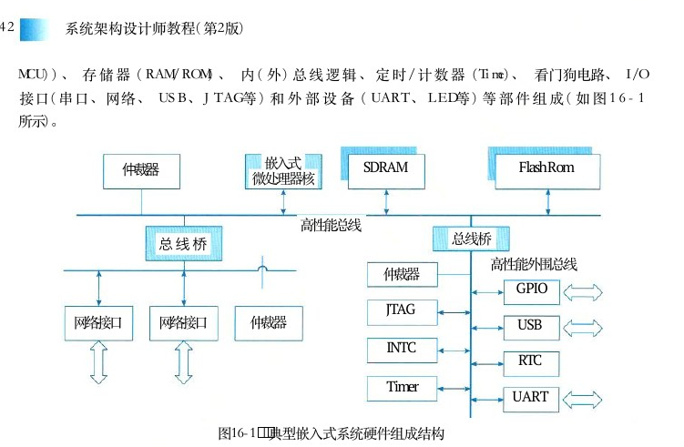

图16－1 典型嵌入式系统硬件组成结构

## 1．嵌入式微处理器

嵌入式微处理器主要用于处理相关任务。由于嵌入式系统通常都在室外使用，可能处于不同环境，因此，选择处理器芯片时，也要根据不同使用环境选择不同级别的芯片。其主要因素是芯片可适应的工作环境温度。通常，我们把芯片分为民用级、工业级和军用级。民用级器件的工作温度范围是0￣70℃、工业级的是－40￣85℃、军用级的是－55￣150℃。当然，除了环境温度外，环境湿度、震动、加速度等也是应考虑的因素。通常嵌入式处理器的选择还要根据使用场景不同选择不同类型的处理器，从处理器分类看，大致可分为：

● 微处理器(Micro Processor Unit,MPU)

● 微控制器(Micro Control Unit,MCU)

● 信号处理器(Digital Signal Processor,DSP)

● 图形处理器(Graphics Processing Unit,GPU)

● 片上系统(System on Chip,SoC)（ 1 ） 微处理器 （ MPU ） ： 将微处理器装配在专门设计的电路板上，只保留与嵌入式应用有关的母板功能。与工业控制计算机相比，其优点在于体积小，重量轻，成本低以及可靠性高，但是电路板上必须包括 ROM 、 RAM 、 总线接口、各种外设等器件，降低了系统的可靠性，技术保密性也较差。嵌入式微处理器目前主要有：Am186／88、386EX、SC－400、PowerPC、68000、MIPS 、 ARM 系列等。（ 2 ） 微控制器 （ MCU ） ： 又称单片机。微处理器一般以某一种微处理内核为核心，每－

<!-- PDF 第 555 页 -->

种衍生产品的处理器内核都是一样的，不同的是存储器和外设的配置和封装。与 MPU 相比，MCU 的最大优点在于单片化，体积大大减小，从而使功耗和成本下降，可靠性提高。微控制器比较有代表性的通用系列包括：8501， P51XA，MCS－251，MCS－96／196／296，C166／167，MC68HC05／11／12／16，68300和数目众多的 ARM系列。

（3）信号处理器 （ DSP ） ： DSP 处理器对系统结构和指令进行了特殊设计（通常， DSP 采用一种哈佛结构），使其适合于执行 DSP 算法，编译效率高，指令执行速度也高。 DSP 处理器比较有代表性的产品是 TI 公司生产的 TMS 3 2 0 系列（包括用于控制的 C2000 系列，移动通信的C5000 系列，以及性能更高的 C6000系列和 C8000 系列 ） 和Freescale 公司生产的 DSP56000 系列，另外 PHILIPS 公司近年也推出了基于可重置嵌入式 DSP 结构的采用低成本，低功耗技术制造的 R．E．A．L DSP 处理器。

（4）图形处理器 （ GPU ） ： GPU 是图形处理单元的缩写，是一种可执行渲染3D 图形等图像的半导体芯片（处理器）。 GPU可用于个人电脑、工作站、游戏机和一些移动设备上做图像和图形相关运算工作的为处理器。它可减少对 CPU 的依赖，并进行部分原本 CPU 的工作，尤其是在3D 图形处理中， GPU采用了核心技术（如：硬件 T＆L、 纹理压缩等）保证了快速3D 渲染能力。

（5）片上系统 （SoC）： 各种通用处理器内核作为 SoC 设计公司的标准库，与许多其他嵌入式系统的外设一样，成为 VLSI 设计中的一种标准的器件，用标准的 VHDL 等语言描述，存储在器件库中，用户只需要定义出整个应用系统。除个别无法集成的器件以外，整个嵌入式系统大部分都可集成到一块或几块芯片中。

## 2．存储器

存储器 （memory） 主要用于存储程序和各种数据信息的记忆部件，它也是时序逻辑电路的一种。按存储器的使用类型可分为只读存储器 （ ROM ） 和随机存储器 （ RAM ） ， 随机存储器在计算期间被用于高速暂存记忆区，数据可以在 RAM 中存储、读取和使用新数据代替；只读存储器被用于存储计算机在必要时的指令集，存储在 ROM 内的信息是一种硬接线方式（即一种物理组成），且不能被计算机改变（即“只读”特性）。可编程只读存储器 （ PROM ） 属于可变ROM ， 可以将其暴露在一个外部电器设备或光学器件中来改变。通常，存储器根据结构的不同分类多种，其分类如下：

1）RAM（Random Access Memory，随机存取存储器）RAM 的特点是：打开计算机，操作系统和应用程序的所有正在运行的数据和程序都会放置其中，并且随时可以对存放在里面的数据进行修改和存取。它的工作需要由持续的电力提供，一旦系统断电，存放在里面的所有数据和程序都会自动清空掉，并且再也无法恢复。根据组成元件的不同， RAM 内存又分为以下18种：（ 1 ） DRAM （ DynamicRAM ， 动态随机存取存储器）。这是最普通的 RAM ， 一个电子管与一个电容器组成一个位存储单元， DRAM 将每个内存位作为一个电荷保存在位存储单元中，用电容的充放电来做储存动作，但因电容本身有漏电问题，因此必须每几微秒就要刷新一次，否则数据会丢失。存取时间和放电时间一致，约为

<!-- PDF 第 556 页 -->

2￣4ms。 因为成本比较便宜，通常都用作计算机内的主存储器。

（2）SRAM（Static RAM， 静态随机存取存储器）。静态，指的是内存里面的数据可以长驻其中而不需要随时进行存取。每6个电子管组成一个位存储单元，因为没有电容器，因此无须不断充电即可正常运作，因此它可以比一般的动态随机处理内存处理速度更快更稳定，往往用作高速缓存。（ 3 ） VRAM （ VideoRAM ， 视频内存）。它的主要功能是将显卡的视频数据输出到数模转换器中，有效降低绘图显示芯片的工作负担。它采用双数据口设计，其中一个数据口是并行式的数据输出入口，另一个是串行式的数据输出口，多用于高级显卡中的高档内存。

（4）FPM DRAM（Fast Page Mode DRAM， 快速页切换模式动态随机存取存储器）。改良版的 DRAM ， 大多数为72Pin 或 3 0Pin 的模块。传统的 DRAM 在存取一位的数据时，必须送出行地址和列地址各一次才能读写数据。而FRMDRAM 在触发了行地址后，如果 CPU需要的地址在同一行内，则可以连续输出列地址而不必再输出行地址了。由于一般的程序和数据在内存中排列的地址是连续的，这种情况下输出行地址后连续输出列地址就可以得到所需要的数据。 FPM将记忆体内部隔成许多页 （Pages）， 从512B 到数 “KB” 不等，在读取一连续区域内的数据时，就可以通过快速页切换模式来直接读取各 Page 内的资料，从而大大提高读取速度。在1996年以前，在486时代和PENTIUM 时代的初期，FPMDRAM 被大量使用。

（5）EDO DRAM（Extended Data Out DRAM， 延伸数据输出动态随机存取存储器）。这是继 FPM 之后出现的一种存储器，一般为72Pin、168Pin 的模块。它不需要像 FPMDRAM 那样在存取每一位数据时必须输出行地址和列地址并使其稳定一段时间，然后才能读写有效的数据，而下一位的地址必须等待这次读写操作完成才能输出。因此它可以大大缩短等待输出地址的时间，其存取速度一般比FPM 模式快15％左右。它一般应用于中档以下的 Pentium主板标准内存，后期的486系统开始支持 EDODRAM ， 到1996年后期，EDODRAM 开始执行。

（6）BEDO DRAM（Burst Extended Data Out DRAM， 爆发式延伸数据输出动态随机存取存储器）。这是改良型的 EDODRAM ， 是由美光公司提出的，它在芯片上增加了一个地址计数器来追踪下一个地址。它是突发式的读取方式，也就是当一个数据地址被送出后，剩下的三个数据每一个都只需要一个周期就能读取，因此一次可以存取多组数据，速度比EDODRAM 快。但支持 BEDODRAM 内存的主板很少，只有极少几款提供支持（如 VIA APOLLO VP2）， 因此很快就被 DRAM 取代了。

（7）MDRAM（Multi－Bank DRAM， 多插槽动态随机存取存储器）。MoSys 公司提出的一种内存规格，其内部分成数个类别不同的小储存库 （ BANK ） ， 即由数个独立的小单位矩阵所构成，每个储存库之间以高于外部的资料速度相互连接，一般应用于高速显示卡或加速卡中，也有少数主机板用于 L 2 高速缓存中。（ 8 ） WRAM （ WindowRAM ， 窗口随机存取存储器）。韩国 Samsung公司开发的内存模式，是VRAM 内存的改良版，不同之处是它的控制线路有一二十组的输入／输出控制器，并采用 EDO的资料存取模式，因此速度相对较快，另外还提

<!-- PDF 第 557 页 -->

供了区块搬移功能 （BitBlt）， 可应用于专业绘图工作。（ 9 ） RDRAM （ RambusDRAM ， 高频动态随机存取存储器）。Rambus 公司独立设计完成的一种内存模式，速度一般可以达到500￣530MB／s， 是 DRAM的10倍以上。但使用该内存后内存控制器需要作相当大的改变，因此它们一般应用于专业的图形加速适配卡或者电视游戏机的视频内存中。

（10）SDRAM（Synchronous DRAM， 同步动态随机存取存储器）。这是一种与 CPU 实现外频 Clock 同步的内存模式，一般都采用168Pin 的内存模组，工作电压为3．3V。 所谓 Clock 同步是指内存能够与 CPU 同步存取资料，这样可以取消等待周期，减少数据传输的延迟，因此可提升计算机的性能和效率。

（11）SGRAM（Synchronous Graphics RAM， 同步绘图随机存取存储器）。SDRAM 的改良版，它以区块 Block（32bit） 为基本存取单位，减少内存整体读写的次数，另外还针对绘图需要而增加了绘图控制器，并提供区块搬移功能 （BitBlt）， 效率明显高于SDRAM。

（12）SB SRAM（Synchronous Burst SRAM， 同步爆发式静态随机存取存储器）。一般的 SRAM 是非同步的，为了适应 CPU 越来越快的速度，需要使它的工作时脉变得与系统同步，这就是 SBSRAM产生的原因。

（13）PB SRAM（Pipeline Burst SRAM， 管线爆发式静态随机存取存储器）。CPU 外频速度的迅猛提升对与其相搭配的内存提出了更高的要求，管线爆发式 SRAM 取代同步爆发式 SRAM成为必然的选择，因为它可以有效地延长存取时脉，从而有效提高访问速度。

（14）DDR SDRAM（Double Data Rate SDRAM， 二倍速率同步动态随机存取存储器）。作为SDRAM 的换代产品，它具有两大特点：其一，速度比 SDRAM快一倍；其二，采用了DLL（Delay Locked Loop， 延时锁定回路）提供一个数据滤波信号。这是目前内存市场上的主流模式。

（15）SLDRAM（Synchronize LinkDRAM， 同步链环动态随机存取存储器）。这是一种扩展型 SDRAM结构内存，在增加了更先进同步电路的同时，还改进了逻辑控制电路。（ 1 6 ） CDRAM （ CachedDRAM ， 同步缓存动态随机存取存储器）。这是三菱电气公司首先研制的专利技术，它是在DRAM 芯片的外部插针和内部DRAM 之间插入一个 SRAM 作为二级 Cache使用。当前，几乎所有的 CPU 都装有一级 Cache来提高效率，随着 CPU 时钟频率的成倍提高， Cache 不被选中对系统性能产生的影响将会越来越大，而Cache DRAM 所提供的二级 Cache 正好用以补充CPU 一级 Cache之不足，因此能极大地提高CPU 效率。

（17）DDRⅡI（Double Data Rate Synchronous DRAM， 第二代同步双倍速率动态随机存取存储器）。DDRⅡI 是 DDR 原有的 SLDRAM 联盟于1999年解散后将既有的研发成果与DDR整合之后的未来新标准。 DDRⅡI 的详细规格目前尚未确定。

<!-- PDF 第 558 页 -->

（18）DRDRAM（Direct Rambus DRAM）。DRDRAM 是下一代的主流内存标准之一，由 Rambus 公司所设计发展出来，是将所有的接脚都连接到一个共同的 Bus， 这样不但可以减少控制器的体积，还可以增加资料传送的效率。

## 2）ROM（Read Only Memory，只读存储器）

ROM 是线路最简单半导体电路，通过掩模工艺，一次性制造，在元件正常工作的情况下，其中的代码与数据将永久保存，并且不能够进行修改。一般应用于 PC 系统的程序码、主机板上的 BIOS （基本输入／输出系统 Basic Input／Output System） 等。它的读取速度比 RAM慢很多。根据组成元件的不同， ROM 内存又分为以下5种：（ 1 ） MASKROM （掩模型只读存储器）。制造商为了大量生产 ROM 内存，需要先制作一颗有原始数据的 ROM或 EPROM 作为样本，然后再大量复制，这一样本就是 MASKROM ， 而烧录在 MASKROM 中的资料永远无法做修改。它的成本比较低。

（2）PROM（Programmable ROM， 可编程只读存储器）。这是一种可以用刻录机将资料写入的 ROM 内存，但只能写入一次，所以也被称为“一次可编程只读存储器” （One Time Programming ROM，OTP－ROM）。PROM 在出厂时，存储的内容全为1，用户可以根据需要将其中的某些单元写入数据0（部分的 PROM 在出厂时数据全为0，则用户可以将其中的部分单元写入1），以实现对其“编程”的目的。

（3）EPROM（Erasable Programmable， 可擦可编程只读存储器）。这是一种具有可擦除功能，擦除后即可进行再编程的 ROM 内存，写入前必须先把里面的内容用紫外线照射它的 IC卡上的透明视窗的方式来清除掉。这一类芯片比较容易识别，其封装中包含有“石英玻璃窗”，一个编程后的 EPROM芯片的“石英玻璃窗”一般使用黑色不干胶纸盖住，以防止遭到阳光直射。

（4）EEPROM（Electrically Erasable Programmable， 电可擦可编程只读存储器）。功能与使用方式与EPROM 一样，不同之处是清除数据的方式，它是以约20V 的电压来进行清除的。另外它还可以用电信号进行数据写入。这类ROM 内存多应用于即插即用 （PnP） 接口中。

（5）Flash Memory （快闪存储器）。这是一种可以直接在主机板上修改内容而不需要将 IC 拔下的内存，当电源关掉后储存在里面的资料并不会流失掉，在写入资料时必须先将原本的资料清除掉，然后才能再写入新的资料，缺点为写入信息的速度太慢。

## 3．内（外）总线逻辑

总线是计算机各种功能部件之间传输信息的公共通信干线，它是由导电组成的传输线束，按照计算机所传输的信息种类，计算机总线应涵盖数据总线、地址总线和控制总线。数据总线用于在 CPU 与 RAM之间来回传送需要处理或者需要存储的数据；地址总线用于指定在 RAM

<!-- PDF 第 559 页 -->

之中存储的数据的地址；控制总线将微处理器控制单元的信号传送到周边设备。而扩展总线和局部总线则是根据系统需要而添加的。总线存在不同拓扑结构，主要包括星形、树状、环形、总线型和交叉开关型等五种。按连接部件分类，还可分片内总线、系统总线、局部总线和通信总线等四种。

● 片内总线：芯片内部总线 ， 用于连接芯片内部各个元件 （ 如寄存器、指令CPUALU部件 ）

● 系统总线：计算机内部总线，它是连接计算机系统的主要组件。 如用于连接主存CPU和I／O接口的总结。系统总线又称板级总线或内部总线。

● 局部总线：计算机内部总线，通常是指在少数组件之间交换数据的总线，如到北桥CPU的总线，内存到北桥的总线，局部总线的协议一般由设备制造商定义。在体系结构较简单的计算机系统中，局部总线和系统总线为同一条总线。

● 通信总线：嵌入式系统主机外部总线，用于连接外部输入输出设备或者其他不同的计算机系统。通信总线又称外部总线或外设总线。目前 ， 社会上广泛使用的总线有 ：Interbus、Mbus、PCI、cPCI、PCMCIA、I2C、SCI、CAN、VXI、IEEE 1394、MIL－STD－1553B 等。图16－2给出各类总线在嵌入式系统中的位置。

北桥芯片组把处理器、存储器和总线Registe fde分成了两个总线PCALU Memory bus System bus I/OMain Memory interface Memory bridge

I/O bus Expansion slots Disk USB Graphics controllercontroller adapter

Mouse Keyboard Display DiskI／O接口图16－2各类总线在嵌入式系统的位置

## 4．看门狗电路

看门狗电路是嵌入式系统必须具备的一种系统恢复能力。看门狗电路的基本功能是在系统发生软件问题和程序跑飞后使系统重新启动。其基本原理是看门狗计数器正常工作时自动计数，程序流程定期将其复位，如果系统在某处卡死或者跑飞，该定时器将溢出，并将进入中断处理，在设定时间间隔内，系统可保留关键数据，然后系统复位重启。（ 1 ） I ／ O 接口： I／O 接口是计算机与被控对象进行信息交流的纽带，处理器通过 I／O接口与外部设备进行数据交换。大部分I／O接口电路都是可编程的。常用的接口有：

<!-- PDF 第 560 页 -->

● 串行接口；

● 并行接口；

● 直接数据传送接口；

● 中断控制接口；

● 定时器／计数器接口；

● 离散量接口；

● 数字／模拟接口等。

（2）外部设备：外部设备是指计算机系统中输入、输出设备、外部存储器以及系统调试用的接口的统称。外部设备包含计算机以外的所有设备，这些外部设备都与计算机相连以辅助计算机完成相关操作。常见的计算机设备包括键盘、鼠标、显示器、笔输入设备、扫描仪、打印机、移动存储器、 JTAG 调试设备等。

## 16．1．3嵌入式软件架构概述

嵌入式系统的软件架构是随着嵌入式系统发展而发展起来的。在早期的单片机时代（20世纪80年代中期），由于嵌入式系统仅仅用于简单控制类系统，当时软件规模很小（一般是几十“KB”）， 软件开发人员使用汇编语言进行编程，调试手段是一种称之为监控程序 （Monitor） 的软件，基本没有嵌入式软件架构之说，要说架构也只能说是分为两层，即监控程序和应用软件；到了20世纪90年代，嵌入式系统开始走向各个领域，人们发现仅仅靠编制汇编语言已不能满足日益发展的需要，并且由于计算机主频不断升级，处理器仅仅处理简单业务已不能完全发挥计算机能力，因此，后期嵌入式系统开始大量采用嵌入式操作系统，实现计算机资源的统一管理，应用软件开发开始使用高级语言，而软件的开发采用了与嵌入式操作系统配套的开发环境，这样，使得嵌入式软件架构逐步形成。图16－3给出了简单的嵌入式软件架构。随着嵌入式系统智能化发展，在半导体技术、电应用软件子技术和软件技术等相关技术日异月新发展，物联嵌入式（实时）操作系统网、智能手机、智能制造和云计算等技术带领下，在(RTOS)嵌入式软件的重用技术、构件化技术、虚拟化技术以板级支持包 （BSP）及容器技术等的推动下，嵌入式软件架构得到了快速硬件层发展。在保持原层次架构的基础上，采纳了众多非嵌入式系统的软件架构，如事件驱动架构、微服务架构图16－3 简单的嵌入式软件架构等。由于嵌入式系统的专用性，其架构和目标系统是紧密结合的，通常没有统一的架构，要根据嵌入式系统的应用目标的需求，在根据系统的复杂程度、功能大小，来采用不同架构设计方法。目前，比较典型的嵌入式软件架构有两种：层次化模式架构和递归模式架构。为了对嵌入式系统架构概念的进一步理解，作为用例，图16－4给出了美国汽车工程学会 （SAE） 在 AS4893标准中定义的一款嵌入式系统的《通用的开放式架构 （Generic OpenArchitecture，GOA）》 架构。

<!-- PDF 第 561 页 -->

应用软件应用软件

## 4L

## 4D

系统系统服务服务

## 4DXOS服务XOS 服务

## 4D

## 3X3L3X

## 3D

操作系统服务操作系统服务

## 3D

## 3D3D

## 2L

资源访问服务（驱动程序）资源访问服务（驱动程序）

## 2D2D

物理资源物理资源物理资源物理资源

## 1L1L

## 1D

## 1D1D
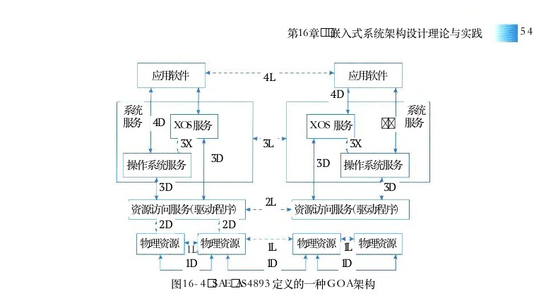

图16－4 SAE AS4893 定义的一种 GOA 架构

GOA架构实际上给出了是一种架构框架，其目的是解决嵌入式系统的开放性、软件的可移植性等问题，这里的通用性也是相对而言的，它是针对嵌入式系统的特征，以层次化架构风格为主要思想，采用抽象方法，规定了软件、硬件和接口的结构，以便在不同应用领域中实现系统功能。本架构规定了一组接口，重点是建立确定了关键组件及这些组件之间接口的框架，这些接口的确定可用于支持系统的移植和升级，也可以适应于功能的增加和技术的更新 。 因此 ， 此架构规定了 4 种直接接口和 4 种逻辑接口 ， 这里的直接接口是指上下层次间程序的功能引用可以直接调用，逻辑接口是指同层间的功能引用可以采用基于消息方式的逻辑接口。GOA 架构的主要特点如下：

（1）可移植性。各种计算机应用系统可在具有开放结构特性的各种计算机系统间进行移植，不论这些计算机是否同种型号、同种机型。

（2）可互操作性。如计算机网络中的各结点机都具有开放结构的特性，则该网上各结点机间可相互操作和资源共享。（ 3 ） 可剪裁性 。 如某个计算机系统是具有开放结构特性的 ， 则在该系统的低档机上运行的应用系统应能在高档机上运行 ， 原在高档机上运行的应用系统经剪裁后也可在低档机上运行。

（4）易获得性。在具有开放结构特性的机器上所运行的软件环境易于从多方获得，不受某个来源所控制。从嵌入式系统架构设计的角度看，每一款架构都应满足目标系统的特性要求，架构设计的目的应充分考虑系统的可靠性、安全性、可伸缩性、可定制性、可维护性、客户体验和市场时机等因素。

<!-- PDF 第 562 页 -->

## 16．2嵌入式系统软件架构原理与特征

## 16．2．1两种典型的嵌入式系统架构模式

大多数嵌入式系统都具备实时特征，那么，这种嵌入式系统的典型架构可概括为两种模式，即层次化模式架构和递归模式架构。

## 1．层次化模式架构

包为了达到概念一致性，许多系统通过层次化（更抽象的域只依赖的方法进行搭建。这样做的结果是：位于高层的于更具体的域）抽象概念与低层的更加具体的概念之间存在着依赖关系。即：系统所在的域可以被认为是由一组带有语义的概念构成，并且这些概念位于一个特《域》定的抽象层次之中。域中更加抽象的概念是由位于其他层上更为具体的概念实现。图16－5 层次化模式架构的示意图层次化模式依赖于概念的抽象，不同使用者可关注到架构的不同层面的细节。图16－5给出层次化模式架构的示意图。层次化模式架构主要设计思想是：

（1）当一个系统存在高层次的抽象，这些抽象的表现形式是一个个的抽象概念，而这些抽象概念需要具体的低层概念进行实现时，就可采用层次化模式。

（2）分层模式结构只包含了一个主要的元素（域包）和它的接口，以及用来说明模式结构的约束条件。

（3）层次化模式可以分为两种：封闭型和开放性。封闭型的特征是：一层中的对象只能调用同一层或下一个底层的对象提供的方法。而开放型一层中的对象可以调用同一层或低于该层的任意一层的对象提供的方法。这两种的优缺点在于：开放型的性能较好，但由于破坏了封装，所以移植性不如封闭型的系统。

## 2．递归模式架构

递归模式解决的问题是：需要将一个非常复杂的系统进行分解，并且还要确保分解过程是可扩展的，从属即只要有必要，该分解过程就可以持续下去。这样做元素的好处是：可以将需求阶段得到的一个非常复杂的用例用逐步求精的方法映射到这种设计架构，并在每步求精细化时，进行系统可靠性和实时性的验证。递归模式实际上是对系统的抽象：系统中的交图16－6递归模式架构的示意图互协作可以在不同的层次上进行抽象，只不过每层反映的细节不同而已。图16－6给出递归模式架构的示意图。递归模式的实现实际上就是靠重复应用简单的包含关系。在创建这种模式的实例时，通常

<!-- PDF 第 563 页 -->

使用两种相反的工作流程。

● 自顶向下： 自顶向下的工作流从系统层级开始并标识结构对象，这些对象提供实现协作的服务。在实时系统和嵌入式系统中，大多数情况下是基于某个标准方法，将系统分成一个个子系统。当开发人员逐步降低抽象层级，向下推进时，容易确保开发者的工作没有偏离用例中所规定的需求。

● 自底向上： 自底向上专注于域的构造——首先确定域中的关键类和关系。这种方法之所以可行是因为：开发者以往有丰富的开发经验，并能将其他领域所获得的知识映射到当前开发所在的域中。通过这种方法，最终开发者会到达子系统级的抽象。

## 16．2．2嵌入式操作系统

## 1．嵌入式操作系统的定义及特点

嵌入式操作系统 （Embedded Operating System，EOS） 是指用于嵌入式系统的操作系统。嵌入式操作系统是一种用途广泛的系统软件，负责嵌入式系统的全部软、硬件资源分配、任务调度、控制、协调并行活动等工作。通常包括与硬件相关的底层驱动软件、系统内核、设备驱动接口、通信协议、图形界面、标准化浏览器等。嵌入式操作系统与通用操作系统相比，具备以下主要特点。

（1）可剪裁性：支持开放性和可伸缩性的体系结构；

（2）可移植性：操作系统通常可运行在不用体系结构的处理器和开发板上；

（3）强实时性：嵌入式操作系统实时性通常较强，可用于各种设备的控制；

（4）强紧凑性：由于嵌入式系统的资源受限的特点，嵌入式操作系统代码需要紧凑、精炼，不应存在无用代码；

（5）高质量代码：嵌入式系统已被广泛用于安全攸关系统，要求嵌入式操作系统代码质量要可靠，不存在由于代码的缺陷引发重大损失；

（6）强定制性：嵌入式操作系统可根据目标系统的不同需求，进行专业化定制；

（7）标准接口：嵌入式操作系统可提供设备统一的驱动接口；

（8）强稳定性、弱交互性：嵌入式系统一旦运行就不需要用户过多干预，这就要负责管理的操作系统具有较强的稳定性。 EOS 的用户接口一般不提供操作命令，它是通过系统的调用命令向用户程序提供服务的；

（9）强确定性： EOS对任务调度和资源管理应能够确保其在规定的时间、规定的容量内不发生任务超时和资源枯竭；

（10）操作简洁、方便： EOS提供友好的图形GUI 和图形界面，追求易学易用；

（11）较强的硬件适应性：可适应多种类型的硬件资源。这里有两层意思：其一是代码支持的硬件要有较强的可移植性；其二是可最大限度地发挥硬件处理能力；

（12）可固化性：在嵌入式系统中，嵌入式操作系统和应用软件通常是被固化在计算机系统的ROM 中，系统运行时调入内存运行。

<!-- PDF 第 564 页 -->

## 2．嵌入式操作系统的分类

嵌入式操作系统的通常分为两类，一类是面向控制、通信等领域的嵌入式实时操作系统。如 WindRive 公司 VxWorks、ATI 公司 Nucleus 等；另一类是面向消费电子产品的非实时嵌入式操作系统，这类产品包括移动电话、机顶盒、电子书等，操作系统包括 Google 公司的 Android、Apple 公司的 iOS， 以及 Microsoft 公司的 WinCE 等。

## 3．嵌入式操作系统的一般架构

嵌入式操作系统通常由硬件驱动程序、调试代理、操作系统内核、文件系统和可配置组件等功能组成，并为应用软件提供标准的API（Application Programming Interface） 接口服务。从嵌入式操作系统体系架构看，主要存在4种结构：整体结构、层次结构、客户／服务器结构和面向对象结构。本节主要介绍了整体结构的相关知识。整体结构也称为模块结构或无序结构，它是基于结构化程序设计的一种软件设计方法。图16－7给出了传统嵌入式操作系统的体系结构。

与硬件无关的软件应用程序

I／O系统操作系统可配置库网络系统

调试代理文件系统操作系统内核

与硬件相关的软件LSN驱动程序SCSI驱动程序BSP

硬件SCSI控制器SCC中断控制器定时器以太网控制器Pentium ARMPowerPCMIPS
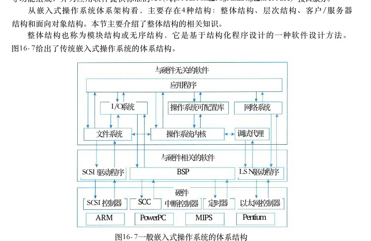

图16－7一般嵌入式操作系统的体系结构

如图16－7所示，嵌入式操作系统通常应支持多种处理器类型，一般选择嵌入式操作系统产品前，需要考虑对该产品覆盖处理器的能力。对于与硬件相关的软件而言，与处理器硬件相关的驱动称为结构支持包 （ASP）， 与处理器外围芯片相关的驱动称之为板级支持包 （ BSP ） ， 对于特殊硬件配置，如 SCSI 盘、图形处理芯片，其驱动程序应单独设计。嵌入式操作系统通过调用硬件驱动软件实现对硬件资源的管理，其本身软件可与硬件无关，嵌入式操作系统核心是由操作系统内核和操作系统可配置库组成，操作系统内核是系统主体，承载着操作系统核心功能，其主要完成任务管理、内存管理、任务间通信管理、时钟管理和中断管理等功能。操作系统可配置库是操作系统功能的延伸，为应用程序提供更加丰富的服务，可配置库是一种可配置、可剪裁库代码，用户可根据目标系统的需求，进行静态或动态裁剪。其主要包括运行时库、设备

<!-- PDF 第 565 页 -->

管理、人机接口、图形图像以及 API 扩展等。文件系统是嵌入式操作系统必须支持组件功能，它主要是为嵌入式系统提供数据或程序的存储能力。在嵌入式操作系统中，通常提供了DosFS 文件系统，为了满足实时性要求，不同操作系统产品还提供了其他类型的文件系统 ， 如 VxWorks还以提供了RT 1 1 FS ， TSFS 和TFFS 等。I／O 系统是嵌入式操作系统必须提供的组件功能，它能够为嵌入式系统提供标准的出入输出管理。 I／O 系统的主要功能是为数据传输操作选择输入／输出设备、控制被选输入／输出设备与主机之间的信息交换。网络系统是嵌入式操作系统为满足嵌入式系统的互通互联所支持网络通信协议软件，如TCP／IP、UDP 等，同时可支持宿主机的软件开发。

## 4．嵌入式操作系统的基本功能

## 1）操作系统内核架构

内核是操作系统的核心部分，它管理着系统的各种资源。内核可以看成连接应用程序和硬件的一座桥梁，是直接运行在硬件上的最基础的软件实体。目前从内核架构来划分，可分为宏内核 （Monolithic Kernel） 和微内核 （Micro Kernel）。宏内核：宏内核管理着用户程序和硬件之间的系统资源，在宏内核架构中，用户服务和内核服务在同一空间中实现。具体一点，就是内核可以代表内核进程运行代码，就是通常的内核进程；当用户进程经过系统调用或者中断进入到内核态时，内核也可以代表它运行代码。宏内核代码耦合度非常高，甚至内核的功能组件代码可以互相调用。如： vxworks5．5、VRTX等嵌入式操作系统均采用的是宏内核。图16－8给出了宏内核的基本架构。

用户空间应应应应用用用用程程程程序序序序进进进进程程程程

系统API内核空间

驱动程序及进程管理内存管理设备管理文件管理功能代码功能代码功能代码功能代码其他功能代码
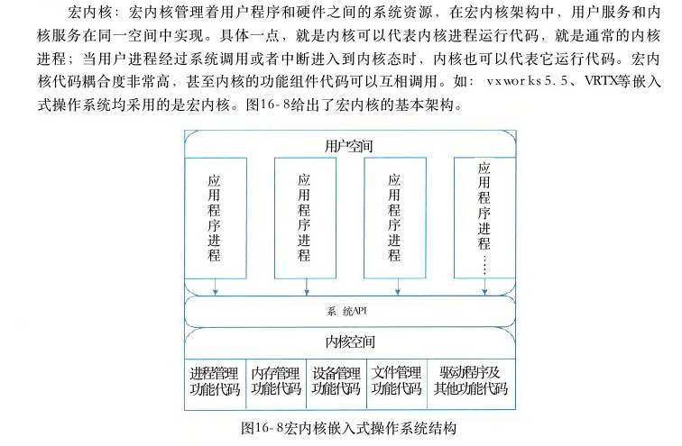

图16－8宏内核嵌入式操作系统结构

微内核：内核管理着所有的系统资源，在微内核中用户服务和内核服务在不同的地址空间中实现。在应用程序和硬件的通信中，内核进程和内存管理的极小的服务，而客户端程序

<!-- PDF 第 566 页 -->

和运行在用户空间的服务通过消息的传递来建立通信，它们之间不会有直接的交互，这样一来，微内核中的执行速度相对就比较慢了，这是微内核架构的一个缺点。微内核系统结构相当清晰，有利于协作开发；微内核有良好的移植性，代码量非常少；微内核有相当好的伸缩性、扩展性。缺点是性能偏低。如：嵌入式 Linux、L4、WinCE。 图16－9给出了微内核的基本架构。

用户空间

各驱进设应内文动用存程件备应程用程管管管管序程序理理理理服进服服服服序务程务务务务进进…进进进进程程…程程程程……

内核空间

进程调度内存空间中断处理进程间器代码通信代码映射代码代码

硬件平台图16－9微内核嵌入式操作系统结构

## 2 ） 任务管理

任务管理是嵌入式操作系统最基本功能之一，这里的任务 （task） 是指嵌入式操作系统调度的最小单位，类似于一般操作系统进程或线程的概念。任务是运行中的一个程序，一个程序加载到内存后就变成任务：任务 ＝ 程序 ＋ 执行任务一旦被加载到计算机内存后，通常会处于不同的工作状态，这种状态可随着计算机运行而转变。在嵌入式操作系统中，任务的工作状态最简单的可分为三种：执行态、就绪态和阻塞态，其转换关系见图16－10。执行态

● 执行态：当任务已获得处理机，其程序正在处理调度器选择机上执行，此时的任务状态称为执行状态。进程因等待另一个进程输入阻塞调度器选

● 就绪状态：当任务已分配到除以外的所有必CPU择本进程要的资源，只要获得处理机便可立即执行，这时阻塞态就绪态的任务状态称为就绪状态。输入数据到达

● 阻塞状态：正在执行的任务，由于等待某个事件图16－10任务三种状态的转换

<!-- PDF 第 567 页 -->

发生而无法执行时，便放弃处理机而处于阻塞状态。引起进程阻塞的事件可有多种，例如，等待I／O完成、申请缓冲区不能满足、等待信件（信号）等。三种基本状态转换：

● 就绪→执行：处于就绪状态的任务，当任务调度程序为之分配了处理机后，该任务便由就绪状态转变成执行状态。

● 执行→就绪：处于执行状态的任务在其执行过程中，因分配给它的一个时间片已用完而不得不让出处理机，于是任务从执行状态转变成就绪状态。

● 执行→阻塞：正在执行的任务因等待某种事件发生而无法继续执行时，便从执行状态变成阻塞状态。

● 阻塞→就绪：处于阻塞状态的任务，若其等待的事件已经发生，于是任务由阻塞状态转变为就绪状态。由于嵌入式系统中大部分应用领域是实时系统，因此，嵌入式操作系统的任务实时调度问题是操作系统任务管理的核心技术。许多嵌入式操作系统都支持优先级抢占调度算法和时间片轮转调度算法。在嵌入式强实时系统中，操作系统必须支持执行一组并发实时任务，使所有时间关键任务满足其指定的截止时限 （Deadline）。 每个任务需要计算，数据和其他资源（例如输入／输出设备）来执行。而调度问题涉及这些资源的分配以满足所有的时序要求，在实时系统的任务调度中，存在大量的实时调度方法，大致可以概述为主要三种划分，即离线 （Off－Line） 和在线（On－Line） 调度、抢占 （Preemptive） 和非抢占 （Non－Preemptive） 调度、静态 （Static） 和动态（Dynamic） 调度等。

（1）离线和在线调度。根据获得调度信息的时机，调度算法可以分为离线调度和在线调度两类。对于离线调度算法，运行过程中使用的调度信息在系统运行之前就确定了，如时间驱动的调度。离线调度算法具有确定性，但缺乏灵活性，适用于特征能够预先确定，且不容易发生变化的应用。在线调度算法的调度信息则在系统运行过程中动态获得，如优先级驱动的调度（如 EDF 、 RMS 等）。在线调度算法在形成最佳调度决策上具有较大的灵活性。

（2）抢占和非抢占调度。根据任务在运行过程中能否被打断的处理情况。调度算法分为抢占式调度和非抢占式调度两类。在抢占式调度方法中，正在运行的任务可能被其他任务打断。在非抢占式调度算法中，一旦任务开始运行，该任务只有在运行完成而主动放弃 CPU 资源，或是因为等待其他资源被阻塞的情况下才会停止运行。实时内核大都采用了抢占式调度算法，使关键任务能够打断非关键任务执行，确保关键任务的截止时间能够得到满足。相对来说，抢占式调度算法要更复杂些，且需要更多的资源，并可能在使用不当的情况下造成低优先级任务出现长时间得不到执行的情况。非抢占式调度算法常用于那些任务需要按照预先确定的顺序执行，且只有当任务主动放弃CPU 资源后，其他任务才能得到执行的情况。

（3）静态和动态调度。根据任务优先级的确定时机，调度算法分为静态调度和动态调度两类。在静态调度算法中，

<!-- PDF 第 568 页 -->

所有任务的优先级在设计时已经确定下来，且在运行过程中不会发生变化（如 RMS）。 在动态调度算法中，任务的优先级则在运行过程中确定，并可能不断发生变化（如 EDF）。 静态调度算法适用于能够完全把握系统中所有任务及其时间约束（如截至时间、运行时间、优先顺序和运行过程中的到达时间）特性的情况。静态调度比较简单，但缺乏灵活性，不利于系统扩展；动态调度有足够的灵活性来处理变化的系统情况，但需要消耗更多的系统资源。下面介绍几种典型强实时调度算法：

（1）最早截止时间优先 （Earliest Deadline First，EDF） 算法。该算法是根据任务的开始截止时间来确定任务的优先级。截止时间愈早，其优先级愈高。该算法要求在系统中保持一个实时任务就绪队列，当一个事件发生时，对应的进程就被加入就绪进程队列。该队列按各任务截止时间的早晚排序，具有最早截止时间的任务排在队列的最前面。调度程序在选择任务时，总是选择就绪队列中的第一个任务，即截止时间最近的那个进程，为之分配处理机，使之投入运行。调度原理见图16－11。最早截止时间优先算法既可用于剥夺式调度，也可用于非剥夺式调度方式中。

A 和B都是周期性任务，A 每隔20秒启动一次，每次执行10秒， B 每隔50秒启动一次，每次执行25秒，试用固定优先级和抢占式EDF调度算法分析执行次序。B2 B1 AlA2A3A4A5 A2A3A4A5到达时间、执行A1 B1 B 2时间和最后期限图16－11 抢占的 EDF调度算法示例

（2）最低松弛度优先 （Least Laxity First，LLF） 算法。该算法是根据任务紧急（或松弛）的程度，来确定任务的优先级。任务的紧急程度愈高，该任务被赋予的优先级就愈高，以使之优先执行。松弛度（又叫富裕度）即进程的富裕时间，例如，一个任务在达到200ms 时必须完成，而它本身所需的运行时间就有100ms ， 因此，调度程序必须在100ms 之前调度执行，该任务的紧急程度（松弛程度）为100ms。 在实现该算法时首先计算各个进程的松弛度，组织一个按松弛度排序的实时任务就绪队列，松弛度最低的任务排在队列最前面，调度程序总是选择就绪队列中的队首任务，即松弛度最少的进程执行。该算法主要用于可剥夺调度方式中。调度原理见图16－12 （a）。例如，在嵌入式实时系统中，有两个周期性实时任务 A 和 B ， 任务 A 要求每20ms 执行一次，执行时间为10ms； 任务 B 则要求每50ms执行一次，执行时间为25ms。 任务 A 和 B 每次必须完成的时间A ？ ， A 2 ， A 3 ， … 和 B 1 ， B 2 ， B 3 ， … 。 如图16－12 （b） 所示。AAAA A,AA A4 t→BB B(a)

<!-- PDF 第 569 页 -->

松弛度＝必须完成时间－其本身的运行时间－当前时间A (10)A (10)A,(10)A (10)t t？ttt t4ts

B (20)B,(5)B (15)B (10)t＝0ms时，A？的松弛度是10ms，B1的松弛度是25ms， 调度A？执行；t＝10ms时，A2尚未到达，调度Bl执行；t＝30ms时，A 2的松弛度是0ms，B1的松弛度是15（50－5－30） ms， 调度A2执行；t＝40ms时，A3的松弛度是10ms，B1 的松弛度是5（50－5－40） ms， 重新调度B1执行；t＝45ms时，B1执行完成，A 3的松弛度是5（60－10－45） ms， 调度A3执行；t＝55ms时，A 尚未进入第4周期，B 已进入第二周期，故再调度B2执行；t＝70ms时，A4松弛度已减至0ms， 而B2的松弛度是20（100－70－10） ms，故此时又应该抢占B2的处理机而调度A4执行。(b)图16－12 LLF 调度原理示例

（3）单调速率调度算法 （Rate Monotonic Scheduling，RMS）。RMS 是一种静态优先级调度算法，是经典的周期性任务调度算法。 RMS的基本思路是任务的优先级与它的周期表现为单调函数的关系，任务的周期越短，优先级越高；任务的周期越长，优先级越低。如果存在一种基于静态优先级的调度顺序，使得每个任务都能在其期限时间内完成，那么 RMS 算法总能找到这样的一种可行的统调度方案。例如，我们有两个进程 P？ 和 P？。P？ 和 P？的周期分别为50ms和 1 0 0ms， 即 P？＝50ms和 P？＝100ms。P？ 和 P？ 的处理时间分别为 t？＝20ms 和 t？＝35ms。 每个进程的截止期限要求，它在下一个周期开始之前完成 CPU 执行。使用单调速率调度，这里 P，分配的优先级要高于 P？ 的，因为 P？的周期比 P？的更短。在这种情况下，这些进程执行如图16－13所示。P,PPP,P P截止期限

PPP P. P P2 P . P 2
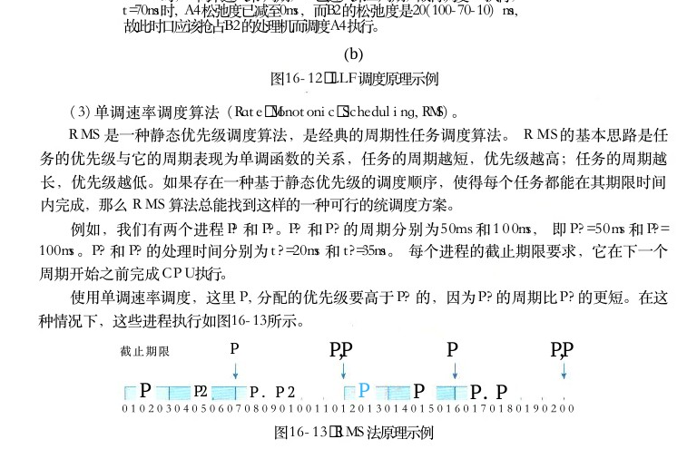

图16－13 RMS 法原理示例

首先， P？开始，并在时间20ms 完成 CPU 执行，从而满足第一个截止期限。 P2在这点开始运行，并运行直到时间50ms。 此时，它被 P？抢占，尽管它的CPU 执行仍有5ms 的时间。 P，在时间70ms完成 CPU 执行，在这点调度器恢复 P？。P？在时间75ms完成 CPU 执行，也满足第一个截止期限。然后，系统一直空闲直到时间100ms ， 这时， P ，再次被调度。单调速率调度可认为是最优的，因为如果一组进程不能由此算法调度，它不能由任何其他分配静态优先级的算法来调度。

## 3）存储管理

存储器管理是嵌入式操作系统的基本功能之一。其管理的对象是主存，也称内存。它的主

<!-- PDF 第 570 页 -->

要功能包括分配和回收主存空间、提高主存利用率、扩充主存、对主存信息实现有效保护。存储器管理的目的就是要提供一个有价值的内存抽象，其目标包括：

● 地址保护：一个程序不能访问另一个程序地址空间；

● 地址独立：程序并发的地址应与物理主存地址无关。存储管理方法的主要目的是解决多个用户使用主存的问题，其存储管理方法主要包括分区存储管理、分页存储管理、分段存储管理、段页存储管理以及虚拟存储管理等5种。

（1）分区存储。分区存储管理又有三种不同的方式：静态分区、可变分区、可重定位分区。①静态分区。静态分区存储管理是预先把可分配的主存储器空间分割成若干个连续区域，每个区域的大小可以相同，也可以不同。为了说明各分区的分配和使用情况，存储管理需设置一张“主存分配表”。主存分配表指出各分区的起始地址和长度，表中的占用标志位用来指示该分区是否被占用了，当占用的标志位为“0”时，表示该分区尚未被占用。进行主存分配时总是选择那些标志为“0”的分区，当某一分区分配给一个作业后，则在占用标志栏填上占用该分区的作业名。采用静态分区存储管理，主存空间的利用率不高。②可变分区。可变分区方式是按作业的大小来划分分区。当要装入一个作业时，根据作业需要的主存量查看主存中是否有足够的空间，若有，则按需要量分割一个分区分配给该作业；若无，则令该作业等待主存空间。由于分区的大小是按作业的实际需要量来定的，且分区的个数也是随机的，所以可以克服固定分区方式中的主存空间的浪费。随着作业的装入、撤离，主存空间被分成许多个分区，有的分区被作业占用，而有的分区是空闲的。当一个新的作业要求装入时，必须找一个足够大的空闲区，把作业装入该区，如果找到的空闲区大于作业需要量，则作业装入后又把原来的空闲区分成两部分，一部分给作业占用了；另一部分又分成为一个较小的空闲区。当一作业结束撤离时，它归还的区域如果与其他空闲区相邻，则可合成一个较大的空闲区，以有利于大作业的装入。可变分区调度算法如下：

● 首次适应算法。每次分配时，总是顺序查找未分配表，找到第一个能满足长度要求的空闲区为止。分割这个找到的未分配区，一部分分配给作业，另一部分仍为空闲区。这种分配算法可能将大的空间分割成小区，造成较多的主存“碎片”。

● 最佳适应算法。从空闲区中挑选一个能满足作业要求的最小分区，这样可保证不去分割一个更大的区域，使装入大作业时比较容易得到满足。采用这种分配算法时可把空闲区按大小以递增顺序排列，查找时总是从最小的一个区开始，直到找到一个满足要求的区为止。

● 最坏适应算法。挑选一个最大的空闲区分割给作业使用，这样可使剩下的空闲区不至于太小，这种算法对中、小作业是有利的。采用这种分配算法时可把空闲区按大小以递减顺序排列，查找时总是从最大的一个区开始。按这种方法，在收回一个分区时也必须对表格重新排列。③可重定位分区。可重定位分区也可称之为动态重定位分区方法，它是充分利用存储器管理的虚拟－物理地址动态映射关系实现存储分配的。其工作原理是作业在动态运行时装入内存的所有地址都是一种相对地址（即逻辑地址），将相对地址转换为物理地址的工作，被推迟到程序指令要真正执行时进行。为使地址的转换不会影响到指令的执行速度，必须有硬件地址变换

<!-- PDF 第 571 页 -->

机构的支持（如： MMU ） ， 即需在系统中增设一个重定位寄存器，用来存放程序（数据）在内存中的起始地址。程序在执行时，真正访问的内存地址是相对地址与重定位寄存器中的地址相加而形成的。

（2）分页存储。分页存储管理是将一个进程的逻辑地址空间分成若干个大小相等的片，称为页面或页，并为各页加以编号，从0开始，如第0页、第1页等。相应地，也把内存空间分成与页面相同大小的若干个存储块，称为（物理）块或页框 （frame）， 也同样为它们加以编号，如 O ＃块、1＃块等等。在为进程分配内存时，以块为单位将进程中的若干个页分别装入到多个可以不相邻的物理块中。由于进程的最后一页经常装不满一块而形成了不可利用的碎片，称为“页内碎片”。

（3）分段存储。在分段存储管理方式中，作业的地址空间被划分为若干个段，每个段定义了一组逻辑信息。例如，有主程序段 MAIN、 子程序段X、 数据段D 及栈段 S 等。每个段都有自己的名字。为了实现简单起见，通常可用一个段号来代替段名，每个段都从0开始编址，并采用一段连续的地址空间。段的长度由相应的逻辑信息组的长度决定，因而各段长度不等。整个作业的地址空间由于是分成多个段，因而是二维的，亦即，其逻辑地址由段号（段名）和段内地址所组成。

（4）段页存储。段页式系统的基本原理，是基本分段存储管理方式和基本分页存储管理方式原理的结合，即先将用户程序分成若干个段，再把每个段分成若干个页，并为每一个段赋予一个段名。

（5）虚拟存储。当程序的存储空间要求大于实际的内存空间时，就使得程序难以运行了。虚拟存储技术就是利用实际内存空间和相对大得多的外部储存器存储空间相结合构成一个远远大于实际内存空间的虚拟存储空间，程序就运行在这个虚拟存储空间中。能够实现虚拟存储的依据是程序的局部性原理，即程序在运行过程中经常体现出运行在某个局部范围之内的特点。在时间上，经常运行相同的指令段和数据（称为时间局部性），在空间上，经常运行与某一局部存储空间的指令和数据（称为空间局部性），有些程序段不能同时运行或根本得不到运行。虚拟存储是把一个程序所需要的存储空间分成若干页或段，程序运行用到页和段就放在内存里，暂时不用就放在外存中。当用到外存中的页和段时，就把它们调到内存，反之就把它们送到外存中。装入内存中的页或段可以分散存放。虚拟存储技术不仅可让我们可以使用更多的内存，它还提供了以下功能：

● 寻址空间：操作系统让系统看上去有比实际内存大得多的内存空间。虚拟内存可以是系统中实际物理空间的许多倍。每个进程运行在其独立的虚拟地址空间中。这些虚拟空间相互之间都完全隔离开来，所以进程间不会互相影响。同时，硬件虚拟内存机构可以将内存的某些区域设置成不可写。这样可以保护代码与数据不会受恶意程序的干扰。

● 内存映射：内存映射技术可以将映象文件和数据文件直接映射到进程的地址空间。在内存映射中，文件的内容被直接连接到进程虚拟地址空间上。

● 物理内存分配：内存管理子系统允许系统中每个运行的进程公平地共享系统中的物理内存。

● 共享虚拟内存：尽管虚拟内存允许进程有其独立的虚拟地址空间，但有时也需要在进程

<!-- PDF 第 572 页 -->

之间共享内存 。 例如有可能系统中有几个进程同时运行BASH命令外壳程序 。 为了避免在每个进程的虚拟内存空间内都存在BASH程序的拷贝 ， 较好的解决办法是系统物理内存中只存在一份BASH的拷贝并在多个进程间共享 。 动态库则是另外一种进程间共享执行代码的方式 。 共享内存可用来作为进程间通信 （ IPC ） 的手段 ， 多个进程通过共享内存来交换信息。 Linux支持SYSTEMV的共享内存IPC机制。表 1 6 － 1 给出了 5 种存储器管理比较 。表16－1 5种存储管理比较存储缺点功能描述优点管理分区存储分为静态分区、可变分区、可重定位分区。其主要做法是将内存空间分成几个区域，在● 空间浪费问题：碎片存在分区加载程序时，选择一个当前闲置且 ● 管理简单● 程序受限问题 ： 增长存在，空间增长效率低和存储容量够大的分区进行加载。而可变 ● 采用静态地址翻译是将内存空间看作一个整体，在加增长存在天花板限制载程序时，就在该片空间里面分出一个大小刚刚满足程序所需的空间核心是将虚拟内存空间和物理内

● 不会产生外部碎片● 页表很大 ， 占用大量内存空间皆划分成大小相同的页面，存空间分页● 可解决进程空间的增长并以页面作为内存空间的最小分存储● 页面可共享● 程序全部装入内存 ， 需配单位。一个程序的一个页面可要有相应的硬件支持以放在任意一个物理页面里

● 每个逻辑单元可单独占一个虚拟地址空间，使得空间大为增长核心是将一个程序按照逻辑单元分成多个程序段，每一个段使用 ● 段是按逻辑关系而分，共享自己单独的虚拟地址空间。如编起来就非常方便分段● 存在外部碎片和一个段存储译器，可以将一个程序分成5个 ● 对于空间稀疏程度而言，分必须全部加载到内存虚拟空间，即符号表、代码段、段管理将节省大量的空间

● 可以分别编写和编译，可以常数段、词法数和调用栈对不同类型的段采取不同的保护段页式管理就是将程序分为多个逻 ● 便于程序模块化设计

● 管理的复杂度和开销增加段页辑段，在每个段里面又进行分页， ● 减少存储空间的浪费● 需要的硬件及占有内存存储增加，执行速度下降即将分段和分页组合起来使用● 可实现程序的动态链接虚拟存储技术就是利用实际内存 ● 内存利用率高空间和相对大的外部储存器存储 ● 程序不受现有内存空间的● 需要硬件支持虚拟空间相结合构成一个远远大于实限制● 存在带宽瓶颈存储

● 系统扩展性差际内存空间的虚拟存储空间，程 ● 可提高多道程序度序就运行在这个虚拟存储空间中

● 良好的经济性

<!-- PDF 第 573 页 -->

## 4）任务间通信

任务间通信管理也是嵌入式操作系统的关键功能之一。它主要为操作系统的应用程序提供多种类型的数据传输、任务同步／异步操作等手段。由于嵌入式操作系统是为应用提供管理、硬件支持、协调任务和中断处理程序等功能，具备着多任务能力，那么操作系统任务之间一般存在以下关系：

（1）相互独立：任务之间仅仅存在竞争 CPU的资源，再无其他关联。

（2）竞争：任务之间存在对除 CPU外的其他资源的竞争（即互斥机制）。共享资源是多任务系统中主要关心的问题，在系统中，大多数的资源在某一时刻仅能被某一任务使用，并且在使用过程中不能被其他任务中断。这些资源主要包括特定的外设、共享内存等。当 CPU禁止并发操作时，那些包含了使用 CPU之外的共享资源的代码就不能同时被多个任务调用执行。这样的代码称为“临界区域”。如果两个任务同时进入临界区域，将会产生意想不到的错误。

（3）同步：协调彼此运行的步调。

（4）通信：彼此间传递数据和信息，以协调完成某项工作。通信可以是在任务与任务之间，或中断服务程序 （ISR） 与任务之间。因此，要实现多任务间的协同工作，操作系统必须提供任务间的通信手段。嵌入式操作系统一般都会提供多任务间通信的方法，常用的通信方式包括：

● 共享内存：数据的简单共享。

● 信号量：基本的互斥和同步。

● 消息队列：同一内多任务间消息传递。CPU

●和远程调用：任务间透明的网络通信。Socket

●（信号）：用于异常处理。Signals共享内存是任务间最直接、最明显的通信方法，也是访问共享的数据结构，即不同的任务都可以访问同一地址空间。由于大部分嵌入式系统的任务共存于单一的线性地址空间，在多个任务间共享数据结构是非常容易的。因此，共享内存为多任务提供了一种非常简单而且高效的通信机制。只要通信任务双方采用了协商一致的数据结构，包括各种类型的全局变量、双向链表、环行队列等复杂的数据结构，都可以被所用任务直接访问。信号量是提供任务间通信、同步和互斥的最优选择，它提供任务间的最快速通信。也是提供任务间同步和互斥的主要手段。对于互斥，信号量可以上锁对共享资源的访问。并且必禁止中断和禁止抢占提供更精确的互斥粒度。对于同步，信号量可以协调外部事件与任务的执行。针对不同类型的问题，操作系统可以有不同的信号量，一般分为三种：

● 二进制信号量：最快的、最常用的信号量，用于解决任务的同步问题。

● 互斥信号量：为解决具有内在地互斥、优先级继承和递归等问题而设置的一种特殊的二进制信号量。

● 计数信号量：类似于二进制信号量，但是随信号量释放的次数改变而改变。适合于一个资源的多个实例需要保护的情形。消息队列作为一种更高级的通信方式，能够在同一处理器的各个任务间传递任意长度（理

<!-- PDF 第 574 页 -->

论上只受物理内存和机器字长限制）的信息。消息队列是一个类似于缓冲区的对象，通过它，任务和 ISR发送接收消息，实现带数据的通信和同步。消息队列像一个管道，它暂时保持来自一个发送者的消息，直到有意的接收者准备读这些消息。这个临时缓冲区把发送任务和接收任务分隔开，即它必须同时释放发送和接收消息的任务，其基本原理见图16－14。

＿msg msg

## 1msg

任务A任务Fmsg n消息队列
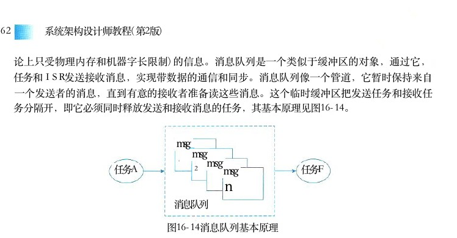

图16－14消息队列基本原理

在实际应用中，使用消息队列的方法包括非互锁的单向数据通信、互锁的单向数据通信、互锁的双向数据通信和广播通信等。与此同时，消息队列中消息的队列存在多种方式，比如先进先出 （FIFO）、 先进后出 （FILO）、 紧急消息、优先级消息、时限消息等。管道 （pipeline） 是消息队列中的一种，是UNIX 操作系统中传统的进程通信技术，一般分无名管道和命名管道，以 I／O 系统调用方式进行读写。在传统的实现中管道是单向数据交换。如图16－15所示。数据在管道内像一个非结构字节流，按FIFO 的次序从管道中读出。一个管道提供一个简单的数据流设施。当管道空时，阻塞读任务；当管道图16－15 管道的基本原理示意图满时，阻塞写任务。有些操作系统也允许有多个读任务的管道和有多个写任务。Socket 和远程调用是在应用层和传输层之间的一个抽象层，它把TCP／IP 层复杂的操作抽象为几个简单的接口，供应用层调用实现进程在网络中的通信。 Socket 起源于 UNIX ， 在 UNIX 一切皆文件的思想下，进程间通信就被冠名为文件描述符 （File Descriptor）。Socket 通信原理是一种“打开一读／写一关闭”模式的实现，服务器和客户端各自维护一个“文件”，在建立连接打开后，可以向文件写入内容供对方读取或者读取对方内容，通信结束时关闭文件。Socket保证了不同计算机之间的通信，也就是网络通信。对于网站，通信模型是服务器与客户端之间的通信。两端都建立了一个 Socket 对象，然后通过 Socket 对象对数据进行传输。通常服务器处于一个无限循环，等待客户端的连接。图16－16给出了 Socket 的基本原理。Signals 是 VxWorks操作系统提供的一种特殊异常处理与任务之间的通信方式，其思想来源于POSIX。Signals 主要用来通知进程发生了异步事件。在软件层次上是对中断机制的一种模拟，在原理上，一个进程收到一个信号与处理器收到一个中断请求可以说是一样的。信号是进程间通信机制中唯一的异步通信机制，一个进程不必通过任何操作来等待信号的到达，事实上，进

<!-- PDF 第 575 页 -->

程也不知道信号到底什么时候到达 。 进程之间可以互相通过系统调用发送软中断信号 。 内核也可以因为内部事件而给进程发送信号 ， 通知进程发生了某个事件 。 Signals 机制除了基本通知功能外，还可以传递附加信息。

用户进程用户进程用户进程用户进程应用层

Socket抽象层

运输层TCPUDP

网络层ICMPIPIGMP

链路层ARP硬件接口PARP

媒体图16－16 Socket 的基本原理

## 5 ． 典型嵌入式操作系统

当前 ， 国际上存在上百种嵌入式操作系统 。 从来源看 ， 一种是从通用操作系统演化而来的通用性嵌入式操作系统 ， 如 WinCE 、 Linux 等 ， 而大多数是面向特定领域嵌入式操作系统 ，表 1 6 － 2 所示给出了目前使用较广泛的嵌入式操作系统产品 。表16－2主要嵌入式操作系统

简介名称美国 Ready System 公司研制的国际上最早的一款嵌入式实时多任务操作系统 （VRTS／OS）。自1981年发表VRTX1．0 至今 VRTX321．08， 它已经成功地用于4000多种应用环境，安装有VRTXVRTX ／ OS 的产品已过百种。 VRTX实时多任务操作系统从实时性、可靠性、可用性各方面比较而言，都比以前的 iRMX 、 iRMK 操作系统有了很大提高，当时它代表嵌入式系统的潮流美国WindRiver 公司于1983年设计开发的一种嵌入式实时操作系统。它有良好的持续发展能力、高性能的内核以及友好的用户开发环境，在嵌入式实时操作系统领域逐渐占据一席之地。此款产品在我国被广泛应用。它系统十分灵活，具有多达1800个功能强大的应用程序接Vx Works口 （API）； 适用面广，可以适用于从最简单到最复杂的产品设计。可靠性高，可以用于从防抱死刹车系统到星际探索的关键任务；适用性强，可以用于支持当前流行的 CPU平台是由Lynx Real－time Systems开发的一个款支持分布式嵌入式实时操作系统。 LynxOS 是一个分布式、嵌入式、可规模扩展的实时操作系统，具有 UNIX 的优点，即实时内核、程序可重入和调度确定性和确定的硬实时响应等特征，最早开发于1988年。 LynxOS 支持线程概念，LynxOS提供256个全局用户线程优先级；硬实时优先级调度：在每个优先级上实现了轮转调度、定量调度和 FIFO 调度策略；快速正文切换和阻塞时间短；抢占式的 RTOS核心

<!-- PDF 第 576 页 -->

（续表）简介名称美国 Accclerated Technology公司 （ATI） 开发的一个嵌入式实时操作系统最早开发于1990年，主要用在消费电子、网络设备、无线、导航、办公设备、医疗设备和控制等领域。最新产品 nucleus plus 是为实时嵌入式应用而设计的一个抢先式多任务操作系统内核，其95％代码是用 ANSIC写成的，因此非常便于移植并能够支持大多数类型的处理器。 nucleus plus 核Nucleus心代码区一般不超过20KB大小。它采用了软件组件的方法。每个组件具有单一而明确的目的，各个组件非常易于替换和复用。其基本组件包括任务控制、内存管理、任务间通信、任务的同步与互斥、中断管理、定时器及 I／O驱动等加拿大 QNX Software Systems Europe公司研制的一个实时、可扩展操作系统，并部分遵循POSIX相关标准，采用微内核结构。微内核小巧，主要提供4种基本服务，所有的操作系统QNX服务都是能互相通信的用户进程。目前，支持 X86、Power PC、MIPS 和 ARM 等处理器。主要的应用领域是消费电子、电信、汽车及医疗设备等美国 Google公司和开放手机联盟领导及研制的一款开源式嵌入式操作系统。 Android 是基于Linux 内核（不包含 GNU 组件），主要针对移动设备，目前已被大量应用于智能手机、平板、Android机顶盒等移动设备上。2007年11月， Google与84家硬件制造商、软件开发商及电信营运商组建开放手机联盟共同研发改良 Android 系统。 Android 系统的主要特点是：开源、良好的操作体验和网络应用。 Android平台手机的全球市场份额已经达到78．1％美国 Apple 公司研制的一款Apple iOS 手持设备操作系统。苹果公司最早于2007年是设计给iPhone使用的，后来陆续套用到 iPod touch、iPad 以及 Apple TV 等苹果产品上。 iOS 与苹果的Mac OS X 操作系统一样，它也是以 Darwin为基础的，因此同样属于类Unix 的商业操作系统。iOS原本这个系统名为 iPhone OS， 直到2010年6月7日WWDC大会上宣布改名为iOS。AppleiOS 主要特点是：软、硬件整合度高、界面美观易操作、安全性强、应用数量多、品质高美国斯坦福大学的 STanford Artifcial Intelligence Robot（STAIR） 和 Personal Robotics（PR） 项目研制了首款机器人操作系统原型。 ROS 是机器人操作系统 （Robot Operating System） 的英文缩写。ROS 是用于编写机器人软件程序的一种具有高度灵活性的软件架构。其主要功能是：ROS 提供一些标准操作系统服务，例如硬件抽象，底层设备控制，常用功能实现，进程间消ROS息以及数据包管理； ROS是基于一种图状架构，从而不同节点的进程能接受、发布、聚合各种信息（例如传感、控制、状态、规划等等）； ROS 可以分成两层，低层是上面描述的操作系统层，高层则是广大用户群贡献的实现不同功能的各种软件包，例如定位绘图、行动规划、感知、模拟等

截至目前 ， 嵌入式操作系统已被广泛应用于我们的日常生活之中 ， VRTX、VxWorks、LynxOS、Nucleus 和 QNX 属于在嵌入式实时操作系统范畴，通常被应用在工业控制、医疗设备、军事装备以及轨道交通等领域。而 Android 和 iOS属于嵌入式操作系统，也是一款移动操作系统，由于21世纪手机等移动终端的普及，这两款产品是家喻户晓。当然，以 Linux 内核为基础的延伸开发产品层出不穷，并被服务于各个应用领域。 ROS 是面向机器人系统的一款开源嵌入式操作系统，它除了具有操作系统的基本功能外，扩展了众多与机器人相关的功能组件，形成了一套完整的生态环境平台。此外，物联网操作系统 （IoTOS） 也成为嵌入式操作系统的一个核心分支。

<!-- PDF 第 577 页 -->

随着我国国力的增强，在国家大力支持下，国产嵌入式操作系统如雨后春笋蓬勃发展。推出了多款嵌入式操作系统，如：天脉 （AcoreOS）、 瑞华 （ReWoks）、 麒麟 （Kirin）、 鸿蒙（HarmonyOS） 等，并已被广泛应用。

## 16．2．3嵌入式数据库

## 1．嵌入式数据库的定义及特点

嵌入式数据库的名称来自其独特的运行模式。这种数据库嵌入到了应用程序进程中，消除了与客户机服务器配置相关的开销。嵌入式数据库实际上是轻量级的，在运行时，它们需要较少的内存。它们是使用精简代码编写的，对于嵌入式设备，其速度更快，效果更理想。嵌入式运行模式允许嵌入式数据库通过 SQL 来轻松管理应用程序数据，而不依靠原始的文本文件。嵌入式数据库还提供零配置运行模式，这样可以启用其中一个并运行一个快照。在嵌入式系统中，对数据库的操作具有定时限制的特性，这里把应用于嵌入式系统的数据库系统称为嵌入式数据库系统或嵌入式实时数据库系统 （ERTDBS）。可靠性要求是毋庸置疑的，嵌入式系统必须能够在没有人工干预的情况下，长时间不间断地运行。同时要求数据库操作具备可预知性，而且系统的大小和性能也都必须是可预知的，这样才能保证系统的性能。嵌入式系统中会不可避免地与底层硬件打交道，因此在数据管理时，也要有底层控制的能力，如什么时候会发生磁盘操作，磁盘操作的次数，如何控制等。底层控制的能力是决定数据库管理操作的关键。目前嵌入式软件系统开发的挑战之一，体现在对各种数据的管理能否建立一套可靠、高效、稳定的管理模式，嵌入式数据库可谓应运而生。嵌入式数据库是嵌入式系统的重要组成部分，也成为对越来越多的个性化应用开发和管理而采用的一种必不可少的有效手段。嵌入式数据库用途广泛，如可用于消费电子产品、移动计算设备、企业实时管理应用、网络存储与管理以及各种专用设备，这一市场目前正处于高速增长之中。举一个简单例子，比如手机原来只用来打电话、发短信，现在手机增加了很多新的功能，比如彩信、音乐、摄影、视频等，应用的功能多了，系统就变得复杂了。与传统数据库相比，嵌入式数据库系统有以下几个主要特点：

● 嵌入式：嵌入性是嵌入式数据库的基本特性。嵌入式数据库不仅可以嵌入到其他的软件当中，也可以嵌入到硬件设备当中。

● 实时性：实时性和嵌入性是分不开的。只有具有了实时性的数据库才能够第一时间得到系统的资源，对系统的请求在第一时间内做出响应。但是，并不是具有嵌入性就一定具有实时性。要想嵌入式数据库具有很好的实时性，必须做很多额外的工作。

● 移动性：移动性是目前在国内提得比较多的一个说法，这和目前国内移动设备的大规模应用有关。可以这么说，具有嵌入性的数据库一定具有比较好的移动性，但是具有比较好的移动性的数据库，不一定具有嵌入性。

● 伸缩性：伸缩性在嵌入式场合显得尤为重要。首先嵌入式场合硬件和软件的平台都是千

<!-- PDF 第 578 页 -->

差万别，基本都是客户根据需要自己选择的结果。

## 2．嵌入式数据库的分类

嵌入式数据库分类方法很多，可以按照嵌入对象的不同可分类为软件嵌入数据库、设备嵌入数据库、内存数据库；也可以按照系统结构不同可分类嵌入数据库、移动数据库、小型 C／S（客户机／服务器）结构数据库等。按照数据库存储位置的不同而进行分类是目前广泛采用的分类方法，它可以划分为基于内存方式、基于文件方式和基于网络方式三类。

（1）基于内存的数据库系统 （Main Memory Database System，MMDB） 是实时系统和数据库系统的有机结合。实时事务要求系统能较准确地预测事务的运行时间，但对磁盘数据库而言，由于磁盘存取、内外存数据传递、缓冲区管理、排队等待及锁的延迟等，使得事务实际平均执行时间与估算的最坏情况执行时间相差很大。如果将整个数据库或其主要的“工作”部分放入内存，使每个事务在执行过程中不需要访问 I／O 的话，则系统就可以较精确地估算和安排事务的处理时间，这样，为系统可动态预测性提供了有力的支持，同时也为实现事务的定时限制打下基础。内存数据库是支持实时事务的最佳技术，其本质特征是以其“主拷贝”或“工作版本”常驻内存，即活动事务只与实时内存数据库的内存拷贝打交道。目前，嵌入式内存数据库系统已被广泛应用于航空、军事、电信、电力、工业控制等领域。而这些领域大部分都是分布式的，因此，分布式内存数据库系统将成为新的研究热点。此外，应用于安全攸关系统中的嵌入式数据库还应在可靠性、安全性等方面有更高要求。

（2）基于文件的数据库 （File Database，FDB） 系统就是以文件方式存储数据库数据，即数据按照一定格式储存在磁盘中。使用时由应用程序通过相应的驱动程序甚至直接对数据文件进行读写。这种数据库的访问方式是被动式的，只要了解其文件格式，任何程序都可以直接读取，因此它的安全性很低。虽然文件数据库存在诸多弊端，但是，对于嵌入式系统在空间、时间等方面的特殊要求，DBF、Access、Paradox 数据库都是文件型数据库，嵌入式数据库 Pocket Access 也是文件型数据库。基于网络的数据库 （Netware Database，NDB） 系统是基于手机4G／5G 的移动通信基础之上的数据库系统，在逻辑上可以把嵌入式设备看作远程服务器的一个客户端。实际上，嵌入式网络数据库是把功能强大的远程数据库映射到本地数据库，使嵌入式设备访问远程数据库就像访问本地数据库一样方便。

（3）嵌入式网络数据库主要由三部分组成：客户端、通信协议和远程服务器。客户端主要负责提供接口给嵌入式程序，通信协议负责规范客户端与远程服务器之间的通信，还需要解决多客户端的并发问题，远程服务器负责维护服务器上的数据库数据。嵌入式网络数据库系统的特点是：

● 无需解析语句；SQL

● 支持更多的操作；SQL

● 客户端小、无须支持可剪裁性；

<!-- PDF 第 579 页 -->

● 有利于代码重用。这里要说明的是，由嵌入式网络数据库、嵌入式本地数据库（内存或文件）和嵌入式 Web服务器等构成了综合的嵌入式综合信息系统。

## 3．嵌入式数据库的一般架构

在我们日常工作中，像 Oracle、Sybase、MySQL和 SQL Server等这些大牌数据库产品相信大家已熟知，但是这些数据库都属于数据库服务器（当然不排除某些也提供嵌入式版本），而像SQLite、Berkeley DB等是属于嵌入式数据库。嵌入式数据库跟数据库服务器最大的区别在于它们运行的地址空间不同。通常，数据库服务器独立地运行一个守护进程 （daemon）， 而嵌入式数据库与应用程序运行在同一个进程。在了解嵌入式数据库架构之前，我们必须清楚数据库服务器架构与嵌入式数据库架构差异。数据库服务器架构：数据库客户端通常通过数据库驱动程序如JDBC 、 ODBC等访问数据库服务器，数据库服务器再操作数据库文件。数据库服务是一种客户端服务器模式，客户端和服务器是完全两个独立的进程。它们可以分别位于在不同的计算机甚至网络中。客户端和服务器通过 TCP／IP 进行通信。这种模式将数据与应用程序分离，便于对数据访问的控制和管理。嵌入式数据库架构：嵌入式数据库不需要数据库驱动程序，直接将数据库的库文件链接到应用程序中。应用程序通过 API访问数据库，而不是TCP／IP。 因此，嵌入式数据库的部署是与应用程序在一起的。比如常见的版本控制器 SubVersion， 它所用的嵌入式数据库就是跟应用程序放在一起的。数据库服务器和嵌入式数据库对比如下：

（1）数据库服务器通常允许非开发人员对数据库进行操作，而在嵌入式数据中通常只允许应用程序对其进行访问和控制。

（2）数据库服务器将数据与程序分离，便于对数据库访问的控制。而嵌入式数据库则将数据的访问控制完全交给应用程序，由应用程序来进行控制。

（3）数据库服务器需要独立的安装、部署和管理，而嵌入式数据通常和应用程序一起发布，不需要单独地部署一个数据库服务器，具有程序携带性的特点。因此，嵌入式数据库的架构与应用对象紧密相关，其架构是以内存、文件和网络等三种方式为主。

## 1）基于内存的数据库系统

数据库应用程序基于内存的数据库系统中比较典型的产品是美国数据库设计生成接口数据库静态接口McObject 公司的eXtremeDB 嵌入式数据库，2013年

## 3月推出5．0版，它采用内存数据结构，基于对象模

事物管理器记录管理器型，并直接与应用结合，不属于客户端／服务器架构。索引管理器数据字典eXtremeDB 内存数据库与其他数据库相比，在提供高数据页管理器堆内存管理器性能的数据管理服务的同时，专门针对实时系统的要数据库内存空间求进行了优化。eXtremeDB 嵌入式数据库的架构见图16－17。图16－17 eXtremeDB 嵌入式数据库的架构

<!-- PDF 第 580 页 -->

eXtremeDB 采用层次化设计结构，最上层代表数据库应用程序。下一层是数据库静态接口和根据数据库设计生成的接口，分别代表eXtremeDB 提供的外部应用接口和通过数据库设计生成外部接口（主要是数据操作接口），用户调用这些外部接口进行数据库操作；再下层是数据库内核的相关模块，包括记录管理器、事务管理器、索引管理器、数据字典；最下层是存储管理器，直接管理用户分配的内存空间。eXtremeDB 主要特点：

● 最小化支持持久数据所必需的资源：实质上就是将内存资源减到最小。操作对象都以很小的尺寸保存在数据库中。 eXtremeDB引进的额外开销不仅非常低，而且这些开销在应用程序中也是可控制的；另外，数据层提供了对对象数据的压缩。

● 保持极小的必要堆空间：在某些配置上只需要不到1的堆空间。eXtremeDBKB

● 维持极小的代码体积。

● 通过紧密的集成持久存储和宿主应用程序语言消除额外的代码层：通常目标应用程序使用大量小规模的数据库操作而非大数据量的操作。 eXtremeDB的数据存取方法使得对持久对象的引用能够和引用临时数据一样快速。

● 提供对动态数据结构的本地支持：例如变长字符串、链表和树。通过以一种eXtremeDB高效 （ 快速 ） 、 安全 （ 事务 ） 、 紧凑 （ 内存 ） 的方式来支持动态数据 ， 从而 “ 扩展 ” 了C 语言。

## 2）基于文件的嵌入式数据库系统

基于文件的嵌入式数据库系统是以文件方式存储数据库数据 。 比较典型的产品是由 D．Richard Hipp 建立的公有领域项目开发的 SQLite 轻量型嵌入式数据库系统。 SQLite 诞生于 2 0 0 0年，其设计目标是嵌入式的，而且已经在很多嵌入式产品中使用。它占用资源非常少，在嵌入式设备中，可能只需要几百 “KB” 的内存就够了，支持 Windows／Linux／Unix 等主流操作系统，同时能够跟许多程序语言相结合，如： TCL 、 C ＃ 、 JAVA 等。SQLite 轻量型嵌入式数据库系统架构见图16－18。

B-Tree Interface

Backend Tokenizer Pager Compiler OS Interface Parser Core Code Generator

Database Virtual Machine
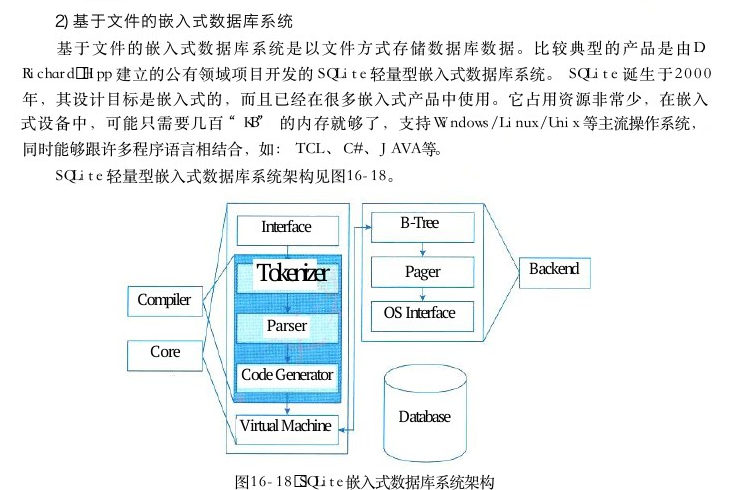

图16－18 SQLite嵌入式数据库系统架构

<!-- PDF 第 581 页 -->

SQLite 在架构上采用了模块的设计，它由公共接口、编译器系统、虚拟机和后端四个子系统组成。（ 1 ） 接口 （Interface）。 由 SQLite CAPI组成，也就是说不管是程序、脚本语言还是库文件，最终都是通过它与 SQLite 交互的（通常使用较多的 ODBC ／ JDBC 最后也会转变为相应 CAPI 的调用）。

（2）编译器 （Compiler）。 在编译器中，分词器 （Tokenizer） 和分析器 （Parser） 对 SQL 进行语法检查，然后把它转变为底层能更方便处理的分层的数据结构——语法树，然后把语法树传给代码生成器 （Code Generator） 进行处理。而代码生成器根据它生成一种针对SQLite 的汇编代码，最后由虚拟机执行。（ 3 ） 虚拟机 （Virtual Machine）。 架构中最核心的部分是虚拟机，或者叫作虚拟数据库引擎 （Virtual Database Engine，VDBE）。 它和 Java 虚拟机相似，解释执行字节代码。 VDBE 的字节代码由128个操作码 （OPCodes） 构成，它们主要集中在数据库操作。它的每一条指令都用来完成特定的数据库操作（比如打开一个表的游标）或者为这些操作准备栈空间（比如压入参数）。（ 4 ） 后端 （Back－End）。 后端由B－树 （B－tree）， 页缓存 （page cache，pager） 和操作系统接口（即系统调用）构成。 B－tree 和 page cache共同对数据进行管理。 B－tree 的主要功能就是索引，它维护着各个页面之间的复杂的关系，便于快速找到所需数据。而 pager 的主要作用就是通过 OS 接口在 B－tree 和 Disk 之间传递页面。SQLite 主要特点：

●是一个开源的、内嵌式的关系型数据库。SQLite

●数据库服务器就在你的数据库应用程序中，其好处是不需要网络配置和管理，也SQLite不需要通过设置数据源访问数据库服务器。

●数据库的服务器和客户端运行在同一个进程中。这样可以减少网络访问的消耗，SQLite简化数据库管理，使你的程序部署起来更容易。

●在处理数据类型时与其他的数据库不同。区别在于它所支持的类型以及这些类型SQLite是如何存储、比较、强化 （enforce） 和指派 （assign）。

## 3）基于网络的数据库系统

基于网络的数据库系统是以远程数据库为存储载体的，客户端通过移动网访问服务器上的远程数据库。由于基于网络的数据库系统被应用在多种领域，其架构千变万化，没有统一相对固定结构和产品，如： C／S 架构的数据库、 B／S 架构的数据库以及云数据库等。因此这里仅给出了一种简单的架构描述，见图16－19。图16－19给出的是一款嵌入式数据库管理系统的架构，其目的是在嵌入式设备上使用的数据库管理系统，以解决移动计算环境下数据的管理问题。基于网络的嵌入式数据库系统由基本的几个子系统组成，包括：远程数据库管理系统、远程数据库、同步服务器、嵌入式数据库管理系统、嵌入式数据库和连接网络等。

<!-- PDF 第 582 页 -->

移动信息设备同步网络服务器数据库应用程序

数据服务器嵌入式数据库管理系统远程数据库管理系统

远程数据库，嵌入式数据库
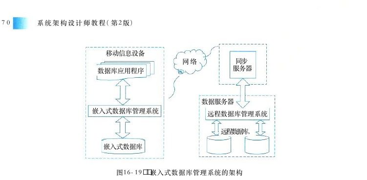

图16－19 嵌入式数据库管理系统的架构其中：

● 嵌入式数据库管理系统。嵌入式数据库管理系统是一个功能独立的用户数据库管理系统。它可以独立于同步服务器和远程数据库管理系统运行，对嵌入式系统中的数据进行管理，也可以通过同步服务器连接到数据服务器上，对远程数据库中的数据进行操作，并映射到嵌入式数据库中，还可以通过多种方式进行数据同步。

● 同步服务器：同步服务器是嵌入式数据库和远程数据库之间的连接枢纽，保证嵌入式数据库和远程数据库中数据的一致性。

● 数据服务器：数据服务器的远程数据库及数据库管理系统可以采用或等大OracleSybase型通用数据库系统。

● 连接网络：数据服务器和同步服务器之间一般通过高带宽、低延迟的固定网络进行连接。移动设备和同步服务器之间的连接根据设备的具体情况可以是无线局域网、红外连接、通用串行线或以太网等。

## 4．嵌入式数据库的主要功能

嵌入式数据库的功能应与通用数据库功能相似，应覆盖数据库的核心功能。通常，嵌入式数据库有其自身的特殊需要，它应具备的功能包括以下4点：

● 足够高效的数据存储机制；

● 数据安全控制（锁机制）；

● 实时事务管理机制；

● 数据库恢复机制（历史数据存储）。这样，一般嵌入式数据库可划分成数据库运行处理、数据库存取、数据管理、数据库维护和数据库定义等功能。数据库运行处理：主要负责实现嵌入式数据库运行过程的各种功能。包括实时事务管理、并发控制、数据库装入、运行日志维护、安全性和完整性控制等。数据库存取：主要负责实现嵌入式数据库各种存取和查询功能。包括实时数据更新、历史数据查询、数据添加、数据删除等。

<!-- PDF 第 583 页 -->

数据管理：主要负责实现嵌入式数据库的数据空间管理功能。包括缓冲区管理、数据存储空间管理、数据索引管理等。数据库维护：主要负责实现嵌入式数据库的数据维护管理功能。包括数据恢复、实时数据转储、数据装入等。数据库定义：主要负责实现嵌入式数据库的安全性、完整性的定义功能。嵌入式数据库系统是介于用户和实时操作系统之间的一层软件，由众多功能模块组成，其作用是对数据库中的共享数据进行有效的组织、管理和存取。上面所述的存储空间管理、安全性和完整性控制、事务并发控制、实时数据转储和运行日志管理等是在嵌入式环境下开发实时数据库系统需要特别解决的以下几个设计问题：

（1）存储空间管理模块。嵌入式实时数据库系统由于采用了内存缓冲的技术，必然要涉及嵌入式操作系统的内存管理，因此，用户必须了解系统对内存的分配机制，并设计自己的内存管理程序。系统运行时，由该模块通过实时OS 向系统申请内存缓冲区，作为共享的内存数据区使用。之后，将历史数据库中的初始化数据调入内存区对这些空白内存进行初始化。对内存空间的申请，用户可采用静态分配方式，这种方式实现简单，无需复杂的索引结构，缺点是失去了灵活性，必须在设计阶段就预先知道所需内存并对之做出分配；或者采用动态分配方式，这种方式使用灵活，可以根据需要扩充数据节点，但是必须建立合适的索引结构，以加快数据的检索时间。该模块要根据具体的实时OS 进行设计。

（2）数据安全性、完整性控制模块。实时数据库设计中必须考虑数据的安全性，一方面指用户访问数据的合法性，另一方面是指系统的安全性。完整性是指用户对实时数据或历史数据的各种操作必须符合一定的语义，可通过完整性约束条件来实现。

（3）事务并发控制模块。实时数据库是一个共享资源，允许多个任务共同使用，如果不对并发事务进行控制，可能会造成任务错误的读取或存储数据，破坏数据的一致性，因此实时数据库系统中，必须实现良好的并发控制机制。传统的数据库一般采用加锁的方式，类似于实时操作系统中的信号量，对于封锁粒度的大小要根据具体的应用系统确定，传统数据库获得锁的开销较小，因此通常选用小粒度封锁单位，以增加系统的并行性。但在实时数据库系统中，事务获得锁的开销与处理数据的开销相当，过小的封锁粒度反而会降低系统的性能，因此在实时数据库中的封锁粒度通常选择一张关系表为一个单位（如模拟量关系表为一个封锁单位），这样做减少了并发控制机制的复杂度，减小了系统的开销，提高了事务处理的整体性能。

（4）实时数据转储模块。该模块实现的功能是将实时数据存储为历史数据，通常由该模块先将历史数据保存在内存缓冲区中，缓冲区满时才一次性写入磁盘；读历史数据时，先从缓冲区内取数据，取不到数据时再进行文件的读写，这种方式可以降低磁盘I／O 操作次数，并且只对变化数据进行存储，即节省了外存空间，又不会影响系统性能。

（5）运行日志管理模块。日志文件在数据库恢复中起着非常重要的作用，可以用来进行事务故障恢复和系统故障恢复。日志缓冲区专门存放数据库操作的记录，传统的数据库日志记录包括记录名、更新前记录的旧值、更新后记录的新值、事务标识、操作类型等。在嵌入式实时数据库系统中，为了减少系统的开销，在日志记录中不包括新旧记录值，对日志记录的写操作只对缓冲区进行，当缓冲区满时，才由磁盘写操作写入日志文件当中。

<!-- PDF 第 584 页 -->

## 5 ． 典型嵌入式数据库系统

目前 ， 嵌入式数据库中比较典型的三个产品是 SQLite、Berkeley DB 和 Firebird嵌入服务器版，其主要特点见表16－3。表16－3 主要嵌入式数据库特点比较名称简介SQLite诞生于2000年5月，这几年增长势头迅猛无比，目前版本是3．3．8。其主要特点是：

● 无须安装配置，应用程序只须携带一个动态链接库

● 非常小巧，版本的文件才374For Windows 3.3.8DLLKB

●事务支持，即原子性、一致性、隔离性、和持久性ACIDACID(Atomic Consistent SQLiteIsolated和 Durable）

● 数据库文件可以在不同字节顺序的机器间自由的共享，比如可以直接从移植Windows到Linux或MAC

● 支持数据库大小至2TBBerkeley DB 是由美国 Sleepycat Softwarc 公司开发的一套开放源码的嵌入式数据库，它于1991年发布，目前 Sleepycat 现已被甲骨文 （ ORACLE ） 公司收购。其主要特点是：

● 嵌入式，无需安装配置

● 为多种编程语言提供了接口，其中包括和APICC + + JavaPerlTCLPythonPHP等Berkeley DB

● 轻便灵活。它可以运行于几乎所有的和系统及其变种系统、操作系UNIXLinuxWindows统以及多种嵌入式实时操作系统之下

● 可伸缩。它的才几百 “KB” 大小，但它能够管理规模高达256的数据Database libraryTB库。它支持高并发度，成千上万个用户可同时操作同一个数据库从 Interbase 开源衍生出了 Firebird版本。虽然它的体积是 Interbase 的几十分之一，但功能并无丢弃。为了体现Firebird 短小精悍的特色，开发小组在增加了超级服务器版本之后，又增加了嵌入版本，最新版本为2．0。其主要特点是：Firebird 嵌

● 数据库文件与网络版本完全兼容，差别仅在于连接方式不同，可以实现零成本迁移Firebird入服务器版

● 数据库文件仅受操作系统的限制，且支持将一个数据库分割成不同文件，突破了操作系统最大文件的限制，提高了I／O吞吐量(Embedded Server)

● 完全支持标准，支持大部分标准功能SQL-92SQL-99

● 丰富的开发工具支持，绝大部分基于的组件，可以直接使用于InterbaseFirebird

● 支持事务、存储过程、触发器等关系数据库的所有特性

● 可自己编写扩展函数(UDF)eXtremeDB 是美国 McObject 公司开发的一款内存式嵌入式数据库。2013年3月推出5．0版。其主要特点是：

● 内存数据库，实时性强，安全可靠

● 可最小化支持持久数据所必需的资源eXtremeDB

● 保持极小的必要堆空间

● 维持极小的代码体积

● 通过紧密的集成持久存储和宿主应用程序语言消除额外的代码层

● 提供对动态数据结构的本地支持

<!-- PDF 第 585 页 -->

## 16．2．4嵌入式中间件

## 1．嵌入式中间件的定义及特点

中间件 （Middleware） 属于可复用软件的范畴。顾名思义，中间件处于操作系统软件与用户的应用软件的中间，在操作系统、网络和数据库之上，应用软件之下，其作用是为处于上层应用软件提供运行与开发的环境，帮助用户灵活、高效地开发和集成复杂的应用软件。在众多关于中间件的定义中，比较普遍被接受的是国际数据公司 （International DataCorporation，IDC） 表述的：中间件是一种独立的系统软件或服务程序，分布式应用软件借助这种软件在不同的技术之间共享资源。中间件位于客户机／服务器的操作系统之上，管理计算资源和网络通信。这个定义表明，中间件是一类软件，而非一种软件。中间件不仅要实现互连，还要实现应用之间的互操作。同样，嵌入式中间件 （Embedded Middleware） 是在嵌入式系统中处于嵌入式应用和操作系统之间层次的中间软件，其主要作用是对嵌入式应用屏蔽底层操作系统的异构性，常见功能有网络通信、内存管理和数据处理等。从上述定义可以看出，中间件不像其他基础软件那样存在明确的定义，由于它涵盖内容比较丰富，所以在现实中会存在多种类型的中间件产品。通常，在实际应用中是将一组中间件集成在一起，构成一个平台（包括开发平台和运行平台），但在这组中间件中必须要有一个通信中间件，即中间件＝平台＋通信。中间件具有以下共性特点：

● 通用性：满足大量应用的需要；

● 异构性：运行于多种硬件和操作系统平台；

● 分布性：支持分布式计算，提供跨网络、硬件和操作系统平台的透明性的应用或服务的交互功能；

● 协议规范性：支持各种标准的协议；

● 接口标准化：支持标准的接口。具体到嵌入式中间件而言，它还应提供对下列环境的支持：

● 网络化：支持移动、无线环境下的分布应用，适应多种设备特性以及不断变化的网络环境；

● 支持流媒体应用，适应不断变化的访问流量和宽带约束；

●质量品质：在分布式嵌入式实时环境下，适应强的分布应用的软硬件约束；QoSQoS

● 适应性：能够适应未来确定的应用要求。

## 2．嵌入式中间件的分类

中间件的范围十分广泛，针对不同的应用需求涌现出了多种各具特色的中间件产品。因此，在不同的角度或不同的层次上，对中间件的分类也会有所不同。根据 IDC 在1998年对中间件进行的分类，把中间件分为终端仿真／屏幕转换中间件、数据访问中间件、远程过程调用中间件、消息中间件、交易中间件和对象中间件六大类。但是，如今所保留下来的只有消息中间件和交易中间件，其他的类型已经被逐步融合到其他产品中，在

<!-- PDF 第 586 页 -->

市场上已经没有单独的产品形态出现。从现代中间件观点看，通用中间件大致存在以下几类：

● 企业服务总线中间件是一种开放的、基于标准的(Enterprise Service Bus,ESB):ESB分布式同步／异步信息传递中间件。通过XML 、 Web服务接口以及标准化基于规则的路由选择文档支持， ESB为企业应用程序提供安全互用性。

● 事务处理监控器：为发生在对象间的事务处理提供监控(Transaction Processing,TP)功能，以保证操作成功。

● 分布式计算环境指创建运行在不同平台上的分(Distributed Computing Environment):布式应用程序所需的一组技术服务。

● 远程过程调用指客户机向服务器发送关于运行某程序的请(Remote Procedure Call):求时所需的标准。

● 对象请求代理为用户提供与其他分布式网络环境中对(Object Request Broker,ORB):象通信的接口。

● 数据库访问中间件支持用户访问各种操作系统或应用(Database Access Middleware):程序中的数据库。

● 消息传递电子邮件系统是该类中间件的其中之一。(Message passing):

● 基于的中间件允许开发人员为实现中交XML(XML-Based Middleware):XMLInternet换结构化信息而创建文档。在嵌入式系统领域，最普遍使用的嵌入式系统实时中间件包括通用对象请求代理体系结构（Common Object Request Broker Architecture，CORBA） 和它的衍生结构：数据分发服务 （DataDistribution Service，DDS）。 这些中间件架构是基于对象管理组织 （Object Management Group，OMG ） 公布的标准。在CORBA架构中，有很多专有的衍生标准可供选择，包括实时CORBA、嵌入 CORBA 和最小化CORBA。中间件还可适合更大规模的、由多个软件组件和应用组成的，并可分布在多个处理器和网络上的嵌入式应用。当这些组件由不同的组织开发，系统将会被不同的组织扩展，或者当系统有很长的生存期时，使用标准中间件可以给开发者提供显而易见的好处。这些中间件架构是设计模式的完整集合，例如代理模式 （Proxy）、 数据总线模式 （Data Bus） 和中介模式 （BrokerPattern） 等。从上述论述来看，嵌入式中间件没有固定技术界限，可根据系统面向的不同应用而被不断扩展， CORBA和 DDS 是嵌入式系统最为常用的两种中间件。

## 3．嵌入式中间件的一般架构

根据嵌入式中间件的不同类型和其应用对象的不同，其架构也有所不同，通常嵌入式中间件没有统一的架构，这里仅仅列举两种中间件架构。

## 1）消息中间件

消息中间件是消息传输过程中保存消息的一种容器。它将消息从它的源中继到它的目标时

<!-- PDF 第 587 页 -->

充当中间人的作用。在消息中间件中，队列的目的是提供路由并保证消息的传递；如果发送消息时接收者不可用，消息队列会保留消息，直到可以成功的传递它为止，当然，消息队列保存消息也是有期限点的。图16－20给出了消息中间件原理架构示意图。

发送者接收者网络获得消息存放消息消息API消息AP1

消息队列服务消息队列服务消消消息息息传传递递服服发送接收发送接收务务消息队列消息队列消息队列消息队列
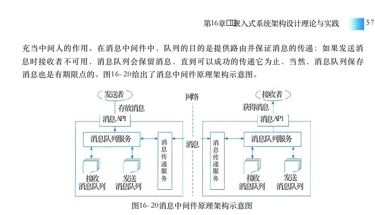

图16－20消息中间件原理架构示意图

消息中间件具有两个基本特点：

（1）采用异步处理模式：消息发送者可以发送一个消息而无须等待响应。消息发送者将消息发送到一条虚拟的通道（主题或队列）上，消息接收者则订阅或是监听该通道。一条消息可能最终转发给一个或多个消息接收者，这些接收者都无须对消息发送者做出同步回应。整个过程是异步的。比如用户消息注册，注册完毕后过段时间发送邮件或者短信。

（2）应用程序和应用程序调用关系为松耦合关系：发送者和接收者不必了解对方、只需要确认消息，发送者和接收者不必同时在线。比如在线交易系统为了保证数据的最终一致，在支付系统处理完成后会把支付结果放到消息中间件里通过订单系统修改订单支付状态。两个系统通过消息中间件解耦。消息传递服务模型有点对点模型 （ PTP ） 和发布 － 订阅模型 （Pub／Sub） 之分。点对点模型用于消息生产者和消息消费者之间点对点的通信。消息生产者将消息发送到由某个名字标识的特定消费者。这个名字实际上对应于消息服务中的一个队列 （Qucuc）， 在消息传送给消费者之前它被存储在这个队列中。队列消息可以放在内存中，也可以是持久的，以保证在消息服务出现故障时仍然能够传递消息。发布者／订阅者模型支持向一个特定的消息主题生产消息，或多个订阅者可能对接收各自特定消息主题的消息感兴趣。在这种模型下，发布者和订阅者彼此不知道对方。其模式好比是匿名公告板。这种模式被概括为：多个消费者可以获得消息。在发布者和订阅者之间存在时间依赖性。发布者需要建立一个订阅 （subscription）， 以便能够让消费者订阅。订阅者必须保持持续的活动状态以接收消息，除非订阅者建立了持久的订阅。在这种情况下，在订阅者未连接时发布的消息将在订阅者重新连接时重新发布。

## 2）分布式对象中间件

分布式对象中间件是为了解决分布计算和软件复用过程中存在的异构问题而提出的。它的

<!-- PDF 第 588 页 -->

任务是处理分布式对象之间通信，是基于组件的思想，由一组对象来提供系统服务，对象之间能够跨平台通信。这里的基本组件就是对象，它们提供一组服务，对外给出服务接口，对象之间可以相互调用，服务对象之间不存在客户机和服务器的界限。分布式对象中间件使用了分布式技术，它将网络上的所用资源互相连接起来，对外表现为一个统一的整体，对客户是透明的，不必区分本地操作和远程操作；分布式对象中间件使用了面向对象技术，它通过封装、继承及多态提供了良好的代码重用功能。图16－21给出分布式对象中间件原理架构示意图。其中：

（1）对象请求代理 （ORB）： 规定了分布式对象的定义（接口）应用对象公共设施和语言映射，实现对象间的通信和互操作。是分布对象系统中的软总线。通过它各个对象可以透明地向本地或远程对象发出请求对象请求代理（中间件）或接收响应，每一台运行着服务对象的计算机都有自己的对象请求代理。 ORB 可以实现单进程中对象间的调用，也可以实现同台公共服务计算机中运行的多进程中对象之间的调用，还可以实现运行在网图16－21 分布式对象中间件络中多个计算机上多进程中对象间的调用。原理架构示意图

（2）公共服务：为创建对象、对象访问控制提供了一套标准函数。提供诸如：并发控制服务、名字服务、事务（交易）服务、安全服务、查询服务等多种服务。

（3）公共设施：向应用对象直接提供应用服务的框架的集合。

（4）应用对象：为用户提供一组完成特定任务的对象，所有应用对象都有用接口定义语言（IDL） 定义的接口并且可以运行在对象请求代理之上，各个对象之间可以相互调用。分布式对象中间件具有三个基本特点：

● 对象组件之间普遍采用软总线技术；

● 具有不依赖于编程语言、软硬件平台和网络协议等特点；

● 对象可以用任何一种软件开发商所支持的语言和平台来实现。目前，市场上比较著名的分布式对象中间件技术有：

●（对象管理组织）的公共对象请求代理结构规定了分布式对象之间OMG( CORBA ) :如何实现互操作；

●公司的分布式组件对象模型主要是为不同网络环境中的分布式对Microsoft( DCOM ) :象提供交互标准；

●商业应用组件技术采用一种面向服务器端分布式构件的技术。JavaEJB:

## 4．嵌入式中间件的主要功能

嵌入式中间件的主要作用是对嵌入式应用屏蔽底层操作系统的异构性。其常用功能有网络通信、存储管理和数据处理等。

（1）网络通信：嵌入式系统的网络通信中间件是实现整个系统的框架结构和基本的通信接口功能。嵌入式中间件中的网络通信功能通常定义成一组较为完整的、标准的应用程序接口，

<!-- PDF 第 589 页 -->

借助嵌入式网络通信，应用程序可以独立于操作系统和硬件平台，可使系统的开放性和可移植更强。

（2）存储管理：嵌入式系统的存储管理中间件是实现整个系统数据跨平台、跨介质的存储接口功能。嵌入式中间件中的存储管理功能通常定义成一组较为完整的、标准的应用程序接口，借助嵌入式数据库（或文件系统），应用程序在异构性数据库（或文件系统）及不同硬件存储介质之上实现数据的共享和互操作，可使系统的开放性、可移植性和兼容性更强。

（3）数据处理：嵌入式系统的数据处理中间件实现了整个分布式系统框架结构和事务间基本互操作的接口功能。

## 5．典型嵌入式中间件系统

当前，嵌入式系统使用最为广泛的中间件有两个产品，分别是公共对象请求代理结构（ CORBA ） 和数据分发服务 （Data Distribution Service，DDS）。CORBA 是 OMG组织在1991年提出的公用对象请求代理程序结构的技术规范。 CORBA有很广泛的应用，它易于集成各厂商的不同计算机，从大型机一直到微型内嵌式系统的终端桌面，是针对大中型企业应用的优秀的中间件。它使服务器真正能够实现高速度、高稳定性处理大量用户的访问。CORBA 的技术特征：

● 完整的作为事务代理的中间件；

● 客户端与服务器的可完全分离；

● 提供软件总线机制，支持多环境、多语种的分布式集成；

● 完整的对象内部细节的封装；

● 实时性强。DDS 是对象管理组织 （ OMG ） 在 HLA及 CORBA 等标准的基础上制定的新一代分布式实时通信中间件技术规范， DDS 采用发布／订阅体系架构，强调以数据为中心，提供丰富的 QoS服务质量策略，能保障数据进行实时、高效、灵活地分发，可满足各种分布式实时通信应用需求。DDS 信息分发中间件是一种轻便的、能够提供实时信息传送的中间件技术。DDS 的技术特征：

● 灵活的发布／订阅模式；

● 完整规范服务质量策略；DDSQoS

● 已扩展的服务质量策略；QoS

● 互操作；

● 强实时；

● 跨平台；

● 支持多种底层物理通信协议；

● 支持仿真、测试和安装的全生命周期服务。

<!-- PDF 第 590 页 -->

## 16．2．5嵌入式系统软件开发环境

## 1．嵌入式系统软件开发环境的定义及特点

嵌入式系统软件开发环境是可帮助用户开发嵌入式软件的一组工具的集合，这种工具的集合被集成为一体，形成一套交叉平台开发方法 （Cross Platform Development，CPD）。 交叉开发方法是指嵌入式软件在一个通用的平台上开发（称为宿主机），而在另一个嵌入式目标平台上运行（称为目标机）。嵌入式系统软件开发环境主要能力包括：集成开发、工程管理、编译（汇编）器、批处理文件、构建 （Make）、 配置管理、调试、下载、模拟、版本控制及其他。嵌入式系统软件开发环境的主要特点：

● 集成开发环境是指用于提供程序开发环(Integrated Development Environment,IDE):境的应用程序。一般包括代码编辑器、编译器、调试器和图形用户界面等工具。

● 交叉开发是指软件开发先在一台通用计算机上进行软件的编(Cross Development):辑、编译与连接，然后下载到嵌入式设备中运行调试的开发过程。

● 开放式体系结构：是指开发环境应建立在一种标准的框架体系内，符合相关标准。如：支持ANSI C、C＋＋语言标准、目标程序文件符合ELF格式等。支持开发环境内的工具间可无缝连接，并允许第三方工具的集成。

● 可扩展性：是指开发环境中的工具接口符合相关架构标准，可根据需要进行工具能力的扩充。

● 良好的可操作性：是指两个或多个工具间可以实现自动交换信息功能。

● 可移植性：开发系统中的开发工具基本上采用高级语言实现。

● 可配置性：开发环境中的主要开发工具可以根据需要进行伸缩，也可以根据需要选择支持库中的代码规模。

● 代码的实时性：嵌入式软件一般都是运行在实时环境中，需要编译器生成高效的程序代码。一般开发环境支持多种代码优化功能。

● 可维护性：开发环境中的工具间需要松耦合，可方便地对具体工具进行升级和维护。

● 友好用户界面：开发环境界面要简洁、清晰，符合人们操作习惯。

## 2．嵌入式系统软件开发环境的分类

我们说嵌入式系统是与应用需要紧密结合的，是一种定制性系统，通常，提供嵌入式系统设备的厂家必然提供一套开发工具，以帮助用户开发相应的软件。那么，为其提供的开发工具也是各种各样，没用通用的开发环境之说。这里所说的嵌入式软件开发环境分类只是一种观点。通常，嵌入式软件开发环境都是随嵌入式系统配套软件提供给用户的。根据嵌入式系统软件的调试方法的不同，可分为模拟器方法、在线仿真器方法、监控器方法、 JTAG仿真器等。模拟器方法是指调试工具和待调试的嵌入式软件都在主机上运行，通过软件手段模拟执行为某种嵌入式处理器编写的源程序。在线仿真器 （ICE） 方法是一种完全仿造调试目标 CPU 设计的仪器，目标系统对用户来说是完全透明、可控的。仿真器与目标板通过仿真头连接，与主机可通过串口、并口、以太网或

<!-- PDF 第 591 页 -->

USB 等连接。监控器方法是指主机和目标机通过某种接口（如：串口）连接，主机上提供调试界面，被调试程序下载到目标机板上运行，通过与运行在目标机板上的监控程序通信，实现软件调试。目标机板上运行的监控程序 （Monitor） 主要负责监控目标机上的被调试程序的运行情况，与宿主机端的调试器一起完成对应用程序的调试。JTAG仿真器是指采用目标板上的 JTAG 边界扫描接口进行的软件调试。在嵌入式系统软件开发过程中，常用的工具应包括：编辑器、编译器、汇编器、构建器、调试器、函数库、目标板、在线仿真器等。根据嵌入式应用软件的开发类型的不同，可分为无操作系统的软件开发和基于操作系统的软件开发两种，而目前基于嵌入式操作系统的软件开发方法是嵌入式系统软件开发方法的主流。因此，在嵌入式系统研制中，选择的嵌入式操作系统产品的不同，其使用的嵌入式系统软件开发环境就存在不同。

## 3．嵌入式软件开发环境的一般架构

嵌入式系统软件开发环境是可帮助用户开发嵌入式软件的一组工具的集合，其架构的主要特征离不开“集成”问题，采用什么样的架构框架是决定开发环境优劣主要因素。 Eclipse框架是当前嵌入式系统软件开发环境被普遍公认的一种基础环境框架。目前大多数嵌入式软件开发环境都是建立在 Eclipse 框架之上的层次化架构，具备开放式、构件化、即插即用等特征。图16－22给出了一种基于 Eclipse框架嵌入式软件开发环境层次结构。

目标机宿主机

应用工具层第三方工具集成效能分析工具目标机交互部署维护目标机管理接口嵌入式操作系统基本工具层工程管理编辑器驻留层OS API JRE API编译／汇编器配置工具调试／监视／交互服务调试／监视／交互代理Plugin API构建调试器TCF/DSF'目标机通信服务目标机通信代理仿真器目标机管理目标机OS API JRE API PluginAPI基础集成框架（、、EclipseJDKCDT)桌面操作系统（Windows／Unix）PC机
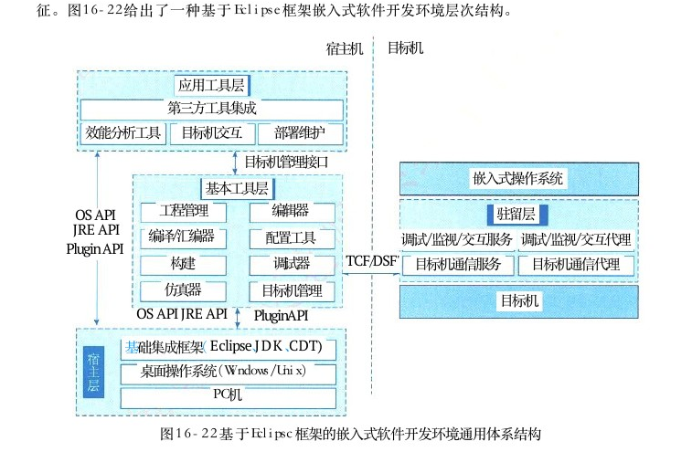

图16－22基于Eclipsc框架的嵌入式软件开发环境通用体系结构

<!-- PDF 第 592 页 -->

Eclipse 是一个开放源代码的、基于 Java 的可扩展开发平台。就其本身而言，它只是一个框架和一组服务，用于通过插件组件构建开发环境。 Eclipse 附带了一个标准的插件集，包括Java 开发工具 （Java Development Kit，JDK） 和 C／C＋＋ 开发工具 （C／C＋＋ Development Tools，CDT ） 等。通常，嵌入式软件开发环境按功能可划分为宿主层、基本工具层、应用工具层和驻留层。宿主层、基本工具层和应用工具层运行在宿主机上，为用户提供嵌入式软件开发所需要的能力工具；驻留层作为一种可剪裁组件，运行在目标机上，为其他层工具运行提供宿主机与目标机间的通信和代理服务。宿主层是开发环境的基本支撑软件，它是在桌面操作系统（如： Windows、Unix） 之上，为开发提供基础平台支持，主要包括 Eclipse、JDK 和 CDT 等。 Eclipse为开发环境提供基础开发框架，它的跨平台特性能够为开发环境屏蔽大多数桌面操作系统特性，开发环境的所有功能均是基于Eclipse 开放式框架插件机制的构件； JDK是 SUN 公司提供的一种Java语言的软件开发工具包 （Java Devclopment Kit）， 它包括 Java的运行环境和Java工具； CDT 为 C ／ C ＋ ＋语言的开发提供了最基础的支持能力，开发环境可基于 CDT 扩展开发，向用户提供嵌入式 C ／ C ＋ ＋开发调试能力。基本工具层和宿主层之间的接口遵循 Eclipse 插件开发接口 （Plugin API）、JRE API接口和 OS API 接口。基本工具层是嵌入式软件交叉开发的最基本的工具的集合。它主要包括支持用户编写和组织应用程序使用的项目工程管理能力、支持友好的代码编辑界面、支持将高级语言（或汇编语言）翻译成机器语言的交叉编译能力、支持嵌入式系统软／硬件的可配置能力、支持多文件的装订连接能力、支持应用程序的调试能力、支持目标机管理能力和代码仿真能力。基本工具层提供的功能应覆盖嵌入式软件开发中的编写、构建、编译、下载、调试等所用过程。应用工具层主要是在基本工具层的基础上，为用户提供一组效能分析、目标机交互和部署维护等目的可视化高级开发工具，同时也可支持第三方嵌入式开发工具的无缝集成。效能分析工具可采集应用软件的运行状态信息，以图示化方法显示，并提供一系列辅助分析功能，如：时间／事件监视、故障定位、统计分析等；目标机交互可以以命令方式给用户提供与目标机交互操作（如查询信息、控制进程等）功能，使用户可干涉目标机的运行，如： shell 命令；部署维护提供用户对操作系统即应用代码的状态管理、批量部署和升级等功能，帮助软件人员开展后期维护工作。驻留层主要是为开发环境提供目标机支持能力。由于开发环境中的大多数工具都要和目标机进行交互操作，这就要求开发环境必须在目标机中驻留一些程序来与宿主机进行对接，为宿主机工具提供支撑，这些程序通常称之为“代理 （Agent） 程序”。代理程序是可剪裁组件，可随操作系统一起运行在目标机上，为各类工具提供通信、调试、监视和交互等功能。

## 4．嵌入式系统软件开发环境的主要功能

由于嵌入式系统的软件开发通常采用的是交叉开发方式，因此其开发环境中的工具应支持这种交叉开发的特点。嵌入式系统软件开发环境的功能应覆盖嵌入式软件开发过程，即编码过程、编译过程、构建过程、下载过程、调试过程和运行过程等。因此，开发环境的主要功能包括如下。

<!-- PDF 第 593 页 -->

工程管理功能：工程管理支持将嵌入式软件开发中的各类资源（源代码、目标码、数据文件、配置文件和脚本文件等）以工程项目的方式组织管理，提供规范的项目向导、预定义项目模板以及资源管理能力，同时为其他工具提供操作入口。编辑器功能：为嵌入式软件开发人员提供对源文件、配置文件、脚本文件等资源进行编辑的工具。编辑器除提供基本的文本编辑功能外，还应提供高级语言（如： C／C＋＋） 源码编辑、脚本文件编辑和 XML 配置编辑等高级功能。构建管理功能：构建 （Make） 是指将一个工程中的放在若干个目录中、不同类型的多个源文件进行智能批处理的工具。 Make 是依据 makefle中定义的一系列的规则来指定哪些文件需要先编译，哪些文件需要后编译，哪些文件需要重新编译的规划，对工程项目进行自动化批量编译的过程。编译／汇编器功能：编译（汇编）器是在宿主机上运行，能够编译出在嵌入式设备上运行的可执行代码的工具。通常，在嵌入式开发环境中均采用国际上GNU 开源社区的 GCC 编译环境，它提供将 C／C＋＋ 源文件、汇编文件、链接文件翻译为二进制可执行文件。配置功能：配置功能是面向嵌入式系统的资源管理功能，根据目标系统需求，为系统进行定制化管理的工具。针对嵌入式系统的可伸缩性、通用性的特点，通过配置工具可形成不同的配置构型，以适应不同的应用场景。调试器功能：调试是嵌入式软件开发不可或缺的一个环境，也是开发环境最为关键的一项功能。调试器提供对嵌入式软件的源码级、汇编级高级符号交互式调试能力。支持在宿主机上通过加载或介入方式进入软件的运行现场，结合源代码，支持暂停或恢复软件的运行实现对软件运行的控制。调试器一般提供加／卸载、运行、停止、断点、单步、修改、查询等调试命令。通常，在嵌入式开发环境中均采用国际上 GNU 开源社区的提供的 GDB 调试工具。目标机管理功能：目标机管理的主要功能是负责开发环境对连接的多个目标机进行管理和数据交换，为其他工具提供稳定、可靠的宿主机与目标机间的通信服务。它支持建立和维护宿主机与目标机之间的通信连接，支持宿主机与目标机之间一对多、多对一、多对多数据传输方式。目标机管理一般采用面向服务的目标机通信框架 （Target Communication Framework，TCF）架构或面向通道共享的调试服务框架 （Debugger Services Frameworks，DSF） 架构。仿真器功能：仿真器功能主要是解决嵌入式软件的软硬件并行设计问题。

## 5．典型嵌入式开发环境

由于嵌入式系统的开发环境是由众多工具组成，并且具有一定的专用性，是针对某种嵌入式系统或操作系统而定制的一套软件开发手段，因此市面上没有独立于嵌入式对象的软件交叉开发环境。本节给出的三款较典型的、可使用于嵌入式系统软件开发的嵌入式软件开发环境具有一定的代表性。基于 GCC 开源工具的软件开发环境： GCC 是一个编译器集合，是 GNU Compiler Collection组织提供的一套面向嵌入式领域的交叉编译环境。 GNUGCC的基本功能包括：C／C＋＋

● 输出预处理后的源程序；C／C＋＋

● 输出源程序的汇编代码；

<!-- PDF 第 594 页 -->

● 输出二进制目标文件；

● 生成静态库；

● 生成可执行程序；

● 转换文件格式。GNU编译器套件主要包括编译器 （GCC）、 汇编器 （AS）、 连接器 （LD）、 库管理器（AR）、Make 以及其他使用程序。可支持 C、C＋＋、Objective－C、Fortran、Java、Ada和 Go 等语言前端，也包括了这些语言的库（如 libstdc＋＋、libgcj 等）。目前，大多数嵌入式系统开发环境都采用了 GCC 编译器集合， GCC 的优势在于：

● 支持众多的前端编程语言；

● 支持众多的目标处理器体系结构，具有良好的可移植性；

● 具备丰富的配置工具链支持；

● 提供可靠、高效、高质量的目标代码。Workbench 软件开发环境： Workbench是由美国 WindRiver公司研制的一款嵌入式软件开发环境，是面向本公司 VxWorks 操作系统产品配套的开发环境。 Workbench集成了 WindRiver 自己研制的一款高安全交叉编译器Diab， 此款编译器较 GCC 而言，其编译效率更高、语义更严谨、代码更安全。通常， Workbench支持GCC和 Diab 等两款编译器。 Workbench软件开发环境主要特点：

● 以开放的平台为框架，调试环境可充分进行客户化定制；Eclipse

● 单一的全功能平台，涉及产品的整个开发周期；

● 广泛的适用性，特别适合复杂的目标系统；

● 丰富易用的调试手段，大大加快调试进度。包括：动态链接、目标可视、系统观察器和仿真环境等功能。MULTI集成开发环境： MULTI 是美国由GreenHills 公司研制的一款具有调试、编译器和闪存编程工具的嵌入式集成开发环境 （IDE）， 主要包括 AUTOSAR集成、性能分析项目构件器、代码覆盖、运行时错误检查、 MISARC 代码检查和 DoubleCheck 集成式静态代码分析器等功能。可支持本公司 INTEGRITY 操作系统产品，同时也可支持其他嵌入式操作系统（如：嵌入式 Linux）。 MULTI°集成了 GreenHills 自己研制的一款优化编译器。它是市场上最好、最安全的。在EEMBC基准（嵌入式行业中最广泛接受的基准测试）测试中， Green Hills Compilers始终超越竞争对手的编译器，其编译器的速度比 GNU 编译器提高了 2 0 ％ ， 是为 3 2 位和 6 4 位处理器生成最快，最小的代码。 MULTI 工具链已通过认证，可以达到最高级别的工具认证和C ／ C ＋ ＋运行认证： MULTI 集成开发环境的主要特点：

● 具有追踪和反向追踪能力。用于可以充分利用追踪到的数据，重复追踪指导找错并修正；

● 以可视化的方法呈现整个程序在时间上的各种行为，用户可快速查找定位修复错误；

● 可帮助用户发现错误、进行测试和优化程序，优化嵌入式系统的代码质量，提升嵌入式产品质量；

● 提供独特的代码覆盖工具，确保系统全面测试。

<!-- PDF 第 595 页 -->

## 16．3嵌入式系统软件架构设计方法

嵌入式系统软件架构是开发大型嵌入式系统密集型软件贯穿始终的关键桥梁，同时软件架构也是软件开发的基础。架构设计的目的是：

● 保证应用的代码逻辑清晰，避免重复的设计；

● 实现软件的可移植性；

● 最大限度的实现软件复用；

● 实现代码的高内聚、低耦合。软件架构并非可运行软件，它是一种表达，使软件工程师能够：

● 分析设计在满足规定需求方面的有效性；

● 考虑体系结构可能的选择方案；

● 降低与软件构造相关联的风险。在嵌入式软件架构总体设计时，应充分考虑软件的可靠性、安全性、可伸缩性、可定制性、可维护性、客户体验和市场时机等因素。

## 16．3．1基于架构的软件设计开发方法的应用

由于嵌入式系统是为某特定对象、特定目标而设计的一种系统，这样的系统通常具备目标明确、用途单一、质量、可靠性要求高等。在嵌入式系统中，其设计通常采用了自顶向下的设计方法，基于架构的软件设计 （ ABSD ） 可适应于嵌入式系统的软件设计方法。基于架构的软件设计 （Architecture－Based Software Design，ABSD） 方法强调由业务、质量和功能需求的组合驱动软件架构设计。 ABSD是一个自顶向下，递归细化的软件开发方法，它以系统功能的分解为基础，通过选择架构风格实现质量和业务需求，并强调在架构设计过程中使用软件架构模板。 ABSD方法是递归的，并不是说需求抽取和分析活动可以终止，而是应该与设计活动并行。设计活动可以从项目总体功能框架明确后就开始，可以逐步迭代、逐步完善的进行，不管设计是否完成，架构总是清晰的，有利于降低架构设计的随意性。ABSD 方法在第7章中已详细说明，这里不再介绍。作为嵌入式系统软件架构设计，它与硬件结构密切相关，嵌入式软件的需求通常是从系统角度分解而来的，因此。在采用 ABSD 方法时，要关注系统的需求描述。

## 16．3．2属性驱动的软件设计方法

嵌入式系统，尤其是安全攸关的系统与通常的软件系统的最大不同点就是高质量属性始终贯穿于整个产品的全生命周期中。属性驱动的软件设计 （Attribute－Driven Design，ADD） 是把一组质量属性场景作为输入，利用对质量属性实现与架构设计之间的关系的了解（如体系结构风格、质量战术等）对软件架构进行设计的一种方法。 ADD 是一种定义软件体系结构的方法，该方法将模块分解过程建立在软件必须满足的质量属性之上。它是一个递归的分解过程，其中在每个阶段都选择体系结构模式和战术来满足一组质量属性场景，然后对功能进行分配，实例

<!-- PDF 第 596 页 -->

化该模式所提供的模块类型。

## 1 ． ADD开发方法的质量属性

## 1）质量属性

质量属性是指反映软件产品某一方面质量的特征或特性。如：可靠性、安全性、易用性等。软件属性通常包括功能属性和质量属性，架构的基本需求主要是在满足功能属性的前提下，关注软件的质量属性。软件的质量属性可列举很多，在不同应用领域，也有各种不同的分类法和不同的描述。在嵌入式系统中，质量属性重点关注的是可靠性、安全性、可用性、可修改性、性能、可测试性、易用性和可维护性等。

## 2）质量场景

质量场景是描述质量属性需求的一种规范，是一种面向特定的质量属性的需求。质量场景通常由刺激源、刺激、环境、制品、响应和响应度量等6个部分组成。

● 刺激源：指生成刺激的实体（计算机、人）；

● 刺激：指某事物，当其到达系统后需要对其加以考虑；

● 环境：指刺激发生时的各种条件；

● 制品：指系统或系统的一部分；

● 响应：指刺激到达后采取的反应；

● 响应度量：指能够以某种方式对响应进行度量。不同质量属性，其场景中6部分可能的值存在较大差异。表16－4给出某嵌入式系统可用性质量属性的一般场景描述。表16－4某嵌入式系统可用性质量属性的一般场景场景可能的值刺激源系统内部、外部刺激错误：疏忽（未响应）、崩溃、时间（超出）、响应（不正确）系统处理器、信道、持久存储、进程制品记录故障、通知适当的各方（用户及其他系统）、根据已定义的规则禁止事件源、在一定响应的时间间隔内不可用响应度量系统必须有可用时间间隔、可用时间、降级模式下运行的时间间隔、修复时间

通常，用户提出事物需求可能会同时影响性能、安全性和可用性等质量属性。因此，在分析和获取质量场景时，需要考虑某一质量场景可能会影响多个质量属性。同时，需求的获取往往来自于利益相关者，然而不同的利益相关者对于需求的要求也是不一样的，因此不同的利益相关者对于需求的描述也应当反映到质量场景中。在设计质量场景时。我们可采用如图16－23所示的三维立方体来进行描述。

<!-- PDF 第 597 页 -->

利益相关者N

利益相关者2利益相关者1利益相关者质量质量1 质量2质量3质量N场景场景1场景2场景3

场景N图16－23提取质量场景的模型示意图

## 2．ADD开发过程

采用 ADD 方法进行软件开发时 ， 需要经历评审 、 选择驱动因子 、 选择系统元素 、 选择设计概念 、 实体化元素和定义接口 、 草拟视图和分析评价等七个阶段 ， 如图 1 6 － 2 4 所示 。

约束条件架构关注点设计目的主要功能需求质量属性场景

## 1．评审

在已

## 2．通过选择驱动因子建立迭代目标

存在的

## 3．选择一个或多个系统元素细化

系统．选择一个或多个设计概念以满足选中上4迭的的驱动因子迭代来细化代迭代（

## 5．实例化架构元素、分配职责和定义接口

有改进

## 6．草拟视图和记录设计决策

空间的

## 7．分析当前设计、评审迭代目标、

开实现设计目的发）（细化的）软件架构设计

架构设计□ □过程步骤优先－－－构件流驱动因子图16－24 ADD 架构开发过程

<!-- PDF 第 598 页 -->

步骤一：评审输入首先需要确保设计流程的输入是可用且正确的。其次，确认设计目的是否符合设计的类型，要确保设计过程中其他的属性驱动因子也是可用的。最后，如果是设计一个已有的系统，还需要分析已经存在的架构设计的输入存在是否合理。这里的架构驱动因子主要包含：设计目的、质量属性、主要功能、架构关注点、约束条件等。驱动因子可用来完成不同的迭代目标。步骤二：通过选择驱动因子（架构）建立迭代目标根据使用的开发模型去选择设计的回合。如果选取的是迭代开发模型，则设计回合是指在开发周期内所执行的架构设计活动；如果选取的是瀑布模型，则设计回合是指全套架构设计活动。通过一个或者多个回合，产生一个符合已建立设计目的的架构。一个设计回合需要在一系列的设计迭代中进行，每一个迭代着重完成一个目标，特别是满足驱动因子的目标。举个例子：一个迭代的目标可能是创建源自元素的结构，这些元素会支持特殊的性能场景，或者启动一个即将完成的用例。步骤三：选择一个或者多个系统元素来细化系统元素可以是指一个软件模块，或者是指包含了多个元素或子模块的整个软件系统。本步骤主要是指选取可满足驱动因子需要的一个或者多个架构结构，这些结构是由具有内在关联的元素组成的，并且这些元素通常是经过细化前已在之前的迭代中确定的元素获得的。细化就是分解成细粒度的元素、组合成粗粒度的元素或者对之前确定好的元素进行细化。步骤四：选择一个或者多个设计概念来细化本步骤是从常用的架构设计模式中选取一种或多种设计概念，对选中的驱动因子进行细化。这里，架构设计模式主要包括结构模式、分层设计和域对象设计等；接口分区主要包括显示接口、代理等。基于高并发的设计主要包括半异步／半同步设计等。步骤五：实例化架构元素、分配职责和定义接口选择好了一个或者多个设计概念后，就要求做另一个设计决策了，包括所选择的实例化元素的设计概念。比如，如果选择分层，就需要决定分多少层，这里的这些分层就是实例化后的元素，某些情况下，实例化是可以配置的。在实例化元素之后，需要给每个元素分配职责。举个例子：比如在局域网络的企业级系统中，通常有三层：表示层、业务层、数据层。实例化元素只是一个任务，这个任务通过开展创建架构以满足一个驱动因子或者一个关注点。已经被实例化后的元素也需要被关注，以便这些元素之间可以互相配合。通过接口来实现交互。步骤六：草拟视图和记录设计决策到此步骤，已经完成了本次迭代中所执行的设计活动了。但是这些活动的结果还没有用任何方式来确保视图能够被保留（或许这些视图还不是很完整，在随后的迭代中这些视图可能还需要重新被审视和细化；或许这些设计决策还需要支持其他的驱动因子），因此，本步骤就是将上述活动的结果用文字或图的方式记录或绘制出来，以供后续迭代使用。

<!-- PDF 第 599 页 -->

步骤七：分析当前设计、评审迭代目标、实现设计目的到本步骤，应该说已经创建好了部分设计，可以得到这个迭代设计建立的目标。在这个确定的目标前提下，可以得到项目利益相关者的认同，避免否定，导致返工。一旦对迭代中执行的设计进行了分析，就可以根据既定的目标进行架构状态评审。这意味着，已经对目标进行了足够的设计迭代，满足了设计回合相关的驱动因子。评判设计目标是否已经实现了，或者在未来项目增量中，是否需要额外的回合。在理想状态下，对每一个被称为输入组成之一的驱动因子，都要执行额外的迭代，并重复执行步骤二至步骤七。通常情况下，这样的迭代不太可能出现，因为时间或资源的限制，会迫使停止设计活动。对于是否需要更多的迭代，可以通过风险评估来预测模型完成迭代判别。就是说，我们至少找到更高优先级的驱动因子，理论上，应该确保关键驱动因子是被满足MI的，或者至少设计了足够好的满足驱动因子，最后实评估模型定义模型施时，能够在每个项目迭代中，执行一个设计回合。第一回合把重点放在定位驱动因子上，随后再为其他ISO 9126回合指定设计决策。RGM)软件质量模型是描述质量场景的最有效的方法。软件质量理想模型可以用来描述、评估和预测质量属图16－25软件质量理想模型结构图性是否在 ADD 设计中被充分体现。图16－25给出了ISO 9126 规定的软件质量理想模型结构图。

## 16．3．3实时系统设计方法

嵌入式系统具有众多自身的特性，这些特性通常和应用场景密切相关，而实时特性常被各类具备控制能力的系统所采用，比如工业控制、航空航天和轨道交通等领域中的嵌入式系统应同时具备高可靠性、高安全性、强实时性等。系统的实时性是这些嵌入式系统的核心特性，针对实时系统，其设计方法也有它的自身特点。实时系统设计方法 （Design Approach for Real－Time System，DARTS） 常被应用于嵌入式系统的软件设计中。DARTS方法主要是将实时系统分解为多个并发任务，并定义这些任务之间的接口。该方法起源于实时系统的实时结构化分析和设计方法 （Real－Time Structuring Analysis and Design，RTSAD ） 。 RTSAD 在分析阶段使用实时结构化分析 （ RTSA ） 方法，设计阶段使用实时结构化设计 （RTSD） 方法，但是这个方法没有考虑实时系统是由一些并发任务组成的这个特点。针对实时系统的这个特点， DARTS 方法提供了一些分解规则和一套处理并发任务的设计步骤，还提供了一套把实时系统建造成并发任务的标准和定义并发任务间接口的指南。

## 1 ． DARTS开发方法的基本概念

## 1 ） RTSAD方法

RTSAD方法是对传统结构化分析和设计方法的补充扩展，专门用于开发实时系统。 RTSA

<!-- PDF 第 600 页 -->

是自顶向下的实时结构化分析方法，用于系统的需求分析阶段，主要有两个不同的派别： Ward／Mellor 和 Boeing／Hatley。 近来出现了第三种方法 ESML（Extended System Modeling Language），它结合了前面两种方法的优点专门用于实时系统的结构化分析。实时结构化分析 （RTSA） 主要对传统的结构化分析方法扩充了行为建模部分，它通过状态转换图 （STD） 刻画系统的行为特征，并利用控制转换 （Control Transformation） 与数据流图集成在一起。实时结构化设计 （RTSD） 是利用内聚和耦合原则进行程序设计的一个方法，它通过事务和变换两种策略将 RTSA 的分析结构DFD ／ CFD 转换为程序结构图。这里所涉及的实时结构化分析表示法、状态转化图和程序结构图等的基本图素要求不再介绍，可参阅相关书籍。

## 2）任务结构化标准

任务结构化标准可以为设计人员将实时系统分解为并发任务的时候提供帮助。这些标准是从设计并发系统所积累的经验中得到的启发。确定任务过程中主要考虑的问题是系统内部功能的并发特性。在 DARTS 中，任务结构化标准应用到了RTSA 开发的数据流／控制流图的转换（功能）中。这样的话，根据执行功能的时间顺序，一个功能就可以和其他几个功能划分到一个任务中。任务结构化标准还可以定义一组并发任务间接口。任务接口可以采用的形式有消息通信、事件同步或者信息隐藏模块 （IHM）。 消息通信可以是松散耦合或紧密耦合的。但是任务之间没有传递数据的时候就要进行事件同步。对共享数据的访问是通过信息隐藏模块提供的。

## 3）信息隐藏

信息隐藏作为封装数据存储的标准来使用。信息隐藏模块用于信息数据存储和状态转换表的内容和表示。当有多个任务访问IHM 的时候，访问过程就必须对数据的访问进行同步。

## 4）任务架构图

RTSAD 设计方法使用任务架构图来显示系统分解为并发任务的过程，以及采用消息、事件和信息隐藏模块形式的任务间接口。图16－26所示的即为任务架构图所使用的表示法。

## 2．DARTS 开发过程

任务DARTS 方法由以下5部分组成。信息隐藏模块

## 1）用实时结构化分析方法（RTSA）开发系统规范

本阶段要开发系统环境图 （ SCD ） 和状态转换松散耦合消息通信－消息队列图 （STD）。 系统环境图可以分解为层次结构的数据流（ DFD ） ／控制流图 （CFD）。 此外，还要建立状态转无回复紧凑耦合消息通信换图与控制转换和数据转换（功能）之间的关系。这紧凑耦合消息通信－消息／回复里的具体步骤可参考 RTSA 方法中的步骤。

## 2）将系统划分为多个并发任务

事件任务结构化标准应用于数据流／控制流图层次集图16－26任务架构图表示法

<!-- PDF 第 601 页 -->

合中的叶子节点上。初步任务架构图 （ TAD ） 可以显示使用任务结构化标准确定的任务。与外部设备之间存在接口的 I／O 数据转换要映射为异步 I／O 任务、周期 I／O任务或资源监视任务。内部的数据转换映射为控制任务、周期任务或异步任务，并且可以根据它们的顺序、时间或功能内聚标准与其他转换进行合并。

## 3）定义任务间接口

通过分析在上一阶段确认的任务间的数据／控制流接口可以定义任务间的接口。任务间的数据流被映射为松耦合的或紧密耦合的消息接口。事件流被映射为事件信号。数据存储被映射为信息隐藏模块。此时任务架构图 （ TAD ） 就进行更新以便显示任务的接口。在这个阶段，应该完成时间约束分析了。假设给定外部事件所要求的响应时间，那么就要给每个任务分配时间预算。通过显示从外部输入到系统响应的任务的执行顺序，时间顺序图可以帮助在分析过程中描述响应顺序。

## 4）设计每个任务

每个任务都代表了一个顺序程序的执行。因此，使用结构化设计方法，每个任务都可以划分为多个模块。转换分析或事务分析方法就是用于实现此目的的。在这个阶段要定义各个模块的功能以及与其他模块之间的接口。此外，还要设计各个模块的内部结构，可以用 PDL 语言进行详细的描述。

## 5）设计过程的成果

●规范。RTSA

● 任务结构规范：任务结构规范定义了系统中的并发任务，并指定了每个任务的功能以及与其他任务之间的接口。

● 任务分解：任务分解定义了每个任务分解为模块的过程，以及每个模块的功能、接口和使用PDL表示的详细设计。

## 3 ． DARTS 开发方法的评价

DARTS 开发方法的主要优势：

● 强调把系统分解成并发的任务，并提供了确认这些任务的标准。强调并发在并发实时系统的设计中非常重要；

● 提供了详细的定义任务间接口的指南；

● 强调了用任务架构图的重要性，这在实时系统的设计中也非常重要；(STD)

● 提供了从规格到实时设计的转换。方法提供了一些分解规则和一套处理RTSADARTS并发任务的设计步骤，使软件设计者可以从RTSA规格来设计由并发任务组成的软件设计。DARTS 开发方法的不足之处：

● 虽然方法用来封装数据存储，但是它并没有像和完全做到了这一DARTSIHMNRLOOD点。实际上，它是用结构化的设计方法把任务创建成了程序模块。

● 用的一个潜在问题就是，如果阶段的工作没有做好，创建任务就非常困难。RTSA

<!-- PDF 第 602 页 -->

## 16．4嵌入式系统软件架构案例分析

## 16．4．1鸿蒙操作系统架构案例分析

鸿蒙操作系统 （HarmonyOS） 是华为公司研制的一款自主版权的操作系统，是一款“面向未来”、面向全场景（移动办公、运动健康、社交通信、媒体娱乐等）的分布式操作系统。在传统的单设备系统能力的基础上， HarmonyOS 提出了基于同一套系统能力、适配多种终端形态的分布式理念，能够支持多种终端设备的能力。鸿蒙 （HarmonyOS） 整体采用分层的层次化设计，从下向上依次为：内核层、系统服务层、框架层和应用层。系统功能按照“系统”→“子系统”→“功能／模块”逐级展开，在多设备部署场景下，支持根据实际需求裁剪某些非必要的子系统或功能／模块，如图16－27所示。

应系统应用控制栏设置电话扩展应用／三方应用用桌面层

系统基本能力子系统集硬件服务子系统集基础软件服务子系统集增强软件服务子系统集应UI框架用用户程序框框架穿0架Ability框架智多穿生戴层M慧模图安事戴物专专A多屏S位输形H件全专特有有电T子媒专置C入子通x子有征硬专硬话系体有服R子系系知子有件分布式任务调度业识件子统子业务系V业统统子务别服服系系系务系系务统子素子子务务统统分布式数据管理统子子统统系统子子系系亲系服统系系统统统分布式软总线统统练务层方舟多语言公共基础库子系统运行时子系统

内KAL（内核拍象层）驱动子系统核层HDF（HarmonyOs驱动框架）Linux KemelLiteOS内核子系统
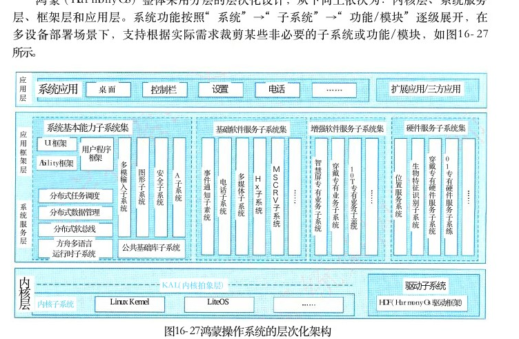

图16－27鸿蒙操作系统的层次化架构

## 1．鸿蒙的层次化分析

## 1）内核层

内核层主要由内核子系统和驱动子系统组成。内核子系统： HarmonyOS 采用多内核设计，支持针对不同资源受限设备选用适合的 OS 内核。内核抽象层 （Kernel Abstract Layer，KAL） 通过屏蔽多内核差异，对上层提供基础的内核能力，包括进程／线程管理、内存管理、文件系统、网络管理和外设管理等。驱动子系统：HarmonyOS 驱动框架 （ HDF ） 是 HarmonyOS硬件生态开放的基础，提供统一外设访问能力和驱动开发、管理框架。

<!-- PDF 第 603 页 -->

## 2）系统服务层

系统服务层是 HarmonyOS 的核心能力集合，通过框架层对应用程序提供服务。该层包含4个部分：系统基本能力子系统集、基础软件服务子系统集、增强软件服务子系统集和硬件服务子系统集。系统基本能力子系统集：为分布式应用在 HarmonyOS 多设备上的运行、调度、迁移等操作提供了基础能力，由分布式软总线、分布式数据管理、分布式任务调度、方舟多语言运行时、公共基础库、多模输入、图形、安全、 AI 等子系统组成。其中，方舟运行时提供了 C／C＋＋／JS多语言运行时和基础的系统类库，也为使用方舟编译器静态化的 Java程序（即应用程序或框架层中使用 Java语言开发的部分）提供运行时。基础软件服务子系统集：为 HarmonyOS 提供公共的、通用的软件服务，由事件通知、电话、多媒体、 DFX 、 MSDP ＆ DV 等子系统组成。增强软件服务子系统集：为HarmonyOS 提供针对不同设备的、差异化的能力增强型软件服务，由智慧屏专有业务、穿戴专有业务、 IoT专有业务等子系统组成。硬件服务子系统集：为 HarmonyOS 提供硬件服务，由位置服务、生物特征识别、穿戴专有硬件服务、 loT专有硬件服务等子系统组成。根据不同设备形态的部署环境，基础软件服务子系统集、增强软件服务子系统集、硬件服务子系统集内部可以按子系统粒度裁剪，每个子系统内部又可以按功能粒度裁剪。

## 3 ） 框架层

框架层为HarmonyOS 的应用程序提供了Java／C／C＋＋／JS 等多语言的用户程序框架和 Ability框架，以及各种软硬件服务对外开放的多语言框架API； 同时为采用 HarmonyOS 的设备提供了C／C＋＋／JS 等多语言的框架 API， 不同设备支持的 API 与系统的组件化裁剪程度相关。

## 4 ） 应用层

应用层包括系统应用和第三方非系统应用。 HarmonyOS 的应用由一个或多个 FA（FeatureAbility） 或 PA（Particle Ability） 组成。其中， FA 有 UI 界面，提供与用户交互的能力；而 PA无 UI界面，提供后台运行任务的能力以及统一的数据访问抽象。基于FA／PA开发的应用，能够实现特定的业务功能，支持跨设备调度与分发，为用户提供一致、高效的应用体验。

## 2．鸿蒙操作系统的架构分析

鸿蒙操作系统架构具有4个技术特性：

## 1）分布式架构首次用于终端OS ，实现跨终端无缝协同体验

HarmonyOS 的“分布式 OS 架构”具有分布式软总线、分布式数据管理、分布式任务调度和虚拟外设等4大能力，将相应分布式应用的底层技术实现难点对应用开发者屏蔽，使开发者能够聚焦自身业务逻辑，像开发同一终端一样开发跨终端分布式应用，也使最终消费者享受到强大的跨终端业务协同能力为各使用场景带来的无缝体验。

## 2）确定时延引擎和高性能IPC技术实现系统天生流畅

HarmonyOS通过使用确定时延引擎和高性能 IPC两大技术解决现有系统性能不足的问题。

<!-- PDF 第 604 页 -->

确定时延引擎可在任务执行前分配系统中任务执行优先级及时限进行调度处理，优先级高的任务资源将优先保障调度，应用响应时延降低25．7％。鸿蒙微内核结构小巧的特性使IPC （进程间通信）性能大大提高，进程通信效率较现有系统提升5倍。

## 3）基于微内核架构重塑终端设备可信安全

HarmonyOS采用全新的微内核设计，拥有更强的安全特性和低时延等特点。微内核设计的基本思想是简化内核功能，在内核之外的用户态尽可能多地实现系统服务，同时加入相互之间的安全保护。微内核只提供最基础的服务，比如多进程调度和多进程通信等。HarmonyOS 将微内核技术应用于可信执行环境 （TEE）， 通过形式化方法，重塑可信安全。形式化方法是利用数学方法，从源头验证系统正确，无漏洞的有效手段。传统验证方法如功能验证，模拟攻击等只能在选择的有限场景进行验证，而形式化方法可通过数据模型验证所有软件运行路径。 HarmonyOS 首次将形式化方法用于终端 TEE， 显著提升安全等级。同时由于HarmonyOS 微内核的代码量只有 Linux宏内核的千分之一，其受攻击几率也大幅降低。

## 4）通过统一 IDE 支撑一次开发，多端部署，实现跨终端生态共享

HarmonyOS 凭借多终端开发IDE， 多语言统一编译，分布式架构 Kit 提供屏幕布局控件以及交互的自动适配，支持控件拖拽，面向预览的可视化编程，从而使开发者可以基于同一工程高效构建多端自动运行 App， 实现真正的一次开发，多端部署，在跨设备之间实现共享生态。华为方舟编译器是首个取代 Android虚拟机模式的静态编译器，可供开发者在开发环境中一次性将高级语言编译为机器码。此外，方舟编译器未来将支持多语言统一编译，可大幅提高开发效率。在HarmonyOS架构中，重点关注于分布式架构所带来的优势，主要体现在分布式软总线、分布式设备虚拟化、分布式数据管理和分布式任务调度等四个方面。分布式软总线是多种终端设备的统一基座，为设备之间的互联互通提供了统一的分布式通信能力，能够快速发现并连接设备，高效地分发任务和传输数据；分布式设备虚拟化平台可以实现不同设备的资源融合、设备管理、数据处理，多种设备共同形成一个超级虚拟终端。针对不同类型的任务，为用户匹配并选择能力合适的执行硬件，让业务连续地在不同设备间流转，充分发挥不同设备的资源优势；分布式数据管理基于分布式软总线的能力，实现应用程序数据和用户数据的分布式管理。用户数据不再与单一物理设备绑定，业务逻辑与数据存储分离，应用跨设备运行时数据无缝衔接，为打造一致、流畅的用户体验创造了基础条件；分布式任务调度基于分布式软总线、分布式数据管理、分布式 Profle 等技术特性，构建统一的分布式服务管理（发现、同步、注册、调用）机制，支持对跨设备的应用进行远程启动、远程调用、远程连接以及迁移等操作，能够根据不同设备的能力、位置、业务运行状态、资源使用情况，以及用户的习惯和意图，选择合适的设备运行分布式任务。HarmonyOS 架构的系统安全性主要体现在搭载 HarmonyOS 的分布式终端上，可以保证“正确的人，通过正确的设备，正确地使用数据”。这里通过“分布式多端协同身份认证”来保证“正确的人”，通过“在分布式终端上构筑可信运行环境”来保证“正确的设备”，通过“分布式数据在跨终端流动的过程中，对数据进行分类分级管理”来保证“正确地使用数据”。

<!-- PDF 第 605 页 -->

HarmonyOS 架构提供了基于硬件的可信执行环境 （TEE，Trusted Execution Environment） 来保护用户的个人敏感数据的存储和处理，确保数据不泄露。由于分布式终端硬件的安全能力不同，对于用户的敏感个人数据，需要使用高安全等级的设备进行存储和处理。 HarmonyOS 使用基于数学可证明的形式化开发和验证的 TEE 微内核，获得了商用 OS 内核 CCEAL 5 ＋ 的认证评级。图16－28给出 HarmonyOS 架构的设备证书认证的传输关系，图中描述了证书从一个设备的TEE 到另一设备的 TEE 之间的安全通道，实现安全传输。

证书中心

预置颁发证书－ 0 →设备证书

①可信环境证明②敏感数据传输发放设备证书

预置园同园设备证书

图16－28给出 HarmonyOS架构的设备证书认证流程

## 16．4．2面向安全攸关系统的跨领域GENESYS系统架构案例分析

GENESYS（GENeric Embedded SYStem） 是一种跨领域的通用嵌入式架构平台 ， 它是于2008—2009年由欧洲ARTEMIS 的专家小组提出的。 ARTEMIS 是欧洲联合技术活动 （JTT） 召集欧洲工业界、学术界与政府部门，制定的一种跨领域的开发嵌入式系统设计的方法。GENESYS 架构的建立，主要解决了当时嵌入式系统所面临的三方面挑战：

（1）复杂性管理的挑战：针对嵌入式系统不断增加应用和赋予其更强、更多的处理能力，解决所有应用领域如何管理的问题。 GENESYS 解决该问题的核心思想是将设计过程提升到更高的抽象级别，也就是说，采用消息交换方式实现软硬件构件的抽象级别的提升。构件是在接口规范基础上可以被重用，并不需要知道构件内部实现。 GENESYS 架构支持采用抽象、分区和分段的经典简化策略。

（2）系统健壮性的挑战：嵌入式系统要在即使有软硬件故障和误操作条件下也能提供正确的服务。 GENESYS支持系统健壮性采用的方法是设计出故障或错误的隔离框架，构件在瞬态故障引起失效后，可选择性的重启和用构件复制来屏蔽瞬态和永久错误。在此架构中，信息安全贯穿在架构的所有层次上。

（3）能量有效使用的挑战：能量有效使用是移动服务市场极度关心的问题。 GENESYS 支持能量有效使用的方法是采用综合化资源管理方法，即支持将成熟的软件构件从CPU 中迁移到

<!-- PDF 第 606 页 -->

ASIC， 这样可以减少构件的功率需求或者在不需要时（功率门）完全关闭此构件。而构件间的通信，采用的时间触发通信机制是一种绿色消息传输通信通道。GENESYS 整个架构包括两类构成系统：即构件和基础平台。基础平台提供了一种“腰”型核心服务和大量用于实现系统构件的可选择服务的最小集合。可选择系统构件在增强应用领域时，其构件的特殊性可以构建本架构的领域专用实例。图16－29给出了 GENESYS 腰型架构示意图。

应用专用服务（包含中间件）App.MW领域专用选择服务领域专用服务如：CAN总线领域专用中心服务DSC

选择服务如：全局时间、核心服务核心消息传输领域无关服务不同执行选择

图 1 6 － 2 9 GENESYS腰型架构示意图如图16－29所示， GENESYS 架构主要提供了三组服务，即领域无关服务、领域专用服务和应用专用服务（包括中间件）。领域无关服务又分为核心服务和选择服务；领域专用服务又分为领域专用中心服务 （DSC） 和领域专用选择服务 （DSO）。

（1）核心服务。核心服务是强制性的，是 GENESYS 架构实例的一部分。核心服务应包含那些可构造较高级服务或者为了维持该结构性质而不可缺少的服务，它是系统服务中的最小集。由于这类核心服务是需要被认证的，因此，它们必须是确定性的和简单的。在许多情况下，安全关键的动态系统服务可被划分成一个极小的基本核心服务和一个较复杂的选择服务，只有基本核心服务可能是需要认证的。比如：嵌入式系统中的全局时间和消息传输等服务为核心服务。

（2）选择服务。选择服务是在核心服务之上构造的。它是一种需要时可以扩展的开放式的集合。任何具体架构实例都可以使用所有选择服务或其一个子集。绝大多数选择服务在与应用构件的通用中间件 （ GEM ） 协同工作时，采用消息交换的方法进行相互通信的。在选择服务成熟稳定后，可以用硬件构件的形式实现，以提升系统的能量有效性。选择服务的例子有信息安全服务、外部存储器管理器或者 Internet 网关服务等。

（3）领域专用服务。领域专用服务是由领域特有的选择服务子集加上待开发的领域特征的特定服务组合。例如，在汽车领域 CAN 总线网络是领域专用的服务，因为绝大多数汽车应用都使用 CAN 协议。GENESYS 架构从硬件、软件的观点遵循了面向构件的风格。构件是自包含的，可以独立开发，也可以是用于大型系统设计中的硬件／软件子系统。一个构件是系统中一个封装了设计

<!-- PDF 第 607 页 -->

与实现只披露接口的可更换的部分。每一个构件表示可以被实例化多次，并且可以和其他构件组合起来形成一个系统，或者是更高层构件设计的一部分。当和其他构件综合成为系统时，每一个构件可以作为中间形式存在，构件为设计提供了适当抽象单元。GENESYS 架构的重要思想是分离计算与通信，将计算构件和通信设施作为独立构件进行设计。 GENESYS 的通信设施构件是基于消息传输的风格。构件中的基本交往机制是多播单向消息的交换。消息在发送时刻发出，在某个稍后的时刻达到在接收者那里。每一个消息有专门标识的发送者和若干个接受者。在许多实时应用中要求具有多播能力，比如，为了实现主动余度容错，多播可支持故障隔离区对构件往来的非侵入观察。 GENESYS架构的通信与计算的严格分离使得有可能独立地设计和分析这两个部分。只要通信设施接口上的行为保持不变，构件不受其内部实现的修改而变化；只要通信设施的时序性质不变，通信设施的修改对构件行为不产生任何影响。GENESYS 架构将构件归为四类：硬件构件和软件构件、系统构件和应用构件。硬件构件的功能使用硬件（如 ASIC） 被预先确定，因此不能修改。在软件构件中，功能由 FPGA或者CPU 上的软件确定。我们将加载在软件构件上的软件称为作业。将作业分配给适当的可以执行该作业的硬件单元就创建了新的构件。软件构件的功能在构件的寿命期中可以修改，也可以与硬件和软件构件混合一体，软件构件为了适应环境的变化允许系统演化。在硬件构件中实现的功能具有优良的非功能性质（如能量有效性）。 GENESYS 提供了一种安全保护机制，可以预防企图恶意使用软件构件的使用者。系统构件是提供某些架构服务的构件。系统构件是符合 GENESYS 架构原则的自包含的构件，可以被认为是 GENESYS 架构的一部分。系统构件可以广泛重用在许多不同的应用场景中，应用设计者只考虑应用构件的开发。图16－30给出了基于GENESYS 架构的四类基于消息的构件接口。

技术相关的接口 （TDI）（如：内部仿真）

连接口 （LIF）局部接口 （LI）构件（组件接口）如处理输入输出

技术无关接口 （TII）（构件配置和资源管理）图16－30构件的四类基于消息接口

其中：链接接口 （LIF）：LIF 提供了构件与构件之间基于消息的操作服务，它是构件的综合接口。构件的 LIF可以抽象掉构件的内部结构和局部接口，不披露构件的内部实现细节和局部接口，它应能够精确地为用户及组合性定义时间或值的范围。局部接口 （LI）：LI 是构件连接到外部环境（如 I／O、 其他系统）的接口，它建立了构件和

<!-- PDF 第 608 页 -->

局部环境之间的连接关系，如过程控制系统的传感器、输入输出或者具体的人机接口等。技术无关接口 （TII）：TⅡ是指用于系统运行需要的配置或管理资源的接口，它属于非功能属性范畴，比如赋以构件正常的名字和输入输出端口、复位、启动和重启构件和监控与控制资源需求（如功率）等。技术相关的接口 （TDI）：TDI 是指用于查看构件内部、观察构件的内部变量的接口，如构件诊断。GENESYS 架构是一种跨领域的嵌入式架构，其架构的主要特征及优势包括：精确的构件定位：此特征主要体现在5个方面。

（1）简单化：通过提升抽象级别，可以将大型系统的复杂性进行简化，使其易于理解和符合逻辑关系。

（2）跨领域重用：基于LIF 连接接口的精确规格说明，构件可以被跨领域重用。

（3）规模的经济性：标准构件可以大量的生产以提升工业产品的规模经济性。

（4）健壮性：为了降低构件的瞬间或永久的失效影响，独立构件可以被复位、重启、重造和重构。

（5）可降低系统集成的工作量。开放性：此特征主要体现在5个方面。

（1）可集成性：不同供应商生产的各种各样的构件可以通过标准化技术进行集成。

（2）可升级性：优良构件的开放式接口 （LIF） 可以在不受构件环境影响的情况下进行技术升级。

（3）可扩展性：开放式系统可根据新的需求进行扩展和演变。

（4）遗产系统的集成：优良的开放式接口可以很容易地使用应用特殊网关构件集成遗产系统。

（5）降低成本：标准化的开放式构件（如通信系统、网络网关、防火墙等）可以被大规模生产。三级集成： GENESYS 定义了三级的集成，即芯片级 （Chip Level）、 设备级 （Device Level）和系统级 （System Level）。 芯片级的构件是 IP 核， IP 核间可通过 NoC（Network of Chip） 相互连接；设备级的构件是芯片，芯片间可以由内部通信芯片互相连接。一个设备可以是在互联网上的一个可寻址实体，也可以是一个IP 地址；系统级的构件是设备，它们可以由有线或无线通信服务互相连接。系统集成通常分为封闭式系统和开放式系统，封闭式系统其结构往往是静态的，而开放式系统其结构往往是动态的，如设备可以动态加入和移出。分层的服务：分层、分解对于处理复杂性系统而言是一种优良的策略。分层服务的特征主要体现在3个方面。

（1）可重用性：在大多数不同应用的上下文中，少量的通用核心服务可以被定制成可重用构件，并能够用硬件实现。

（2）领域定位：专业领域的中心服务可以用硬件或软件（中间件）在核心服务之上实现。

（3）工效经济性：领域技术人员仅仅需要理解领域专用服务即可。确定的核心：此特征主要体现在5个方面。

<!-- PDF 第 609 页 -->

（1）及时性：确定性代表着及时性，在许多嵌入式应用中需要对事件的快速响应。

（2）降低复杂性：通常人们是很难处理非确定性行为的，确定性可以通过对线性时间结构的分离来支持行为而达到降低复杂性。

（3）可测试性：如果同一个输入始终产生相同结果的话，那么，测试一个系统就显得非常容易。

（4）认证：认证机构主要关注安全相关服务的确定性行为。

（5）故障掩蔽：从逻辑层面上讲，为了故障掩蔽（如三余度容错）确定性行为是必需的。标准的互联集成：此特征主要体现在4个方面。

（1）对远程访问的保护：对于一个应用或者机器，可以对远程操作或远程诊断进行保护。

（2）降低集成工作难度：标准的实时以太网 （RT－Ethernet） 可降低项目专用开发成本，并提升半导体技术的规模经济性。

（3）通常的人机互动：使用标准的 Web 浏览器可降低投入人机界面 （ MMI ） 设备的数量。

（4）安全性：采用标准的网络防火墙确保了安全性，可避免开发和集成中的失误。

## 16．4．3物联网操作系统软件架构案例分析

物联网 （Internet of Things，IoT） 是指通过信息传感设备，按约定的协议，将任何物体与网络相连接，物体通过信息传播媒介进行信息交换和通信，以实现智能化识别、定位、跟踪、监管等功能。在物联网应用中有三项关键，分别是感知层、网络传输层和应用层。具体地说，物联网是将无处不在的末端设备和设施，包括具备“内在智能”的传感器、移动终端、工业系统、楼控系统、家庭智能设施、视频监控系统等，和“外在智能”的，如贴上RFID的各种资产 （Assets）、 携带无线终端的个人与车辆等“智能化物件或动物”或“智能尘埃” （Mote）， 通过各种无线和／或有线的长距离和或短距离通信网络连接物联网域名实现互联互通 （M2M）、 应用大集成 （Grand Integration） 以及基于云计算的 SaaS 营运等模式，在内网（Intranet）、 专网 （Extranet）、 和／或互联网 （Internet） 环境下，采用适当的信息安全保障机制，提供安全可控乃至个性化的实时在线监测、定位追溯、报警联动、调度指挥、预案管理、远程控制、安全防范、远程维保、在线升级、统计报表、决策支持、领导桌面（集中展示的 CockpitDashboard） 等管理和服务功能，实现对“万物”的“高效、节能、安全、环保”的“管、控、营”一体化。可以说物联网是一种泛化的嵌入式系统，它把传统的嵌入式设备有机地融为一体，形成更加广域的系统。物联网操作系统至今没有一个明确的定义。物联网操作系统通常包括了芯片层、终端层、边缘层、云端层等多个层面内容。就单一层次的物联网操作系统与安卓在移动互联网领域的地位和作用类似，也是实现了应用软件与智能终端硬件的解耦。FreeRTOS 是一款开源的物联网操作系统，是世界上最受开发者欢迎的 RTOS， 目前由亚马逊公司托管。 FreeRTOS 系统主要由 BSP 驱动、内核和组件等组成（见图16－31）。这里， BSP 驱动 （Vendor drivers） 是一种对硬件资源管理服务程序，称之为驱动，为上层操作系统内核提供硬件操作服务。操作功能的内核包含了传统操作系统的最基本功能，如多任务调度、内存管理、任务间通信等功能，它为上层组件提供相应的标准接口。组件是物联网操

<!-- PDF 第 610 页 -->

作系统的主要功能，为物联网系统提供公共支持，包含网络协议 （ TCP 、 TLS 安全传输协议）、外设支持 （Wi－Fi、 蓝牙等 ） 以及POSIX 能力等。在这些公共服务之上，是定制性服务组件，如在线升级 （OTA Update）、 加密消息标准 （ PKCS ＃ 1 1 ） 支持、安全套件、消息队列遥测传输协议 （ MQTT ） 和 Hyper Text传输协议 （ HTTPS ） 等。 FreeRTOS 是一种轻量级操作系统，其内核是可剪裁的，组件也是可选的，其核心代码保持在9000行左右。

嵌入式应用程序

Device Device Greengrass MQTTHTTPS DiscoveryShadow Defender Secure PKCS#11 OTA Updates Sockets

Wi-FiBLE+POSIX+TCPTLS

FreeRTOSFreeRTOS内核内部库

供应商驱动程序

硬件
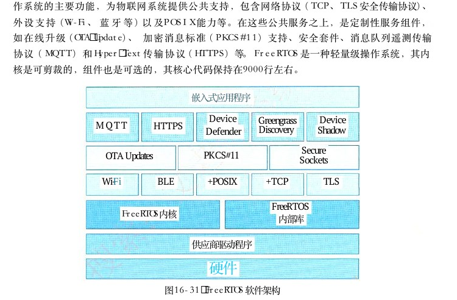

图16－31 FreeRTOS 软件架构

物联网操作系统的主要特征包括：

（1）内核尺寸伸缩性以及整体架构的可扩展性。物联网的发展已进入规模化应用，操作系统整体架构的灵活性和可扩展性决定了一个企业的商业发展。为了适应不同的应用场景下的技术要求，需要内核具有良好的伸缩性。

（2）内核的实时性。物联网操作系统是对末端设备和设施的管理，也应属于强实时系统的实时性要求。比如常见的中断响应和多任务调度等情况下，操作系统的实时性便有了更高的要求，特别是对于大多数的物联网应用而言，良好的响应时间决定了市场的需求。

（3）高可靠性。在物联网的应用环境下，面对海量节点可以说设备一经投入使用，就很难再去维护。所以节点的平均无故障运行时间和在一些严苛环境下能够正常运行显得尤为重要。

（4）低功耗。由于物联网的应用场景和网络节点的数量增多，低功耗是一个非常关键的指标。所以在整体架构设计的时候，就需要考虑休眠技术、节能技术和降频技术等，以延长续航能力。
