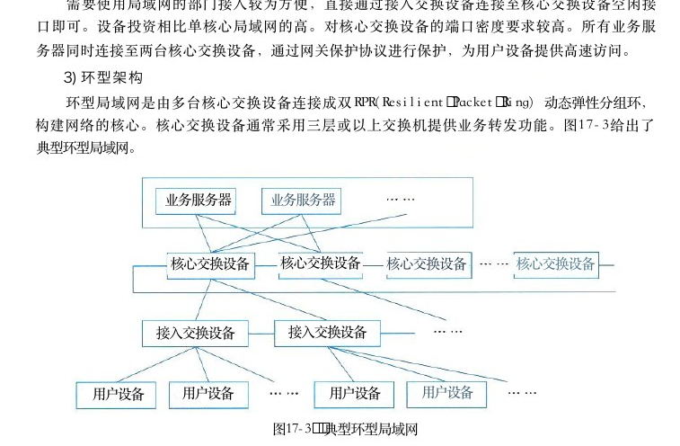
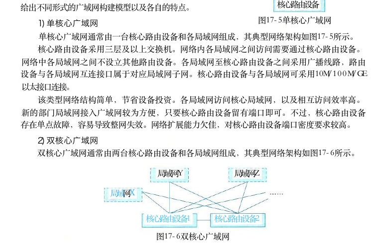
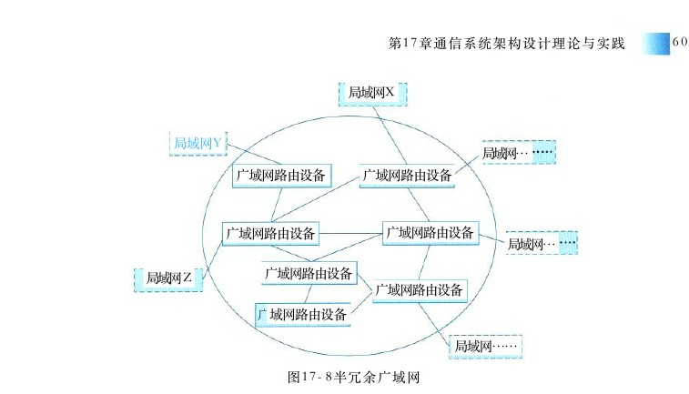
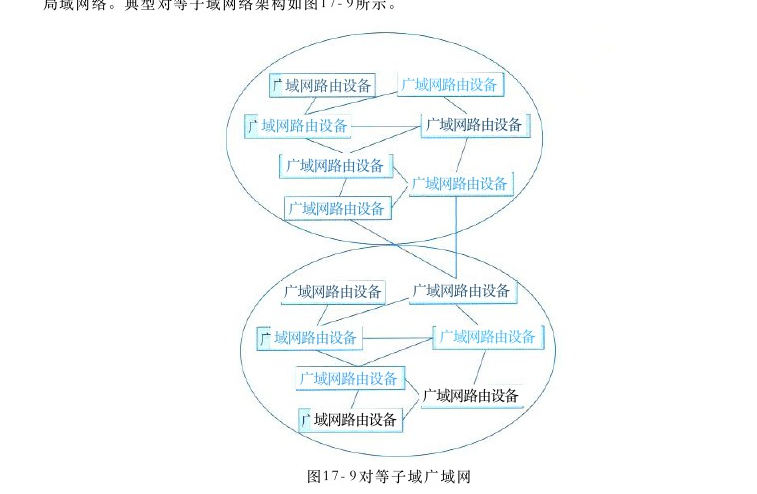
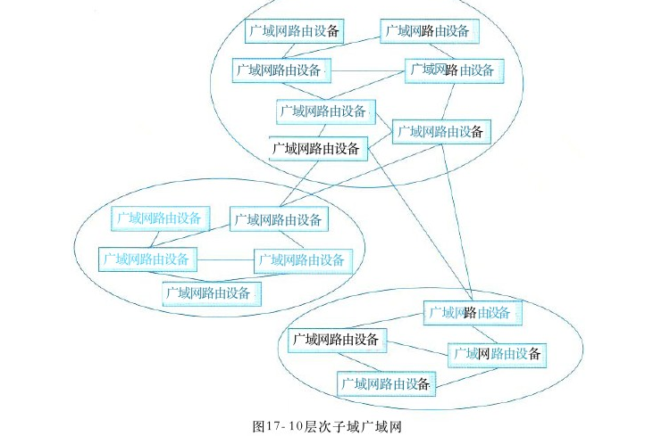
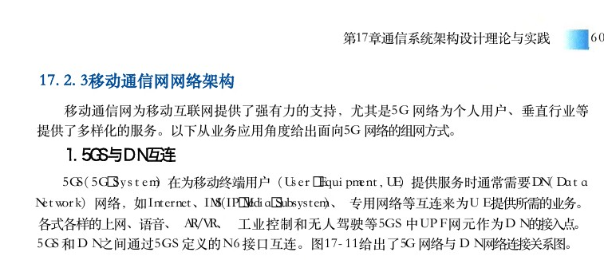
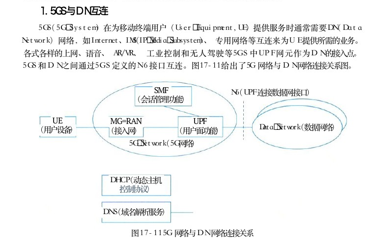
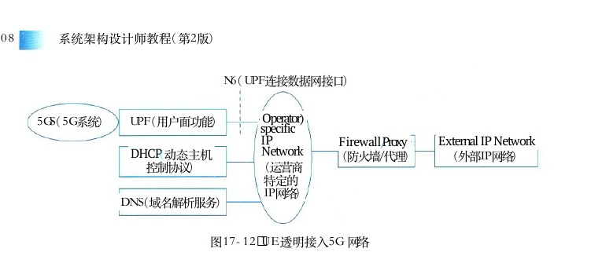
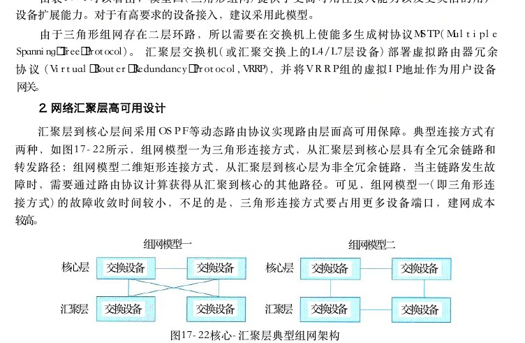
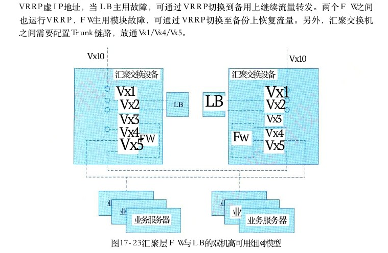

# 第17章 通信系统架构设计理论与实践

> 本页为教材原文文字提取版。图示已按 PDF 页面裁剪并插入正文图注前。

<!-- PDF 第 611 页 -->

通信系统（也称为通信网络）是利用各种通信线路将地理上分散的、具有独立功能的计算机系统和通信设备按不同的形式连接起来，依靠网络软件及通信协议实现资源共享和信息传递的系统。本章主要介绍通信系统的5种常用的网络架构和构建网络的相关技术，以及网络构建的分析和设计方法。

## 17．1 通信系统概述

随着通信技术和网络技术的不断发展，通信网络发生很大变化，如在接入侧最早使用Modem拨号上网，到现在通过光路由器上网，通信线路由最早的电话线传送用户的数据到现在以光纤高速传送用户的数据；在网络核心层，网络接口也由原来的 GE／10GE（1GE＝1Gb／s） 传输速率提升到现在的40GE／100GE， 甚至400GE 传输速率。还有网络接入方式的多样化发展，如光线千兆接入、无线Wi－Fi千兆接入、移动终端5G 高速接入；网络的结构也由原来简单独立的总线网络演化到复杂异构多层次结构，再加之移动通信多样化应用迅猛发展催生移动网由原来传统的基于物理设备形态网元演进为基于虚拟化、服务化架构的可灵活定制、便捷部署的5G网络功能元素等，这一切都为人们的学习、生活、工作，乃至整个社会、经济、科技、文化等诸多领域信息交互提供了极大的便利，也为人类社会向数字化时代发展提供了强有力的支撑。

## 17．2通信系统网络架构

当今，通信网络从大的方面主要包括局域网、广域网、移动通信网等网络形式。不同的网络会采用不同的技术进行网络构建。以下针对不同的网络给出各自的网络架构以及所采用的技术。

## 17．2．1局域网网络架构

## 1．概述

局域网，即计算机局部区域网络，是一种为单一机构所拥有的专用计算机网络。其特点是：覆盖地理范围小，通常限定在相对独立的范围内，如一座建筑或集中建筑群内（通常2．5km 内）；数据传输速率高（一般在10Mb／s 以上，典型1Gb／s， 甚至 1 0Gb／s）； 低误码率（通常在10°以下），可靠性高；通常为单一部门或单位所有；支持多种传输介质支持实时应用。就网络拓扑而言，有总线型、环型、星型、树型等型式。从传输介质来说，包含有线局域网和无线局域网。

## 2．网络组成

局域网通常由计算机、交换机、路由器等设备组成。

<!-- PDF 第 612 页 -->

## 3．网络架构

从计算机诞生出现局域网到今天，局域网经历了若干年演进。随着业务场景的多样化，以及业务对网络的要求不断提升，局域网已从早期只提供二层交换功能的简单网络发展到如今不仅提供二层交换功能，还提供三层路由功能的复杂网络。局域网，现代通常用在园区网络的构建中，某种意义上，局域网也称为园区网。以下给出局域网的几种典型架构风格。

## 1）单核心架构

单核心局域网通常由一台核心二层或三层交换设备充当网络的核心设备，通过若干台接入交换设备将用户设备（如用户计算机、智能设备等）连接到网络中。图17－1给出了单核心局域网的架构图。

业务服务器业务服务器

核心交换设备

接入交换设备接入交换设备

用户设备用户设备用户设备用户设备图17－1 典型单核心局域网

此类局域网可通过连接核心网交换设备与广域网之间的互连路由设备（边界路由器或防火墙）接入广域网，实现业务跨局域网的访问。单核心网具有如下特点：

（1）核心交换设备通常采用二层、三层及以上交换机；如采用三层以上交换机可划分成VLAN ， VLAN 内采用二层数据链路转发， VLAN 之间采用三层路由转发；

（2）接入交换设备采用二层交换机，仅实现二层数据链路转发；

（3）核心交换设备和接入设备之间可采用100M／GE／10GE 等以太网连接。用单核心构建网络，其优点是：网络结构简单，可节省设备投资。需要使用局域网的部门接入较为方便，直接通过接入交换设备连接至核心交换设备空闲接口即可；其不足是网络地理范围受限，要求使用局域网的部门分布较为紧凑；核心网交换设备存在单点故障，容易导致网络整体或局部失效；网络扩展能力有限；在局域网接入交换设备较多的情况下，对核心交换设备的端口密度要求高。作为一种变通，采用此网络架构，对于较小规模网络，用户设备也可直接与核心交换设备互联，进一步减少投资成本。

## 2）双核心架构

双核心架构通常是指核心交换设备通常采用三层及以上交换机。核心交换设备和接入设备之间可采用100M／GE／10GE 等以太网连接。图17－2给出了典型双核心局域网。

<!-- PDF 第 613 页 -->

业务服务器业务服务器

核心交换设备核心交换设备

接入交换设备接入交换设备

用户设备用户设备用户设备用户设备图17－2 典型双核心局域网

网络内划分 VLAN 时 ， 各 VLAN 之间访问需通过两台核心交换设备来完成。网络中仅核心交换设备具备路由功能，接入设备仅提供二层转发功能。核心交换设备之间互联，实现网关保护或负载均衡。核心交换设备具备保护能力，网络拓扑结构可靠。在业务路由转发上可实现热切换。接入网络的各部门局域网之间互访，或访问核心业务服务器，有一条以上条路径可选择，可靠性更高。需要使用局域网的部门接入较为方便，直接通过接入交换设备连接至核心交换设备空闲接口即可。设备投资相比单核心局域网的高。对核心交换设备的端口密度要求较高。所有业务服务器同时连接至两台核心交换设备，通过网关保护协议进行保护，为用户设备提供高速访问。

## 3 ） 环型架构

环型局域网是由多台核心交换设备连接成双 RPR（Resilient Packet Ring） 动态弹性分组环，构建网络的核心。核心交换设备通常采用三层或以上交换机提供业务转发功能。图17－3给出了典型环型局域网。

业务服务器业务服务器

核心交换设备核心交换设备核心交换设备核心交换设备

接入交换设备接入交换设备

用户设备用户设备用户设备用户设备

图17－3 典型环型局域网

典型环型局域网网络内各 VLAN 之间通过RPR 环实现互访。 RPR 具备自愈保护功能，节

<!-- PDF 第 614 页 -->

省光纤资源；具备 MAC层 5 0ms 自愈时间的能力，提供多等级、可靠的 QoS 服务，带宽公平机制和拥塞控制机制等。 RPR 环双向可用。网络通过两根反向光纤组成环型拓扑结构，节点在环上可从两个方向到达另一节点。每根光纤可同时传输数据和控制信号。 RPR 利用空间重用技术，使得环上的带宽得以有效利用。通过RPR 组建大规模局域网时，多环之间只能通过业务接口互通，不能实现网络直接互通。环型局域网设备投资比单核心局域网的高。核心路由冗余设计实施难度较高，且容易形成环路。此网络通过与环上的交换设备互联的边界路由设备接入广域网。

## 4）层次局域网架构

层次局域网（或多层局域网）由核心层交换设备、汇聚层交换设备和接入层交换设备，以及用户设备等组成。图17－4给出了层次局域网模型。

业务服务器业务服务器

核心交换设备核心交换设备

汇聚交换设备汇聚交换设备· … … · …

接入交换设备接入交换设备… ． … … …

用户设备用户设备用户设备用户设备图17－4层次局域网模型

层次局域网模型核心层设备提供高速数据转发功能。汇聚层设备提供充足接口，与接入层之间实现互访控制。汇聚层可提供所辖的不同接入设备（部门局域网内）业务的交换功能，减轻对核心交换设备的转发压力。接入层设备实现用户设备的接入。层次局域网网络拓扑易于扩展。网络故障可分级排查，便于维护。通常，层次局域网通过与广域网的边界路由设备接入广域网，实现局域网和广域网业务互访。

## 4．网络协议的应用

通常情况下，网络中互为主备的交换或路由设备之间采用必要保护协议：如 VRRP、HSRP、GLBP等；网络中二层网络采用多链路机制进行链路保护或带宽扩展时采用 STP 、 LACP等协议。网络中三层设备实现网络动态路由控制的路由协议 OSPF 、 RIP 、 BGP等。

<!-- PDF 第 615 页 -->

## 17．2．2广域网网络架构

## 1．概述

通俗来讲，广域网是将分布于相比局域网络更广区域的计算机设备联接起来的网络。广域网由通信子网与资源子网组成。通信子网可以利用公用分组交换网、卫星通信网和无线分组交换网来构建，将分布在不同地区的局域网或计算机系统互连起来，实现资源子网的共享。

## 2．网络组成

广域网属于多级网络，通常由骨干网、分布网、接入网组成。在网络规模较小时，可仅由骨干网和接入网组成。例如在广域网规划时，需要根据业务场景及网络规模来进行三级网络的功能进行选择。例如规划某省银行广域网，设计骨干网，如支持数据、语音、图像等信息共享，为全银行系统提供高速、可靠通信服务。设计分布网，提供数据中心与各分行、支行的数据交换，提供长途线路复用和主干访问。设计接入网，提供各分支行与各营业网点数据交换，采用访问路由方式，提供网点线路复用和终端访问。

## 3．网络架构

局域网Y局域网Z通常，在大型网络构建中，通过广域网将分布在局域网X各地域的局域网互连起来，形成一个大的网络。以下核心路由设备给出不同形式的广域网构建模型以及各自的特点。图17－5单核心广域网

## 1）单核心广域网

单核心广域网通常由一台核心路由设备和各局域网组成，其典型网络架构如图17－5所示。核心路由设备采用三层及以上交换机。网络内各局域网之间访问需要通过核心路由设备。网络中各局域网之间不设立其他路由设备。各局域网至核心路由设备之间采用广播线路，路由设备与各局域网互连接口属于对应局域网子网。核心路由设备与各局域网可采用10M／100M／GE以太接口连接。该类型网络结构简单，节省设备投资。各局域网访问核心局域网，以及相互访问效率高。新的部门局域网接入广域网较为方便，只要核心路由设备留有端口即可。不过，核心路由设备存在单点故障，容易导致整网失效。网络扩展能力欠佳，对核心路由设备端口密度要求较高。

## 2）双核心广域网

双核心广域网通常由两台核心路由设备和各局域网组成，其典型网络架构如图17－6所示。

局域网Y局域网Z

局域网X

核心路由设备1核心路由设备2

图17－6双核心广域网

<!-- PDF 第 616 页 -->

双核心广域网模型，其主要特征是核心路由设备通常采用三层及以上交换机。核心路由设备与各局域网之间通常采用10M／100M／GE 等以太网接口连接。网络内各局域网之间访问需经过两台核心路由设备，各局域网之间不存在其他路由设备用于业务互访。核心路由设备之间实现网关保护或负载均衡。各局域网访问核心局域网，以及它们相互访问可有多条路径选择，可靠性更高，路由层面可实现热切换，提供业务连续性访问能力。在核心路由设备接口有预留情况下，新的局域网可方便接入。不过，设备投资较单核心广域网高。核心路由设备路由冗余设计实施难度较高，容易形成路由环路。网络对核心路由设备端口密度要求较高。

## 3）环型广域网

环型广域网通常是采用三台以上核心路由器设备构成路由环路，用以连接各局域网，实现广域网业务互访，其典型网络架构如图17－7所示。

局域网X

核心路由设备1核心路由设备2

局域网……局域网Y核心路由设备m核心路由设备3

局域网Z图17－7环型广域网

环型广域网主要特征是核心路由设备通常采用三层或以上交换机。核心路由设备与各局域网之间通常采用10M／100M／GE等以太网接口连接。网络内各局域网之间访问需要经过核心路由设备构成的环。各局域网之间不存在其他路由设备进行互访。核心路由设备之间具备网关保护或负载均衡机制，同时具备环路控制功能。各局域网访问核心局域网，或互相访问，有多条路径可选择，可靠性更高，路由层面可实现无缝热切换，保证业务访问连续性。在核心路由设备接口有预留情况下，新的部门局域网可方便接入。不过，设备投资比双核心广域网高，核心路由设备路由冗余设计实施难度较高，容易形成路由环路。环型拓扑结构需要占用较多端口，网络对核心路由设备端口密度要求较高。

## 4）半冗余广域网

半冗余广域网是由多台核心路由设备连接各局域网而形成的。其典型网络架构如图17－8所示。其中，任意核心路由设备至少存在两条以上连接至其他路由设备的链路。如果任何两个核心路由设备之间均存在链接，则属于半冗余广域网特例，即全冗余广域网。半冗余广域网主要特征是半冗余广域网结构灵活，方便扩展。部分网络核心路由设备可采用网关保护或负载均衡机制或具备环路控制功能。网络结构呈网状，各局域网访问核心局域网，以及相互访问存在多条路径，可靠性高。路由层面，路由选择较为灵活。网络结构适合于部署OSPF 等链路状态路由协议。不过，网络结构零散，不便于管理和排障。

<!-- PDF 第 617 页 -->

局域网X

局域网Y局域网…广域网路由设备广域网路由设备

广域网路由设备广域网路由设备局域网…广域网路由设备局域网Z广域网路由设备域网路由设备

局域网……

图17－8半冗余广域网

## 5 ） 对等子域广域网

对等子域网络是通过将广域网的路由设备划分成两个独立的子域 ， 每个子域路由设备采用半冗余方式互连 。 两个子域之间通过一条或多条链路互连 ， 对等子域中任何路由设备都可接入局域网络。典型对等子域网络架构如图17－9所示。

广域网路由设备域网路由设备

广域网路由设备域网路由设备

广域网路由设备广域网路由设备广域网路由设备

广域网路由设备广域网路由设备

广域网路由设备域网路由设备

广域网路由设备广域网路由设备域网路由设备

图17－9对等子域广域网

<!-- PDF 第 618 页 -->

对等子域广域网的主要特征是对等子域之间的互访是以对等子域之间互连链路为主 。 对等子域之间可做到路由汇总或明细路由条目匹配 ， 路由控制灵活 。 通常 ， 子域之间链路带宽应高于子域内链路带宽 。 域间路由冗余设计实施难度较高 ， 容易形成路由环路 ， 或存在发布非法路由风险 。 对域边界路由设备的路由性能要求较高 。 网络中路由协议主要以动态路由为主 。 对等子域适合于广域网可以明显划分为两个区域，且区域内部访问较为独立的场景。

## 6 ） 层次子域广域网

层次子域广域网结构是将大型广域网路由设备划分成多个较为独立的子域 ， 每个子域内路由设备采用半冗余方式互连 ， 多个子域之间存在层次关系 ， 高层次子域连接多个低层次子域 。层次子域中任何路由设备都可以接入局域网。典型层次子域网络架构如图17－10所示。

广域网路由设备广域网路由设备

广域网路由设备广域网路由设备

广域网路由设备广域网路由设备广域网路由设备

广域网路由设备广域网路由设备

广域网路由设备广域网路由设备

广域网路由设备广域网路由设备广域网路由设备广域网路由设备

广域网路由设备

图17－10层次子域广域网

层次子域的主要特征是层次子域结构具有较好扩展性 。 低层次子域之间互访需要通过高层次子域完成。域间路由冗余设计实施难度较高，容易形成路由环路，存在发布非法路由的风险。子域之间链路带宽需高于子域内链路带宽 。 对用于域互访的域边界路由设备的路由转发性能要求较高 。 路由设备路由协议主要以动态路由为主 ， 如 OSPF 协议 。 层次子域与上层外网互连 ，主要借助高层子域完成；与下层外网互连，主要借助低层子域完成。

<!-- PDF 第 619 页 -->

## 17．2．3移动通信网网络架构

移动通信网为移动互联网提供了强有力的支持，尤其是5G 网络为个人用户、垂直行业等提供了多样化的服务。以下从业务应用角度给出面向5G 网络的组网方式。

## 1．5GS与DN 互连

5GS（5G System） 在为移动终端用户 （User Equipment，UE） 提供服务时通常需要 DN （ DataNetwork） 网络，如Internet、IMS（IP Media Subsystem）、 专用网络等互连来为UE提供所需的业务。各式各样的上网、语音、 AR／VR、 工业控制和无人驾驶等5GS 中UPF 网元作为 DN 的接入点。5GS 和 DN之间通过5GS 定义的 N 6 接口互连。图17－11给出了5G 网络与 DN 网络连接关系图。

SMFN6（UPF连接数据网接口）（会话管理功能）

UE MG=RANUPFData Network（数据网络）（用户设备）（接入网）（用户面功能）

## 5G Network（5G网络）

DHCP（动态主机控制协议）

DNS（域名解析服务）

图17－115G 网络与 DN 网络连接关系

如图17－11所示，5G Network 属于 5G 范畴，包括若干网络功能实体，如 AMF／SMF／PCF／NRF／NSSF等。简洁起见，图中仅表示出了与用户会话密切相关的网络功能实体。在5GS 和 DN 基于 IPv4／IPv6 互连时，从 DN 来看， UPF 可看作是普通路由器。相反从5GS 来看，与 UPF 通过 N 6 接口互连的设备，通常也是路由器。换言之，5GS 和 DN之间是一种路由关系。 UE 访问DN 的业务流在它们之间通过双向路由配置实现转发。就5G 网络而言，把从 UE流向 DN 的业务流称之为上行 （UL，UpLink） 业务流；把从 DN 流向 UE 的业务流称为下行 （DL，DownLink） 业务流。 UL 业务流通过 UPF 上配置的路由转发至 DN ； DL 业务流通过与 UPF 邻近的路由器上配置的路由转发至 UPF。此外，从UE通过 5GS 接入 DN 的方式来说，存在两种模式，即透明模式和非透明模式。

## 1）透明模式

在透明模式下，5GS 通过 UPF 的 N 6接口直接连至运营商特定的 IP 网络，然后通过防火墙（Firewall） 或代理服务器连至 DN （即外部 IP 网络 ） ， 如 Internet 等。 UE 分配由运营商规划的网络地址空间的 IP 地址。 UE在向 5GS 发起会话建立请求时，通常5GS 不触发向外部 DN － AAA服务器发起认证过程。图17－12给出了 UE透明接入5G 网络的示意图。

<!-- PDF 第 620 页 -->

N6（UPF连接数据网接口）

Operator)

## 5GS（5G系统）UPF （用户面功能）

specific IP／External IP Network FirewallProxy Network（动态主机DHCP（防火墙／代理）（外部IP网络）控制协议）（运营商特定的IP网络）DNS（域名解析服务）

图17－12 UE 透明接入5G 网络

在此模式下，5GS 至少为 UE 提供一个基本ISP服务 。 对于 5GS而言，它只须提供基本的隧道 QoS 流服务即可。 UE访问某个 Intranet网络时， UE级别的配置仅在UE 和 Intranet 网络之间独立完成，这对5GS 而言是透明的。

## 2）非透明模式

在非透明模式下，5GS 可直接接入Intranet／ISP， 或通过其他 IP 网络 （ 如 Internet） 接入Intranet／ISP。 如 5GS 通过 Internet方式接入 Intranet／ISP， 通常需要在 UPF 和 Intranet／ISP之间建立专用隧道来转发UE 访问Intranet／ISP 的业务。 UE 被指派属于Intranet／ISP 地址空间的 IP 地址。此地址用于UE 业务在UPF、Intranet／ISP 中转发。图17－13 （a） 和 （b） 分别给出了UE通过 5GS非透明接入DN 和 UE 的原理图。

N6 N6 ISP/Intranet ISP/Intranet External IP

## 5GS UPF

## 5GSUPF

Network App Server App Server(e.g.Internet)

（a） 直接接入（b） 间接接入图17－13 UE通过5GS 非透明接入DN原理图

综上所述， UE通过 5GS 访问Intranet／ISP 的业务服务器，可基于任何网络如 Internet等来进行，即使不安全也无妨，在UPF 和 Intranet／ISP之间可基于某种安全协议进行数据通信保护。至于采用何种安全协议由移动运营商和 Intranet／ISP提供商之间协商确定。作为 UE 会话建立的一部分 ， 5GS 中 SMF 通常通过向外部 DN － AAA 服务器 （ 如 Radius、Diameter服务器 ） 发起对UE 进行认证。在对 UE 认证成功后，方可完成UE会话的建立，之后UE 才可访问 Internet／ISP 的服务。

## 2 ． 5 G网络边缘计算

5 G网络改变以往以设备、业务为中心的导向，倡导以用户为中心的理念。5G 网络在为用户提供服务的同时，更注重用户的服务体验 QoE（Quality of Experience）。 其中 5G 网络边缘计算能力的提供正是为垂直行业赋能、提升用户 QoE 的重要举措之一。

<!-- PDF 第 621 页 -->

5 G 网络的边缘计算 （Moble Edge Computing，MEC） 架构如图17－14所示，支持在靠近终端用户 UE的移动网络边缘部署5GUPF 网元，结合在移动网络边缘部署边缘计算平台 （MobileEdge Platform，MEP）， 为垂直行业提供诸如以时间敏感、高带宽为特征的业务就近分流服务。于是，一来为用户提供极佳服务体验，二来降低了移动网络后端处理的压力。运营商自有应用或第三方应用 AF（Application Function） 通过 5GS 提供的能力开放功能网元 NEF（Network Exposure Function）， 触发 5G 网络为边缘应用动态地生成本地分流策略，由PCF（Policy Charging Function） 将这些策略配置给相关 SMF ， SMF 根据终端用户位置信息或用户移动后发生的位置变化信息动态实现 UPF （即移动边缘云中部署的 UPF ） 在用户会话中插入或移除，以及对这些 UPF 分流规则的动态配置，达到用户访问所需业务的极佳效果。另外，从业务连续性来说，5G 网络可提供SSC 模式 1 （ 在用户移动过程中用户会话的 IP接入点始终保持不变）， SSC 模式2（用户移动过程中网络触发用户现有会话释放并立即触发新会话建立）， SSC 模式3（用户移动过程中在释放用户现有会话之前先建立一个新的会话）供业务提供者 ASP（Application Service Provider） 或运营商选择。

Mobile Edge Cloud（移动边缘云）ApplApp2 Service Service（应用服务1） （应用服务2）

MEP(Mobile Edge Platform)移动边缘平台Mobile Central Gloud UE5G-AN UPF PCFNETAF AMF

## 5G接入网

（用户设备）（用户面功能（策略控制 （网络能力（应用（接入移动性开放功能）功能）功能）管理功能）Traffic Flow (to Edge App)业务流（到边缘应用）

SMF（会话管理功能）UPF Mobile Edge Cloud（用户面功能）ApplApp2Central DN Service（中心DN）Service

MEP(Mobile Edge Platform)

UPF UE

## 5g-AN

Traffic Flow(to Central App)业务流（到中心应用）＇图 1 7 － 1 4 5G 网络边缘计算架构

<!-- PDF 第 622 页 -->

## 17．2．4存储网络架构

一般来说，计算机访问磁盘存储有3种方式：

（1）直连式存储 （Direct Attached Storage，DAS）： 计算机通过 I／O 端口直接访问存储设备的方式。

（2）网络连接的存储 （Network Attached Storage，NAS）： 计算机通过分布式文件系统访问存储设备的方式。

（3）存储区域网络 （Storage Area Network，SAN）： 计算机通过构建的独立存储网络访问存储设备的方式。DAS 采用 I／O总线架构，如IDE 或 ATA 等将存储设备挂接在计算机中，实现数据存储。多种存储设备适合用作主机连接存储；包括硬盘驱动器、 RAID 阵列、 CD 、 DVD 和磁带驱动器。对主机连接存储设备进行数据传输的 I／O 指令是针对特定存储单元（例如总线 ID 和目标逻辑单元）的逻辑数据块的读和写。NAS 和 SAN 都是基于网络构建存储系统的。网络存储采用面向网络的存储体系结构，使数据处理和数据存储分离，由专门的系统负责数据处理，存储设备或子系统负责数据的存储。网络存储结构通过网络连接服务器和存储资源，具有灵活的网络寻址能力和远距离数据传输能力，实现了在单一区域或多个区域可靠的数据存储、恢复，以及不同主机不同存储设备之间的资源共享。

## 1．网络连接存储（ NAS ）

NAS 设备是一种专用存储系统，用户计算机NAS设施客户机通过数据网络（如LAN ／ WAN 等网络）来远程访问。如图17－15所示，用户计算机通过远程过程调用 （RPC） 访问NAS 存储单元。远程过程调用是通过 IP 网络（如基于 TCP 或 UDP ） 来进行的，NAS设施客户机LAN ／ WAN ／ 5 G等网络NAS 存储单元通常采用 RPC 接口软件来实现。通图17－15 网络连接存储过NAS ， 使得所有通过数据网络连接的计算机与主机本地连接存储一样方便命名和访问共享存储池。当然，与主机本地连接的存储相比，它的存储访问效率及性能相对较差。最常见的 NAS 协议以下：（ 1 ） 公共 Internet文件服务／服务器消息块 （Common Internet File Services ／ Server MessageBlock，CIFS／SMB）。CIFS／SMB 是 Windows 通常使用的协议。

（2）网络文件系统 （NFS）。NFS 最早为 UNIX 服务器而开发，也是通用的 Linux协议。

## 2．存储区域网络

存储区域网络 （Storage Area Network，SAN） 是一种基于块的存储，利用专用高速通信架构将服务器与其逻辑磁盘单元 （Logical Disk Unit，LDU） 相连。 LDU 是一系列通过共享存储池配置的块，以逻辑磁盘的形式呈现给服务器。服务器会对这些块进行分区和格式化，通常使用

<!-- PDF 第 623 页 -->

文件系统，以便可以像在本地磁盘上存储一样在 LDU上存储数据。此外， SAN 的设计消除了单点故障，具有极高可用性和故障恢复能力。图17－16给出了 SAN 网络的部署示意图。

存储设施服务器客户机

存储设施服务器客户机SAN网络LAN／WAN／5G等网络图17－16 SAN 网络部署

SAN 是企业最常用的存储网络架构。 SAN 将数据存储在集中式共享存储中，使企业能够运用统一的方法和工具来实施安全防护、数据保护和灾难恢复。对高吞吐量和低延迟有需求的业务关键型应用尤为适用。SAN 为专用网络，采用存储协议而不是网络协议连接服务器和存储单元。 SAN 交换机允许或禁止主机访问存储，通过配置 SAN 来为主机提供所需存储容量。 SAN 可以让服务器集群共享同一存储，让存储阵列为多个主机提供存储服务。可见， SAN通信具有极大灵活性。常见的 SAN 有 FC － SAN 和 IP－SAN， 其中FC － SAN 为通过光纤通道协议转发 SCSI 协议，IP－SAN 通过 TCP 协议转发 SCSI 协议。最常见 SAN 协议包括以下4种：

（1）光纤通道协议 （Fibre Channel Protocol，FCP）。 应用最为广泛的 SAN 或块协议， FCP使用具有嵌入式SCSI 命令的光纤通道传输协议。

（2）Internet 小型计算机系统接口 （iSCSI）： 第二大 SAN 或块协议。 iSCSI 将 SCSI 命令封装在以太网帧内，然后使用 IP 以太网络进行传输。

（3）以太网光纤通道 （Fibre Channel over Ethernet，FCoE）： 其应用相对较少。它与 iSCSI类似，将 FC 帧封装在以太网数据报中，然后像 iSCSI 一样使用 IP 以太网络进行传输。

（4）基于光纤通道的非易失性内存标准 （Non－Volatile Memory Express over Fibre Channel，FC－NVMe）： 它是一种用于通过 PCI Express（PCIe） 总线访问闪存存储的接口协议。 NVMe 支持若干并行序列，每一个序列又能支持若干并发命令。SAN 有着广泛的应用前景。 SAN 主要用于存储量大的工作环境，如 ISP、 银行等，特别地在5G 网络设备部署中得到应用。5G 网络设备通常采用业务处理和数据存储分离的架构进行设计，采用 SAN 存储网络可有效避免网元处理节点故障切换后业务数据丢失。

## 3 ． NAS 与 SAN 异同点

SAN 和 NAS 都可以用于集中管理存储，并供多主机（服务器）共享存储。但是， NAS 通常是基于以太网，而 SAN 可使用以太网和光纤通道。此外， NAS 注重易用性、易管理性、可扩展性和更低的总拥有成本 （ TCO ） ， 而 SAN 则注重高性能和低延迟。实际应用中，应根据业务特点灵活选用适合的网络存储架构。

<!-- PDF 第 624 页 -->

## 17．2．5软件定义网络架构

## 1．软件定义网络

软件定义网络 （Software Defined Network，SDN） 是由美国斯坦福大学 CLean State 课题研究组提出的一种新型网络创新架构。其核心思想是通过对网络设备的控制面与数据面进行分离，控制面集中化管控，同时对外提供开放的可编程接口，为网络应用创新提供极佳的能力开放平台；而数据面则通用化、轻量化，高效转发，以提升网络的整体运行效能。具体来说， SDN 利用分层的思想，将网络分为控制层和数据层。控制层包括可编程控制器，具有网络控制逻辑的中心，掌握网络的全局信息，方便运营商或网络管理人员配置网络和部署新协议等。数据层包括哑交换机（与传统的二层交换机不同，专指用于转发数据的设备），仅提供简单的数据转发功能，可以快速处理匹配的数据包，适应流量日益增长的需求。两层之间采用开放的统一接口（如 OpenFlow 等）进行交互。通过此接口控制器向转发设备（如交换机等）下发统一标准的转发规则，转发设备仅需按照这些规则执行相应动作即可。相比传统网络设备， SDN 技术能够更有效降低转发设备复杂度及卸载不必要的运行负载，协助网络运营商更好地控制基础设施，降低整体运营成本，同时打破了传统网络设备的封闭性，因此， SDN 是极具前途的网络技术之一。

## 2 ． SDN 网络架构

SDN 架构如图17－17所示，由下至上分为数据平面、控SDN网络应用制平面和应用平面。北向接口数据平面由网络转发设备（如通常由通用硬件构成）组SDN控制器成，网络转发设备之间通过由不同规则形成的 SDN数据通路连接起来；控制平面包含了逻辑上为中心的 SDN 控制器，它南向接口掌握着网络全局信息，负责转发设备的各种转发规则的下发；应用平面包含各种基于 SDN 的网络应用，应用无须关心网络转发设备底层细节就可以编程、部署新应用。转发设备控制平面与数据平面之间通过 SDN 控制－数据平面接转发设备转发设备口，即南向接口 SBI（South Bound Interface） 进行通信，它采用统一的通信标准，主要负责将控制器中的转发规则下发至转发设备；控制平面与应用平面之间通过SDN 北向接口图17－17 SDN 网络架构NBI（North Bound Interface） 进行通信，它允许用户根据自身需求定制开发各种网络管理应用。SDN 中的接口具有开放性，以控制器为逻辑中心，南向接口负责与数据平面进行通信，北向接口负责与应用平面进行通信，东西向接口负责多控制器之间的通信。南向接口通常采用 OpenFlow 协议，也是当今最主流南向接口协议。它最基本的特点是基于流 （Flow） 的概念来匹配转发规则。每一个转发设备都维护一个流表 （Flow Table）， 依据流表中的转发规则进行转发，而流表的建立、维护和下发都是由控制器来完成的。

<!-- PDF 第 625 页 -->

北向接口对应用开放，应用程序通过北向接口编程来调用所需网络资源，实现对网络的快速配置和部署。东西向接口使控制器具有可扩展性，为网络负载均衡和性能提升提供了技术途径。

## 17．3 网络构建关键技术

## 1 7 ． 3 ． 1 网络高可用设计

## 1．网络高可用性概述

随着网络快速发展及应用日益深入，各种核心和增值业务在网络上广泛部署，网络的作用愈来愈凸显出来。即使网络出现短时间中断，都可能对业务带来比较大的影响，甚至给企业造成一定程度的经济损失。因此，网络可用性在网络设计时需高度重视。网络可用性度量可从两个方面考虑。首先是网络不能频繁出现故障。网络出现故障势必影响业务的运营，特别是实时性强和对丢包时延敏感的业务，如语音、视频以及在线游戏等。退一步讲，网络即使出现故障，应能迅速恢复。如一个网络不常出现故障，但出现一次故障，需要比较长时间才能恢复，如几个小时、几天或甚至更长时间，这样的网络也不能算是高可用性网络。因此，故障次数少和故障恢复时间短是衡量网络高可用性的主要指标。可用性 （Availability） 可以下式表示：A=MTBF/(MTBF+MTTR)MTBF ： 平均无故障时间 （Mean Time Between Failurs）MTTR ： 平均故障修复时间 （Mean Time To Repair）可见，提高网络可用性，提高 MTBF ， 降低 MTTR 都是行之有效的方法。 MTBF 取决于网络设备的硬件和软件本身的质量，而极力提升它们的质量总是有限的，因此无法一味地提高MTBF 数值来获得网络高可用性。设法减少 MTTR 数值，也是提高网络可用性的有效途径。就MTTR 的影响因素来说，一是以最快的速度发现网络故障，二是迅速将网络从故障状态恢复出来。实际上，上述理论公式难以精确计算网络的可用性。通常也会采用某些更具实际意义的工程经验公式变通衡量网络的可用性。

## 2．网络高可用架构

网络的高可用性是一个系统级的概念。对于一个网络来说，它由网络元素（或网络部件），按照一定的连接模型连接在一起而构成。因此，构成网络的部件的可用性，以及连接模型的可用性就决定了网络的可用性程度。以下从网络部件、网络连接模型以及有关网络协议等方面来考虑如何保证整个网络的可用性。

## 1）网络部件

网络部件是组成网络的基本要素，典型代表有各种交换机、路由器等网络设备。网络部件的高可用性是网络高可用性的关键。在网络设计时，它们的高可用设计或选用是需要重点、优

<!-- PDF 第 626 页 -->

先考虑的。通常，网络部件包括硬件结构和软件系统。因此硬件高可用性和软件系统高可用性，就直接影响着网络部件的高可用性。硬件高可用性包括主控结点冗余设计，如采用1＋1主备；业务结点热插拔设计；电源风扇冗余设计等。软件系统高可用性包括软件热补丁设计，软件异常保护，数据冗余备份等。

## 2）网络连接模型

除了网络部件本身的高可用性外，网络物理拓扑连接形式也影响网络的可用性程度。如图17－18 （a）、（b）、（c）、（d）、（e） 分别是网络设备NE 1 和网络设备NE 2 两类设备互连的五种拓扑形式。假设网络设备 NE 1 的在线率 （ 可用性 ） 为 R1， 网络设备NE 2 的在线率（可用性）为 R2。 它们的高可用性指标分别是 A1、A2、A3、A4、A5。 由 NE 1 和 NE 2 两类设备组成的这五种型式网络的可用性计算如下。

网络设备NE1网络设备网络设备NE1 NE1

网络设备NE 2网络设备NE2（b） 一对二连接（a） 一对一连接

网络设备NE1网络设备NEI网络设备NE1

网络设备NE 2网络设备NE2网络设备网络设备NE 2NE2（c） 二对一连接（d） 双一对一连接网络设备NE1网络设备NE 1

网络设备NE 2网络设备NE2（e） 双一对二连接图17－18两类设备五种拓扑互连图

（a） 是一对一（单点单归）连接方式，其可用性 A 1 为：A ？ ＝ R 1 × R 2 ；（ b ） 是一对二（单点双归）连接方式，其可用性 A 2 为：A 2 ＝ R 2 × （ 1 － （ 1 － R 1 ） × （ 1 － R ？ ） ） ；（c） 是二对一（双点单归）连接方式，其可用性 A 3 为：A 3 ＝ R 1 × （ 1 － （ 1 － R 2 ） × （ 1 － R 2 ） ） ；（d） 是双一对一 （ 双点双归 ） 连接方式 ， 其可用性A 4 为：A 4 ＝ 1 － （ 1 － R 1 × R 2 ） × （ 1 －R 1 × R 2 ) ) ;（e） 是双一对二（双归属）连接方式，其可用性 A 5 为：A 5 ＝ （ 1 － （ 1 － R 1 ） × （ 1 － R 1 ） ） × （ 1 －( 1 - R 2 ) × ( 1 - R 2 ) )

## 3）网络协议及配置

高可用性离不开运行于网络中的路由、链路检测等协议。在网络部署中，以基本路由协议如 OSPF ／ BGP 等为主，除此之外，根据网络拓扑连接和链路情况，同时部署其他链路检测协议如 BFD ／ NQA 等辅助协议以尽可能缩短网络故障发现时间，为网络故障快速恢复提供有力支撑。

<!-- PDF 第 627 页 -->

另外，提升网络可靠性的协议还包括802．3ad、VRRP、 路由多下一跳等。

## 17．3．2 IPv4与IPv6融合组网技术

互联网数字分配机构 （IANA） 在2016年已向国际互联网工程任务组 （IETF） 提出建议，要求新制定的国际互联网标准只支持 IPv6， 不再兼容 IPv4。 目前， IPv6 已经成为唯一公认的下一代互联网商用解决方案，也成了互联网升级演进不可逾越的阶段。2017年11月中共中央办公厅、国务院办公厅印发《推进互联网协议第六版 （IPv6） 规模部署行动计划》之后，各政府部门、企事业单位、科研机构等积极响应，纷纷制定具体落地实施方案和工作计划。从总体上看，我国IPv6 规模部署工作呈加速发展态势。目前国内外主流网络还是IPv4 网络， IPv6 网络尚未规模化部署。面对IPv4 网络巨大的投资成本，以及大量应用仍基于 IPv4 协议开发并提供业务的现状，网络演进还存在较长时间 IPv4到 IPv6 过渡期或 IPv4 和IPv6 网络共存期。为此，国际标准组织为应对这段较长时间过渡期，形成了相关的过渡技术标准。目前主要存在三种过渡技术：双协议栈、隧道技术、地址翻译机制。

## 1．双协议栈

IPv4／IPv6 双协议栈机制就是使 IPv6 网络节点具有一个应用层协议IPv6协议栈和一个IPv4协议栈，同时支持 IPv4和 IPv6 协议TCP／UDP协议的处理。 IPv6 和 IPv4 是功能相近的网络层协议，两者均运行IPv4协议IPv6 协议于同一物理平台，并均可承载相同的传输层协议TCP 、 UDP链路层及物理层协议等。支持双协议栈的节点既能与支持 IPv4 协议的节点通信，又能与支持IPv6 协议的节点通信。双栈IP 协议栈的结构见图17－19双栈IP 协议栈结构图17－19所示。

## 2．隧道技术

为了保持现有 IPv4 网络的投资成本，以及现有业务提供的持续性，需在现有 IPv4 网络基础上实现 IPv6 网络的构建。考虑到 IPv6 和 IPv4 的互连互通，以及IPv6 网络对 IPv4 网络的依赖，需要采用必要的隧道技术。在 IPv4 和 IPv6融合组网时通常采用下述隧道技术。

## 1）ISATAP 隧道

ISATAP（Intra－Site Automatic Tunnel Addressing Protocol） 是一种 IPv6 转换传送机制，允许IPv6 数据包通过 IPv4 网络上双栈节点传输。 ISATAP将 IPv4 网络作为一个非广播多路访问网络的数据链路层，但不需要底层 IPv4 网络支持多播工作方式。ISATAP 是通过将 IPv4 地址嵌入到 IPv6 地址当中，并将 IPv6 协议报文封装在 IPv4 中基于隧道传送的。隧道是在主机相互通信时从 IPv6 地址中抽出 IPv4地址自动建立的。换言之，当两台 ISATAP 主机基于IPv6 通信时，自动抽取其中的 IPv4 地址建立隧道，并将 IPv6 协议报文封装在其中完成双方的信息交换。 ISATAP运行环境不需其他特殊网络设备，只要通信双方节点之间 IPv4 网络可达即可。

<!-- PDF 第 628 页 -->

## 2）6to4 隧道

6to4 隧道指的是在站点之间进行 IPv6 通信，每个站点应至少部署一台6to4 路由器作为出入口，使用特定的地址格式，即地址前缀为“2002：”，将路由器 IPv4 地址嵌入到 IPv6 地址前缀中，因此位于不同6to4 站点内的主机彼此通信时即可自动抽出 IPv4 地址在路由器之间建立隧道。当 6to4 站点内主机与外部普通 IPv6 主机通信时，必须经过6to4 路由器。6to4 路由器必须同时具备6to4接口和IPv6 接口，并提供在这两种接口之间的封装解封装和转发处理。基于 6to4 隧道机制的通信需要一个全局合法 IPv4 地址，所以对解决 IPv4 地址短缺没有太大帮助。但它不需要申请 IPv6 地址，通过它可使站点迅速升级为 IPv6 网络。

## 3）4over6隧道

4over6 是 IPv4 over IPv6 的简称，是 IPv4 网络向IPv6 网络过渡过程中向纯IPv6 主干网过渡提出的一种技术。它可以在最大程度地继承基于 IPv4 网络的应用的同时，加快网络从 IPv4向IPv6 过渡的进程。基于4over6 机制，两个通信节点之间采用 IPv4 进行业务交互，但它们之间交互的 IPv4 业务实际上承载在 IPv6 网络上。

## 4）6over4 隧道

6over4 隧道技术提供一种转发机制，使得双栈节点之间在组播使能的 IPv4 网络中传送 IPv6分组。即它在用于承载的 IPv4 网络建立的虚拟数据链路层（虚拟以太网）上供 IPv6 协议传送分组数据。

## 3．网络地址翻译技术

网络地址翻译 （Network Address Translator） 技术将 IPv4 地址和 IPv6 地址分别看作内部地址和外部地址，或者相反，以实现地址转换。内部的 IPv4 主机要和外部IPv6 主机通信时，在NAT 服务器中将 IPv4 地址 （ 内部地址 ） 变换成 IPv6地址（对外地址）， NAT服务器维护一个 IPv4 和 IPv6 地址的映射表。反之，当内部IPv6 主机和外部 IPv4 主机进行通信时，则 IPv6主机地址 （ 内部地址 ） 映射成 IPv4 主机地址（对外地址）。可见，通过 NAT 技术可以解决 IPv4 主机和 IPv6 主机之间的互通问题。在网络地址翻译技术中涉及 NAT－PT（Network Address Translation－Protocol Translation）（RFC2766） 协议、 SIIT（Stateless IP／ICMPTranslation）（RFC2765） 协议等。

## 17．3．3 SDN技术

SDN 网络在控制平面和转发平面分别采用了不同技术，以满足 SDN 网络控制的全局性和灵活性，业务转发的高效性及高性价比要求。主要关键技术包括：控制平面技术、数据平面技术和转发规则一致性更新技术等。

## 1．控制平面技术

控制器是控制平面核心部件，也是整个 SDN 体系架构的逻辑中心。随着 SDN网络规模的

<!-- PDF 第 629 页 -->

扩大，单一控制器结构的 SDN 网络处理能力遇到了性能瓶颈，因此需要对控制器进行扩展。通常存在两种控制器扩展方式：一种是对网络中单一控制器本身进行扩展，另一种是采用多控制器方式。单一集中式结构的控制器，一般采用了多线程的方式对控制器进行性能提升，形成 NOX －MT 版本。另一种控制器是 Maestro， 它采用良好的并行处理架构，充分发挥了高性能服务器的多核并行处理能力，使其在大规模网络部署下性能表现更佳。多控制器方式是用扩展的方式优化 SDN 网络。扩展控制器一般可采用两种模型方式：一种是扁平控制模型；另一种是层次控制模型。

## 2．数据平面技术

SDN 转发设备（如交换机等）的数据转发形态可分为硬件和软件两种。

## 1）硬件处理方式

硬件处理方式相比软件处理方式具有更快的速度，但灵活性有所降低。为了使硬件能够更加灵活地进行数据转发操作， Bosshart等人提出了RMT（Reconfigurable Match Tables） 模型，该模型支持可重配置的匹配表，它允许在流水线阶段支持任意宽度和深度的流表。另一种硬件灵活处理技术是FlowAdapter， 它采用交换机分层的方式来实现多表流水线业务。

## 2）软件处理方式

与硬件方式不同，软件的处理速度低于硬件，但软件方式可以提升转发规则处理的灵活性。利用交换机CPU 或 NP 处理转发规则可以避免硬件灵活性差的问题。另外， NP（NetworkProcessor） 专门用来处理网络任务，在网络处理性能方面优于 CPU。

## 3．转发规则一致性更新技术

在 SDN 网络中不同转发设备转发规则更新可能会出现不一致现象。针对这种问题一般采用“两段提交”的方式来更新规则。首先，当规则需要更新时，控制器询问每个交换机是否处理完对应旧规则的流，确认后对处理完毕的所有交换机进行规则更新；之后当所有交换机都更新完毕后才真正完成更新，否则撤销之前所有的更新操作。然而，这种方法需要等待旧规则的流全部处理完毕后才能进行规则更新，这样会造成规则空间被占用的情况。增量式一致性更新算法可以解决上述问题，该算法将规则更新分多轮进行，每一轮都采用“二段提交”方式更新一个子集，达到节省规则空间和缩短更新时间的折中。

## 17．4 网络构建和设计方法

## 17．4．1网络需求分析

网络需求分析是网络构建及开发过程的起始环节，也是极其重要的阶段。在该阶段，可尽早明确客户使用网络的真实用途或痛点，以便为后续能够构建和设计出更贴近客户真实诉求的

<!-- PDF 第 630 页 -->

网络打下坚实基础，前期的网络需求分析至关重要。通过对网络需求分析，可为后续网络设计提供以下依据：更准确地评价现有网络体系；更客观做出建网决策；提供的网络交互功能更贴近用户；更好地进行网络功能移植；合理使用用户资源等。需求分析过程，主要围绕以下几个方面来开展：业务需求、用户需求、应用需求、计算机平台需求和网络需求。

（1）业务需求梳理就是调查和理解业务本质，尽可能保证设计的网络满足业务的需求。其间需要确定业务主要干系人，确定关键时间点以及确定网络的投资规模，明确业务活动，预测业务增长率进而预判网络发展的趋势，确定网络可靠性和可用性指标，确定网络安全性，以及确定网络远程访问要求等。通过梳理，形成业务需求清单。

（2）用户需求收集需从当前网络的用户开始，识别并明确用户需要的重要服务或功能。收集用户需求，可考虑从与用户群交流，准确、深入理解用户服务、需求归档几方面入手。通过与特定个人或群体进行交流，可采取观察和问卷调查，集中访谈、采访关键干系人等方式，以确保网络建设不偏离用户需求；正确理解用户服务，就是从用户描述的碎片化、模糊的、难以量化的需求中分析提取用户的真实需要，如信息传输的及时性，响应时间的容忍度，网络服务的可靠性、可用性，网络的适应性、可伸缩性、安全性，以及建网成本等等。最后，通过需求归档，将梳理的用户需求记录下来，形成用户服务表，作为网络设计需求规范编制的依据。

（3）应用需求收集主要考虑如下因素：应用类型和地点、使用方法、需求增长性、可靠性和可用性要求、网络响应时间要求等。关于应用类型，可按功能分类，也可按共享与否分类，还可按响应及时性分类，甚至也可按网络模型分类等，进行应用需求梳理。关于使用方法，主要考虑用户对资源的存取和访问的要求，可通过各种指标进行量化。通过对应用需求进行分析，输出应用需求表，其中体现应用需求的量化指标。

（4）计算机平台需求主要是明晰网络所接入的设备类型，如个人 PC、 工作站、小型机、中型机、大型机等。通过统计，形成所需提供服务的设备类型需求表。

（5）网络需求是需求分析的最后一项工作，就是要考虑网络管理员的需求。网络需求主要涉及局域网功能、网络拓扑结构、网络性能、网络管理、网络安全、城域网／广域网连接方案选择。通过对网络需求进行分析，形成网络需求的分项需求表。通过上述5个需求分析后，最终形成约束后续网络设计的网络需求规格说明书。

## 17．4．2网络技术遴选及设计

网络遴选工作是通信系统设计中关键的一项工作，根据计划实施的网络建设要求，遴选工作通常分为局域网、广域网和路由协议的选择。

## 1．局域网技术遴选

1）生成树协议 （Spanning Tree Protocol，STP）在局域网构建中，几乎离不开二层交换机的选择，在选择了二层交换机组网时，通常为了提高网络的可用性，网络会设计成有冗余或可扩展的结构，这样，极可能形成环路。为了避免

<!-- PDF 第 631 页 -->

此情况发生，需要在二层交换机上采用 STP 协议。 STP 协议是在 IEEE802． 标准中定义的，分为“．1d”“．1w”“1s” 等多个版本，以适应不同的需求。详细差别可参考相关资料。

## 2）虚拟局域网

构建虚拟局域网 （ VLAN ） ， 可将一个物理网络划分成若干个相互隔离的逻辑网络，形成不同的广播域，从而将不同部门或用途的设备规划到各自的虚拟网络中，实现信息访问的隔离。

## 3）无线局域网

由于无线局域网接入的便捷性，目前，无线局域网在企事业单位或组织内被广泛使用。一个无线局域网是由若干 AP 组成，一个AP 能覆盖的区域（即一个无线单元）范围是有限的。在设计无线局域网结构时，需要从以下几个方面予以考虑：

● 定位实现最大覆盖率，确保目标区域得以全覆盖；AP

● 无线局域网的虚拟网规划，如尽可能将所有无线接入设备划分到一个虚拟网络内；

● 冗余无线接入点布放，确保在一个区域同时由一个以上提供无线覆盖，从而避免一AP个AP故障后，可由其他AP接替以提供接入服务；

● 网络配置，在一个园区或企业、组织内，所有都应设置成同一SSIDAPSSID

## 4）线路冗余设计

为提升局域网高可用性，局域网交换机之间设计冗余链路是颇为常见的做法。冗余链路可采用备份或负荷分担两种方式来提高业务传输能力。备份方式是指采用 STP 协议可避免环路发生。此方式在提升网络高可用性同时也带来了资源浪费；负荷分担方式是指在设备转发业务时需要设置适合的均衡策略，使得业务尽可能均衡分担到不同链路上。此方式在提升网络传输可用性同时，可避免冗余链路在网络中闲置。

## 5）交换设备功能的合理使用

交换设备（如交换机）是局域网的核心设备，除了实现基本的数据存储转发功能外，还需要考虑其他特殊功能的利用，以提升网络的服务质量。如：链路聚合设置、冗余网关布设、以太网供电、多业务模块灵活支持等。

## 6）服务器冗余设计

为提升服务器性能和工作负载能力，一些组织或单位会配置多台服务器来提供服务。在实现各台服务器服务均衡上通常需要考虑以下几种方式：

（1）使用负载均衡器：通过使用前置负载均衡设备，将接入的服务请求均衡到不同的业务服务器上。

（2）使用网络地址转换：通过使用负载均衡的地址转换网关，将来自外部的服务请求地址（外部地址）转换为多个内部服务器地址，从而达到服务的均衡调度。（ 3 ） 使用 DNS 服务器：通过DNS 将一组业务服务器（每个服务器设置不同的 IP 地址 ） 的地址映射到同一域名上，使得 DNS 服务器在向用户返回请求服务的业务接入点地址时，循环返回一组地址中的一个，从而达到业务服务器均衡访问的目的。

（4）使用高可用技术：如采用双机热备系统（即高可用集群系统）以保证业务系统服务提

<!-- PDF 第 632 页 -->

供的连续性。采用双机热备系统提供服务的高可用性，主要有两种工作模式：单活（一主一备，Active－Standby） 和双活 （Active－Active）。

## 2．广域网技术遴选

## 1）远程接入技术

当今社会，不少组织、企业或公司等单位在运营中规模不断壮大，随之出现异地办公，职员流动办公等运作模式，这就促使单位网络需支持网络用户特殊的接入方式。一般来讲，主要有以下接入技术： PSTN接入技术、综合业务数据网接入技术、电缆调制解调器远程接入技术、数字用户线路 （ DSL ） 远程接入技术、无源光网络 （ PON ） 技术、无线宽带接入技术、小区宽带接入和电力通信技术 （PLC） 等。远程接入技术选择需要从现有网络的建设情况，用户接入网络需要开展的业务特点或需求，以及接入方式需支付的费用等因素综合考虑加以取舍。

## 2）广域网互连技术

在企业或组织需要将不同地域的分部网络互连在一起的时候就需要考虑广域网的互连方式。通常有以下互连技术：数字数据网络 （Digital Data Network，DDN） 技术、同步数字体系（Synchronous Digital Hierarchy，SDH） 技术、 MSTP（Multi－Service Transport Platform） 技术和VPN 接入技术。此外，广域网互连时还需要考虑性能优化方面的问题，如可利用路由器实现预留带宽、利用拨号线路、传输数据压缩、链路聚合、数据基于优先级排序、基于协议带宽预留等策略实现广域网性能的有效提升。

## 3．地址规划模型

地址规划分配，是网络管理工作的重点内容。合理的地址规划不仅为网络管理带来便利，也有利于路由协议的收敛。地址分配应遵循以下原则：

（1）使用结构化网络层编址模型，即对地址进行层次化的规划。

（2）通过中心授权机构管理地址，比如由组织的 IT 部门为网络层编址提供一个全局模型。根据网络的核心、汇聚、接入层次化结构，为组织的各个区域、分支机构等进行地址规划。

（3）编址授权下发。即由地址授权管理中心，将编址授权给分支机构来进行地址规划。

（4）为终端用户设备指派动态地址，即对于频繁变更位置、移动性角度的用户分配动态地址。

（5）私有地址合理使用。使用私有地址在组织内互访具有很高安全性，避免来自外部网络攻击。使用私有地址的用户在访问外部网络，需要进行地址转换 （NAT）， 因此，还需要做好NAT 地址池的规划。

## 4．路由协议选择

路由协议选择包括以下内容：

（1）路由协议类型的选择：路由协议选择主要包括距离矢量协议和链路状态协议。

（2）路由选择协议度量值的合理设置。

（3）路由选择协议顺序的合理指定。

<!-- PDF 第 633 页 -->

（4）层次化与非层次化路由选择协议。

（5）内部与外部路由选择协议。

（6）分类与无类路由选择协议。

（7）静态路由指定。

## 5．层次化网络模型设计

层次化网络设计模型，可帮助设计者按照层次设计网络架构，并对不同层次赋予特定网络功能，选择适合的设备／系统。在典型层次化网络结构中，核心层通常选用具备高可用性和性能优化的高端路由器／交换机；汇聚层通常选取实现策略的路由器和交换机；接入层通常选用低端交换机连接用户设备。在17．2节网络架构介绍中，层次局域网、层次子域广域网结构，就是层次化网络设计模型分别在局域网和广域网设计中的应用。层次化网络设计模型，由于更适合于网络用户不断增加，网络复杂度不同增大的场景，因此，也成为位于网络主流地位的园区网的经典模型。

## 1）层次化设计优点

网络采用层次化模型设计具有如下优点：

（1）使用层次化模型可使得网络成本降至最低。各层仅考虑自身的功能实现要求，以及运维资源要求，避免各层中不必要特性所花费的资金。

（2）层次化设计可充分利用不同层次成熟的模块化设备或部件，既避免不必要开发费用，也利于网络稳定运行。

（3）层次化设计使得网络因需求而变化或演化更加容易。

## 2）三层层次化模型设计思路

层次化模型设计中最为经典的是三层层次化模型。下面给出三层层次化模型设计思路。三层层次化模型将网络分为核心层、汇聚层、接入层。各层提供不同的功能。核心层提供不同区域或者下层的高速连接和最优传送路径；汇聚层将网络业务连接到接入层，执行与安全、流量负载、路由相关的策略；接入层为局域网接入广域网，或终端用户访问网络提供接入能力。

（1）核心层设计思路。核心层是网络互连的枢纽，极其重要，设计中应采用冗余机制，保证其高可用性，并能快速应对变化。功能设计上，应避免使用数据包过滤、策略路由等处理开销大的特性，降低核心层处理时延。另外，核心层覆盖范围不易过大，连接设备也不易过多，确保核心层具备良好的管理性；核心层提供的功能不宜多样化，避免降低核心网络设备性能。

（2）汇聚层设计思路。在汇聚层，应尽量提供出于安全性原因对资源的访问控制功能，以及出于性能原因对核心层流量的控制功能等。通过汇聚层，使得接入层的网络细节信息对核心层透明。譬如接入层的子网划分，在汇聚层向核心层路由通告时进行屏蔽，仅将汇聚后的大的子网信息上报至核心层。另外，汇聚层还应对接入层屏蔽网络其他部分的细节信息，如在路由通告时仅向接入设备宣告自身的默认路由。

（3）接入层设计思路。接入层为用户设备提供在本地网段访问应用系统，以及互访的能力，同时为这些访问提供足够带宽支持。此外，需要负责用户管理功能，如地址认证、用户认证、

<!-- PDF 第 634 页 -->

计费管理等；还需要负责收集一些用户信息的工作，如用户 IP ／ MAC地址，访问日志等信息。

## 3）层次化设计应遵循原则

（1）设计者应尽量控制网络层次，避免过多层次导致网络性能下降，增加网络时延。

（2）应首先从接入层进行设计，通过对流量负荷、行为的分析，来对上层进行精细化容量规划，依次完成各层的设计。

（3）网络设计时应尽量采用模块化方式实现各层的功能，模块间边界清晰。

（4）应在接入层对网络结构进行严格控制，以避免接入层用户改用非正常的访问外部网络的渠道，获得更大的带宽。

（5）严格控制网络的层次化结构，以避免跨层加入额外连接，导致网络非法访问或网络异常等问题。

## 6．网络高可用设计方法

在进行网络设计时，必然需要面对网络的可用性 （Availability） 和可靠性 （Reliability） 问题。它们是衡量一个网络好坏的重要指标。可靠性指的是网络连续无故障运行时间的长短，无故障运行时间越长，可靠性越高；可用性指的是，在较长时间（比如一年等）里网络可用的时间长短，可用时间越长，可用性越高。

## 1）提高网络可用性的途径

以下举两个极端例子来说二者的关系。假如一个网络可靠性很高，平均可以稳定运行10年，但是一旦网络出现故障，要用一年的时间来恢复，那么它的可用性只有90％。再譬如另一个网络，可靠性很差，平均运行10秒就会异常一次，但是恢复很快，只需要1ms 就可恢复，那么它的可用性是99．99％。通过这两个例子可以看出，提高网络可用性可采取两条途径：

（1）提高网络可靠性，影响可靠性的因素很多，包括硬件、软件、运维、环境等。其中，软件的 Bug 是影响可靠性的最主要因素。从某种意义上来说，提高软件质量相比较于使用更可靠硬件更具有成本优势。

（2）缩短网络恢复时间，一旦网络出现故障，如能在秒级，甚至毫秒级得以恢复，那么对业务影响则很小。可见，构建高可用网络，需要从耐久性、容错性及可维护性等方面进行网络规划设计。

## 2）设计的核心思想

网络系统可靠性／可用性设计的核心思想是通过合理设计组网结构和应用可靠性特性，使得网络系统软件硬件部件运行可靠，具备冗余备份、自动检测和快速恢复机制，同时也应权衡不同类型网络构建成本。

## 3）设计原则

网络可靠性／可用性设计原则：不同的网络、服务的业务场景不尽相同，其可靠性／可用性设计目标也不同。网络解决方案需要根据实际需求进行设计。高可靠、可用性网络不但涉及网络架构、设备选型、协议选择等技术层面问题，还受用户现有网络状况、投资预算，以及用户

<!-- PDF 第 635 页 -->

管理水平等影响。因此，在网络规划时，须因地制宜，综合考虑各方面影响因素。网络结构通常规划为核心层、汇聚层和接入层。网络层次越高，其影响面越广，其可靠性、可用性要求也越高。在方案设计时，采用分层架构，不同层次解决不同级别的可靠性、可用性问题。为保证网络可靠性／可用性，有关可靠性／可用性技术的实施并非简单叠加和无限制冗余，否则，一来会带来过高的网络建设成本，二来也增加了网络维护复杂度，给网络引入潜在故障隐患。因此，在网络设计时应根据网络结构、类型、层次，分析网络业务模型，确定网络拓扑，识别影响网络可靠性、可用性的关键节点和链路，合理规划和部署相适应的高可用技术。在网络可靠性规划实施时，应在保证网络各层满足可靠性要求基础上，尽量降低网络复杂度，适度控制成本，设计出最适合的方案。避免一味追求可靠性而忽视系统的整体成本和性能，换言之，构建网络应是一个平衡各方面因素的过程。

## 17．4．3 网络安全

网络从出现、发展演进都始终伴随着安全方面的问题，只是每个阶段表现的形式不同而已。在网络安全方面，不能不提进行网络攻击的网络病毒，或者说恶意代码 （Malware）。 所有恶意代码具有目的恶意、形态为计算机程序、通过执行发生作用的共性。实施网络攻击的恶意代码包含多种种类，主要有计算机病毒、网络蠕虫、特洛伊木马、后门、 DDoS 程序、僵尸进程、Rootkit、 黑客攻击工具、间谍软件、广告软件、垃圾邮件，等等。以下简单介绍实施网络安全控制的相关技术。

## 1）防火墙布设

防火墙是设置在两个或多个网络之间的安全屏障，用于保障本地网络资源的安全。其作用在于通过允许、拒绝或重定向经过防火墙的数据流，实现对可信网络的保护，同时对进出网络的服务或访问进行审计。防火墙可以是基于软件的，也可以是基于硬件的，还可以是嵌入式的等形态。就防火墙采用的技术来说，有包过滤型、应用层网关、代理服务型等种类。就防火墙体系而言，有双重宿主机结构、被屏蔽主机结构、被屏蔽子网结构等形式。实际组网中应根据网络安全要求合理选择。

## 2）VPN技术

VPN（Virtual Private Network） 是指利用公共网络来建立私有专用网络的一种技术。 VPN中数据通过安全加密通道完成传送。使用 VPN 有节省建网成本、方便提供远程访问、网络可扩展性强、便于管理和实现全面控制等益处。主要 VPN 技术包括 IPSec、GRE、MPLS VPN、VPDN 等。

## 3）访问控制技术

网络的发展为信息共享提供了便利，但同时也给敏感信息任意访问带来潜在风险。因此对网络资源的访问加以控制尤为重要。

<!-- PDF 第 636 页 -->

访问控制是主体依据控制策略或权限对客体本身或其资源实施的不同授权访问。访问控制涉及认证、控制策略实现和审计三个环节。在实现上，有访问控制矩阵、访问控制表、能力表等技术手段。就访问控制模型而言，有传统的自主型访问控制和强制型访问控制；有基于角色的访问控制、基于任务的访问控制、基于对象的访问控制等多种模型。在实际网络设计中，需要根据网络的业务特点及安全要求选择适合的访问控制技术。

## 4）网络安全隔离

网络安全隔离是在网络运行过程中将网络攻击隔离在可信网络之外，同时保证可信网络内信息不被外泄。网络安全隔离又分为分子网隔离、 VLAN 隔离、逻辑隔离、物理隔离等形式。

## 5）网络安全协议

网络安全运行离不开安全协议的支撑。其中比较典型的安全协议有 SSL／SET／HTTPS 等。SSL 协议：是网景公司面向 Web 应用提出的安全协议。该协议指定了一种在应用层协议和 TCP／IP 协议之间提供数据安全性控制的机制。它为TCP／IP连接提供数据加密、服务器认证、消息完整性保护、客户机认证等能力。该协议主要包括记录协议、告警协议和握手协议三部分。SET 协议：即安全电子交易协议，由 VISA、MasterCard 等多家公司联合推出。它主要用于解决用户、商家和银行之间通过信用卡支付的交易问题，保证支付信息的机密、支付过程的完整、商户和持卡人身份合法性及可操作性。HTTPS 协议：是基于 SSL 或 TLS 进行 HTTP 交互的协议，用于在客户计算机和服务器之间交换信息。它使用安全套接字层进行信息交互，所有交互数据均被加密。对于启用 HTTPS 协议的服务器，需要预先生成一个电子证书。同时，客户计算机需要安装证书。借用证书，客户计算机和服务器之间完成相互身份认证，双方通过密钥对数据加密来实现信息交换。

## 6）网络安全审计

安全审计是对网络的脆弱性进行测试评估和分析，最大限度保障业务的安全正常运行的切行为和手段。其主要包括安全审计自动响应、安全审计数据生成、安全审计分析、安全审计浏览、安全审计事件存储和安全审计事件选择等功能。

## 17．4．4绿色网络设计方法

## 1．绿色网络设计思路

绿色网络的构建，不仅要从网络设备的节能环保下功夫，更要从网络的方案设计上做文章。虽说降低设备的能耗可为网络的节能环保起到积极作用，但网络架构优化有可能使整个网络节能环保有一个质的飞跃。网络设备作为网络设计方案的基础组成部分，应从全生命周期考虑绿色设计，即遵循精简设计、重用设计和回收设计方法，从节能、减排、可回收利用全方位进行设备绿色设计。类似地，在解决方案上，也应从系统的精简、重用和易维护等维度进行绿色环保设计。

## 2．绿色网络设计原则

在网络解决方案制定时为满足上述设计要求，应从标准化、集成化、虚拟化、智能化、安

<!-- PDF 第 637 页 -->

全性、可靠性等维度加以考虑，以下从这些维度给出相应的设计原则。

## 1）标准化

在构建一个IT 网络，特别是做跨系统业务整合时，企业为了适应瞬息万变的市场需求，竭力提升产品／服务质量，使得IT 网系统越来越复杂。异构／非标准化系统及网络解决方案，不但需要大量专业人员维护，且整合异常困难。因此，在设计之初就应考虑解决方案标准化，而整体架构标准化可大幅减少转换设备，从而大大降低了能耗，使得整体网络系统的绿色设计得以彰显。另一方面，对于已有的多样化资源，随着数据大集中、 IT快速发展，势必需要有一个能兼容异构 IT 资源的网络解决方案。此解决方案应充分考虑对原有 IT 资源的兼容性，最大化利用已有资源。

## 2）集成化

集成化是整个节能减排非常重要的指标，集成化也是解决方案绿色设计需要重点考虑的因素之一。集成化设计可使得整个网络系统的通信设备数量尽可能降低，通过减少设备总量、降低设备使用所需资源（空间、机架、线缆、人力等），来实现节能减排目标，达到绿色设计的目的。具体到方案设计，应通过采用大容量、高密度端口减少方案设计层级、减少方案中所需设备数量，比如网络扁平化设计等；通过采用集成板卡设计，减少独立单功能设备的部署，减少外部线缆、电源的接入，降低对外部环境资源的占用；另外，在数据中心网络构建中采用负荷分担、防火墙、流量管理、应用优化集成方案，在提高集成度的同时简化了运维、提高了可靠性、降低了 TCO。

## 3 ） 虚拟化

虚拟化是一种网络资源可以灵活调配、按需使用的重要途径。需要强调的是，在考虑网络设备本身虚拟化技术外，还应更多从解决方案虚拟化维度来落地，即考虑如何从用户终端、网络接入，到汇聚、核心，到数据中心，到广域网，端到端实施虚拟化。随着越来越多的业务要求端到端管理，业务精细化粒度不断提高，方案级虚拟化程度要求势必越来越高，直至要求彻底实现 IT 资源化。

## 4）智能化

在数据中心节能减排中有人提出过，目前实验室温度的控制是按照人体的舒适度来进行的，而实际设备的耐受度高于人体舒适温度，如果不考虑需要人员现场操作，机房空调用电可以大幅下降。所以设备尽量多的智能化、统一管理，开辟专门的管理区域也是数据中心节能的一大举措。同样，在解决方案设计中如果贯彻智能化原则，一方面可以降低人力投入从而降低TCO ， 达到绿色环保目的；另一方面智能化方案可以通过智能处理直接降低资源的占用，实现绿色设计。在解决方案设计中，需要从智能管理出发，通过智能平台实现多类型、不同厂家设备的管理，通过故障诊断、网络自愈降低现场人员定位时间，在减少人力消耗的同时降低相应的资源消耗。例如，通过统一的安全管理中心解决方案管理不同厂家不同类型安全设备，避免多管理

<!-- PDF 第 638 页 -->

平台的安装 ， 减少平台数量 ； 通过智能分析中心减少人为从海量信息中排查的工作量 ， 把分析经验一次性通过流程 、 策略固化在软件中 ， 节省大量人力 、 减少各种无用报表输出 ； 通过与设备管理平台的联动实现异常情况的处理 ， 直接可以对攻击源进行端口关闭 、 下线等操作 ， 避免维护人员到现场的资源消耗。在 IP 监控 、 存储方案中更要重视开发智能化功能减少重复数据量对资源的占用 。 如 IP 监控方案中的智能处理 ， 可以在停车场等监控环境中 ， 对特定触发条件进行识别 ， 只有移动物体时开始摄像，极大减少对存储资源的占用，提高对关键事件的搜索效率。标准化 、 集成化 、 虚拟化 、 智能化是解决方案设计的四大原则 ， 可以确保方案从整体架构高度考虑提高效率 、 降低 TCO ， 达到绿色环保效果 。 除此之外在设计中还需考虑安全性 、 可靠性两个指标，进一步优化绿色效果。虽然上述从流程 、 方案级的效率优化不如从设备级降低能耗对减少能源消耗体现更直观 ：但深入分析 ， 这些效率优化对网络绿色环保的意义往往更大 。 因为从更本质的因素出发进行网络节能设计更有助于我们拓展节能环保思路以取得更佳效果。

## 17．5 通信网络构建案例分析

## 17．5．1高可用网络构建分析

网络可靠性通常是由组成网络的各功能部件稳定提供连续性服务保证的 。 只要单独提升每个部件的稳定性即可提升整个网络的可靠性 ； 而网络可用性 ， 通常需要构成网络的各部件相互协同 ， 冗余备份等来提供的 。 这需要通过复杂的网络连接来保证 。 以下重点从高可用性角度说明网络是如何构建的。图17－20给出了一种高可用的典型组网架构。

核心层交换／路由设备交换／路由设备

服务区 XY服务区交换设备交换设备汇聚层（FW／LB等）（／等）FWLB

接入层交换设备交换设备交换设备

刀片服务器刀片服务器NIC Teaming集群+Switch图17－20高可用典型组网架构

<!-- PDF 第 639 页 -->

## 1．网络接入层高可用性设计

高可用接入层具有下述特征：

（1）使用冗余引擎和冗余电源获得系统级冗余，为关键用户群提供高可靠性；

（2）与具备冗余系统的汇聚层采用双归属连接，获得默认网关冗余，支持在汇聚层的主备交换机间快速实现故障切换；

（3）通过链路汇聚提供带宽利用率，同时降低复杂度；（ 4 ） 通过配置 8 0 2 ． 1 x ， 动态 ARP 检查及 IP 源地址保护等功能增加安全性，有效防止非法访问。接入层到汇聚层有4种连接方式，如图17－21所示，分别为：倒 U 形接法（组网模型一）、U 形接法（组网模型二）、矩形接法（组网模型三）和三角形接法（组网模型四）。不同类型的组网模型以二层链路的物理拓扑为评判依据，比如对于矩形接法（组网模型三），接入交换机之间、接入交换机与汇聚交换机之间、汇聚交换机之间均以二层链路互联，这样使得两台接入交换机与两台汇聚交换机构成了矩形二层互联结构（形成环路）。表17－1给出四种组网模型的优劣对比。组网模型一组网模型二L3 L2/L3 L2/L3交换设备交换设备－－－汇聚交换设备交换设备 －－汇聚界线界线L2交换设备交换设备接入交换设备接入交换设备

用户设备用户设备用户设备用户设备

组网模型三组网模型四L3交换设备L2/L3L2/L3交换设备一－汇聚交换设备交换设备 －－汇聚界线界线

交换设备交换设备接入交换设备接入交换设备

用户设备用户设备用户设备用户设备图17－21 接入－汇聚层间高可用典型组网架构

表17－1 四种组网模型对比

优点缺点拓扑汇聚交换机故障会造成其同侧接入交换

（1）无环路，不启用 STP， 网络管理简单模型一机所连用户设备不可达，无法实现高可（ 2 ） VLAN 可以跨汇聚层交换机，用户设备（倒 U 形）用接入二层扩展灵活

<!-- PDF 第 640 页 -->

（续表）缺点拓扑优点（ 1 ） VLAN 不能跨汇聚交换机，用户设

（1）无环路，不启用 STP， 网络管理简单模型二备部署不灵活

（2）接入交换机与汇聚交换机之间有冗余链（ U 形）（2）接入交换机间链路故障时， VRRP 心路保护跳报文无法传递，网络处于不稳定状态

（1）存在环路，启用 STP

（1）接入交换机与汇聚交换机之间有冗余链 （2）当接入交换机上行链路故障时，所模型三路保护有流量将从另一侧交换机上行，网络收（矩形）（ 2 ） VLAN可以跨汇聚层交换机敛比变小，网络易拥塞，降低了网络可用性

（1）接入交换机与汇聚交换机之间有冗余链模型四路、冗余路径保护存在环路，启用 STP， 生成树计算较矩（三角形）（ 2 ） VLAN 可以跨汇聚层交换机，用户设备形拓扑的复杂部署灵活

由表17－1可以看出，模型四（三角形组网）提供了更高可用性接入能力以及更灵活的用户设备扩展能力。对于有高要求的设备接入，建议采用此模型。由于三角形组网存在二层环路，所以需要在交换机上使能多生成树协议MSTP（MultipleSpanning Tree Protocol）。 汇聚层交换机 （ 或汇聚交换上的L4／L7层设备 ） 部署虚拟路由器冗余协议 （Virtual Router Redundancy Protocol，VRRP）， 并将 VRRP组的虚拟 IP地址作为用户设备网关。

## 2．网络汇聚层高可用设计

汇聚层到核心层间采用 OSPF等动态路由协议实现路由层面高可用保障。典型连接方式有两种，如图17－22所示，组网模型一为三角形连接方式，从汇聚层到核心层具有全冗余链路和转发路径；组网模型二维矩形连接方式，从汇聚层到核心层为非全冗余链路，当主链路发生故障时，需要通过路由协议计算获得从汇聚到核心的其他路径。可见，组网模型一（即三角形连接方式）的故障收敛时间较小，不足的是，三角形连接方式要占用更多设备端口，建网成本较高。

组网模型一组网模型二核心层交换设备交换设备核心层交换设备交换设备

汇聚层交换设备交换设备汇聚层交换设备交换设备

图17－22核心－汇聚层典型组网架构

网络汇聚层作为网络接入层的流量会集点和用户设备网关，需要部署防火墙作为整个服务

<!-- PDF 第 641 页 -->

区的安全控制边界，根据需要，部署应用优化设备（服务负载分担、 SSL 卸载等）用以减轻用户设备的处理负担，提高应用响应速度。如图17－23所示，给出一种汇聚层 FW 和 LB 的双机高可用组网模型。在汇聚层交换机上部署防火墙模块 （ FW ） 和负载均衡模块 （ LB ） 。 FW模块作为用户设备（如业务服务器）网关，采用三层路由模式为访问用户设备（如业务服务器）的流量提供转发，并提供攻击防御、策略管理等功能。 LB 模块采用单臂旁挂部署方式。缺省网关指定在汇聚交换机上。外部用户访问业务服务器的流量在 LB 模块上进行负载均衡、源目的地址变换后，再通过 FW 传送到内部设备（业务服务器）。核心与汇聚交换机间运行 OSPF 协议。当任一节点整机或链路故障时，网络依靠OSPF 进行故障收敛。两个 LB 之间运行 VRRP ， 汇聚交换机将去往服务器IP地址的下一跳指向LB 的VRRP 虚 IP地址，当 LB 主用故障，可通过 VRRP切换到备用上继续流量转发。两个 FW 之间也运行VRRP ， FW 主用模块故障，可通过 VRRP 切换至备份上恢复流量。另外，汇聚交换机之间需要配置 Trunk链路，放通 Vx1／Vx4／Vx5。

Vx10 Vx10汇聚交换设备汇聚交换设备Vx1 Vx1 LB Vx2Vx2 Vx3Vx3 Vx4 Vx4 Fw FW Vx5 Vx5

业业务服务器业务服务器

图17－23汇聚层 FW 与LB 的双机高可用组网模型

## 3．网络核心层高可用设计

核心层设备是网络的枢纽，需要能提供高速数据交换能力和极高持久性，从系统冗余性角度，应考虑部署双核心或多核心设备，以主备或负荷分担方式工作。就单台设备而言，应选用交换性能和可靠性高的设备，支持主控、电源冗余设计，具备分布式转发特征，并降低设备配置复杂度，减少出错几率。尽量在核心层采用冗余的点到点层3互连，这样可提供最快速和确定的收敛结果。将核心层设计为基于硬件加速业务的层3交换环境，要优于层2的设计，因为在链路或街道故障时

<!-- PDF 第 642 页 -->

能提供更快的收敛速度，通过减少路由邻接关系和网络拓扑可提高可扩展性，通过等价多路径（ ECMP ） 可提高带宽利用率。综上，网络高可用性是网络构建必不可少且重要的诉求，需要从不同层次对网络进行高可用设计，方可保证整个网络系统整体的高可用运转。这就要求网络在运行过程中，一旦出现故障，系统能尽可能快地从故障中恢复过来，保证所承载业务的连续性。通常，对网络高可用主要性能指标有下述要求：

（1）核心层设备故障恢复时间：＜500ms；

（2）汇聚层设备故障恢复时间：＜1s；

（3）核心、汇聚设备双主控切换时间：＜200ms；

（4）核心－汇聚、接入－汇聚链路故障恢复时间：＜500ms；

（5）链路聚合故障恢复时间：＜1s。

## 17．5．2园区网双栈构建分析

园区网在我们身边比比皆是，诸如科研院所、政府组织、社会团体等都有自己的园区网络。在国家层面对 IPv6 网络部署及业务大力推进的大环境下，以及从园区网未来发展的需要考虑，构建基于 IPv6 的园区网势在必行。同时，需要兼顾已有 IPv4 网络投资成本的继承。为此，在构建 IPv6 园区网时可考虑采用双栈模式加以构建，并逐步演进到纯 IPv6 网络。将一个仅支持 IPv4 的园区网升级为支持 IPv4 和 IPv6双栈网络，涉及多种技术和升级方式的选择。首先需要制定下述详细的升级流程：

（1）制订网络设备升级计划；

（2）评估现网中设备对 IPv6 支持情况；

（3）评估现网中需升级至双栈的网络服务；

（4）制定 IPv6 地址的分配方案；

（5）制定详细 IPv6 网络升级方案。依照上述升级流程，逐步将现网升级为双栈网络，在保证现有业务正常提供外，为园区网业务的快速发展，尤其是 IPv6业务的部署奠定基础。下面主要从园区网构建思路、隧道选用策略，以及地址规划等方面给予说明。

## 1．骨干网构建思路

在双栈园区网的骨干网建设中，应采用分层建网模式。重点关注核心层和汇聚层 IPv6 部署。在核心层和汇聚层使用双栈交换机；在接入层使用现有的二层交换机或将不支持 IPv6 的三层交换机降为二层来用，以保护已有投资。升级后的 IPv6 网络部分与原有 IPv4 网络部分融合，园区网中双栈用户可同时访问 IPv4 和IPv6 网络。 IPv4 网关和 IPv6 网关均布设在汇聚三层交换机上，在汇聚交换机上同时运行 IPv4和IPv6 路由协议。为了提升网络可靠性，在汇聚层和核心层之间，接入层和汇聚层之间均采用双归链路上联，实现链路冗余保护。汇聚层设备作为用户接入点网关设备，为方便用户设备联网配置简单且可

<!-- PDF 第 643 页 -->

靠，在汇聚层设备上运行 VRRP 协议，实现网关冗余保护。核心层设备采用双活方式工作，提供业务转发的冗余保护。

## 2．园区网隧道技术选用

园区网中一些用户可能因预算或技术等原因无法部署双栈，或只能将部分园区网升级为双栈网络。为此，可在园区网中采用前述的隧道技术，将纯 IPv6 用户接入 IPv6 网络。比如部署用户端到出口路由器的自动隧道技术（如 ISATAP） 来完成 IPv6 用户对网络业务的访问。需要注意的是，在自动隧道部署中，如果网络中有大量的 IPv6用户需要接入，可通过增加隧道端节点路由器数量以解决可能出现的性能瓶颈问题。通过使用隧道技术进行 IPv6 部署不仅能够保护原有设备投资，而且原有网络拓扑和路由几乎无需调整，这样既保证原有 IPv4 用户依旧可正常访问网络资源，又可满足升级为双栈用户或纯IPv6 用户通过 IPv6 协议访问网络资源的诉求。

## 3．园区网IP地址规划

合理的地址划分能有效保证后续网络部署的稳定性和可维护性。 IP 地址的分配与网络组织、路由策略以及网络管理等都密切相关。 IP 地址规划应主要从网络资源利用和网络有效管理方面加以考虑。通常，地址规划遵循以下原则：

（1）地址资源应全网统一分配；

（2）地址应分层划分，便于网络互连，同时简化路由表；如地址尽量遵循每个物理区域分配连续地址空间的原则；

（3）地址划分需要考虑网络演进的要求，即地址划分需要考虑一定的预留量，同时充分利用已申请的地址空间，提高地址利用率。

## 17．5．35G网络应用

5 G 网络除了为人提供高品质的通信服务外，还注重为物提供更为广泛的通信服务，如目前正快速发展的物联网应用，无人机和地面车辆等设备的远程控制，以及多人出席并在虚拟环境中相互通信或学生远程与同学和老师进行360度视频通信的 VR 应用，还有工厂自动化所需的闭环控制应用，移动医疗保健，远程监控，诊断和治疗，多媒体优先服务 （Multimedia PriorityService，MPS）， 如为国家安全和应急准备授权用户提供优先通信等。这些应用正体现了5G 网络可提供的高带宽、大连接、低时延及高可靠等特点。5 G 网络在智能电网中的应用如图17－24所示，通过5G 网络将种类繁多数据巨大的设备，如电网智能感知设备（传统电源、新能源电源等），电网中的输变电网设备、配电设备等，用户电表、电动汽车等连接到物联网 （IoT） 平台中，由 IoT平台进行电网各个环节的数据采集和智能分析，从而为电网的高级应用（输电业务、配电业务、综合能源管理等业务部门）的科学决策提供有力的支撑。

<!-- PDF 第 644 页 -->

电网应用综合能源输电业务配电业务…………

物联网平台数据采集AI训练、推理

电网监控边缘计算

## 5 G网络

供应商电动汽车、储能智能感知新能源、传统电源输变电、配用电电源侧用户侧电网侧供应链图 1 7 － 2 4 基于 5G 网络的智能电网架构

另外 ， 在智能电网中还存在为提高能源分配效率并要求在发生不可预见事件时能迅速响应以重新配置智能电网的需求 ， 如对于任何时刻发生的事件触发消息 、 任何两个通信点之间的一个跳闸事件的传输时延应小于 8ms。 为此 ， 采用 5G 系统的边缘计算技术 （ MEC ） 及 uRLLC 切片技术来满足这样的苛刻要求。
