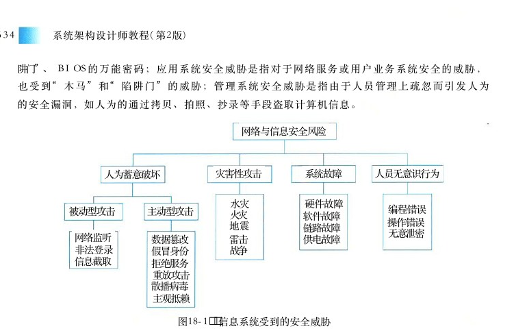
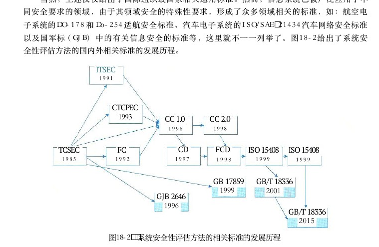
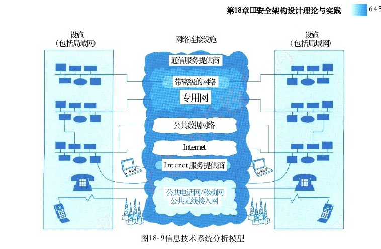
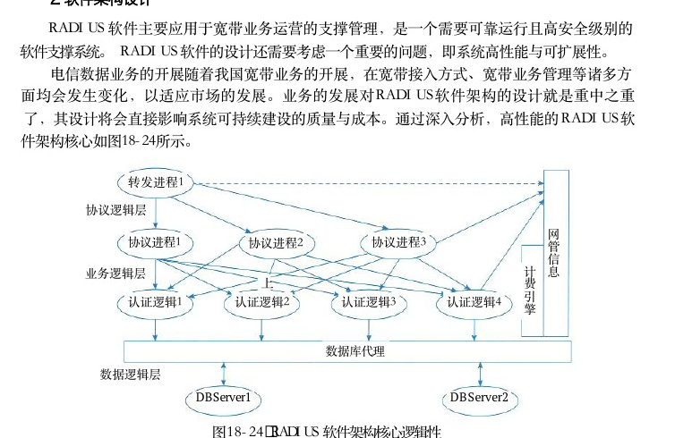
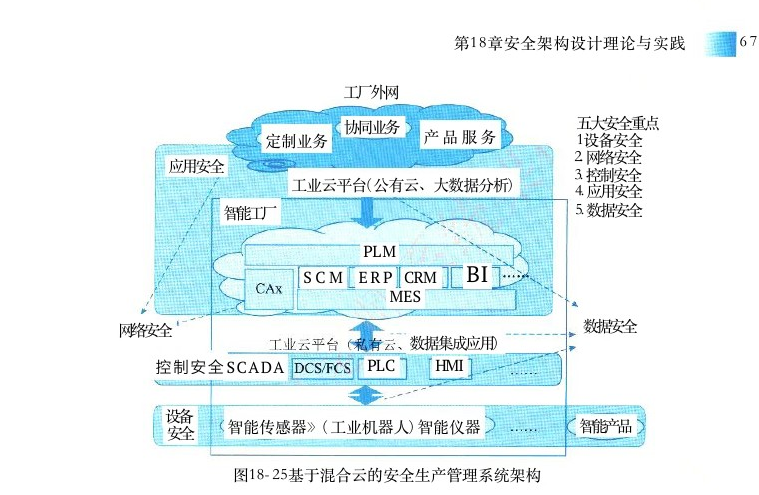

# 第18章 安全架构设计理论与实践

> 本页为教材原文文字提取版。图示已按 PDF 页面裁剪并插入正文图注前。

<!-- PDF 第 645 页 -->

在当今社会，信息化技术发展已经深入到各行各业，从个人事务处理到企业自动化、从政府办公到电子商务，人们工作、生活方方面面几乎都离不开以计算机、网络和软件为载体的数字化信息服务，因此，信息安全已成为当前亟待解决的重要问题。安全架构是架构面向安全性方向上的一种细分，可关注三个安全方面，即产品安全架构、安全技术体系架构和审计架构，这三个方面可组成三道安全防线。本章主要分析安全威胁、介绍安全模型，在此基础上，就系统、信息、网络和数据库的安全框架及设计进行介绍。最后，简要说明系统架构的脆弱性问题。

## 18．1 安全架构概述

在当今以计算机、网络和软件为载体的数字化服务几乎成为人类社会赖以生存的手段。与之而来的计算机犯罪呈现指数上升趋势，因此，信息的可用性、完整性、机密性、可控性和不可抵赖性等安全保障显得尤为重要，而满足这些诉求，离不开好的安全架构设计。安全保障是以风险和策略为基础，在信息系统的整个生命周期中，安全保障应包括技术、管理、人员和工程过程的整体安全，以及相关组织机构的健全等。当前，信息化技术存在多重威胁，我们要从系统的角度考虑整体安全防御方法。

## 18．1．1信息安全面临的威胁

随着信息技术的发展，社会信息化进程得以快速提升，计算机及网络已经在各行各业中得到了广泛的应用，加之我国云计算、边缘技术和人工智能技术的突飞猛进发展，推动了信息化的普及程度。目前，企业将更多的业务托管于混合云之上，保护用户数据和业务变得更加困难，本地基础设施和多种公、私有云共同构成的复杂环境，使得用户对混合云安全有了更高的要求。这种普及和应用将会产生两方面的效应：一是各行各业的业务运转几乎完全依赖于计算机、网络和云存储，各种重要数据如政府文件、档案、银行账目、企业业务和个人信息等将全部依托计算机、网络的存储、传输；二是人们对计算机的了解更加全面，有更多的计算机技术被较高层的人非法利用，他们采用种种手段对信息资源进行窃取或攻击。目前，信息系统可能遭受到的威胁可总结为以下4个方面，如图18－1所示。对于信息系统来说，威胁可以是针对物理环境、通信链路、网络系统、操作系统、应用系统以及管理系统等方面。物理安全威胁是指对系统所用设备的威胁，如自然灾害、电源故障、操作系统引导失败或数据库信息丢失、设备被盗／被毁造成数据丢失或信息泄露；通信链路安全威胁是指在传输线路上安装窃听装置或对通信链路进行干扰；网络安全威胁是指由于互联网的开放性、国际化的特点，人们很容易通过技术手段窃取互联网信息，对网络形成严重的安全威胁；操作系统安全威胁是指对系统平台中的软件或硬件芯片中植入威胁，如“木马”和“陷

<!-- PDF 第 646 页 -->

阱门”、 BIOS 的万能密码 ； 应用系统安全威胁是指对于网络服务或用户业务系统安全的威胁 ，也受到 “ 木马 ” 和 “ 陷阱门 ” 的威胁 ； 管理系统安全威胁是指由于人员管理上疏忽而引发人为的安全漏洞，如人为的通过拷贝、拍照、抄录等手段盗取计算机信息。

网络与信息安全风险

灾害性攻击系统故障人员无意识行为人为蓄意破坏

水灾硬件故障编程错误被动型攻击主动型攻击火灾软件故障操作错误地震链路故障无意泄密网络监听数据篡改雷击供电故障非法登录战争假冒身份信息截取拒绝服务重放攻击散播病毒主观抵赖

图18－1 信息系统受到的安全威胁

具体来讲，常见的安全威胁有以下几种。

（1）信息泄露：信息被泄露或透露给某个非授权的实体。

（2）破坏信息的完整性：数据被非授权地进行增删、修改或破坏而受到损失。

（3）拒绝服务：对信息或其他资源的合法访问被无条件地阻止。（ 4 ） 非法使用 （ 非授权访问 ） ： 某一资源被某个非授权的人或以非授权的方式使用 。（ 5 ） 窃听 ： 用各种可能的合法或非法的手段窃取系统中的信息资源和敏感信息 。 例如对通信线路中传输的信号进行搭线监听 ， 或者利用通信设备在工作过程中产生的电磁泄漏截取有用信息等。（ 6 ） 业务流分析 ： 通过对系统进行长期监听 ， 利用统计分析方法对诸如通信频度 、 通信的信息流向、通信总量的变化等态势进行研究，从而发现有价值的信息和规律。（ 7 ） 假冒 ： 通过欺骗通信系统 （ 或用户 ） 达到非法用户冒充成为合法用户 ， 或者特权小的用户冒充成为特权大的用户的目的。黑客大多是采用假冒进行攻击。（ 8 ） 旁路控制 ： 攻击者利用系统的安全缺陷或安全性上的脆弱之处获得非授权的权利或特权。例如，攻击者通过各种攻击手段发现原本应保密，但是却又暴露出来的一些系统“特性”。利用这些“特性”，攻击者可以绕过防线守卫者侵入系统的内部。（ 9 ） 授权侵犯 ： 被授权以某一目的使用某一系统或资源的某个人 ， 却将此权限用于其他非授权的目的，也称作“内部攻击”。（ 1 0 ） 特洛伊木马 ： 软件中含有一个察觉不出的或者无害的程序段 ， 当它被执行时 ， 会破坏用户的安全 。 这种应用程序称为特洛伊木马 （Trojan Horse）。（ 1 1 ） 陷阱门 ： 在某个系统或某个部件中设置了 “ 机关 ” ， 使得当提供特定的输入数据时 ，允许违反安全策略。

<!-- PDF 第 647 页 -->

（12）抵赖：这是一种来自用户的攻击，例如，否认自己曾经发布过的某条消息、伪造一份对方来信等。

（13）重放：所截获的某次合法的通信数据备份，出于非法的目的而被重新发送。

（14）计算机病毒：所谓计算机病毒，是一种在计算机系统运行过程中能够实现传染和侵害的功能程序。一种病毒通常含有两个功能：一种功能是对其他程序产生“感染”；另外一种或者是引发损坏功能或者是一种植入攻击的能力。

（15）人员渎职：一个授权的人为了钱或利益、或由于粗心，将信息泄露给一个非授权的人。

（16）媒体废弃：信息被从废弃的磁盘或打印过的存储介质中获得。

（17）物理侵入：侵入者通过绕过物理控制而获得对系统的访问。

（18）窃取：重要的安全物品，如令牌或身份卡被盗。

（19）业务欺骗：某一伪系统或系统部件欺骗合法的用户或系统自愿地放弃敏感信息。

## 18．1．2安全架构的定义和范围

安全架构是架构面向安全性方向上的一种细分，比如细分领域含有运维架构、数据库架构等。如果安全性体现在产品上，那么，通常的产品安全架构、安全技术体系架构和审计架构可组成三道安全防线。

（1）产品安全架构：构建产品安全质量属性的主要组成部分以及它们之间的关系。产品安全架构的目标是如何在不依赖外部防御系统的情况下，从源头打造自身安全的产品。

（2）安全技术体系架构：构建安全技术体系的主要组成部分以及它们之间的关系。安全技术体系架构的任务是构建通用的安全技术基础设施，包括安全基础设施、安全工具和技术、安全组件与支持系统等，系统性地增强各产品的安全防御能力。

（3）审计架构：独立的审计部门或其所能提供的风险发现能力，审计的范围主要包括安全风险在内的所有风险。安全架构应具备可用性、完整性和机密性等特性。这里所说的可用性 （Availability） 是指要防止系统的数据和资源丢失；完整性 （Integrity） 是指要防止系统的数据和资源在未经授权情况下被修改；机密性 （Confidentiality） 是指要防止系统的数据和资源在未授权的情况下被披露。我们在系统设计时，通常要识别系统可能会遇到的安全威胁，通过对系统面临的安全威胁和实施相应控制措施进行合理的评价，提出有效合理的安全技术，形成提升信息系统安全性的安全方案，是安全架构设计的根本目标。在实际应用中，安全架构设计可以从安全技术的角度考虑，主要包括：身份鉴别、访问控制、内容安全、冗余恢复、审计响应、恶意代码防范和密码技术等。

## 18．1．3与信息安全相关的国内外标准及组织

## 1．国外标准

（1）可信计算机系统评估准则 （Trusted Computer System Evaluation Criteria，TCSEC）， 也称为“橘皮书”，1985年12月由美国国防部公布。

<!-- PDF 第 648 页 -->

（2）信息技术安全评估准则 （Information Technology Security Evaluation Criteria，ITSEC），英、法、德、荷四国联合编制。

（3）加拿大可信计算机产品评估准则 （Canadian Trusted Computer Product Evaluation Criteria，CTCPEC）， 加拿大，1993年。

（4）美国联邦准则 （ FC ） ， TCSEC 的升级版，美国，1992年。

（5）信息技术安全性评价通用准则 （The Common Criteria for Information Technology SecurityEvaluation）， 由美国国家安全局和国家技术标准研究所联合加、英、法、德、荷等国编制，1993年。

（6）ISO／IEC 7498－2， 信息处理系统，开放系统互联，基本参考模型。第2部分：安全结构 （Information Processing System； Open System Intercommection； base reference model；Part2：SecurityArchitecture）， 由国际标准化组织 （ISO） 发布，1989年。

（7）信息保障技术框架 （Infornation Assurance Technical Framework，IATF）， 由美国国家安全局 （ NSA ） 发布，1999年。

（8）ISO／IEC 15408－1999， 信息技术安全技术信息技术安全性评估准则，替代原 CC 标准。由国际标准化组织 （ISO） 发布，1999年。

（9）IEC 61508－2010， 电气／电子／可编程电子安全系统的功能安全 （Functional safety ofelectrical／ electronic／ programmable electronic safety－related systems）， 由国际电工委员会发布，2010年。

## 2．国内标准

## 1）标准缩写含义

（ 1 ） GA ： 国家安全行业标准规范。由中国安全技术防范认证中心组织发布。（ 2 ） GB ： 国家标准规范，由中国国家标准化管理委员会组织发布。（ 3 ） GJB ： 国家军用标准规范。

## 2）主要技术标准

（1）GB 15834－1995 信息处理数据加密实体鉴别机制。

（2）GA163－1997 计算机信息系统安全专用产品分类原则。

（3）GB17859－1999计算机信息系统安全保护等级划分准则。

（4）GB／T 9387．2－1995 信息处理系统开放系统互连基本参考模型第2部分：安全体系结构。

（5）GB／T 20269－2006信息安全技术信息系统安全管理要求。

（6）GB／T 20270－2006信息安全技术网络基础安全技术要求。

（7）GB／T 20271－2006 信息安全技术信息系统通用安全技术要求。

（8）GB／T20272－2006 信息安全技术操作系统安全技术要求。

（9）GB／T20273－2006 信息安全技术数据库管理系统安全技术要求。

（10）GB／T 20274．1－2006 信息安全技术信息系统安全保障评估框。

（11）GB／T 18231－2000信息系统低层安全。

（12）GB／T 18237．1－2000 信息技术开放系统互联通用高层第1部分：概述、模型和记法。

<!-- PDF 第 649 页 -->

（13）GB／T 18237．2－2000 信息技术开放系统互联通用高层第2部分：安全交换服务元素服务定义。

（14）GB／T18336－2015 信息系统信息技术安全评估准则。

（15）GB／T 20438．1￣7－2017 电气／电子／可编程电子安全相关系统的功能安全，由中国国家标准化管理委员会发布。当然，上述仅仅给出了国际组织或国家相关通用标准。然而，信息系统已被广泛应用于不同安全要求的领域，由于其领域安全的特殊性要求，形成了众多领域相关的标准，如：航空电子系统的 DO－178 和 Do－254 适航安全标准、汽车电子系统的 ISO／SAE 21434 汽车网络安全标准以及国军标 （ GJB ） 中的有关信息安全的标准等，这里就不一一列举了。图18－2给出了系统安全性评估方法的国内外相关标准的发展历程。

ITSEC

CTCPEC CC 1.0CC 2.0

CDFCD TCSECFCISO 15408ISO 15408

GB 17859GB/T 18336 GJB 2646 GB/T 18336

图18－2 系统安全性评估方法的相关标准的发展历程

## 3．相关标准化组织

## 1）国际标准化组织 （ ISO ）

ISO 的信息技术标准化委员会 TC 9 7 在 1 9 8 4 年 1 月 ， 专门组织了一个分技术委员会 SC20，负责制定数据加密技术的国际标准；之后在1987年， ISO 的 TC 9 7 和 IEC 的 TCs47B／83 合并成为 ISO／IEC联合技术委员会 （JTC1）；1990 年4月， ISO 将原来的数据加密分技术委员会 SC20，更名为安全技术分技术委员会 SC27， 专门从事信息技术安全一般方法和技术的标准化工作。而ISO／TC68 负责银行业务应用范围内有关信息安全标准的制定，它主要制定行业应用标准，在组织上和标准之间与 SC 2 7有着密切的联系。由于信息技术的发展，开放系统互连的网络体系结构的广泛应用，信息技术安全标准化越来越受到人们的重视。在信息技术安全分委会的成立会上，研究了信息技术安全标准化的发展规划，明确了指导思想，确定了工作目标，制订了实施计划，提出了具体的措施，正在为建立

<!-- PDF 第 650 页 -->

完整的信息技术安全标准体系而积极组织开展研究工作和标准制定工作。

## 2）国际电工委员会（IEC）

IEC 成立于1906年，它是世界上成立最早的国际性电工标准化机构，负责有关电气工程和电子工程领域中的国际标准化工作。国际电工委员会的总部最初位于伦敦，1948年搬到了位于日内瓦的现总部处。1887—1900年召开的6次国际电工会议上，与会专家一致认为有必要建立一个永久性的国际电工标准化机构，以解决用电安全和电工产品标准化问题。1904年在美国圣路易召开的国际电工会议上通过了关于建立永久性机构的决议。1906年6月，13个国家的代表集会伦敦，起草了 IEC 章程和议事规则，正式成立了国际电工委员会。1947年作为一个电工部门并入国际标准化组织 （ISO），1976年又从 ISO 中分立出来。宗旨是促进电工、电子和相关技术领域有关电工标准化等所有问题上（如标准的合格评定）的国际合作。该委员会的目标是：有效满足全球市场的需求；保证在全球范围内优先并最大程度地使用其标准和合格评定计划；评定并提高其标准所涉及的产品质量和服务质量；为共同使用复杂系统创造条件；提高工业化进程的有效性；提高人类健康和安全；保护环境。

## 3）中国国家标准化管理委员会（ SAC ）

中国国家标准化管理委员会是中华人民共和国国务院授权履行行政管理职能、统一管理全国标准化工作的主管机构，正式成立于2001年10月。2018年3月，根据第十三届全国人民代表大会第一次会议批准的国务院机构改革方案，将中华人民共和国国家标准化管理委员会职责划入国家市场监督管理总局，对外保留牌子。主要职责是以国家标准化管理委员会名义，下达国家标准计划，批准发布国家标准，审议并发布标准化政策、管理制度、规划、公告等重要文件；开展强制性国家标准对外通报；协调、指导和监督行业、地方、团体、企业标准工作；代表国家参加国际标准化组织、国际电工委员会和其他国际或区域性标准化组织；承担有关国际合作协议签署工作；承担国务院标准化协调机制日常工作。

## 4）全国信息技术标准化技术委员

全国信息技术标准化技术委员会（简称“信标委”），为原全国计算机与信息处理标准化技术委员会，成立于1983年，是在国家标准化管理委员会和工业和信息化部的共同领导下，从事全国信息技术领域标准化工作的技术组织。信标委的工作范围是信息技术领域的标准化，涉及信息采集、表示、处理、传输、交换、描述、管理、组织、存储、检索及其技术，系统与产品的设计、研制、管理、测试及相关工具的开发等的标准化工作。

## 18．2安全模型

信息系统的安全目标是控制和管理主体（含用户和进程）对客体（含数据和程序）的访问。作为信息系统安全目标，就是要实现：

● 保护信息系统的可用性；

● 保护网络系统服务的连续性；

● 防范资源的非法访问及非授权访问；

<!-- PDF 第 651 页 -->

● 防范入侵者的恶意攻击与破坏；

● 保护信息通过网上传输过程中的机密性、完整性；

● 防范病毒的侵害；

● 实现安全管理。安全模型是准确地描述安全的重要方面及其与系统行为的关系，安全策略是从安全角度为系统整体和构成它的组件提出基本的目标，它是一个系统的基础规范，使系统集成后评估它的基准。安全策略勾画出的安全目标，是宽泛、模糊而抽象的。而安全模型提供了实现目标应该做什么，不应该做什么，具有实践指导意义，它给出了策略的形式。安全模型有许多种，可针对不同的特性、场景以及控制关系使用不同的安全模型。如图18－3所示给出了安全模型的一种分类方法。

基本模型：HRUBLPMAC强制Chinese Wall访问控制－－DAC自主机密性－RBAC角色信息流（非干扰性、非观察性）Biba完整性－Clark-Wilson图18－3 安全模型的分类方法

注：

●访问控制矩阵模型HRU :( HarrisonRuzzoUllman ) ;

●强制访问控制模型MAC :(Mandatory Access Control);

●自主访问控制模型DAC :(Discretionary Access Control);

●基于角色的访问控制模型RBAC :(Role-Based Access Control)当前比较被公认的模型有：状态机模型 （State Machine Model）、Bell－LaPadula（BLP） 模型、Biba 模型、 Clark－Wilson（CWM） 模型、 ChineseWall 模型，以及信息流模型 （Information FlowModel）、 非干涉模型 （Noninterference Model）、 格子模型 （Lattice Model）、Brewer and Nash 模型和 Graham－Denning 模型等。这里简要介绍典型的五种安全模型。

## 18．2．1状态机模型

状态机模型描述了一种无论处于何种状态都是安全的系统。它是用状态语言将安全系统描述成抽象的状态机，用状态变量表述系统的状态，用转换规则描述变量变化的过程。状态机模型中一个状态 （state） 是处于系统在特定时刻的一个快照。如果该状态所有方面满足安全策略的要求，则称此状态是安全的；如果所有行为都在系统中允许并且不危及系统使之处于不安全状态，则断言系统执行了一个安全状态模型 （Secure State Model）。 一个安全状态模型系统，总是从一个安全状态启动，并且在所有迁移中保持安全状态，只允许主体以和安全

<!-- PDF 第 652 页 -->

策略相一致的安全方式访问资源。状态机模型工作原理如图18－4所示，具体步骤应用程序描述如下：变量

（1）

（1）状态变量的默认值必须安全；(Name,value)

（2）用户试图使用变量的默认值；

（3）系统检查主体的身份验证；

（2）

（4）系统确保变更不会使系统置于不安全状态；应用程序（ 5 ） 系统允许变量值变更 ， 发生状态改变变量

（3）(Color,Red)

（4）(STATE CHANGE);（ 6 ） 再重复执行 （ 1 ） ￣ （ 5 ） 步 ， 会导致另一次

（5）状态变化。应用程序变量

## 18．2．2 Bell－LaPadula模型

(Color,Blue)

（6）重复（1）～（5）步骤Bell－LaPadula模型是 David Bell 和 Len LaPadula操作系统会导致另一次状态变化于1973提出的第一个正式的安全模型。该模型属于图 1 8 － 4 状态机模型工作原理图强制访问控制模型，以敏感度来划分安全级别。将数据划分为多安全级别与敏感度的系统，即多级安全系统。本模型是为美国国防部多级安全策略形式化而开发，其机密性模型是第一个能够提供分级别数据机密性保障的安全策略模型（即多级安全）。

## 1．模型基本原理

Bell－LaPadula 模型使用主体、客体、访问操作（读、写、读／写）以及安全级别这些概念，当主体和客体位于不同的安全级别时，主体对客体就存在一定的访问限制。通过该模型可保证信息不被不安全主体访问。图18－5对Bell－LaPadula模型基本原理进行描述。

Object （客体）Subject（主体）

Top Secret （绝密）Top Secret （绝密）

Secret （机密）Secret （机级）

Sensitive （秘密）Sensitive （秘密）

图 1 8 － 5 Bell－LaPadula模型基本原理图这里：

（1）安全级别为“机密”的主体访问安全级别为“绝密”的客体时，主体对客体可写不可读 （No Read Up）；

（2）当安全级别为“机密”的主体访问安全级别为“机密”的客体时，主体对客体可写

<!-- PDF 第 653 页 -->

可读；

（3）当安全级别为“机密”的主体访问安全级别为“秘密”的客体时，主体对客体可读不可写 （No Write Down）。

## 2．模型安全规则

Bell－LaPadula模型的安全规则如下：

（1）简单安全规则 （Simple Security Rule）： 安全级别低的主体不能读安全级别高的客体(No Read Up);

（2）星属性安全规则 （Star Security Property）： 安全级别高的主体不能往低级别的客体写(No Write Down);

（3）强星属性安全规则 （Strong Star Security Property）： 不允许对另一级别进行读写；

（4）自主安全规则 （Discretionary Security Property）： 使用访问控制矩阵来定义说明自由存取控制。其存取控制体现在内容相关和上下文相关。

## 18．2．3 Biba模型

Biba 模型是在 Bell－LaPadula模型之后开发的，它跟 Bell－LaPadula模型很相似，被用于解决应用程序数据的完整性问题。 Bell－LaPadula使用安全级别 （Top secret、Secret、Sensitive 等），这些安全级别用于保证敏感信息只被授权的个体所访问。

## 1．模型基本原理

Biba 模型不关心信息机密性的安全级别，因此它的访问控制不是建立在安全级别上，而是建立在完整性级别上。完整性的三个目标：保护数据不被未授权用户更改；保护数据不被授权用户越权修改（未授权更改）；维持数据内部和外部的一致性。Biba 模型的安全策略是基于层次化的完整性级别。它将完整高完整性性威胁分为来源于子系统内部和外部的威胁。如果子系统的一个只读组件是恶意或不正确，则产生内部威胁；如果一个子系统企图通中完整性只写过错误数据或不正确调用函数来修改另一个子系统，则产生外部低完整性威胁。内部威胁可以通过程序测试或检验来解决。所以本模型主要针对外部威胁，解决了完整性的第一目标：即防止非授权用户图18－6 Biba模型基本原理的篡改。图18－6对 Bell－LaPadula模型基本原理进行描述。这里：

（1）当完整性级别为“中完整性”的主体访问完整性为“高完整性”的客体时，主体对客体可读不可写 （No Write Up）， 也不能调用主体的任何程序和服务；

（2）当完整性级别为“中完整性”的主体访问完整性为“中完整性”的客体时，主体对客体可读读可写；

（3）当完整性级别为“中完整性”的主体访问完整性为“低完整性”的客体时，主体对客体可写不可读； （No Read Down）；

<!-- PDF 第 654 页 -->

## 2．模型安全规则

Biba 模型能够防止数据从低完整性级别流向高完整性级别，其安全规则如下：（ 1 ） 星完整性规则 （ ＊ －integrity Axiom）： 表示完整性级别低的主体不能对完整性级别高的客体写数据；（ 2 ） 简单完整性规则 （Simple Integrity Axiom）： 表示完整性级别高的主体不能从完整性级别低的客体读取数据；（ 3 ） 调用属性规则 （Invocation Property）： 表示一个完整性级别低的主体不能从级别高的客体调用程序或服务。

## 18．2．4 Clark－Wilson模型

Clark－Wilson模型是由 David Clark 和 David Wilson 于 1 9 8 7 年提出的完整性模型 ， 简称为CWM ， 这个模型实现了成型的事务处理机制，常用于银行系统中以保证数据完整性。

## 1．模型基本原理

CWM 是一种将完整性目标、策略和机制融为一体的模型。为了体现用户完整性， CWM提出了职责隔离 （Separation of Duty） 目标；为了保证数据完整性， CWM 提出了应用相关的完整性验证进程；为了建立过程完整性， CWM 定义了对于变换过程的应用相关验证。图18－7对CWM模型的基本原理进行了描述。转换程序TP验证过程IVP，IVPTP转换UDI为CDI1检查CDI2 （订单）TP基于CDI1更新CDI2与CDI3 （账单）（订单）与CDI3 （账单）

用户提交订单提交CDI2、CDI3(UDI)

用户应用程序服务器数据库服务器图18－7 CWM 模型基本原理图

这里：

（1）需要进行完整性保护的客体称之为 CDI， 不需要进行完整性保护的客体称之为 UDI；（ 2 ） 完整性验证过程 （Integrity Verification Procedure，IVP）： 确认限制数据项处于一种有效状态，如果 IVP 检验 CDI符合完整性约束，则系统处于一个有效状态；（ 3 ） 转换过程 （Transformation Procedures，TP）： 将数据项从一种有效状态改变至另一种有效状态；（ 4 ） 为了确保对 CDI 的 TP 是有效的，则需要授权 User 做 TP 的认证；（ 5 ） 为了防止合法用户对 CDI做非法或错误操作，将 TP 过程分为多个子过程，将每个子过程授权给不同的 User；

<!-- PDF 第 655 页 -->

（6）但是如果 TP 的每个子过程被授权的 User之间存在某种利益同盟，则可能存在欺骗。从而使得 CDI 的完整性得不到保护。

## 2．模型特征

CWM 的主要特征是：（ 1 ） 采用 Subject／Program ／Object 三元素的组成方式。 Subject要访问Object 只能通过Program进行；

（2）权限分离原则：将要害功能分为有2个或多个 Subject完成，防止已授权用户进行未授权的修改；

（3）要求具有审计能力 （Auditing）。

## 18．2．5 Chinese Wall模型

Chinese Wall模型（又名 Brew and Nash模型，最初是由 Brewer 和 Nash 提出）是应用在多边安全系统中的安全模型。也就是说，是指通过行政规定和划分、内部监控、 IT系统等手段防止各部门之间出现有损客户利益的利益冲突事件。本模型最初为投资银行设计的，但也可应用在其他相似的场合。

## 1．模型基本原理

Chinese Wall 模型的安全策略的基础是客户访问的信息不会与当前他们可支配的信息产生冲突。在投资银行中，一个银行会同时拥有多个互为竞争者的客户，一个银行家可能为一个客户工作，但他可以访问所有客户的信息。因此，应当制止该银行家访问其他客户的数据。比如在某个领域有两个竞争对手同时选择了一个投资银行作为他们的服务机构，而这个银行出于对这两个客户的商业机密的保护就只能为其中一个客户提供服务。 Chinese Wall 模型同时包括 DAC和MAC 的属性，是强制访问控制模型 （ MAC ） 的一种混合策略模型，比如银行家可以选择为谁工作 （DAC）， 一旦选定，他就只能为该客户工作 （MAC）。 图18－8给出了Chinese Wall模型的基本原理。

公司A公司BC公司资料公司资料wA公司资料公司资料LL公司资料公司资料模型公司资料公司资料

银行家

图 1 8 － 8 Chinese Wall 模型的基本原理图

<!-- PDF 第 656 页 -->

## 2．模型的安全规则

Chinese Wall 模型的访问客体控制的安全规则如下：

（1）与主体曾经访问过的信息属于同一公司数据集合的信息，即墙内信息可以访问；

（2）属于一个完全不同的利益冲突组的可以访问；

（3）主体能够对一个客体进行写的前提是主体未对任何属于其他公司数据集进行过访问。定理1： 一个主体一旦访问过一个客体，则该主体只能访问位于同一公司数据集的客体或在不同利益组的客体。定理2： 在一个利益冲突组中，一个主体最多只能访问一个公司数据集。比如，假设 Chinese Wall 安全策略包括三个信息存储模块：某家企业的单位信息 （C）、 该家企业的所有信息集合 （Company Data，CD） 和该家企业与互为竞争关系企业的全部信息集合（Conflict of Interest，COI）。 那么， Chinese Wall 模型规定：（ 1 ） 每个 C 只能唯一对应一个 CD ；

（2）每个 CD 只能唯一对应一个利益冲突类COI；（ 3 ） 一个COI 类却可以同时包含多个CD。

## 3．模型举例

在一个企业投资顾问公司里，一个咨询师大部分是同时为若干个企业提供投资咨询服务的，该咨询师就掌握了他所服务的所有企业的全部信息，包括企业的内部机密信息。如果该咨询师所服务的若干企业中有两家企业是在同一行业内的竞争对手，那么我们可以联想到，该咨询师可能会在给一家企业提供咨询过程中，有意或者无意地透露一些自己知道的有关另一家竞争企业的内部信息，使得一方得到利益，另一方遭受损失，这就导致了利益冲突，这是 Chinese Wall安全模型策略需要解决的首要问题。

## 18．3 系统安全体系架构规划框架

安全技术体系架构是对组织机构信息技术系统的安全体系结构的整体描述。安全技术体系架构框架是拥有信息技术系统的组织机构根据其策略的要求和风险评估的结果，参考相关技术体系构架的标准和最佳实践，结合组织机构信息技术系统的具体现状和需求，建立的符合组织机构信息技术系统战略发展规划的信息技术系统整体体系框架。这个框架是组织机构信息技术系统战略管理的具体体现。技术体系架构能力是组织机构执行安全技术整体能力的体现，它反映了组织机构在执行信息安全技术体系框架管理，达到预定的成本、功能和质量目标上的度量。

## 18．3．1安全技术体系架构

安全技术体系架构的目标是建立可持续改进的安全技术体系架构的能力，信息技术系统千变万化，有各种各样的分类方式，为从技术角度建立一个通用的对象分析模型，这里，我们将信息系统抽象成一个基本完备的信息系统分析模型，如图18－9所示。从信息技术系统分析模型出发，建立整个信息技术系统的安全架构。

<!-- PDF 第 657 页 -->

设施设施网络连接设施（包括局域网）（包括局域网）通信服务提供商

带密级的网络专用网

公共数据网络

InternetInteret服务提供商

公共电话网／移动网公共无线接入网

图18－9信息技术系统分析模型

一般来说，国际标准化组织 （ISO） 提出一种网络标准架构 （OSI） 参考模型将网络划分为物理、数据链路、网络、传输、会话、表示和应用等7层， Andrew S．Tanenbau 综合OSI 参考模型和 TCP／IP 参考模型将网络划分为物理、数据链路、网络、传输和应用等5层。在本模型中，首先需要做的就是对网络结构层次进行划分，考虑到安全评估是以安全风险威胁分析入手的，而且在实际的网络安全评估中会发现，主机和存储系统占据了大量的评估考察工作，虽然主机和存储系统都属于应用层，但本模型由于其重要性，特将其单列为一个层次，因此根据网络中风险威胁的存在实体划分出5个层次的实体对象：应用、存储、主机、网络和物理。

## 18．3．2信息系统安全体系规划

信息系统安全体系规划是一个非常细致和非常重要的工作，首先需要对企业信息化发展的历史情况进行深入和全面的调研，并针对信息系统安全的主要内容进行整体的发展规划工作。图18－10给出了一种信息系统安全体系的框架。从图18－10可以看出，信息系统安全体系主要是由技术体系、组织机构体系和管理体系三部分共同构成的。技术体系是全面提供信息系统安全保护的技术保障系统，该体系由物理安全技术和系统安全技术两大类构成。组织体系是信息系统的组织保障系统，由机构、岗位和人事三个模块构成。机构分为领导决策层、日常管理层和具体执行层；岗位是信息系统安全管理部门根据系统安全需要设定的负责某一个或某几个安全事务的职位；人事是根据管理机构设定的岗位，对岗位上在职、待职和离职的员工进行素质教育、业绩考核和安全监管的机构。

<!-- PDF 第 658 页 -->

管理体系由法律管理、制度管理和培训管理三部分组成。

信息系统安全体系框架

状态安全安全服务物坏系信监测策略体系规范理境统息法安安安安律实施细则密钥入侵全全全全安全评估监控管理管网络信息策略ISO标准审计理环境环境制体度系安全技术技术管理技术体系安全框架培岗位人事机构训组织体系图18－10信息系统安全体系

## 18．3．3信息系统安全规划框架

建立了信息系统安全体系之后 ， 就可以针对以上描述的内容进行全面的规划 。 信息系统安全规划的层次方法与步骤可以有不同 ， 但是规划内容与层次应该是相同 。 规划的具体环节 、 相互之间的关系和具体方法如图18－11所示。

信息化战略规划远景、目标、使命、战略

信息系统信息资源硬件网络、应用系统、管理信息、业务信息、管理系统、业务系统市场信息、决策信息需求1措施蓝图［需求1措施蓝图［现状口现状口

信息系统安全规划

技术安全管理规范安全组织物理安全网络安全信息安全运营安全人员安全图18－11 信息系统安全规划框架

## 1．信息系统安全规划依托企业信息化战略规划

信息化战略规划是以整个企业的发展目标 、 发展战略和企业各部门的业务需求为基础 ， 结

<!-- PDF 第 659 页 -->

合行业信息化方面的需求分析、环境分析和对信息技术发展趋势的掌握，定义出企业信息化建设的远景、使命、目标和战略，规划出企业信息化建设的未来架构，为信息化建设的实施提供一幅完整的蓝图，全面系统地指导企业信息化建设的进程。信息系统安全规划依托企业信息化战略规划，对信息化战略的实施起到保驾护航的作用。信息系统安全规划的目标应该与企业信息化的目标是一致的，而且应该比企业信息化的目标更具体明确、更贴近安全。信息系统安全规划的一切论述都要围绕着这个目标展开和部署。

## 2．信息系统安全规划需要围绕技术安全、管理安全、组织安全考虑

信息系统安全规划的方法可以不同、侧重点可以不同，但都需要围绕技术安全、管理安全、组织安全进行全面考虑。规划的内容基本上应涵盖：确定信息系统安全的任务、目标、战略以及战略部门和战略人员，并在此基础上制定出物理安全、网络安全、系统安全、运营安全、人员安全的信息系统安全的总体规划。物理安全包括环境设备安全、信息设备安全、网络设备安全、信息资产设备的物理分布安全等。网络安全包括网络拓扑结构安全、网络的物理线路安全、网络访问安全（防火墙、入侵检测系统和 VPN 等）等。系统安全包括操作系统安全、应用软件安全和应用策略安全等。运营安全应在控制层面和管理层面保障，包括备份与恢复系统安全、入侵检测功能、加密认证功能、漏洞检查及系统补丁功能、口令管理等。人员安全包括安全管理的组织机构、人员安全教育与意识机制、人员招聘及离职管理、第三方人员安全管理等。

## 3．信息系统安全规划以信息系统与信息资源的安全保护为核心

信息系统安全规划的最终效果应该体现在对信息系统与信息资源的安全保护上，因此规划工作需要围绕着信息系统与信息资源的开发、利用和保护工作进行，要包括蓝图、现状、需求和措施4个方面。

（1）对信息系统与信息资源的规划需要从信息化建设的蓝图入手，知道企业信息化发展策略的总体目标和各阶段的实施目标，制定出信息系统安全的发展目标。

（2）对企业的信息化工作现状进行整体的、综合、全面的分析，找出过去工作中的优势与不足。

（3）根据信息化建设的目标提出未来几年的需求，这个需求最好可以分解成若干个小的方面，以便于今后的实施与落实。

（4）要明确在实施工作阶段的具体措施与方法，提高规划工作的执行力度。信息系统安全规划服务于企业信息化战略目标，信息系统安全规划做得好，企业信息化工作的实现就有了保障。信息系统安全规划是企业信息化发展战略的基础性工作，不是可有可无而是非常重要。由于企业信息化的任务与目标不同，所以信息系统安全规划包括的内容就不同，建设的规模就有很大的差异，因此信息系统安全规划难以从专业书籍或研究资料中找到非常有针对性的适用法则，也难以给出一个规范化的信息系统安全规划的模板。这里给出信息系统安全规划框架与方法，信息系统安全规划工作的一种建设原则、建设内容、建设思路。具体规划还需要深入细致地进行本地化的调查与研究。

<!-- PDF 第 660 页 -->

## 18．4信息安全整体架构设计 （ WPDRRC 模型）

正如前述，构建信息安全保障体系框架应包括技术体系、组织机构体系和管理体系等三部分，也就是说：人、管理和技术手段是信息安全架构设计的三大要素，而构成动态的信息与网络安全保障体系框架是实现系统的安全保障。

## 1 8 ． 4 ． 1 WPDRRC信息安全体系架构模型

WPDRRC（Waring／Protect／Detect／React／Restore／Counterattack） 信息安全模型是我国“八六三”信息安全专家组提出的适合中国国情的信息系统安全保障体系建设模型。 WPDRRC 是在PDRR（Protect／Detect／React／React／Restore） 信息安全体系模型的基础上前后增加了预警和反击功能。针对网络安全防护问题，美国曾提出了多个网络安全体系模型和架构，其中比较经典的包括PDRR 模型、 P 2 DR模型。而 WPDRRC 模型由中国提出。在 PDRR模型中，安全的概念已经从信息安全扩展到了信息保障，信息保障内涵已超出传统的信息安全保密，它是保护 （Protect）、 检测 （Detect）、 反应 （React）、 恢复 （Restore） 的有机结合，称为 PDRR模型。 PDRR 模型把信息的安全保护作为基础，将保护视为活动过程，要用检测手段来发现安全漏洞，及时更正；同时采用应急响应措施对付各种入侵；在系统被入侵后，要采取相应的措施将系统恢复到正常状态，这样才能使信息的安全得到全方位的保障。该模型强调的是自动故障恢复能力。WPDRRC 模型有6个环节和3大要素。6个环节包括：预警、保护、检测、响应、恢复和反击，它们具有较强的时序性和动态性，能够较好地反映出信息系统安全保障体系的预警能力、保护能力、检测能力、响应能力、恢复能力和反击能力。3大要素包括：人员、策略和技术。人员是核心，策略是桥梁，技术是保证，落实在WPDRRC 的6个环节的各个方面，将安全策预警略变为安全现实。图18－12给出了 WPDRRC真实模型的6个环节和3大要素间的关系。反击，保护物命生信息内容这里，6个环节说明如下：W：

●预警主要是指利用远程安全评估计算网络基应用服务彻底完整系统提供的模拟攻击技术来检查系统环境础设施存在的、可能被利用的薄弱环节，收边界期周与连接检测恢复集和测试网络与信息的安全风险所可控在，并以直观的方式进行报告，提供响应解决方案的建议，在经过分析后，分技术解网络的风险变化趋势和严重风险管理人点，从而有效降低网络的总体风险，图18－12 WPDRRC模型示意保护关键业务和数据。

<!-- PDF 第 661 页 -->

P：

●防护通常是通过采用成熟的信息安全技术及方法来实现网络与信息的安全。主要内容有加密机制，数字签名机制，访问控制机制，认证机制，信息隐藏和防火墙技术等。D：

●检测通过检测和监控网络以及系统，来发现新的威胁和弱点，强制执行安全策略。在这个过程中采用入侵检测、恶意代码过滤等技术，形成动态检测的制度，奖励报告协调机制，提高检测的实时性。主要内容有入侵检测，系统脆弱性检测，数据完整性检测和攻击性检测等。R：

●响应是指在检测到安全漏洞和安全事件之后必须及时做出正确的响应，从而把系统调整到安全状态。为此需要相应的报警、跟踪、处理系统，其中处理包括了封堵、隔离、报告等能力。主要内容有应急策略、应急机制、应急手段、入侵过程分析和安全状态评估等。R：

●恢复灾难恢复系统是当前网络、数据、服务受到黑客攻击并遭到破坏或影响后，通过必要技术手段，在尽可能短的时间内使系统恢复正常。主要内容有容错、冗余、备份、替换、修复和恢复等。C：

●反击是指采用一切可能的高新技术手段，侦察、提取计算机犯罪分子的作案线索与犯罪证据，形成强有力的取证能力和依法打击手段。网络安全体系模型经过多年发展，形成了 PDP 、 PPDR 、 PDRR 、 MPDRR和 WPDRRC 等模型，这些模型在信息安全防范方面功能更加完善，表18－1给出网络安全体系模型安全防范功能对照表。表18－1 安全防范功能对照表

预警保护检测响应反击管理恢复有无无有有无无PDR有有有无无无PPDR无无有有有有无无PDRR有有有有无有无MPDRR有有有有有有有WPDRRC

## 18．4．2信息安全体系架构设计

对信息系统的安全需求是任何单一安全技术都无法解决的，要设计一个信息安全体系架构，应当选择合适的安全体系结构模型。信息系统安全设计重点考虑两个方面；其一是系统安全保障体系；其二是信息安全体系架构。

## 1．系统安全保障体系

安全保障体系是由安全服务、协议层次和系统单元等三个层面组成，且每个层都涵盖了安全管理的内容。图18－13给出了安全保障体系结构技术模型示意图。系统安全保障体系设计工作主要考虑以下几点：

<!-- PDF 第 662 页 -->

（1）安全区域策略的确定：根据安全区域的划分，主管部门应制定针对性的安全策略。如定时审计评估、安装入侵检测系统、统一授权、认证等；

（2）统一配置和管理防病毒系统：主管部门应当建立整体防御策略，以实现统一的配置和管理。网络防病毒的策略应满足全面性、易用性、实时性和可扩展性等方面要求；

（3）网络安全管理：在网络安全中，除了采用一些技术措施之外，加强网络安全管理，制定有关规章制度。在安全管理中，任何的安全保障措施，最终要落实到具体的管理规章制度以及具体的管理人员职责上，并通过管理人员的工作得到实现。安全管理遵循国家标准 ISO17799，它强调管理体系的有效性、经济性、全面性、普遍性和开放性，目的是为希望达到一定管理效果的组织提供一种高质量、高实用性的参照。

协议层次安全管理

数访数据抗可问据审认完抵用证控保计整赖性制密性站 ？安全通信平台安全服务管网络平台理意系统平台吸应用平台物理环境系统单元图18－13安全体系结构技术模型示意图

网络安全管理要做到总体策划，确保安全的总体目标和所遵循的原则；建立相关组织机构，要明确责任部门，落实具体实施部门；做好信息资产分类与控制，达到职工的安全、物理环境的安全和业务连续性管理等；使用技术方法解决通信与操作的安全、访问控制、系统开发与维护，以支撑安全目标、安全策略和安全内容的实施；实施检查安全措施与审计，主要用于检查安全措施的效果，评估安全措施执行的情况和实施效果。网络安全管理至少要成立一个安全运行组织，制定一套安全管理制度和建立一个应急响应机制。安全运行组织应包括主管领导、信息中心和业务应用等相关部门，领导是核心，信息中心是实体，业务是使用者；安全管理制度要明确安全职责，制定安全管理细则，做到多人负责、任期有限、职责分离的原则；应急响应机制主要由管理人员和技术人员共同参与的内部机制，要提出应急响应的计划和程序，提供对安全事件的技术支持和指导，提供安全漏洞或隐患信息的通告、分析和安全事件处理等相关培训。

## 2．信息安全体系架构

通过对网络应用的全面了解，按照安全风险、需求分析结果、安全策略以及网络的安全目

<!-- PDF 第 663 页 -->

标等方面开展安全体系架构的设计工作。具体在安全控制系统，我们可以从物理安全、系统安全、网络安全、应用安全和管理安全等5个方面开展分析和设计工作。

## 1）物理安全

保证计算机信息系统各种设备的物理安全是保障整个网络系统安全的前提。物理安全是保护计算机网络设备、设施以及其他媒体免受地震、水灾、火灾等环境事故以及人为操作失误或错误及各种计算机犯罪行为导致的破坏过程。它主要包括：环境安全、设备安全、媒体安全等。

## 2）系统安全

系统安全主要是指对信息系统组成中各个部件的安全要求。系统安全是系统整体安全的基础。它主要包括：网络结构安全、操作系统安全和应用系统安全。网络结构安全是指网络拓扑结构是否合理、线路是否冗余、路由是否冗余和防止单点失败等；操作系统安全包含两个方面，其一是指操作系统的安全防范可以采取的措施，如：尽量采用安全性较高的网络操作系统并进行必要的安全配置、关闭一些不常用但存在安全隐患的应用、使用权限进行限制或加强口令的使用等；其二是通过配备操作系统安全扫描系统对操作系统进行安全性扫描，发现漏洞，及时升级等；应用系统安全是指应用服务器尽量不要开放一些不经常使用的协议及协议端口。如文件服务、电子邮件服务器等。可以关闭服务器上的如 HTTP、FTP、TELNET 等服务。可以加强登录身份认证，确保用户使用的合法性。

## 3）网络安全

网络安全是整个安全解决方案的关键。它主要包括：访问控制、通信保密、入侵检测、网络安全扫描系统和防病毒等。隔离与访问控制首先要有严格的管制制度，可制定比如：《用户授权实施细则》《口令及账户管理规范》《权限管理制定》等一系列管理办法。其次配备防火墙，以实现网路安全中最基本、最经济、最有效的安全措施。防火墙通过制定严格的安全策略实现内外网络或内部网络不同信任域之间的隔离与访问控制，防火墙可以是实现单向或双向控制，对一些高层协议实现较细粒度的访问控制。入侵检测是根据已有的、最新的攻击手段的信息代码对进出网段的所有操作行为进行实时监控、记录，并按制定的策略实施响应（阻断、报警、发送 E－mail）。 从而防止针对网络的攻击与犯罪行为。入侵检测系统一般包括控制台和探测器（网络引擎），控制台用作制定及管理所有探测器（网络引擎），网络引擎用作监听进出网络的访问行为，根据控制台的指令执行相应行为；病毒防护是网络安全的常用手段，由于在网络环境下，计算机病毒有不可估量的威胁性和破坏力。我们知道，网络系统中使用的操作系统一般为 Windows 系统，这个系统比较容易感染病毒，因此计算机病毒的防范也是网络安全建设中应该考虑的重要环节之一，反病毒技术包括预防病毒、检测病毒和杀毒三种。

## 4）应用安全

应用安全主要是指多个用户使用网络系统时，对共享资源和信息存储操作所带来的安全问题。它主要包括资源共享和信息存储两个方面。

（1）资源共享要严格控制内部员工对网络共享资源的使用，在内部子网中一般不要轻易开放共享目录，否则会因为疏忽而在员工间交换信息时泄露重要信息。对有经常交换信息需求的用户，在共享时也必须加上必要的口令认证机制，即只有通过口令的认证才能允许访问数据。

<!-- PDF 第 664 页 -->

（2）信息存储是指对有涉及秘密信息的用户主机，使用者在应用过程中应该做到尽量少开放一些不常用的网络服务。对数据服务器中的数据库做安全备份。通过网络备份系统可以对数据库进行远程备份存储。

## 5）安全管理

安全管理主要体现在三个方面。其一是制定健全的安全管理体制。制定健全安全管理体制将是网络安全得以实现的重要保证，可以根据自身的实际情况制定如安全操作流程、安全事故的奖罚制度以及任命安全管理人员全权负责监督和指导；其二是构建安全管理平台。构建安全管理平台将会降低许多因为无意的人为因素而造成的风险。构建安全管理平台可从技术上进行防护，如：组成安全管理子网、安装集中统一的安全管理软件、网络设备管理系统以及网络安全设备统一管理软件等，通过安全管理平台实现全网的安全管理；其三是增强人员的安全防范意识。应该经常对单位员工进行网络安全防范意识的培训，全面提高员工的整体安全方法意识。图18－14给出一种面向企业安全控制系统的安全架构。这里所谓的安全控制系统是指能提供一种高度可靠的安全保护手段的系统，可以最大限度地避免相关设备的不安全状态，防止恶性事故的发生或在事故发生后尽可能地减少损失，保护生产装置及最重要的人身安全。

用运维人员客户管理人员户接WEB／PDA／即时通信／电话入

展现总控室运维门户网站客户管理报表管理决策支持资产管理层

服务支持系统安全性监控系统可用性监控告警管理服务台安全事件处理流程管理辅功助事件管理请求管理拓扑监控网络监控能实时监控威胁追溯工层具问题管理变更管理应用监控其他监控风险管理安全域故障关联分析配置管理知识库管理安全事件关联分析

数据监控数据管理数据系统数据文档数据处理数据采集（自动／人工）层数据网络主机存储数据库应用系统机房环境资产文档源图18－14一种面向企业的安全控制系统安全架构设计

<!-- PDF 第 665 页 -->

从图18－14中可以看出，给架构采用了传统的层次化结构，分为数据层、功能层和展现层。数据层主要对企业数据进行统一管理，按数据的不同安全特性进行存储、隔离与保护等；功能层是系统安全防范的主要核心功能，包括可信性监控、服务支持和安全性监控。可信性监控主要实现网络安全、系统安全和应用安全中的监控能力；服务支持主要针对安全管理功能而设计的，实现安全管理平台的大多数功能；安全性监控主要针对系统中发现的任何不安全现象进行相关处理，涵盖了威胁追溯、安全域审计评估、授权、认证等，以及风险分析与评估等；展现层主要完成系统安全架构的使用、维护、决策等功能的实现。

## 18．5 网络安全体系架构设计

建立信息系统安全体系的目的，就是将普遍性安全原理与信息系统的实际相结合，形成满足信息系统安全需求的安全体系结构，网络安全体系是信息系统体系的核心。

## 1 8 ． 5 ． 1 OSI的安全体系架构概述

## 1．OSI 概述

OSI（Open System Interconnection／Reference Mode，OSI／RM） 是由国际化标准组织制定的开放式通信系统互联模型 （ISO 7498－2）， 国家标准 GB／T 9387．2—1995 《信息处理系统工程开放系统互联基本参考模型—第二部分：安全体系结构》等同于 ISO 7498－2。OSI 目的在于保证开放系统进程与进程之间远距离安全交换信息。这些标准在参考模型的框架内，建立起一些指导原则与约束条件，从而提供了解决开放互联系统中安全问题的一致性方法。OSI 安全体系结构提供以下内容。

（1）提供安全服务与有关安全机制在体系结构下的一般描述，这些服务和机制必须是为体系结构所配备的。

（2）确定体系结构内部可以提供这些服务的位置。

（3）保证安全服务完全准确地得以配置，并且在信息系统的安全周期中一直维持，安全功能务必达到一定强度的要求。GB／T 9387．2—1995 给出了基于 OSI 参考模型的7层协议之上的信息安全体系结构。其核心内容是：为了保证异构计算机进程与进程之间远距离交换信息的安全，它定义了该系统5大类安全服务，以及提供这些服务的8类安全机制及相应的 OSI 安全管理，并可根据具体系统适当地配置于 OSI模型的7层协议中。图18－15所示的三维安全空间解释了这一体系结构。安全机制是对安全服务的详细补充，安全服务和安全机制的对应关系如图18－16所示。

<!-- PDF 第 666 页 -->

网络通信

应用层－表达层－会话层－－运输层认证机制网络层鉴别服务－数字签名机制链路层－物理层访问控制服务访问控制机制安全机制路由控制机制加密机制鉴别服务数据机密服务业加数鉴数访路公业务流填充机制访问控制密字问据别务由证数据完整性服务签控完交流控数据完整性数据完整性机制名制整换填制数据机密性性充抗否认性服务公证机制抗抵赖－

安全服务安全服务安全机制图 1 8 － 1 6 安全服务和安全机制的对应关系图 1 8 － 1 5 信息安全体系结构示意图

## 2．OSI 安全架构

OSI 定义了7层协议，其中除第5层（会话层）外，每一层均能提供相应的安全服务。实际上，最适合配置安全服务的是在物理层、网络层、运输层及应用层上，其他层都不宜配置安全服务。OSI 开放系统互联安全体系的5类安全服务包括鉴别、访问控制、数据机密性、数据完整性和抗抵赖性。OSI 定义分层多点安全技术体系架构，也称为深度防御安全技术体系架构，它通过以下三种方式将防御能力分布至整个信息系统中。

## 1）多点技术防御

在对手可以从内部或外部多点攻击一个目标的前提下，多点技术防御通过对以下多个防御核心区域的防御达到抵御所有方式的攻击目的。

（1）网络和基础设施。为了确保可用性，局域网和广域网需要进行保护以抵抗各种攻击，如拒绝服务攻击等。为了确保机密性和完整性，需要保护在这些网络上传送的信息以及流量的特征以防止非故意的泄露。

（2）边界。为了抵御主动的网络攻击，边界需要提供更强的边界防御，例如流量过滤和控制以及入侵检测。

（3）计算环境。为了抵御内部、近距离的分布攻击，主机和工作站需要提供足够的访问控制。

## 2）分层技术防御

即使最好的可得到的信息保障产品也有弱点，其最终结果将使对手能找到一个可探查的脆弱性，一个有效的措施是在对手和目标间使用多个防御机制。为了减少这些攻击成功的可能性和对

<!-- PDF 第 667 页 -->

成功攻击的可承担性，每种机制应代表一种唯一的障碍并同时包括保护和检测方法。例如，在外部和内部边界同时使用嵌套的防火墙并配合以入侵检测就是分层技术防御的一个实例。

## 3）支撑性基础设施

支撑性基础设施为网络、边界和计算环境中信息保障机制运行基础的支撑性基础设施，包括公钥基础设施以及检测和响应基础设施。

（1）公钥基础设施。提供一种通用的联合处理方式，以便安全地创建、分发和管理公钥证书和传统的对称密钥，使它们能够为网络、边界和计算环境提供安全服务。这些服务能够对发送者和接收者的完整性进行可靠验证，并可以避免在未获授权的情况下泄露和更改信息。公钥基础设施必须支持受控的互操作性，并与各用户团体所建立的安全策略保持一致。

（2）检测和响应基础设施。检测和响应基础设施能够迅速检测并响应入侵行为。它也提供便于结合其他相关事件观察某个事件的“汇总”性能。另外，它也允许分析员识别潜在的行为模式或新的发展趋势。这里必须注意的是，信息系统的安全保障不仅仅依赖于技术，还需要集成的技术和非技术防御手段。一个可接受级别的信息保障依赖于人员、管理、技术和过程的综合。图18－17描述了分层多点安全技术体系架构。

本地计算环境网络基础设施带密级网络的边界

运程用户密级网络电信运营商专网专用网络的边界连接运程用户公网至电信(Internet)其运营商他公共网络的边界Internet服务供应商边界公共电话网公共移动网(PBX

边界支撑性基础设施边界保护（隔离器、防火墙等）（PKI公钥基础设施、检测和响应基础设施）十远程访问保护加密等）(VPN图18－17分层多点安全技术体系架构

分层多点安全技术体系架构为信息系统安全保障提供了框架和进一步分析所需的重点区域划分。在具体的技术方案实践中，应从使命和需求的实际情况出发制定适合组织机构要求的技术体系和方案。

<!-- PDF 第 668 页 -->

## 18．5．2认证框架

鉴别 （Authentication） 的基本目的是防止其他实体占用和独立操作被鉴别实体的身份。鉴别提供了实体声称其身份的保证，只有在主体和验证者的关系背景下，鉴别才是有意义的。鉴别有两种重要的关系背景：一是实体由申请者来代表，申请者与验证者之间存在着特定的通信关系（如实体鉴别）；二是实体为验证者提供数据项来源。图18－18给出了申请者、验证者、可信第三方之间的关系及三种鉴别信息类型鉴别的方式主要基于以下5种。

（1）已知的，如一个秘密的口令。（ 2 ） 拥有的 ， 如 IC 卡、令牌等。

（3）不改变的特性，如生物特征。

（4）相信可靠的第三方建立的鉴别（递推）。

（5）环境（如主机地址等）。鉴别信息是指申请者要求鉴别到鉴别过程结束所生成、使用和交换的信息。鉴别信息的类型有交换鉴别信息、申请鉴别信息和验证鉴别信息。

申请者验证者交换AI申请AI申请AI

交换AI交换AI可信的第三方和／或验证AI申请AI验证AI

提示潜在的信息流注：在某些特定的情况下，可以不涉及可信任的第三方。验证AI可以是主体的，也可以是可信任第三方的。图18－18 申请者、验证者、可信的第三方之间的关系及三种鉴别信息类型

在某些情况下，为了产生交换鉴别信息，申请者需要与可信第三方进行交互。类似地，为了验证交换鉴别信息，验证者也需要同可信第三方进行交互。在这种情况下，可信第三方持有相关实体的验证 AI， 也可能使用可信第三方来传递交换鉴别信息。实体也可能需要持有鉴别可信第三方中所使用的鉴别信息。鉴别服务分为以下阶段：安装阶段、修改鉴别信息阶段、分发阶段、获取阶段、传送阶段、验证阶段、停活阶段、重新激活阶段、取消安装阶段。在安装阶段，定义申请鉴别信息和验证鉴别信息。修改鉴别信息阶段，实体或管理者申请鉴别信息和验证鉴别信息变更（如修改口令）。在分发阶段，为了验证交换鉴别信息，把验证鉴别信息分发到各实体（如申请者或验证者）以供使用。在获取阶段，申请者或验证者可得到为鉴别实例生成特定交换鉴别信息所需的信息，通过与可信第三方进行交互或鉴别实体间的信息交换可得到交换鉴别信息。例如，当使用联机密钥分配中心时，申请者或验证者可从密钥分配中心得到一些信息，如鉴别证书。在传送阶段，在申请者与验证者之间传送交换鉴别信息。在

<!-- PDF 第 669 页 -->

验证阶段，用验证鉴别信息核对交换鉴别信息。在停活阶段，将建立一种状态，使得以前能被鉴别的实体暂时不能被鉴别。在重新激活阶段，使在停活阶段建立的状态将被终止。在取消安装阶段，实体从实体集合中被拆除。

## 18．5．3访问控制框架

访问控制 （Access Control） 决定开放系统环境中允许使用哪些资源、在什么地方适合阻止未授权访问的过程。在访问控制实例中，访问可以是对一个系统（即对一个系统通信部分的一个实体）或对一个系统内部进行的。图18－19和图18－20说明了访问控制的基础性功能。

判决判决请求目标ADI发起者ADI上下文背景信息递交访呈递访访问请求ADIADF问请求问请求发起者AEF目标保持的ADI判决判决请求访问控制策略规则ADF图18－19基本访问控制功能示意图图18－20 ADF示意图

ACI （访问控制信息）是用于访问控制目的的任何信息，其中包括上下文信息。 ADI （访问控制判决信息）是在做出一个特定的访问控制判决时可供ADF 使用的部分 （ 或全部 ） ACI。ADF （访问控制判决功能）是一种特定功能，它通过对访问请求、 ADI 以及该访问请求的上下文使用访问控制策略规则而做出访问控制判决。 AEF （访问控制实施功能）确保只有对目标允许的访问才由发起者执行。涉及访问控制的有发起者、 AEF 、 ADF 和目标。发起者代表访问或试图访问目标的人和基于计算机的实体。目标代表被试图访问或由发起者访问的，基于计算机或通信的实体。例如，目标可能是 OSI 实体、文件或者系统。访问请求代表构成试图访问部分的操作和操作数。当发起者请求对目标进行特殊访问时， AEF 就通知 ADF 需要一个判决来做出决定。为了作出判决，给 ADF 提供了访问请求 （ 作为判决请求的一部分 ） 和下列几种访问控制判决信息( ADI )（ 1 ） 发起者ADI （ ADI 由绑定到发起者的 ACI 导出）。（ 2 ） 目标ADI （ ADI 由绑定到目标的 ACI 导出）。（ 3 ） 访问请求ADI （ ADI 由绑定到访问请求的 ACI 导出）。ADF 的其他输入是访问控制策略规则 （ 来自ADF 的安全域权威机构 ） 和用于解释 ADI 或策略的必要上下文信息。上下文信息包括发起者的位置、访问时间或使用中的特殊通信路径。基于这些输入，以及可能还有以前判决中保留下来的 ADI 信息， ADF 可以做出允许或禁止发起者试图对目标进行访问的判决。该判决传递给AEF ， 然后 AEF 允许将访问请求传给目标或采取

<!-- PDF 第 670 页 -->

其他合适的行动。在许多情况下，由发起者对目标的逐次访问请求是相关的。应用中的一个典型例子是在打开与同层目标的连接应用进程后，试图用相同（保留）的 ADI 执行几个访问。对一些随后通过连接进行通信的访问请求，可能需要给 ADF 提供附加的 ADI 以允许访问请求。在另一些情况中，安全策略可能要求对一个或多个发起者与一个或多个目标之间的某种相关访问请求进行限制。这时， ADF可能使用与多个发起者和目标有关的先前判决中所保留的 ADI 来对特殊访问请求作出判决。如果得到 AEF 的允许，访问请求只涉及发起者与目标的单一交互。尽管发起者和目标之间的一些访问请求是完全与其他访问请求无关的，但常常是两个实体进入一个相关的访问请求集合中，如质询应答模式。在这种情况下，实体根据需要同时或交替地变更发起者和目标角色，可以由分离的 AEF 组件、 ADF 组件和访问控制策略对每一个访问请求执行访问控制功能。

## 18．5．4机密性框架

## 1．机密性概述

机密性 （Confidentiality） 服务的目的是确保信息仅仅是对被授权者可用。由于信息是通过数据表示的，而数据可能导致关系的变化（如文件操作可能导致目录改变或可用存储区域的改变），因此信息能通过许多不同的方式从数据中导出。例如，通过理解数据的含义（如数据的值）导出；通过使用数据相关的属性（如存在性、创建的数据、数据大小、最后一次更新的日期等）进行推导；通过研究数据的上下文关系，即通过那些与之相关的其他数据实体导出；通过观察数据表达式的动态变化导出。信息的保护是确保数据被限制于授权者获得，或通过特定方式表示数据来获得，这种保护方式的语义是，数据只对那些拥有某种关键信息的人才是可访问的。有效的机密性保护，要求必要的控制信息（如密钥和 RCI等）是受到保护的，这种保护机制和用来保护数据的机制是不同的（如密钥可以通过物理手段保护等）。在机密性框架中用到被保护的环境和被交叠保护的环境两个概念。在被保护环境中的数据，可通过使用特别的安全机制（或多个机制）保护。在一个被保护环境中的所有数据以类似方法受到保护。当两个或更多的环境交叠的时候，交叠中的数据能被多重保护。可以推断，从一个环境移到另一个环境的数据的连续保护必然涉及交叠保护环境。

## 2．机密性机制

数据的机密性可以依赖于所驻留和传输的媒体。因此，存储数据的机密性能通过使用隐藏数据语义（如加密）或将数据分片的机制来保证。数据在传输中的机密性能通过禁止访问的机制、通过隐藏数据语义的机制或通过分散数据的机制得以保证（如跳频等）。这些机制类型能被单独使用或者组合使用。

## 1）通过禁止访问提供机密性

通过禁止访问的机密性能通过在 ITU－T Rec．812 或 ISO／IEC 10181－3 中描述的访问控制获

<!-- PDF 第 671 页 -->

得，以及通过物理媒体保护和路由选择控制获得。通过物理媒体保护的机密性保护可以采取物理方法保证媒体中的数据只能通过特殊的有限设备才能检测到。数据机密性通过确保只有授权的实体才能使这些机制本身以有效的方式来实现。通过路由选择控制的机密性保护机制的目的，是防止被传输数据项表示的信息未授权泄露。在这一机制下只有可信和安全的设施才能路由数据，以达到支持机密性服务的目的。

## 2）通过加密提供机密性

这些机制的目的是防止数据泄露在传输或存储中。加密机制分为基于对称的加密机制和基于非对称加密的机密机制。除了以下两种机密性机制外，还可以通过数据填充、通过虚假事件（如把在不可信链路上交换的信息流总量隐藏起来）、通过保护PDU头和通过时间可变域提供机密性。

## 18．5．5完整性框架

## 1．完整性概述

完整性（Integrity） 框架的目的是通过阻止威胁或探测威胁，保护可能遭到不同方式危害的数据完整性和数据相关属性完整性。所谓完整性，就是数据不以未经授权方式进行改变或损毁的特征。完整性服务有几种分类方式：根据防范的违规分类，违规操作分为未授权的数据修改、未授权的数据创建、未授权的数据删除、未授权的数据插入和未授权的数据重放。依据提供的保护方法分为阻止完整性损坏和检测完整性损坏。依据是否支持恢复机制，分为具有恢复机制的和不具有恢复机制的。

## 2．完整性机制的类型

由于保护数据的能力与正在使用的媒体有关，对于不同的媒体，数据完整性保护机制是有区别的，可概括为以下两种情况。

（1）阻止对媒体访问的机制。包括物理隔离的不受干扰的信道、路由控制、访问控制。

（2）用以探测对数据或数据项序列的非授权修改的机制。未授权修改包括未授权数据创建、数据删除以及数据重复。而相应的完整性机制包括密封、数字签名、数据重复（作为对抗其他类型违规的手段）、与密码变换相结合的数字指纹和消息序列号。按照保护强度，完整性机制可分为不作保护；对修改和创建的探测；对修改、创建、删除和重复的探测；对修改和创建的探测并带恢复功能；对修改、创建、删除和重复的探测并带恢复功能。

## 18．5．6抗抵赖框架

抗抵赖 （Non－repudiation） 服务包括证据的生成、验证和记录，以及在解决纠纷时随即进行的证据恢复和再次验证。框架所描述的抗抵赖服务的目的是提供有关特定事件或行为的证据。事件或行为本身以外

<!-- PDF 第 672 页 -->

的其他实体可以请求抗抵赖服务。抗抵赖服务可以保护的行为实例有发送 X．400 消息、在数据库中插入记录、请求远程操作等。当涉及消息内容的抗抵赖服务时，为提供原发证明，必须确认数据原发者身份和数据完整性。为提供递交证明，必须确认接收者身份和数据完整性。在某些情况下，还可能需要涉及上下文信息（如日期、时间、原发者／接收者的地点等）的证据。抗抵赖服务提供下列可在试图抵赖的事件中使用的设备：证据生成、证据记录、验证生成的证据、证据的恢复和重验。纠纷可以在纠纷两方之间直接通过检查证据解决。但是，纠纷也可能不得不通过仲裁者解决，该仲裁者评估并确定是否发生过有纠纷的行为或事件。抗抵赖由4个独立的阶段组成：证据生成；证据传输、存储及恢复；证据验证和解决纠纷。如图18－21所示。

## 1）证据生成

在这个阶段中，证据生成请求者请求证据生成者为事件或行为生成证据。卷入事件或行为中的实体，称为证据实体，其卷入关系由证据建立。根据抗抵赖服务的类型，证据可由证据实体，或可能与可信第三方的服务一起生成，或者单独由可信第三方生成。

## 2）证据传输、存储及恢复

在这个阶段，证据在实体间传输或从存储器取出来或传到存储器。

抗抵赖安全策略有关信息证据证据证据生成证据生成主体请求者请求者使用者观察观察是／否请求生成请求验证有关信息证据传输和证据证据证据存储／检索验证者生成器

证据和证据和其他信息其他信息可信任第三方注：本图是示意图，并非定义。图18－21 参与生成、传输、存储及恢复和证实阶段的实体

## 3）证据验证

在这个阶段，证据在证据使用者的请求下被证据验证者验证。本阶段的目的是在出现纠纷的事件中，让证据使用者确信被提供的证据确实是充分的。可信第三方服务也可参与，以提供验证该证据的信息。

<!-- PDF 第 673 页 -->

## 4）解决纠纷

在解决纠纷阶段，仲裁者有解决双方纠纷的责任。图18－22描述了纠纷解决阶段。

抗抵赖策略

公认仲裁者

原告被告注：本图是示意图，并非定义。图18－22抗抵赖过程的纠纷解决阶段

## 18．6数据库系统的安全设计

在数据库系统中，由于数据的集中管理，随之而来的是多用户存取，以及近年来跨网络的分布系统的急速发展。特别是，电子政务中所涉及的数据库密级更高、实时性更强。数据库的安全问题可以说已经成为信息系统最为关键的问题。因此，有必要根据其特殊性完善安全策略，这些安全策略应该能保证数据库中的数据不会被有意地攻击或无意地破坏。不会发生数据的外泄、丢失和毁损，即实现了数据库系统安全的完整性、机密性和可用性。从数据库管理系统的角度而言，要采取的安全策略一般为用户管理、存取控制、数据加密、审计跟踪和攻击检测，从而解决数据库系统的运行安全和信息安全。下面分别从数据库安全设计的评估标准和完整性设计两方面进行讨论。

## 18．6．1数据库安全设计的评估标准

随着人们对安全问题的认识和对安全产品的要求不断提高，在计算机安全技术方面逐步建立了一套安全评估标准，以规范和指导安全信息的建立、安全产品的生产，并能较准确地评测产品的安全性能指标。在当前各国制定和采用的标准中，最重要的是1985年美国国防部颁布的可信计算机系统评估标准 （Trusted Computer System Evaluation Criteria，TCSEC） 桔皮书（简称为 DoD85）。1991 年，美国国家计算机安全中心 （The National Computer Seaurity Center，NCSC ） 又颁布了“可信计算机评估标准关于可信数据库管理系统的解释 （Trusted DatabaseInterpretation，TDI）”。 我国也于1994年2月发布了《中华人民共和国计算机信息系统安全保护条例》。在 TCSEC 中，将安全系统分为4大类7个等级。TDI 是 TCSEC在数据库管理系统方面的扩充和解释，并从安全策略、责任、保护和文档4个方面进一步描述了每级的安全标准。按照TCSEC 标准， D 类产品是基本没有安全保护措施的产品， C 类产品只提供了安全保护措施，一般不称为安全产品。 B 类以上产品是实行强制存取控制的产品，也是真正意义上的安全产品。所谓安全产品均是指安全级别在 B 1 以上的产品，而安全数据库研究原型一般是指安全级别在 B 1 级以上的以科研为目的，尚未产品化的数据库管理系统原型。

<!-- PDF 第 674 页 -->

## 18．6．2数据库的完整性设计

数据库完整性是指数据库中数据的正确性和相容性。数据库完整性由各种各样的完整性约束来保证，因此可以说数据库完整性设计就是数据库完整性约束的设计。数据库完整性约束可以通过 DBMS或应用程序来实现，基于DBMS 的完整性约束作为模式的一部分存入数据库中。通过DBMS 实现的数据库完整性按照数据库设计步骤进行设计，而由应用软件实现的数据库完整性则纳入应用软件设计范畴。

## 1．数据库完整性设计原则

在实施数据库完整性设计时，需要把握以下基本原则：

（1）根据数据库完整性约束的类型确定其实现的系统层次和方式，并提前考虑对系统性能的影响。一般情况下，静态约束应尽量包含在数据库模式中，而动态约束由应用程序实现。

（2）实体完整性约束、引用完整性约束是关系数据库最重要的完整性约束，在不影响系统关键性能的前提下需尽量应用。用一定的时间和空间来换取系统的易用性是值得的。

（3）要慎用目前主流 DBMS 都支持的触发器功能，一方面由于触发器的性能开销较大；另一方面，触发器的多级触发难以控制，容易发生错误，非用不可时，最好使用 Before 型语句级触发器。

（4）在需求分析阶段就必须制定完整性约束的命名规范，尽量使用有意义的英文单词、缩写词、表名、列名及下画线等组合，使其易于识别和记忆，如 CKC ＿ EMP ＿ REAL ＿ INCOME ＿EMPLOYEE 、 PK ＿ EMPLOYEE 、 CKT ＿ EMPLOYEE 。 如果使用 CASE 工具，一般有默认的规则，可在此基础上修改使用。

（5）要根据业务规则对数据库完整性进行细致的测试，以尽早排除隐含的完整性约束间的冲突和对性能的影响。

（6）要有专职的数据库设计小组，自始至终负责数据库的分析、设计、测试、实施及早期维护。数据库设计人员不仅负责基于 DBMS 的数据库完整性约束的设计实现，还要负责对应用软件实现的数据库完整性约束进行审核。

（7）应采用合适的 CASE 工具来降低数据库设计各阶段的工作量。好的CASE 工具能够支持整个数据库的生命周期，这将使数据库设计人员的工作效率得到很大提高，同时也容易与用户沟通。

## 2．数据库完整性的作用

数据库完整性对于数据库应用系统非常关键，其作用主要体现在以下几个方面。

（1）数据库完整性约束能够防止合法用户使用数据库时向数据库中添加不合语义的数据。

（2）利用基于 DBMS 的完整性控制机制来实现业务规则，易于定义，容易理解，而且可以降低应用程序的复杂性，提高应用程序的运行效率。同时，基于 DBMS 的完整性控制机制是集中管理的，因此比应用程序更容易实现数据库的完整性。

（3）合理的数据库完整性设计，能够同时兼顾数据库的完整性和系统的效能。例如装载大量数据时，只要在装载之前临时使基于 DBMS 的数据库完整性约束失效，此后再使其生效，就

<!-- PDF 第 675 页 -->

能保证既不影响数据装载的效率又能保证数据库的完整性。

（4）在应用软件的功能测试中，完善的数据库完整性有助于尽早发现应用软件的错误。

（5）数据库完整性约束可分为6类：列级静态约束、元组级静态约束、关系级静态约束、列级动态约束、元组级动态约束和关系级动态约束。动态约束通常由应用软件来实现。不同DBMS 支持的数据库完整性基本相同， Oracle支持的基于 DBMS 的完整性约束如表18－2所示。表18－2Oracle支持的基于DBMS的完整性约束

备注对应的完整性约束类型Oracle 支持的完整性约束列级静态约束非空约束 （Not Null）列级静态约束通过唯一性索引来实现唯一码约束 （Unique Key）元组级静态约束关系级静态约束主键约束 （Primary Key）可定义5种不同的动作， Restrict、Wet to Null、引用完整性约束 （Referential）关系级静态约束Set to Default、Cascade、No Action列级静态约束可定义在列表或表上检查约束 （Check）元组级静态约束关系级动态约束可以通过调用包含事务的存储通过触发器来实现的约束全部6类完整性约束过程来实现。如果出现性能问题，需要改由应用软件来实现

## 3．数据库完整性设计示例

一个好的数据库完整性设计，首先需要在需求分析阶段确定要通过数据库完整性约束实现的业务规则。然后在充分了解特定DBMS提供的完整性控制机制的基础上，依据整个系统的体系结构和性能要求，遵照数据库设计方法和应用软件设计方法，合理选择每个业务规则的实现方式。最后，认真测试，排除隐含的约束冲突和性能问题。基于 DBMS 的数据库完整性设计大体分为以下几个阶段。

## 1）需求分析阶段

经过系统分析员、数据库分析员和用户的共同努力，确定系统模型中应该包含的对象，如人事及工资管理系统中的部门、员工和经理等，以及各种业务规则。在完成寻找业务规则的工作之后，确定要作为数据库完整性的业务规则，并对业务规则进行分类。其中作为数据库模式一部分的完整性设计按下面的过程进行，而由应用软件来实现的数据库完整性设计将按照软件工程的方法进行。

## 2）概念结构设计阶段

概念结构设计阶段是将依据需求分析的结果转换成一个独立于具体DBMS 的概念模型，即实体关系图 （Entity－Relationship Diagram，ERD）。 在概念结构设计阶段就要开始数据库完整性设计的实质阶段，因为此阶段的实体关系将在逻辑结构设计阶段转化为实体完整性约束和引用完整性约束，到逻辑结构设计阶段将完成设计的主要工作。

<!-- PDF 第 676 页 -->

## 3）逻辑结构设计阶段

此阶段就是将概念结构转换为某个DBMS 所支持的数据模型，并对其进行优化，包括对关系模型的规范化。此时，依据 DBMS 提供的完整性约束机制，对尚未加入逻辑结构中的完整性约束列表，逐条选择合适的方式加以实现。在逻辑结构设计阶段结束时，作为数据库模式一部分的完整性设计也就基本完成了。每种业务规则都可能有好几种实现方式，应该选择对数据库性能影响最小的一种，有时需通过实际测试来决定。

## 18．7 系统架构的脆弱性分析

安全架构的设计核心是采用各种防御手段确保系统不被破坏，而系统的脆弱性分析是系统安全性的另一方面技术，即系统漏洞分析。我们说攻击者会利用系统设计或者实现上存在的一些漏洞（如设计缺陷或者事先缺陷）对系统进行攻击，从而带来安全隐患问题。对一个信息系统来说，信息系统的安全“木桶理论”是指安全性不在于它是否采用了最新的加密算法或最先进的设备，而是由系统自身最薄弱之处，即漏洞所决定。只要这个漏洞被发现，系统就有可能成为网络攻击的牺牲品。本节主要详细地分析讨论了安全架构的脆弱性问题，结合几种常见的架构模式，分析了一些与脆弱性相关的问题。

## 18．7．1概述

我们说信息系统受到各种安全威胁的根本原因就是系统存在脆弱性。对于一个软件系统而言，由于设计过程中会存在许多由于考虑不周、或折中设计、或人为大意等原因而产生漏洞或缺陷，这些漏洞或缺陷会被恶意利用，通过入侵手段而破坏系统。因此说信息系统的脆弱性是一个系统问题，覆盖系统的各个方面，包括物理装备（如计算机硬件、通信线路等）的脆弱性、软件（如操作系统、网络协议簇、数据库管理系统、应用程序等）的脆弱性，以及人员管理、规章制度、安全策略的脆弱性等。脆弱性分析主要是分析信息系统中产生脆弱性的根源、脆弱性可能造成的影响、如何利用脆弱性进行攻击、如何修补脆弱性、如何防止脆弱性被利用、如何探测目标系统的脆弱性、如何预测新的脆弱性的存在等一系列问题。从技术角度而言，漏洞的来源主要有以下几个方面：

（1）软件设计时的瑕疵。比如：协议定了网络上计算机会话和通信的规则，如果在协议设计时存在瑕疵，那么无论实现该协议的方法多么完美，它都有漏洞；在软件设计之初，通常不会存在不安全的因素。然而当各种组件不断添加进去的时候，软件可能就不会像当初期望的那样工作，从而可能引入不可知的漏洞。

（2）软件实现中的弱点。虽然软件设计工作可以很完美，但是实现的方式仍然可能引起漏洞。比如： E － MAIL 中有关协议的某种实现方法能够让攻击者通过与受害者主机的邮件端口建立联系，达到欺骗受害主机执行意想不到的任务的目的。

（3）软件本身的瑕疵。这样的漏洞可分为：没有进行数据内容和大小检查、没用进行成功／失败检查、不能正常处理资源耗尽的情况、对运行环境没有做完整性检查、不正确使用系统调用等。

（4）系统和网络的错误配置。这类漏洞是由服务和软件的不正确部署和配置造成的，比如

<!-- PDF 第 677 页 -->

软件安装时使用了默认配置，服务器仍然能够提供正常的服务，而入侵者就能够利用这些配置对服务器造成威胁。

## 18．7．2软件脆弱性

软件脆弱性是近年来软件领域研究的热门技术问题之一，任何软件架构都是针对某一应用领域而设计的，具有一定的针对性，这势必存在众多技术上平衡与妥协，因此了解软件的脆弱性对于架构设计师而言是至关重要的。本节内容主要选自李必信教授所著的《软件架构理论与实践》一书，书中系统性地总结了典型软件架构的脆弱性问题。

## 1．软件脆弱性定义

目前，软件脆弱性目前还没有统一的定义。根据不同的理解和需求，软件脆弱性有多种定义。Krsul等人提出的基于访问控制的定义：系统状态通过一个主体、对象、访问控制矩阵构成的三元组来描述。其中，访问控制矩阵指定了系统的安全策略，而利用其脆弱性是一切引起操作系统执行违反安全策略的做法。Bishop 等人给出了一种基于状态控制的定义：认为操作系统是由描述实体当前配置的状态组成的（如授权状态、非授权状态、易受攻击状态、不易受攻击状态），系统运行实际上就是状态迁移。从一个给定的初始状态出发，经过使用一组状态迁移，可以达到所有状态。依据安全策略的定义，状态迁移分成授权迁移和非授权迁移两类。如果从某个状态开始，经过一系列授权的状态转换可以达到某个非授权状态，则这种状态称为脆弱状态。实际上，我们可以这样理解，软件脆弱性是指由软件缺陷的客观存在所形成的一个可以被攻击者利用的实例，每个脆弱性都由至少一个软件缺陷引起，但是一个软件缺陷也可能不产生任何脆弱性，而且不同的软件缺陷可能导致相同的脆弱性。软件脆弱性就是软件规范、开发或配置中错误的实例，其执行结果将会违反安全策略。通常情况下，我们认为软件脆弱性是破坏系统安全策略、系统安全规范、系统设计、实现和内部控制等方面的主要原因。在软件开发过程中，软件脆弱性包含了软件基础模型的脆弱性、软件架构设计的脆弱性、软件模块设计的脆弱性、软件接口设计的脆弱性、软件界面设计的脆弱性、数据库设计的脆弱性、架构模式和设计模式的脆弱性以及实现的脆弱性等。

## 2．软件脆弱性的特点和分类

软件脆弱性有其自身的特点，主要包括4个方面：

（1）脆弱性是软件系统中隐藏的一个弱点，本身不会引起危害，但被利用后会产生严重的安全后果；

（2）在软件开发过程中，自觉或不自觉引入的逻辑错误是大多数脆弱性的根本来源；

（3）与具体的系统环境密切相关，系统环境的任何差异都有可能导致不同的脆弱性问题；

（4）旧的脆弱性得到修补或纠正的同时可能引入新的脆弱性，因此脆弱性问题会长期存在。软件脆弱性可以从不同视角进行分类，比较典型的分类法有： ISOS 分类法、 PA 分类法、Landwehr 分类法、 Aslam 分类法、 Bishop 分类法和 IBM 分类法。ISOS 分类法主要是面向信息系统的安全和隐私方面分类的，其目的是帮助信息系统管理人

<!-- PDF 第 678 页 -->

员理解安全问题，并为提高系统安全性提供相应信息。PA分类法主要研究操作系统中与安全保护相关的缺陷 ， 其目标是希望能够让缺乏计算机安全领域知识的人可以利用模式指导的方法来发现计算机安全问题。Landwehr分类法是美国海军研究室在搜集和分析了不同操作系统中的 5 0 余个软件安全缺陷的基础上 ， 提出了基于缺陷的起因 （ 有意的或无意的 ） ， 引入的时间 （ 开发阶段 、 维护阶段或者运行阶段 ） 和分布的位置 （ 软件或硬件 ） 三个维度的分类 。 对于每个维度 ， 可以更细致地多层次分类和描述，并从不同角度给出缺陷分布图。Aslam分类法是针对 Unix 操作系统中的安全故障 ， 从软件生命周期的角度将其分为编码故障和突发故障两大类 。 为了实现分类过程的自动化和无歧义化 ， 分类法为每个特定的类别设计了一系列问题，构成了判断相应类别的决策树。Bishop 分类法是针对信息安全领域的一种分类方法 ， 它描述了一种针对Unix 和网络相关脆弱性的分类方法， Bishop 分类法使用 6 个轴线来对脆弱性进行分类 。 这 6 个轴线分别是脆弱性的性质、引入时间、利用率、影响域、最小数量和来源。IBM分类法是以Landwehr 分类法为分类框架的基础 ， 以新出现的安全缺陷对其进行扩充和改造以适应现今脆弱性的变化。该分类法采用多层次的分类，面向脆弱性检测工具的开发人员，并融合了脆弱性、安全威胁、攻击以及检测方法等。 IBM 分类法的详细缺陷分类可参见图18－23。

陷阱恶意的存储逻辑／时间炸弹有定时意的隐蔽通道非恶意的不一致的访问控制途径寻址错误不充分的参数值验证软件验证错误缺不正确的检测位置陷不充分鉴定／认证对象重用缺陷抽象错误内部表示暴露无并发（包括TOCTTOU ）意异步错误的别名资源泄露子组件误用／失败功能的错误理解错误处理故障功能性错误其他安全缺陷图18－23 IBM 的软件缺陷分类法

<!-- PDF 第 679 页 -->

## 3．软件脆弱性的生命周期

1998年，美国雪城大学的 Wenliang 等人认为软件脆弱性存在生命周期，并提出了一种脆弱性周期的概念。即每一种脆弱性都有其引入原因；在一种脆弱性引入之后，它会产生某种破坏效果，从而破坏系统的完整性或者可用性；针对已有的每一种脆弱性，人们可能会提出一些修补措施，在实施这些修补措施之后脆弱性将消失。由此形成了软件脆弱性的生命周期，它包含了引入、产生破坏效果、被修补和消失等阶段。脆弱性的引入阶段：引入软件脆弱性的原因有：

（1）输入验证错误；

（2）权限检查错误；

（3）操作序列化错误；

（4）边界检出错误；

（5）软件设计时的缺陷；

（6）其他错误。产生破坏效果节段：主要包括：

（1）非法执行代码；

（2）非法修改目标对象；

（3）访问数据对象；

（4）拒绝服务攻击。修补阶段：主要包括：

（1）删除伪造实体（如 IP伪造、名字伪造等）；

（2）增加新的实体；

（3）写该实体不正确的位置；

（4）其他情况。

## 4．软件脆弱性的分析方法

软件脆弱性分析是对软件脆弱性进行研究，总结软件脆弱性的发生机理、发展规律、表征特点、预防措施以及危害效果等多方面的知识，归纳脆弱性模式，为安全设计与开发提供借鉴、为安全使用提供准则、为安全选择提供参考，从而为降低软件应用的安全风险提供方法与手段。软件脆弱性分析可从三个方面考虑：

（1）分析软件故障现象，分析故障的技术本质、总结脆弱性模式；

（2）分析软件开发，发现安全管理和技术的薄弱环节，提高软件安全性；

（3）分析软件使用，发现其脆弱性，采取相应措施，避免脆弱性转化为安全故障。软件脆弱性分析首先要明确分析对象，脆弱性分析对象可以分为两类：脆弱性数据和软件系统。脆弱性数据是关于安全故障的现象、原因以及影响等基本信息记录，反映了脆弱性外在表现的原始状态，是脆弱性分析的基础。脆弱性数据分析是在对数据的组织、整理、存储的基础上，通过统计、分类、归纳、数据分解等手段，深入分析安全故障现象的技术实质，进一步充

<!-- PDF 第 680 页 -->

实脆弱性数据内容，为指导软件系统的设计、开发、使用提供了定性定量数据，实现增强软件安全性目的。从安全的观点看，软件系统是由系统基本功能、系统提供的安全服务以及脆弱性组成的。脆弱性分析就是要研究系统基本功能单元、系统服务的薄弱环节，识别它们之间的相互作用以及对系统安全的影响。安全服务是安全机制、安全结构、安全模式和安全策略自低向高组成的层次结构协调运作产生的一种动态功能，由于每个软件功能单元都可以设计相关的安全服务，因此安全服务覆盖软件系统的各个层次。而脆弱性不仅可以存在于软件功能单元之中，也可以存在于安全服务中。因此，软件脆弱性的分析对象，就是软件方法和软件技术，以及相关的安全服务方法和技术、或者它们之间的相互作用关系，包括软件系统设计、开发以及使用的方法和技术。当然，由于软件本身具有自身的性质和特点，针对软件的脆弱性分析，我们也需要考虑软件本身的各种特点。主要考虑软件结构和实现技术两个方面。在软件结构方面，由于软件是多种功能单元组织而成，必然存在相应的结构，软件的逻辑结构反映了软件模块化、层次化的特点，软件脆弱性分析需要考虑同一层次的逻辑单元的相互影响，也要研究不同层次逻辑单元的彼此作用。软件结构具有多方面的含义，包括数据结构、体系结构、安全体系结构、系统结构等。在实现技术方面，不论功能、性能如何设计，最终总会落实到软件实现。正像无线通信技术难以避免电磁干扰的威胁一样，各种软件实现技术也有自身的特点，这些特点在一定条件下会反映为安全缺陷。例如动态内存管理技术为软件设计提供了更加方便和灵活的存储空间使用方法和手段，但是也为诸如“缓冲区溢出”这样的安全缺陷创造了条件。脆弱性分析存在于软件系统的各个层面，仅仅靠人工进行测试是一项极其烦琐的工作，而当前采用的探测工具可以帮助人们发现软件系统中存在的缺陷。常用的探测工具是扫描器，它能够自动检测远程或本地主机安全脆弱性的程度，它能够发现一个主机或网络，进而发现这台主机上有什么服务正在运行，最后通过测试这些服务，发现系统中存在的脆弱性。目前，脆弱性扫描器采用的是基于特征的扫描方法。这种方法又称为基于知识的扫描或者违规扫描。本方法依据具体特征库进行判断，主要判别所搜索到的数据特征是否在脆弱性数据库中出现，所以，关键在于脆弱性特征库的规模和完善程度。此外，还有基于行为的扫描方法，这里就不一一介绍了。总之，软件的脆弱性分析是软件开发过程中必不可少的一项工作，尤其是在安全攸关系统中，脆弱性分析工作尤为重要，一旦缺乏有效的脆弱性预防措施，会引发重大灾难性事件。

## 18．7．3典型软件架构的脆弱性分析

软件脆弱性包括了软件设计脆弱性和软件结构脆弱性，软件架构的脆弱性是结构脆弱性的一种。确切地说，软件架构设计存在一些明显的或者隐含的缺陷，攻击者就可以利用这些缺陷攻击系统，或者当受到某个或某些外部刺激时，系统会发生性能、稳定性、可靠性、安全性下降等。软件架构脆弱性通常与软件架构的风格和模式有关，不同风格和模式的软件架构，其脆弱

<!-- PDF 第 681 页 -->

性体现和特点有很大不同，且解决脆弱性问题需要考虑的因素和采取的措施也有很大不同。

## 1．分层架构

分层架构被广泛应用于企业应用软件架构设计，大多数分层架构模式通常包括4个层次：即表示层、业务层、持久化层和数据库层。分层架构将应用系统正交地划分为若干层，每一层只解决问题的一部分，通过各层的协作提供整体解决方案。分层架构的脆弱性主要表现在两个方面：

（1）层间的脆弱性。一旦某个底层发生错误，那么整个程序将会无法正常运行，如产生一些数据溢出，空指针、空对象的安全性问题，也有可能会得出错误的结果。

（2）层间通信的脆弱性。将系统隔离为多个相对独立的层，这就要求在层与层之间引入通信机制，在使用面向对象方法设计的系统中，通常会存在大量细粒度的对象，以及它们只见大量的消息交互——对象成员方法的调用。本来“直来直去”的操作现在要层层传递，势必造成性能下降。

## 2．C／S 架构

C／S 架构是客户机和服务器结构。 C／S 分为两部分：服务器部分和客户机部分。服务器部分是多个用户共享的信息与功能，执行后台服务，如控制共享数据库的操作等；客户机部分为用户所专有，负责执行前台功能，在出错提示、在线帮助等方面都有强大的功能，并且可以在子程序间自由切换。C／S 架构的脆弱性主要表现在以下几个方面：

（1）客户端软件的脆弱性。只要安装了特定客户端软件的用户才可以使用 C／S 架构系统，正因为在用户计算机上安装了客户端软件，所以这个系统就面临着程序被分析、数据被截取的安全隐患。

（2）网络开放性的脆弱性。目前很多传统的 C／S 系统还是采用二层结构，也就是说所有客户端直接读取服务器端中的数据，在客户端包括了数据的用户名，密码等致命的信息，这样会给系统带来安全隐患。如果这样的系统放在 Internet上，那么这个服务器端对于 Internet上的任何用户都是开放的。

（3）网络协议的脆弱性。 C／S 可以使用多种网络协议，也可以自定义协议，从这个角度来看， C／S 架构的安全性是有保障的。但是， C／S 架构不便于随时与用户交流（主要是不便于数据包共享），并且 C／S 架构软件在保护数据的安全性方面有着先天的弊端。由于 C／S 架构软件的数据分布特性，客户端所发生的火灾、盗抢、地震、病毒等都将成为可怕的数据杀手。

## 3．B／S 架构

B／S 架构是浏览器／服务器结构模式，是一种以Web技术为基础的新型管理信息系统平台模式，它是利用通用浏览器实现了原来要用复杂专用软件才能实现的强大功能。 B／S 架构的优点在于可以在任何地方进行操作而不用安装任何专门的软件，只要有一台能上网的计算机即刻，客户端零维护；系统的扩展非常容易，并且数据都集中存放在数据库服务器，所以不存在数据不一致现象。

<!-- PDF 第 682 页 -->

B／S 架构的脆弱性主要表现在：系统如果使用 HTTP 协议， B／S 架构相对 C／S 架构而言更容易被病毒入侵，虽然最新的 HTTP协议在安全性方面有所提升，但还是弱于 C／S。

## 4．事件驱动架构

事件驱动架构是一种流行的分布式异步架构，是一种适合高扩展工程的、较流行的分布式异构架构模式，有较高柔性，它由高度解耦、单一目的异步接收的事件处理组件和处理事件组成。事件驱动架构通常有两种拓扑结构： Mediator 结构和 Broker 结构， Mediator 结构通常适用于事件的多个步骤需要通过中间角色来指挥和协调的情形，而 Broker结构适用于事件是链式关系而不需要中间角色的情形。事件驱动架构的脆弱性主要表现在：

（1）组件的脆弱性。组件削弱了自身对系统的控制能力，一个组件触发事件，并不能确定响应该事件的其他组件及各组建的执行顺序。

（2）组件间交换数据的脆弱性。组件不能很好地解决数据交换问题，事件触发时，一个组件有可能需要将参数传递给另一个组件，而数据量很大的时候，如何有效传递是一个脆弱性问题。

（3）组件间逻辑关系的脆弱性。事件架构使系统中各组件的逻辑关系变得更加复杂。

（4）事件驱动容易进入死循环，这是由编程逻辑决定的。

（5）高并发的脆弱性。虽然事件驱动可实现有效利用 CPU 资源，但是存在高并发事件处理造成的系统响应问题，而且，高并发容易导致系统数据不正确、丢失数据等现象。

（6）固定流程的脆弱性。因为事件驱动的可响应流程基本都是固定的，如果操作不当，容易引发安全问题。

## 5． MVC架构

MVC 架构是 Model、View、Controller 的缩写，它是把一个应用的输入、处理、输出流程按照 Model、View、Controller 的方式进行分离，即应用可被分成三层：模型层、视图层和控制层。MVC 架构的脆弱性主要表现在：（ 1 ） MVC 架构的复杂性带来脆弱性。 MVC架构增加了系统结构和实现的复杂性。比如说一个简单的界面，如果严格遵循 MVC 方式，使得模型、视图与控制器分离，会增加结构的复杂性，并可能产生过多的更新操作，降低运行效率。

（2）视图与控制器间紧密连接的脆弱性。视图与控制器是相互分离但确是联系紧密的部件，没有控制器的存在，视图应用是很有限的。反之亦然，这样就妨碍了它们的独立重用。

（3）视图对模型数据的低效率访问的脆弱性。依据模型操作接口的不同，视图可能需要多次调用才能获得足够的显示数据。对未变化数据的不必要的频繁访问也将损害操作性能。可以说， MVC 架构的脆弱性主要表现在缺少对调用者进行安全验证的方式和数据传输不够安全等两个方面，这些不足也是导致MVC存在比较大的脆弱性、容易招致攻击的主要原因。

## 6．微内核结构

微内核架构是指内核的一种精简形式，将通常与内核集成在一起的系统服务层被分离出来，

<!-- PDF 第 683 页 -->

变成可以根据需求加入选，达到系统的可扩展性、更好地适应环境要求。微内核架构也被称为插件架构模式 （Plug－in Architecture Pattern）， 通常由内核系统和插件组成。微内核架构的脆弱性主要表现在：

（1）微内核架构难以进行良好的整体化优化。由于微内核系统的核心态只实现了最基本的系统操作，这样内核以外的外部程序之间的独立运行使得系统难以进行良好的整体优化。

（2）微内核系统的进程间通信开销也较单一内核系统要大得多。从整体上看，在当前硬件条件下，微内核在效率上的损失小于其在结构上获得的收益。

（3）通信损失率高。微内核把系统分为各个小的功能块，从而降低了设计难度，系统的维护与修改也容易，但通信带来的效率损失是一个问题。

## 7．微服务架构

微服务架构是一种架构模式，它提倡将单块架构的应用划分成一组小的服务，服务之间相互协调、相互配合、为用户提供最终价值。微服务架构中的每个服务运行在其独立的进程中，服务与服务间采用轻量级的通信机制相互沟通。每个服务都围绕着具体业务进行构建，并且能够被独立地部署到生产环境、类生产环境等中。微服务架构的脆弱性主要表现在：

（1）开发人员需要处理分布式系统的复杂结构。

（2）开发人员要设计服务之间的通信机制，通过写代码来处理消息传递中速度过慢或者不可用等局部实效问题。

（3）服务管理的复杂性，在生产环境中要管理多个不同的服务实例，这意味着开发团队需要全局统筹。

## 18．8安全架构设计案例分析

## 18．8．1 电子商务系统的安全性设计

本节以一个具体的电子商务系统——高性能的 RADIUS， 来阐明电子商务系统的安全设计的基本原理和设计方法。

## 1．原理介绍

认证、授权和审计 （Authentication Authorization and Accounting，AAA） 是运行于宽带网络接入服务器上的客户端程序。 AAA 提供了一个用来对认证、授权和审计三种安全功能进行配置的一致的框架，实际上是对网络安全的一种管理。这里的网络安全主要指访问控制，包括哪些用户可以访问网络服务器？如何对正在使用网络资源的用户进行记账？下面简单介绍验证、授权和记账的作用。（ 1 ） 认证 （Authentication）： 验证用户是否可以获得访问权，认证信息包括用户名、用户密码和认证结果等。（ 2 ） 授权 （Authorization）： 授权用户可以使用哪些服务，授权包括服务类型及服务相关信息等。

<!-- PDF 第 684 页 -->

（ 3 ） 审计 （Accounting）： 记录用户使用网络资源的情况，用户 IP 地址、 MAC 地址掩码等。RADIUS 服务器负责接收用户的连接请求，完成验证并把用户所需的配置信息返回给BAS建立连接，从而可以获得访问其他网络的权限时， BAS 就起到了认证用户的作用。 BAS 负责把用户之间的验证信息传递通过密钥的参与来完成。用户的密码加密以后才能在网上传递，以避免用户的密码在不安全的网络上被窃取。例如，用户 A 请求得到某些服务（如PPP、Telnet和 Rlogin等），但必须通过 BAS ， 由 BAS依据某种顺序与所连接服务器通信从而进行验证。用户A 通过拨号进入 BAS， 然后BAS 按配置好的验证方式（如 PPP、PAP 和 CHAP 等）要求用户 A 输入用户名和密码等信息。用户 A 终端出现提示，用户按提示输入。通过与 BAS 的连接， BAS 得到这些信息。而后BAS 把这些信息传递给响应验证或记账的服务器，并根据服务器的响应来决定用户是否可以获得他所请求的服务。一个网络允许外部用户通过宽带网对其进行访问，这样用户在地理上可以分散。大量分散用户可以通过 DSL Modem 等从不同的地方对这个网络进行随机的访问，用户可以把自己的信息传递给这个网络，也可以从这个网络得到自己想要的信息。由于存在内外的双向数据流动，网络安全就成为很重要的问题，因此对信息进行有效管理是必要的。管理的内容包括用户是否可以获得访问权、用户可以允许使用哪些服务，以及如何对使用网络资源的用户进行计费。 AAA很好地完成了这3项任务。

## 2．软件架构设计

RADIUS 软件主要应用于宽带业务运营的支撑管理，是一个需要可靠运行且高安全级别的软件支撑系统。 RADIUS 软件的设计还需要考虑一个重要的问题，即系统高性能与可扩展性。电信数据业务的开展随着我国宽带业务的开展，在宽带接入方式、宽带业务管理等诸多方面均会发生变化，以适应市场的发展。业务的发展对RADIUS软件架构的设计就是重中之重了，其设计将会直接影响系统可持续建设的质量与成本。通过深入分析，高性能的 RADIUS软件架构核心如图18－24所示。

转发进程1协议逻辑层网协议进程1协议进程2协议进程3管信计息业务逻辑层上费引认证逻辑1认证逻辑2认证逻辑3认证逻辑4擎

数据库代理数据逻辑层DBServer1DBServer2

图18－24 RADIUS 软件架构核心逻辑性

<!-- PDF 第 685 页 -->

RADIUS软件架构分为三个层面：协议逻辑层、业务逻辑层和数据逻辑层。协议逻辑层主要实现 RFC框架中的内容，处理网络通信协议的建立、通信和停止方面的工作。在软件功能上，这个部分主要相当于一个转发引擎，起到分发处理的内容分发到不同的协议处理过程中，这一层的功能起到了协议与业务处理的分层处理的作用。业务逻辑层的设计是 RADIUS 软件架构设计的核心部分，架构设计的好坏将直接关系到应用过程中能否适应 RADIUS 协议扩展部分的实现，更重要的是会直接影响到用户单位的业务能否顺利开展。协议处理进程主要是对转发引擎发来的包进行初步分析，并根据包的内容进一步分发到不同的业务逻辑处理进程。协议处理进程可以根据项目的情况，配置不同的协议进程数，提高包转发与处理的速度。业务逻辑进程分为认证、计费和授权三种类型，不同的业务逻辑进程可以接收不同协议进程之间的信息并进行处理。转发进程与协议进程之间采用共享内存的方法，实现进程之间的通信。协议进程与业务逻辑处理进程之间采用进程加线程的实现方法，这样实现的好处在于不需要对业务处理线程进行应用软件层面的管理，而由 UNIX 系统进行管理，进一步提高应用系统处理的效率与质量。数据逻辑层需要对来自业务逻辑处理线程统一管理与处理数据库代理池的数据，由数据库代理池统一连接数据库，以减少对数据库系统的压力。同时减小了系统对数据库的依赖性，增强了系统适应数据库系统的能力。RADIUS 软件分层架构的实现，一是对软件风险进行了深入的分析，并且在软件实现的过程中得到更多的体现；二是可以构建一个或多个重用的构件单元，同时也可以继承原来的成果。BAS 和 RADIUS 之间验证信息的传递是通过密钥的参与来完成的。从原来的窄带拨号上网到现在的宽带接入、无线接入，在信息加密方面从传统的 MD 5 、 PAP和 CHAP 方式增加了EAP－tls、P－ttls 和 EAP－sim 等多种格式。基于分层架构的协议处理进程有自然的灵活性，可快速适应 RFC指南中增加的内容。RADIUS 的功能，一是实际处理大量用户并发的能力，二是软件架构的可扩展性。负载均衡是提高 RADIUS 软件性能的有效方法，它主要完成以下任务。

（1）解决网络拥塞问题，就近提供服务，实现地理位置无关性。

（2）为用户提供更好的访问质量。

（3）提高服务器响应速度。

（4）提高服务器及其他资源的利用效率。

（5）避免了网络关键部位出现单点失效。当同时在线的宽带用户量巨大时， BAS 发送给后台 RADIUS 的用户数据更新包的数量会急剧增加， RADIUS 服务器的处理能力就成为性能瓶颈。当包的数量大于 RADIUS 服务器的处理能力时，就会出现丢包，造成用户数据的丢失或不完整。通过代理转发的方式，把从BAS 发送过来的数据包平均分发到其他 RADIUS 服务器中进行处理，实现 RADIUS 服务器之间的负载均衡。RADIUS 高性能还体现在自我管理的功能，该功能包括 UNIX 守护管理监控和进程管理监控。在有故障时，服务进程能内部调度进程，以协调进程的工作情况。同时对 RADIUS报文进行 SNMP 的代理管理，向综合网络管理平台实时发送信息。

<!-- PDF 第 686 页 -->

## 18．8．2基于混合云的工业安全架构设计

跨区域的安全生产管理是大型集团企业面临的主要生产问题。大型企业希望可以通过云计算平台实现异地的设计、生产、制造、管理和数据处理等，并确保企业内部生产的安全、保密和数据的完整。目前，混合云架构往往被大型企业所接受。混合云融合了公有云和私有云，是近年来云计算的主要模式和发展方向。我们知道私有云主要是面向企业用户，出于安全考虑，企业更愿意将数据存放在私有云中，但是同时又希望可以获得公有云的计算资源，在这种情况下混合云被越来越多地采用，它将公有云和私有云进行混合和匹配，以获得最佳的效果，这种个性化的解决方案，达到了既省钱又安全的目的。从企业对混合云的需求来看，企业要想将内部服务器与一个或多个混合云架构融合在一起，从技术上讲是一种挑战，想简单地增加一段代码是无法将虚拟服务器与公有云对接起来的，这涉及潜在的数据迁移、安全问题，以及建立应用与混合云架构映射等问题。因此，要分析企业究竟想在混合云架构中放什么，哪些必须保留在混合云架构内部？哪些可以放到混合云中？实际上混合云架构大量数据都是开放的，所有 Web 页面以及公司公共站点上的大多数数据都可以放在公有混合云架构上，需求时能够进行扩展以应对日常的负载模式。图18－25给出了大型企业采用混合云技术的安全生产管理系统的架构，企业由多个跨区域的智能工厂和公司总部组成，公司总部负责相关业务的管理、协调和统计分析，而每个智能工厂负责智能产品的设计与生产制造。智能工厂内部采用私有云实现产品设计、数据共享和生产集成等，公司总部与智能工厂间采用公有云实现智能工厂间、智能工厂与公司总部间的业务管理、协调和统计分析等。整个安全生产管理系统架构由三层组成，设备层、控制层、设计管理层和应用层。设备层主要是指用于智能工厂生产产品所需的相关设备，包括智能传感器、工业机器人和智能仪器；控制层主要是指智能工厂生产产品所需要建立的一套自动控制系统，控制智能设备完成生产工作，包括数据采集与监视控制系统 （SCADA）、 集散控制系统 （DCS）、 现场总线控制系统 （FCS）、 顺序控制系统 （PLC） 和人机接口 （HMI） 等；设计／管理层是指智能工厂各种开发、业务控制和数据管理功能的集合，实现数据集成与应用，包括：企业生产信息化管理系统 （MES）、 计算机辅助设计／工程／制造 （ CAD ／ CAE ／ CAM 等， CAx）、 供应链管理 （SCM）、 企业资源计划管理 （ERP）、 客户关系管理 （CRM）、 商业智能分析 （BI） 和产品生命周期管理系统 （ PLM ） ； 应用层主要是指在云计算平台上进行信息处理，主要涵盖两个核心功能，一是“数据”，应用层需要完成数据的管理和数据的处理，二是“应用”，仅仅管理和处理数据还远远不够，必须将这些数据与行业应用相结合，本系统主要包括定制业务、协同业务和产品服务等。在设计基于混合云的安全生产管理系统中，需要重点考虑5个方面的安全问题。设备安全、网络安全、控制安全、应用安全和数据安全。

（1）设备安全。设备安全是指企业（单位）在生产经营活动中，将危险、有害因素控制在安全范围内，以及减少、预防和消除危害所配置的装置（设备）和采用的设备。安全设备对于保护人类活动的安全尤为重要。设备安全的保障技术主要包括维护、保养和检测等。

<!-- PDF 第 687 页 -->

工厂外网五大安全重点协同业务产品服务

## 1设备安全

定制业务

## 2．网络安全

应用安全

## 3．控制安全

工业云平台（公有云、大数据分析）

## 4．应用安全

## 5．数据安全

智能工厂

PLM BI SCMERP CRM MES数据安全网络安全数据集成应用）控制安全PLCHMI SCADA

设备智能产品智能传感器》（工业机器人）智能仪器安全

图18－25基于混合云的安全生产管理系统架构

（2）网络安全。网络安全是指网络系统的硬件、软件及其系统中的数据受到保护，不因偶然的或者恶意的原因而遭受到破坏、更改、泄露，系统连续可靠正常的运行。网络安全的保障技术主要包括防火墙、入侵检测系统部署、漏洞扫描系统和网路板杀毒产品部署等。

（3）控制安全。控制安全主要包括三种措施，其一是减少和消除生产过程中的事故，保证人员健康安全和财产免受顺势；其二是生产过程中涉及的计划、组织、监控、调节和改进等一系列致力于安全所进行的管理活动。包括安全法规、安全技术和工业卫生等；其三是减少甚至消除事故隐患，尽量把事故消失在萌芽状态。控制安全的保障技术主要包括冗余、容错、（降级）备份、容灾等。

（4）应用安全。应用安全，顾名思义就是保障应用程序使用过程和结果的安全。简言之，就是针对应用程序或工具在使用过程中可能出现计算、传输数据的泄露和失窃，通过其他安全工具或策略来消除隐患。应用安全的保障技术主要包括服务器报警策略、用户密码策略、用户安全策略、访问控制策略和时间策略等。

（5）数据安全。数据安全是指通过采取必要措施，确保数据处于有效保护和合法利用的状态，以及具备保障持续安全状态的能力。要保证数据处理的全过程的安全，就得保证数据的在收集、存储、使用、加工、传输、提供和公开等的每一个环节内的安全。数据安全的保障技术主要包括对立的两方面：一是数据本身的安全，主要是指采用现代密码算法对数据进行主动保护，如数据保密、数据完整性、双向强身份认证等；二是数据防护的安全，主要是采用现代信息存储手段对数据进行主动防护，如通过磁盘阵列、数据备份、异地容灾等手段保证数据的安全。本系统的数据安全主要分布于各层之间数据交换过程和共有云的数据存储安全。
