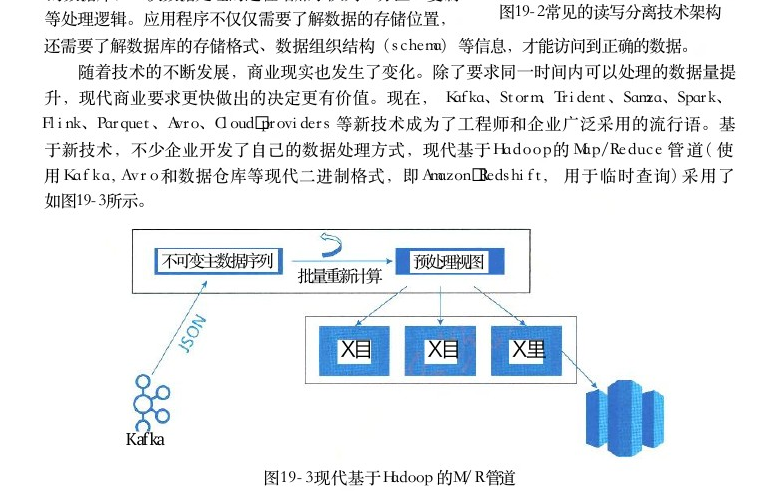
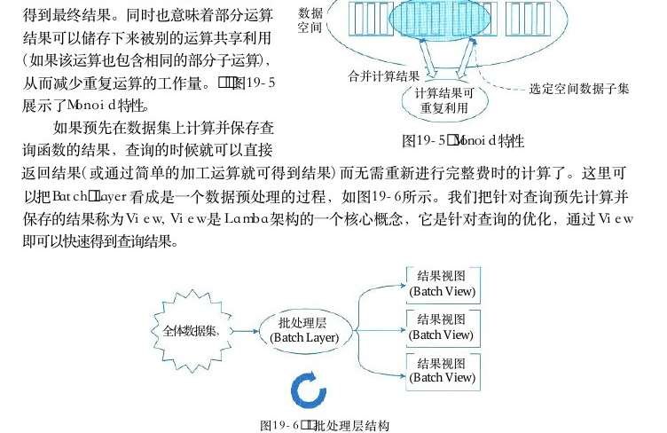
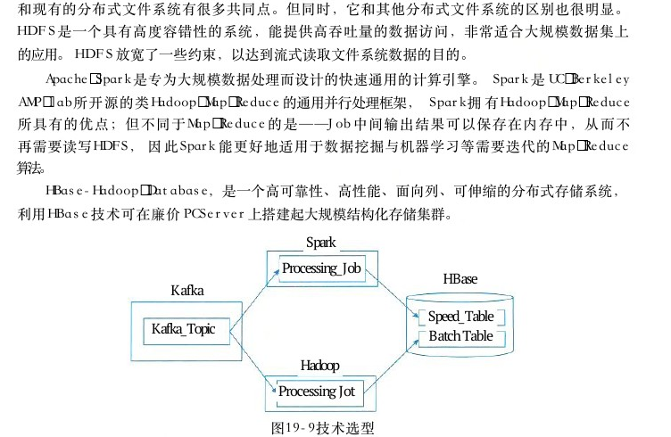
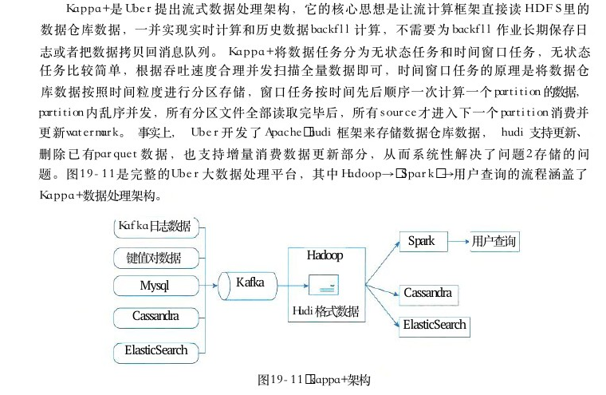
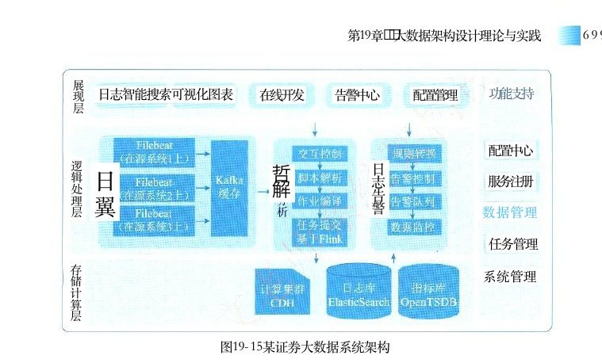
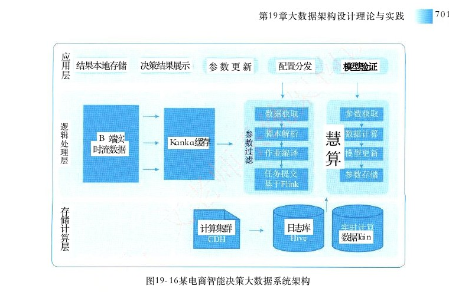

# 第19章 大数据架构设计理论与实践

> 本页为教材原文文字提取版。图示已按 PDF 页面裁剪并插入正文图注前。

<!-- PDF 第 688 页 -->

## 19．1 传统数据处理系统存在的问题

随着信息时代互联网技术爆炸式的发展，人们对于网络的依赖程度日渐加深，在业务中需要处理的数据量快速增加，逐渐飙升到了一个惊人的数量级。并且数据产生的速度随着采集与处理技术的更新仍在加快。数据量从兆字节 （MB）、 吉字节 （ GB ） 的级别到现在的太字节 （TB）、 柏字节 （PB） 级别，数据量的变化促使数据管理系统 （ DBMS ） 和数据仓库 （Data Warehouse，DW） 系统也在悄然地变化着。传统应用的数据系统架构设计时，应用直接访问数据库系统。当用户访问量增加时，数据库无法支撑日益增长的用户请求的负载，从而导致数据库服务器无法及时响应用户请求，出现超时的错误。出现这种情况以后 ， 在系统架构上就采用如Web服务器数据库图19－1的架构，在 Web 服务器和数据库中间加入一层异步处理的队列，缓解数据库的读写压力。数据修改请求当Web 服务器收到页面请求时，会将消息添加到队列中。在数据库端，创建一个工作处理层定期从队异步队列工作处理层每次获取列中取出消息进行处理，例如每次读取100条消息。

## 100条请求

这相当于在两者之间建立了一个缓冲。图19－1 在服务器和数据库中增加但是，这一方案并没有从本质上解决数据库过载异步队列缓冲隔离（Overload） 的问题，且当工作处理层无法跟上业务对于数据修改的请求时，就需要增加多个工作处理层并发执行，数据库又将再次成为响应请求的瓶颈。一个解决办法是对数据库进行分区 （Horizontal Partitioning）。 分区的方式通常以Hash 值作为 key。 这样就需要应用程序端知道如何去寻找每个 key所在的分区。但即便如此，问题仍然会随着用户请求的增加接踵而来。当之前的分区无法满足负载时，就需要增加更多分区，这时就需要对数据库进行reshard。resharding 的工作非常耗时而痛苦，因为需要协调很多工作，例如数据的迁移、更新客户端访问的分区地址，更新应用程序代码。如果系统本身还提供了在线访问服务，对运维的要求就更高。这种情况下，就可能导致数据写到错误的分区，因此必须要编写脚本来自动完成，且需要充分的测试。由此可见，在数据层和应用中增加了缓冲隔离，数据量的日渐增多仍然迫使传统数据仓库的开发者一次又一次挖掘系统，试图在各个方面寻找一点可提升的性能。架构变得越来越复杂，增加了队列、分区、复制、重分区脚本 （Resharding Scripts）。 应用程序还需要了解数据库的schema， 并能访问到正确的分区。问题在于：数据库对于分区是不了解的，无法帮助你应对分区、复制与分布式查询。

<!-- PDF 第 689 页 -->

最严重的问题是系统并没有对人为错误进行工程设计，仅靠备份是不能治本的。归根结底，系统还需要限制因为人为错误导致的破坏。然而，数据永不止步，传统架构的性能被压榨至极限，检索数据的延迟和频繁的硬件错误问题逐渐使用户不可接受，在传统架构上进行继续挖掘被证明是“挤牙膏”。帮助处理海量数据的新技术和新架构开发被提上日程，以求得让企业在现代竞争中占得先机。越来越多的开发者参与到新技术与新架构的研究探讨主机中，结论与成果逐渐丰硕。人们发现，当系统的用户访问量持续增加时，就需要考虑读写分离技术 （Master－Slave）工作处理层服务器和分库分表技术。常见读写分离技术架构如图19－2所示。从机现在，数据处理系统的架构变得越来越复杂了，相比传统的数据库，一次数据处理的过程增加了队列、分区、复制图19－2常见的读写分离技术架构等处理逻辑。应用程序不仅仅需要了解数据的存储位置，还需要了解数据库的存储格式、数据组织结构 （schema） 等信息，才能访问到正确的数据。随着技术的不断发展，商业现实也发生了变化。除了要求同一时间内可以处理的数据量提升，现代商业要求更快做出的决定更有价值。现在， Kafka、Storm、Trident、Samza、Spark、Flink、Parquet、Avro、Cloud providers 等新技术成为了工程师和企业广泛采用的流行语。基于新技术，不少企业开发了自己的数据处理方式，现代基于 Hadoop的 Map／Reduce 管道 （ 使用 Kafka，Avro 和数据仓库等现代二进制格式，即 Amazon Redshift， 用于临时查询）采用了如图19－3所示。

不可变主数据序列预处理视图批量重新计算

X目X 目X 里

Kaf ka

图19－3现代基于Hadoop 的M ／ R 管道

这个方式虽然看起来有其非常好的优势，但它仍然是一种传统的批处理方式，具有所有已知的缺点，主要原因是客户端的数据在批处理花费大量时间完成之前的数据处理时，新的数据已经进入而导致数据过时。基于传统系统出现的上述问题和无数人对于新技术的渴求与探讨，“大数据”的概念被适时的提出，研究与设计大数据系统成为了新的风潮。我们要学习的大数据系统架构设计理论，正是为了解决在处理海量数据时出现的种种问题，并让系统在一定的度量属性下可以接受，成为构造大数据系统的良好范式。

<!-- PDF 第 690 页 -->

## 19．2大数据处理系统架构分析

## 19．2．1大数据处理系统面临挑战

当今，大数据的到来，已经成为现实生活中无法逃避的挑战。每当我们要做出决策的时候，大数据就无处不在。大数据术语广泛地出现也使得人们渐渐明白了它的重要性。大数据渐渐向人们展现了它为学术、工业和政府带来的巨大机遇。与此同时，大数据也向参与的各方提出了巨大的挑战。那么主要挑战表现在以下三点。

## 1．如何利用信息技术等手段处理非结构化和半结构化数据

大数据中，结构化数据只占15％左右，其余的85％都是非结构化的数据，它们大量存在于社交网络、互联网和电子商务等领域。另一方面，也许有90％的数据来自开源数据，其余的被存储在数据库中。大数据的不确定性表现在高维、多变和强随机性等方面。股票交易数据流是不确定性大数据的一个典型例子。大数据催生了大量研究问题。非结构化和半结构化数据的个体表现、一般性特征和基本原理尚不清晰，这些都需要通过包括数学、经济学、社会学、计算机科学和管理科学在内的多学科交叉来研究和讨论。给定一种半结构化或非结构化数据，比如图像，如何把它转换成多维数据表、面向对象的数据模型或者直接基于图像的数据模型？值得注意的是，大数据每一种表示形式都仅为数据本身的一个侧面表现，并非全貌。如果把通过数据挖掘提取“粗糙知识”的过程称为“一次挖掘”过程，那么将粗糙知识与被量化后主观知识，包括具体的经验、常识、本能、情境知识和用户偏好，相结合而产生“智能知识”过程就叫作“二次挖掘”。从“一次挖掘”到“二次挖掘”，就类似于事物由“量”到“质”的飞跃。由于大数据所具有的半结构化和非结构化特点，基于大数据的数据挖掘所产生的结构化的“粗糙知识”（潜在模式）也伴有一些新的特征。这些结构化的粗糙知识可以被主观知识加工处理并转化，生成半结构化和非结构化的智能知识。寻求“智能知识”反映了大数据研究的核心价值。

2．如何探索大数据复杂性、不确定性特征描述的刻画方法及大数据的系统建模这一问题的突破是实现大数据知识发现的前提和关键。从长远角度来看，依照大数据的个体复杂性和随机性所带来的挑战将促使大数据数学结构的形成，从而促使大数据统一理论日趋完备。从短期而言，学术界鼓励发展一种一般性的结构化数据和半结构化、非结构化数据之间的转换原则，以支持大数据的交叉工业应用。管理科学，尤其是基于最优化的理论将在大数据知识发现的一般性方法和规律性的研究中发挥重要的作用。大数据的复杂形式导致许多对“粗糙知识”的度量和评估相关的研究问题。已知的最优化、数据包络分析、期望理论、管理科学中的效用理论可以被应用到研究如何将主观知识融合到数据挖掘产生的粗糙知识的“二次挖掘”过程中。这里人机交互将起到至关重要的作用。

<!-- PDF 第 691 页 -->

## 3．数据异构性与决策异构性的关系对大数据知识发现与管理决策的影响

由于大数据本身的复杂性，这一问题无疑是一个重要的科研课题，对传统的数据挖掘理论和技术提出了新的挑战。在大数据环境下，管理决策面临着两个“异构性”问题：“数据异构性”和“决策异构性”。传统的管理决策模式取决于对业务知识的学习和日益积累的实践经验，而管理决策又是以数据分析为基础的。大数据已经改变了传统的管理决策结构的模式。研究大数据对管理决策结构的影响会成为一个公开的科研问题。除此之外，决策结构的变化要求人们去探讨如何为支持更高层次的决策而去做“二次挖掘”。无论大数据带来了哪种数据异构性，大数据中的“粗糙知识”仍可被看作“一次挖掘”的范畴。通过寻找“二次挖掘”产生的“智能知识”来作为数据异构性和决策异构性之间的桥梁是十分必要的。探索大数据环境下决策结构是如何被改变的，相当于研究如何将决策者的主观知识参与到决策的过程中。大数据是一种具有隐藏法则的人造自然，寻找大数据的科学模式将带来对研究大数据之美的一般性方法的探究，尽管这样的探索十分困难，但是如果我们找到了将非结构化、半结构化数据转换成结构化数据的方法，已知的数据挖掘方法将成为大数据挖掘的工具。

## 1 9 ． 2 ． 2 大数据处理系统架构特征

Storm之父 Nathan Marz在《大数据系统构建：可扩展实时数据系统构建原理与最佳实践》一书中，提出了他认为大数据系统应该具有的属性。

1．鲁棒性和容错性（Robust and Fault－tolerant）对大规模分布式系统来说，机器是不可靠的，可能会宕机，但是系统需要是健壮、行为正确的，即使是遇到机器错误。除了机器错误，人更可能会犯错误。在软件开发中难免会有一些Bug， 系统必须对有 Bug 的程序写入的错误数据有足够的适应能力，所以比机器容错性更加重要的容错性是人为操作容错性。对于大规模的分布式系统来说，人和机器的错误每天都可能会发生，如何应对人和机器的错误，让系统能够从错误中快速恢复尤其重要。

2．低延迟读取和更新能力（Low Latency Reads and Updates）许多应用程序要求数据系统拥有几毫秒到几百毫秒的低延迟读取和更新能力。有的应用程序允许几个小时的延迟更新，但是只要有低延迟读取与更新的需求，系统就应该在保证鲁棒性的前提下实现。

## 3．横向扩容 （Scalable）

当数据量／负载增大时，可扩展性的系统通过增加更多的机器资源来维持性能。也就是常说的系统需要线性可扩展，通常采用 scale out （通过增加机器的个数）而不是 scale up （通过增强机器的性能）。

## 4．通用性（General）

系统需要支持绝大多数应用程序，包括金融领域、社交网络、电子商务数据分析等。

<!-- PDF 第 692 页 -->

## 5．延展性（Extensible）

在新的功能需求出现时，系统需要能够将新功能添加到系统中。同时，系统的大规模迁移能力是设计者需要考虑的因素之一，这也是可延展性的体现。

## 6．即席查询能力（Allows Ad Hoc Queries）

用户在使用系统时，应当可以按照自己的要求进行即席查询 （Ad Hoc）。 这使用户可以通过系统多样化数据处理，产生更高的应用价值。

## 7．最少维护能力 （Minimal Maintenance）

系统需要在大多数时间下保持平稳运行。使用机制简单的组件和算法让系统底层拥有低复杂度，是减少系统维护次数的重要途径。 Marz认为大数据系统设计不能再基于传统架构的增量更新设计，要通过减少复杂性以减少发生错误的几率、避免繁重操作。

## 8．可调试性 （Debuggable）

系统在运行中产生的每一个值，需要有可用途径进行追踪，并且要能够明确这些值是如何产生的。

## 1 9 ． 3 Lambda 架构

## 1 9 ． 3 ． 1 Lambda架构对大数据处理系统的理解

Lambda架构由 Storm 的作者 Nathan Marz提出，其设计目的在于提供一个能满足大数据系统关键特性的架构，包括高容错、低延迟、可扩展等。其整合离线计算与实时计算，融合不可变性、读写分离和复杂性隔离等原则，可集成 Hadoop、Kafka、Spark、Storm等各类大数据组件。Lambda 是用于同时处理离线和实时数据的，可容错的，可扩展的分布式系统。它具备强鲁棒性，提供低延迟和持续更新。

## 1 9 ． 3 ． 2 Lambda架构应用场景

## 1．机器学习中的Lambda架构

在机器学习领域，数据量无疑是多多益善的。但是，对于机器学习应用算法、检测模式而言，它们需要以一种有意义的方式去接收数据。因此，机器学习可以受益于由 Lambda架构构建的数据系统、所处理的各类数据。据此，机器学习算法可以提出各种问题，并逐渐对输入到系统中的数据进行模式识别。

## 2．物联网的Lambda架构

如果说机器学习利用的是 Lambda 架构的输出，那么物联网则更多地作为数据系统的输入。设想一下，一个拥有数百万辆汽车的城市，每辆汽车都装有传感器，并能够发送有关天气、空气质量、交通状况、位置信息以及司机驾驶习惯等数据。这些海量数据流，会被实时馈入Lambda 体系架构的批处理层和速度层，进行后续处理。可以说，物联网设备是适合作为大数据

<!-- PDF 第 693 页 -->

源的绝佳示例。

## 3．流处理和Lambda架构挑战

速度层也被称为“流处理层”。其目的是提供最新数据的低延迟实时视图。虽说，速度层仅关心自完成最后一组批处理视图以来导入的数据，但事实上它不会存储这些小部分的数据。这些数据在流入时就会被立即处理，且在完成后被立即丢弃。因此，我们可以认为这些数据是尚未被批处理视图所计入的数据。Lambda 体系架构在其原始理论中，提到了最终精度 （eventual accuracy） 的概念。它是指：批处理层更关注精确计算，而速度层则关注近似计算。此类近似计算最终将由下一组视图所取代，以便系统向“最终精度”迈进。在实际应用中，由于实时处理流以毫秒为单位，持续产生用于更新视图的数据流，是一个非常复杂的过程。因此，将基于文档的数据库、索引以及查询系统配合在一起使用，是一种比较好的选择。

## 19．3．3 Lambda架构介绍

如图19－4所示， Lambda 架构可分解为三层，即批处理层、加速层和服务层。（ 1 ） 批处理层 （Batch Layer）： 存储数据集， Batch Layer在数据集上预先计算查询函数，并构建查询所对应的 View。Batch Layer可以很好地处理离线数据，但有很多场景数据是不断实时生成且需要实时查询处理，对于这种情况， Speed Layer 更为适合。（ 2 ） 加速层 （Speed Layer）：Batch Layer处理的是全体数据集，而 Speed Layer处理的是最近的增量数据流。 Speed Layer 为了效率，在接收到新的数据后会不断更新 Real－time View， 而Batch Layer 是根据全体离线数据集直接得到 Batch View。（ 3 ） 服务层 （Serving Layer）：Serving Layer 用于合并 Batch View 和 Real－time View 中的结果数据集到最终数据集。

·Map Reduce进行大量数据处理·产生批处理结果视图·汇总流处理视图＆批处理视图·结果认为是精准且全量的·产生查询视图·数据处理时延很高批处理层(Batch Layer)服务层数据源 （Data Source）查询视图(Serving Layer)加速层(Speed Layer)·只处理最近产生的实时数据·产生流处理结果视图·流处理层的数据可能不是准确的，也不是全量的·数据处理时延很低图19－4 Lambda架构

<!-- PDF 第 694 页 -->

## 1．批处理层

Batch Layer 有两个核心功能：存储数据集和生成 Batch View。该层负责管理主数据集。主数据集中的数据必须具有以下三个属性：

（1）数据是原始的。

（2）数据是不可变的。

（3）数据永远是真实的。有一类称为Monoid特性的函数应用非常广泛。 Monoid的概念来源于范畴学 （CategoryTheory）， 其一个重要特性是满足结合律。如整数的加法就满足 Monoid 特性：不满足 Monoid 特性的函数很多时候可以转化成多个满足Monoid特性的函数的运算。如多个数的平均值 Avg 函数，多个平均值没法直接通过结合来得到最终的平均值，但是可以拆成分母除以分子，分母和分子都是整数的加法，从而满足 Monoid特性。Monoid 的结合律特性在分布式计分布式计算算中极其重要，满足 Monoid 特性意味着我们可以将计算分解到多台机器并行运算，然后再结合各自的部分运算结果得到最终结果。同时也意味着部分运算数据空间结果可以储存下来被别的运算共享利用（如果该运算也包含相同的部分子运算），合并计算结果从而减少重复运算的工作量。 图19－5选定空间数据子集计算结果可展示了Monoid 特性。重复利用如果预先在数据集上计算并保存查图19－5 Monoid 特性询函数的结果，查询的时候就可以直接返回结果（或通过简单的加工运算就可得到结果）而无需重新进行完整费时的计算了。这里可以把Batch Layer看成是一个数据预处理的过程，如图19－6所示。我们把针对查询预先计算并保存的结果称为View，View 是 Lamba架构的一个核心概念，它是针对查询的优化，通过 View即可以快速得到查询结果。

结果视图(Batch View)结果视图批处理层全体数据集，(Batch View)(Batch Layer)结果视图(Batch View)

图19－6 批处理层结构如果采用 HDFS 来储存数据，我们就可以使用 MapReduce 来在数据集上构建查询的View。View 是一个和业务关联性比较大的概念， View 的创建需要从业务自身的需求出发。一个通用

<!-- PDF 第 695 页 -->

的数据库查询系统，查询对应的函数千变万化，不可能穷举。但是如果从业务自身的需求出发，可以发现业务所需要的查询常常是有限的。 Batch Layer需要做的一件重要的工作就是根据业务的需求，考察可能需要的各种查询，根据查询定义其在数据集上对应的 Views。

## 2．加速层

对加速层批处理视图建立索引，便于能快速进行即席查询 （Ad Hoc Queries）。 它存储实时视图并处理传入的数据流，以便更新这些视图。Batch Layer 可以很好地处理离线数据，但有很多场景数据不断实时生成，并且需要实时查询处理。 Speed Layer正是用来处理增量的实时数据。Speed Layer和 Batch Layer 比较类似。如图19－7所示， Speed Layer对数据进行计算并生成Realtime View， 其主要区别在于：

（1）Speed Layer处理的数据是最近的增量数据流， Batch Layer处理的全体数据集。

（2）Speed Layer为了效率，接收到新数据时不断更新 Realtime View， 而 Batch Layer根据全体离线数据集直接得到 Batch View。

流处理层批处理层批处理层流处理层

流处理层批处理层时间图19－7加速层结构

Lambda 架构将数据处理分解为 Batch Layer和 Speed Layer 有如下优点：

● 容错性。中处理的数据也不断写入当中重新计算的Speed LayerBatch Layer,Batch Layer数据集包含Speed Layer处理的数据集后，当前的Real－time View就可以丢弃，这也就意味着Speed Layer处理中引入的错误，在Batch Layer重新计算时都可以得到修正。这一点也可以看成是CAP理论中的最终一致性 （Eventual Consistency） 的体现。

● 复杂性隔离。处理的是离线数据，可以很好地掌控。采用增量算Batch LayerSpeed Layer法处理实时数据，复杂性比Batch Layer要高很多。通过分开Batch Layer和Speed Layer，把复杂性隔离到Speed Layer， 可以很好地提高整个系统的鲁棒性和可靠性。

●（横向扩容）：当数据量／负载增大时，可扩展性的系统通过增加更多的机器资Scalable源来维持性能。也就是常说的系统需要线性可扩展，通常采用scale out （通过增加机器的个数）而不是scale up （通过增强机器的性能）。

## 3．服务层

Lambda 架构的 Serving Layer用于响应用户的查询请求，合并Batch View 和 Real－time View中的结果数据集到最终的数据集。该层提供了主数据集上执行的计算结果的低延迟访问。读取速度可以通过数据附加的索引来加速。与加速层类似，该层也必须满足以下要求，例如随机读

<!-- PDF 第 696 页 -->

取，批量写入，可伸缩性和容错能力。这涉及数据如何合并的问题。前面我们讨论了查询函数的 Monoid 性质，如果查询函数满足Monoid 性质 ， 即满足结合率 ， 只需要简单地合并 Batch流处理层View 和 Real－time View 中的结果数据集即可。否则，可以把视图查询查询函数转换成多个满足 Monoid 性质的查询函数的运算，合并单独对每个满足Monoid 性质的查询函数进行Batch View和视图查询Real－time View 中的结果数据集合并，然后再计算得到最终的批处理层结果数据集。另外也可以根据业务自身的特性，运用业务自图19－8服务层结构身的规则来对 Batch View和 Real－time View 中的结果数据集合并，如图19－8所示。

## 19．3．4 Lambda架构的实现

如图19－9所示，在这种 Lambda 架构实现中，Hadoop （ HDFS ） 用于存储主数据集，Spark（或Storm） 可构成速度层 （Speed Layer），HBase （ 或 Cassandra） 作为服务层，由Hive 创建可查询的视图。Hadoop是被设计成适合运行在通用硬件上的分布式文件系统 （Distributed File System）。 它和现有的分布式文件系统有很多共同点。但同时，它和其他分布式文件系统的区别也很明显。HDFS 是一个具有高度容错性的系统，能提供高吞吐量的数据访问，非常适合大规模数据集上的应用。 HDFS 放宽了一些约束，以达到流式读取文件系统数据的目的。Apache Spark是专为大规模数据处理而设计的快速通用的计算引擎。 Spark 是 UC BerkeleyAMP lab所开源的类 Hadoop Map Reduce 的通用并行处理框架， Spark拥有 Hadoop Map Reduce所具有的优点；但不同于 Map Reduce 的是——Job 中间输出结果可以保存在内存中，从而不再需要读写HDFS ， 因此 Spark 能更好地适用于数据挖掘与机器学习等需要迭代的 Map Reduce算法。HBase－Hadoop Database， 是一个高可靠性、高性能、面向列、可伸缩的分布式存储系统，利用 HBase 技术可在廉价 PCServer 上搭建起大规模结构化存储集群。

Spark Processing_Job HBase Kafka Speed_Table Kafka_Topic Batch Table Hadoop Processing Jot

图19－9技术选型

<!-- PDF 第 697 页 -->

## 1 9 ． 3 ． 5 Lambda架构优缺点

## 1．优点

（1）容错性好。 Lambda 架构为大数据系统提供了更友好的容错能力，一旦发生错误，我们可以修复算法或从头开始重新计算视图。

（2）查询灵活度高。批处理层允许针对任何数据进行临时查询。

（3）易伸缩。所有的批处理层、加速层和服务层都很容易扩展。因为它们都是完全分布式的系统，我们可以通过增加新机器来轻松地扩大规模。

（4）易扩展。添加视图是容易的，只是给主数据集添加几个新的函数。

## 2．缺点

（1）全场景覆盖带来的编码开销。

（2）针对具体场景重新离线训练一遍益处不大。

（3）重新部署和迁移成本很高。

## 1 9 ． 3 ． 6 Lambda与其他架构模式对比

Lambda 架构的诞生离不开很多现有设计思想和架构的铺垫，如事件溯源 （Event Sourcing）架构和命令查询分离 （Command Query Responsibility Segregation，CQRS） 架构， Lambda架构的设计思想和这两者有一定程度的相似。下面对 Lambda 架构和这两者进行分析。

1．事件溯源 （Event Sourcing） 与 Lambda 架构Event Sourcing架构模式由 Thought Works 的首席科学家Martin Flower提出。 Event Sourcing本质上是一种数据持久化的方式，其由三个核心观点构成：

（1）整个系统以事件为驱动，所有业务都由事件驱动来完成。

（2）事件是核心，系统的数据以事件为基础，事件要保存在某种存储上。

（3）业务数据只是一些由事件产生的视图，不一定要保存到数据库中。Lambda架构中数据集的存储使用的概念与 Event Sourcing 中的思想完全一致，二者都是在使用统一的数据模型对数据处理事件本身进行定义。这样在发生错误的时候，能够通过模型找到错误发生的原因，对这一事件进行重新计算以丢弃错误信息，恢复到系统应该的正确状态，以此实现了系统的容错性。

## 2 ． CQRS 与 Lambda 架构

CQRS 架构分离了对于数据进行的读操作（查询）和写（修改）操作。其将能够改变数据模型状态的命令和对于模型状态的查询操作实现了分离。这是领域驱动设计 （Domain－DrivenDesign，DDD） 的一个架构模式，主要用来解决数据库报表的输出处理方式。Lambda 架构中，数据的修改通过批处理和流处理实现，通过写操作将数据转换成查询时所对应的 View。 在 Lambda架构中，对数据进行查询时，实际上是通过读取 View 直接得到结果，

<!-- PDF 第 698 页 -->

读出所需的内容。这实际上是一种形式的读写分离。进行读写分离设计的原因是，读操作实际上比写操作要省时得多，如果将读和写操作放在一起，实际处理大量数据时会因为写操作的时长问题影响整体业务的处理效率。在大数据系统中经常处理海量数据，进行读写分离重要性不言而喻。

## 19．4 Kappa架构

## 19．4．1 Kappa架构下对大数据处理系统的理解

为了设计出能满足前述的大数据关键特性的系统，我们需要对数据系统有本质性的理解。我们可将数据系统简单理解为：数据系统＝数据＋查询进而从数据和查询两方面来认识大数据系统的本质。

## 1．数据的特性

我们先从数据的特性谈起。数据是一个不可分割的单位，数据有两个关键的性质： When和What。（ 1 ） When 。 When 是指数据是与时间相关的，数据一定是在某个时间点产生的。比如 Log日志就隐含着按照时间先后顺序产生的数据， Log 前面的日志数据一定先于Log后面的日志数据产生；消息系统中消息的接收者一定是在消息的发送者发送消息后接收到的消息。相比于数据库，数据库中表的记录就丢失了时间先后顺序的信息，中间某条记录可能是在最后一条记录产生后发生更新的。对于分布式系统，数据的时间特性尤其重要。分布式系统中数据可能产生于不同的系统中，时间决定了数据发生的全局先后顺序。比如对一个值做算术运算，先＋2，后＋3，与先＋3，后＋2，得到的结果完全不同。数据的时间性质决定了数据的全局发生先后，也就决定了数据的结果。

（2）What。What 是指数据的本身。由于数据跟某个时间点相关，所以数据的本身是不可变的 （Immutable）， 过往的数据已经成为事实 （Fact）， 你不可能回到过去的某个时间点去改变数据事实。这也就意味着对数据的操作其实只有两种：读取已存在的数据和添加更多的新数据。采用数据库的记法， CRUD 就变成了 CR，Update 和 Delete 本质上其实是新产生的数据信息，用 C 来记录。

## 2．数据的存储

根据上述对数据本质特性的分析， Lamba 架构中对数据的存储采用的方式是：数据不可变，存储所有数据。通过采用不可变方式存储所有的数据，可以有如下好处：

（1）简单。采用不可变的数据模型，存储数据时只需要简单地往主数据集后追加数据即可。相比于采用可变的数据模型，为了Update操作，数据通常需要被索引，从而能快速找到要更新的数据去做更新操作。

<!-- PDF 第 699 页 -->

第 1 9 章大数据架构设计理论与实践

（2）应对人为和机器的错误。前述中提到人和机器每天都可能会出错，如何应对人和机器的错误，让系统能够从错误中快速恢复极其重要。不可变性 （Immutability） 和重新计算 （Re－computation） 则是应对人为和机器错误的常用方法。采用可变数据模型，引发错误的数据有可能被覆盖而丢失。相比于采用不可变的数据模型，因为所有的数据都在，引发错误的数据也在。修复的方法就可以简单的是遍历数据集上存储的所有的数据，丢弃错误的数据，重新计算得到Views。 重新计算的关键点在于利用数据的时间特性决定的全局次序，依次顺序重新执行，必然能得到正确的结果。当前业界有很多采用不可变数据模型来存储所有数据的例子。比如分布式数据库 Datomic，基于不可变数据模型来存储数据，从而简化了设计。分布式消息中间件Kafka， 基于 Log 日志，以追加 append－only 的方式来存储消息。

## 19．4．2 Kappa架构介绍

Kappa架构由 Jay Kreps提出，不同于Lambda 同时计算流计算和批计算并合并视图， Kappa只会通过流计算一条的数据链路计算并产生视图。 Kappa 同样采用了重新处理事件的原则，对于历史数据分析类的需求， Kappa 要求数据的长期存储能够以有序日志流的方式重新流入流计算引擎，重新产生历史数据的视图。本质上是通过改进 Lambda架构中的 Speed Layer， 使它既能够进行实时数据处理，同时也有能力在业务逻辑更新的情况下重新处理以前处理过的历史数据。Kappa 架构的原理就是：在 Lambda的基础上进行了优化，删除了 Batch Layer 的架构，将数据通道以消息队列进行替代。因此对于 Kappa 架构来说，依旧以流处理为主，但是数据却在数据湖层面进行了存储，当需要进行离线分析或者再次计算的时候，则将数据湖的数据再次经过消息队列重播一次则可。 Kappa数据处理架构如图19－10所示。

实时层服务层实时引擎服务后端外部查询输入数据数据结果数历史数据存储据存储

图19－10 Kappa架构如图19－10所示，输入数据直接由实时层的实时数据处理引擎对源源不断的源数据进行处理，再由服务层的服务后端进一步处理以提供上层的业务查询。而中间结果的数据都是需要存储的，这些数据包括历史数据与结果数据，统一存储在存储介质中。Kappa方案通过精简链路解决了数据写入和计算逻辑复杂的问题，但它依然没有解决存储和展示的问题，特别是在存储上，使用类似 Kafka 的消息队列存储长期日志数据，数据无法压缩，存储成本很大，绕过方案是使用支持数据分层存储的消息系统（如 Pulsar， 支持将历史消

<!-- PDF 第 700 页 -->

息存储到云上存储系统），但是分层存储的历史日志数据仅能用于 Kappa backfill 作业，数据的利用率依然很低。从使用场景上来看， Kappa架构与 Lambda相比，主要有两点区别：

（1）Kappa不是 Lambda 的替代架构，而是其简化版本， Kappa放弃了对批处理的支持，更擅长业务本身为增量数据写入场景的分析需求，例如各种时序数据场景，天然存在时间窗口的概念，流式计算直接满足其实时计算和历史补偿任务需求；

（2）Lambda 直接支持批处理，因此更适合对历史数据分析查询的场景，比如数据分析师需要按任意条件组合对历史数据进行探索性的分析，并且有一定的实时性需求，期望尽快得到分析结果，批处理可以更直接高效地满足这些需求。

## 19．4．3 Kappa架构的实现

下面以 Apache Kafka 为例来讲述整个全新架构的过程。部署 Apache Kafka， 并设置数据日志的保留期 （Retention Period）。 这里的保留期指的是你希望能够重新处理的历史数据的时间区间。例如，如果你希望重新处理最多一年的历史数据，那就可以把Apache Kafka 中的保留期设置为365天。如果你希望能够处理所有的历史数据，那就可以把 Apache Kafka 中的保留期设置为“永久 （Forever）”。如果我们需要改进现有的逻辑算法，那就表示我们需要对历史数据进行重新处理。我们需要做的就是重新启动一个Apache Kafka 作业实例 （Instance）。 这个作业实例将从头开始，重新计算保留好的历史数据，并将结果输出到一个新的数据视图中。我们知道 Apache Kafka 的底层是使用 Log Offset 来判断现在已经处理到哪个数据块了，所以只需要将 Log Offset 设置为 0 ， 新的作业实例就会从头开始处理历史数据。当这个新的数据视图处理过的数据进度赶上了旧的数据视图时，我们的应用便可以切换到从新的数据视图中读取。停止旧版本的作业实例，并删除旧的数据视图。

## 19．4．4 Kappa架构的优缺点

Kappa架构的优点在于将实时和离线代码统一起来，方便维护而且统一了数据口径的问题，避免了 Lambda架构中与离线数据合并的问题，查询历史数据的时候只需要重放存储的历史数据即可。而Kappa 的缺点也很明显：

（1）消息中间件缓存的数据量和回溯数据有性能瓶颈。通常算法需要过去180天的数据，如果都存在消息中间件，无疑有非常大的压力。同时，一次性回溯订正180天级别的数据，对实时计算的资源消耗也非常大。

（2）在实时数据处理时，遇到大量不同的实时流进行关联时，非常依赖实时计算系统的能力，很可能因为数据流先后顺序问题，导致数据丢失。

（3）Kappa 在抛弃了离线数据处理模块的时候，同时抛弃了离线计算更加稳定可靠的特点。Lambda 虽然保证了离线计算的稳定性，但双系统的维护成本高且两套代码带来后期运维困难。对于以上Kappa框架存在的几个问题，目前也存在一些解决方案，对于消息队列缓存数据

<!-- PDF 第 701 页 -->

性能的问题， Kappa ＋框架提出使用 HDFS 来存储中间数据。针对 Kappa 框架展示层能力不足的问题，也有人提出了混合分析系统的解决方案。

## 19．4．5常见Kappa架构变形

## 1． Kappa＋ 架构

Kappa＋ 是 Uber 提出流式数据处理架构，它的核心思想是让流计算框架直接读 HDFS里的数据仓库数据，一并实现实时计算和历史数据 backfll 计算，不需要为 backfll 作业长期保存日志或者把数据拷贝回消息队列。 Kappa＋ 将数据任务分为无状态任务和时间窗口任务，无状态任务比较简单，根据吞吐速度合理并发扫描全量数据即可，时间窗口任务的原理是将数据仓库数据按照时间粒度进行分区存储，窗口任务按时间先后顺序一次计算一个 partition 的数据，partition 内乱序并发，所有分区文件全部读取完毕后，所有 source才进入下一个 partition 消费并更新watermark。 事实上， Uber开发了 Apache hudi 框架来存储数据仓库数据， hudi 支持更新、删除已有parquet 数据 ， 也支持增量消费数据更新部分 ， 从而系统性解决了问题 2 存储的问题。图19－11是完整的Uber 大数据处理平台，其中 Hadoop→ Spark →用户查询的流程涵盖了Kappa＋数据处理架构。

Kafka日志数据用户查询Spark键值对数据Hadoop

Kafka Mysql CassandraHudi格式数据Cassandra ElasticSearch ElasticSearch

图19－11 kappa＋架构

如图19－11所示，将不同来源的数据通过 Kafka 导入到 Hadoop 中，通过 HDFS 来存储中间数据，再通过 spark对数据进行分析处理，最后交由上层业务进行查询。

## 2．混合分析系统的 Kappa 架构

Lambda 和 Kappa架构都还有展示层的困难点，结果视图如何支持热点数据查询分析，一个Flink解决方案是在 Kappa基础上衍生数据分析流程。如图19－12所示，在基于使用 Kafka ＋Flink构建 Kappa 流计算数据架构 ， 针对 Kappa架构分析能力不足的问题 ， 再利用 Kafka对接组合Elastic－ Search 实时分析引擎 ， 部分弥补其数据源数据KafkaElasticSearch分析能力。但是 ElasticSearch 也只适合对合理数图19－12 混合分析系统架构

<!-- PDF 第 702 页 -->

据量级的热点数据进行索引，无法覆盖所有批处理相关的分析需求，这种混合架构某种意义上属于 Kappa和 Lambda间的折中方案。

## 19．5 Lambda架构与Kappa架构的对比和设计选择

## 19．5．1 Lambda架构与Kappa架构的特性对比

一个大数据系统架构的设计思想很大程度上受到当时技术条件和思维模式的限制。 Lambda架构将批处理层和速度层分为两层，分别进行离线数据处理和实时数据处理，这样设计的根本原因在于， Lambda 提出的初期是在公司中进行小范围的业务运用，当时并没有思考有没有一个计算引擎能够在可接受的延迟条件下既进行离线数据处理又进行实时数据处理。在这样的前提下，将现有的成熟离线处理技术 （Hadoop） 和实时处理技术 （Storm） 相结合，用 View模型将二者处理数据后得到的输出结果结合起来，在服务层 （Serving Layer） 中进行统一，开放给上层服务，是相当可行且高效的设计方式。Kappa架构作者则对流处理系统有丰富的理论知识和使用经验，是Apache Kafka和 ApacheSamza 等知名开源流处理系统的作者之一。基于对流式计算深入的理解， Kappa架构在同一层次内进行实时处理和离线处理，在满足延迟要求的流式计算技术成熟的前提，比 Lambda更优秀。表19－1从多个维度对 Lambda架构和 Kappa 架构进行了对比分析。表19－1Lambda架构和Kappa架构对比对比内容Lambda架构Kappa架构需要维护两套系统（引擎），复杂度只需要维护一套系统（引擎），复杂度复杂度与开发、维护成本高，开发、维护成本高低，开发、维护成本低需要一直运行批处理和实时计算，计算开销必要时进行全量计算，计算开销相对较小计算开销大实时性满足实时性满足实时性批式全量处理，吞吐量大，历史数流式全量处理，吞吐量相对较低，历史历史数据处理能力数据处理能力相对较弱据处理能力强

## 1．复杂度与开发、维护成本

对于大数据系统的评价与比较，首先需要考虑这个系统开发、上线的难度，以及这个系统是否能够以足够低的成本进行维护。因为需要开发并维护两套系统， Lambda 架构的复杂度相对更高。其中，一套负责进行离线的批处理计算，一般选择使用 Hadoop 作为批处理系统，将批处理结果 View保存到 HBase 中；另一套需要进行实时的流式计算，一般选择 Storm、Spark 作为流处理系统，流式计算结果将保存到 Redis 中。Lambda架构需要分别在批处理和实时计算系统上面运行两套代码，这两套代码产出相同范式的结果。并且，在进行全量计算时，批处理系统还需要长时间保持运行以保证离线运算结果

<!-- PDF 第 703 页 -->

的正确性。这样的开发维护成本相对较高。Kappa架构的复杂度相对低很多，只需要开发并维护一套系统。因为 Kafka对于流式计算有良好支持，易于编程，故一般使用 Kafka 作为消息中间件，将数据保存在消息队列中。流式计算系统一般使用 Flink 实现，其作为新兴的流处理框架，以数据并行和流水线方式执行任意流数据程序，且同时支持批处理和流处理。开发维护成本相对较低。

## 2．计算开销

在使用大数据系统进行数据处理时，需要知道数据的存储位置。由于数据量的持续增长，计算对 I／O 的需求增长速度已经远远超过网络带宽的扩容速度，故在计算时的开销也是大数据系统的考虑因素之一。Lambda 架构在计算时，需要让数据同时支持批处理层系统和流处理层系统运行，且在运行时批处理系统和流处理系统都不能停机，否则将会有 View 的合并错误、计算开销大等问题。Kappa架构的数据存储只需要面对流式计算，且只需要在必要时进行全量计算，计算消耗小。

## 3．实时性

实时性要求系统对于一个服务调用可以进行快速响应。快速的定义可能从几毫秒到几秒，取决于用户对于这一功能响应速度的具体要求。在大数据系统中，用户对于快速的要求往往集中在随机读取功能。 Lambda架构和 Kappa 架构都能够对数据进行实时处理并进行服务的响应。Lambda架构的策略在于使用满足幺半群 （Monoid） 性质的数据 View模型，对批处理层和速度层的输出进行统一管理，这样在新数据到达时，速度层可以实时处理数据得到最新 View，然后和批处理层的 View相结合，得到最新的实时结果。这样做的优点是将实时处理变成了批处理和流处理结果的结合，稳定且实时计算成本可控。Kappa架构的策略是使用 Kafka或者类似的分布式消息中间件，用消息队列进行数据的保存，采用并发计算，如果不需要全量计算则直接读出数据。如果需要全量计算，则重新启动一个新的流式计算实例，将所有数据重新读取、计算，直到计算结果完成并超越了原来的结果，再删除原结果，使新结果成为可读取数据。在进行实时的流式数据处理时，如果有大量不同的实时流同时计算，由于算法要求进行关联，十分考验实时计算系统的能力。同时可能因为数据流的先后顺序、算法逻辑等问题导致数据丢失。

## 4．历史数据处理能力

大数据系统在进行数据处理时，可能需要从大量历史数据中提取出对用户有价值的数据。Lambda架构在设计上可以在批处理层中对于超大规模的历史数据进行批量计算。由于批处理层和速度层使用不同的计算系统，在进行批量数据处理时速度层的实时计算仍然可以运行且不受影响。而Kappa架构对于大量历史数据的处理能力相对 Lambda 则相对较弱。 Kappa在设计上使用了消息队列对数据进行缓存，而消息队列对于数据量和历史数据回溯有性能的制约。在日常需求中算法可能需要一次处理过去一年或者更久的数据，如果这些数据都存在消息队列中，对

<!-- PDF 第 704 页 -->

消息中间件的性能会有非常大的压力。如果数据结果中出现错误需要重新计算，这样数量级的数据对实时流式计算的稳定性和正确性也是一种考验。

## 1 9 ． 5 ． 2 Lambda架构与Kappa架构的设计选择

根据两种架构对比分析，将业务需求、技术要求、系统复杂度、开发维护成本和历史数据处理能力作为选择考虑因素。而计算开销虽然存在一定差别，但是相差不是很大，所以不作为考虑因素。

## 1．业务需求与技术要求

用户需要根据自己的业务需求来选择架构，如果业务对于 Hadoop、Spark、Strom 等关键技术有强制性依赖，选择 Lambda 架构可能较为合适；如果处理数据偏好于流式计算，又依赖Flink 计算引擎，那么选择 Kappa架构可能更为合适。

## 2．复杂度

如果项目中需要频繁地对算法模型参数进行修改， Lambda 架构需要反复修改两套代码，则显然不如 Kappa架构简单方便。同时，如果算法模型支持同时执行批处理和流式计算，或者希望用一份代码进行数据处理，那么可以选择Kappa 架构。在某些复杂的案例中，其实时处理和离线处理的结果不能统一，比如某些机器学习的预测模型，需要先通过离线批处理得到训练模型，再交由实时流式处理进行验证测试，那么这种情况下，批处理层和流处理层不能进行合并，因此应该选择 Lambda 架构。

## 3．开发维护成本

Lambda 架构需要有一定程度的开发维护成本，包括两套系统的开发、部署、测试、维护，适合有足够经济、技术和人力资源的开发者。而 Kappa 架构只需要维护一套系统，适合不希望在开发维护上投入过多成本的开发者。

## 4．历史数据处理能力

有些情况下，项目会频繁接触海量数据集进行分析，比如过往十年内的地区降水数据等，这种数据适合批处理系统进行分析，应该选择Lambda架构。如果始终使用小规模数据集，流处理系统完全可以使用，则应该选择 Kappa架构。

## 19．6大数据架构设计案例分析

## 1 9 ． 6 ． 1 Lambda架构在某网奥运中的大数据应用

## 1．系统建设背景

某网作为某电视台在互联网上的大型门户入口，2016年成为里约奥运会中国大陆地区的持权转播商，独家全程直播了里约奥运会全部的赛事，令某网各终端网络播放量屡创新高，同时积累了庞大稳定的用户群，这些用户在使用各类服务过程中产生了大量数据，对这些海量数据

<!-- PDF 第 705 页 -->

进行分析与挖掘，将会对节目的传播及商业模式变现起到重要的作用。

## 2 ． 数据需求与场景

里约奥运期间需要对增量数据在当日概览和赛事回顾两个层面上进行分析 。 其中 ， 当日概览模块需要秒级刷新直播在线人数 、 网站的综合浏览量 、 页面停留时间 、 视频的播放次数和平均播放时间等千万级数据量的实时信息 ， 而传统的分布式架构采用重新计算的方式分析实时数据 ， 在不扩充以往集群规模的情况下 ， 无法在几秒内分析出需要的信息 。 Lambda 架构实时处理层采用增量计算实时数据的方式 ， 可以在集群规模不变的前提下 ， 秒级分析出当日概览所需要的信息 。 赛事回顾模块需要展现自定义时间段内的历史最高在线人数 、 逐日播放走势 、 直播最高在线人数和点播视频排行等海量数据的统计信息 ， 由于奥运期间产生的数据通常不需要被经常索引 、 更新 ， 因此要求采用不可变方式存储所有的历史数据 ， 以保证历史数据的准确性 。Lambda 架构的批处理层采用不可变存储模型 ， 不断地往主数据集后追加新的数据 ， 恰好可以满足对奥运数据的大规模统计分析要求。

## 3 ． 系统架构

某网采用以Lambda架构搭建的大数据平台处理里约奥运会大规模视频网络观看数据 ， 具体平台架构设计如图19－13所示。

数据展现层当日概览赛事回顾

数据计算层离线计算Hive实时计算合并计算Impala Spark Spark StreamingM-R Spark

数据存储层HBaseHDFS MemSQL

数据集成层实时数据集成离线数据集成Zookeeper Kafka Sqoop Elume FlumeFlume ETL NginxNginx数据采集层PC端App端TV端

图 1 9 － 1 3 某网奥运中的Lambda架构

<!-- PDF 第 706 页 -->

该平台基于 Lambda架构，由数据集成层、数据存储层、数据计算层和数据应用层构成。数据集成层支持将 PC端、 App端和 TV端采集到的用户行为数据进行整理，数据集成层分为离线数据集成和实时数据集成两部分。实时数据集成集群采用Nginx 和 Flume服务器对实时流数据聚合并传输至 Kafka 队列中，由Kafka 将实时流数据分发至实时流计算引擎中分析。离线数据集成集群使用开源组件 sqoop 将数据不断追加存储到主数据集中，采用分布式列数据库 Hbase存储主数据集。两个集群之间通过 Kafka 的 Mirror功能实现同步。本平台利用云存储技术构建平台的存储系统，该存储系统不仅集成了分布式列数据 Hbase、内存关系型数据库 MemSQL ， 而且还增加了统一的监控管理功能和开放更多的访问接口。数据存储将结构化数据、半结构化数据以及非结构化数据储存于分布式文件系统中，且数据以三重副本的形式分布在文件系统，支持自动存储容错、系统错误监控、故障自动迁移等技术，确保数据的安全性和接近100％的数据可用性。数据计算层为了实现 I／O 的负载分离，通过对实际业务解析，将数据计算层分为离线计算、实时计算和合并计算三部分。

（1）离线计算部分除了存储持续增长的批量离线数据外，还会定期使用 Spark和 M － R对离线数据进行简单的预运算，将大数据变小，从而降低资源损耗，提升实时查询的性能，并最终将预运算结果更新到 Batch View。 离线计算通过使用最新的 Hadoop 节点驱动调度算法来保证数据量大的任务能得到较公平的获取计算资源，同时使用 Impala或者 Hive 建立数据仓库，将离线计算的结果写入HDFS 中。

（2）时效性是大型活动难以解决却不得不面对的问题，在大型活动中的很多场景，数据会不断实时生成并累计，需要系统实时查询处理，实时计算部分正是用来处理这类增量的实时数据。为保证时效性，实时计算采用 Spark Streaming 仅处理最近的数据，并将处理后的数据更新到real－time view， 它做的是一种增量的计算，而非重新运算。

（3）合并计算部分用于响应用户的查询请求，合并 Batch View和 Real－time View 中的结果到最终的数据集。合并计算将内存关系型数据库 MemSQL 内的数据与离线预运算后的数据合并，写入分布式列数据库 Hbase 中，从而为最终的查询提供支撑。

## 4．应用效果

在数据展现层用户可以通过调用数据计算层的相应接口，简单快速进行算法编程，从而呈现出当日概览、赛事回顾等模块的信息。当日概览模块通过实时计算引擎中的 Spark Streaming，计算直播实时在线人数、地域和频道分布等信息，并实时呈现到前端界面中。在合并计算中查询网站的综合浏览量、页面停留时间、视频的播放次数和平均播放时间等增量数据。而对赛事回顾模块需要呈现的自定义时间段内的历史最高在线人数、逐日播放走势、直播最高在线人数和点播视频排行等数据的统计信息，可以使用离线计算模块查询这种不断追加的离线数据。

## 19．6．2 Lambda架构在某网广告平台的应用与演进

## 1．系统建设背景

某网广告平台依托于某网微商城，帮助商家投放广告。通过某网广告平台，商家可以在腾

<!-- PDF 第 707 页 -->

讯广点通、云堆、小博无线等流量渠道投放广告。对于某网广告平台，除了提供基础的广告编辑、投放、素材管理等功能，最重要的就是广告的投放效果的展示、分析功能。某网广告平台的数据分析模块提供了不同的时间维度（天、小时），不同的实体维度（广告计划、广告、性别、年龄、地域）下的不同类型指标（曝光、点击、花费、转化下单、增粉数）的分析。所有这些数据都是秒级到10min 级别的准实时数据，为了做到将实时数据和离线数据方便的结合，引入了大数据系统的 Lambda 架构，并在这样的 Lambda架构的基础下演进了几个版本。

## 2．数据需求与场景

大数据处理技术需要解决数据的可伸缩性与复杂性。首先要很好地处理分区与复制，不会导致错误分区引起查询失败。当需要扩展系统时，可以非常方便地增加节点，系统也能够针对新节点进行rebalance。 其次是要让数据成为不可变的。原始数据永远都不能被修改，这样即使犯了错误，写了错误数据，原来好的数据并不会受到破坏。某网广告平台展示的数据指标包含两类：曝光类（包括曝光数、点击数、点击单价、花费），转化类（包括转化下单数、转化下单金额、转化付款数、转化付款金额）。前一类的数据主要由流量方以接口的方式提供（比如对接的腾讯广点通平台），后一类则是某网特有的数据，通过买家的浏览、下单、付款日志算出来。

## 3．系统架构

## 1）第一版架构

第一版采用了典型的 Lambda 架构形式，架构图如19－14所示。批处理层每天凌晨将 Kafka中的浏览、下单消息同步到 HDFS 中，再将 HDFS 中的日志数据解析成 Hive表，用 Hive Sql／Spark Sql 计算出分区的统计结果 Hive表，最终将 Hive表导出到 MySQL 中供服务层读取。另一方面，曝光、点击、花费等外部数据指标则是通过定时任务，调用第三方的 API， 每天定时写入另一张MySQL 表中。实时处理层则是用 Spark Streaming程序监听 Kafka 中的下单、付款消息，计算出每个追踪链接维度的转化数据，存储在 redis 中。服务层则是一个 Java 服务，向外提供 http接口。 Java 服务读取两张MySQL表和一个 Redis库的数据。第一版的数据处理层比较简单，性能的瓶颈在 Java服务层。 Java 服务层收到一条数据查询请求之后，需要查询两张MySQL 表，按照聚合的维度把曝光类数据与转化类数据合并起来，得到全量离线数据。同时还需要查询业务MySQL ， 找到一条广告对应的所有 redis key， 再将redis 中这些 key 的统计数据聚合，得到当日实时的数据。最后把离线数据和实时数据相加，返回给调用方。这个复杂的业务逻辑导致了 Java服务层的代码很复杂，数据量大了之后性能也跟不上系统要求。另一方面，实时数据只对接了内部的 Kafka消息，没有实时的获取第三方的曝光、点击、浏览数据。因此，第一版虽然满足了历史广告效果分析的功能，却不能满足广告操盘手实时根据广告效果调整价格、定向的需求。

<!-- PDF 第 708 页 -->

解析Batch layer HDFSHive

浏览， 下单信息

Batch views Kafka Java Query Serving layer Merge,Real-time views View1下单， 付款信息

Speed layer Redis Spark streaming

图 1 9 － 1 4 某网广告平台中的Lambda 架构

## 2）第二版架构

针对第一版的两个问题，在第二版对数据流的结构做了一些修改。在实时处理层做了一个常驻后台的 Python脚本，不断调用第三方API 的小时报表，更新当日的曝光数据表。这里有一个小技巧：由于第三方提供的 API 有每日调用次数上限的限制，将每天的时间段分为两档：1：00—8：00为不活跃时间段，8：00至第二天1：00为活跃时间段，不活跃时间段的同步频率为30min 一次，活跃时间段为10min 一次。每次同步完数据之后会根据当天消耗的 API 调用次数和当天过去的时间来计算出在不超过当天调用次数前提下，下一次调用需要间隔的时间。同步脚本会在满足不超过当天限额的前提下尽可能多的调用同步API。 从而避免了太快消耗掉当日的调用限额，出现在当天晚上由于达到调用限额而导致数据无法更新的情况。在批处理层，把转化数据表和曝光数据表导入到 Hive中，用 Hive Sql 做好join， 将两张表聚合而成的结果表导出到 MySQL ， 提供给服务层完成第二版改动之后， Java 服务的计算压力明显下降。性能的瓶颈变成了查询 redis数据这一块。由于 redis里面的实时数据是业务无关的，仅统计了追踪链接维度的聚合数据。每次查询当日的转化数据，需要现在 MySQL 中查询出广告和跟踪链接的关系，找出所有的跟踪链接，再查询出这些跟踪链接的统计数据做聚合。另一方面，离线计算的过程中涉及多次 MySQL和 Hive 之间的导表操作，离线任务依赖链比较长，一旦出错，恢复离线任务的时间会比较久。

## 3）第三版架构

考虑到 MySQL 方便聚合、方便服务层读取的优点，在第三版中对Lambda架构做了一些改动，在数据层面只维护一张包含所有指标的 MySQL表。 MySQL表的stday （统计日期）字段作为索引， stday＝ 当天的保存实时数据， st＿day＜当天的保存离线数据。第三版只维护一张MySQL 数据统计表，每天的离线任务会生成两张hive 表，分别包含转化数据和曝光数据。这两张 Hive表分别更新 MySQL 表的 st＿day。

<!-- PDF 第 709 页 -->

在实时数据这块，常驻后台的 Python 脚本更新 stday＝ 当天的数据的曝光类字段。 sparkstreaming 程序在处理kafka 中的实时下单消息时，不再统计数据到 redis， 而是请求业务Java 服务暴露出来的更新数据接口。在更新数据的接口中，找到当前下单的追踪链接所属的广告，更新MySQL 中 stday＝ 当天的数据的转化类字段。这样就把查询阶段的关联操作分散在了每条订单下单的处理过程中，解决了实时数据查询的瓶颈。最终的 Java服务层也只需要读取一个MySQL表，非常简洁。

## 4．应用效果

某网广告平台经历了三版的数据架构演进，历时大半年，最终做到了结合内部、外部两个数据源，可以在多维度分析离线＋实时的数据。在数据架构的设计中，一开始完全遵照标准的Lambda架构设计，发现了当数据来源比较多的时候，标准Lambda架构会导致服务层的任务过重，成为性能的瓶颈。后续两版的改进都是不断地把本来服务层需要做的工作提前到数据收集、计算层处理。第二版将不同来源的指标合并到了同一个MySQL 表中。第三版则将 redis数据与业务数据关联的工作从统计阶段提前到了数据收集阶段，最终暴露给服务层的只有一张MySQL表。

## 19．6．3某证券公司大数据系统

## 1．系统建设背景

某证券作为证券业金融科技领域的先行者和探索者，其系统每天都会产生大量的日志。目前某证券的信息系统运维模式正经历着由自动化运维到智能化运维的转变，因传统监控需要各应用系统独立实现监控并将异常信息发送给运维平台告警，导致运维人员接到告警通知后需分别排查与定位各系统问题，从而大幅增加了沟通工作量与运维复杂性。特别是对于反映系统运行状态的技术指标或业务指标而言，因其大多分散在各个系统当中，很难实现统一管理。为更好地管理和利用日志数据，某证券依托大数据平台强大的数据处理、分析能力，创新打造了基于Kappa 架构的实时日志分析平台，平台集日志集中管理、安全审计、业务实时监控、故障快速定位与预警于一体，可支持自动化分析系统功能热点和性能容量情况，进而有效预防可能发生的风险。

## 2．数据需求与场景

实时日志分析平台针对日志数据分析需求重点集中于三大核心功能，即日志智能搜索，可视化分析，全息场景监控。日志智能搜索主要用来满足平台用户快速、便捷地搜索日志的需要，通过采用类似搜索引擎的文本检索方式，可提供分词搜索、全文检索等丰富的搜索功能。同时，为满足用户对日志局部搜索的需求，平台还可对日志内容进行映射转换形成日志指标，并将日志内容搜索转换为日志指标查询。此外，除了基本的关键词搜索外，智能搜索方式也支持正则表达式以应对复杂的搜索场景，通过将日志内容提取转换形成日志变量，以及使用正则表达式筛选日志变量，能够呈现更为精准、专业的搜索结果。

<!-- PDF 第 710 页 -->

日志可视化分析是平台发挥分析价值的利器，通过对各类交易耗时、数据库报错、 CPU 使用率、网络读写速率、调用错误码等各种交易健康度指标的可视化展示，可高效满足不同部门的日志数据展示需求，同时降低各部门获取信息的门槛，为智能监控、系统优化、业务连续性等提供有效的数据支撑，充分发挥日志数据的应用价值。此外，通过统计分析相应的日志数据，还可预判交易状态、制定应急预案，进一步提高系统的服务能力。全息场景监控主要用于实现对业务处理状态、系统性能容量的实时智能监控和趋势预判，并辅以自动化处理工具，以提高故障的自愈能力。通过自动化监控，运维人员将可以快速进行故障排查和溯源，并针对每一次故障新增监控指标，从而提高监控预警覆盖度。同时，平台还支持基于单指标与多指标的多种异常检测算法，可智能地针对各指标实时变化趋势和抖动程度产生异常点预警，并自动推送到运维平台进行集中展现，从而减少人工干预，提高人机协同的工作效率。

## 3．系统架构

实时日志分析平台基于 Kappa 架构，使用统一的数据处理引擎 Flink可实时处理全部数据，并将其存储到 Elastic－Search 与 OpenTSDB 中。实时处理过程如下：

（1）日志采集，即在各应用系统部署采集组件Filebeat， 实时采集日志数据并输出到 Kafka缓存。

（2）日志清洗与解析，即基于大数据计算集群的 Flink 计算框架，实时读取Kafka 中的日志数据进行清洗和解析，提取日志关键内容并转换成指标，以及对指标进行二次加工形成衍生指标。

（3）日志存储，即将解析后的日志数据分类存储于 Elastic－Search 日志库中，各类基于日志的指标存储于 OpenTSDB指标库中，供前端组件搜索与查询。

（4）日志监控，即通过单独的告警消息队列来保持监控消息的有序管理与实时推送。

（5）日志应用，即在充分考虑日志搜索专业需求的基础上，平台支持搜索栏常用语句保存，选择日志变量自动形成搜索表达式，以及快速按时间排序过滤、查看日志上下文等功能。同时，基于可视化分析和全息场景监控可实时展现各种指标和趋势，并在预警中心查看各类告警的优先级和详细信息，进而结合告警信息关联查询系统日志内容来分析解决问题。此外，开发配置中心还提供了自定义日志解析开发功能，并支持告警规则、告警渠道配置。实时日志分析平台技术架构如图19－15所示。实时日志分析平台基于以Flink 为主的大数据实时计算技术和以 Elastic－Search 为主的检索技术，形成了集日志数据采集、解析、 ETL 处理、指标聚合、图表展现等于一体的全流程服务能力，并实现了高吞吐量、实时化处理，使得海量日志数据资源得到了充分利用。同时，针对Flink 官方原生 API 不支持配置化开发的情况，海通证券自主研发了可配置化通用计算框架，通过实现底层处理方法抽象化，仅需配置定义 Kafka 数据源、日志处理脚本及目标ElasticSearch索引，即可快速上线实时日志数据处理任务，从而在降低编码门槛的同时使其易于分析调试。此外，对于解析后的日志指标，还可通过 Flink SQL语法定义实时处理 SQL完成指标的多级加工，而配置、定义处理逻辑则均由前端交互实现。

<!-- PDF 第 711 页 -->

展功能支持日志智能搜索可视化图表在线开发告警中心配置管理现层

配置中心逻日哲日辑志服务注册解处告理翼警数据管理层

任务管理存系统管理储计算层

图19－15某证券大数据系统架构

## 4．应用效果

该平台的数据处理功能均基于 Kappa架构实时处理框架实现，数据源头是 Filebeat 从各系统中分布式采集的日志，然后再通过Kafka 由 Flink 实时计算引擎统一处理并输出到ElasticSearch 与 OpenTSDB 中存储。 ElasticSearch主要负责实时存储日志数据以及历史数据，以便于后续查询。此外，平台还可基于实时日志流形成实时指标，并按照时间维度得到每日、每周、每月的指标汇总值，或是在 OpenTSDB 时序数据库中查询指标的历史值。在脚本实时计算中，对于日志的解析逻辑，可通过多层转换将前端的脚本逻辑转换为执行Flink 实时计算任务。其中，解析逻辑主要采用易上手的Ruby 脚本语法结合 Logstash语法实现，之后再由转换插件将脚本转换为 Flink 可执行算子，并推送到 CDH 集群上，通过Yarn分配资源执行计算。在此模式下，平台既保持了类 Logstash 脚本简易语法，又运用到了大数据集群的 Flink分布式计算能力，从而可在保持高性能的同时，大幅降低实时解析程序的开发难度。对于时序化的日志指标数据通常是以时序的方式存储在时序数据库 OpenTSDB 中，以满足实时读写的需要，并支持按时间轴快速钻取数据。

## 19．6．4某电商智能决策大数据系统

## 1．系统建设背景

作为行业领先的外卖平台，某电商在云计算、大数据以及算法平台做了许多创新性的工作。某电商外卖平台接入了众多商家，如何根据用户实时的点击、出价以及广告的曝光，商家实时的出价数据，计算出合适的报价数据和算法的决策参数，使得广告主的利益最大化，是一个关键的问题。某电商外卖依托大数据平台强大的数据处理、分析能力，创新打造了基于 Kappa 架

<!-- PDF 第 712 页 -->

构的智能决策大数据系统。平台集业务实时监控、实时计算，故障快速定位与预警于一体，可支持自动化分析当前实时流数据，实时计算并更新算法模型，并且支持多种算法框架和故障快速恢复等功能。

## 2．数据需求与场景

传统的参数和模型计算均是依赖于人工调参，模型计算也大多采用离线计算的模式。为了提升算法的迭代速度和模型的更新速度，某电商打造了基于 Kappa 架构的智能决策大数据系统。该系统集中于三大核心功能：实时数据的处理、参数计算和迭代、参数本地存储。实时数据的处理主要用来处理用户对广告的点击、下单以及广告商的出价和广告的曝光等数据。根据业务的需求，大数据系统基于Flink计算集群，过滤需要用于计算的字段，并且根据指定的时间段，聚合指定时间窗口的数据，计算完成后，将结果数据存入到 Tair 分布式缓存中，供决策服务使用。参数计算和迭代，这个过程主要在决策服务的服务端中完成，决策服务引入了多种算法框架，可根据不同业务工程的需求，计算生成特定的决策参数和模型。主要过程如下，首先从Tair读出之前的参数，以及上个阶段计算得到的数据，在之前参数的基础上进行计算得到最新的决策参数和模型，并且将新的参数存储到 Tair 中，记录日志到 Hive。参数本地存储，该过程发生在决策服务的客户端，业务方系统需要引入决策服务的客户端工程，当决策服务计算出新的决策参数时，会通过 Zookeeper通知客户端，客户端得到通知后，会从服务端拉取最新参数并进行本地存储，并且提供相应接口供业务方系统使用。

## 3．系统架构

实时智能决策大数据平台基于 Kappa 架构，使用统一的数据处理引擎Flink可实时处理流数据，并将其存储到Hive 与 Tair 中，以供后续决策服务的使用。实时处理的过程如下：一是数据采集，即B 端系统会实时收集用户的点击，下单以及广告的曝光和出价数据并输出到 Kafka 缓存。二是数据的清洗与聚合，即基于大数据计算集群 Flink计算框架，实时读取 Kafka 中的实时流数据，过滤出需要参与计算的字段，根据业务需求，聚合指定时间端的数据并转换成指标。三是数据存储，即将Flink计算得到数据存储到 Hive 日志库中，需要参与模型计算计算的字段存储到 Tair 分布式缓存中。当需要进行模型计算时，决策服务会从Tair 中读取数据，进行模型的计算，得到新的决策参数和模型。决策服务基于微服务架构，客户端部署在业务方系统中，服务端主要用于计算决策参数和模型，当服务端计算得到新的参数，此时会通过Zookeeper 通知部署到业务方系统的客户端，客户端此时会拉取新的参数并存储到本地，并且客户端提供了获取参数的接口，业务方可以无感知调用。智能决策大数据平台技术架构如图19－16所示。

<!-- PDF 第 713 页 -->

应用结果本地存储决策结果展示配置分发模型验证参数更新层

逻慧辑B 端实Kanka缓存处时流数据理算层

存储日志库计算集群计数据Tain算层

图19－16某电商智能决策大数据系统架构

## 4．应用效果

一是计算结果的准确性方面，由于之前的数据集采用的离线词表的方式，当天计算参数所使用的数据集是前一天产生的数据集，因此数据只能用于 T ＋ 1 的参数计算中，当天产生的数据无法实时的参与计算，应用基于 Kappa 架构实时处理框架，能够将B 端产生的实时流数据用于决策服务中，极大地提升了参数和模型计算的准确性。二是业务方系统响应的及时性，由于参数计算在服务端完成，服务端计算完成后会通过Zookeeper通知客户端，客户端会拉取最新参数存储的到本地，业务方系统中会引入客户端，因此当业务方系统使用最新的参数，只需从本地获取即可，不会产生任何网络延迟，响应速度快。
